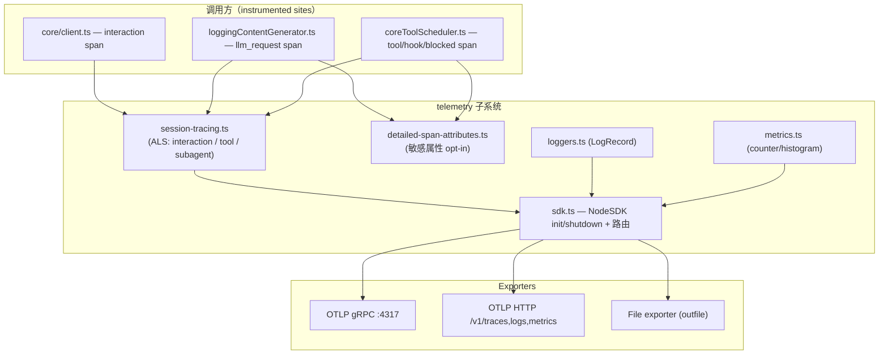
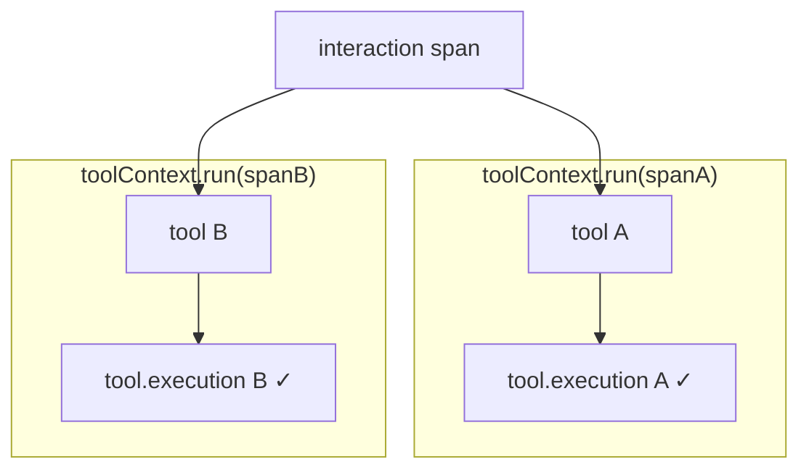

# qwen-code Telemetry：从事件埋点到一等公民可观测体系

> 技术分享 | qwen-code OpenTelemetry 可观测体系设计与实践

---

## 1. 背景与动机

qwen-code 是一个基于 TypeScript 的 CLI Agent，上游基线来自 Gemini CLI（Google）。上游的遥测只是「事件埋点」——通过 `@opentelemetry/api-logs` 发出一批平铺的 LogRecord（`user_prompt`、`tool_call`、`api_request`/`api_response` 等），再叠加一组 Metrics counter/histogram。这套埋点能回答「发生了什么、多少次、多少 token」，但回答不了三类关键问题：

**问题一：一次 prompt 的因果链在哪？** 用户一句话可能触发多次 LLM 请求，每次请求下挂多个 tool call，tool 内部还有审批等待、hook 执行、子 agent 调用。这些事件在旧模型里是平铺的 log，没有 parent/child 关系，无法在 trace 后端还原调用树。

**问题二：如何对接企业级 trace 后端？** 阿里云 ARMS 等企业后端支持 traces + metrics 但不支持 logs over OTLP，且使用非标准 signal 路径（如 `/api/otlp/traces`）。旧实现既没有 HTTP signal 路由，也没有 log→span 桥接。

**问题三：daemon 模式下 trace 断裂。** 当 qwen-code 以常驻 daemon（`qwen serve`）形态运行时，一次 prompt 横跨「客户端进程 → daemon HTTP server → ACP session → agent 推理循环」多个执行上下文，trace 在进程边界断裂。

这三个问题驱动了 epic #3731「Harden OpenTelemetry」——把遥测从「事件埋点」升级为「带因果结构、可对接外部后端、运行期安全」的一等公民可观测体系。

---

## 2. 整体架构

### 2.1 模块分层

整个 telemetry 子系统位于 `packages/core/src/telemetry/`，分为四层：

| 层 | 关键文件 | 职责 |
|---|---|---|
| SDK / 路由层 | `sdk.ts`、`file-exporters.ts`、`log-to-span-processor.ts` | NodeSDK 初始化/关闭；按 signal 路由到 gRPC/HTTP/file exporter |
| Span / 上下文层 | `session-tracing.ts`、`tracer.ts`、`session-context.ts` | 层级 span 创建/结束；AsyncLocalStorage 上下文传播 |
| 属性 / 语义层 | `detailed-span-attributes.ts`、`loggers.ts`、`metrics.ts` | 敏感属性写入；业务事件 LogRecord；metrics counter/histogram |
| daemon 层（`daemon_mode_b_main` 分支） | `daemon-tracing.ts`、`runtime-config.ts` | daemon route span；W3C traceparent 跨进程传播 |

### 2.2 架构图



### 2.3 Span 树总览

每次用户输入一句 prompt，qwen-code 生成如下层级 span 树：

```
qwen-code.interaction                         ← 一次用户回合
├─ qwen-code.llm_request                      ← 一次模型请求（流式/非流式）
│   └─ (UndiciInstrumentation HTTP span)      ← fetch 到 LLM provider
├─ qwen-code.tool                             ← 一次工具调用
│   ├─ qwen-code.tool.blocked_on_user         ← 等待用户审批
│   ├─ qwen-code.hook                         ← PreToolUse / PostToolUse hook
│   └─ qwen-code.tool.execution               ← 工具实际执行
└─ qwen-code.subagent                         ← 子 agent 调用
    ├─ qwen-code.llm_request                  ← 子 agent 内的模型请求
    └─ qwen-code.tool                         ← 子 agent 内的工具调用
```

当前设计中，同一 session 内所有 span 共享由 `SHA-256(sessionId)[:32]` 派生的确定性 traceId，使 debug log、log 桥接 span、真实 span 天然聚合到同一棵 trace 下。跨 prompt 的归属通过 `session.id` 和 `interaction.sequence` span 属性区分。

### 2.4 信号路由

三路 OTel 信号的路由策略：

- **`outfile` 优先级最高**：一旦设置，三个 signal 全部走 `FileSpanExporter` / `FileLogExporter` / `FileMetricExporter`，用于本地调试。
- **HTTP 模式**：支持 per-signal endpoint 覆盖（`otlpTracesEndpoint`、`otlpLogsEndpoint`、`otlpMetricsEndpoint`），可适配 ARMS 等使用非标准路径的后端。
- **gRPC 模式**（默认）：三个 signal 共用一个 base endpoint，统一 GZIP 压缩。

---

## 3. 核心设计亮点

### 3.1 AsyncLocalStorage 并发隔离

**问题**：qwen-code 支持模型同时发起多个 tool call 并发执行。如果并发的 tool A 和 tool B 共享上下文，A 创建的子 span（tool.execution、hook）可能被错误地挂到 B 下面——span 串属。

**方案**：使用三个 AsyncLocalStorage（ALS）实例做分层上下文管理：

```ts
const interactionContext = new AsyncLocalStorage<SpanContext>()  // 回合级
const toolContext         = new AsyncLocalStorage<SpanContext>()  // 工具级
const subagentContext     = new AsyncLocalStorage<SpanContext>()  // 子 agent 级
```

关键区别在于 ALS 的使用方式：

- **interaction**：用 `enterWith()`。interaction 是回合边界、由 client 串行驱动，进程级粘性可接受。
- **tool / subagent**：用 `run()`。`run()` 把上下文绑定到回调内的整棵异步调用树，并发的多棵树互不可见。



如果 tool 也用 `enterWith()`，并发 tool B 的 `enterWith` 会覆盖 tool A 设置的 store，A 的子 span 就会串到 B 下面。`run()` 基于 `async_hooks` 隔离每棵异步树，彻底消除了这个问题。

**权衡**：`run()` 隔离更强但要求把后续逻辑收进回调；`enterWith()` 写法更简单但不能并发。我们按实际并发需求选择，不一刀切。

### 3.2 敏感属性 opt-in 与 SHA-256 去重

**问题**：用户的 prompt、system prompt、工具入参/出参、模型输出都可能含 PII。默认写入 span 会造成数据安全风险。

**方案**：四层防线确保默认安全。

1. **配置层**：`includeSensitiveSpanAttributes` 默认 `false`，由 `config.ts:resolveTelemetrySettings` 中 `?? false` 保证。
2. **门控层**：`detailed-span-attributes.ts:isEnabled()` 同时检查 SDK 初始化状态和配置开关。
3. **写入层**：每个写入函数（`addUserPromptAttributes`、`addModelOutputAttributes` 等）独立检查门控，60KB 截断防止超大内容撑爆 span。
4. **桥接层**：`LogToSpanProcessor` 在 log→span 桥接时二次脱敏，对 `response_text` 等敏感字段再做过滤。

**SHA-256 去重**：system prompt 和 tool schema 在一个 session 内高度重复。进程级 `seenHashes: Set<string>` 按内容 SHA-256 去重——同一内容首次出现写全文，后续只写 hash 引用，既保留可关联性又控制体积。

```
首次：system_prompt = "You are..." (完整内容)
      system_prompt_hash = "a3f2c8..."
后续：system_prompt_hash = "a3f2c8..." (仅 hash，不重复写全文)
```

**权衡**：默认关闭牺牲了开箱即用的 trace 信息量，需要深度排障时显式 opt-in。但安全优先的设计使得上线前不需要逐条审计 span 内容。

### 3.3 TTFT 闭包采集与流式防泄漏

**问题**：Time to First Token（TTFT）是衡量 LLM 响应速度的核心指标。但 `LoggingContentGenerator` 实例在并发 stream 间共享——如果 TTFT 是实例字段，并发请求会互相覆盖。

**方案**：`ttftMs` 是 `loggingStreamWrapper` 方法内的**闭包变量**，每次调用生成独立的闭包作用域。在流式迭代中，遇到首个含用户可见内容的 chunk（跳过纯 role/usageMetadata chunk）时记录时间差。

TTFT 进一步派生出 `sampling_ms`（采样阶段耗时）和 `output_tokens_per_second`（输出吞吐），写入 `llm_request` span。

**流式防泄漏**：如果消费者放弃迭代而未调用 `.return()`，span 会泄漏。解决方案是 5 分钟空闲计时器（`STREAM_IDLE_TIMEOUT_MS`），每个 chunk 重置；超时后强制 `endLLMRequestSpan({success: false, error: 'Stream span timed out (idle)'})`，并用 `spanEndedByTimeout` 闸住后续的成功/错误日志，避免出现「span 已超时失败」与「api_response success」自相矛盾的记录。

### 3.4 出站 traceparent 与 OTLP 反馈环防护

**问题**：要在 trace 树中看到对 LLM provider 的请求耗时，需要出站 HTTP span。但如果同时也把 trace id 写进第三方请求的 header，会向 LLM provider 泄漏内部 trace id。更危险的是，OTLP exporter 自身的 HTTP 请求如果也被插桩，会产生 span → 触发上报 → 又产生 span 的无限反馈环。

**方案**：把两件事正交拆开。

1. **出站 client HTTP span**（始终开）：`UndiciInstrumentation` patch `globalThis.fetch`，创建出站 HTTP span。这样 trace 树能展示请求到 LLM provider 的真实耗时。
2. **wire 上的 traceparent**（默认关）：`sdk.ts` 默认装入 `NOOP_PROPAGATOR`（`inject` 为空操作），trace id 不写到第三方请求 header。需要与 DashScope 等 OTel 感知的 provider 做服务端 trace 缝合时，通过 `outboundCorrelation.propagateTraceContext` 显式 opt-in。

**反馈环防护**：`UndiciInstrumentation` 和 `HttpInstrumentation` 都配置了 `ignoreOutgoingRequestHook`，通过 `normalizeOtlpPrefix` + `matchesOtlpPrefix` 做边界安全的 origin+path 前缀匹配。只要出站请求的目标匹配 OTLP endpoint 的前缀，就跳过插桩——无论 endpoint 怎么配、路径怎么嵌套，都不会产生 span 自我上报的死循环。

### 3.5 span 防泄漏三板斧

**问题**：span 一旦创建但未 `end()`，就会在内存中累积，最终 OOM。在复杂的异步流程中，任何一个未处理的异常都可能导致 `end()` 被跳过。

**方案**：三层防御。

**第一层：幂等结束 + 属性/end 分离。** 每个 `end*Span` 遵循三段式：`ended` 幂等守卫 → try 内更新属性/status → 独立 try 内 `span.end()`。即使属性更新抛错，span 仍会结束。即使被调用两次，也只会执行一次。

**第二层：WeakRef + 强引用双表。** `activeSpans: Map<spanId, WeakRef<SpanContext>>` 做主索引（便于 GC），`strongSpans: Map<spanId, SpanContext>` 防止 WeakRef 被提前回收。span 结束时同时从两张表清除。

**第三层：30 分钟 TTL 安全网。** `sweepStaleSpans` 每 60 秒扫描，超过 `SPAN_TTL_MS = 30min` 未结束的 span 被强制 `end()`，并打上哨兵属性 `qwen-code.span.ttl_expired`，让后端能区分「被 TTL 回收」与「正常结束」。fork/background 子 agent 使用 4 小时的更长 TTL，适应长时间运行的场景。

---

## 4. 与 Claude Code 的对比

以上是 qwen-code 自身的设计。接下来横向对比另一个主流 AI 编程 Agent——Anthropic 的 Claude Code，看看面对相同的可观测性挑战，两个独立实现做出了怎样不同的设计选择。

### 4.1 并发隔离模型

| | qwen-code | Claude Code |
|--|-----------|-------------|
| tool 上下文管理 | `toolContext.run()` | `toolContext.enterWith()` |
| 并发 tool 安全性 | 每棵异步树独立隔离 | 后设置的 tool 会覆盖先设置的 |

Claude Code 的 `enterWith()` 意味着其假设 tool call 是串行执行的。这在 Claude 模型的 agent 编排下可能成立——但 qwen-code 需要支持并发 tool call（模型一次返回多个 tool_use），因此必须用 `run()` 做隔离。

这个差异的根源不是「谁写得更好」，而是**两者在 agent 编排架构上的不同假设**。qwen-code 的并发 tool 是设计上的一等公民，telemetry 必须跟上。

### 4.2 PII 控制

| | qwen-code | Claude Code |
|--|-----------|-------------|
| 核心机制 | 运行时多层开关（`?? false` 四层防御） | 编译期类型标记（`never` 类型强制 cast） |
| 去重策略 | SHA-256 content hash 去重 | SHA-256 content hash 去重 |
| 开关粒度 | 单一总开关 `includeSensitiveSpanAttributes` | 多个独立开关（`OTEL_LOG_USER_PROMPTS`、`OTEL_LOG_TOOL_CONTENT`、`OTEL_LOG_TOOL_DETAILS`） |
| MCP 工具名处理 | 直接记录 | 默认脱敏为 `'mcp_tool'`，避免暴露用户私有 server 配置 |

两种路径各有道理：Claude Code 用 TypeScript 的 `never` 类型（如 `AnalyticsMetadata_I_VERIFIED_THIS_IS_NOT_CODE_OR_FILEPATHS`）强制开发者在编译期审查每一个字符串是否含敏感数据，属于**静态保障**，安全性更高但开发成本也更高。qwen-code 用运行时开关做**动态门控**，更灵活、迭代更快，但需要靠代码审查确保每个写入点都过了门控。

值得注意的是，Claude Code 的多开关粒度设计（prompt、tool 内容、tool 名称分别控制）比 qwen-code 的单一总开关更精细。这在大规模运维场景下可以做到「只开放 tool 名称用于排障，不暴露 prompt 内容」，是一个值得借鉴的思路。

### 4.3 多 Agent 可观测

| | qwen-code | Claude Code |
|--|-----------|-------------|
| OTel span | `qwen-code.subagent` 一等公民 span | 无 subagent span |
| 并发隔离 | 第三个 ALS（`subagentContext`） | 无 OTel 级隔离 |
| 长任务处理 | fork/background 新 traceId + OTel Link 指回 invoker + 4h TTL | 无对应能力 |
| 可视化 | OTLP → ARMS/Jaeger（生产级） | Perfetto 进程映射（本地调试） |

这是两者差异最大的维度。

Claude Code 的 agent 可视化完全靠 **Perfetto 侧路**实现：每个 subagent 映射为独立的 Perfetto process（pid），在 `chrome://tracing` 或 `ui.perfetto.dev` 里呈现多泳道瀑布图。这套系统直观、美观，但有两个局限：仅限本地文件、Anthropic 内部专用（`feature('PERFETTO_TRACING')` 在外部构建中被 dead-code-eliminated）。在 OTel 层面，Claude Code 的 `sessionTracing.ts` 不包含任何 subagent 相关代码——并发 agent 的 span 会平铺在 interaction 下，无法区分归属。

qwen-code 选择了 OTel 原生路径：`qwen-code.subagent` 是带完整生命周期的 span，用 `subagentContext` ALS 做并发隔离，子 agent 内部的 llm_request/tool/hook 自动 parent 到 subagent span 下。对于 fork/background 类型的长运行子 agent，设计了 OTel `Link` 机制——新 traceId 保持 trace 树轻量，Link 指回 invoker 保持可追溯性。

**各自的道理**：Claude Code 的 Perfetto 方案为内部开发者提供了开箱即用的本地可视化体验，无需部署任何后端；qwen-code 的 OTel 原生方案面向生产环境，数据直接进 ARMS/Jaeger，支持团队协作排障和告警。两者解决的是同一个问题的不同场景。

### 4.4 确定性 traceId 与 trace 规模控制

| | qwen-code | Claude Code |
|--|-----------|-------------|
| traceId 策略 | `SHA-256(sessionId)[:32]` 确定性派生 | 由 OTel SDK 自动分配（每个 span 随机） |
| 设计目标 | debug log / 桥接 span / 真实 span 共享同一 trace | 标准 OTel 行为 |
| 已知挑战 | 长 session 的 trace 树 span 数过多，后端 UI 渲染困难 | 无此问题（trace 粒度更小） |

qwen-code 选择了确定性 traceId 派生：`deriveTraceId(sessionId) = SHA-256(sessionId)[:32]`，使得同一 session 内所有 span 共享同一 traceId。这个设计的优点是 debug log（`getTraceContext()`）、log→span 桥接、真实 OTel span 天然聚合到同一棵 trace 下——无论通过哪条路径产生的数据，在 trace 后端都能一键查到。

但长 session 的 trace 树规模是一个实际挑战：十几轮对话后 trace 树可能有几百到上千个 span，ARMS 和 Jaeger 的 trace 详情页加载会变慢甚至超时。PR #4661 已完成 per-prompt traceId 的改造（每个 interaction 以 `ROOT_CONTEXT` 为 parent 获得独立 traceId），目前在 `daemon_mode_b_main` 分支上验证，尚未合入 main。

这个演进体现了「理论优雅 vs 实践可行」的典型权衡：确定性 traceId 在逻辑上很干净，但 trace 后端的 UI 渲染能力是一个隐性约束。

### 4.5 出站 HTTP 插桩与反馈环防护

| | qwen-code | Claude Code |
|--|-----------|-------------|
| HTTP 自动插桩 | `UndiciInstrumentation` + `HttpInstrumentation` | 无 |
| 出站 span | 始终创建，trace 树包含对 LLM provider 的请求耗时 | trace 止步于客户端进程边界 |
| traceparent 传播 | 默认关（`NOOP_PROPAGATOR`），opt-in 开启 | 不传播 |
| 反馈环防护 | origin+path 边界安全前缀匹配 | 不需要（无插桩） |

Claude Code 选择完全不做出站 HTTP 插桩——它自身就是 Claude API 的客户端，不需要与自家后端做 trace 缝合。

qwen-code 面向多家 LLM provider（DashScope、OpenAI 兼容 API 等），出站 HTTP span 提供了宝贵的网络层可见性——可以看到请求排队、TLS 握手、首字节等真实耗时。同时 traceparent 的 opt-in 设计为「端到端 trace 缝合」保留了可能性，已在 DashScope + ARMS 场景下验证。

### 4.6 指标哲学

| | qwen-code | Claude Code |
|--|-----------|-------------|
| 核心指标方向 | 系统性能（token usage、API latency、tool duration） | 业务成果（PRs created、commits、lines of code、cost in USD） |
| 指标数量 | 几十个（含 arena、memory、subagent、startup 等） | 8 个核心 counter |
| session.id 上 metric | **默认不上**（opt-in） | **默认上** |
| 采样控制 | 环境变量启发式 | GrowthBook per-event 采样率 |

这个差异反映了产品阶段和运维需求的不同。Claude Code 关心的是「用户用我做了什么」——PR 数、commit 数、花了多少钱，这些是产品增长和计费的核心指标。qwen-code 关心的是「系统运行得怎么样」——API 延迟分布、tool 执行耗时、token 效率，这些是工程优化和故障排查的核心指标。

在基数控制上，qwen-code 更保守：`session.id` 默认不上 metric data point（每个 session 是唯一值，默认带会导致时序无限 fan-out），需要运维者显式 opt-in。Claude Code 则默认带上 `session.id`，在 BigQuery 这类列存引擎下高基数的成本更可控。

---

## 5. 踩过的坑

### 5.1 Log-to-Span 桥接的默认值陷阱

`LogToSpanProcessor` 的设计目标是在后端不支持 OTLP logs 时，把 LogRecord 桥接为 span 经 traces 通道发出。触发条件是「有 traces endpoint 但无 logs endpoint」。

但 `config.ts` 中 `getTelemetryOtlpEndpoint()` 的实现是 `otlpEndpoint ?? DEFAULT_OTLP_ENDPOINT('http://localhost:4317')`——永不为 `undefined`。叠加默认 gRPC 协议（gRPC 分支无条件创建 logExporter），桥接条件永远不满足。

结果是一个精心设计的桥接机制在默认配置下是**死代码**。只有显式配置 `protocol=http` + 仅配 traces endpoint 的极端场景才能触发。

**教训**：默认值的「便利性」和「条件判断的可达性」之间存在张力。给配置项设默认值时，要追踪它对所有条件分支的影响。

### 5.2 response_text PII 泄漏面

`loggers.ts:logApiResponse` 在写入模型输出 `response_text` 时不检查 `includeSensitiveSpanAttributes` 开关——只要 `response_text` 存在就直接写入 LogRecord 属性。对比之下，同样的内容通过 `addModelOutputAttributes` 写入 span 时是受门控的。

唯一的护栏是 `LogToSpanProcessor` 的 `SENSITIVE_ATTRIBUTE_KEYS` 二次脱敏——但这只在 log→span 桥接路径生效；直连 OTLP logs 后端时 `response_text` 会原样上行。

**教训**：同一份数据通过不同路径写入时，每条路径都要独立过门控。不能假设「另一条路径会兜底」。

### 5.3 双镜像的同步约束

`session-tracing.ts:resolveParentContext` 和 `tracer.ts:getParentContext` 是同一个 parent 解析算法的两份实现——前者用于 `start*Span`，后者用于 `withSpan` / `startSpanWithContext`。两处用 `// SYNC:` 注释互相约束。

如果其中一处修改后忘了同步另一处，就会出现 span 树部分扁平化（某些 span 挂到了错误的 parent 下），而且这种 bug 只有在 trace 后端看 span 树结构时才能发现，单元测试很难覆盖。

**教训**：如果两份代码必须保持同步，应该尽早抽取为单一实现。注释约束是权宜之计，不是长期方案。

---

## 6. 效果与展望

### 6.1 当前效果

接入 ARMS 后，qwen-code 的每一次 prompt 交互都能在 trace 后端还原完整的调用链：

- **性能排查**：通过 `llm_request` span 的 `ttft_ms` 和 `sampling_ms` 快速定位是首 token 慢还是采样慢。
- **工具调试**：`tool.blocked_on_user` span 清晰展示用户审批等待的时间占比，帮助优化审批流程。
- **并发分析**：subagent span 的独立 traceId + Link 机制让后台子 agent 的行为可追踪而不污染主 trace 树。
- **跨进程追踪**（`daemon_mode_b_main` 分支）：daemon 模式下通过 `_meta` 透传的 W3C traceparent 把客户端和服务端缝合进同一棵 trace。

### 6.2 后续方向

- **session-id header 传播**：PR #4393（出站透传 `X-Qwen-Code-Session-Id`）已关闭，跨进程的 session 级关联仍需 collector 侧反查。后续考虑在合适的时机重新推进。
- **桥接可达性修复**：让 `LogToSpanProcessor` 在更多配置组合下可达，覆盖「ARMS 只支持 traces」的主流场景。
- **PII 门控补齐**：统一 `response_text` 在 LogRecord 和 span attribute 两条路径上的门控逻辑。
- **per-prompt traceId 合入**：PR #4661（per-prompt 独立 traceId）已在 `daemon_mode_b_main` 分支上验证，合入 main 后将解决长 session trace 树过大的问题。
- **resolveParentContext 去重**：将两份镜像实现合并为单一入口，消除同步约束。

---

## 小结

qwen-code 的 telemetry 从上游 Gemini CLI 的平铺事件埋点起步，经过 25+ PR 的迭代，构建了包含层级 span 树、ALS 并发隔离、敏感属性 opt-in、出站 HTTP 插桩、subagent 原生 span 等能力的完整可观测体系。与 Claude Code 的横向对比表明，面对相同的可观测性挑战，不同的产品定位和架构假设会导向截然不同的设计选择——没有绝对的好坏，只有适合与否。

遥测系统的核心设计原则始终是：**绝不影响业务请求处理**。所有 telemetry 代码都包在 try/catch 中、所有 span 都有防泄漏兜底、所有敏感数据都默认关闭。在这个前提下，再追求信息量最大化和与外部生态的对接能力。
