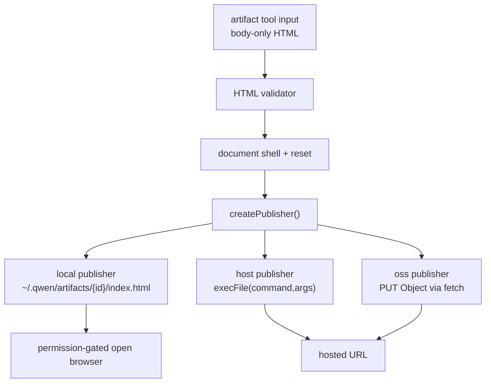

# Artifact 工具技术方案

> 适用范围：`QwenLM/qwen-code` core Artifact tool。
> 涉及 PR：#5557（add Artifact tool to publish interactive HTML pages）、#5615（backend-aware publish confirmation + cancel handling）、#5617（artifact auto-open setting）。
> 状态：2026-06-22 已合入；上周 PR 口径中属于 W25 创建、06-22 合入的跨周尾部 PR。

---

## 1. 背景与动机

有些 agent 输出更适合作为可交互页面，而不是终端里的长文本：架构导览、PR walkthrough、临时 dashboard、单页小工具等。Artifact tool 让模型把一段自包含 HTML 发布成页面，并在用户授权后打开。

设计目标是“本地优先，可显式托管”：

- 默认 `local` publisher 写入 `~/.qwen/artifacts/{id}/index.html`，打开 `file://` URL，不访问网络。
- 可选 `host` publisher 运行用户配置的命令，把 `{file}` / `{key}` 作为 `execFile` 参数传入。
- 可选 `oss` publisher 用环境变量中的 Aliyun OSS 凭据上传对象。
- 功能默认关闭，通过 `experimental.artifact` 或 `QWEN_CODE_ENABLE_ARTIFACT=1` 开启；`QWEN_DISABLE_ARTIFACT=1` 硬关闭。
- `artifact.autoOpen` 可控制发布后是否自动打开浏览器；环境变量 `QWEN_ARTIFACT_NO_AUTO_OPEN=1` 仍优先。

---

## 2. 整体架构

核心路径：

| 子系统 | 作用 | 代表路径 |
|---|---|---|
| 工具注册 | opt-in 后把 `artifact` 注册进 core tool registry | `packages/core/src/tools/artifact/artifact-tool.ts` |
| HTML 处理 | 要求 body-only，补 document shell，拒绝外部资源 | `packages/core/src/tools/artifact/html.ts` |
| 发布器 | local / host / oss 三种 publisher | `local-publisher.ts`、`host-publisher.ts`、`oss-publisher.ts` |
| 配置与门控 | experimental flag、禁用 env、settings schema、权限确认 | `config.ts`、`settingsSchema.ts` |

---

## 3. 关键实现

### 3.1 输入校验

工具要求模型传入 body-only HTML fragment。发布前会补齐完整 HTML shell 与最小 reset，并做自包含校验：

- 拒绝 `<html>` / `<head>` / `<body>` 这类完整文档 wrapper。
- 拒绝外链 script、stylesheet、image、protocol-relative URL。
- 拒绝超过 16 MB 的页面。

这让本地和托管 artifact 都不隐式拉取第三方资源，也降低用户授权后打开浏览器时的外部面。

### 3.2 稳定 artifact identity

artifact id 以 source file path 为 key：同一个 source 再发布会更新同一个 artifact，不同 source 生成不同 id。这适合“模型先写一个 HTML 文件，再发布/迭代”的工作流，也避免同一页面每次重发都产生新目录。

### 3.3 publisher 三态

| Publisher | 行为 | 风险控制 |
|---|---|---|
| `local` | 写 `~/.qwen/artifacts/{id}/index.html`，返回 `file://` | 默认路径，无网络访问 |
| `host` | 运行用户配置命令，传 `{file}` / `{key}` 参数 | 用 `execFile`，不经 shell 展开 |
| `oss` | 通过内置 `fetch` 上传 Aliyun OSS | 凭据从环境变量读取，不写入 settings |

非交互和 SDK session 默认不可用，避免 headless 执行里静默发布或打开浏览器。

### 3.4 发布确认与 auto-open

#5615 把发布确认文案改成 backend-aware：`local` 仍明确为本地 file URL；`host` / `oss` 会提示用户页面将上传到远端 host/OSS，避免用户把“发布”误理解为纯本机动作。这个 PR 同时把用户主动取消（aborted signal / `AbortError`）从“发布失败”中区分出来，返回 cancellation 语义，避免 UI 和日志误报错误。

#5617 新增 `artifact.autoOpen` settings/schema。当它为 `false` 时，Artifact 仍会发布成功，但不会自动打开浏览器；`QWEN_ARTIFACT_NO_AUTO_OPEN=1` 继续作为更高优先级的环境变量覆盖。确认文案会根据 auto-open 状态说明是否会打开浏览器。

---

## 4. 涉及 PR

| PR | 状态 | 作用 |
|---|---|---|
| #5557 | merged | 新增 experimental `artifact` tool、HTML validator、local/host/oss publishers、配置 schema、core 导出和单测。 |
| #5615 | merged | 发布确认文案按 backend 区分本地/远端托管；用户取消发布时返回 cancellation 而不是 failure。 |
| #5617 | merged | 新增 `artifact.autoOpen` 设置和 schema，保留 `QWEN_ARTIFACT_NO_AUTO_OPEN` 环境变量优先级。 |

---

## 5. 已知限制 / 后续

1. **没有托管服务或权限系统**。`host` / `oss` 都是用户自管；团队 ACL、artifact gallery、分享链接生命周期不在本次范围。
2. **HTML validator 故意保守**。外部资源和完整文档 wrapper 会被拒绝，换来本地预览和托管输出更可控。
3. **Windows 路径和 opener 行为仍需实机关注**。PR 主要由单测覆盖 publisher 与 HTML 逻辑，跨平台浏览器打开体验需要后续验证。

_新增于 2026-06-23；更新于 2026-06-24_
