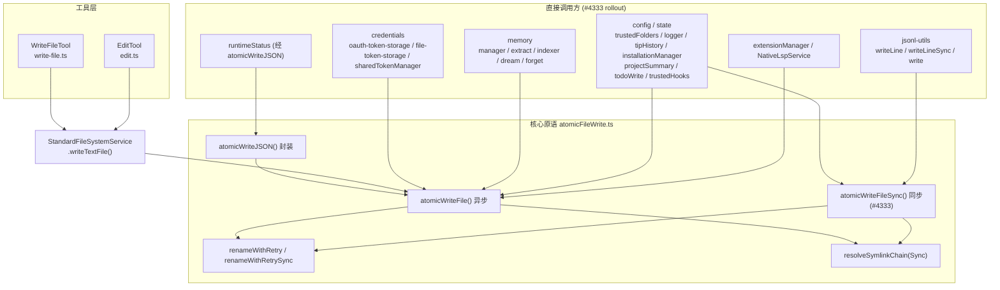
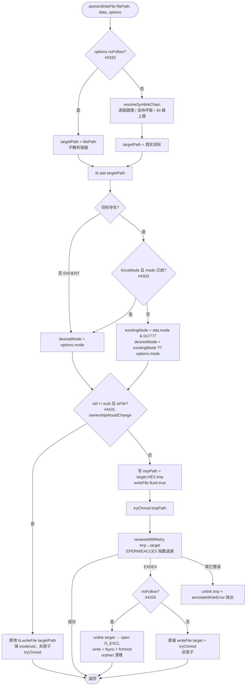
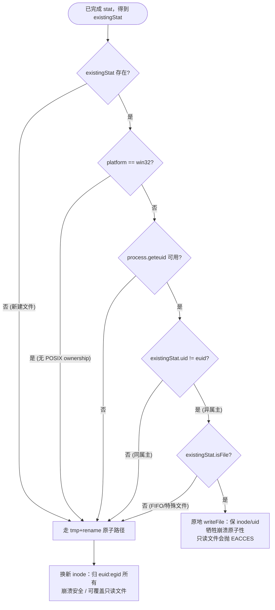
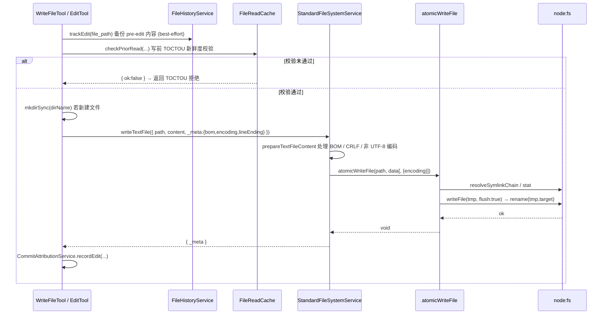

# 原子文件写技术方案

> 适用代码库：`QwenLM/qwen-code`（TypeScript CLI agent）
> 涉及 PR：#4096（MERGED，Phase 1）、#4333（MERGED 2026-06-02，Phase 2 rollout）、#4431（MERGED 2026-06-01，uid 保留修复）
> 关联 issue：#4095（atomic write & transaction rollback）、#3681（JSONL reader/writer follow-ups）
> 核心源文件：`packages/core/src/utils/atomicFileWrite.ts`

---

## 1. 背景与动机

### 1.1 问题：stat-then-write 不是原子的

qwen-code 的 Write / Edit / NotebookEdit 工具最终都落到一次“先 stat 校验、再 `fs.writeFile` 覆盖”的写入。该模式存在两个无法用纯应用层逻辑消除的缺陷：

1. **TOCTOU 覆盖竞态**：在新鲜度校验（freshness check）和真正写入之间，外部进程对同一文件的并发写入会被静默覆盖。`write-file.ts` 在 `WriteFileTool.execute` 的注释里直接承认了这一点：

   > "It does NOT eliminate the race ... the only way to close it is an atomic write (write-to-temp + rename) or a content-hash post-check ... Both are deferred to a follow-up."
   > —— `packages/core/src/tools/write-file.ts:402-411`（`edit.ts:489-518` 有等价注释）

2. **崩溃半写（torn write）**：`fs.writeFile` 对已存在文件做 truncate + 顺序写。若进程在写到一半时被 `kill -9` / OOM / 断电 / 杀软扫描卡住 rename / 文件系统中途卸载，磁盘上会留下被截断的半个文件。对于结构化文件这意味着永久损坏：
   - **credentials**：OAuth token JSON 半写 → 下次启动解析失败、需重新登录；
   - **config / trust-folder**：信任目录配置损坏 → 安全降级或启动报错；
   - **JSONL 会话记录**：append 被打断会在磁盘上留下粘连的 `}{` 坏记录（issue #3681），导致整段会话 transcript 无法被 reader 解析。

### 1.2 解决思路：write-to-temp + rename

POSIX `rename(2)` 在同一文件系统内是原子的——目标路径要么指向旧 inode、要么指向新 inode，不存在中间态。因此“写临时文件 → fsync → 原子 rename 覆盖目标”能同时关闭上述两个问题：并发读者永远看到完整的旧版或完整的新版；崩溃后磁盘上要么是旧文件、要么是新文件，绝不会是半个文件。

issue #4095 把这件事拆成两期：
- **Phase 1（#4096，已合入 v0.16.0）**：实现通用原语 `atomicWriteFile`，接入 `FileSystemService`，使所有 Write/Edit 工具写入原子化。
- **Phase 2（#4333，MERGED 2026-06-02）**：把 credentials / memory / config / JSONL 等安全敏感、数据完整性敏感路径里残留的裸 `fs.writeFile` / `appendFile` 全部迁移到原子助手，并关闭 #3681。
- **回归修复（#4431，MERGED 2026-06-01）**：#4096 引入的 rename 换 inode 行为会丢失原文件 uid，破坏 Docker / 共享工作区场景，需补 uid 保留分支。

---

## 2. 整体架构

原子写能力以一个无状态纯函数原语为核心，向上经 `FileSystemService` 接口被工具层复用，同时被一批“数据完整性敏感”的写入点直接调用。



要点：
- 工具层不直接依赖原语，而是通过 `FileSystemService` 接口（`packages/core/src/services/fileSystemService.ts:52`）解耦，便于 ACP / 远程文件系统替换实现。
- `atomicWriteJSON`（`atomicFileWrite.ts:193`）只是 `JSON.stringify(…, 2)` + `atomicWriteFile` 的薄封装，#4096 重构后它顺带获得了之前缺失的 fsync。
- 同步原语 `atomicWriteFileSync`（#4333 新增）用于无法 await 的场景（如 `process.exit` 前的设置持久化、JSONL 全量重写）。

---

## 3. 核心原语详解

以下锚点中，未标注 PR 的为 `main`（即 #4096 已合入版本）；标 `(#4333)` / `(#4431)` 的为对应 PR 的 `gh pr diff` 内容。

### 3.1 temp + rename 原子性

`atomicWriteFile(filePath, data, options)`（`atomicFileWrite.ts:113`）的 happy path：

```
tmpPath = `${targetPath}.${randomBytes(6).hex}.tmp`   // L125，与目标同目录
fs.writeFile(tmpPath, data, writeOptions)             // L160
tryChmod(tmpPath)                                      // L161
renameWithRetry(tmpPath, targetPath, retries, delayMs) // L162
```

- 临时文件名带 6 字节随机后缀，避免并发写者互相踩踏。
- 临时文件与目标**同目录**（`${targetPath}.…`），保证 rename 在同一文件系统内（这一点也是 §7 “EXDEV 死代码”的根因）。
- `renameWithRetry`（`atomicFileWrite.ts:32`）对 `EPERM` / `EACCES` 做指数退避重试（默认 3 次、基线 50ms，`delayMs * 2 ** attempt`）。这是为 Windows 下杀软/索引器临时占用文件句柄设计的——POSIX rename 本身不需要重试，但 Windows 的 `MoveFileEx` 在并发访问下会瞬时报 `EPERM`。
- 失败路径统一 `fs.unlink(tmpPath)` 清理临时文件（`L165-169`），不留垃圾。
- #4333 把 `renameWithRetry` 增加了 `_renameImpl` 测试缝（默认 `fs.rename`），并新增同步镜像 `renameWithRetrySync`，其退避用 `blockingSleep`（基于 `Atomics.wait(Int32Array, …)` 的真实阻塞睡眠，非 busy-wait）。

### 3.2 fsync（flush）持久性

仅 rename 原子还不够——`fs.writeFile` 默认只把数据写进内核页缓存，rename 元数据也可能尚未落盘，断电后仍可能丢数据。原语默认开启 fsync：

```
const flush = options?.flush ?? true;                 // atomicFileWrite.ts:120
if (flush) writeOptions.flush = true;                 // L146 → fs.writeFile 的 flush 选项
```

`flush: true` 是 Node v22+ 才有的 `fs.writeFile` 选项（#4096 顺带把 `@types/node` 升到 `^22`，既匹配 engine 要求也启用该类型）。它在底层对临时文件做 `fsync` 后再返回，从而保证 rename 时数据已在物理介质上。

> 注意：JSONL 的 append（§见 jsonl-utils）也走 `flush: true`，但 `debugLogger` 的 appendFile **故意不 flush**（见 §5、§7）。

### 3.3 mode 保留与 forceMode 防降级

默认行为是**保留目标既有权限位**，避免把一个 0o600 的敏感文件重写成 umask 默认的 0o644：

```
const stat = await fs.stat(targetPath);
existingMode = stat.mode & 0o7777;   // atomicFileWrite.ts:128-131，掩掉文件类型位
const desiredMode = existingMode ?? options?.mode;   // L138：既有优先，否则用调用方 mode
```

`tryChmod`（`L150`）在 writeFile 之后再 chmod 一次，因为当目标已存在时 `fs.writeFile` 会忽略 `mode` 选项。`main` 版本对 chmod 失败一律吞掉（兼容 FAT/exFAT 无 POSIX 权限）。

**#4333 的两项强化：**
1. **`forceMode` 选项**：忽略目标既有权限、强制应用 `options.mode`。用于 credentials——一个历史上被备份还原成 0o644 的 token 文件，下次写入时应被“治愈”回 0o600。其守卫被刻意收紧为 `if (!options?.forceMode || options?.mode === undefined)` 才去 stat 既有 mode——否则 `forceMode: true` 但没给 `mode` 会静默把文件降级到 umask 默认（这是 Codex review round-1 抓到的 latent bug）。
2. **chmod 失败收窄**：`tryChmod` 只吞 `ENOSYS` / `ENOTSUP`（FAT/exFAT 签名），其余如沙箱 `EPERM`、瞬时 `EIO`、只读 `EROFS` 一律抛出——因为在 EXDEV 非 noFollow 回退路径上 chmod 是设置敏感文件权限的唯一手段，静默失败会留下权限错误的 credential 文件。

### 3.4 符号链接链解析与逃逸防护

```
const targetPath = await resolveSymlinkChain(filePath);   // atomicFileWrite.ts:123
```

`resolveSymlinkChain`（`atomicFileWrite.ts:62`）逐跳跟随 symlink 至最终目标，**支持坏链（broken link）**（`fs.realpath` 在目标不存在时会抛 ENOENT，此处对 ENOENT 返回当前路径以支持“透过坏链创建文件”）。最多 40 跳（POSIX `SYMLOOP_MAX`），超限抛 `ELOOP`。相对链接目标用**内核解析后的父目录** realpath 再 resolve（`L85`），避免中间路径组件本身是目录 symlink 时的字符串误算。

这样设计的语义是：**写穿到真实目标、保留 symlink 本身**——`atomicWriteFile(link)` 更新 `link` 指向的真实文件，`link` 仍是 symlink（#4096 的 E2E 测试 Test 3/4/5 验证了这点）。

**#4333 的 `noFollow` 选项**针对这一默认行为的安全回归：迁移前 credentials 用的是 `fs.rename(tmp, filePath)`，rename **原子地把 symlink 替换成新的普通文件**。而默认的 resolveSymlinkChain 是“写穿”——在共享主机上，攻击者预先放置一个 symlink 就能把 token 重定向到攻击者可控路径。因此所有 credential 写入点传 `noFollow: true`，恢复“替换 symlink”语义：

```
const targetPath = options?.noFollow
  ? filePath                                   // 不解析，直接写/替换链接本身
  : await resolveSymlinkChain(filePath).catch(...)   // #4333
```

### 3.5 EXDEV 跨设备回退

当 rename 的源/目标跨文件系统时内核返回 `EXDEV`，rename 不可用，回退为直接写：

```
if (isNodeError(error) && error.code === 'EXDEV') {
  await fs.writeFile(targetPath, data, writeOptions);   // atomicFileWrite.ts:172-175（main）
  await tryChmod(targetPath);
  return;
}
```

**#4333 强化了 noFollow 下的 EXDEV 回退**：朴素的 `writeFile(targetPath)` 会跟随 symlink，破坏 noFollow 语义。新逻辑先 `unlink` 既有项（匹配 rename happy path 替换 symlink 的行为），再用 `O_WRONLY | O_CREAT | O_EXCL` 打开——`O_EXCL` 拒绝写穿一个竞态重新出现的 symlink；写完用打开的 fd 做 `fchmod`（而非 path-based chmod，避免 close 与 chmod 之间的 symlink swap 把 0o600 打到攻击者目标上）。`O_EXCL` 创建后若 write/sync/fchmod 任一失败，清理 orphan 以免下次重试死锁在 `EEXIST`。同步版 `atomicWriteFileSync` 用 `writeFileSync(fd, buf)`（内部循环直到写完，避免 `writeSync` 短写截断 credential）做了对称实现。

> 重要：EXDEV 回退路径**非原子**——崩溃可能留下半写文件。但见 §7，由于 tmp 与 target 同目录，该分支在当前实现下实际不可达。

### 3.6 uid/gid 保留（#4431 inode-preserve in-place 方案）

#4096 的纯 rename 方案有个被 v0.16.0 用户实测到的回归：POSIX rename 创建的新 inode 归调用进程的 `euid:egid` 所有，于是 qwen-code 每次 Write/Edit 都会**静默剥夺原文件的 uid**。两个真实场景因此崩坏：
1. **共享工作区**：别人拥有的文件被改成 qwen-code 用户所有，协作者失去写权限；
2. **Docker + 宿主 IDE**：容器内以 root 跑 qwen-code 改 bind-mount 源码，每个被碰过的文件在宿主侧变成 `root:root`，宿主 IDE（以宿主用户运行）再也无法写入。

#4431 的修复：**当既有文件 uid 与进程 euid 不同时，回退为原地 `writeFile`（truncate 既有 inode）而非 rename**，以保留 uid（代价是该次写入失去崩溃原子性）。

```
// atomicFileWrite.ts （#4431 diff）
const ownershipWouldChange = (): boolean => {
  if (existingStat === undefined) return false;
  if (process.platform === 'win32') return false;
  const euid = process.geteuid?.();
  if (euid === undefined) return false;
  return existingStat.uid !== euid;     // 只比 uid，不比 gid
};

if (existingStat !== undefined && existingStat.isFile() && ownershipWouldChange()) {
  await fs.writeFile(targetPath, data, writeOptions);   // 原地写，保 inode/uid
  await tryChmod(targetPath);
  return;
}
```

关键设计点：
- **只比 uid，不比 gid**：macOS 上新文件继承父目录 GID（`/tmp` → `wheel`，而 `process.getegid()` → `staff`），`egid !== file.gid` 在最常见的开发平台上是 false positive。uid 不匹配才是上述两个真实场景的可靠信号。
- **`isFile()` 守卫**：FIFO/特殊文件不走原地回退——对 FIFO 做 `open(O_WRONLY|O_TRUNC)` 会永久阻塞等读者；rename 路径反而把 FIFO 替换成普通文件，这才是“写到这个路径”的合理语义。
- **root 也走原地回退**：原本有个“rename + chown 改回”的优化，但 `chown` 在 user-namespaced / 剥了 `CAP_CHOWN` 的容器里静默失败（正是上面的 Docker 场景），故统一走原地回退，消除该失败模式和一个不可测分支。
- 需要保留既有 `Stats` 对象（`import type { Stats }`），因为 mode 计算与 ownership 判断共用同一次 `fs.stat`。

---

## 4. 关键流程

### 4.1 `atomicWriteFile` 写入决策流程（含 #4333 / #4431 分支）

> 下图为 #4333 与 #4431 合并后的**目标态**逻辑（两者已合入 main（2026-06），见 §7）。标注了各分支来源 PR。



### 4.2 #4431 `ownershipWouldChange`：rename vs 原地写判定



### 4.3 Write/Edit 工具 → FileSystemService → atomicWriteFile 调用链



锚点：`write-file.ts:460` 与 `edit.ts:582 / 590` 调用 `getFileSystemService().writeTextFile(...)`；`StandardFileSystemService.writeTextFile`（`fileSystemService.ts:278`）内部按 `Buffer.isBuffer(prepared.data)` 分流调 `atomicWriteFile`（`L284` / `L286`）。

---

## 5. 关键设计决策与权衡

| 决策 | 取舍 | 依据 |
|---|---|---|
| **rename 换 inode** | 得到崩溃原子性 + 并发读者隔离；代价是丢 uid/gid、且 rename 仅需父目录写权限故能覆盖只读文件 | #4096 引入；#4431 用 uid-mismatch 原地回退修 uid |
| **默认 fsync（flush:true）** | 每次写多几 ms 落盘延迟；换断电持久性 | `atomicFileWrite.ts:120,146` |
| **debug log 故意不 fsync** | 1050+ 调用点、默认开启、fire-and-forget；逐行 fsync 会造成持续 I/O 压力 / SSD 磨损，且崩溃丢最后几百 ms 调试输出可接受 | `debugLogger.ts:148-156` 注释，仅靠内核页缓存 |
| **credentials：0o600 + forceMode + noFollow** | 治愈历史过宽权限文件；防共享主机 symlink 重定向窃取 token | `oauth-token-storage.ts` / `file-token-storage.ts` / `sharedTokenManager.ts` |
| **forceMode 防权限降级** | 守卫要求同时给 `mode`，否则回退到保留模式，避免静默降级到 umask | #4333 Codex round-1 修复 |
| **EXDEV 回退非原子** | 跨设备时放弃原子性换可用性；noFollow 下用 O_EXCL+fchmod 尽量保安全语义 | `atomicFileWrite.ts:172`（main）/ #4333 O_EXCL 分支 |
| **同步原语用 Atomics.wait 阻塞睡眠** | 在不能 await 的退出路径上做退避，避免 busy-wait 烧 CPU | #4333 `blockingSleep` |
| **credential 写不再包 withTimeout** | rename 不可中断；withTimeout 超时会 reject 调用方但 rename 仍在后台跑，释放锁后另一进程写新 token，旧 atomicWriteFile 完成 rename 又覆盖回旧 token（静默回滚） | #4333 round-3 修复 `sharedTokenManager.saveCredentialsToFile` |
| **annotateWriteError 前缀目标路径** | syscall 错误通常引用随机 `.tmp.<hex>` 路径，对 incident response 无用；改为前缀逻辑目标路径，且幂等（按 `${fnName}(` 前缀判重，不用易误判的 `includes(targetPath)`） | #4333 |
| **LSP 编辑前显式 `access(W_OK)`** | rename 仅需父目录写权限，会绕过文件级只读位静默替换 0444 文件；显式 W_OK 检查恢复 pre-Phase-2 的 EACCES 行为，仅 ENOENT 放行（允许 LSP 创建新文件） | #4333 `NativeLspService.applyTextEdits` round-2 |

---

## 6. 涉及 PR

| PR | 状态 | 子主题 | 作用 |
|---|---|---|---|
| **#4096** | MERGED (v0.16.0) | 通用原语 + 工具接入 | 新增 `atomicWriteFile`（temp+rename / fsync / mode 保留 / symlink 链解析 / EXDEV 回退 / FAT chmod 容忍）；接入 `StandardFileSystemService.writeTextFile`，Write/Edit 全部原子化；`atomicWriteJSON` 改为委托原语（补回 fsync）；从 `runtimeStatus.ts` 去重 `renameWithRetry`；`writeWithBackupSync` 加 `flush:true`；升 `@types/node` 到 `^22` |
| **#4333** | MERGED | rollout（closes #3681, #4095 Phase 2） | 新增 `atomicWriteFileSync` + `forceMode` + `noFollow` + O_EXCL/fchmod EXDEV 回退 + `annotateWriteError` + 测试缝；迁移 credentials（0o600+forceMode+noFollow）、memory、config/state、JSONL（`writeLine`/`writeLineSync` flush、`write` 全量重写走 sync 原子）、extensionManager、NativeLspService（W_OK 检查）；含 3 轮 Codex review latent-bug 修复 |
| **#4431** | MERGED | uid 保留（修 #4096 回归） | uid 与 euid 不同且为普通文件时回退原地 `writeFile` 保 inode/uid；只比 uid 不比 gid；root 也走原地（弃 chown 优化）；JSDoc 记录崩溃原子性/读者隔离/watcher 语义/EACCES 四项取舍 |

> #4095 = atomic write & transaction rollback（总 issue）；#3681 = JSONL reader/writer follow-ups（由 #4333 关闭）。

---

## 7. 已知限制 / 后续

1. **#4333 与 #4431 已先后合入 main**（2026-06-01/02）。此前为平行 PR，在 `atomicFileWrite.ts` 上有冲突，已在合并时 rebase 解决。§4 的流程图现为实际落地状态。

2. **#4431 只按 uid 触发，gid 在非 setgid 目录仍会丢**。原地回退仅在 `uid != euid` 时启用；若文件 uid 与进程相同但带一个非默认 gid，且父目录非 setgid，rename 新 inode 的 gid 会被设为进程 egid（macOS 上则继承父目录 gid）——这部分 gid 丢失未被覆盖。设计上接受此 false-negative，换取 macOS 不误触发。

3. **非 root 写只读文件现在抛 `EACCES`（行为变更，release-note 候选）**。两处都引入了这一变化：
   - #4431 原地回退尊重文件 mode，对只读文件 surface `EACCES`（rename 旧路径仅需父目录写权限，会静默替换用户无权写的文件）；
   - #4333 `NativeLspService.applyTextEdits` 对 `chmod 0444` 文件先 `access(W_OK)` 检查再写，恢复 pre-Phase-2 的 EACCES。
   两者都把“原子 rename 静默绕过文件级写权限”这一隐性提权行为改成显式失败，但对依赖旧行为的脚本是 breaking change。

4. **EXDEV 回退实为死代码**。`tmpPath = ${targetPath}.<hex>.tmp` 与 `targetPath` **永远同目录**（`atomicFileWrite.ts:125`），同目录的 rename 必然同文件系统，内核不会返回 `EXDEV`。因此 `L172` / #4333 的 O_EXCL 回退分支在当前 tmp 放置策略下不可达——除非未来把 tmp 改放到独立的 `$TMPDIR`。这是一段“防御性但当前走不到”的代码。

5. **#4333 `debugLogger` 的 flush 描述与代码不符**。PR commit #5 描述写的是“`debugLogger.ts` appendFile gets `flush: true`”，但实际 diff 里 `debugLogger.ts:148` 的 `fs.appendFile(logFilePath, line, 'utf8')` **没有** 加 `flush`，反而新增了一段注释解释“debug 日志故意不 fsync”（见 §5）。即代码是正确的（不 flush），但 commit message 误述。文档/提交信息需更正以免误导后续维护者。

6. **`writeLineSync` / `write()` 无锁**。`jsonl-utils.ts` 的 `writeLine`（async）用 per-file `Mutex` 串行化并发写者，但 `writeLineSync` 和全量重写 `write()` 绕过该锁（#4333 已在 JSDoc 显式标注 "this function is unsynchronized"）。与 `writeLine` 共享同一 JSONL 文件的同步调用方需自行外部串行化，否则 `flush:true` 只保证单条记录落盘、不保证多写者间不交错。

7. **后续可收编的裸写点**（#4333 "Deliberately not in scope" 审计结论）：`httpAcpBridge.ts:1274`（已是手写 wx+rename，值得折进共享助手）、`settings.ts:875` 恢复写回（有自带 backup 机制，迁移有 settings-migration 回归风险）、以及 lock 文件（`flag:'wx'` 的独占创建语义，**不能**原子化）等。`qwenOAuth2.ts` 的 `cacheQwenCredentials` 因上游 #4255 引入了 `AbortSignal` 取消语义、而 `atomicWriteFile` 不接受 signal（rename 不可中断），故刻意保留手写原子写、接受较弱保证（无 EPERM 重试 / EXDEV 回退）换正确的取消语义。
