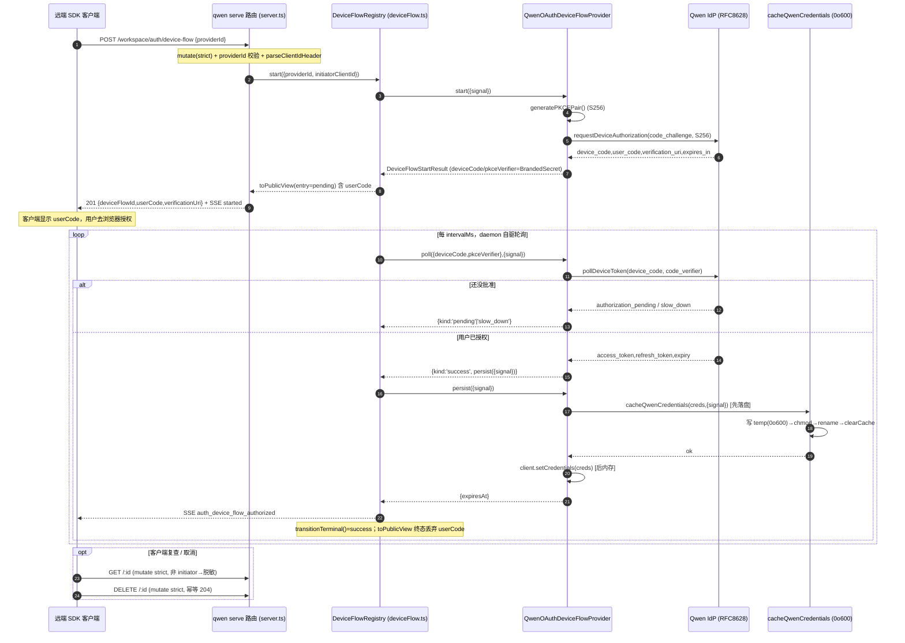
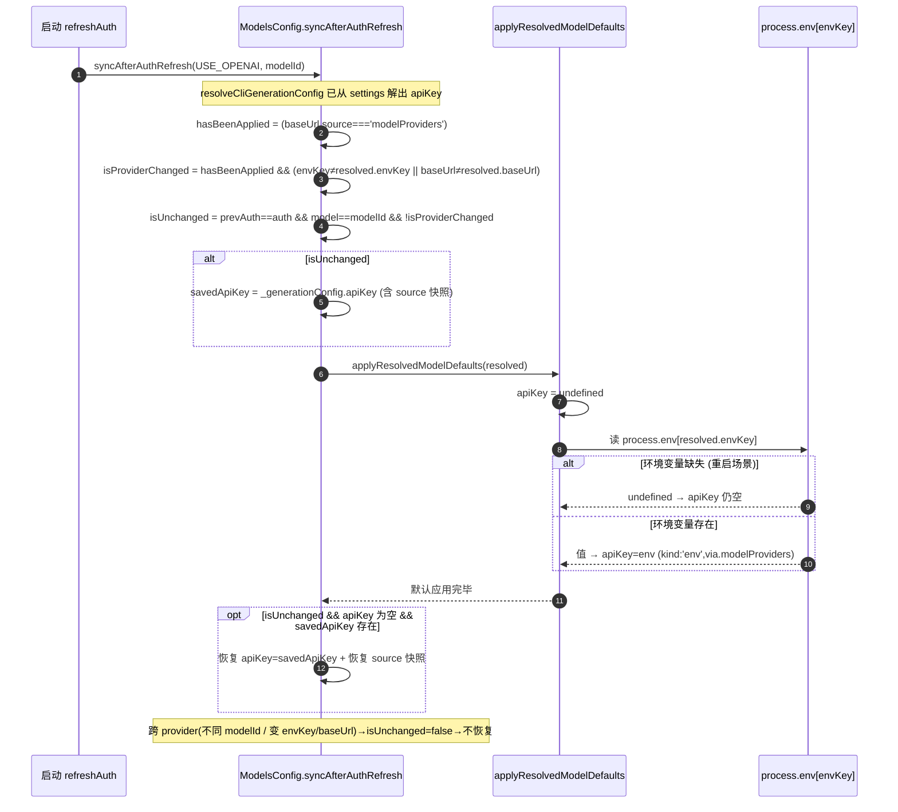

# auth / provider 技术方案

> 范围：QwenLM/qwen-code 的认证（auth）与模型提供方（model providers）子系统。
> 覆盖 PR **#3212 / #3495 / #3623 / #3624 / #4255(+#4291+#4305) / #5179 / #5404 / #5478 / #5539**。
> 代码定位：`provider` 配置解析、`apiKey` 跨重启保留、`qwen auth status` 识别、daemon 设备流均已随 #4490 进入 `main`；本文少量 `@daemon_mode_b_main` 标注保留原始撰写时语境，阅读时以当前 `main` 源码为准。
> 行号为撰写时快照，符号名（`file:symbol`）为稳定锚点。

---

## 1. 背景与动机

qwen-code 的「认证 + 模型」并不是单一来源，而是一个**多 provider、多配置层**的解析问题：

- **多 provider 形态**：
  - **Qwen OAuth**（`AuthType.QWEN_OAUTH`）——浏览器/设备授权，token 落盘 `~/.qwen/oauth_creds.json`，运行时动态注入；
  - **OpenAI-compatible**（`AuthType.USE_OPENAI`）——一个 authType 下挂着多个「provider 实例」：OpenRouter、阿里云 Coding Plan、ModelStudio Standard、以及任意自定义 BYOK endpoint，靠 `baseUrl + envKey` 区分；
  - **Gemini**（`AuthType.USE_GEMINI`）——支持自定义 `baseUrl`（代理/网关）；
  - **BYOK（Bring Your Own Key）**——用户在 `settings.json` 里直接写 `security.auth.apiKey` / `modelProviders`。

- **配置优先级冲突**：同一个 `apiKey` / `baseUrl` 可能同时来自 OAuth 凭据、`modelProviders[].envKey`、进程环境变量、`settings.json`、CLI flag。需要一套**带 source 溯源**的解析顺序，否则无法判断「这把 key 到底从哪来、能不能跨 provider 复用」。

- **重启丢 key（#3417/#3495）**：用户把 key 写在 `settings.security.auth.apiKey`，但 registry model 声明了 `envKey`（如 `CODING_PLAN_KEY`）。启动时若 `process.env[envKey]` 不存在，`applyResolvedModelDefaults` 会**清空** apiKey 再尝试从环境读取，结果把用户在 settings 里的合法 key 冲掉，重启即掉登录。

- **自定义 Gemini baseUrl 不生效（#3166/#3212）**：用户在 `modelProviders` 里给 Gemini 配了私有网关 `baseUrl`，但创建 Gemini content generator 时丢弃了它，请求仍打官方端点。

- **重复 model id provider 选择丢失（#5173/#5179）**：多个 `modelProviders.openai[]` 条目可以共享同一个 `id` 但指向不同 `baseUrl` / `envKey`。早期模型选择器只持久化 `model.name`，重启时按 id 取第一个 provider，导致用户选中的非首个 endpoint 被静默替换。

- **Requesty 只能手配通用 OpenAI-compatible（#5478/#5539）**：Requesty 是 OpenAI-compatible gateway，但没有一等 provider preset、归因 header、auth migration 或 model picker 分组。#5478 增加 Requesty provider；#5539 后续把 OpenRouter/Requesty 这类 provider-specific headers 收敛到 preset `customHeaders`，减少 provider class 分叉。

- **`qwen auth status` 识别不全（#3612/#3623）**：OpenAI-compatible provider（尤其无 `envKey`、靠 `OPENAI_API_KEY` 或 `settings.security.auth.apiKey` 的）被误报为「未配置/不完整」。

- **交互菜单缺 API Key 入口（#3413/#3624）**：`qwen auth` 交互菜单只有 Coding Plan / OpenRouter / Qwen OAuth，没有「自带 API Key」的引导。

- **远程 daemon 登录（#4175 Wave4 / #4255）**：`qwen serve` 作为常驻 daemon 时，远端 SDK 客户端如何触发一次 Qwen 账号登录？不能在 daemon 上弹浏览器（可能是无头服务器），token 也必须落在 **daemon** 文件系统而非客户端。需要一条「daemon 代跑设备授权、客户端只显示 user code」的设备流（RFC 8628）。

本方案的目标即：用**统一的 source 溯源 + 优先级**解决前四个配置问题，用**设备流注册表**解决远程登录，并在全过程对凭据/密文做脱敏与原子落盘。

---

## 2. 整体架构

### 2.1 认证来源与解析优先级

运行期最终喂给 content generator 的是一份 `ContentGeneratorConfig`（`packages/core/src/core/contentGenerator.ts:ContentGeneratorConfig`，其中 `baseUrl?` 在 L78）。它由 `ModelsConfig`（`packages/core/src/models/modelsConfig.ts`）持有的 `_generationConfig` 解析得到，且**每个字段都带一个 source 标签**记录在 `generationConfigSources`，`kind` 取值约定：

| source kind | 含义 | 是否 provider 专属 |
|---|---|---|
| `modelProviders` | 来自 `settings.modelProviders[authType][].{baseUrl,envKey,...}` | 是（带 `authType`+`modelId`） |
| `env` | 来自 `process.env`；若 `via.modelProviders` 存在则为 provider 专属环境键 | 视 `via` 而定 |
| `settings` | 来自 `settings.security.auth.{apiKey,baseUrl}` 等「全局兜底」 | 否（provider-agnostic） |
| `cli` | 来自 `--openai-api-key`/`--model` 等命令行 | 否 |
| `programmatic` | 来自 `updateCredentials()` 运行时写入 | 否 |
| `computed` | 派生值（如 Qwen OAuth 占位 token、自动探测 contextWindow） | — |

**解析优先级**（高→低，体现在 `applyResolvedModelDefaults` 与 `syncAfterAuthRefresh`）：
1. Qwen OAuth 动态占位（`QWEN_OAUTH_DYNAMIC_TOKEN`，请求时替换真 token）；
2. provider 专属环境键 `process.env[model.envKey]`（→ `kind:'env'` 带 `via.modelProviders`）；
3. 同 provider 重启保留下来的已解析 key（#3495 的 save/restore，仅 `isUnchanged` 时）；
4. `settings` / `cli` / 通用 `env`（兜底，跨重启稳定）。

### 2.2 `auth status` 分类

`showAuthStatus`（`packages/cli/src/commands/auth/handler.ts`，合并于 commit `4ac9ec07`）在 `AuthType.USE_OPENAI` 下用一组判定把当前活动 provider 归类为 **OpenRouter / Coding Plan / ModelStudio Standard / 通用 OpenAI-compatible** 四类（详见 §3.3）。

> 注意：当前 `main` 上 `qwen auth` CLI 子命令**已被整体移除**，`packages/cli/src/commands/auth.ts:buildRemovalNotice` 改为引导用户使用会话内 `/auth` 与 `/doctor`。因此 §3.3/§3.4 描述的是 #3623/#3624 合并时点（commit `4ac9ec07`/`f0e8601`）的实现，设计逻辑仍是理解 provider 识别/BYOK 的核心；详见 §7。

### 2.3 daemon device-flow

`qwen serve` 暴露 4 条 `/workspace/auth/*` HTTP 路由，由 `DeviceFlowRegistry`（`deviceFlow.ts@daemon_mode_b_main`）作为「每 providerId 单例」的状态机：daemon 自己向 IdP 轮询，客户端只拿 `userCode + verificationUri`。密文（`device_code`/PKCE verifier）以 `BrandedSecret` 包裹，凭据由 `cacheQwenCredentials` 原子写入 `0o600`。

### 2.4 架构总览（mermaid）

```mermaid
flowchart TB
  subgraph Resolve["凭据解析层 (core)"]
    MP["settings.modelProviders[authType][]<br/>baseUrl / envKey / generationConfig"]
    ENV["process.env[envKey]"]
    SET["settings.security.auth.apiKey/baseUrl"]
    CLI["--openai-api-key / --model"]
    MC["ModelsConfig._generationConfig<br/>+ generationConfigSources(溯源)"]
    MP --> MC
    ENV --> MC
    SET --> MC
    CLI --> MC
    MC -->|"applyResolvedModelDefaults<br/>syncAfterAuthRefresh"| CGC["ContentGeneratorConfig<br/>(apiKey/baseUrl/model)"]
  end

  subgraph Gen["content generator 工厂"]
    CGC --> GEMI["createGeminiContentGenerator<br/>httpOptions.baseUrl 透传 (#3212)"]
    CGC --> OAI["openaiContentGenerator"]
    CGC --> QOA["Qwen OAuth (动态 token)"]
  end

  subgraph Status["auth status / 菜单 (cli, 合并时点)"]
    MC -.读取.-> ST["showAuthStatus 四路分类 (#3623)"]
    MENU["runInteractiveAuth + handleApiKeyAuth (#3624)"] -.写入.-> MP
  end

  subgraph Daemon["qwen serve device-flow (@daemon_mode_b_main)"]
    SDK["远端 SDK 客户端"] -->|"POST /workspace/auth/device-flow"| REG["DeviceFlowRegistry<br/>per-providerId 单例"]
    REG -->|"start/poll (PKCE S256)"| IDP["Qwen IdP (RFC8628)"]
    REG -->|"persist 成功"| CACHE["cacheQwenCredentials<br/>原子 0o600 落盘"]
    REG -->|"SSE 事件"| SDK
  end

  CACHE -.复用同一落盘逻辑.-> QOA
```



---

## 3. 子系统详解

### 3.1 provider 配置与 baseUrl 透传（#3212）

**问题**：`modelProviders` 里给 Gemini 配的自定义 `baseUrl` 被丢弃。

**配置链路**：
- schema：`packages/cli/src/config/settingsSchema.ts:modelProviders`（L292）；类型 `packages/core/src/models/types.ts:ModelConfig`（`baseUrl?` L55、`envKey?` 同结构、`ModelProvidersConfig` 按 authType 分组）。
- 落地到运行配置：`packages/core/src/models/modelsConfig.ts:applyResolvedModelDefaults` 把 registry model 的 `baseUrl` 写入 `_generationConfig.baseUrl` 并打 `kind:'modelProviders'` 标签：
  ```ts
  // modelsConfig.ts:applyResolvedModelDefaults
  this._generationConfig.baseUrl = model.baseUrl;
  this.generationConfigSources['baseUrl'] = { kind: 'modelProviders', authType, modelId, detail: 'baseUrl' };
  ```
- `_generationConfig` 解析为 `ContentGeneratorConfig`，`baseUrl` 字段保留（`contentGenerator.ts:ContentGeneratorConfig` L78）。

**修复点**：`packages/core/src/core/geminiContentGenerator/index.ts:createGeminiContentGenerator`。修复前 `const httpOptions = { headers }` 直接丢掉 `config.baseUrl`；修复后：
```ts
const httpOptions = config.baseUrl
  ? { headers, baseUrl: config.baseUrl }
  : { headers };
```
`@google/genai` 的 `GeminiContentGenerator` 读取 `httpOptions.baseUrl` 改写请求端点，自定义网关/代理生效。`baseUrl` 缺省时保持旧形状（仅 `headers`），向后兼容。两条单测覆盖「有 baseUrl 透传」「无 baseUrl 不变」。

#### 3.1.1 重复 model id 的 provider 选择持久化（#5179）

#5179 修的是 provider 解析的另一个 `baseUrl` 维度问题：同一个 model id（例如 `qwen3.7-max`）可能同时注册在 Token Plan、IdeaLab、BFF 等多个 OpenAI-compatible provider 上。选择器 live session 能选中非首个 provider，但持久化只写 `model.name`，下次启动按 id 匹配时会回到第一个 provider，`baseUrl`、`envKey`、`generationConfig` 都被静默替换。

修复方式是把 `model.baseUrl` 作为 `model.name` 的 disambiguator 一起持久化：启动解析和 pre-flight auth 优先按 `id + baseUrl` 精确匹配；如果对应 provider 被改名/删除，再回退首个 id 匹配以保持向后兼容。所有 id-only 写入路径（`/model <id>`、ACP `setModel`、`qwen/settings/setCoreValue`、provider install）会用空字符串 tombstone 清掉旧 `model.baseUrl`，避免低优先级 scope 的 stale baseUrl 在 settings merge 后继续影响新选择。

#### 3.1.2 custom provider install 与 baseUrl 透传（#5404）

#5404 是 #5179 的 provider install follow-up：custom provider install 仍保留 custom provider ownership detection 给 UI/ACP discovery 使用，但合并安装结果时按 model identity 与 `baseUrl` 传递精确选择，避免同一个 model id 在不同 endpoint 上安装后又落回旧 endpoint。

核心点：

- provider install 持久化并透传 `model.baseUrl`，让新安装 endpoint 能被下一次解析选中。
- custom provider merge 按 model identity 处理，不把用户自定义模型误删。
- UI/ACP discovery 仍能识别 custom provider ownership，避免 install 路径修复反向破坏模型发现。

#### 3.1.3 Requesty provider preset（#5478/#5539）

#5478 把 Requesty 作为一等 OpenAI-compatible provider 接入，而不是让用户手动配置 generic endpoint。新增内容包括：

- provider preset：`REQUESTY_API_KEY`、`https://router.requesty.ai/v1`、third-party UI group、`ownsModel` gate。
- provider detection：按 URL hostname 精确匹配 `router.requesty.ai` 或 `.requesty.ai` 后缀，拒绝 `router.requesty.ai.evil.example` 这类伪造 host。
- dispatch chain：`determineProvider` 能把 Requesty baseUrl 路由到 Requesty provider，并加 Requesty attribution headers。
- docs / auth migration：用户可通过 Requesty key 获得与 OpenRouter 类似的一步式 provider 体验。

#5539 随后把 OpenRouter/Requesty 的 provider-specific request headers 收敛到 preset `customHeaders`，减少“每个 gateway 一个 provider class”的重复。这样 Requesty 仍保持一等 preset 和 detection，但 header 注入不必长期复制 OpenRouter provider 类。

### 3.2 apiKey 跨重启保留（#3495）

**问题（#3417）**：settings 来源的 apiKey 在重启时被 registry model 的 `envKey`「清空-重读」流程冲掉。

**清空-重读发生在** `modelsConfig.ts:applyResolvedModelDefaults`（L748+）：它先把 `_generationConfig.apiKey = undefined`（Qwen OAuth 例外，写占位 token），再 `if (model.envKey) { const apiKey = process.env[model.envKey]; if (apiKey) {...} }`。若环境变量缺失，apiKey 就停留在 `undefined`——这正是丢 key 的根因。

**修复点**：`modelsConfig.ts:syncAfterAuthRefresh`（L923-990）在调用 `applyResolvedModelDefaults` 之前**保存**当前已解析的 apiKey 与其 source，之后若被清空则**恢复**。核心三段：

```ts
// 1) “是否已应用过 provider 默认” 的可靠信号：baseUrl 的 source 是否为 modelProviders
const hasBeenApplied =
  this.generationConfigSources['baseUrl']?.kind === 'modelProviders';

// 2) provider 是否改变（热重载/同 id 换 envKey 或 baseUrl）
const isProviderChanged =
  hasBeenApplied &&
  (this._generationConfig.apiKeyEnvKey !== resolved.envKey ||
   this._generationConfig.baseUrl !== resolved.baseUrl);

// 3) 仅当 authType 与 modelId 都未变、且 provider 未变，才视为 “unchanged”
const isUnchanged =
  previousAuthType === authType &&
  this._generationConfig.model === modelId &&
  !isProviderChanged;

const savedApiKey       = isUnchanged ? this._generationConfig.apiKey : undefined;
const savedApiKeySource = isUnchanged ? {...this.generationConfigSources['apiKey']} : undefined;

this.applyResolvedModelDefaults(resolved);

// 恢复：仅当 unchanged 且默认应用后 apiKey 被清空
if (isUnchanged && !this._generationConfig.apiKey && savedApiKey) {
  this._generationConfig.apiKey = savedApiKey;
  if (savedApiKeySource) this.generationConfigSources['apiKey'] = savedApiKeySource;
}
```

**防跨 provider 泄漏（`isProviderChanged`）**：这是 review（wenshao/gpt-5.5）反复打磨出的关键防线：
- 切换到**不同 modelId** → `isUnchanged` 直接为 false（modelId 比较），旧 key 不会被带到新 provider；
- **同 modelId 热重载**改了 `envKey` 或 `baseUrl` → `isProviderChanged=true` → 不恢复（避免把旧凭据发到新 endpoint）；
- `hasBeenApplied` 用 **`baseUrl` source === `'modelProviders'`** 作为「是否已 apply 过」判据：启动首跑时 baseUrl source 还是 `settings`/`cli`，`hasBeenApplied=false`、跳过 provider 比较 → 兜底 key 得以保留；apply 之后 baseUrl source 恒为 `modelProviders`，才启用 envKey/baseUrl 比较。
  - 该判据是为修掉早期 `apiKeyEnvKey !== undefined` 判据的两个误报（无 `envKey` 模型、`baseUrl` 省略被 registry 归一化为默认 URL）而引入的（commit `0e3cb0a`，见 §7）。

**冷启动安全**：首次 `syncAfterAuthRefresh` 时 `previousAuthType` 为 `undefined ≠ authType` → `isUnchanged=false` → 不复用上次会话的陈旧 key。

**source-kind 无关**：保存/恢复对 source kind 不做白名单过滤（设计者 doudouOUC 的最终结论：`isUnchanged` 已比较 authType+modelId+apiKeyEnvKey+baseUrl 四维，provider 同一即安全；`programmatic`/provider-scoped env 在「同 provider 未变」前提下保留是正确行为）。

### 3.3 auth status 识别 OpenAI-compat（#3623，合并时点）

**文件**：`packages/cli/src/commands/auth/handler.ts:showAuthStatus`（commit `4ac9ec07`）。在 `selectedType === AuthType.USE_OPENAI` 分支内，先确定活动 provider：
```ts
const openAiProviders = mergedSettings.modelProviders?.[AuthType.USE_OPENAI] || [];
const activeConfig = modelName ? openAiProviders.find(c => c.id === modelName) : openAiProviders[0];
```
然后**四路分类**（互斥 `else if`）：

1. **OpenRouter** — `isActiveOpenRouter = isOpenRouterConfig(activeConfig)`；key 来源 `OPENROUTER_API_KEY`（`OPENROUTER_ENV_KEY`）。
2. **Coding Plan** — `detectedCodingPlanRegion`：`providerCodingPlanRegion = isCodingPlanConfig(activeConfig?.baseUrl, activeConfig?.envKey)`；当无 `activeConfig` 且无 `modelName` 时回退 `codingPlanRegion`（`mergedSettings.codingPlan?.region`）。key 来源 `CODING_PLAN_ENV_KEY`。
3. **ModelStudio Standard** — `isActiveStandard`：`activeConfig.envKey === DASHSCOPE_STANDARD_API_KEY_ENV_KEY` 且 `baseUrl ∈ ALIBABA_STANDARD_API_KEY_ENDPOINTS`。
4. **通用 OpenAI-compatible Provider** — `else if (activeConfig)`：这是 #3623 的核心增强。判定 `hasApiKey`：
   ```ts
   if (activeConfig.envKey) {
     hasApiKey = !!process.env[activeConfig.envKey] || !!mergedSettings.env?.[activeConfig.envKey];
   } else {
     hasApiKey = !!process.env['OPENAI_API_KEY']
              || !!mergedSettings.env?.['OPENAI_API_KEY']
              || !!mergedSettings.security?.auth?.apiKey;   // ← 新增 BYOK 兜底
   }
   ```
   有 key → 打印「`✓ OpenAI-compatible Provider`」并显示 `Base URL`（`activeConfig.baseUrl || settings.security.auth.baseUrl`）；无 key → 「`(Incomplete)`」。
5. **无 activeConfig 的兜底 else**：依次探测 `hasGenericApiKey`（`OPENAI_API_KEY`/`settings.security.auth.apiKey`）→ Coding Plan key → `hasCodingPlanMetadata`（加了 `!modelName` 守卫，避免选了具体 model 时误报陈旧 Coding Plan 元数据）。

**#3623 的关键修正**：
- 文案统一 `OpenAI-compatible API Key` → `OpenAI-compatible Provider`（更准确，因为不只 envKey 一种来源）；
- `MergedSettingsWithCodingPlan` 接口补 `security.auth.apiKey/baseUrl` 字段，使 BYOK 直写 settings 的用户能被识别；
- 修掉「选了具体 model 时仍回退到陈旧 codingPlan 元数据」的误报（`!modelName` 守卫）。

### 3.4 交互式 auth 菜单 + API Key/BYOK（#3624，合并时点）

**文件**：`packages/cli/src/commands/auth/handler.ts` + `packages/cli/src/commands/auth.ts`（commit `f0e8601`）。

- **菜单新增项**：`runInteractiveAuth` 的 `InteractiveSelector` 选项里插入 `{ value:'api-key', label:'API Key', description:'Bring your own API key' }`；命中后 `await handleApiKeyAuth()`。
- **子命令注册**：`auth.ts` 新增 `apiKeyCommand`（`command:'api-key'`）→ `handleApiKeyAuth()`，并入 `authCommand.builder`。
- **`handleApiKeyAuth()`** 弹二级菜单：
  - **Alibaba Cloud ModelStudio Standard** → `handleAlibabaStandardApiKeyAuth()`：选 region（`promptForStandardRegion`，4 个 `ALIBABA_STANDARD_API_KEY_ENDPOINTS`）→ 输 key（`promptForKey` 掩码）→ 输 model ids（`promptForModelIds`，逗号分隔、去重、默认 `qwen3.5-plus,glm-5,kimi-k2.5`）→ 持久化：写 `env.DASHSCOPE_STANDARD_API_KEY` + `modelProviders.openai`（过滤掉旧 Standard 与 Coding Plan 条目）+ `security.auth.selectedType` + `model.name`，并**清理陈旧 Coding Plan 状态**（`env.CODING_PLAN_KEY=''`、`codingPlan.region/version=''`），最后 `reloadModelProvidersConfig + refreshAuth`。
  - **Custom API Key** → `handleCustomApiKeyAuth()`：纯 BYOK，仅打印文档链接（`.../configuration/model-providers/`），引导用户自己改 `settings.json`。
- **输入原语重构**：`promptForAuthKey` 泛化为 `promptForInput(promptText, { mask?, defaultValue? })`（raw-mode 逐字符；`mask` 控制是否回显 `*`；空输入回落 `defaultValue`）；`promptForKey` = 掩码版包装。

### 3.5 daemon 设备流（#4255 + #4291 + #4305，`@daemon_mode_b_main`）

> 全部位于 `daemon_mode_b_main`：`packages/cli/src/serve/auth/deviceFlow.ts`、`.../qwenDeviceFlowProvider.ts`、`packages/core/src/qwen/qwenOAuth2.ts`、`packages/cli/src/serve/server.ts`。

#### 3.5.1 RFC 8628 + PKCE S256

- PKCE 在 `packages/core/src/qwen/qwenOAuth2.ts`（RFC 7636）：`generateCodeVerifier` = `crypto.randomBytes(32).toString('base64url')`；`generateCodeChallenge` = `sha256(verifier).digest('base64url')`；`generatePKCEPair` 组合二者。
- provider 起流：`qwenDeviceFlowProvider.ts:QwenOAuthDeviceFlowProvider.start` 调 `generatePKCEPair()`，以 `code_challenge` + `code_challenge_method:'S256'` 调 `client.requestDeviceAuthorization({...},{signal})`，返回 `DeviceFlowStartResult{ deviceCode, pkceVerifier, userCode, verificationUri, verificationUriComplete, expiresIn }`，其中 `deviceCode`/`pkceVerifier` 经 `brandSecret(...)` 包裹。
- 轮询：`QwenOAuthDeviceFlowProvider.poll` 解出 `DeviceFlowPollResult`（`pending`/`slow_down`/`success`/`error`），错误码经 `mapRfc8628OAuthCode(err.oauthError)` 归一化为 `DeviceFlowErrorKind`。

#### 3.5.2 BrandedSecret 令牌脱敏（冻结 + WeakMap）

`deviceFlow.ts`：`SECRET_BRAND: unique symbol` + `interface BrandedSecret<T>` + `brandSecret/unsafeRevealSecret` + 模块级 `const SECRETS = new WeakMap()`。设计要点：
- 早期用 `new String()` 包裹，被发现 `+`/模板字符串经 `Symbol.toPrimitive→valueOf` 仍泄漏原始值；
- 现形态为 `Object.freeze({ [SECRET_BRAND]:true, toString:()=>'[redacted]', toJSON:()=>'[redacted]', [Symbol.toPrimitive]:()=>'[redacted]' })`，真值存进 `WeakMap`，**唯一取回路径**是 `unsafeRevealSecret`（`unsafe` 前缀便于 grep / lint 限制）。
- 误用矩阵：`JSON.stringify`→`"[redacted]"`、`String(s)`→`[redacted]`、`+s`/`` `${s}` ``→`[redacted]`、`s.length`→`undefined`、`+s`→`NaN`。6 条 leak-path 测试守护。

#### 3.5.3 toPublicView 丢弃 userCode

`deviceFlow.ts:toPublicView(entry)` 是「内部 entry → 对外视图」的唯一收口。它**只有当 `entry.status === 'pending'` 时才附带 `userCode/verificationUri/verificationUriComplete/expiresAt/intervalMs`**；一旦终态（success/error/cancelled/expired），这些字段一律不出现：
```ts
if (entry.status === 'pending') {
  base.userCode = entry.userCode;
  base.verificationUri = entry.verificationUri;
  base.verificationUriComplete = entry.verificationUriComplete;
  base.expiresAt = entry.expiresAt; base.intervalMs = entry.intervalMs;
}
```
这样即便终态 entry 在 `TERMINAL_GRACE`（5min）窗口内仍可被 GET 观察结果，也不会再吐出可被偷窥的 `userCode`。

#### 3.5.4 cacheQwenCredentials 原子 0o600

`qwenOAuth2.ts:cacheQwenCredentials`（#4255 导出，供 daemon 复用）+ `QWEN_CREDENTIAL_FILE_MODE = 0o600`：
1. `mkdir -p`；
2. 写**临时文件** `${filePath}.tmp.${pid}.${randomUUID()}`，`writeFile(..., { mode: 0o600, signal? })`；
3. 显式 `fs.chmod(temp, 0o600)`——POSIX 上失败是**硬错误**（拒绝发布宽权限凭据），Windows 上降级为 debug 日志（依赖 NTFS ACL）；
4. `fs.rename(temp → filePath)` 原子替换（同文件系统内 POSIX/Windows 均原子），canonical 文件名在被 rename 前永远不含新 token；
5. 失败路径 best-effort `unlink(temp)`；
6. 成功后 `SharedTokenManager.getInstance().clearCache()`（避免同进程缓存读到旧空凭据而重复触发设备授权），clear 失败仅 warn。

`signal` 自 registry 的 `cancelController.signal` 一路透传到 `fs.writeFile`，配合 `DEVICE_FLOW_PERSIST_TIMEOUT_MS=30_000`，卡死磁盘可被 cancel/dispose 立即中断。

#### 3.5.5 4 路由门控（`server.ts`）

门控工厂 `mutate = createMutationGate({ tokenConfigured, requireAuth })`。`mutate({ strict:true })` 表示：即便 daemon 处于 loopback 无 token 默认姿态，也要求带 token。

| Method | Path | 实际门控（代码） | 行为 |
|---|---|---|---|
| `POST` | `/workspace/auth/device-flow` | `mutate({ strict:true })` | 起流/幂等接管；`providerId` 非空字符串校验（`invalid_request`）+ 运行时 provider map 校验（`unsupported_provider`）；fresh→201/`attached:false`，接管→200/`attached:true`；错误映射 409 `too_many_active_flows` / 502 `upstream_error` |
| `GET` | `/workspace/auth/device-flow/:id` | **`mutate({ strict:true })`** | 读单条状态；返回 `toDeviceFlowStateBody(view, clientId)`；`callerIsDeviceFlowInitiator` 不匹配则脱敏 verification 字段（并在 `isServeDebugMode()` 下打 stderr 面包屑） |
| `DELETE` | `/workspace/auth/device-flow/:id` | `mutate({ strict:true })` | 取消，幂等 204（终态/未知→204/404） |
| `GET` | `/workspace/auth/status` | **bearer-only**（非 strict） | 列 `pendingDeviceFlows`，**刻意省略 `userCode`**；含 `supportedDeviceFlowProviders` |

**关键设计**：`GET /workspace/auth/device-flow/:id` 因为会吐 `userCode/verificationUri`（同 loopback 主机上可被旁路偷窥），在 #4255 fold-in 3 被从 bearer-only **提升为 `strict`**，与 POST/DELETE 对齐；而 `GET /workspace/auth/status` 因为输出里**不含 userCode** 才保持 bearer-only。`GET :id` 还在 #4291 起跑 `parseClientIdHeader` 驱动 `callerIsInitiator` 门（畸形 `X-Qwen-Client-Id` → 400）。

#### 3.5.6 stderr 脱敏

`deviceFlow.ts:sanitizeForStderr(value)` + 正则 `SANITIZE_FOR_STDERR_RE`：把可伪造日志行/注入终端控制序列的字节替换为 `?`（长度保持）。覆盖 ASCII C0/C1+DEL，以及 round-5/round-6 追加的 Unicode 仿冒控制符——`U+200B-U+200F`（零宽 + LRM/RLM）、`U+2028-U+2029`（行/段分隔=终端换行）、`U+202A-U+202E`（bidi embedding/override）、`U+2066-U+2069`（bidi isolate，CVE-2021-42574 Trojan Source）、`U+FEFF`（BOM）。该 helper 被下沉到 `deviceFlow.ts` 供两层共享：`qwenDeviceFlowProvider.ts` 对 attacker-controlled 的 `err.oauthError`（#4291）与 `err.name`（#4305 #4）脱敏；registry 的 late-poll/late-rejection observer 对 `latePollResult.kind`/`lateErr.name` 脱敏（#4305 #7 改 `name+length` 模式，不再 slice 原始 message）。

---

## 4. 关键流程（时序图 / 调用链）

### 4.1 daemon 设备流登录



要点：客户端**全程不接触** `device_code`/verifier/token；daemon 自驱轮询（SDK 在不在线无所谓）；persist **先盘后内存**（盘写失败不留内存僵尸 token）；并发重复 POST 经 `inFlightStarts` Promise map 合并 + per-providerId 单例幂等接管。

### 4.2 apiKey 跨重启保留（save → 清空 → 恢复）



---

## 5. 关键设计决策与权衡

1. **apiKey 仅在「同 provider 未变」时保留，跨 provider 一律阻断**
   - 决策：以 `isUnchanged = authType 同 + modelId 同 + !isProviderChanged` 作为唯一恢复闸门，对 source kind **不做白名单**。
   - 权衡：放弃了「按 source.kind 精细授权」的方案（review 一度建议只保 `cli/settings/env-without-via`）。设计者判断 source.kind 猜测不可靠、复杂度高；改用「provider 身份相同即安全」的强不变量（四维比较），既挡住跨 provider 把 settings/通用 env key 泄漏给别的 endpoint，又让 `programmatic`/provider-scoped env 在「同 provider」前提下正确保留。
   - `hasBeenApplied` 用 `baseUrl.source==='modelProviders'` 而非 `apiKeyEnvKey!==undefined`，消除了无-envKey 模型与 baseUrl 归一化导致的两类误报。

2. **PKCE S256 取代 redirect-state**
   - 设备流没有回调 URL，无法用传统 `state` 防 CSRF/重放；改用 RFC 7636 PKCE：`code_challenge=sha256(verifier)`，`code_challenge_method:'S256'`，verifier 仅 daemon 持有并以 `BrandedSecret` 包裹。绑定授权请求与令牌兑换，杜绝 device_code 被旁路窃取后直接兑换。

3. **BrandedSecret（冻结对象 + WeakMap + unique symbol）防泄漏**
   - 不用 `new String()`（`Symbol.toPrimitive→valueOf` 会漏原值），改 frozen 对象四向 coercion 全返 `'[redacted]'`，真值存 WeakMap，仅 `unsafeRevealSecret` 可取。`unique symbol` 品牌让其它模块无法结构化伪造。代价：取真值要显式调用、可读性稍降，但换来「默认安全、误用即脱敏」。

4. **凭据 0o600 原子写（temp→chmod→rename）**
   - 旧形态 `writeFile(mode:0o600)` 后再 `chmod`，若 canonical 文件已存在且权限更宽，存在「新 token 短暂可被他人读」的窗口；新形态先写 0o600 临时文件、POSIX chmod 失败即硬错误拒发布、再原子 rename，canonical 名在 rename 前永不含新 token。clearCache 折叠进同一函数，保证所有调用方（含 daemon registry）一致。

5. **设备流 GET 用 strict 门控防 userCode 偷窥**
   - `GET /:id` 会吐 `userCode/verificationUri`，是同主机旁路偷窥的信息泄漏面，故与 POST/DELETE 同提升为 `mutate({strict:true})`，并叠加 `callerIsDeviceFlowInitiator` 按发起者 clientId 脱敏；`toPublicView` 终态丢弃 userCode 形成第二道闸。对照之下 `GET /workspace/auth/status` 因输出不含 userCode 才允许 bearer-only。

6. **persist 先盘后内存 + 全程 signal/timeout**
   - 盘写失败不更新内存 client，避免「本会话记得 token、重启即丢」的僵尸态；`signal` 从 registry `cancelController` 透传到 `fs.writeFile`，配 30s persist/poll/start 超时，杜绝非协作 provider 把 per-providerId 单例钉死到 sweeper 级过期。

---

## 6. 涉及 PR

| PR | 状态 | 子主题 | 作用 |
|---|---|---|---|
| #3212 | merged | provider baseUrl 透传 | `createGeminiContentGenerator` 将 `config.baseUrl` 注入 `httpOptions.baseUrl`，使 `modelProviders` 自定义 Gemini 网关生效（修 #3166） |
| #3495 | merged | apiKey 跨重启保留 | `syncAfterAuthRefresh` save/restore + `isProviderChanged`/`isUnchanged`，env 缺失时保留 settings/CLI 源 key 且阻断跨 provider 泄漏（修 #3417） |
| #3623 | merged | auth status 识别 | `showAuthStatus` 四路分类（OpenRouter/CodingPlan/Standard/通用 OpenAI-compat），通用分支兜底 `OPENAI_API_KEY`/`security.auth.apiKey`（修 #3612） |
| #3624 | merged | 交互菜单 API Key/BYOK | `runInteractiveAuth` 增 `api-key` 项 + `handleApiKeyAuth`（Standard 引导 / Custom 文档链接）+ `api-key` 子命令（修 #3413） |
| #4255 | merged | daemon 设备流主体 | RFC8628 设备流 registry + 4 路由 + 5 事件 + `BrandedSecret` + `cacheQwenCredentials` 导出/0o600/clearCache 折叠（#4175 Wave4 PR21） |
| #4291 | merged | #4255 review 跟进 | poll 超时竞速、poll catch 写原始 err.message、GET clientId 门控、`cancellerClientId` first-writer-wins、`sanitizeForStderr` 上提 |
| #4305 | merged | #4291 post-merge 跟进(7项) | late-poll 闭包解构防引用持有、`callerIsDeviceFlowInitiator` 抽公共 helper、`err.name` 脱敏、`isServeDebugMode()` 复用、late-rejection 改 name+length |
| #5179 | merged | duplicate model id provider persistence | 模型选择器持久化 `model.baseUrl`；启动解析/auth 校验按 `id + baseUrl` 精确匹配；id-only 写入路径用空串 tombstone 清除旧 disambiguator |
| #5404 | merged | custom provider install preservation | provider install 保留 custom provider models，并透传 `model.baseUrl` 让 same-id 不同 endpoint 的新安装 provider 被精确选中 |
| #5478 | merged | Requesty provider | 新增 Requesty OpenAI-compatible provider preset、hostname detection、dispatch registration、auth migration 和用户文档 |
| #5539 | merged | provider customHeaders refactor | 将 OpenRouter/Requesty provider-specific headers 收敛进 preset `customHeaders`，减少 provider class 重复 |

---

## 7. 已知限制 / 后续

1. **#3495：一种 provider-baseUrl 配置仍可能丢 key**
   - `hasBeenApplied` 以 `baseUrl.source==='modelProviders'` 判定。若用户把 `baseUrl` 经 `modelProviders` 提供、且启动解析时 `baseUrl` 的 source 已被标为 `modelProviders`，则 `hasBeenApplied=true`；一旦启动态 `_generationConfig.baseUrl` 与 registry 归一化后的 `resolved.baseUrl` 有任何不一致（尾斜杠、省略后被补默认 URL 等），`isProviderChanged=true` → settings/CLI 兜底 key 不被恢复，重启仍掉。review（wenshao/gpt-5.5）连续指出 baseUrl 归一化比较的脆弱性，commit `0e3cb0a` 已修掉无-envKey 与省略-baseUrl 两个主要误报，但「provider 侧已带 baseUrl 来源」这一类仍依赖严格相等比较，属残留风险；更稳妥应「按 authType 默认 URL 归一化后再比较」。

2. **#3624：未按 issue 字面提供 Fireworks 专项入口**
   - issue #3413 期望对「自带 key 的第三方 provider」给出更具体的引导，但 `handleCustomApiKeyAuth()` 只打印通用 model-providers 文档链接，并未为 Fireworks（或其它具体厂商）提供专门的向导式 setup。Standard 分支只覆盖阿里云 ModelStudio，自定义 BYOK 仍需用户手改 `settings.json`。

3. **#4255：PR body 的 GET 门控表已过时（代码更严）**
   - #4255 描述里的路由表写 `GET /workspace/auth/device-flow/:id` 为「`bearerAuth` only」，但实际代码（fold-in 3 起）已是 `mutate({ strict:true })`。body 表是 fold-in 前的快照、未随提升同步，阅读 PR 描述会低估实际门控强度（代码比文档更严）。

4. **#4305：描述少报 rounds 5–6**
   - `SANITIZE_FOR_STDERR_RE` 的 Unicode 仿冒控制符覆盖（`U+2028-U+2029`、bidi embedding/override、`U+2066-U+2069` isolate=CVE-2021-42574 等）是跨 round-5/round-6 评审逐步补齐的（见 `deviceFlow.ts` 注释「Round-5 shipped without these; round-6 review caught it」）。但 #4305 的 7 项表格只列了 `err.name` 脱敏（#4）与 late-rejection name+length（#7），并未把「正则 Unicode 覆盖范围的 rounds 5–6 演进」显式登记，描述对该安全加固的 round 归属有遗漏。

5. **设备流 v1 仅支持 `qwen-oauth`**
   - `DEVICE_FLOW_SUPPORTED_PROVIDERS = ['qwen-oauth']`；其它 provider 需实现 `DeviceFlowProvider` 接口经 `deps.deviceFlowProviders` 注入。`GET /workspace/auth/status` 的 `providers:[]` 仍是最小实现，未来才接 `SharedTokenManager` 快照暴露 per-provider `ok/expired`。

6. **当前 main 已移除 `qwen auth` CLI**
   - §3.3/§3.4 描述的 `handler.ts:showAuthStatus`/`runInteractiveAuth`/`handleApiKeyAuth` 在 commit `4ac9ec07`/`f0e8601` 时点有效；当前 `main` 上 `packages/cli/src/commands/auth.ts` 已是 `buildRemovalNotice`，引导改用会话内 `/auth` 与 `/doctor`。本文相关章节应结合该迁移阅读。

7. **Requesty 当前只覆盖文本推理**
   - #5478 明确图像、音频、embedding 等模态不在范围；provider detection 也必须继续使用 hostname 级别匹配，不能退回字符串 contains，否则会 over-claim 恶意 baseUrl。

---

## 8. 各 PR 代码贡献

### #3212 — Gemini baseUrl 透传

- **修复点**：`geminiContentGenerator/index.ts:createGeminiContentGenerator` 中 `httpOptions` 构造从 `{ headers }` 改为 `config.baseUrl ? { headers, baseUrl: config.baseUrl } : { headers }`，使 `modelProviders` 中配置的自定义 Gemini 网关/代理 baseUrl 经 `@google/genai` 的 `httpOptions.baseUrl` 透传到请求端点。
- **向后兼容**：`baseUrl` 缺省时保持旧对象形状（仅 `headers`），不引入 `undefined` 键。
- **测试**：`index.test.ts` 新增两条用例——「有 baseUrl 时 httpOptions 含 baseUrl」和「无 baseUrl 时 httpOptions 不含 baseUrl」，通过 `GeminiContentGenerator` mock 的 `calls[0][0]` 断言。

### #5179 — duplicate model id provider persistence

- `ModelDialog`：选择 duplicate-id provider 时同时持久化 `model.name` 与 `model.baseUrl`。
- `modelConfigUtils.ts:resolveCliGenerationConfig` / `auth.ts:validateAuthMethod`：优先按 `id + baseUrl` 精确解析 provider；精确项不存在时回退首个 id，保持旧配置兼容。
- `/model <id>`、ACP `setModel`、`qwen/settings/setCoreValue`、provider install：id-only 写入 `model.name` 时同步写空字符串 tombstone 清除 `model.baseUrl`，防止 stale disambiguator 跨 settings scope 生效。
- tests 覆盖 exact match、fallback、removed-provider、empty-string tombstone、argv 忽略 persisted baseUrl、pre-flight auth envKey、dialog/command/ACP/provider install 写入路径。

### #5404 — preserve custom provider models on install

- `providers/install.ts` / custom provider preset：custom provider install 合并时保留用户自定义 provider models，不因同 id provider install 覆盖掉已有 model entries。
- provider install 写入并透传 `model.baseUrl`，与 #5179 的 duplicate-id disambiguator 对齐，使同 model id 的新 endpoint 能在 install 后立即被选中。
- CLI UI / ACP provider updates 路径保持 custom provider ownership discovery，用于 model picker 和 daemon session provider refresh。
- tests 覆盖 preserving custom provider models、baseUrl-specific sync、install regression 和 `modelsConfig` 解析。

### #5478/#5539 — Requesty provider

- `providers/presets/requesty.ts`：新增 Requesty preset，声明 `REQUESTY_API_KEY`、baseUrl、third-party 分组和 `ownsModel`。
- `openaiContentGenerator/provider/requesty.ts`：按 hostname 识别 Requesty endpoint，给请求追加 Requesty attribution headers；#5539 后续把 header 注入迁到 preset `customHeaders`。
- `providers/all-providers.ts` / `provider/index.ts`：注册 Requesty，使 dispatch chain 和 model picker 能把它当一等 provider。
- docs：`docs/users/configuration/auth.md` 与 `model-providers.md` 增加 Requesty 配置说明。
- tests：provider/preset suites 覆盖 hostname spoofing 拒绝、dispatch routing、OpenRouter 回归和 preset gate。

### #3495 — apiKey 跨重启保留

- **save/restore 机制**：`modelsConfig.ts:syncAfterAuthRefresh` 在调用 `applyResolvedModelDefaults` 前保存当前 `apiKey` 和 `generationConfigSources['apiKey']`，apply 后若被清空则恢复。三层守卫——`isUnchanged = (previousAuthType===authType && model===modelId && !isProviderChanged)`；`hasBeenApplied = baseUrl.source==='modelProviders'`；`isProviderChanged = hasBeenApplied && (apiKeyEnvKey!==resolved.envKey || baseUrl!==resolved.baseUrl)`。
- **防跨 provider 泄漏**：切换 modelId → `isUnchanged=false`（不恢复）；同 modelId 但 envKey/baseUrl 变更 → `isProviderChanged=true`（不恢复）；冷启动 `previousAuthType=undefined` → `isUnchanged=false`（不复用陈旧 key）。
- **source-kind 无关**：恢复时不做 kind 白名单过滤，靠四维比较保证「同 provider 即安全」。
- **测试**：`modelsConfig.test.ts` 新增 11 条用例，覆盖 restart 场景（settings/CLI/env/programmatic key 保留）、cross-provider 阻断（不同 modelId/envKey 变更/baseUrl 变更/无 envKey+baseUrl 变更）、冷启动不保留。

### #3623 — OpenAI-compat auth status 识别

- **四路分类**：`handler.ts:showAuthStatus` 在 `AuthType.USE_OPENAI` 分支下依次判定 `isActiveOpenRouter`/`detectedCodingPlanRegion`/`isActiveStandard`/通用 `activeConfig`，互斥 `else if`。活动 provider 由 `activeConfig = modelName ? openAiProviders.find(c => c.id === modelName) : openAiProviders[0]` 确定。
- **通用 OpenAI-compat 分支**：无 `envKey` 时兜底检测 `OPENAI_API_KEY` / `settings.env['OPENAI_API_KEY']` / `settings.security.auth.apiKey`（新增 BYOK 兜底）；有 key → 打印 `OpenAI-compatible Provider` + baseUrl；无 key → `(Incomplete)`。
- **接口补齐**：`MergedSettingsWithCodingPlan` 新增 `security.auth.apiKey/baseUrl` 字段。防陈旧误报：`hasCodingPlanMetadata` 增加 `!modelName` 守卫。
- **测试**：`status.test.ts` 新增 14 条用例，涵盖 `OPENAI_API_KEY`/自定义 envKey/settings BYOK/envKey 缺失 Incomplete/无关 provider baseUrl 不泄漏/陈旧 Coding Plan 元数据不干扰等场景。

### #3624 — 交互菜单 API Key/BYOK

- **菜单扩展**：`handler.ts:runInteractiveAuth` 的 `InteractiveSelector` 选项新增 `{value:'api-key', label:'API Key', description:'Bring your own API key'}`；`auth.ts` 注册 `apiKeyCommand`（`command:'api-key'`）子命令。
- **handleApiKeyAuth 二级菜单**：`Alibaba Cloud ModelStudio Standard` → `handleAlibabaStandardApiKeyAuth()`：`promptForStandardRegion`（4 个 `ALIBABA_STANDARD_API_KEY_ENDPOINTS` 区域）→ `promptForKey`（掩码输入）→ `promptForModelIds`（逗号分隔、去重、默认 `qwen3.5-plus,glm-5,kimi-k2.5`）→ 持久化 `env.DASHSCOPE_STANDARD_API_KEY` + `modelProviders.openai`（过滤旧 Standard/Coding Plan）+ 清理陈旧 Coding Plan 状态。`Custom API Key` → 打印 model-providers 文档链接。
- **输入原语重构**：`promptForAuthKey` 泛化为 `promptForInput(promptText, {mask?, defaultValue?})`（raw-mode 逐字符；`mask` 控制回显 `*`；空输入回落 `defaultValue`）；`promptForKey` = 掩码版包装。
- **工具函数提取**：`createMinimalArgv` 和 `loadAuthConfig` 抽为顶层函数，消除 `handleQwenAuth` 中的重复代码。

### #4255 — daemon 设备流（device-flow PKCE）

- **PKCE S256**：`qwenOAuth2.ts:generateCodeVerifier` = `crypto.randomBytes(32).toString('base64url')`；`generateCodeChallenge` = `sha256(verifier).digest('base64url')`；`generatePKCEPair` 组合二者。`QwenOAuthDeviceFlowProvider.start` 以 `code_challenge + S256` 调 `requestDeviceAuthorization`，返回含 `BrandedSecret` 包裹的 `deviceCode/pkceVerifier`。
- **BrandedSecret 令牌脱敏**：`deviceFlow.ts` 中 `SECRET_BRAND: unique symbol` + `Object.freeze({toString/toJSON/[Symbol.toPrimitive] → '[redacted]'})` + `WeakMap` 存真值，唯一取回路径 `unsafeRevealSecret`。6 条 leak-path 测试守护（`JSON.stringify`/`String()`/模板字符串/`+`/`.length`/`Number()`）。
- **DeviceFlowRegistry 状态机**：per-providerId 单例 + `inFlightStarts` Promise map 并发合并；daemon 自驱轮询（间隔 `intervalMs`，`slow_down` 自动 ×1.5）；`transitionTerminal` 收口所有终态转换；`toPublicView` 终态丢弃 `userCode`；`TERMINAL_GRACE=5min` 窗口后清理。
- **凭据原子落盘**：`cacheQwenCredentials` 先写 `temp(0o600)` → `chmod(0o600)`（POSIX 失败即硬错误）→ `rename` 原子替换 → `clearCache()`。`signal` 从 registry 透传到 `fs.writeFile`，配合 `DEVICE_FLOW_PERSIST_TIMEOUT_MS=30_000`。
- **4 路由门控**：`POST/GET/:id/DELETE` 均 `mutate({strict:true})`；`GET /workspace/auth/status` bearer-only（不含 userCode）。`GET /:id` 叠加 `callerIsDeviceFlowInitiator` 按 `X-Qwen-Client-Id` 脱敏非发起者。`sanitizeForStderr` 覆盖 ASCII C0/C1 + Unicode 仿冒控制符（`U+200B-200F/2028-2029/202A-202E/2066-2069/FEFF`）。
