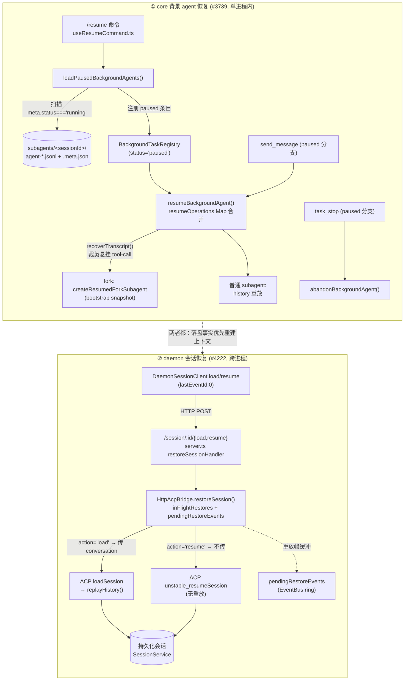

# 后台 agent / 会话恢复技术方案

> 适用范围：`QwenLM/qwen-code`
> 涉及 PR：#3739（背景 agent resume/continuation）、#4222（daemon session load/resume）、#5556（completed background sub-agent revive + transcript TTL）、#5679（agent/workflow integer env strict parse）
> 代码基线：`main`（#3739 commit、#4222 commit `2453b82ad`）

---

## 1. 背景与动机

qwen-code 的「长任务」存在两种生命周期超出单次交互的执行体，两者都需要「中断后再续跑」的能力，但机制完全不同：

1. **背景 subagent（in-process，单进程内）。** 用户用 `Agent` 工具发起 `run_in_background: true` 的子 agent（包括 `fork` 子 agent），它脱离父 agent 当前 turn 独立运行、跨 turn 存活、终态通过 `<task-notification>` XML 回灌给父模型（见 `packages/core/src/agents/background-tasks.ts:AgentTask`）。问题在于：**CLI 进程一旦退出**（用户 Ctrl-C / 关终端 / 崩溃），这些 in-memory 的背景 agent 全部丢失，但它们的工作（transcript、sidecar）已经落盘在 `<projectDir>/subagents/<sessionId>/`。#3739 让这些被中断的背景 agent 在下次 `/resume` 时以 `paused` 状态被发现、并可被显式「续跑（resume）」或「丢弃（abandon）」。

2. **已完成背景 subagent 的同会话 revive（in-process）。** #3739 只恢复「进程退出时仍 running」的 paused agent；#5556 进一步允许同一会话内对 `completed` background agent 发送新消息，把 persisted transcript 恢复为 paused → running，追加新 instruction 后继续跑，并递增 `resumeCount`。同时，旧 subagent transcript 目录会按 housekeeping TTL 清理，避免 `<projectDir>/subagents/` 无限增长。

3. **daemon 会话（跨进程，HTTP/SSE 客户端）。** `qwen serve` 守护进程把每个会话托管在一个 ACP 子进程里，远端 SDK/UI 客户端通过 HTTP + SSE 连接（见 daemon/serve 技术方案）。客户端断线重连、或新客户端想接管一个**已持久化但当前未在 daemon 中活跃**的会话时，仅靠 `create`/`attach` 语义不够——需要显式的 `load`（重放历史）和 `resume`（不重放）两条恢复路径。#4222（serve 生命周期工作的 PR6）补齐了 daemon HTTP 路由、ACP bridge 的 restore 生命周期、以及 TypeScript SDK 的 `load`/`resume` 方法。

这些层面共享一个核心思想：**以落盘的不可变事实（transcript / 持久化会话）为权威源（source of truth）重建运行时上下文，而不是从「当前」父状态重新推导**。下文统一称为 transcript-first / persisted-first 恢复。

---

## 2. 整体架构

恢复能力分为三层，互相独立，但都遵循「落盘事实优先」原则：

| 层面 | 触发入口 | 权威源 | 是否重放 | 核心服务 |
| --- | --- | --- | --- | --- |
| ① core 背景 agent | `/resume` → `loadPausedBackgroundAgents`；`send_message`/`task_stop` 命中 paused 条目 | `subagents/<sessionId>/agent-*.{jsonl,meta.json}` | fork-resume 从 bootstrap 记录重建 worker；普通 subagent 重放 history | `BackgroundAgentResumeService` |
| ② completed background agent revive | `send_message` 命中 completed 条目 | 同一 session 的 persisted subagent transcript | 恢复 transcript，追加新 instruction，并递增 `resumeCount` | `BackgroundAgentResumeService` + `BackgroundTaskRegistry` |
| ③ daemon 会话 | `POST /session/:id/{load,resume}` | 持久化的 `ConversationRecord`（`SessionService`） | `load` 重放历史；`resume` 不重放 | `HttpAcpBridge.restoreSession` + ACP `loadSession`/`unstable_resumeSession` |



---

## 3. 背景 agent resume/continuation 详解（#3739）

核心服务：`packages/core/src/agents/background-agent-resume.ts:BackgroundAgentResumeService`。

### 3.1 paused 状态与 registry

落盘契约由 `packages/core/src/agents/agent-transcript.ts` 定义：每个背景 subagent 落两个兄弟文件——`agent-<id>.jsonl`（ChatRecord 形态的事件日志）与 `agent-<id>.meta.json`（sidecar 元数据）。sidecar 的 `AgentMeta.status` 取值 `'running' | 'completed' | 'failed' | 'cancelled' | 'paused'`（`agent-transcript.ts:AgentMeta`）。

**发现逻辑**（`background-agent-resume.ts:loadPausedBackgroundAgents`）：

- 用 `getSubagentSessionDir(projectDir, sessionId)` 定位目录，遍历 `*.meta.json`；
- **只把 `meta.status === 'running'` 的 sidecar 视为「被进程退出中断的、可恢复的工作」**（`if (!meta || meta.status !== 'running') continue;`）。`completed/failed/cancelled` 是正常终态，不恢复；
- 去重：`if (registry.get(meta.agentId)) continue;`（仅同进程内去重，见 §8）；
- 读 jsonl → `recoverTranscript(records)` → 以 `status: 'paused'` 调 `registry.register(...)`，并计算 `resumeBlockedReason`（fork 缺 bootstrap 时阻断）。

`paused` 是 registry 的一等状态。`packages/core/src/agents/background-tasks.ts:BackgroundTaskRegistry` 的关键保证：

- `pruneTerminalEntries()` 只淘汰 `notified === true` 的终态条目；**running / paused / cancelled-未通知 永不淘汰**——避免悄悄丢掉一个用户还没来得及 resume/abandon 的可恢复任务（见该方法 docstring）；
- `abandon(agentId)`（`background-tasks.ts:abandon`）：把 `paused` 条目置 `cancelled` 且 `notified = true`，**不发 task-notification**（用户显式丢弃，不应泄漏进新会话）。

CLI 侧：`packages/cli/src/ui/hooks/useResumeCommand.ts` 在 `/resume` 末尾调 `config.loadPausedBackgroundAgents(sessionId)`，若 `recovered.length > 0` 用 `buildRecoveredBackgroundAgentsNotice(count)` 弹一条瞬时提示（"Recovered N interrupted background agents. Open Background tasks and press r to resume."）。

### 3.2 transcript-first fork 恢复

这是 #3739 最核心的设计转变：**fork resume 从 transcript 历史重建 worker 上下文，而不是从当前父 prompt/工具状态重建。**

**落盘端（launch path，`packages/core/src/tools/agent/agent.ts`）。** 背景启动时 `attachJsonlTranscriptWriter` 为 fork 额外写两类 system 记录（agent.ts:1882-1904）：

- `agent_bootstrap`（subtype）：payload 为 `AgentBootstrapRecordPayload`（`chatRecordingService.ts`），含 **`history`（启动前注入的 model-facing 历史前缀）、`systemInstruction`（启动时的不可变 system prompt）、`tools`（启动时的不可变工具声明/allowlist）**。仅 fork 写：`bootstrapHistory: isFork ? bgInitialMessages : undefined` 等；
- `agent_launch_prompt`（subtype）：payload `displayText` 为原始 task prompt（fork 可能与 bootstrap 内可见 user 指令不同，如 `Begin.` vs 完整样板）。

写入由 `agent-transcript.ts:attachJsonlTranscriptWriter` 内的 `hasBootstrapPayload` 分支落 `recordSystem('agent_bootstrap', ...)`，再 `recordUserMessage(initialUserPrompt)`，再 `recordSystem('agent_launch_prompt', ...)`。

**恢复端（`background-agent-resume.ts:recoverTranscript`）。** 重建流程：

1. `reconstructHistory(records)`：沿 `parentUuid` 链从叶子回溯到根，得到单一主干（处理多分支/重复 uuid）；
2. 过滤 `isWhitespaceOnlyAssistant`（空白助手回合）；
3. **裁剪悬挂 tool-call（关键）**：从尾部循环 pop——空白助手回合 pop，`extractFunctionCallIds(last).length > 0`（即带未配对 functionCall 的助手回合，中断 turn 的产物）也 pop——直到尾部是一个「稳定」记录。最后一个稳定记录的 uuid 即 `lastStableUuid`；
4. fork 分支：若存在 `agent_bootstrap` 记录且 payload.kind==='fork' 且有 `agent_launch_prompt` 的 `displayText`，则装配 `forkBootstrap = { history, systemInstruction, tools, taskPrompt, runtimeHistory }`，其中 `runtimeHistory` 排除掉「fork launch seed」那条 user 记录（`forkLaunchSeedUuid`）以避免重复注入首个 task prompt。

**重建 worker**（`background-agent-resume.ts:resumeBackgroundAgentInternal` + `createResumedForkSubagent`）：fork 的 `resumeHistory = [...forkBootstrap.history, {role:'user', parts:[taskPrompt]}, ...forkBootstrap.runtimeHistory]`；`createResumedForkSubagent` 用 `bootstrap.systemInstruction!` 和 `bootstrap.tools!`（注意非空断言——缺失时上游已阻断）构造 `AgentHeadless.create`，**绝不回退到当前父 generation config 或通配 `tools:['*']`**（这正是 review 的 [Critical] 修复点）。普通 subagent 则 `resumeHistory = [...getInitialChatHistory(bgConfig), ...recovery.history]`。

**无丢失追加**：续跑写 transcript 时 `attachJsonlTranscriptWriter({ ..., appendToExisting: true, initialParentUuid: recovery.lastStableUuid })`——新记录的 parentUuid 显式挂到 `lastStableUuid`，从而**绕开被中断 turn 留下的悬挂尾巴另起分支**（`agent-transcript.ts:AttachJsonlOptions.initialParentUuid` 文档明确此意图）。

**legacy fork 阻断**：缺 bootstrap 记录 → `LEGACY_FORK_RESUME_BLOCKED_REASON`；有 bootstrap 但缺 `systemInstruction`/`tools` → `LEGACY_FORK_CAPABILITIES_BLOCKED_REASON`。这类条目仍以 paused 可见、可 abandon，但 resume 被拒（`resumeBlockedReason`）。

### 3.3 并发 resume 合并（resumeOperations Map）

`background-agent-resume.ts:resumeBackgroundAgent` 用 `private readonly resumeOperations = new Map<string, ResumeOperation>()` 做并发去重，**同步 get/set、中间无 await**，因此在单线程事件循环里是原子的：

```
const existingOperation = this.resumeOperations.get(agentId);   // 同步 get
if (existingOperation) {                                         // 已有在途 resume
  if (trimmedMessage) {                                          // 把消息塞进在途 resume
    if (!registry.queueMessage(agentId, trimmedMessage))         // 已 running → 入 registry 队列
      existingOperation.continuationMessages.push(trimmedMessage); // 尚未 running → 入暂存数组
  }
  return existingOperation.promise;                              // 复用同一 promise
}
const operation = { continuationMessages: [...], promise: Promise.resolve(undefined) };
operation.promise = this.resumeBackgroundAgentInternal(agentId, operation)
  .finally(() => this.resumeOperations.delete(agentId));        // 结束即清理
this.resumeOperations.set(agentId, operation);                  // 同步 set
return operation.promise;
```

要点：

- **第二个 resume 请求复用第一个的 promise**，绝不重复创建/执行 subagent；
- 续跑消息有两个落点：resume 已把 entry 切到 `running` 后，新消息走 `registry.queueMessage`（registry 队列）；尚未 running 时，塞进 `operation.continuationMessages` 暂存数组。`resumeBackgroundAgentInternal` 内部把 `continuationMessages` join 成 `continuationPrompt`，并把 `promptMessages.length` 之后到达的「晚到」消息（`lateContinuationMessages`）补投进 registry 队列，保证「在途 resume 期间发来的指令不丢」。

### 3.4 SubagentStart hook 重跑与 approval-mode 降级（非信任目录）

**hook 重跑**：续跑等价于一次新的 subagent 启动，故 `resumeBackgroundAgentInternal` 调 `applySubagentStartHook`（`background-agent-resume.ts`）重新 `fireSubagentStartEvent`，把 `additionalContext` 注入 `contextState`。终止时同样跑 `runSubagentStopHookLoop`（带 `getStopHookBlockingCap()` 上限的阻塞循环），且 **`transcriptPath` 用恢复出的 `outputFile`**（review [Critical] 修复：原先误用父会话 transcript，导致 stop hook 校验错对象）。

**approval-mode 降级**（`background-agent-resume.ts:reconcileResumedApprovalMode`）：

```
reconcileResumedApprovalMode(persistedMode, parentMode, isTrustedFolder):
  if isTrustedFolder || persistedMode ∉ {auto-edit, auto, yolo}:  return persistedMode  // 信任 / 非特权 → 原样
  if parentMode ∈ {plan, default}:                                 return parentMode     // 非信任 + 特权 → 降到父
  return 'default'                                                                       // 兜底降到 default
```

即：**在已撤销信任的目录里恢复一个当初以 `auto-edit/auto/yolo` 启动的任务，会强制降级**（review [Critical]：不能盲信持久化的 `meta.resolvedApprovalMode`）。降级后仍 `createApprovalModeOverride(this.config, resolvedApprovalMode)`——**即使 mode 与父相同也必须 wrap**，因为 wrapper 会在 override Config 上重建 ToolRegistry，让 `EditTool/WriteFileTool/ReadFileTool` 绑定到恢复 agent 自己的 `FileReadCache` 而非父的（见 `resumeBackgroundAgentInternal` 内大段注释 + `agent.ts:createApprovalModeOverride`）。`finally` 里 `agentConfig.getToolRegistry().stop()` + `restoreParentPM()` 释放每次 resume 的 per-subagent 注册表与父 PermissionManager 的 strip，避免监听器跨 resume 累积。

### 3.5 send_message / task_stop 的 paused 分支

两个工具都先查 `BackgroundTaskRegistry`，对 `paused` 条目走特殊分支：

- **`packages/core/src/tools/send-message.ts:SendMessageInvocation.execute`**：`if (entry.status === 'paused')` → `await this.config.resumeBackgroundAgent(task_id, message)`——**消息成为续跑的首条 continuation 指令**；resume 失败返回 `SEND_MESSAGE_NOT_RUNNING`。running 条目才走 `registry.queueMessage`。（工具描述也明确："Paused recovered tasks are resumed first and use the message as their first continuation instruction."）
- **`packages/core/src/tools/task-stop.ts:TaskStopInvocation.execute`**：`if (agentEntry.status === 'paused')` → `this.config.abandonBackgroundAgent(taskId)`——**丢弃而不续跑**（写 meta `cancelled` + `registry.abandon`）；running 条目才 `agentRegistry.cancel`。

**生命周期分裂（resolved）**：持久化取消状态由 `persistedCancellationStatus` 控制——`registry.cancel()` 默认 `'cancelled'`（显式 `task_stop`），`registry.abortAll()` 默认 `'running'`（正常 CLI 关停）。settle 时 `persistBackgroundCancellation(metaPath, entry.persistedCancellationStatus ?? 'cancelled')` 落盘对应状态。于是：**关停中断 → 留 `running`（下次 `/resume` 可恢复）；显式 stop → 写 `cancelled`（不再恢复）**。这正是 review 多条 [Critical] 的最终修复（早期版本对任意 abort 都写 `cancelled`，会让正常退出的任务永久不可恢复）。

---

## 4. daemon session load/resume 详解（#4222）

核心：`packages/cli/src/serve/httpAcpBridge.ts:restoreSession`（统一 `load`/`resume` 的 bridge 实现）。

### 4.1 load 传 conversation → replayHistory；resume 不传

语义差异落在 ACP agent 层（`packages/cli/src/acp-integration/acpAgent.ts`）：

- `loadSession`：`const sessionData = config.getResumedSessionData();` → `createAndStoreSession(config, sessionData?.conversation)`。`createAndStoreSession` 内 `if (conversation && conversation.messages) await session.replayHistory(conversation.messages);`——**重放完整历史**（这些重放帧会经 SSE 推给 load 客户端）。
- `unstable_resumeSession`：`createAndStoreSession(config)`——**不传 conversation，不重放**。
- 两者都先 `sessionService.sessionExists(sessionId)`，不存在则 `throw RequestError.resourceNotFound('session:${sessionId}')`。

HTTP 与 SDK 路由对称：`server.ts` 注册 `POST /session/:id/load`（`restoreSessionHandler('load')`）与 `/resume`（`restoreSessionHandler('resume')`），分别调 `bridge.loadSession` / `bridge.resumeSession`，最终都进 `restoreSession(action, req)`，仅 URL 后缀与错误名不同。能力发现：`packages/cli/src/serve/capabilities.ts` 暴露 `session_load: {since:'v1'}` 与 `unstable_session_resume: {since:'v1'}`（resume 带 `unstable_` 前缀，因底层 ACP 方法可能仍变）。

### 4.2 pendingRestoreEvents 缓冲（重放帧不丢窗口）

`const pendingRestoreEvents = new Map<string, EventBus>()`（httpAcpBridge.ts:1391）。问题：`load` 触发的历史重放帧在 ACP `loadSession()` 返回**之前**就开始发，但此时 `SessionEntry` 还没注册进 `byId`，帧会无处可投。

解法（`restoreSession` 内）：

1. 调 ACP 前先 `const restoreEvents = new EventBus(eventRingSize); pendingRestoreEvents.set(req.sessionId, restoreEvents);`；
2. BridgeClient 的事件路由有一条专门的回退查询 `(sessionId) => sessionId ? pendingRestoreEvents.get(sessionId) : undefined`（httpAcpBridge.ts:1577），使重放帧在 entry 注册前先落到这个临时 ring；
3. ACP 成功返回后 `createSessionEntry(ci, req.sessionId, workspaceKey, restoreEvents)`——**把缓冲 ring 直接作为新 entry 的 `events`**，重放帧无缝衔接；
4. `finally` 里 `pendingRestoreEvents.delete(req.sessionId)`；失败则 `restoreEvents.close()` + `markSessionClosed`（清掉缓冲帧并重置 tombstone，防止 60s 内同 id 的下一次成功 restore 把陈旧帧 drain 进新 session）。

配套：`ci.client.markRestoreInFlight(req.sessionId)`（调 ACP 前）/ `clearRestoreInFlight`（finally），让 restore 期间到达的 guardrail 事件不被关窗 tombstone 误丢。SDK 端 `DaemonSessionClient.load` 以 `lastEventId: 0` 订阅，正是为了从 ring 起点拿到这些重放帧。

### 4.3 跨动作拒绝 RestoreInProgressError

`const inFlightRestores = new Map<string, InFlightRestore>()`，记录在途 restore 的 `{action, promise, coalesceState}`。命中在途时（httpAcpBridge.ts:2201-2218）：

```
const inFlight = inFlightRestores.get(req.sessionId);
if (inFlight) {
  if (action !== inFlight.action) {
    throw new RestoreInProgressError(req.sessionId, inFlight.action, action);  // 跨动作 → 拒绝
  }
  ... // 同动作 → coalesce
}
```

**为什么跨动作必须拒绝（双向）**：`load` 正在共享 EventBus 上重放完整历史，而 `DaemonSessionClient.resume()` 以 `lastEventId: 0` 订阅——若让 resume coalesce 到一个在途 load 上，resume 客户端会收到全部重放帧，**直接违反 resume 的「不重放 UI」契约**；反方向（load coalesce 到 resume）同理（load 客户端期待历史而 resume 没重放）。同动作 coalesce 不受影响。

错误映射（`server.ts` `sendBridgeError`）：`RestoreInProgressError` → HTTP **409** + `Retry-After: 5` + body `{ code: 'restore_in_progress', sessionId, activeAction, requestedAction }`，引导客户端稍后重试而非误判为「已完成 load」。（早期用 `Retry-After: 1`，但底层 restore 在 agent 侧可达 `initTimeoutMs`（默认 10s），1s 提示会把客户端推进「反复撞同一个 409」的紧循环，故改为 5s，与 `SessionLimitExceededError` 对齐——见 server.ts 注释。）`RestoreInProgressError` 定义在 `packages/acp-bridge/src/bridgeErrors.ts`，携带 `sessionId / activeAction / requestedAction`。

### 4.4 同动作 coalesce + 同步预占 attachCount

同动作并发（如两个 `load` 同时打同一 id）走 coalesce（httpAcpBridge.ts:2219-2255）：

- **同步预占**：`inFlight.coalesceState.count++` 在 `await inFlight.promise` **之前**执行。这样 spawn owner 的 `requireZeroAttaches` 断连回收逻辑能立刻观察到「有 coalescer 在等」，不会在 attach 落地前把刚 restore 的 entry 误杀（review [Critical] BQ9tV race）；
- 出错回滚：`catch { inFlight.coalesceState.count--; throw err; }`；
- entry 注册时一次性折叠：IIFE 内 `entry.attachCount = coalesceState.count`（`createSessionEntry` 后）。owner 自己 + 在途 coalescer 数都计入 attachCount，coalescer **不再各自 `++`**（它们下一 tick 从已注册 entry 读取）；更晚到的 coalescer 会命中 `byId` 早返回分支并直接 `existing.attachCount++`。
- coalesce 返回时 `{ ...restored, attached: true, clientId, createdAt }`——**完整透传 `restored.state`**（含 ACP 的 `models/modes/configOptions`），保证并发 caller 拿到与 owner 一致的 restore 结果（review [Critical]：早期版本覆盖成 `state: {}`）。

`byId` 早返回（已活跃会话，httpAcpBridge.ts:2185-2199）：`existing.attachCount++` + `registerClient` + 返回 `attached: true, state: existing.restoreState ?? {}`。注意：**显式 load/resume 的会话不会被提升为 `defaultEntry`**（review [Critical]：否则 single scope 下后续匿名 `POST /session` 会误接管这个 restore 出来的 live 会话）。

### 4.5 resourceNotFound 精确匹配

`httpAcpBridge.ts:isAcpSessionResourceNotFound(err, sessionId)` 把 ACP 的「资源不存在」错误精确翻译为 `SessionNotFoundError`（→ HTTP 404）：

```
if (err.code !== -32002) return false;                                  // ACP resourceNotFound 码
const expectedUri = `session:${sessionId}`;
if (err.data?.uri === expectedUri) return true;                         // 优先结构化匹配
return err.message === `Resource not found: ${expectedUri}`;            // 回退：整串相等（非 includes）
```

刻意用**整串相等**而非 `includes(expectedUri)`：否则 sessionId 为 `"a"` 会错误匹配消息里含 `"session:abc"` 的别的会话。命中即 `throw new SessionNotFoundError(req.sessionId)`。

此外 restore 失败时还有「自杀」守卫：若该 channel 上 `sessionIds.size === 0 && pendingRestoreIds.size === 1 && pendingRestoreIds.has(req.sessionId)`（即这条 restore 是该 channel 唯一存在理由且失败了），则 `ci.isDying = true; ci.channel.kill()`，避免空 channel 泄漏。对应地，channel 拆除判定（`killSession`/断连回收）也把 `pendingRestoreIds` 纳入：仅当 `sessionIds.size === 0 && pendingRestoreIds.size === 0` 才拆（review [Critical]：否则在途 restore 会被底层 channel 拆除）。

---

## 4.6 completed background agent revive 与 transcript TTL（#5556）

#5556 是 #3739 的同会话后续：它不只恢复「进程退出中断」的 paused agent，也允许用户继续一个已经 `completed` 的 background subagent。入口仍是 `send_message`：当目标 task 是 completed background agent 时，系统从 persisted transcript 恢复上下文，把新消息作为 continuation instruction 追加进去，并把 registry entry 重新推入 paused → running 生命周期。

关键语义：

- revive 只面向**当前 session 内 completed** background agent；`failed` / `cancelled`、跨 session addressability、fork finished agent 都不在范围。
- revived run 复用原 transcript，并递增 `resumeCount`，使 UI/registry 能区分「第几次续跑」。
- 状态流是 `completed -> paused -> running -> completed`，最终只发一次 terminal notification，避免旧 completed notification 与新 run 终态重复污染父上下文。
- 仍走既有 `BackgroundAgentResumeService` 路径，因此 transcript-first、approval-mode reconciliation、hook 重新执行、ToolRegistry 隔离等 #3739 的安全边界继续适用。

同 PR 还把 `<projectDir>/subagents/` 纳入 housekeeping：按既有 `cleanupPeriodDays` 设置和 per-project throttle marker 清理旧 transcript session directories，但 active session 被保护，避免把当前可恢复/可 revive 的 transcript 删掉。

## 4.7 background agent 上限 env 严格解析（#5679）

#5679 把 `QWEN_CODE_MAX_BACKGROUND_AGENTS` 接入统一的 strict positive integer env parser。此前宽松解析可能接受 `1e3`、`0x10`、`1.5` 等字符串并得到非预期上限；修复后只接受 canonical positive integer，非法值 fail-loud 或按调用点的既有错误处理返回配置错误。

这个 PR 与 workflow 的 `QWEN_CODE_MAX_TOKENS_PER_WORKFLOW`、`QWEN_CODE_MAX_WORKFLOW_AGENTS`、`QWEN_CODE_MAX_WORKFLOW_CONCURRENCY` 同批处理。对背景 agent resume 来说，它不改变 paused/resume 语义，但影响 registry / scheduler 接受同时运行 background agents 的容量边界。

---

## 5. 关键流程（时序图 / 调用链）

### 5.1 背景 agent pause → resume（transcript fork + 无消息丢失窗口）

```mermaid
sequenceDiagram
  autonumber
  participant U as 用户
  participant RC as useResumeCommand
  participant SVC as BackgroundAgentResumeService
  participant REG as BackgroundTaskRegistry
  participant FS as subagents/&lt;sid&gt;/*.jsonl+meta
  participant SUB as AgentHeadless (fork worker)

  Note over FS: 上次进程退出: meta.status 保持 'running'(abortAll persistedStatus='running')
  U->>RC: /resume
  RC->>SVC: loadPausedBackgroundAgents(sessionId)
  SVC->>FS: 读 *.meta.json (仅 status==='running')
  SVC->>FS: 读 *.jsonl → recoverTranscript()
  Note right of SVC: reconstructHistory 回溯 parentUuid 链<br/>裁剪空白助手 + 悬挂 tool-call → lastStableUuid<br/>抽出 forkBootstrap{history,systemInstruction,tools,taskPrompt}
  SVC->>REG: register(status='paused', resumeBlockedReason?)
  RC-->>U: "Recovered N agents. press r to resume"

  U->>SVC: resumeBackgroundAgent(agentId, msg?)
  SVC->>SVC: resumeOperations.get(agentId) 同步检查
  alt 已有在途 resume
    SVC->>REG: queueMessage 或 push continuationMessages
    SVC-->>U: 复用 existing.promise (不重复创建)
  else 新建 resume
    SVC->>SVC: resumeOperations.set(agentId, op) [同步, 无 await]
    SVC->>REG: register(status='running')  %% 复制旧条目→重注册
    Note right of SVC: 复制→重注册之间为同步段<br/>无 await ⇒ 无消息丢失窗口
    SVC->>SVC: reconcileResumedApprovalMode(非信任目录降级)
    SVC->>SUB: createResumedForkSubagent(bootstrap.systemInstruction!, tools!)
    SVC->>FS: attachJsonlTranscriptWriter(appendToExisting,<br/>initialParentUuid=lastStableUuid)
    Note right of FS: 新记录挂到 lastStableUuid<br/>另起分支, 绕开中断尾巴
    SVC->>SVC: applySubagentStartHook (重跑 SubagentStart)
    SVC->>SUB: execute(contextState{task_prompt=continuationPrompt})
    SVC->>REG: 补投 lateContinuationMessages
    SUB-->>REG: complete/fail/finalizeCancelled → meta 落终态
    SVC->>SVC: finally: resumeOperations.delete(agentId)
  end
```

**无消息丢失窗口**：resume 把 entry 从 paused「复制」成 running 再「重注册」的过程是同步段（`resumeBackgroundAgentInternal` 开头的 `registry.register({...existing, status:'running', ...})`），其间无 await；并发到达的续跑消息要么命中 running 后的 `queueMessage`，要么落进 `continuationMessages` 暂存并由 `lateContinuationMessages` 补投，不存在「entry 短暂消失导致消息被丢」的窗口。

### 5.2 daemon 客户端 load vs resume 两条路径 + 并发 restore 守卫

```mermaid
sequenceDiagram
  autonumber
  participant C1 as Client A
  participant C2 as Client B
  participant SRV as server.ts route
  participant BR as HttpAcpBridge.restoreSession
  participant ACP as ACP child (acpAgent)
  participant RING as pendingRestoreEvents

  rect rgb(235,245,255)
  Note over C1,ACP: 路径① load (重放历史)
  C1->>SRV: POST /session/:id/load  (DaemonSessionClient.load, lastEventId:0)
  SRV->>BR: loadSession(req)
  BR->>BR: byId 命中? inFlightRestores 命中?
  BR->>RING: pendingRestoreEvents.set(id, new EventBus)
  BR->>ACP: connection.loadSession({sessionId,cwd,mcpServers:[]})
  ACP->>ACP: sessionExists? 否→resourceNotFound(-32002)
  ACP->>ACP: createAndStoreSession(conversation) → replayHistory()
  ACP-->>RING: 历史重放帧 (entry 注册前先入 ring)
  ACP-->>BR: state{models,modes,configOptions}
  BR->>BR: createSessionEntry(events=restoreEvents) 衔接 ring
  BR-->>SRV: {attached:false, state}
  SRV-->>C1: 200; SSE 从 lastEventId:0 收到重放帧
  end

  rect rgb(245,255,235)
  Note over C2,ACP: 路径② resume (不重放)
  C2->>SRV: POST /session/:id/resume
  SRV->>BR: resumeSession(req)
  BR->>ACP: connection.unstable_resumeSession(...)
  ACP->>ACP: createAndStoreSession() 无 conversation → 不重放
  ACP-->>BR: state
  BR-->>C2: 200 {attached:false, state}
  end

  rect rgb(255,240,240)
  Note over C1,C2: 并发 restore 守卫
  C1->>BR: load (in-flight, inFlightRestores[id].action='load')
  C2->>BR: resume 同 id
  BR-->>C2: ✗ RestoreInProgressError → 409 Retry-After:5 (跨动作拒绝)
  C2->>BR: load 同 id (同动作)
  BR->>BR: coalesceState.count++ (同步预占, await 前)
  BR-->>C2: ✓ 复用 promise, 透传 restored.state, attached:true
  end
```

---

## 6. 关键设计决策与权衡

1. **transcript-first / persisted-first 恢复（两层共用）。** 不从「当前」父状态重推上下文，而是以落盘的不可变事实为权威源。
   - 背景 agent：fork 的 `systemInstruction`/`tools`/`history` 在启动时快照进 `agent_bootstrap`，resume 只用快照，**绝不回退当前父 config 或通配工具**——否则重启后 / config 变更后 / MCP 工具增删后，恢复出的 fork 可能获得与启动时不同甚至更宽的权限边界（review [Critical] 修复）。代价：legacy 无 bootstrap 的 fork 只能 abandon。
   - daemon：`load` 重放持久化的 `ConversationRecord`。

2. **并发保守化（宁可拒绝，不可错配）。**
   - 背景 agent：`resumeOperations` 合并并发 resume，复用单一 promise，杜绝重复创建 worker。
   - daemon：跨动作 restore **直接 409 拒绝**（带 `Retry-After`），而不是冒险 coalesce——因为 load 的重放帧会污染 resume 客户端的「无重放」契约。同动作才 coalesce，且用同步预占 attachCount 关掉「owner 清理早于 coalescer attach」的竞态窗口。PR 自述明确这是「intentionally conservative」。

3. **load vs resume：是否重放。** 这是 #4222 的语义核心。`load` = 要历史（断线重连恢复完整上下文 / 新客户端接管需要看到过去）；`resume` = 只要会话活起来、不要 UI 重放（已有本地历史、只想继续推进的客户端）。差异由「ACP 层是否把 `conversation` 传进 `createAndStoreSession`」实现，HTTP/SDK/bridge 全程只是把这个 action 透传下去。

4. **非信任目录降级 yolo/auto。** `reconcileResumedApprovalMode` 在 `!isTrustedFolder()` 时把持久化的 `auto-edit/auto/yolo` 强制降到父模式或 `default`，防止「信任时启动 → 撤销信任后恢复」绕过当前信任策略（review [Critical]）。与之配套，恢复路径**总是** wrap override Config（即便 mode 不变），以隔离 `FileReadCache`/ToolRegistry，并在 finally 释放，避免监听器跨 resume 泄漏。

---

## 7. 涉及 PR

| PR | 子主题 | 作用 |
| --- | --- | --- |
| #3739 | `BackgroundAgentResumeService` | 发现 paused 背景 agent、resume/abandon/continuation 主服务（`background-agent-resume.ts`） |
| #3739 | transcript bootstrap 记录 | launch 写 `agent_bootstrap`/`agent_launch_prompt`，`recoverTranscript` 重建（`agent-transcript.ts` / `chatRecordingService.ts`） |
| #3739 | registry `paused` 状态 | `BackgroundTaskRegistry` 新增 paused 一等态 + `abandon` + 不淘汰保证（`background-tasks.ts`） |
| #3739 | 并发 resume 合并 | `resumeOperations` Map 同步去重、续跑消息双落点 |
| #3739 | approval-mode 降级 + hook 重跑 | `reconcileResumedApprovalMode`、`applySubagentStartHook`、`runSubagentStopHookLoop` |
| #3739 | 工具 paused 分支 | `send_message`(resume-first) / `task_stop`(abandon)（`send-message.ts` / `task-stop.ts`） |
| #3739 | 生命周期分裂 | `persistedCancellationStatus`：关停=running、显式 stop=cancelled（`background-tasks.ts` / `agent.ts`） |
| #3739 | CLI `/resume` UI | `loadPausedBackgroundAgents` + 恢复提示（`useResumeCommand.ts`、Background tasks dialog/pill） |
| #4222 | daemon 路由 | `POST /session/:id/{load,resume}` + 错误映射（`server.ts`，409/404） |
| #4222 | bridge restore 生命周期 | `restoreSession`、`pendingRestoreEvents`、`inFlightRestores`、`attachCount` 预占、`isAcpSessionResourceNotFound`（`httpAcpBridge.ts`） |
| #4222 | ACP restore | `loadSession`(replayHistory) vs `unstable_resumeSession`(无重放) + `resourceNotFound` 守卫（`acpAgent.ts`） |
| #4222 | restore 错误类型 | `RestoreInProgressError`（`bridgeErrors.ts`） |
| #4222 | SDK load/resume | `DaemonClient.{loadSession,resumeSession}`、`DaemonSessionClient.{load,resume}`（均 seed `lastEventId:0`） |
| #4222 | 能力发现 | `session_load` / `unstable_session_resume`（`capabilities.ts`） |
| #5556 | completed agent revive | `send_message` 对 completed background agent 走 transcript restore + continuation，`resumeCount` 递增 |
| #5556 | transcript TTL | housekeeping 清理旧 `<projectDir>/subagents/` session directories，保护 active session |
| #5679 | background agent env 上限 | `QWEN_CODE_MAX_BACKGROUND_AGENTS` 接入 strict positive integer parser，拒绝非 canonical integer |

---

## 8. 已知限制 / 后续

1. **同 sessionId 双开 CLI 可能重复 resume（#3739）。** `loadPausedBackgroundAgents` 的去重仅 `if (registry.get(meta.agentId)) continue;`——**只在本进程 registry 内去重**，对 sidecar 没有跨进程文件锁。两个 CLI 进程同时 `/resume` 同一 session，会各自看到 `meta.status === 'running'` 并各自把同一 agent 注册为 paused、各自 resume，导致同一背景 agent 被重复续跑、两条 transcript 追加竞争。后续可考虑 sidecar 上加 PID/锁或原子 `running→resuming` CAS。

2. **resume 已存活 session 会回放 ring（#4222）。** `DaemonSessionClient.resume` 静态方法**总是** seed `lastEventId: 0`（为了不丢 `unstable_resumeSession` 用 `setTimeout(0)` 调度的 `available_commands_update` 帧）。但当目标 session 在 daemon 中**已活跃**时，bridge 走 `byId` 早返回（不再触发 ACP 重放），客户端却仍以 `lastEventId:0` 订阅，于是会把 daemon 事件 ring 里**已保留的全部历史帧重新回放一遍**——这与 resume「不重放」的直觉相悖。daemon 注释也承认 `Last-Event-ID: 0` = 「从有界 ring 起点重放」。后续可让 resume 在「已活跃」分支返回当前 cursor 而非 0。

3. **restore 并发保守、缺真实持久化会话的集成冒烟（#4222）。** 跨动作 restore 一律 409 拒绝（PR 自述 intentionally conservative），客户端需自行重试。PR 也未对「真实持久化 session」做完整 daemon 集成冒烟（"No full integration daemon smoke against a real persisted session in this PR"）。此外 review 指出真实 ACP-agent 的 `loadSession`/`unstable_resumeSession`（`sessionExists` 守卫、`resourceNotFound` 分支、load-replay vs resume-no-replay 语义）**未被直接单测**，现有 bridge/route 测试用 fake agent，可能让真实实现的回归从 fake-only 测试里漏过。

4. **PR #3739 夹带 `shell.ts` 后台操作符解析（略偏题）。** #3739 还改了 `packages/core/src/tools/shell.ts` 的 `stripTrailingBackgroundAmp`（剥离命令尾部裸 `&` 后台操作符，区分 `&&`/`\&`），与背景 **agent** 恢复主题关系不大，属于同 PR 夹带的 shell 后台执行相关清理，review/读者需注意它不在本方案主线内。

5. **legacy fork 不可安全恢复（#3739）。** 早于 transcript-first 设计的 fork transcript 缺 `agent_bootstrap` 记录（或缺 `systemInstruction`/`tools`），只能以 paused 可见并 abandon，resume 被 `LEGACY_FORK_RESUME_BLOCKED_REASON` / `LEGACY_FORK_CAPABILITIES_BLOCKED_REASON` 阻断——这是为「不以错误能力边界恢复」付出的兼容性代价。

6. **completed revive 可能放大长 transcript prompt（#5556）。** revive 会把已完成 agent 的历史继续带入上下文；很长的 transcript 可能增加 prompt 体积。#5556 不新增 long-history trimming，后续需要与 context compression 或 subagent transcript compaction 联动。

7. **TTL 清理按 session directory mtime 工作（#5556）。** 它保护 active session，但不是逐 agent 精细引用计数；如果外部工具改写 mtime，清理判断可能与真实「是否仍有价值」不完全一致。

---

## 9. 各 PR 代码贡献

### PR #3739 — background agent resume

- `background-agent-resume.ts:recoverTranscript`：`reconstructHistory` 沿 parentUuid 链回溯主干，裁剪悬挂 tool-call（`extractFunctionCallIds`），提取 `forkBootstrap`（history/systemInstruction/tools/taskPrompt）
- `background-agent-resume.ts:resumeBackgroundAgent`：`resumeOperations` Map 同步 get/set 并发合并；续跑消息双落点（`continuationMessages` 暂存 + `registry.queueMessage`）
- `background-tasks.ts:BackgroundTaskRegistry`：新增 `paused` 一等状态 + `abandon`；`pendingMessages` 从 `string[]` 改为 `AgentExternalInput[]`；新增 `queueExternalInput`/`waitForMessages`/`wakeExternalInputWaiters`
- `agent-transcript.ts:attachJsonlTranscriptWriter`：`appendToExisting` + `initialParentUuid` 参数，支持续写时绕开中断尾巴另起分支
- `background-agent-resume.ts:reconcileResumedApprovalMode`：非信任目录降级 `auto-edit/auto/yolo` 到父模式或 `default`

### PR #4222 — daemon session load/resume

- `httpAcpBridge.ts:restoreSession`：`pendingRestoreEvents` EventBus 缓冲重放帧（ACP 返回前帧无处可投），成功后把缓冲 ring 作为新 entry 的 `events` 无缝衔接
- `httpAcpBridge.ts:inFlightRestores`：跨动作（load vs resume）抛 `RestoreInProgressError` → HTTP 409 + `Retry-After:5`；同动作 coalesce 复用 promise + 同步预占 `attachCount`
- `acpAgent.ts:loadSession` / `unstable_resumeSession`：load 传 `conversation` → `replayHistory()`；resume 不传，不重放
- `server.ts`：注册 `POST /session/:id/load` 和 `/resume` 路由 + `restoreSessionHandler` 统一入口
- `bridgeErrors.ts:RestoreInProgressError`：携带 `sessionId`/`activeAction`/`requestedAction`，映射 409

### PR #5556 — revivable completed background sub-agents

- `background-agent-resume.ts`：把 completed background agent 的 persisted transcript 恢复为可续跑上下文，追加 `send_message` 新 instruction，并递增 `resumeCount`。
- `background-tasks.ts`：允许 completed entry 进入 revive 生命周期，保证 revived run 的 terminal notification 只发一次。
- `send-message.ts`：对 completed background agent 从 “Cannot send messages to stopped tasks” 改为 revive-first 行为。
- `cleanup.ts` / `scheduler.ts`：用 `cleanupPeriodDays` 和 per-project throttle marker 清理 stale subagent transcript session directories，并保护 active session。

### PR #5679 — strict integer env parsing for background agent cap

- `QWEN_CODE_MAX_BACKGROUND_AGENTS` 使用统一 strict positive integer env parser。
- 非 canonical integer（如 scientific notation、hex、float）不再被宽松解析成容量上限。
- 与 workflow env 上限同批处理，保持 background agent 和 workflow 并发/预算配置的解析语义一致。
