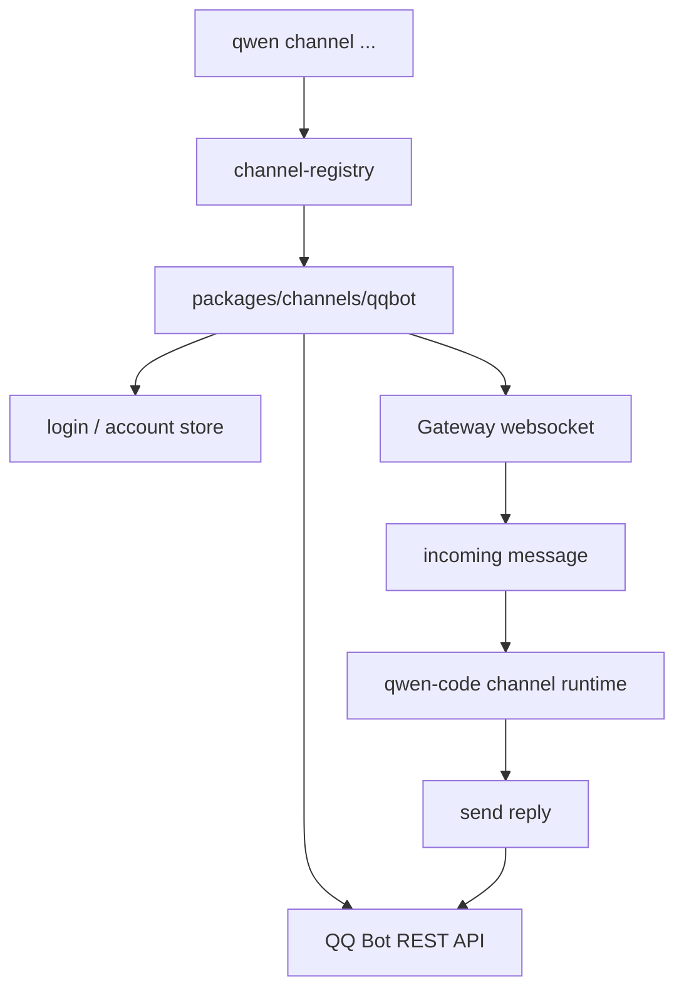

# Channel adapters 技术方案

> 适用范围：`QwenLM/qwen-code` channels 包与 CLI channel registry。
> 涉及 PR：#5202（QQ Bot channel adapter）；近期相关修复 #5414/#5415/#5416/#5417。

---

## 1. 背景与动机

Channel adapters 把 qwen-code 从本地 TUI 扩展到外部消息通道。#5202 新增 QQ Bot 渠道，使 QQ 群/私聊消息可以进入 qwen-code 的 channel runtime，并把回复发回 QQ Bot gateway。

这类能力和 daemon/web-shell 不同：它不负责 HTTP session 管理，而是作为一个 channel package 接入 CLI 的 channel registry，负责账号登录、gateway 连接、消息收发、重连和状态持久化。

---

## 2. QQ Bot 适配器结构

| 模块 | 作用 |
|---|---|
| `QQChannel.ts` | channel lifecycle、gateway 连接、消息分发 |
| `accounts.ts` / `login.ts` | 账号与 token 管理 |
| `api.ts` / `send.ts` | QQ Bot HTTP API 与消息发送 |
| `channel-registry.ts` | CLI 将 `qqbot` 注册为可用 channel |
| `docs/users/features/channels/qqbot.md` | 用户配置与使用文档 |

---

## 3. 近期稳定性修复

#5202 合入后，W25 后半周又补了一组 QQ Bot channel 修复：

| PR | 作用 |
|---|---|
| #5414 | token refresh 失败后持续重试，避免一次失败让 channel 长期不可用。 |
| #5415 | 限制 gateway reconnect retry，防止异常网络下无限重连打满资源。 |
| #5416 | 跟踪并清理 close reconnect timer，避免 timer 泄漏或重复重连。 |
| #5417 | 按账号/会话约束 backup path，降低不同 QQ Bot session 状态串扰风险。 |

---

## 4. 设计约束

- **channel package 独立**：QQ Bot 放在 `packages/channels/qqbot`，通过 registry 挂入，不把渠道协议散进 core。
- **token 与账号本地化**：登录和 token refresh 由 adapter 管理，core 只消费标准化消息。
- **失败可恢复**：gateway reconnect、token refresh retry、timer cleanup 是 channel 长跑稳定性的关键，不应依赖用户重启。

---

## 5. 涉及 PR

| PR | 状态 | 作用 |
|---|---|---|
| #5202 | merged | 新增 QQ Bot channel adapter、docs、package、registry 接入和单测。 |
| #5414/#5415/#5416/#5417 | merged | QQ Bot token refresh、gateway reconnect、timer、session backup path 后续稳定性修复。 |

---

## 6. 已知限制 / 后续

1. **本文只覆盖 QQ Bot**。DingTalk、Weixin、Feishu 等其它渠道在 W25 有零散修复或文档补充，但尚未整理成同等深度专题。
2. **渠道风控与平台限制依赖外部服务**。QQ Bot API 限流、gateway 断连、消息格式差异需要持续用真实账号验证。
3. **多账号隔离是后续关注点**。#5417 已收紧 backup path，但更完整的账号级隔离/迁移策略仍需要继续观察。

_新增于 2026-06-23_
