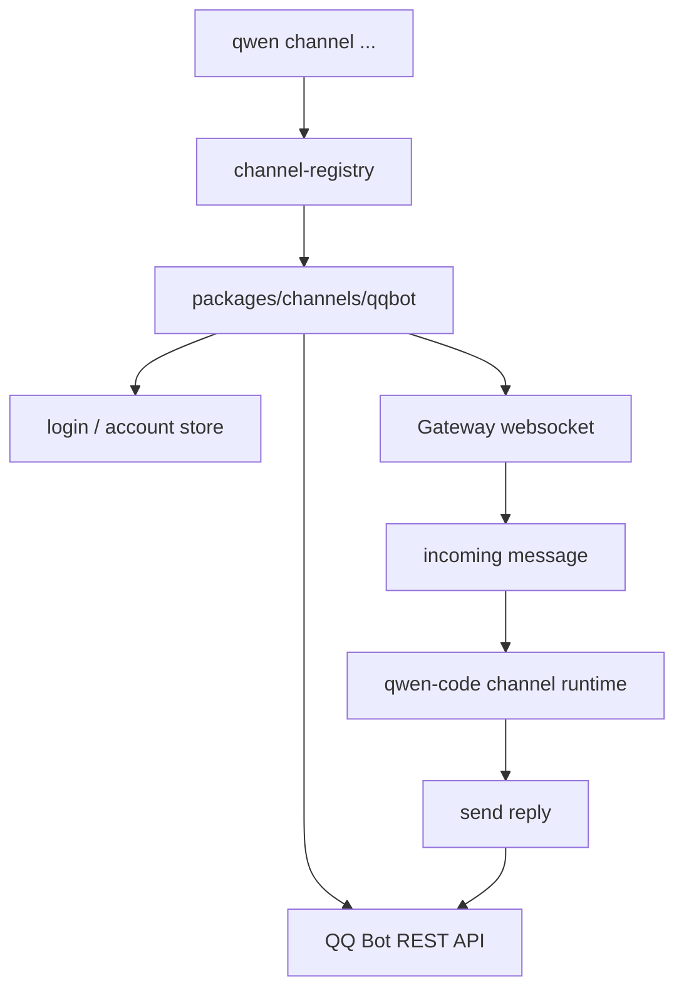

# Channel adapters 技术方案

> 适用范围：`QwenLM/qwen-code` channels 包与 CLI channel registry。
> 涉及 PR：#5202（QQ Bot channel adapter）；近期相关修复 #5414/#5415/#5416/#5417；#5919（Telegram bot command menu）；#5888（qwen tag Phase 0）；#5978（ChannelAgentBridge 抽象）。

---

## 1. 背景与动机

Channel adapters 把 qwen-code 从本地 TUI 扩展到外部消息通道。#5202 新增 QQ Bot 渠道，使 QQ 群/私聊消息可以进入 qwen-code 的 channel runtime，并把回复发回 QQ Bot gateway。

这类能力和 daemon/web-shell 不同：它不负责 HTTP session 管理，而是作为一个 channel package 接入 CLI 的 channel registry，负责账号登录、gateway 连接、消息收发、重连和状态持久化。

#5919 把同类 channel 交互补到 Telegram：启动 Telegram adapter 时向 Telegram `setMyCommands` 注册菜单，让用户能从客户端菜单看到 `/start`、`/help`、`/new`、`/cancel`、`/status` 等命令，并把 `/cancel` 抽成 shared channel command，避免菜单里有命令但 adapter 运行时不处理。

#5888 把 channel 的群聊形态推进到 **qwen tag Phase 0**：在 `sessionScope: 'thread'` 的群聊中，多名成员共享同一个 agent session，因此 runtime 需要把“谁在说话”显式传给模型，并避免裸 `/clear` 一次清掉全群共享上下文。该 PR 不引入新服务，而是在现有 channel adapter + AcpBridge 路径上补 `[sender]` 标记、`/who`、群 `/clear confirm`、collect 双前缀保护、DingTalk `conversationId` 守卫和昵称/引用文本净化。

#5978 再把 adapter-facing 依赖从具体 `AcpBridge` 收窄为 `ChannelAgentBridge` contract。现有 standalone `qwen channel start` 仍由 `AcpBridge` 实现，但 adapter、router 和 plugin 示例只依赖“创建/恢复 session、发送 prompt、订阅事件、清理 session”这类 agent-session 行为，为后续 daemon-backed 或 multi-channel bridge 留出实现空间。

---

## 2. QQ Bot 适配器结构

| 模块 | 作用 |
|---|---|
| `QQChannel.ts` | channel lifecycle、gateway 连接、消息分发 |
| `accounts.ts` / `login.ts` | 账号与 token 管理 |
| `api.ts` / `send.ts` | QQ Bot HTTP API 与消息发送 |
| `channel-registry.ts` | CLI 将 `qqbot` 注册为可用 channel |
| `docs/users/features/channels/qqbot.md` | 用户配置与使用文档 |

---

## 3. 近期稳定性修复

#5202 合入后，W25 后半周又补了一组 QQ Bot channel 修复：

| PR | 作用 |
|---|---|
| #5414 | token refresh 失败后持续重试，避免一次失败让 channel 长期不可用。 |
| #5415 | 限制 gateway reconnect retry，防止异常网络下无限重连打满资源。 |
| #5416 | 跟踪并清理 close reconnect timer，避免 timer 泄漏或重复重连。 |
| #5417 | 按账号/会话约束 backup path，降低不同 QQ Bot session 状态串扰风险。 |

---

## 4. 群共享 session 与 bridge 抽象

### 4.1 qwen tag Phase 0（#5888）

Phase 0 的目标是让“一个群 = 一个共享 agent”可用，而不是立刻实现完整的 proactive agent / memory / governance：

| 子能力 | 作用 |
|---|---|
| `[sender]` prompt marker | 群消息进入共享 `thread` session 前加发送者标记，让模型能区分成员。私聊、已加前缀的重入消息不重复加。 |
| `Envelope.alreadyPrefixed` | collect/coalesce 缓冲时避免对已打标消息二次加 `[sender]`。 |
| 群 `/clear confirm` | 裸 `/clear` 在群里只提示确认；`/clear confirm` 才清共享 session。私聊仍直接清。 |
| `/who` | 只读报告 channel / workspace basename / session scope，不创建新 session，也不泄露绝对路径。 |
| group input hardening | DingTalk 群消息缺 `conversationId` 时丢弃，避免共享 session 绑到过期 webhook；QQ 昵称去括号/换行并限长，引用文本去控制字符并限长。 |
| clear cleanup | `/clear` 清理 queue、active prompt、collect buffer、instructed 等全部 per-session map，避免共享 session 清完仍残留孤儿状态。 |

关键边界：`[sender]` 是模型上下文提示，不是身份认证或权限边界；真正的 sender identity / authorization / group governance 仍属于 qwen tag 后续阶段。Phase 0 保持 DMs 和 `sessionScope: 'user'` 行为不变。

### 4.2 ChannelAgentBridge（#5978）

`ChannelAgentBridge` 是 adapter-facing 的窄合约。它把 channel adapter 需要的 agent-session 行为从当前 standalone `AcpBridge` 具体类中抽出来：

- adapter 和 `SessionRouter` 只依赖 bridge contract；`AcpBridge` 仍作为 `qwen channel start` 的现有实现保留；
- router 可按 bridge session id 移除所有状态，thread-scoped `/clear` / `/status` 使用与 prompt 相同的 routing key；
- restore 拒绝非法 session id，restore/create race 中的 session-death event 会清理 stale mapping；
- `ChannelBase` 在 bridge swap 后重新绑定 listener，避免 prompt stream listener 泄漏；
- QQ 自有 router 继续直接清理 bridge session；外部管理 router 仍由调用方控制。

TypeScript 插件如果显式把 adapter 构造参数标成 `AcpBridge`，应迁移到 `ChannelAgentBridge`；运行时 JavaScript 插件保持结构兼容。这个 PR 还没有实现 `qwen serve --channel` 或 daemon-managed worker，它只是把 adapter 合约提前收窄。

---

## 5. 设计约束

- **channel package 独立**：QQ Bot 放在 `packages/channels/qqbot`，通过 registry 挂入，不把渠道协议散进 core。
- **token 与账号本地化**：登录和 token refresh 由 adapter 管理，core 只消费标准化消息。
- **失败可恢复**：gateway reconnect、token refresh retry、timer cleanup 是 channel 长跑稳定性的关键，不应依赖用户重启。
- **命令菜单必须和 runtime handler 对齐**：Telegram `setMyCommands` 只负责客户端菜单展示；实际 `/cancel` 仍走 `SessionRouter` 的 user/thread/single scope resolution。群聊里的 `/cancel@botname` 会按 Telegram bot_command mention 处理，避免误取消其它 bot 或无关线程。
- **群共享 session 不是身份边界**：#5888 的 `[sender]` marker 是让模型读懂多人上下文的提示；真正的权限/治理不能建立在昵称文本上。
- **adapter contract 优先于具体 bridge 实现**：#5978 后，新 adapter/plugin 应面向 `ChannelAgentBridge` 编程，只有 standalone ACP-backed 启动路径才需要知道 `AcpBridge`。

---

## 6. 涉及 PR

| PR | 状态 | 作用 |
|---|---|---|
| #5202 | merged | 新增 QQ Bot channel adapter、docs、package、registry 接入和单测。 |
| #5414/#5415/#5416/#5417 | merged | QQ Bot token refresh、gateway reconnect、timer、session backup path 后续稳定性修复。 |
| #5919 | merged | Telegram adapter 注册 bot command menu，并把 `/cancel` 抽成 shared channel command，复用 `SessionRouter` scope resolution。 |
| #5888 | merged | qwen tag Phase 0：群共享 session 的 sender attribution、`/who`、群 `/clear confirm`、DingTalk/QQ 输入净化和 per-session map cleanup。 |
| #5978 | merged | 引入 `ChannelAgentBridge` adapter-facing contract，修 router / bridge lifecycle 边界，并保留 `AcpBridge` 作为 standalone 实现。 |

---

## 7. 已知限制 / 后续

1. **本文仍不是所有渠道的等深专题**。QQ Bot、Telegram command menu、qwen tag Phase 0 与 ChannelAgentBridge 已覆盖；DingTalk、Weixin、Feishu 等其它渠道仍主要通过 PR 矩阵登记。
2. **渠道风控与平台限制依赖外部服务**。QQ Bot API 限流、gateway 断连、消息格式差异需要持续用真实账号验证。
3. **多账号隔离是后续关注点**。#5417 已收紧 backup path，但更完整的账号级隔离/迁移策略仍需要继续观察。
4. **Telegram command menu 是展示面，不是权限面**。#5919 不改变 channel auth、session ownership 或消息路由安全边界；菜单注册失败也不应阻断 adapter 主流程。
5. **qwen tag 仍停在 Phase 0**。daemon hosting、durable scheduler、proactive fire、channel memory/governance 仍是后续 PR；当前文档不能把这些 RFC 内容当已落地实现。

_新增于 2026-06-23；#5888/#5978 更新于 2026-06-30_
