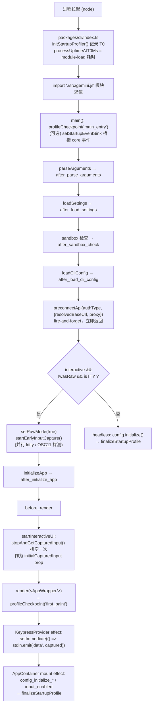
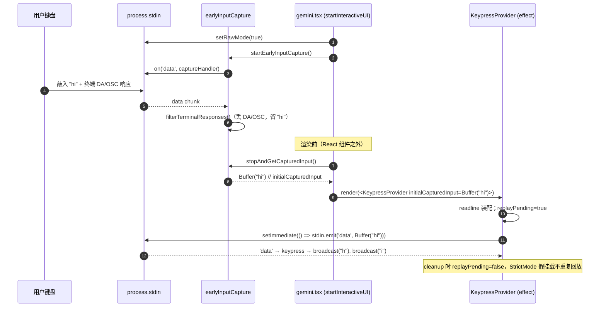
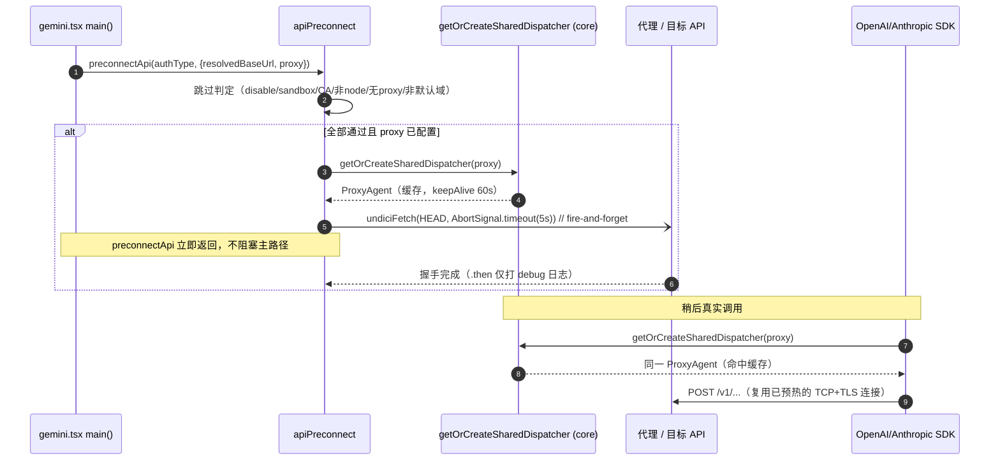
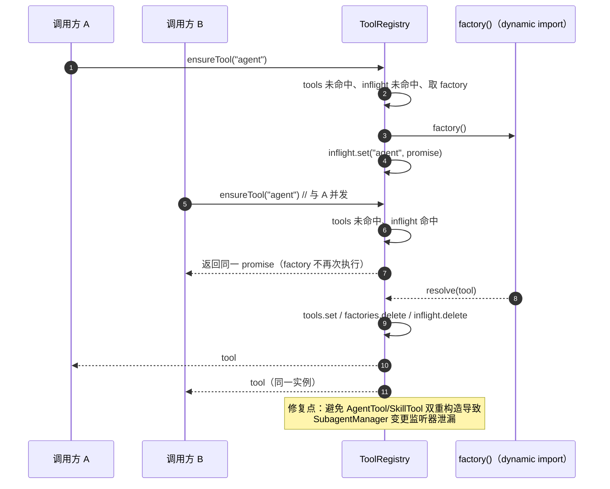

# CLI 启动性能技术方案

> 适用范围：`QwenLM/qwen-code` epic #3011（[P1] Startup Optimization / 启动优化）下已落地的四个启动性能子系统。
> 代码基准：本地 `main` 检出，主要文件 `packages/cli/src/utils/apiPreconnect.ts`、`packages/cli/src/utils/earlyInputCapture.ts`、`packages/cli/src/utils/startupProfiler.ts`、`packages/core/src/tools/tool-registry.ts`，装配点 `packages/cli/index.ts` 与 `packages/cli/src/gemini.tsx`。
> 说明：文中所有结论以仓库当前代码为准；当 PR 描述与现网代码存在演进差异时，以代码为准并在「已知限制」中标注。

---

## 1. 背景与动机

epic #3011 通过与 Claude Code 的对比，识别出 qwen-code 启动路径上的多个瓶颈（原文摘录）：core barrel `export *` 全量加载、`main()` 完全串行、缺少分层入口、esbuild 单体 bundle、缺少 API 预连接、重型依赖未延迟、启动期间丢键、缺少条件编译、性能度量未接入。这些问题对用户的直接体感是三类：

- **冷启动延迟**：从 `qwen` 进程拉起到 REPL 可交互（TTI）耗时偏高，模块求值（module-load）阶段占比大。
- **首 token 延迟**：第一次真实 API 调用要完整付一次 TCP + TLS 握手（约 100–200ms），叠加在网络 RTT 之上。
- **init 期丢键**：REPL 初始化窗口（约 200–500ms）内 `KeypressProvider` 尚未挂载，用户此刻敲入的字符会被静默丢弃。

本方案覆盖 epic #3011 中已合入的四个子任务：

| 子任务 | 主题 | 落地 PR |
| --- | --- | --- |
| #3219 | 启动性能 profiler（度量先行） | #3232 |
| #3221 | 工具懒注册 + inflight 并发去重 | #3297 |
| #3223 | API 预连接降低首调用延迟 | #3318 |
| #3224 | 早期输入捕获防止丢键 | #3319 |

2026-07-18 的 #7145/#7182 把启动性能工作扩展到 daemon ACP child cold startup：#7145 先给 `channel.initialize` 加 opt-in child phase profile，#7182 再基于 P0-A 证据把 TUI-only runtime 从 ACP static startup closure 中移除。2026-07-21 合入的 #7276 继续处理 telemetry heavy cluster：默认 telemetry 关闭时不再静态加载 NodeSDK/exporters/instrumentation，开启时再按 protocol 动态加载对应 exporter chain。2026-07-22 的 #7455 进一步把 undici 移出 ACP eager closure；#7512 把 `@google/genai` 从 session create 之前的静态闭包里移走。2026-07-23 的 #7558 把 ACP telemetry init 后移到 initialize response 之后；#7594 当前 open diff 让 ACP child 继承父进程启用的 Node compile cache。

> 历史：#3085 是「预连接 + 早期输入捕获」的合并版 PR，已 CLOSED，拆分为 #3318 与 #3319 分别合入；其原始实现中的安全缺陷（见 §5、§7）在拆分后被修正。

度量先行（profiler）是这一系列优化的方法论基础：先有可复现的 checkpoint 报告，才能验证每一项优化的收益，避免「凭感觉优化」。

---

## 2. 整体架构

启动时间线由「进程拉起 → 模块求值 → profiler 起点 → 解析参数/加载设置 → 预连接（fire-and-forget） → 早期输入捕获 → 初始化 → 渲染 REPL → 重放缓冲键 → input_enabled」组成。profiler 在每个相位边界打点，预连接与早期捕获都以「不阻塞主路径」为前提启动。



四个子系统的协作关系：

- **profiler** 横跨整条时间线，在 `index.ts`、`gemini.tsx`、`AppContainer.tsx` 三处打点；零开销（默认仅一次环境变量判断）。
- **preconnect** 在 `after_load_cli_config` 之后立即 fire-and-forget，不在关键路径上等待。
- **early-capture** 在 `setRawMode(true)` 后立即挂监听，在 `render()` 前一次性排空，渲染后由 React effect 重放。
- **tool lazy registration** 发生在 `config.initialize()` 内部（`createToolRegistry` 注册工厂 → `warmAll` 预热），是 init 相位的一部分。

---

## 3. 子系统详解

### 3.1 API 预连接（`packages/cli/src/utils/apiPreconnect.ts`）

**目标**：在启动早期发一个 fire-and-forget 的 `HEAD` 请求，预热 TCP + TLS（以及代理 CONNECT 隧道），使随后真正的 API 调用复用同一条连接，省掉首调用的握手开销。

**装配点**：`gemini.tsx:main()`（约 802–815 行），读取 `modelsConfig.getCurrentAuthType()`、`modelsConfig.getGenerationConfig().baseUrl`、`config.getProxy()`，调用 `preconnectApi(authType, { resolvedBaseUrl, proxy })`，整段包在 `try/catch` 中——拿不到 authType 也只是跳过这个可选优化，不影响主流程。

**核心数据**：
- `DEFAULT_BASE_URLS`：按 authType 映射的默认端点（`openai → api.openai.com`、`qwen-oauth → coding.dashscope.aliyuncs.com`、`anthropic → api.anthropic.com`、`dashscope → dashscope.aliyuncs.com`）。
- `ALL_DEFAULT_URLS`：`DEFAULT_BASE_URLS` 的值并入 `getAllProviderBaseUrls()`（`packages/core/src/providers/all-providers.ts:getAllProviderBaseUrls`，铺平所有已注册 provider 的 baseUrl）。`isDefaultBaseUrl()` 以此集合判定是否为「已知默认域」。
- `preconnectFired`：模块级布尔，保证一次进程内只预连接一次。

**`preconnectApi()` 的判定顺序**（命中即返回）：
1. `preconnectFired` 已为真 → 直接返回（fire-once）。
2. `QWEN_CODE_DISABLE_PRECONNECT === '1'` → 置 fired，返回（显式禁用开关）。
3. `isInSandboxMode()`（`process.env['SANDBOX'] !== undefined`）→ 置 fired，返回（sandbox 会重启进程，预连接的连接池随旧进程作废，无意义）。
4. `shouldSkipPreconnect()`（当前仅检查 `NODE_EXTRA_CA_CERTS`）→ 置 fired，返回（企业 TLS 拦截/自定义 CA 下握手语义不可控）。
5. `detectRuntime() !== 'node'`（`packages/core/src/utils/runtimeFetchOptions.ts:detectRuntime`，返回 `'node' | 'bun' | 'unknown'`）→ 置 fired，返回（Bun 等运行时用独立连接池，预热 undici dispatcher 无收益）。
6. **`!options.proxy` → 返回（不置 fired）**：未配置代理时跳过 dispatcher 创建。注释明确这与 `buildFetchOptionsWithDispatcher()` 的「无代理走运行时内建 fetch、不挂自定义 dispatcher」逻辑保持一致——SDK 在无代理时用内建 fetch 的自有连接池，预热 undici 的共享 dispatcher 对它没有帮助。
7. `getPreconnectTargetUrl(authType, resolvedBaseUrl)` 取不到目标 → 返回（不置 fired）。
8. 全部通过：`preconnectFired = true`，`getOrCreateSharedDispatcher(proxy)` 取/建共享 dispatcher，用 **undici 自带的 `fetch`**（而非 Node 内建 fetch，避免 dispatcher 与 fetch 来自不同 undici 大版本导致的 `invalid onError method` 句柄不匹配）发 `HEAD`，带 `AbortSignal.timeout(5_000)` 与自定义 `User-Agent`，`.then/.catch` 仅打 debug 日志（失败被吞，凭据用 `redactProxyCredentials` 脱敏）。

**`isDefaultBaseUrl()` 的子域守卫**：将输入与每个默认 URL 都归一化（转小写、去 `https?://` 前缀、去结尾 `/`），命中条件是
```
normalizedInput === normalizedDefault
  || normalizedInput.startsWith(normalizedDefault + '/')
```
关键在 `+ '/'`：要求默认域之后必须紧跟路径分隔符，因此 `dashscope.aliyuncs.com/compatible-mode/v1` 命中，而伪造域 `dashscope.aliyuncs.com.evil.com` 不会命中（它在默认域后面接的是 `.` 而非 `/`）。这正是修补 #3085 子域伪造缺陷的关键（见 §5、§7）。

**共享 dispatcher**：`getOrCreateSharedDispatcher(proxyUrl)`（`runtimeFetchOptions.ts:175`）以 `proxyUrl` 为 key 缓存一个 `ProxyAgent`（`headersTimeout: 0`、`bodyTimeout: 0`、`keepAliveTimeout: 60_000`）。预连接与后续 SDK 请求取的是**同一个** dispatcher 实例，从而真正复用预热好的连接。

### 3.2 早期输入捕获（`packages/cli/src/utils/earlyInputCapture.ts`）

**目标**：在 CLI 最早能进入 raw 模式的时刻就开始监听 stdin，把 REPL 初始化窗口内用户敲入的字节缓冲下来，待 `KeypressProvider` 挂载后回放，杜绝丢键。

**装配点**（`gemini.tsx:main()`，约 832–840 行，仅在 `config.isInteractive() && !wasRaw && process.stdin.isTTY` 时）：先 `process.stdin.setRawMode(true)`，紧接着 `startEarlyInputCapture()`，并 `registerCleanup(() => stopAndGetCapturedInput())` 保证任何退出路径都摘除监听器。

**缓冲结构**：模块级 `inputBuffer = { chunks: Buffer[], totalBytes, captured }`，分块收集、读取时一次性 `Buffer.concat`，避免 O(n²) 拷贝；`MAX_BUFFER_SIZE = 64 * 1024`（64KB 上限，超限即停止捕获并 warn，提示后续按键会丢）。

**`startEarlyInputCapture()`**：非 TTY 或已在捕获 → 跳过；`QWEN_CODE_DISABLE_EARLY_CAPTURE === '1'` → 跳过；否则在 `process.stdin` 上挂 `'data'` 监听 `captureHandler`。

**`captureHandler`**：每个 chunk 先与上一轮残留的 `pendingTerminalResponse` 拼接，再过 `filterTerminalResponses()`：
- `classifyEscapeSequence(data, idx)` 对 ESC 序列三分类：
  - `terminal`（应过滤）：`ESC P/_/^/]`（DCS/APC/PM/OSC）、以及 `ESC [ ?` 或 `ESC [ >`（DEC 私有模式响应 / DA2 响应）。
  - `user`（应保留）：方向键 `ESC [ A/B/C/D`、功能键 SS3 序列 `ESC O P/Q/R/S`、`ESC [ 1;5A` 等带修饰键序列、普通可打印字符与多字节 UTF-8。
  - `incomplete`：前缀太短无法判定 → 把从该 ESC 起的尾巴作为 `trailingPartialTerminalResponse` 留到下一个 chunk。
- 命中 `terminal` 的序列由 `skipTerminalResponse()` 跳过（按 OSC 的 `BEL`/`ST`、DCS/APC/PM 的 `ST`、CSI 的 `0x40–0x7E` 终止符寻找边界）；尾部不完整同样回传留存。
- 过滤后的字节按 64KB 上限（必要时截断）追加进 `chunks`。

**排空与回放**：
- `stopEarlyInputCapture()` 摘除监听、置 `captured = true`。
- `getAndClearCapturedInput()` 拼接 `chunks`；对残留的 `pendingTerminalResponse` 调用 `shouldReplayPendingAtStop()`——空则丢，单字节 `ESC` 保留，其余按 `classifyEscapeSequence` 为 `user` 才保留（即「疑似终端响应前缀」丢弃，「疑似用户输入前缀」回放）。
- `stopAndGetCapturedInput()` 把上面两步合成一个原子操作，是对外首选 API。

**与 React 渲染 / StrictMode 的衔接**（`gemini.tsx` + `KeypressContext.tsx`）：
- 排空发生在 `startInteractiveUI()` 中、`render()` **之前**（`gemini.tsx:308` 的 `const initialCapturedInput = stopAndGetCapturedInput()`），且**刻意放在任何 React 组件/effect 之外**。这样即便 StrictMode 触发「挂载→清理→重挂载」，每次读到的都是同一个稳定 prop，而不是已被清空的模块级缓冲。
- `initialCapturedInput` 作为 prop 传入 `<KeypressProvider>`（`gemini.tsx:327`）。`KeypressContext.tsx` 内 `capturedInput = initialCapturedInput ?? Buffer.alloc(0)`，在 readline 装配完成后，若有内容则置 `replayPending = true` 并 `setImmediate(() => { if (!replayPending) return; stdin.emit('data', capturedInput); })`——延后一个事件循环 tick 是为确保订阅者已就位；effect 的 cleanup 把 `replayPending` 置回 `false`，从而 StrictMode 的首次「假挂载」不会重复回放。
- 注：仅当 `process.env['DEBUG']` 时才用 `<React.StrictMode>` 包裹（`gemini.tsx:351–358`），但排空在组件外完成的设计使其在 StrictMode 下也安全。

### 3.3 工具懒注册与 inflight 去重（`packages/core/src/tools/tool-registry.ts`）

**目标**：把内建工具从「构造时即实例化」改为「注册工厂、首用才实例化」，并修复并发实例化、`stop()` 资源泄漏、缓存命中后工厂残留三个问题。

**三张表**（`ToolRegistry` 字段）：`tools: Map<name, tool>`（已实例化）、`factories: Map<name, ToolFactory>`（已注册未实例化，`ToolFactory = () => Promise<AnyDeclarativeTool>`）、`inflight: Map<name, Promise<tool>>`（正在加载，用于并发去重）。

**注册**：`registerFactory(name, factory)` 先过 `isToolDisabled()`（`disabledTools` 集合）再写入 `factories`，**不触发任何 `import()`**。装配在 `Config.createToolRegistry()` 的 `registerLazy()`（`config.ts:3773–3795`）——先经 `permissionManager.isToolEnabled()` 鉴权，通过才 `registry.registerFactory(toolName, factory)`，工厂体是 `dynamic import()`。

**按需加载 `ensureTool(name)`**（并发安全核心）：
1. `tools` 命中 → 顺手 `factories.delete(name)`（清理残留工厂，避免 `warmAll` 重新加载已实例化工具）后返回缓存。
2. `inflight` 命中 → 返回**同一个** in-flight promise（并发同名调用共享，工厂只执行一次）。
3. 取 `factory`；无 → 返回 `undefined`。
4. 执行 `factory().then(写 tools / 删 factory / 删 inflight).catch(删 inflight 后 rethrow)`，并把该 promise 存入 `inflight`。失败时清理 inflight 以允许后续重试。

**批量预热 `warmAll({ strict })`**：取 `factories.keys()` 为 pending，`Promise.allSettled(pending.map(ensureTool))` 并行加载；`strict: true` 时把首个失败 rethrow（启动期用，坏工具立即暴露而非留下半初始化会话）。

**`stop()`**：先 `await Promise.allSettled(this.inflight.values())` 等所有在途工厂落定，再统一 `dispose()`——确保 `stop()` 之后才加载完成的工具也被清理，不泄漏监听器与资源。

**关键现实：懒加载在启动路径上并未真正生效。** `Config.initialize()` 在 `config.ts:1561` 调用 `await this.toolRegistry.warmAll({ strict: true })`，把所有已注册工厂在启动时**全部急加载**。换言之，注册阶段是「懒」的，但 init 末尾立刻 `warmAll` 把它们全拉起，正常启动路径上并没有获得「按需推迟实例化」的收益（详见 §5、§7）。

### 3.4 启动 profiler（`packages/cli/src/utils/startupProfiler.ts`）

**目标**：以极低开销采集启动各相位的高精度时间戳，落地为 JSON 报告，作为所有启动优化的度量基线（对标 Claude Code 的 `PHASE_DEFINITIONS`）。

**起点与 import-order**（`packages/cli/index.ts`）：文件顶部 `import { initStartupProfiler }` 后第 12 行**先调用** `initStartupProfiler()`，再 `import './src/gemini.js'`（注释：「Must run before any other imports to capture the earliest possible T0」）。打包产物（esbuild 单文件）保留该顺序，使 T0（`performance.now()`）在 gemini 模块求值前记录；`processUptimeAtT0Ms = process.uptime()` 则量出「进程拉起 → T0」的 module-load 耗时，对应派生相位 `module_load`。

**门控（SANDBOX）**：`initStartupProfiler()` 先 `resetStartupProfiler()` 保证幂等；仅当 `QWEN_CODE_PROFILE_STARTUP === '1'` 才继续；且默认**只有 sandbox 子进程**（`process.env['SANDBOX']`）才采集，除非显式 `QWEN_CODE_PROFILE_STARTUP_OUTER === '1'` 才让外层（pre-sandbox）进程也采集（外层报告文件名加 `outer-` 前缀以区分，避免重复报告）。堆快照默认开启，`QWEN_CODE_PROFILE_STARTUP_NO_HEAP === '1'` 可关闭（用于测量堆调用自身的 Heisenberg 开销）。

**打点 API**：
- `profileCheckpoint(name)`：顺序、唯一的相位边界点。
- `recordStartupEvent(name, attrs?)`：离散事件，可多次触发，`MAX_EVENTS = 1024` 兜底上限，`finalized` 后丢弃（防止长会话里 `setTools()` 的 `gemini_tools_updated` 无限累积）。
- `setInteractiveMode(value)` / `isStartupProfilerEnabled()` / `finalizeStartupProfile(sessionId?)` / `getStartupReport()` / `resetStartupProfiler()`。

**checkpoint 分布**：`gemini.tsx` 内 `main_entry`、`after_parse_arguments`、`after_load_settings`、`after_sandbox_check`、`after_load_cli_config`、`after_initialize_app`、`before_render`、`first_paint`（`render()` 返回时刻，注释明确这是「render 调用返回」而非字面像素绘制）；`AppContainer.tsx` 的挂载 effect 补 `config_initialize_start`/`config_initialize_end`/`input_enabled`（约 508–512 行）。core 侧事件（`Config.initialize`、MCP 发现、`GeminiClient.setTools`）通过 `gemini.tsx:main()` 里 `if (isStartupProfilerEnabled()) setStartupEventSink(...)` 桥接进来——门控判断避免未开启时每次 `recordStartupEvent` 都过一层 arrow wrapper。

**派生相位** `computeDerivedPhases()`：`module_load`、`settings_time`、`config_time`、`init_time`、`pre_render`、`to_first_paint`、`to_input_enabled`（真实 TTI）、`config_initialize_dur`、`mcp_first_tool`、`mcp_all_settled`、`gemini_tools_lag`。其中 `gemini_tools_lag` 刻意取**第一个时间戳 ≥ `mcp_first_tool_registered`** 的 `gemini_tools_updated` 事件，避开 `GeminiClient.initialize()`/`SkillTool` 早于 MCP 发现触发的 `setTools()` 造成的误导性负值。

**落盘与 finalize**：`finalizeStartupProfile()` 把报告写到 `~/.qwen/startup-perf/<prefix><timestamp>-<sessionId>.json`（`prefix` 为外层进程的 `outer-`），并向 stderr 打印路径。交互路径在 `AppContainer.tsx:672` 的挂载 effect 内 finalize（这样 `first_paint`/`config_initialize_*`/`input_enabled`/MCP 事件才齐全）；非交互非 stream-json 路径在 `gemini.tsx:1039`（`config.initialize()` + `waitForMcpReady()` 之后）finalize；stream-json 路径延到 `Session.ensureConfigInitialized()` 内 finalize。

### 3.5 ACP channel startup profile 与 TUI static closure 瘦身（#7145/#7182）

#7145 在 ACP initialize 上增加可选 `_meta.qwen.daemon.channelStartupProfile.v = 1` 协商。父进程请求后，child 在 Gemini import 前启用轻量 `acp-startup-profiler`，记录 process/module load、bootstrap config、initialize handler、tool/config setup 和 response transport 等固定 phase/config timing；父进程只接受 bounded v1 profile，并把校验后的 `qwen-code.daemon.acp_startup.*` attributes 写入既有 `channel.initialize` span。缺失、畸形、旧版本或 telemetry 抛错都 fail-open，不改变 readiness、timeout、cleanup、retry 或 Session 语义。

#7182 基于 #7145/P0-A profile 收敛 ACP static closure。`classifyApiError` 从 React hook 移到纯 `packages/cli/src/utils/classify-api-error.ts`，suggestion data contract 移到 `ui/utils/suggestions.ts`；`/init` 覆盖确认、`/approval-mode auto`、`/history expand-now` 的 React-only 依赖改为动作执行时动态导入。`scripts/check-serve-fast-path-bundle.js` 新增 metafile guard，禁止 Ink、React、React Reconciler、Yoga 进入 ACP static closure，同时允许 intentional dynamic import。

同 SHA 2C4G 对照中，#7182 将 ACP import P50 从 115.06ms 降到 52.00ms，`channel.initialize` P50 降 62.64ms，process-to-first-Session P50 降 66.85ms；preheated pairs、pooled cold P95 和 RSS gate 均未回退。该优化不改变 initialize barrier、Config phases、failure semantics、command availability 或 Session behavior，代价是三个低频交互命令首次执行时承担一次动态 import 成本。

### 3.6 telemetry SDK lazy loading 与 exporter split（#7276）

#7276 解决的是 #7182 之后仍残留在 ACP/static startup closure 里的 telemetry cluster。旧路径即使 `telemetry.enabled=false`，也会在模块求值期加载 OpenTelemetry NodeSDK、OTLP HTTP/gRPC exporters、protobuf 与 instrumentation；对 daemon ACP child cold start 来说，这些模块既不产生功能收益，又会增加 import time 与 bundle 体积。

最终实现把 `packages/core/src/telemetry/sdk.ts` 拆成轻量 facade 和 heavy `sdk-impl.ts`：disabled path 只做快速短路，不 import heavy implementation；enabled path 通过 async single-flight dynamic import 初始化。HTTP exporter、gRPC exporter、OTLP URL helper 与 file exporter 分离，`outfile` 模式不加载 OTLP，HTTP 模式不加载 gRPC，gRPC 模式不加载 HTTP exporter chain。

装配层也分两类：daemon runtime 在初始化 daemon metrics 前显式 await telemetry init，保证 metrics provider 准备好；Config/startup 这类普通路径使用 fire-and-forget prefetch，避免用户首次 prompt 等待 telemetry import。`scripts/check-serve-fast-path-bundle.js` 扩展 bundle guard，禁止 `@opentelemetry/sdk-node`、grpc/protobuf/exporter 等 telemetry heavy 模块回到 ACP static closure；esbuild 对 NodeSDK 内部 env-var auto exporter require 做 stub，避免 bundler 静态追踪把两条 protocol chain 都拉进来。

### 3.7 undici lazy loading（#7455）

#7455 解决 telemetry 懒加载后剩余的最大第三方启动成本：`undici` 同时被 CLI/core 多个路径静态导入，代理 dispatcher、API preconnect、IDE client、GitHub setup、自更新和 web-search 即使还没有网络请求也会把 undici 解析/编译进 ACP child。

最终实现是在 `packages/cli/src/utils/load-undici.ts` 与 core 侧 runtime fetch helpers 中各自保留 package-local single-flight loader。helper 动态 import undici 后做 CommonJS default-only chunk 归一化，避免 esbuild 打包后 `const { Agent } = await import('undici')` 解构出 `undefined`。两个包不共享 helper，是因为 CLI/core 各自解析自己的 undici 副本，测试 mock 也需要按包命中。

所有原静态导入点改为运行时加载，但顺序不变：`--proxy` / settings proxy 的 dispatcher 安装在 config initialize 中被 await，channel proxy 在 channel start 继续前 await，保证首个网络请求不会跑在 dispatcher 之前。`scripts/check-serve-fast-path-bundle.js` 增加 undici static closure blacklist，防止后续改动把 undici 重新拉进 ACP eager closure。

### 3.8 Google GenAI SDK lazy loading（#7512）

#7512 是 #7264 lazy-loading candidate 3 的最终落地。问题是 `@google/genai` 仍在 ACP bootstrap static closure 中；仅把 provider import 改成 dynamic 还不够，因为 ACP session create 会急切构造 content generator，SDK 成本会从 initialize 阶段挪到 `POST /session` 阶段。

当前方案为 core orchestration 提供 package-local、与 SDK 行为对齐的同步 surface：请求/content normalization、compat response class 和少量同步 helper 不再依赖官方 SDK 模块。真正的 provider construction 和 logging decorator 通过 single-flight lazy content generator 在首次 async model operation 时加载；两个首次操作并发时共享同一 import/construct。配置校验、runtime fetch preparation 和 Qwen OAuth cached credential acquisition 仍保持 eager，以免 session accepted 后才发现 auth 不可用。

MCP tool adaptation 仍在 discovery/direct invocation 时加载官方 SDK，因为它需要 SDK adapter 能力。bundle guard 对 ACP static closure 加 `@google/genai` blacklist，要求 static closure 中 SDK input 为 0，同时允许 dynamic provider/MCP chunks 保留 SDK。

### 3.9 ACP telemetry initialization defer（#7558）

#7558 在 #7276 lazy telemetry facade 基础上进一步缩短 ACP child protocol initialize path。旧路径在写出 initialize result 前就可能启动 telemetry init；即使 telemetry 已经 lazy，dynamic import / SDK startup 仍会落在 daemon channel readiness 的关键路径。

最终实现让 `runAcpAgent` 观察 NDJSON transport 的 incoming `initialize` request id，并在成功写出同一 request id 的 initialize result 后才触发 telemetry init。普通 interactive TUI、prompt-interactive、headless 和 daemon parent 保持原有 telemetry 时序；失败 initialize 或非 matching response 不会启动 telemetry。这样 host 先拿到 protocol readiness，再让 ACP child 在后台完成 telemetry facade 的 single-flight init。

### 3.10 ACP child compile cache propagation（#7594，当前 open）

#7594 处理 Node compile cache 只在父进程生效的问题。production `serve` entry 已启用 module compile cache，但 spawned ACP child 没有同一 cache directory，因此仍要重新编译常用模块。

当前 open diff 在 `scripts/cli-entry.js` 中，当 Node 报告本进程新启用 compile cache 时，把 resolved cache directory 写入环境，让后续 ACP child 继承。它不会覆盖用户已有配置，也不会在 disabled、failed 或 unsupported 情况下发布目录。`packages/cli/src/cli.test.ts` 覆盖成功传播、用户配置不覆盖和失败/禁用边界。

---

## 4. 关键流程（时序图 / 调用链）

### 4.1 早期捕获缓冲 → 渲染后 setImmediate 重放



### 4.2 预连接 fire-and-forget + 后续真实请求复用 dispatcher



### 4.3 ensureTool 并发去重（两个并发调用共享同一 inflight promise）



---

## 5. 关键设计决策与权衡

- **预连接只打默认域、只发无凭据 HEAD**：`getPreconnectTargetUrl()` 仅对 `isDefaultBaseUrl()` 命中的端点预连接；自定义 URL 可能不接受 `HEAD`、或需要 mTLS/私有部署配置，盲目预热反而可能报错或泄露信息。`HEAD` 不带 body、不带鉴权头，只为完成握手；`AbortSignal.timeout(5s)` 限定资源生命周期。
- **代理隧道复用而非「有代理就跳过」**：当前实现的取舍与 #3085 相反——**有代理时才预连接**（`!options.proxy → return`），用 `getOrCreateSharedDispatcher(proxy)` 预热同一个 `ProxyAgent`，让后续 SDK 请求复用代理 CONNECT 隧道 + TLS；无代理时 SDK 走运行时内建 fetch 的自有连接池，预热共享 dispatcher 无收益，故跳过。这与 `buildFetchOptionsWithDispatcher()` 的「无代理不挂自定义 dispatcher」逻辑严格对齐，避免行为不一致。
- **子域伪造守卫**：`isDefaultBaseUrl()` 用 `=== || startsWith(default + '/')` 而非裸 `startsWith(default)`，是对 #3085 安全缺陷的针对性修补（见 §7）。
- **early-capture 对终端响应做白/黑名单过滤，但对 CPR 存在缺口**：过滤掉 Kitty 协议探测副作用产生的 DA/DA2/OSC/DCS/APC 响应，保留方向键/功能键等真实输入。但 `classifyEscapeSequence` 对 `ESC [` 只把第三字节为 `?`/`>` 视为 terminal——**光标位置报告 CPR（`ESC [ row;col R`）/ DSR 的第三字节是数字**，会被判为 `user` 而漏过滤、混入用户输入（见 §7）。
- **懒注册 vs `warmAll` 的现实**：注册侧做了完整的工厂化与并发去重，但 `Config.initialize()` 末尾 `warmAll({ strict: true })` 立即全量预热，启动路径上拿不到「推迟实例化」的时间收益。这是有意为之的折中——`warmAll` 让 telemetry 能同步访问工具元数据、坏工具在 `strict` 下立即暴露——真正的懒加载收益要等 esbuild code splitting（#3226）启用后才能兑现。
- **profiler 默认仅 SANDBOX 采集**：避免 sandbox 外层 + 子进程产生重复报告；代价是普通（无 sandbox）运行默认不出报告（见 §7）。零开销原则使其可常驻代码：未开启时仅一次环境变量比较。

---

## 6. 涉及 PR

| PR | 状态 | 子主题 | 作用 |
| --- | --- | --- | --- |
| #3232 | MERGED | 启动 profiler（#3219） | `startupProfiler.ts` + `gemini.tsx`/`AppContainer.tsx` checkpoint 埋点；`QWEN_CODE_PROFILE_STARTUP=1` 写 `~/.qwen/startup-perf/` JSON 报告；默认仅 sandbox 采集，零开销 |
| #3297 | MERGED | 工具懒注册 + inflight 去重（#3221） | `ToolRegistry` 引入 `registerFactory`/`ensureTool`/`warmAll`/`inflight`；修并发双实例化、`stop()` 资源泄漏、缓存命中后工厂残留 |
| #3318 | MERGED | API 预连接（#3223） | `apiPreconnect.ts` fire-and-forget `HEAD` 预热共享 undici dispatcher；新增 dashscope 白名单与子域伪造守卫；以 undici 自带 fetch 规避版本错配 |
| #3319 | MERGED | 早期输入捕获（#3224） | `earlyInputCapture.ts` 缓冲 + 终端响应过滤 + 64KB 上限；`setImmediate` 在 `KeypressProvider` 挂载后重放，排空置于 React 之外以兼容 StrictMode |
| #3085 | CLOSED（已拆分） | 预连接 + 早期输入捕获合并版 | 拆分为 #3318 + #3319 分别合入；原始 `isDefaultBaseUrl` 子域伪造缺陷在 #3318 修正 |
| #6349 | MERGED | session start profiler（#6312） | `GeminiClient.startChat()` opt-in JSONL stage timing，记录 tool warm、history、system instruction、hook、setTools 等阶段；不记录 prompt/path/session id/tool name |

epic 父任务 #3011 [P1] Startup Optimization（OPEN）。

---

## 各 PR 代码贡献

### #3318 API preconnect
- **实现模式**：fire-and-forget HEAD 请求 + 共享 undici dispatcher 缓存。`apiPreconnect.ts:preconnectApi()` 按 `preconnectFired` 布尔做单次守卫，依次跳过 disable 环境变量、sandbox、`NODE_EXTRA_CA_CERTS`、非 node 运行时，全部通过后调用 `getOrCreateSharedDispatcher(proxy)` 取缓存的 `ProxyAgent`/`Agent`，发 `fetch(url, {method:'HEAD', signal:AbortSignal.timeout(5_000), dispatcher})`，`.then/.catch` 仅打 debug 日志。
- **关键代码**：`runtimeFetchOptions.ts:getOrCreateSharedDispatcher()` 新增 `dispatcherCache: Map<string|undefined, Dispatcher>`，以 proxyUrl 为 key 缓存实例（`keepAliveTimeout: 60_000`），并把原 `buildFetchOptionsWithDispatcher()` 内联创建改为取缓存——确保预连接与后续 SDK 请求共享同一连接池。`isDefaultBaseUrl()` 归一化后用 `=== || startsWith(default + '/')` 防子域伪造。
- **装配点**：`gemini.tsx:main()` 在 `after_load_cli_config` 后 `try/catch` 调用，拿不到 authType 只跳过不阻塞。`core/index.ts` 新增 `detectRuntime`/`getOrCreateSharedDispatcher` 导出。
- **测试**：`apiPreconnect.test.ts` 覆盖默认域、子域伪造、dashscope 区域端点、sentinel 回退、单次触发、sandbox 跳过等 17 个用例。`runtimeFetchOptions.test.ts` 新增共享 dispatcher 同一性断言。附 `scripts/benchmark-api-latency.mjs` 基准脚本。
- **边界**：`!options.proxy → return`（不置 fired），无代理时不预连接——SDK 走内建 fetch 自有连接池，预热共享 dispatcher 无收益。

### #3319 early input capture
- **实现模式**：`earlyInputCapture.ts` 模块级 `inputBuffer = {chunks: Buffer[], totalBytes, captured}` 分块收集、读取时 `Buffer.concat` 避免 O(n^2)；`MAX_BUFFER_SIZE = 64*1024` 上限，超限 `stopEarlyInputCapture()` + warn。
- **关键代码**：`captureHandler` 对每个 chunk 调 `filterTerminalResponses()` —— `classifyEscapeSequence(data, idx)` 三分类（`terminal`/`user`/`incomplete`）：`ESC P/_/^/]` 判 terminal，`ESC [ ?`/`ESC [ >` 判 terminal（DEC 私有 / DA2），`ESC [ A/B/C/D`、`ESC O P/Q/R/S` 判 user（方向键 / 功能键），不完整留 `pendingTerminalResponse` 到下一 chunk。`skipTerminalResponse()` 按 OSC 的 `BEL`/`ST`、DCS/APC/PM 的 `ST`、CSI `0x40–0x7E` 终止符跳过。
- **排空与回放**：`stopAndGetCapturedInput()` 原子操作在 `gemini.tsx:startInteractiveUI()` 的 `render()` **之前**（React 组件外）执行，返回值作 `initialCapturedInput` prop 传入 `<KeypressProvider>`。`KeypressContext.tsx` 中 `capturedInput = initialCapturedInput ?? Buffer.alloc(0)`，非空时 `replayPending=true` + `setImmediate(() => stdin.emit('data', capturedInput))`；cleanup 把 `replayPending=false`，StrictMode 假挂载不重复回放。
- **装配点**：`gemini.tsx:main()` 在 `setRawMode(true)` 后立即 `startEarlyInputCapture()`，`registerCleanup(() => stopAndGetCapturedInput())`。
- **测试**：`earlyInputCapture.test.ts` 用 `PassThrough` mock stdin，覆盖生命周期、DEC/DA2/OSC/DCS 过滤、跨 chunk 拆分、UTF-8 多字节、64KB 上限等约 25 个用例。

### #3297 lazy tool registration
- **实现模式**：`ToolRegistry` 新增三张表——`tools: Map<name, tool>`、`factories: Map<name, ToolFactory>`（`ToolFactory = () => Promise<AnyDeclarativeTool>`）、`inflight: Map<name, Promise<tool>>`。`registerFactory(name, factory)` 仅写 `factories`，不触发 `import()`。
- **关键代码**：`tool-registry.ts:ensureTool(name)` —— (1) `tools` 命中 → 顺手 `factories.delete` 清残留后返回；(2) `inflight` 命中 → 返回同一 promise（并发去重核心）；(3) 取 factory 执行，promise 存入 `inflight`，resolve 后写 `tools`/删 `factory`/删 `inflight`，reject 时仅删 `inflight` 允许重试。`warmAll({strict})` 用 `Promise.allSettled(pending.map(ensureTool))` 并行加载，`strict:true` 时 rethrow 首个失败。
- **`stop()` 修复**：先 `await Promise.allSettled(this.inflight.values())` 等所有在途工厂落定，再统一 `dispose()`——防止 `stop()` 后加载完成的工具泄漏监听器。`getAllTools()`/`getFunctionDeclarationsFiltered()` 在 `factories.size > 0` 时打 warn。`getAllToolNames()` 合并 `tools.keys()` + `factories.keys()`。
- **装配**：`Config.createToolRegistry()` 的 `registerLazy()` 经 `permissionManager.isToolEnabled()` 鉴权后 `registry.registerFactory(toolName, factory)`；`Config.initialize()` 末尾 `await this.toolRegistry.warmAll({strict:true})` 全量预热。
- **现实**：esbuild 单文件 bundle 下 `dynamic import()` 仅从内存取引用、不推迟模块求值，加之 `warmAll` 急加载，启动路径上零时间收益；收益要等 #3226 code splitting。

### #3232 startup profiler
- **实现模式**：`startupProfiler.ts` 模块级状态 `enabled/t0/processUptimeAtT0Ms/checkpoints[]/finalized`。`initStartupProfiler()` 先 `resetStartupProfiler()` 幂等，仅 `QWEN_CODE_PROFILE_STARTUP==='1'` + `process.env['SANDBOX']` 时启用，记录 `t0 = performance.now()` 与 `processUptimeAtT0Ms = process.uptime()*1000`（量出 module-load 耗时）。
- **关键代码**：`profileCheckpoint(name)` 记录 `{name, timestamp: performance.now()}`；`getStartupReport()` 用相邻 checkpoint 差值算各相位 `durationMs`，返回含 `processUptimeAtT0Ms`/`totalMs`/`phases[]`/`nodeVersion`/`platform`/`arch` 的 JSON。`finalizeStartupProfile(sessionId)` 写 `~/.qwen/startup-perf/<timestamp>-<sessionId>.json` + stderr 打印路径，`finalized` 标志防二次写入。
- **装配点**：`packages/cli/index.ts` 顶部 `initStartupProfiler()` **先于** `import './src/gemini.js'`（注释 "Must run before any other imports to capture the earliest possible T0"）。`gemini.tsx:main()` 内 `profileCheckpoint('main_entry')`/`after_parse_arguments`/`after_load_settings`/`after_sandbox_check`/`after_load_cli_config`/`after_initialize_app`/`before_render`，`finalizeStartupProfile(config.getSessionId())` 在 `before_render` 之后调用。
- **测试**：`startupProfiler.test.ts` 覆盖关闭/sandbox 外/启用三态，验证 checkpoint 收集、`durationMs >= 0`、JSON 落盘路径含 sessionId、幂等 finalize、write 失败不抛异常。
- **边界**：默认仅 sandbox 子进程采集（避免外层 + 子进程重复报告），普通运行需 `SANDBOX=1` 或 `QWEN_CODE_PROFILE_STARTUP_OUTER=1`；零开销原则——未启用时仅一次环境变量比较。

### #6349 session start profiler（MERGED）

- **问题**：#6312 后续优化需要 `GeminiClient.startChat()` 内部阶段耗时；CLI startup profiler 只能看到更粗的进程启动阶段，无法判断 system instruction、history、tool syncing 或 SessionStart hook 哪个主导 session 初始化成本。
- **实现模式**：`session-start-profiler.ts` 仅在 `QWEN_CODE_PROFILE_SESSION_START=1` 时启用，把 JSONL 记录写到 runtime output dir 的 `session-start-perf/`；禁用时不写文件、不读高精度时钟。
- **装配点**：`client.ts:GeminiClient.startChat()` 用 profiler 包住 `tool_registry_warm`、`resume_deferred_tool_reveal`、`deferred_reminder_resolution`、`initial_chat_history`、`skill_reminder_seed`、`system_instruction`、`gemini_chat_construct`、`orphan_tool_use_repair`、`session_start_hook`、`session_start_context_apply` 和 `set_tools`。
- **隐私边界**：只记录静态 stage name、source、success、总耗时、阶段耗时和聚合计数；不记录 prompt、path、session id、model response、hook output 或 tool name。
- **状态**：已合入 `main`；本文按 merged diff 记录最终实现。

### #3085（CLOSED，已拆分）
- 为 #3318 + #3319 的合并版 PR，已关闭。原始 `isDefaultBaseUrl` 使用裸 `startsWith` 存在子域伪造缺陷（`dashscope.aliyuncs.com.evil.com` 误命中），在 #3318 修正为 `=== || startsWith(default + '/')`。

---

## 7. 已知限制 / 后续

- **#3085 的 `isDefaultBaseUrl` 子域伪造（已在 #3318 修）**：#3085 原始实现为 `Object.values(DEFAULT_BASE_URLS).some(url => normalized.startsWith(url.toLowerCase()))`，裸 `startsWith` 会让 `dashscope.aliyuncs.com.evil.com` 命中 `dashscope.aliyuncs.com`，把预连接打到伪造域。当前代码改为 `=== || startsWith(default + '/')`，要求默认域后紧跟 `/`，缺陷已闭合。
- **early-capture 漏过滤 CPR/DSR**：`classifyEscapeSequence` 对 `ESC [` 仅识别第三字节 `?`(0x3f)/`>`(0x3e) 为终端响应（覆盖 DEC 私有模式响应、DA2），但光标位置报告 `ESC [ row;col R` 与设备状态报告的第三字节为数字，会被判为 `user` 而进入回放缓冲，可能在 REPL 输入里混入 `R` 等杂字符。后续应在 CSI 分类里识别以 `R`（CPR）/`n`(DSR) 结尾且参数为纯数字的响应序列。
- **#3297 懒加载无启动收益，且「修 P0 并发 bug」叙述偏夸大**：PR 自述「esbuild 单文件 bundle 下 `dynamic import()` 只是从内存取引用、不推迟模块求值，因此本 PR 不影响启动时间」，加之 `Config.initialize()` 的 `warmAll({strict:true})` 会全量急加载，启动路径上零收益（收益要等 #3226 code splitting）。所谓「P0 并发实例化 bug」（同名工具被并发 `ensureTool` 各跑一次 factory、导致 `AgentTool`/`SkillTool` 重复构造泄漏监听器）在现实启动路径上很难触发——`warmAll` 对每个 name 只 `ensureTool` 一次，其余调用方（`client.ts`/`geminiChat.ts` 的 `warmAll`）执行时工具多已落缓存；`inflight` 去重是正确且必要的健壮性加固，但「P0」定级与实际触发面不太相称。
- **profiler 仅 SANDBOX 下出报告**：默认仅 sandbox 子进程采集，普通 `QWEN_CODE_PROFILE_STARTUP=1`（无 `SANDBOX`、未设 `QWEN_CODE_PROFILE_STARTUP_OUTER=1`）不会落盘任何报告。日常本地剖析需 `QWEN_CODE_PROFILE_STARTUP=1 SANDBOX=1` 或显式开 `..._OUTER=1`；文档/工具链应明确这一前置条件，避免「开了开关却找不到报告」。
- **预连接当前对无代理用户实为 no-op**：`!options.proxy → return` 意味着绝大多数未配置代理的用户走不到真正的 `HEAD` 预热分支（这是相对 #3318 原始描述「默认域 HEAD 预热」的演进）。若要为无代理用户也兑现首调用提速，需要一条不依赖共享 dispatcher、直接预热运行时内建 fetch 连接池的路径。
- **import-order 依赖打包顺序**：`index.ts` 中 `initStartupProfiler()` 先于 `import './src/gemini.js'` 的 T0 早捕获，依赖 esbuild 打包保留语句顺序；若改为纯 ESM 运行（import 提升）或调整打包策略，T0 的「早于模块求值」语义需重新验证。
- **后续方向（epic #3011 未尽项）**：分层零加载入口（`--version`/`--help` 零导入）、core barrel 拆分按需导入、重型依赖（OpenTelemetry/highlight.js/React-Ink）动态加载、esbuild code splitting（#3226，懒注册收益的真正前置），均尚未在本批 PR 覆盖。
