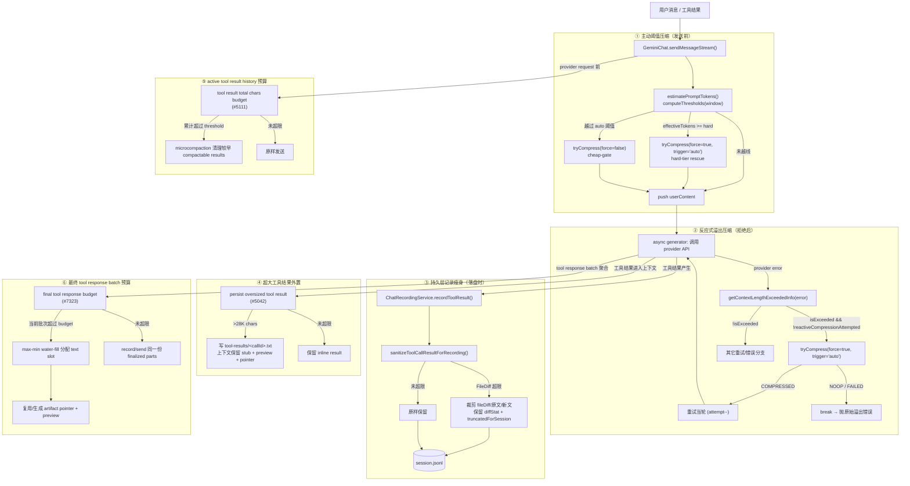
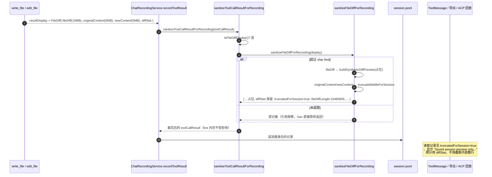
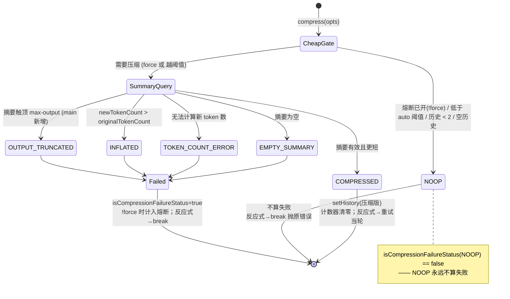

# 上下文压缩技术方案

> 适用范围：`QwenLM/qwen-code`，`packages/core` + `packages/cli`。
> 代码锚点格式：`file:symbol`，行号以仓库 `main` 为准（实现已在 PR 之后继续演进，差异在文中标注）。

---

## 1. 背景与动机

qwen-code 是一个长会话、工具密集型的编码 agent。随着会话进行，历史 token 与持久化体积都会持续膨胀，由此引出两类相互独立的问题。

### 1.1 上下文窗口溢出（报错/截断）

模型与 provider 都有硬性的上下文窗口上限。当一次请求的 prompt token 超过窗口时，provider 会**直接拒绝**请求，并返回各家措辞各异的报错，例如：

- OpenAI 兼容：`This model's maximum context length is 128000 tokens. However, your messages resulted in 135000 tokens.`、`context_length_exceeded`
- Anthropic 风格：`prompt is too long: 137500 tokens > 135000 maximum`
- DashScope / Qwen：`Range of input length should be [1, 30000]`、`Input token length is too long`

在 #3879 之前，qwen-code 只有**主动阈值压缩**（proactive / threshold-based）：在发送前根据上一轮的 token 计数估算，若越过阈值就先压缩再发。它的盲区是：

1. **突发增长**——单轮用户消息 / 工具结果体积暴涨，估算时还没越线，真正发送时已溢出；
2. **首轮估算偏差**——`--continue` 恢复、subagent 继承历史时 `lastPromptTokenCount === 0`，只能用 `char/4` 粗估，可能低估 15–20K token；
3. **provider 侧窗口比本地认知更小**。

任何一种情况都会让请求被拒、当轮直接失败，长会话无法自愈。**反应式压缩（reactive，#3879）** 正是为这条"溢出后恢复"路径而生：捕获 provider 的溢出报错 → 强制压一次 → 用压缩后的历史重试当轮。

### 1.2 大文件 diff 撑爆 JSONL（#3822 → #3872）

会话历史以 JSONL 持久化（`ChatRecordingService`，每个工具结果一条记录）。`write_file` / `edit_file` 的结果展示对象 `FileDiff`（`packages/core/src/tools/tools.ts:FileDiff`）会完整携带三份大字段：

- `originalContent`（编辑前全文）
- `newContent`（编辑后全文）
- `fileDiff`（完整 unified diff，约等于前两者之和）

对一个 5 MiB 的文件，单条记录就可能写入 ~20 MB 文本。这会让 `/resume` 的 session listing 与历史回放显著变慢（#3822）。注意：**这与"压缩对话上下文"是两回事**——它压的是**持久化存档体积**，不是发给模型的 prompt。**会话记录瘦身（#3872）** 通过非破坏性 `sanitize` 在落盘时裁剪这些大字段、保留可读的统计与预览，治理 JSONL 膨胀。

### 1.3 六种"压缩/瘦身/预算"的定位

| 维度 | 主动阈值压缩 | 反应式溢出压缩 | 会话记录瘦身 | 超大工具结果外置 | active tool result history 预算 | 最终 tool response batch 预算 |
|------|------|------|------|------|------|------|
| 触发时机 | 发送**前**（预防） | provider 拒绝**后**（恢复） | 工具结果**落盘时** | 工具结果进入上下文前 | provider request 前 | tool response batch 最终聚合边界 |
| 压缩对象 | 对话历史（live history） | 对话历史（live history） | JSONL 存档里的 `FileDiff` 字段 | 单个超大 tool result 文本 | 多轮累计 compactable tool result history | 当前批次发给模型且录制的 model-facing tool response 文本 |
| 是否影响发给模型的内容 | 是 | 是 | 否（只动存档，不动 live） | 是（上下文只留 stub + preview + 文件指针） | 是（旧 compactable result 变 cleared placeholder） | 是（当前 batch 的 text slot 被统一分配预算，必要时引用 artifact） |
| 关键符号 | `ChatCompressionService.compress` cheap-gate / `computeThresholds(window, pct?)` | `getContextLengthExceededInfo` + reactive 分支 | `sanitizeToolCallResultForRecording` | persisted tool-result stub / `tool-results/<callId>.txt` | microcompaction size trigger | `finalizeToolResponses` / `ToolResult.persistedOutputFiles`（#7323） |

---

## 2. 整体架构

压缩与预算能力分布在六条彼此正交的链路上：

1. **主动阈值压缩**（预防）：`GeminiChat.sendMessageStream` 在 setup 阶段调用 `tryCompress(force=false)`，由 `ChatCompressionService.compress` 的 **cheap-gate** 用 `computeThresholds(window).auto` 判定是否需要压缩；main 上还叠加了一层 **hard-tier rescue**（`effectiveTokens >= hard` 时 `force=true` 但 `trigger='auto'`），在发送前抢救临界 prompt。
2. **反应式溢出压缩**（恢复）：`sendMessageStream` 返回的 async generator 在 catch 到 provider 报错时，用 `getContextLengthExceededInfo` 分类，确认是上下文溢出就 `tryCompress(force=true, trigger='auto')`，成功则用压缩历史**重试当轮**（单次护栏）。
3. **持久层记录瘦身**（存档治理）：`ChatRecordingService.recordToolResult` 落盘前经 `sanitizeToolCallResultForRecording` 裁剪 `FileDiff`，并打 `truncatedForSession` 标记；下游回放/导出消费者据此显示"预览"而非伪造完整 diff。
4. **超大工具结果外置**（单条治理，#5042）：超过阈值的工具结果写到 session 下的 `tool-results/<callId>.txt`，上下文只保留 `<persisted-output>` stub、2KB 预览和文件指针。
5. **active tool result history 预算**（累计治理，#5111）：provider request 前把历史中的 compactable tool result 和 pending ToolResult 虚拟尾部计入总字符数，超过阈值就复用 microcompaction 清理较早结果。
6. **最终 tool response batch 预算**（当前批次治理，#7323）：Shell/MCP/generic producer 可以先给单条结果做 preview 或 artifact 持久化，但 interactive/headless/ACP/Agent/speculation 等最终聚合点仍要用共享 finalizer 对“本批要发给模型并录制的 tool response text”做统一预算分配。



---

## 3. 子系统详解

### 3.1 反应式压缩（#3879）

#### 3.1.1 溢出分类器 `getContextLengthExceededInfo`

`packages/core/src/utils/contextLengthError.ts:getContextLengthExceededInfo` 是整条反应式链路的"判定闸门"，返回：

```ts
interface ContextLengthExceededInfo {
  isExceeded: boolean;
  message: string;
  actualTokens?: number;  // 实际 token 数（可解析时）
  limitTokens?: number;   // 窗口上限（可解析时）
}
```

判定流程（`contextLengthError.ts`）：

1. **逐字段收集文本** `collectStrings`：递归遍历 error 对象（`MAX_COLLECT_DEPTH = 4`），对 `Error` 取 `name/message/cause`，对嵌套对象取**值**，并对字符串尝试 `tryParseEmbeddedJson` 解出内嵌 JSON（如 `HTTP 400 {"error":{"code":"context_length_exceeded",...}}`）。**只收集对象的值，不收集键名**（见 §7 的 review 修复）。
2. **超时优先排除** `TIMEOUT_PATTERNS`：先匹配 `context deadline exceeded`、`request/connection/read/context timed out|timeout`、`timeout/timed out after|while|during` 等。**只要命中超时模式，整体判 `isExceeded = false`**——传输层超时绝不能被误判为上下文溢出（否则会无谓压缩历史）。
3. **逐 fragment 正向匹配** `CONTEXT_LENGTH_PATTERNS`：在**单个 fragment 内**（而非拼接后的全文）匹配 `context_length_exceeded`、`maximum context length`、`prompt (is) too long`、`input ... too long`、`range of input length should be`、`too many tokens`、`tokens > N maximum`、以及单行内的 `(input|prompt|messages|context) ... tokens ... exceed` 等。逐 fragment + 单行约束是为避免跨属性误匹配（见 §7）。
4. **token 数解析** `parseTokenCounts`：仅在 `isExceeded` 为真时运行，按四种模板抽取 `actualTokens` / `limitTokens`（`N tokens > M`、OpenAI 的"max is N ... resulted in M"、只有上限的"max is N"、"input token count N ... exceed ... maximum M"）。

配套 `isContextLengthExceededError` 是布尔薄封装。该模块**不依赖任何 provider SDK 的错误类型**，纯靠文案 + 结构匹配，因此对 OpenAI / Anthropic / DashScope 等异构 provider 统一生效。

#### 3.1.2 反应式重试主体（`geminiChat.ts`）

反应式逻辑位于 `GeminiChat.sendMessageStream` 返回的 async generator 的 catch 块内（`packages/core/src/core/geminiChat.ts`，约 1772–1865 行）。核心要点：

**(a) 单次重试护栏 `reactiveCompressionAttempted`**
generator 内声明 `let reactiveCompressionAttempted = false`（`geminiChat.ts:1616`）。第一次溢出时置 `true` 并尝试压缩重试；**第二次再溢出时直接 `break`**，把 provider 的原始溢出错误抛给调用方，绝不二次压缩——防止"压了还溢出 → 再压 → 再溢出"的无限循环。

**(b) 确认溢出 → force 压缩一次**
```ts
const contextOverflow = getContextLengthExceededInfo(error);
if (contextOverflow.isExceeded) {
  if (!reactiveCompressionAttempted) {
    reactiveCompressionAttempted = true;
    const reactiveOriginalTokenCount =
      contextOverflow.actualTokens ??
      contextOverflow.limitTokens ??
      self.config.getContentGeneratorConfig()?.contextWindowSize ??
      DEFAULT_TOKEN_LIMIT;
    const reactiveInfo = await self.tryCompress(
      prompt_id, model, /* force */ true,
      params.config?.abortSignal,
      { originalTokenCountOverride: reactiveOriginalTokenCount, trigger: 'auto' },
    );
    ...
```
`tryCompress` 第三参 `force=true` **绕过 cheap-gate 阈值**（既然 provider 已经拒绝，本地阈值估算无意义）。`originalTokenCountOverride` 用四级兜底取一个**非零**估值（`actualTokens → limitTokens → contextWindowSize → DEFAULT_TOKEN_LIMIT`），避免 `lastPromptTokenCount` 为 0 时把 `newTokenCount` 钳成 0（见 §7 review）。`trigger:'auto'` 显式标注：虽然 `force=true`，但语义上是**自动**触发，PreCompact/PostCompact hook 应按 Auto 类别上报。

**(c) 压缩成功 → 用压缩历史重试当轮**
```ts
if (reactiveInfo.compressionStatus === CompressionStatus.COMPRESSED) {
  requestContents = self.getRequestHistory();   // 用压缩后的历史替换请求体
  yield { type: StreamEventType.COMPRESSED, info: reactiveInfo };
  yield { type: StreamEventType.RETRY };
  suppressNextRetryEvent = true;             // 见 (d)
  attempt--;                                 // 见 (e)
  continue;
}
```
`tryCompress` 内部（`geminiChat.ts:1354` COMPRESSED 分支）已经 `setHistory(newHistory)` 把 live 历史换成压缩版，所以这里重新 `getRequestHistory()`（内部 `extractCuratedHistory(this.history).map(copyContentContainer)`，等价于 `getHistory(true)` 的 curated 视图）拿到的就是压缩后的请求体，下一次循环用它重试。

**(d) `suppressNextRetryEvent` —— 避免重复 RETRY 事件**
反应式分支已经 `yield RETRY`，而循环顶部在 `attempt > 0 || rateLimitRetryCount > 0 || invalidStreamRetryCount > 0` 时也会 `yield RETRY`（`geminiChat.ts:1644`）。若溢出发生在某次 retry 之后（如 InvalidStream 重试后），就会出现**背靠背两个 RETRY**，干扰 UI/消费者。修复方式：置 `suppressNextRetryEvent = true`，循环顶部检测到该 flag 就跳过本次顶部 RETRY 并复位（`geminiChat.ts:1642`）。

**(e) `attempt--` —— 不占用内容重试预算**
内容校验重试预算由 `INVALID_CONTENT_RETRY_OPTIONS.maxAttempts`（1 初始 + 1 重试）控制。反应式压缩是一种"恢复"而非"内容错误重试"，因此 `attempt--` 抵消本次循环自增，使**反应式重试不消耗内容重试预算**（与 rate-limit / invalid-stream 分支同样的"独立预算"惯例）。

**(f) 压缩非 COMPRESSED（NOOP / 失败）→ break 抛原错误**
若反应式压缩返回 NOOP 或失败状态，不重试，`break` 退出循环，让原始溢出错误抛给上层。#3879 还按 [Critical] review 补了一条日志，说明"reactive compression already attempted; propagating the context overflow error"，避免日志里出现"压缩成功 135000→40000"后紧跟一个无解释溢出的困惑序列。

**(g) abort 重抛**
```ts
} catch (compressionError) {
  if (params.config?.abortSignal?.aborted || isAbortError(compressionError)) {
    throw compressionError;          // 用户取消：直接重抛，不吞
  }
  debugLogger.warn('Reactive compression failed.', compressionError);
}
```
压缩自身抛错时，若是用户 abort（`abortSignal.aborted` 或 `isAbortError`）就**原样重抛**（尊重取消语义）；其它异常仅告警、落到 `break`，最终抛原溢出错误。

#### 3.1.3 `trigger` 透传（`chatCompressionService.ts`）

为支撑 (b) 的 `trigger:'auto'`，#3879 给 `CompressOptions` 增加了 `CompactTrigger = 'manual' | 'auto'`（`packages/core/src/services/chatCompressionService.ts:CompactTrigger`）。`compress` 内计算 `compactTrigger = trigger ?? (force ? 'manual' : 'auto')`，再分别映射到 `PreCompactTrigger` / `PostCompactTrigger`。这把"是否 force"与"是否 manual"**解耦**：默认 `force=true` 视作 manual，但反应式与 hard-rescue 可显式覆盖为 auto，避免 hook 把自动压缩误报成手动。

### 3.2 反应式压缩加固（#3985）

#3985 是 #3879 的 review follow-up，修补四个正确性缺口：

**(a) setup 失败回滚：`history.pop()` + 释放 send-lock**
`sendMessageStream` 在拿到 send-lock（`this.sendPromise = streamDonePromise`）之后、返回 generator 之前，有一段**同步 setup**（`createUserContent` → `tryCompress` → `history.push` → `getRequestHistory`；userContent 先建，使 cheap-gate 能在压缩前估算待发 prompt 大小）。这些步骤任一抛错，generator 的 `finally`（负责 `streamDoneResolver()`）还没机会运行，send-lock 会**永久泄漏**，导致后续所有 `sendMessageStream` 卡在 `await this.sendPromise`。修复（`geminiChat.ts:1464`–`1593`）：
```ts
let userContentAdded = false;
try {
  const userContent = createUserContent(params.message);
  compressionInfo = await this.tryCompress(...);
  this.history.push(userContent);
  userContentAdded = true;
  requestContents = this.getRequestHistory();
} catch (error) {
  if (userContentAdded) this.history.pop();   // 回滚已入栈的失败 user turn
  streamDoneResolver!();                       // 释放 send-lock
  throw error;
}
```
即"setup 失败 → 弹出失败的 user turn + 释放锁 + 重抛"，保证下一次 send 既不阻塞、也不会带着半截脏历史。

**(b) `hasFailedCompressionAttempt` latch**
PR 时 `GeminiChat` 用一个布尔 latch `hasFailedCompressionAttempt` 标记"已知压不动"。问题：反应式压缩 `force=true`，而 `tryCompress` 的失败计数只在 `!force` 分支设置（`geminiChat.ts:1368`），所以反应式压缩失败时 latch **不会被置位**，下一轮自动压缩仍会触发，白白多花一次压缩 API 调用。#3985 在反应式失败分支显式补上：
```ts
if (isCompressionFailureStatus(reactiveInfo.compressionStatus)) {
  self.hasFailedCompressionAttempt = true;   // PR #3985 原始实现
}
```
> 演进说明：`main` 已把单布尔 latch 升级为**连续失败计数器** `consecutiveFailures` + `MAX_CONSECUTIVE_FAILURES = 3` 的熔断器（`chatCompressionService.ts:MAX_CONSECUTIVE_FAILURES`）。当前反应式失败分支改为 `self.consecutiveFailures += 1`（`geminiChat.ts:1839`），熔断后 cheap-gate NOOP，直到一次成功 force 压缩把计数清零。语义与 #3985 一致，只是从"一次失败即 latch"放宽为"连续 3 次才熔断"，避免单次瞬时错误永久禁用自动压缩。

**(c) 摘要生成透传 `abortSignal`**
`compress` 收到的 `signal` 此前只传给了 `firePreCompactEvent` / `firePostCompactEvent`，**没传给** `config.getContentGenerator().generateContent()`。用户在自动压缩期间按 ESC，压缩的 LLM 调用无法中止，白白浪费一次调用。修复（`chatCompressionService.ts`，summary `generateContent` 的 config）：
```ts
config: {
  systemInstruction: getCompressionPrompt(),
  ...(signal ? { abortSignal: signal } : {}),
},
```
使压缩 side-query 也能被用户取消即时打断。

**(d) `isCompressionFailureStatus` 抽取并排除 NOOP**
#3985 把散落的失败状态判断抽成模块级 `isCompressionFailureStatus`（`packages/core/src/core/geminiChat.ts:isCompressionFailureStatus`）：
```ts
function isCompressionFailureStatus(status: CompressionStatus): boolean {
  return (
    status === CompressionStatus.COMPRESSION_FAILED_INFLATED_TOKEN_COUNT ||
    status === CompressionStatus.COMPRESSION_FAILED_EMPTY_SUMMARY ||
    status === CompressionStatus.COMPRESSION_FAILED_TOKEN_COUNT_ERROR
  );
}
```
关键设计：**只把"显式失败"算作失败，`NOOP` 不算**。`NOOP` 表示"无需/未做压缩"（历史太短、低于阈值、熔断已开等），它不是失败，不应触发 latch / 计数器，也不应改变既有 force 压缩语义。该 helper 同时被 `recordCompression`（latch 判断）与反应式失败分支复用，保证两处口径一致。
> `main` 上 `isCompressionFailureStatus` 还纳入了后来新增的 `COMPRESSION_FAILED_OUTPUT_TRUNCATED`（摘要输出被 max-output 截断，`turn.ts:CompressionStatus`）。

### 3.2.1 摘要 side-query opt-in streaming（#5865）

#5865 修的是压缩摘要这条 side-query 的 transport 边界。压缩本身仍由 `ChatCompressionService.compress` 发起，返回仍是同一个 `{ text, usage }` 形状；变化在于 compression caller 显式传 `stream: true`，让 `runSideQuery` / `BaseLlmClient.generateText` 走既有 `generateContentStream`，逐 chunk 收集 delta 后再拼回摘要文本。

动机是避免 BFF/gateway 这类代理对非流式请求施加 60s read timeout：长摘要生成如果一直没有 HTTP body 返回，会被代理杀掉；streaming 后即便模型还在生成，代理也能持续看到 chunk。边界：

- 只有 compression summary side-query opt-in；recap/btw/follow-up 等其它 side-query 不因此改变 transport。
- 对调用方返回的 `CompressionStatus`、`newHistory`、usage 统计和 hook 触发语义不变。
- abort signal 继续沿 #3985 的路径透传；streaming 只改变底层读取方式，不改变用户取消或压缩失败分类。

### 3.3 会话记录瘦身（#3872，修复 #3822）

#### 3.3.1 落盘前非破坏性 `sanitize`

入口 `packages/core/src/services/chatRecordingService.ts:sanitizeToolCallResultForRecording`，由 `recordToolResult`（`chatRecordingService.ts:1037`）在写 JSONL 前调用。它只对 `FileDiff` 形状的 `resultDisplay`（`isFileDiffDisplay` 校验 `fileName/originalContent/newContent/fileDiff` 均存在且类型正确）生效，其它结果原样返回。

核心裁剪在 `sanitizeFileDiffForRecording`（`chatRecordingService.ts:109`），三档字符上限：

| 常量 | 值 | 作用 |
|------|----|----|
| `SESSION_FILE_DIFF_CHAR_LIMIT` | `50_000` | 单个 `fileDiff` 上限 |
| `SESSION_FILE_CONTENT_CHAR_LIMIT` | `16_000` | `originalContent` / `newContent` 各自上限 |
| `SESSION_FILE_DIFF_AGGREGATE_CHAR_LIMIT` | `100_000` | 三者合计的总预算（见 §7：当前不可达） |

裁剪策略：
- `fileDiff` 超限 → 用 `buildSyntheticDiffPreview` 替换成一段**合法的小 unified diff 占位**（注明"Full diff omitted ... original fileDiff length: N characters"），而非截断原 diff（截断的 diff 不是合法 diff，会误导回放）。
- `originalContent` / `newContent` 超限 → `truncateMiddleForSession` 做**头 60% + 尾部 + 中段 marker**的中间截断，marker 标明原始长度。
- **关键：非破坏性**——只修改即将写入存档的副本（`{ ...display, ... }`），**不触碰内存里的 live `resultDisplay`**，所以当前会话的 UI 渲染、后续逻辑看到的仍是完整内容。

#### 3.3.2 保留 `diffStat` 与元数据

裁剪后的对象**保留 `diffStat`**（`{ model_added_lines, model_removed_lines, ... }`，`tools.ts:DiffStat`），并补全可观测元数据（`tools.ts:FileDiff`）：

- `truncatedForSession: true`（总开关）
- `fileDiffLength` / `originalContentLength` / `newContentLength`（原始长度）
- `fileDiffTruncated` / `originalContentTruncated` / `newContentTruncated`（各字段是否被裁）

这样即使丢了完整 diff，行数统计、原始体积、裁剪情况仍可从记录里读出。

#### 3.3.3 消费者更新（`truncatedForSession` 协议）

下游所有读取 `FileDiff` 的消费者都要识别 `truncatedForSession`，**避免用被截断的 `originalContent/newContent` 伪造完整 diff**：

- **TUI 渲染** `packages/cli/src/ui/components/messages/ToolMessage.tsx:DiffResultRenderer`：截断记录额外渲染一行黄色提示 `Saved session preview only; full diff omitted from JSONL (N chars).`，再渲染占位 diff。
- **ACP 回放** `packages/cli/src/acp-integration/session/emitters/ToolCallEmitter.ts`：`truncatedForSession === true` 时输出文本说明而非 `diff` 块。
- **导出归一化** `packages/cli/src/ui/utils/export/normalize.ts:extractDiffContent`：同样改为文本预览。
- **导出统计** `packages/cli/src/ui/utils/export/collect.ts:calculateFileStats`：优先用 `diffStat` 计行数；**仅当 `!display.truncatedForSession` 时**才回退到"数 `originalContent/newContent` 行数"——否则截断内容会让行数统计失真。
- **共享文案** `packages/cli/src/utils/truncatedDiffPreview.ts:buildTruncatedDiffPreviewText`：ACP 回放与导出归一化共用同一个预览文案构造器（按 review 抽取，防止两处文案漂移）。

### 3.4 工具结果体积治理（#5042/#5111）

#### 3.4.1 单条超大工具结果外置（#5042）

#5042 解决的是单个工具结果过大：超过 28K 字符的 tool result 不再完整塞回 provider context，而是写入 session 下的 `tool-results/<callId>.txt`。模型上下文里保留 `<persisted-output>` stub、约 2KB preview 和文件指针，让模型知道完整输出已外置，后续仍可按需读取。

这条路径还加了 24h 清理和 session 磁盘预算，避免外置文件无限增长。它与 #3872 的区别是：#3872 只瘦身 JSONL 存档，不动 live context；#5042 会直接改变发给模型的 tool result 表示，目标是避免单条结果撑爆上下文或内存。

#### 3.4.2 active tool result history 累计预算（#5111）

#5111 解决的是多轮中等偏大的 tool result 持续累积。单条结果可能都没超过 #5042 的外置阈值，但历史里成功且 compactable 的工具结果不断堆积，full compression 还没来得及触发时 provider request 已经过大。

新配置 `context.clearContextOnIdle.toolResultsTotalCharsThreshold` 默认 `500000`，`-1` 禁用 size trigger。provider request 前，client 会把 pending ToolResult 内容也当作虚拟尾部计入总量；一旦累计字符数超过阈值，就复用现有 microcompaction 路径，把较早 compactable tool results 替换为 cleared-result placeholder，同时保护最近结果、跳过 error/already-cleared/non-compactable 输出，并保留媒体结果。

兼容性上，旧配置 `toolResultsThresholdMinutes: -1` 且未显式设置新字段时，会继续同时禁用 idle 和 size 两类工具结果清理；用户也可以只把 `toolResultsTotalCharsThreshold` 设为 `-1` 来禁用累计 size trigger。

#### 3.4.3 最终 tool response batch 预算（#7323）

#7323 解决的是“当前批次”而不是“历史累计”：Shell/MCP/generic producer 各自给单条输出做 preview 或持久化后，同一轮里多个已截断结果合起来仍可能超过 batch budget；interactive/headless/ACP/Agent/speculation 还会在 scheduler 外拼接 duplicate、skipped、cancelled 或 synthetic tool response，导致录制内容与下一次发给模型的内容存在分叉。

最终实现新增内部元数据 `ToolResult.persistedOutputFiles` / `ToolCallResponseInfo.persistedOutputFiles`，让 producer 明确声明完整输出是否已写入 artifact，最终聚合点不再依赖人类可读 truncation marker 反推状态。共享 `finalizeToolResponses()` 以 max-min water-fill 给每个 model-facing text slot 分配预算，优先复用已有 artifact path，必要时只持久化一次；若持久化失败，最后的 no-I/O hard cap 仍会保证发送边界不超预算。

这条链路与 #5042/#5111 的关系是：#5042 处理单条超大输出，#5111 清理多轮历史中较旧的 compactable 输出，#7323 则在本轮最终 batch 上统一收口，确保 record 和 send 使用同一份 finalized parts。成功 `enter_plan_mode` 的完整 reminder 是 lifecycle policy，按 tool name 作为唯一普通输出预算豁免；失败 text 和同批其它工具仍参与预算。

---

## 4. 关键流程（时序图 / 调用链）

### 4.1 流程①：一次 `sendMessageStream` 遇溢出 → 分类 → force 压缩 → 重试 → 成功/失败

```mermaid
sequenceDiagram
    autonumber
    participant Caller as 调用方 (Turn/Client)
    participant Chat as GeminiChat.sendMessageStream<br/>(async generator)
    participant Cls as getContextLengthExceededInfo
    participant TC as GeminiChat.tryCompress
    participant Svc as ChatCompressionService.compress
    participant API as Provider API

    Caller->>Chat: for await (event of stream)
    Chat->>API: makeApiCallAndProcessStream(requestContents)
    API-->>Chat: throw "maximum context length ... 135000 tokens"

    Chat->>Cls: getContextLengthExceededInfo(error)
    Cls-->>Chat: { isExceeded:true, actualTokens:135000, limitTokens:128000 }

    alt 首次溢出 (reactiveCompressionAttempted == false)
        Chat->>Chat: reactiveCompressionAttempted = true
        Chat->>TC: tryCompress(force=true, {override:135000, trigger:'auto'})
        TC->>Svc: compress({force:true, trigger:'auto', signal})
        Svc-->>TC: { newHistory, info: COMPRESSED 135000→40000 }
        TC->>Chat: setHistory(newHistory); 返回 info
        alt info == COMPRESSED
            Chat->>Chat: requestContents = getRequestHistory()
            Chat-->>Caller: yield COMPRESSED(info)
            Chat-->>Caller: yield RETRY
            Chat->>Chat: suppressNextRetryEvent = true; attempt--; continue
            Chat->>API: 重试 makeApiCall(压缩后 requestContents)
            API-->>Chat: 正常流式响应
            Chat-->>Caller: yield CHUNK ...
        else NOOP / FAILED
            Chat->>Chat: (失败则 consecutiveFailures++)
            Chat-->>Caller: break → 抛出原始溢出错误
        end
    else 二次溢出 (已尝试过)
        Chat->>Chat: warn("already attempted; propagating")
        Chat-->>Caller: break → 抛出原始溢出错误
    end

    Note over Chat,TC: 若压缩过程中 abortSignal.aborted / isAbortError → 直接重抛 compressionError
```

### 4.2 流程②：工具结果落盘时 `sanitize` 裁剪 `fileDiff` 保留 `diffStat`



### 4.3 压缩状态机（COMPRESSED / NOOP / 失败）



状态判定源码：`ChatCompressionService.compress` 末段（`chatCompressionService.ts:556`–`617`）依次产出 `EMPTY_SUMMARY` / `TOKEN_COUNT_ERROR` / `INFLATED_TOKEN_COUNT` / `COMPRESSED`；cheap-gate 各早退点产出 `NOOP`。

---

## 5. 关键设计决策与权衡

### 5.1 单次重试，防无限循环
反应式压缩**每次 send 至多压缩+重试一次**（`reactiveCompressionAttempted` 护栏，`geminiChat.ts:1774`），且 `attempt--` 使其不占内容重试预算。权衡：放弃"压一次仍溢出就再压"的极端自愈能力，换取**确定性终止**——压完仍溢出（如单条消息本身就超窗）时立即把原错误抛给用户，而不是反复烧压缩 API。

### 5.2 保守分类器：timeout + overflow 同时出现时判为"非 overflow"
`getContextLengthExceededInfo` 先用 `TIMEOUT_PATTERNS` 在**拼接全文**上判超时，命中即 `isExceeded=false`（`contextLengthError.ts:168`–`173`）。设计取向是**宁可漏判、不可误判**：误把超时/传输错误判成溢出，会触发一次本不必要的、**不可逆的历史压缩**（丢失上下文）；漏判溢出最多是当轮失败、用户重试。因此当报错文案同时含 timeout 与 overflow 措辞时，保守地不压缩（代价见 §7）。

### 5.3 瘦身只动存档、不动 live history
`sanitizeFileDiffForRecording` 返回新对象，`sanitizeToolCallResultForRecording` 仅在产生差异时浅拷贝外层（`chatRecordingService.ts:168`–`175`），**绝不修改内存里的 `resultDisplay`**。权衡：当前会话的 UI/逻辑零损失地看到完整 diff，只有"重开/回放/导出"时看到预览。代价是 JSONL 里的旧记录信息有损，但通过 `diffStat` + `*Length` 元数据把损失降到"可统计、可解释"。

### 5.4 NOOP 不算失败
`isCompressionFailureStatus` 显式排除 `NOOP`（#3985）。NOOP 语义是"没必要压/没压"，不是"压不动"。若把 NOOP 计入失败 latch/熔断，会让"历史本就很短"的正常会话被误判为压缩故障、提前关闭自动压缩。把"未做"与"做失败"分开，是熔断器不被噪声污染的前提。

### 5.5 `force` 与 `trigger` 解耦
`compactTrigger = trigger ?? (force ? 'manual':'auto')` 让"绕过阈值闸门（force）"与"是不是用户手动发起（manual）"成为两个维度。反应式恢复、hard-tier rescue 都是 `force=true` 但 `trigger='auto'`，从而 hook 上报、UI 文案不会把自动压缩错标成手动。

### 5.6 反应式 `originalTokenCount` 四级兜底
`actualTokens ?? limitTokens ?? contextWindowSize ?? DEFAULT_TOKEN_LIMIT`（`geminiChat.ts:1776`）。即便 provider 只回了 `context_length_exceeded` 这种无数字文案，也能拿到一个**非零**估值传给压缩，避免 `lastPromptTokenCount=0` 把 `newTokenCount` 钳成 0、进而静默禁用后续自动压缩。

### 5.7 共享文案、避免漂移
截断预览文案统一由 `buildTruncatedDiffPreviewText` 产出，ACP 回放与导出归一化复用同一函数（#3872 review 抽取），防止两处独立实现随元数据演进而措辞不一致。

---

## 6. 涉及 PR

| PR | 子主题 | 作用 |
|----|--------|------|
| **#3879** | 反应式溢出压缩（feat） | 新增 `contextLengthError.ts` 分类器；`sendMessageStream` 反应式分支：捕获 provider 溢出 → `force` 压缩一次 → 用压缩历史重试当轮；`reactiveCompressionAttempted` 单次护栏、`suppressNextRetryEvent` 去重 RETRY、`attempt--` 不占重试预算、abort 重抛、二次溢出 break 抛原错误；`CompactTrigger` 透传解耦 force/manual。 |
| **#3985** | 反应式压缩加固（fix） | setup 失败 `history.pop()` + 释放 send-lock；`hasFailedCompressionAttempt` latch（main 演进为 `consecutiveFailures` 熔断）在反应式失败时置位；摘要 `generateContent` 透传 `abortSignal`；抽取 `isCompressionFailureStatus` 并显式排除 `NOOP`。 |
| **#3872** | 会话记录瘦身（fix #3822） | 落盘前非破坏性 `sanitizeToolCallResultForRecording` / `sanitizeFileDiffForRecording`：超限的 `fileDiff` 用合法占位、原文/新文中间截断；保留 `diffStat` 与 `*Length` 元数据 + `truncatedForSession` 标记；更新 TUI 渲染、ACP 回放、导出归一化与统计等消费者，共享 `buildTruncatedDiffPreviewText`。 |
| **#5042** | 超大工具结果外置 | 超过 28K 字符的工具结果写入 `tool-results/<callId>.txt`；上下文只保留 `<persisted-output>` stub、2KB preview 和文件指针，并加 24h 清理与 session 磁盘预算。 |
| **#5111** | active tool result history 预算 | 新增 `context.clearContextOnIdle.toolResultsTotalCharsThreshold`（默认 500000，`-1` 禁用）；provider request 前把 pending ToolResult 作为虚拟尾部计入累计字符预算，超过阈值时用 microcompaction 清理较早 compactable results。 |
| **#5865** | compression summary streaming | 压缩摘要 side-query 显式 opt-in streaming，复用 `generateContentStream` 收集 delta 并返回同形 `{text, usage}`，避免代理/网关非流式 read timeout。 |
| **#7323** | final tool response batch budget | 增加 structured persisted-output metadata、共享 finalizer、scheduler 与各 runtime 聚合边界、GeminiChat send-boundary hard cap，并把成功 `enter_plan_mode` reminder 从普通输出预算中排除。 |

---

## 7. 已知限制 / 后续

### 7.1 分类器对"timeout + overflow 同文"的保守误差
§5.2 的设计意味着：若某 provider 在**同一条**报错里既写超时措辞又写溢出措辞（如 `Request timeout after 60s. Try reducing input length...`），`TIMEOUT_PATTERNS` 在拼接全文上先命中，整体判 `isExceeded=false`，反应式压缩**不会触发**。这是有意的"宁漏勿误"，但确实会让这类混合文案的真实溢出退化为当轮失败。后续可考虑按 fragment 分别判超时/溢出并加权，而非全文一刀切。

### 7.2 瘦身聚合上限 `SESSION_FILE_DIFF_AGGREGATE_CHAR_LIMIT` 当前不可达
Copilot review 指出：当 `fileDiff <= 50_000` 且两份内容各 `<= 16_000` 时，合计最多 `82_000 < 100_000`，故 `aggregate <= 100_000` 这个聚合判据**永远不会成为决定性条件**（单字段上限已更严）。作者有意保留：它作为设计中"会话级展示预算"的文档锚点与未来单一调参旋钮。后续若放宽单字段上限，需要重新校准该常量使其真正生效，否则应移除以免误解。

### 7.3 已有膨胀记录不迁移
#3872 只对**新写入**的记录瘦身，不回写/迁移历史上已经膨胀的 JSONL（PR 明确"No migration required"）。已存在的大 session 文件仍然慢，需要用户自行清理或后续提供迁移工具。

### 7.4 文案匹配的 provider 依赖
分类器靠错误文案/结构正则，新 provider 或 provider 改文案都可能落到 `CONTEXT_LENGTH_PATTERNS` 之外而漏判。缓解是 `contextWindowSize` / `DEFAULT_TOKEN_LIMIT` 兜底与主动 hard-tier rescue，但根治需要持续补充模式或转向结构化错误码。#3879 也未做真实 provider 的超大请求 E2E（仅本地 mock OpenAI server 验证）。

### 7.5 latch 语义随 main 演进
#3985 的单布尔 `hasFailedCompressionAttempt` 在 `main` 已升级为 `consecutiveFailures` 计数 + `MAX_CONSECUTIVE_FAILURES=3` 熔断，并新增 hard-tier rescue 与 `COMPRESSION_FAILED_OUTPUT_TRUNCATED` 状态。本文 §3.2 以 PR 原始实现为主、标注了 main 现状；阅读源码时以 `geminiChat.ts:isCompressionFailureStatus`、`chatCompressionService.ts:MAX_CONSECUTIVE_FAILURES` 为准。

### 7.6 工具结果治理不是完整历史迁移

#5042 只影响新产生且超过阈值的工具结果，不会迁移旧 session 中已经完整写入的超大 result。#5111 只清理 compactable、成功、非媒体的历史工具结果；它不会改变 full chat compression，也不会引入 transcript-level replacement state。超过累计阈值后，较旧工具输出文本会被 placeholder 取代，模型不再能直接读取那些旧文本，除非它们已被外置并可通过文件指针重新读取。

#7323 已合入，但它不提供 tokenizer 精确预算、media part 预算、artifact 生命周期管理或远端 artifact retrieval。其边界只保证 finalized model-facing text 在 record/send 两端一致并满足字符预算。

### 7.7 自定义 auto threshold 在大窗口模型上可能无感


---

## 8. 各 PR 代码贡献

### PR #3879 — reactive compression

- `contextLengthError.ts:getContextLengthExceededInfo`：溢出分类器——`TIMEOUT_PATTERNS` 优先排除超时；`CONTEXT_LENGTH_PATTERNS` 逐 fragment 匹配溢出文案；`parseTokenCounts` 四种模板抽取 actual/limit token 数
- `geminiChat.ts:sendMessageStream`（reactive 分支）：`reactiveCompressionAttempted` 单次护栏；溢出后 `tryCompress(force=true, trigger:'auto')`；COMPRESSED 则 `getHistory(true)` 重建请求体 + `yield RETRY` + `attempt--` 不占重试预算
- `geminiChat.ts`：`suppressNextRetryEvent` 避免反应式 RETRY 与循环顶部 RETRY 重复；abort 信号 `isAbortError` 直接重抛
- `chatCompressionService.ts:CompactTrigger`：新增 `'manual'|'auto'` 类型；`compactTrigger = trigger ?? (force ? 'manual' : 'auto')` 解耦 force 与 trigger 语义

### PR #3985 — 加固 follow-up

- `geminiChat.ts:sendMessageStream`（setup）：失败时 `if (userContentAdded) this.history.pop()` 回滚 + `streamDoneResolver!()` 释放 send-lock，防止后续 send 永久阻塞
- `geminiChat.ts:isCompressionFailureStatus`：抽取模块级 helper，显式排除 `NOOP`；反应式失败分支补 `self.hasFailedCompressionAttempt = true`（main 演进为 `consecutiveFailures`）
- `chatCompressionService.ts:compress`：摘要 `generateContent` 的 config 透传 `abortSignal`，使压缩 side-query 可被用户取消即时打断

### PR #3872 — shrink file diff records

- `chatRecordingService.ts:sanitizeToolCallResultForRecording`：落盘前入口，仅对 `isFileDiffDisplay` 校验通过的结果调用 `sanitizeFileDiffForRecording`
- `chatRecordingService.ts:sanitizeFileDiffForRecording`：三档上限（`SESSION_FILE_DIFF_CHAR_LIMIT=50_000`、`SESSION_FILE_CONTENT_CHAR_LIMIT=16_000`、聚合 `100_000`）；超限 diff 替换为 `buildSyntheticDiffPreview` 合法占位；超限内容 `truncateMiddleForSession` 头60%+尾+marker 截断
- `truncatedDiffPreview.ts:buildTruncatedDiffPreviewText`：共享文案构造器，ACP 回放（`ToolCallEmitter.ts`）与导出归一化（`normalize.ts`）复用，防措辞漂移

### PR #5042 — persist oversized tool results

- 工具结果超过阈值后写入 session-local `tool-results/<callId>.txt`，上下文替换为 `<persisted-output>` stub + preview + file path。
- 清理逻辑按 24h TTL 和 session 磁盘预算回收旧外置结果，避免 session 目录无界增长。
- schema / recorder / context 构造路径识别 persisted result，使模型看到的是明确的外置指针而不是被静默截断的文本。

### PR #5111 — bound active tool result history

- `config.ts` / settings schema：新增 `context.clearContextOnIdle.toolResultsTotalCharsThreshold`，默认 500000，`-1` 禁用；兼容旧的 `toolResultsThresholdMinutes: -1` 行为。
- `client.ts` / microcompaction：provider request 前统计历史 compactable tool result + pending ToolResult 虚拟尾部，超过阈值则清理较早结果并保留近期输出。
- `microcompact.ts`：size-triggered cleanup 跳过 error、already-cleared、non-compactable 和媒体输出，复用既有 cleared-result placeholder 与 file-read-cache disarm 语义。

### PR #7323 — enforce final tool response budgets

- `tools.ts` / `ToolCallResponseInfo`：新增内部 `persistedOutputFiles` 元数据，Shell/MCP/generic producer 可把已写 artifact 的路径结构化传给最终预算器。
- `tool-response-finalizer.ts`：集中实现 text slot 收集、max-min budget allocation、artifact reuse、必要时单次持久化、surrogate-safe fit 与 no-I/O hard cap。
- `coreToolScheduler.ts`、interactive/headless/ACP/Agent/speculation 路径：在各自最终聚合边界调用 finalizer，使录进 transcript 与下一次发给模型的 tool response 使用同一份 finalized parts。
- `geminiChat.ts`：发送边界增加 tool-response-only hard guard，兜住遗漏外层 finalization 的路径；成功 `enter_plan_mode` 输出因承载 Plan mode policy 而豁免普通输出预算。

### PR #5865 — stream compression summaries

- `ChatCompressionService.compress` / side-query call site：给压缩摘要请求传 `stream:true`，只让 compression opt-in streaming。
- `core/utils/sideQuery.ts` / `BaseLlmClient.generateText`：新增 stream 参数并复用既有 `generateContentStream`，收集 text delta 和 usage 后仍返回 `{ text, usage }`。
- 行为边界：不改变 compression status、history replacement、hook trigger、abort signal 或 retry budget；目标只是避免长摘要非流式请求被代理 read timeout 中断。
