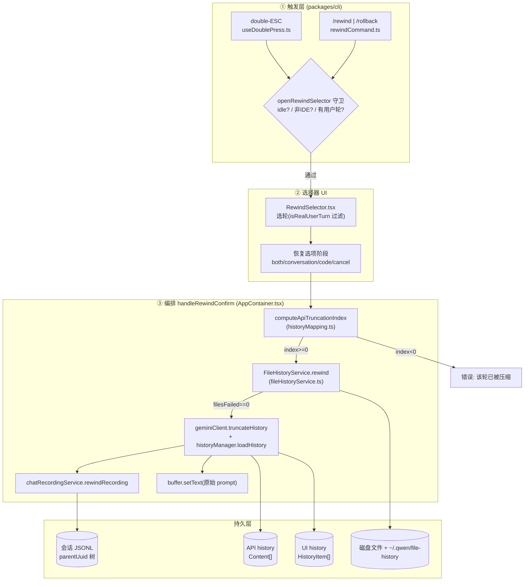
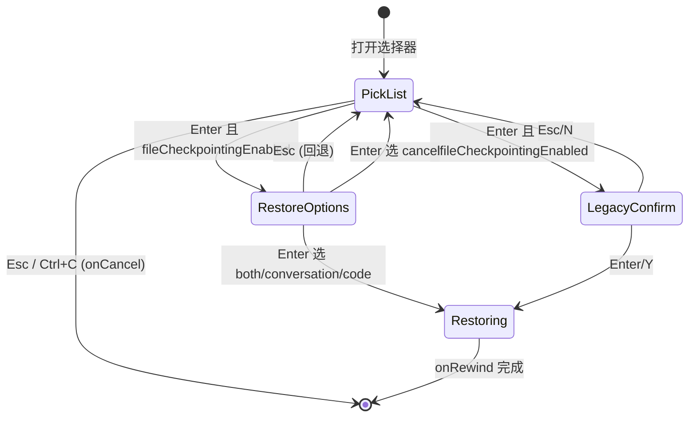
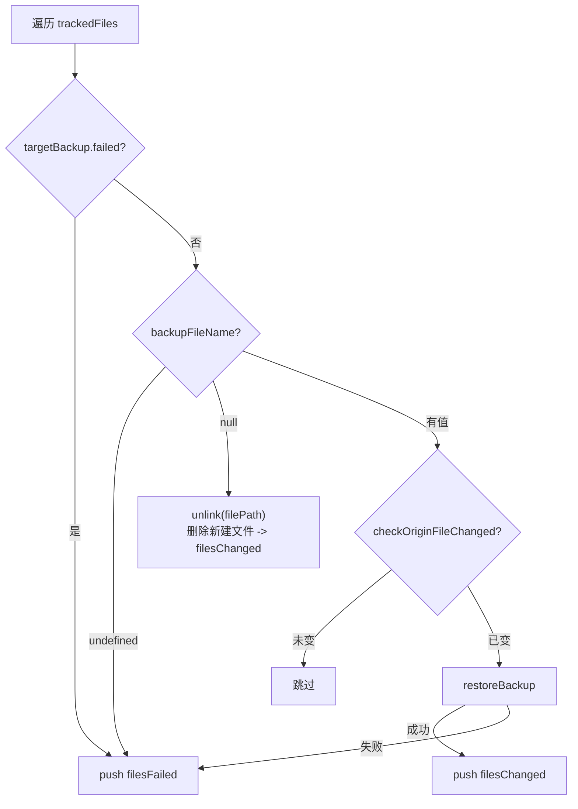
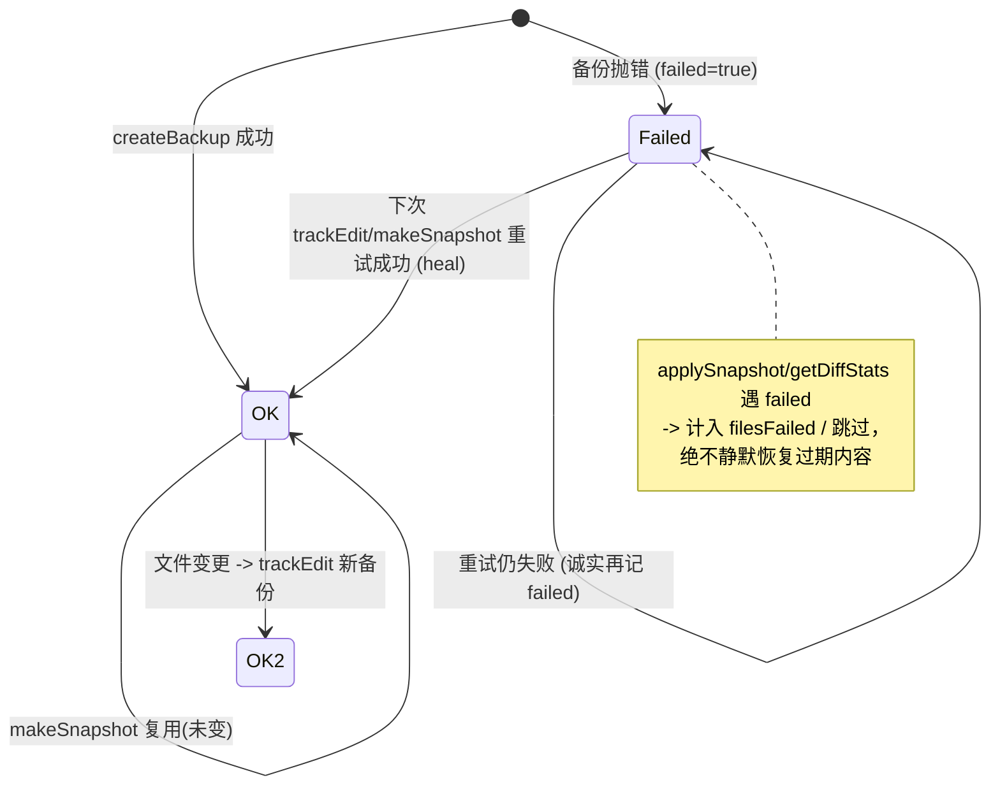
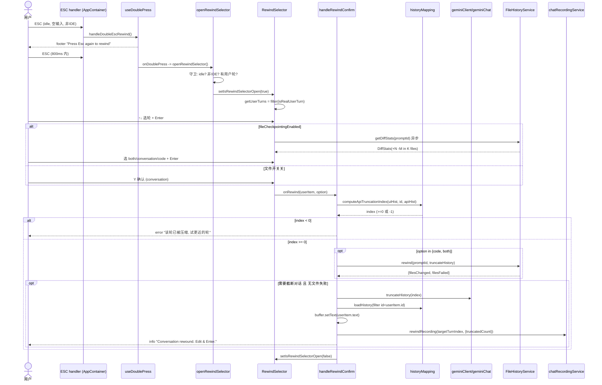
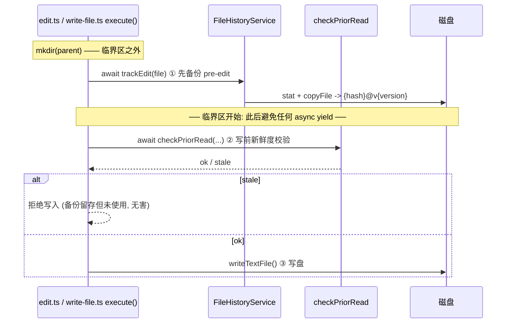

# conversation rewind 技术方案

> 适用代码版本：`QwenLM/qwen-code` `main`（截至 2026-07-19，PR #3441/#4064/#4216/#4122/#3622/#4580/#4820/#4871/#4897/#5044/#5057/#5141/#6826/#7185 已合并）。
> 所有锚点格式为 `文件路径:符号`，行号可能随版本漂移，以符号为准。

---

## 1. 背景与动机

本节说明 rewind 能力解决的用户问题、文件回退与 checkpointing 的边界，以及 daemon 多工作区接入后需要额外保证的 session owner 路由语义。

### 1.1 用户痛点（#3186）

多轮对话型 CLI agent 在实际使用中经常出现「跑偏」：模型在第 N 轮做出错误假设、选错工具、或用户自己的 prompt 写错了，导致后续若干轮全部建立在错误前提之上。在 conversation rewind 之前，用户唯一的补救手段是：

- 重启整个会话（丢失全部上下文），或
- 继续追加纠正性 prompt（污染上下文、浪费 token、且模型仍可能被前文带偏）。

issue #3186 提出的诉求是：**允许用户回退到历史中的某一个「用户轮」，丢弃该轮之后的所有对话，并把该轮的原始 prompt 回填到输入框供编辑后重新发送**——相当于给对话提供一个「时间机器」。

### 1.2 能力范围与演进

conversation rewind 分两个阶段落地：

1. **对话回退（#3441）**：截断 UI history 与 API history，回填 prompt。纯内存操作，不触碰磁盘文件。
2. **文件回退（#4064）**：在对话回退基础上，叠加「把工作区文件恢复到目标轮开始前状态」的能力。通过 `FileHistoryService` 在每次 `edit`/`write_file` 工具写入前做文件快照备份实现；#5141 又把受支持的单文件 `sed -i` 替换命令模拟成 edit 路径，从而补上常见 shell 原地编辑的部分追踪缺口。

### 1.3 与 checkpointing 的关系

qwen-code 中存在两套**互相独立**的「快照/恢复」机制，命名相近但定位不同，不应混淆：

| 维度 | 既有 checkpointing（`/restore`） | conversation rewind 的文件回退（`/rewind`） |
|------|------|------|
| 配置项 | `checkpointing`（`config.ts:1165`，默认 `false`） | `fileCheckpointingEnabled`（`config.ts:1166`，交互模式默认 `true`） |
| 实现 | 基于 `FileHistoryService` 的整工作区快照（#4871 已移除 Git shadow repo，迁移至相同后端） | 基于文件逐个拷贝的 `{hash}@v{version}` 备份（`fileHistoryService.ts`） |
| 触发粒度 | 单次工具调用前 | 每个用户轮边界（`makeSnapshot`） |
| 入口 | `/restore` 命令 | `/rewind` 选择器中的「Restore code」选项 |
| 关联对象 | 工具调用 | 对话轮 + prompt 文本回填 |

文件回退刻意**没有复用** Git checkpointing，而是移植自 upstream `claude-code` 的 `fileHistory` 子系统（见 `fileHistoryService.ts` 类注释 `packages/core/src/services/fileHistoryService.ts:471`），原因是 rewind 需要以「对话轮 promptId」为索引、且要在无 Git 仓库的目录中也能工作。

---

## 2. 整体架构

conversation rewind 横跨 `packages/cli`（UI/触发/编排）与 `packages/core`（历史截断/文件备份/录制）两个包，数据流分五层：

1. **触发层**：double-ESC（`useDoublePress`）或 `/rewind` 命令（`rewindCommand`），均经守卫后调用 `openRewindSelector`。
2. **选择器 UI**：`RewindSelector` 组件，多阶段：选轮 → 选恢复内容（文件开关开时）/ Y-N 确认（文件开关关时）。
3. **历史截断**：`computeApiTruncationIndex` 计算 API 边界 → `geminiClient.truncateHistory` 截断 API history；`loadHistory` 截断 UI history。
4. **文件恢复（可选）**：`FileHistoryService.rewind` 按目标 promptId 的快照恢复磁盘文件。
5. **录制分叉**：`chatRecordingService.rewindRecording` 把 `parentUuid` 链重新指回目标轮之前，使废弃分支在 `/resume` 时被跳过。



ASCII 退化版（数据流主链路）：

```
[double-ESC / /rewind] -> openRewindSelector(守卫) -> RewindSelector(选轮+选项)
   -> handleRewindConfirm:
        computeApiTruncationIndex --(>=0)--> [可选]FileHistoryService.rewind
            --> truncateHistory(API) + loadHistory(UI) + setText(prompt) + rewindRecording
        computeApiTruncationIndex --(-1)--> 报错"已压缩"
```

---

## 3. 子系统详解

### 3.1 触发与守卫

#### 3.1.1 `/rewind` 命令

`packages/cli/src/ui/commands/rewindCommand.ts:rewindCommand` 是一个 `BUILT_IN` slash command，`name: 'rewind'`，`altNames: ['rollback']`，action 仅返回 `{ type: 'dialog', dialog: 'rewind' }`。命令本身不含逻辑，由 `slashCommandProcessor` 把 `dialog: 'rewind'` 路由到 UI action `openRewindSelector`（经 `openRewindSelectorRef` 桥接，见下）。

#### 3.1.2 double-ESC

- `packages/cli/src/ui/hooks/useDoublePress.ts:useDoublePress`：通用双击检测 hook，超时窗口 `DOUBLE_PRESS_TIMEOUT_MS = 800`ms。第一次按调用 `onPending(true)` 并启动计时器；800ms 内第二次按则触发 `onDoublePress`，否则清空 pending。`useEffect` 在卸载时清理计时器，避免组件卸载后 setState 警告。
- `packages/cli/src/ui/AppContainer.tsx`：`handleDoubleEscRewind = useDoublePress(openRewindSelector, (pending) => setRewindEscPending(pending))`（约 `AppContainer.tsx:2620`）。
- 键盘 ESC 分派逻辑（`AppContainer.tsx` 约 2927–2956）按状态分流：
  - `streamingState === Responding && !dialogsVisible` → `cancelOngoingRequest()`（取消请求，**不** rewind）；
  - `streamingState === Idle && !dialogsVisible && !config.getIdeMode()` → `handleDoubleEscRewind()`。
- footer 提示：`packages/cli/src/ui/components/Footer.tsx` 约 80 行，`uiState.rewindEscPending` 为真时渲染 `Press Esc again to rewind conversation.`。

#### 3.1.3 `openRewindSelector` 守卫

`packages/cli/src/ui/AppContainer.tsx:openRewindSelector`（约 2409）集中式守卫，依次：

1. `streamingState !== StreamingState.Idle` → 直接 return（流式中不开）；
2. `dialogsVisibleRef.current` → return（已有对话框时不开）；
3. `config.getIdeMode()` → 插入 `info` 项 `Rewind is disabled in IDE mode.` 后 return（#4122）；
4. `hasUserTurns = historyManager.history.some(h => h.type === 'user')`，若无则 return；
5. 否则 `setIsRewindSelectorOpen(true)`。

> Ref 桥接：`openRewindSelectorRef`（`AppContainer.tsx:1072`）。因为 `slashCommandActions` 在 `useDoublePress` 定义之前就需要引用 `openRewindSelector`，故先建一个 ref，`slashCommandActions.openRewindSelector` 实际调用 `() => openRewindSelectorRef.current()`（约 1114），稍后再把真正实现赋给 `.current`（约 2426）。

#### 3.1.4 IDE 模式禁用（#4122）

IDE 模式下 rewind 被**完整禁用**，存在两道彼此**不冗余**的守卫：

- 键盘路径：ESC handler 中 `!config.getIdeMode()`（`AppContainer.tsx:2947`）；
- 命令路径：`openRewindSelector` 中 `config.getIdeMode()`（`AppContainer.tsx:2412`）—— `/rewind` 绕过键盘 handler，必须在此独立拦截，并给出可见提示，避免「Press Esc again to rewind」与「disabled」自相矛盾的 UX（PR #4122 描述）。

禁用根因见 `historyMapping.ts:computeApiTruncationIndex` 注释（约 80 行）：IDE 模式会向 API history 注入额外的 user Content（IDE 上下文），导致 `computeApiTruncationIndex` 的「数 user 文本轮」计数错位，产出错误的截断点。鉴于修正 IDE 注入计数复杂度高，直接禁用。

### 3.2 选择器与目标选择

`packages/cli/src/ui/components/RewindSelector.tsx:RewindSelector`，props：`history / onRewind / onCancel / fileCheckpointingEnabled / fileHistoryService`。由 `DialogManager.tsx:469` 在 `uiState.isRewindSelectorOpen` 时渲染，`fileCheckpointingEnabled={config.getFileCheckpointingEnabled()}`。

#### 3.2.1 目标轮过滤：`isRealUserTurn`

`getUserTurns = history.filter(isRealUserTurn)`（`RewindSelector.tsx:31`）。`packages/cli/src/ui/utils/historyMapping.ts:isRealUserTurn`（type predicate `item is HistoryItem & HistoryItemUser`）判定规则：

- `item.type !== 'user' || !item.text` → false；
- 若 `typeof item.sentToModel === 'boolean'` → 直接返回 `item.sentToModel`（新会话权威字段）；
- 否则（旧 resumed 会话无该字段）回退到词法判定 `!isSlashCommand(item.text) && !item.text.startsWith('?')`。

该过滤把 slash 命令、`?` 开头的 btw 侧问、以及 #4580 引入的 `notification` 类型（mid-turn 消息）都排除在「可回退轮」之外，确保 UI 轮数与 API user 文本轮数对齐（见 3.3 / 3.7）。

#### 3.2.2 多阶段 UI

初始 `selectedIndex = userTurns.length - 1`（默认选中最后一轮）。`MAX_VISIBLE_ITEMS = 7`，超出时按 `scrollOffset` 滚动并显示 `↑/↓` 指示符。阶段切换由 `fileCheckpointingEnabled` 决定：



- **Pick-list**：列出全部用户轮（带 `#N` 序号 + prompt 预览）。
- **Restore options（文件开关开）**：`getRestoreOptions(diffStats)`（`RewindSelector.tsx:103`）动态构造选项：当 `diffStats.filesChanged.length > 0` 时给出 `both`（「Restore code and conversation」，附 `+N -N in M file(s)` 明细）与 `code`（「Restore code only」）；`conversation`（「Restore conversation only」）与 `cancel`（「Never mind」）恒在。diff 统计在进入该阶段时通过 `fileHistoryService.getDiffStats(promptId)` 异步加载（`useEffect`，约 200 行），加载中显示「Computing file changes...」。
- **Legacy confirm（文件开关关）**：Y/N 确认，警告文案「This will remove all conversation after this turn...」。
- `isRestoring` 期间显示「Restoring...」并禁用所有按键，防止重入。
- 空态：`userTurns.length === 0` 渲染「No user turns to rewind to.」。

### 3.3 历史截断（UI history + API history 分离）

#### 3.3.1 `computeApiTruncationIndex`

`packages/cli/src/ui/utils/historyMapping.ts:computeApiTruncationIndex(uiHistory, targetUserItemId, apiHistory) -> number`，核心难点在于 **UI history 与 API history 不是一一对应**：

- UI history（`HistoryItem[]`）：用户可见的展示项，含 info/error/notification 等非对话项。
- API history（`Content[]`）：发给模型的真实上下文，含 startup-context 对、工具调用循环的 `functionResponse` 条目、模型响应等。

算法：

1. 遍历 `uiHistory`，统计目标 item **之前**有几个 `isRealUserTurn` → `uiUserTurnCount`。
2. `startIndex = hasStartupContext(apiHistory) ? 2 : 0`：跳过开头的 startup-context 对（`user(env)` + `model(ack)`，ack 文本为 `STARTUP_CONTEXT_MODEL_ACK`，`hasStartupContext` 见 `historyMapping.ts:54`）。
3. 若 `uiUserTurnCount === 0`（回退到第一轮）→ 返回 `startIndex`（只保留 startup-context）。
4. 否则从 `startIndex` 起遍历 API history，用 `isUserTextContent` 计数「真正的用户文本轮」，**跳过 `functionResponse` 条目和非文本条目**（`isUserTextContent`：`role==='user'` 且 parts 中无 `functionResponse` 且有 `text`，见 `historyMapping.ts:38`），当计数 `> uiUserTurnCount` 时返回该下标 `i`（截断点）。
5. 找不到足够多用户轮（如被压缩吸收）→ 返回 `-1`，调用方据此报「该轮已被压缩」。

#### 3.3.2 实际截断动作

`AppContainer.tsx:handleRewindConfirm` 中（约 2535–2576）：

- **API 侧**：`geminiClient.truncateHistory(apiTruncateIndex)` → `client.ts:476` → `geminiChat.ts:2387 truncateHistory(keepCount)`：`this.history = this.history.slice(0, keepCount); this.clearPendingPartialState();`；`client.ts` 侧还会清理 file-read cache。
- **UI 侧**：`truncatedUi = originalHistory.filter(h => h.id < userItem.id)` 后 `historyManager.loadHistory(truncatedUi)`，再 `refreshStatic()` 重绘终端。

> 注意：`useHistoryManager.ts:truncateToItem`（约 118）是 #3441 引入的「截到某 item 之前」方法，但 #4064 重写后的 `handleRewindConfirm` 改用 `loadHistory(filter)`（因为还要在截断后追加 info 提示项）。`truncateToItem` 目前仅用于另一条路径——自动恢复被取消轮并回填 prompt（`AppContainer.tsx:1936`）。两条路径语义一致但实现分叉，见 §7。

#### 3.3.3 prompt 回填

截断成功后 `buffer.setText(userItem.text)`（`AppContainer.tsx:2560`）把目标轮原始 prompt 写回输入框，并追加 info 项「Conversation rewound. Edit your prompt and press Enter to continue.」。

### 3.4 文件恢复（`FileHistoryService`）

`packages/core/src/services/fileHistoryService.ts:FileHistoryService`。**作用域**：追踪经 `edit`、`write_file` 工具的写入，以及 #5141 覆盖的一小类 supported single-file `sed -i` 替换命令。其它 `run_shell_command` 副作用（`cp`/`mv`/`git apply`、多文件/复杂 sed、脚本等）与任何工具外手改仍**不被捕获**，rewind 无法保证恢复。

#### 3.4.1 数据结构

- `FileHistoryBackup`：`{ backupFileName: string|null, version, backupTime, failed? }`。`backupFileName === null` 表示快照时文件不存在（新建/已删）；`failed === true` 表示该轮备份尝试抛错（见 3.5）。
- `FileHistorySnapshot`：`{ promptId, trackedFileBackups: Record<path, FileHistoryBackup>, timestamp }`。
- 备份落盘路径：`Storage.getGlobalQwenDir()/file-history/{sessionId}/{sha256(filePath).slice(0,16)}@v{version}`（`getBackupFileName` + `resolveBackupPath`）。`MAX_SNAPSHOTS = 100`，超限时 `cleanupOrphanedBackups` 删除不再被任何存活快照引用的备份文件。

#### 3.4.2 `trackEdit`（写前备份）

`fileHistoryService.ts:trackEdit(filePath)`：在工具写盘**前**把文件 pre-edit 内容备份到最近一个快照的 `trackedFileBackups`。若已存在**非 failed** 的备份则跳过（同轮内只备份首次写前状态）；备份用 `createBackup`（`stat` 源文件，ENOENT → `backupFileName: null`，否则 `safeCopyFile` + `chmod`）。

#### 3.4.3 `makeSnapshot`（轮边界快照）

`fileHistoryService.ts:makeSnapshot(promptId)`：在每个 `UserQuery` 轮边界调用（由 `client.ts:1488` 触发）。对每个 tracked 文件：

- `stat` 失败（ENOENT）→ 记 `{ backupFileName: null }`（文件已删/未建）；
- 若上一轮有**非 failed** 的确认备份且 `checkOriginFileChanged` 判定未变 → **复用**该备份（内容去重，省拷贝）；
- 否则 `createBackup` 新建；
- 抛错 → 记 `{ failed: true, backupFileName: previous?.backupFileName ?? null }`（见 3.5）。

#### 3.4.4 `rewind` / `applySnapshot`（恢复）

`fileHistoryService.ts:rewind(promptId, truncateHistory=true)` → `applySnapshot(targetSnapshot)`，对每个 tracked 文件：



- `backupFileName === null` → `unlink(filePath)`：把回退轮之后「新建」的文件删除（恢复到「不存在」状态）。
- `checkOriginFileChanged`（约 233）：比较 mode/size/mtime/内容；备份文件 `stat` 失败（含 ENOENT）一律返回 `true`（视为已变，触发恢复尝试，由 `restoreBackup` 把缺失备份汇报到 `filesFailed`，而非静默报「未变」）。
- 仅当 `truncateHistory && filesFailed.length === 0` 时才裁剪快照时间线（截掉目标轮之后的快照，重建 `trackedFiles`，清理孤儿备份）—— `code`-only 不裁剪，因为对话轮仍可见、其快照需保留供后续 rewind。

#### 3.4.5 session 记录里的 snapshot 持久化（#4897/#5057）

#4897 将 `FileHistorySnapshot` 序列化为 session JSONL 中的 `file_history_snapshot` system record。`/resume` 或 daemon session load 后，`ChatRecordingService` 按 `promptId` last-wins 规则重建 snapshot，再注入 `FileHistoryService`，使 `/rewind` 不再只依赖当前进程内存。

#5057 进一步把 snapshot 更新点前移到单轮 edit/write 后：`trackEdit` 真正新增或修复备份后立即追加最新 `file_history_snapshot`，避免「文件已写入，但进程在下一轮 `makeSnapshot` 前退出」导致最后一轮 file history 丢失。它仍保持 append-only 记录模型，不重写旧 JSONL；恢复时同一个 `promptId` 后写记录覆盖先写记录。

#### 3.4.6 supported `sed -i` 模拟 edit（#5141）

#5141 处理 issue #4204 B1：常见 agent 会用 `sed -i 's/foo/bar/g' file` 做原地编辑，而 opaque shell path 无法在文件被修改前调用 `trackEdit`。新路径只模拟保守子集：单文件 in-place substitution、无 compound operator、无 glob/多文件、无 command substitution、无 shell 变量展开、无 backup suffix、无平台敏感 flag。

确认阶段会读取目标文件，在内存里应用 sed substitution，返回普通 `ToolEditConfirmationDetails` 文件 diff；执行阶段重新读取文件做 stale-content guard，若与确认时内容不同则以 `FILE_CHANGED_SINCE_READ` 拒绝写入。真正写盘前调用 `FileHistoryService.trackEdit(filePath)`，再通过 `FileSystemService.writeTextFile()` 保持 encoding/BOM/line-ending 行为与 Edit/WriteFile 工具一致。解析失败、预览失败或不在支持范围内的 sed 命令继续走原 shell path。

由于 ShellTool 不是通用交互式编辑器，这类 shell-backed edit confirmation 会隐藏 edit-modification affordance；如果 host 在批准 diff 时返回 inline `newContent`，仍通过同一个 stale-content guard 写入批准内容。

#### 3.4.7 与编排层的事务性

`handleRewindConfirm`（`AppContainer.tsx:2432`）对 `both` 模式做了**先校验后写**的事务化处理：

- `both` 模式**先**算 `computeApiTruncationIndex`，`<0` 直接整体放弃（不动文件），避免「工作区回退了但对话没回退」的不一致；
- 文件恢复若 `hasRestoreFailure`，则 `both` 模式**跳过**对话截断（`!(option === 'both' && hasRestoreFailure)`，约 2541），同样避免半完成状态；
- 文件恢复结果消息在对话截断之后才 `addItem`，否则会被 `loadHistory` 立即清掉。

### 3.5 TOCTOU 顺序与 sticky failed heal（#4216）

#4216 修复了 #4064 引入的两个关联缺陷。

#### 3.5.1 TOCTOU 顺序：`trackEdit` 必须在 `checkPriorRead` 之前

`packages/core/src/tools/edit.ts`（约 500）与 `write-file.ts`（约 392）：`trackEdit` 被放在写前 `checkPriorRead`（新鲜度校验）**之前**。

#4064 一度把 `await trackEdit(...)` 放在 `checkPriorRead` 与 `writeTextFile` **之间**。由于 `trackEdit` 做 `stat + copyFile`，大文件可能耗时数百 ms，这把已知的「stat→write」窗口**扩大**为「新鲜度校验 → 可能数秒的备份 → 写入」，使备份期间落地的外部修改无法在写前被检出，从而被静默覆盖。

修复是 upstream `claude-code` `FileEditTool` 顺序的**字面移植**（注释引用了 upstream 原文 `edit.ts:480`）：

```
mkdir(parent)             // 这些 await 必须在「临界区」之外
trackEdit(file)           // 备份 pre-edit 内容（幂等 v1 备份，键于 hash）
// ── 临界区：此后到 writeTextFile 之间避免任何 async ──
checkPriorRead(...)       // 新鲜度校验
writeTextFile(...)        // 写盘
```

先备份是安全的：备份幂等（确定性 `{hash}@v{version}` 文件名），即便新鲜度校验随后拒绝本次编辑，也只是留下一份「未使用但正确」的 pre-edit 备份，下次 `makeSnapshot` 在文件未变时会复用它。该顺序**不消除** stat-then-write 的残余竞态（注释明确，根治需原子写或写后内容哈希复检，留待后续）。

#### 3.5.2 sticky failed marker heal

`failed` 标记（在 `makeSnapshot` 单文件备份抛错时写入）若不清除会「黏住」：只要文件内容不再变化，后续每个快照都会通过「复用上轮备份」分支把 `failed` 一路抄下去，**永久毒化**该文件的 rewind。#4216 在三处放开：

- `trackEdit`：`if (existing && !existing.failed) return;`（`fileHistoryService.ts:543`）——`failed` 项允许重试备份；
- `trackEdit` 异步后复检：`if (!current || current.failed)` 才覆写（约 562），使 heal 真正落地新备份；
- `makeSnapshot` 复用分支要求 `!latestBackup.failed`（约 601），否则 fall through 到 `createBackup` 重试（heal 或诚实记另一条 failed）。



### 3.6 录制分叉（`parentUuid`）

会话 JSONL 中每条记录有 `uuid`/`parentUuid` 构成一棵树（`chatRecordingService.ts:203` 注释）。rewind 不物理删除记录，而是**重新生根**：

`packages/core/src/services/chatRecordingService.ts:rewindRecording(targetTurnIndex, payload)`（约 1137）：

1. `this.lastRecordUuid = this.turnParentUuids[targetTurnIndex] ?? null`——把「下一条记录的父」指回目标用户轮之前那条记录；
2. `this.turnParentUuids = this.turnParentUuids.slice(0, targetTurnIndex)`——裁掉未来轮边界；
3. `this.lastAttributionSnapshotJson = undefined`——清空归因快照去重键，否则 rewind 后一条相同快照会被去重跳过，导致 `/resume` 丢失归因状态；
4. 追加一条 `{ type: 'system', subtype: 'rewind', systemPayload: payload }` 记录（`payload: { truncatedCount }`）。

效果：目标轮之后的所有记录沦为「死分支」，`reconstructHistory()` 在 `/resume` 时沿 `parentUuid` 链行走会自动跳过它们。编排层调用见 `AppContainer.tsx:2573`，`targetTurnIndex` 由遍历原 UI history 数 `isRealUserTurn` 得出。

配套 `rebuildTurnBoundaries`（约 1170）在 `/resume` 后重建 `turnParentUuids`，并**跳过** `notification`/`cron`/`mid_turn_user_message` 子类型——与 #4580 的 UI 侧过滤保持一致（见 3.7）。

### 3.6.1 persisted conversation branch inspection（#7185）

#7185 在 core 新增只读 `inspectConversationBranches(records)`，用于分析 persisted transcript 中由 `uuid`/`parentUuid` 形成的 conversation forest。它不会选择 active branch、不会标记 sibling abandoned、不会修改 JSONL，也不改变 resume/fork/daemon/ACP/CLI 行为；定位是为后续 UI/恢复能力提供独立的读侧拓扑基础。

实现先建立 record index，再识别 semantic leaf：真实 user/assistant/tool result 和恢复有意义的 system record 可以成为 branch tail；custom title、session artifact write 等 metadata-only terminal record 会被折叠并去重，避免生成 phantom branch；rewind、compression、attribution、file-history checkpoint 等 recovery-significant system record 会保留在拓扑里。每条 branch summary 记录 leaf、branch point、depth、updatedAt、用户/助手摘要、tool result 数量与 rewind descendant/sibling 分类。

诊断面覆盖三类 transcript 损坏：missing parent、parent cycle 和同一 UUID 的 conflicting duplicate parent。排序使用 physical leaf order，即使 timestamp 乱序也保持 deterministic；neutral tail 的 updatedAt 使用最后一个被折叠物理 leaf 的时间，避免 metadata 尾记录在 UI 上消失后仍影响分支新鲜度。


### 3.7 compressed-turn 误报修复（#4580，`NOTIFICATION` 类型）

#### 3.7.1 根因

当用户在工具执行**期间**键入消息（mid-turn），`useGeminiStream.ts` 的 mid-turn drain（约 2344）会把这段文本**合并进同一个 API Content**，与 `functionResponse` parts 同条；但同时又往 UI history 追加了一个**独立的** `type: 'user'` 项（约 2351）。于是：

- `isUserTextContent` 因该 API 条目含 `functionResponse` 而**跳过**它（不计数）；
- `isRealUserTurn` 却把那个 UI `user` 项**计入**。

UI 轮数比 API 用户文本轮数多一个，`computeApiTruncationIndex` 的两侧计数错位，最终返回 `-1`，误报「Cannot rewind to a turn that was compressed」（#4579）。

#### 3.7.2 修复

把 mid-turn 用户消息的 UI 类型从 `user` 改为 `notification`，使其不再被 `isRealUserTurn` 计数，从根上消除 UI/API 计数错配：

| 文件 | 改动 |
|------|------|
| `packages/cli/src/ui/types.ts:644` | `MessageType` 枚举新增 `NOTIFICATION = 'notification'` |
| `packages/cli/src/ui/hooks/useGeminiStream.ts:2354` | live 路径 `addItem({ type: MessageType.NOTIFICATION, text: msg })` |
| `packages/cli/src/ui/utils/resumeHistoryUtils.ts:290` | resume 路径 `mid_turn_user_message` → `items.push({ type: 'notification', text })` |
| `packages/cli/src/ui/components/HistoryItemDisplay.tsx:127` | 新增 `notification` 类型的渲染分支 |

`isRealUserTurn` 首行即 `item.type !== 'user' → false`，故 `notification` 自动被排除，UI 轮数与 API user 文本轮数重新对齐，rewind 不再误报。

---

## 4. 关键流程（时序图/调用链）

### 4.1 用户 double-ESC → 选轮 → 确认 → 截断+恢复+回填



### 4.2 `edit`/`write_file` 写盘时的 TOCTOU 顺序（#4216）



调用链补充：每个 `UserQuery` 轮边界由 `packages/core/src/core/client.ts:1488` 调用 `FileHistoryService.makeSnapshot(prompt_id)`（try/catch 包裹，文件历史失败绝不阻断主对话流）。

---

## 5. 关键设计决策与权衡

1. **UI history 与 API history 分离截断**。二者结构不同步（UI 含 info/error/notification；API 含 startup-context、`functionResponse` 工具循环），无法用同一下标截断。方案是用 `computeApiTruncationIndex` 把「UI 上的目标用户轮」映射到「API 上的真实用户文本轮边界」，跳过 startup-context 对与 `functionResponse` 条目。代价：映射依赖「UI 真实用户轮数 == API 用户文本轮数」这一不变式，任何破坏该不变式的特性（IDE 注入、mid-turn 合并）都会让它失效——这正是 #4122 禁用 IDE 模式、#4580 改用 `notification` 类型的根因。

2. **文件回退默认开、且独立于 Git checkpointing**。`fileCheckpointingEnabled` 默认 `!sdkMode && interactive`（`config.ts:1166`），交互模式开箱即用，SDK/非交互 `-p` 模式关闭（避免无人值守时意外改盘）。不复用 Git checkpointing 是为了在无 Git 仓库目录工作、并以 promptId 为索引。代价：维护了第二套快照系统（备份盘占用、孤儿清理、版本管理）。

3. **文件恢复对用户后续手改的覆盖风险**。`applySnapshot` 通过 `checkOriginFileChanged`（比较 size/mtime/内容）决定是否恢复：只要 tracked 文件内容与目标备份不同就会 `restoreBackup` 覆写。这意味着**如果用户在工具编辑后又手改了同一个被追踪文件，rewind 会覆盖该手改**。`RewindSelector` 的提示语「Rewinding does not affect files edited manually or via shell commands.」在 #5141 后也不再能笼统成立：受支持的 `sed -i` 已被视为 tracked edit；未被工具触碰的纯手改/复杂 shell 改动才不受影响（见 §7）。

4. **TOCTOU 顺序字面移植 upstream**。`trackEdit` 置于 `checkPriorRead` 之前，是 `claude-code` 维护者写明设计意图的顺序（注释直接引用上游原文）。选择字面移植而非自创，是因为该约束（备份耗时不得落入新鲜度校验临界区）微妙且易回归——#4064 正是因为没遵守而引入了 TOCTOU 扩窗。权衡：保留了 stat-then-write 的残余竞态（注释承认，根治需原子写，留待后续）。

5. **rewind 不删记录、改用 `parentUuid` 死分支**。`rewindRecording` 通过重置 `lastRecordUuid` 与裁剪 `turnParentUuids` 让废弃轮沦为死分支，而非物理删除 JSONL。好处：会话历史可审计、支持未来「分支回放」；代价：JSONL 文件会累积死分支记录，`reconstructHistory` 需正确沿树行走才能跳过。

6. **事务化「先校验后写」**。`both` 模式先验证对话可截断再动文件、文件失败则跳过对话截断，刻意以「宁可不做」换「绝不半完成」，避免工作区与对话状态错位。

---

## 6. 涉及 PR

| PR | 子主题 | 作用 |
|----|--------|------|
| **#3441** | 旗舰：对话回退 | double-ESC（`useDoublePress`）+ `/rewind`（`rewindCommand`）；`RewindSelector` 选择器；`computeApiTruncationIndex` 映射 UI↔API；`truncateToItem`/`truncateHistory`；`rewindRecording` 的 `parentUuid` 分叉；prompt 回填 |
| **#4064** | 文件恢复支持 | `FileHistoryService`（`trackEdit`/`makeSnapshot`/`rewind`/`getDiffStats`）；`{hash}@v{version}` 备份；`edit.ts`/`write-file.ts`/`client.ts` 接线；`RewindSelector` 三阶段（含恢复选项）；`fileCheckpointingEnabled` 配置 |
| **#4216** | TOCTOU 顺序 + failed heal | 把 `trackEdit` 移到 `checkPriorRead` 之前（字面移植 upstream）；放开 sticky `failed` 标记使其可被后续备份 heal |
| **#4122** | IDE 模式禁用提示 | `/rewind` 在 IDE 模式给可见 info 提示；double-ESC 在 IDE 模式整体跳过，消除矛盾 UX |
| **#3622** | E2E 断言修复 | `isRealUserTurn` 修复后 `/rewind` 不再进入轮列表，更新 `test-rewind-e2e.sh` Test 1 断言（GAMMA3→BETA2） |
| **#4580** | compressed-turn 误报修复 | mid-turn 用户消息 UI 类型 `user`→`notification`（`NOTIFICATION` 枚举），消除 UI/API 计数错配导致的假「已压缩」错误 |
| **#4820** | HTTP rewind 端点（daemon） | `GET /session/:id/rewind/snapshots` + `POST /session/:id/rewind`；`session_rewind` 能力；`session_rewound` SSE 事件；`SessionBusyError`(409) / `InvalidRewindTargetError`(400)；SDK `DaemonClient.rewindSession` / `DaemonSessionClient.rewind` |
| **#4871** | `/restore` 迁移到 FileHistoryService | 移除 shadow-git `GitService`，把 `/restore` 统一到 file history backend，并修正 edit 工具 checkpoint 使用 stale tool name 的问题 |
| **#4897** | snapshot 跨 session 持久化 | 追加 `file_history_snapshot` JSONL system record；resume/load 时重建 `FileHistoryService` 状态，使 `/rewind` 可跨进程恢复 file history |
| **#5044** | rewind selector / confirm 测试覆盖 | 补 selector 导航/取消、restore fallback、restoring 按键 guard，以及 code/conversation/both/no-client/compressed/file-restore-failure 等 confirm 分支测试 |
| **#5057** | snapshot 更新即时持久化 | `trackEdit` 新增或修复备份后立即追加最新 snapshot record，避免进程在下一轮 snapshot 前退出丢最后一轮文件历史 |
| **#5141** | supported `sed -i` file-history tracking | 把安全单文件 `sed -i` 替换命令模拟成 edit confirmation：预览 diff、写前 `trackEdit`、stale guard、`FileSystemService.writeTextFile()` 落盘；不支持的 sed 仍走 shell path |
| **#6826** | multi-workspace daemon rewind owner routing | `GET /session/:id/rewind/snapshots` 与 `POST /session/:id/rewind` 先按 live owner runtime 分发；`rewindFiles` 只接受可选 boolean；SDK rewind 即使配置 ACP transport 也强制走 REST。 |
| **#7185** | persisted conversation branch inspection | 新增只读 `inspectConversationBranches()`，识别 semantic leaves、neutral metadata tail、rewind descendant/sibling 和 missing-parent/cycle/conflicting-parent diagnostics，为后续分支展示/恢复提供读侧拓扑。 |

---

## 7. 已知限制 / 后续

1. **文件恢复会覆盖用户后续手改，且 `RewindSelector` 提示语误导**。如 §5.3 所述，`checkOriginFileChanged` 仅按内容判定，对「先工具改、后手改」的 tracked 文件会无差别 `restoreBackup` 覆盖；而 `RewindSelector.tsx` 的提示「Rewinding does not affect files edited manually or via shell commands.」只对「从未被工具触碰、且不是 #5141 supported sed 模拟路径」的文件成立。建议：要么把提示改成「仅未被 tracked 工具修改的文件不受影响」，要么在恢复前对「备份后又被外部修改」的文件给出二次确认/跳过选项。

2. **空态守卫与组件过滤不一致**。`openRewindSelector` 用宽松的 `history.some(h => h.type === 'user')`（`AppContainer.tsx:2422`）判定是否有可回退轮，而 `RewindSelector` 内部用严格的 `filter(isRealUserTurn)`（排除 slash 命令/`?`/`notification`）。后果：一段只含 slash-command `user` 项的历史会**通过**守卫、打开选择器，却立即显示「No user turns to rewind to.」。建议统一为 `isRealUserTurn`。

3. **`truncateToItem` 与 `loadHistory(filter)` 两套截断路径**。#3441 引入的 `useHistoryManager.ts:truncateToItem` 现仅服务于「自动恢复被取消轮」路径（`AppContainer.tsx:1936`），主 rewind 路径在 #4064 后改用 `loadHistory(filter)`。两者语义应一致但实现分叉，存在未来回归风险，可考虑收敛。

4. **命名不一致：`recordRewind` vs `rewindRecording`**。PR #3441 描述与部分注释提及 `recordRewind`，而实际落地的方法名是 `chatRecordingService.ts:rewindRecording`。文档/PR 与代码命名漂移，建议统一以降低检索成本。

5. **stat-then-write 残余竞态未根治**。#4216 的注释明确：当前 TOCTOU 顺序只把窗口收窄到「两个相邻 syscall」，并未消除竞态；并发写仍可能在最后一次 `stat` 与 `writeTextFile` 之间落地被覆盖。根治需原子写（temp + rename）或写后内容哈希复检，留待后续 PR；强一致需求者应启用 `fileReadCacheDisabled` 并依赖应用层锁。

6. **作用域局限**。rewind 文件恢复覆盖 `edit`/`write_file` 和 #5141 的 supported single-file `sed -i` 子集；其它 shell 命令与工具外手改不在追踪范围。用户若混用复杂 shell 命令改盘，rewind 给出的「已恢复 N 个文件」仍可能与其心理预期的「完整回退」不符。

7. **大文件/二进制/超量文件的降级**。`getTurnDiff`/`computeTurnFileDiff` 对 `> MAX_DIFF_SIZE_BYTES` 的文件只给行数粗估（`oversized`）、对含 NUL 的内容按二进制处理（`isBinary`），单轮文件数超 `MAX_TURN_DIFF_FILES = 500` 时截断并仅在 debug 日志告警。这些降级对恢复正确性无影响，但 diff 预览可能不完整，UI 需明确标注以免误导。

8. **#4820 HTTP rewind 的 `turnIndex` 从数组下标派生而非 promptId 解析**。`getRewindSnapshots` 中 `turnIndex` 取自过滤后的数组 `idx`，若快照被过滤（不匹配前缀），`idx` 不再对应实际 turn 编号。`POST /rewind` 以 `promptId` 为准（不受影响），但 `GET /snapshots` 返回的 `turnIndex` 可能误导客户端展示。

---

## 8. 各 PR 代码贡献

### #3441 — rewind 首发（对话回退）

- **双 ESC 检测**：新增 `useDoublePress.ts:useDoublePress` hook，800ms 超时窗口 + pending 状态驱动 footer 提示。`AppContainer.tsx` 中 ESC handler 在 `Idle && !dialogsVisible` 时分派给 `handleDoubleEscRewind`，与「取消请求」路径互斥。
- **选择器组件**：新建 `RewindSelector.tsx:RewindSelector`，`getUserTurns = filter(isRealUserTurn)` 过滤可回退轮；`MAX_VISIBLE_ITEMS=7` + `scrollOffset` 实现窗口滚动；两阶段 UI（pick-list → Y/N 确认）。
- **历史截断算法**：新建 `historyMapping.ts:computeApiTruncationIndex`，遍历 UI history 数 `isRealUserTurn` 得 `uiUserTurnCount`，再从 API history 中跳过 startup-context 对（`hasStartupContext` 判定 `STARTUP_CONTEXT_MODEL_ACK`）和 `functionResponse` 条目（`isUserTextContent` 排除），返回第 N+1 个用户文本轮的下标作为截断点，找不到返回 -1（已压缩）。
- **录制分叉**：`chatRecordingService.ts:rewindRecording(targetTurnIndex, payload)` 把 `lastRecordUuid` 指回目标轮之前、裁剪 `turnParentUuids`、追加 `{type:'system', subtype:'rewind'}` 记录，使废弃分支在 `/resume` 时被跳过。
- **命令与接线**：`rewindCommand.ts` 注册 `name:'rewind'`/`altNames:['rollback']`，action 返回 `{dialog:'rewind'}`；`DialogManager.tsx` 在 `isRewindSelectorOpen` 时渲染 `RewindSelector`；`slashCommandActions` 经 `openRewindSelectorRef` ref 桥接。

### #4064 — 文件恢复支持

- **FileHistoryService 核心**：新建 `fileHistoryService.ts:FileHistoryService`，数据结构 `FileHistorySnapshot`（`promptId + trackedFileBackups: Record<path, FileHistoryBackup>`）。备份路径 `~/.qwen/file-history/{sessionId}/{sha256(path).slice(0,16)}@v{version}`，`MAX_SNAPSHOTS=100` + `cleanupOrphanedBackups` 孤儿清理。
- **trackEdit / makeSnapshot / rewind**：`trackEdit(filePath)` 在工具写前备份 pre-edit 内容（同轮幂等）；`makeSnapshot(promptId)` 在轮边界做全量快照，未变文件复用上轮备份（`checkOriginFileChanged`）；`rewind(promptId)` → `applySnapshot` 按 `backupFileName` 恢复/`null`→unlink/`undefined`→skip。
- **RewindSelector 三阶段重写**：`handleRewindConfirm` 签名改为 `(userItem, option: RestoreOption)`，支持 `both/conversation/code` 三选项；引入 `getRestoreOptions(diffStats)` 动态构造选项并通过 `fileHistoryService.getDiffStats(promptId)` 异步加载 `+N -N in M file(s)` 统计。
- **事务化编排**：`AppContainer.tsx:handleRewindConfirm` 对 `both` 模式先算 `computeApiTruncationIndex`（< 0 整体放弃），再文件恢复，若 `hasRestoreFailure` 则跳过对话截断，避免半完成状态。
- **接线**：`edit.ts`/`write-file.ts` 中调用 `trackEdit`（初版放在 `checkPriorRead` 之后）；`client.ts:1488` 在轮边界调用 `makeSnapshot`；`config.ts:1166` 新增 `fileCheckpointingEnabled`（交互模式默认 true）。

### #4216 — TOCTOU 顺序修复 + sticky failed heal

- **trackEdit 前移**：`edit.ts`（约 500）和 `write-file.ts`（约 392）将 `await trackEdit(file)` 从 `checkPriorRead` 与 `writeTextFile` 之间移至 `checkPriorRead` **之前**，收窄 stat-then-write 竞态窗口。移植自 upstream `claude-code` 的注释约定（「These awaits must stay OUTSIDE the critical section below」）。
- **sticky failed 允许重试**：`fileHistoryService.ts:trackEdit` 入口守卫改为 `if (existing && !existing.failed) return;`（约 543），让 `failed` 标记的条目允许重试备份；异步后复检改为 `if (!current || current.failed)` 才覆写（约 562）；`makeSnapshot` 复用分支增加 `!latestBackup.failed` 条件（约 601），`failed` 条目 fall through 到 `createBackup` 重试。
- **测试**：`fileHistoryService.test.ts` 新增 `heals a failed entry on the next trackEdit attempt` 用例（先制造 failed、再验证 trackEdit 能 heal）；`edit.test.ts`/`write-file.test.ts` 各增 `backs up before the pre-write freshness check (TOCTOU ordering)` 用例（mock trackEdit 改 mtime → 断言 checkPriorRead 拒写 → 证明顺序正确）。

### #4122 — IDE 模式禁用

- **双守卫**：`AppContainer.tsx` 中 ESC handler 增加 `!config.getIdeMode()` 条件（约 2947），键盘路径直接跳过 rewind；`openRewindSelector` 增加 `config.getIdeMode()` 分支（约 2412），调用 `historyManager.addItem({type:'info', text:'Rewind is disabled in IDE mode.'})` 给出可见提示，拦截 `/rewind` 命令路径。
- **两道守卫不冗余**：键盘路径拦截 double-ESC 触发；命令路径拦截 `/rewind` slash command（绕过键盘 handler），并显示 info 消息避免「Press Esc again to rewind」与「disabled」矛盾。
- **测试**：`AppContainer.test.tsx` 新增 `IDE mode rewind guard` 套件，验证 `getIdeMode()=true` 时 `openRewindSelector` 追加 info 且不打开选择器、`false` 时正常打开。

### #3622 — E2E 测试修正

- **断言更新**：`test-rewind-e2e.sh` Test 1 中，原断言 `assert_screen "say exactly GAMMA3"` 改为 `assert_screen "say exactly BETA2"`。原因是 `isRealUserTurn` 修复后 `/rewind` 命令本身不再计入可回退轮，从初始选中的最后一轮（GAMMA3）按 Up 一次实际落在 BETA2，回退目标为 BETA2 而非 GAMMA3。

### #4580 — compressed-turn 误报修复（NOTIFICATION 类型）

- **枚举新增**：`types.ts:MessageType` 新增 `NOTIFICATION = 'notification'`，用于 mid-turn 用户消息的 UI 表示。
- **live 路径**：`useGeminiStream.ts:2354` 将 mid-turn drain 的 `addItem` 类型从 `MessageType.USER` 改为 `MessageType.NOTIFICATION`，使 `isRealUserTurn` 首行 `item.type !== 'user'` 即排除，消除 UI/API 计数错配。
- **resume 路径**：`resumeHistoryUtils.ts:290` 将 `mid_turn_user_message` 子类型对应的 `items.push` 类型从 `'user'` 改为 `'notification'`，保持 live/resume 一致。
- **测试**：`historyMapping.test.ts` 新增 `skips notification items so btw merged into functionResponse does not cause mismatch` 用例，构造含 `notification` 类型的 UI history + 含 `functionResponse` 合并的 API history，验证 `computeApiTruncationIndex` 返回正确下标。`useGeminiStream.test.tsx`/`resumeHistoryUtils.test.ts` 断言更新为 `NOTIFICATION` 类型。

### #4820 — HTTP rewind 端点（daemon 暴露）

- `server.ts` 新增 `GET /session/:id/rewind/snapshots`（列出可回退快照：`promptId`/`turnIndex`/`timestamp`/`diffStats`）+ `POST /session/:id/rewind`（按 `promptId` 回退，截断对话+文件恢复）。
- `bridgeErrors.ts` 新增 `SessionBusyError`（HTTP 409 + `Retry-After: 5`）+ `InvalidRewindTargetError`（HTTP 400）。
- ACP ext-method：`qwen/status/session/rewind_snapshots`（只读）+ `qwen/control/session/rewind`（副作用）。
- `capabilities.ts` 注册 `session_rewind: { since: 'v1' }`；`eventBus` 发布 `session_rewound` SSE 事件（跨客户端通知）。
- `acpAgent.ts` 扩展 `rewindSession` handler，接受 `promptId`（新）或 `targetTurnIndex`（旧），向后兼容。
- SDK 新增 `DaemonClient.getRewindSnapshots`/`rewindSession` + `DaemonSessionClient.getRewindSnapshots`/`rewind`；类型 `DaemonRewindSnapshotInfo`/`DaemonRewindResult`；reducer 新增 `rewindCount`/`lastRewind` 视图状态。
- `rewindCommand.ts` 收窄 `supportedModes: ['interactive']`——daemon 客户端应用 HTTP 端点替代 TUI 对话框。

### #6826 — multi-workspace daemon rewind owner routing

- singular daemon route 不新增 workspace selector，而是用 live session owner resolver 选择 owning runtime：secondary live session 的 rewind snapshots 和 rewind 都调用 secondary `runtime.bridge`，不再被 primary-only guard 拦截。
- `POST /session/:id/rewind` 保持 strict mutation auth；`rewindFiles` 从宽松 truthy/falsy 改为可选 boolean，非法类型返回 `400 invalid_rewind_files_flag`。
- TS SDK 的 rewind API 强制走 authenticated REST，即使 client 配置 ACP HTTP/WS transport 也不走 ACP，避免绕开 REST owner-routing 与 mutation auth。

### #7185 — persisted conversation branch inspection

- `utils/conversation-branches.ts`：新增 `inspectConversationBranches(records)`，构建 persisted transcript forest 并输出 branch summaries 与 diagnostics；`ConversationBranchSummary` 记录 leaf、branch point、depth、updatedAt、user/assistant summary、tool result count 和 rewind relation。
- semantic leaf 规则会折叠 custom-title、session-artifact 等 neutral metadata tail，但保留 rewind、compression、attribution、file-history checkpoint 等恢复有意义的 system record。
- diagnostics 覆盖 missing parent、cycle、duplicate UUID conflicting parent；排序使用 physical leaf order，避免 timestamp 乱序导致结果不稳定。
- `conversation-branches.test.ts` 覆盖 ordinary sibling、nested fork、neutral tail collapse、rewind descendant/sibling、diagnostics、synthetic prompt/thought filter 和 incident topology。

### #4871 — `/restore` 迁移到 FileHistoryService

- 删除 shadow-git `GitService` 路径，把 `/restore` 统一到 `FileHistoryService` backend。
- 移除 GitService 配置/注册/docs，并把相关测试迁到 file-history 口径。
- 修正 edit 工具 checkpoint 使用 stale tool name 的问题，使 restore/rewind 的文件历史后端一致。

### #4897 — persist file history snapshots across sessions

- `ChatRecordingService` 新增 `file_history_snapshot` JSONL system record，序列化 `FileHistorySnapshot`。
- resume/load 时按 `promptId` last-wins 重建 snapshot，并注入 `FileHistoryService`，让 `/rewind` 在 session resume 后仍能看到历史备份。
- 覆盖旧日志兼容、空 snapshot、跨 session 恢复等路径，不改变既有 snapshot payload 语义。

### #5044 — rewind selector and confirm flow test coverage

- `RewindSelector` 测试补 selector 导航、取消、restore fallback 和 restoring 状态下的按键 guard。
- confirm flow 测试覆盖 `both` / `conversation` / `code` / no-client / compressed history / file-restore-failure 等分支。
- 该 PR 不改变运行时代码，但把过去主要依赖手工验证的 rewind UI 分支固化为回归测试。

### #5057 — persist snapshot updates inside a turn

- `FileHistoryService.trackEdit` 在真正新增或修复备份后立即记录最新 snapshot，避免进程在下一轮 `makeSnapshot` 前退出丢最后一轮文件历史。
- `ChatRecordingService` 支持同一 `promptId` 多条 snapshot record，恢复时以后写记录为准。
- core client/session/chat recording/ACP tests 覆盖单轮 edit/write 后立即持久化、duplicate non-mutating trackEdit 不重复记录、recorder failure best-effort。

### #5141 — supported `sed -i` file-history tracking

- 新增 sed edit parser，只支持保守的单文件 in-place substitution 子集；globs、多文件、backup suffix、shell 变量/命令替换、复杂 flags 等继续走 shell path。
- `ShellTool` 确认阶段模拟 sed substitution 并展示普通文件 diff；执行阶段重新读取文件做 stale-content guard，写前调用 `FileHistoryService.trackEdit()`，再通过 `FileSystemService.writeTextFile()` 落盘。
- CLI/TUI/non-interactive confirmation 隐藏这类 shell-backed edit 的修改入口；focused tests 覆盖 parser、shell path、stale file rejection、file-history best-effort 和 permission UI。
