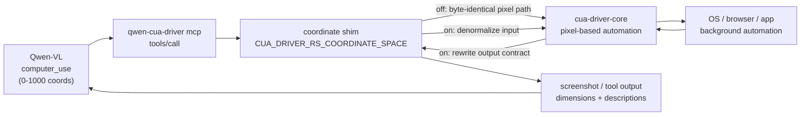
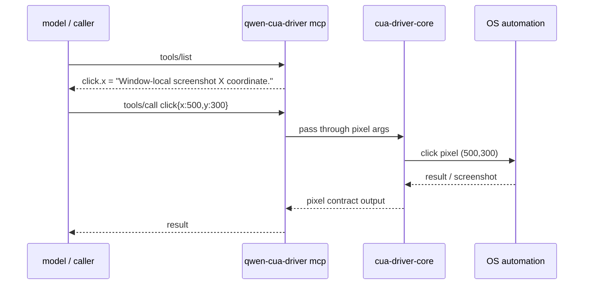
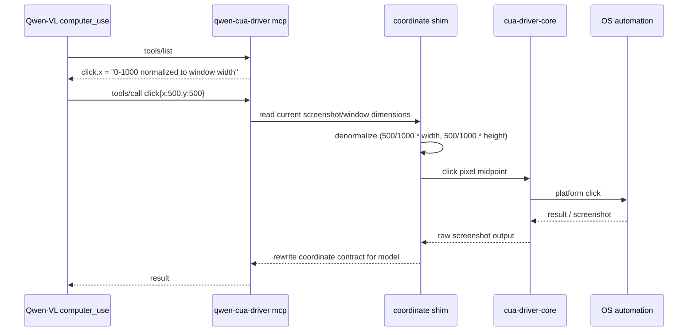

# CUA driver / Qwen-VL computer-use 坐标适配技术方案

> 适用范围：`packages/cua-driver` vendored driver、`qwen-cua-driver` binary/bundle、Qwen-VL `computer_use` 的 0-1000 相对坐标适配。
> 涉及 PR：#5896（vendor qwen-cua-driver with opt-in 0-1000 relative coordinates）、#5925（stop computer use driver when idle）。
> 代码基线：`QwenLM/qwen-code` `main`（#5896 已合并）。

---

## 1. 背景与动机

Qwen-VL 的 `computer_use` 工具调用输出的是 0-1000 归一化坐标：`x=500,y=500` 表示当前截图/窗口中心。但 trycua/cua driver 的原生工具面使用的是 window-local screenshot pixel 坐标：`x=500` 表示第 500 个像素。二者如果直接相连，模型给出的中点点击会被当成固定像素点击，在不同窗口大小下落到错误位置。

#5896 的目标不是重写 computer-use 栈，而是把 trycua/cua driver vendor 进 qwen-code，并在 driver 边界加一层**可选开启**的坐标归一化 shim：

- 默认路径保持 upstream pixel 语义，避免影响已有像素调用方。
- 通过环境变量开启 0-1000 相对坐标模式，让 Qwen-VL 输出能映射到真实截图像素。
- 同步改写工具参数描述、agent instructions 与截图尺寸输出，让模型看到的工具契约和实际执行契约一致。

---

## 2. 整体架构



核心分层：

| 层 | 关键内容 | 作用 |
|---|---|---|
| vendored workspace | `packages/cua-driver/rust/**`、`packages/cua-driver/python/**` | 引入 trycua/cua driver 的 Rust workspace、Python wrapper、测试 harness、安装脚本。 |
| qwen fork packaging | `qwen-cua-driver` / `QwenCuaDriver.app` / `com.qwencode.cua-driver` | 重命名 binary、bundle、app id，避免与用户本机上游 trycua 安装冲突。 |
| coordinate shim | `CUA_DRIVER_RS_COORDINATE_SPACE`、`CUA_DRIVER_RS_COORDINATE_SCALE` | 开关式把模型归一化坐标和 driver pixel 坐标互转。 |
| tool contract rewrite | tool/param descriptions、agent instructions、screenshot dimension output | 让 `tools/list` 和模型 prompt 中的坐标语义与运行时一致。 |
| release / sync | `cd-cua-driver.yml`、upstream sync script、`.vendored-from` / `.vendored-patches.md` | 独立发布 driver artifact，并记录 vendored 来源和本地 patch。 |
| client lifecycle | shared `ComputerUseClient` idle timer | 最后一次 `computer_use__*` 调用后默认 5 分钟停 driver，降低空闲 CPU 占用。 |

---

## 3. 子系统详解

### 3.1 vendored driver 与命名隔离

#5896 第一个 commit 引入整个 driver 源码树，因此文件/行数很大。为了降低 fork 与上游安装的冲突面，PR 同时改名：

| 对象 | qwen fork 名称 | 目的 |
|---|---|---|
| binary / CLI | `qwen-cua-driver` | 用户可同时安装 upstream `cua-driver` 与 qwen fork。 |
| macOS app bundle | `QwenCuaDriver.app` | 避免 app bundle 名称和系统授权状态互相覆盖。 |
| bundle id | `com.qwencode.cua-driver` | 避免与上游 app id 冲突，尤其是 macOS 辅助功能/录屏权限。 |

vendored 目录被加入根级 lint ignore，原因是该目录按上游源码树维护，不能让 qwen-code 的 TS/JS lint 规则误扫 vendored Rust/Python/fixture 内容。后续同步上游时，`.vendored-from` 和 `.vendored-patches.md` 负责记录来源版本与 qwen patch 差异，降低 fork 漂移成本。

### 3.2 坐标开关与默认兼容性

坐标模式由环境变量控制：

| 配置 | 行为 |
|---|---|
| 未设置或 `CUA_DRIVER_RS_COORDINATE_SPACE=0` | pixel 模式，工具参数描述仍是 window-local screenshot pixel，路径保持 upstream 行为。 |
| `CUA_DRIVER_RS_COORDINATE_SPACE=1` | 开启相对坐标模式，默认把输入视为 0-1000 normalized coordinates。 |
| `CUA_DRIVER_RS_COORDINATE_SPACE=1 CUA_DRIVER_RS_COORDINATE_SCALE=999` | 使用 0-999 坐标空间，工具描述同步显示 0-999。 |

关键设计是**默认 off**。只有显式开启 `CUA_DRIVER_RS_COORDINATE_SPACE` 时才进入归一化逻辑；不开时工具列表、参数语义、执行路径都维持像素坐标。这让 PR 可以把大体量 driver vendor 进来，同时不把现有像素调用方迁移成 breaking change。

### 3.3 输入 denormalization

开启相对坐标模式后，driver 在执行点击、拖拽等工具前，把模型给出的归一化坐标映射成当前截图/窗口像素：

```
pixel_x = normalized_x / scale * window_width
pixel_y = normalized_y / scale * window_height
```

其中 `scale` 默认 1000，可由 `CUA_DRIVER_RS_COORDINATE_SCALE` 调整。映射发生在 driver 边界，底层平台实现仍接收 pixel 坐标，因此 macOS / Linux / Windows 的 click、drag、background input 代码不需要被大改。

边界口径：

- top-left origin 不变。
- 归一化只处理需要坐标的工具参数；非坐标参数保持原样。
- 模型侧“能否准确定位目标”不由 driver 保证；driver 只保证坐标契约正确映射。

### 3.4 输出与工具契约改写

只改输入会产生另一个问题：模型通过 `tools/list` 或 agent instruction 看到的仍是 pixel 语义，下一轮可能继续按错误契约推理。因此 #5896 同步改写输出侧：

| 输出面 | 改写内容 |
|---|---|
| tool parameter description | `click.x` / `click.y` 等描述从 pixel 改为 `0-1000 normalized to window width/height`，或按 `COORDINATE_SCALE` 显示 0-999。 |
| screenshot dimension output | 相对坐标模式下输出给模型的截图尺寸契约按归一化空间表达，避免模型把真实像素尺寸当成坐标上限。 |
| agent instructions | 工具说明中明确 top-left origin、坐标范围与归一化口径。 |

这使模型看到的“怎么用工具”和 driver 实际执行的“怎么解释参数”一致。不开开关时这些描述保持 upstream pixel wording，避免暴露新语义。

### 3.5 zoom / move_cursor 支持

PR 同时补了 `zoom` / `move_cursor` 支持，使 Qwen-VL computer-use 计划中常见的“先移动指针/放大再操作”可以走同一 driver 表面。这里的坐标原则与 click/drag 一致：默认 pixel，开启相对坐标模式后再按当前 scale 映射。

### 3.6 idle shutdown（#5925）

#5925 处理 shared Computer Use driver 的进程生命周期。问题不是坐标协议，而是工具调用结束后 `cua-driver` 仍保持运行，尤其在 Windows 上可能在 qwen-code 空闲时继续占 CPU。

新规则：

| 配置 | 行为 |
|---|---|
| 默认 | 最后一次 `computer_use__*` 工具调用后 5 分钟停 shared driver client。 |
| `tools.computerUse.idleTimeoutMs=0` | 禁用 idle shutdown，保持旧的长驻行为。 |
| `tools.computerUse.idleTimeoutMs=<positive>` | 使用自定义毫秒值。 |
| `tools.computerUse.enabled=false` | 完全禁用 computer use 工具。 |

实现放在 shared `ComputerUseClient`，而不是散在每个 tool wrapper：每次 computer-use 工具调用都会 touch idle timer；到期后停止 driver，下次工具调用再冷启动。负数或非法设置回落默认 5 分钟，并同步进 CLI config / VS Code schema。

边界：idle stop 会清掉 driver 侧窗口/截图状态，后续动作可能需要重新 `get_window_state`；截图尺寸 rewrite、相对坐标 contract、tool descriptions 都不受 #5925 影响。

---

## 4. 关键流程

### 4.1 默认 pixel 模式



### 4.2 相对坐标模式



---

## 5. 涉及 PR

| PR | 状态 | 作用 |
|---|---|---|
| **#5896** `feat(cua-driver): vendor qwen-cua-driver with opt-in 0-1000 relative coordinates` | MERGED（2026-06-26） | 将 trycua/cua driver vendor 到 `packages/cua-driver`，改名为 qwen fork，新增 opt-in 相对坐标模式、tool contract rewrite、zoom/move_cursor 支持、跨平台 release workflow 与 upstream sync 记录。 |
| **#5925** `fix(core): stop computer use driver when idle` | MERGED（2026-06-27） | shared Computer Use client 增加 idle timeout，默认空闲 5 分钟停止 `cua-driver`；`idleTimeoutMs=0` 可禁用。 |

---

## 6. 各 PR 代码贡献

### #5896 qwen-cua-driver vendoring + relative coordinates

- **实现模式**：新增 `packages/cua-driver` vendored tree，包含 Rust workspace、Python wrapper、test harness、安装/发布脚本与 driver 文档；根级配置把 vendored 目录加入 lint ignore。
- **命名隔离**：binary/bundle/app id 改为 `qwen-cua-driver` / `QwenCuaDriver.app` / `com.qwencode.cua-driver`，避免与 upstream trycua 安装冲突。
- **坐标开关**：默认 pixel 模式保持 upstream 行为；`CUA_DRIVER_RS_COORDINATE_SPACE=1` 开启归一化坐标；`CUA_DRIVER_RS_COORDINATE_SCALE` 可把默认 0-1000 空间改成如 0-999。
- **输入处理**：开启后对坐标参数做 denormalization，把模型输出的相对坐标映射成当前 screenshot/window pixel，再交给原有平台 driver。
- **输出处理**：改写 tool/param descriptions、agent instructions 与 screenshot dimension contract，让模型看到的坐标范围与 runtime 解释一致。
- **能力补充**：补 `zoom` / `move_cursor` 支持，并保留平台 click/drag/zoom 主体代码边界。
- **验证**：PR 本地跑 `cargo test -p cua-driver-core`（128 passed）、`cargo build -p cua-driver --release`，并端到端检查 `qwen-cua-driver mcp` 的 `tools/list` 在 off / `SPACE=1` / `SPACE=1 SCALE=999` 下描述正确；Linux/Windows release build 依赖 CI runner。

### #5925 computer-use idle shutdown

- **生命周期集中**：在 shared `ComputerUseClient` 维护 idle timer，避免每个 `computer_use__*` tool wrapper 各自处理 driver stop。
- **默认策略**：最后一次 computer-use 调用后 5 分钟停止 driver；下一次调用按原路径重启。
- **配置面**：`tools.computerUse.idleTimeoutMs=0` 禁用 idle shutdown，正数为自定义毫秒值，负数/非法值回落默认；`tools.computerUse.enabled=false` 仍是总禁用开关。
- **边界**：idle stop 不改变 screenshot dimension runtime、坐标 contract 或相对坐标 shim；它只影响 driver 进程长驻状态。

---

## 7. 已知限制 / 后续

- **大体量 vendored fork 的维护成本**：driver 源码树很大，后续必须依赖 `.vendored-from`、`.vendored-patches.md` 和 sync script 管住与 upstream trycua 的漂移；否则 qwen patch 很容易和上游安全/平台修复脱节。
- **默认兼容性依赖开关不漂移**：`CUA_DRIVER_RS_COORDINATE_SPACE` 必须保持默认 off。任何默认开启都会把 pixel caller 变成 breaking change。
- **模型定位准确率不在 driver 范围内**：driver 只保证 normalized-to-pixel 映射正确；Qwen-VL 是否能在截图中选中正确目标，仍是模型和 prompt 的问题。
- **Windows / Linux 本地人工验证有限**：PR 说明中 macOS 做了本地构建和开关检查，Linux/Windows release build 主要依赖 CI；后续若改平台输入实现，应补对应系统的真机 click/drag/zoom smoke。
- **idle shutdown 后第一步可能需要重建窗口状态**：#5925 停 driver 后不会保留 driver 内部 UI state；后续自动化最好先重新获取窗口/截图状态再执行坐标动作。

_新增于 2026-06-27_
