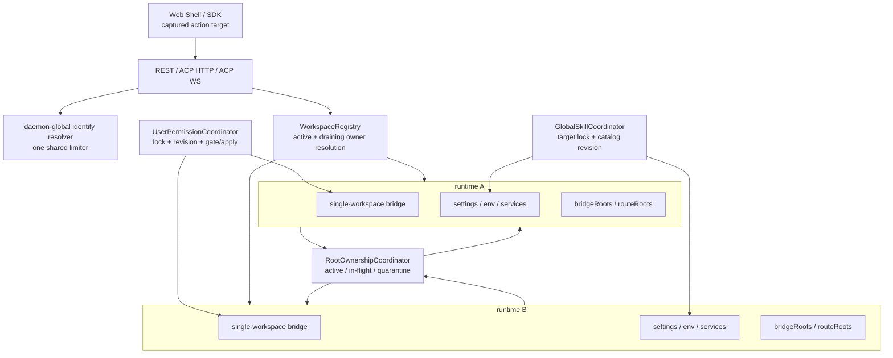

# daemon multi-workspace 一致性审计与改进设计

> 来源：[QwenLM/qwen-code#6378](https://github.com/QwenLM/qwen-code/issues/6378) 与其[原始设计文档](https://github.com/doudouOUC/qwen-code/blob/3d50b1834a0493eb7365eadb286bb9358d2818e7/docs/design/daemon-multi-workspace.md)。
>
> 审阅基线：`QwenLM/qwen-code@401170d4888914fb50c1640a1256239931c9b009`（2026-07-17，包含 #7018 与 #7077）。`0ecba4b3..401170d488` 只新增 VP mouse selection、CI 和 capabilities baseline 修正，本文审计的 daemon/Skill/WebShell 路径未变化；下方代码锚点固定在这些路径最后一次审阅时的 `0ecba4b3`。
>
> 状态：#6378 曾于 2026-07-17 02:04 UTC 关闭，又于 08:41 UTC 重新打开，当前为 OPEN。本文记录的是基于最新代码的补充审计与后续改进设计，不表示这些方案已经实现或被上游接受；umbrella 可用于汇总结论，实施仍应拆成聚焦 issue/PR。

本文是 [daemon/serve 模式总览](../daemon-serve-mode/)的专题补充。总览负责记录 Mode B 的能力演进和 PR 全景；本目录只讨论 multi-workspace 收口后仍存在的 ownership、一致性和失败路径问题。

## 一句话结论

现有总体架构方向正确：daemon 进程持有 `WorkspaceRegistry`，每个 workspace runtime 持有独立的单 workspace bridge、settings/env、filesystem、Voice、ACP/MCP 和 session 状态。不要把 `AcpSessionBridge` 改造成多租户 bridge。

问题在于，原方案主要解决了“请求应该路由到哪个 runtime”，但没有把“被读写的状态属于谁”和“runtime 在生命周期转换中是否仍拥有资源”完整建模。最新代码仍有五组可执行缺口：

| 优先级 | 缺口                                                                                            | 当前风险                                                                                                           | 改进入口                                                                     |
| ------ | ----------------------------------------------------------------------------------------------- | ------------------------------------------------------------------------------------------------------------------ | ---------------------------------------------------------------------------- |
| P0     | user permission 是 daemon/user-global 状态，写入和刷新仍由单个 runtime/child 完成               | 并发写丢失、同 daemon 其他 runtime 使用旧规则、旧授权在新规则提交后继续执行                                        | [user permission 一致性](user-permission-consistency.md)                     |
| P0     | `scope: global` Skill 仍由 selected runtime 写入、取 env 并只刷新本 runtime                     | 同名事务互删 staging、全局 catalog 陈旧、workspace env 改变 user-global credential、folder source 越过 route roots | [global Skill management 一致性](global-skill-management-consistency.md)     |
| P0     | runtime 只记录一个 `workspaceCwd`，无法表达 primary bridge 的额外 IDE roots 与更窄的 REST roots | nested/symlink root 冲突漏检，动态注册可能覆盖仍被旧 runtime 使用的路径                                            | [workspace root 与生命周期 ownership](workspace-root-lifecycle-ownership.md) |
| P0     | draining/removed/partial-construction 的 ownership 信息释放过早                                 | cleanup 未确认时立即 re-add，晚到 callback 污染新 runtime，session route 退化为错误 owner                          | [workspace root 与生命周期 ownership](workspace-root-lifecycle-ownership.md) |
| P1     | Web Shell action target 和 ACP rate-limit key 仍混用“当前 UI 选择”“传输连接”“workspace”         | action 串 workspace；切换 workspace 可放大同一客户端额度；远端 client id 可切分 IP 预算                            | 本文的 Web Shell/Voice 与 rate-limit 章节                                    |

最新的 #7077 是一个正向样例：`session-info` 先解析 selected runtime，对 untrusted secondary 只读 persisted counts，并明确不查询 live bridge。这说明 route ownership 基线已经可用；本次设计是在该基线上补齐共享状态、root topology 和跨生命周期一致性，不是推翻现有实现。

同日合入的 #7018 则是 state-scope 缺口的最新样例：workspace-qualified Skill route 支持 `scope: global`，但 global destination、credential、transaction 和 catalog propagation 仍挂在 selected runtime 上。新增专题把它拆成独立的窄 coordinator，不并入 permission 强一致协议。

## 审计证据

下表只列与结论直接相关、且已确认在审阅基线上仍未变化的固定代码锚点：

| 观察                                                                                                     | 固定代码证据                                                                                                                                                                                                                                                                                                                                                                                                                                                                                                                                      | 结论                                                                                      |
| -------------------------------------------------------------------------------------------------------- | ------------------------------------------------------------------------------------------------------------------------------------------------------------------------------------------------------------------------------------------------------------------------------------------------------------------------------------------------------------------------------------------------------------------------------------------------------------------------------------------------------------------------------------------------- | ----------------------------------------------------------------------------------------- |
| runtime 只有 `workspaceCwd`，没有完整 root descriptor                                                    | [`workspace-registry.ts`](https://github.com/QwenLM/qwen-code/blob/0ecba4b3c709d271a17faa5ac9537bf1b102eaf1/packages/cli/src/serve/workspace-registry.ts)                                                                                                                                                                                                                                                                                                                                                                                         | 无法统一验证 bridge roots、route roots、IDE roots 和 lifecycle root claims                |
| primary bridge 接收 IDE-derived `boundWorkspaces`，REST factory 只接收 primary root                      | [`run-qwen-serve.ts`](https://github.com/QwenLM/qwen-code/blob/0ecba4b3c709d271a17faa5ac9537bf1b102eaf1/packages/cli/src/serve/run-qwen-serve.ts#L2975-L3025)                                                                                                                                                                                                                                                                                                                                                                                     | “一个 runtime 一个 cwd”不足以代表真实文件系统 ownership                                   |
| settings promise chain 按 workspace key 串行化                                                           | [`run-qwen-serve.ts`](https://github.com/QwenLM/qwen-code/blob/0ecba4b3c709d271a17faa5ac9537bf1b102eaf1/packages/cli/src/serve/run-qwen-serve.ts#L509-L533)                                                                                                                                                                                                                                                                                                                                                                                       | 多 runtime 共享 user settings 文件时仍可并发 read-modify-write                            |
| comment-preserving writer 自身没有统一跨进程锁，并使用固定 `.tmp/.orig`                                  | [`commentJson.ts`](https://github.com/QwenLM/qwen-code/blob/0ecba4b3c709d271a17faa5ac9537bf1b102eaf1/packages/cli/src/utils/commentJson.ts)、[`writeWithBackup.ts`](https://github.com/QwenLM/qwen-code/blob/0ecba4b3c709d271a17faa5ac9537bf1b102eaf1/packages/cli/src/utils/writeWithBackup.ts)                                                                                                                                                                                                                                                  | caller 未进入同一锁协议时会丢更新，且仍存在 crash window                                  |
| child 只刷新自己当前 `sessions` 中的 permission managers，失败仅 warning                                 | [`acpAgent.ts`](https://github.com/QwenLM/qwen-code/blob/0ecba4b3c709d271a17faa5ac9537bf1b102eaf1/packages/cli/src/acp-integration/acpAgent.ts#L3871-L3907)                                                                                                                                                                                                                                                                                                                                                                                       | 不能保证其他 runtime、subagent 或 scheduler 在成功响应前已应用规则                        |
| `ProceedAlwaysUser` 先由 child persistence callback 写盘，再更新本地 manager                             | [`permission-helpers.ts`](https://github.com/QwenLM/qwen-code/blob/0ecba4b3c709d271a17faa5ac9537bf1b102eaf1/packages/core/src/core/permission-helpers.ts#L172-L226)、[`Session.ts`](https://github.com/QwenLM/qwen-code/blob/0ecba4b3c709d271a17faa5ac9537bf1b102eaf1/packages/cli/src/acp-integration/session/Session.ts#L5320-L5375)                                                                                                                                                                                                            | 缺少 parent commit receipt、全 daemon gate 和 execution revision barrier                  |
| `scope: global` Skill 仍由 selected runtime env/service 写 global dir，并只 refresh 当前 runtime         | [`workspace-service/index.ts`](https://github.com/QwenLM/qwen-code/blob/0ecba4b3c709d271a17faa5ac9537bf1b102eaf1/packages/cli/src/serve/workspace-service/index.ts#L278-L297)、[`workspace-service/index.ts`](https://github.com/QwenLM/qwen-code/blob/0ecba4b3c709d271a17faa5ac9537bf1b102eaf1/packages/cli/src/serve/workspace-service/index.ts#L782-L821)、[`workspace-skill-management.ts`](https://github.com/QwenLM/qwen-code/blob/0ecba4b3c709d271a17faa5ac9537bf1b102eaf1/packages/cli/src/serve/workspace-skill-management.ts#L690-L759) | user-global destination、credential 与 catalog propagation 被错误绑定到 workspace runtime |
| Skill transaction 无共享锁，prefix cleanup 可删除并发 artifact；folder source 直接读取任意 absolute path | [`workspace-skill-management.ts`](https://github.com/QwenLM/qwen-code/blob/0ecba4b3c709d271a17faa5ac9537bf1b102eaf1/packages/cli/src/serve/workspace-skill-management.ts#L612-L727)、[`workspace-skill-management.ts`](https://github.com/QwenLM/qwen-code/blob/0ecba4b3c709d271a17faa5ac9537bf1b102eaf1/packages/cli/src/serve/workspace-skill-management.ts#L752-L823)                                                                                                                                                                          | concurrent install/delete 与 source filesystem capability 都缺少明确 owner/containment    |
| public Skill status/result 暴露 server absolute installed path                                           | [`workspace-skills-mapping.ts`](https://github.com/QwenLM/qwen-code/blob/0ecba4b3c709d271a17faa5ac9537bf1b102eaf1/packages/cli/src/serve/workspace-skills-mapping.ts#L17-L36)、[`types.ts`](https://github.com/QwenLM/qwen-code/blob/0ecba4b3c709d271a17faa5ac9537bf1b102eaf1/packages/sdk-typescript/src/daemon/types.ts#L1134-L1152)、[`types.ts`](https://github.com/QwenLM/qwen-code/blob/0ecba4b3c709d271a17faa5ac9537bf1b102eaf1/packages/sdk-typescript/src/daemon/types.ts#L2048-L2066)                                                   | daemon filesystem layout 跨越 API trust boundary；delete 不应依赖 public path 回传        |
| Web Shell Skill manager 使用 root provider actions，未绑定 active session owner                          | [`useDaemonSkills.ts`](https://github.com/QwenLM/qwen-code/blob/0ecba4b3c709d271a17faa5ac9537bf1b102eaf1/packages/webui/src/daemon/workspace/hooks/useDaemonSkills.ts#L12-L25)、[`actions.ts`](https://github.com/QwenLM/qwen-code/blob/0ecba4b3c709d271a17faa5ac9537bf1b102eaf1/packages/webui/src/daemon/workspace/actions.ts#L288-L317)、[`DaemonWorkspaceProvider.tsx`](https://github.com/QwenLM/qwen-code/blob/0ecba4b3c709d271a17faa5ac9537bf1b102eaf1/packages/webui/src/daemon/workspace/DaemonWorkspaceProvider.tsx#L168-L179)          | A/B workspace Skill list/detail/mutation 可以继续落到 provider/root client                |
| dynamic registration 只比较 runtime cwd 和同 route 的 in-flight cwd                                      | [`workspace-management.ts`](https://github.com/QwenLM/qwen-code/blob/0ecba4b3c709d271a17faa5ac9537bf1b102eaf1/packages/cli/src/serve/routes/workspace-management.ts#L92-L386)                                                                                                                                                                                                                                                                                                                                                                     | 未覆盖 primary implicit IDE roots、partial construction 和 quarantine claims              |
| removal 以 persistence 为 commit point，后续 cleanup 失败仍完成 registry removal                         | [`workspace-management.ts`](https://github.com/QwenLM/qwen-code/blob/0ecba4b3c709d271a17faa5ac9537bf1b102eaf1/packages/cli/src/serve/routes/workspace-management.ts#L621-L790)                                                                                                                                                                                                                                                                                                                                                                    | 逻辑删除正确，但 cleanup 未确认时不应立即释放 root ownership                              |
| REST limiter 在 non-loopback 下把 caller-controlled client id 拼进 IP key                                | [`rate-limit.ts`](https://github.com/QwenLM/qwen-code/blob/0ecba4b3c709d271a17faa5ac9537bf1b102eaf1/packages/cli/src/serve/rate-limit.ts#L104-L135)                                                                                                                                                                                                                                                                                                                                                                                               | 轮换 client id 可切分一个来源 IP 的额度                                                   |
| ACP limiter 再把 workspace scope 拼进 key                                                                | [`acp-http/index.ts`](https://github.com/QwenLM/qwen-code/blob/0ecba4b3c709d271a17faa5ac9537bf1b102eaf1/packages/cli/src/serve/acp-http/index.ts#L477-L503)                                                                                                                                                                                                                                                                                                                                                                                       | 同一逻辑客户端切换 workspace 可获得倍增额度，违背 daemon-global 限流契约                  |
| Web Shell Voice 直接使用 provider 的 daemon base URL                                                     | [`VoiceButton.tsx`](https://github.com/QwenLM/qwen-code/blob/0ecba4b3c709d271a17faa5ac9537bf1b102eaf1/packages/web-shell/client/voice/VoiceButton.tsx#L57-L78)                                                                                                                                                                                                                                                                                                                                                                                    | active secondary session 的录音没有绑定该 session 的 runtime Voice endpoint               |

## 两维 ownership 模型

每个请求需要回答两个独立问题：

1. **route ownership**：请求由哪个 runtime 或 process 处理？
2. **state scope**：被读写的状态属于 process、user、workspace 还是 session？

### Route ownership

| 类型                | 定义                                                                         | 失败语义                                                                              |
| ------------------- | ---------------------------------------------------------------------------- | ------------------------------------------------------------------------------------- |
| Process-global      | listener、auth、HTTP/ACP rate limit、总 session admission、metrics、shutdown | 不按 workspace 分裂资源或额度                                                         |
| Legacy-primary      | 明确保留兼容语义的 singular route                                            | 只允许 primary；缺 selector 不代表可以猜 owner                                        |
| Selected-runtime    | 先按 workspace id，再按 encoded canonical cwd 解析                           | unknown/untrusted/draining/removed 均 fail closed，不 fallback primary                |
| Live-session-owner  | 根据 live session 的唯一 owner runtime 路由                                  | ambiguous 返回 server error；draining 返回稳定 503；不得扫描后落 primary              |
| Persisted-workspace | 先解析 workspace，再读取该 runtime 的 persisted store                        | untrusted secondary 只允许显式声明的 read-only surface，不启动 ACP、不写 repair state |

### State scope

| 类型              | 示例                                                                            | 关键约束                                                                |
| ----------------- | ------------------------------------------------------------------------------- | ----------------------------------------------------------------------- |
| Process-global    | listener、token、rate limiter、总 admission、health aggregation                 | workspace 增加不能自动倍增额度或故障隔离                                |
| User-global       | user settings、permission rules、global Memory、global Skills                   | workspace-qualified 请求也可能修改 user-global 状态，必须由 parent 协调 |
| Workspace-runtime | workspace settings、runtime env、MCP、Voice、workspace Skills、filesystem roots | 必须绑定 selected/owning runtime，不能用 primary 作为 global alias      |
| Session           | prompt、temporary approval、transcript、current cwd                             | current cwd 可变化，但不改变 session runtime owner                      |

这是一套 review contract，不建议实现成 route-policy DSL 或通用 state bus。每个新增字段、route 或 mutation 只需在设计和测试中明确两维分类，并沿 bridge、service、filesystem、trust、lifecycle 和失败路径逐层核对。

## 必须保持的全局不变量

1. 显式 workspace/session 解析失败后，不得 fallback primary。
2. user permission mutation 在发起 daemon 内串行化，并在返回成功前使所有仍能授权的 runtime 应用新 revision 或被 fence。
3. 其他 user-global mutation 使用 parent-owned target、credential 和 destination lock；不得借 selected/primary runtime 充当 global owner。
4. 不同 runtime 不得拥有相同、祖先或后代关系的 canonical roots。
5. draining 先关闭新 admission，再 cleanup；logical removal 前 session owner 解析为 draining，之后公开 route 为 not-found，但 concrete runtime 与 root claim 保留到 cleanup 被确认或进入 quarantine。
6. 旧 runtime instance 的晚到 callback 不能修改同一 stable workspace id 的 replacement instance。
7. Web Shell mutation 使用 dispatch 时捕获的 target；target 改变不能重放 mutation。
8. 同一逻辑客户端切换 workspace、REST/ACP transport 或 reconnect，不能重置 daemon-global rate budget。
9. permission decision 在旧 revision 下通过但尚未开始执行时，必须在 execution prelude 重新校验。
10. daemon folder/import source 必须经过 captured runtime 的 route filesystem containment，不能把 user-global destination 当成全盘读取权限。

## 改进后的整体结构

边界保持简单：

- `WorkspaceRegistry` 继续负责 runtime/session 路由；
- `RootOwnershipCoordinator` 只负责 canonical root claims、lifecycle state、lease 和 quarantine；
- `UserPermissionCoordinator` 只负责共享 user permission mutation、revision 和 authorization gate；
- `GlobalSkillCoordinator` 只负责 global Skill destination transaction、catalog revision 和全 runtime invalidation；
- 每个 runtime 仍使用现有单 workspace bridge，不共享 child；
- UI 和 limiter 只增加窄 helper，不引入通用 action context 或 fairness scheduler。

## Global Skill destination 与 source capability

#7018 的 `scope: global` 需要从 selected runtime 中拆出，详细协议见 [global Skill management 一致性](global-skill-management-consistency.md)。最小边界是：

- workspace Skill 的 destination、runtime env 和 live refresh 归 selected runtime；
- global Skill 的 destination、GitHub credential、transaction lane 和 catalog revision 归 parent daemon；
- 同一 Skill target 在 runtime/process 间使用同一 destination lock；
- global commit invalidate 全部 runtime，running child refresh，idle child 不启动；runtime ready 和下一 turn/Skill lookup 使用 catalog revision barrier；
- folder source 是 workspace filesystem read capability，必须捕获 source workspace、持有窄 request lease 并限制在 `routeRoots`；global destination 不赋予任意 absolute-path read；
- public catalog/status/result/error 不返回 Qwen home、realpath、staging 或 backup path；`installedPath` 只作为 server 内部 provider 数据。

现有 workspace-qualified route 可以暂时兼容转发 `scope: global`，但内部不能再调用 selected runtime 的 global writer。不要复用 permission coordinator：Skill catalog refresh 失败允许返回 partial/deferred，permission stale allow 则必须 fence。

## Web Shell、SDK 与 Voice target binding

### 目标解析顺序

沿用现有 composer 的产品语义，但形成唯一 helper：

1. embedder-locked workspace；
2. active session 的 owning workspace；
3. 为下一次新 session 选择的 workspace；
4. 只有明确 Legacy-primary route 或无 selector 创建新 session 时才使用 primary compatibility default。

helper 返回稳定 `targetKey` 和已绑定的 `WorkspaceDaemonClient`。异步 action 开始时立即捕获两者：

- read target 改变时可以 abort，旧 target 的晚到结果必须丢弃；
- mutation 不得自动重放到新 target；传输失败后应标记结果未知，并先对原 target reconcile；
- active session 的 workspace owner 来自 attach/owner resolution 返回的注册 workspace cwd，不是 session 执行 `cd` 后的 mutable cwd；
- user/global operation 使用显式 daemon-global client 方法，不能把 primary client 当作 global alias。

primary fallback 只属于明确分类为 Legacy-primary 的 route 和“无 selector 创建新 session”的 compatibility default。multi-workspace-aware UI/SDK 的 workspace mutation 必须携带 captured target；缺失时返回 `target_required`，不能把 helper fallback 当 mutation owner。旧 bundle/SDK 通过 capability version 继续调用 legacy-primary surface，但 response 必须标明 effective primary target，UI 不得把它展示成当前 active workspace action。

| 功能     | Workspace scope                                 | User/daemon-global scope      |
| -------- | ----------------------------------------------- | ----------------------------- |
| Settings | selected runtime 的 workspace settings          | user settings                 |
| Memory   | workspace memory                                | global memory                 |
| MCP      | runtime status/control、workspace server config | user server config            |
| Skills   | workspace catalog/install/delete/toggle         | global catalog/install/delete |
| Voice    | provider、model、settings、env、stream          | 无                            |

Voice capture 在录音开始时捕获 owning workspace client，并由该 client 构建 workspace-qualified WebSocket URL。workspace/session target 改变时关闭旧 capture，不向新 runtime 发送后续音频帧，并丢弃旧流的晚到 transcript。测试必须用 A/B 不同 provider、model、env marker 证明实际执行 runtime 正确，不能只断言 URL 变化。

产品层剩余工作可继续关联 [#6974](https://github.com/QwenLM/qwen-code/issues/6974)（Settings/Memory/MCP parity）和 [#6972](https://github.com/QwenLM/qwen-code/issues/6972)（Voice controls），但它们应遵守这里的 target-capture contract。

## Rate-limit identity

REST 与 ACP 已共享一个 limiter 实例，问题只在 key construction。提取一个逻辑 identity resolver，在 REST request、ACP HTTP initialize 和 ACP WebSocket initialize 时各调用一次，并将 enforcement key 固定在连接上。

| bind 场景    | Enforcement key                              | Correlation id                       |
| ------------ | -------------------------------------------- | ------------------------------------ |
| loopback     | 合法、有限长的 client id；没有则 `anonymous` | 可复用相同 bounded id                |
| non-loopback | 只使用规范化的 kernel-reported peer IP       | client id 只能用于诊断，不能切分额度 |

具体要求：

- 统一 IPv4-mapped IPv6 与 loopback 判断；
- 未定义 trusted-proxy contract 前忽略 `X-Forwarded-For` 等 caller-controlled headers；
- derived workspace clients 与 reconnect 复用 root client id；
- 删除 `rateLimitScope` 和所有 workspace key component；
- client id 不是认证信息，不记录原文，metrics label 必须 hash 或有界；
- loopback client id 只是同一 OS user 下的 cooperative fairness identity，不是安全边界；identity cardinality 必须有界，overflow 进入共享 anonymous bucket；
- 保留现有 prompt/mutation/read tier 和 initialize、response/notification、heartbeat、metadata exemption；
- 不增加第二个 limiter，避免 ACP double charge；
- 不在本次实现 per-workspace fairness。若未来确有需求，应在统一 identity 后基于数据单独设计 process aggregate + fairness。

这里的 daemon-global contract 是“同一逻辑 client 的 budget 不因 transport/workspace/reconnect 分裂”，不是承诺所有合法本机 client 共用一个固定 aggregate quota。若观测数据证明需要抵御同一 OS user 轮换 client id，应另加 process aggregate protection；不要在本次 ownership 修复中混入未经容量验证的 fairness/DoS policy。

## 交付拆分

建议按依赖顺序拆为五组，避免一个跨 package 巨型 PR：

1. **User settings/permission correctness**
   - 统一 settings-path lock 和 atomic replacement；
   - parent user-permission coordinator；
   - `ProceedAlwaysUser` commit receipt；
   - child consumer registry、revision gate，以及 user/workspace permission hash + file-lock execution-start barrier。
2. **Root ownership/lifecycle correctness**
   - immutable root descriptor 与 startup arbitration；
   - dynamic in-flight root reservation；
   - draining/session-owner resolution 与窄 request lease；
   - cleanup result、root quarantine、unclean-launch journal、escaped-session guard。
3. **Global Skill management correctness**
   - parent global destination coordinator 与 per-target cross-process lock；
   - create-only install、rename-to-tombstone delete 和 catalog revision；
   - 全 runtime invalidation、ready/turn revision barrier，以及 folder source 的 route-root containment + lifecycle lease。
4. **Web Shell/SDK target binding**
   - Settings、Memory、MCP、Skills、Voice 使用 captured workspace/global client；
   - lost-response reconcile 与 stale-read discard。
5. **Rate-limit identity alignment**
   - REST/ACP 统一 resolver；
   - non-loopback IP-only enforcement；
   - 移除 workspace multiplier 并补 transport contract tests。

每组实现前建立独立 issue，列出 ownership 两维分类、downstream consumers、失败语义和 E2E 计划。#6378 只作为 umbrella 汇总 adoption/deferral 决策，不要把五组实现或纯重构塞进一个巨型 correctness PR。

## 兼容性边界

- primary 与 workspace-less legacy routes 保持已声明行为；
- multi-workspace-aware workspace mutation 缺少 captured target 时返回 `target_required`；只有明确 Legacy-primary route 保留 primary 语义，并返回 effective target；
- explicit secondary failure 禁用或报错，不重试到 primary；
- standalone CLI/ACP 复用安全 settings mutation primitive，但不启动 daemon coordinator；
- user permission 的跨 daemon live cache/response 仍是最终一致，但遵守 Qwen lock protocol 的 execution-start 通过 settings file lock/hash 线性化；
- global Skill 跨 daemon cache 依赖 change token 加 bounded full rescan 最终收敛，不声称同步 refresh；
- 现有 workspace-qualified Skill route 可兼容转发 `scope: global`，但 global writer/env/cache ownership 改由 parent；
- daemon folder Skill source 从 arbitrary absolute path 收紧为 route-root-contained source descriptor；standalone local CLI 可保留本机 absolute-path 语义；
- daemon folder source 使用新 capability/discriminant；旧 absolute-path wire request fail closed 并返回稳定 upgrade error，不能兼容降级；
- global Skill install 对已存在 destination 返回稳定 409；atomic replace 若需要应另行设计；
- root quarantine 保持逻辑删除已提交，但 cleanup 未确认时禁止同路径立即 re-add；
- restart 不是 quarantine 的安全恢复手段；没有 parent-death guarantee 的 daemon-managed child 需要 durable unclean-shutdown journal，确认退出或 operator 处置前不自动复用 root；
- 不提供 per-workspace token/ACL、process fault isolation 或 session migration；需要这些隔离时应部署多个 daemon。

## 验证总纲

除三个专题文档的定向测试外，还应覆盖：

- Web Shell Settings/Memory/MCP/Skills/Voice 使用 A/B 不同 marker，切换 target 时旧 read 结果被丢弃，mutation 不重放；
- mixed-version client 缺 workspace target 或发送 legacy absolute folder source 时 fail closed；Legacy-primary response 标明 effective target；
- A global Skill commit 后 B running child/cache refresh，idle C 不启动；folder source 越界时 primary/非目标 filesystem 调用为 0；
- 两个 daemon 共享 user settings 时，deny commit 与另一个 daemon 的 tool mark-start 在同一 logical file lock 上排序；
- attached session `cd` 到子目录或 legacy root-external cwd 后，workspace action 仍绑定原 owner runtime；
- 同一 logical client 在 REST、ACP HTTP、ACP WS 与不同 workspace 上得到同一 enforcement identity；
- non-loopback 下轮换 client id 仍共享同一 peer-IP budget；
- 每个 failure test 同时断言预期响应与“非目标 primary bridge/settings target/workspace client 的调用次数为 0”；
- deterministic barriers 放在 lock acquire、file read、catalog final rename/revision publish、permission hash-check/mark-start、journal intent/spawn/handshake、runtime start、beginDrain、cleanup ack 和 root release 处，避免只靠 sleep 的竞态测试。

## 明确不采用的方案

| 方案                                        | 不采用原因                                                                        |
| ------------------------------------------- | --------------------------------------------------------------------------------- |
| multi-tenant `AcpSessionBridge`             | 扩大共享状态和故障半径，现有 per-runtime bridge 已是正确隔离单元                  |
| 通用 route-policy DSL                       | 当前问题是少数 ownership 缺口；DSL 会增加抽象而不能自动证明 downstream scope 正确 |
| 通用 settings/event bus                     | user permission 只需要窄 coordinator；泛化会把无关 setting 引入强一致路径         |
| selected/primary runtime 代理 global writer | global Skill 的 destination、credential 与 catalog 不属于任一 workspace runtime   |
| hot root transfer/path subtraction          | 无法原子迁移 live session、child、MCP、Voice 和 filesystem state                  |
| 按 workspace 的 rate fairness               | 先修正可绕过 identity；公平调度需要独立需求和测量数据                             |
| 公开 runtime incarnation token              | 内部 object identity/token 足以阻止 late callback，无需扩展 SDK/protocol          |
