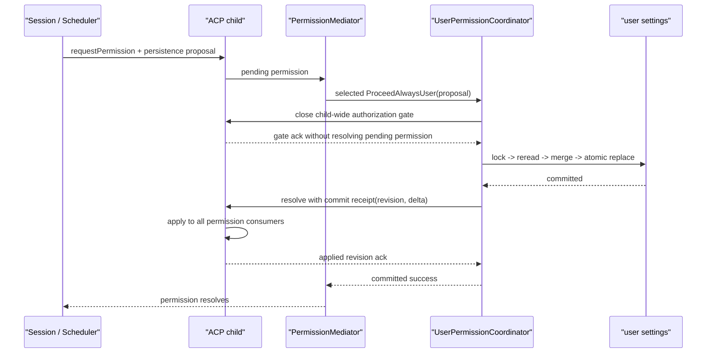

# daemon user permission 一致性设计

> 状态：基于 #6378 closeout baseline、在其重新打开后补充的聚焦 correctness 方案。实现应建立独立 issue；本文不改变现有 wire scope。跨 daemon 不承诺 live cache/response 同步，但所有遵守 Qwen settings lock protocol 的 tool execution-start 必须与相关 persistent permission file commit 线性化。

## 问题定义

同一 daemon 内所有 workspace runtime 使用同一个 user settings target。runtime env overlay 不应让 secondary runtime 选择另一份 `QWEN_HOME`，因此 user permission rules 本质上是 user-global/daemon-global policy，而不是 workspace-owned state。

当前 persistence 与 live refresh 没有匹配这个 ownership：

- serve 侧 promise chain 以 workspace 为 key，同一 user file 仍可被 A/B runtime 并发读改写；
- `updateSettingsFilePreservingFormat` 自身没有统一跨进程锁，read-modify-write 是否被保护取决于 caller；`writeWithBackupSync` 使用固定 `.tmp/.orig`，多个进程会碰撞，并存在旧 target 已移走、新 target 尚未安装的 crash window；
- REST/ACP rules replacement、`ProceedAlwaysUser`、settings migration、MCP/user settings 和 VS Code companion 各自写文件；
- ACP child 只 best-effort 刷新它当前 session map 中的 managers，subagent scheduler 或其他 runtime 可继续使用旧 policy；
- 已经在旧 policy 下获得 allow、但尚未真正执行的 tool call，没有 revision barrier。

目标不是创建全局 settings framework，而是建立一个最小的共享文件写入 primitive 和一个只协调 user permission 的 parent coordinator。

## Scope contract

- user permission rules：user-global，由 parent daemon coordinator 处理；
- `/workspaces/:workspace/permissions`：继续只支持 workspace scope；
- daemon child/subagent 的 `ProceedAlwaysUser`：必须先经过 parent coordinator；
- workspace permission 与 `ProceedAlwaysProject`：仍由 owning runtime 处理，但复用安全文件写入 primitive，并刷新该 child 内全部 consumer；
- standalone CLI/ACP：复用 primitive，只刷新本地 consumer，不启动 daemon coordinator；
- 现有 ACP user-scope request 保持 wire compatibility，但 parent 在 dispatch seam 截获，不再让 selected child 直接写 user file。

不增加 settings cohorts。未来若真的支持每个 runtime 选择不同 user profile，需要新的 ownership 设计，而不是在本方案里埋 dormant branching。

## 必须满足的不变量

1. 指向同一逻辑 settings path 的所有 Qwen writer，在同一个跨进程锁内完成 read、transform、validate 和 replace。
2. lock identity 是 canonical logical target path，绝不是 workspace id。
3. user permission mutation 返回成功时，发起 daemon 内每个仍能授权的 runtime 已应用 committed revision，或已被 fence 到不能授权。
4. 同步不启动 idle ACP child。
5. mutation 过程中启动的 child，不能以旧 revision 进入 ready。
6. persistent rules refresh 不清除 session-local temporary approvals。
7. commit 后的 apply/cleanup 失败不能被当作“写盘回滚”而自动重试。
8. 旧 revision 下通过但尚未跨过 execution-start boundary 的 tool call，必须重新校验。
9. 多个 Qwen daemon 共享同一 user/workspace settings target 时，commit 之后不能再有 tool 在旧 persistent permission hash 下跨过 execution-start boundary。

## 安全 settings-file mutation primitive

定义一个 repo-wide 的小型 lock-and-atomic-write contract。core/CLI/serve 复用同一 primitive；VS Code companion 若直接依赖 core 会显著扩大 extension bundle，可保留一个最小兼容 adapter，并通过相同 lockfile convention、依赖版本和共享 contract fixtures 防止漂移。不要为这一个用途再新建 package。各 consumer 保留自己的 JSON/JSONC transformer。

### Logical target identity

1. 创建 parent directory；
2. 从 target 向上找到最近存在的 parent，并对 parent 做 canonical realpath；
3. final filename 作为逻辑 leaf 保留，不 follow settings file 自身的 symlink；
4. 进程内 queue、`proper-lockfile` sidecar 和 final writer 都使用同一 identity。

这样既能处理“文件尚不存在”，也保持现有“替换最终 symlink，而不是写到 symlink 指向位置”的安全语义。

### Mutation algorithm

```text
derive logical target
  -> process-local queue
  -> proper-lockfile(realpath:false, bounded retry, compromised detection)
  -> reread latest file
  -> pure merge / exact subtree replacement
  -> render and parse validation
  -> unique same-directory temp
  -> atomic replacement(noFollow:true) + structured commit outcome
  -> unlock and wake next waiter
```

具体要求：

- 锁覆盖 read；只包 final rename 不能消除 lost-update window；
- async request-time 与 bounded sync startup 两种入口使用同一锁 convention；
- sync 入口只允许 daemon 接受请求前的 migration，不得在同进程持有 async lock 时调用；
- temp filename 必须唯一；最终替换复用 core `atomicWriteFile` 的 `noFollow: true` 语义；
- writer/caller 必须区分 `not_committed | committed | indeterminate`，不能把任意 thrown error 等同于 rename 未发生；
- pure merge 得到与 preimage 等价的 no-op 时不进入 replacement、不分配新 revision，避免 intended/preimage 无法区分；
- rename 后的 fsync/chmod/metadata error 在仍持 lock 时立即 reread：target 等于 intended parsed state 则按 committed 继续 fan-out，等于 preimage 则按 not-committed 失败；两者都不是或无法解析时保持 gate closed，进入 stable recovery error，绝不自动恢复 backup 覆盖未知状态；
- lock acquire/retain 失败时 fail closed，绝不降级为 unlocked writer；
- success/failure 后都推进 waiter，并回收空的 in-memory queue entry；
- comment、format、file mode、symlink contract 必须有回归测试。

至少迁移以下 writers：

- generic user/workspace `Settings.setValue`；
- REST/ACP explicit permission replacement；
- Session 和 CoreToolScheduler 的 `ProceedAlwaysUser` callback；
- settings normalization/migration write-back；
- MCP user-settings read-modify-write；
- VS Code companion 对同一 user settings file 的写入。

外部编辑器不会参与该线性写入协议；继续依赖 watcher/reload。

## Parent `UserPermissionCoordinator`

coordinator 只拥有以下状态：

```ts
interface UserPermissionCoordinatorState {
  revision: number;
  mutationLane: Promise<void>;
  bridges: Map<
    BridgeInstance,
    {
      requiredRevision: number;
      appliedRevision: number;
      state: "starting" | "running" | "draining" | "fenced";
    }
  >;
}
```

这里的 `BridgeInstance` 是 concrete object/internal incarnation，不按 workspace id 二次查询。否则同一 stable id 被移除再添加时，旧 fan-out 可能误命中新 runtime。

bridge set 不只包含 registry `active`：starting、running、draining，以及 executor 尚未确认停止的 fenced runtime 都在集合中。只有确认 Session/CoreToolScheduler 不再做 permission decision 或 persistence 后才移除。

revision 是 daemon-local monotonic counter，不持久化、不公开。daemon restart 后从 0 开始没有问题，因为 child ready 前必须读取当前文件。

### Mutation normalization

所有 mutation source 先转换成窄 operation，例如：

- `replaceRuleType(scope, ruleType, rules)`；
- `appendRuleIfAbsent(scope, ruleType, rule)`。

共享 pure helper 负责 legacy-compatible validation、normalization 和 before/after delta。generic user setting 若替换整个 `permissions` subtree，也必须进入 coordinator；无关 user settings 只需要共享 file lock。

## `ProceedAlwaysUser` commit receipt

`ProceedAlwaysUser` 的 child 已经阻塞在 `requestPermission`，不能简单先给 child 返回再异步同步。建议协议：

1. child 根据原始 confirmation details 生成 normalized persistence proposal，并放入 pending permission record；
2. client vote 只能选择 outcome，不能提供或替换 proposal；
3. mediator 验证 vote 选中 `ProceedAlwaysUser` 后，先调用 parent coordinator；
4. parent 通过 prompt/session queue 之外的 control lane，关闭所有 child（包括 origin child）的 child-wide authorization gate；gate ack 不等待已经 admitted 的 pending permission；
5. parent 持久化并分配 revision；
6. permission response 附内部 commit receipt：`revision + normalized rule delta`；
7. origin child 通过 receipt、其他 child 通过 apply control 更新 child-level permission-consumer registry，并分别 ack；
8. 后续 Session/Core persistence callback 识别 receipt，禁止重复写盘。

proposal 必须由 parent 和 child 使用同一 pure helper 验证。daemon mode 下若 parent coordination 不可用，permission outcome 失败，不能回退为 child-local user write。



所有 child（包括 origin）都使用现有 bridge control transport 上的窄 `gate` control；非 origin child 再接收 `apply` control，origin child 则由 commit receipt 完成 apply。control 必须绕过 per-session prompt queue，gate ack 只关闭新 authorization admission、安装 execution barrier，不等待已经 admitted 的 pending permission，否则 origin request 会自锁。不要新增通用 event protocol。

## Child permission-consumer registry

当前只遍历 ACP agent 的 session map 不够。registry 必须覆盖每一个能够进行 tool authorization 的 consumer：

- live ACP sessions；
- CoreToolScheduler；
- in-process/background subagents；
- child 内其他复用 `PermissionManager` 的 scheduler。

refresh 只替换 persistent user/workspace layers，保留 session temporary approvals。任一 consumer apply 失败，child ack 失败；不能 warning 后继续声称成功。

workspace-scope mutation 使用同样的 local gate + consumer registry，但只影响 owning child，不 fan-out 到其他 runtime。

## Authorization linearization

gate 必须位于真实 permission-decision entry 和 execution prelude，而不是 HTTP/ACP route。关闭 gate 阻止新 decision，但不等待已经 admitted 的 decision 全部退出，否则可能与正在执行 `ProceedAlwaysUser` 的 flow 相互等待。

每个 permission decision 记录 child-local `effectivePermissionEpoch`。user 或 workspace persistent layer 应用后 epoch 增加；parent daemon revision 只用于 fan-out acknowledgement。

execution prelude 规则：

- gate closed，或 `requiredRevision > appliedRevision`：等待；
- decision epoch 等于当前 effective epoch：跨过 execution-start boundary；
- 当前 epoch 更新：丢弃 stale decision，在新 policy 下重新评估；
- interactive answer 只有在新 policy 仍允许同一 outcome 时可复用；
- 已经跨过 start boundary 的 tool 不做中途撤销，避免一半 side effect。

child 内 gate close、epoch check 和“标记 execution started”共用同一个 authorization admission mutex/state machine。gate ack 必须在线性化点之后返回：所有 dispatcher 已关闭 admission window，任何尚未标记 started 的 call 都不能越过；不能把 epoch read 与 actual start 分成两个未保护步骤。

因此 gate ack 的含义是：“没有新的 decision 进入，且尚未执行的 call 不能越过 start boundary”，不是“所有旧 prompt 已经 drain”。apply ack 的含义是 persistent layers 与 revision 已安装。

## Mutation protocol

对 revision `N + 1`：

1. validate/normalize mutation；
2. 进入 coordinator lane，snapshot 所有 authorization executor 尚未确认停止的 concrete bridge，并临时设置 `requiredRevision=N+1`；
3. 要求每个 child（包括 origin blocked child）通过独立 control lane close admission 并 ack gate；pre-commit gate failure 时恢复旧 required revision 并 reopen 已 ack child；
4. 获取 settings-path lock，reread，基于最新内容重新计算 mutation，atomic replace；
5. 根据 structured commit outcome 或 lock 内 reread 确认 target；只有 confirmed committed 才 publish daemon revision `N+1`，随后释放 file lock；
6. fan-out reload/delta apply；origin child 通过 receipt 完成，不发送 re-entrant control；
7. child 只有 ack `N+1` 或更高 coalesced revision 后才 reopen。

不要在等待 child gate IPC 时持有 cross-process file lock。idle bridge 只记录 required revision，不初始化 child；child 启动时读取当前 file/revision 并 ack 后才能 ready。

bridge registration 也进入 coordinator lane。mutation snapshot 后创建的 bridge，必须看到 lane 中 committed current revision，不能在旧 policy 上发布 ready。

新 runtime 初始为 `permissionReady=false`。`attach(concreteRuntime)` 与 mutation 使用同一 coordinator lane：attach 要么先进入正在开始的 mutation participant set，要么等待该 mutation 完成后加载最新 committed permission snapshot/revision；apply ack 前不得发布 workspace route、建立 session、接受 prompt 或执行 tool。detach 顺序相反：先关闭 authorization admission 并撤销公开 route，确认 executor 不再做 decision 后，才能从 coordinator 注销。topology lane 与 permission lane 不需要合并成大锁，但 runtime ready 的发布必须排在 permission attach 之后。

并发 mutation 可以在 child reload loop 合并，但旧 revision ack 不能清除更高 required revision。

## Failure semantics

| 失败点                                   | 对外与内部结果                                                                                      |
| ---------------------------------------- | --------------------------------------------------------------------------------------------------- |
| validation/trust/lock/read 失败          | 未 commit；返回原 mutation error；恢复 gate                                                         |
| child gate 无法 ack                      | 只有确认 child 已停止授权后才可从 participant set 移除并继续；否则未 commit、恢复已 ack gate 并失败 |
| replacement 明确在 rename 前失败         | revision 不推进；旧 policy reopen                                                                   |
| rename 后 error，reread 等于 intended    | 视为 committed，推进 revision/fan-out；记录 durability warning，不 reopen 旧 policy                 |
| rename 后 error，reread 等于 preimage    | 视为 not committed；revision 不推进，旧 policy reopen                                               |
| replacement outcome indeterminate        | gate 保持 closed，当前 mutation/tool 失败并进入 recovery；不得猜测或自动 retry                      |
| external hash mismatch refresh 失败      | 当前 tool 不执行；affected gate 保持 closed 或 child 被 fence，成功 recovery 前 fail closed         |
| commit + 全 child apply                  | 成功；全部 reopen                                                                                   |
| commit 成功、非 origin child apply 失败  | fence 失败 runtime；origin 已 apply 时返回 committed success                                        |
| commit 成功、origin child apply/ack 失败 | fence origin；当前 tool 不执行，返回 committed-but-fenced error                                     |
| daemon 在 commit 后退出                  | restart 后 child 读取 committed file，再进入 ready                                                  |

`committed success` 表示所有受影响 runtime 已应用 policy，或已被阻止继续授权；不表示所有 runtime 仍健康。fenced runtime 从 dispatch 移除并停止；若停止未确认，其 roots 进入 [quarantine](workspace-root-lifecycle-ownership.md#removal-与-root-quarantine)。

`indeterminate` 不能依赖普通 execution admission 自愈，因为 gate 已关闭。coordinator 必须通过独立 control lane 安排 bounded-backoff reconciliation；settings watcher、daemon startup 和 authenticated health-repair 复用同一入口：

1. 保持 affected gates closed；等待 timer、IPC 或 coordinator lane 时不持 settings file lock；
2. 进入 coordinator lane 后按固定顺序取得 logical settings lock，读取并验证当前 authoritative user/workspace permission snapshot/hash，然后在任何 consumer IPC/ack 前释放全部 file locks；
3. 把 snapshot 应用到全部当前 consumers；全部 ack 后重新取得 file lock 复核 hash，若期间又变化则保持 gate closed 并从读取步骤循环，只有 hash 仍相同才更新 applied hash/epoch 并 reopen；
4. 原 mutation response 始终是 indeterminate，后续 recovery 不能事后改写或自动重放；
5. file 缺失、损坏、持续变化或 apply 失败时继续 fenced，并在 authenticated health 暴露 `permissionConsistency: indeterminate` 和 reason code；不回退到旧内存 snapshot；
6. drain/remove/shutdown control 不经过 authorization gate，必须仍可停止 runtime 或进入 root quarantine。

origin apply 失败时，user rule 已经提交，但本次 permission decision 不能安全放行。mediator 需要把它映射为稳定的 committed-but-fenced failure；client 先 reconcile user rules，再创建/恢复健康 runtime，不得自动重放当前 tool call。

health/diagnostic 只暴露 workspace id、revision 和 reason code，不暴露 settings path。client 不得自动 retry 已 commit 的 response。

## 跨 daemon execution-start barrier

cross-process file lock 不可能同步 gate 另一个 daemon 的所有 child，但可以提供更窄、足够安全的 execution-start linearization。所有 Qwen daemon/standalone ACP 的 tool execution prelude 按固定 user -> owning-workspace 顺序锁住相关 settings targets。

hash fast path：

```text
acquire relevant logical settings-path lock(s) in fixed order
  -> reread current user/workspace permissions
  -> compute normalized persistent permission hash
  -> hash unchanged: enter local admission mutex
  -> gate open + epoch unchanged: mark execution started
  -> release mutex and file lock(s), immediately invoke executor
```

gate 在 request 等 file lock 或持 file lock、尚未 mark-start 时关闭，该 request 一律取消本次 start attempt、释放 file lock 并从头重试；不 grandfather。mark-start 与真正调用 executor 之间不能有 await、IPC 或用户交互。

hash mismatch slow path：

1. 只保留读取到的 snapshot/hash，立即释放全部 settings locks；
2. 通知 parent/local coordinator，任何路径都不得持 settings lock 等待 coordinator lane、child gate ack、IPC 或用户响应；
3. user change 关闭该 daemon 全部 child gate，workspace change 只关闭 owning child gate；
4. gate ack 后复用上述 control-lane reconciliation：lock 内读取、lock 外 fan-out、lock 内复核；hash 再变化则保持 gate closed 并循环；
5. reconcile reopen 后，原 execution prelude 从头重试并重新做 permission decision。

user/workspace permission mutation 使用对应的 logical settings-path lock 完成 reread/replace，任何 writer 都不得用 workspace -> user 的反向嵌套顺序。因此跨 daemon 只有两种合法顺序：B 先在旧 hash 下标记 started，随后 A commit，该 tool 被 grandfather；或 A 先 commit，B 随后读到新 hash 并重新评估。A commit 之后，B 不能再在旧 hash 下开始执行。不要为此增加第二个 generation file，settings content 的 normalized permission hash 就是事实源，也避免双文件 commit gap。

为避免本地 gate 与 file lock 反向等待：mutation/refresh 只在 admission mutex 内关闭 gate，随后释放 mutex，再等待 file lock；tool fast path 持 file lock 后进入 admission mutex，若发现 gate 已关闭就释放 file lock 并重试。任何路径都不能一边持 admission mutex 一边等待 file lock，也不能一边持 file lock 一边等待 coordinator/gate fan-out。

每个 daemon 仍 watch relevant user/workspace settings targets，以便提前进入本地 coordinator lane、关闭 gate 并 refresh；watcher 只减少下一次 prelude 的成本，不承担 correctness。外部编辑器若不遵守 lock protocol，只能提供原子文件替换后的最终一致，不能获得上述线性化保证。

## 验证计划

### 文件并发与 crash

- 两个 runtime、两个 daemon process、VS Code companion 指向同一 user file，并发修改不同 key 不丢更新；
- writer 在 read 后暂停，另一个 writer commit 后，前者必须 reread 或等待，不能覆盖新内容；
- crash 在 rename 前后只留下 old/new 任一可解析文件，不依赖固定 `.tmp/.orig` 恢复顺序；
- 在 rename 后的 fsync/metadata barrier 注入 error：lock 内 reread 必须把 intended/preimage/indeterminate 三种结果映射到正确 failure semantics；
- indeterminate 后普通 tool admission 为 0；control-lane recovery 在 valid snapshot 时全 consumer ack 后 reopen，在 malformed/持续变化时保持 fenced，drain/shutdown 仍可完成；
- recovery consumer apply 期间另一个 daemon 再次改 file 时，post-apply hash recheck 必须保持 gate closed 并循环，不能用 stale snapshot reopen；
- comment、format、mode、symlink 和 malformed legacy rules 保持现有 contract。

### Permission propagation

- secondary session 与 subagent 的 `ProceedAlwaysUser` 都经过 parent，child-local user writer 调用次数为 0；
- vote 无法伪造 persistence proposal；origin receipt handshake 不与 pending request 死锁；
- origin child 的另一个 concurrent session 在 gate ack 后不能继续用旧 policy 获得授权；
- A 更新 deny 后，B 所有 live consumer 在下一次 authorization 前看到新 policy；
- idle B 不启动 child，但后续启动不能 ready 在旧 revision；
- runtime registration 与 concurrent mutation 通过同一 coordinator lane 排序，`permissionReady` 前 route/session/tool admission 均为 0；
- draining runtime 在 executor 停止前仍参与 fan-out；
- stale ack 不清除新 revision；consumer apply 失败后 B 被 fence，旧 policy 上后续 authorization 调用为 0。
- 两个 daemon 共享 user 或 workspace permission file：A commit deny 与 B execution prelude 在同一 file lock 上排序；若 A 先 commit，B 的旧 decision 必须重新评估且不能 start；同时覆盖 user -> workspace lock ordering。
- hash mismatch 时 origin 先释放 file lock 再请求 coordinator；另一个 child 等待该 lock、gate 同时关闭的 barrier 不得死锁；gate 在 fast path mark-start 前关闭时 request 必须 release/retry。

### Execution boundary

在以下四个 deterministic barrier 暂停：permission entry 前、decision 后 execution prelude 前、epoch/hash check 与 mark-start 之间、execution start 后。前三者必须被 gate/admission mutex 或 cross-process file lock 排序并使用新 policy；只有已标记 started 的 call 被 grandfather。

## 不采用的方案

- per-workspace/per-runtime settings lock：所有 runtime 共享 user file；
- 只锁 rename：lost-update 从 read 开始；
- 同 daemon 传播依赖 watcher：无法提供 pre-commit gate 与 acknowledgement；
- refresh 时启动 idle child：破坏 lazy runtime ownership；
- 持久化 revision：file 本身是 restart 后事实源；
- best-effort live refresh：stale allow 是 correctness/safety failure，不是日志问题。
