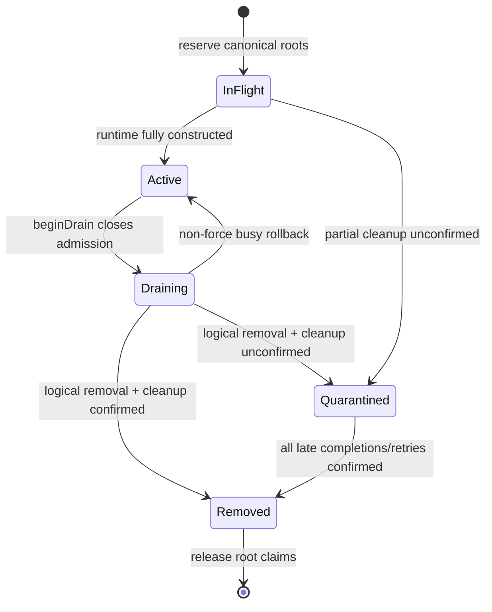

# daemon workspace root 与 lifecycle ownership 设计

> 状态：基于 #6378 closeout baseline、在其重新打开后补充的聚焦 correctness 方案。目标是补齐真实 filesystem roots、draining/removal、partial construction 与 session cwd 的 ownership；不提供 OS sandbox 或跨 runtime session migration。

## 问题定义

`WorkspaceRuntime` 当前只保存一个 `workspaceCwd`，但真实访问边界并不只有一个 root：

- primary bridge 可以从 IDE env 获得多个 trusted roots；
- primary REST filesystem factory 为保持响应语义，仍只绑定 primary root；
- secondary/dynamic runtime 通常只有自己的 root；
- untrusted runtime 虽不能执行 runtime-backed operation，仍必须占有自己的 root，防止被 primary implicit root 覆盖绕过 trust boundary。

因此，registry 的 runtime cwd 既不能代表 bridge 可访问 roots，也不能代表 route roots。动态 registration 只比较 runtime cwd，会漏掉 primary implicit IDE roots。

生命周期还会过早丢失 ownership：registry 的普通 list/get 只返回 active runtime；live-session owner resolution 忽略 draining owner；removal 在 persistence commit 后即使 cleanup 失败也最终删除 registry entry；partial construction 失败没有持久的 root claim。旧 child/service 仍可能存活时，同一路径即可 re-add。

## Immutable root ownership descriptor

在创建 bridge、filesystem factory 或 child 前，先构造并 freeze：

```ts
interface RuntimeRootOwnership {
  readonly workspaceCwd: string;
  readonly ownedRoots: readonly string[];
  readonly bridgeRoots: readonly string[];
  readonly routeRoots: readonly string[];
}
```

- `ownedRoots`：所有 daemon-managed consumer roots 的 canonical coverage union，用于跨 runtime conflict；
- `bridgeRoots`：bridge/child 实际被授权的 roots；
- `routeRoots`：REST/file/import routes 实际允许并可安全表示的 roots，包括 daemon folder Skill source 等 server-side read capability；
- primary 的 `bridgeRoots` 可以包含 IDE roots，而 `routeRoots` 仍只有 primary root；
- 同一 runtime 内被祖先 root 覆盖的 descendant 可从 `ownedRoots` 去重，但 consumer subset 只保留它实际使用的 entries。

所有 constructor 和 route-side filesystem importer 消费该 descriptor，禁止在 validation 后重新读取 IDE env、直接使用 caller absolute path 或自行扩 root。

root ownership 保护 Qwen-managed filesystem capabilities，不是 shell command 或 external MCP process 的 OS sandbox。

## Canonical comparison

复用 `canonicalizeWorkspace` 的 `realpathSync.native` 语义。containment 使用 `path.relative` 风格，不使用字符串前缀。

两个不同 runtime 的 root 冲突定义为：

- canonical equality；
- A 是 B 的 ancestor；
- B 是 A 的 ancestor。

需要覆盖 symlink alias、trailing separator、Windows drive/UNC、case-insensitive filesystem。workspace 数量有上限，直接扫描 owner/root 比 path trie 更简单、可审计。

不需要新增 display-path identity；protocol 继续使用现有 canonical cwd。

## Startup arbitration

在 primary bridge 构造前完成所有 root claim，顺序固定为：

1. unclean-shutdown journal 中尚未确认释放的 daemon-managed roots，先恢复为 non-routable quarantine；
2. primary 与显式 `--workspace` roots；
3. valid persisted registrations，按存储顺序；
4. primary 的 trusted IDE-derived roots。

兼容规则：

- duplicate/nested explicit roots：启动失败；
- explicit/persisted root 与恢复的 quarantine 冲突：启动对应 runtime 失败并给出 operator recovery reason，不能跳过 quarantine；
- persisted entry 与 explicit runtime canonical-equal：显式 declaration 的 owner/config 优先，persisted duplicate 被 reconcile/忽略，不创建第二个 workspace id；
- inaccessible、over-limit、nested persisted entry：warning + skip，不使显式启动失败；
- IDE root 与非 primary 的 explicit/restored runtime 或 recovered quarantine 冲突：从 primary descriptor 丢弃该 IDE entry 并 warning；与 primary 自身重复或被 primary root 覆盖时只做同-runtime 去重；
- 不对 implicit parent root 做 path subtraction，避免制造多个不连续 ownership fragments。

最终 descriptor 在 runtime lifetime 内不可变。动态 workspace 不做 live root detach；若 operator 希望把 primary implicit IDE root 拆成独立 runtime，应持久化/显式声明并重启，使 startup arbitration 生成新布局。

## `RootOwnershipCoordinator`

coordinator 保存 root claim，而不是替代 `WorkspaceRegistry`：

```text
workspace selector: active | draining | not_found
session owner:      found | draining | not_found | ambiguous
root claim:         active | draining | in_flight | quarantined | free
```

内部 claim 绑定 concrete runtime/incarnation token：

```ts
interface RootClaim {
  roots: readonly string[];
  workspaceId: string;
  owner:
    | { kind: "runtime"; incarnation: object }
    | { kind: "recovered"; durableIncarnationId: string };
  state: "active" | "draining" | "in_flight" | "quarantined";
}
```

不要从 `WorkspaceRegistry.list()` 或 active runtime count 推断 ownership。旧 instance callback 必须携带 concrete runtime/internal token；若 token 不匹配当前 runtime claim，忽略 callback。recovered claim 永不接受 callback，只能通过 startup recovery/operator flow 释放。

所有会同时改变 routing state 与 root claim 的操作进入同一个 topology lane。lane 内固定顺序为“先关闭 admission/保留 claim，再改变公开 routing”；rollback 按相反顺序恢复，避免 registry 已 active 而 roots 尚未 claim，或 roots 已释放而旧 runtime 仍可路由。

## Dynamic registration

把现有 `inFlight` 从“canonical cwd operation”扩展成“candidate descriptor root reservation”。在 settings load、persistence 或 child construction 前完成 reserve。

conflict scan 包含：

- active descriptors；
- draining descriptors；
- 并发 in-flight candidates；
- unconfirmed cleanup 的 quarantined roots；
- legacy escaped sessions 形成的 topology block。

overlap 返回 HTTP 409。公开 payload 只包含 stable code、overlap relation、owner workspace id 与 lifecycle state，不暴露 canonical path/symlink target；完整路径只进 authenticated operator diagnostics。

partial construction failure 与 removal 使用相同原则：reservation 保留到所有已创建 controller 明确 cleanup；bridge、child、mount 或 service 任一未确认，转成 quarantine。

## Lifecycle-aware resolution

### Workspace/session routing

- selected workspace active：正常 dispatch；
- selected workspace draining：`503 workspace_draining` + `Retry-After: 5`；
- removed/not found：稳定 mismatch/not-found；
- live session unique active owner：dispatch 到该 runtime；
- live session draining owner：返回 draining，不探测 primary；
- ambiguous owner：server error，任何 bridge 调用为 0。

session-owner index 与 concrete draining runtime 保持关联直到 logical removal，才能区分 draining 与 unknown。必须移除“只有一个 active runtime，所以现有 session 就属于它”的 shortcut；仅“创建新 session 且没有 selector”可以使用 primary compatibility default。



## Narrow request leases

`beginDrain` 必须同步阻止新 lease acquisition。workspace-qualified 和 live-owner resolver 可以为“跨 await 且 teardown 无法从现有 controller 观察”的短 operation 返回 lease。

不要给所有 route 套 lease：

- ACP connection、Voice、channel、session、child process 已有 controller，继续由 controller 报 activity；
- 纯同步 read 不需要 lease；
- 只有会跨 await 且否则不可见的 route 使用 lease。

daemon folder/import source 属于这一类：lease 必须从 source runtime 解析开始，覆盖 canonical containment、受约束的目录遍历、复制成 immutable input 和 file handle close。拿到 canonical absolute path 后不能脱离 runtime route filesystem 改用 raw `fs`。source runtime 已 draining/removed 时 acquire 失败；复制期间开始 drain 时，physical root release 等待 lease settlement。

removal 在 outstanding lease 完成或 abort 前不能释放 roots。测试使用 deterministic barrier 持有 lease，证明 drain 不提前释放，也不把 request 重定向到其他 runtime。

## Removal 与 root quarantine

removal 分成两个独立事实：

1. **logical routing removal**：对外不再可路由，persistence 已提交；
2. **physical ownership release**：child、mount、Voice、channel、session、lease 等已确认停止。

流程：

1. concrete runtime `active -> draining`，关闭新 admission；
2. 新 workspace/live-session work 返回 draining；
3. 在现有 commit point 提交 persistence removal，并从 public capabilities 移除；此时 workspace selector 已是 `not_found`，但 root claim 仍保持 draining；
4. 各 controller 返回 structured cleanup result；
5. 所有 required controller 均 `confirmed` 才释放 roots；
6. 任一 `unconfirmed` 则把 descriptor 转成 non-routable quarantine tombstone。

required controllers 至少包括：

- bridge/ACP child；
- ACP mounts 与 connections；
- Voice；
- channel workers；
- live sessions/subsessions；
- request leases。

timeout、swallowed exception、缺 ack、无法观察 child exit 都是 `unconfirmed`，不是成功。

### Quarantine tombstone

内存 tombstone 保存：

- canonical roots；
- workspace id；
- internal incarnation token；
- creation time；
- non-sensitive controller reason codes。

它不进入 active runtime maps，也不可路由，但继续拒绝 overlap registration。controller 可提供 late completion signal 或显式 idempotent retry；只有所有 controller 确认且 incarnation 仍匹配时释放 tombstone。

### Process-exit boundary

quarantine 是 daemon incarnation 内的 routing/root-claim 机制：它阻止仍可能通过旧 bridge/controller 回调当前 parent 的 runtime 被同路径 replacement 覆盖。它不是跨进程存活的 OS process containment。

- graceful shutdown 仍必须等待 required controller confirmed，不能把“准备退出”当 cleanup ack；
- abrupt daemon exit 会销毁 registry、control transport 和 incarnation token；下一 daemon 不能接受旧 callback，因此不会发生旧 callback 污染 replacement，但这本身不证明 root 已可安全复用；
- restart 会重建 in-memory claim；unresolved journal entry 必须恢复为 quarantine，且无论是否有 entry 都不证明 detached shell、external MCP process 或其他可独立存活的进程已经退出；
- daemon-managed ACP/channel child 应优先使用可验证的 parent-death binding；如果平台或 controller 不能保证，unclean shutdown 必须留下 durable owner/quarantine journal，下一 daemon 在确认旧 process group 退出或 operator 明确处置前拒绝自动复用相关 roots；
- detached shell、external MCP process 等 arbitrary external process 仍不在该保证内；若需要隔离，应单独设计 sandbox/process group policy，不能让一个 root tombstone 暗示已有 OS sandbox。

这个边界与本文开头的 scope 一致：durable journal 只记录同一 stable daemon deployment identity 下 daemon-managed controller 的未确认 ownership，不建立跨 daemon root exclusivity，不假装约束 arbitrary external process，也不扩展成通用 process sandbox journal。

journal 使用 user-only permissions，并采用 write-ahead state machine：

1. topology lane 内先写 `launching` intent：random `runtimeIncarnationId`、daemon incarnation、canonical roots 和 controller kind；atomic durable write 完成前禁止 spawn；
2. child 从启动参数/env 继承该 id，handshake 完成前不得对外 serve；parent 验证 id 后将 entry 原子推进为 `running`，补充 PID/process-group identity 与 process start marker；running write 失败时不得发布 route，并立即进入 cleanup/quarantine；
3. removal 先关闭 admission，将 entry 推进为 `stopping`，确认所有 root consumer 和 process group 退出后才原子删除；
4. parent 在 spawn 后、running update 前退出时，`launching` intent 仍使 startup fail closed；状态未知或只看到复用风险的 PID 都恢复为 quarantine；journal 整体损坏且无法可靠恢复 roots 时直接阻止该 daemon identity 启动，等待 operator repair。

只看 PID 不足以防 PID reuse。自动释放至少需要 incarnation handshake 或 PID + process start marker 的一致性；否则只能 operator recovery。锁顺序固定为 stable daemon instance lock -> topology lane -> 短 journal lock；startup 持有 instance lock，在开放 route 前读取 journal 并恢复 claims，释放 journal lock 后再继续 topology construction。运行期禁止 journal lock -> topology lane 的反向获取。journal 路径和 process identity 只进入本地 authenticated operator diagnostics。

不提供 generic force release，也不把 restart 描述成安全恢复。若没有安全 retry/completion signal，冲突返回：

```json
{
  "code": "workspace_root_quarantined",
  "recovery": "operator_required"
}
```

authenticated status/log 可显示 quarantine count、workspace id、age、unclean-shutdown marker 与 reason codes；unauthenticated health/conflict response 不显示 root path。operator acknowledgement 只能声明已处置外部进程风险，不能伪造 controller completion 或让旧 incarnation callback 生效。

这保留现有 external commit semantics：post-commit cleanup failure 不恢复 routing/persistence，但也不再假装 path 已安全释放。

## Session cwd 与 escaped-session guard

本方案不迁移 session owner。session `cd` 的兼容性应由 root topology 决定，而不是 active runtime 数：

- 没有 foreign active/draining/in-flight/quarantined owner：保留 legacy single-owner `cd`；
- 一旦存在 foreign owner/quarantine：session 只能移动到自己 runtime 已拥有 roots；
- target 位于其他 owner、quarantine 或 current runtime coverage 外：fail closed；
- removed runtime 的 quarantined path 不能自动归 primary。

legacy root-external `cd` 还有一个时序问题：session 先逃出 root，之后 dynamic workspace 把该路径注册为另一 runtime。

增加内部 escaped-session set，key 为 `(runtime incarnation, session id)`。bridge 向 root coordinator 报告：

- initial/attached session cwd；
- cwd transition settlement；
- session close。

caller-facing `cd` timeout 不得清除仍在 child 中 pending 的 transition。

当任一 live session 在 owner roots 外，或 out-of-root transition pending 时，拒绝创建任何额外 runtime，返回稳定 topology-blocked error。session 回到 owned roots 或关闭后解除。这个保守规则比临时为每个 session 创建 root ownership 更简单可靠。

restore/reattach 在接受 prompt 前分类：

- true single-owner topology：可保留 legacy external cwd，并登记 escaped；
- 已存在 foreign owner/quarantine：加载失败，返回稳定 ownership error。

cwd decision/transition 与 dynamic root reservation 必须共用一个 topology lane，避免 race。

## 兼容性

- non-overlapping explicit/restored workspaces 保持现状；
- invalid persisted registrations 继续 warning + skip；
- primary REST filesystem 仍返回 primary-relative 语义，即使 primary bridge 有更多 roots；
- daemon folder/import source 必须绑定 captured runtime 的 `routeRoots`；global destination 不改变 source ownership；
- dynamic registration 新增对 implicit primary roots、draining、in-flight、quarantine 的 overlap 拒绝；
- unclean shutdown 后，unresolved daemon-managed owner journal 会阻止冲突 runtime 自动启动；
- legacy external-cwd session 存在时暂时禁止增加 runtime；
- draining live-session route 从 primary-derived not-found 改为稳定 draining；
- multi-owner topology 下，`cd` 到 unowned/foreign path 从 legacy relocation 改为明确 ownership error。

## 验证计划

### Root arbitration

- primary IDE roots `[A, B]` + explicit B：primary `bridgeRoots` 只保留 A，`routeRoots` 仍只有 primary root；
- B 为 untrusted 或 persisted restore 时结果相同；
- exact/ancestor/descendant/symlink/Windows/case-insensitive conflicts 全部在 persistence/child startup 前拒绝；
- 两个 concurrent parent/child dynamic registrations 只能有一个成功 reserve。
- folder Skill/import source 在 A route root 内可读，absolute/escape/symlink 到 B 或 primary implicit-only root 时 fail closed，非目标 filesystem 调用为 0。

### Drain/removal

- B draining 时，B session route 返回 `workspace_draining`，primary bridge 调用为 0；
- held lease 阻止 root release，abort/complete 后释放；
- 全 controller confirmed 后可 re-add；
- 任一 controller unconfirmed 时旧 runtime 不可路由，但 roots 保持 quarantine；
- full daemon restart 后旧 incarnation callback 不能影响 replacement；外部进程存活不在该断言范围内；
- parent SIGKILL 后，若 daemon-managed child 没有 parent-death guarantee，durable journal 阻止新 daemon 自动复用 root，直到旧 process group 被确认退出或 operator 处置；
- crash 在 `launching` intent durable write、spawn、incarnation handshake、`running` update 各 barrier 后均 fail closed；PID reuse 不能误清 quarantine；
- partial construction failure 要么确认 cleanup，要么 quarantine candidate roots；
- old instance late callback 不能写入 replacement owner index 或释放 replacement claim。

### Session cwd

- primary session 不能 `cd` 到 active/draining/in-flight/quarantined secondary coverage；
- true single-owner topology 保持 legacy `cd`；
- session 先 external `cd` 后，所有新增 runtime registration 被阻止，直到 session 返回/关闭；
- `cd` timeout 与 dynamic registration race 使用 barrier 验证；
- restore escaped session 在 single-owner 下登记 block，在 foreign owner 已存在时 fail closed。

## 不采用的方案

- 只把 `workspaceCwd` 当 root：遗漏 primary bridge 的实际 IDE roots；
- 强迫所有 consumer 使用同一 root array：primary REST 的响应边界本来就更窄；
- hot root detach/transfer/path subtraction：无法原子迁移 live state；
- cleanup timeout 后释放 root：timeout 代表未知，不代表 termination；
- 用 active runtime count 选择 `cd` 行为：draining/quarantine 同样安全相关；
- public incarnation protocol：内部 object identity 足够；
- path trie：bounded direct scan 更简单、更容易 review。
