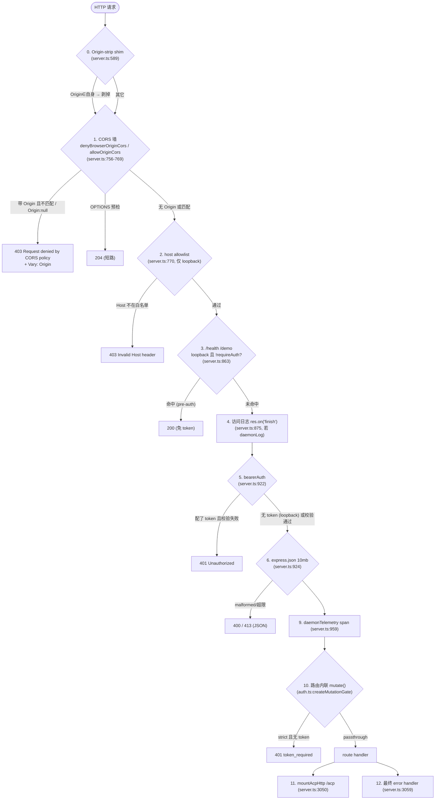
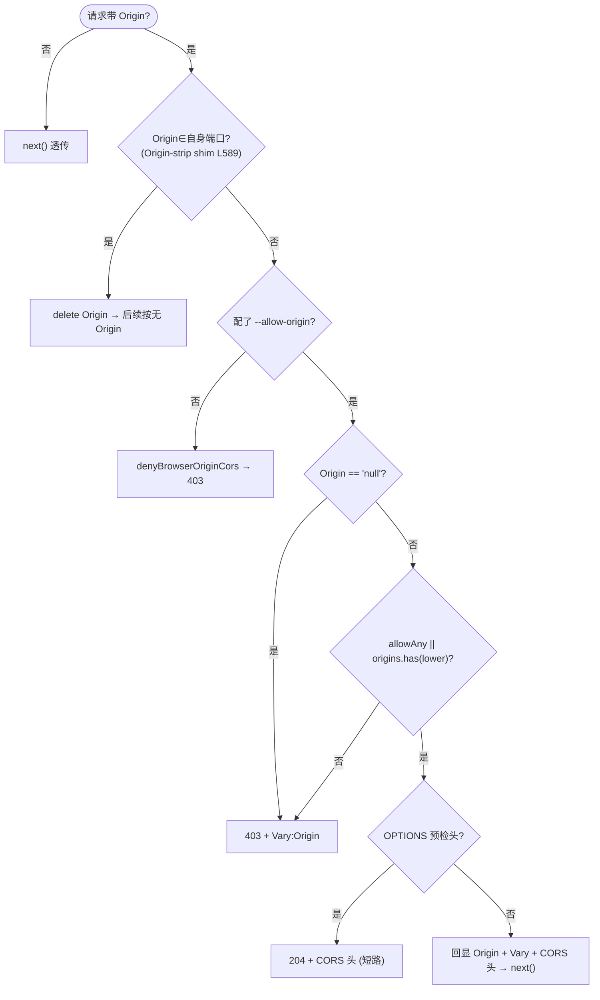
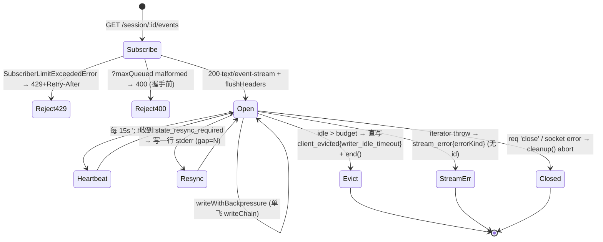
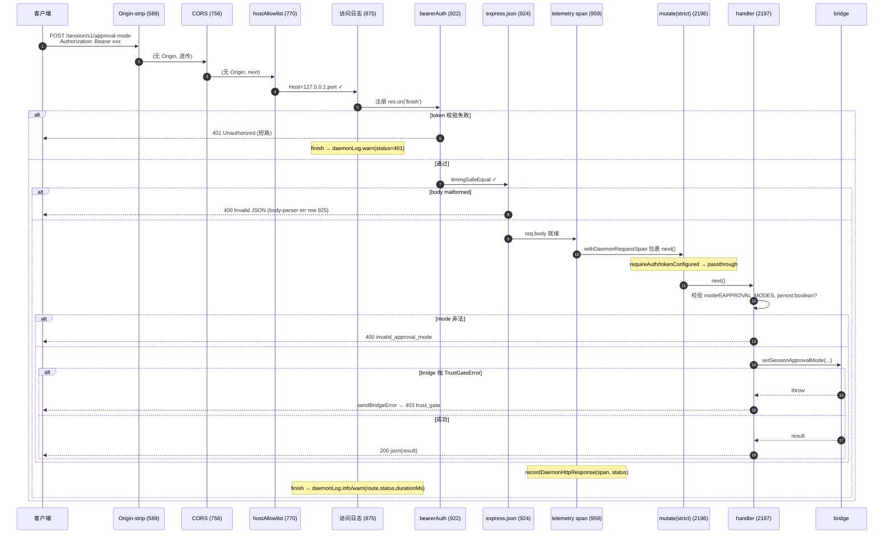

# HTTP 服务 / 路由 / 中间件链（深入）

> daemon/serve（Mode B）技术方案子文档；总览见 [`README.md`](README.md)。
> 本文 **取代** 总览 §3.1 / §3.5，下沉到 function/line 级。所有 `file:symbol`(+line) 锚点若未特别说明均以集成分支 **`daemon_mode_b_main`** 为准（读取方式：`git -C <repo> show daemon_mode_b_main:<path>`）。
> 关键文件：`packages/cli/src/serve/server.ts`（Express app 装配，4053 行）、`auth.ts`（452 行）、`runQwenServe.ts`（1203 行，boot 门控）、`capabilities.ts`、`loopbackBinds.ts`、`daemonLogger.ts`。

---

## 概述

`qwen serve` 的 HTTP 层由两个职责清晰分离的函数构成：

- **`server.ts:createServeApp(opts, getPort, deps)`（L475）** 是一个**纯函数**——只装配 Express `Application`（中间件 + 路由 + 错误处理），不做任何网络/进程副作用（docstring L427-429）。它可被测试与直接嵌入者（IDE companion、托管 daemon）直接调用。
- **`runQwenServe.ts:runQwenServe(optsIn, deps)`（L389）** 才是生产入口：做参数校验、**boot 门控**（token / CORS / 非 loopback / 路径存在性）、token trim、`listen()`、信号处理与优雅退出。

二者的分工有一条硬约束：**安全相关的 boot 拒绝（boot-loud）只发生在 `runQwenServe`**；`createServeApp` 仅保留一条针对嵌入者的 `--allow-origin '*' + 无 token` 防御（L758-765）。因此"直接 `createServeApp` 绑定用户输入"的入口必须自行复刻 `runQwenServe` 的校验，否则会 boot 出一个"看起来健康但每次 spawn 都 ENOENT"的 daemon（docstring L459-473）。

中间件的**注册顺序本身就是安全契约**：拒绝类闸门（CORS / Host allowlist / bearer auth）必须排在 `express.json()` 之前，否则一个未授权 POST 会先吃掉一次 10MB `JSON.parse` 才 401——任意错 token 客户端都能放大 CPU/内存成本（注册站点注释 `server.ts` L743-746）。

本文用大量篇幅锁定**中间件链的精确顺序**与每道闸的**短路语义**，并给出完整路由表、鉴权/变更门控矩阵、CORS/host allowlist 细节、请求生命周期与超时（含一处 **doc/code 不一致：prompt deadline 实际返回 202 而非 docstring 宣称的 504**）。

---

## 涉及 PR（表格）

| PR | 主题 | 与本文相关的落点（file:symbol+line） |
| --- | --- | --- |
| #4236 | mutation gating + `--require-auth` | `auth.ts:createMutationGate`(L300)、`bearerAuth`(L233)；boot 拒绝 `runQwenServe.ts` L456-462 |
| #4241 | 只读 workspace/session 状态路由 | `server.ts` `GET /workspace/{mcp,skills,tools,providers,env,preflight}`(L1003-1103) |
| #4282 | approval/tools/init/MCP-restart 变更路由（Wave 4 PR 17） | `server.ts` L2194-2573；`parseAndValidateWorkspaceClientId`(L3408) |
| #4291 #4255 | device-flow 路由 + gating | `server.ts` L1124-1318；`callerIsDeviceFlowInitiator`(L3223) |
| #4527 | `--allow-origin` CORS allowlist（T2.4） | `auth.ts:parseAllowOriginPatterns`(L80)、`allowOriginCors`(L132)；boot 校验 `runQwenServe.ts` L473-502 |
| #4530 | prompt 绝对 deadline + SSE writer idle timeout（T2.9） | `server.ts:resolvePromptDeadlineMs`(L410)、`PromptDeadlineExceededError`(L391)、prompt handler L1682-1695、SSE idle timer L2873-2935 |
| #4552 | 运行时 MCP server add/remove（T2.8） | `server.ts` `POST/DELETE /workspace/mcp/servers`(L2329/L2412) |
| #4606 | request 级访问日志 | `server.ts` access-log middleware L875-920；`daemonLogger.ts` |
| #4360 | errorKind / serverTimestamp（F4 prereq） | `formatSseFrame`(L3629)、`mapDomainErrorToErrorKind` 用于 SSE `stream_error`(L3010) |
| #4191 | capability registry + protocol versions | `capabilities.ts:SERVE_CAPABILITY_REGISTRY`(L37) |

---

## 中间件链（顺序与安全语义）

### 精确注册顺序（以 `createServeApp` 的 `app.use` / `app.<method>` 出现序为准）

下表是 `server.ts:createServeApp` 内**自上而下**的真实装配序。注意：**CORS 排在 host allowlist 之前**（与总览 §3.1 散文一致；本文以代码为准纠正任何"host→CORS"的口误）。

| # | 注册站点 | 中间件 / 路由 | 作用域 | 短路行为 |
| --- | --- | --- | --- | --- |
| 0 | L589 `app.use(...)` | **loopback 自源 Origin-strip shim** | app 级 | 若 `Origin` ∈ 自身 `{http://127.0.0.1:port, localhost, [::1], host.docker.internal}` 则 `delete req.headers.origin`（L602-604），让 demo 页同源请求穿过 CORS 墙；否则透传 |
| 1 | L756-769 | **CORS**：`allowOriginCors(parsed)`（配了 `--allow-origin`）或 `denyBrowserOriginCors`（默认） | app 级 | 带 `Origin` 且不匹配 → `403 {error:'Request denied by CORS policy'}`；OPTIONS 预检 → `204` |
| 2 | L770 `app.use(hostAllowlist(...))` | **host allowlist**（仅 loopback bind 生效） | app 级 | Host 不在 `{localhost:port,127.0.0.1:port,[::1]:port,host.docker.internal:port}` → `403 {error:'Invalid Host header'}` |
| 3 | L863-867 | `[仅 loopback 且 !requireAuth]` `GET /health`、`GET /demo`（**bearer 之前**注册） | 路由 | 命中即终结（探针免 token） |
| 4 | L875-920 `app.use(...)` | **访问日志中间件**（仅 `deps.daemonLog` 存在时） | app 级 | 不短路；注册 `res.on('finish')` 记录 |
| 5 | L922 `app.use(bearerAuth(opts.token))` | **bearer 全局鉴权** | app 级 | token 已配且校验失败 → `401 {error:'Unauthorized'}` |
| 6 | L924 `app.use(express.json({limit:'10mb'}))` | **JSON body 解析** | app 级 | 体过大 → 抛 413（由 #7/#13 转 JSON） |
| 7 | L925-935 | **body-parser 错误中间件**（4-arg） | app 级 | 捕获 `SyntaxError(status=400)` / `413` |
| 8 | L937-945 | `[非 loopback 或 requireAuth]` `GET /health`、`GET /demo`（**bearer 之后**注册） | 路由 | 命中即终结（探针需带 token） |
| 9 | L959 `app.use(daemonTelemetryMiddleware(boundWorkspace))` | **OTel span 包裹** | app 级 | 不短路；`withDaemonRequestSpan` 包 `next()` |
| 10 | L961-3041 | **业务路由**（每条变更路由内联各自的 `mutate()` 门，见下） | 路由 | 各自 4xx/5xx/2xx |
| 11 | L3050 `mountAcpHttp(app, bridge, {boundWorkspace})` | **官方 ACP Streamable HTTP**（挂 `/acp`，`QWEN_SERVE_ACP_HTTP=0` 关） | 路由 | 与 REST 路径不重叠 |
| 12 | L3059-3074 | **最终 JSON error handler**（4-arg） | app 级 | 收尾：400 malformed / 413 / 500 统一 JSON |

`mutate = createMutationGate({...})` 在 L954-957 **构造**（不是 `app.use`），随后作为**每条变更路由的内联中间件**插入（如 `app.post('/session', mutate(), handler)` L1321）。因此 **mutate 门跑在 `express.json()` 之后**——strict 路由的 `401 token_required` 是在 body 解析完才发出的（这是 `auth.ts` 刻意接受的代价，详见 §鉴权）。

### 顺序为何关键（安全语义）



三条关键的"为什么"：

1. **拒绝闸门必须在 `express.json()` 之前**（`server.ts` L743-746 注释）。否则未授权/错 token 客户端的 POST 会先付一次 10MB `JSON.parse`，每请求成本被 `--max-connections`（默认 256）放大。这就是 CORS / host / bearer 三者全部排在 L924 `express.json` 之前的根因。
2. **CORS 在 host allowlist 之前** 是合理的纵深：浏览器型 DNS-rebinding 攻击（页面把 `evil.com` rebind 到 `127.0.0.1:port`，浏览器仍带 `Origin: http://evil.com`）会**先**被 `denyBrowserOriginCors` 的"任何 Origin → 403"拦下（`auth.ts:denyBrowserOriginCors` L19-30）；host allowlist 是第二层，兜住"无 Origin 但 Host 被伪造"的非浏览器路径（`auth.ts:hostAllowlist` L181-225）。
3. **mutate 门跑在 body 解析之后** 是一处被显式接受的弱点：strict 路由在 no-token loopback 默认下会先 parse body 再 401，成本上界 `10mb × maxConnections ≈ 2.5GB` 瞬时（`auth.ts:createMutationGate` L414-428 的长注释，引用 PR #4236 review `#3254485915`）。设计取舍是"strict 路由实际 body 都很小（memory 写 / file edit / device-flow），不是生产热路径"，若未来有大 body 的 strict 路由再把门提到 app 级。

### `/health` 与 `/demo` 的双位置注册（豁免语义）

`exposeHealthPreAuth = loopback && !opts.requireAuth`（`server.ts` L863）。这个布尔决定 `/health` 与 `/demo` 注册在 **bearer 之前还是之后**：

- **loopback 且未 `--require-auth`**（开发默认）→ 注册在 bearer **之前**（L864-867）：k8s/Compose 探针无需带 token 即可 `200 {"status":"ok"}`。
- **非 loopback，或 loopback 但开了 `--require-auth`** → 注册在 bearer **之后**（L943-944）：否则未授权者可探测任意 `IP:port` 确认 daemon 存在，且 `/demo` 会泄露完整 API 面（路由枚举 + 交互控制台，比 `/health` 的 `{"status":"ok"}` 危险得多，L804-815 注释）。

无论哪种位置，CORS deny + host allowlist 都先于 `/health` 生效。`/demo` 还硬编码了 `X-Frame-Options: DENY` + CSP `frame-ancestors 'none'` 防点击劫持（L790-794）。`/health?deep=1` 只读 `bridge.sessionCount`/`pendingPermissionCount` 两个 Map-size getter（L840-845），**不是真实 liveness**——getter 不 ping 子进程，检测不出"wedged 但仍计数"的会话（L817-829 注释）。

---

## 路由表（method | path | 门控 | capability | 说明）

> 门控列：`bearer` = 仅全局 `bearerAuth`（无 `mutate`）；`mutate()` = 非 strict 门（集中化标记，no-token loopback 仍可达）；`mutate(strict)` = 严格门（no-token loopback → `401 token_required`）。capability 列对应 `capabilities.ts:SERVE_CAPABILITY_REGISTRY`。

| Method | Path | 门控 | capability tag | 注册行 | 说明 |
| --- | --- | --- | --- | --- | --- |
| GET | `/health` | bearer*（条件豁免） | `health` | L865/L943 | `?deep=1` 加 session/permission 计数；豁免见上 |
| GET | `/demo` | bearer*（条件豁免） | — | L866/L944 | 交互式 HTML 控制台 |
| GET | `/capabilities` | bearer | `capabilities` | L961 | 返回 `{v,protocolVersions,mode,features[],modelServices,workspaceCwd,policy}` |
| GET | `/workspace/mcp` | bearer | `workspace_mcp` | L1003 | MCP 池/预算快照 |
| GET | `/workspace/mcp/:server/tools` | bearer | `workspace_mcp` | L1011 | server 名 ≤256（`MAX_SERVER_NAME_LENGTH`） |
| GET | `/workspace/skills` | bearer | `workspace_skills` | L1034 | |
| GET | `/workspace/tools` | bearer | — | L1042 | |
| GET | `/workspace/providers` | bearer | `workspace_providers` | L1050 | |
| GET/POST | `/workspace/memory` | 读 bearer / 写 `mutate(strict)` | `workspace_memory` | L1065（工厂） | `mountWorkspaceMemoryRoutes` |
| GET/POST/DELETE | `/workspace/agents[/:agentType]` | 读 bearer / 写 `mutate(strict)` | `workspace_agents` | L1072（工厂） | `mountWorkspaceAgentsRoutes` |
| GET | `/workspace/env` | bearer | `workspace_env` | L1089 | 侦察面，PR24 才补 audit |
| GET | `/workspace/preflight` | bearer | `workspace_preflight` | L1097 | |
| GET | `/file` `/list` `/glob` `/stat` | bearer | `workspace_file_read` | L1112（工厂） | 只读文件面 |
| GET | `/file/bytes` | bearer | `workspace_file_bytes` | L1112（工厂） | 字节窗口读 |
| POST | `/file/write` `/file/edit` | `mutate(strict)` | `workspace_file_write` | L1115（工厂） | CAS + 原子写 |
| POST | `/workspace/auth/device-flow` | `mutate(strict)` | `auth_device_flow` | L1124 | 启动 device flow |
| GET | `/workspace/auth/device-flow/:id` | `mutate(strict)` | `auth_device_flow` | L1221 | 仅 initiator 见验证码 |
| DELETE | `/workspace/auth/device-flow/:id` | `mutate(strict)` | `auth_device_flow` | L1270 | 幂等 204 |
| GET | `/workspace/auth/status` | bearer | `auth_device_flow` | L1297 | pending flows 列表 |
| POST | `/session` | `mutate()` | `session_create` | L1321 | spawn/attach；cwd 防御见下 |
| POST | `/session/:id/load` | `mutate()` | `session_load` | L1544 | ACP loadSession |
| POST | `/session/:id/resume` | `mutate()` | `unstable_session_resume` | L1545 | ACP unstable_resumeSession |
| GET | `/session/:id/context` | bearer | `session_context` | L1547 | |
| GET | `/session/:id/context-usage` | bearer | `session_context_usage` | L1565 | |
| GET | `/session/:id/supported-commands` | bearer | `session_supported_commands` | L1587 | |
| GET | `/session/:id/tasks` | bearer | `session_tasks` | L1607 | |
| POST | `/session/:id/prompt` | `mutate()` | `session_prompt` | L1625 | **非阻塞 202**；deadline 见 §超时 |
| POST | `/session/:id/heartbeat` | `mutate()` | `client_heartbeat` | L1742 | per-client 心跳 |
| POST | `/session/:id/detach` | `mutate()` | `session_close` | L1773 | 仅减引用 |
| POST | `/session/:id/cancel` | `mutate()` | `session_cancel` | L1794 | |
| DELETE | `/session/:id` | **bearer（无 mutate）** | `session_close` | L1820 | ⚠ 见边界 |
| POST | `/sessions/delete` | `mutate()` | `session_close` | L1838 | 批量（≤100） |
| PATCH | `/session/:id/metadata` | **bearer（无 mutate）** | `session_metadata` | L1919 | ⚠ 见边界 |
| GET | `/workspace/:id/sessions` | bearer | `session_list` | L1964 | |
| POST | `/session/:id/model` | `mutate()` | `session_set_model` | L2003 | |
| POST | `/session/:id/recap` | `mutate()` | `session_recap` | L2034 | **无路由侧 abort**（cosmetic） |
| POST | `/session/:id/btw` | `mutate()` | `session_btw` | L2086 | `res.once('close')` abort（L2111） |
| POST | `/session/:id/shell` | `mutate()` | — | L2142 | socket-close abort（L2156） |
| POST | `/session/:id/approval-mode` | `mutate(strict)` | `session_approval_mode_control` | L2194 | 校验 `APPROVAL_MODES` |
| POST | `/workspace/mcp/:server/restart` | `mutate(strict)` | `workspace_mcp_restart`/`mcp_pool_restart` | L2246 | `?entryIndex=N\|*` |
| POST | `/workspace/mcp/servers` | `mutate(strict)` | `mcp_server_runtime_mutation` | L2329 | 运行时加 server |
| DELETE | `/workspace/mcp/servers/:name` | `mutate(strict)` | `mcp_server_runtime_mutation` | L2412 | 运行时删 server |
| POST | `/workspace/init` | `mutate(strict)` | `workspace_init` | L2472 | scaffold QWEN.md |
| POST | `/workspace/tools/:name/enable` | `mutate(strict)` | `workspace_tool_toggle` | L2499 | tool 名 trim + ≤256 |
| POST | `/session/:id/permission/:requestId` | `mutate()` | `session_permission_vote` | L2575 | 带 `fromLoopback` 上下文 |
| POST | `/permission/:requestId` | `mutate()` | `permission_vote` | L2621 | daemon 级投票 |
| GET | `/session/:id/events` | bearer | `session_events` | L2653 | SSE；`?maxQueued=N`、`Last-Event-ID` |
| ANY | `/acp` | （ACP transport 自带） | — | L3050 | 官方 Streamable HTTP |

**条件能力标签**：`capabilities.ts:CONDITIONAL_SERVE_FEATURES`（L291-311）把"是否广告该 tag"与 tag key 并置成 `Map<feature, predicate>`：`require_auth`（`--require-auth`）、`mcp_workspace_pool`/`mcp_pool_restart`（池开）、`allow_origin`（配了 `--allow-origin`）、`prompt_absolute_deadline`/`writer_idle_timeout`（配了对应预算 >0）。`getAdvertisedServeFeatures`（L335）对无 Map 条目的 tag 无条件广告（baseline），有条目的跑 predicate。`server.test.ts` 迭代 Map keys 做不变式断言（L284-289 docstring）。

---

## 鉴权与变更门控详解（createMutationGate / bearerAuth / --require-auth / --token "" 不一致）

### `bearerAuth(token)`（`auth.ts:bearerAuth` L233-301）

- `token === undefined` → 返回**开放门**（L234-236 `next()`）。该分支只在 loopback 开发默认（未 `--require-auth`）可达——`runQwenServe` 保证非 loopback / `--require-auth` 必有 token（docstring L228-232）。
- 配了 token：boot 时 `createHash('sha256').update(token).digest()` **预哈希一次**（L240），每请求把 candidate 哈希后 `timingSafeEqual` **常数时间比较**（L294），避免按字节短路泄漏 token 长度/前缀。
- **scheme 大小写不敏感**：`header.slice(0, schemeEnd).toLowerCase() !== 'bearer'` → 401（L268-272）。RFC 7235 §2.1。
- **手写 `indexOf(' ')` 切分而非正则**（L256-263 注释）：避开 CodeQL 对 `^(\S+)\s+(.+)$` 这类多项式回溯（ReDoS）的告警——两次 `indexOf` 是 O(n) 无回溯。
- BWS 容错：scheme 后允许多个 SP(0x20)/HTAB(0x09) 再到 credentials（`credStart` skip 循环 L301-308），但**纯 HTAB 作分隔符**（`Bearer\t<token>`）仍被拒（因为 scheme 解析用 `indexOf(' ')` L283，L298-300 注释明确这是 RFC 9110 的有意行为）。
- 401 响应体在 missing header / wrong scheme / empty credentials / wrong token **四种情形统一**为 `{error:'Unauthorized'}`（不区分，避免给攻击者信息）。

### `createMutationGate(deps)`（`auth.ts:createMutationGate` L300 起）

工厂签名 `({tokenConfigured, requireAuth}) => (opts?) => RequestHandler`。在 `server.ts` L954-957 构造一次，缓存后逐路由调用。

**行为矩阵**：

| daemon 配置 | 路由 opts | 结果 | 依据 |
| --- | --- | --- | --- |
| `requireAuth=true` | 任意 | passthrough | 全局 bearer 已拦（`--require-auth` boot 保证有 token） |
| 配了 token（`--token`/env） | 任意 | passthrough | 全局 bearer 已强制 |
| 无 token（loopback 开发） | `strict=false`（默认） | passthrough | 保留"loopback 开放"旧行为 |
| 无 token（loopback 开发） | `strict=true` | `401 {code:'token_required'}` | strictDenier |

```mermaid
flowchart TD
    F["createMutationGate({tokenConfigured, requireAuth})"] --> D1{"requireAuth || tokenConfigured?"}
    D1 -->|是| RET1["return () => passthrough<br/>(全局 bearer 已兜底)"]
    D1 -->|否 (no-token loopback)| RET2["return (opts) =>"]
    RET2 --> D2{"opts.strict?"}
    D2 -->|true| SD["strictDenier:<br/>401 {error, code:'token_required'}"]
    D2 -->|false/缺省| PT["passthrough: next()"]
```

两处**实现细节（review fold-in 锚点）**：

1. **strictDenier / passthrough 缓存**（`auth.ts` L429-451 注释引用 review `#3254467193`）：`passthrough`（L402）与 `strictDenier`（L434）都在工厂闭包里**只分配一次**，`mutate({strict:true})` 与 `mutate()`（`return opts.strict ? strictDenier : passthrough` L450-451）复用同一闭包实例，N 条 strict 路由不会产生 N 个相同闭包；`auth.test.ts` 用 identity 断言锚定这个不变式。
2. **`token_required` 这个 distinct code**（区别于 bearer 的 `Unauthorized`，`auth.ts` L351 docstring / L447 code）：让 SDK 能区分"这条路由要求 daemon 配 token"与普通 401，给出精确补救提示（"set QWEN_SERVER_TOKEN or --token"），而不是笼统 401。strictDenier 文案**只列能独立生效的补救**——故意不提 `--require-auth`（因为它 boot 时强制配对 token，单独提会把操作者引向另一个 boot error，`auth.ts` L435-446 注释）。

**Wave 分层用法**：Wave 1-2 路由（`/session*`、`/permission*`）用 `mutate()`（非 strict，纯集中化标记，行为零变化，bit-for-bit 向后兼容，`server.ts` L947-953）；Wave 4 写类路由（approval-mode / file write / tool enable / MCP restart/add/remove / workspace init / device-flow）用 `mutate({strict:true})`，确保"没显式配 token 就绝不可达"，不必依赖操作者额外 `--require-auth`。

### boot 门控（`runQwenServe.ts`）

四条 boot-loud 拒绝（抛错即不 `listen`）：

1. **`--hostname host:port` 误用**（L434-441）：未加 `[` 且恰一个 `:` → 报"用 --port"，排在 token 检查前（否则报错信息令人困惑）。
2. **非 loopback 无 token**（L443-449）：`!isLoopbackBind(opts.hostname) && !token` → `Refusing to bind ... without a bearer token`。
3. **`--require-auth` 无 token**（L456-462）：`Refusing to start with --require-auth set but no bearer token`。
4. **`--allow-origin '*'` 无 token**（L485-493）：`*` 让任意本地页驱动 API → 拒绝。`createServeApp` 也复刻了这条（L758-765），覆盖直接嵌入者。

### `--token ""` 的门控不一致（已知缺陷，#4236）

`runQwenServe.ts` L399-403 的 token 解析：

```
const rawToken = optsIn.token ?? process.env[QWEN_SERVER_TOKEN_ENV];
const token =
  typeof rawToken === 'string' && rawToken.trim().length > 0
    ? rawToken.trim()
    : undefined;
```

trim 的初衷是兜住 `export QWEN_SERVER_TOKEN=$(cat token.txt)` 带的尾 `\n`（L393-398 注释）。**副作用**：`--token ""`（或纯空白）经 `trim().length > 0` 判定后归 `undefined`——于是 `--token ""` **静默**得到一个"无 token 的开放 daemon"，而非 boot 报错。这与 `--require-auth` / 非 loopback / `--allow-origin '*'` 三处的 **boot-loud 拒绝形成不一致**：那三处都会因 `!token` 抛错，而 `--token ""` 自己不触发任何拒绝（在 loopback 上）。当前靠文档 + strict 路由（`mutate(strict)` 仍会 `token_required`）兜底，未做显式拒绝。

> 与 `auth.ts:bearerAuth` 的 `if (!token)` 判定也对齐——bearer 收到 `undefined` 同样走开放门。所以"`--token ""` → 开放"是端到端一致的*行为*，只是缺一个 boot-time 的 loud 拒绝来匹配其它三处的姿态。

---

## CORS 与 host allowlist 详解

### `denyBrowserOriginCors`（默认，`auth.ts` L19-30）

任何带 `Origin` 头的请求 → `res.setHeader('Vary','Origin')` + `403 {error:'Request denied by CORS policy'}`。理由：CLI/SDK **从不**发 `Origin`，发了就是浏览器、视为未授权上下文，直接 403 防 daemon 自我 CSRF。返回确定的 403 JSON（而非 `cors` 包错误回调路径产生的 500 HTML）让客户端更好处理。

### `allowOriginCors(patterns)`（配了 `--allow-origin`，`auth.ts` L132-198）

- **无 `Origin` 头**（CLI/SDK）→ 直接 `next()`，零开销（`auth.ts` L136 `if (!origin)`）。
- **`Origin: null`**（sandboxed iframe / `file://` / `data:` / 跨域重定向）→ 一律 `403`（`auth.ts` L148-151）。注释强调：在 `*` 下回显 `null` 会让攻击者页面用 sandboxed iframe 读 API 响应而无需本地持 bearer。
- **匹配**（`patterns.allowAny || patterns.origins.has(origin.toLowerCase())`，L153-154）→ 回显**请求自身的 origin**（不是字面 `*`，L161）+ `Vary: Origin` + 标准 CORS 头（`Access-Control-Allow-{Methods,Headers}`、`Max-Age:86400`、`Expose-Headers:Retry-After`）。回显而非 `*` 的两个理由（`auth.ts` L155-166 注释）：① 浏览器缓存用"回显 origin + `Vary:Origin`"做 key；② 为未来加 `Access-Control-Allow-Credentials` 留空间（CORS 规范禁止 `*` 配 credentials）。
- **OPTIONS 预检短路**：仅当 `OPTIONS` **且**带 `access-control-request-method`/`-headers` 头 → `204 end()`（`auth.ts` L168-173）；裸 OPTIONS 继续下游带 CORS 头。
- **不匹配** → `Vary: Origin` + `403`（同 deny 文案，`auth.ts` L182-184）。reject 路径也带 `Vary: Origin`：daemon 现在对同一 URL 因 Origin 不同返回不同状态码，无 origin 感知的中间缓存（企业代理/CDN）否则会把一个 origin 的 403 喂给另一个 origin。
- **不发 `Access-Control-Allow-Credentials`**（`auth.ts` L120-127 / L159 注释）：daemon 用 bearer-in-`Authorization`，跨域无需 `credentials:'include'`。

### `parseAllowOriginPatterns(raw)`（`auth.ts` L80-110）

- `*` → `allowAny=true`。
- 其它：`new URL(entry)`，且**严格往返** `parsed.origin === entry`（`auth.ts` L93），否则抛 `InvalidAllowOriginPatternError`（L48-66）。带尾斜杠 / path / userinfo / query 都失败——刻意 strict（"修你的配置"优于"静默接受并重写"，L50-56 docstring）。origin 入 Set 时 `toLowerCase()`（L100，RFC 6454 §4 scheme/host 大小写不敏感，port 精确）。
- boot 期在 `runQwenServe.ts` L473-502 调用：校验后打印 stderr（`*` 时附 WARNING）；`createServeApp` L757 再 parse 一次（不穿额外 option shape，O(n) 仅一次）。



### `hostAllowlist(bind, getPort)`（`auth.ts` L181-225，反 DNS rebinding）

- **仅 loopback bind 生效**：`!isLoopbackBind(bind)` → 返回直通中间件（`auth.ts` L200-203）；非 loopback 操作者自选暴露面，靠 bearer 兜底。
- 允许集（按 port 缓存 Set，`getPort()` 懒读因为测试用 ephemeral port 0）：`localhost:port` / `127.0.0.1:port` / `[::1]:port` / `host.docker.internal:port`（`auth.ts` L217-220）。port==80 时额外接受无 port 后缀形式（RFC 7230 §5.4）。
- **Host 大小写不敏感**：`(req.headers.host||'').toLowerCase()`（`auth.ts` L243 注释——Docker 代理可能大写 hostname，Express 不规范化 header *值*）。
- 不在集合 → `403 {error:'Invalid Host header'}`。
- `isLoopbackBind`（`loopbackBinds.ts:isLoopbackBind` L25-34）对 `LOOPBACK_BINDS = {127.0.0.1, localhost, ::1, [::1]}`（L18-23）做 `hostname.toLowerCase()` 比较，与 host allowlist 的请求侧 lowercase 对齐（同一事实源，防 boot 检测与运行时检查漂移）。

---

## 请求生命周期与超时（deadline 504 / SSE idle / access log）

### Prompt 绝对 deadline —— **实际是非阻塞 202，不是 504**（重要 doc/code 不一致）

`POST /session/:id/prompt`（`server.ts` L1625-1740）的真实形态：

1. 校验 `prompt` 为非空对象数组（L1629-1646）；可选 `deadlineMs` 必须正整数（L1647-1663，否则 `400 invalid_deadline_ms`）。
2. `effectiveDeadlineMs = resolvePromptDeadlineMs(opts.promptDeadlineMs, requestDeadlineMs)`（L1683）。`resolvePromptDeadlineMs`（L410-425）：server 旗标未设 → `undefined`；请求 override 只能**缩短不能延长**（`Math.min`），操作者守住上界。
3. 若有 deadline，`setTimeout(() => abort.abort(new PromptDeadlineExceededError(...)), effectiveDeadlineMs)`，`.unref()`（L1688-1695）。
4. `bridge.sendPrompt(..., abort.signal, {clientId, promptId})` 以 **fire-and-forget** 方式发起（L1697-1734）：`.then(成功→daemonLog.info, 失败→daemonLog.warn)`、`.finally(clearTimeout)`、`.catch(()=>{})`。
5. **立即** `res.status(202).json({promptId, lastEventId})`（L1739）。

也就是说：**路由永远返回 202**（`non_blocking_prompt` 能力，`capabilities.ts` L241）。deadline 到期只是 `abort.abort(PromptDeadlineExceededError)`，prompt 的 rejection 仅被 `daemonLog.warn` 记录（L1721-1728），**不会**写出 504——因为响应头早已以 202 发出。deadline-exceeded 最终通过 **SSE 事件**（bridge 在 abort 后发的 `prompt_cancelled` / turn_error）携带 `errorKind` 抵达客户端，而非 HTTP 状态码。

**不一致点**：`PromptDeadlineExceededError` 的 docstring（`server.ts` L382-398）写"`→ HTTP 504 with the typed errorKind`"，PR #4530 描述也写"returns `504` with `errorKind: 'prompt_deadline_exceeded'`"。但 `server.test.ts` 的断言是 `202 even when bridge errors asynchronously (turn_error event covers failure)`（L2517）与 `non-blocking prompt returns 202 and fires sendPrompt asynchronously`（L2553）。结论：prompt 路由在 #4530 写下 504 文案/类之后被重构为**非阻塞 202**，`PromptDeadlineExceededError` 类仍作为 abort reason 存活，但其"→504"docstring 已**陈旧**。bridge 侧本就**没有**绝对 deadline——`bridge.ts` L2309 的 `FIXME(stage-2): no absolute prompt deadline` 明确：bridge 只 `Promise.race([promptPromise, getTransportClosedReject(entry)])`（L2318），#4530 把 deadline 加在**路由侧**而非 bridge 侧。

> 实务影响：`--prompt-deadline-ms` 确实能让卡死的 prompt 被 abort（abort 触发 `cancel()` + 解挂 pending permission），但**不**会给出一个同步 504；客户端必须订阅 SSE 才看得到 deadline 结果。文档若宣称"504"会误导只看 HTTP 状态的集成方。

### SSE writer idle timeout（`--writer-idle-timeout-ms`，T2.9 #4530）

`GET /session/:id/events`（`server.ts` L2653-3041）的写侧有**两层保活**：

1. **15s 心跳**（L2839-2846）：`setInterval` 每 15s 写 `: heartbeat\n\n`，靠 `drain` 背压探测 TCP 死写。
2. **应用级 idle 守卫**（L2873-2935，仅 `writerIdleTimeoutMs > 0` 时 arm）：轮询间隔 `clamp(floor(budget/4), [250ms, 5000ms])`（L2877-2880）。每 tick 比较 `Date.now() - lastWriteAt`；超预算则**直接 `res.write`**（绕过可能已卡在 `drain` 的 `writeChain`，L2888-2896 注释）写出终止帧 `client_evicted{reason:'writer_idle_timeout', errorKind:'writer_idle_timeout', idleForMs, timeoutMs}`（L2897-2908），再 `cleanup()` + `res.end()`。stderr 与 `res.end()` 都包 try/catch，防 EPIPE 逃逸把一次性失败变成 uncaughtException 循环（L2912-2932，引用 wenshao review）。

写侧并发控制：**所有写经 `writeChain` 单飞串行化**（L2807-2815），心跳/replay/主循环不会交错写半个 SSE 帧。`doWrite`（L2761-2806）在 `res.write` 返回 false（内核发送缓冲满）时 `await drain`，避免用户态无界堆积；`trackWriterIdle` 为 true 时才在每次成功 flush 刷新 `lastWriteAt`（L2783/2790），默认不开避免 chatty 流上每帧一次 `Date.now()`（L2754-2760 注释）。

`SubscriberLimitExceededError` → `429 + Retry-After:5`（L2689-2700），**不是** `200 + stream_error`，因为后者会触发 `EventSource` 自动重连放大攻击面（L2676-2688 注释）。`?maxQueued=N` 经 `parseMaxQueuedQuery`（L3478-3522）在 `[16,2048]` 内校验，malformed → **握手前** `400 invalid_max_queued`（fail-closed，避免半开 SSE 流）。



### 访问日志（`server.ts` L875-920，#4606）

仅当 `deps.daemonLog` 存在时注册（生产路径 `runQwenServe.ts` L565 `initDaemonLogger({boundWorkspace})` 总是注入；测试/嵌入省略则关闭）。注册在 **bearer 与 json parser 之前**，以便 401/400 也被记录。记录 `res.on('finish')`：

- **排除项**：`GET /health`（高频探针，淹没信号）、`POST .../heartbeat`（L879-884，提前 `next()` 直接跳过）；以及 **成功的 SSE 流**（`GET .../events` 且 `status===200`，L889-895 在 finish 回调里 return）——SSE 的 open/close 由 L2708-2719 内联记录，失败的 SSE 握手（4xx）仍记。
- 记录字段：`route="${method} ${reqPath}"`（**用 path 不用 query**，避免泄露 query 串）、`sessionId`（正则 `/\/session\/([^/]+)/` 抽取）、`clientId`、`status`、`durationMs`（L897-908）。`status>=400` 走 `daemonLog.warn` 否则 `info`（L909-913）。整个回调包 try/catch——"日志失败绝不影响请求"（L914-916）。
- `daemonLogger.ts` 的行格式：`renderCtx` 按 `FIXED_CTX_ORDER=[route,sessionId,clientId,childPid,channelId]`（L24-30）固定顺序输出，含 `=`/空白的值用 `JSON.stringify` 包裹（`renderCtxValue` L34-37）防日志注入。

---

## 时序图（一次 mutate 请求的完整中间件穿越 + 错误短路）

以 `POST /session/:id/approval-mode`（`mutate(strict)`）在一个**配了 token** 的 daemon 上为例：



在 **no-token loopback** daemon 上，同一请求在 `Mut` 处变为短路：`mutate(strict)` → `strictDenier` → `401 {code:'token_required'}`（注意此时 body 已被 `Json` 解析过——见 §中间件链的"为什么"#3）。

---

## 边界与错误处理

### 统一错误落地：`sendBridgeErrorImpl`（`server.ts` L3695-3996）

按 `instanceof` 顺序映射 typed JSON（节选）：

| 错误类 | HTTP | code | 关键字段 |
| --- | --- | --- | --- |
| `WorkspaceInitConflictError` | 409 | `workspace_init_conflict` | path, existingSize（L3707） |
| `WorkspaceInitPathEscapeError`/`SymlinkError`/`RaceError` | 400 | `workspace_init_*` | L3715-3757 |
| `McpServerNotFoundError` | 404 | `mcp_server_not_found` | L3759 |
| `McpServerRestartFailedError` | 502 | `mcp_server_restart_failed` + `errorKind:'protocol_error'` | L3770 |
| `TrustGateError` | 403 | `trust_gate` + `errorKind:'auth_env_error'` | L3784 |
| `SessionNotFoundError` | 404 | — | sessionId（L3798） |
| `InvalidClientIdError` | 400 | `invalid_client_id` | L3802 |
| `WorkspaceMismatchError` | 400 | `workspace_mismatch` | boundWorkspace, requestedWorkspace（L3811，附防注入 stderr） |
| `InvalidSessionScopeError` | 400 | `invalid_session_scope` | L3853 |
| `SessionLimitExceededError` | 503 | `session_limit_exceeded` + `Retry-After:5` | limit（L3874） |
| `RestoreInProgressError` | 409 | `restore_in_progress` + `Retry-After:5` | activeAction, requestedAction（L3888） |
| ACP 子进程 `data.errorKind` | 409/502/400/503 | `mcp_budget_would_exceed`/`mcp_server_spawn_failed`/`invalid_config`/`acp_channel_unavailable` | L3906-3954 |
| 兜底 | 500 | `errorPayload` 转发 `{error, code?, data?}` | L3963-3995 |

权限投票走 `sendPermissionVoteErrorImpl`（L3568-3627）：`InvalidPermissionOptionError`→400 `invalid_option_id`、`PermissionForbiddenError`→403 `permission_forbidden`、`PermissionPolicyNotImplementedError`→**501**（让 SDK 提示"daemon 版本旧于设置"）、`CancelSentinelCollisionError`→500 `cancel_sentinel_collision`，其余委托 `sendBridgeErrorImpl`。

### body / 帧 / 注入防御

- **`safeBody(req)`（L3159-3170）**：非对象/数组 → `Object.create(null)`；否则逐键拷贝并跳过 `PROTOTYPE_POLLUTION_KEYS = {__proto__, constructor, prototype}`（L3128-3132），目标也是 `Object.create(null)`，挡二阶 spread 污染。`POST /session` 的 `'cwd' in body` 存在性判定依赖该 set 不与用户 key 重叠（L3117-3126 cross-ref）。
- **`parseClientIdHeader`（L3332-3347）**：`X-Qwen-Client-Id` 须匹配 `^[A-Za-z0-9._:-]+$`（`CLIENT_ID_RE` L3140）且 ≤128（`MAX_CLIENT_ID_LENGTH`），否则 `400 invalid_client_id`（返回 `null` 让路由短路）；缺省返回 `undefined`。工作区变更路由再过 `parseAndValidateWorkspaceClientId`（L3408），校验 `bridge.knownClientIds().has(raw)`，防伪造 `originatorClientId`（L3395-3407）。
- **`formatSseFrame`（L3629-3680）**：`id:` 行仅在 `event.id !== undefined` 时输出——合成/终止帧（`stream_error` 等）**不烧 id 槽**（L3631-3634），否则会污染客户端 `Last-Event-ID` 单调序列。在 wire 边界 stamp `_meta.serverTimestamp = Date.now()`（L3671-3675）。
- **`safeLogValue`（L3532-3534）**：`JSON.stringify(String(raw)).slice(0,82)`，转义控制字符防 stderr 日志注入（`maxQueued`/`Last-Event-ID`/`workspace_mismatch` 路径都用）。
- **`parseLastEventId`（L3536-3566）**：仅接受纯十进制；> `Number.MAX_SAFE_INTEGER` 拒；非空但非法值写 stderr 面包屑（客户端会从 event 0 重放，丢失重连窗口内的帧）。
- **`POST /session` cwd 防御**（L1341-1373）：`'cwd' in body` 区分缺省（回落 `boundWorkspace`）/ 非 string（`400`）；长度 > `MAX_WORKSPACE_PATH_LENGTH(4096)` **先拒**（L1361），防 10MB body 经 `WorkspaceMismatchError.message`（回显 `requested` 两次）+ stderr + `res.json` 多次放大。spawn 窗口期用 `res.writable` 检测客户端断连（L1436），`!session.attached` 时 `killSession({requireZeroAttaches:true})`（L1450，闭合 BQ9tV 竞争）、`attached` 时 `detachClient` 回滚虚增的 `attachCount`（L1465）——避免泄漏孤儿 ACP 子进程。

### 两条**无 `mutate` 门**的变更路由（⚠ 不一致）

- `DELETE /session/:id`（L1820）与 `PATCH /session/:id/metadata`（L1919）**没有内联 `mutate()`**，仅靠全局 `bearerAuth`。功能上等价于 `mutate()` 非 strict（no-token loopback 仍可达），但**连"集中化标记"都缺**。`DELETE` 是破坏性操作（拆会话），在 no-token loopback 上无 token 即可调用——与其它 `mutate()` 标记的会话路由姿态不齐。后续应至少补 `mutate()` 标记（即便行为不变）以保持审计面一致。

### `--writer-idle-timeout-ms < 15000` 的 no-op 语义

idle 预算低于 15s 心跳间隔时，下一次心跳的 `lastWriteAt` 刷新会赶在 idle 判定前——故小预算被文档化为"对健康 idle 连接近似 no-op"（L2862-2872 注释 + PR #4530 描述）。`server.test.ts` L5117-5156 验证 boot 对非法 `writerIdleTimeoutMs` 的拒绝，并接受超过 JS 32-bit 定时器上限的值（`2_147_483_648`，避免 setInterval 溢出即时触发）。

---

## 关键设计决策与权衡

1. **拒绝闸门前置于 body 解析**（L743-746）。把 CORS/host/bearer 全部排在 `express.json()` 之前，换取"未授权请求绝不付 10MB parse 成本"。代价：strict mutate 门因是**路由级**中间件而落在 body 解析之后，留下一个 loopback-only 的小放大面，被显式接受（小 body 的 strict 路由不是热路径）。

2. **CORS 先于 host allowlist**。两者都是 pre-auth 拒绝层；CORS 先行让浏览器型 DNS-rebinding（带 `Origin`）在第一道墙就 403，host allowlist 作为第二层兜住非浏览器 Host 伪造。`Origin: null` 一律拒、回显 origin 而非 `*`、reject 路径也带 `Vary: Origin`——都是为"浏览器缓存 + 中间代理"语义正确性付出的细节。

3. **严格 vs 非严格 mutate 分层**，而非一刀切全 strict（`auth.ts:createMutationGate` docstring）。保留 loopback 开发零配置体验（本机 `qwen serve` 直接跑 prompt），同时对写/auth 路由强制 token。`token_required` distinct code 让 SDK 给精确补救而非笼统 401。strictDenier/passthrough 缓存避免 N 路由 N 闭包。

4. **token-required 是 boot-loud 而非运行时静默降级**（`runQwenServe.ts` L443-493）。非 loopback / `--require-auth` / `--allow-origin '*'` 无 token 都在 boot 抛错——"silently dropping the flag 会让操作者误以为部署已加固"。**唯一例外是 `--token ""`**（L399-403 trim 归 undefined），它静默变开放，是已知的姿态不一致。

5. **prompt deadline 放在路由侧 + 非阻塞 202**（#4530）。bridge 故意不实现绝对 deadline（`bridge.ts` L2309 FIXME），路由用 AbortController+setTimeout 把"可缩短不可延长"的 wall-clock 加在 HTTP 层。代价：deadline 结果只经 SSE 抵达，**`PromptDeadlineExceededError` 的"→504"docstring 已陈旧**——非阻塞重构后路由恒返回 202，集成方若只看 HTTP 状态会被误导。

6. **SSE 写侧单飞 + 双层 idle**（#4530）。`writeChain` 串行化防交错写半帧；15s 心跳靠 `drain` 探测 TCP 死写；`--writer-idle-timeout-ms` 加正交的应用级守卫，**直写**绕过可能卡死的 chain。`SubscriberLimitExceededError` 用 `429`（终态、不触发 `EventSource` 重连）而非 `200+stream_error`，防重连放大。

7. **错误转发富 `data` 字段**（`errorPayload` L4039-4053）。把 ACP 的 JSON-RPC `{code,message,data}` 整体转发，让客户端从响应体单独 triage（quota/rate-limit/auth/crash）。Stage 1 单用户/小团队信任模型下可接受泄露 `data`（文件路径等）；Stage 2 多租户需 `--redact-errors`（#3803 follow-up，L4028-4037 注释）。

---

## 已知限制 / 后续

1. **`--token ""` 门控不一致**（#4236，本文 §鉴权）。trim 后归 `undefined` → 静默开放 daemon，与其它三处 boot-loud 拒绝不齐；当前靠文档 + strict 路由兜底。
2. **prompt deadline 的 504 文案陈旧**（#4530）。路由非阻塞返回 202，deadline 经 SSE 而非 504 抵达；`PromptDeadlineExceededError` docstring 与 PR 描述应更新为"abort + SSE errorKind"。bridge 侧仍无绝对 deadline（`bridge.ts` L2309 FIXME）。
3. **`DELETE /session/:id` / `PATCH /session/:id/metadata` 缺 `mutate()` 标记**。破坏性/变更路由仅靠全局 bearer，未挂集中化门，审计面与其它会话路由不齐。
4. **strict mutate 门在 body 解析之后**。no-token loopback 上 strict 路由先 parse 再 401，留 `10mb × maxConnections` 放大面（loopback-only，被接受）；大 body 的未来 strict 路由需把门提到 app 级（`auth.ts` 注释标记为 Wave 4 follow-up）。
5. **`/health?deep=1` 非真实 liveness**（L817-829）。只读 Map-size，检测不出 wedged 会话。
6. **`/workspace/env`、`/preflight` 等只读侦察面缺 audit**（L1080-1088 TODO）。`bridge.emitAudit` 基础设施（PR 24）落地前，"谁何时读了什么"无审计。
7. **访问日志依赖 `daemonLog` 注入**。测试/直接嵌入若不传 `deps.daemonLog` 则无访问日志；生产 `runQwenServe` 总是注入（L565）。

---

## 测试覆盖

| 测试文件（`daemon_mode_b_main`） | 覆盖点 |
| --- | --- |
| `packages/cli/src/serve/server.test.ts`（~243 用例） | 中间件链、路由表、prompt **202** 断言（L2517/L2553）、deadline/idle boot 校验（L5117-5156）、条件能力标签不变式（L1153-1171）、CORS/host/bearer 各分支 |
| `packages/cli/src/serve/auth.test.ts` | `bearerAuth` 常数时间比较、scheme 大小写、BWS；`createMutationGate` 矩阵；strictDenier/passthrough **identity 缓存**断言；`parseAllowOriginPatterns` 严格往返；`hostAllowlist` 大小写/port 缓存 |
| `packages/cli/src/serve/runQwenServe.test.ts` | 四条 boot-loud 拒绝、`--token ""` trim 行为、deadline env fallback（`parseDeadlineEnv`）、IPv6 `[::1]` listen hostname |
| `packages/cli/src/serve/capabilities.test.ts`（隐含于 server.test） | `CONDITIONAL_SERVE_FEATURES` Map keys 迭代 + predicate 断言 |
| `integration-tests/cli/qwen-serve-routes.test.ts` / `qwen-serve-streaming.test.ts` / `qwen-serve-baseline.test.ts` | 端到端路由 / SSE 流 / 性能基线 |

> 关键不变式："每个条件 tag 在其 toggle 开启时被广告"由 `server.test.ts` 迭代 `CONDITIONAL_SERVE_FEATURES` keys 锚定（`capabilities.ts` L284-289）；mutate 缓存身份由 `auth.test.ts` 锚定（`auth.ts` L429-451 review `#3254467193`）。两者都是"reviewed-through-failure"——丢缓存/漏 predicate 会让套件红。
