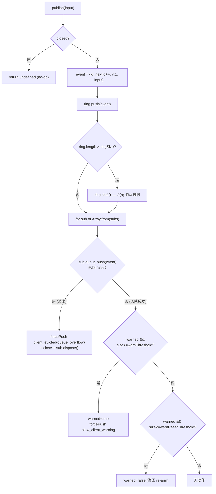
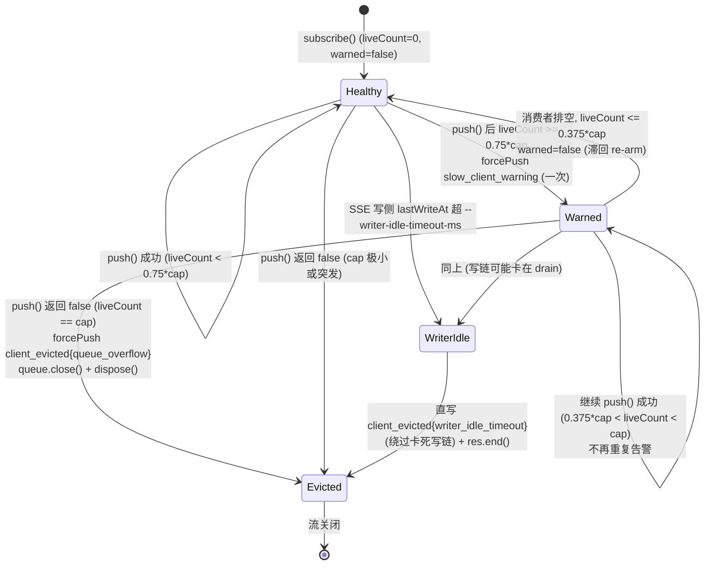
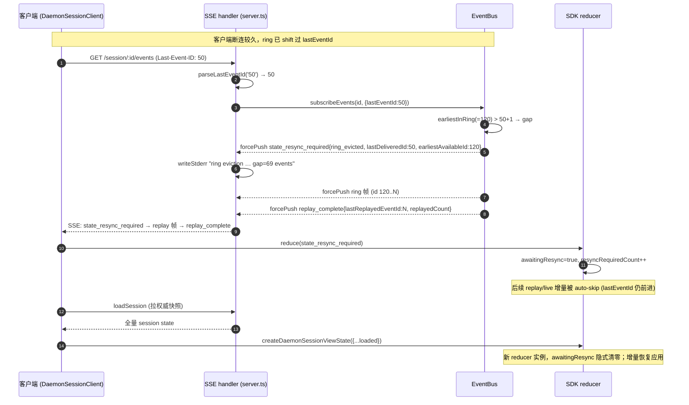

# SSE 事件总线（深入）

> 子文档；总览见 [README.md](README.md)。本文 **取代** 总览 §3.2，下沉到函数/行级。
> 所有 `file:symbol`(+line) 锚点除特别说明外均以集成分支 `daemon_mode_b_main` 为准（用 `git -C <repo> show daemon_mode_b_main:<path>` 阅读）。代码/路径用英文，正文用中文。

---

## 概述

daemon（`qwen serve`）下，一个工作区会被多个客户端（CLI / webui / SDK / IDE companion）并发 attach 到同一 session。ACP 子进程产生的 `sessionUpdate` / `requestPermission` 以及 daemon 自身推送的状态事件，必须**实时扇出**到所有订阅者，并满足三条相互冲突的约束：

1. **流式低延迟**：一个 chatty turn 可能产生数百帧（thought / text / tool_call 流），要尽快推到 SSE 写侧。
2. **断点续传**：客户端网络抖动后用 `Last-Event-ID: N` 重连，要能**无缝补齐**断连期间错过的帧；补不齐时要让客户端**知道自己 state 已脏**（而非静默"你已追上"）。
3. **抗资源耗尽**：单个慢/卡死的订阅者不能把 daemon 拖垮（用户态无界堆积、O(N) publish 放大、stalled 消费者的堆滞留）。

这套机制由三层组成，本文逐层下沉：

| 层 | 文件 | 角色 |
| --- | --- | --- |
| **内存事件总线** | `packages/acp-bridge/src/eventBus.ts:EventBus` | per-session 单调序号 + bounded ring replay + 每订阅者背压队列。F1 抽包时 `serve/eventBus.ts` 曾作为 compatibility wrapper；#5955 后 active consumers 直接引用 bridge package export。 |
| **SSE 写侧** | `packages/cli/src/serve/server.ts` 的 `GET /session/:id/events` handler（L2653）+ `formatSseFrame`（L3629） | 把 `BridgeEvent` 序列化为 SSE wire，单飞写链 + drain 背压 + 心跳 + writer idle 守卫；协议帧补全（serverTimestamp）也在此。 |
| **SDK 消费侧** | `packages/sdk-typescript/src/daemon/events.ts`（reducer）+ `ui/store.ts` / `ui/transcript.ts` | `Last-Event-ID` 解析、`awaitingResync` 一向闩、terminal 事件归并、errorKind/provenance 归一化。 |

核心数据流：`BridgeClient.sessionUpdate`（`bridgeClient.ts:407`）→ `EventBus.publish`（分配 `id`，推 ring，扇出）→ 每订阅者 `BoundedAsyncQueue` → SSE handler `for await` → `formatSseFrame` → `res.write`（drain 背压）→ 客户端 `EventSource` → SDK reducer。

---

## 涉及 PR（表格）

| PR | Wave/编号 | 与本子系统相关的改动 |
| --- | --- | --- |
| [#4237](https://github.com/QwenLM/qwen-code/pull/4237) | Wave 2.5 PR 10 | SSE replay ring 定容（`DEFAULT_RING_SIZE` 1000→8000）+ `slow_client_warning` 背压告警 + `BoundedAsyncQueue` 的 `forced`/`liveCount` 重写（取代 positional `forcedInBuf`）。 |
| [#4226](https://github.com/QwenLM/qwen-code/pull/4226) | PR 4 follow-up | 广告 `typed_event_schema` 能力，固定 SDK 公共事件面（`DAEMON_KNOWN_EVENT_TYPE_VALUES`）。 |
| [#4271](https://github.com/QwenLM/qwen-code/pull/4271) | Wave 3 PR 14b | MCP guardrail push 事件（`mcp_budget_warning` / `mcp_child_refused_batch`）+ 75%/37.5% 滞回，与 EventBus 的 `slow_client_warning` 滞回同形。 |
| [#4360](https://github.com/QwenLM/qwen-code/pull/4360) | F4 prereq | `_meta.serverTimestamp` / tool `provenance` / `errorKind`（`mapDomainErrorToErrorKind`）/ `state_resync_required`（ring_evicted + epoch_reset gap 检测）。 |
| [#4530](https://github.com/QwenLM/qwen-code/pull/4530) | T2.9 | SSE writer idle timeout（`--writer-idle-timeout-ms`）：直写 `client_evicted{writer_idle_timeout}` 绕过卡死的写链。 |
| [#4245](https://github.com/QwenLM/qwen-code/pull/4245) / [#4306](https://github.com/QwenLM/qwen-code/pull/4306) | mirror sync | `originatorClientId` 扇出回声抑制、`prompt_cancelled` / `replay_complete` 跨客户端实时同步语义。 |
| [#4507](https://github.com/QwenLM/qwen-code/pull/4507) | — | server-pushed `followup_suggestion` 事件（走同一 per-session bus）。 |
| [#4689](https://github.com/QwenLM/qwen-code/pull/4689) | — | 并行 subAgent 文本流已通过 per-parentToolCallId keyed map 隔离：`transcript.ts` reducer 用 `activeAssistantBlockByParent` 按 `parentToolCallId` 维护独立 active block pointer，scoped `clearActiveText` 不打断其他 subAgent，`finishAssistant` 遍历 map 清 streaming。 |
| [#4702](https://github.com/QwenLM/qwen-code/pull/4702) | — | WebUI `DaemonSessionProvider` 对所有 resync reason（含 `ring_evicted`）统一提前调 `store.reset()`，自动恢复 transcript；移除误导性 "Reload the session to recover." 提示文案。 |
| [#4820](https://github.com/QwenLM/qwen-code/pull/4820) | — | 新增 `session_rewound` SSE 事件——rewind 成功后 `entry.events.publish({type:'session_rewound', data:{sessionId, promptId, targetTurnIndex, filesChanged, filesFailed}})` 走 per-session EventBus 推送，使其他已附着客户端实时感知回退操作。 |
| [#6314](https://github.com/QwenLM/qwen-code/pull/6314) | W27 follow-up | 每 subscriber 增加 live serialized-byte backlog cap，`slow_client_warning` 带 byte telemetry，累计 live bytes 超 daemon-owned 预算时只驱逐该 subscriber 并返回 `client_evicted{reason:'queue_bytes_overflow'}`。已合入 main。 |


---

## 数据结构（EventBus / 环形缓冲 / BoundedAsyncQueue / 帧格式）

### 帧 `BridgeEvent`（`eventBus.ts:25`）

```
interface BridgeEvent {
  id?: number;              // per-session 单调序号，从 1 起；合成帧无 id
  v: 1;                     // EVENT_SCHEMA_VERSION（eventBus.ts:22），帧布局破坏性变更才自增
  type: string;             // 'session_update' | 'client_evicted' | ...
  data: unknown;            // 不透明 JSON payload
  originatorClientId?: string; // 触发该事件的客户端，扇出消费者据此抑制自己的回声
}
```

**`id` 缺失是核心设计而非疏漏**（`eventBus.ts:26-32` doc）。所有**合成帧**（`client_evicted` / `slow_client_warning` / `state_resync_required` / `replay_complete`，以及 server.ts 侧的 `stream_error`）都**不带 `id`**。理由：`id` 由 `nextId++`（`eventBus.ts:209`）单调分配并写入 ring；若给合成帧也分配 `id`，会在其他订阅者观察到的序列里"烧掉"一个槽位 → 它们在 live 流看到 `3 → 5`（缺 4），而重连 ring 里也没有 4 的记录，**静默破坏 `Last-Event-ID` 连续性契约**。`originatorClientId` 由 `bridgeClient.ts:407` 在 `session_update` 发布时从 `entry.activePromptOriginatorClientId` 带入。

### EventBus（`eventBus.ts:160`）

per-session 一个实例。私有状态：

| 字段 | 行 | 含义 |
| --- | --- | --- |
| `nextId = 1` | 161 | 下一个待分配 id；`get lastEventId()` 返回 `nextId - 1`（172） |
| `ring: BridgeEvent[]` | 162 | bounded replay ring，**只存 live 帧**（都带 id） |
| `subs: Set<InternalSub>` | 163 | 当前活跃订阅者 |
| `closed` | 164 | 关闭后 `publish`/`subscribe` 都变 no-op |
| `ringSize` | 167 构造参 | 默认 `DEFAULT_RING_SIZE = 8000`（`eventBus.ts:76`） |
| `maxSubscribers` | 168 构造参 | 默认 `DEFAULT_MAX_SUBSCRIBERS = 64`（`eventBus.ts:97`） |

常量（含设计依据 doc）：`DEFAULT_MAX_QUEUED = 256`（L63，每订阅者 live backlog cap）、`WARN_THRESHOLD_RATIO = 0.75`（L85）、`WARN_RESET_RATIO = 0.375`（L87）、`DEFAULT_RING_SIZE = 8000`（L76，按 #3803 §02 为一个 chatty turn × 5s 重连窗口定容，约比典型繁忙 turn 多 30–60× 余量，代价每 session 几百 KB RAM）。

### 订阅者 `InternalSub`（`eventBus.ts:99`）

```
{ queue: BoundedAsyncQueue<BridgeEvent>;
  evicted: boolean;
  maxQueued: number;
  warnThreshold: number;       // 预算 WARN_THRESHOLD_RATIO*maxQueued（subscribe 时算一次）
  warnResetThreshold: number;  // 预算 WARN_RESET_RATIO*maxQueued
  warned: boolean;             // 当前 overflow episode 是否已告警（滞回闩）
  dispose: () => void; }        // 清理钩子：subs.delete + 摘 AbortSignal 监听
```

`warnThreshold` / `warnResetThreshold` 在 `subscribe()`（L352-353）**预乘**，使 `publish()` 热路径每订阅者只做一次整数比较（且 `!warned` 短路后退化为单个 bool 读）。`dispose` 是 BmJT1 修复点（见下文背压小节）。

### BoundedAsyncQueue（`eventBus.ts:596`）

promise-based 单消费者有界队列，每条目带 `forced` 标记：

```
interface BoundedQueueEntry<T> { value: T; forced: boolean; }
```

| 成员 | 行 | 语义 |
| --- | --- | --- |
| `buf: BoundedQueueEntry[]` | 597 | 待取条目 |
| `resolvers: ((r)=>void)[]` | 598 | 消费者已 `await next()` 但 buf 空时挂起的 resolver |
| `liveCount = 0` | 608 | **O(1) live 计数**（非 forced 条目数）；`get size()` 返回它（617） |
| `push(value)` | 622 | 有挂起 resolver→直接投递返回 true；否则 `liveCount >= maxSize` 则**返回 false**（溢出信号），否则入队 `forced:false` + `liveCount++` |
| `forcePush(value)` | 638 | 同样优先投递挂起 resolver；否则入队 `forced:true`，**不计 cap、不动 liveCount** |
| `next()` | 679 | buf 非空→shift，若 `!forced` 则 `liveCount--`，返回 value；否则 closed→`done`，否则挂 resolver |
| `close({drain})` | 662 | `drain:false` 时清空 buf + `liveCount=0`（abort 路径用），然后把所有挂起 resolver 以 `done` 兑现 |

`liveCount` 是 #4237 的关键修复：**cap 只算 live 帧，`forcePush`（replay / 告警 / 终止帧）一律不计**。否则一次大 backlog 重连会 `forcePush ~ringSize` 条进 `buf`，下一条 live `publish` 立刻把刚 resume 的订阅者挤爆 — 违背 resume 契约。旧实现用 positional `forcedInBuf` 计数，仅当 forced 帧连续待在 buf **头部**时正确（subscribe-time replay）；`slow_client_warning` 改为 mid-stream `forcePush` 到 buf **尾部**后，count-based 方法会漂移（live `shift` 误减 `forcedInBuf` → 后续 cap 检查低估 live backlog → 过早 warn/evict）。per-entry `forced` 标记 + `liveCount` 是位置无关的正解（`eventBus.ts:566-608` doc）。

PR #6314 在同一队列层补上 **live serialized-byte cap**：除 `liveCount` 外再维护 live bytes，默认每 subscriber 2 MiB。`forcePush` 的 replay / warning / eviction 仍不计入 live bytes，保护 `Last-Event-ID` replay 契约；单个 oversized event 在空队列上允许通过，防止健康消费者因单帧过大被误杀。byte 阈值上穿会复用 `slow_client_warning`，并在 payload 中带 queued/max byte telemetry；累计 live bytes 超预算时返回 `client_evicted{reason:'queue_bytes_overflow'}`，只关闭受影响 subscriber，不影响 session 或其它订阅者。

### 帧序列化 `formatSseFrame`（`server.ts:3629`）

```
function formatSseFrame(event): string {
  const stamped = { ...event, _meta: { ...(existingMeta ?? {}), serverTimestamp: Date.now() } };
  const idLine = ('id' in event && event.id !== undefined) ? `id: ${event.id}\n` : '';
  return `${idLine}event: ${event.type}\ndata: ${JSON.stringify(stamped)}\n\n`;
}
```

- **`id:` 行在 `event.id` 缺失时省略**（L3692）— 与 EventBus 合成帧无 id 的契约对齐，保护客户端 `Last-Event-ID` 追踪。
- **`_meta.serverTimestamp = Date.now()` 在 wire 边界打戳**（L3673），而非 `EventBus.publish` — 这样内存 `BridgeEvent` 类型保持纯净，内部消费者看不到 `_meta`。多客户端 transcript 排序与 "X 分钟前" UI 用服务端时钟而非各客户端漂移的本地钟。`existingMeta` 在当前生产中恒为 `undefined`（无 producer 在顶层设 `_meta`；ToolCallEmitter 的 `_meta` 嵌在 `data._meta`），顶层 merge 是 forward-compat 逃逸口。
- 始终单 `data:` 行（payload 是无内嵌换行的 JSON）；接收侧 `sdk-typescript/src/daemon/sse.ts` 仍能解多行 `data:`（输入/输出非对称，刻意）。

---

## 事件流与 replay（订阅、lastEventId 回放、环淘汰）

### publish 路径（`eventBus.ts:195`）



要点：
- **closed 时返回 undefined 而非抛**（L207）：关闭 bus 发生在 `await channel.kill()` **之前**，留出 agent 仍可能 emit `sessionUpdate` 的窗口；返回 undefined 让调用方无需 try/catch（BX9_p 契约，`eventBus.ts:181-194`）。
- **ring O(n) shift 可接受**（L214-220 doc）：8000 深度下满 ring 的 per-publish shift 是低毫秒级，远低于 per-frame 延迟预算；环形缓冲 O(1) 重构被刻意推迟到 profiling 报警或 operator 把 `--event-ring-size` 调大一个数量级。
- **`Array.from(subs)` 快照**（L225）：因为溢出分支会在循环内 `sub.dispose()`→`subs.delete(sub)`，不能直接迭代正被改的 Set。

### subscribe 与 replay（`eventBus.ts:326`）

`subscribe(opts)` 同步注册（返回时订阅者已 attach，后续 `publish` 必达，避免 generator 式延迟注册与 publish 竞争，L312-318 doc）。流程：

1. `closed` → 返回 `emptyAsyncIterable`（L327）。
2. `subs.size >= maxSubscribers` → **抛 `SubscriberLimitExceededError`**（L338）。刻意 throw 而非"接纳后立刻 evict"——后者仍要付 `BoundedAsyncQueue` 分配 + per-publish 迭代成本；typed 错误让 SSE 路由能转成 `429`（见下）。
3. 建 `BoundedAsyncQueue(maxQueued)`（L342，maxQueued 默认 256），建 `sub`（预乘阈值），`subs.add(sub)`（L357）。
4. **若 `opts.lastEventId !== undefined`（断点续传分支，L359）**：先做 gap 检测（下一节），再 `forcePush` replay 帧 + `replay_complete`。
5. 装 `dispose`（L497，幂等，删 sub + 摘 abort 监听）与 `onAbort`（L519，`queue.close({drain:false})` + dispose；signal 已 aborted 则立即触发）。
6. 返回 async iterator：`next()`→`queue.next()`，done 则 dispose（L533）；`return()`→close + dispose（L538）。


### 环淘汰（ring eviction）

`ring` 满 `ringSize` 后每 publish `shift()` 掉最旧帧（L221）。于是 ring 头 `ring[0].id` 会随时间前移。当客户端断连太久、重连时携带的 `lastEventId` 已落后于 ring 头，中间帧就**永久丢失** → 触发 `state_resync_required`（下一节）。

---

## 背压与慢客户端

每订阅者一个 `BoundedAsyncQueue`，cap = `maxQueued`（默认 256，可经 `?maxQueued=N` 在 `[16,2048]` 预调）。**cap 只约束 live backlog**（`liveCount`）；replay/告警/终止帧 `forcePush` 不计入。背压分两级：告警（非终止）→ 驱逐（终止）。

### slow_client_warning 滞回（`eventBus.ts:287-307`）

`publish` 对每个**入队成功**的订阅者检查：

```
const liveSize = sub.queue.size;                              // = liveCount
if (!sub.warned && liveSize >= sub.warnThreshold) {           // 上穿 0.75*maxQueued
  sub.warned = true;
  sub.queue.forcePush({ type: 'slow_client_warning',
    data: { queueSize: liveSize, maxQueued: sub.maxQueued, lastEventId: event.id } });
} else if (sub.warned && liveSize <= sub.warnResetThreshold) { // 回落 0.375*maxQueued
  sub.warned = false;                                          // 滞回 re-arm
}
```

- **每 overflow episode 只发一次**：`warned` 闩 + `WARN_RESET_RATIO=0.375` 滞回带，防止订阅者在 75% 附近抖动时刷屏。
- **告警帧无 id**（合成帧），且 `forcePush` 绕过触发它的那个 cap 本身。
- **追加到队尾**（非队首）：`eventBus.ts:269-280` doc 论证——队首插入会破坏 live cap 的位置不变式，且消费者正 `await next()` 时 `forcePush` 的 `resolvers.shift()` 捷径会**立即**投递告警（根本不碰 buf）；队尾位置只对 stalled 消费者有别，而 stalled 消费者反正排不空，告警位置此时只是 informational。

### client_evicted 驱逐（`eventBus.ts:227-257`）

当 `sub.queue.push(event)` 返回 false（live backlog 真正打满 `maxSize`）：

1. `sub.evicted = true`。
2. `forcePush({ type:'client_evicted', data:{ reason:'queue_overflow', droppedAfter: event.id } })`（**无 id 终止帧**，L238）。
3. `sub.queue.close()`（默认 `drain:true`，让消费者先看到终止帧再 unwind）。
4. **`sub.dispose()`（BmJT1 修复，L256）**：既 `subs.delete(sub)` 又**摘掉 AbortSignal 监听**。修复前驱逐路径只 `subs.delete`，留下 abort 监听挂在 stalled 消费者的 signal 上——而消费者按定义已卡死（正是它造成溢出），其 `next()`/`return()`/自身 abort 都不会触发去摘监听，queue+sub 闭包被 AbortSignal 一直 retain。受攻击时（成千上万 stalled SSE 客户端）放大成显著堆滞留。

### 背压状态机（stateDiagram）



> 注意 `slow_client_warning` 与 `client_evicted{queue_overflow}` 是 **EventBus 内存层**的背压；`client_evicted{writer_idle_timeout}` 是 **SSE 写侧**（server.ts）的正交守卫，二者 reason 不同但复用同一 `client_evicted` taxonomy，使 SDK reducer 用同一分支处理。

### SSE 写侧背压（`server.ts:2745-2920`）

EventBus 控的是"订阅者排队多少帧"；写侧控的是"内核发送缓冲满了怎么办"：

- **单飞写链 `writeChain`**（L2745，`writeWithBackpressure` L2807）：所有写（含心跳）串行化，防 15s 心跳与主循环交错写半个 SSE 帧。`doWrite`（L2772）里 `res.write` 返回 false（内核缓冲满）则 `await 'drain'`（或 `close`/`error`），避免用户态无界堆积撑爆 daemon RSS。链尾 `.catch(()=>undefined)`（L2813）吞掉单次失败，防毒化后续。
- **心跳**（L2845）：每 15s 写 `: heartbeat\n\n`（EventSource 忽略的注释帧），靠 drain 背压探测 TCP 死写；`unref()` 不挡进程退出。
- **writer idle 守卫（#4530 / T2.9，L2857-2920）**：仅当 `--writer-idle-timeout-ms` 配置时 arm（`trackWriterIdle` 门控，避免默认每帧 `Date.now()`）。`lastWriteAt` 在每次写**成功 flush**时刷新（同步 `res.write` 返 true，或异步 `drain`）。idle timer 以 `max(250, min(5000, floor(timeout/4)))` 轮询（L2877）；若 `Date.now()-lastWriteAt >= timeout`，**直接 `res.write`**（L2897，绕过可能已卡在 `drain` 的写链——正是此 timer 存在的场景）一个 `client_evicted{reason:'writer_idle_timeout', errorKind:'writer_idle_timeout', idleForMs, timeoutMs}`，再 `cleanup()` + `res.end()`。stderr 写与 `res.end` 各自 try/catch（wenshao #4530 review #2），防 EPIPE 逃出 interval 回调变成永久 uncaughtException 循环。

### 订阅者上限 → 429（`server.ts:2683-2701`）

`subscribe()` 抛 `SubscriberLimitExceededError` 时，SSE 路由返回 **`429 + Retry-After: 5`**（Bd1zJ），而非 `200 + stream_error`。因为后者会触发浏览器 `EventSource` 的自动重连（它对任何 closed stream 都重连，且认 `retry:` 指令），重连再撞上限→死循环→放大正是该上限要防的负载；`4xx` 才是标准 back-off 信号，`EventSource` 视为 terminal 不重连。body 形状镜像 SSE data 字段，裸 fetch 客户端拿到一致结构。

---

## state_resync_required（gap 检测条件 + SDK reducer awaitingResync 消费）

当客户端带 `Last-Event-ID` 重连，但游标已被 ring 淘汰、或跨越 epoch（daemon 重启使 `nextId` 归 1），EventBus 在 replay **之前** `forcePush` 一个 `state_resync_required` 帧，**但流保持 OPEN**（区别于 `client_evicted` 的终止语义；#4360 wenshao review 纠正了早期把它叫 "TERMINAL" 的措辞）。

### 两种 gap 检测条件（`eventBus.ts:401-431`）

```
const epochReset = opts.lastEventId >= this.nextId;          // ① epoch_reset（D1）
if (epochReset) {
  queue.forcePush({ type:'state_resync_required',
    data: { reason:'epoch_reset', lastDeliveredId: opts.lastEventId,
            earliestAvailableId: this.ring[0]?.id ?? this.nextId } });
} else {
  const earliestInRing = this.ring[0]?.id;
  if (earliestInRing !== undefined && earliestInRing > opts.lastEventId + 1) {  // ② ring_evicted
    queue.forcePush({ type:'state_resync_required',
      data: { reason:'ring_evicted', lastDeliveredId: opts.lastEventId,
              earliestAvailableId: earliestInRing } });
  }
}
const replayFrom = epochReset ? 0 : opts.lastEventId;        // epoch_reset 全量重放当前 ring
```

| 条件 | 判定式 | 含义 | replayFrom |
| --- | --- | --- | --- |
| **`epoch_reset`** | `lastEventId >= nextId` | 游标 id 本 epoch 从未产生过 → 来自已死 epoch（daemon 重启 / EventBus 重建，`nextId` 归 1 + 清 ring）。`ring_evicted` 检查对此结构性失明（重启后 ring 空，`earliestInRing===undefined` 被跳过，否则消费者会拿到裸 `replay_complete{replayedCount:0}` 的假"已追上"） | `0`（全量重放当前 ring；用 stale 大游标过滤会把新的低 id 1,2,3… 全丢掉） |
| **`ring_evicted`** | `earliestInRing > lastEventId + 1` | 同 epoch 内，`[lastEventId+1, earliestInRing-1]` 这段帧已被 ring 淘汰 | `lastEventId`（常规过滤） |

**边界正确性**（test 覆盖 `eventBus.test.ts:599`）：`earliestInRing === lastEventId + 1` 时**不**触发（恰好接上，无 gap）；`lastEventId === nextId - 1`（high-water，已追上）时**不**触发 epoch_reset。

gap 帧 payload 三字段：`reason` / `lastDeliveredId` / `earliestAvailableId`（SDK `DaemonStateResyncRequiredData`，`events.ts:300`）。gap 区间是 `[lastDeliveredId+1, earliestAvailableId-1]` 闭区间。

### SSE 写侧观测（`server.ts:2972-2990`）

主循环里若 `next.value.type === 'state_resync_required'`，daemon 侧额外写一行 stderr：`gap = earliestAvailableId - lastDeliveredId - 1`，输出 `SSE ring eviction detected (session …): lastEventId=…, earliestInRing=…, gap=N events, reason=…. Consumer must call loadSession to recover.`。刻意放在 SSE 写边界而非 EventBus 内（保持 bus 纯净，daemon 侧可观测性集中在已记 socket 错误/心跳的路由）。

### SDK reducer 的 awaitingResync 消费（`events.ts`）

`reduceDaemonSessionEvent`（`events.ts:1367`）流程：

```
const base = advanceLastEventId(state, rawEvent.id);   // 1370：先推进 lastEventId（Math.max，忽略 undefined/非有限）
const event = asKnownDaemonEvent(rawEvent);            // 1371：类型守卫校验 data 形状；不合法 → unrecognizedKnownEventCount++
if (base.awaitingResync && !RESYNC_PASSTHROUGH_TYPES.has(event.type)) {
  return base;                                          // 1392：闩开时 auto-skip 所有非 passthrough 增量，但 lastEventId 仍前进
}
switch (event.type) { ... }
```

**`awaitingResync` 一向闩**（view-state 字段 `events.ts:1060`；count `resyncRequiredCount` L1069；`lastResyncRequired` L1071）：

- `state_resync_required` case（`events.ts:1591`）：`awaitingResync=true`、`resyncRequiredCount++`、`lastResyncRequired=data`。**不动 `alive`/`terminalEvent`**（流仍健康，只是本地累积可疑），**保留 `pendingPermissions`**（由 `loadSession` 恢复清，而非 resync 信号本身清）。
- **`RESYNC_PASSTHROUGH_TYPES`（`events.ts:1117`）** = `{ state_resync_required, session_died, session_closed, client_evicted, stream_error }`。闩开时仍处理这 5 类：前者用于更新后续 resync 计数（罕见但可能连续两次跨 ring 重连）；后 4 类是 critical end-of-stream 信号，不依赖先验 state——UI 必须看到"session 死了"即使当时正处于 resync limbo。其余一切（session_update / permission_* / 工作区变更 / mcp guardrail / auth flow）被 auto-skip。
- **恢复路径**：消费者见 `awaitingResync` 后调 `loadSession` 拉 daemon 权威快照，再 `createDaemonSessionViewState({...loaded})`——新 reducer 实例从头开始，闩隐式清零。UI 层 `store.ts:clearAwaitingResync()`（`ui/store.ts:92`）提供显式恢复：保留本地 blocks 接纳新事件，**必须在新 SSE 流（或 `Last-Event-ID: 0` replay）开始投递前调用**，否则 replay 帧会被闩 guard 丢弃（wenshao R6 纠正的流序 bug）；另一选项是 `reset()` 清白重来。`ui/transcript.ts:142` 的 guard 还带一行 diagnostic `console.warn`（R5）记录被丢弃的事件类型。
- **WebUI 自动恢复（#4702）**：`DaemonSessionProvider.tsx` 在收到 `state_resync_required` 时，将 `store.reset()` 提升到 reason 分支**之前**统一执行（而非仅在 `epoch_reset` / 非 `ring_evicted` 分支内各自调用）。对 `ring_evicted` 的效果：`reset()` 清空 stale transcript 并隐式重置 `awaitingResync` 闩，使后续 ring replay 帧（最多 8000 条幸存事件）能被 reducer 正常处理、重建 transcript，无需用户手动 reload。修复前 `ring_evicted` 分支未调 `reset()`，`awaitingResync` 闩保持开启，replay 帧全部被 auto-skip，transcript 留下永久空洞。同 PR 移除了 `transcript.ts` 中 `"Reload the session to recover."` 提示——reload 对长 session 会再次触发 ring eviction，自动恢复才是正确路径。

### terminal 事件归并 `chooseTerminalEvent`（`events.ts:1979`）

```
function chooseTerminalEvent(current, next) {
  if (!current) return next;
  if (!isSessionLifecycleTerminal(current.type) && isSessionLifecycleTerminal(next.type)) return next;
  return current;  // 否则保留首个
}
```

`isSessionLifecycleTerminal`（`events.ts:1975`）只对 `session_died` / `session_closed` 为真。规则：**stream-terminal（`client_evicted` / `stream_error`）可被升级为 session-lifecycle-terminal（`session_died` / `session_closed`），反之不行；同级保留首个**。即先收到 `client_evicted` 再收到 `session_died` → terminalEvent 升级为 `session_died`（test `events.ts` 行为见 `daemonEvents.test.ts:473`）。所有 terminal case（`session_died` L1523 / `session_closed` L1539 / `client_evicted` L1557 / `stream_error` L1579）都置 `alive=false`、清 `pendingPermissions`/`permissionVoteProgress`/`forbiddenVotes`（wenshao #4335 Critical：死 session 不能渲染 stale 拒票）。`slow_client_warning`（L1570）是**非终止**：只 `slowClientWarningCount++` + 捕获快照，`alive`/`pendingPermissions` 不变。

### 时序图：环淘汰 → resync → 恢复



---

## 协议帧补全（serverTimestamp / provenance / errorKind）

#4360（F4 prereq）给事件帧补三类 typed 元信息，目标是让 UI 渲染 **typed 响应**而非 regex 匹配人读字符串。

### serverTimestamp

见"数据结构"小节 `formatSseFrame`（`server.ts:3673`）：wire 边界 `Date.now()` 打 `_meta.serverTimestamp`。SDK 计划 3 处回落探测（`event.serverTimestamp` → `event._meta.serverTimestamp` → `event.data._meta.serverTimestamp`，见总览 §3.10 的 `ui/normalizer.ts`）。

### tool provenance（`ToolCallEmitter.ts:218`）

ACP 子进程侧在 emit `tool_call` 事件时调 `ToolCallEmitter.resolveToolProvenance(toolName, subagentMeta?)`（静态纯函数，便于单测），把结果 stamp 进 `_meta.provenance` + `_meta.serverId`（emit 路径 L60/L133/L176）：

```
if (subagentMeta !== undefined) return { provenance: 'subagent' };
if (toolName.startsWith('mcp__')) {
  const parts = toolName.split('__');                       // mcp__<server>__<tool>，分隔是 '__' 非单 '_'
  if (parts.length >= 3 && parts[1] && parts[1].length > 0) // 要求非空 server 段 + 至少一段在后
    return { provenance: 'mcp', serverId: parts[1] };
}
return { provenance: 'builtin' };                            // 含 mcp__ 畸形名兜底为 builtin（不 stamp 垃圾 serverId）
```

`mcp__` 启发式与 `packages/core/src/tools/mcp-tool.ts` 的命名约定一致，且镜像 SDK 端同样的 fallback，保证 daemon 分类与 SDK 一致。SDK 据 `provenance` 区分渲染 builtin / MCP-server-badge / subagent-block；缺该 stamp 时 SDK 只能 string-match toolName，无法可靠区分 builtin 与 subagent。

### errorKind（`status.ts:844` + `SERVE_ERROR_KINDS:18`）

`stream_error` 帧（`server.ts:3013-3030`）在 daemon 主循环 catch 到 bridge iterator 抛错时合成（**无 id** 终止帧），`errorKind = mapDomainErrorToErrorKind(err)`：

```
function mapDomainErrorToErrorKind(err): ServeErrorKind | undefined {
  if (err instanceof BridgeTimeoutError) return 'init_timeout';
  if (err instanceof BridgeChannelClosedError) return 'protocol_error';
  if (err instanceof MissingCliEntryError) return 'missing_binary';
  if (err instanceof SkillError || err?.name === 'SkillError') { ...code → 'parse_error'|'missing_file'... }
  if (err instanceof SyntaxError) return 'parse_error';
  if (err.name === 'TrustGateError') return 'auth_env_error';
  if (MODEL_CONFIG_ERROR_NAMES.has(err.name)) return 'auth_env_error';
  if (FS_MISSING_CODES.has(err.code)) return 'missing_file';
  return undefined;   // 无规则匹配 → 不设 errorKind，SDK 回落渲染 error 文本（严格 additive）
}
```

- 跨包类（`SkillError` / `TrustGateError` / model-config）用 `.name`/`.code` 而非 `instanceof`——bundle 重复会破坏 `instanceof` 对称性（wenshao #4298 fold-in）。
- `SERVE_ERROR_KINDS`（`status.ts:18`，14 个值）与 SDK 侧 `DAEMON_ERROR_KINDS`（`sdk/daemon/types.ts:207`）镜像，含 #4530 新增的 `prompt_deadline_exceeded` / `writer_idle_timeout`。SDK `DaemonStreamErrorData.errorKind` 类型为 `DaemonErrorKind | (string & {})`（开放联合，未知值不破坏类型，`events.ts:288`）。
- writer idle 驱逐（`server.ts:2903`）也带 `errorKind:'writer_idle_timeout'`，与 `reason` 同值，使 SDK 既能按 `client_evicted` 分支又能按 errorKind 细分。

---

## 时序图 / 状态机

### ① 正常流式 + replay（重连补齐，无 gap）

```mermaid
sequenceDiagram
    autonumber
    participant Cl as 客户端
    participant SSE as SSE handler
    participant Bus as EventBus
    participant Q as BoundedAsyncQueue
    Cl->>SSE: GET /session/:id/events (Last-Event-ID: 8)
    SSE->>SSE: parseLastEventId('8')=8; parseMaxQueuedQuery(absent)=undefined
    SSE->>Bus: subscribe({lastEventId:8})
    Bus->>Bus: earliestInRing(=1) ≤ 8+1 → 无 gap；epochReset? 8<nextId → 否
    loop ring 中 id>8 的帧
        Bus->>Q: forcePush(e)  (forced，不计 cap)
    end
    Bus->>Q: forcePush replay_complete{lastReplayedEventId, replayedCount}
    SSE-->>Cl: retry:3000 → (replay 帧…) → replay_complete
    Cl->>Cl: reducer 见 replay_complete → 撤"追赶中"指示器
    par live 流式
        Bus->>Q: push(session_update)  (live，计 cap)
        Q-->>SSE: next() 取出
        SSE->>SSE: formatSseFrame (stamp _meta.serverTimestamp)
        SSE-->>Cl: id:N event:session_update data:{…,_meta:{serverTimestamp}}
    and 15s 心跳
        SSE-->>Cl: : heartbeat
    end
```

### ② 慢客户端 warning → rearm（状态机见上文「背压状态机」stateDiagram）

补充 publish 视角时序（单订阅者 backlog 累积）：

```mermaid
sequenceDiagram
    autonumber
    participant Pub as publish() 循环
    participant Sub as InternalSub (maxQueued=256)
    Pub->>Sub: push(e) … 反复 (消费者慢)
    Note over Sub: liveCount 累积至 192 (=0.75*256)
    Pub->>Sub: liveCount>=warnThreshold && !warned
    Sub->>Sub: warned=true; forcePush slow_client_warning{queueSize:192,maxQueued:256}
    Note over Sub: 后续 push 不再重复告警 (warned 闩)
    Pub->>Sub: 消费者追上，next() 排空至 liveCount<=96 (=0.375*256)
    Sub->>Sub: warned=false (滞回 re-arm)
    Note over Sub: 若再次累积至 192 → 触发新一轮告警
    Pub->>Sub: 若消费者彻底卡死，liveCount==256 → push 返回 false
    Sub->>Sub: forcePush client_evicted{queue_overflow} + close + dispose
```

### ③ 环淘汰 → resync（见上文 state_resync 小节时序图）

---

## 边界与错误处理

### fail-closed 输入解析（SSE 路由层）

- **`parseMaxQueuedQuery`（`server.ts:3478`）**：`MIN=16`（L3460）/`MAX=2048`（L3461）。`undefined`（param 缺）→ `undefined`（用 bus 默认 256）；非 `/^\d+$/`（含 `?maxQueued=` 空串显式给）→ 发 `400 {code:'invalid_max_queued'}` 并返回 `null`；越界 → 同样 400 + `null`。路由见 `null` 即 short-circuit（`server.ts:2661`）——**握手前 400 比半开 SSE 流再发 `stream_error` 安全**（后者触发 EventSource 重连）。下界 16（更小对任何 replay backlog 无用），上界 2048（单订阅者不能仅靠请求就钉住 ~1 MB 队列内存）。
- **`parseLastEventId`（`server.ts:3537`）**：比 `Number.parseInt` 严——只收纯十进制（避免 `"1abc"` 静默解析成 1）；`> Number.MAX_SAFE_INTEGER` → `undefined`（恶意/损坏的 resume）。非空但非法头会写 stderr 面包屑（BX9_I，客户端实际从 event 0 重放、丢了断连期所有帧，否则不可见），missing/空头跳过日志（首连常态）。
- **`safeLogValue`（`server.ts:3532`）**：`JSON.stringify(String(raw)).slice(0,82)`——把攻击者可控串里的 `\n`/`\r`/控制字符转义并加引号，防 line-based 日志 shipper（journald/Loki/Splunk）把注入行当新条目（log injection 防御）；stringify 后截断保证预算可预测。

### fail-closed 配置校验（boot 层）

- **`eventRingSize`（`bridge.ts:686-697`）**：`opts.eventRingSize ?? DEFAULT_RING_SIZE`；`!Number.isInteger(n) || n<1 || n>MAX_EVENT_RING_SIZE` → **抛 TypeError**。`Number.isInteger` 已拒 NaN/Infinity/非有限（无需单独 `Number.isFinite`）。`MAX_EVENT_RING_SIZE = 1_000_000`（`bridge.ts:624`，~500 B/frame × 1M ≈ 500 MB/session，纯 typo 防御非安全边界）。与 `maxSessions` 同样 fail-CLOSED：config typo 静默关掉 SSE 背压比启动失败更糟；但 ring **无 unlimited sentinel**（无界 ring 会永久增长）。CLI 侧 `--event-ring-size` 默认也引 `DEFAULT_RING_SIZE`（`commands/serve.ts:113`）保持单一事实源。
- **`writerIdleTimeoutMs`（`runQwenServe.ts:623`）/ `promptDeadlineMs`**：`isPositiveIntegerMs` 校验，非正整数抛 TypeError；boot-loud 拒绝（embedded caller 传 `-5` 不能得到一个静默不生效的 daemon）。

### publish/subscribe 健壮性

- `publish` **永不抛**（BX9_p，`eventBus.ts:181`）：closed→undefined no-op；订阅者 enqueue 失败内部捕获转 per-sub 驱逐。调用方不应再包 try/catch。
- `subscribe` 的 `dispose` 幂等（`disposed` 标志，`eventBus.ts:498`）：double-abort 或与 `return()` 竞争安全；`sub.dispose` 先放 no-op 占位（L355），覆盖 `subs.add` 与真正赋值之间被极快 `publish→forcePush→close→dispose` 命中的窗口。
- abort 用 `queue.close({drain:false})`（`eventBus.ts:520`）：abort 应"promptly"关迭代器，drain 数百帧到没人听的 socket 违背契约；驱逐路径用默认 `drain:true` 让终止帧仍达消费者。
- SSE handler 的 `res.on('error')`（`server.ts:3033`）吞 EPIPE 噪声并兜底 cleanup；`req.on('close')`（L3032）是主要拆除路径。
- **`asKnownDaemonEvent`（`events.ts:1222`）** 对每种已知 type 跑 `isXxxData` 形状校验（如 `isSlowClientWarningData` L2156 用 `isFiniteNumber` 拒 NaN/Infinity/小数计数器）；不合法 → reducer 记 `unrecognizedKnownEventCount` 而非污染 state。未知 type 名 → `asKnownDaemonEvent` 返回 undefined，老 SDK 静默丢弃新事件（无需协议 bump，向后兼容）。

### 越界关联：early-event tombstone

session restore（load/resume）期间，ACP 子进程可能在 `entry` 就绪前就 emit notification，bridge 用 `bufferEarlyEvent` + `markSessionClosed` tombstone（`bridge.ts:318` / `1157`）防止"已关 session 的迟到 notification 泄漏进同 id 的未来 load"（codex round 5 修复）。这属 **会话生命周期**而非 EventBus 本体，详见会话生命周期子文档；对事件总线的影响是：restore 用独立 `pendingRestoreEvents = new EventBus(eventRingSize)`（`bridge.ts:1834`）先承接，settle 后并入正式 entry。

---

## 关键设计决策与权衡

1. **合成帧无 `id`**。`client_evicted`/`slow_client_warning`/`state_resync_required`/`replay_complete`/`stream_error` 都不占 `nextId` 槽位。代价是这些帧不能被 `Last-Event-ID` 续传定位（它们本就 per-subscriber、不该被其他订阅者看到）；收益是 per-session 单调序列对所有健康订阅者保持连续，replay ring 与 live 流的 id 契约不被"烧洞"。

2. **cap 只算 live 帧（`liveCount`）**。这是兑现"重连不被自己 backlog 挤爆"契约的关键。旧 positional `forcedInBuf` 在 mid-stream `forcePush`（slow_client_warning 到队尾）下漂移；per-entry `forced` 标记位置无关，多付一个 bool/条目的内存换正确性。

3. **state_resync_required 保持流 OPEN 而非终止**。`client_evicted` 是真终止（关流，触发 EventSource 重连）；resync 是恢复导向——daemon 继续 replay 幸存 ring + live，SDK reducer auto-skip 增量直到 `loadSession` 重置。好处：网络友好（不必再次重连），且帧仍在 wire 上，SDK 有机会算"你错过了什么" diff。`epoch_reset`（重启）与 `ring_evicted`（同 epoch gap）分开 reason，因前者要全量重放当前 ring（`replayFrom=0`）。

4. **背压双层 + 滞回**。EventBus 层 `slow_client_warning`（0.75 上穿）→ `client_evicted{queue_overflow}`（打满）；SSE 写侧 drain 背压 + writer idle（绕过卡死写链直写驱逐）。滞回带 0.375 防 75% 附近抖动刷屏。warning 是"给客户端机会主动 detach"，eviction 是"保护 daemon 不被一个慢客户端拖垮"。

5. **subscriber 上限 → 429 而非 stream_error**。typed `SubscriberLimitExceededError` 在 subscribe 时 throw（不分配队列），SSE 路由转 `429 + Retry-After`；避免 `200+close` 触发 EventSource 自动重连放大攻击面。

6. **预算/超时一律 fail-CLOSED**。`eventRingSize`/`maxSessions`/`writerIdleTimeoutMs` 的 config typo 宁可 boot 失败也不静默关掉资源守卫（gpt-5.5 BRApy/wenshao 多处 review）。`?maxQueued` 非法值握手前 400 而非半开流。

7. **serverTimestamp 在 wire 边界打戳**。不在 `EventBus.publish`，使内存 `BridgeEvent` 类型纯净、内部消费者不见 `_meta`；多客户端 transcript 排序用服务端单一时钟。

8. **errorKind/provenance 严格 additive**。`mapDomainErrorToErrorKind` 无匹配返回 `undefined`（不强塞误导分类），SDK 缺字段回落旧行为（regex/文本/toolName 匹配）；新旧 SDK × 新旧 daemon 任意组合优雅降级。跨包类用 `.name`/`.code` 匹配抗 bundle 重复破坏 `instanceof`。

---

## 已知限制 / 后续

1. **ring O(n) shift 未优化**（`eventBus.ts:214-220`）。满 ring 每 publish `Array.shift()` 是 O(n)；8000 深度下低毫秒可接受，环形缓冲 O(1) 重构推迟到 profiling 报警或 operator 把 `--event-ring-size` 调大一个数量级才做。

2. **EventBus 仍私有于 SSE 路由**（`eventBus.ts:150` 的 `FIXME(stage-1.5)`）。计划抬成顶层 `packages/event-bus`，让 `channels/`/`dualOutput/`/`remoteInput`/未来 TUI co-host 与 WebSocket transport 共享同一总线，而非各跑并行事件流。`BridgeEvent` 形状已接近所需，缺的是 bus 可被公开寻址。


4. **顶层 `_meta` merge 当前是 no-op**。无 producer 在 envelope 顶层设 `_meta`（ToolCallEmitter 的 `_meta` 嵌在 `data._meta`），`formatSseFrame` 的顶层 spread 是 forward-compat 逃逸口而非现网生效路径。

5. **`maxQueued` 上界 2048 与 ring 8000 不对称**。一次跨度 >2048 的非 forced backlog 不可能（forced replay 绕过 cap），但若 live 帧产出持续快于慢消费者排空，仍会在打满 2048 时被 evict——这是设计意图（保护 daemon），但 operator 需理解 `?maxQueued` 调高只是推迟而非消除 evict。

---

## 测试覆盖

### EventBus（`packages/acp-bridge/src/eventBus.test.ts`，740 行）

- 单调 id + schema 版本（L27）、live 投递（L37）、`lastEventId` 之后的 ring replay（L54）、replay + live 衔接 + `replay_complete` sentinel（L68）、多订阅者并行扇出（L104）。
- 背压：溢出驱逐（warning 先于 eviction，L121）、`slow_client_warning` 每 episode 一次（L148）、告警帧无 id（L170）、滞回 re-arm（L192）、**warn-at-back forced 帧不歪曲后续 live cap**（codex P2，L228）。
- ring：默认 8000（L290）、超 ringSize 淘汰最旧（L503）。
- 生命周期：BmJT1 驱逐摘 abort 监听（L324）、abort 退订（L360）、`bus.close()` 关所有订阅者（L375）、立即 dispose（L477/L495）。
- replay cap：force-push replay 绕过 maxQueued（L390）、大 replay 后 live publish 不 evict resumed 订阅者（L413）、只在 **live** backlog（不含 replay）打满才丢 live（L451）。
- **state_resync_required（L536 describe）**：past ring head 触发 ring_evicted（L537）、在 ring 内不触发（L578）、恰好边界 `lastEventId===earliest-1` 不触发（L599）、past high-water 触发 epoch_reset（L627）、epoch_reset 全量重放新 ring（L667）、caught-up 边界不触发 epoch_reset（L694）、无 lastEventId（首连）不触发（L719）。

### SSE handler（`packages/cli/src/serve/server.test.ts`）

- 流式 SSE 帧（L5913）、**每帧 stamp `_meta.serverTimestamp`**（L5954）、保留既有 `_meta` 键（L5994）、forward `Last-Event-ID`（L6028）、forward `?maxQueued`（L6052）/缺省省略（L6074）。
- `?maxQueued` fail-closed：空串 400（L6096）、非十进制 400（L6118）、越界 400（L6138）——均在开流前。
- 未知 session 404（L6158）、客户端断连 abort 订阅（L6176）、mid-stream iterator 抛错发 `stream_error`（L6213）、**分类错误 stamp errorKind**（L6243）、ring eviction 写 daemon stderr（L6271）、partial resync data 回落 `?` 占位（L6320）、bridge iterator error 写 stderr（L6368）。
- writer idle：超 JS timer cap 接受（L5146）、env var 非法 boot 拒绝（L5215）/合法 happy path（L5239）；`writer_idle_timeout` 能力标签（L5156/5236）。

### SDK reducer（`packages/sdk-typescript/test/unit/daemonEvents.test.ts`）

- terminal 归并：lifecycle 事件 terminal + 保留死因（L438）、保留首个 stream terminal 并升级为 session death（L473）、`session_closed` terminal 清 pending（L591）、升级语义（L616）。
- `slow_client_warning` 识别（L663）、reduce 进 view-state 不终止流（L729）。
- **state_resync_required（L2204 describe）**：设 `awaitingResync` + 记 data（L2205）、闩开 auto-skip session_update（L2224）/permission_request 不动 pending（L2252）、闩开仍应用 session_died（L2292）/stream_error（L2323）/session_closed（L2371）/client_evicted（L2404）、stream_error 捕获 errorKind（L2345）、reseed 清闩（L2431）、第二次 resync 增计数（L2454）、畸形 payload 走 unrecognizedKnownEventCount（L2479）。
- replay 游标：乱序 id 保持单调（L216）、无 id 合成帧不推进 replay state（L265）。

---

## 各 PR 代码贡献

### #4237 — replay sizing + slow_client_warning

- `eventBus.ts:BoundedAsyncQueue`：重写为 per-entry `forced` 标记 + `liveCount` O(1) live 计数，取代旧 positional `forcedInBuf`（修复 mid-stream `forcePush` 位置漂移）。
- `eventBus.ts:publish`：`slow_client_warning` 滞回逻辑——`WARN_THRESHOLD_RATIO=0.75` 上穿触发（每 episode 一次），`WARN_RESET_RATIO=0.375` 回落 re-arm。
- `eventBus.ts:DEFAULT_RING_SIZE`：1000 → 8000（按 chatty turn × 5s 重连窗口定容）。
- `eventBus.ts:subscribe`：驱逐路径新增 `sub.dispose()`（BmJT1 修复），摘掉 AbortSignal 监听防堆滞留。

### #4271 — MCP guardrail push + hysteresis

- `bridge.ts` / `mcpGuardrailPush.ts`：MCP 预算事件 `mcp_budget_warning` / `mcp_child_refused_batch` 经 per-session EventBus 推送，复用 75%/37.5% 滞回模式。
- `eventBus.ts`：guardrail 事件作为 `forcePush` 合成帧（无 id），不占 live cap。
- SDK `events.ts`：新增 `DaemonMcpGuardrailEvent` 分组联合 + `isWorkspaceScopedBudgetEvent` 类型谓词。

### #6314 — subscriber byte cap

- `eventBus.ts:BoundedAsyncQueue`：记录 live serialized bytes；live push 计入，`forcePush` 不计入，close/shift 同步扣减。
- `eventBus.ts:publish`：frame-count 与 byte-count 两套阈值共享 warning episode / re-arm 语义；byte overflow reason 为 `queue_bytes_overflow`。
- `sdk-typescript/src/daemon/events.ts`：`DaemonSlowClientWarningData` additive 增加 byte telemetry，`client_evicted.reason` 接受新 reason。
- 测试覆盖 byte overflow eviction、单 oversized event、fast-consumer lazy sizing、replay exemption、byte warning re-arm，以及原 frame-count overflow 行为不变。

### #4360 — serverTimestamp / provenance / errorKind

- `server.ts:formatSseFrame`：wire 边界 stamp `_meta.serverTimestamp = Date.now()`；`id:` 行仅在 `event.id !== undefined` 时输出。
- `ToolCallEmitter.ts:resolveToolProvenance`：按 `subagentMeta` / `mcp__` 前缀 / 兜底 `builtin` 三路分类，stamp `_meta.provenance` + `_meta.serverId`。
- `status.ts:mapDomainErrorToErrorKind`：`instanceof` + `.name` 双保险映射 14 类 `SERVE_ERROR_KINDS`；无匹配返回 `undefined`（宁缺毋滥）。
- `eventBus.ts:subscribe`：`state_resync_required` 帧——`epoch_reset`（`lastEventId >= nextId`）与 `ring_evicted`（`earliestInRing > lastEventId + 1`）两条检测路径。

### #4702 — resync auto-recover

- `DaemonSessionProvider.tsx`：对所有 resync reason 统一提前调 `store.reset()`，清空 stale transcript 并隐式重置 `awaitingResync` 闩。
- 修复 `ring_evicted` 分支未调 `reset()` 导致 `awaitingResync` 持续开启、replay 帧被 auto-skip、transcript 永久空洞。
- 移除 `transcript.ts` 中误导性 "Reload the session to recover." 提示——reload 对长 session 反而可能再次触发 ring eviction。

### #4689 — subAgent stream isolation

- `transcript.ts`：reducer 用 `activeAssistantBlockByParent: Map<parentToolCallId, activeBlock>` 按 `parentToolCallId` 维护独立 active block pointer。
- `transcript.ts:clearActiveText`：scoped 清除仅影响对应 subAgent 的 active text block，不打断其他并行 subAgent 的流式输出。
- `transcript.ts:finishAssistant`：遍历 `activeAssistantBlockByParent` map 清除所有 streaming 标记。
