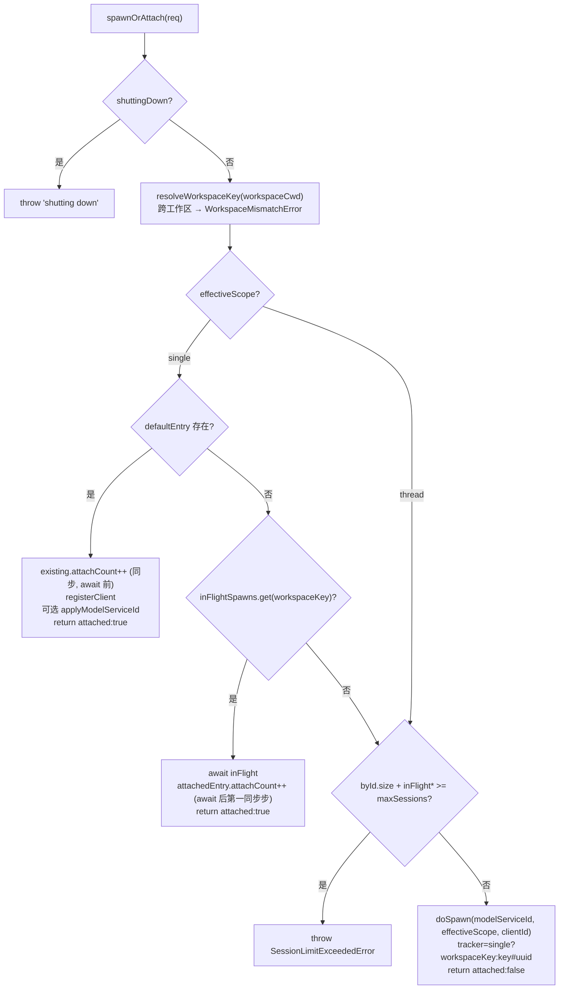
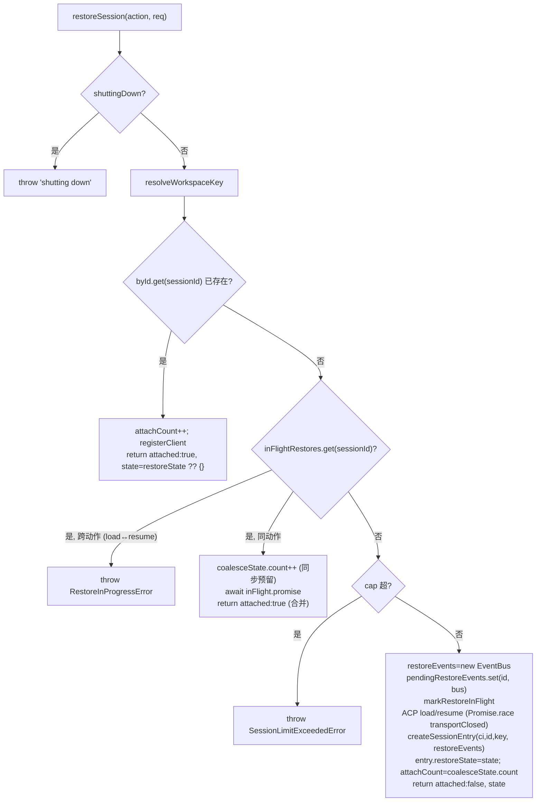
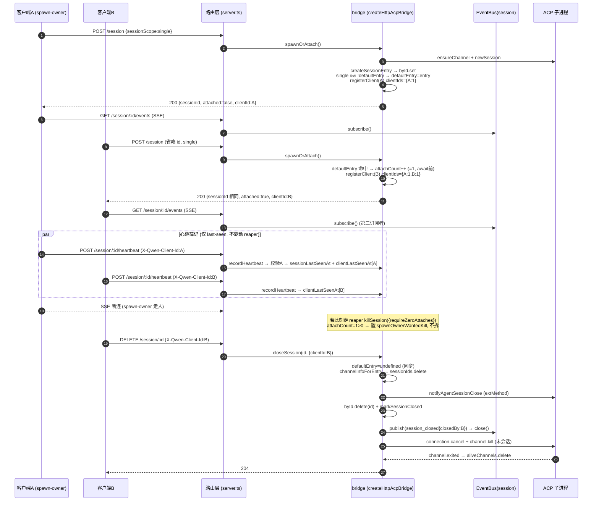

# 会话生命周期（深入）

> 子文档：daemon/serve 模式总览见 [`README.md`](README.md)（本篇 **取代并深化** 其 §3.3）；同主题其它子文档见 `./README.md`。

---

## 概述

Mode B 把"会话"提升为 daemon 内的一等资源：早期一个 `qwen serve` 进程绑定单一工作区（`boundWorkspace`，#3803 §02 "1 daemon = 1 workspace"），内部用一张 `byId: Map<sessionId, SessionEntry>` 登记所有活跃会话，并通过 **ACP core 子进程**（`AcpChannel`）真正承载模型/工具状态。#6394/#6410/#6511 后，daemon 还可以注册多个 sessions-only workspace runtime：primary workspace 继续承载 legacy surface，non-primary runtime 只打开 live session 闭环。本篇覆盖会话的完整生命周期：

- **spawn / attach**：新建 vs 复用，由 `sessionScope`（`single` / `thread`）与 `effectiveScope = req.sessionScope ?? default` 决定（#4209）。
- **引用计数与心跳**：`attachCount`（attach-after-spawn 计数）、`clientIds`（per-client refcount）、`recordHeartbeat`（last-seen 簿记，#4235）。
- **close / detach / delete**：`closeSession` / `killSession` / `detachClient` 的同步删除时序与幂等 `204/404`（#4240）。
- **metadata**：`displayName` 重命名 + `session_metadata_updated` 扇出（#4240）。
- **load / resume**：`session/load`（回放完整历史）vs `session/resume`（不回放），`pendingRestoreEvents` 缓冲、并发 restore 的 coalesce 合并与跨动作 `RestoreInProgressError`（#4222）。
- **archive / unarchive**：active transcript 位于 `chats/`，archived transcript 位于 `chats/archive/`；archive 是状态转换，不删除 transcript，load/resume archived session 会要求先 unarchive（#6058）。

核心工厂闭包 `createHttpAcpBridge`（`packages/acp-bridge/src/bridge.ts:643`，约 4666 行），HTTP 路由层在 `packages/cli/src/serve/server.ts`。会话的并发安全建立在一个反复出现的不变式上：**所有改写 `byId` / `attachCount` / `defaultEntry` 的关键步骤都在 async 函数 `await` 之前的同步前缀里完成**，使得跨微任务边界的竞争（reaper vs attach、close vs spawn）天然原子。

---

## 涉及 PR

| PR | Wave/编号 | 子主题 | 一句话 |
| --- | --- | --- | --- |
| [#4209](https://github.com/QwenLM/qwen-code/pull/4209) | Wave 2 PR 5 | per-request `sessionScope` override | `POST /session` 增加 `sessionScope` 字段，引入 `effectiveScope`，修复 mixed-scope 隔离泄漏 |
| [#4214](https://github.com/QwenLM/qwen-code/pull/4214) | — | session 路由整理 | 会话路由/校验配套 |
| [#4235](https://github.com/QwenLM/qwen-code/pull/4235) | Wave 2.5 PR 9 | client heartbeat | `POST /session/:id/heartbeat`、`recordHeartbeat` / `getHeartbeatState`、per-client last-seen |
| [#4240](https://github.com/QwenLM/qwen-code/pull/4240) | Wave 2.5 PR 11 | metadata + close/delete | `closeSession` / `detachClient` / `updateSessionMetadata`、`DELETE` / `/sessions/delete` / `PATCH metadata` |
| [#4222](https://github.com/QwenLM/qwen-code/pull/4222) | — | session load/resume | `loadSession` / `resumeSession` / `restoreSession`、`pendingRestoreEvents`、`RestoreInProgressError` |
| [#6058](https://github.com/QwenLM/qwen-code/pull/6058) | merged | session archive | active/archive JSONL 状态、archive/unarchive REST+ACP vendor methods、`SessionArchiveCoordinator` 并发门控、SDK helpers |
| [#6305](https://github.com/QwenLM/qwen-code/pull/6305) | open | session organization | project sidecar `session-organization.v1.json`、group CRUD、session pin/group、organized list view、ACP/SDK/Web Shell 接线 |
| [#6309](https://github.com/QwenLM/qwen-code/pull/6309) | open | batch load replay | daemon REST load 可请求 response-mode replay，bridge seed snapshot 且不把历史帧逐条推入 live fanout/ring |
| [#6416](https://github.com/QwenLM/qwen-code/pull/6416) | merged | env/admission guardrail | runtime-local env snapshot 与 daemon-wide `--max-total-sessions` fresh-session admission |
| [#6482](https://github.com/QwenLM/qwen-code/pull/6482) | merged | bounded replay snapshot | `/load` 只承诺 byte-capped live replay window，旧窗口裁剪时前置 `history_truncated` |
| [#6511](https://github.com/QwenLM/qwen-code/pull/6511) | merged | multi-workspace live routing | 多 workspace sessions-only runtime，live session route 先 resolve owner runtime |
| [#6525](https://github.com/QwenLM/qwen-code/pull/6525) | merged | cursor-paged transcript | `GET /session/:id/transcript` 按 frozen active JSONL snapshot 分页返回 id-less replay frames |
| [#6540](https://github.com/QwenLM/qwen-code/pull/6540) | merged | owner index / restore expansion | registry-owned session owner index，trusted non-primary load/resume 与 `session_workspace_conflict` |
| [#6558](https://github.com/QwenLM/qwen-code/pull/6558) | merged | non-primary persisted listing | trusted non-primary workspace session list 合并 active persisted sessions 与 live summaries |
| [#6567](https://github.com/QwenLM/qwen-code/pull/6567) | merged | workspace-qualified REST sessions | `/workspaces/:workspace/...` core REST 与 workspace-qualified session organization/list/archive/delete routes |
| [#6631](https://github.com/QwenLM/qwen-code/pull/6631) | merged | non-primary archived/organized listing | trusted non-primary workspace session list 支持 archived、organized 与 group filter |
| [#4334](https://github.com/QwenLM/qwen-code/pull/4334) | acp-bridge F1 | channelInfo 修复 #4325 | `closeSession` / `killSession` 改用 `channelInfoForEntry(entry)` 而非模块级 `channelInfo`，修复 channel-overlap 误杀 |
| [#4751](https://github.com/QwenLM/qwen-code/pull/4751) | merged | — | ACP 子进程生命周期优化：跳过 `relaunchAppInChildProcess` 冗余 grandchild spawn（直传 `--max-old-space-size`+cgroup 感知）；daemon 启动时 `bridge.preheat()` 预热 ACP child（首 session 延迟降 0-0.5s）；新增 `--channel-idle-timeout-ms` 使 ACP child 在末 session 关闭后保活避免冷启 |
| [#4765](https://github.com/QwenLM/qwen-code/pull/4765) | merged | compaction 修复 | `TurnBoundaryCompactionEngine` 双路径 merge：subagent chunks 按 `(kind, parentToolCallId)` 索引、top-level 按连续同 kind；tool call eviction 保留段边界 |
| [#4812](https://github.com/QwenLM/qwen-code/pull/4812) | merged | session branching | `POST /session/:id/branch`：fork 活跃 session 的 JSONL transcript → restore 为新 session；409 prompt 活跃中、session 上限拒绝；失败自动清理孤儿 |

---

## 数据结构

### `SessionEntry`（`bridge.ts:218-353`）

每个活跃会话一条，登记在 `byId`（`bridge.ts:809`）。完整字段：

| 字段 | 类型 | 作用 / 锚点 |
| --- | --- | --- |
| `sessionId` | `string` | ACP `newSession`/`loadSession` 返回的 id |
| `workspaceCwd` | `string` | 规范化后的工作区；单 runtime 时恒等于 bridge `boundWorkspace`，multi-runtime 时等于 owning runtime 的 workspace cwd |
| `createdAt` | `string` | ISO8601 创建时间（`createSessionEntry` 里 `new Date().toISOString()`，`bridge.ts:1692`） |
| `displayName?` | `string` | 可变元数据，`updateSessionMetadata` 写入（`bridge.ts:222`） |
| `channel` / `connection` | `AcpChannel` / `ClientSideConnection` | 指向承载本会话的 ACP 子进程通道（多会话复用同一 channel） |
| `events` | `EventBus` | per-session SSE 总线，驱动 `GET /session/:id/events`（`bridge.ts:226`） |
| `promptQueue` | `Promise<void>` | per-session prompt FIFO 串行化尾指针（`bridge.ts:234`） |
| `modelChangeQueue` / `approvalModeQueue` | `Promise<void>` | model-switch / approval-mode 的 FIFO，防并发 roundtrip 竞态（`bridge.ts:242/262`） |
| `transportClosedReject?` | `Promise<never>` | 懒建的 "transport 已关" 竞速 promise，单 listener 不变式（`bridge.ts:270` / `getTransportClosedReject:1484`） |
| `pendingPermissionIds` | `Set<string>` | 本会话待裁决 permission 的快速 cap-check 索引（真相在 mediator）（`bridge.ts:277`） |
| `clientIds` | `Map<string, number>` | **per-client 引用计数表**：daemon 签发的 clientId → refcount（`bridge.ts:283`） |
| `activePromptOriginatorClientId?` | `string` | 当前活跃 prompt 的发起者，inline update / permission 继承（`bridge.ts:289`） |
| `cancelBroadcast?` | `boolean` | per-prompt "已广播 `prompt_cancelled`" 去重 latch（`bridge.ts:302`） |
| **`attachCount`** | `number` | **attach-after-spawn 计数**：`spawnOrAttach`/restore 返回 `attached:true` 的次数；reaper 据此判断是否拆除（`bridge.ts:316`） |
| **`spawnOwnerWantedKill`** | `boolean` | BkwQP tombstone：spawn-owner 想 reap 但因 `attachCount>0` 被迫 bail 时置位，later `detachClient` 归零时补完拆除（`bridge.ts:329`） |
| `restoreState?` | `BridgeSessionState` | `session/load`/`resume` 时捕获的 ACP state，供后到的 attacher 拿到同一 payload（`bridge.ts:337`） |
| `sessionLastSeenAt?` | `number` | 跨任意 client 的最近心跳（epoch ms）（`bridge.ts:345`） |
| `clientLastSeenAt` | `Map<string, number>` | per-clientId 最近心跳（仅可信 clientId）（`bridge.ts:352`） |

> **`attachCount` vs `clientCount` 的区别（关键）**：`attachCount` 只统计 "spawn 之后又来 attach" 的次数；`clientIds.size`（在 `BridgeSessionSummary.clientCount`，`bridge.ts:2848` 报出）统计 **所有** 注册过的 clientId——包含 spawn-owner 自己（`doSpawn` 也调 `registerClient`，`bridge.ts:1308`）。所以一个 spawn-owner 独占的会话：`clientCount==1` 而 `attachCount==0`。`clientIds` 的值是 refcount：同一 clientId 多次 echo 会 `+1`，`unregisterClient` 时 `-1`，归零才删（连同 `clientLastSeenAt`）（`registerClient:917-931` / `unregisterClient:933-949`）。

### `ChannelInfo`（`bridge.ts:~150-216`）

承载 N 个会话的 ACP 子进程通道句柄。生命周期关键字段：

- `sessionIds: Set<string>`（`:175`）—— 复用本 channel 的活跃会话；降到空时 channel 被 `kill`。
- `pendingRestoreIds: Set<string>`（`:181`）—— 正在 restore、尚未注册进 `sessionIds` 的 id；防止 restore 半途 channel 被误杀。
- `isDying: boolean`（`:215`）—— **必须在任何 teardown 路径 `await channel.kill()` 之前同步置 `true`**。`ensureChannel` 把 dying channel 视为不存在并 spawn 新的；5 个置位点（init 失败、late-shutdown、doSpawn newSession 失败、killSession last-session、shutdown 批量）。

### 模块级状态（`createHttpAcpBridge` 闭包内）

| 变量 | 锚点 | 作用 |
| --- | --- | --- |
| `byId` | `bridge.ts:809` | `Map<sessionId, SessionEntry>`，`sessionCount` getter 返回其 `size`（`bridge.ts:2020`） |
| `defaultEntry` | `bridge.ts:774` | `single` scope 的**唯一 attach 目标**：第一个在 `single` 下 spawn 的会话；`thread` 会话绝不占据 |
| `channelInfo` | `bridge.ts:789` | 当前 **attach-available** 的 channel；仅 `channel.exited` handler 清空 |
| `aliveChannels` | `bridge.ts:804` | OS 级 "仍存活" 的 channel 超集（含 dying 未 reaped），`killAllSync` 据此 SIGKILL |
| `inFlightSpawns` | `bridge.ts:888` | `Map<key, Promise<BridgeSession>>`，single scope 用 workspaceKey 做 coalesce key，thread 用 `key#uuid` |
| `inFlightRestores` | `bridge.ts:909` | `Map<sessionId, InFlightRestore>`，含 `action`/`promise`/`coalesceState`（`:890-903`） |
| `pendingRestoreEvents` | `bridge.ts:913` | `Map<sessionId, EventBus>`：restore 期间临时 bus，承接 `session/load` 的回放帧，settle 后并入正式 entry |

### heartbeat 结果/状态类型（`bridgeTypes.ts`）

- `BridgeHeartbeatResult { sessionId, clientId?, lastSeenAt }`（`bridgeTypes.ts:131-135`）：`recordHeartbeat` 返回值。
- `BridgeHeartbeatState { sessionLastSeenAt?, clientLastSeenAt: ReadonlyMap }`（`bridgeTypes.ts:144-147`）：`getHeartbeatState` 只读快照。

---

## spawn/attach 与 sessionScope

入口 `bridge.spawnOrAttach(req: BridgeSpawnRequest)`（`bridge.ts:2040`），由 `POST /session`（`server.ts:1321`）调用。`BridgeSpawnRequest` 字段：`workspaceCwd` / `modelServiceId?` / `clientId?` / `sessionScope?`（`bridgeTypes.ts:34-51`）。

### `effectiveScope` 决策

```
effectiveScope = req.sessionScope ?? defaultSessionScope     // bridge.ts:2073
defaultSessionScope = opts.sessionScope ?? 'single'          // bridge.ts:644
```

- 非法 `req.sessionScope`（非 `'single'|'thread'`）→ 抛 `InvalidSessionScopeError`（`bridge.ts:2066-2072`，类定义 `bridgeErrors.ts:104`）。路由层先在边界校验返回 `400 invalid_session_scope`（`server.ts:1387-1398`），bridge 二次校验防直接调用者绕过；两层最终都映射成同一 `400 invalid_session_scope` JSON（`server.ts:3853`）。
- 客户端应先 pre-flight `/capabilities.features` 的 `session_scope_override`；老 daemon 忽略该字段、回落 daemon-wide 默认。

### `single` scope：attach 到 `defaultEntry`



要点：

- **attach 计数在 `await` 之前**（BRSCi，`bridge.ts:2096`）：`existing.attachCount++` 在任何 `await` 之前同步执行，保证与 reaper 的 `killSession({requireZeroAttaches})` 同步前缀检查原子对齐。coalesce 分支里则要求 `attachedEntry.attachCount++` 是 `await inFlight` 之后的**第一个**同步步（`bridge.ts:2147`）——若先做 model-switch await 会重开 BRSCi 竞态。
- **coalesce 后实体可能已死**（BX9_U，`bridge.ts:2157`）：`await inFlight` 解析后 `byId.get(session.sessionId)` 若返回 `undefined`（channel 在 spawn 中崩了），抛带提示的 `SessionNotFoundError` 让调用者重试一次全新 spawn，而非返回一个立刻 404 的 id。
- attach 时若带了不同 `modelServiceId`，发 `applyModelServiceId`（经 `model_switched`/`model_switch_failed` 事件广播），失败被 swallow——不能因一个 client 要了未知模型就 500 掉共享会话（`bridge.ts:2105-2119`）。

### `doSpawn` 与 `defaultEntry` 占据（`bridge.ts:1235-1355`）

1. `ensureChannel()` get-or-create daemon 唯一 channel（coalesce 经 `inFlightChannelSpawn`，`bridge.ts:994`）。
2. `connection.newSession({ cwd: boundWorkspace, mcpServers: [] })`（per-request `mcpServers` 不透传，daemon-wide MCP 走 agent settings）。
3. newSession 失败且该 channel 还没有任何会话（`sessionIds.size===0`）→ 同步 `ci.isDying=true` + kill（BkwQA，`bridge.ts:1281-1292`），否则空 channel 会以 `channelInfo` 身份残留、对 `sessionCount`/`maxSessions` 不可见，且重复失败永远找到这个脏 channel。
4. `createSessionEntry`（`bridge.ts:1683`）：`ci.sessionIds.add` + `byId.set` + `drainEarlyEvents`。
5. **`single && !defaultEntry` → `defaultEntry = entry`**（`bridge.ts:1316`）。

> **隔离泄漏修复（#4209）**：`thread` scope 的会话**绝不**赋给 `defaultEntry`（`bridge.ts:1309-1316` 的注释明确："a thread-scope spawn must never become the attach target"）。否则后续省略 scope（或 daemon 默认 `single`）的调用会以 `attached:true` 误 attach 到一个本应隔离的线程会话。测试 `thread-scope first call does NOT pollute the single-scope attach slot`（`bridge.test.ts:1525`）+ 反向 `single-first does NOT trap a later thread call`（`:1566`）双向锁定该不变式。

### 跨工作区拒绝（`resolveWorkspaceKey`，`bridge.ts:1495-1509`）

```
workspaceKey = (workspaceCwd === boundWorkspace) ? boundWorkspace : canonicalizeWorkspace(workspaceCwd)
if (workspaceKey !== boundWorkspace) throw new WorkspaceMismatchError(boundWorkspace, workspaceKey)
```

- 快路径：客户端 pre-flight `caps.workspaceCwd` 后回传同串 → 省一次 `realpathSync.native` 系统调用；非规范别名（`/work/./bound`、大小写、符号链接）才落 `canonicalizeWorkspace`。
- `WorkspaceMismatchError`（`bridgeErrors.ts:141`）构造时把 `requested` 截断到 `MAX_WORKSPACE_PATH_LENGTH`(4096)，防 10MB cwd body 经 `.message` 双重回显放大。路由映射 `400 workspace_mismatch` 并在 body 带 `boundWorkspace`/`requestedWorkspace` 供 orchestrator 路由到正确 daemon（`server.ts:3811-3851`，stderr 行用 `JSON.stringify` 防 log injection）。
- multi-runtime daemon 下，路由层会先用 `WorkspaceRegistry` 精确解析 `cwd` 到 owning runtime；只有已选中的 bridge 仍执行上面的 boundWorkspace 二次守卫。unknown cwd 仍返回 `workspace_mismatch`，registered but untrusted non-primary cwd 返回 `untrusted_workspace`。

### cap 强制（`maxSessions`）

- 解析：`opts.maxSessions` undefined→`DEFAULT_MAX_SESSIONS=20`（`bridge.ts:616`）；`0`/`Infinity`→无限；`NaN`/负→boot 抛 `TypeError`（fail-CLOSED，配置笔误宁可不启动也不放开唯一资源闸，`bridge.ts:654-671`）。
- 检查（`bridge.ts:2183-2188` / restore 路径 `:1827-1832`）：
  ```
  if (byId.size + inFlightSpawns.size + inFlightRestores.size >= maxSessions) throw new SessionLimitExceededError(maxSessions)
  ```
  把 **in-flight spawn/restore 一并计入**（一个即将注册但还没进 `byId` 的 spawn 也应占额）。
- **attach 不计入 cap**：`single` 下复用 `defaultEntry` / coalesce 分支在 cap 检查**之前**就 return 了——只有真正 spawn 新 child 才被 gate。`thread` override 也不能绕过 cap（测试 `per-request thread overrides cannot bypass the cap`，`bridge.test.ts:7441`）。
- 路由映射 `503 + Retry-After:5 + code:session_limit_exceeded`（`server.ts:3874-3886`）。

---

## 引用计数与心跳

### 两个计数器，两种用途

1. **`clientIds: Map<clientId, refcount>`**（per-client 注册表）
   - `registerClient(entry, requestedClientId?)`（`bridge.ts:917`）：已知 clientId → refcount+1 并回显；未知/缺省 → 签发新 `client_<uuid>` 置 1。**未知 id 在 create/attach 时被静默换成新 id**（`BridgeSpawnRequest.clientId` 文档语义）。
   - `unregisterClient`（`bridge.ts:933`）：refcount-1，归零则删 clientId + 删 `clientLastSeenAt`（防长寿 daemon 在 churn 下累积 stale 心跳）。
   - `resolveTrustedClientId(entry, clientId?)`（`bridge.ts:951`）：缺省返回 `undefined`；clientId 不在 `entry.clientIds` → 抛 `InvalidClientIdError`（`bridgeErrors.ts:170` → `400 invalid_client_id`）。所有状态改写路由（prompt/cancel/close/heartbeat/metadata）都用它校验 `X-Qwen-Client-Id`，使 originator 元数据始终 daemon-stamped 而非 caller-asserted。

2. **`attachCount`**（attach-after-spawn 计数，reaper 专用）
   - `++`：`single` attach（`:2096`）、coalesce attach（`:2147`）、restore existing/raced/coalesce（`:1757`/`:1942`/`:1968`）。
   - `--`：仅 `detachClient`（`:4368`）——回滚一个 "HTTP 响应写不出去" 的 fictitious attach（BVryk/BWGSL，非严格单调）。

### `recordHeartbeat`（`bridge.ts:2856-2876`，#4235）

```js
recordHeartbeat(sessionId, context) {
  const entry = byId.get(sessionId);
  if (!entry) throw new SessionNotFoundError(sessionId);
  const clientId = resolveTrustedClientId(entry, context?.clientId);  // 先校验
  const lastSeenAt = Date.now();
  entry.sessionLastSeenAt = lastSeenAt;                                // 后写
  if (clientId !== undefined) entry.clientLastSeenAt.set(clientId, lastSeenAt);
  return { sessionId, ...(clientId ? { clientId } : {}), lastSeenAt };
}
```

- **clientId 校验在任何 timestamp 写之前**：否则持有有效 bearer 的攻击者可用随机 id 刷心跳、掩盖真实 client 缺席（`bridge.ts:2859-2864`）。
- **无 TOCTOU（因全同步）**：`recordHeartbeat` 是同步函数，校验→写两步在同一微任务内完成，无 `await` 让别的请求插入，故 "校验通过后 entry 被并发删除" 的窗口不存在。
- 匿名心跳（无 `X-Qwen-Client-Id`）仍 bump `sessionLastSeenAt`，但不写 per-client 表。
- 路由 `POST /session/:id/heartbeat`（`server.ts:1742`，`mutate()` 非 strict）→ `200 BridgeHeartbeatResult`；未知 session→404，未注册 clientId→`400 invalid_client_id`。
- `getHeartbeatState(sessionId)`（`bridge.ts:2878`）返回**快照副本**（`new Map(entry.clientLastSeenAt)`）防外部改写 live map；未知 session 返回 `undefined`。

> **当前心跳数据是诊断性的，不驱动主动 reaper**。`SessionEntry.sessionLastSeenAt` 注释（`bridge.ts:341`）明确其 "consumed by future diagnostics (PR 12) and revocation policy (PR 24)"；server.ts 里没有读 last-seen 的 `setInterval` 拆除逻辑（仅有的 `setInterval` 是 SSE 15s keepalive `:2839` 与 `--writer-idle-timeout-ms` 写侧 idle 守卫 `:2881`，均与 attach reaping 无关）。

### 实际的断连 reaper（基于 `attachCount` + tombstone）

真正的会话拆除由 **SSE/HTTP 断连** 触发，不是心跳。三条路径协同：

1. **spawn 窗口断连**（`server.ts:1436-1470`）：`POST /session` 在 `spawnOrAttach` 返回后用 `res.writable` 检测客户端是否还在（`res.writable` 是 "ServerResponse 仍可发送" 的正确信号；`req.aborted` 只在请求体接收期为真、`req.destroyed` 又太急）。若断连：
   - `!session.attached`（我们刚 spawn 了新 child）→ `bridge.killSession(id, { requireZeroAttaches: true })`。
   - `session.attached`（attach 到既有会话）→ `bridge.detachClient(id, clientId)` 回滚 fictitious 计数。
2. **`killSession({requireZeroAttaches:true})` 的 BQ9tV 守卫**（`bridge.ts:4263-4266`）：若 `attachCount>0`（spawn 窗口内已有别人 attach），**不拆**，置 `spawnOwnerWantedKill=true` tombstone 后 return。
3. **`detachClient` 的 BkwQP 补完拆除**（`bridge.ts:4349-4382`）：减 `attachCount` + `unregisterClient`；仅当 `spawnOwnerWantedKill && attachCount===0 && events.subscriberCount===0` 时才补调 `killSession` 完成延迟拆除。否则 detach 只减引用、不拆（拆是 spawn-owner 的责任）。

restore 路径（`POST /session/:id/load|resume`）镜像同一 `res.writable` 清理（`server.ts:1519-1533`）。

---

## close / delete 生命周期

四个端点（#4240）：

| 端点 | bridge 方法 | 锚点 | 语义 |
| --- | --- | --- | --- |
| `DELETE /session/:id` | `closeSession` | `server.ts:1820` / `bridge.ts:2660` | 显式关闭单会话（即便有别人 attach 也强关）；不计入 cap |
| `POST /session/:id/detach` | `detachClient` | `server.ts:1773` / `bridge.ts:4349` | 仅减引用，不主动拆 |
| `POST /sessions/delete` | `closeSession`×N + `SessionService.removeSessions` | `server.ts:1838` | 批量（≤100，去重，`Promise.allSettled`），同时删磁盘 transcript |
| （内部/reaper） | `killSession` | `bridge.ts:4247` | tear-down child + 发 `session_died`；带 `requireZeroAttaches` 选项 |

### `closeSession` 时序（`bridge.ts:2660-2776`）

同步前缀（任何 `await` 之前）：

1. `byId.get` 缺失 → 抛 `SessionNotFoundError`（→404）。
2. `resolveTrustedClientId`（校验 `X-Qwen-Client-Id`）。
3. **`if (defaultEntry === entry) defaultEntry = undefined`**（`:2677`）——**同步**摘掉 attach 目标，使并发的省略-id `spawnOrAttach({single})` 不会再 attach 到这个正在死的 entry，而是 spawn 全新会话。
4. `channelInfoForEntry(entry)`（`:2702`，见下）+ `ci.sessionIds.delete(sessionId)`。

然后 `await notifyAgentSessionClose`（`:2721`，首个 await）→ `permissionMediator.forgetSession` → `entry.pendingPermissionIds.clear` → **`byId.delete(sessionId)`（`:2728`）** → `markSessionClosed` tombstone → 发 `session_closed`（envelope 带 `originatorClientId`，data 带 `closedBy` 兼容旧消费者）→ `entry.events.close()`（`:2753`，终止帧后关 bus）→ `await connection.cancel`（清理活跃 prompt）→ 若 `ci.sessionIds.size===0 && pendingRestoreIds.size===0` 则 `ci.isDying=true` + `channel.kill()`（`:2767-2775`）。

> **`closeSession` 与 `killSession` 的删除时序差异（值得注意）**：`killSession` 把 `byId.delete(sessionId)` 放在**任何 await 之前**的同步前缀（`bridge.ts:4275`，注释 "Remove from the state eagerly so concurrent spawnOrAttach can't reattach"）；`closeSession` 则在 `notifyAgentSessionClose` 这个 await **之后**才 `byId.delete`（`:2728`）。`closeSession` 仍安全：(a) 它在 await 前已同步清 `defaultEntry`，挡住了 `single` 隐式 reattach；(b) 对并发的双 `DELETE` 它**幂等容忍**——第二次 `byId.delete` 是 no-op，`events.publish` 包在 try/catch（bus 已关），`events.close()` 幂等，`channel.kill()` best-effort。

### `channelInfoForEntry` 修复（#4334 / #4325）

`closeSession`/`killSession` 都用 `channelInfoForEntry(entry)`（`bridge.ts:1516-1524`）解析 channel——**先比模块级 `channelInfo`，不匹配再遍历 `aliveChannels` 找 `info.channel === entry.channel`**——而不是直接用模块级 `channelInfo`（当前 attach 目标）。两者在 channel-overlap 窗口（A 正在死、B 刚 spawn 成新 `channelInfo`）会分叉：用 `channelInfo` 会（1）跳过 `A.sessionIds.delete`（因 `B.channel !== entry.channel`）使 A 的 set 残留，（2）在 **B** 的 client 上 `markSessionClosed` 而非 A，用过时 session count 评估 B 的 kill 条件。`closeSession`/`killSession` 都标注了 `HAZARD(#4325)`：回归测试是单 channel smoke，不会因还原成 `channelInfo` 而失败——靠 code-review 守住。

### 幂等 204 / 404 与 SDK 吸收

- 路由 `DELETE /session/:id`（`server.ts:1820-1836`）：成功 `204`；`closeSession` 抛 `SessionNotFoundError` → `sendBridgeError` → `404`（`server.ts:3798`）。
- **SDK 吸收 404**：`DaemonClient.closeSession`（`packages/sdk-typescript/src/daemon/DaemonClient.ts:1748`）把 `204`（已关）与 `404`（已没了）**都视为成功** return（"daemon treats DELETE as idempotent for SDK callers"），其余状态才 `failOnError`。
- 批量 `/sessions/delete`：单个 `closeSession` 抛 `SessionNotFoundError` 时仍把该 id 计入 `closedIds` 去删磁盘 transcript（`server.ts:1873-1876`），返回 `{removed, notFound, errors}`。

### `killSession`（`bridge.ts:4247-4347`）与 `detachClient`（`bridge.ts:4349-4382`）

`killSession` 同步前缀：`requireZeroAttaches` 守卫（`:4263`）→ `forgetSession`/`clear` → `defaultEntry` 清 → **`byId.delete`（`:4275`，await 前）** → `channelInfoForEntry` + `sessionIds.delete`；await `notifyAgentSessionClose` → `markSessionClosed` → 发 `session_died{reason:'killed'}`（在 close bus 前发，因为 `byId.delete` 后 channel.exited 的自动 publish 已 `byId.get===undefined` 不会触发）→ `events.close` → 末会话且无 pending restore 才 kill channel。

`detachClient` 见上节 BkwQP 补完拆除。

---

## metadata

`updateSessionMetadata(sessionId, metadata, context)`（`bridge.ts:2778-2831`，**同步**方法）。当前仅支持 `displayName`（`SessionMetadataUpdate`，`bridgeTypes.ts:96-98`）：

- 校验：非字符串或超 `MAX_DISPLAY_NAME_LENGTH`(256) → `InvalidSessionMetadataError`（`bridgeErrors.ts:201` → `400 invalid_metadata`）；含控制字符 → 同错（`hasControlCharacter`，`bridge.ts:579`）。
- `metadata.displayName || undefined` 把空串折叠为清除；仅当值真变化才写 + 发 `session_metadata_updated`（envelope 带 `metadataOriginatorClientId`）。
- 路由 `PATCH /session/:id/metadata`（`server.ts:1919-1962`，**注意：未挂 `mutate()`**，仅靠全局 bearer）：先 `.slice(0,256)`，成功后 best-effort `SessionService.renameSession` 落盘（文件不存在时吞错，内存改动仍对本 daemon 生命周期有效）。
- `listWorkspaceSessions`（`bridge.ts:2833`）把 `displayName` 透出到 `BridgeSessionSummary`。


---

## load / resume

两个端点（#4222），共用 `restoreSession(action, req)`（`bridge.ts:1746-2017`）：

| | `loadSession` / `POST /session/:id/load` | `resumeSession` / `POST /session/:id/resume` |
| --- | --- | --- |
| ACP 方法 | `connection.loadSession`（`bridge.ts:1879`） | `connection.unstable_resumeSession`（`bridge.ts:1897`，`unstable_` 因底层 ACP 方法名未定稿） |
| 历史回放 | **回放完整历史**（emit `session_update`） | **不回放** |
| agent 侧 | `createAndStoreSession(config, sessionData?.conversation)` → `session.replayHistory(messages)`（`acpAgent.ts:812-815` / `:3193-3195`） | `createAndStoreSession(config)`（无 conversation）→ 不调 replayHistory（`acpAgent.ts:854`） |

### `restoreSession` 决策与缓冲



关键机制：

- **`pendingRestoreEvents` 缓冲**（`bridge.ts:913`/`:1842`）：`session/load` 会在 ACP 请求返回**之前**就经 `session_update` 通知把历史回放出来。此时正式 `SessionEntry` 还没建，`BridgeClient.sessionUpdate` 用 `entry?.events ?? resolvePendingRestoreEvents(sessionId)`（`bridgeClient.ts:404-405`）把回放帧落进临时 `restoreEvents` bus 的 ring。settle 后 `createSessionEntry(ci, id, key, restoreEvents)`（`bridge.ts:1954`）**把同一个 bus 提升进正式 entry**，于是先连上来的 SSE 订阅者能 replay 到完整历史。
- **跨动作 `RestoreInProgressError`**（`bridge.ts:1782-1788`，类 `bridgeErrors.ts:73`）：`load` 进行中来 `resume`（或反向）必须拒绝——load 正在共享 bus 上回放全量历史，而 `resume` 客户端 seed `lastEventId:0` 会收到每一条回放帧，直接违反 resume 的 "no UI replay" 契约。映射 `409 + Retry-After:5 + restore_in_progress`（`server.ts:3888`，5s 因 restore 可达 `initTimeoutMs`=10s，1s 会把客户端推进 tight loop）。
- **同动作 coalesce**（`bridge.ts:1771-1825`）：同 id 同 action 的并发不报错，走合并——后来者 `coalesceState.count++`（**同步预留**，在 `await inFlight.promise` 之前），让 spawn-owner 的 `requireZeroAttaches` reaper 在新注册 entry 上看到非零 `attachCount` 而跳过 kill。IIFE 在 `createSessionEntry` 时把 `coalesceState.count` 折进 `entry.attachCount`（`bridge.ts:1968`）；失败则回滚 `count--`（`:1800`/`:1808`）。
- **`attachCount` 预留 / raced 分支**：若 ACP 调用期间同 id 已被别的路径注册（`racedEntry`，`bridge.ts:1936`），把 `1 + coalesceState.count` 一次性加到 raced entry 并 attach 返回。
- **restore 不占 `defaultEntry`**（`bridge.ts:1970-1976`）：显式 `load`/`resume` 是 "给我这个 id"，不应成为后续省略-id `single` 调用的隐式 attach 目标。
- **channel 误杀防护**：restore 期间把 id 放进 `ci.pendingRestoreIds`（`bridge.ts:1844`）；`killSession`/`closeSession` 仅在 `sessionIds.size===0 && pendingRestoreIds.size===0` 才 kill channel——避免把正在 restore 的 channel SIGTERM 掉（`bridge.ts:4333` / `:2767`）。
- **tombstone 协同**：`markRestoreInFlight`（`bridgeClient.ts:733`，`bridge.ts:1853`）在 ACP 调用前 allow-list 该 id，使 restore 期间的 guardrail 事件不被 close-window tombstone 丢弃；finally 里 `clearRestoreInFlight` + 若失败 `markSessionClosed` 重新 tombstone（codex round 6/7 修复，`bridge.ts:1985-2008`）。
- **ACP 资源不存在**：`isAcpSessionResourceNotFound`（`bridge.ts:1715`，匹配 JSON-RPC code `-32002` + `uri==='session:<id>'`）→ 转 `SessionNotFoundError`（→404）。agent 侧 `loadSession`/`unstable_resumeSession` 先 `sessionService.sessionExists` 不存在即 `RequestError.resourceNotFound`（`acpAgent.ts:794`/`:841`）。

### 已存在会话的 attach（早返回）

`byId.get(sessionId)` 命中（`bridge.ts:1755-1769`）：`attachCount++` + `registerClient`，返回 `attached:true` 且 `state = existing.restoreState ?? {}`（spawn-only 会话无 restoreState，返回 `{}`）——后到的 attacher 拿到与原 restore 调用者相同的 ACP state。

### 压缩重放（Compacted Session Replay，#4694）


**解法——`TurnBoundaryCompactionEngine`**（`packages/acp-bridge/src/compactionEngine.ts`，310 行）：每个 `EventBus` 创建时注入一个 `CompactionEngine` 实例。engine 以 best-effort 方式 `ingest()` 每一帧（publish 路径 try/catch 隔离，`BX9_p`）。当收到 `turn_complete` / `turn_error` 时执行 turn 级折叠：

- 连续 `agent_message_chunk` / `agent_thought_chunk` 合并为单条（text join）。
- 同 `toolCallId` 的 `tool_call` + `tool_call_update` 序列折叠为最终态单帧。
- `available_commands_update` / `current_mode_update` 等仅保留最新。
- `slow_client_warning` / `client_evicted` / `replay_complete` / `stream_error` 等瞬态信号丢弃。
- 事件间相对类型顺序（text → tool → text 交错）保持不变。

**`snapshot()` 同步调用**，返回 `SessionReplaySnapshot`：

| 字段 | 含义 |
| --- | --- |
| `compactedTurns` | 所有已完成 turn 的压缩帧，O(turns) 量级 |
| `liveJournal` | 当前未完成 turn 的原始帧（mid-stream 刷新可用） |
| `lastEventId` | 高水位 event id，客户端以此为 SSE 初始游标 |

典型 3h 重度会话：~50MB raw → ~2MB compacted（25-30x 压缩）。

**与 ring replay 的关系**：ring 仍服务 SSE 短期追赶（`Last-Event-ID` 重连）；compaction engine 提供**正交的全会话恢复路径**。`restoreSession` 返回新增字段 `compactedReplay` + `liveJournal` + `lastEventId`（`BridgeRestoredSession`，`bridgeTypes.ts`，所有字段 optional 保持向后兼容）；`resume` 只返回 `lastEventId`（不回放）。客户端用 `compactedReplay + liveJournal` 立即还原 transcript，然后以 `lastEventId` 接入 SSE 流获取后续实时帧。

**bounded replay snapshot（#6482）**：`/load` 的 `compactedReplay` 是 live in-memory snapshot，不再承诺全量 transcript。`TurnBoundaryCompactionEngine` 按 completed turn / restore event segment 维护 replay window，并受 `--compacted-replay-max-bytes` 约束；默认 4 MiB，最大 256 MiB。旧 replay 被丢弃时，snapshot 首帧是 id-less `history_truncated` marker，客户端把它渲染为状态提示后继续应用 retained replay，不把它当成 `state_resync_required`。完整 active persisted transcript 不再塞进 `/load`，#6525 通过 `GET /session/:id/transcript` 做 cursor-paged replay：第一页冻结 JSONL snapshot size，后续 cursor 绑定 session、文件身份、snapshot position、leafUuid 与 replay state，并用 workspace project 目录持久 HMAC key 签名；ACP child 只读转换成 id-less `session_update` frames，不 attach client、不 seed EventBus、不改变 live replay window。snapshot 超过 256 MiB 时建索引前结构化拒绝。

**multi-workspace session routing（#6511/#6540/#6558/#6567/#6631）**：multi-runtime daemon 中，legacy `workspaceCwd` 仍指 primary workspace；显式 `cwd` 创建 session 时通过 `WorkspaceRegistry` 精确解析 runtime，unknown/untrusted 分别返回 `workspace_mismatch` / `untrusted_workspace`。live session 路由（events/prompt/cancel/permission/heartbeat/detach/pending/close/status）先 resolve owner runtime 再触碰 bridge，miss 不 fallback primary，ambiguous fail closed。#6540 把 owner scan 抽成 registry-owned `WorkspaceSessionOwnerIndex`，并让 trusted non-primary workspace 可以显式 load/resume persisted session；跨 runtime 同 id restore/live 冲突返回 `409 session_workspace_conflict`。#6558 让 trusted non-primary session list 在 active recent view 下合并 persisted sessions 与 live summaries。#6567 再把 session organization/list/archive/delete 等 core REST 迁到 `/workspaces/:workspace/...` plural surface，selector 支持 workspace id 和 encoded absolute cwd。#6631 补齐 trusted non-primary archived/organized/grouped list：读取 selected workspace 的 `chats/archive/` 与 organization sidecar，`view=organized&archiveState=archived` 只返回 archived，unknown group id 对齐 primary 返回 `group_not_found`。

---

## 时序图

### 图① 多客户端 attach 同一 session + heartbeat + 一方 close



### 图② load vs resume 两路径 + 并发 restore 拒绝

```mermaid
sequenceDiagram
    autonumber
    participant L as 客户端L (load)
    participant Rm as 客户端Rm (resume, 并发同id)
    participant D as bridge.restoreSession
    participant PRB as pendingRestoreEvents bus
    participant Ag as ACP 子进程

    L->>D: POST /session/:id/load
    D->>D: byId.get(id) miss; inFlightRestores miss; cap ok
    D->>D: restoreEvents=new EventBus<br/>pendingRestoreEvents.set(id, bus)<br/>markRestoreInFlight(id)<br/>inFlightRestores.set(id,{action:'load',...})
    D->>Ag: connection.loadSession({sessionId, cwd, mcpServers:[]})
    Ag->>Ag: createAndStoreSession(config, conversation)<br/>session.replayHistory(messages)
    Ag-->>PRB: session_update ×N (历史回放, 经 resolvePendingRestoreEvents)
    Rm->>D: POST /session/:id/resume (load 仍在飞)
    D->>D: byId.get miss; inFlightRestores 命中 action='load'≠'resume'
    D-->>Rm: 409 restore_in_progress {activeAction:load, requestedAction:resume}
    Ag-->>D: loadSession 返回 state
    D->>D: createSessionEntry(ci,id,key, restoreEvents) ← bus 提升进 entry<br/>entry.restoreState=state; attachCount=coalesceState.count(0)<br/>finally: clearRestoreInFlight + pendingRestoreEvents.delete
    D-->>L: 200 {attached:false, state}
    Note over Rm: 客户端Rm 收到 409 后退避 5s 重试<br/>此时 load 已完成 → resume 命中 byId → attached:true (不回放)
```

---

## 边界与错误处理

| 竞态 / 边界 | 处理 | 锚点 |
| --- | --- | --- |
| reaper vs 后来者 attach | `attachCount++` 在 `await` 前同步；`killSession({requireZeroAttaches})` 的检查也在同步前缀 → 跨微任务原子；`attachCount>0` 时置 `spawnOwnerWantedKill` 延迟拆除 | `bridge.ts:2096/2147/4263` |
| 两个客户端都在 spawn 窗口断连（coalesce） | 各自 `detachClient` 减 `attachCount`；归零 + tombstone + 无订阅者 → `detachClient` 补完 reap，不留孤儿 child | `server.ts:1465` / `bridge.ts:4370-4381` |
| 并发双 `DELETE` 同 id | 幂等容忍：`byId.delete` no-op + `publish` try/catch + `events.close` 幂等 + `channel.kill` best-effort；第二次 `byId.get` miss → 404 | `bridge.ts:2728-2775` |
| load 进行中来 resume（或反向） | `RestoreInProgressError` → 409（保护 resume 的 no-replay 契约） | `bridge.ts:1782` |
| 同动作并发 restore | coalesce 合并，`coalesceState.count` 同步预留 + 失败回滚；不重复 ACP 调用 | `bridge.ts:1793-1825` |
| restore 期间 channel 被并发 kill | `pendingRestoreIds` 守卫：`sessionIds` 空但 pendingRestore 非空时不 kill channel | `bridge.ts:4333` / `:2767` |
| channel-overlap（A 死 B 生）误杀 | `channelInfoForEntry(entry)` 按 entry.channel 精确解析，不用模块级 `channelInfo` | `bridge.ts:1516`（#4334/#4325） |
| spawn 中 child 崩，返回 id 立刻 404 | coalesce/restore 后 `byId.get` 再校验，miss 抛带提示的 `SessionNotFoundError` | `bridge.ts:2157` / `:1804` / `:1341`（doSpawn model-switch 后 `Bd1zc` 复检） |
| late `extNotification` 泄漏到下次同 id load | `markSessionClosed` tombstone（60s TTL）+ restore allow-list（`markRestoreInFlight`） | `bridgeClient.ts:458/485` |
| shutdown 期间到达的 `spawnOrAttach`/restore | `shuttingDown` gate 同步拒绝；`ensureChannel`/`doSpawn` 有 late-shutdown 复检；`shutdown()` await in-flight spawn/restore/channel | `bridge.ts:2041/1750/4411` |
| 双 Ctrl+C 在 SIGTERM grace 中 | `killAllSync()` 遍历 `aliveChannels`（含 dying）逐个 `killSync`，不漏 overlap 期的 dying child（BkUyD） | `bridge.ts:4384` |

错误→HTTP 映射（`sendBridgeErrorImpl`，`server.ts:3695`）：`SessionNotFoundError`→404、`InvalidClientIdError`→`400 invalid_client_id`、`WorkspaceMismatchError`→`400 workspace_mismatch`、`InvalidSessionScopeError`→`400 invalid_session_scope`、`InvalidSessionMetadataError`→`400 invalid_metadata`、`SessionLimitExceededError`→`503 +Retry-After session_limit_exceeded`、`RestoreInProgressError`→`409 +Retry-After restore_in_progress`。

---

## 关键设计决策与权衡

1. **同步前缀不变式取代锁**。JS 单线程下，把所有 `byId`/`attachCount`/`defaultEntry`/`isDying` 的关键改写放在 async 函数 `await` 之前的同步段，即可让 "reaper vs attach"、"close vs spawn"、"restore coalesce vs disconnect" 等跨微任务竞争天然原子，无需显式互斥。代价是代码里散布大量 "must run before any await" 注释（BRSCi/BQ9tV/BkwQA…），可读性靠 review 守。

2. **`single` vs `thread` + per-request override**。`single` 服务 "多客户端实时协作同一活跃会话"（webui+CLI 看同一上下文），用 `defaultEntry` 做隐式 attach 目标；`thread` 服务隔离并发会话、绝不占 `defaultEntry`。默认 `single` 与 Mode A "一个工作区一个活跃会话" 直觉一致。#4209 加 per-request override 但严格防 mixed-scope 泄漏（双向测试锁定），代价是 `single` 的 attach/reap 语义复杂（`attachCount`+tombstone+断连 reaper）——这是多客户端共享的本质复杂度。

3. **reaper 基于断连而非心跳**。`attachCount`+`res.writable`+tombstone 这套精确反映 "有没有活客户端写得出响应/连得上 SSE"，而心跳 last-seen 暂留作未来 revocation（PR 24）的诊断输入。好处是拆除决策不依赖心跳频率/时钟漂移；代价是 wedged-but-connected 的僵尸 SSE 仍需 `--writer-idle-timeout-ms` 这条正交守卫兜底。

4. **load/resume 共用 `restoreSession` 但严格区分回放**。两者复用 cap/coalesce/channel 守卫，仅在 ACP 方法与 `conversation` 透传上分叉。跨动作并发硬拒（409）而非合并——因为 load 的全量回放与 resume 的 `lastEventId:0` seed 不兼容。`pendingRestoreEvents` 临时 bus + settle 提升，解决 "回放帧先于 entry 注册到达" 的先有鸡先有蛋问题。

5. **幂等优先于强一致**。`closeSession`/`DELETE` 设计成可重入：`byId.delete` no-op、`events.close` 幂等、SDK 把 404 当成功吸收。这让多 tab/重试/批量删除无需协调；代价是 `closeSession` 的 `byId.delete` 落在 await 之后（与 `killSession` 的 eager delete 不同），靠容忍而非时序排他保证正确。

6. **fail-CLOSED 的配置校验**。`maxSessions`/`eventRingSize` 的 `NaN`/负/越界在 boot 抛错而非静默放开（`bridge.ts:654`/`:689`）——一个笔误悄悄禁用唯一资源闸（fail-OPEN）比启动失败更危险。

---

## 已知限制 / 后续

1. **心跳未驱动主动 eviction**。`sessionLastSeenAt`/`clientLastSeenAt` 当前仅供 `getHeartbeatState` 诊断；按其字段注释，per-client 撤销/超时拆除留给 PR 24 revocation policy。长寿 daemon 下心跳数据靠 `unregisterClient` 清理，但没有 "N 秒无心跳即拆会话" 的回收。

2. **`DELETE /session/:id` 与 `PATCH metadata` 未挂 `mutate()`**。其余状态改写路由（heartbeat/detach/cancel/sessions-delete）都过 `mutate()` 闸，唯独单会话 DELETE（`server.ts:1820`）与 metadata PATCH（`server.ts:1919`）仅靠全局 bearer。无 token 的 loopback 开发部署下两者可达——与 Wave 4 写类路由 `mutate({strict:true})` 的姿态不完全一致。

3. **`closeSession` 的 `byId.delete` 在 await 之后**。与 `killSession` 的 eager 同步 delete 不同（见上文时序差异）。当前靠幂等容忍 + 同步清 `defaultEntry` 保证正确，但存在一个窄窗口：`closeSession` 的 `notifyAgentSessionClose` await 期间，并发的显式同 id `loadSession` 仍能 `byId.get` 命中正在关闭的 entry 并 `attachCount++` 返回 `attached:true`，随后该 entry 的 bus 被关闭——attacher 会很快收到 `session_closed`/SSE 关闭。属罕见竞态，未单独加守卫。

4. **`channelInfoForEntry` 修复无确定性回归测试**。#4334/#4325 修复的 channel-overlap 误杀，其回归测试是单 channel smoke（`HAZARD(#4325)` 注释），还原成模块级 `channelInfo` 不会让任何现有测试失败——确定性 overlap 测试需要 factory 内部 hook，列为 deferred follow-up。

5. **无绝对 prompt 超时（影响会话拆除）**。`sendPrompt` 的 `FIXME(stage-2)`（`bridge.ts:2309`）：忽略 `cancel()` 又保持 channel 存活的 buggy agent 能无限期挂住 prompt promise，间接让 `attachCount`/会话长期不被回收。Stage 2 计划加 per-prompt wall clock（`--prompt-deadline`）。

---

## 测试覆盖

主测试 `packages/acp-bridge/src/bridge.test.ts`（`daemon_mode_b_main`，约 8386 行，#4445 从 serve 侧抬升）。会话生命周期相关用例（按主题）：

- **sessionScope / 隔离泄漏**：`reuses the existing session under sessionScope:single`（`:229`）、`creates fresh session per call under sessionScope:thread`（`:1428`）、`per-request sessionScope:thread overrides daemon-wide single`（`:1456`）/ 反向（`:1492`）、`thread-scope first call does NOT pollute the single-scope attach slot`（`:1525`）、`symmetric mixed-scope leak: single-first does NOT trap a later thread call`（`:1566`）、`rejects an invalid per-request sessionScope`（`:1658`）、`canonicalizes the workspace key`（`:1691`）。
- **cap**：`describe('maxSessions cap')`（`:7411`）、`per-request thread overrides cannot bypass the cap`（`:7441`）、`attach to an existing session under single scope is NOT counted toward the cap`（`:7482`）。
- **attach coalesce**：`describe('concurrent spawn coalescing (single scope)')`（`:4313`）。
- **heartbeat**：`describe('recordHeartbeat')`（`:680`）。
- **close/kill/detach/metadata**：`describe('closeSession')`（`:7813`）、`describe('updateSessionMetadata')`（`:8010`）、`describe('listWorkspaceSessions')`（`:4709`/ enriched `:8076`）、`publishWorkspaceEvent + knownClientIds`（`:8100`）。
- **load/resume/restore**：`loads an existing ACP session...`（`:798`）、`buffers load replay events until the restored session is registered`（`:838`）、`resumes an existing ACP session without calling session/load`（`:899`）、`attaches to an already live session and returns the cached restore state`（`:931`）、`propagates the original ACP state to coalesced restore waiters`（`:973`）、`survives spawn-owner disconnect kill while a coalesced restore is mid-flight`（`:1011`）、`does not kill the channel when the last live session leaves while a restore is pending`（`:1057`）、`does not promote a restored session into the omitted-id attach default`（`:1100`）、`rejects load while a resume for the same session is in flight`（`:1164`）/ 镜像（`:1196`）、`does not kill a shared channel when one of multiple pending restores fails`（`:1231`）、`does not surface an unhandledRejection when the channel exits after a successful restore`（`:1282`）、`shutdown awaits in-flight restores before resolving`（`:1323`）。
- **tombstone/early-events**：`tombstones closed sessionIds so late notifications cannot leak into a future load`（`:6781`）、`purges buffered guardrail events when restore fails so retry-success does not replay stale frames`（`:6876`）。

配套：`bridgeClient.test.ts`（demux/early-events/tombstone）、`HistoryReplayer.test.ts` / `Session.test.ts`（agent 侧回放）、`server.test.ts`（路由层 `res.writable` reaper、状态码映射、`/sessions/delete` 批量）。

---

## 各 PR 代码贡献

### #4209 — sessionScope override

- `bridge.ts:spawnOrAttach`：新增 `effectiveScope = req.sessionScope ?? defaultSessionScope` 决策；非法值抛 `InvalidSessionScopeError`。
- `bridge.ts:doSpawn`：`thread` scope 的会话**绝不**赋给 `defaultEntry`，防 mixed-scope 隔离泄漏。
- `bridgeErrors.ts:InvalidSessionScopeError`：类定义 + 路由映射 `400 invalid_session_scope`。
- 双向测试 `bridge.test.ts`：`thread-scope first call does NOT pollute single-scope attach slot` + 反向。

### #4222 — load / resume

- `bridge.ts:restoreSession`：共用入口，按 `action` 分叉到 `connection.loadSession`（回放）/ `connection.unstable_resumeSession`（不回放）。
- `bridge.ts:pendingRestoreEvents`：`Map<sessionId, EventBus>` 临时 bus，承接 ACP 回放帧并在 settle 后提升进正式 entry。
- `bridge.ts:inFlightRestores` / `RestoreInProgressError`：跨动作并发硬拒 409（保护 resume 的 no-replay 契约）；同动作 coalesce 合并（`coalesceState.count` 同步预留）。
- `bridgeClient.ts:markRestoreInFlight` / `markSessionClosed`：tombstone 协同——allow-list restore id + 60s TTL 防 late notification 泄漏。

### #6305 — session organization

- `SessionOrganizationService`：把 groups 和 per-session organization 写入 project-level `session-organization.v1.json` sidecar；group name/color/order 做输入校验，写入走 atomic JSON，并按 store path 串行化读改写。
- `server/session-list.ts`：默认 recent list 不变；`view=organized` 时合并 sidecar snapshot，按 pinned first、group/order 和 session timestamp 排序，再用 opaque cursor 分页。
- `routes/session.ts` / ACP dispatcher / SDK：新增 group CRUD、`PATCH /session/:id/organization` 与对应 vendor methods；URL path 参数优先于 body 中冲突字段。
- Web Shell/WebUI：仅当 capability `session_organization` 存在时启用分组/置顶视图。

### #6309 — response-mode batch load replay

- `bridge.ts` / `bridgeClient.ts`：daemon bridge 可在 load request 中带 Qwen 私有 metadata，要求 ACP child 把 replay updates 放进 response；bridge 解析后 strip 私有字段，对外仍返回标准 ACP result。
- `bridge.ts`：response-mode replay 只 seed 当前 bridge snapshot，不通知 subscribers，也不填充 reconnect ring；随后 ACP session stream 初次 attach 再从 snapshot 发送 replayed `session/update`。
- `acpAgent.ts` / `Session.ts`：默认 ACP load 继续 streamed replay，只有 bridge 明确请求时才走 response-mode，保持 direct ACP client 兼容。

### #6482 — bounded replay snapshot

- `compactionEngine.ts:TurnBoundaryCompactionEngine`：按 replay segment 维护 completed live turn 与 restore replay，超过 `maxReplayBytes` 时丢弃最旧 segment，并保留最新 oversized segment。
- `replayWindowLimits.ts`：集中定义默认 4 MiB、最大 256 MiB 和 `normalizeCompactedReplayMaxBytes()`。
- `bridge.ts:restoreSession/loadSession`：`compactedReplay` / `liveJournal` 返回有界 snapshot；裁剪时首帧为 id-less `history_truncated`。
- SDK/WebUI：`history_truncated` 是 status marker，渲染后继续应用 retained replay，不进入 `awaitingResync`。

### #6511 — multi-workspace live session routing

- `run-qwen-serve.ts`：多个 distinct `--workspace` 注册为 sessions-only runtimes，第一项仍是 primary。
- `workspace-registry.ts`：workspace id/cwd lookup、primary fallback、live session owner resolution。
- `routes/session.ts` / `routes/sse-events.ts` / `routes/permission.ts`：session create、events、prompt、cancel、permission、heartbeat、detach、pending、close、status 按 owner runtime dispatch。
- `routes/capabilities.ts` / `daemon-status.ts`：多 runtime 时 additive 发布 `multi_workspace_sessions`、`workspaces[]` 和 session limits；legacy `workspaceCwd` 保持 primary。

### #6525 — cursor-paged transcript replay

- `session-transcript-reader.ts`：冻结 active JSONL snapshot，按 active parent chain 分页，cursor 绑定 session/file/snapshot/position/leafUuid/replay state 并用 workspace project 目录持久 HMAC key 签名；snapshot 超过 256 MiB 时拒绝建索引。
- `acpAgent.ts`：`qwen/status/session/transcript` 只读 status method，把 page records 转 id-less `session_update` replay frames。
- `routes/session.ts`：`GET /session/:id/transcript` 不 attach client、不 seed EventBus、不返回 `lastEventId`；invalid cursor/limit、snapshot unavailable、archive conflict 都有结构化错误。
- `DaemonClient.ts`：新增 `getSessionTranscriptPage(sessionId, { cursor, limit })`。

### #6540 — session owner index / restore expansion

- `workspace-registry.ts`：`WorkspaceSessionOwnerIndex` 先查 index、再用 bridge summary 校验，stale entry 清理后 fallback scan 并回填。
- `bridgeOptions.ts` / `bridge.ts`：bridge lifecycle registered/removed 事件接入 owner index。
- `routes/session.ts`：trusted non-primary load/resume；跨 runtime live/restore 同 id 返回 `session_workspace_conflict`。
- `server/session-list.ts`：`/workspaces/:workspace/sessions` 复数别名；primary 保持 persisted/live merge。

### #6558 — trusted non-primary persisted session listing

- `routes/session.ts`：non-primary workspace session list 先探测 active persisted sessions；有 persisted 数据时走 `listWorkspaceSessionsForResponse()` 合并 live summary，否则保持 live-only fallback。
- `routes/session.ts`：numeric cursor 与 live cursor 不混用，避免分页中途出现 persisted session 后跳页或重复。
- `multi-workspace-sessions.test.ts`：覆盖 workspace id、encoded cwd、persisted/live merge、pagination、unknown/untrusted workspace 和 fallback。

### #6631 — trusted non-primary archived / organized listing

- `routes/session.ts`：trusted non-primary workspace session list 支持 `archiveState=archived`、`view=organized` 和 `group` filter，读取 selected workspace 的 archive 目录与 organization sidecar。
- `routes/session.ts`：`view=organized&archiveState=archived` 不混入 live summary；group filter 不带 organized view 仍返回 `invalid_session_group_filter`。
- `multi-workspace-sessions.test.ts`：覆盖 archived、organized、unknown group `group_not_found` 与 untrusted rejection。

### #6567 — workspace-qualified core REST session routes

- `workspace-route-runtime.ts`：workspace selector 先按 id，再按 portable absolute path canonical cwd 解析；失败返回 typed `workspace_mismatch`，untrusted runtime 返回 `untrusted_workspace`。
- `routes/session.ts`：新增 `/workspaces/:workspace/sessions`、session groups、organization、archive/unarchive/delete 等 plural routes，并复用 selected runtime。
- `DaemonClient.ts:WorkspaceDaemonClient`：新增 workspace-scoped session list/group/archive/delete helpers。
- `workspace-qualified-rest.test.ts`：覆盖 id/cwd selector、unknown/untrusted、session routes 与 literal percent-encoded cwd。

### #4235 — heartbeat

- `bridge.ts:recordHeartbeat`：同步方法——`resolveTrustedClientId` 校验在前、`sessionLastSeenAt` / `clientLastSeenAt` 写在后，无 TOCTOU 窗口。
- `bridge.ts:getHeartbeatState`：返回快照副本（`new Map(entry.clientLastSeenAt)`）防外部改写 live map。
- `bridgeTypes.ts:BridgeHeartbeatResult` / `BridgeHeartbeatState`：心跳结果/状态类型定义。
- `server.ts`：路由 `POST /session/:id/heartbeat`（`mutate()` 非 strict）。

### #4240 — metadata + close / delete

- `bridge.ts:closeSession`：同步前缀清 `defaultEntry` → `channelInfoForEntry` → `sessionIds.delete` → 首个 await `notifyAgentSessionClose` → `byId.delete` → `markSessionClosed` → 发 `session_closed` → `events.close()`。
- `bridge.ts:updateSessionMetadata`：校验 `displayName` 长度/控制字符 → 发 `session_metadata_updated`（仅真变化时）。
- `server.ts`：路由 `DELETE /session/:id`（204/404）、`POST /sessions/delete`（批量 ≤100，`Promise.allSettled`）、`PATCH /session/:id/metadata`。
- SDK `DaemonClient.closeSession`：吸收 204 与 404 都视为成功。

### #4694 — compacted replay

- `compactionEngine.ts:TurnBoundaryCompactionEngine`：per-EventBus 压缩引擎，`ingest()` 每帧（try/catch 隔离），`turn_complete` / `turn_error` 时折叠连续 chunk / 同 toolCallId 序列 / 仅保留最新状态帧。
- `compactionEngine.ts:snapshot()`：同步返回 `SessionReplaySnapshot`——`compactedTurns` + `liveJournal` + `lastEventId`（典型 3h 重度会话 ~50MB raw → ~2MB）。
- `bridge.ts:restoreSession`：返回新增字段 `compactedReplay` / `liveJournal` / `lastEventId`（`BridgeRestoredSession`，所有字段 optional 保持向后兼容）。
- 与 ring replay 正交：ring 服务 SSE 短期追赶，compaction engine 提供全会话恢复路径。

### #4751 — ACP lifecycle 优化

- `bridge.ts:preheat()`：daemon 启动时预热 ACP child（首 session 延迟降 0-0.5s）。
- `bridge.ts`：新增 `--channel-idle-timeout-ms` 使 ACP child 在末 session 关闭后保活，避免频繁冷启。
- ACP 子进程跳过 `relaunchAppInChildProcess` 冗余 grandchild spawn——直传 `--max-old-space-size` + cgroup 感知。

### #4214 — sessionScope 集成测试对齐（@doudouOUC）

- `qwen-serve-routes.test.ts`：能力断言 9→10，插入 `session_scope_override`。
- `docs/users/qwen-serve.md`：移除已上线的"per-request sessionScope override"blocker 条目，重编号后续条目。

### #4334 — F1 follow-up：BridgeFileSystem + channelInfo 修复（@doudouOUC）

- 新增 `bridgeFileSystemAdapter.ts`：ACP `writeTextFile`/`readTextFile` → `WorkspaceFileSystem` 适配层（信任门控 + symlink 解析 + 原子 temp-file 写 + line/limit 窗口 + 统一审计）。
- `workspaceFileSystem.ts`：新增 `writeTextOverwrite()` 方法（mode 保留 + `0o600` 默认 + 原子 temp+rename）；`WriteMode` 扩展 `'overwrite'` 变体。
- `bridge.ts:closeSession/killSession`：module-scoped `channelInfo` 改为 `channelInfoForEntry(entry)`，修复 channel-overlap 窗口下的 bookkeeping 错误（#4325）。

### #4765 — compaction parentToolCallId 保留（@doudouOUC）

- `compactionEngine.ts:TurnBoundaryCompactionEngine`：双路径 merge 策略——subagent chunks 按 `(kind, parentToolCallId)` 复合键索引合并，top-level 按连续同 kind 合并。
- tool call eviction：匹配 `parentToolCallId` 的 tool_result 入 subagent 分组时，驱逐同 parent 的 text slot 以保留段边界。
- `seed()` 现清除 in-flight 压缩状态，防跨 session 污染。
- 9 新测试覆盖含 9-subagent 并发压力场景。

### #4812 — session branching / forking（@doudouOUC）

- `server.ts` 新增 `POST /session/:id/branch`（`mutate()` 非 strict）：校验 session 存在、`entry.promptActive` 为 false（否则 409 `SessionBusyError`）、session 数量上限检查。
- `bridge.ts:branchSession`：序列化入 `entry.promptQueue`（防与 prompt 并发）；fork JSONL transcript → `restoreSession`（action=resume，无 history replay）→ `renameSession` 设显示名。失败路径自动 `removeSession` / `sessionClose` 清理孤儿。
- `capabilities.ts`：注册 `session_branch: { since: 'v1' }` 能力标签。
- `bridge.ts:computeUniqueBranchTitle`：`${baseName} (branch)` → `${baseName} (branch 2)` → … 去重。
- `bridgeTypes.ts:BranchSessionRequest`/`BranchSessionResponse` 类型 + SDK `DaemonClient.branchSession` / `DaemonSessionClient.branch`。
- 连接断开保护：`res.writable` false 时 kill 新 session（防孤儿积累）。
