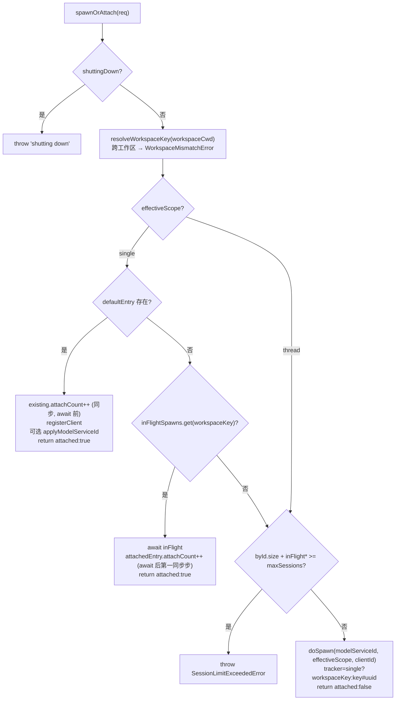
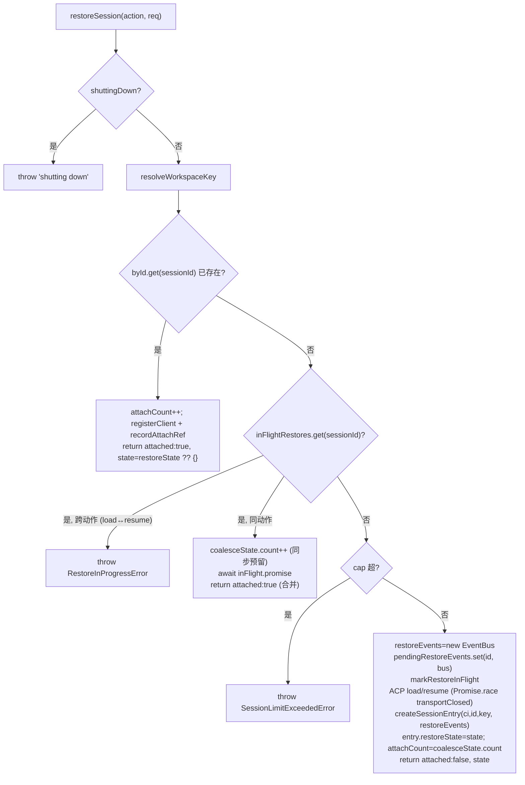
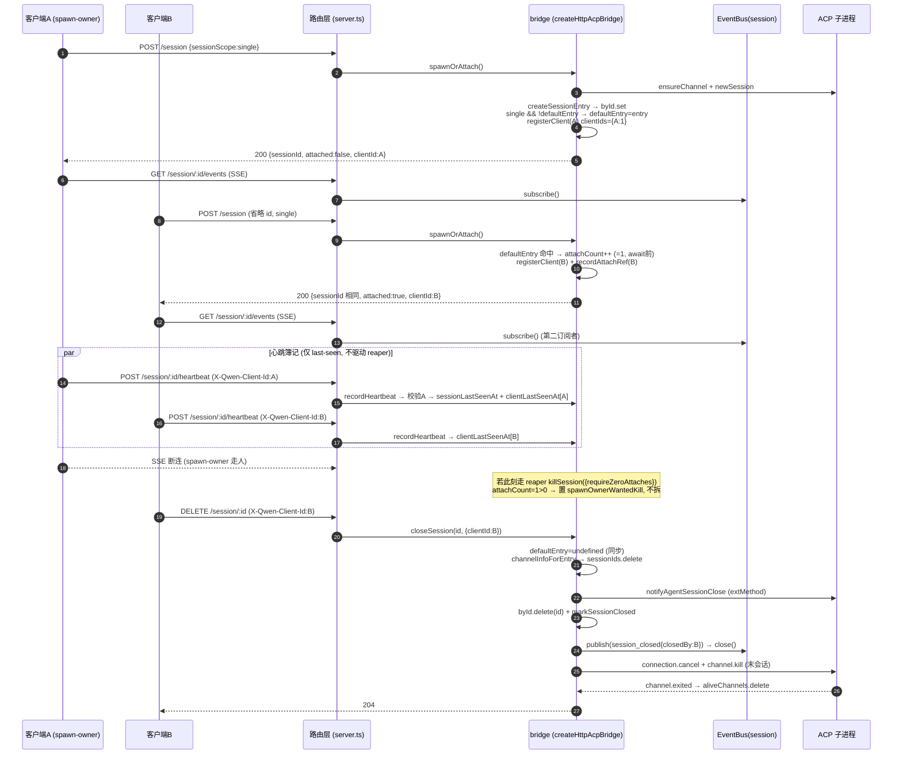

# 会话生命周期（深入）

> 子文档：daemon/serve 模式总览见 [`README.md`](README.md)（本篇 **取代并深化** 其 §3.3）；同主题其它子文档见 `./README.md`。

---

## 概述

Mode B 把"会话"提升为 daemon 内的一等资源：早期一个 `qwen serve` 进程绑定单一工作区（`boundWorkspace`），内部用一张 `byId: Map<sessionId, SessionEntry>` 登记所有活跃会话，并通过 **ACP core 子进程**（`AcpChannel`）真正承载模型/工具状态。#6394/#6410/#6511 之后，一个 daemon 可以注册多个 isolated workspace runtime：primary workspace 继续承载 legacy default surface，non-primary runtime 先从 sessions-only live 闭环扩展到 workspace-qualified REST/ACP/catalog/export/Voice。本篇覆盖会话的完整生命周期：

- **spawn / attach**：新建 vs 复用，由 `sessionScope`（`single` / `thread`）与 `effectiveScope = req.sessionScope ?? default` 决定（#4209）。
- **引用计数与心跳**：`attachCount`（attach-after-spawn 计数）、`attachRefs`（per-client attach 引用账本）、`clientIds`（per-client refcount）、`recordHeartbeat`（last-seen 簿记，#4235/#7386）。
- **close / detach / delete**：`closeSession` / `killSession` / `detachClient` 的同步删除时序、幂等 `204/404`、attach-ref ledger detach 幂等、terminal-before-bus-close flush（#4240/#7386/#7400）。
- **metadata**：`displayName` 重命名 + `session_metadata_updated` 扇出（#4240）。
- **load / resume**：`session/load`（回放完整历史）vs `session/resume`（不回放），`pendingRestoreEvents` 缓冲、并发 restore 的 coalesce 合并与跨动作 `RestoreInProgressError`（#4222）。
- **archive / unarchive / archived export**：active transcript 位于 `chats/`，archived transcript 位于 `chats/archive/`；archive 是状态转换，不删除 transcript，load/resume archived session 会要求先 unarchive；archived export 可只读 selected trusted workspace 的 archive JSONL，不改变 archive 状态（#6058/#6911）。
- **persisted transcript / recording failure / writer lease**：active transcript 可通过 singular 或 workspace-qualified pager 只读分页；recording durable append 失败后 recorder 会停止并广播 `recording_stopped`，防止继续写出缺 parent 的断链记录；#7166 closed diff 描述完整 single-writer 方案但未合入，#7237 已抽出 ACP/daemon P0a writer fence，#7894 把 lease 放到 restart-required opt-in 后，#7812 补 managed daemon shutdown 下 exact-owned writer locks 的 cooperative release，#7886 再把 transcript timestamp drift 变成 advisory reconciliation，#7975 已隔离 daemon maintenance writer，#7976 已补 certified writer handoff（#6525/#6740/#6743/#7166/#7237/#7894/#7812/#7886/#7975/#7976）。
- **multi-workspace owner-routed legacy session actions**：metadata、recap、BTW、mid-turn、task cancel、goal clear、rewind/shell、continue/language/artifact 等 singular legacy route 先解析 live owner runtime，再调用 owning bridge；URL/响应 shape 保持兼容（#6798/#6826/#6833）。branch/fork/cd 是显式例外，继续 primary-only，secondary owner fail-closed（#7005）。
- **workspace-qualified Voice admission**：legacy 与 workspace-qualified Voice REST/WS 共用进程级 admission coordinator；runtime removal 会把 active Voice lease 计入 busy activity，force removal/shutdown 只 abort 目标 runtime 的 Voice work（#6839）。
- **runtime removal**：removable secondary workspace 被 hot remove 时，会 drain/close 其 session、ACP、memory 和 channel resources，primary/static workspace 不可删除（#6745）。
- **Todo stop guard**：daemon/ACP session 可 opt-in 在自然 stop 且最新可信 top-level Todo 仍未完成时做 bounded automatic continuation；safe/bare/Plan mode 强制关闭，permission/cancel/token/loop protection 仍优先。#7821 把 continuation ordering 收紧为 owner-scoped claim/release state machine，避免与用户输入、workspace relocation、session disposal 或 overlapping prompt 交错（#6945/#7821）。
- **permission prompt cancellation preservation**：ACP permission prompt、Plan unknown shell approval、Stop hook permission 与 background notification 等等待点若被父级 abort，session 终态保持 `cancelled`，并保留已 recovered 的 mid-turn message（#7295）。
- **prompt terminal exactly-once**：每个已返回 202 的 prompt 在 agent settle、queued removal、deadline、close/kill/crash/shutdown 等路径上恰好收到一个 `turn_complete` 或 `turn_error`；deadline 由 bridge admission/dispatch race 拥有（#7400）。
- **prompt terminal follow-up hardening**：running prompt 从 UI-visible list 移除时不立刻丢 pending entry，queued terminal 不污染 session-level turn error/retry 状态，queued deadline 保留 typed `PromptDeadlineExceededError`（#7453）。
- **activeWork idle/restart guard**：#8588 已合入，把 close-on-last-detach、attach rollback、idle reaper 等自动清理门控从仅看 `pendingPromptCount` 扩展到 `entryHasActiveWork()`，覆盖 accepted prompt、background Agent 和 Agent terminal notification；#9042 已合入，继续把 Session-managed background shell running、terminal notification queued 与 parent continuation processing 纳入 bounded `shell` hold；#9134 已合入，让 automatic close 授权拒绝前不破坏 queued work，优先兑现 deferred spawn-owner kill，并在 close/probe in-flight 或 child definitive refusal 时保留 entry 而不是升级 channel kill；显式 close/kill/shutdown 仍强制。
- **conditional-close refusal hold 上限**：#9820 已合入。child 拒绝 automatic close 时 session 仍保留，但 daemon 只采纳不超过 `ACTIVE_WORK_MAX_SESSION_HOLDS=1024` 的 hold 列表；超限响应不遍历、不替换最后一次合法 cache。
- **safe session restore timeout**：#8691 已合入，将 load/resume restore 从 initialize timeout 中拆出专用 deadline；public caller 超时后保留真实 ACP settle/cleanup，不误杀 sibling session，cleanup/settlement 不确定时 quarantine channel 或返回 `acp_channel_unavailable` 并阻止新 session 操作。
- **selective / shape-aware session restore**：#8743 的 docs-only design 已由 #9055 merged runtime PR 承接；cold load/resume 先构建 transcript index，只读取 runtime resume state 与目标 replay projection 所需 records，`historyPageSize` 在 payload read 前决定 recent page；#8933 已合入，要求 restore coalescing 按 `resume/none`、`load/all`、`load/recent(N)` 区分，避免不同 replay 语义互相满足。
- **Conversations runtime foundation**：#8890 已合入，把 Conversations workspace/source helper 从 Live 命名空间迁到 shared `serve/conversations`，用 `ConversationRuntimeManager` one-flight 创建或采用唯一 Conversations runtime；仍不新增 standalone route、capability、SDK/UI 或每会话 ACP child。
- **Conversations runtime boundary**：#9181 已合入，在 #8890 基础上补跨 daemon owner record、ServeAppLifecycle release proof、shutdown activity gate 和 ordinary runtime visibility guard；internal `live-conversation` runtime 只允许既有 Live/owner-routed compatibility path 使用，普通 workspace selector 不 fallback primary。
- **standalone source / identity primitives**：#9341 已合入，在 Conversations runtime boundary 之后补 explicit standalone source classification、case-insensitive session id conflict detection、JSONL integrity-aware metadata read 和 standalone directory identity guard；#9512 已合入 ensure-race、integrity budget 与 Error cause hardening，仍不新增 public standalone route/capability/SDK/UI。
- **standalone PR2B internal core 与 public API**：#9978 已合入 `StandaloneSessionService`，在唯一 Conversations runtime 中提供 create/get/list/load/resume/prompt/continue、确定性 private directory containment、projectless Live task 迁移和 terminal quarantine；#10179 已在其上合入 public standalone route/capability 与 journaled delete。
- **archive race recovery 与 persisted maintenance**：#9513 已合入 exact-spelling active/archive 双副本的 active-first load/resume/transcript/export、delete-both、metadata move、legacy parent、目录消失与单次 catalog lookup；#9626 已合入 delete/archive/unarchive 的 physical maintenance classification、identity revalidation 与 capability-gated conflict repair。
- **restore ask_user_question HITL**：#9665 已合入默认关闭的 serve flag；#9763 已继续加固普通发送 history、replay/re-hang suppress、post-answer notice、snapshot 与 unattended batch persistence，使 load/resume 只在实际会 re-hang 时保留尾部纯 AUQ batch。
- **per-session model restore**：#9687 已合入，在成功 model switch 后追加 last-wins `system/session_model` 记录，cold ACP load/resume 在认证前恢复受 allowlist/runtime-snapshot 约束的 binding；旧 transcript 回退最后 assistant model，普通 replay 与 TUI/CLI resume 不消费该记录。
- **runtime record I/O retryability**：#9362 已合入，把 Conversations runtime owner/discovery record 的 transient `open`/`readFile` 错误保留为 retryable runtime unavailable，只把 `ELOOP`、malformed 或 unsafe record 映射为 compromised，避免一次 EMFILE/EIO 永久锁死 runtime。
- **Live task bridge identity**：#9819 已合入，把 persisted/caller-visible `threadId` 与 canonical `bridgeSessionId` 分离；storage lookup 保留原 spelling，resident bridge lookup、owner resolution、resume、events、prompt dispatch 与 private directory 统一使用 normalized map key。
- **ACP channel transport liveness**：#9976 已合入，在 child private initialize 协商后按 shared channel 做 nonce ping；15 秒健康间隔、10 秒单次 timeout、连续两次按时 timeout 才进入既有 transport-failure teardown，parent timer 延迟清空 streak。
- **current-session scheduled task**：#9838 已合入 durable `cron_create` 对 daemon 顶层普通 session 的显式复用；#10144 已合入 REST binding 前的 empty-session default source persistence。Core prompt context、private ACP caller identity、Serve owner/lifecycle admission、generation rollback 与条件 capability 共同 gate，默认仍创建 dedicated session。
- **ACP process-tree ownership**：#10142 已合入，让标准 ACP spawn 管理整个进程树，使用 bounded process snapshot、TERM→KILL 与 root-exit cleanup；legacy attach 保持 direct-child。
- **new-session initialization deadline**：#10268 已合入，把绝对 deadline 与 AbortSignal 贯穿 child 初始化；旧 child 迟到时由 bridge 做 exact close、requested-ID fencing 与 fresh-admission quarantine。
- **post-commit cleanup ownership**：#10286 已关闭并由 #10300(merged) 取代；主 transcript mutation 前仍用 snapshot/generation fence，提交后以 exact writer lock ownership 约束 sidecar/organization cleanup。
- **persisted session catalog cache + cancellation / live-state**：#8892 已合入 2 秒 process-local single-flight cache；#8954 再把 REST/ACP waiter cancellation 传播到 JSONL、runtime-status、worktree sidecar、project membership 与分页读取，最后一个 waiter 取消才 abort physical scan；#9261 已合入 daemon-local `generation+revision` catalog version 和纯内存 live-state 探针，#9396 已合入 bridge-local session activity `updatedAt` watermark，#9476 已合入 WebShell completion-sequence consumer。
- **continuation admission logs**：#8932 已合入，在 daemon 接受 session continuation 后写低敏 `continuation enqueued` 结构化日志，记录 `sessionId`、生成的 `promptId` 和可选 `clientId`。
- **event epoch / degraded replay**：load/resume 与 SSE replay 的 cursor 从纯数字向 `(eventEpoch,lastEventId)` 演进，compaction snapshot 保留 turn attribution，并在 ingest failure 后暴露 degraded 状态（#7458）。

核心工厂闭包 `createHttpAcpBridge`（`packages/acp-bridge/src/bridge.ts`），HTTP 路由层在 `packages/cli/src/serve/routes/session.ts` 与 `server.ts`。会话的并发安全建立在一个反复出现的不变式上：**所有改写 `byId` / `attachCount` / `attachRefs` / `defaultEntry` 的关键步骤都在 async 函数 `await` 之前的同步前缀里完成**，使得跨微任务边界的竞争（reaper vs attach、close vs spawn）天然原子；prompt 终态则通过 per-prompt latch 把多条异步竞争路径收敛到一个发布点。

---

## 涉及 PR

| PR | Wave/编号 | 子主题 | 一句话 |
| --- | --- | --- | --- |
| [#4209](https://github.com/QwenLM/qwen-code/pull/4209) | Wave 2 PR 5 | per-request `sessionScope` override | `POST /session` 增加 `sessionScope` 字段，引入 `effectiveScope`，修复 mixed-scope 隔离泄漏 |
| [#4214](https://github.com/QwenLM/qwen-code/pull/4214) | — | session 路由整理 | 会话路由/校验配套 |
| [#4235](https://github.com/QwenLM/qwen-code/pull/4235) | Wave 2.5 PR 9 | client heartbeat | `POST /session/:id/heartbeat`、`recordHeartbeat` / `getHeartbeatState`、per-client last-seen |
| [#4240](https://github.com/QwenLM/qwen-code/pull/4240) | Wave 2.5 PR 11 | metadata + close/delete | `closeSession` / `detachClient` / `updateSessionMetadata`、`DELETE` / `/sessions/delete` / `PATCH metadata` |
| [#4222](https://github.com/QwenLM/qwen-code/pull/4222) | — | session load/resume | `loadSession` / `resumeSession` / `restoreSession`、`pendingRestoreEvents`、`RestoreInProgressError` |
| [#6058](https://github.com/QwenLM/qwen-code/pull/6058) | merged | session archive | active/archive JSONL 状态、archive/unarchive REST+ACP vendor methods、`SessionArchiveCoordinator` 并发门控、SDK helpers |
| [#6305](https://github.com/QwenLM/qwen-code/pull/6305) | merged | session organization | project sidecar `session-organization.v1.json`、group CRUD、session pin/group、organized list view、ACP/SDK/Web Shell 接线 |
| [#6309](https://github.com/QwenLM/qwen-code/pull/6309) | merged | batch load replay | daemon REST load 可请求 response-mode replay，bridge seed snapshot 且不把历史帧逐条推入 live fanout/ring |
| [#6416](https://github.com/QwenLM/qwen-code/pull/6416) | merged | env/admission guardrail | runtime-local env snapshot 与 daemon-wide `--max-total-sessions` fresh-session admission |
| [#6482](https://github.com/QwenLM/qwen-code/pull/6482) | merged | bounded replay snapshot | `/load` 只承诺 byte-capped live replay window，旧窗口裁剪时前置 `history_truncated` |
| [#6511](https://github.com/QwenLM/qwen-code/pull/6511) | merged | multi-workspace live routing | 多 workspace sessions-only runtime，live session route 先 resolve owner runtime |
| [#6525](https://github.com/QwenLM/qwen-code/pull/6525) | merged | cursor-paged transcript | `GET /session/:id/transcript` 按 frozen active JSONL snapshot 分页返回 id-less replay frames |
| [#6540](https://github.com/QwenLM/qwen-code/pull/6540) | merged | owner index / restore expansion | registry-owned session owner index，trusted non-primary load/resume 与 `session_workspace_conflict` |
| [#6558](https://github.com/QwenLM/qwen-code/pull/6558) | merged | non-primary persisted listing | trusted non-primary workspace session list 合并 active persisted sessions 与 live summaries |
| [#6567](https://github.com/QwenLM/qwen-code/pull/6567) | merged | workspace-qualified REST sessions | `/workspaces/:workspace/...` core REST 与 workspace-qualified session organization/list/archive/delete routes |
| [#6631](https://github.com/QwenLM/qwen-code/pull/6631) | merged | non-primary archived/organized listing | trusted non-primary workspace session list 支持 archived、organized 与 group filter |
| [#6717](https://github.com/QwenLM/qwen-code/pull/6717) | merged | untrusted read-only catalog | untrusted secondary workspace 可读 persisted-only sessions/session-groups，不 merge live、不启动 ACP |
| [#6724](https://github.com/QwenLM/qwen-code/pull/6724) | merged | workspace-scoped organization mutation | trusted secondary workspace 支持 `PATCH /workspaces/:workspace/session/:id/organization` |
| [#6740](https://github.com/QwenLM/qwen-code/pull/6740) | merged | workspace persisted transcript reader | `GET /workspaces/:workspace/session/:id/transcript` 只读分页 selected workspace active JSONL |
| [#6743](https://github.com/QwenLM/qwen-code/pull/6743) | merged | recording failure stop | durable append 失败后停止 recorder，阻止缺 parent 的后续记录，并广播 `recording_stopped` |
| [#6745](https://github.com/QwenLM/qwen-code/pull/6745) | merged | runtime workspace removal | removable secondary runtime hot removal，drain sessions/ACP/memory/channel |
| [#6769](https://github.com/QwenLM/qwen-code/pull/6769) | merged | workspace transcript byte bounds | workspace transcript route 增加 source/response/cursor byte budgets |
| [#6798](https://github.com/QwenLM/qwen-code/pull/6798) | merged | legacy action owner routing | metadata、recap、BTW、mid-turn、task cancel、goal clear 按 live owner runtime dispatch |
| [#6826](https://github.com/QwenLM/qwen-code/pull/6826) | merged | rewind/shell owner routing | rewind snapshots、rewind、shell 按 live owner runtime dispatch，SDK rewind 强制 REST |
| [#6833](https://github.com/QwenLM/qwen-code/pull/6833) | merged | continue/language/artifact owner routing | continue、language、artifact add/delete 按 owning runtime dispatch |
| [#6839](https://github.com/QwenLM/qwen-code/pull/6839) | merged | workspace-qualified Voice admission | selected runtime Voice settings/transcribe/stream 与 process-level Voice capacity/drain/removal activity |
| [#6911](https://github.com/QwenLM/qwen-code/pull/6911) | merged | workspace archived session export | selected trusted workspace archived JSONL full export，不 unarchive、不 fallback primary |
| [#6912](https://github.com/QwenLM/qwen-code/pull/6912) | merged | Web Shell non-primary archive hardening | UI row identity 改为 `(workspaceCwd, sessionId)`，secondary archive/unarchive 按 owning workspace reconcile |
| [#6945](https://github.com/QwenLM/qwen-code/pull/6945) | merged | daemon Todo stop guard | 成功 top-level Todo write 后自然 stop 可 bounded continuation，最多两次 automatic primary-model stream |
| [#7005](https://github.com/QwenLM/qwen-code/pull/7005) | merged | primary-only live-session guard | branch/fork/cd 明确只支持 primary live session；secondary owner 返回 `non_primary_session_route_not_supported`，不调用 bridge |
| [#7166](https://github.com/QwenLM/qwen-code/pull/7166) | closed | session writer lease | closed 未合入完整方案：同一 persisted session 只允许一个 runtime 作为 writer，JSONL append 带 owner token/长度 fencing，live conflict 返回 `session_writer_conflict` |
| [#7237](https://github.com/QwenLM/qwen-code/pull/7237) | merged | ACP/daemon writer fence P0a | 从 #7166 抽出可独立落地的 writer lease 防线：atomic hard-link owner、owner reload tail、append fencing、live owner reuse、close drain 与稳定错误面 |
| [#7295](https://github.com/QwenLM/qwen-code/pull/7295) | merged | permission cancel stopReason | 权限等待/Stop hook/background notification 被 parent abort 时报告 `cancelled`，并用 `preserveFallbackOnAbort` 保留 recovered mid-turn message |
| [#7386](https://github.com/QwenLM/qwen-code/pull/7386) | merged | detach attach-ref ledger | `attachRefs` 记录 per-client attach 引用，`detachClient` 只有释放真实 ref 才扣 `attachCount`，重复/未知/匿名/owner detach 幂等 |
| [#7400](https://github.com/QwenLM/qwen-code/pull/7400) | merged | prompt terminal exactly-once | 每个 202 accepted prompt 经 per-prompt latch 恰好发布一个 terminal；deadline 进 bridge race，teardown 关 bus 前 flush active+queued prompt terminal |
| [#7453](https://github.com/QwenLM/qwen-code/pull/7453) | merged | prompt-terminal follow-up hardening | running prompt hidden-but-retained until settle/teardown；queued terminal 只发事件、不改 session turn state；queued deadline 传播 typed deadline error |
| [#7458](https://github.com/QwenLM/qwen-code/pull/7458) | merged | event epoch / degraded replay | load/resume/SSE 下发 `eventEpoch`，compaction replay 保留 prompt/originator attribution 并暴露 degraded snapshot |
| [#7812](https://github.com/QwenLM/qwen-code/pull/7812) | merged | managed writer shutdown | daemon shutdown 时同步关闭 admission、drain accepted transcript work、retire exact-owned writer locks，并统一 ACP child SIGTERM/SIGKILL/reap timeline |
| [#7821](https://github.com/QwenLM/qwen-code/pull/7821) | merged | Todo Stop Guard continuation hardening | 用 owner-scoped claim/release 协议固定 Guard continuation ordering，失败恢复保留用户内容和成功 function responses |
| [#7894](https://github.com/QwenLM/qwen-code/pull/7894) | merged | session writer lease opt-in | 新增 restart-required `experimental.sessionWriterLease`，ACP/daemon 且 boolean true 时才启用 lease，并由 ACP bootstrap snapshot gate |
| [#7886](https://github.com/QwenLM/qwen-code/pull/7886) | merged | transcript timestamp drift tolerance | 将 transcript timestamps 降为 advisory，timestamp-only drift 走 SHA-256 full reconciliation，identity/owner/tail 等硬状态仍 fail-closed |
| [#7975](https://github.com/QwenLM/qwen-code/pull/7975) | merged | daemon maintenance writer isolation | 让 archive/delete/unarchive/scheduled cleanup/ACP orphan cleanup 在 selected runtime storage 内执行，并在 transcript mutation 前获取 daemon writer lease |
| [#7976](https://github.com/QwenLM/qwen-code/pull/7976) | merged | certified writer handoff | 引入 v2 sealed lock proof 与 fixed claim，让 managed replacement 只在验证 transcript digest/metadata 后接手 writer |
| [#4334](https://github.com/QwenLM/qwen-code/pull/4334) | acp-bridge F1 | channelInfo 修复 #4325 | `closeSession` / `killSession` 改用 `channelInfoForEntry(entry)` 而非模块级 `channelInfo`，修复 channel-overlap 误杀 |
| [#4751](https://github.com/QwenLM/qwen-code/pull/4751) | merged | — | ACP 子进程生命周期优化：跳过 `relaunchAppInChildProcess` 冗余 grandchild spawn（直传 `--max-old-space-size`+cgroup 感知）；daemon 启动时 `bridge.preheat()` 预热 ACP child（首 session 延迟降 0-0.5s）；新增 `--channel-idle-timeout-ms` 使 ACP child 在末 session 关闭后保活避免冷启 |
| [#4765](https://github.com/QwenLM/qwen-code/pull/4765) | merged | compaction 修复 | `TurnBoundaryCompactionEngine` 双路径 merge：subagent chunks 按 `(kind, parentToolCallId)` 索引、top-level 按连续同 kind；tool call eviction 保留段边界 |
| [#4812](https://github.com/QwenLM/qwen-code/pull/4812) | merged | session branching | `POST /session/:id/branch`：fork 活跃 session 的 JSONL transcript → restore 为新 session；409 prompt 活跃中、session 上限拒绝；失败自动清理孤儿 |
| [#8588](https://github.com/QwenLM/qwen-code/pull/8588) | merged | activeWork deep health / lifecycle gate | ACP child 上报 active-work transition + 15s heartbeat；bridge 用 `entryHasActiveWork()` 防自动 detach/idle reap 过早清理仍有后台 Agent 或 terminal notification 的 session |
| [#8691](https://github.com/QwenLM/qwen-code/pull/8691) | merged | safe session restore timeout | restore 专用 deadline、public timeout 与 real settlement 分离、late result exactly-once cleanup、cleanup 不确定时 quarantine channel |
| [#8743](https://github.com/QwenLM/qwen-code/pull/8743) | closed by #9055 | selective session restore design | docs-only 设计 selective restore projection、runtime/replay uuid 分离、recent/all/none replay 与 413/fallback/partial 失败语义；runtime 实现由 #9055 承接 |
| [#8890](https://github.com/QwenLM/qwen-code/pull/8890) | merged | Conversations runtime foundation | 抽出 shared Conversations runtime manager，让 Live 与未来 standalone/projectless sessions 共用唯一 Conversations runtime，当前不新增 standalone API |
| [#8892](https://github.com/QwenLM/qwen-code/pull/8892) | merged | persisted session catalog cache | 2 秒 process-local single-flight cache 复用 persisted JSONL/worktree sidecar catalog；mutation 在响应前 invalidate 对应 active/archive catalog |
| [#8954](https://github.com/QwenLM/qwen-code/pull/8954) | merged | session list cancellation | waiter-aware cancellation：单个 REST/ACP caller 取消不 abort shared scan，最后 waiter 取消才中止 physical load，并向 JSONL/runtime/worktree/pagination 传播 signal |
| [#8932](https://github.com/QwenLM/qwen-code/pull/8932) | merged | continuation admission logs | accepted continuation 写低敏 `continuation enqueued` 结构化日志，只含 `sessionId`、`promptId` 和可选 `clientId` |
| [#8933](https://github.com/QwenLM/qwen-code/pull/8933) | merged | restore request shape-aware coalescing | 按 target + `resume/none` / `load/all` / `load/recent(N)` 区分 coalescing，避免不同 replay 语义互相复用 |
| [#9042](https://github.com/QwenLM/qwen-code/pull/9042) | merged | background shell activeWork hold | 将 Session-managed background shell running、terminal notification queued 和 parent continuation processing 纳入 bounded `shell` activeWork hold |
| [#9134](https://github.com/QwenLM/qwen-code/pull/9134) | merged | active-work close authorization | `onlyIfUnheld` close 先做非破坏性授权，拒绝时不取消 queued work，并让 deferred spawn-owner kill 在 close/probe in-flight 与 definitive refusal 下保持 sibling-safe |
| [#9055](https://github.com/QwenLM/qwen-code/pull/9055) | merged | selective session restore runtime | cold restore 构建一次 transcript index，只读取 runtime state 与请求 replay projection 所需 records，并在发布前检查 32 MiB/10,000 updates replay 上限 |
| [#9181](https://github.com/QwenLM/qwen-code/pull/9181) | merged | Conversations runtime boundary | 增加 owner record、lifecycle release proof、activity gate、ordinary resolver hiding 和 Live compatibility path 精确分流 |
| [#9261](https://github.com/QwenLM/qwen-code/pull/9261) | merged | workspace session live-state endpoint | trusted-only memory-only route 返回 live session volatile snapshot 与 daemon-local catalog version，暴露新 version 前失效 active/archived persisted catalog cache |
| [#9341](https://github.com/QwenLM/qwen-code/pull/9341) | merged | standalone conversation isolation primitives | explicit standalone source、loadable metadata reader、session id case conflict、JSONL integrity 与 standalone directory identity guard；不开放 standalone API |
| [#9362](https://github.com/QwenLM/qwen-code/pull/9362) | merged | transient runtime record I/O retryability | Conversations runtime owner/discovery record 的 transient `open`/`readFile` 错误保持 retryable，只有 symlink/malformed/unsafe state 才永久 compromised |
| [#9396](https://github.com/QwenLM/qwen-code/pull/9396) | merged | live-state activity watermark | 在 existing live-state v1 response 下新增 optional `updatedAt`，普通 turn activity 不推进 catalog version |
| [#9476](https://github.com/QwenLM/qwen-code/pull/9476) | merged | WebShell activity timestamp consumer | WebShell 只用 completion 后启动的 live-state response settle turn completion，并用可吸收 `updatedAt` 重排已加载 active page |
| [#9512](https://github.com/QwenLM/qwen-code/pull/9512) | merged | standalone primitive hardening | ensure race 后重新 inspection、integrity-aware reader 物理行预算和 native Error cause 语义 |
| [#9513](https://github.com/QwenLM/qwen-code/pull/9513) | merged | archive race recovery | exact-spelling 双副本 active-first load/resume/transcript/export、delete-both、metadata/parent/directory race 与单次 lookup |
| [#9626](https://github.com/QwenLM/qwen-code/pull/9626) | merged | persisted maintenance | empty/malformed/orphan owned regular transcript 的 lifecycle maintenance、identity fencing 与 capability-gated conflict repair |
| [#9665](https://github.com/QwenLM/qwen-code/pull/9665) | merged | restore ask_user_question HITL | 默认关闭的 serve flag 在 load/resume 后重新挂起尾部纯 AUQ batch，不做 boot-time auto-resume |
| [#9687](https://github.com/QwenLM/qwen-code/pull/9687) | merged | per-session model restore | last-wins system projection、legacy assistant fallback、registry/runtime validation 与 rewind rebinding |
| [#9763](https://github.com/QwenLM/qwen-code/pull/9763) | merged | restore ask_user_question hardening | 普通发送合法化、replay/finalize 锁步、notice/snapshot 与 unattended batch persistence 修复 |
| [#9819](https://github.com/QwenLM/qwen-code/pull/9819) | merged | Live task bridge session identity | persisted spelling 与 canonical bridge key 分离，复用 resident entry 并对 owner ambiguity fail closed |
| [#9820](https://github.com/QwenLM/qwen-code/pull/9820) | merged | bounded conditional-close refusal holds | 只采纳最多 1024 条 hold，超限拒绝仍保留 session 和最后合法 cache |
| [#9838](https://github.com/QwenLM/qwen-code/pull/9838) | merged | current-session scheduled task | durable task 显式绑定当前普通 session，受 prompt/owner/source/binding/generation gate 约束 |
| [#9976](https://github.com/QwenLM/qwen-code/pull/9976) | merged | ACP channel transport liveness | 协商式 shared-channel nonce probe；双按时 timeout 才 teardown，local parent delay 不累计 failure |
| [#9978](https://github.com/QwenLM/qwen-code/pull/9978) | merged | standalone session PR2B internal core | fail-closed service、canonical persisted owner、private directory containment、projectless Live task 迁移与 terminal quarantine；该 PR 无 public standalone API |
| [#10142](https://github.com/QwenLM/qwen-code/pull/10142) | merged | ACP process-tree reaping | 标准 ACP spawn 的 tree ownership、bounded snapshot、TERM→KILL、root-exit cleanup 与 SIGHUP lifecycle |
| [#10144](https://github.com/QwenLM/qwen-code/pull/10144) | merged | empty-session persistence | existing-session task commit 前写入不可见 default source anchor，保证重启可恢复 |
| [#10179](https://github.com/QwenLM/qwen-code/pull/10179) | merged | standalone public daemon API | 条件 capability、public route family、exact owner admission 与 journaled delete recovery |
| [#10268](https://github.com/QwenLM/qwen-code/pull/10268) | merged | new-session initialization deadline | child-side cancellation、迟到 exact close、ID fence 与 channel-scoped fresh-admission quarantine |
| [#10286](https://github.com/QwenLM/qwen-code/pull/10286) | closed | cleanup ownership 前身 | 关闭前方案以 writer lease 保护 post-commit cleanup，未接入 merged standalone lifecycle，由 #10300 取代 |
| [#10300](https://github.com/QwenLM/qwen-code/pull/10300) | merged | post-commit cleanup ownership | descriptor/path inode + raw lock owner 校验，并接入普通与 standalone lifecycle/recovery |

---

## 2026-08-12 follow-up：Conversations runtime、catalog cache/cancellation、continuation logs 与 restore shape fencing

#8890 已合入 PR0 Conversations runtime foundation。它把 Conversations workspace/source helper 从 Live 专属路径抽到 `serve/conversations`，用 `ConversationRuntimeManager` one-flight 创建、采用并重新校验唯一 Conversations runtime；Live Voice 只作为事务式安装 bridge handler 的 adapter。该 PR 仍不新增 standalone route、capability、SDK/UI、virtual workspace 或每会话 ACP child。

#8892 已合入 session list 的 persisted catalog cache。缓存 scope 是 resolved runtime root、workspace identity 与 active/archive state；缓存值只覆盖 JSONL summaries 与 worktree sidecar。#8954 在该缓存上追加 waiter-aware cancellation：单个 waiter abort 只取消自己的 promise，最后一个 waiter 取消才 abort physical scan；signal 继续传播到 JSONL、runtime-status、worktree sidecar、project membership、numeric pagination 与 trusted-secondary preflight。

#8932 已合入 continuation admission observability。daemon route 在 continuation accepted 后输出 `continuation enqueued`，payload 只包含 `sessionId`、生成的 `promptId` 和可选 `clientId`；`accepted:false` 和 mapped error 不写该日志，避免把失败 admission 误认为已排队。开发者文档同步要求独立 controller 使用不同稳定 client ID。

#8933 已合入 restore request shape-aware coalescing。`resume/none`、`load/all` 与 `load/recent(N)` 不再只靠 target session/workspace 合并；非等价 restore 需要串行、冲突或被 lifecycle cancel fence 隔离。这是 #8939 same-session refresh 事务候选的前置不变量。

## 2026-08-14 follow-up：background shell activeWork、close authorization 与 selective restore runtime

#9042 已合入，在 #8588 activeWork 基础上增加 `shell` 类别。Session 本地 collector 发现任意已登记 background shell 仍 running、shell terminal notification 已排队，或 notification 正在驱动父 continuation 时返回 bounded hold；wire 仍只暴露聚合类别，详细 shell 状态保留在 task/status surface。coverage partial 的 session 不参与普通 automatic cleanup，避免在子进程尚不支持 shell hold 时误判为空闲。

#9134 已合入，继续修复 #9042 后的 close authorization。`onlyIfUnheld` close 会先非破坏性检查已有 hold；没有 hold 时在 close gate 下等待 running turn 自然 settle 后再复查，只有仍无 hold 才取消 pending prompt 和 teardown。daemon 按实际 outer wait 计算 child drain budget，并在 final attacher detach 后只在没有 close/authorization in-flight 时执行 deferred spawn-owner kill；child 返回 definitive close refusal 时复位 entry 并等待下一轮 settle/retry，不 SIGTERM 同 channel sibling sessions。

#9055 已合入 #8743 的 runtime 实现。cold restore 先用 single pass 构建 transcript index，再按 `SessionRuntimeResumeState` 与 `SessionRestoreReplayPage` 的 union 读取 records；explicit `historyPageSize` 在 payload read 前选 recent page，返回 pagination metadata。实现保留 compressed/legacy model history、record ancestry、interrupted turns、FileHistory、artifacts、Goals/checkpoint evidence、attribution、telemetry、usage、source metadata 和 background notification active-chain 语义，并在发布前检查 replay 32 MiB / 10,000 updates 上限。

## 2026-08-15 follow-up：Conversations hidden runtime boundary

#9181 已合入，在 #8890 foundation 上补足 runtime boundary。`ConversationRuntimeOwnership` 以 real home 下的 owner record、lock、O_NOFOLLOW、single-link regular file、owner-only permission、schema 和 nonce 校验保证同一 OS user 只有一个 Conversations runtime owner；dead-owner reclaim 需要 handoff grace，malformed/unsafe record 映射为 compromised 而不是覆盖。

Serve 侧通过 `ServeAppLifecycle` 把 ownership 绑定到实际 listener/app/host 生命周期：listener 绑定与 startup ready 之前不开放 boot admission，shutdown 后 seal admission、等待 listener close、app/host/bridge/child drain，再释放 exact owner record。`ConversationRuntimeActivityGate` 让 shutdown 期间的内部 operation 参与 drain 证明，并对新 operation 返回 `daemon_draining`。

普通 workspace runtime resolver 默认过滤 `provenance === "live-conversation"`，只有既有 Live catalog、owner-routed session 与少量 compatibility path 使用专门 resolver；查找失败、歧义或未持有 owner 时 fail closed，不 fallback primary。

## 2026-08-16 follow-up：workspace session live-state endpoint

#9261 已合入，目标是把高频 volatile status polling 从 persisted session catalog 路径中拆出来。实现新增 selected-runtime/trusted-only `GET /workspaces/:workspace/sessions/live-state`，只从 bridge 内存返回 live sessions 的 `clientCount`、`hasActivePrompt`、permission/user-question wait flags，并附带 daemon-local catalog version；不读取 JSONL、organization、worktree sidecar、settings、commands 或 ACP child。

catalog version 由 `generation` 与 `revision` 组成，只支持整对 equality compare。revision 覆盖 live entry 注册/移除、display name、worktree summary、persisted branch/fork commit、archive/delete/organization/group 等 membership/static metadata mutation；普通 prompt/transcript activity 不递增。route 在首次或变更后暴露新 version 前先失效 active/archived persisted catalog cache，客户端通过 `live A -> full catalog -> live B` 验证 bundle 没被 mutation race 污染。

## 2026-08-17 follow-up：standalone source/identity primitives 与 runtime record I/O retryability

#9341 已合入 standalone 会话隔离的 PR2A primitives。`serve/conversations/session-source.ts` 增加 reserved `sourceType: "standalone"`、`readLoadableConversationSession()`、`readLoadableLiveConversationMetadata()` 与 explicit standalone / legacy projectless / Live source 分类；REST `/session` 与 ACP `session/new` 仍拒绝外部传入 reserved standalone source，load/resume 只通过 persisted spelling 和内部 runtime filter 读取，普通入口不能把 explicit standalone 当 legacy session 恢复。`SessionService` 同步增加 case-insensitive id conflict、active/archive location proof 和 integrity-aware metadata read；`jsonl-utils.ts` 区分 complete records 与 truncated/garbage/incomplete lines；`conversation-directory-identity.ts` 与 `conversation-workspace.ts` 校验 standalone directory 是 owner-only、非 symlink、direct child 且 device/inode/realpath 符合预期。

#9512 已合入 PR2A hardening。`ensureStandaloneDirectory()` 在并发创建 race 后重新做完整 identity inspection，并区分 first `created` 与 captured identity 后的 `recreated`；integrity-aware JSONL reader 改按物理非空行计量 fail-closed 前缀，普通 reader 保持 record cap；directory identity error 改用 native Error options 传 cause。

#9513 已合入。请求 spelling 与存储 spelling 完全一致、active+archived 都可读时，REST、daemon ACP、embedded ACP load/resume 与 writer activation 选 active copy；persisted transcript/export 同样 active-first，显式 delete 在 writer lease 下删除两侧。creation metadata 按 active 后 archived 容忍 archive move，legacy parent 交给 storage resolution，identity probe 间目录消失按 already gone，restore 只在锁内做一次 async case-insensitive lookup。异拼写 conflict、archive/unarchive mutation 与跨 workspace ownership 仍 fail-closed；更广的 mixed-case list/organization/scheduled-task/Live-task 扩展不在范围。

#9362 已合入，修复 #9181 owner/discovery record 的故障分类：`conversation-runtime-ownership.ts` 与 `live/discovery.ts` 只把 `ELOOP` open、schema parse/malformed 和 unsafe identity/permission/link state 转成 terminal compromised；普通 `open`/`readFile` I/O 错误（例如 EMFILE/EIO）原样抛出，让上层 acquisition 映射为 retryable `conversation_runtime_unavailable`。回归用例先注入一次 transient fault，再确认下一次 acquire 能 reclaim；`ELOOP` 仍保持 `conversation_runtime_ownership_compromised` 且不可重试。

## 2026-08-18 follow-up：live-state activity watermark

#9396 已合入，在 #9261 live-state route 上补 optional `updatedAt` activity watermark。Bridge 只在 prompt 已到达 `running` 且正式 terminal latch 发布前推进每会话水位；queue-only cancel、admission、streaming、heartbeat、attach/detach 与 permission/user wait 不推进它。`nextActivityTimestamp()` 保证 same-millisecond terminal、clock rollback 或 forward correction 下仍严格单调。

完整 workspace session list 取 live watermark 与 persisted transcript mtime 中较晚的有效时间，避免异步 transcript write 让 row 排序倒退；live-state route 则保持 bridge-local projection。普通 turn activity 不改变 `catalogVersion.generation+revision`，使两秒 live poll 可以更新 recency 而不触发 full catalog reload。

#9476 已合入 WebShell 消费端：turn completion 记录 per-session sequence，只有 completion 之后启动的 live-state response 能 settle；合法 watermark 只更新已加载、cursor-less、active、非 archived 页面中的既有 row，并按 server comparator 重新排序。缺失 watermark、旧 daemon、filter 外 row 或请求失败时，仍回落到 10 秒合并的 full catalog refresh。

## 2026-08-21 follow-up：persisted storage lifecycle 与 AUQ restore

#9626 已合入。最终 30 文件实现收窄为 delete/archive/unarchive maintenance：physical classifier 分离 storage ownership 与 replay readability，在 writer lease、runtime generation 和 identity snapshot 下复核 exact owned regular file。能解析的首条物理记录必须同时包含 string `sessionId`/`cwd`；foreign、mixed ownership、symlink/directory/FIFO、case ambiguity 与无法证明 identity 的候选继续拒绝。archive/unarchive 默认以 HTTP 200 batch `errors` 返回 conflict 且不修改文件；只有 capability-gated `resolveConflicts:true` 才执行 keep-destination repair 并返回 `resolvedConflicts`。repair 不合并 transcript，但会合并保留侧 PR binding，对 usage 去重，并为 worktree/prompt sidecar、scheduled task、organization 和 attachment cleanup 传递 generation commit fence；attachment 通过 tombstone-first 删除避免误删 successor directory。session list、transcript/export、organization 语义扩展、Live/task identity 等广域统一仍不在范围。

#9665 已合入。默认关闭的 `--restore-ask-user-question` 只识别 transcript 尾部全部为结构合法 AUQ calls 的 batch；replay 跳过这些 call 的 orphan finalize，bridge 在无 attached client、无 active prompt/goal continuation 且非 fork 时通过 trusted tracked prompt 重新生成 request id。用户答案继续原 turn；timeout 保留 dangling transcript 供后续恢复，`continueLastTurn` 会 decline 可恢复问题，worktree notice 延迟到 post-answer message。混合 dangling tools、不开 flag 和 daemon boot scan 保持既有行为；v1 不新增 capability tag。

#9763 已合入并修正 #9665 的恢复后不变量。普通用户文本会先为悬空 AUQ 补 functionResponse，避免 provider 收到 `model[functionCall] -> user[text]`；daemon 决定不 re-hang 时通过 private suppress meta 同步关闭 Core preserve 与 replay skip，cold bulk replay 则从 transcript tail 计算 skip ids。restore turn 不插 file-history snapshot，也不提前消费 system/worktree/recovered-agent notice；notice 随 post-answer message 落地后才清空。timeout、session close 或等待中 abort 会让整个 restored batch 的 durable tool results 都跳过，保留可再次恢复的 dangling transcript；用户主动 cancel 仍持久化。

#9687 已合入。model switch 成功后 best-effort 追加不含 credential 的 `system/session_model` 记录；cold daemon ACP load/resume 在认证前读取 last-wins projection，旧 transcript 回退最后 assistant model，再无记录才使用 settings default。registry base URL 必须命中当前配置 allowlist，runtime snapshot 必须仍存在；恢复失败可非致命回退。rewind 重新追加当前 binding，load/resume 不写记录，普通 replay 与 TUI/CLI resume 保持原行为。

## 2026-08-24 follow-up：Live task identity、bounded close refusal 与 current-session scheduled task

#9819 已合入。Live task 对持久化和 wire 继续保留 `threadId` 原 spelling，但把 `normalizeSessionIdForLookup(threadId)` 作为 bridge/runtime key；owner resolution、resident summary、resume、event cursor/subscription、prompt dispatch 和 Conversations private directory 都使用 canonical ID。已有 resident entry 优先复用；mixed-case storage 多解或 storage/live owner 不一致继续 fail closed，避免重复 cold resume 或跨 runtime 误路由。

#9820 已合入。conditional-close refusal 仍是保留 session 的 definitive 结果，但只在 hold 数组长度不超过共享 `ACTIVE_WORK_MAX_SESSION_HOLDS=1024` 时遍历并替换 cache。恰好 1024 条可采纳，1025 条保留上一份合法 cache；这限制了异常 child 对 close/reap 路径的 CPU/内存放大，不改变 public wire、capability、显式 close 或 shutdown。

#9838 已合入。`cron_create{durable:true,sessionMode:'current'}` 从 prompt context 取得精确 active prompt，经 ACP Session/bridge 证明 connection、session、prompt 和 top-level ordinary source，再由 Serve host 复核 owning runtime、pending interaction、parent/source、既有 task binding 与 task limits。成功后持久化 existing-session binding，标记 `sessionOwnedByTask:false`；runtime generation 在 commit 后关闭会回滚 task。旧请求和 capability 缺失保持 dedicated session。

#10144 已合入 REST existing-session binding 的空会话修复：task commit 前通过 private bridge extension 写入隐藏的 default `session_source` anchor，确保重启后 session 可恢复。能力缺失、session 不存在和持久化失败分别稳定映射，generation 在前后复核；task 后续失败时 anchor 可安全保留。

## 2026-08-25 follow-up：channel transport liveness 与 standalone PR2B internal core

#9976 已合入 channel-level transport liveness。`packages/acp-bridge/src/channel-liveness.ts:startChannelLivenessMonitor` 只在 ACP child initialize 确认 private v1 后启动，每个 shared channel 同时只有一条 probe 序列；合法 `{v,nonce}` 响应后等待 15 秒，10 秒按时 timeout 后立即重试，连续第二次按时 timeout 才返回 `acp_channel_liveness_timeout`。`performance.now()` 检测 parent timer 晚到超过 1 秒时清零 streak 并重新计时，避免宿主休眠或 daemon event-loop stall 被错误归因到 child；版本/nonce 不符或 request rejection 则是 terminal protocol error。最终失败进入现有 channel transport-failure path，统一终止 child 并 teardown 其上所有 session，不用某个 session 的 activeWork 代替 channel health。

#9978 已合入。`packages/cli/src/serve/conversations/standalone-session-service.ts:StandaloneSessionService` 在唯一 Conversations runtime 的 activity gate 内提供 create/get/list/load/resume/prompt/continue；top-level 和 child session 都保留 canonical persisted ID 与 explicit `sourceType:'standalone'`，但 child 不进入顶层 list。每次创建先 reserve ID、准备 owner-only/non-symlink/direct-child private directory，再持久化 source 并接纳 initial prompt；load/resume/follow-up 重新验证 pinned device/inode/realpath。projectless Live task 改走同一 service，generic routes 与 Config/permission/cron/workflow guards 在副作用前拒绝 workspace 能力越界。

#10179 最终实现在该 internal core 上增加 `/standalone/sessions` public lifecycle。所有 route 要求 top-level exact standalone owner，不允许 child/Live/project/worktree/ambiguous/foreign owner，也不 fallback primary。delete 用私有 journal 把 transcript unlink 作为 commit point：commit 前恢复 staged directory，commit 后继续 sidecar/attachment/directory cleanup，并通过 `fileCleanupPending` 暴露未完成清理。

#10142 最终实现把标准 ACP child 注册为 process-tree owner。POSIX 用有界 `/bin/ps` snapshot 发现后代 PGID，graceful shutdown 先 TERM 后 KILL，root 退出也回收已知组；同步退出只做一次 snapshot。Windows 使用 taskkill tree，legacy direct `ProcessRegistry.attach(child)` 不自动升级。

若 directory compromise、spawn outcome 不明或 close refusal 使 containment 无法证明，service 会冻结 creation entry 并 quarantine Conversations runtime；已知 standalone owner 继续暴露 unavailable，而不是 fallback primary。#9978 本身没有 `/standalone/*`、`standalone_sessions_v1` 或 SDK/WebUI；public route 已由 #10179 承接，SDK 已由 #10294 承接。

#10268 已合入，最终让 new-session timeout 约束底层工作，而不只拒绝 wrapper。managed parent 在 private metadata 中发送绝对 deadline，child 把 AbortSignal 传到 Config、Gemini startup 和 `SessionStart` hook，并在发布前拒绝过期 Session。旧 child 若迟到成功，bridge 按精确 ID close；settlement/cleanup 无法证明时只拒绝该 shared channel 的 fresh admission，健康 sibling 保持可用。

#10286 已关闭；替代的 #10300 最终把生命周期 fence 分为两段。transcript mutation 前继续检查 snapshot、runtime generation 与 writer lease；commit 后通过 `assertCleanupOwned()` 逐步核对同一普通 lock 文件的 descriptor/path inode、active owner、raw record 与 acquisition inode，再清理 worktree/PR/prompt-ledger/file-history/organization。standalone 路径额外叠加 selected-runtime assertion，already-active/already-archived 重试也先取得 writer/maintenance lease。ownership 丢失后保留残留并返回 per-session error，而不是跨 owner 清理；由于 transcript commit 不回滚，batch item 可能同时出现在 errors 中，调用方应重试同一权威 lifecycle 操作完成对账。

## 数据结构

### `SessionEntry`（`bridge.ts:218-353`）

每个活跃会话一条，登记在 `byId`（`bridge.ts:809`）。完整字段：

| 字段 | 类型 | 作用 / 锚点 |
| --- | --- | --- |
| `sessionId` | `string` | ACP `newSession`/`loadSession` 返回的 id |
| `workspaceCwd` | `string` | 规范化后的工作区；单 runtime 时恒等于 bridge `boundWorkspace`，multi-runtime 时等于 owning runtime 的 workspace cwd |
| `createdAt` | `string` | ISO8601 创建时间（`createSessionEntry` 里 `new Date().toISOString()`，`bridge.ts:1692`） |
| `displayName?` | `string` | 可变元数据，`updateSessionMetadata` 写入（`bridge.ts:222`） |
| `channel` / `connection` | `AcpChannel` / `ClientSideConnection` | 指向承载本会话的 ACP 子进程通道（多会话复用同一 channel） |
| `events` | `EventBus` | per-session SSE 总线，驱动 `GET /session/:id/events`（`bridge.ts:226`） |
| `promptQueue` | `Promise<void>` | per-session prompt FIFO 串行化尾指针（`bridge.ts:234`） |
| `pendingPromptCount` | `number` | 已被 admission 接受但尚未完全 settle 的 prompt 数；覆盖 active + queued，用于 max-pending、close-on-last-detach 与 idle reaper 门控（#7400） |
| `pendingAgentNotificationCount` / `childActiveWork` | `number` / `boolean` | #8588 新增：bridge 侧跟踪 Agent terminal notification 受理/处理窗口与 ACP child 上报的 background Agent active 状态，和 `pendingPromptCount` 一起组成 `entryHasActiveWork()` |
| `childActiveWorkSeq` / `childActiveWorkAt` / `activeWorkDeadline` | `number` / `number\|null` / `Timeout?` | #8588 的 child active-work heartbeat 状态：只接受 owning channel 的单调 seq；active 期间 45s 缺预期上报会回收 owning channel，session teardown 时清 timer |
| `pendingPromptList` | `PendingPromptEntry[]` | 记录每个 accepted prompt 的 `promptId`、文本摘要、originator、queued/running 状态、abort controller 与 `terminalPublished` latch（#7400） |
| `modelChangeQueue` / `approvalModeQueue` | `Promise<void>` | model-switch / approval-mode 的 FIFO，防并发 roundtrip 竞态（`bridge.ts:242/262`） |
| `transportClosedReject?` | `Promise<never>` | 懒建的 "transport 已关" 竞速 promise，单 listener 不变式（`bridge.ts:270` / `getTransportClosedReject:1484`） |
| `pendingPermissionIds` | `Set<string>` | 本会话待裁决 permission 的快速 cap-check 索引（真相在 mediator）（`bridge.ts:277`） |
| `clientIds` | `Map<string, number>` | **per-client 引用计数表**：daemon 签发的 clientId → refcount（`bridge.ts:283`） |
| `activePromptOriginatorClientId?` | `string` | 当前活跃 prompt 的发起者，inline update / permission 继承（`bridge.ts:289`） |
| `cancelBroadcast?` | `boolean` | per-prompt "已广播 `prompt_cancelled`" 去重 latch（`bridge.ts:302`） |
| **`attachCount`** | `number` | **attach-after-spawn 计数**：`spawnOrAttach`/restore 返回 `attached:true` 的次数；reaper 据此判断是否拆除（`bridge.ts:316`） |
| **`attachRefs`** | `Map<string, number>` | per-clientId attach 引用账本；只有真实贡献 `attachCount` 的 attach/restore waiter 记录，`detachClient` 释放成功后才允许扣 `attachCount`（#7386） |
| **`spawnOwnerWantedKill`** | `boolean` | BkwQP tombstone：spawn-owner 想 reap 但因 `attachCount>0` 被迫 bail 时置位，later `detachClient` 归零时补完拆除（`bridge.ts:329`） |
| `restoreState?` | `BridgeSessionState` | `session/load`/`resume` 时捕获的 ACP state，供后到的 attacher 拿到同一 payload（`bridge.ts:337`） |
| `sessionLastSeenAt?` | `number` | 跨任意 client 的最近心跳（epoch ms）（`bridge.ts:345`） |
| `clientLastSeenAt` | `Map<string, number>` | per-clientId 最近心跳（仅可信 clientId）（`bridge.ts:352`） |

> **`attachCount` vs `clientCount` 的区别（关键）**：`attachCount` 只统计 "spawn 之后又来 attach" 的次数；`clientIds.size`（在 `BridgeSessionSummary.clientCount` 报出）统计 **所有** 注册过的 clientId——包含 spawn-owner 自己（`doSpawn` 也调 `registerClient`）。所以一个 spawn-owner 独占的会话：`clientCount==1` 而 `attachCount==0`。`clientIds` 的值是 refcount：同一 clientId 多次 echo 会 `+1`，`unregisterClient` 时 `-1`，归零才删（连同 `clientLastSeenAt`）。#7386 后，`attachRefs` 是 `attachCount` 的账本：owner clientId 存在于 `clientIds`，但没有 attach ref，因此 owner detach 不会偷减别人的 `attachCount`。

### `ChannelInfo`（`bridge.ts:~150-216`）

承载 N 个会话的 ACP 子进程通道句柄。生命周期关键字段：

- `sessionIds: Set<string>`（`:175`）—— 复用本 channel 的活跃会话；降到空时 channel 被 `kill`。
- `pendingRestoreIds: Set<string>`（`:181`）—— 正在 restore、尚未注册进 `sessionIds` 的 id；防止 restore 半途 channel 被误杀。
- `isDying: boolean`（`:215`）—— **必须在任何 teardown 路径 `await channel.kill()` 之前同步置 `true`**。`ensureChannel` 把 dying channel 视为不存在并 spawn 新的；5 个置位点（init 失败、late-shutdown、doSpawn newSession 失败、killSession last-session、shutdown 批量）。

### 模块级状态（`createHttpAcpBridge` 闭包内）

| 变量 | 锚点 | 作用 |
| --- | --- | --- |
| `byId` | `bridge.ts:809` | `Map<sessionId, SessionEntry>`，`sessionCount` getter 返回其 `size`（`bridge.ts:2020`） |
| `defaultEntry` | `bridge.ts:774` | `single` scope 的**唯一 attach 目标**：第一个在 `single` 下 spawn 的会话；`thread` 会话绝不占据 |
| `channelInfo` | `bridge.ts:789` | 当前 **attach-available** 的 channel；仅 `channel.exited` handler 清空 |
| `aliveChannels` | `bridge.ts:804` | OS 级 "仍存活" 的 channel 超集（含 dying 未 reaped），`killAllSync` 据此 SIGKILL |
| `inFlightSpawns` | `bridge.ts:888` | `Map<key, Promise<BridgeSession>>`，single scope 用 workspaceKey 做 coalesce key，thread 用 `key#uuid` |
| `inFlightRestores` | `bridge.ts:909` | `Map<sessionId, InFlightRestore>`，含 `action`/`promise`/`coalesceState`（`:890-903`） |
| `pendingRestoreEvents` | `bridge.ts:913` | `Map<sessionId, EventBus>`：restore 期间临时 bus，承接 `session/load` 的回放帧，settle 后并入正式 entry |

### session writer lease（#7166 closed / #7237 P0a merged）

PR #7166 closed diff 把“谁能写 active transcript”从隐含进程约定提升为显式 lease，但该完整方案未合入 main。创建、restore、resume、fork、worktree restore 与 ACP session 启动都会为 `(runtimeBase, sessionId)` 获取一个 writer owner；owner 记录包含 `ownerId`、`pid`、`hostname` 与时间戳，落在 runtime output 目录的侧车文件里。当前进程可回收本机 stale owner，但遇到外部主机仍持有 lease 时不会自动抢占，避免共享目录或远端 workspace 下出现 split-brain 写入。

写入路径使用 owner token 与文件长度做 fencing：append 前确认当前 owner 仍匹配、JSONL 长度没有被外部改写；一旦 owner 丢失、lease 被替换或 transcript 字节边界变化，recorder 进入 integrity failure，不再继续写入缺 parent 或乱序记录。session transition 也保持旧 recorder/lease 到 commit 点后再切换，防止 load/resume/fork 中途把旧 session 的 writer 提前释放。

live admission 对已有 owner fail-closed。daemon/ACP 路由在打开 persisted session 前先解析 writer 状态；若另一个 live runtime 已持有该 session，返回结构化 `session_writer_conflict`，并通过 status/runtime API 暴露 owner 信息，供 Web Shell、SDK、scheduled task keepalive 和 IDE 端提示用户切换或关闭旧 runtime，而不是在新 runtime 里继续追加。

PR #7237 是从 #7166 抽出的 P0a 防线，重点保护 ACP/daemon 最容易产生双写的路径。它把 writer owner 改成 atomic hard-link lease，owner 获取后重新读取 authoritative transcript tail；每次 append 同时校验 owner token、文件 identity、metadata 与预期 UTF-8 byte length。daemon 在已有 live owner 时复用 owner session，而不是新建 fresh session 抢写；prompt、cron、notification、teammate turns 都先过 ownership gate。

关闭路径同样被收紧：session close 需要等待 active turn settle 并确认 close acknowledged 后才释放 lease，避免 close/teardown 与迟到 append 交叉。runtime/persistence root 在 cwd 变化时保持 pinned，ACP/HTTP writer errors 稳定、低敏且可被客户端识别为冲突或 writer-lost，而不是泛化 500。

PR #7894 先把 writer lease 放到 restart-required `experimental.sessionWriterLease` opt-in 后面，默认关闭；只有 ACP/daemon path 且设置为 boolean `true` 才启用 lease。ACP 在 bootstrap config 时 snapshot effective gate，并在该 ACP 进程服务的所有 session 中复用，避免 per-session reload 把同一进程变成混合 writer。

PR #7812 把该边界扩展到 daemon-managed ACP child shutdown。shutdown 首个信号到来后，session/turn admission 同步关闭，已接受 transcript work drain，exact-owned writer locks 原子 retire；SessionEnd hooks 与 resource cleanup 等 writer phase settle 后再执行。daemon-scoped process registry 跟踪 primary、secondary、dynamic runtime 的 ACP children，先 SIGTERM，5 秒后 SIGKILL，10 秒内要求 raw process reap；managed acquisition 不再凭 hostname、age 或 container-visible PID 抢 existing owner，standalone ACP 才保留 local stale-owner recovery。

PR #7886 将 transcript `birthtime`、`ctime`、`mtime` 降为 advisory。writer acquisition 建立 streaming SHA-256 baseline，普通 append 增量推进 digest；timestamp-only drift 触发 full-content reconciliation，带 pre/post handle/path 与 exact-owner 校验，最多重试 3 次。file identity、length、owner/group、link count、tail validity、symlink/non-regular 等硬状态仍 fail-closed。

PR #7975 把 writer lease 约束扩展到 daemon session maintenance。archive、unarchive、delete、disconnect rollback、scheduled task rollback、keepalive late-spawn cleanup 与 ACP orphan cleanup 都必须在 selected runtime 的 storage/session service 中执行，并在写 transcript 前获取 daemon writer lease。shutdown 会 seal maintenance admission、等待已准入维护 lease，再把 REST/ACP 错误稳定映射成 `daemon_draining`。

PR #7976 为 managed replacement 增加 certified handoff。旧 writer 在 durable drain 后可把 active lock seal 成带 transcript path、length、SHA-256 digest 与旧 owner diagnostics 的 v2 proof；新 writer 只有在 fixed claim 文件保护下重新验证 sealed primary、descriptor/path/metadata、length 与 digest 后，才把 lock 转成 active。未 sealed active lock、proof mismatch、symlink/truncate 或竞争失败都 fail closed。

### heartbeat 结果/状态类型（`bridgeTypes.ts`）

- `BridgeHeartbeatResult { sessionId, clientId?, lastSeenAt }`（`bridgeTypes.ts:131-135`）：`recordHeartbeat` 返回值。
- `BridgeHeartbeatState { sessionLastSeenAt?, clientLastSeenAt: ReadonlyMap }`（`bridgeTypes.ts:144-147`）：`getHeartbeatState` 只读快照。

---

## spawn/attach 与 sessionScope

入口 `bridge.spawnOrAttach(req: BridgeSpawnRequest)`（`bridge.ts:2040`），由 `POST /session`（`server.ts:1321`）调用。`BridgeSpawnRequest` 字段：`workspaceCwd` / `modelServiceId?` / `clientId?` / `sessionScope?`（`bridgeTypes.ts:34-51`）。

### `effectiveScope` 决策

```
effectiveScope = req.sessionScope ?? defaultSessionScope     // bridge.ts:2073
defaultSessionScope = opts.sessionScope ?? 'single'          // bridge.ts:644
```

- 非法 `req.sessionScope`（非 `'single'|'thread'`）→ 抛 `InvalidSessionScopeError`（`bridge.ts:2066-2072`，类定义 `bridgeErrors.ts:104`）。路由层先在边界校验返回 `400 invalid_session_scope`（`server.ts:1387-1398`），bridge 二次校验防直接调用者绕过；两层最终都映射成同一 `400 invalid_session_scope` JSON（`server.ts:3853`）。
- 客户端应先 pre-flight `/capabilities.features` 的 `session_scope_override`；老 daemon 忽略该字段、回落 daemon-wide 默认。

### `single` scope：attach 到 `defaultEntry`


```mermaid
flowchart TD
    A["spawnOrAttach(req)"] --> S{"shuttingDown?"}
    S -->|是| SD["throw 'shutting down'"]
    S -->|否| WK["resolveWorkspaceKey(workspaceCwd)<br/>跨工作区 → WorkspaceMismatchError"]
    WK --> SC{"effectiveScope?"}
    SC -->|single| DE{"defaultEntry 存在?"}
    DE -->|是| ATT["existing.attachCount++ (同步, await 前)<br/>registerClient<br/>可选 applyModelServiceId<br/>return attached:true"]
    DE -->|否| IF{"inFlightSpawns.get(workspaceKey)?"}
    IF -->|是| CO["await inFlight<br/>attachedEntry.attachCount++ (await 后第一同步步)<br/>return attached:true"]
    IF -->|否| CAP
    SC -->|thread| CAP{"byId.size + inFlight* >= maxSessions?"}
    CAP -->|是| LE["throw SessionLimitExceededError"]
    CAP -->|否| DS["doSpawn(modelServiceId, effectiveScope, clientId)<br/>tracker=single?workspaceKey:key#uuid<br/>return attached:false"]
```

要点：

- **attach 计数在 `await` 之前**：`existing.attachCount++` 与对应 `recordAttachRef(existing, clientId)` 在任何后续 `await` 之前同步完成，保证与 reaper 的 `killSession({requireZeroAttaches})` 同步前缀检查原子对齐。coalesce 分支里也要求 `attachedEntry.attachCount++` / `recordAttachRef()` 是 `await inFlight` 之后的第一组同步动作——若先做 model-switch await 会重开 BRSCi 竞态。
- **coalesce 后实体可能已死**（BX9_U，`bridge.ts:2157`）：`await inFlight` 解析后 `byId.get(session.sessionId)` 若返回 `undefined`（channel 在 spawn 中崩了），抛带提示的 `SessionNotFoundError` 让调用者重试一次全新 spawn，而非返回一个立刻 404 的 id。
- attach 时若带了不同 `modelServiceId`，发 `applyModelServiceId`（经 `model_switched`/`model_switch_failed` 事件广播），失败被 swallow——不能因一个 client 要了未知模型就 500 掉共享会话（`bridge.ts:2105-2119`）。

### `doSpawn` 与 `defaultEntry` 占据（`bridge.ts:1235-1355`）

1. `ensureChannel()` get-or-create daemon 唯一 channel（coalesce 经 `inFlightChannelSpawn`，`bridge.ts:994`）。
2. `connection.newSession({ cwd: boundWorkspace, mcpServers: [] })`（per-request `mcpServers` 不透传，daemon-wide MCP 走 agent settings）。
3. newSession 失败且该 channel 还没有任何会话（`sessionIds.size===0`）→ 同步 `ci.isDying=true` + kill（BkwQA，`bridge.ts:1281-1292`），否则空 channel 会以 `channelInfo` 身份残留、对 `sessionCount`/`maxSessions` 不可见，且重复失败永远找到这个脏 channel。
4. `createSessionEntry`（`bridge.ts:1683`）：`ci.sessionIds.add` + `byId.set` + `drainEarlyEvents`。
5. **`single && !defaultEntry` → `defaultEntry = entry`**（`bridge.ts:1316`）。

> **隔离泄漏修复（#4209）**：`thread` scope 的会话**绝不**赋给 `defaultEntry`（`bridge.ts:1309-1316` 的注释明确："a thread-scope spawn must never become the attach target"）。否则后续省略 scope（或 daemon 默认 `single`）的调用会以 `attached:true` 误 attach 到一个本应隔离的线程会话。测试 `thread-scope first call does NOT pollute the single-scope attach slot`（`bridge.test.ts:1525`）+ 反向 `single-first does NOT trap a later thread call`（`:1566`）双向锁定该不变式。

### 跨工作区拒绝（`resolveWorkspaceKey`，`bridge.ts:1495-1509`）

```
workspaceKey = (workspaceCwd === boundWorkspace) ? boundWorkspace : canonicalizeWorkspace(workspaceCwd)
if (workspaceKey !== boundWorkspace) throw new WorkspaceMismatchError(boundWorkspace, workspaceKey)
```

- 快路径：客户端 pre-flight `caps.workspaceCwd` 后回传同串 → 省一次 `realpathSync.native` 系统调用；非规范别名（`/work/./bound`、大小写、符号链接）才落 `canonicalizeWorkspace`。
- `WorkspaceMismatchError`（`bridgeErrors.ts:141`）构造时把 `requested` 截断到 `MAX_WORKSPACE_PATH_LENGTH`(4096)，防 10MB cwd body 经 `.message` 双重回显放大。路由映射 `400 workspace_mismatch` 并在 body 带 `boundWorkspace`/`requestedWorkspace` 供 orchestrator 路由到正确 daemon（`server.ts:3811-3851`，stderr 行用 `JSON.stringify` 防 log injection）。
- multi-runtime daemon 下，路由层会先用 `WorkspaceRegistry` 精确解析 `cwd` 到 owning runtime；只有已选中的 bridge 仍执行上面的 boundWorkspace 二次守卫。unknown cwd 仍返回 `workspace_mismatch`，registered but untrusted non-primary cwd 返回 `untrusted_workspace`。

### cap 强制（`maxSessions`）

- 解析：`opts.maxSessions` undefined→`DEFAULT_MAX_SESSIONS=20`（`bridge.ts:616`）；`0`/`Infinity`→无限；`NaN`/负→boot 抛 `TypeError`（fail-CLOSED，配置笔误宁可不启动也不放开唯一资源闸，`bridge.ts:654-671`）。
- 检查（`bridge.ts:2183-2188` / restore 路径 `:1827-1832`）：
  ```
  if (byId.size + inFlightSpawns.size + inFlightRestores.size >= maxSessions) throw new SessionLimitExceededError(maxSessions)
  ```
  把 **in-flight spawn/restore 一并计入**（一个即将注册但还没进 `byId` 的 spawn 也应占额）。
- **attach 不计入 cap**：`single` 下复用 `defaultEntry` / coalesce 分支在 cap 检查**之前**就 return 了——只有真正 spawn 新 child 才被 gate。`thread` override 也不能绕过 cap（测试 `per-request thread overrides cannot bypass the cap`，`bridge.test.ts:7441`）。
- 路由映射 `503 + Retry-After:5 + code:session_limit_exceeded`（`server.ts:3874-3886`）。

---

## 引用计数与心跳

### client 注册表、attach 总数与 attach-ref 账本

1. **`clientIds: Map<clientId, refcount>`**（per-client 注册表）
   - `registerClient(entry, requestedClientId?)`（`bridge.ts:917`）：已知 clientId → refcount+1 并回显；未知/缺省 → 签发新 `client_<uuid>` 置 1。**未知 id 在 create/attach 时被静默换成新 id**（`BridgeSpawnRequest.clientId` 文档语义）。
   - `unregisterClient`（`bridge.ts:933`）：refcount-1，归零则删 clientId + 删 `clientLastSeenAt`（防长寿 daemon 在 churn 下累积 stale 心跳）。
   - `resolveTrustedClientId(entry, clientId?)`（`bridge.ts:951`）：缺省返回 `undefined`；clientId 不在 `entry.clientIds` → 抛 `InvalidClientIdError`（`bridgeErrors.ts:170` → `400 invalid_client_id`）。所有状态改写路由（prompt/cancel/close/heartbeat/metadata）都用它校验 `X-Qwen-Client-Id`，使 originator 元数据始终 daemon-stamped 而非 caller-asserted。

2. **`attachCount`**（attach-after-spawn 计数，reaper 专用）
   - `++`：`single` attach、coalesce attach、restore existing/raced/coalesce 等返回 `attached:true` 或预折叠 attach reservation 的路径。
   - `--`：只允许在 `detachClient` / `rollbackAttachRegistration` 释放到真实 attach-ref 后发生；不能再被重复/未知/匿名/owner detach 直接扣减（#7386）。

3. **`attachRefs: Map<clientId, count>`**（`attachCount` 的 per-client 账本）
   - `recordAttachRef(entry, clientId)`：只在“该 clientId 对 `attachCount` 有贡献”的站点调用；owner-style 注册不记录。
   - `releaseAttachRef(entry, clientId)`：只有 ledger ref 存在时返回 true，调用方才能扣 `attachCount`。
   - 同一个 clientId 多次 echo attach 会把 refcount 累加，detach 逐份释放；这与 `clientIds` refcount 独立，但二者都使用 daemon 签发/回显的 clientId。

### `recordHeartbeat`（`bridge.ts:2856-2876`，#4235）

```js
recordHeartbeat(sessionId, context) {
  const entry = byId.get(sessionId);
  if (!entry) throw new SessionNotFoundError(sessionId);
  const clientId = resolveTrustedClientId(entry, context?.clientId);  // 先校验
  const lastSeenAt = Date.now();
  entry.sessionLastSeenAt = lastSeenAt;                                // 后写
  if (clientId !== undefined) entry.clientLastSeenAt.set(clientId, lastSeenAt);
  return { sessionId, ...(clientId ? { clientId } : {}), lastSeenAt };
}
```

- **clientId 校验在任何 timestamp 写之前**：否则持有有效 bearer 的攻击者可用随机 id 刷心跳、掩盖真实 client 缺席（`bridge.ts:2859-2864`）。
- **无 TOCTOU（因全同步）**：`recordHeartbeat` 是同步函数，校验→写两步在同一微任务内完成，无 `await` 让别的请求插入，故 "校验通过后 entry 被并发删除" 的窗口不存在。
- 匿名心跳（无 `X-Qwen-Client-Id`）仍 bump `sessionLastSeenAt`，但不写 per-client 表。
- 路由 `POST /session/:id/heartbeat`（`server.ts:1742`，`mutate()` 非 strict）→ `200 BridgeHeartbeatResult`；未知 session→404，未注册 clientId→`400 invalid_client_id`。
- `getHeartbeatState(sessionId)`（`bridge.ts:2878`）返回**快照副本**（`new Map(entry.clientLastSeenAt)`）防外部改写 live map；未知 session 返回 `undefined`。

> **当前心跳数据是诊断性的，不驱动主动 reaper**。`SessionEntry.sessionLastSeenAt` 注释（`bridge.ts:341`）明确其 "consumed by future diagnostics (PR 12) and revocation policy (PR 24)"；server.ts 里没有读 last-seen 的 `setInterval` 拆除逻辑（仅有的 `setInterval` 是 SSE 15s keepalive `:2839` 与 `--writer-idle-timeout-ms` 写侧 idle 守卫 `:2881`，均与 attach reaping 无关）。

### 实际的断连 reaper（基于 `attachCount` + tombstone）

真正的会话拆除由 **SSE/HTTP 断连** 触发，不是心跳。三条路径协同：

1. **spawn 窗口断连**（`server.ts:1436-1470`）：`POST /session` 在 `spawnOrAttach` 返回后用 `res.writable` 检测客户端是否还在（`res.writable` 是 "ServerResponse 仍可发送" 的正确信号；`req.aborted` 只在请求体接收期为真、`req.destroyed` 又太急）。若断连：
   - `!session.attached`（我们刚 spawn 了新 child）→ `bridge.killSession(id, { requireZeroAttaches: true })`。
   - `session.attached`（attach 到既有会话）→ `bridge.detachClient(id, clientId)` 回滚 fictitious 计数。
2. **`killSession({requireZeroAttaches:true})` 的 BQ9tV 守卫**（`bridge.ts:4263-4266`）：若 `attachCount>0`（spawn 窗口内已有别人 attach），**不拆**，置 `spawnOwnerWantedKill=true` tombstone 后 return。
3. **`detachClient` 的 BkwQP 补完拆除**：先按 `clientId` 释放 `attachRefs`，只有释放成功才减 `attachCount`；随后无条件 `unregisterClient`，保持注册清理幂等。仅当 `spawnOwnerWantedKill && attachCount===0 && events.subscriberCount===0` 时才补调 `killSession` 完成延迟拆除。若所有 client 和 subscriber 都已离开，但仍有 active/queued prompt（`pendingPromptCount>0`），不会立即 close，而是等待 prompt terminal 广播后由 deferred close 补完；#8588 将这条自动清理门控扩展到 `entryHasActiveWork()`，使 background Agent 和 Agent terminal notification 未 settle 时同样不自动 close/kill。

restore 路径（`POST /session/:id/load|resume`）镜像同一 `res.writable` 清理（`server.ts:1519-1533`）。

---

## close / delete 生命周期

四个端点（#4240）：

| 端点 | bridge 方法 | 锚点 | 语义 |
| --- | --- | --- | --- |
| `DELETE /session/:id` | `closeSession` | `server.ts:1820` / `bridge.ts:2660` | 显式关闭单会话（即便有别人 attach 也强关）；不计入 cap |
| `POST /session/:id/detach` | `detachClient` | `routes/session.ts` / `bridge.ts` | 释放该 clientId 持有的 attach ref，重复/未知/匿名/owner detach 不偷减 `attachCount` |
| `POST /sessions/delete` | `closeSession`×N + `SessionService.removeSessions` | `server.ts:1838` | 批量（≤100，去重，`Promise.allSettled`），同时删磁盘 transcript |
| （内部/reaper） | `killSession` | `bridge.ts:4247` | tear-down child + 发 `session_died`；带 `requireZeroAttaches` 选项 |

### `closeSession` 时序

核心时序：

1. `byId.get` 缺失 → 抛 `SessionNotFoundError`（→404）。
2. `resolveTrustedClientId`（校验 `X-Qwen-Client-Id`）。
3. 标记 `entry.closing = true`，解析 `channelInfoForEntry(entry)`；关闭通知失败时，definitive ACP error 让 close 仍可重试，未知 transport outcome 则 kill channel 让 lease/entry 进入 channel-exit 清理。
4. agent close ack 后才清 `defaultEntry`、从 `ci.sessionIds` 删除、清 active prompt counter、`byId.delete(sessionId)` 并 tombstone 该 sessionId。
5. **`flushPromptTerminals(entry, 'session_closed', ...)` 先于 `session_closed` 和 `entry.events.close()`**：active 与 queued prompt 都会收到一个 `turn_error`，然后才看到 session lifecycle terminal。
6. `session_closed` 事件发布后关闭 bus；末会话且无 pending restore 时再进入 channel idle/reap。

> **`closeSession` 与 `killSession` 的删除时序差异（值得注意）**：`killSession` 仍把 `byId.delete(sessionId)` 放在 await 前的同步前缀；`closeSession` 为了等待 agent-owned state / writer lease 被 close ack 后释放，仍在 `notifyAgentSessionClose` 之后才删 `byId`。#7400 不改变这个差异，但要求删可见性后、关 bus 前必须先 flush prompt terminals，防止 accepted prompt 的结局被 `events.close()` 吞掉。

### `channelInfoForEntry` 修复（#4334 / #4325）

`closeSession`/`killSession` 都用 `channelInfoForEntry(entry)`（`bridge.ts:1516-1524`）解析 channel——**先比模块级 `channelInfo`，不匹配再遍历 `aliveChannels` 找 `info.channel === entry.channel`**——而不是直接用模块级 `channelInfo`（当前 attach 目标）。两者在 channel-overlap 窗口（A 正在死、B 刚 spawn 成新 `channelInfo`）会分叉：用 `channelInfo` 会（1）跳过 `A.sessionIds.delete`（因 `B.channel !== entry.channel`）使 A 的 set 残留，（2）在 **B** 的 client 上 `markSessionClosed` 而非 A，用过时 session count 评估 B 的 kill 条件。`closeSession`/`killSession` 都标注了 `HAZARD(#4325)`：回归测试是单 channel smoke，不会因还原成 `channelInfo` 而失败——靠 code-review 守住。

### 幂等 204 / 404 与 SDK 吸收

- 路由 `DELETE /session/:id`（`server.ts:1820-1836`）：成功 `204`；`closeSession` 抛 `SessionNotFoundError` → `sendBridgeError` → `404`（`server.ts:3798`）。
- **SDK 吸收 404**：`DaemonClient.closeSession`（`packages/sdk-typescript/src/daemon/DaemonClient.ts:1748`）把 `204`（已关）与 `404`（已没了）**都视为成功** return（"daemon treats DELETE as idempotent for SDK callers"），其余状态才 `failOnError`。
- 批量 `/sessions/delete`：单个 `closeSession` 抛 `SessionNotFoundError` 时仍把该 id 计入 `closedIds` 去删磁盘 transcript（`server.ts:1873-1876`），返回 `{removed, notFound, errors}`。

### `killSession` 与 `detachClient`

`killSession` 同步前缀：`requireZeroAttaches` 守卫 → `forgetSession`/`clear` → `defaultEntry` 清 → `byId.delete`（await 前）→ `channelInfoForEntry` + `sessionIds.delete`；await `notifyAgentSessionClose` → `markSessionClosed` → **`flushPromptTerminals(entry, 'session_killed', ...)`** → 发 `session_died{reason:'killed'}`（在 close bus 前发，因为 eager delete 后 channel.exited 的自动 publish 已 `byId.get===undefined` 不会触发）→ `events.close` → 末会话且无 pending restore 才 kill/idle channel。

`detachClient` 见上节 BkwQP 补完拆除。#7386 后它不再把 `attachCount` 当作可无条件递减的全局数，而是先释放 `attachRefs`；#7400 后 last-client close 条件还要求 `pendingPromptCount===0`，否则等待 prompt terminal 广播后的 deferred close。#8588 进一步要求 `!entryHasActiveWork()`，避免主 prompt settle 后仍有 background Agent 或 Agent terminal notification 时被当作空闲拆除。

---

## prompt terminal exactly-once（#7400）

daemon prompt route 是非阻塞 202：一旦 `POST /session/:id/prompt` 返回 `{promptId,lastEventId}`，客户端就以该 `promptId` 等待 SSE `turn_complete` 或 `turn_error`。#7400 把这个等待契约变成 bridge-owned invariant：**每个 accepted prompt 恰好发布一个 formal terminal**。

核心状态：

- `PendingPromptEntry.terminalPublished` 是 per-prompt latch。
- `publishPromptTerminal(entry, pending, terminal)` 是唯一 terminal 发布入口：`complete` → `turn_complete`，`cancelled` → `turn_complete{stopReason:'cancelled'}`，`error` → `turn_error`。
- `flushPromptTerminals(entry, code, message)` 在 close/kill/channel crash/shutdown 中 snapshot `pendingPromptList`，逐个发布 error terminal，再 abort prompt signal，使后续 FIFO residual node 跳过 dispatch。

deadline 也在同一个状态机里。HTTP route 只计算 `effectiveDeadlineMs` 并作为 `BridgeClientRequestContext.deadlineMs` 传给 bridge；bridge 在 admission 点 arm timer，覆盖 queue wait 与 execution。deadline 到期时先发布 `turn_error{code:'prompt_deadline_exceeded'}`，再 `settleActivePromptState()`、reject `deadlinePromise` 释放 FIFO，并 abort pending signal 触发既有 cancel path。迟到的 agent settle、AbortError fallback、teardown flush 都会重新进入 `publishPromptTerminal()`，由 latch 去重。

`removePendingPrompt()` 对 queued prompt 的行为也从“只发 `pending_prompt_completed{state:'removed'}`”改为“两条信号”：队列 UI 仍收到 `pending_prompt_completed{removed}`，等待 prompt result 的消费者还会收到一次 `turn_complete{stopReason:'cancelled'}`。running prompt 继续走 cooperative cancel；如果 cancel、deadline、remove 和 shutdown 竞态重叠，仍只发布一个 terminal。

close-on-last-detach 的门控从 `promptActive` 改成 `pendingPromptCount`。它同时覆盖 active prompt、queued prompt，以及两个 prompt 之间 `promptActive` 短暂为 false 的 FIFO hand-off gap。真正的 deferred close 放在 prompt `result.finally()` 中，并要求 `entry.clientIds.size===0`、`subscriberCount===0`、`pendingPromptCount===0` 且 `byId.get(sessionId)===entry`，保证 terminal 已广播、且迟到 settle 不会关掉同 id 的新 entry。

#8588 把这里的“prompt 已 settle”扩展为“active work 已 settle”。`entryHasActiveWork()` 同时检查 pending prompt、bridge 正在等待/处理的 Agent terminal notification、child-reported background Agent active 状态；child Session 通过 private initialize `_meta` 协商后，在 active transition 和 15s heartbeat 上报单调 seq。daemon 只在 owning channel、session membership 和 seq 都合法时更新状态；45s 缺 expected heartbeat 会回收 owning ACP channel，防 stale activeWork 永久阻塞 idle 判断。

---

## metadata

`updateSessionMetadata(sessionId, metadata, context)`（`bridge.ts:2778-2831`，**同步**方法）。当前仅支持 `displayName`（`SessionMetadataUpdate`，`bridgeTypes.ts:96-98`）：

- 校验：非字符串或超 `MAX_DISPLAY_NAME_LENGTH`(256) → `InvalidSessionMetadataError`（`bridgeErrors.ts:201` → `400 invalid_metadata`）；含控制字符 → 同错（`hasControlCharacter`，`bridge.ts:579`）。
- `metadata.displayName || undefined` 把空串折叠为清除；仅当值真变化才写 + 发 `session_metadata_updated`（envelope 带 `metadataOriginatorClientId`）。
- 路由 `PATCH /session/:id/metadata`（`server.ts:1919-1962`，**注意：未挂 `mutate()`**，仅靠全局 bearer）：先 `.slice(0,256)`，成功后 best-effort `SessionService.renameSession` 落盘（文件不存在时吞错，内存改动仍对本 daemon 生命周期有效）。
- `listWorkspaceSessions`（`bridge.ts:2833`）把 `displayName` 透出到 `BridgeSessionSummary`。


---

## load / resume

两个端点（#4222），共用 `restoreSession(action, req)`（`bridge.ts:1746-2017`）：

| | `loadSession` / `POST /session/:id/load` | `resumeSession` / `POST /session/:id/resume` |
| --- | --- | --- |
| ACP 方法 | `connection.loadSession`（`bridge.ts:1879`） | `connection.unstable_resumeSession`（`bridge.ts:1897`，`unstable_` 因底层 ACP 方法名未定稿） |
| 历史回放 | **回放完整历史**（emit `session_update`） | **不回放** |
| agent 侧 | `createAndStoreSession(config, sessionData?.conversation)` → `session.replayHistory(messages)`（`acpAgent.ts:812-815` / `:3193-3195`） | `createAndStoreSession(config)`（无 conversation）→ 不调 replayHistory（`acpAgent.ts:854`） |

### `restoreSession` 决策与缓冲


```mermaid
flowchart TD
    A["restoreSession(action, req)"] --> SD{"shuttingDown?"}
    SD -->|是| X1["throw 'shutting down'"]
    SD -->|否| WK["resolveWorkspaceKey"]
    WK --> EX{"byId.get(sessionId) 已存在?"}
    EX -->|是| ATT["attachCount++; registerClient + recordAttachRef<br/>return attached:true, state=restoreState ?? {}"]
    EX -->|否| IFR{"inFlightRestores.get(sessionId)?"}
    IFR -->|"是, 跨动作 (load↔resume)"| RIP["throw RestoreInProgressError"]
    IFR -->|"是, 同动作"| CO["coalesceState.count++ (同步预留)<br/>await inFlight.promise<br/>return attached:true (合并)"]
    IFR -->|否| CAP{"cap 超?"}
    CAP -->|是| LE["throw SessionLimitExceededError"]
    CAP -->|否| NEW["restoreEvents=new EventBus<br/>pendingRestoreEvents.set(id, bus)<br/>markRestoreInFlight<br/>ACP load/resume (Promise.race transportClosed)<br/>createSessionEntry(ci,id,key, restoreEvents)<br/>entry.restoreState=state; attachCount=coalesceState.count<br/>return attached:false, state"]
```

关键机制：

- **`pendingRestoreEvents` 缓冲**（`bridge.ts:913`/`:1842`）：`session/load` 会在 ACP 请求返回**之前**就经 `session_update` 通知把历史回放出来。此时正式 `SessionEntry` 还没建，`BridgeClient.sessionUpdate` 用 `entry?.events ?? resolvePendingRestoreEvents(sessionId)`（`bridgeClient.ts:404-405`）把回放帧落进临时 `restoreEvents` bus 的 ring。settle 后 `createSessionEntry(ci, id, key, restoreEvents)`（`bridge.ts:1954`）**把同一个 bus 提升进正式 entry**，于是先连上来的 SSE 订阅者能 replay 到完整历史。
- **跨动作 `RestoreInProgressError`**（`bridge.ts:1782-1788`，类 `bridgeErrors.ts:73`）：`load` 进行中来 `resume`（或反向）必须拒绝——load 正在共享 bus 上回放全量历史，而 `resume` 客户端 seed `lastEventId:0` 会收到每一条回放帧，直接违反 resume 的 "no UI replay" 契约。映射 `409 + Retry-After:5 + restore_in_progress`（`server.ts:3888`，5s 因 restore 可达 `initTimeoutMs`=10s，1s 会把客户端推进 tight loop）。
- **同动作 coalesce**（`bridge.ts:1771-1825`）：同 id 同 action 的并发不报错，走合并——后来者 `coalesceState.count++`（**同步预留**，在 `await inFlight.promise` 之前），让 spawn-owner 的 `requireZeroAttaches` reaper 在新注册 entry 上看到非零 `attachCount` 而跳过 kill。IIFE 在 `createSessionEntry` 时把 `coalesceState.count` 折进 `entry.attachCount`（`bridge.ts:1968`）；失败则回滚 `count--`（`:1800`/`:1808`）。
- **`attachCount` 预留 / raced 分支**：若 ACP 调用期间同 id 已被别的路径注册（`racedEntry`，`bridge.ts:1936`），把 `1 + coalesceState.count` 一次性加到 raced entry 并 attach 返回。
- **restore 不占 `defaultEntry`**（`bridge.ts:1970-1976`）：显式 `load`/`resume` 是 "给我这个 id"，不应成为后续省略-id `single` 调用的隐式 attach 目标。
- **channel 误杀防护**：restore 期间把 id 放进 `ci.pendingRestoreIds`（`bridge.ts:1844`）；`killSession`/`closeSession` 仅在 `sessionIds.size===0 && pendingRestoreIds.size===0` 才 kill channel——避免把正在 restore 的 channel SIGTERM 掉（`bridge.ts:4333` / `:2767`）。
- **tombstone 协同**：`markRestoreInFlight`（`bridgeClient.ts:733`，`bridge.ts:1853`）在 ACP 调用前 allow-list 该 id，使 restore 期间的 guardrail 事件不被 close-window tombstone 丢弃；finally 里 `clearRestoreInFlight` + 若失败 `markSessionClosed` 重新 tombstone（codex round 6/7 修复，`bridge.ts:1985-2008`）。
- **ACP 资源不存在**：`isAcpSessionResourceNotFound`（`bridge.ts:1715`，匹配 JSON-RPC code `-32002` + `uri==='session:<id>'`）→ 转 `SessionNotFoundError`（→404）。agent 侧 `loadSession`/`unstable_resumeSession` 先 `sessionService.sessionExists` 不存在即 `RequestError.resourceNotFound`（`acpAgent.ts:794`/`:841`）。

### 已存在会话的 attach（早返回）

`byId.get(sessionId)` 命中：`attachCount++` + `registerClient` + `recordAttachRef`，返回 `attached:true` 且 `state = existing.restoreState ?? {}`（spawn-only 会话无 restoreState，返回 `{}`）——后到的 attacher 拿到与原 restore 调用者相同的 ACP state。

### 压缩重放（Compacted Session Replay，#4694）


**解法——`TurnBoundaryCompactionEngine`**（`packages/acp-bridge/src/compactionEngine.ts`，310 行）：每个 `EventBus` 创建时注入一个 `CompactionEngine` 实例。engine 以 best-effort 方式 `ingest()` 每一帧（publish 路径 try/catch 隔离，`BX9_p`）。当收到 `turn_complete` / `turn_error` 时执行 turn 级折叠：

- 连续 `agent_message_chunk` / `agent_thought_chunk` 合并为单条（text join）。
- 同 `toolCallId` 的 `tool_call` + `tool_call_update` 序列折叠为最终态单帧。
- `available_commands_update` / `current_mode_update` 等仅保留最新。
- `slow_client_warning` / `client_evicted` / `replay_complete` / `stream_error` 等瞬态信号丢弃。
- 事件间相对类型顺序（text → tool → text 交错）保持不变。

**`snapshot()` 同步调用**，返回 `SessionReplaySnapshot`：

| 字段 | 含义 |
| --- | --- |
| `compactedTurns` | 所有已完成 turn 的压缩帧，O(turns) 量级 |
| `liveJournal` | 当前未完成 turn 的原始帧（mid-stream 刷新可用） |
| `lastEventId` | 高水位 event id，客户端以此为 SSE 初始游标 |

典型 3h 重度会话：~50MB raw → ~2MB compacted（25-30x 压缩）。

**与 ring replay 的关系**：ring 仍服务 SSE 短期追赶（`Last-Event-ID` 重连）；compaction engine 提供**正交的全会话恢复路径**。`restoreSession` 返回新增字段 `compactedReplay` + `liveJournal` + `lastEventId`（`BridgeRestoredSession`，`bridgeTypes.ts`，所有字段 optional 保持向后兼容）；`resume` 只返回 `lastEventId`（不回放）。客户端用 `compactedReplay + liveJournal` 立即还原 transcript，然后以 `lastEventId` 接入 SSE 流获取后续实时帧。

**bounded replay snapshot（#6482）**：`/load` 的 `compactedReplay` 是 live in-memory snapshot，不再承诺全量 transcript。`TurnBoundaryCompactionEngine` 按 completed turn / restore event segment 维护 replay window，并受 `--compacted-replay-max-bytes` 约束；默认 4 MiB，最大 256 MiB。旧 replay 被丢弃时，snapshot 首帧是 id-less `history_truncated` marker，客户端把它渲染为状态提示后继续应用 retained replay，不把它当成 `state_resync_required`。完整 active persisted transcript 不再塞进 `/load`，#6525 通过 `GET /session/:id/transcript` 做 cursor-paged replay：第一页冻结 JSONL snapshot size，后续 cursor 绑定 session、文件身份、snapshot position、leafUuid 与 replay state，并用 workspace project 目录持久 HMAC key 签名；ACP child 只读转换成 id-less `session_update` frames，不 attach client、不 seed EventBus、不改变 live replay window。snapshot 超过 256 MiB 时建索引前结构化拒绝。

**multi-workspace session routing（#6511/#6540/#6558/#6567/#6631/#6717/#6724/#6911/#6912）**：multi-runtime daemon 中，legacy `workspaceCwd` 仍指 primary workspace；显式 `cwd` 创建 session 时通过 `WorkspaceRegistry` 精确解析 runtime，unknown/untrusted 分别返回 `workspace_mismatch` / `untrusted_workspace`。live session 路由（events/prompt/cancel/permission/heartbeat/detach/pending/close/status）先 resolve owner runtime 再触碰 bridge，miss 不 fallback primary，ambiguous fail closed。#6540 把 owner scan 抽成 registry-owned `WorkspaceSessionOwnerIndex`，并让 trusted non-primary workspace 可以显式 load/resume persisted session；跨 runtime 同 id restore/live 冲突返回 `409 session_workspace_conflict`。#6558 让 trusted non-primary session list 在 active recent view 下合并 persisted sessions 与 live summaries。#6567 再把 session organization/list/archive/delete 等 core REST 迁到 `/workspaces/:workspace/...` plural surface，selector 支持 workspace id 和 encoded absolute cwd。#6631 补齐 trusted non-primary archived/organized/grouped list：读取 selected workspace 的 `chats/archive/` 与 organization sidecar，`view=organized&archiveState=archived` 只返回 archived，unknown group id 对齐 primary 返回 `group_not_found`。#6717 给 untrusted secondary 打开 persisted-only catalog：sessions/session-groups 可读，但 `mergeLive:false`，不查询 bridge、不 spawn ACP、不轮询。#6724 给 trusted secondary 补 workspace-scoped organization mutation。#6911 进一步给 selected trusted workspace 增加 archived full export route，只读 archive JSONL 且不 unarchive；#6912 把 Web Shell merged row identity、busy/export/current state 和 archive/unarchive reconcile 全部绑定 `(workspaceCwd, sessionId)`，避免同 id 跨 workspace 混淆。

---

## 时序图

### 图① 多客户端 attach 同一 session + heartbeat + 一方 close


```mermaid
sequenceDiagram
    autonumber
    participant A as 客户端A (spawn-owner)
    participant B as 客户端B
    participant R as 路由层 (server.ts)
    participant D as bridge (createHttpAcpBridge)
    participant Bus as EventBus(session)
    participant Ag as ACP 子进程

    A->>R: POST /session {sessionScope:single}
    R->>D: spawnOrAttach()
    D->>Ag: ensureChannel + newSession
    D->>D: createSessionEntry → byId.set<br/>single && !defaultEntry → defaultEntry=entry<br/>registerClient(A) clientIds={A:1}
    D-->>A: 200 {sessionId, attached:false, clientId:A}
    A->>R: GET /session/:id/events (SSE)
    R->>Bus: subscribe()
    B->>R: POST /session (省略 id, single)
    R->>D: spawnOrAttach()
    D->>D: defaultEntry 命中 → attachCount++ (=1, await前)<br/>registerClient(B) + recordAttachRef(B)
    D-->>B: 200 {sessionId 相同, attached:true, clientId:B}
    B->>R: GET /session/:id/events (SSE)
    R->>Bus: subscribe() (第二订阅者)
    par 心跳簿记 (仅 last-seen, 不驱动 reaper)
        A->>R: POST /session/:id/heartbeat (X-Qwen-Client-Id:A)
        R->>D: recordHeartbeat → 校验A → sessionLastSeenAt + clientLastSeenAt[A]
        B->>R: POST /session/:id/heartbeat (X-Qwen-Client-Id:B)
        R->>D: recordHeartbeat → clientLastSeenAt[B]
    end
    A-->>R: SSE 断连 (spawn-owner 走人)
    Note over D: 若此刻走 reaper killSession({requireZeroAttaches})<br/>attachCount=1>0 → 置 spawnOwnerWantedKill, 不拆
    B->>R: DELETE /session/:id (X-Qwen-Client-Id:B)
    R->>D: closeSession(id, {clientId:B})
    D->>D: defaultEntry=undefined (同步)<br/>channelInfoForEntry → sessionIds.delete
    D->>Ag: notifyAgentSessionClose (extMethod)
    D->>D: byId.delete(id) + markSessionClosed
    D->>Bus: publish(session_closed{closedBy:B}) → close()
    D->>Ag: connection.cancel + channel.kill (末会话)
    Ag-->>D: channel.exited → aliveChannels.delete
    D-->>B: 204
```

### 图② load vs resume 两路径 + 并发 restore 拒绝

```mermaid
sequenceDiagram
    autonumber
    participant L as 客户端L (load)
    participant Rm as 客户端Rm (resume, 并发同id)
    participant D as bridge.restoreSession
    participant PRB as pendingRestoreEvents bus
    participant Ag as ACP 子进程

    L->>D: POST /session/:id/load
    D->>D: byId.get(id) miss; inFlightRestores miss; cap ok
    D->>D: restoreEvents=new EventBus<br/>pendingRestoreEvents.set(id, bus)<br/>markRestoreInFlight(id)<br/>inFlightRestores.set(id,{action:'load',...})
    D->>Ag: connection.loadSession({sessionId, cwd, mcpServers:[]})
    Ag->>Ag: createAndStoreSession(config, conversation)<br/>session.replayHistory(messages)
    Ag-->>PRB: session_update ×N (历史回放, 经 resolvePendingRestoreEvents)
    Rm->>D: POST /session/:id/resume (load 仍在飞)
    D->>D: byId.get miss; inFlightRestores 命中 action='load'≠'resume'
    D-->>Rm: 409 restore_in_progress {activeAction:load, requestedAction:resume}
    Ag-->>D: loadSession 返回 state
    D->>D: createSessionEntry(ci,id,key, restoreEvents) ← bus 提升进 entry<br/>entry.restoreState=state; attachCount=coalesceState.count(0)<br/>finally: clearRestoreInFlight + pendingRestoreEvents.delete
    D-->>L: 200 {attached:false, state}
    Note over Rm: 客户端Rm 收到 409 后退避 5s 重试<br/>此时 load 已完成 → resume 命中 byId → attached:true (不回放)
```

---

## 边界与错误处理

| 竞态 / 边界 | 处理 | 锚点 |
| --- | --- | --- |
| reaper vs 后来者 attach | `attachCount++` + `recordAttachRef()` 在 `await` 前同步；`killSession({requireZeroAttaches})` 的检查也在同步前缀 → 跨微任务原子；`attachCount>0` 时置 `spawnOwnerWantedKill` 延迟拆除 | bridge attach/reaper 同步前缀 |
| 两个客户端都在 spawn 窗口断连（coalesce） | 各自 `detachClient` 只有释放到自己的 attach ref 才扣 `attachCount`；归零 + tombstone + 无订阅者 → `detachClient` 补完 reap，不留孤儿 child | `detachClient` / `releaseAttachRef` |
| 并发双 `DELETE` 同 id | 幂等容忍：`byId.delete` no-op + `publish` try/catch + `events.close` 幂等 + `channel.kill` best-effort；第二次 `byId.get` miss → 404 | `bridge.ts:2728-2775` |
| load 进行中来 resume（或反向） | `RestoreInProgressError` → 409（保护 resume 的 no-replay 契约） | `bridge.ts:1782` |
| 同动作并发 restore | coalesce 合并，`coalesceState.count` 同步预留 + 失败回滚；不重复 ACP 调用 | `bridge.ts:1793-1825` |
| restore 期间 channel 被并发 kill | `pendingRestoreIds` 守卫：`sessionIds` 空但 pendingRestore 非空时不 kill channel | `bridge.ts:4333` / `:2767` |
| channel-overlap（A 死 B 生）误杀 | `channelInfoForEntry(entry)` 按 entry.channel 精确解析，不用模块级 `channelInfo` | `bridge.ts:1516`（#4334/#4325） |
| spawn 中 child 崩，返回 id 立刻 404 | coalesce/restore 后 `byId.get` 再校验，miss 抛带提示的 `SessionNotFoundError` | `bridge.ts:2157` / `:1804` / `:1341`（doSpawn model-switch 后 `Bd1zc` 复检） |
| late `extNotification` 泄漏到下次同 id load | `markSessionClosed` tombstone（60s TTL）+ restore allow-list（`markRestoreInFlight`） | `bridgeClient.ts:458/485` |
| shutdown 期间到达的 `spawnOrAttach`/restore | `shuttingDown` gate 同步拒绝；`ensureChannel`/`doSpawn` 有 late-shutdown 复检；`shutdown()` await in-flight spawn/restore/channel | `bridge.ts:2041/1750/4411` |
| 双 Ctrl+C 在 SIGTERM grace 中 | `killAllSync()` 遍历 `aliveChannels`（含 dying）逐个 `killSync`，不漏 overlap 期的 dying child（BkUyD） | `bridge.ts:4384` |

错误→HTTP 映射（`sendBridgeErrorImpl`，`server.ts:3695`）：`SessionNotFoundError`→404、`InvalidClientIdError`→`400 invalid_client_id`、`WorkspaceMismatchError`→`400 workspace_mismatch`、`InvalidSessionScopeError`→`400 invalid_session_scope`、`InvalidSessionMetadataError`→`400 invalid_metadata`、`SessionLimitExceededError`→`503 +Retry-After session_limit_exceeded`、`RestoreInProgressError`→`409 +Retry-After restore_in_progress`。

---

## 关键设计决策与权衡

1. **同步前缀不变式取代锁**。JS 单线程下，把所有 `byId`/`attachCount`/`defaultEntry`/`isDying` 的关键改写放在 async 函数 `await` 之前的同步段，即可让 "reaper vs attach"、"close vs spawn"、"restore coalesce vs disconnect" 等跨微任务竞争天然原子，无需显式互斥。代价是代码里散布大量 "must run before any await" 注释（BRSCi/BQ9tV/BkwQA…），可读性靠 review 守。

2. **`single` vs `thread` + per-request override**。`single` 服务 "多客户端实时协作同一活跃会话"（webui+CLI 看同一上下文），用 `defaultEntry` 做隐式 attach 目标；`thread` 服务隔离并发会话、绝不占 `defaultEntry`。默认 `single` 与 Mode A "一个工作区一个活跃会话" 直觉一致。#4209 加 per-request override 但严格防 mixed-scope 泄漏（双向测试锁定），代价是 `single` 的 attach/reap 语义复杂（`attachCount`+tombstone+断连 reaper）——这是多客户端共享的本质复杂度。

3. **reaper 基于断连而非心跳**。`attachCount`+`res.writable`+tombstone 这套精确反映 "有没有活客户端写得出响应/连得上 SSE"，而心跳 last-seen 暂留作未来 revocation（PR 24）的诊断输入。好处是拆除决策不依赖心跳频率/时钟漂移；代价是 wedged-but-connected 的僵尸 SSE 仍需 `--writer-idle-timeout-ms` 这条正交守卫兜底。

4. **load/resume 共用 `restoreSession` 但严格区分回放**。两者复用 cap/coalesce/channel 守卫，仅在 ACP 方法与 `conversation` 透传上分叉。跨动作并发硬拒（409）而非合并——因为 load 的全量回放与 resume 的 `lastEventId:0` seed 不兼容。`pendingRestoreEvents` 临时 bus + settle 提升，解决 "回放帧先于 entry 注册到达" 的先有鸡先有蛋问题。

5. **幂等优先于强一致**。`closeSession`/`DELETE` 设计成可重入：`byId.delete` no-op、`events.close` 幂等、SDK 把 404 当成功吸收。这让多 tab/重试/批量删除无需协调；代价是 `closeSession` 的 `byId.delete` 落在 await 之后（与 `killSession` 的 eager delete 不同），靠容忍而非时序排他保证正确。

6. **formal terminal 与 lifecycle terminal 分离**。`turn_complete` / `turn_error` 是 prompt 级终态，`session_closed` / `session_died` 是 session 级终态。#7400 要求 teardown 先 flush prompt terminal 再关 bus，使 SDK/WebUI 可按 `promptId` 结算回合，同时仍能在下一帧看到 session 生命周期结束。

7. **fail-CLOSED 的配置校验**。`maxSessions`/`eventRingSize` 的 `NaN`/负/越界在 boot 抛错而非静默放开（`bridge.ts:654`/`:689`）——一个笔误悄悄禁用唯一资源闸（fail-OPEN）比启动失败更危险。

---

## 已知限制 / 后续

1. **心跳未驱动主动 eviction**。`sessionLastSeenAt`/`clientLastSeenAt` 当前仅供 `getHeartbeatState` 诊断；按其字段注释，per-client 撤销/超时拆除留给 PR 24 revocation policy。长寿 daemon 下心跳数据靠 `unregisterClient` 清理，但没有 "N 秒无心跳即拆会话" 的回收。

2. **`DELETE /session/:id` 与 `PATCH metadata` 未挂 `mutate()`**。其余状态改写路由（heartbeat/detach/cancel/sessions-delete）都过 `mutate()` 闸，唯独单会话 DELETE（`server.ts:1820`）与 metadata PATCH（`server.ts:1919`）仅靠全局 bearer。无 token 的 loopback 开发部署下两者可达——与 Wave 4 写类路由 `mutate({strict:true})` 的姿态不完全一致。

3. **`closeSession` 的 `byId.delete` 在 await 之后**。与 `killSession` 的 eager 同步 delete 不同（见上文时序差异）。当前靠幂等容忍 + 同步清 `defaultEntry` 保证正确，但存在一个窄窗口：`closeSession` 的 `notifyAgentSessionClose` await 期间，并发的显式同 id `loadSession` 仍能 `byId.get` 命中正在关闭的 entry 并 `attachCount++` 返回 `attached:true`，随后该 entry 的 bus 被关闭——attacher 会很快收到 `session_closed`/SSE 关闭。属罕见竞态，未单独加守卫。

4. **`channelInfoForEntry` 修复无确定性回归测试**。#4334/#4325 修复的 channel-overlap 误杀，其回归测试是单 channel smoke（`HAZARD(#4325)` 注释），还原成模块级 `channelInfo` 不会让任何现有测试失败——确定性 overlap 测试需要 factory 内部 hook，列为 deferred follow-up。

5. **deadline 释放 FIFO 但不杀共享 channel**。#7400 后 absolute deadline 会发布 terminal 并释放 session FIFO，避免单个坏 prompt 永久阻塞同会话；但它不会直接 kill ACP channel，因为 channel 可能被其它 session 共享。忽略 `cancel()` 的 agent 仍需要后续 channel-level 回收/隔离策略兜底。

6. **#9513/#9626/#9665/#9687/#9763/#9819/#9820/#9838/#9976/#9978/#10142/#10144/#10179/#10268/#10300 已合入，#10286 已关闭**。ACP process-tree、standalone public API、new-session deadline、persisted maintenance 与 post-commit cleanup ownership 已按 merged diff 记录。#9978 本身没有 public route/capability/SDK/UI，#10179 承接 route/capability，#10294 已承接 SDK。

---

## 测试覆盖

主测试 `packages/acp-bridge/src/bridge.test.ts`（`daemon_mode_b_main`，约 8386 行，#4445 从 serve 侧抬升）。会话生命周期相关用例（按主题）：

- **sessionScope / 隔离泄漏**：`reuses the existing session under sessionScope:single`（`:229`）、`creates fresh session per call under sessionScope:thread`（`:1428`）、`per-request sessionScope:thread overrides daemon-wide single`（`:1456`）/ 反向（`:1492`）、`thread-scope first call does NOT pollute the single-scope attach slot`（`:1525`）、`symmetric mixed-scope leak: single-first does NOT trap a later thread call`（`:1566`）、`rejects an invalid per-request sessionScope`（`:1658`）、`canonicalizes the workspace key`（`:1691`）。
- **cap**：`describe('maxSessions cap')`（`:7411`）、`per-request thread overrides cannot bypass the cap`（`:7441`）、`attach to an existing session under single scope is NOT counted toward the cap`（`:7482`）。
- **attach coalesce**：`describe('concurrent spawn coalescing (single scope)')`（`:4313`）。
- **attach-ref ledger / detach 幂等**：duplicate detach、unknown/anonymous clientId、spawn owner detach、deferred reap、同一 clientId 多次 attach ref-by-ref release（#7386）。
- **heartbeat**：`describe('recordHeartbeat')`（`:680`）。
- **close/kill/detach/metadata**：`describe('closeSession')`（`:7813`）、`describe('updateSessionMetadata')`（`:8010`）、`describe('listWorkspaceSessions')`（`:4709`/ enriched `:8076`）、`publishWorkspaceEvent + knownClientIds`（`:8100`）。
- **prompt terminal exactly-once**：`describe('prompt terminal exactly-once (DAEMON-002/003/004/005)')` 覆盖 queued removal terminal、wedged deadline、queued deadline、close/kill terminal-before-bus-close、last detach draining、cancel/remove/deadline race、channel crash exactly-once（#7400）。
- **activeWork lifecycle gate（#8588 / #9042 / #9134 / #9820）**：#8588 PR diff 覆盖 child active/idle transition、heartbeat timeout、non-owning session/channel/old seq 忽略、last-client-detach 延迟 close、prompt settle cleanup 与 deep-health aggregation；#9042 覆盖 background shell running/terminal notification/parent continuation hold 与 partial coverage cleanup gate；#9134 覆盖 conditional close 不破坏 queued work、共享 drain budget、legacy category child 的 deferred spawn-owner kill、close/probe in-flight guard、definitive close refusal retry 与 quarantine reap；#9820 追加 1024 条 refusal hold 采纳上限和旧 cache 保留。
- **safe restore timeout（#8691 merged）**：PR diff 覆盖空 channel timeout/reap、sibling session survival、same-id fencing/coalescing、late close exactly-once、cleanup quarantine/recovery、capacity retention、transport close 与 hanging request shutdown。
- **selective restore runtime（#9055）**：PR diff 覆盖 full/recent/resume parity fixtures、single index construction、paging/limit、oversized replay bounds、413 sibling survival、pagination metadata、background notification active-chain 和 replay publication cap。
- **Conversations standalone primitives / maintenance / restore state**：#9341/#9512 已合入 source classification、standalone directory identity/ensure hardening、session id admission 与 JSONL integrity；#9513/#9626/#9665/#9687/#9763 已合入 archive race recovery、persisted maintenance/conflict repair、AUQ re-hang/hardening 与 per-session model binding restore。#9978 已合入 internal service、private directory containment、owner routing 与 projectless Live task 迁移；#10179 已合入 public API 与 journaled delete；#10300 已合入 post-commit cleanup ownership。#9362/#9396/#9476 已合入 runtime I/O retry、live-state `updatedAt` 与 WebShell completion settle。
- **managed writer shutdown**：#7812 覆盖 admission close、accepted transcript drain、exact-owned writer lock retirement、partial channel construction/teardown join 与 ACP child SIGTERM/SIGKILL/reap。
- **Todo Stop Guard continuation hardening**：#7821 覆盖 owner claim/release、失败恢复、Stop hook 重跑、workspace relocation、session disposal、overlapping prompt 与 cron queue cap。
- **session writer lease opt-in / timestamp drift / maintenance / handoff**：#7894 覆盖 restart-required opt-in 与 ACP bootstrap gate；#7886 覆盖 timestamp-only drift reconciliation、digest baseline 和 release-aware baseline read；#7975 覆盖 selected runtime maintenance storage、daemon writer lease 与 shutdown draining；#7976 覆盖 sealed lock proof、fixed claim、certified takeover 与 failure-closed races。
- **load/resume/restore**：`loads an existing ACP session...`（`:798`）、`buffers load replay events until the restored session is registered`（`:838`）、`resumes an existing ACP session without calling session/load`（`:899`）、`attaches to an already live session and returns the cached restore state`（`:931`）、`propagates the original ACP state to coalesced restore waiters`（`:973`）、`survives spawn-owner disconnect kill while a coalesced restore is mid-flight`（`:1011`）、`does not kill the channel when the last live session leaves while a restore is pending`（`:1057`）、`does not promote a restored session into the omitted-id attach default`（`:1100`）、`rejects load while a resume for the same session is in flight`（`:1164`）/ 镜像（`:1196`）、`does not kill a shared channel when one of multiple pending restores fails`（`:1231`）、`does not surface an unhandledRejection when the channel exits after a successful restore`（`:1282`）、`shutdown awaits in-flight restores before resolving`（`:1323`）。
- **tombstone/early-events**：`tombstones closed sessionIds so late notifications cannot leak into a future load`（`:6781`）、`purges buffered guardrail events when restore fails so retry-success does not replay stale frames`（`:6876`）。

配套：`bridgeClient.test.ts`（demux/early-events/tombstone）、`HistoryReplayer.test.ts` / `Session.test.ts`（agent 侧回放）、`server.test.ts`（路由层 `res.writable` reaper、状态码映射、`/sessions/delete` 批量，以及 #7400 后 prompt deadline 只透传 `context.deadlineMs`、不 route-side abort signal）。

---

## 各 PR 代码贡献

### #4209 — sessionScope override

- `bridge.ts:spawnOrAttach`：新增 `effectiveScope = req.sessionScope ?? defaultSessionScope` 决策；非法值抛 `InvalidSessionScopeError`。
- `bridge.ts:doSpawn`：`thread` scope 的会话**绝不**赋给 `defaultEntry`，防 mixed-scope 隔离泄漏。
- `bridgeErrors.ts:InvalidSessionScopeError`：类定义 + 路由映射 `400 invalid_session_scope`。
- 双向测试 `bridge.test.ts`：`thread-scope first call does NOT pollute single-scope attach slot` + 反向。

### #4222 — load / resume

- `bridge.ts:restoreSession`：共用入口，按 `action` 分叉到 `connection.loadSession`（回放）/ `connection.unstable_resumeSession`（不回放）。
- `bridge.ts:pendingRestoreEvents`：`Map<sessionId, EventBus>` 临时 bus，承接 ACP 回放帧并在 settle 后提升进正式 entry。
- `bridge.ts:inFlightRestores` / `RestoreInProgressError`：跨动作并发硬拒 409（保护 resume 的 no-replay 契约）；同动作 coalesce 合并（`coalesceState.count` 同步预留）。
- `bridgeClient.ts:markRestoreInFlight` / `markSessionClosed`：tombstone 协同——allow-list restore id + 60s TTL 防 late notification 泄漏。

### #6305 — session organization

- `SessionOrganizationService`：把 groups 和 per-session organization 写入 project-level `session-organization.v1.json` sidecar；group name/color/order 做输入校验，写入走 atomic JSON，并按 store path 串行化读改写。
- `server/session-list.ts`：默认 recent list 不变；`view=organized` 时合并 sidecar snapshot，按 pinned first、group/order 和 session timestamp 排序，再用 opaque cursor 分页。
- `routes/session.ts` / ACP dispatcher / SDK：新增 group CRUD、`PATCH /session/:id/organization` 与对应 vendor methods；URL path 参数优先于 body 中冲突字段。
- Web Shell/WebUI：仅当 capability `session_organization` 存在时启用分组/置顶视图。

### #6309 — response-mode batch load replay

- `bridge.ts` / `bridgeClient.ts`：daemon bridge 可在 load request 中带 Qwen 私有 metadata，要求 ACP child 把 replay updates 放进 response；bridge 解析后 strip 私有字段，对外仍返回标准 ACP result。
- `bridge.ts`：response-mode replay 只 seed 当前 bridge snapshot，不通知 subscribers，也不填充 reconnect ring；随后 ACP session stream 初次 attach 再从 snapshot 发送 replayed `session/update`。
- `acpAgent.ts` / `Session.ts`：默认 ACP load 继续 streamed replay，只有 bridge 明确请求时才走 response-mode，保持 direct ACP client 兼容。

### #6482 — bounded replay snapshot

- `compactionEngine.ts:TurnBoundaryCompactionEngine`：按 replay segment 维护 completed live turn 与 restore replay，超过 `maxReplayBytes` 时丢弃最旧 segment，并保留最新 oversized segment。
- `replayWindowLimits.ts`：集中定义默认 4 MiB、最大 256 MiB 和 `normalizeCompactedReplayMaxBytes()`。
- `bridge.ts:restoreSession/loadSession`：`compactedReplay` / `liveJournal` 返回有界 snapshot；裁剪时首帧为 id-less `history_truncated`。
- SDK/WebUI：`history_truncated` 是 status marker，渲染后继续应用 retained replay，不进入 `awaitingResync`。

### #6511 — multi-workspace live session routing

- `run-qwen-serve.ts`：多个 distinct `--workspace` 注册为 sessions-only runtimes，第一项仍是 primary。
- `workspace-registry.ts`：workspace id/cwd lookup、primary fallback、live session owner resolution。
- `routes/session.ts` / `routes/sse-events.ts` / `routes/permission.ts`：session create、events、prompt、cancel、permission、heartbeat、detach、pending、close、status 按 owner runtime dispatch。
- `routes/capabilities.ts` / `daemon-status.ts`：多 runtime 时 additive 发布 `multi_workspace_sessions`、`workspaces[]` 和 session limits；legacy `workspaceCwd` 保持 primary。
- #7005 之后，branch/fork/cd 不跟随 owner-aware 扩展，而是显式 primary-only live-session route：handler 先解析 owner，若 session 属于 secondary runtime 则返回 `400 non_primary_session_route_not_supported` 并记录 warning，不 fallback primary、不调用 secondary bridge。

### #6525 — cursor-paged transcript replay

- `session-transcript-reader.ts`：冻结 active JSONL snapshot，按 active parent chain 分页，cursor 绑定 session/file/snapshot/position/leafUuid/replay state 并用 workspace project 目录持久 HMAC key 签名；snapshot 超过 256 MiB 时拒绝建索引。
- `acpAgent.ts`：`qwen/status/session/transcript` 只读 status method，把 page records 转 id-less `session_update` replay frames。
- `routes/session.ts`：`GET /session/:id/transcript` 不 attach client、不 seed EventBus、不返回 `lastEventId`；invalid cursor/limit、snapshot unavailable、archive conflict 都有结构化错误。
- `DaemonClient.ts`：新增 `getSessionTranscriptPage(sessionId, { cursor, limit })`。

### #6540 — session owner index / restore expansion

- `workspace-registry.ts`：`WorkspaceSessionOwnerIndex` 先查 index、再用 bridge summary 校验，stale entry 清理后 fallback scan 并回填。
- `bridgeOptions.ts` / `bridge.ts`：bridge lifecycle registered/removed 事件接入 owner index。
- `routes/session.ts`：trusted non-primary load/resume；跨 runtime live/restore 同 id 返回 `session_workspace_conflict`。
- `server/session-list.ts`：`/workspaces/:workspace/sessions` 复数别名；primary 保持 persisted/live merge。

### #6558 — trusted non-primary persisted session listing

- `routes/session.ts`：non-primary workspace session list 先探测 active persisted sessions；有 persisted 数据时走 `listWorkspaceSessionsForResponse()` 合并 live summary，否则保持 live-only fallback。
- `routes/session.ts`：numeric cursor 与 live cursor 不混用，避免分页中途出现 persisted session 后跳页或重复。
- `multi-workspace-sessions.test.ts`：覆盖 workspace id、encoded cwd、persisted/live merge、pagination、unknown/untrusted workspace 和 fallback。

### #6631 — trusted non-primary archived / organized listing

- `routes/session.ts`：trusted non-primary workspace session list 支持 `archiveState=archived`、`view=organized` 和 `group` filter，读取 selected workspace 的 archive 目录与 organization sidecar。
- `routes/session.ts`：`view=organized&archiveState=archived` 不混入 live summary；group filter 不带 organized view 仍返回 `invalid_session_group_filter`。
- `multi-workspace-sessions.test.ts`：覆盖 archived、organized、unknown group `group_not_found` 与 untrusted rejection。

### #6717 — untrusted secondary read-only catalog

- `routes/session.ts`：对 `!primary && !trusted` 的 registered secondary workspace 开放 catalog route，只允许 `GET /workspaces/:workspace/sessions` 与 `GET /workspaces/:workspace/session-groups` 读取 persisted metadata。
- `server/session-list.ts`：`ListWorkspaceSessionsReadOptions.mergeLive=false` 时 active/organized/parent/archive 查询都不合并 `bridge.listWorkspaceSessions()` live summary。
- `debugLogger.ts`：catalog read 通过 `runWithoutDebugLogSession()` 禁止 file-backed debug log side effect。

### #6724 — workspace-scoped session organization mutation

- `routes/session.ts`：新增 `PATCH /workspaces/:workspace/session/:id/organization`，selected runtime 必须 trusted；legacy `PATCH /session/:id/organization` 保持 primary-only。
- `routes/session.ts`：共同 helper 传入 `target.workspaceCwd` 与 `target.bridge`，session existence、live summary 和 group validation 均不 fallback primary。
- `DaemonClient.ts`：`WorkspaceDaemonClient.updateSessionOrganization()` 暴露 selected workspace 的 pin/group/color mutation。

### #6567 — workspace-qualified core REST session routes

- `workspace-route-runtime.ts`：workspace selector 先按 id，再按 portable absolute path canonical cwd 解析；失败返回 typed `workspace_mismatch`，untrusted runtime 返回 `untrusted_workspace`。
- `routes/session.ts`：新增 `/workspaces/:workspace/sessions`、session groups、organization、archive/unarchive/delete 等 plural routes，并复用 selected runtime。
- `DaemonClient.ts:WorkspaceDaemonClient`：新增 workspace-scoped session list/group/archive/delete helpers。
- `workspace-qualified-rest.test.ts`：覆盖 id/cwd selector、unknown/untrusted、session routes 与 literal percent-encoded cwd。

### #4235 — heartbeat

- `bridge.ts:recordHeartbeat`：同步方法——`resolveTrustedClientId` 校验在前、`sessionLastSeenAt` / `clientLastSeenAt` 写在后，无 TOCTOU 窗口。
- `bridge.ts:getHeartbeatState`：返回快照副本（`new Map(entry.clientLastSeenAt)`）防外部改写 live map。
- `bridgeTypes.ts:BridgeHeartbeatResult` / `BridgeHeartbeatState`：心跳结果/状态类型定义。
- `server.ts`：路由 `POST /session/:id/heartbeat`（`mutate()` 非 strict）。

### #4240 — metadata + close / delete

- `bridge.ts:closeSession`：agent close ack 后清 `defaultEntry` / `sessionIds` / `byId`，`flushPromptTerminals('session_closed')` 后再发 `session_closed` 与 `events.close()`。
- `bridge.ts:updateSessionMetadata`：校验 `displayName` 长度/控制字符 → 发 `session_metadata_updated`（仅真变化时）。
- `server.ts`：路由 `DELETE /session/:id`（204/404）、`POST /sessions/delete`（批量 ≤100，`Promise.allSettled`）、`PATCH /session/:id/metadata`。
- SDK `DaemonClient.closeSession`：吸收 204 与 404 都视为成功。

### #7386 — detach attach-ref ledger

- `bridge.ts:SessionEntry.attachRefs`：为每个贡献 `attachCount` 的 clientId 记录 attach ref 数。
- `bridge.ts:recordAttachRef` / `releaseAttachRef`：attach/restore/coalesce 路径登记 ref；`detachClient` 只有释放真实 ref 才扣 `attachCount`。
- `bridge.ts:rollbackAttachRegistration`：失败回滚先释放发起者 ledger ref，再扣除未登记 clientId 的 coalesce reservation，避免偷减其它 attacher。
- `bridge.test.ts`：重复 detach、unknown/anonymous detach、spawn owner detach、deferred reap 与同 clientId 多 attach ref-by-ref 测试。

### #7400 — prompt terminal exactly-once

- `bridge.ts:publishPromptTerminal`：所有 prompt formal terminal 经 per-prompt `terminalPublished` latch 统一发布，按 `promptId` 输出 `turn_complete` / `turn_error`。
- `bridge.ts:flushPromptTerminals`：close/kill/channel crash/shutdown 在关 bus 前为 active + queued prompt 逐个发布 error terminal，并 abort residual FIFO node。
- `bridge.ts:sendPrompt`：deadline 在 admission 点 arm，加入 dispatch race；超时发布 `turn_error{code:'prompt_deadline_exceeded'}`、清 active state、释放 FIFO 并 best-effort cancel agent。
- `bridge.ts:removePendingPrompt`：queued prompt remove 同时发 `pending_prompt_completed{removed}` 与 `turn_complete{stopReason:'cancelled'}`。
- `routes/session.ts` / `server/prompt-deadline.ts`：route 只解析并透传 effective deadline，`PromptDeadlineExceededError` 从 acp-bridge re-export 保持兼容。
- `bridge.test.ts` / `server.test.ts`：exactly-once terminal suite 与 route deadline 透传/不 abort 测试。

### #7453 — prompt-terminal follow-up hardening

- `bridge.ts:removePendingPrompt`：running prompt remove 改为从 visible list 隐藏，但保留 pending entry 到 settle/teardown，再由统一 terminal latch 清理，避免 teardown flush 看不到已接受但未终结的 prompt。
- `bridge.ts` queued terminal path：queued prompt 的 `turn_complete` / `turn_error` 只发布事件，不再写 session-level `turnError` 或 retry state，防止一个队列项失败污染后续 turn。
- `server/prompt-deadline.ts` 与 acp-bridge exports：pre-dispatch deadline 继续传播 `PromptDeadlineExceededError`，helper 回到纯叶子模块，避免 route/bridge 互相传递性拉入。
- `bridge.test.ts` / `server.test.ts`：覆盖 hidden running prompt teardown、queued failure 不污染 session state、queued deadline typed error 和 deadline helper import 边界。

### #7458 — event epoch / degraded replay

- `eventBus.ts`：EventBus 构造时生成 `eventEpoch`，load/resume/create 与 SSE response header 暴露该 token。
- `routes/session.ts` / `server.ts`：客户端重连在 `Last-Event-ID` 旁回传 epoch；epoch mismatch 时在 replay 前发布 `state_resync_required{reason:'epoch_reset', detail:'epoch_mismatch'}`。
- `compactionEngine.ts`：compacted slot 保留最近 `sessionId`、`promptId`、`originatorClientId`，跨 prompt/originator 不合并 attribution。
- `bridge.ts` replay snapshot：compaction ingest failure 后标记 degraded snapshot，load/resync consumer 可以明确知道 snapshot 不再是完整权威源。

### #7812 — managed writer shutdown（MERGED）

- `process-registry.ts`：daemon-scoped ACP child registry 记录 raw process，统一 SIGTERM、5s SIGKILL 与 10s reap timeout。
- `spawnChannel.ts`：partial channel construction 与 overlapping teardown join 同一 terminal outcome，避免构建和销毁双写资源状态。
- `bridge.ts` / `run-qwen-serve.ts`：shutdown 首个信号同步关闭 session/turn admission，accepted transcript work drain 后再进入 SessionEnd hooks 与 resource cleanup。
- `session-writer-lease.ts`：managed acquisition 不再基于 hostname、age、container-visible PID 回收 existing owner；standalone ACP 保留 local stale-owner recovery。
- `chatRecordingService.ts`：exact-owned writer locks 在 writer phase 原子 retire，避免 daemon replacement 后留下不可证明 owner。

### #7821 — Todo Stop Guard continuation hardening（MERGED）

- `daemon-todo-stop-guard.ts`：Guard continuation 用 trusted bridge invocation prompt id claim/release owner-scoped ordering position。
- `Session.ts`：Guard preparation 位于 queued input/model selection 之后、compression/provider submission 之前；失败恢复保留已 drain user content 与成功 function responses，只移除 synthetic Guard prompt。
- `bridge.ts` / `bridgeClient.ts` / `bridgeTypes.ts`：daemon bridge 协议同步 owner claim/release，旧或不可信 caller fail closed。
- `AcpBridge.ts` / `qwen-agent.ts`：channel bridge 与 desktop shared agent consumer 按同一协议处理 continuation ownership。
- session lifecycle：workspace relocation 走 close gate，disposal/older overlapping prompt 不能修改 newer owner，unrelated cron queue cap 精确执行。

### #7894 — session writer lease opt-in（MERGED）

- `config.ts` / settings schema：新增 restart-required `experimental.sessionWriterLease`，默认 false，只有 boolean true 才启用。
- `acpAgent.ts`：ACP bootstrap 时 snapshot effective gate，并在同一 ACP child 的所有 session 中复用，避免 settings reload 造成 mixed writer mode。
- `chatRecordingService.ts`：lease 只在 ACP/daemon path 且 opt-in gate 为 true 时使用；interactive/headless 保持 legacy recorder。
- 测试覆盖 core config、CLI settings schema、ACP process-stability gate 和 writer lease gate。

### #7886 — transcript timestamp drift tolerance

- `session-writer-lease.ts`：`birthtime`、`ctime`、`mtime` 降为 advisory；file identity、length、regular type、mode、owner/group、link count 与 tail validity 仍 fail-closed。
- writer acquisition 为已有 transcript 建立 streaming SHA-256 baseline，普通 append 增量推进 digest。
- timestamp-only drift 触发 full-content reconciliation，带 pre/post handle/path 与 exact-owner 校验，最多重试 3 次；持续不稳定返回 `session_writer_unavailable`。
- release-aware baseline read 每 1 MiB chunk 检查 release，避免 managed shutdown 被长 snapshot 阻塞。

### #7975 — daemon maintenance writer isolation

- `workspace-runtime-storage.ts` / `workspace-registry.ts`：每个 workspace runtime pin absolute session runtime root，并以 selected runtime 创建 `Storage` / `SessionService`。
- `session-archive.ts` / `routes/session.ts`：archive、unarchive、delete 等维护任务在 transcript mutation 前获取 daemon writer lease，batch 冲突保留已完成结果。
- `run-qwen-serve.ts` / `server.ts`：shutdown seal maintenance admission，等待已准入维护 lease，并把 late request 映射为 typed `daemon_draining`。
- scheduled tasks / keepalive / ACP orphan cleanup：同一 selected runtime + daemon lease 约束，避免跨 runtime 写错 transcript。

### #7976 — certified session writer handoff

- `session-writer-lease.ts`：新增 v2 sealed writer lock record，记录 runtime-relative transcript proof、byte length、SHA-256 digest、sealed timestamp 与 previous owner diagnostics。
- `chatRecordingService.ts`：managed handoff requested 后只有 flush 成功才 seal；flush 失败保留 active ownership。
- fixed `<lock>.claim` 文件保护 active→sealed 与 sealed→active 转换，racing replacement 只会产生一个 winner。
- `acpAgent.ts` / config：trusted managed replacement 使用 `takeoverPolicy:'certified'`，只接手 sealed proof；proof mismatch、symlink/truncate、residual claim 或 unsealed active lock 都 fail closed。

### #4694 — compacted replay

- `compactionEngine.ts:TurnBoundaryCompactionEngine`：per-EventBus 压缩引擎，`ingest()` 每帧（try/catch 隔离），`turn_complete` / `turn_error` 时折叠连续 chunk / 同 toolCallId 序列 / 仅保留最新状态帧。
- `compactionEngine.ts:snapshot()`：同步返回 `SessionReplaySnapshot`——`compactedTurns` + `liveJournal` + `lastEventId`（典型 3h 重度会话 ~50MB raw → ~2MB）。
- `bridge.ts:restoreSession`：返回新增字段 `compactedReplay` / `liveJournal` / `lastEventId`（`BridgeRestoredSession`，所有字段 optional 保持向后兼容）。
- 与 ring replay 正交：ring 服务 SSE 短期追赶，compaction engine 提供全会话恢复路径。

### #4751 — ACP lifecycle 优化

- `bridge.ts:preheat()`：daemon 启动时预热 ACP child（首 session 延迟降 0-0.5s）。
- `bridge.ts`：新增 `--channel-idle-timeout-ms` 使 ACP child 在末 session 关闭后保活，避免频繁冷启。
- ACP 子进程跳过 `relaunchAppInChildProcess` 冗余 grandchild spawn——直传 `--max-old-space-size` + cgroup 感知。

### #4214 — sessionScope 集成测试对齐（@doudouOUC）

- `qwen-serve-routes.test.ts`：能力断言 9→10，插入 `session_scope_override`。
- `docs/users/qwen-serve.md`：移除已上线的"per-request sessionScope override"blocker 条目，重编号后续条目。

### #4334 — F1 follow-up：BridgeFileSystem + channelInfo 修复（@doudouOUC）

- 新增 `bridgeFileSystemAdapter.ts`：ACP `writeTextFile`/`readTextFile` → `WorkspaceFileSystem` 适配层（信任门控 + symlink 解析 + 原子 temp-file 写 + line/limit 窗口 + 统一审计）。
- `workspaceFileSystem.ts`：新增 `writeTextOverwrite()` 方法（mode 保留 + `0o600` 默认 + 原子 temp+rename）；`WriteMode` 扩展 `'overwrite'` 变体。
- `bridge.ts:closeSession/killSession`：module-scoped `channelInfo` 改为 `channelInfoForEntry(entry)`，修复 channel-overlap 窗口下的 bookkeeping 错误（#4325）。

### #4765 — compaction parentToolCallId 保留（@doudouOUC）

- `compactionEngine.ts:TurnBoundaryCompactionEngine`：双路径 merge 策略——subagent chunks 按 `(kind, parentToolCallId)` 复合键索引合并，top-level 按连续同 kind 合并。
- tool call eviction：匹配 `parentToolCallId` 的 tool_result 入 subagent 分组时，驱逐同 parent 的 text slot 以保留段边界。
- `seed()` 现清除 in-flight 压缩状态，防跨 session 污染。
- 9 新测试覆盖含 9-subagent 并发压力场景。

### #4812 — session branching / forking（@doudouOUC）

- `server.ts` 新增 `POST /session/:id/branch`（`mutate()` 非 strict）：校验 session 存在、`entry.promptActive` 为 false（否则 409 `SessionBusyError`）、session 数量上限检查。
- `bridge.ts:branchSession`：序列化入 `entry.promptQueue`（防与 prompt 并发）；fork JSONL transcript → `restoreSession`（action=resume，无 history replay）→ `renameSession` 设显示名。失败路径自动 `removeSession` / `sessionClose` 清理孤儿。
- `capabilities.ts`：注册 `session_branch: { since: 'v1' }` 能力标签。
- `bridge.ts:computeUniqueBranchTitle`：`${baseName} (branch)` → `${baseName} (branch 2)` → … 去重。
- `bridgeTypes.ts:BranchSessionRequest`/`BranchSessionResponse` 类型 + SDK `DaemonClient.branchSession` / `DaemonSessionClient.branch`。
- 连接断开保护：`res.writable` false 时 kill 新 session（防孤儿积累）。
- #7005 后 branch/fork/cd 归入 primary-only live-session guard：这些操作保留 legacy primary bridge 语义，不因 multi-workspace owner routing 自动扩展到 secondary runtime；secondary live session 命中时返回稳定 400 code，便于 Web Shell/SDK 显示明确不支持而不是误报 not found 或执行到错 workspace。

### #8415 — caller-supplied session ID admission（merged）

- `session-id.ts`：caller-supplied session id 只能是 lowercase RFC UUID v1-v5；nil、unsupported version/variant、Arena suffix、路径字符和非 string 均拒绝，内部 Arena session id 语义不受影响。
- `requested-session-id-admission.ts`：创建路径同步安装 pending claim，检查 live bridges、draining/replaced generation、registered workspaces 的 active/archived/worktree history；restore 路径支持同一 bridge/workspace 的 shared claim，并拒绝其它 owner。
- REST `POST /session {sessionId}` 与 ACP `session/new._meta["qwen-code/sessionId"]`：都强制 `sessionScope:'thread'`，并在 bridge 返回后验证 actual id 是否等于 requested id，不一致时映射 `session_id_not_honored` 并清理 orphan。
- SDK/ACP agent：capability gate `session_id_override`，stdio agent 在读取 settings/fs 前先验证请求 id，同 ID startup 串行化，validation failure 返回 ACP INVALID_PARAMS。

### #8469 — repeated ACP tool execution failure guard（merged）

- `repeated-tool-failure-guard.ts`：prompt-local reducer 只统计完全 settle 的 foreground ACP batch；eligible event 必须是真正进入 execution 后的 terminal error，并有低基数 tool identity 与非 UNKNOWN execution error type。
- guard key 只用 `(policyToolName, executionErrorType)`，不纳入 arguments、results、raw error、path 或 MCP server name；validation/permission/not_started/cancelled/post-execution/unknown/mixed batch 均排除。
- 阈值为 8 次失败且跨至少 2 个 complete batch；warn/enforce 模式先注入固定纠偏提醒，enforce 在下一次 matching batch latched 后停止自动续跑并禁用 Todo continuation，直到新用户输入重置。
- PR 已合入：文档按最终 diff 记录阈值、mode、Todo continuation gate 与 telemetry 字段。

### #8588 — activeWork deep health / lifecycle gate（merged）

- `bridgeTypes.ts`：定义 `qwen.daemon.activeWorkHeartbeat` private initialize meta、15s heartbeat interval、45s timeout 与 `qwen/notify/session/active-work` notification method。
- `bridge.ts`：`entryHasActiveWork()` 合并 pending prompt、pending Agent notification 与 child active-work 状态；自动 detach cleanup、attach rollback、idle reap 和 last-client-detach close 改用该 predicate。
- `bridgeClient.ts`：active-work notification 必须来自 owning session/channel，且 seq 必须严格递增；非法或 stale 上报直接忽略。
- `Session.ts`：跟踪 active prompt request、background task registry、Agent notification queue/acceptance/processing，并在 transition 与 heartbeat 上报 active 状态。
- `routes/health-demo.ts`：`GET /health?deep=1.activeWork` 聚合所有 managed runtime；该字段是 restart/idle guard，不是真实 liveness。

### #9042 — background shell activeWork hold（merged）

- `Session.ts` / shell tracking：Session-managed background shell running、terminal notification queued、parent continuation processing 三种状态会汇总成 bounded `shell` hold。
- active-work private meta 从单一 active bit 扩展为 v1 category negotiation，当前可报告 `agent`、`notification`、`shell`；不支持完整 coverage 的 session 不参与普通 automatic cleanup。
- wire/status 只暴露聚合类别，不泄漏 command、output、path 或 shell 细节；详细状态仍由 task/status surface 承担。

### #9134 — active-work close authorization（merged）

- `acpAgent.ts:closeSession`：`onlyIfUnheld` close 先读取 existing holds，若已有 hold 立即返回 `closed:false`，不取消 pending work、不 dispose Session。
- initial holds 为空时，child 在 close gate 下等待 running turn 自然 settle 并复查 holds；只有二次检查仍为空，才进入 pending prompt cancel、recorder flush、Session teardown。
- 两个 drain 阶段共享一个 deadline；daemon 用实际 outer wait 计算 child `drainTimeoutMs`，第二阶段与 history mutation wait 只拿剩余预算，timeout message 仍报告共享总预算。
- `bridge.ts`：final attacher detach 后只在 entry 当前且没有 close/authorization in-flight 时处理 deferred spawn-owner kill；definitive ACP close refusal 复位 `entry.closing` 并返回 `false`，避免把 child close gate 误升级为 channel kill。

### #8691 — safe session restore timeout（merged）

- `session-restore-timeout.ts`：新增 restore timeout 默认 60s、最大定时器上限和 option resolver；显式 `sessionRestoreTimeoutMs` 即使低于默认值也优先，未显式配置时只有大于 60s 的 `initializeTimeoutMs` 会抬高 restore budget。
- `bridge.ts`：restore in-flight 拆成 public promise 与 settlement promise；public timeout 只释放 caller，不释放 session id fence、capacity 或真实 cleanup 责任。
- `bridge.ts`：late ACP success/failure 后 exactly-once 发送 `qwen/control/session/close`；cleanup/settlement 不确定时设置 channel quarantine 或 abandoned restore fence，新 spawn/load/resume/branch fail-closed，已有 sibling session/control work 继续运行。
- `bridgeErrors.ts` / `status.ts`：新增 `SessionRestoreTimeoutError`、quarantine reason 与 status exposure，便于 REST/ACP/SDK/WebUI 用同一错误口径处理。
- `acpAgent.ts` / `Session.ts`：restore span 记录 settings load、live restore、existence check、config/auth/fs/session register/response build 等阶段耗时和 failed stage。
- `scheduled-task-keepalive.ts`：scheduled task boot rehydrate 与 keepalive revive 用 restore budget + headroom 派生等待时间，必要时使用 overflow sentinel。

### #8743 / #9055 — selective session restore（design → runtime merged）

- `docs/design/2026-08-08-selective-session-restore.md`：定义 daemon 内部 `SelectiveSessionRestoreOptions`、`SessionRestoreProjection`、`SessionRuntimeResumeState` 与 `SessionRestoreReplayPage`，把 runtime 恢复 state 和 UI replay page 分开。
- #9055 runtime 实现复用现有 `SessionTranscriptReader` / index，不新增并行 scanner；cold restore 在 writer lease 内构建 fresh index，之后按 consumer 需求读取 deduped union records。
- `runtimeUuids` 保存完整 active parent chain（含模型继承上下文），`replayUuids` 只保存可见 active chain，避免把模型恢复所需历史误当成 UI recent page。
- recent replay 使用 count limit、4MiB source byte 软预算、16MiB expansion ceiling、anchor、`hasMore` 和 `partial` 语义；resume 使用 `none`，旧客户端省略 `historyPageSize` 时仍走 `all`。
- 超过 256MiB cold restore 返回 request-scoped `413 transcript_too_large`，不 fallback 到旧 full loader；单条 replay record 过大可返回成功 runtime + bounded replay error。
- #9055 还保留 compressed/legacy model history、record ancestry、interrupted turns、FileHistory、artifacts、Goals/checkpoint evidence、attribution、telemetry、usage、source metadata 和 background notification active-chain 语义，并在 replay 发布前检查 32 MiB/10,000 updates 上限。

### #10643 — persisted worktree session lifecycle（open）

- 当前 open diff 为 named Channel task 创建 canonical Git worktree，将 exact session relocate 后要求 child 返回 cwd 精确一致。只有排他 0600 `.qwen-session` marker 与原子 sidecar 都已持久化，create response 才返回 `worktreeState:'persisted-v1'`。
- restore 不走泛化 worktree context 回放；route 严格校验 64 KiB 有界 sidecar、workspace/repo root、realpath 在 `.qwen/worktrees` 下、regular single-link marker 与 exact storage session owner。restore AUQ prompt 按 client 暂存到 worktree 证明完成后才触发，失败或 disconnect 会先丢弃；active session 有 cwd 时必须精确匹配，idle session relocate 后也必须再次匹配。
- create/persistence/relocation 失败使用 orphan-guarded exact session delete；只在 session definitively removed 时回收 checkout/branch，所有权不确定时保留数据并 fail closed。restore mismatch 不 fallback shared workspace。
- close 当前保留 transcript 和 worktree；merge-back、branch delete、push/rebase、crash 后 in-flight work 续跑及 `/clear`/`/new`/`/reset` 后续语义不在 v1 范围。PR 尚未合入，不能将该 lifecycle 视为 `main` 能力。

### #10706 — standalone provisional config lifecycle（merged）

- daemon-owned standalone new/load/resume 在 managed activation 前可能还没有 content-generator config。最终实现只返回不依赖 generation 的 mode/model config options，不提前 refresh auth、activate provisional workspace 或安装 filesystem state。
- activation 建立 generation config 后，既有 session-context refresh 再发布完整 `reasoning_effort`；mandatory-thinking model 仍过滤 `none`。这是延后 option materialization，不是放宽模型约束或改变非 standalone 路径。
