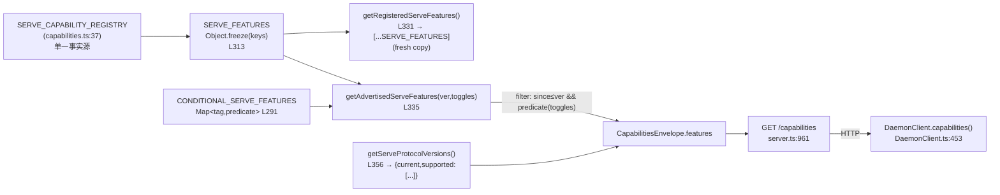
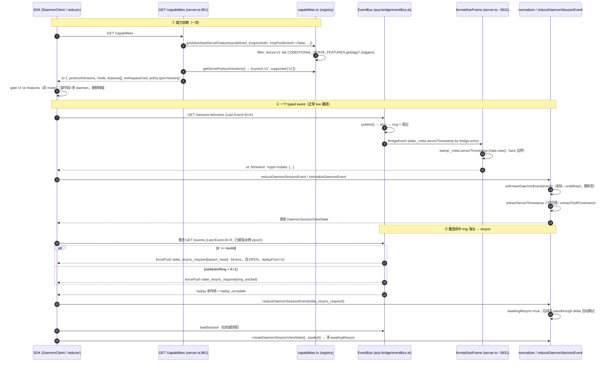

# 能力注册表与协议（深入）

> 子文档；总览见 [README.md](README.md)（以及总览正文 `daemon-serve-mode.md` §3.4 / §3.9）。本文在 file/symbol/line 级别**取代**总览的 §3.4、§3.9 协议相关段落，深入到注册表过滤逻辑、协议补全字段的产生与消费、以及三处镜像 lockstep 的漂移机理。
>
> 早期 file/symbol/line 锚点保留 `daemon_mode_b_main` 集成分支语境；daemon feature batch 已随 #4490 合入 `main`，#5144 之后的 daemon docs / status / permission timeout 等近期 PR 以当前 `main` 实现为准。关联 PR：#4191（capability registry + protocol versions）、#4226（typed_event_schema + 固定 SDK 公共面）、#4360（serverTimestamp / provenance / errorKind / state_resync_required）、#4214/#4245/#4284/#4306（注册表↔镜像漂移修复）。

---

## 概述

Mode B 的"协议面"由两套互相镜像、但**故意不互相 import** 的真相组成：

1. **daemon 侧能力注册表**：`packages/cli/src/serve/capabilities.ts` 的 `SERVE_CAPABILITY_REGISTRY`（L37）是单一事实源。它派生出两个不同的列表——**registered**（`getRegisteredServeFeatures`，编译期已知的全集）与 **advertised**（`getAdvertisedServeFeatures`，运行时按 `--require-auth` 等开关过滤后真正写进 `/capabilities` 的子集）。
2. **wire 协议帧**：`/capabilities` 返回 `CapabilitiesEnvelope`（`serve/types.ts`），SSE 事件帧的 typed schema 在 SDK 侧由 `KnownDaemonEvent` 联合（`sdk-typescript/src/daemon/events.ts`）描述，并由 `asKnownDaemonEvent` 做运行时收窄。

设计的核心契约（#3803 §10）只有一句：**客户端 gate on `features`，不要 gate on `mode`**。一切新能力都是 additive——新 tag、新可选字段（`protocolVersions` / `workspaceCwd` / `policy` / 帧上的 `serverTimestamp` / `errorKind`）老 daemon 一律省略即可，`v` 只在帧布局不兼容时自增。这套"feature-detect 而非 version-pin"让新旧 SDK × 新旧 daemon 的任意组合都能优雅降级。

本文重点拆解四件事：注册表如何把 registered/advertised 分离并防止外部突变；`protocolVersions` envelope 的向后兼容；三处镜像 lockstep 为什么反复漂移；以及 #4360 协议补全字段在 daemon 端如何产生、在 SDK reducer/normalizer 端如何消费。

---

## 涉及 PR（表格）

| PR | 标题（节选） | 合并日 | 在本文的作用 |
| --- | --- | --- | --- |
| #4191 | feat(serve): add capability registry protocol versions | 2026-05-16 | 引入 `SERVE_CAPABILITY_REGISTRY` + `protocolVersions:{current,supported}` envelope。 |
| #4214 | fix(serve): align integration test + user doc with merged sessionScope override | 2026-05-16 | 第 1 次镜像漂移修复（`session_scope_override`）。 |
| #4226 | feat(serve): advertise typed_event_schema + pin SDK public surface | 2026-05-17 | 广告 `typed_event_schema` tag；用 `daemon-public-surface.test.ts` 把 SDK 公共面钉死。 |
| #4245 | fix(serve): align integration test mirrors with merged capability + EventBus changes | 2026-05-17 | **第 3 次**镜像漂移修复（18→24 项），PR body 明确点名"third drift incident"。 |
| #4284 | fix(serve): sync E2E baseline capabilities with registry | 2026-05-18 | 修复 #4249/#4269 引入的漂移（补 `workspace_memory`/`workspace_agents`/`workspace_file_read`）。 |
| #4306 | fix(serve): unbreak E2E after #4271 (capabilities + clientCount) | 2026-05-19 | 修复 #4271 引入的漂移。 |
| #4360 | feat(serve+sdk): F4 prereq — protocol completion | 2026-05-21 | 补齐 `serverTimestamp` / `provenance` / `errorKind` / `state_resync_required`。 |
| #4515 follow-up | session stats surface | 2026-05 | `GET /session/:id/stats` + `session_stats`，导出端点仍未落地。 |
| #4816 | feat(serve): add `/settings` slash command for web-shell | 2026-06-07 | `GET/POST /workspace/settings` + 条件能力 `workspace_settings` + `settings_changed` 事件。 |
| #4820 | feat(serve): add HTTP rewind endpoints | 2026-06-07 | `session_rewind`、rewind HTTP 端点、`session_rewound` SSE。 |
| #4822 | feat(serve): add hooks diagnostic HTTP/ACP surface | 2026-06-07 | `workspace_hooks` / `session_hooks` 诊断面。 |
| #4832 | feat(serve): add extensions diagnostic HTTP/ACP surface | 2026-06-08 | `workspace_extensions` + `GET /workspace/extensions`。 |
| #5174 | feat(cli): Add daemon status API | 2026-06-16 | `daemon_status` baseline capability + `GET /daemon/status` summary/full JSON 诊断面。 |
| #5218/#5258 | fix(cli): Stop after cancelled permissions | 2026-06-17/19 | 不新增 tag；改变权限取消后的 turn 终态语义，取消后跳过同一模型响应里的后续工具。 |
| #5260 | feat(serve): make ACP permission timeout configurable | 2026-06-18 | 不新增 tag；`--permission-response-timeout-ms` 是 daemon 启动配置，经 `ServeOptions` 传给 bridge。 |
| #6525 | feat(serve): Add cursor-paged transcript replay endpoint | open | 新增 `session_transcript`：`GET /session/:id/transcript` 分页返回 active persisted transcript replay frames。 |
| #6567 | feat(cli): Add workspace-qualified core REST routes | 2026-07-09 | 新增条件能力 `workspace_qualified_rest_core`：`/workspaces/:workspace/...` core REST 与 SDK `WorkspaceDaemonClient`，随 workspace settings/persist route deps 广告。 |
| #6598 | feat(cli): Add channel worker settings reload for serve --channel | 2026-07-09 | 新增条件能力 `channel_reload`：仅 daemon wire channel worker reload deps 时广告。 |
| #6621 | feat(cli): workspace-qualified ACP transport | open | 当前 open diff 新增条件能力 `workspace_qualified_acp`；未合入前 main 的 ACP transport 仍以 legacy `/acp` 为准。 |

> #4191 的提交者标记为 `[codex]`；其余为人类/混合作者。漂移修复 PR 集中在 5 天内出现 4 次（#4214→#4245→#4284→#4306），是本文 §"lockstep" 的实证基础。

---

## 能力注册表（registered vs advertised、conditional、fresh-copy、deprecated alias）

### 描述符与单一事实源

`SERVE_CAPABILITY_REGISTRY`（`capabilities.ts:37`）以 `as const satisfies Record<string, ServeCapabilityDescriptor>`（L242）声明。`satisfies` 而非 `:` 注解，是为了**同时**得到两件东西：编译期校验每个 entry 形状合法（`since` 必填、`modes?` 可选），又保留 `as const` 的字面量精度，使 `ServeFeature = keyof typeof SERVE_CAPABILITY_REGISTRY`（L244）成为所有 tag key 的精确字符串联合，而非宽化的 `string`。

`ServeCapabilityDescriptor`（L21）只有两个字段：

- `since: ServeProtocolVersion`（当前唯一取值 `'v1'`）——该 tag 自哪个协议版本起可用。
- `modes?: readonly string[]`——当能力有多个子模式、客户端需要 feature-detect 活跃集时才填。当前仅两处：`mcp_guardrails: { since:'v1', modes:['warn','enforce'] }`（L100）与 `permission_mediation: { since:'v1', modes:[...4 策略] }`（L235）。baseline tag（单一行为、永远开）省略该字段。

### registered（全集）vs advertised（运行时子集）

注册表派生出**两个语义不同**的列表，这是本节最关键的区分：

- `SERVE_FEATURES = Object.freeze(Object.keys(SERVE_CAPABILITY_REGISTRY))`（L313）——冻结的全量 key 数组，声明顺序即数组顺序。
- `getRegisteredServeFeatures(): ServeFeature[]`（L331）——返回 `[...SERVE_FEATURES]`，即**每次都拷贝一份新数组**。注释与 `server.test.ts` 的断言（`features.pop()` 后再调一次仍等于原列表）共同钉死这个 fresh-copy 契约：调用者拿到的是副本，`pop()`/`push()` 不会污染模块级单一事实源。`getServeProtocolVersions()`（L356）同理——`supported: [...SUPPORTED_SERVE_PROTOCOL_VERSIONS]` 也返回拷贝，防止消费者改到底层常量。
- `getAdvertisedServeFeatures(protocolVersion = 'v1', toggles = {})`（L335）——这才是 `/capabilities` 真正广告的列表。它在 `SERVE_FEATURES.filter` 中做两层过滤：
  1. `isFeatureAvailableInProtocol(feature, protocolVersion)`（L321）：用 `serveProtocolVersionIndex`（L317，即 `SUPPORTED_SERVE_PROTOCOL_VERSIONS.indexOf`）比较 `descriptor.since` 的序号 ≤ 请求协议序号。当前只有 `'v1'`，这层恒真；它是为未来 `'v2'` tag 在面向 v1 客户端时被裁掉而预埋的。
  2. 条件谓词：`const predicate = CONDITIONAL_SERVE_FEATURES.get(feature)`，有谓词则跑 `predicate(toggles)`，无谓词（baseline）则无条件广告 `return true`。

`getServeFeatures()`（L352）是 `getAdvertisedServeFeatures()` 的零参便捷别名。

### conditional 标签：把"是否广告"与 tag key 并置

`CONDITIONAL_SERVE_FEATURES: ReadonlyMap<ServeFeature, (toggles: AdvertiseFeatureToggles) => boolean>` 把"该 tag 在什么开关下广告"的判定与 tag key 收敛到一处。`origin/daemon_mode_b_main@18e848f32` 当前 7 个条目：

| tag | 谓词（读 `AdvertiseFeatureToggles`） | 触发开关 |
| --- | --- | --- |
| `require_auth` | `toggles.requireAuth === true` | `--require-auth` |
| `mcp_workspace_pool` | `toggles.mcpPoolActive === true` | 池开启（非 `QWEN_SERVE_NO_MCP_POOL=1`） |
| `mcp_pool_restart` | `toggles.mcpPoolActive === true` | 与上同步（lockstep 成对） |
| `allow_origin` | `toggles.allowOriginActive === true` | 配了 `--allow-origin` |
| `prompt_absolute_deadline` | `typeof promptDeadlineMs === 'number' && > 0` | 配了 prompt deadline 预算 |
| `writer_idle_timeout` | `typeof writerIdleTimeoutMs === 'number' && > 0` | 配了 writer idle 预算 |
| `workspace_settings` | `toggles.persistSettingAvailable === true` | 嵌入 host 注入 `persistSetting`，即 `/workspace/settings` 路由被注册 |

`AdvertiseFeatureToggles` 就是这 6 个字段（`requireAuth` / `mcpPoolActive` / `allowOriginActive` / `promptDeadlineMs` / `writerIdleTimeoutMs` / `persistSettingAvailable`）的接口。

**设计权衡（注释 L260-289）**：旧实现是 `Set<ServeFeature>` + `getAdvertisedServeFeatures` 里逐 tag 写 `if` 分支，"加一个条件标签"要 4 处协调改动（registry / set / toggles interface / predicate branch），且漏写分支会**静默 fail-CLOSED**（tag 不广告）——fail-CLOSED 本身是安全的，但对加 tag 的贡献者不可见。改成 Map 后收敛为 **2 处**：(1) 在 registry 注册 tag，(2) 在 Map 里加谓词（若需要新开关字段则先扩 `AdvertiseFeatureToggles`）。不加进 Map = 无条件 baseline tag，加进 Map = 条件 tag——两者都是显式意图，没有"漏写分支"的中间态。

**"tag 存在 = 行为开启"是硬契约**。`/capabilities` 路由（`server.ts:961`）这样喂开关：

```
features: getAdvertisedServeFeatures(undefined, {
  requireAuth: opts.requireAuth === true,
  mcpPoolActive: opts.mcpPoolActive !== false,      // 注意：默认 ON
  allowOriginActive: opts.allowOrigins !== undefined && opts.allowOrigins.length > 0,
  ...(opts.promptDeadlineMs   !== undefined ? { promptDeadlineMs: opts.promptDeadlineMs } : {}),
  ...(opts.writerIdleTimeoutMs !== undefined ? { writerIdleTimeoutMs: opts.writerIdleTimeoutMs } : {}),
})
```

要点：`mcpPoolActive: opts.mcpPoolActive !== false`——**池默认开启**，只有显式 `QWEN_SERVE_NO_MCP_POOL=1`（boot 时翻成 `mcpPoolActive:false`）才省略 `mcp_workspace_pool`/`mcp_pool_restart`。这与 `require_auth` 的"默认关、显式开"方向相反，需要特别留意。

### 刻意无条件的 `mcp_guardrails`

`mcp_guardrails`（L100）**不在** `CONDITIONAL_SERVE_FEATURES` 里——即使没配 `--mcp-client-budget`（`budgetMode:'off'`）也无条件广告。原因（registry 注释 L84-99）：guardrail 的快照面（`GET /workspace/mcp` 的 `clientCount`/`budgets[]`）始终存在，`modes:['warn','enforce']` 让客户端 pre-flight `'enforce'` 是否被支持，而不是 pre-flight"预算是否配了"。这与条件 tag 形成对照：条件 tag 编码"运行时开关态"，`mcp_guardrails` 编码"build 支持的子模式集"。

### deprecated alias：`STAGE1_FEATURES`

`serve/types.ts:226`：

```ts
/** @deprecated Use SERVE_FEATURES from the capability registry. */
export const STAGE1_FEATURES = SERVE_FEATURES;
/** @deprecated Use ServeFeature from the capability registry. */
export type Stage1Feature = ServeFeature;
```

历史上能力列表叫 "Stage 1 features"（对应 `ServeMode = 'http-bridge'` 的 Stage 1 形态，见 `types.ts:34` 的 `ServeMode` docstring）。#4191 把真相迁到 registry 后，保留 `STAGE1_FEATURES` 作为 `SERVE_FEATURES` 的纯别名以零改造下游 import（`serve/index.ts:15` 仍 re-export 它）。注意单测里的 `EXPECTED_STAGE1_FEATURES`（`server.test.ts:104`）是**另一个**手写常量，名字沿用 Stage 1 词汇但与这个 alias 无 import 关系——见 §lockstep。

---

## 协议版本与向后兼容（protocolVersions envelope）

### envelope 形状

`CapabilitiesEnvelope`（`serve/types.ts`，`/capabilities` 返回体）：

```ts
interface CapabilitiesEnvelope {
  v: 1;                                   // 帧 schema 版本，仅在不兼容帧变更时自增
  protocolVersions?: ServeProtocolVersions; // {current:'v1', supported:['v1']}，#4191 引入
  mode: ServeMode;                        // 'http-bridge' | 'native'
  features: string[];                     // = getAdvertisedServeFeatures(...)
  modelServices: string[];                // Stage 1 恒为 []（agent 用单一默认 service）
  workspaceCwd?: string;                  // 绑定工作区绝对路径（#3803 §02 additive）
  policy?: { permission?: PermissionPolicy }; // F3 daemon-policy 命名空间
}
```

`CAPABILITIES_SCHEMA_VERSION = 1`（`types.ts`）是 `v` 字段的来源常量。

### 三个层级的版本号，别混淆

- `v`（envelope schema 版本）：描述 `/capabilities` **帧布局**。只在不兼容变更时 bump。当前恒 `1`。
- `protocolVersions:{current,supported}`（`ServeProtocolVersions`，`capabilities.ts:16`）：描述 **serve 协议**版本，影响 `descriptor.since` 的可见性过滤。当前 `current:'v1'`，`supported:['v1']`。
- `descriptor.since`（每个 tag 上）：该 tag 自哪个协议版本起存在。

三者正交：将来加 `'v2'` 协议时，`v` 不必动（只要帧布局兼容），只需把新 tag 标 `since:'v2'`、把 `'v2'` 加进 `SUPPORTED_SERVE_PROTOCOL_VERSIONS`，老 v1 客户端调 `getAdvertisedServeFeatures('v1', ...)` 会被 `isFeatureAvailableInProtocol` 裁掉 v2 tag。

### additive optional 的向后兼容机制

`protocolVersions` / `workspaceCwd` / `policy` 三个字段在类型上都是 `?` 可选，理由完全一致（见 `types.ts` 各字段 docstring）：它们是 v=1 之上的 **additive 扩展**，§02 之前的老 daemon 仍声明 `v:1` 但省略这些字段。协议立场是"只在不兼容帧变更时 bump `v`"，所以 additive optional 是正确形状。

SDK 侧 `DaemonCapabilities`（`sdk-typescript/src/daemon/types.ts:24`）镜像了这个形状：`protocolVersions?` / `workspaceCwd?` 同样可选。消费者若需要 `workspaceCwd` 作为非 undefined `string`（如调 `.startsWith()`），用 `requireWorkspaceCwd` helper——它在字段缺失时抛 `DaemonCapabilityMissingError`，给出"此 daemon 早于 §02"的可操作消息，而非让调用点撞上隐晦的 `undefined` 解引用。

SDK 消费入口是 `DaemonClient.capabilities()`（`sdk-typescript/src/daemon/DaemonClient.ts:453`）：单纯 `GET /capabilities` 并 `as DaemonCapabilities` 反序列化，不做版本断言——版本兼容性完全靠"读不到的字段就是老 daemon"的可选性来吸收。



---

## 能力覆盖矩阵（tag → HTTP / SSE / SDK）

这张表在 `origin/daemon_mode_b_main@18e848f32` 的客户端集成索引基础上补入 W23-W25 mainline additions。它不替代各子文档的深入说明，只回答三个问题：客户端 pre-flight 哪个 tag、随后打哪条 HTTP route、是否会收到对应 SSE 事件。

| 能力 tag | HTTP surface | SSE / 推送信号 | SDK / reducer surface |
|---|---|---|---|
| `health`, `capabilities` | `GET /health`, `GET /capabilities` | 无 | `DaemonClient.health()`, `capabilities()` |
| `daemon_status` | `GET /daemon/status`, `GET /daemon/status?detail=full` | 无，JSON snapshot；`detail=full` 各 workspace section 独立降级 | 无专用 SDK helper；按 HTTP JSON surface 消费 |
| `session_create`, `session_scope_override` | `POST /session` | spawn 期可能有模型切换/错误事件 | `createOrAttachSession()` |
| `session_load`, `unstable_session_resume` | `POST /session/:id/load`, `POST /session/:id/resume` | load 会重放历史帧；resume 不重放 UI 历史 | `loadSession()`, `resumeSession()` |
| `session_prompt`, `non_blocking_prompt`, `prompt_absolute_deadline` | `POST /session/:id/prompt` | `session_update`, `permission_request`, `prompt_cancelled`, `turn_complete`, `turn_error` | `prompt()`, reducer 记录 turn 终态 |
| `session_events`, `slow_client_warning`, `typed_event_schema` | `GET /session/:id/events` | `state_resync_required`, `replay_complete`, `slow_client_warning`, `client_evicted`, `stream_error` | `asKnownDaemonEvent()`, `reduceDaemonSessionEvent()` |
| `session_cancel`, `client_heartbeat`, `session_close` | `POST /session/:id/cancel`, `POST /session/:id/heartbeat`, `POST /session/:id/detach`, `DELETE /session/:id` | `prompt_cancelled`, `session_closed`, `session_died` | `cancelSession()`, `heartbeat()`, `closeSession()` |
| `session_permission_vote`, `permission_vote`, `permission_mediation` | `POST /session/:id/permission/:requestId`, `POST /permission/:requestId` | `permission_resolved`, `permission_partial_vote`, `permission_forbidden` | `respondToSessionPermission()`, permission reducer 状态 |
| `session_context`, `session_context_usage`, `session_supported_commands`, `session_tasks`, `session_stats`, `session_transcript` | `GET /session/:id/context`, `/context-usage`, `/supported-commands`, `/tasks`, `/stats`, `/transcript` | 无，均为 snapshot；transcript page 返回 id-less replay frames | `context()`, `contextUsage()`, `supportedCommands()`, `tasks()`, `stats()`, `getSessionTranscriptPage()` |
| `session_metadata` | `PATCH /session/:id/metadata` | `session_metadata_updated` | `updateSessionMetadata()` |
| `session_recap`, `session_btw` | `POST /session/:id/recap`, `POST /session/:id/btw` | 无；HTTP 返回侧查询结果 | `recapSession()`, `btwSession()` |
| `session_rewind` | `GET /session/:id/rewind/snapshots`, `POST /session/:id/rewind` | `session_rewound` | `getRewindSnapshots()`, `rewindSession()`；reducer 记录 `rewindCount/lastRewind` |
| `workspace_mcp`, `workspace_mcp_manage`, `mcp_guardrails`, `mcp_guardrail_events`, `mcp_workspace_pool`, `mcp_pool_restart`, `mcp_server_runtime_mutation` | `GET /workspace/mcp`, `GET /workspace/mcp/:server/tools`, `POST /workspace/mcp/:server/restart`, `POST/DELETE /workspace/mcp/servers` | `mcp_budget_warning`, `mcp_child_refused_batch`, `mcp_server_restarted/refused/added/removed` | workspace MCP status / mutation helpers；`isWorkspaceScopedBudgetEvent()` |
| `workspace_skills`, `workspace_providers`, `workspace_env`, `workspace_preflight` | `GET /workspace/skills`, `/providers`, `/env`, `/preflight` | 无 | workspace status helpers |
| `workspace_memory`, `workspace_agents`, `workspace_agent_generate` | `GET/POST /workspace/memory`, `GET/POST/DELETE /workspace/agents`, `POST /workspace/agents/generate` | `memory_changed`, `agent_changed` | memory / agents CRUD helpers |
| `workspace_file_read`, `workspace_file_bytes`, `workspace_file_write` | `GET /file`, `/list`, `/glob`, `/stat`, `/file/bytes`; `POST /file/write`, `/file/edit` | 文件写/edit 可广播 workspace mutation 事件 | file read/write helpers |
| `session_approval_mode_control`, `workspace_tool_toggle`, `workspace_init` | `POST /session/:id/approval-mode`, `POST /workspace/tools/:name/enable`, `POST /workspace/init` | `approval_mode_changed`, `tool_toggled`, `workspace_initialized` | approval/tool/init helpers |
| `workspace_settings` | `GET/POST /workspace/settings` | `settings_changed` | `workspaceSettings()`, `setWorkspaceSetting()` |
| `auth_device_flow` | `POST /workspace/auth/device-flow`, `GET/DELETE /workspace/auth/device-flow/:id`, `GET /workspace/auth/status` | `auth_device_flow_started/throttled/authorized/failed/cancelled` | auth-flow helpers + auth reducer |
| `workspace_qualified_rest_core` | `/workspaces/:workspace/file`, `/settings`, `/permissions`, `/trust`, `/mcp`, `/tools`, `/memory`, `/agents`, `/sessions`, `/session-groups`, `/reload`, `/init` 等 | workspace mutation events 仍按原事件类型广播 | `workspaceById()` / `workspaceByCwd()` → `WorkspaceDaemonClient` |
| `channel_reload` | `POST /workspace/channel/reload` | 无；HTTP 返回 post-reload worker snapshot | `reloadChannelWorker()` |
| `workspace_qualified_acp` | `POST/GET/DELETE /workspaces/:workspace/acp`，以及同 path WebSocket upgrade（#6621 open） | ACP SSE/WS 按 selected runtime dispatcher 输出；legacy `/acp` 保持 primary | ACP transport client 使用 workspace-qualified URL；未合入前不可视为 main 能力 |

注意：`prompt_absolute_deadline` / `writer_idle_timeout` / `workspace_settings` / `workspace_qualified_rest_core` / `channel_reload` / `workspace_qualified_acp` 是条件 tag。前两者只在配置了正数 deadline/idle timeout 时广告；`workspace_settings` 与 `workspace_qualified_rest_core` 只在 host 注入 `persistSetting` 且对应路由注册时广告；`channel_reload` 只在 channel worker snapshot 与 reload deps 都被 wire 时广告；`workspace_qualified_acp` 在 #6621 open diff 中仅 multi-workspace runtime 广告。

`daemon_status`（#5174）是 baseline tag，表示当前 daemon 支持统一只读状态面。默认 `summary` 只读内存计数，不 spawn ACP child；`detail=full` 才聚合 session、ACP connection、auth device-flow 和 workspace 诊断，并且每个 workspace section 失败时独立降级。该端点走普通 bearer 鉴权：配置 token 时需要 `Authorization: Bearer ...`，不像 `/health` 有 loopback 免鉴权例外。

#5218/#5258 没有新增能力 tag 或 SSE event type，而是收紧既有 `permission_request` / `permission_resolved` / `turn_complete` 组合的语义：权限解析为 cancelled 后，ACP turn loop 会记录被取消工具和 skipped follow-up tool responses，并以 `turn_complete.stopReason = 'end_turn'` 收束当前 turn。客户端无需 feature-detect 新协议字段，但如果 UI 依赖"取消只是一个工具错误"的旧假设，需要按当前语义渲染后续工具为 skipped。

#5260 的 `--permission-response-timeout-ms` 也是 operator-side 启动配置，不在 `/capabilities.features` 里广告；默认 5 分钟、`0` 禁用、非法值启动失败、超大值在 bridge 内 clamp 到 Node timer 上限。该值目前也未出现在 #5174 的 daemon status `limits` snapshot 中。


---

## 注册表↔测试↔集成镜像 lockstep（漂移根因与修复史）

能力列表在仓库里有**三份拷贝**，三者必须逐项、按序一致：

| # | 位置 | 形态 | 角色 |
| --- | --- | --- | --- |
| 1 | `SERVE_CAPABILITY_REGISTRY`（`capabilities.ts:37`） | 代码 | 单一事实源 |
| 2 | `EXPECTED_STAGE1_FEATURES`（`server.test.ts:104`）+ `EXPECTED_REGISTERED_FEATURES`（`server.test.ts:189`） | 单测手写常量 | 单元级镜像（"verified mirror, kept up-to-date"） |
| 3 | `caps.features` 的 `toEqual([...])`（`integration-tests/cli/qwen-serve-routes.test.ts:190`） | 集成测试手写常量 | 端到端 wire-shape 契约（对真实 spawn 的 daemon） |

### #2 单元镜像如何断言

`server.test.ts`（`describe('serve capability registry')`，约 L1061 起）：

- `it('returns a fresh ordered registered feature list')`：`expect(getRegisteredServeFeatures()).toEqual([...EXPECTED_REGISTERED_FEATURES])`，随后 `features.pop()` 再断言一次，钉死 fresh-copy。
- `it('advertises current-protocol features separately from the registry')`：`expect(getAdvertisedServeFeatures()).toEqual([...EXPECTED_STAGE1_FEATURES])`（无 toggles 的 baseline）。
- `it('advertises require_auth only when the runtime toggle is on')`：分别用 `{requireAuth:true/false}` / `{}` 断言 `toContain`/`not.toContain`。
- `it('honors every entry in CONDITIONAL_SERVE_FEATURES (...drift insurance)')`：`for (const [feature, predicate] of CONDITIONAL_SERVE_FEATURES)` 迭代 Map，对每个谓词合成"接受"与"拒绝"的 toggles，并断言 `{}` 下谓词必为 `false`（baseline 的 default-off 性质）。这条测试是 Map 形状的 **adoption-of-record**：将来加的条件 tag 若谓词没被 `getAdvertisedServeFeatures` 兑现，这里会红。

`EXPECTED_REGISTERED_FEATURES`（L189）的构造很微妙：它 `= [...EXPECTED_STAGE1_FEATURES.filter(剔除 auth_device_flow / permission_mediation / non_blocking_prompt)]`，再按 **registry 声明顺序**把条件 tag 与只注册不进 baseline 的 tag 插回去，包括 `mcp_workspace_pool`/`mcp_pool_restart`/`require_auth`/`allow_origin`/`auth_device_flow`/`permission_mediation`/`prompt_absolute_deadline`/`writer_idle_timeout`/`non_blocking_prompt`，以及 W23/W24 新增的 `session_rewind`、`workspace_hooks`、`session_hooks`、`workspace_extensions`、`workspace_settings` 等尾部能力。换言之 #2 自己内部就有"baseline 顺序 ≠ registry 顺序"的拼接逻辑（条件 tag 在 registry 里穿插于 baseline tag 之间，而 advertised baseline 列表把它们滤掉），这层顺序拼接本身就是易错点。

### 根因：为什么反复漂移

PR #4245 body 一针见血：

> Integration tests only run on `schedule` (nightly) / `workflow_dispatch` (release) per `.github/workflows/release.yml:4-9`, so PR CI didn't catch the drift at merge time.

即 **#1 + #2 同在 `packages/cli`，PR CI 一定一起跑、一起红**，所以加 tag 时这两份通常会被一并改对；但 **#3 在 `integration-tests/` 单独目录、单独的慢车道**，需要真实 spawn `node dist/index.js serve` 子进程，只在 nightly/release 跑。于是"加了个 tag、PR 全绿合并"——几天后 release dry-run 才以 E2E 失败的形式暴露 #3 漂移。

更刁钻的是 #3 **故意不 `import` 注册表常量**（PR #4245 "What is intentionally NOT changed"）：

> Hand-maintained mirror pattern is preserved (no `import` from `packages/cli`). The integration test value is acting as an **external wire-shape contract** against a spawned daemon — importing the constant would let registry typos silently propagate to the test.

这是个清醒的权衡：若 #3 直接 import `SERVE_FEATURES`，注册表里打错一个 tag 名，测试会跟着错、永远绿——失去"外部 wire 契约"的意义。代价就是必须手抄、必然漂移。

### 修复史（5 天 4 修）

| PR | 修的是哪次漂移 | 触发 PR | 数量变化 |
| --- | --- | --- | --- |
| #4214 | `session_scope_override` + 用户文档 | sessionScope override 合并 | — |
| #4245 | **"third drift incident"** | #4237（`slow_client_warning`）+ #4241（`workspace_mcp`/`skills`/`providers`/`session_context`/`session_supported_commands`） | 18 → 24 |
| #4306 | E2E unbreak | #4271（`clientCount` + capabilities） | — |

#4245 PR body 的 follow-up 第 2 条把问题说透了——"This is the **third** drift incident in this mirror pattern (capabilities and EventBus both)"，并提出两个未落地的根治方向：(a) 把这两个集成测试搬到快速 PR-CI 车道，(b) 重构断言使其不再内嵌 expected list。两者都被标记为 tracking-only。

### 现状：`daemon_mode_b_main` 上 #3 仍在漂移

逐项对比 `origin/daemon_mode_b_main@18e848f32`：registry 的 baseline advertised 列表（无 toggles）有 **52** 项，而 #3 集成镜像（`qwen-serve-routes.test.ts:190`）只有 **39** 项。镜像缺失以下 **13** 个 tag：

- `workspace_agent_generate`
- `session_context_usage`
- `session_stats`
- `workspace_mcp_manage`
- `mcp_server_runtime_mutation`
- `session_recap`
- `session_btw`
- `permission_mediation`
- `non_blocking_prompt`
- `session_rewind`
- `workspace_hooks`
- `session_hooks`
- `workspace_extensions`

也就是说，#4306 之后陆续合入的状态路由、控制端点、rewind/hooks/extensions 诊断面都没进 integration baseline。任何一次 release dry-run 都会让 `qwen serve — capabilities envelope > advertises all baseline capabilities` 这条 E2E 因 `toEqual` 长度/顺序不符而红。

> 注：#3 的注释自称"Order must match `SERVE_CAPABILITY_REGISTRY` ... and the unit-level baseline features in `server.test.ts`"，但事实上它已与两者都不一致——注释的"权威声明"本身也滞后了。

---

## typed event schema 与 SDK 公共面围栏

### `typed_event_schema` 能力 tag 与那条引用不存在符号的注释

registry 里 `typed_event_schema: { since:'v1' }`（约 L54-60）的注释写道：

> SDK consumers can detect `KnownDaemonEvent` schema support without pinning against this SDK release — `narrowDaemonEvent` falls back to `kind: 'unknown'` for daemons that don't advertise the tag, so the tag is purely informational.

这里有**两处与现实代码不符**（见 §已知限制）：(1) 真实的收窄函数叫 `asKnownDaemonEvent`，**`narrowDaemonEvent` 在整个 `packages/` 里只此一处注释出现、无任何定义**；(2) 该函数对未知事件回落的是 `undefined`，不是 `{kind:'unknown'}`。结论不变——tag 纯信息性，老 daemon 不广告也不影响 SDK 行为——但符号名是历史遗留的错引。

### SDK typed event 层（`sdk-typescript/src/daemon/events.ts`）

- `DAEMON_KNOWN_EVENT_TYPE_VALUES`（L14）：`as const` 字符串元组，列出全部已知事件 `type`（`session_update` / `permission_*` / `model_*` / `session_*` / `client_evicted` / `slow_client_warning` / `stream_error` / `state_resync_required` / `mcp_*` / `memory_changed` / `agent_changed` / `auth_device_flow_*` / `approval_mode_changed` / `tool_toggled` / `workspace_initialized` / `mcp_server_*` / `permission_partial_vote` / `permission_forbidden` / `prompt_cancelled` / `replay_complete` / `followup_suggestion` / `user_shell_*` / `turn_complete` / `turn_error`）。`DAEMON_KNOWN_EVENT_TYPES`（Set）供 `isKnownDaemonEventTypeName` 用。
- `DaemonEventEnvelope<TType, TData>`（L123）：`Omit<DaemonEvent,'type'|'data'> & { type:TType; data:TData }`——给每个具体事件一个收窄了 `type`/`data` 的信封别名。
- 八个分组联合 → `KnownDaemonEvent`（L891）：`DaemonSessionEvent`（L830）/ `DaemonControlEvent`（L838）/ `DaemonStreamLifecycleEvent`（L852，含 `client_evicted`/`slow_client_warning`/`stream_error`/`state_resync_required`）/ `DaemonMcpGuardrailEvent`（L865）/ `DaemonWorkspaceMutationEvent`（L874）/ `DaemonAuthEvent`（L823）/ `DaemonAssistEvent`（L887）/ `DaemonTurnEvent`（L889）。分组本身带语义注释（如 guardrail 事件刻意不并入 lifecycle，因为它报告 McpClientManager 状态而非流健康度）。
- `asKnownDaemonEvent(event): KnownDaemonEvent | undefined`（L1222）：核心运行时收窄器。一个大 `switch(event.type)`，每个 case 跑一个 per-shape 校验（`isRecord` / `isPermissionRequestData` / `isStateResyncRequiredData` / ...）通过才 `as` 成 typed event，否则 `undefined`；`default: return undefined`。这是"未知/畸形帧静默丢弃"的实现点——老 SDK 遇到新 daemon 的新事件类型直接走 default→undefined，不抛错（向后兼容）。
- 配套：`isKnownDaemonEvent`（L1181）、`isDaemonEventType<TType>`（L1187，类型谓词收窄到具体 Extract）、`isWorkspaceScopedBudgetEvent`（L1216，按 `data.scope==='workspace'` 区分 F2 工作区级预算事件 vs per-session）。

### SDK 公共面围栏（#4226 / `daemon-public-surface.test.ts`）

SDK 是两层 barrel re-export（`src/daemon/index.ts` → `src/index.ts`）。`test/unit/daemon-public-surface.test.ts` 是防"存在于 sub-barrel 但忘了在发布入口 re-export"漂移的围栏：

- 文件顶部用 **type-only import** 从 `../../src/index.js` 拉一大串类型名（`KnownDaemonEvent` / `DaemonControlEvent` / `DaemonStreamLifecycleEvent` / `DaemonSessionRecapResult` / `DaemonRuntimeMcpAddRequest` ...）。任一名字缺失于 `src/index.ts` 即 **tsc 编译错误**，整个 suite 拒绝 build——这就是回归围栏。
- runtime 侧 `expect(typeof Public.asKnownDaemonEvent).toBe('function')` 等，覆盖 type-only import 看不见的运行时导出（`asKnownDaemonEvent` / `isKnownDaemonEvent` / `isDaemonEventType` / `reduceDaemonSessionEvent` / `reduceDaemonSessionEvents` / `createDaemonSessionViewState` / `isWorkspaceScopedBudgetEvent`；以及 PR 21 auth 面 `DaemonAuthFlow` / `reduceDaemonAuthEvent` 等）。
- **drift insurance 子套件**：单独 `describe` 断言 `DAEMON_KNOWN_EVENT_TYPE_VALUES` 含 `mcp_server_added`/`mcp_server_removed`，并用 `asKnownDaemonEvent` 跑通判别式；另一条 `it('mirrors the T2.9 errorKind additions in DAEMON_ERROR_KINDS')` 断言 `Public.DAEMON_ERROR_KINDS` 含 `prompt_deadline_exceeded`/`writer_idle_timeout`——把 SDK 侧 `DAEMON_ERROR_KINDS` 与 serve 侧 `SERVE_ERROR_KINDS` 的手抄镜像钉死（见下节 errorKind 的 SDK/daemon 漂移）。

---

## 协议补全（serverTimestamp / provenance / errorKind / state_resync 的产生与消费）

#4360（F4 prereq）补齐了四类协议字段。下面分"daemon 产生侧"与"SDK 消费侧"两栏拆解。

### serverTimestamp（服务端权威时钟）

**产生（daemon）**：

- 主要落点在 SSE wire 边界 `server.ts:formatSseFrame`（约 L3631）。它在写出每帧前做 `const stamped = { ...event, _meta: { ...(existingMeta ?? {}), serverTimestamp: Date.now() } }`，再 `JSON.stringify`。刻意**在 wire 边界 stamp 而非 `EventBus.publish`**，这样内存里的 `BridgeEvent` 类型保持不变、内部消费者看不到 `_meta`。
- 注释（L3644-3678）坦白：**daemon 当前没有任何 producer 在 top-level 设 `_meta`**（`existingMeta` 在生产中恒 `undefined`，这个顶层 merge 是面向未来的逃生口）。真正带 `_meta` 的是 ACP `session/update` 的**嵌套** `data._meta`——bridge echo 在 `bridge.ts:~439` / `~3575` 发 `user_message_chunk` 时写 `update._meta: { serverTimestamp, source:'bridge-echo' }`（D3 review：刻意放在 `update` 内而非信封级，因为 `_meta` 是 JSON-RPC/MCP 标准扩展位、SDK normalizer 从 `update._meta`/`data._meta` 读、且所有 emitter 都这么干）。

**消费（SDK）**：`ui/normalizer.ts:extractServerTimestamp`（L351）做**三处回落探测**，顺序固定：

1. `event.serverTimestamp`（top-level，daemon 将来若上提则首选）
2. `event._meta.serverTimestamp`（Anthropic 风格信封元数据）
3. `event.data._meta.serverTimestamp`（sessionUpdate 嵌套位，即当前真实落点）

任一为有限 `number` 即返回；都没有则 `undefined`。`createBase`（L322）把它（连同 `eventId`/`originatorClientId`/`rawEvent`）拼进每个归一化 UI 事件的基底。这种"读三处、daemon 落一处"的不对称是 forward-compat 设计：daemon 未来换落点，SDK 无需协调发版。

### provenance（工具来源）

**产生（daemon）**：在 tool-call 类 `session_update` 的 payload 上带 `provenance`（`builtin`/`mcp`/`subagent`）与可选 `serverId`。

**消费（SDK）**：`normalizer.ts:extractToolProvenance(update, toolName)`（L602）：显式 `provenance==='builtin'|'mcp'|'subagent'` 优先（且 `mcp` 带 `serverId` 时一并取）；否则**启发式回落**——若 `toolName` 形如 `mcp__<serverId>__<tool>` 则解析出 `{provenance:'mcp', serverId}`；再否则返回 `{}`，UI 层默认渲染 `'unknown'`。

### errorKind（分类错误码）

**产生（daemon）**：`@qwen-code/acp-bridge` 的 `status.ts:mapDomainErrorToErrorKind(err)`（L844）。它用 `instanceof` + `.name` 双保险做分类（注释解释跨包 bundling 会产生 duplicate class identity，故对 `SkillError`/`TrustGateError` 加 `.name===` 兜底）：

| 输入错误 | 映射 |
| --- | --- |
| `BridgeTimeoutError` | `init_timeout` |
| `BridgeChannelClosedError` | `protocol_error` |
| `MissingCliEntryError` | `missing_binary` |
| `SkillError`（按 `code`） | `parse_error` / `missing_file` |
| `SyntaxError` | `parse_error` |
| `TrustGateError` / model-config 错误名 | `auth_env_error` |
| FS `ENOENT` 类 `code` | `missing_file` |
| 其它 | `undefined`（不强行归类，调用方留空 `errorKind`） |

闭集常量 `SERVE_ERROR_KINDS`（`status.ts:18`）当前 **14** 个值。调用点：`server.ts:3010`（SSE `stream_error` 帧 stamp `errorKind`，注释强调 `undefined` 时 SDK 回落渲染 `error` 文本、纯 additive）、`bridge.ts:3134`、`daemonStatusProvider.ts`（preflight/env 状态 cell 的 `errorKind`）。

**消费（SDK）**：

- 帧上 `DaemonStreamErrorData.errorKind?: DaemonErrorKind | (string & {})`（`events.ts:~286`）——`(string & {})` 宽化保留对未来新 kind 的前向兼容（IDE 仍对已知值自动补全）。
- `normalizer.ts:asDaemonErrorKind(value)`（L630）：对照 `DAEMON_ERROR_KIND_SET`（由 SDK 的 `DAEMON_ERROR_KINDS` 构造）校验，未知值返回 `undefined`（不把陌生字符串当 errorKind 渲染）。仅在 `session_died` / `stream_error` 两类 UI 事件上 stamp。
- `DaemonStatusCell.errorKind?: DaemonErrorKind`（`sdk-typescript/types.ts:217`）——状态 cell 用闭集类型。

> **SDK↔daemon errorKind 漂移**：SDK 的 `DAEMON_ERROR_KINDS`（`sdk-typescript/types.ts:187`）有 **13** 个值，daemon 的 `SERVE_ERROR_KINDS` 有 **14** 个——daemon 多一个 `stat_failed`，SDK 尚未镜像（`events.ts` 注释亦明确点名此项"already exists on the daemon's `SERVE_ERROR_KINDS` but is not yet mirrored on this SDK constant"）。`(string & {})` 宽化恰好吸收了这个漂移：daemon 真发 `stat_failed`，SDK `asDaemonErrorKind` 会判其不在闭集而返回 `undefined`、回落文本渲染，不报类型错。

### state_resync_required（resync 语义）

**产生（daemon）**：`@qwen-code/acp-bridge` 的 `eventBus.ts:subscribe`（约 L355-490）。当订阅带 `lastEventId` 重连时：

1. **epoch_reset**（L401）：`opts.lastEventId >= this.nextId`——游标来自已死 epoch（daemon 重启使 `nextId` 归 1、ring 清空）。`forcePush` 一个 `state_resync_required{ reason:'epoch_reset', lastDeliveredId, earliestAvailableId: ring[0]?.id ?? nextId }`，且 `replayFrom = 0`（全量重放当前 ring，否则用 stale `lastEventId=50` 过滤会把新 epoch 的低 id 帧 1,2,3 全丢）。
2. **ring_evicted**（L416）：非 epoch-reset 时，若 `earliestInRing > opts.lastEventId + 1`，中间帧已被淘汰，`forcePush` `state_resync_required{ reason:'ring_evicted', lastDeliveredId, earliestAvailableId: earliestInRing }`。
3. 两者都是 **id-less synthetic 帧**（不烧 per-session 单调序号槽，与 `client_evicted` 同模式），且 **`forcePush` 绕过订阅者 `maxQueued` cap**；关键区别——**流保持 OPEN**（`client_evicted` 才是终止帧）。注释专门更正了 #4360 之前把它叫 "TERMINAL" 的误导措辞。
4. 之后照常 force-push replay 帧（`id > replayFrom`），最后 `replay_complete{ replayedCount, lastReplayedEventId(+deprecated lastEventId alias) }` 哨兵。

**消费（SDK reducer）**：`events.ts:reduceDaemonSessionEvent(state, rawEvent)`（约 L1366）流程：

1. `const base = advanceLastEventId(state, rawEvent.id)`（L2522：`Math.max(state.lastEventId ?? 0, eventId)`，`undefined`/非有限值忽略——故 id-less synthetic 帧不推进 `lastEventId`）。
2. `const event = asKnownDaemonEvent(rawEvent)`；若 `undefined` 但 type 名在已知集，则计 `unrecognizedKnownEventCount`。
3. **resync 闸**（L1392）：`if (base.awaitingResync && !RESYNC_PASSTHROUGH_TYPES.has(event.type)) return base;`——`awaitingResync` 为真时，除 passthrough 类型外的所有 delta 事件被**自动跳过**（仍经 `base` 推进 `lastEventId`，保持 recovery 序列单调），防止消费者拿已知 stale 的本地累积去渲染。
4. `RESYNC_PASSTHROUGH_TYPES`（L1117）= `{ state_resync_required, session_died, session_closed, client_evicted, stream_error }`——含 `state_resync_required` 自身（连续二次 resync 仍能更新计数）+ 四个终止生命周期帧（end-of-stream 关键信号，不依赖先前状态是否最新）。
5. `case 'state_resync_required'`（L1591）：置 `awaitingResync:true`、`resyncRequiredCount++`、`lastResyncRequired = event.data`；**不动** `alive`/`terminalEvent`（流仍健康），**保留** `pendingPermissions`（由后续 `loadSession` 驱动的 recovery 清，而非 resync 信号本身清）。

**恢复路径**：消费者见 `awaitingResync` 后调 `loadSession` 拉 daemon 权威快照，再 `createDaemonSessionViewState({...loaded})` 重建——新 reducer 实例从 fresh seed 起（`awaitingResync ?? false`，L1174），隐式清旗。`DaemonStateResyncRequiredData`（`events.ts:300`）携 `reason` / `lastDeliveredId` / `earliestAvailableId`，gap 即 `[lastDeliveredId+1, earliestAvailableId-1]`。

---

## 时序图（capabilities 协商 + 一个 typed event 从 daemon 发射到 SDK 归一化/resync 消费）



---

## 边界与错误处理

- **未知/畸形事件帧**：`asKnownDaemonEvent` 对未知 `type` 走 `default → undefined`；对已知 type 但 `data` 形状不合（per-shape 校验失败）也返回 `undefined`。reducer 据此区分"未知 type"（计 `unrecognizedKnownEventCount`）与"已知 type 畸形 data"。老 SDK × 新 daemon 的新事件类型由此静默吸收，不抛错、不阻塞流。
- **id-less synthetic 帧**：`client_evicted` / `slow_client_warning` / `state_resync_required` / `replay_complete` / `stream_error` 不带 `id`（`formatSseFrame` 省略 `id:` 行）。`advanceLastEventId` 对 `undefined`/非有限 id 直接返回原 state，故这些帧不烧 `Last-Event-ID` 序号、不在其它订阅者眼中造成假 gap。
- **resync 期间的终止帧**：`awaitingResync` 为真时仍放行 `RESYNC_PASSTHROUGH_TYPES`——确保"会话已死"这类信号即便在 resync limbo 中也能让 UI 看到。
- **errorKind 未分类**：`mapDomainErrorToErrorKind` 对无规则匹配返回 `undefined`，daemon 直接不 stamp 该字段（而非塞一个误导值）；SDK `asDaemonErrorKind` 对闭集外的值也返回 `undefined`，回落渲染人读 `error` 文本。两端都遵守"宁缺毋滥"。
- **fresh-copy 防突变**：`getRegisteredServeFeatures`/`getServeProtocolVersions` 返回拷贝；`SERVE_FEATURES` 本身 `Object.freeze`。消费者改返回值不影响单一事实源。
- **workspaceCwd 缺失**：SDK 用 `requireWorkspaceCwd` 在缺字段时抛 `DaemonCapabilityMissingError`（"daemon 早于 §02"），而非 `undefined` 解引用崩溃。
- **CORS 探测面收敛**：`allow_origin` 条件 tag 只暴露"是否配了 allowlist"这个布尔事实，**不回显**具体 pattern 列表（registry 注释 L~205）——避免未鉴权的 `/capabilities` 读者枚举出全部受信 origin 做侦察。

---

## 关键设计决策与权衡

1. **registered vs advertised 二分**。注册表是编译期全集（类型系统的真相），advertised 是运行时按 toggles 过滤后的子集（wire 上的真相）。两者分开让"build 支持什么"与"本部署开了什么"解耦，`mcp_guardrails`（无条件，编码 build-supported `modes`）与 `require_auth`（条件，编码运行时开关）的对照即此二分的体现。

2. **conditional 用 Map 而非 Set+if**。把谓词与 tag key 并置，把"加条件标签"从 4 处协调改动降到 2 处，并消除 fail-CLOSED 静默漏写的中间态；`server.test.ts` 迭代 Map keys 做不变式断言，使 Map 形状成为 adoption-of-record。

3. **镜像故意手抄、不 import**。#3 集成镜像作为"对真实 spawn daemon 的外部 wire 契约"，若 import 注册表常量则注册表 typo 会随之传染、测试永绿。代价是必然漂移——这是清醒接受的 trade-off，而非疏漏。真正的根治（搬到 PR-CI 快车道 / 去内嵌列表）被反复推迟。

4. **协议字段全 additive、wire 边界 stamp**。`serverTimestamp`/`errorKind`/`provenance`/`protocolVersions`/`workspaceCwd`/`policy` 一律可选；daemon 不发=老 daemon，SDK 读不到=回落。`serverTimestamp` 在 SSE wire 边界 stamp 而非 `publish`，让内存 `BridgeEvent` 类型零改动、内部消费者无感。

5. **resync 选"流 OPEN + 继续 replay"而非终止**。让 SDK 能在不再次重连的前提下计算"错过了什么"diff（网络友好）；reducer 用 `awaitingResync` + passthrough 白名单把"自动跳过 stale delta"与"仍放行终止信号"两件事干净分开。

6. **`(string & {})` 宽化吸收枚举漂移**。SDK 的 `DaemonErrorKind`/事件 type 用 `Closed | (string & {})`，既保留已知值的 IDE 自动补全，又让 daemon 先行新增的 kind（如 `stat_failed`）不触发类型错——把"双端枚举手抄镜像"的不可避免滞后变成无害降级。

---

## 已知限制 / 后续

1. **`narrowDaemonEvent` 引用不存在的符号**。`capabilities.ts` 中 `typed_event_schema` 的注释（约 L57）写"`narrowDaemonEvent` falls back to `kind: 'unknown'`"，但全仓库无 `narrowDaemonEvent` 定义，真实函数是 `asKnownDaemonEvent`（`events.ts:1222`）且回落值是 `undefined` 而非 `{kind:'unknown'}`。结论（tag 纯信息性）不受影响，但注释是历史错引，应更正符号名与回落语义。

2. **`DaemonStreamErrorData.errorKind` 的 "8 values" 注释滞后**。`events.ts`（约 L271-286）注释称 errorKind 闭集"currently 8 values"，但 SDK `DAEMON_ERROR_KINDS` 实际已 13 项、daemon `SERVE_ERROR_KINDS` 已 14 项。注释计数未随扩展更新。

3. **`stat_failed` SDK 未镜像**。daemon `SERVE_ERROR_KINDS` 含 `stat_failed`，SDK `DAEMON_ERROR_KINDS` 缺。靠 `(string & {})` 宽化 + `asDaemonErrorKind` 闭集校验降级为文本渲染，无崩溃，但 UI 拿不到该 kind 的 typed 渲染（如专门的"stat 失败"补救提示）。

4. **#3 集成镜像当前漂移 13 项**。`origin/daemon_mode_b_main@18e848f32` 上 `qwen-serve-routes.test.ts:190` 比 registry baseline 少 `workspace_agent_generate` / `session_context_usage` / `session_stats` / `workspace_mcp_manage` / `mcp_server_runtime_mutation` / `session_recap` / `session_btw` / `permission_mediation` / `non_blocking_prompt` / `session_rewind` / `workspace_hooks` / `session_hooks` / `workspace_extensions`，下一次 release dry-run 会让该 E2E 红。根治方向（PR-CI 快车道 / 去内嵌列表）仍 tracking-only。


6. **`protocolVersions` 仅 `'v1'`，多版本路径未经实战**。`isFeatureAvailableInProtocol` 的版本裁剪逻辑当前恒真，`'v2'` 引入前其正确性只有单测覆盖、无线上验证。

7. **W23/W24 新增诊断与控制能力继续扩大列表**。#4820 新增 `session_rewind`，#4822 新增 `workspace_hooks` / `session_hooks`，#4832 新增 `workspace_extensions`，#4816 新增条件能力 `workspace_settings`（仅 `persistSettingAvailable` 时广告），#4812 新增 `session_branch`（always-on），#4861 新增条件能力 `rate_limit`（仅 `toggles.rateLimit === true` 时广告）。集成测试 baseline 需同步。

---

## 测试覆盖

| 测试文件:符号 | 覆盖点 |
| --- | --- |
| `server.test.ts:104`（`EXPECTED_STAGE1_FEATURES`） | advertised baseline（无 toggles）逐项 + 顺序。 |
| `server.test.ts:189`（`EXPECTED_REGISTERED_FEATURES`） | registered 全集逐项 + 顺序（含条件 tag 按 registry 序回插）。 |
| `server.test.ts` `it('returns a fresh ordered registered feature list')` | `getRegisteredServeFeatures` fresh-copy（`pop()` 后再调仍相等）。 |
| `server.test.ts` `it('advertises require_auth only when ...')` | `require_auth` 仅 `{requireAuth:true}` 下出现。 |
| `server.test.ts` `it('honors every entry in CONDITIONAL_SERVE_FEATURES')` | 迭代 Map：每谓词接受/拒绝 + `{}` 必 false（drift insurance）。 |
| `integration-tests/cli/qwen-serve-routes.test.ts:183` | 对真实 spawn daemon `GET /capabilities` 的 `caps.features` toEqual（外部 wire 契约，**当前漂移 13 项**）。 |
| `integration-tests/cli/qwen-serve-routes.test.ts:339` | `workspaceCwd` additive 字段出现（#3803 §02）。 |
| `sdk-typescript/test/unit/daemon-public-surface.test.ts` | 公共面 re-export 围栏（type-only import 编译失败即红）+ `DAEMON_ERROR_KINDS`/`mcp_server_added/removed` drift insurance。 |
| `sdk-typescript/test/unit/daemonEvents.test.ts` | `asKnownDaemonEvent` 各 type 判别式 + 畸形 data 回落 `undefined`。 |
| `acp-bridge/src/eventBus.test.ts` | `state_resync_required`（epoch_reset/ring_evicted）+ `replay_complete` 顺序（与 `qwen-serve-baseline.test.ts` 的 SSE 背压帧序镜像，#4245 一并修过）。 |

---

## 各 PR 代码贡献

### #4191 — capability registry

- `capabilities.ts:SERVE_CAPABILITY_REGISTRY`：`as const satisfies Record<string, ServeCapabilityDescriptor>` 声明的单一事实源，每条 `{ since, modes? }`。
- `capabilities.ts:getRegisteredServeFeatures` / `getAdvertisedServeFeatures`：registered（全集，每次 fresh copy）vs advertised（运行时 `since` + 条件谓词双层过滤）。
- `capabilities.ts:CONDITIONAL_SERVE_FEATURES`：`ReadonlyMap<tag, predicate>` 把"是否广告"与 tag key 并置，从 4 处改动降到 2 处。
- `capabilities.ts:getServeProtocolVersions`：返回 `{current:'v1', supported:['v1']}` 拷贝；`isFeatureAvailableInProtocol` 按 `since` 序号裁剪。
- `serve/types.ts:CapabilitiesEnvelope`：新增 `protocolVersions?` additive optional 字段。

### #4226 — typed_event_schema + public surface

- `capabilities.ts`：注册 `typed_event_schema: { since:'v1' }` 能力 tag（纯信息性，SDK 行为不依赖它）。
- `sdk-typescript/src/daemon/events.ts:DAEMON_KNOWN_EVENT_TYPE_VALUES`：`as const` 元组列出全部已知 event type；`asKnownDaemonEvent` 运行时收窄器。
- `sdk-typescript/test/unit/daemon-public-surface.test.ts`：type-only import 编译围栏 + runtime `typeof` 断言，防 re-export 漏缺；drift insurance 子套件钉死 `DAEMON_ERROR_KINDS` / `mcp_server_added` 等镜像。

### #4360 — protocol completion

- `server.ts:formatSseFrame`：wire 边界 stamp `_meta.serverTimestamp = Date.now()`，内存 `BridgeEvent` 类型零改动。
- `ToolCallEmitter.ts:resolveToolProvenance`：`subagent` / `mcp`（带 `serverId`）/ `builtin` 三路分类，stamp `_meta.provenance`。
- `status.ts:mapDomainErrorToErrorKind` / `SERVE_ERROR_KINDS`：14 类错误码闭集；`instanceof` + `.name` 双保险防跨包 bundle 破坏 identity。
- `eventBus.ts:subscribe`：`state_resync_required`——`epoch_reset`（`lastEventId >= nextId`，`replayFrom=0`）与 `ring_evicted`（`earliestInRing > lastEventId+1`）两条 gap 检测。
- SDK `events.ts:reduceDaemonSessionEvent`：`awaitingResync` 一向闩 + `RESYNC_PASSTHROUGH_TYPES` 白名单。

### #5174 — daemon_status capability

- #5174 注册 `daemon_status` baseline capability，新增 `GET /daemon/status` summary/full JSON surface。
