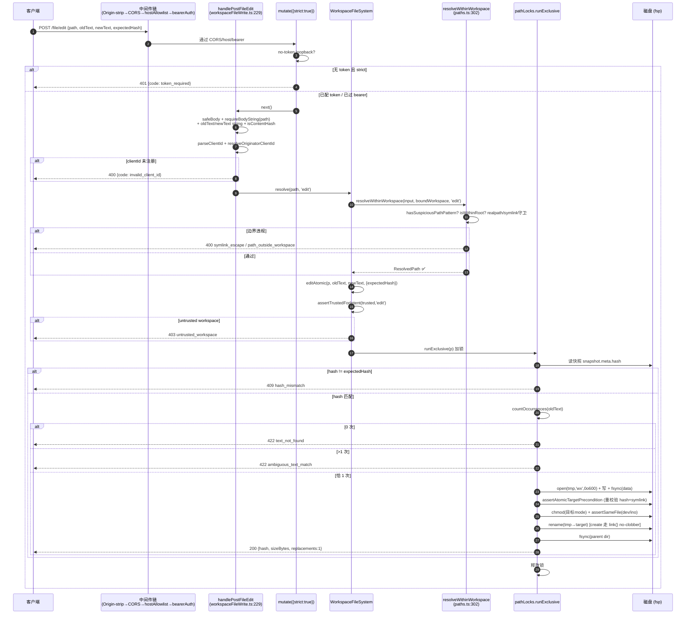

# 工作区文件路由与文件系统边界（深入）

> 子文档；总览见 [../README.md](../README.md)（以及总览正文 `daemon-serve-mode.md` §3.6、§4.3）。本文在 file/symbol/line 级别**取代**总览的 §3.6 段落，深入到 `resolveWithinWorkspace` 的逐分支防穿越/防符号链接逃逸算法、CAS+原子写链路的每一步守卫、读路由的 fail-closed 参数校验，以及 `FileSystemService` / `BridgeFileSystem` 注入 seam。
>
> 代码锚点除特别说明外均以集成分支 `daemon_mode_b_main` 为准（读法：`git -C <repo> show daemon_mode_b_main:<path>`）。关联 PR：#4250（FileSystemService 边界 / Wave 4 PR 18）、#4269（安全读路由 / PR 19）、#4280（write/edit 路由 / PR 20）、#4279、#4319（acp-bridge F1 + `BridgeFileSystem` seam）、#4334（F1 follow-up：adapter wiring）。

---

## 概述

Mode B 的文件子系统要解决一个本质上敌对的问题：**一个 HTTP/SSE daemon 把任意客户端（CLI、webui、SDK、远程）送来的 `path` 字符串落到本机磁盘上，且必须证明每一次落盘都严格限制在 `boundWorkspace`（`1 daemon = 1 workspace`）之内**。攻击面包括 `..` 文本穿越、绝对路径逃逸、符号链接逃逸（含悬挂符号链接、多跳链、环）、TOCTOU（解析后到写入前的 swap）、Windows 专属路径绕过（NTFS ADS、8.3 短名、UNC、DOS 设备名）、以及并发写撕裂。

代码分三层，每层各司其职、互不越权：

| 层 | 文件 | 职责 |
| --- | --- | --- |
| 边界解析 | `packages/cli/src/serve/fs/paths.ts` | `resolveWithinWorkspace` —— 把不可信 input 字符串解析为 branded `ResolvedPath`，证明其在工作区内。**唯一**能合法构造 `ResolvedPath` 的入口。 |
| IO + 原子写 | `packages/cli/src/serve/fs/workspaceFileSystem.ts` | `WorkspaceFileSystem` —— 接受 `ResolvedPath`，做 stat/read/list/glob/write/edit；持有 per-path 锁、CAS、原子 tmp+rename、TOCTOU 守卫、审计。 |
| HTTP 路由 | `packages/cli/src/serve/routes/workspaceFile{Read,Write}.ts` | 解析/校验 query/body、threading 审计上下文、序列化 `FsError` 为 typed JSON envelope。 |
| 策略 / 错误 | `fs/policy.ts`、`fs/errors.ts` | 信任门（`assertTrustedForIntent`）、size 门、ignore 判定；`FsError` 类型化错误 + errno→kind 映射。 |

能力分三档（`/capabilities` 的 `features[]`）：`workspace_file_read`（`GET /file|/list|/glob|/stat`，#4269）、`workspace_file_bytes`（`GET /file/bytes`，#4280）、`workspace_file_write`（`POST /file/write|/file/edit`，strict 门控，#4280）。

**核心安全契约**有两条，本文反复回到它们：

1. **branded `ResolvedPath`（`paths.ts:31`）是编译期护栏**：`type ResolvedPath = string & { readonly __brand: 'ResolvedPath' }`。路由层拿到 query 里的 `path` 字符串后，**必须**调 `fs.resolve(input, intent)`（内部委托 `resolveWithinWorkspace`）才能拿到 `ResolvedPath`；所有 IO 方法签名只收 `ResolvedPath`。一个忘记解析、把 user input 直接喂给 `readText` 的路由会**编译失败**。
2. **读开放、写严格 + 信任门**：读路由只挂全局 `bearerAuth`（无 `mutate()` 门），no-token loopback 下可达（调试友好）；写路由挂 `mutate({strict:true})`，no-token loopback 直接 `401 token_required`。两者之上还有正交的**信任门** `assertTrustedForIntent`：untrusted workspace 下读通过、写抛 `403 untrusted_workspace`。

---

## 涉及 PR（表格）

> `daemon_mode_b_main` 是 squash 集成分支（文件级 git 历史已压平到单提交），故下表按 epic #4175 的 Wave/PR 语义而非合并日组织（与总览 §6 一致）。

| PR | 子主题（Wave/PR） | 在本文的作用 |
| --- | --- | --- |
| #4250 | FileSystemService 边界（Wave 4 PR 18） | 落地 `paths.ts` 边界解析 + `workspaceFileSystem.ts` 原子写/CAS/TOCTOU 守卫 + `policy.ts`/`errors.ts`；`ResolvedPath` brand。 |
| #4269 | 安全 workspace 文件读路由（PR 19） | `routes/workspaceFileRead.ts`：`GET /file|/list|/glob|/stat`、`applyReadHeaders`、`parseIntInRange` fail-closed、`workspaceRelative` POSIX 归一。 |
| #4280 | workspace 文件 write/edit 路由（PR 20） | `routes/workspaceFileWrite.ts`：`POST /file/write|/file/edit`、`mutate({strict:true})`、`expectedHash` CAS、`/file/bytes`。 |
| #4279 | 文件路由 follow-up | 读/写路由的边界与审计 fold-in（与 #4269/#4280 同批）。 |
| #4319 | acp-bridge F1（`BridgeFileSystem` seam） | 把 `BridgeFileSystem` 接口（`packages/acp-bridge/src/bridgeFileSystem.ts`）抬到 bridge 包，给 ACP 子进程侧 fs 调用留注入点。 |
| #4334 | acp-bridge F1 follow-up（adapter wiring） | `bridgeFileSystemAdapter.ts` 把 ACP `readTextFile`/`writeTextFile` 路由到**同一** `WorkspaceFileSystemFactory`，统一审计 + 信任门 + 路径约束。 |

---

## 路径约束核心：`resolveWithinWorkspace`（逐分支算法 + 防穿越/符号链接逃逸）

`paths.ts:resolveWithinWorkspace(input, boundWorkspace, intent)`（L302）是整个文件子系统的反穿越核心。它返回 `Promise<ResolvedPath>`，对任意边界违规抛 `FsError`。下面逐分支拆。

### 入参与 Intent 语义

`Intent = 'read'|'write'|'edit'|'list'|'glob'|'stat'`（`paths.ts:53`）。Intent 的唯一运行时作用是**区分 ENOENT 容忍度**：`ENOENT_TOLERATING_INTENTS = new Set(['write','stat'])`（L65）。`write` 容忍叶子不存在（文件即将被创建），`stat` 容忍叶子不存在（存在性检查本就允许问"不存在")。`edit` 与 `write` 在信任门 `assertTrustedForIntent`（`policy.ts:124`）里门控**相同**，拆开仅为审计 payload 与穷尽性检查保真——`edit` 是"部分替换"、`write` 是"整体覆盖"，审计事件要忠实记录实际操作。

### 步骤 0：非空字符串 + 可疑模式拒绝（无 IO）

```
if (typeof input !== 'string' || input.length === 0) → parse_error
if (hasSuspiciousPathPattern(input)) → path_outside_workspace
```

`hasSuspiciousPathPattern`（`paths.ts:104`）是**检测而非规范化**——这是刻意的安全选择，docstring 给了三条理由：(1) 8.3 短名规范化依赖文件存在，而 write intent 下叶子按定义不存在；(2) 规范化→检查之间有 TOCTOU 窗口，检测危险**字面量**直接关窗；(3) 检测廉价且对合法 POSIX 文件名零误报。逐项拦截：

- **NTFS ADS**：仅 `win32` 下，`p.indexOf(':', 2) !== -1`（drive-letter 槽 `C:` 豁免，故从 index 2 起找）。冒号语法只有 Windows 内核解析，故平台门控。
- **8.3 短名**：仅 `win32` 下 `/~\d+/`。两处修正：多位（`~10`/`~99` 在 NTFS hash 方案里是真短名，原 `/~\d/` 漏了）；且**门控在 win32**——POSIX 下 `file~1.swp`、`notes~2.md` 是编辑器/备份工具的合法文件名，拒之即误报。
- **长路径/设备前缀**：`\\?\`、`\\.\`、`//?/`、`//./` 一律拒。
- **UNC 前缀**：`\\server\share` / `//server\share`（`startsWith('\\\\') && p[2] !== '\\'`，`//` 同理）。docstring 注明顺带挡掉解析期的 loopback DNS / SMB lookup。
- **≥3 连续点**：`/(^|\/|\\)\.{3,}(\/|\\|$)/`。注意：裸 `.`/`..` **不**拦（合法 POSIX 穿越 token，留给后面的 `path.resolve` + `isWithinRoot` 收口）；per-segment 循环里 `seg === '' || '.' || '..'` 直接 continue。
- **尾点/尾空格**：per-segment `/[.\s]+$/`（Windows 解析时会 strip）。
- **DOS 设备名**：per-segment `/(^|\.)(CON|PRN|AUX|NUL|COM[1-9]|LPT[1-9])(\.|$)/i`。锚点 `(^|\.)…(\.|$)` 覆盖裸名/首扩展/末扩展/中扩展四种形态，但 `BACON`、`concat.txt` 这类把保留字作为更长 segment 子串的合法名**不**误伤。

### 步骤 1-2：绝对化 + 纯文本预过滤（无 IO）

```
const boundCanonical = canonicalizeBoundWorkspaceCached(boundWorkspace);   // L325
const absolute = path.resolve(boundCanonical, input);                       // L326
if (!isWithinRoot(absolute, boundCanonical)) → path_outside_workspace       // L330
```

`canonicalizeBoundWorkspaceCached`（`paths.ts:194`）是 module-level memo（`CANONICAL_BOUND_CACHE`，L193），把 `boundWorkspace → canonical` 缓存，省掉每请求一次 `realpathSync.native`。因 `1 daemon = 1 workspace`，稳态缓存大小恰为 1；realpath 是函数式（路径不动则规范形不变），故 entry 永不需淘汰。

`isWithinRoot`（来自 `@qwen-code/qwen-code-core`）是**廉价纯文本前置**：在不付出任何 FS syscall 的前提下挡掉显式 `..` 逃逸（`path.resolve` 已把 `..` 折叠，若结果文本上不在 root 下即拒）。这一步先于 `realpath`，是 fail-fast。

### 步骤 3：`realpath` 规范化（核心）

```
try { canonical = await fsp.realpath(absolute); }   // L335
catch (err) { ... 按 errno 分流 ... }
```

`fsp.realpath` **原生跟随整条符号链接（SYMLOOP_MAX 受限）**——若链上任一跳逃出工作区，最终 canonical 落在外面，由步骤 6 的最终 containment 检查捕获。这是 happy path：目标存在时一句 realpath 就把符号链接逃逸归约成最终 containment 比较。

errno 分流（catch 块）：
- `ELOOP` → `symlink_escape`（链成环或超 SYMLOOP_MAX）。
- `EACCES` → `permission_denied`。
- `ENOENT` 且 intent **不**在 `ENOENT_TOLERATING_INTENTS` → `path_not_found`。
- `ENOENT` 且 intent ∈ `{write, stat}` → 进入**悬挂符号链接逃逸守卫**（下节，这是全文件最微妙的安全逻辑）。

### 步骤 4（ENOENT 容忍分支）：悬挂符号链接逃逸守卫

威胁：`<ws>/leak -> /etc/cron.d/evil`，其中**目标尚不存在**。`realpath` 跟随符号链接后对不存在的目标抛 ENOENT。若直接走"向上找存在祖先"的回退（`findExistingAncestor`），它会一路走到 workspace root 并把 `<ws>/leak` 当成 canonical 写目标返回——但 OS 层的写会跟随符号链接落到 `/etc/cron.d/evil`。多跳变体 `<ws>/leak -> <ws>/middle -> /etc/passwd`（`middle` 自身是符号链接）会绕过单跳 readlink 修复。

守卫算法（`paths.ts:343`–`473`，`symlinkResolvedCanonical` 变量是出口）：

1. **逐跳走完整条符号链接链**（`for hop < MAX_ANCESTOR_HOPS=40`，L173/L382）：对 `cursor` 做 `fsp.lstat`（不跟随）：
   - `lstat` ENOENT/ENOTDIR → 到达不存在叶子，`resolvedFully = true` break。
   - 非符号链接 → 链终止于真实文件/目录，`resolvedFully = true` break。
   - 是符号链接 → **inode 查环**：`visitedInodes` 是 `Set<bigint>`，若 `ino !== 0n && visited.has(ino)` 抛 `symlink_escape`（"symlink cycle detected"）。某些虚拟挂载返回 `ino === 0`，由深度上限兜底。然后 `fsp.readlink(cursor)`，相对目标用 `path.resolve(path.dirname(cursor), target)` 绝对化，`cursor = absTarget`，`firstHopTarget` 记首跳。
2. 循环未 `resolvedFully` 完成（超 40 跳）→ `symlink_escape`（"chain exceeded N hops"）。
3. **仅当确实走过至少一个符号链接**（`firstHopTarget !== null`）才做 containment：对最终 `cursor` 调 `findExistingAncestor` 取最深存在祖先 → `realpath` 该祖先 → 重接未解析 tail（tail 不存在故不引入新符号链接）得 `canonicalTarget`。若 `!isWithinRoot(canonicalTarget, boundCanonical)` → `symlink_escape`（"dangling symlink target escapes workspace"）。

**两个关键安全细节**：

- **不重走 `absolute`**（L472-473）：守卫成功后把验证过的 `symlinkResolvedCanonical` 作为函数结果，**绝不**回到 `absolute` 重新 walk。docstring（L443-451）明确：重走会在"检查"与"重走"之间开一个 TOCTOU 窗口，攻击者中途 swap 一个中间符号链接就能产出与刚验证过的不同的 canonical。这是"验证什么就用什么"原则。
- **hint 不嵌入符号链接目标**（L437-446 注释）：`recordDenied` 即使在 privacy 模式也会把 `hint` 转发进 `fs.denied` 审计事件，绝对外部目标字符串会泄漏攻击者意图的 exfiltration 路径。故 hint 只说"启用 `QWEN_AUDIT_RAW_PATHS` 看目标"，真值走 `relPath`/`message`。

`findExistingAncestor`（`paths.ts:210`）自身也有守卫：向上 walk 时若 `fsp.stat`（跟随符号链接）发现一个普通文件占据了本应是目录的路径段（`tailParts.length > 0 && !stat.isDirectory()`），抛 `parse_error`（"path component is not a directory"），堵住 `${ws}/file.txt/child` 这类把文件当目录穿越的请求；POSIX 返回 `ENOTDIR`、Windows 返回 `ENOENT`，两者都当"current 不解析"继续向上。

若 `symlinkResolvedCanonical === null`（input 是穿过不存在祖先、但自身非符号链接的路径）→ 回退到 `findExistingAncestor(absolute)` + realpath 祖先 + 重接 tail。

### 步骤 6：最终 containment 检查

```
if (!isWithinRoot(canonical, boundCanonical)) {
  const kind = canonical !== absolute ? 'symlink_escape' : 'path_outside_workspace';
  throw new FsError(kind, ...);
}
return canonical as ResolvedPath;
```

分类逻辑很精确：若 canonical 与 absolute 不同（说明 realpath 改写了路径，即存在符号链接解析）则归 `symlink_escape`，否则归 `path_outside_workspace`。这让 SDK/审计能区分"符号链接逃逸"与"纯文本越界"。`return canonical as ResolvedPath` 是**全代码库唯一**合法的 brand cast。

### flowchart：resolveWithinWorkspace 全分支

```mermaid
flowchart TD
    A["resolveWithinWorkspace(input, boundWorkspace, intent)"] --> B{input 非空 string?}
    B -- 否 --> ERR1["throw parse_error"]
    B -- 是 --> C{hasSuspiciousPathPattern?<br/>ADS/8.3/UNC/DOS设备/尾点/≥3点}
    C -- 命中 --> ERR2["throw path_outside_workspace"]
    C -- 干净 --> D["boundCanonical = 缓存规范化<br/>absolute = path.resolve(boundCanonical, input)"]
    D --> E{isWithinRoot(absolute, boundCanonical)?<br/>纯文本预过滤, 无IO}
    E -- 否 --> ERR3["throw path_outside_workspace<br/>(.. 逃逸)"]
    E -- 是 --> F["fsp.realpath(absolute)<br/>原生跟随整条 symlink 链"]
    F -- 成功 --> Z{isWithinRoot(canonical, boundCanonical)?}
    F -- "ELOOP" --> ERR4["symlink_escape (环/超 SYMLOOP_MAX)"]
    F -- "EACCES" --> ERR5["permission_denied"]
    F -- "ENOENT & intent∉{write,stat}" --> ERR6["path_not_found"]
    F -- "ENOENT & intent∈{write,stat}" --> G["悬挂符号链接守卫<br/>逐跳 lstat+readlink"]
    G --> H{每跳: 符号链接?}
    H -- "是 symlink" --> I{inode 已访问?<br/>visitedInodes}
    I -- 是 --> ERR7["symlink_escape (cycle)"]
    I -- 否 --> J["readlink → cursor=absTarget<br/>记 firstHopTarget"]
    J --> K{hop < 40?}
    K -- 否 --> ERR8["symlink_escape (>40 跳)"]
    K -- 是 --> H
    H -- "非 symlink/ENOENT 叶子" --> L{firstHopTarget !== null?<br/>(真走过 symlink)}
    L -- 是 --> M["findExistingAncestor(cursor)<br/>+realpath+重接tail → canonicalTarget"]
    M --> N{isWithinRoot(canonicalTarget)?}
    N -- 否 --> ERR9["symlink_escape<br/>(悬挂目标逃逸; hint 不含目标)"]
    N -- 是 --> O["canonical = canonicalTarget<br/>(不重走 absolute, 防TOCTOU)"]
    L -- 否 --> P["findExistingAncestor(absolute)<br/>canonical = 祖先realpath+tail"]
    O --> Z
    P --> Z
    Z -- 否 --> Q["kind = canonical!==absolute ? symlink_escape : path_outside_workspace"]
    Q --> ERR10["throw FsError(kind)"]
    Z -- 是 --> R["return canonical as ResolvedPath ✅<br/>(唯一合法 brand cast)"]
```

---

## 读路由（file/stat/list/glob、headers、glob symlink_escape、窗口参数 fail-closed）

`routes/workspaceFileRead.ts`（524 行）。`registerWorkspaceFileReadRoutes`（L515）注册 `GET /file`、`GET /file/bytes`、`GET /stat`、`GET /list`、`GET /glob`，**只**传入 `parseClientId`——没有 `mutate()` 门。在 `server.ts:1106-1114` 处明确注释：读路由"shares the same auth posture (no `mutate()` gate; only the global `bearerAuth` middleware applies)"。这就是**读路由的 loopback 开放性**：no-token loopback daemon 下读可达（调试/远程巡检友好），而写路由在同样配置下 `401 token_required`（见下节）。

> 注意：这个"开放"只对 loopback 且无 token 成立。`denyBrowserOriginCors`（`server.ts:768`）仍然拦住任何带 `Origin` 头的请求（CLI/SDK 从不发 Origin，发了就是浏览器，403），`hostAllowlist` 仍然反 DNS rebinding。读路由开放 ≠ 裸奔——它处在 CORS 墙 + host allowlist + （可选）bearer 之后。

### 统一响应头与错误 envelope

`applyReadHeaders(res)`（`workspaceFileRead.ts:70`）给**每个**读响应（含错误）打两个头：
- `Cache-Control: no-store`——挡掉中间缓存（浏览器缓存、开发转发代理、镜像 XHR 的浏览器扩展）把工作区文件内容快照落盘。即便 localhost daemon 也要防。
- `X-Content-Type-Options: nosniff`——挡 MIME 嗅探，防 UTF-8 源文件在直接加载它的浏览器里被当 HTML 渲染。

`sendFsError`（L85）是统一错误 envelope：`FsError` 自带 `status`（来自 `errors.ts:DEFAULT_STATUS_BY_KIND`），路由不重新派生——kind→status 映射在一处权威。输出 `{ errorKind, error, hint, status }`。非 `FsError` 落 stderr + `500 internal_error`。

### 窗口参数 fail-closed：`parseIntInRange`

`parseIntInRange(raw, min, max)`（L120）是读路由所有数值 query 的闸：

```
if (raw === undefined) return undefined;            // 缺省 → 调用方 default
if (typeof raw !== 'string' || !/^\d+$/.test(raw)) return null;   // 畸形 → 400
const n = Number.parseInt(raw, 10);
if (!Number.isSafeInteger(n) || n < min || n > max) return null;  // 越界 → 400
return n;
```

`^\d+$` 严格——`''`、`'abc'`、`'1.5'`、`'-3'` 全拒（返回 `null`，路由短路成 `400 parse_error`）。三态返回（`undefined`/`null`/数值）让路由能区分"缺省"与"畸形"。这是 **fail-closed**：任何不能干净解析为安全整数的窗口参数都拒，绝不"尽力解释"。各路由的范围：

| 路由 | 参数 | 范围 | 常量 |
| --- | --- | --- | --- |
| `GET /file` | `maxBytes` | `[1, 262144]` | 256 KiB |
| `GET /file` | `line` | `[1, MAX_SAFE_INTEGER]` | 1-based |
| `GET /file` | `limit` | `[1, 2000]` | `MAX_FILE_LINE_LIMIT`（L37） |
| `GET /file/bytes` | `offset` | `[0, MAX_SAFE_INTEGER]` | 0-based |
| `GET /file/bytes` | `maxBytes` | `[1, MAX_READ_BYTES]` | 256 KiB（`policy.ts:33`） |
| `GET /glob` | `maxResults` | `[1, 50000]` | `MAX_GLOB_MAX_RESULTS`（L56） |

`requireStringQuery`（L143）强制 `path`/`pattern` 非空字符串——空串当缺失（daemon 不接受 `?path=` 当工作区根；要根传 `?path=.`）。`getFsFactory`（L171）从 `app.locals.fsFactory` 取工厂，缺失 → `500`（部署误配，绕过了 `createServeApp` 的注入）。

### 各路由要点

- **`handleGetFile`（L200）**：`resolve(queryPath, 'read')` → `readText(resolved, {maxBytes, line, limit})`。响应 path 用 `workspaceRelative`（绝不回显绝对路径）。`readText` 底层（`workspaceFileSystem.ts:370`）在读前还有一道 `opts.line` 校验：`!Number.isSafeInteger(line) || line < 1` → `parse_error`，挡住 `Infinity`/浮点透传到 `readFileWithLineAndLimit` 导致诡异截断。
- **`handleGetFileBytes`（L270）**：`readBytesWindow`（`workspaceFileSystem.ts:425`）。这条路给二进制/大文件做字节窗口；返回 `contentBase64`。**仅当窗口覆盖整文件**（`offset===0 && buf.length===st.size`）才附 `hash`（全窗 sha256 当乐观并发 token）。读中做了 open-fd 双 stat + `assertSameFile`（dev/ino）+ "size/mtime 变了就 `hash_mismatch`"，把返回字节绑定到稳定快照。
- **`handleGetStat`（L332）**：`resolve(queryPath, 'stat')`（容忍不存在）→ `stat`（底层 `fsp.lstat`，**不**跟随符号链接，故能如实报 `kind: 'symlink'`）。
- **`handleGetList`（L364）**：探测用 `maxEntries: MAX_LIST_ENTRIES + 1 = 2001`，超 2000 则 slice 回 2000 且置 `truncated: true`——让 SDK 知道还有更多而不是静默假设全集。`list`（`workspaceFileSystem.ts:510`）把符号链接 dirent 标 `kind:'symlink'` 而非自动跟随（"Treating each child as implicitly-resolved here would be a brand-cast bypass"）。
- **`handleGetGlob`（L406）**：`cwd` 用 `intent:'list'` 解析（非 `'glob'`）——注释 L446-456 解释这是为防 `recordAndWrap` 从 `intent==='glob'` 自动派生 `data.pattern` 时把 cwd 字符串误记成 glob pattern（污染 `?cwd=../outside&pattern=*.ts` 的审计）。探测同样 `cap + 1` 推断 `truncated`。

### glob 的 symlink_escape 多层防御

`glob`（`workspaceFileSystem.ts:554`）是读路由里最大的攻击面（一个 pattern 可枚举整树），防御分四层：

1. **pattern 前置拒绝**（L570-587）：含 `..` 段 → `parse_error`；`path.isAbsolute(pattern)` 或 Win 盘符 `/^[A-Za-z]:[\\/]/` 或 `\\`/`//` 前缀 → `parse_error`（"must be workspace-relative"）。在 input burns I/O **之前**就挡掉显式越界 pattern。
2. **cwd 重验**（L588-635）：`opts.cwd` 虽 typed `ResolvedPath` 但 brand cast 可能造假，故用 **`realpath`（非 `path.resolve`）** 重新规范化再 `isWithinRoot`——注释 L594-602 明确：纯文本 containment 会放过 `<ws>/link -> /etc` 这种符号链接 cwd，`globAsync` 会先 walk `/etc` 才被 per-hit filter 丢弃。cwd 恰为 `boundWorkspace` 时短路省 syscall。
3. **walk-time ignore**（L646-652）：传 `ignore: ['**/node_modules/**','**/.git/**']` 让 glob 库在遍历时就剪枝，避免 `glob('**/*')` 在 walk 几十万 `node_modules` 路径后才被 post-filter 丢。post-filter 仍是权威，这纯属优化。
4. **per-hit realpath + containment**（L658-725）：每个 hit `fsp.realpath` 后 `path.relative` 检查 `rel.startsWith('..') || isAbsolute(rel)`——捕获 hit 是符号链接但目标逃出工作区（符号链接本身在工作区内、realpath 不在）。失败 errno **三分类**（L673-692）：`ENOENT`/`ELOOP` → `escapedCount`（真逃逸/悬挂/环）；`EACCES`/`EPERM` → `permissionErrorCount`；其它（EIO/EBUSY/ENAMETOOLONG/EMFILE）→ `transientErrorCount`。三类**聚合后**各发一条 `recordDenied`（`errorKind` 分别 `symlink_escape`/`permission_denied`/`io_error`），避免误配树里大量逃逸符号链接逐个 emit 淹没事件总线。**关键**：transient I/O 归 `io_error` 而非 `permission_denied`，否则失败磁盘会把 security oncall 叫醒。

`workspaceRelative`（L504）：响应 path 永远工作区相对 + POSIX 分隔符（Windows 的 `path.relative` 产 `\`，会泄漏进响应；统一 split+join 成 `/`）；根匹配渲染为 `'.'` 而非空串；`boundWorkspace` 缺失直接 throw（绝不回退到绝对路径）。

---

## 写/编辑路由（editAtomic 单匹配+hash CAS、atomicWriteTextResolvedFile 原子+符号链接守卫+dev/ino TOCTOU+create link/unlink）

`routes/workspaceFileWrite.ts`（292 行）。`registerWorkspaceFileWriteRoutes`（L282）的关键一行：

```
app.post('/file/write', deps.mutate({ strict: true }), (req, res) => handlePostFileWrite(...));
app.post('/file/edit',  deps.mutate({ strict: true }), (req, res) => handlePostFileEdit(...));
```

**strict 鉴权门**：`mutate({strict:true})` 意味着 no-token loopback daemon 上写路由直接 `401 {code:'token_required'}`（见 01-http-server 子文档的 mutate 矩阵）。这与读路由的开放性形成刻意的非对称——写是真正危险的状态变更，必须显式配 token 才可达，不依赖操作者额外加 `--require-auth`。`token_required` 这个 distinct code 让 SDK 能区分"路由要求配 token"与普通 401。

### 路由层 body 校验 + originator 解析

`handlePostFileEdit`（L229）链：`safeBody` → `requireBodyString('path')` → `oldText`/`newText` 必为 string → `requiredHash`（`expectedHash` 必匹配 `/^sha256:[0-9a-f]{64}$/`，`isContentHash`）→ `parseClientId` → `resolveOriginatorClientId`。

`resolveOriginatorClientId`（L143）：若带 `clientId` 但 `!bridge.knownClientIds().has(clientId)` → `400 {code:'invalid_client_id'}`。这把审计/回声抑制用的 originator 钉到一个已注册客户端，wire 客户端不能伪造任意 id。`originatorClientId` 最终进 `BridgeEvent.originatorClientId`，供其他客户端在 SSE 上抑制自己动作的回声。

`handlePostFileWrite`（L161）：`mode` 必为 `'create'|'replace'`；`replace` 必带 `expectedHash`（`requiredHash`），`create` 则 `optionalHash`；可选 `bom`/`encoding`/`lineEnding`。响应 `created ? 201 : 200`。

### editAtomic：单匹配 + hash CAS（`workspaceFileSystem.ts:990`）

`editAtomic(p, oldText, newText, {expectedHash})` 全程在 `pathLocks.runExclusive(p)` 内（per-path 互斥，下文）：

1. **信任门**：`assertTrustedForIntent(trusted, 'edit')`——untrusted 抛 `403 untrusted_workspace`。
2. **参数校验**：`expectedHash` 必 `isContentHash`；`oldText` 非空 string（空串会在 `''.indexOf('')===0` 处静默把 newText 前插到整文件——`edit()` 非原子版 L1130 对此有专门注释，称其为"textbook silent data corruption"）；`newText` 必 string。
3. **读快照 + CAS**：`readTextSnapshotFromResolvedFile(p)` 取 `snapshot.meta.hash`；若 `!== expectedHash` → `409 hash_mismatch`（hint："re-read the file and retry"）。这是乐观并发：客户端必须基于它读到的 hash 来写，否则失败重试。
4. **单匹配判定**：`countOccurrences(current, oldText)`（L1920，纯 `indexOf` 循环计数）：
   - `0` → `text_not_found`（422）。
   - `>1` → `ambiguous_text_match`（422，hint："pass a larger oldText span that occurs exactly once"）——拒绝歧义替换，强制客户端给唯一 span。
   - 恰 `1` → `current.slice(0,idx) + newText + current.slice(idx+oldText.length)`。
5. **size 门** `enforceWriteSize`（`policy.ts:192`，5 MiB）→ `mergeWriteMeta`（保留 encoding/BOM/lineEnding）→ `atomicWriteTextResolvedFile({mode:'replace', expectedHash})`。

`readTextSnapshotFromResolvedFile`（L1345）读前先 `fsp.lstat`：是符号链接直接 `symlink_escape`（"path is a symlink"，不读穿）；非普通文件 `parse_error`；超 `MAX_READ_BYTES` `file_too_large`。

### atomicWriteTextResolvedFile：原子写链（`workspaceFileSystem.ts:1540`）

这是落盘的最后一公里，每一步都是守卫：

1. **parent 检查**（L1545-1562）：`fsp.lstat(parent)`，是符号链接 → `symlink_escape`（"parent path is a symlink"）。注释 L1546-1551 坦承完整修复需要 parent-fd / `openat` 式 publish（Node stdlib 不暴露），这是 defense-in-depth：至少在 open tmp / rename 前挡住明显被 swap 的 parent。非目录 → `parse_error`。
2. **tmp 文件名**（L1563-1566）：`.{basename}.{process.pid}.{randomBytes(6).toString('hex')}.tmp`——pid + 6 随机字节防同目录并发/跨进程撞名。
3. **`reserveTempFile`（L1612）**：`fsp.open(tmpPath, 'wx', 0o600)`。`'wx'` 是 O_CREAT|O_EXCL——tmp 已存在则原子失败（防符号链接 tmp 攻击）；`0o600` 默认（不走 umask，secret-safe）。
4. **写编码内容 + fsync(data)**：`writeEncodedTextTemp` 写编码后内容，`syncHandleBestEffort`（fsync data），再 `fsp.lstat(tmpPath)` 确认非符号链接/是普通文件，且 `assertSameFile(opened, st)` 对 fd-stat 与 path-lstat 比 dev/ino。
5. **`assertAtomicTargetPrecondition`（L1670）**——rename 前**再次**校验 target（防 TOCTOU）：
   - `create`：`assertCreateTargetAbsent`（target 是符号链接 → `symlink_escape`；存在 → `file_already_exists`；ENOENT → 通过）。
   - `replace`：`fsp.lstat(target)` 是符号链接 → `symlink_escape`；非普通文件 → `parse_error`；`hashRegularFileAtPath` 重算 hash，`!== expectedHash` → `409 hash_mismatch`。返回 `mode` 供保留。
   - `overwrite`：容忍 ENOENT；符号链接/非普通文件拒；存在则返回 `mode`。
6. **chmod + 二次校验**：`chmodHandleBestEffort(tempHandle, targetState.mode ?? 0o600)`（保留目标权限位，`0o600` secret 编辑后仍 `0o600`）；`assertTempPathMatchesStat(tmpPath, tempStat)`（再比 dev/ino + 非符号链接）；close handle 后**再**校验一次。
7. **发布**（L1591-1595）：
   - `create` → `publishCreateNoClobber(tmpPath, target)`（L1876）：`fsp.link(tmpPath, target)`——`link()` 是可移植的 no-clobber publish，target 已存在时原子返回 `EEXIST`（→ `file_already_exists`），POSIX 与 NTFS 皆然。**为什么不用 rename**：POSIX `rename` 会**静默覆盖**已存在普通文件，破坏 `create` 的 no-clobber 契约（注释 L1867-1875）。link 成功后 `fsp.unlink(tmpPath)` best-effort 删掉 tmp 名（此时 tmp 与 target 指同一 inode，unlink 失败不影响 publish 成功，故不冒泡）。
   - `replace`/`overwrite` → `renameWithRetryLocal(tmpPath, target, 3, 50)`（EPERM/EACCES 指数退避重试，Windows AV 扫描友好）。
8. **`fsyncParentDirBestEffort(parent)`**（L1597/1821）：fsync 父目录保证 rename/link 的目录项崩溃一致。
9. **失败清理**：catch 里 `tempHandle?.close()` + 若 `tempLive` 则 `fsp.unlink(tmpPath)`（best-effort，保留原始错误）。

`assertSameFile`（L1784）是贯穿全程的 TOCTOU 探测器：比 `(dev, ino)`，仅当两侧都非 0 才比较（虚拟文件系统 ino 可能为 0），不同则抛 `symlink_escape`（"path changed during {intent}: TOCTOU swap detected via device/inode comparison"）。

### PathMutexRegistry：per-path 串行化（`workspaceFileSystem.ts:1267`）

`runExclusive(key, fn)`（L1270）用 promise-chain 实现 per-path 互斥：`tails: Map<path, Promise>`，新请求 `await previous` 再跑 `fn`，finally `release()` 并在自己是 tail 时删 key。同一文件的并发 write/edit 被串行化，避免两个 `replace` 交错产生撕裂或丢更新。注意它只锁**同一路径字符串**——不同路径并行。

### 非原子 edit / writeText 的 TOCTOU 守卫

`edit()` 无 `expectedHash` 分支（L1086）与 `writeText`（L945）走老的 `lowFs.writeTextFile` 路（非 tmp+rename），故另配两道守卫：`assertNotSymlinkBeforeWrite`（L2041，写前 lstat，是符号链接 → `symlink_escape`，ENOENT 是 ahead-of-create 合法）与 `assertInodeStableAfterRead`（L1987，读后 lstat，符号链接或 ino 变 → `symlink_escape`）。docstring 坦承存在残余窗口（守卫后到实际写之间），完整修复需 fd-based `O_NOFOLLOW`，列为 deferred follow-up。原子版（`writeTextAtomic`/`editAtomic`/`writeTextOverwrite`）走 tmp+rename 不受此窗口影响。

---

## FileSystemService 边界与 BridgeFileSystem 注入（#4250 / #4334 / #4319）

### 低层 FileSystemService（core）

`packages/core/src/services/fileSystemService.ts` 定义 `FileSystemService` 接口（`readTextFile`/`writeTextFile`/`findFiles`）与 `StandardFileSystemService` 实现。它是 core 既有的文件抽象（Mode A 也用），处理 encoding/BOM/CRLF/iconv。`WorkspaceFileSystem` 工厂在 `createWorkspaceFileSystemFactory`（`workspaceFileSystem.ts:274`）里 `new StandardFileSystemService()` 作为 `lowFs`——但**只**在非原子 `writeText`/`edit` 路用它；原子路全部走自己的 `fsp` 直调以掌控 tmp+rename。`WorkspaceFileSystem` 是 core `FileSystemService` 之上的**安全外壳**，不是替代品。

工厂还做一件安全事：`Object.freeze(ignore)`（L299）——`Ignore` 类有公开的 `add()` 原地变异方法，而每个 `forRequest()` 共享同一 `Ignore` 实例；冻结让未来某个"本 session 忽略此 pattern"特性调 `.add()` 时抛 `TypeError` 而非静默污染所有并发请求。

### BridgeFileSystem seam（#4319）+ adapter（#4334）

问题（pre-F1）：ACP 子进程侧的文件读写（`BridgeClient.readTextFile`/`writeTextFile`）走的是 `BridgeClient` 内联的 `fs.realpath`/`fs.writeFile`/`fs.readFile` proxy，**完全绕过** PR 18 的 TOCTOU + 符号链接 + 信任门 + 审计机制。这意味着 HTTP `POST /file/edit` 安全，但 agent 自己发起的 `writeTextFile` 不安全——两条路径安全姿态分裂。

修复分两步：

1. **#4319 落 seam**：`packages/acp-bridge/src/bridgeFileSystem.ts` 定义 `BridgeFileSystem` 接口（L39，`readText`/`writeText`，签名镜像 ACP SDK 的 request/response 形状）。`BridgeOptions.fileSystem` 注入点 + `BridgeClient` 的 early-return 委托。未注入时 `BridgeClient` 回退内联 proxy（保 pre-F1 行为）。接口 docstring（L61-96）把契约写死：**写则必须** write-then-rename 原子性 + 目标 mode 保留 + 新文件 `0o600`（非 umask）+ **符号链接拒绝**（这是对 pre-F1 内联 proxy 的**刻意 divergence**——老 proxy 会解析符号链接写穿到目标，新行为匹配保守的 PR 18/PR 20 姿态）+ 工作区边界。
2. **#4334 落 adapter**：`bridgeFileSystemAdapter.ts:createBridgeFileSystemAdapter(factory)`（L104）把 ACP 请求路由到**同一** `WorkspaceFileSystemFactory`：
   - `writeText` → `wfs.resolve(params.path, 'write')` → `wfs.writeTextOverwrite(resolved, content)`（L114-115）。选 `writeTextOverwrite`（`workspaceFileSystem.ts:840`，原子 tmp+rename + mode 保留）而非 `writeText`（无 mode、非原子）或 `writeTextAtomic`（其 `expectedHash` CAS 门对不上 ACP 无 hash 的 `WriteTextFileRequest` wire 形状 `{path,content,sessionId}`）。
   - `readText` → `wfs.resolve(params.path, 'read')` → `wfs.readText(resolved, opts)`（L119-143）。

`server.ts:577` 把 adapter 接进默认 bridge 构造：`fileSystem: createBridgeFileSystemAdapter(fsFactory)`，且 `fsFactory` 在 bridge **之前**构造（L549）以便注入。HTTP fs 路由与 ACP fs 复用**同一** factory 实例（同 audit emit + 同 trust 快照），操作者得到统一审计流。`server.ts:632/638` 把 `fsFactory`/`boundWorkspace` 挂 `app.locals` 供路由取用。

---

## 时序图

### ① 一次 `POST /file/edit`：鉴权 → resolveWithinWorkspace → CAS → 原子写



### ② 路径解析 flowchart

见上文 §"路径约束核心" 的 `resolveWithinWorkspace` flowchart（含 ENOENT 容忍分支的逐跳符号链接守卫与 inode 查环）。

---

## 边界与错误处理

`FsError`（`errors.ts:101`）是边界唯一错误类型，`kind: FsErrorKind`（L17，闭合联合）+ `status: FsErrorStatus` + `hint?`。kind→status 映射在 `DEFAULT_STATUS_BY_KIND`（L73）一处权威：

| errorKind | status | 触发 |
| --- | --- | --- |
| `path_outside_workspace` | 400 | `..` 越界 / 可疑 pattern / 非符号链接越界 |
| `symlink_escape` | 400 | 符号链接逃逸 / 悬挂符号链接 / 环 / TOCTOU swap / parent 符号链接 |
| `path_not_found` | 404 | ENOENT（非容忍 intent） |
| `binary_file` | 422 | 二进制文件读/编辑 |
| `file_too_large` | 413 | 超 256 KiB（读）/ 5 MiB（写） |
| `hash_mismatch` | 409 | CAS 失败 / 读期间文件变化 |
| `file_already_exists` | 409 | `create` 模式 target 已存在 |
| `text_not_found` / `ambiguous_text_match` | 422 | edit 的 0 次 / >1 次匹配 |
| `untrusted_workspace` | 403 | 信任门拒写 |
| `permission_denied` | 403 | EACCES/EPERM |
| `io_error` | 503 | ENOSPC/EIO/EBUSY/ENAMETOOLONG/EMFILE 等环境性故障 |
| `internal_error` | 500 | 非 errno 编程错误 |
| `parse_error` | 400 | 畸形 query/body / 非目录路径段 |

`wrapAsFsError`（`errors.ts:141`）做 errno→kind 翻译——`recordAndWrap`（`workspaceFileSystem.ts:1237`）在每个 body 方法的 catch 里调它，确保：(1) 裸 errno 被分类而非逃逸成不透明 5xx；(2) 每次失败都发 `fs.denied` 审计事件；(3) 路由能稳定 `instanceof FsError`。**关键安全分流**：`io_error`（503）与 `permission_denied`（403）刻意分开——监控管线在 `permission_denied` 上 page security oncall，把"磁盘满"混进来会误报警。

错误 hint 的隐私纪律：悬挂符号链接逃逸的 hint **不**嵌入目标路径（`recordDenied` 会把 hint 转进审计事件，绝对外部目标会泄漏 exfiltration 意图），真值仅在 `QWEN_AUDIT_RAW_PATHS=1` 下从 `relPath`/`message` 取。

---

## 关键设计决策与权衡

1. **检测危险字面量 > 规范化后检查**。`hasSuspiciousPathPattern` 在 input 上检测 Windows 攻击模式而非"规范化→检查"，因为 (a) 8.3 短名规范化依赖文件存在而 write 叶子不存在，(b) 规范化与检查间有 TOCTOU 窗口。代价：8.3/ADS 检测对 win32 平台门控，NTFS-on-Linux（`ntfs-3g`）留残余 gap（操作者可在路由层关 suspicious-pattern 拒绝）。

2. **`ResolvedPath` brand 是编译期护栏**。运行时只是字符串，但 brand 让"路由忘记解析、把 user input 直喂 IO"成为类型错误。唯一合法 cast 在 `resolveWithinWorkspace` 末尾 + glob/list 内部经过校验的 hit。这是用类型系统把安全不变式钉死，零运行时开销。

3. **读开放、写严格的非对称**。读路由不挂 `mutate()`（no-token loopback 可达，远程巡检/调试友好），写路由 `mutate({strict:true})`（no-token loopback 直接 `401 token_required`）。再叠加正交的信任门（read-shaped 永远过、write/edit 在 untrusted 抛 403）。理由：读已被 CORS 墙 + host allowlist 兜住，开放它换调试体验；写是真正危险的状态变更，必须显式配 token + trusted workspace 双重满足。

4. **`link()` 而非 `rename()` 兑现 create no-clobber**。POSIX `rename` 静默覆盖已存在文件，破坏 `mode:'create'` 契约；`fsp.link()` 在 target 存在时原子 `EEXIST`，POSIX/NTFS 皆然。早先的 `assertCreateTargetAbsent` 保留只为给非竞争路更友好的错误，link 才是关窗的硬保证。

5. **悬挂符号链接守卫"不重走"**。验证过 `symlinkResolvedCanonical` 后绝不回到 `absolute` 重新 walk——重走会开 TOCTOU 窗口让攻击者 swap 中间符号链接产出不同 canonical。"验证什么就用什么"。配合 inode 查环 + 40 跳上限防多跳/环逃逸。

6. **CAS（`expectedHash`）+ per-path 锁的乐观并发**。`editAtomic`/`replace` 强制客户端基于读到的 hash 写，冲突 `409 hash_mismatch` 让客户端重读重试；per-path 锁串行化同文件并发写防撕裂。`ambiguous_text_match`（>1 匹配拒绝）强制唯一 span，杜绝歧义替换的静默错改。

7. **ACP fs 复用同一 factory（#4334）**。agent 侧 `writeTextFile` 经 adapter 走 `writeTextOverwrite`，与 HTTP `POST /file` 共享 trust 门 + TOCTOU + 审计，且是对 pre-F1 内联 proxy 的刻意 divergence（不再写穿符号链接）。代价：依赖写穿符号链接 dotfile 的老 agent 需改为直接寻址解析后路径。

---

## 已知限制 / 后续

1. **fd-based 原子写未落地（残余 TOCTOU 窗口）**。非原子 `writeText`/`edit` 的 `assertNotSymlinkBeforeWrite` → 实际写之间仍有 swap-back 残余窗口（`workspaceFileSystem.ts:2013-2034` docstring）。完整修复需 `fsp.open(O_NOFOLLOW)` + parent-fd / `openat` 式 publish（Node stdlib 不暴露），列为 deferred follow-up。原子路（`*Atomic`/`*Overwrite`）走 tmp+rename 不受影响，故生产 HTTP `POST /file/edit`（走 `editAtomic`）已是原子的；缺口只在非原子 API 的直接调用者。

2. **parent-symlink swap 仅 defense-in-depth**。`atomicWriteTextResolvedFile` 的 parent 符号链接检查（L1552）只能挡明显被 swap 的 parent；rename 通过一个并发被换成符号链接的 parent 的窗口需 parent-fd publish 才能彻底关，同上受限于 stdlib。

3. **ACP 子进程侧 `params.path` 约束的渐进对齐**。#4334 adapter 已把 ACP fs 路由到同一 `WorkspaceFileSystem`，但 ACP `readTextFile` 的 `line`/`limit` 窗口在 adapter 里做**兼容性丢弃**（`bridgeFileSystemAdapter.ts:136-143`：null / 非正值回落 `undefined`），以贴近 pre-PR 内联 proxy 对 `limit<=0` 返回空内容的姿态，而非透传 `parse_error` 给老 agent。是渐进对齐而非一次到位。

4. **`io_error` 的 503 不可区分根因**。聚合的 `io_error`（ENOSPC/EIO/EBUSY/ENAMETOOLONG/EMFILE）都映射 503，监控只能知道"环境性故障"，需读 `message`/`hint` 才能分 `df -h`（满盘）vs fd 耗尽。

5. **NTFS-on-Linux 残余绕过**。`ntfs-3g` 挂载承认除冒号语法外的所有 Windows 绕过，但 8.3/ADS 检测平台门控在 win32，故 daemon 跑在 Linux 而工作区是 NTFS 挂载时有残余 gap（罕见，文档化接受）。

---

## 测试覆盖

| 测试文件（`daemon_mode_b_main`） | 用例数 | 覆盖重点 |
| --- | --- | --- |
| `packages/cli/src/serve/fs/paths.test.ts` | 29 | `resolveWithinWorkspace` 全分支：可疑 pattern 拒绝、`..` 越界、绝对路径、符号链接逃逸（单跳/多跳/悬挂/环）、ENOENT 容忍 intent、Windows 模式检测。 |
| `packages/cli/src/serve/fs/workspaceFileSystem.test.ts` | 75 | CAS（hash_mismatch）、单匹配/歧义/未找到、原子 tmp+rename、`link()` no-clobber、TOCTOU（dev/ino swap）、parent 符号链接、size 门、binary 检测、per-path 锁、信任门。 |
| `packages/cli/src/serve/routes/workspaceFileRead.test.ts` | 31 | 读路由：`parseIntInRange` fail-closed、`applyReadHeaders`、glob symlink_escape 聚合、list/glob truncated 探测、`workspaceRelative` POSIX 归一。 |
| `packages/cli/src/serve/routes/workspaceFileWrite.test.ts` | 10 | 写/编辑路由：`mutate({strict:true})` 401、body 校验、`invalid_client_id`、`expectedHash` 必填、201/200 created。 |
| `packages/cli/src/serve/bridgeFileSystemAdapter.test.ts` | 18 | ACP write/read 命中工作区内磁盘（happy path）+ 信任门（`trusted:false` factory 使 ACP 写以与 HTTP `POST /file` 同姿态 reject）+ line/limit null 丢弃。 |

> 合计 ~163 个用例集中在文件子系统四层 + adapter。`workspaceFileSystem.test.ts` 的 75 例是密度最高的安全回归套件，逐一覆盖 §"写/编辑路由" 列出的每道守卫。
