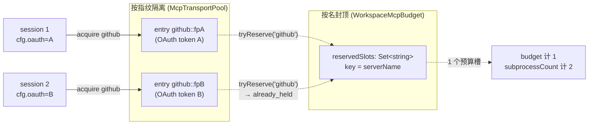
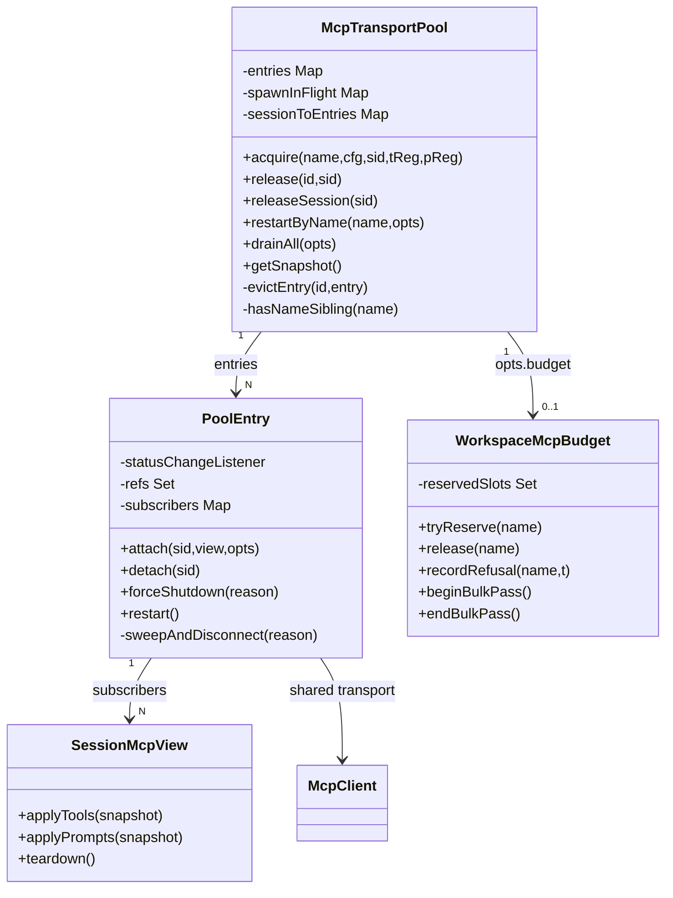
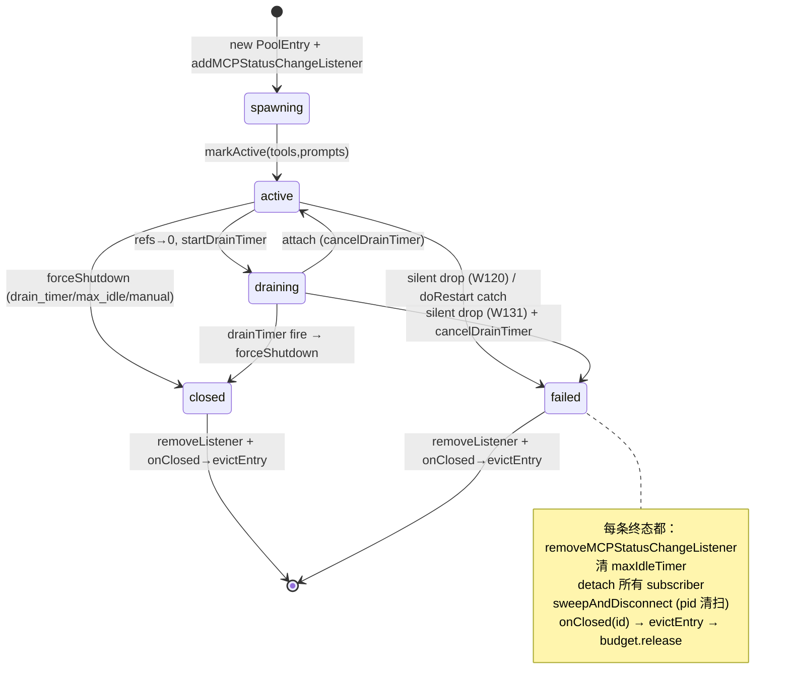

# MCP 守卫与共享传输池（深入）

> 子文档；总览见 [README.md](README.md)（以及总览正文 `daemon-serve-mode.md` §3.7、§5.1、§7.1）。本文在 file/symbol/line 级别**取代**总览的 §3.7，深入到预算预留的 TOCTOU 消除、引用计数与 `statusChangeListener` 的全终态移除、按名封顶（budget-by-name）与按指纹隔离（fingerprint-isolation）的语义裂缝、#4460 的自愈可观测性，以及 #5544 后 MCP resources/prompts 在 pooled daemon session 中的发现方式。
>
> 代码锚点除特别说明外均以集成分支 `daemon_mode_b_main` 为准（读法：`git -C <repo> show daemon_mode_b_main:<path>`）。涉及文件主要位于 `packages/core/src/tools/`（池本体）与 `packages/cli/src/{serve,acp-integration}/`（boot 校验与 daemon 装配）。

---

## 概述

MCP（Model Context Protocol）守卫与共享池要解决的是 daemon 模式下一个非常具体的资源放大问题：**一个 workspace daemon 上可以并发挂着 N 个 ACP session，每个 session 各自持有一份 `Config` + `McpClientManager`**。如果每个 session 都按自己的预算独立拉起 MCP 子进程，那么 `--mcp-client-budget=10` 在 5 个 session 下实际可达 50 个 live MCP client——预算根本没有约束住守护进程总量。

演进分两个阶段，都挂在 epic [#4175](https://github.com/QwenLM/qwen-code/issues/4175)：

1. **阶段一（per-session 预算，#4247 + #4271）**：在 `McpClientManager` 内做一个 per-session 的软/硬预算计数器，诚实地用 `scope:'session'` 标注它**不**聚合 workspace。这是最小可用基座。
2. **阶段二（workspace 共享传输池 F2，#4336）**：把传输（stdio/websocket 子进程）抬升为 workspace 级共享资源，N 个 session 复用同一批 `(name, fingerprint)` keyed 的 `PoolEntry`；预算控制器也随之从 per-session 的 `McpClientManager` 搬到 per-workspace 的 `WorkspaceMcpBudget`。

F2 之后整套机制的难点不在"共享"本身，而在**并发安全的引用计数 + 终态清理**：spawn 去重、drain/evict 竞争、`statusChangeListener` 在每一条终态路径上的移除、wrapper 子进程的 pid 后代清扫、以及预留 budget 槽在 spawn 失败时的精确回滚（不能多放也不能少放）。F2 的设计文档 `docs/design/f2-mcp-transport-pool.md`（v2.2）记录了 **32 条 review fold-in**，本文把其中影响正确性的关键几条逐一落到 file:symbol:line。

本文还要讲清两个**容易被误解**的语义：

- **按名封顶**：预算槽以 server **名字**为 key（`WorkspaceMcpBudget.reservedSlots: Set<string>`），所以两个同名但不同指纹的 entry（例如注入了不同 OAuth token）**共享一个预算槽**，却可以拉起**两个**子进程。这是有意权衡（预算 = "配置的 server 槽数"，子进程数另由 `subprocessCount` 暴露）。
- **按指纹隔离**：传输复用以 `(name, fingerprint)` 为 key，`fingerprint` 对 config + 规范化 OAuth 全字段哈希。注入了不同凭证的 session 得到**不同 entry**，绝不共享传输——安全优先于去重率。

这两条规则在同一个名字上同时生效：封顶看名字，复用看指纹。

---

## 涉及 PR（表格）

| PR | 标题（节选） | 合并日 | 在本文的作用 |
| --- | --- | --- | --- |
| #4247 | feat(serve): MCP client guardrails (#4175 Wave 3 PR 14) | 2026-05-18 | per-session 预算基座：`tryReserveSlot` check+add 同步、`weReservedSlot` 防泄漏、3 处 refuse、`scope:'session'` 诚实标注。 |
| #4271 | feat(serve): MCP guardrail push events + hysteresis (PR 14b) | 2026-05-18 | `budget_warning`（75% 上穿一次 / 37.5% 迟滞 re-arm）+ `refused_batch`（每 pass 合批）push 事件；`bulkPassDepth` 合批门。 |
| #4336 | feat(serve): shared MCP transport pool [F2] | 2026-05-21 | workspace 共享池本体（`McpTransportPool`/`PoolEntry`/`WorkspaceMcpBudget`/`SessionMcpView`），6 atomic + 6 fix commit + 32 review fold-in。 |
| #4460 | fix(core): F2 cleanup PR B — self-heal observability (W133-a + W134) | 2026-05-23 | `lastTransportError` 透传上游 onerror 原因到 `'failed'` 事件；`SweepResult` 把 pid 清扫的部分信号上报为结构化 warn。 |
| #4552 | feat(serve): runtime MCP server add/remove (T2.8 #4514) | 2026-05-30 | `addRuntimeMcpServer`/`removeRuntimeMcpServer`：运行时增删 + 幂等同指纹快路径 + 预算回滚。 |
| #5544 | feat(mcp): support MCP resources and prompts | 2026-06-22 | MCP resources/prompts discovery 进入 pooled/ACP session；支持 `@server:uri` 资源引用，不新增 daemon REST 路由。 |
| [#4535](https://github.com/QwenLM/qwen-code/pull/4535) | merged | @Jerry2003826 | persist MCP removals |
| [#4555](https://github.com/QwenLM/qwen-code/pull/4555) | merged | @jifeng | serve-bridge MCP rename |

---

## 演进：per-session 预算 → workspace 共享池（动机与权衡）

### 阶段一为什么不够：预算不约束守护进程总量

阶段一（#4247）的预算实现完全活在 `McpClientManager` 内：`reservedSlots: Set<string>`（`mcp-client-manager.ts:397`）、`clientBudget`（L398）、`budgetMode`（L399）。`McpBudgetConfig.clientBudget` 的 docstring（L107-111）写得很直白：

> Cap on live MCP clients **per ACP session** ... `acpAgent.newSessionConfig` constructs a fresh `Config`/`McpClientManager` per session, so each session enforces its own copy of the cap independently.

也就是说 `--mcp-client-budget=N` 是 per-session 的 N。`getMcpClientAccounting()`（L656）返回的 `reservedSlots` 也只反映**单个 manager**的状态。总览 §7.1 的"已知限制 1"就是这条：N×M 放大，`GET /workspace/mcp` 只读 bootstrap session 的 manager。这是 honest-but-incomplete 的设计——`BudgetExhaustedError.reservedCount`（L221）甚至专门从 `liveCount` 改名（review S6），强调它统计的是**预留的 server 名字数**而非 CONNECTED client 数。

### 阶段二：把传输抬成 workspace 资源

F2（#4336）的核心是 `McpTransportPool`（`mcp-transport-pool.ts:104`），挂在 `QwenAgent.mcpPool`（`acpAgent.ts:523`）——**每个 ACP 子进程一个 pool，而 1 daemon = 1 workspace = 1 ACP 子进程，所以等价于 per-workspace 单例**（L519-521 注释）。session 不再各自 `new McpClient`，而是通过 `McpClientManager.discoverAllMcpToolsViaPool`（`mcp-client-manager.ts:1425`）向池 `acquire`。

预算控制器也随之搬家。`WorkspaceMcpBudget`（`mcp-workspace-budget.ts:55`）的 docstring（L18-53）明确：它"owns the same state machine `McpClientManager` carries inline ... but lives ONE-PER-WORKSPACE inside `McpTransportPool`"。两套机器**互斥**运行（L48-53）：

- 池模式：`discoverAllMcpToolsViaPool` 走 `WorkspaceMcpBudget.tryReserve`，**从不**调 `McpClientManager.tryReserveSlot`，所以不会双重计数。
- standalone qwen / SDK MCP server：仍走 `McpClientManager` 的 inline 机器。

`acpAgent.ts:3035` 的 `skipPerSessionBudgetCallback = this.workspaceMcpBudget !== undefined` 是这条互斥在事件层的兑现——池模式下跳过 per-session 回调注册，避免 `budget_warning` 双发。

### 权衡一：按名封顶（同名异指纹共享一槽却可拉多子进程）

`WorkspaceMcpBudget.reservedSlots` 是 `Set<string>`（`mcp-workspace-budget.ts:66`），key 是 server **名字**。docstring L33-41 把这条权衡写死：

> Reservation key is server NAME ... two pool entries that share a name but differ by fingerprint consume ONE slot together, not two — operators should think of budget as "configured server slots" not "subprocess count".

于是出现一个看似矛盾的局面：名字 `github` 的 server 如果被两个 session 用不同 OAuth token 注入，会产生**两个** `PoolEntry`（两个 stdio 子进程），但只占**一个**预算槽。子进程的真实数量由 `pool.getSnapshot().subprocessCount`（`mcp-transport-pool.ts:643`）单独暴露——而且只数 stdio（L655，websocket 拨号远端不开本地子进程，R4/R6 review）。这是文档化的有意取舍：预算的语义单位是"操作者在 config 里写了几个 server"，不是"开了几个 OS 进程"。

### 权衡二：按指纹隔离（凭证差异绝不共享传输）

传输复用的 key 是 `ConnectionId = ${name}::${fingerprint}`（`mcp-pool-key.ts:158` `connectionIdOf`）。`fingerprint`（L128）是截断 SHA-256（16 hex / 64 bit，L22 注释论证碰撞概率 <10⁻¹⁵），对一组**transport-defining** 字段哈希：`transport/command/args/cwd/env/url/httpUrl/tcp/headers/timeout/oauth/authProviderType/targetAudience/targetServiceAccount`（L129-144）。被**排除**的字段是 per-session filter / metadata（`includeTools/excludeTools/trust/description/...`，L120-122 注释）——它们不改变底层传输，留给 `SessionMcpView` 处理。

最关键的安全点在 OAuth。`canonicalOAuth`（L75）把 `undefined/null/{}/{enabled:false}` 全折叠为 `null`（L78），并对 scopes/audiences 排序（L83-84）。L65-73 的注释记录了 W88 这条 review fix 的严重性：

> 修复前只哈希了 `clientId/scopes/authorizationUrl/tokenUrl` 四个字段——两个仅在 `clientSecret`/`audiences`/`redirectUri`/`tokenParamName`/`registrationUrl` 上不同的 config 会折叠成相同指纹、共享同一 pool entry，把第一个 config 的有效凭证/audience/redirect 泄漏进第二个 session 的传输。对 `clientSecret`（机密客户端）和 `audiences`（多 audience token）尤其要命。

所以"同名封顶、异指纹隔离"不是 bug，而是两个正交维度：**预算按名字数，传输按指纹分**。安全（不串享凭证）压倒去重率。



---

## 数据结构（`McpTransportPool` / pool-entry / budget / `SessionMcpView`）

### `McpTransportPool`（`mcp-transport-pool.ts:104`）

| 字段:line | 作用 |
| --- | --- |
| `entries: Map<ConnectionId, PoolEntry>` L105 | 主索引，`name::fingerprint → entry`。 |
| `unpooledIds: Set<ConnectionId>` L106 | 旁路（SDK MCP / 未 opt-in 的 HTTP-SSE）的 `name::unpooled-N` id 集合。 |
| `spawnInFlight: Map<ConnectionId, Promise<PoolEntry>>` L107 | 并发 acquire 去重：同 key 第二个 acquire 复用首个的 spawn promise。 |
| `sessionToEntries: Map<string, Set<ConnectionId>>` L109 | V21-2 反向索引，`releaseSession(sessionId)` 走它做 O(refs) 批量释放。 |
| `draining: boolean` L116 | drain 互斥（wenshao C5）；`drainAll` 置 true 后所有 `acquire`/`restartByName` 拒绝。 |
| `nextIndexByName: Map<string, number>` L123 | 单调 `entryIndex` 分配器（V21-7），多 entry 同名时给状态路由稳定下标。 |
| `opts.budget?: WorkspaceMcpBudget` L124-129 | 可选预算控制器；absent = 完全不限（操作者没配 `--mcp-client-budget`）。 |

### `PoolEntry`（`mcp-pool-entry.ts:151`）

每个 `ConnectionId` 一个 entry，持有共享 `McpClient` + 快照 + 引用计数 + 重连状态。状态机 `PoolEntryState`（`mcp-pool-events.ts:24`）：`spawning → active ⇄ draining → closed | failed`。

| 字段:line | 作用 |
| --- | --- |
| `localStatus` L152 / `state` L153 | per-entry 状态（区别于 module-global `serverStatuses`）。 |
| `refs: Set<string>` L155 | 当前 attach 的 sessionId 集合；`refs.size===0` 触发 drain。 |
| `subscribers: Map<string, SessionMcpView>` L156 | 每 session 一个 view。 |
| `drainTimer` L160 / `maxIdleTimer` L161 / `firstIdleAt` L162 | drain 宽限 + 硬空闲上限。 |
| `restartInProgress` L175 | **同步**置位的 restart 门（区别于 `restartInFlight`，见生命周期节）。 |
| `statusChangeListener` L196 | 注册到 module-global `serverStatuses` 的监听器；终态必须移除。 |
| `suppressNextStatusEcho` L205 | 自己写 global map 会回弹给自己，跳过这次 echo。 |

`SweepResult`（L130，**internal、不导出**）是 #4460 引入的 pid 清扫结构化结果：`pidSweepError? / descendantsFound? / descendantsSignaled?`（L131-136）。它从不上线（pool 事件保持 wire 兼容），只给进程内的 silent-drop 调用方一个可挂决策的载体。

### `WorkspaceMcpBudget`（`mcp-workspace-budget.ts:55`）

镜像 `McpClientManager` 的预算机器，但 workspace 单例。关键字段：`reservedSlots: Set<string>`（L66，名字 key）、`pendingRefusalNames`（L74，本 pass 待发 refusal）、`lastRefusedServerNames`（L86，快照可见、跨 pass 存活）、`warnArmed`（L93，迟滞）、`bulkPassDepth`（L102，合批门）。构造时若 `mode==='off'` 把 `onEvent` 直接吞成 `undefined`（L114），是 per-method `mode==='off'` 短路之外的纵深防御。

### `SessionMcpView`（`session-mcp-view.ts:149`）

一个 pool entry 的 tool/prompt 快照向**某个 session 自己的** `ToolRegistry`/`PromptRegistry` 的投影。每个 view：按 session 的 `includeTools/excludeTools` 过滤、用 `tool.withTrust(cfg.trust)` 做 per-session trust 拷贝（L196）、注册进 session 自己的 registry（不碰池的共享快照）。`compileNameFilter`（L42）+ `compiledFilterAccepts`（L58）把过滤 Set 每 pass 预编译一次，使 per-tool 判定 O(1)（W12/PR A，L181-183）。`passesSessionFilter`（L91）/ `passesSessionPromptFilter`（L119）是导出的单名谓词，PR-A-R2 #2 后统一 route through 编译路径，消除两套实现漂移风险。



---

## MCP resources / prompts discovery（#5544）

#5544 在既有 tools discovery 之外补齐 MCP resources 和 prompts。对 daemon 模式的影响点是：pooled / ACP session 不再只把共享传输上的 tools 投影到 session 自己的 registry，也要让 resources/prompts 跟随同一套 `(serverName, fingerprint)` 连接发现与 session 过滤逻辑。

行为边界：

- resources 通过 `@server:uri` 形式被用户/模型引用；server 名仍来自 MCP server config，uri 由 MCP server 返回。
- prompts 进入 session 自己的 prompt registry，和 tools 一样通过 `SessionMcpView` 做 per-session 投影，避免共享 pool entry 把一个 session 的过滤结果泄漏到另一个 session。
- 这不是新的 daemon REST surface；`GET /workspace/mcp` 等诊断面只需反映当前 MCP 状态，真实 resources/prompts 的使用仍在 core/MCP 层完成。

实现上，它沿用 F2 的基本原则：传输复用按 fingerprint 隔离，session 可见性在 view 层处理，预算仍按 server name 计 slot。也就是说，#5544 不改变预算/引用计数状态机，只扩大每个 `PoolEntry` snapshot 可投影的 MCP 能力类型。

---

## 预算与拒绝（check+add 无 TOCTOU、3 处 refuse、`weReservedSlot` 防泄漏、按名封顶语义）

### `tryReserve`/`tryReserveSlot`：同步 check+add 消除 TOCTOU

两套预算机器的核心方法都刻意是**同步**的，这是消除 TOCTOU 的关键。`WorkspaceMcpBudget.tryReserve`（`mcp-workspace-budget.ts:160`）：

```
if (reservedSlots.has(name)) return 'already_held';      // L161
if (clientBudget === undefined || mode === 'off') return 'reserved';  // L162
if (mode === 'enforce' && reservedSlots.size >= clientBudget) return 'refused';  // L165-168
reservedSlots.add(name); evaluateState(); return 'reserved';  // L171-176
```

L154-158 的 docstring 点明："Synchronous so concurrent `pool.acquire` calls under `Promise.all` can't interleave a second reservation past the cap at any `await` boundary." 因为 check 和 add 之间没有 `await`，`Promise.all` 里并发的多个 `discoverAllMcpToolsViaPool` 不可能在任何让出点插进第二次预留越过 cap。`McpClientManager.tryReserveSlot`（`mcp-client-manager.ts:605`）逻辑一字不差（L608-626），docstring L596-598 同样强调"BEFORE any `await client.connect()`"。

三态返回是后续防泄漏的基础：
- `reserved` —— 本次 acquire **新**占了一个槽（失败时必须回滚）。
- `already_held` —— 同名 sibling 已占（本次没占，失败时**绝不**能释放）。
- `refused` —— enforce 且 cap 满。

### 3 处 refuse 点（per-session 与池路径）

per-session 路径（`McpClientManager`）有 3 个调 `tryReserveSlot` 的拒绝点：

1. **批量发现** `discoverAllMcpTools` L1066：`reservation==='refused'` → `refuseAndLog(name,config)` + `return`（L1067-1070），不抛错（best-effort，抛错会取消 sibling 的连接）。
2. **单 server 重发现** `discoverMcpToolsForServerInternal` L1249：reachable from `/mcp reconnect`、OAuth 重发现、health-monitor retry——pre-#4247 这条**绕过**了预算门，refuse 后 `refuseAndLog` + `emitRefusedBatchIfAny()`（发 length-1 batch 求 shape 一致）+ return（L1250-1259）。
3. **lazy spawn** `readResource` 路径（同文件较后处）：live count 已满且 enforce 时抛 `BudgetExhaustedError`（L208）——这是唯一会**抛**的 refuse 点，因为它在工具调用的关键路径上而非 best-effort 发现循环。

池路径（`McpTransportPool.acquire`）则统一在一处：`opts.budget.tryReserve(serverName)`（`mcp-transport-pool.ts:333`），`refused` → `recordRefusal` + `throw BudgetExhaustedError`（L334-342）。调用方 `runDiscoverAllMcpToolsViaPool` 的 catch 把 `BudgetExhaustedError` 当**故意拒绝**而非失败，降到 debug 日志（`mcp-client-manager.ts:1617-1621`），真正的 refused_batch 由 pass 末 `endBulkPass` 合批发出。

W65（`mcp-transport-pool.ts:311-318`）是一条重要修复：pre-fix 预算检查在 `!isPoolable` 早返回**之后**，于是 unpooled HTTP/SSE/SDK-MCP 连接完全绕过 enforcement（`budget=2` 能放 3 个 HTTP MCP）。现在检查在两条分支**之前**统一执行。

### `weReservedSlot`：区分"本次新占"与"off 模式 no-op"防泄漏

`discoverMcpToolsForServerInternal` 里有一处微妙判定（`mcp-client-manager.ts:1275-1276`）：

```
const weReservedSlot = reservation === 'reserved' && this.reservedSlots.has(serverName);
```

为什么不是 `reservation === 'reserved'` 就够？因为在 **off 模式**下 `tryReserveSlot` 返回 `'reserved'` 但**不**往 set 里 add（L609-610）。如果只看 `reservation==='reserved'` 就在 connect 失败时清理，会在 off 模式下误删失败的 client entry、破坏 health-monitor 重试循环（L1266-1274 注释，附回归测试名 "should restore health checks after failed server rediscovery"）。所以 `weReservedSlot` 必须叠加 `reservedSlots.has()` 这层实证检查。

`weReservedSlot` 的下游决策（L1356-1368）：
- `true`（本次新占）→ connect/discover 失败时 `disconnect()` + `releaseSlotName()` + `clients.delete()`，因为这个 server 从没连上、不该永久占着 enforce 槽。
- `false`（`already_held` 真重连，如 health-monitor retry）→ **保留**槽，因为原先成功的连接确立了操作者意图 + 容量预留，一次瞬时重连抖动不该丢掉它。

配套的 `freshReservations: Set<string>`（L415）让 `runWithDiscoveryTimeout` 的超时 handler 也能做同样区分：fresh 超时释放槽、`already_held` 超时保槽。

### 池侧的 `rollbackReservationOnSpawnFailure`（R24 T17 phantom-release 修复）

池侧把 weReservedSlot 的等价契约抽成 `rollbackReservationOnSpawnFailure`（`mcp-transport-pool.ts:884`）：

```
if (budget !== undefined && reservationResult === 'reserved' && !hasNameSibling(serverName))
    budget.release(serverName);   // L888-894
```

`reservationResult` 被刻意 hoist 到 `acquire` 外层作用域（L331），让 spawn 失败的 catch 能区分 `'reserved'`（本 acquire 真占了，失败要回滚）与 `'already_held'`（sibling 占的，本 acquire 没占，**不能**释放）。L319-330 注释记录了 R24 这条 Critical：pre-R24 catch 只看 `!hasNameSibling()` 就释放——如果 sibling 在本 acquire 的 `tryReserve` 与 catch 之间被并发 evict，就会**phantom-release** 一个本 acquire 从未预留的槽，使预算计数器漂移（假性 `BudgetExhaustedError` 或欠计 over-spawn）。

---

## 池生命周期与引用计数

### `spawnInFlight` 去重

`acquire`（`mcp-transport-pool.ts:208`）对 poolable 传输先走 fast-path attach（L226-303，见时序图），miss 后进 in-flight 块：`spawnInFlight.get(id)`，没有就 `spawnEntry` 并把 promise 存入 map（L378-407）。第二个并发 acquire 同 key 直接 `await` 同一个 promise，只产生一个传输。`finally` 在 catch 之前删 `spawnInFlight[id]`（L388-391），保证 catch 里的 `hasNameSibling`（检查 `spawnInFlight.keys`）看到的是 post-cleanup 状态（wenshao R1）。

### `sessionToEntries` 反向索引与索引时序

`indexAttach`（L1115）/ `indexDetach`（L1124）维护反向索引。索引**时序**是几条 race fix 的焦点：

- **W90**（L409-423）：in-flight 路径在 `await inFlight` **之前** `indexAttach`，使并发 `releaseSession` 能经反向索引找到 entry 并 `forceShutdown`，由 post-await 的 `isTerminated()` 守卫（L442）兜住。
- **W111**（L459-481）：pooled 路径 attach 成功后**再** `indexAttach` 一次（幂等）。因为 pooled 路径并发 `releaseSession` 调的是 `startDrainTimer`（state=draining，**非**终态），post-await 守卫不触发，attach 把 entry 拉回 active 并加 ref——但若不补这次 indexAttach，`sessionToEntries[sid]` 会是空的，后续 `releaseSession` 提前返回、永不丢这个 ref → 泄漏。
- **W10**（fast-path，L240-261）：index 更新放在 `attach` **成功之后**，否则 attach 拒绝会留下与 `entry.refs` 不一致的 stale 映射。

`releaseSession`（L519）快照 id 集合后逐个 detach，refs=0 时 unpooled 立即 `forceShutdown('manual')`、pooled 启 drain timer，末尾 `sessionToEntries.delete(sessionId)`（L536）。这是 `acpAgent.killSession` 关 session 时的批量释放入口（`acpAgent.ts:570/594`）。

### drain 宽限 + 硬空闲上限

`PoolEntry.startDrainTimer`（`mcp-pool-entry.ts:648`）：置 state=draining，首次空闲时记 `firstIdleAt` 并启 `maxIdleTimer`（5min 硬顶，L655），再启 `drainTimer`（30s 宽限，L687）。两个 timer 都 `unref()` 不阻塞进程退出。

关键不变式（C2，L698-708）：`cancelDrainTimer`（L693）**只**取消 drain timer，**绝不**碰 `maxIdleTimer`。因为 `attach` 在调 `cancelDrainTimer` **之前**就把 ref 加进去了，若 cancelDrainTimer 按 `refs.size>0` 清 maxIdle，硬顶会在每次 attach 被重置、完全失效（设计 §6.3："started at first idle and NEVER reset"）。maxIdle 只由 `forceShutdown`（终态）清理。配套 R1（L656-678）：maxIdleTimer 触发时若 `refs.size>0`，no-op 并重置 `firstIdleAt` 开新窗口，而不是强关一个正在被用的 entry。

### evict 与 budget release（`evictEntry` 身份检查）

`evictEntry`（`mcp-transport-pool.ts:925`）是从 `entries` 删 entry **并**释放 budget 槽的单一真相源（R22 W125-followup）：

```
if (entry === undefined) return;
const current = this.entries.get(id);
if (current !== entry) return;          // 身份检查 L928
this.entries.delete(id);
if (budget !== undefined && !hasNameSibling(entry.serverName))
    budget.release(entry.serverName);   // L930-934
```

**身份检查 `current !== entry`** 是并发安全的命门（L908-919）：同一个 id 在其生命周期里可承载多个 entry 对象（evict + respawn）。当旧 entry 的 `forceShutdown` 异步尾巴（`await sweepAndDisconnect`）与 W125 fast-path 的 evict+spawn 在同一 id 下并发，旧 entry 的 onClosed 会在**新** entry 已插入后才 fire；没有身份检查就会误删新 entry 并错放它的预算槽。`spawnEntry` 用一个可变 `entryRef` holder（L979）让 onClosed 闭包在 fire 时解析到正确的 captured entry（L982-984）。

`budget.release`（`mcp-workspace-budget.ts:185`）幂等（`Set.delete` 返回值），有删才 `evaluateState`。**只有** `!hasNameSibling(name)` 时才释放——因为按名封顶，同名异指纹 entry 或 in-flight spawn 共享这个槽，只要还有一个在就保留。`hasNameSibling`（`mcp-transport-pool.ts:181`）用 `parseConnectionId` 精确比对 serverName（W21 修复：pre-fix 用 `startsWith(`${name}::`)`，当 sibling 名字以 `${name}::` 开头时假阳性——server 名字本身可含 `::`，故 `parseConnectionId` 用 `lastIndexOf('::')`）。

### `statusChangeListener` 全终态移除

每个 `PoolEntry` 构造时 `addMCPStatusChangeListener`（`mcp-pool-entry.ts:491`）注册一个 listener 到 module-global `serverStatuses` 注册表，用于把传输死亡（`McpClient.onerror` 写 DISCONNECTED）镜像进 `localStatus`。这个 listener **必须在每一条终态路径上移除**，否则跨 entry 重建会在 module-level 数组上泄漏 listener，缓慢拖垮状态更新延迟。三条终态路径：

1. **`forceShutdown`** L751-754：`removeMCPStatusChangeListener` + 置 undefined。
2. **`doRestart` 失败 catch** L992-995：reconnect 失败转 `'failed'` 时移除。
3. **W120/W131 silent-drop**（`statusChangeListener` 自身内）L353-356：listener 观察到 active/draining 上 DISCONNECTED → 转 `'failed'` 时移除自己。

spawn 失败路径也要移除：`spawnEntry` catch 里 `await entry.forceShutdown('manual')`（L1095，W1）、`createUnpooledConnection` catch 同样（L1320，W14）——pre-fix 每次 spawn 失败泄漏一个 listener。

`emit`（L1149）用 per-listener try/catch 迭代（W70，L1138-1148）而非直接 `EventEmitter.emit`：否则一个 session listener 同步抛错会让 `forceShutdown` 的 emit→disconnect 序列中断，阻塞所有同 entry session 的子进程清理、预算释放、entry 驱逐。



### pid 后代清扫（`sweepAndDisconnect` → `SweepResult`）

wrapper 进程（`npx`/`uvx`/`pnpm dlx`）把真正的 MCP server 拉成**孙子进程**；只杀 wrapper（`client.disconnect()`）会漏掉真 server。`sweepAndDisconnect`（`mcp-pool-entry.ts:815`）统一了 `forceShutdown` + `doRestart` 的 sweep+disconnect 模式（W37）：

```
rootPid = client.getTransportPid()           // L818 (远端/已退出返回 undefined)
descendants = await listDescendantPids(rootPid)   // L820
result.descendantsSignaled = sigtermPids(descendants)   // L823
... 然后 client.disconnect()    // L840
```

**顺序**很重要：descendant 先 SIGTERM 再 disconnect，让 wrapper 孙子先于父传输关闭被杀。`listDescendantPids`（`pid-descendants.ts`）跨平台：Unix `ps -A -o pid=,ppid=` 单次快照 + 内存 BFS（R10/R23 T7，从 per-pid `pgrep -P` 的 ~B^D fork 降到 1 fork），失败回落 per-pid `pgrep` BFS，再失败返回空让 OS reap；`MAX_DESCENDANTS=256`/`MAX_DEPTH=8` 防 forkbomb；`walkDescendants` 用 `visited` set 防 pid-reuse 环（PR-A-R2 #1）。`sigtermPids` 容忍 ESRCH（已退出），返回成功 signal 的数量。

日志级别（W35）：pid-sweep 失败 `warn`（孤儿进程压力，操作者要查），disconnect 失败 `error`（罕见，通常是传输 bug）。

---

## 每会话视图与 env 隔离

### `SessionMcpView`：per-session trust 拷贝 + include/exclude 过滤

一个共享 `McpClient` 产出 canonical 快照，N 个 `SessionMcpView` 各自订阅并在 `toolsChanged`/`promptsChanged` 时 `applyTools`/`applyPrompts`。`applyTools`（`session-mcp-view.ts:178`）：

```
sessionToolRegistry.removeMcpToolsByServer(serverName)   // L179 先清旧
filter = compileNameFilter(cfg.includeTools, cfg.excludeTools)   // L184
for tool in snapshot:
  if !compiledFilterAccepts(filter, tool.serverToolName) continue   // L190
  sessionTool = tool.withTrust(cfg.trust)   // L196 per-session trust
  sessionToolRegistry.registerTool(sessionTool)   // L198
```

`withTrust`（V21 C7，L196）让同一 pool entry 上的两个 session 拥有不同 trust 值而不交叉污染；值不变时返回同实例（零分配）。`applyPrompts`（L233）也应用同一过滤（W66）——pre-fix prompt 不过滤，一个限制了工具的 session 仍收到全部 prompt，且每个 prompt 的 `invoke` 闭包绑在池共享 `Client` 上、能触达更受信 sibling 的同一 server 状态/凭证。`teardown`（L286）在 session close / `/mcp disable` / entry 永久失败时移除本 view 的所有注册。

注意池快照本身**不**过滤：`spawnEntry`/`createUnpooledConnection`/`doRestart` 调 `discoverAndReturn(cliConfig, {applyConfigFilters: false})`（`mcp-transport-pool.ts:1037`、L1265、`mcp-pool-entry.ts:967`），R23 T1：per-session `SessionMcpView.applyTools` 是唯一权威过滤层，否则池级和 view 级会过滤两次、且当同 workspace 的 session runtime trust 不同时决策分歧。

### `childEnvOverrides`：无全局 env 污染

per-session 隔离还体现在 daemon 把预算 env 透传给 ACP 子进程的方式。`runQwenServe.ts:648-654` 构造 `childEnvOverrides`：

```
const childEnvOverrides = {
  QWEN_SERVE_MCP_CLIENT_BUDGET: opts.mcpClientBudget !== undefined ? String(...) : undefined,
  QWEN_SERVE_MCP_BUDGET_MODE: opts.mcpBudgetMode,
};
```

R5（L575-585）记录了为什么不直接改 `process.env`：`defaultSpawnChannelFactory` 在 spawn 时快照 `process.env`，两个嵌入式 daemon（同进程内 `runQwenServe()`×2）会在 `process.env` 上竞争——后一个 daemon 的值会悄悄赢给前一个 daemon 后续的 ACP 子进程。per-handle override 闭包在各自 bridge 内，每个 daemon 的子进程只继承自己的预算配置。`undefined` 值语义是"从子进程 env 里**抹掉**这个 var"（L630-635），防止另一个 daemon 之前全局设过的值泄漏进来。

ACP 子进程侧 `createWorkspaceMcpBudget`（`acpAgent.ts:462`）读这两个 env，W24（L467-474）强制与 `McpClientManager.readBudgetFromEnv` **完全一致**的解析（`Number()` + `Number.isInteger` 而非 `parseInt`，否则 `"2.5"`→2、`"1e2"`→100× 分歧）。

---

## 自愈可观测性（#4460 `lastTransportError` / `SweepResult`）

池模式**没有 health monitor**：`startHealthCheck`（`mcp-client-manager.ts:1850`）在 client 不在 `this.clients`（池连接走 `pooledConnections`）时早返回（L1861），所以 pooled entry 不会被 arm 健康检查、无自动重连。失败检测全靠 W120/W131 的 silent-drop listener。#4460 给这条路径补了两层可观测性。

### W133-a：透传上游 onerror 原因到 `'failed'.lastError`

`McpClient.lastTransportError`（`mcp-client.ts:119`）在 `connect()` 顶部清空（L146），在 `onerror` 里于 `updateStatus(DISCONNECTED)` **之前**捕获（L161）——保证 silent-drop listener 同步 fire 时该字段已就绪。`getLastTransportError()`（L345）暴露给 `PoolEntry`。silent-drop 块（`mcp-pool-entry.ts:386-394`）：

```
const upstreamError = this.client.getLastTransportError();
this.emit({ kind: 'failed', ..., lastError: upstreamError
  ? `transport disconnected (silent transport drop): ${upstreamError.message}`
  : 'transport disconnected (silent transport drop)' });
```

刻意保留字面子串 `"silent transport drop"`，让 pre-fix 用 log-grep 抓这个 marker 的工具继续匹配。pre-fix 唯一诊断载体是合成字符串，操作者要 out-of-band grep daemon `--debug` 里的 `MCP ERROR (...)` 行。

### W134：`SweepResult` 部分信号 → 结构化 warn

silent-drop 块 `void this.sweepAndDisconnect('silent_drop').then(result => ...)`（`mcp-pool-entry.ts:426`）读 `SweepResult` 决定是否上报。两种值得 warn 的形状（L444-468）：

- `pidSweepError !== undefined`：pid 发现本身抛了（sandbox 挡 pgrep、root pid ESRCH），可能漏掉没枚举到的后代。
- **部分 signal**：`descendantsSignaled < descendantsFound`（L444-447），发现成功但杀掉的比发现的少（列举到 signal 之间子进程已退出，或 EPERM 在 daemon 不拥有的子进程上）。

日志里 count 字段 undefined 时打 `'unknown'` 而非 `0`（copilot review T2，L449-458）：区分"0 found"（sweep 成功无子进程）和"not measured"（sweep 自己抛了，count 真未知）。`forceShutdown`/`doRestart` 的调用方**忽略**返回值（它们自身 catch 已有更丰富错误信号），只有 fire-and-forget 的 silent-drop 调用方需要这个额外表面。

---

## 时序图

### ① 两会话请求同名 MCP → 池去重共享一个传输

```mermaid
sequenceDiagram
    autonumber
    participant S1 as session 1 (manager)
    participant S2 as session 2 (manager)
    participant P as McpTransportPool
    participant B as WorkspaceMcpBudget
    participant E as PoolEntry (github::fpA)
    participant C as McpClient (stdio)

    S1->>P: acquire('github', cfgA, sid1)
    P->>P: id = github::fpA; entries.get(id)=∅
    P->>B: tryReserve('github') → 'reserved'
    P->>P: spawnInFlight.set(id, spawnPromise)
    P->>C: connect() + discoverAndReturn(applyConfigFilters:false)
    Note over P,C: runWithTimeout(stdio 30s) 包裹
    C-->>P: snapshot {tools,prompts}
    P->>E: entries.set(id,E); markActive(snapshot)
    P->>E: attach(sid1, view1) → 快照replay到 sid1 registry
    P-->>S1: PooledConnection(refs={sid1})

    S2->>P: acquire('github', cfgA, sid2)
    P->>P: id 相同; entries.get(id)=E, !isTerminated()
    Note over P: fast-path attach (W10): 不再 tryReserve
    P->>E: attach(sid2, view2) → 快照replay到 sid2 registry
    P->>P: indexAttach(sid2,id)
    P-->>S2: PooledConnection(refs={sid1,sid2})
    Note over E,C: 一个 stdio 子进程, 两个 session 共享
```

### ② 会话关闭 → evict → 预算释放 / listener 移除

```mermaid
sequenceDiagram
    autonumber
    participant Ag as QwenAgent.killSession
    participant P as McpTransportPool
    participant E as PoolEntry
    participant SL as serverStatuses (global)
    participant B as WorkspaceMcpBudget

    Ag->>P: releaseSession(sid2)
    P->>E: detach(sid2) → view2.teardown()
    P->>P: indexDetach 经 sessionToEntries.delete(sid2)
    Note over E: refs={sid1} 仍非空 → 不 drain

    Ag->>P: releaseSession(sid1)
    P->>E: detach(sid1) → view1.teardown(); refs={}
    P->>E: startDrainTimer(30s)  (state→draining)
    Note over E: 30s 内无人 attach
    E->>E: drainTimer fire → forceShutdown('drain_timer')
    E->>E: state='closed'; localStatus=DISCONNECTED (同步, C4+W69)
    E->>SL: removeMCPStatusChangeListener (L751)
    E->>E: emit('disconnected'); detach 残余 subscriber
    E->>E: sweepAndDisconnect → listDescendantPids+sigtermPids→disconnect
    E->>P: onClosed(id) → evictEntry(id, E)
    P->>P: 身份检查 current===E ✓; entries.delete(id)
    P->>B: !hasNameSibling('github') → release('github')
    B->>B: reservedSlots.delete; evaluateState (可能 re-arm)
```

---

## 边界与错误处理

- **draining 期拒绝**：`acquire`（L215）/`restartByName`（L565，W68）/`spawnEntry` 完成时（L1044）均检查 `this.draining`，拒绝或丢弃，防止 latch 到即将被强关的 entry。
- **spawn 超时**：`runWithTimeout`（`mcp-discovery-timeout.ts`）背景 task **不取消**（Node 无法 cancel in-flight await），靠 catch 里的 `forceShutdown`/`sweepAndDisconnect` 关传输抢在静默工具注册之前。W43（`mcp-transport-pool.ts:1011-1024`）：`entries.set` + `markActive` 必须在 timeout IIFE **之外**，否则超时后 IIFE 迟到的 `entries.set` 会复活已删 entry → zombie。
- **fast-path 终态 race 自愈**（W125，L263-303）：fast-path attach 抛错且 entry 已终态 → `evictEntry` 释放预算槽并 fall-through spawn 新 entry，而非把 "Cannot attach in state failed" 透给调用方。
- **drainAll 有界**：`drainAll`（L705）的 `spawnInFlight` 等待与 deadline 竞速（W73，L726-737），避免一个 30s 默认超时的 spawn 阻塞 daemon SIGTERM；末尾无条件 `entries.clear()` 等（L811-814，调用方在退出进程）。`forced` 计数 `Math.max(0, ...)` 防迟到 settle 使其变负（W63，L807-809）。
- **stop() 与 in-flight discovery**：`McpClientManager.stop`（L1658）先 `await discoveryInFlight`（5s 上限 W108，L1686-1738）再 `releaseAllPooledConnections`，否则 in-flight pass 会在释放后 `pool.acquire` 出新 entry → 泄漏。`stopTimedOut` 标志（L536）让迟到的 acquire 跳过 `pooledConnections.set`（L1594）。
- **运行时增删幂等**（#4552）：`addRuntimeMcpServer` 同名同指纹直接更新 Config overlay、不 churn 传输（`mcp-client-manager.ts:2682-2694`）；spawn 失败回滚 Config overlay + budget（L2818-2824）。`removeRuntimeMcpServer` 释放池连接用 identity-check 防与并发 add 竞争（L2897）。
- **restart 多 entry**：`restartByName`（L549）`Promise.all` + per-entry try/catch（rejection 不逃逸），返回 per-entry 结果；成功后若 `refs.size===0` 在 pool 级 re-arm drain timer（W85/W106，L593）用 pool 配置的 `drainDelayMs` 而非 entry 默认 30s。

---

## 关键设计决策与权衡

1. **per-session → workspace 共享池**：v1（#4247）选 per-session 计数器作最小基座，诚实用 `scope:'session'` 标注非聚合性；F2（#4336）才上真正的 workspace 聚合。代价是引用计数 / 指纹隔离 / drain-evict 竞争的巨大复杂度（32 条 review fold-in 是证据），故保留 `QWEN_SERVE_NO_MCP_POOL=1` kill switch（`acpAgent.ts:607`）回落 per-session。

2. **按名封顶 vs 按指纹隔离**：两个正交维度同时生效。预算单位是"配置的 server 名字数"（操作者直觉），传输隔离单位是"指纹"（凭证安全）。同名异指纹共享一槽但拉多子进程是文档化取舍，`subprocessCount` 单独暴露真实进程数。fingerprint 必须哈希 OAuth 全字段（W88），安全压倒去重。

3. **同步 check+add 消除 TOCTOU**：`tryReserve`/`tryReserveSlot` 刻意无 `await`，使 `Promise.all` 下的并发发现不可能越过 cap。这是整个预算正确性的基石。

4. **`reservedSlots` 而非 live count 驱动迟滞**：`evaluateState`（`mcp-workspace-budget.ts:315`）用 `reservedSlots.size / clientBudget` 而非 CONNECTED 数——预留是防 over-spawn 的真实约束，且包含 in-flight connect、能扛瞬时 `disconnectServer`，触发更稳定。

5. **silent-drop 自愈而非健康监控**：池模式无 health monitor，靠 W120/W131 把静默传输死亡转 `'failed'` + 经 `onClosed` evict，下次 acquire fall-through spawn 新 entry——自愈无需操作者 `/restart`。代价是无自动重连，依赖 #4460 的 `lastTransportError`/`SweepResult` 给操作者可观测性。

6. **身份检查 everywhere**：`evictEntry`/onClosed/markActive guard 都做 `current===entry` / `isTerminated()` 检查。同一 id 跨生命周期承载多 entry 是池复用的本质，所有异步尾巴都必须防"旧 entry 的 onClosed 误删新 entry"。

---

## 已知限制 / 后续

1. **per-session 预算仍不限守护进程总量（仅 standalone/kill-switch 路径）**：当 `QWEN_SERVE_NO_MCP_POOL=1` 或无 `--mcp-client-budget` 时，回落到 `McpClientManager` 的 per-session 预算，`--mcp-client-budget=N` × M session 实际可达 N×M。只有池开 + 配了 budget 才有 workspace 聚合，需 `mcp_workspace_pool` 标签 pre-flight 区分。

2. **按名封顶 vs 按指纹的子进程数不一致**：`budget` 计名字、`subprocessCount` 计 stdio 进程，同名多指纹时两者背离。操作者若按"预算 = 进程数"理解会低估实际子进程占用——这是有意但反直觉的，靠文档与 `subprocessCount` 暴露兜底。

3. **`maxReconnectAttempts`/`reconnectStrategy` 当前无消费者**：`defaultPoolEntryOptions`（`mcp-pool-entry.ts:58`）填充了这两个字段（R23 T4 对齐 websocket 分类），但池模式无 health monitor，二者 forward-looking、未被任何路径消费（L69-75 注释）。

4. **`discoveryTimeoutMs` 不进指纹**：`mcp-pool-key.ts:124-126` 的 TODO——两个 session 用不同 `discoveryTimeoutMs` race-acquire 同 key 时第一个赢。匹配 pre-F2 行为但可能让调 per-session timeout 的操作者意外。v1 接受。

5. **pool-level `onEntryEvent` API 被移除**：W67（`mcp-transport-pool.ts:612-619`）——零调用方（本应给 F4 status stream 用，但本批不 ship），session 仍经 `PooledConnection.on('event')` 订阅。F4 落地时随首个消费者重新引入。

6. **W90-followup 残留 race**：`releaseSession` 若在 `spawnEntry` 的 `entries.set` **之前**fire，反向索引有 id 但 `entries.get(id)` 为 undefined，`releaseSession` 循环跳过（L418-422）。关闭此窗口需 per-session 取消管道，尚未实现。

7. **`MCPCallInterruptedError` 的 in-flight 拦截未实装**：`mcp-pool-events.ts` 定义了该错误类（设计 V21-5：传输中断时拦截在途 callTool），但抛出点的池 `callTool` wrapper 是 F2 follow-up（R7 partial），当前类型存在但无实际拦截。

---

## 测试覆盖

| 测试文件:符号 | 覆盖点 |
| --- | --- |
| `mcp-transport-pool.test.ts`（32 个 it/test） | acquire/release 引用计数、spawnInFlight 去重、drain/maxIdle、evict + budget release、W125 自愈、drainAll 有界、restartByName 多 entry。 |
| `mcp-pool-key.test.ts`（293 行） | fingerprint 稳定性、OAuth 全字段折叠（`canonicalOAuth`）、`connectionIdOf`/`parseConnectionId` 含 `::` 名字的 `lastIndexOf` 切分（L258）。 |
| `mcp-workspace-budget.test.ts`（241 行） | `tryReserve` 三态、按名封顶（同名 already_held）、75%/37.5% 迟滞、`beginBulkPass`/`endBulkPass` 合批。 |
| `session-mcp-view.test.ts`（314 行） | include/exclude 过滤（parens 形 strip）、`withTrust` per-session 拷贝、prompt 过滤（W66）、`teardown` 幂等。 |
| `pid-descendants.test.ts`（98 行） | `listDescendantPids` 快照 + fallback、`walkDescendants` 环防护（visited）、`sigtermPids` ESRCH 容忍 + signaled 计数。 |
| `mcp-discovery-timeout.test.ts`（139 行） | `discoveryTimeoutFor`（stdio 30s / remote 5s / override clamp）、`runWithTimeout` 超时拒绝 + 背景不取消。 |
| `mcp-client-manager.test.ts` | per-session `tryReserveSlot`/`weReservedSlot` 防泄漏、3 处 refuse、`discoverAllMcpToolsViaPool` 委派、`onFailed` 驱逐、stop() drain in-flight。 |
| `runQwenServe.test.ts`（264 行） | budget 整数校验、`enforce` 需 budget、`childEnvOverrides` per-handle 隔离、`inheritedNoPool → mcpPoolActive=false`。 |

> 注：`mcp-pool-entry.test.ts` 在 `daemon_mode_b_main` 上为空（0 行）；`PoolEntry` 的生命周期/终态/sweep 行为通过 `mcp-transport-pool.test.ts` 的集成路径覆盖，而非独立单测。

---

## 各 PR 代码贡献

### #4247 — per-session 预算基座（@doudouOUC）

- `mcp-client-manager.ts:tryReserveSlot`：同步 check+add 消除 TOCTOU，三态返回 `reserved|already_held|refused`；`weReservedSlot` 区分"本次新占"与"off 模式 no-op"防泄漏。
- `mcp-client-manager.ts:discoverAllMcpTools` / `discoverMcpToolsForServerInternal` / `readResource`：3 处 refuse 点；`BudgetExhaustedError` + `refuseAndLog`。
- `status.ts` 新增 `McpBudgetConfig` 类型 + `scope:'session'` 诚实标注；`runQwenServe.ts` 透传 `--mcp-client-budget`/`--mcp-budget-mode` CLI 选项。
- `mcp-client-manager.test.ts` 覆盖 tryReserveSlot/weReservedSlot/3 处 refuse/stop drain。

### #4336 — workspace 共享传输池 F2（@doudouOUC）

- 新增 `mcp-transport-pool.ts:McpTransportPool`（主索引 `entries`、`spawnInFlight` 去重、`sessionToEntries` 反向索引、`draining` 互斥）；`mcp-pool-entry.ts:PoolEntry`（状态机 spawning→active⇄draining→closed|failed、`statusChangeListener` 全终态移除、drain timer + maxIdle 硬顶）。
- 新增 `mcp-workspace-budget.ts:WorkspaceMcpBudget`（按名封顶 `reservedSlots: Set<string>`、75%/37.5% 迟滞、`beginBulkPass`/`endBulkPass` 合批门）；`mcp-pool-key.ts:fingerprint`（截断 SHA-256，OAuth 全字段哈希含 W88 修复）。
- 新增 `session-mcp-view.ts:SessionMcpView`（per-session trust 拷贝 `withTrust` + include/exclude 过滤 + `compileNameFilter`）；`pid-descendants.ts:listDescendantPids`（跨平台单快照 BFS + `MAX_DESCENDANTS=256`）。
- `acpAgent.ts` 装配 `QwenAgent.mcpPool` + `skipPerSessionBudgetCallback` 互斥；`mcp-client-manager.ts:discoverAllMcpToolsViaPool` 池路径委派。
- 6 个新测试文件、32 条 review fold-in；保留 `QWEN_SERVE_NO_MCP_POOL=1` kill switch。

### #4552 — 运行时 MCP 增删（@doudouOUC）

- `mcp-client-manager.ts:addRuntimeMcpServer`：同名同指纹幂等快路径（只更新 Config overlay 不 churn 传输）；spawn 失败回滚 Config overlay + budget。
- `mcp-client-manager.ts:removeRuntimeMcpServer`：释放池连接用 identity-check 防并发 add 竞争；`config.ts` 新增 runtime overlay 机制。
- `server.ts` / `bridge.ts` 新增 `POST /workspace/mcp/servers` 与 `DELETE` 路由；`capabilities.ts` 注册 `mcp_runtime_add_remove`。
- `mcp-client-manager.test.ts` + `bridge.test.ts` + SDK 类型锁覆盖幂等/回滚/并发。

### #4460 — 自愈可观测性（@doudouOUC）

- `mcp-client.ts:lastTransportError`：在 `onerror` 内、`updateStatus(DISCONNECTED)` **之前**捕获，保证 silent-drop listener 同步读取时字段已就绪。
- `mcp-pool-entry.ts` silent-drop 块透传 `lastError` 到 `'failed'` 事件，保留 `"silent transport drop"` marker 向后兼容 log-grep。
- `mcp-pool-entry.ts:SweepResult`（internal 不导出）：`pidSweepError`/`descendantsFound`/`descendantsSignaled` 结构化 warn；count undefined 打 `'unknown'` 区分"0 found"与"not measured"。

### #4535 — 持久化 MCP 移除（@Jerry2003826）

- `settings.ts` 新增 `persistMcpServerRemoval`：把运行时 `removeRuntimeMcpServer` 的删除动作写入 `settings.json`，使 daemon 重启后不复活被移除的 server。
- `commentJson.ts` 新增 comment-preserving JSON 写入工具，在编辑 settings 时保留用户注释。
- `settings.test.ts` + `commentJson.test.ts` 覆盖持久化 round-trip 与注释保留。
