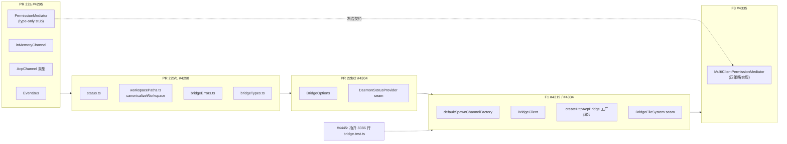
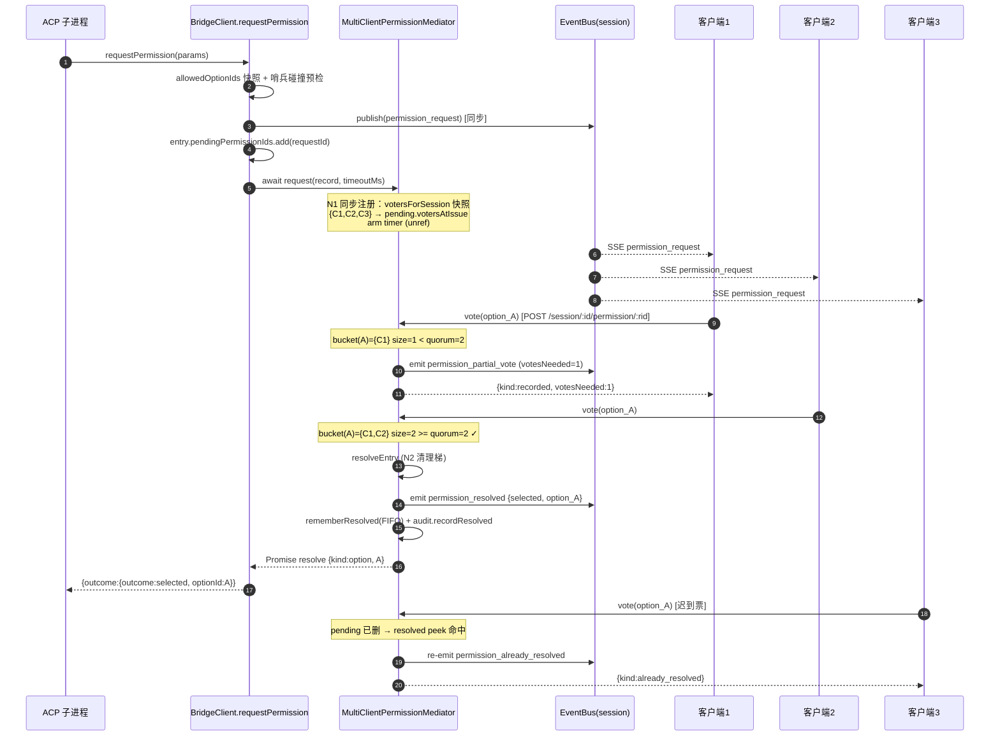
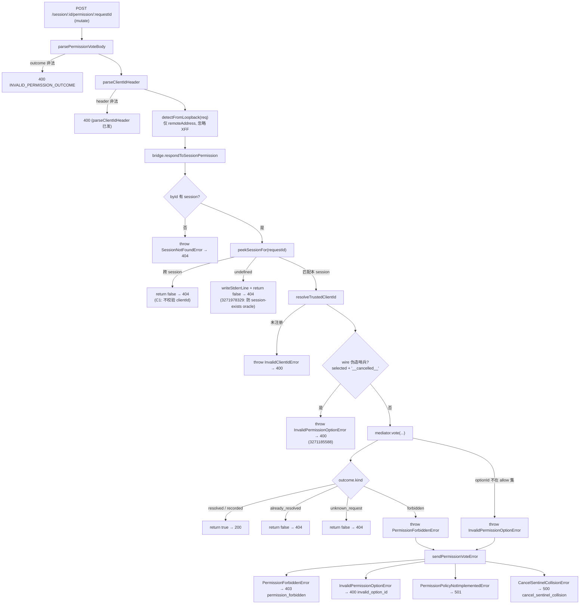

# acp-bridge 抽包与多客户端权限协调（深入）

> 子文档；总览见 [../README.md](../README.md)（以及总览正文 `daemon-serve-mode.md` §3.8、§3.9、§5.5）。本文在 file/symbol/line 级别**取代**总览的 §3.8 与 §3.9，深入到包边界的三个注入 seam（`BridgeOptions` / `DaemonStatusProvider` / `BridgeFileSystem`）、分阶段 lift 的行为保持纪律，以及 F3（#4335）多客户端权限仲裁的并发不变量（同步注册 N1、双解析守卫 N2、consensus 防灌票、cancel-sentinel 跨策略逃逸、loopback fail-closed、Promise 必 settle）。
>
> 代码锚点除特别说明外均以集成分支 `daemon_mode_b_main` 为准（读法：`git -C <repo> show daemon_mode_b_main:<path>`）。涉及文件主要位于 `packages/acp-bridge/src/`（抽出的包本体）与 `packages/cli/src/serve/`（daemon 装配 + 投票路由 + re-export shim）。
>
> 注意一处**文档与代码的时间差**：`packages/acp-bridge/README.md` 仍把 `PermissionMediator` 描述为 "type-only stub / No implementation yet"——那是 F1 抬包时点的快照。本文以 `daemon_mode_b_main` 上**已落地**的 `permissionMediator.ts`（1318 行）为准，F3 已把四策略实现合入。

---

## 概述

`packages/acp-bridge`（`package.json:name` = `@qwen-code/acp-bridge`，monorepo 内、不发 npm）抽出的是 **bridge 层的可复用原语**：事件总线（`EventBus`）、通道抽象（`AcpChannel`/`ChannelFactory`/`inMemoryChannel`）、权限契约与仲裁器（`permission.ts`/`permissionMediator.ts`）、工作区路径规范化（`canonicalizeWorkspace`）、状态线协议类型（`status.ts`）、错误分类（`bridgeErrors.ts`）、以及把这一切组装起来的工厂闭包 `createHttpAcpBridge`（`bridge.ts`）与 ACP `Client` 实现 `BridgeClient`（`bridgeClient.ts`）。

抽包要解决两件事：

1. **解耦**。bridge 的这套事件流/通道/权限/状态契约不止 `qwen serve` 要用——`packages/channels`、VSCode IDE companion、未来 TUI co-host、WebSocket transport 都要复用同一套原语。与其各写一套并行的事件流（最容易在 replay/背压语义上各自跑偏），不如抽成包，并通过**注入 seam** 让宿主（serve / IDE / 测试）把自己特有的行为塞进来，而 bridge 本身对宿主一无所知。
2. **行为保持**。抽包是大规模机械迁移，必须做到「搬家不改语义」——所有 `serve/` 内部相对导入零改造（靠 `httpAcpBridge.ts`/`eventBus.ts` re-export shim），所有线协议帧 byte-for-byte 不变，6800+ 行 bridge 测试一并抬升。

三个注入 seam 是抽包的接缝设计核心：

| seam | 声明位置 | 生产实现 | 作用 |
| --- | --- | --- | --- |
| `BridgeOptions` | `bridgeOptions.ts:BridgeOptions` | `runQwenServe.ts` 装配 | 工厂构造契约：唯一必填 `boundWorkspace`，其余是带默认值的旋钮 + 注入回调 |
| `DaemonStatusProvider` | `bridgeOptions.ts:DaemonStatusProvider` | `daemonStatusProvider.ts:createDaemonStatusProvider` | daemon-host 专属状态格（`process.env` 快照 + 节点/二进制 preflight） |
| `BridgeFileSystem` | `bridgeFileSystem.ts:BridgeFileSystem` | serve 侧 adapter 包 PR 18 `WorkspaceFileSystem` | ACP fs 代理：把 `readTextFile`/`writeTextFile` 路由到带 TOCTOU/symlink/审计的实现 |

外加 `ChannelFactory`（`channel.ts`）这个第四个 seam——它让 serve 之外、需要自己 `spawn` 子进程的宿主（IDE）也能装配 bridge。

而 **F3（#4335）多客户端权限协调** 是 acp-bridge 落地的最复杂子系统：同一 session 被多个客户端 attach 时，ACP 子进程的一次 `requestPermission` 要在多个客户端之间裁决。`MultiClientPermissionMediator` 单类用 `switch(pending.policy)` 分派四种策略，并通过一组并发不变量（N1/N2/O5/O8）保证「Promise 永远 settle、状态永远一致、线协议 byte-for-byte 兼容 pre-F3」。

---

## 涉及 PR（表格）

| PR | 标题（节选） | slice | 在本文的作用 |
| --- | --- | --- | --- |
| #4160 | refactor: extract `createInMemoryChannel` helper | 前置 | 把 in-memory 双流通道抽成 helper（`inMemoryChannel.ts` 的前身）。 |
| #4295 | acp-bridge skeleton（PR 22a） | 22a | 包骨架 + 抬升 `EventBus`/`inMemoryChannel`/`AcpChannel` 类型 + **冻结** `PermissionMediator` 类型契约（type-only stub）。 |
| #4298 | lift status/paths/errors（PR 22b/1） | 22b/1 | 抬升 `status.ts`/`workspacePaths.ts`/`bridgeErrors.ts`/`bridgeTypes.ts`。 |
| #4299 #4300 | typed channel-closed / missing-cli-entry | 重构 | 把 channel-closed / missing-cli-entry 从 regex 匹配改为 typed `instanceof` 异常（`mapDomainErrorToErrorKind`）。 |
| #4304 | BridgeOptions + DaemonStatusProvider（PR 22b/2） | 22b/2 | 抬升 `BridgeOptions` + 新增 `DaemonStatusProvider` 注入 seam。 |
| #4319 | F1 self-sufficiency | F1 | 包自给自足：抬升 `defaultSpawnChannelFactory` + `BridgeClient` + `createHttpAcpBridge` 工厂闭包 + 新增 `BridgeFileSystem` seam。 |
| #4334 | F1 follow-up: BridgeFileSystem wiring | F1 | `BridgeFileSystem` 接线 + `channelInfo` 修复。 |
| #4445 | lift `bridge.test.ts` | F1 | 把 6861 行 bridge 测试抬到 acp-bridge（`daemon_mode_b_main` 上已增长到 8386 行）。 |
| **#4335** | **feat(acp-bridge): F3 — multi-client permission coordination** | **F3** | **本文重点**：四策略实现 + `PermissionAuditRing` + 2 个新 SSE 事件 + 3 个 typed error（403/501/500）+ 设置项 + 能力面 + SDK reducer。 |

> #4335 已 **MERGED**。其 PR body 明确列出五条硬不变量（N1/N2/N3/O5/O8）与若干 out-of-scope follow-up（见本文末节）。

---

## 为什么抽 acp-bridge

### 解耦动机：包边界

抽包前，bridge 的全部实现都堆在 `packages/cli/src/serve/httpAcpBridge.ts` 一个文件里（连同 `pendingPermissions: Map`、`resolvedPermissions: LRU`、事件总线、通道工厂、错误类）。问题是：

- **复用者不止 serve**。`packages/channels/base/AcpBridge.ts`、VSCode IDE companion 都要 `spawn` `qwen --acp` 子进程并跑同一套 ACP `Client` 逻辑；如果各自重写子进程生命周期 + 事件扇出，就会出现 N 套**并行实现**，replay/背压/eviction 语义随时跑偏。
- **`serve/` 反向依赖塌缩**。bridge 既要被 serve 用，又依赖 serve 里的 `WorkspaceFileSystem`、`daemonStatusProvider` 等——循环依赖让单测必须拖进整个 HTTP 层。

抽包把**纯原语**沉到 `@qwen-code/acp-bridge`，把**宿主特有行为**留在 `cli/src/serve/`，二者用 seam 接口连接。包对外暴露两种导入形态（`package.json:exports`）：barrel 根 `@qwen-code/acp-bridge`（application/test 用，简洁），以及 per-module subpath（`/eventBus`、`/permission`、`/bridge`……，client adapter 用，依赖面显式 + 可 tree-shake）。两种解析到同一模块。

### seam 接口：让 daemon 注入行为

**`BridgeOptions`（`bridgeOptions.ts`）** 是工厂的构造契约，唯一硬必填是 `boundWorkspace`（且**必须**是 `canonicalizeWorkspace(path)` 的结果——构造器只 `path.isAbsolute` 校验，**不**重新 canonicalize，避免在 NFS-transient / mid-rename 文件系统上 bridge 与 `/capabilities` 各拿到一个 canonical 形）。其余字段分三类：

- **旋钮**：`maxSessions`（默认 20）、`eventRingSize`（默认 8000，`0`/`NaN`/负值 boot 抛错——fail-CLOSED）、`permissionResponseTimeoutMs`（默认 5min）、`maxPendingPermissionsPerSession`（默认 64）。
- **注入回调**：`persistApprovalMode` / `persistDisabledTools`（写 settings）、`childEnvOverrides`（per-handle env 隔离——`defaultSpawnChannelFactory` 在 **spawn 时**快照 `process.env`，多个嵌入式 daemon 共享进程时靠它避免互相污染 MCP 预算 env）、`contextFilename`、`onDiagnosticLine`（tee 调试行到 daemon 日志）。
- **seam 实现**：`channelFactory`、`statusProvider`、`fileSystem`、`telemetry`，外加 F3 的 `permissionPolicy` / `permissionConsensusQuorum` / `permissionAudit`。

**`DaemonStatusProvider`（`bridgeOptions.ts:DaemonStatusProvider`）** 是 22b/2（#4304）新增的窄 seam，只有两个方法：`getEnvStatus(boundWorkspace, acpChannelLive)` 与 `getDaemonPreflightCells(boundWorkspace)`。它把 daemon-host 专属的状态格（`process.versions`、运行时/sandbox/proxy 状态、Node 版本、CLI entry path、ripgrep/git/npm 探测）从 bridge 里剥出去。生产实现 `daemonStatusProvider.ts:createDaemonStatusProvider` 包了 `buildEnvStatusFromProcess` + `buildDaemonPreflightCells`；**省略 provider 时** bridge 回落 idle 占位符（空 `cells: []`），让 Mode A in-process 消费者（不跑独立 daemon、host env 格无意义）也能照常查询那些诊断路由。seam scope 刻意收窄到「当前 bridge 委派的两个 host 格」，注释明说**不是**通用 logger/metrics seam。

**`BridgeFileSystem`（`bridgeFileSystem.ts`）** 是 F1（#4319/#4334）新增的 ACP fs 代理 seam。方法签名刻意镜像 ACP SDK 的 `ReadTextFileRequest`/`WriteTextFileRequest` 形状，让 adapter 做最少翻译。当通过 `BridgeOptions.fileSystem` 接线时，`BridgeClient.readTextFile`/`writeTextFile` 把每次 ACP fs 调用委派给它，而非用 `BridgeClient` 内联的 `fs.realpath`/`fs.writeFile`/`fs.readFile` 代理。契约要求 adapter **复刻内联代理的两道防御**（非常规文件拒绝 + `READ_FILE_SIZE_CAP=100 MiB`），并提供写-then-rename 原子性、目标 mode 保留、新文件 `0o600` 默认、symlink 拒绝、workspace 边界。其中 **symlink 拒绝是相对 pre-F1 内联代理的有意分歧**——内联代理会解析 symlink 并写穿到目标，F1 后生产路径改为与 PR 18 / `POST /file`（PR 20）一致的保守姿态。

### `ChannelFactory`：第四个 seam

`channel.ts:ChannelFactory` 是 `AcpChannel`/`AcpChannelExitInfo` 的类型契约。`createHttpAcpBridge` 通过 `BridgeOptions.channelFactory` 消费它，默认值是 `defaultSpawnChannelFactory`（`spawnChannel.ts`，spawn `qwen --acp` 子进程 + stderr 前缀转发 + kill 级联 + env 直通）。channels 与 IDE companion 直接复用 `defaultSpawnChannelFactory`，而非各自重写子进程生命周期；`inMemoryChannel.ts` 则提供「不 spawn 子进程的成对 NDJSON 流」，用于 in-process bridge 测试与被搁置的 Mode A（`qwen --serve`）路径。

---

## 分阶段 lift 与行为保持

### 22a / 22b / F1 的渐进切片

抽包刻意切成多个 PR 渐进完成，每个切片都是「可独立 review、可独立回滚、行为零变化」的原子单元。切片顺序遵循**依赖拓扑**：先抬无依赖的叶子（22a 的 `EventBus`/`inMemoryChannel`），再抬被多处引用的契约（22b/1 的 status/paths/errors/types），再抬构造接缝（22b/2 的 `BridgeOptions` + `DaemonStatusProvider`），最后抬带状态的核心闭包（F1 的 `BridgeClient` + `createHttpAcpBridge` + `BridgeFileSystem`）。



关键纪律：**22a 先冻结 `PermissionMediator` 的 type-only 契约**（`permission.ts` 的 `PermissionPolicy` 4 字面量、`PermissionRequestRecord`、`PermissionVote`、`PermissionVoteOutcome`、`PermissionResolution`），让 F3 的实现是「填空」而非「重设计」。`permission.ts` 的 `PermissionRequestRecord` 形状刻意镜像当时 `BridgeClient` 里的 `PendingPermission` 记录，所以 F3 的 lift 是「结构性重命名」而非重构。

### cli 侧 re-export shim

行为保持的关键工具是 **re-export shim**：抽包后 serve 侧的旧文件退化为转发壳，所有相对导入零改造。

- **`serve/eventBus.ts`** 退化为一行 `export * from '@qwen-code/acp-bridge/eventBus';`。`serve/` 内部的 `import { ... } from './eventBus.js'` 与 `cli/src/commands/serve.ts` 的唯一外部 import 全部继续解析。
- **`serve/httpAcpBridge.ts`** 退化为 ~97 行 re-export shim，转发**每一个**先前导出的符号：`createHttpAcpBridge`（来自 `/bridge`）、`defaultSpawnChannelFactory`（来自 `/spawnChannel`）、`BridgeClient`（来自 `/bridgeClient`）、全部 typed error（来自 `/bridgeErrors`，含 F3 新增的 `CancelSentinelCollisionError`/`PermissionForbiddenError`/`PermissionPolicyNotImplementedError`）、全部类型别名（来自 `/bridgeTypes`/`/bridgeOptions`/`/bridgeFileSystem`）、`canonicalizeWorkspace`/`MAX_WORKSPACE_PATH_LENGTH`（来自 `/workspacePaths`）。`server.ts`/`runQwenServe.ts`/`workspaceAgents.ts`/`workspaceMemory.ts`/`index.ts` + bridge 测试套件的每一个 `./httpAcpBridge.js` import 零改动。

shim 里还留了一条值得注意的注释（`httpAcpBridge.ts`，wenshao review #4335 / 3272581548）：F3 删掉了 `MAX_RESOLVED_PERMISSION_RECORDS`、`PendingPermission`、`PermissionResolutionRecord` 的 re-export——因为这些状态被搬进了 mediator，mediator 声明了自己（形状不同）的 cap 与记录类型。这是 shim 唯一一处「不止转发、还反映了 F3 的状态归属迁移」的地方。

### `canonicalizeWorkspace` 逐字节契约

`workspacePaths.ts:canonicalizeWorkspace`（22b/1 抬升）是一个**跨模块契约**（README 称 BX9_q）：`config.ts`、`settings.ts`、`sandbox.ts`、bridge 层都必须用**同一种方式**规范化工作区路径，否则 `boundWorkspace` 检查与 `sessionScope:'single'` re-attach 会在不同路径拼写下退化。算法严格定义为：

1. `path.resolve(p)` 先归一 `..`/`.` 并绝对化；
2. `realpathSync.native(resolved)`——走 symlink 并返回**磁盘上的真实大小写**（macOS APFS / Windows NTFS 上 `/Work/A` 与 `/work/a` 是同一目录，但 `resolve` 原样返回，不归一就会让每个不同拼写的请求都被 `boundWorkspace` 拒掉）；
3. **仅 `ENOENT`**（路径还不存在：测试 fixture、先于 mkdir 的流程）回落到 `resolved`（未 canonicalize 形）——下游 `spawn({cwd})` 会用有用的 `ENOENT` 失败；
4. **其他 FS 错误**（`EACCES`/`EIO`/`ELOOP`）**向上抛**——吞掉它们会把瞬态 I/O 故障伪装成误导性的 `workspace_mismatch` 拒绝。

`canonicalizeWorkspace` 带一条 `FIXME(stage-2)`：`realpathSync.native` 是同步 syscall，跑在 `spawnOrAttach` 热路径上、每次调用阻塞事件循环一个 stat。单用户 loopback（Stage 1 设计目标）不在意；高并发部署会。`cli/src/serve/fs/paths.ts` 仍 re-export 它给指向旧位置的调用方。配套常量 `MAX_WORKSPACE_PATH_LENGTH = 4096`（Linux PATH_MAX）——`POST /session` 预检拒绝超长 body，`WorkspaceMismatchError` 对跳过预检的调用方截断（防 10MB body 经 error message 多次回显放大）。

---

## 多客户端权限协调（#4335）

这是本文重点。`packages/acp-bridge/src/permissionMediator.ts:MultiClientPermissionMediator`（1318 行）实现 `permission.ts:PermissionMediator` 契约，**拥有 bridge 的全部 pending + resolved 权限状态**——`httpAcpBridge.ts` 不再保留 `pendingPermissions: Map` 或 `resolvedPermissions`，它们都在这个类里。bridge 侧只在每个 `SessionEntry` 上保留一个 `entry.pendingPermissionIds: Set<string>` 作为快速 cap-check 索引，mediator 才是真相源。

策略分派刻意用「单类 + `vote()` 内 `switch (pending.policy)`」而非策略子类——每策略逻辑只有 5–15 行，子类化是 boilerplate 多于实质（`permissionMediator.ts` 模块 docstring 明说）。

### 四种策略

`vote()`（`permissionMediator.ts:560`）在做完前置守卫后 `switch (pending.policy)`（L628）分派到四个 private handler。**关键：策略是在 `request()` 发起时快照到 `pending.policy`（`MediatorPending` L297），而非投票时读取**——这样 daemon 设置 live-reload 不会改变 in-flight 请求的规则。

#### 1. `first-responder`（`voteFirstResponder` L700，v1 默认，最简）

任何已校验的投票者（路由层已经强制过 clientId / optionId / session ownership）**立即获胜**。这是 pre-F3 行为的 bit-for-bit 保留：构造 `{kind:'resolved', resolvedOptionId: vote.optionId}`，先 `audit.recordVoted`（ordering 不变量：`voted` 审计在 `resolved` 之前），再 `resolveEntry(...)` 以 `{kind:'option', optionId}` + decisionReason `{type:'first-responder', resolverClientId: vote.clientId}` 结算。`designated` 策略在 originator 缺省（匿名 prompt）时也回落到这条。

#### 2. `designated`（`voteDesignated` L732）

仅 prompt 的 `originatorClientId` 的票算数。三个分支：

- **匿名 prompt**（`pending.originatorClientId === undefined`，L740）→ 回落 `voteFirstResponder`。这是有文档的放宽：严格部署必须在 prompt 路由上强制 `X-Qwen-Client-Id`。
- **非 originator 投票**（`vote.clientId !== pending.originatorClientId`，L743）→ `audit.recordForbidden(..., 'designated_mismatch')` + `safeEmit` 一个 `permission_forbidden` SSE 事件（N3：新事件 stamp **prompt originator**，不是 voter）+ `writeForbiddenStderr` + 返回 `{kind:'forbidden', reason:'designated_mismatch'}`。
- **originator 投票** → 立即结算（语义上是 designated voter 的 first-responder），decisionReason `{type:'designated-originator', originatorClientId}`。

#### 3. `consensus`（`voteConsensus` L797，N-of-M quorum）

最复杂的策略，达到 quorum 才决。逐步：

1. **votersAtIssue 门**（L815）：`vote.clientId === undefined || !pending.votersAtIssue.has(vote.clientId)` → forbidden。匿名投票者与「prompt 发出**之后**才连上的客户端」都被拒。（`designated_mismatch` reason 码在这里被**复用**为「不在投票者集」——见已知限制 3271627459。）
2. **幂等 re-vote**（L859）：遍历 `pending.tallies`，若该 `clientId` 已在**任一** option 的桶里投过票，则保留原票，返回 `{kind:'recorded', votesNeeded}`，**不**再发 `partial_vote` 帧（tally 没变）。审计记录用**原始** optionId（从 tally 查回，3271041464）——否则审计环会显示「client_X 投了 option_B」而 tally 里 client_X 在 option_A 桶，运维读环会看到一张从未计入 quorum 的票。
3. **记票**（L877）：`bucket = pending.tallies.get(vote.optionId)`（无则新建 `Set<string>`），`bucket.add(vote.clientId)`。
4. **quorum 判定**（L884）：`quorum = consensusQuorumFor(pending)`，若 `bucket.size >= quorum` → 结算，decisionReason `{type:'consensus-quorum', resolvedOptionId, quorum, tally}`。
5. **未达 quorum** → 发 `permission_partial_vote` SSE（带 `votesReceived`/`votesNeeded`/`quorum`/`optionTallies`）+ 返回 `{kind:'recorded', votesNeeded}`。

#### 4. `local-only`（`voteLocalOnly` L954，仅 loopback）

`if (!vote.fromLoopback)` → forbidden（`remote_not_allowed` + 403）；否则立即结算，decisionReason `{type:'local-only-loopback', resolverClientId}`。`fromLoopback` 由路由层 `detectFromLoopback(req)` 内核戳定（见下文），**绝不**信任客户端自报。用例：工作站，远程控制永不应授予提权。

### 并发不变量

F3 的难点不在策略本身，而在六条并发不变量。它们共同保证「agent 等待的 Promise 永远 settle、状态在重入回调下永远一致、线协议兼容 pre-F3」。

#### N1：同步注册（`request()` L410）

`request()` 的 Promise executor 里**禁止 await**——pending entry 注册、审计记录、timer 安装全部同步发生在 `new Promise((resolve) => { ... })` 执行器内（L424-556 间无 await）。原因：bridge 的序列是 `entry.events.publish(...)` →（同步）→ `await mediator.request(record, ...)`。`EventBus.publish` 同步返回（扇到内存订阅队列，无事件循环让出），mediator 执行器也同步走完——所以一个**新** HTTP 客户端无法在 publish 与 snapshot 之间把自己的 clientId 注册到 `entry.clientIds` 上。如果 `votersForSession` 是 async（返回 `Promise<Set>`），就会把 pending 注册推迟过 bridge 的 `publish → register → await` 排序点，让一个与 issue 路径竞争的 `forgetSession` 漏掉新 pending、把它泄漏到 timeout。

这条不变量靠 `MediatorDeps.votersForSession` 的契约强制：**MUST 同步返回**（`permissionMediator.ts:243` JSDoc 明写）。bridge 的实现（`bridge.ts:854`）正是同步的 `(sid) => new Set(byId.get(sid)?.clientIds.keys() ?? [])`。session 在 publish 与 request 之间被拆（极窄竞争）时返回**空 Set** 而非抛错——first-responder 忽略 snapshot 所以无害，但 consensus 下空 votersAtIssue 意味着每张票都被「不在投票者集」拒，请求只能靠 `forgetSession` 清理或 timeout 结算（issue 时会写 stderr breadcrumb，L454）。

#### N2：`resolveEntry` 双解析守卫 + 清理梯（L1116）

`resolveEntry`（结算单个 pending）开头第一件事是**身份检查**：
```
if (this.pending.get(pending.requestId) !== pending) return;  // L1122 幂等 no-op
```
这道守卫覆盖两种竞争：(a) 同一 requestId 已在另一条路径结算（timer 与最后一票在同一 tick 到达）；(b) 一个**复用了同一 requestId** 的新请求（旧请求 LRU 淘汰后）。用 `!== pending`（**身份**比较）而非 `this.pending.has(requestId)`——后者会把「新请求」误判为「旧请求的 stale-timer 命中」。

timer 回调里也有对称的身份检查（L512）：`if (this.pending.get(record.requestId) !== pending) return;`，注释明说「`has(requestId)` 会把 fresh request 误当成 stale-timer fire」。

守卫通过后是**硬化的清理梯**（N2，6 步，注释 L1084-1115 逐字描述）：
1. `clearTimeout`（L1127）——timer 永不在半清理的 entry 上触发；
2. `this.pending.delete`（L1131）——状态移动的前半，entry 对新票不再可达；
3. `safeEmit` 线 `permission_resolved`（L1140）——**必须在第 4 步之前**：一个在 emit 期间同步再投票的重入订阅者会看到 `pending === undefined && resolved === undefined`（静默 false），匹配 pre-F3 顺序（I5）。反过来会让重入票找到新 LRU 记录、发冗余 `permission_already_resolved`；
4. `rememberResolved`（L1166）——状态移动的后半，此后到达的迟到票看到 `permission_already_resolved`；
5. `audit.recordResolved`（L1172，best-effort）；
6. `pending.resolve(resolution)`（L1181，**最后**）——重入运行的回调看到一致状态。

#### O5：cancel-sentinel 跨策略逃逸（L597）

`CANCEL_VOTE_SENTINEL = '__cancelled__'`（L64）是 voter `{outcome:'cancelled'}` 在调 `mediator.vote` 前被映射成的哨兵 optionId。`vote()` 在**策略分派之前**（L597，早于 L628 的 switch）就识别它，无视 active policy 直接结算为 `{kind:'cancelled', reason:'agent_cancelled'}`。

这是**有意的跨策略逃逸**：`local-only` 下的远程投票者、`consensus` 下不在投票者集的客户端，都仍能通过 POST `{outcome:'cancelled'}` 取消一个 pending。理由是 voter-cancel 是 agent 侧 abort 路径，不受 policy 门控（模块 docstring L50-57 明说，并叮嘱未来维护者别「修」这个 bypass）。

但哨兵有**两道碰撞防御**：

- **issue 时**（`request()` L418）：若 agent 声明的 `allowedOptionIds` 含哨兵，`request()` **在构造 Promise 之前同步抛** `CancelSentinelCollisionError`（路由映射 500）。同步抛是刻意的——「永不 settle 的 Promise + 抛出的错误」比干净 fail-fast 更糟。`bridgeClient.ts:353` 在 bridge 层有自己的同名预检（且在 publish `permission_request` **之前**，否则违规 agent 会留一个无结算的孤儿 SSE 事件）。
- **wire 时**（`bridge.ts:2611`）：mediator 在校验 `allowedOptionIds` 之前就认哨兵，所以一个 wire 客户端发 `{outcome:'selected', optionId:'__cancelled__'}` 会短路所有 policy 分派。bridge 的 `respondToSessionPermission` 显式拦截这种情况（wenshao review #4335 / 3271185588 Critical）：`if (response.outcome.outcome === 'selected' && response.outcome.optionId === CANCEL_VOTE_SENTINEL) throw new InvalidPermissionOptionError(...)`。issue 时的碰撞防御挡住「agent 把哨兵当 option 广告」，这道挡住「wire 客户端伪造哨兵」，两者闭合唯一向量。

#### 防灌票（consensus 的 Set-based tally）

consensus 的记票桶是 `Map<optionId, Set<clientId>>`（`MediatorPending.tallies`）。用 **Set** 而非计数器是防 ballot-stuffing 的关键：同一 `clientId` 反复 `bucket.add(clientId)` 是幂等的（Set 去重），quorum 看的是 `bucket.size`（唯一投票者数）而非「收到的投票次数」。再加上 L859 的幂等 re-vote 显式短路（同一 clientId 已在任一桶里就保留原票、不重复发 partial_vote），一个恶意客户端无法靠重发同一票把 tally 推过 quorum。`votersAtIssue.has(vote.clientId)` 门（L815）则保证只有 issue 时已注册的投票者能进桶。

#### loopback fail-closed（`detectFromLoopback`，`server.ts:3381`）

`local-only` 的 `fromLoopback` 由路由层 `detectFromLoopback(req)` 提供：
```
const addr = req.socket?.remoteAddress;
if (typeof addr !== 'string') return false;        // 缺失/非字符串 → false
if (addr === '::1') return true;                    // IPv6 loopback
if (addr.startsWith('127.')) return true;           // IPv4 127.0.0.0/8
if (addr.startsWith('::ffff:127.')) return true;    // IPv4-mapped IPv6
return false;
```
**只读内核戳定的 `req.socket.remoteAddress`，完全忽略 `X-Forwarded-For` 或任何 header**——这是 fail-closed 设计：可伪造的 header 永不参与 loopback 判定（PR body 明写 "does NOT consult X-Forwarded-For"；`server.test.ts:1048` 断言带 forwarded header 的请求仍 `false`）。两个投票路由（`POST /session/:id/permission/:requestId` L2575、`POST /permission/:requestId` L2621）都**无条件**把 `fromLoopback` 塞进 context（即使无 `X-Qwen-Client-Id` header）——先前的形状（`clientId !== undefined ? {clientId} : undefined`）会为匿名 loopback 投票者悄悄丢掉 loopback 位，而那恰是 `local-only` 的 happy path。

#### Promise 必 settle（`safeEmit`/`safeAudit`/`writeForbiddenStderr`）

emit / audit 是 best-effort 可观测面，绝不能让一个 publisher 异常从 `request()`/`vote()`/timer 回调里逃出去、把 agent 正在 await 的 Promise 留成未结算、pending 泄漏。三个 helper 用 try/catch 包住：

- `safeEmit`（L1195）：catch 后写 stderr breadcrumb，**且 breadcrumb 本身再套一层 try/catch**——`process.stderr.write` 在 daemon shutdown 时会因 EPIPE 同步抛，若逃出 `safeEmit` 就会从 `resolveEntry` 传出、留下未结算 Promise、agent 挂到 timeout（wenshao review #4335 / 3271041461 描述的精确挂起场景）。
- `safeAudit`（L1281）：同样的双层 try/catch。注释指出 pre-fix 时 5 个审计调用点只有 2 个有 try/catch，是真实的静默失败洞（Commit 1 review）；现在单一 helper 统一强制「audit is best-effort」不变量。
- `writeForbiddenStderr`（L1243）：三条 forbidden 路径（designated/consensus/local-only）的 stderr breadcrumb，同样套 try/catch——审计环与 SSE 都是瞬态可观测面（无 v1 查询路由、SSE 断连即丢），运维 tail stderr 否则看不到任何权限拒绝迹象。
- `stringifyError`（L182）：整体 try/catch，防 `Proxy`-wrapped error 或 getter-overriding 子类的 throwing `.name`/`.message` 逃出。

timer 回调（L504-543）也独立写一条「timed out after Xms」breadcrumb（即使生产 audit 是 no-op）+ `safeAudit(recordTimeout)`，且整段套 try/catch。

---

## 时序图

### ① 多客户端 consensus：投票 → quorum → 一次性 resolve

下图展示 M=3、默认 quorum=2（`floor(3/2)+1`）下，三个 attach 同一 session 的客户端投票直到 quorum 命中、一次性结算的链路。



要点：迟到的 C3 票走 `vote()` 的 `!pending` 分支（L563），命中 resolved peek，re-emit `permission_already_resolved`（`originatorClientId: undefined`，byte-for-byte 兼容，L578）并返回 `already_resolved`——bridge 把它映射为 `accepted=false → 404`。

### ② 权限投票注册 → 策略裁决 → typed error 映射（403/501/500）

下图展示一张票从 HTTP 路由进入、经 bridge 守卫、mediator 裁决、到 typed error 映射的完整决策树。



`sendPermissionVoteErrorImpl`（`server.ts:3568`）是 typed-error → HTTP 状态的集中映射，按 `instanceof` 分支（不文本匹配 message）：

| 异常 | HTTP | code | 语义 |
| --- | --- | --- | --- |
| `InvalidPermissionOptionError` | 400 | `invalid_option_id` | requestId 已知但 optionId 不在 agent 提供的集（如伪造被 `hideAlwaysAllow` 抑制的选项） |
| `PermissionForbiddenError` | 403 | `permission_forbidden` | 请求良构、投票者已鉴权，但 policy 拒票（designated 不匹配 / local-only 远程）；`reason` 原样转发 |
| `PermissionPolicyNotImplementedError` | 501 | `permission_policy_not_implemented` | operator 配了一个本 build 未实现的 policy；501 让 SDK 渲染「daemon 比设置旧，请升级」 |
| `CancelSentinelCollisionError` | 500 | `cancel_sentinel_collision` | agent/daemon 间契约违规（非客户端错误） |
| 其他 | 委派 `sendBridgeErrorImpl` | — | 通用 bridge error 映射 |

> `PermissionPolicyNotImplementedError`（→501）在 F3 后**生产不可达**（四策略全实现），但 class + 501 映射作为**前向兼容基础设施**保留：未来加第 5 个 policy 字面量、跨多 commit 实现时，中间 build 的桩可抛它，operator 得到干净 501 而非通用 500（`bridgeErrors.ts` 的 JSDoc 明说）。

---

## 边界与错误处理

### bridge 侧的两个安全 oracle 修复

F3 review 暴露并修复了两处「跨 session 客户端注册 oracle」——攻击者靠不同 `X-Qwen-Client-Id` 区分 400/404 来探测「某 clientId 是否在某活跃 session 注册」：

1. **`respondToSessionPermission`（`bridge.ts:2580`，3271978329 Critical）**：当 `peekSessionFor(requestId)` 返回 `undefined`（超时 / LRU 淘汰 / 从未注册），必须在 `resolveTrustedClientId` 之前短路 `return false`（→404）。否则会 fall through 到 `resolveTrustedClientId` 抛 `InvalidClientIdError`（→400），泄漏 session-exists 信息。修复同时把这条安全敏感守卫从 debug-gated `writeServeDebugLine` 提升为无条件 `writeStderrLine`（3272493792），让运维 tail stderr 能关联非预期 404。
2. **`respondToPermission`（daemon 级 legacy 路由，`bridge.ts:2496`，3272493777）**：先前调 `resolveAnyTrustedClientId` 的姿态是**反的**（未注册 clientId 返回 400、已注册返回 404），制造 oracle。修复改为与 session 路由同姿态：`peekSessionFor` + `byId.has(sessionId)` 任一不满足就 `return false`（→404），不做 clientId 校验。

`respondToPermission` 还有一个 I4 细节：mediator 的 resolved LRU **按设计**在 session 拆除后存活，所以即使 `peekSessionFor` 返回 sessionId，也要 `byId.has(sessionId)` 二次确认——否则转发到 session 路由会抛 `SessionNotFoundError`（pre-F3 这里是干净的 false→404）。

### 跨 session 票拒绝（`vote()` L591）

mediator 自己也防跨 session：`vote()` 里 `if (pending.sessionId !== vote.sessionId) return {kind:'unknown_request'}`（L591）。结合 bridge 的 peek 守卫，跨 session 票在两层都被挡。

### 错误分类（`mapDomainErrorToErrorKind`，`status.ts:844`）

#4299/#4300 把 channel-closed / missing-cli-entry 从 regex 匹配改为 typed `instanceof`：`BridgeTimeoutError → 'init_timeout'`、`BridgeChannelClosedError → 'protocol_error'`、`MissingCliEntryError → 'missing_binary'`。对**跨包**类（如 `SkillError`）则刻意 match `.name` 而非 `instanceof`——因为 bundle 重复会让 `instanceof` 在重复 class instance 间返回 false（L873 注释）。这套分类让 SDK 据 `errorKind` 渲染 typed 响应而非 regex 匹配人读字符串。

### `bridgeErrors.ts` 的 11+ typed error

`bridgeErrors.ts` 是集中错误分类法，每个是结构上可区分的 `Error` 子类，HTTP 路由层 `instanceof`-branch 映射到特定状态码、字段作为结构化 payload 落到 JSON body。F3 新增三个（`CancelSentinelCollisionError`/`PermissionForbiddenError`/`PermissionPolicyNotImplementedError`）已并入 shim 转发。`WorkspaceMismatchError` 的构造器把 `requested` 截断到 `MAX_WORKSPACE_PATH_LENGTH`（防 multi-MB cwd body 经 error 放大）。

---

## 关键设计决策与权衡

1. **mediator 拥有全部权限状态，bridge 只留 cap 索引**。F3 把 `pendingPermissions`/`resolvedPermissions` 从 `httpAcpBridge.ts` 整体搬进 `MultiClientPermissionMediator`，bridge 每 session 只留 `entry.pendingPermissionIds: Set` 做快速 cap-check。好处是单一真相源 + 可独立单测（`MediatorDeps` 让测试塞 stub）；代价是 bridge 与 mediator 间多了一层 `peekSessionFor`/`vote`/`forgetSession` 的窄接口协调。

2. **单类 switch 而非策略子类**。每策略 5–15 行，子类化是 boilerplate 多于实质。`switch (pending.policy)` 的 `default` 分支用 `const _exhaustive: never = pending.policy`（L640）做穷尽性检查——未来加 policy 字面量而不加 case 会编译失败。

3. **同步注册（N1）是整个并发模型的地基**。`votersForSession` MUST 同步返回这条契约，把「publish → register → await」收敛成一个不可中断的同步序列，让 `forgetSession` 与 issue 路径的竞争从根上消失。代价是 `votersForSession` 不能做 I/O（只能读内存 `byId`）。

4. **cancel 跨策略逃逸是有意的**。voter-cancel 是 agent-side abort 路径，不应被 policy 门控——否则一个 `local-only` daemon 上的远程客户端连「取消自己触发的误操作」都做不到。代价是 `local-only`/`consensus` 的「拒绝远程/非投票者」承诺对 cancel **不**成立（见已知限制）。两道碰撞防御（issue 时 throw + wire 时 throw）把这个逃逸的攻击面收回到「真正的 cancel 意图」。

5. **线协议 byte-for-byte 兼容 pre-F3（O8/A4）**。`permission_resolved.originatorClientId` stamp 的是 **voter** 的 clientId（不是 prompt originator），这与 `permission_request.originatorClientId`（是 prompt originator）**不一致**。F3 **刻意不修**这个不一致以保线形（`bridge.test.ts`/`httpAcpBridge.test.ts` 快照断言），只通过新增 `data.voterClientId`（A4）作为规范名、`originatorClientId` 降级为其 deprecated alias。新事件（`permission_partial_vote`/`permission_forbidden`）则 stamp prompt originator（N3）。

6. **audit 与 SSE 是两条独立通道**。`PermissionAuditPublisher`（生产是 `PermissionAuditRing`，默认 512）写内存有界环，**不**上 SSE 总线——审计记录是取证用（区分 `agent-cancelled` vs `voter-cancelled`，二者线形折叠成同一 `{kind:cancelled, reason:agent_cancelled}`），SSE 是 UI 用。`PermissionDecisionReason`（L99，借自 claude-code）是 discriminated union，只活在审计日志里。

7. **runtime 活跃策略 vs build-supported 集**。`/capabilities.policy.permission` 暴露 runtime 活跃策略；能力 `permission_mediation.modes` 暴露 build 支持的四策略集。客户端 gate on features，再读 `policy.permission` 决定 UI。

---

## 已知限制 / 后续

1. **`rememberResolved` 是 FIFO，不是 LRU**（`permissionMediator.ts:1184`，DeepSeek review #4335 / 3271627446）。淘汰用 `resolvedOrder.shift()`（丢最旧插入），**不是** LRU（不按访问顺序）。这点很重要：总览正文与 `permissionMediator.ts` 模块 docstring 仍有几处把它称作 "LRU"（如 L13 "resolvedPermissions: LRU"、L1132 注释 "resolved-LRU"），那是 pre-F3 内联实现的遗留措辞。实际语义以 `rememberResolved` 的 `shift()` 为准——FIFO。cap `MAX_RESOLVED_PERMISSION_RECORDS = 512`（L77），只存 requestId/sessionId/outcome/resolverClientId，512 条 << 100 KB。

2. **跨策略 cancel 无逃生口的反面**：`local-only` 远程客户端能 cancel 但不能 resolve；`consensus` 非投票者能 cancel 但不能投票。要严格 cancel-too 语义，必须 (a) 在 loopback bind 部署专用 daemon，或 (b) 等后续 PR 把 cancel 抬进 per-policy 门控（`voteLocalOnly` 的 JSDoc L940-953 明说 F3 v1 保持跨策略 cancel 以与其他策略一致）。

3. **`designated_mismatch` reason 码被复用**（DeepSeek review #4335 / 3271627459）：consensus 的「不在投票者集」与 designated 的「不是 prompt originator」共用同一 wire 字符串与审计 reason。未来 PR 可拆成 `voter_not_eligible` / `not_originator`，待 SDK 消费者需要区分时再做，F3 v1 保持复用以避免协议 churn。

4. **consensus 的两个时序陷阱**：(a) 空 `votersAtIssue`（session 在 publish 与 request 间被拆）下请求只能靠 timeout 结算（issue 时写 stderr breadcrumb，L454）；(b) **late-joiner**——publish 之前已连 SSE 但还没打过任何 session 路由（bridge 不知其 `X-Qwen-Client-Id`）的订阅者不在 snapshot 里，consensus 会静默拒它后续的票（wenshao review 3271041469）。UI 应把 `permission_request` 当作活跃投票者集的权威 cutoff。

5. **M=2 consensus 要求 unanimity**：默认 `floor(M/2)+1` 在 M=2 时 = 2（全票）。issue 时写一条 **per-mediator 生命周期一次** 的 stderr breadcrumb（`unanimityBreadcrumbEmitted` 去重，L365/L482）——否则 2-client consensus session 每次权限请求都会刷同一行（unanimity 是 M=2 的正常运行模式，不是罕见边缘）。

6. **审计环无查询路由**。`PermissionAuditRing` 活在 daemon 生命周期内，但 `GET /workspace/permission/audit` 查询路由是 out-of-scope follow-up（F3 只 stage 环）。同样 out-of-scope 的还有：consensus 投票者鉴权的 **pair-token + 撤销 API**、`POST /workspace/policy` live-reload（今天靠 daemon 重启）、决策持久化（"always allow" 规则）、hook 层（PreToolUse-style 外部仲裁器）。

7. **`README.md` 描述陈旧**。`packages/acp-bridge/README.md` 仍把 mediator 描述为 "type-only stub / No implementation yet / F3 PR 24 will move that"——那是 F1 抬包时点的快照，F3（#4335）已落地实现。读 README 时需注意这层时间差。

---

## 测试覆盖

| 测试文件:符号 | 行数 | 覆盖点 |
| --- | --- | --- |
| `permissionMediator.test.ts` | 1219 | 四策略 × happy/forbidden/timeout/forgetSession；N1 同步注册（L132）；O8 voter-clientId-as-originator（L145）+ 无 clientId 时双省略（L195）；duplicate-vote already_resolved re-emit（L210）；cross-session unknown_request（L251）；cancel 哨兵跨策略（L279/L342/L364）+ 不校验 allowedOptionIds（L319）+ issue 时碰撞拒绝（L393）；consensus quorum（L670）、幂等 re-vote 不改 tally + 审计记原始 optionId（L714/L742）、M=4 N=3 split 2-2 永不决并超时（L880）、override 封顶 M（L908）、**48-case 投票交错枚举**（property-style，L929）、partial_vote 在 resolved 之前（L997）；**N2 清理梯**——emit throw（L1077）/ audit 在 5 个调用点 throw（recordRequested+recordResolved L1103、recordVoted vote 路径 L1131、cancel 路径 L1159、recordTimeout L1190）Promise 仍 settle。 |
| `bridge.test.ts` | 8386 | F1 抬升（#4445，抬时 6861 行）。policy accessor、quorum 校验、`respondToSessionPermission`/`respondToPermission` 的 oracle 守卫、cancel 哨兵 wire 拦截、first-responder bit-for-bit 快照。 |
| `server.test.ts` | — | `detectFromLoopback` 参数化（L1010，含 `::1`/`127.`/`::ffff:127.` 真值 + forwarded-header 仍 false L1048）；`sendPermissionVoteError branches`（L7601，403/501/500/400 分支）。 |
| `eventBus.test.ts` / `inMemoryChannel.test.ts` / `status.test.ts` / `spawnChannel.test.ts` / `bridgeClient.test.ts` | 740 / 224 / 240 / 243 / 446 | 抽包随附测试：ring replay/背压/eviction、in-memory 双流 `abort()`、状态线协议类型 + `mapDomainErrorToErrorKind`、`scrubChildEnv` + kill 级联、BridgeClient first-responder 流 + fs 代理。 |

> PR #4335 body 自报的测试规模：35 mediator 单测、10 audit ring 测、55 SDK reducer 测（8 个新 partial_vote/forbidden + ordering + 前向兼容）、3 bridge 集成测；pre-existing `httpAcpBridge.test.ts` 快照套件保持绿（first-responder byte-for-byte 保留）。
