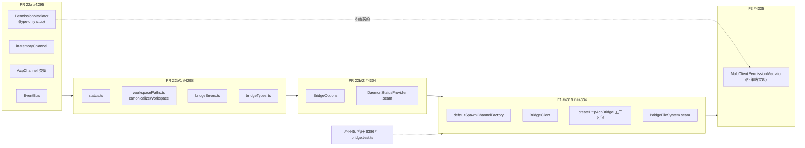
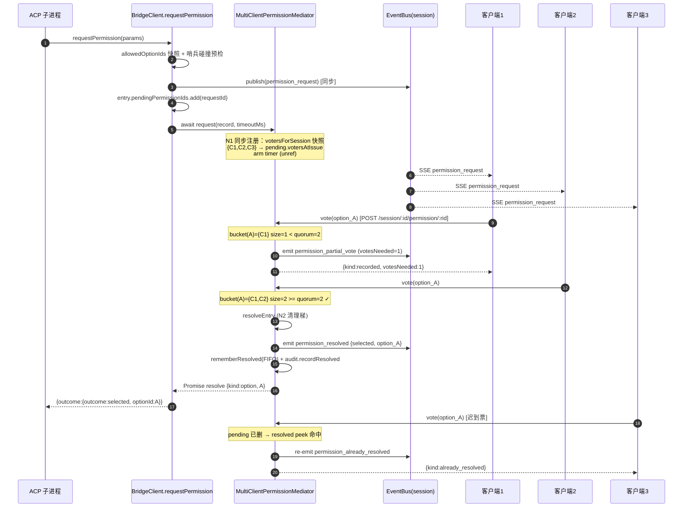
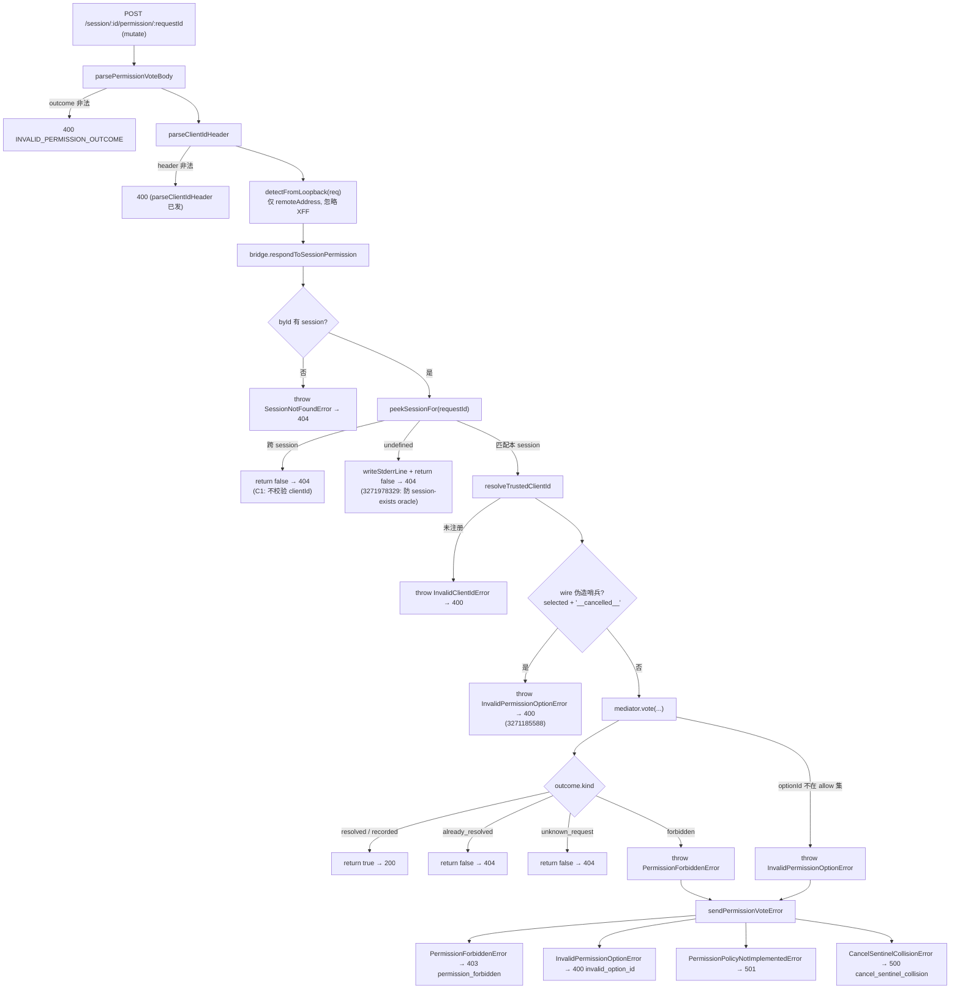

# acp-bridge 抽包与多客户端权限协调（深入）

> 子文档；总览见 [README.md](README.md)（以及总览正文 `daemon-serve-mode.md` §3.8、§3.9、§5.5）。本文在 file/symbol/line 级别**取代**总览的 §3.8 与 §3.9，深入到包边界的三个注入 seam（`BridgeOptions` / `DaemonStatusProvider` / `BridgeFileSystem`）、分阶段 lift 的行为保持纪律、#8620 已合入的 same-host daemon read/write delegation 能力拆分、#8852 已合入的 approved external built-in text write provenance/host route、#8911 已合入的 daemon ACP NDJSON bounds、#8947 已合入的 ACP transport resource guard、#9007 已合入的 ACP HTTP pre-attach buffer byte budget、#9134/#9820 已合入的 active-work close refusal 与 hold 上限、#9976 已合入的 channel transport liveness、#9978/#10179 已合入的 standalone private service/guard 与 public route、#9838/#10144 已合入的 current-session scheduled-task creator 与 empty-session persistence、#10142 已合入的 process-tree ownership、#10268 已合入的 new-session deadline/late cleanup，以及 F3（#4335）多客户端权限仲裁的并发不变量。W25 follow-up 与 #9933 在此基础上补齐 Agent 工具权限提示、取消后停止 turn、可配置响应超时和默认无限等待。
>
> 早期 file/symbol/line 锚点保留 `daemon_mode_b_main` 集成分支语境；daemon feature batch 已随 #4490 合入 `main`，W25 follow-up（#5085/#5105/#5174/#5218/#5258/#5260）与 #5955 bridge wrapper cleanup 以当前 `main` 实现为准。涉及文件主要位于 `packages/acp-bridge/src/`（抽出的包本体）与 `packages/cli/src/serve/`（daemon 装配 + 投票路由；F1 时保留过 re-export shim，#5955 后剩余 event-bus/status/in-memory-channel wrapper 已删除）。
>
> 注意一处**文档与代码的时间差**：`packages/acp-bridge/README.md` 仍把 `PermissionMediator` 描述为 "type-only stub / No implementation yet"——那是 F1 抬包时点的快照。本文以 `daemon_mode_b_main` 上**已落地**的 `permissionMediator.ts`（1318 行）为准，F3 已把四策略实现合入。

---

## 概述

`packages/acp-bridge`（`package.json:name` = `@qwen-code/acp-bridge`，monorepo 内、不发 npm）抽出的是 **bridge 层的可复用原语**：事件总线（`EventBus`）、通道抽象（`AcpChannel`/`ChannelFactory`/`inMemoryChannel`）、权限契约与仲裁器（`permission.ts`/`permissionMediator.ts`）、工作区路径规范化（`canonicalizeWorkspace`）、状态线协议类型（`status.ts`）、错误分类（`bridgeErrors.ts`）、以及把这一切组装起来的工厂闭包 `createHttpAcpBridge`（`bridge.ts`）与 ACP `Client` 实现 `BridgeClient`（`bridgeClient.ts`）。

抽包要解决两件事：

1. **解耦**。bridge 的这套事件流/通道/权限/状态契约不止 `qwen serve` 要用——`packages/channels`、VSCode IDE companion、未来 TUI co-host、WebSocket transport 都要复用同一套原语。与其各写一套并行的事件流（最容易在 replay/背压语义上各自跑偏），不如抽成包，并通过**注入 seam** 让宿主（serve / IDE / 测试）把自己特有的行为塞进来，而 bridge 本身对宿主一无所知。
2. **行为保持**。抽包是大规模机械迁移，必须做到「搬家不改语义」——F1 阶段靠 `httpAcpBridge.ts`/`eventBus.ts` re-export shim 让 `serve/` 内部相对导入零改造，所有线协议帧 byte-for-byte 不变，6800+ 行 bridge 测试一并抬升；#5955 后 active CLI consumers 已迁到 package exports，并删除剩余 event-bus/status/in-memory-channel wrapper。

三个注入 seam 是抽包的接缝设计核心：

| seam | 声明位置 | 生产实现 | 作用 |
| --- | --- | --- | --- |
| `BridgeOptions` | `bridgeOptions.ts:BridgeOptions` | `runQwenServe.ts` 装配 | 工厂构造契约：唯一必填 `boundWorkspace`，其余是带默认值的旋钮 + 注入回调；#8620 merged diff 新增 `delegateReadTextFileToClient` 读委派旋钮 |
| `DaemonStatusProvider` | `bridgeOptions.ts:DaemonStatusProvider` | `daemonStatusProvider.ts:createDaemonStatusProvider` | daemon-host 专属状态格（`process.env` 快照 + 节点/二进制 preflight） |
| `BridgeFileSystem` | `bridgeFileSystem.ts:BridgeFileSystem` | serve 侧 adapter 包 PR 18 `WorkspaceFileSystem` | ACP fs 代理：把 `readTextFile`/`writeTextFile` 路由到带 TOCTOU/symlink/审计的实现 |

外加 `ChannelFactory`（`channel.ts`）这个第四个 seam——它让 serve 之外、需要自己 `spawn` 子进程的宿主（IDE）也能装配 bridge。

而 **F3（#4335）多客户端权限协调** 是 acp-bridge 落地的最复杂子系统：同一 session 被多个客户端 attach 时，ACP 子进程的一次 `requestPermission` 要在多个客户端之间裁决。`MultiClientPermissionMediator` 单类用 `switch(pending.policy)` 分派四种策略，并通过一组并发不变量（N1/N2/O5/O8）保证「Promise 永远 settle、状态永远一致、线协议 byte-for-byte 兼容 pre-F3」。

---

## 涉及 PR（表格）

| PR | 标题（节选） | slice | 在本文的作用 |
| --- | --- | --- | --- |
| #4160 | refactor: extract `createInMemoryChannel` helper | 前置 | 把 in-memory 双流通道抽成 helper（`inMemoryChannel.ts` 的前身）。 |
| #4295 | acp-bridge skeleton（PR 22a） | 22a | 包骨架 + 抬升 `EventBus`/`inMemoryChannel`/`AcpChannel` 类型 + **冻结** `PermissionMediator` 类型契约（type-only stub）。 |
| #4298 | lift status/paths/errors（PR 22b/1） | 22b/1 | 抬升 `status.ts`/`workspacePaths.ts`/`bridgeErrors.ts`/`bridgeTypes.ts`。 |
| #4299 #4300 | typed channel-closed / missing-cli-entry | 重构 | 把 channel-closed / missing-cli-entry 从 regex 匹配改为 typed `instanceof` 异常（`mapDomainErrorToErrorKind`）。 |
| #4304 | BridgeOptions + DaemonStatusProvider（PR 22b/2） | 22b/2 | 抬升 `BridgeOptions` + 新增 `DaemonStatusProvider` 注入 seam。 |
| #4319 | F1 self-sufficiency | F1 | 包自给自足：抬升 `defaultSpawnChannelFactory` + `BridgeClient` + `createHttpAcpBridge` 工厂闭包 + 新增 `BridgeFileSystem` seam。 |
| #4334 | F1 follow-up: BridgeFileSystem wiring | F1 | `BridgeFileSystem` 接线 + `channelInfo` 修复。 |
| #4445 | lift `bridge.test.ts` | F1 | 把 6861 行 bridge 测试抬到 acp-bridge（`daemon_mode_b_main` 上已增长到 8386 行）。 |
| **#4335** | **feat(acp-bridge): F3 — multi-client permission coordination** | **F3** | **本文重点**：四策略实现 + `PermissionAuditRing` + 2 个新 SSE 事件 + 3 个 typed error（403/501/500）+ 设置项 + 能力面 + SDK reducer。 |
| #5085/#5105 | Agent permission prompt via `_meta.toolName` | 权限 UI follow-up | 保持 ACP wire `kind:'other'` 合法，同时用 `_meta.toolName` 让 Agent 工具在 daemon web-shell / VS Code 显示专属权限提示。 |
| #5174 | daemon status API | 诊断面 | 通过 bridge / ACP registry snapshot helper 暴露 `GET /daemon/status`，让权限压力、SSE/ACP 连接和 capability 状态进入统一 JSON 诊断面。 |
| #5218/#5258 | stop after cancelled permissions | ACP turn loop | cancelled `ask_user_question`、普通工具权限取消、reject→Cancel、权限请求通道失败都会停止当前 turn 并跳过后续工具。 |
| #5260 | configurable permission timeout | 运行时配置 | `qwen serve --permission-response-timeout-ms` 把 bridge `permissionResponseTimeoutMs` 从硬编码 5 分钟变成 operator 可配置。 |
| #9933 | disable permission timeout by default | merged 运行时默认 | 把 shared default 改为 0；省略/0 不安装普通权限或 AUQ timer，显式正数继续生效。 |
| #9665 | restore `ask_user_question` on load/resume | merged restore follow-up | 默认关闭的 serve flag 只对尾部纯 AUQ batch 跳过 orphan finalize，并通过 trusted tracked prompt 生成新 request id、复用既有投票与 cancel 语义。 |
| #9763 | restored `ask_user_question` hardening | merged restore follow-up | 普通发送先闭合 dangling call，replay/re-hang suppress 锁步，post-answer notice 与整批 unattended persistence 保持可再次恢复。 |
| #8620 | same-host daemon text read delegation | FS seam follow-up | 最终实现用 `delegateReadTextFileToClient:false` 让 daemon-owned same-host bridge 广告 read local / write delegated，避免批准后的 direct read 被 WorkspaceFileSystem workspace 边界拒绝。 |
| #8852 | approved external built-in text writes | FS seam follow-up | 最终实现用 versioned `tool-write-origin` provenance 让已批准的内置 text write 在 daemon-owned same-host adapter 上进入受控 host writer；HTTP/通用 ACP 不放宽。 |
| #8911 | bound daemon ACP NDJSON buffers | transport resource guard | 已合入，daemon-owned ACP child 的 NDJSON frame 与 decoded inbound queue 使用固定 bounds，超限低敏记录并终止精确 child。 |
| #8947 | close daemon ACP resource guard gaps | transport resource guard | 已合入，在 #8911 raw stream bounds 之外补 handler、prepared response、outbound op 与 outstanding request 的 count/byte guard。 |
| #9007 | bound ACP HTTP pre-attach buffers by bytes | ACP HTTP transport resource guard | 已合入，为 pre-attach buffered replies 增加 stream/connection/global frame 与 byte budget，并把 ownership grant 绑定到 local delivery。 |
| #9134 | preserve sessions when active-work close is refused | active-work close lifecycle | 已合入；`onlyIfUnheld` close 拒绝前不破坏 session，deferred spawn-owner kill 避开 close/probe in-flight，definitive child close refusal 不升级为 channel kill。 |
| #9820 | bound conditional-close refusal holds | active-work close lifecycle | 已合入；拒绝仍保留 session，但只采纳最多 1024 条 holds，超限保留最后合法 cache。 |
| #9838 | support current-session scheduled tasks | merged private bridge extension | 用 connection/session/active prompt/source/bounds 校验 private creator，再交给 Serve host 做 runtime/session/task binding admission。 |
| #9976 | add ACP channel transport liveness | merged transport lifecycle | private initialize 协商后按 shared channel 运行 nonce probe；双按时 timeout 或无效响应进入既有 transport-failure teardown。 |
| #9978 | add standalone sessions for projectless tasks | merged private service integration | 增加 daemon-owned standalone creation/source contract、service owner routing、deferred cwd activation 与 source-aware guards；该 PR 无 public standalone API。 |
| #10142 | reap ACP child process trees | merged tree ownership | 最终实现给标准 ACP spawn 增加 bounded ancestry/PGID tracking、TERM→KILL、root-exit cleanup 和 SIGHUP lifecycle。 |
| #10144 | persist empty sessions before task binding | merged private persistence | existing-session task commit 前通过 bridge 写入 default source anchor，不触发模型/hook/可见消息。 |
| #10179 | standalone daemon session API | merged public lifecycle | 最终实现在 private service 上增加 exact-owner route family、conditional capability 与 journaled delete；SDK/UI 不在该 PR 范围。 |
| #10268 | cancel timed-out session initialization | merged initialization lifecycle | 最终传递 private absolute deadline，child 发布前取消；旧 child 由 bridge 做迟到 exact close、ID fence 与 fresh-admission quarantine。 |

> #4335 已 **MERGED**。其 PR body 明确列出五条硬不变量（N1/N2/N3/O5/O8）与若干 out-of-scope follow-up（见本文末节）。

---

## 为什么抽 acp-bridge

### 解耦动机：包边界

抽包前，bridge 的全部实现都堆在 `packages/cli/src/serve/httpAcpBridge.ts` 一个文件里（连同 `pendingPermissions: Map`、`resolvedPermissions: LRU`、事件总线、通道工厂、错误类）。问题是：

- **复用者不止 serve**。`packages/channels/base/AcpBridge.ts`、VSCode IDE companion 都要 `spawn` `qwen --acp` 子进程并跑同一套 ACP `Client` 逻辑；如果各自重写子进程生命周期 + 事件扇出，就会出现 N 套**并行实现**，replay/背压/eviction 语义随时跑偏。
- **`serve/` 反向依赖塌缩**。bridge 既要被 serve 用，又依赖 serve 里的 `WorkspaceFileSystem`、`daemonStatusProvider` 等——循环依赖让单测必须拖进整个 HTTP 层。

抽包把**纯原语**沉到 `@qwen-code/acp-bridge`，把**宿主特有行为**留在 `cli/src/serve/`，二者用 seam 接口连接。包对外暴露两种导入形态（`package.json:exports`）：barrel 根 `@qwen-code/acp-bridge`（application/test 用，简洁），以及 per-module subpath（`/eventBus`、`/permission`、`/bridge`……，client adapter 用，依赖面显式 + 可 tree-shake）。两种解析到同一模块。

### seam 接口：让 daemon 注入行为

**`BridgeOptions`（`bridgeOptions.ts`）** 是工厂的构造契约，唯一硬必填是 `boundWorkspace`（且**必须**是 `canonicalizeWorkspace(path)` 的结果——构造器只 `path.isAbsolute` 校验，**不**重新 canonicalize，避免在 NFS-transient / mid-rename 文件系统上 bridge 与 `/capabilities` 各拿到一个 canonical 形）。其余字段分三类：

- **旋钮**：`maxSessions`（默认 20）、`eventRingSize`（默认 8000，`0`/`NaN`/负值 boot 抛错——fail-CLOSED）、`permissionResponseTimeoutMs`（#9933 后默认 0，即不安装 timer）、`maxPendingPermissionsPerSession`（默认 64）。
- **注入回调**：`persistApprovalMode` / `persistDisabledTools`（写 settings）、`childEnvOverrides`（per-handle env 隔离——`defaultSpawnChannelFactory` 在 **spawn 时**快照 `process.env`，多个嵌入式 daemon 共享进程时靠它避免互相污染 MCP 预算 env）、`contextFilename`、`onDiagnosticLine`（tee 调试行到 daemon 日志）。
- **seam 实现**：`channelFactory`、`statusProvider`、`fileSystem`、`telemetry`，外加 F3 的 `permissionPolicy` / `permissionConsensusQuorum` / `permissionAudit`。

#5260 把原先只能由嵌入方传入的 `permissionResponseTimeoutMs` 暴露成 `qwen serve --permission-response-timeout-ms`。#9933 已把默认改为 `0`：省略/0 表示无限等待，显式正数启用 deadline；`runQwenServe` 在启动期拒绝非有限、负数、非整数；bridge 侧再把超大正数 clamp 到 `2^31-1`，避免 Node timer overflow 把"很长超时"退化成 1ms 立即取消。需要旧 5 分钟行为时显式配置 `300000`。

**`DaemonStatusProvider`（`bridgeOptions.ts:DaemonStatusProvider`）** 是 22b/2（#4304）新增的窄 seam，只有两个方法：`getEnvStatus(boundWorkspace, acpChannelLive)` 与 `getDaemonPreflightCells(boundWorkspace)`。它把 daemon-host 专属的状态格（`process.versions`、运行时/sandbox/proxy 状态、Node 版本、CLI entry path、ripgrep/git/npm 探测）从 bridge 里剥出去。生产实现 `daemonStatusProvider.ts:createDaemonStatusProvider` 包了 `buildEnvStatusFromProcess` + `buildDaemonPreflightCells`；**省略 provider 时** bridge 回落 idle 占位符（空 `cells: []`），让 Mode A in-process 消费者（不跑独立 daemon、host env 格无意义）也能照常查询那些诊断路由。seam scope 刻意收窄到「当前 bridge 委派的两个 host 格」，注释明说**不是**通用 logger/metrics seam。

**`BridgeFileSystem`（`bridgeFileSystem.ts`）** 是 F1（#4319/#4334）新增的 ACP fs 代理 seam。方法签名刻意镜像 ACP SDK 的 `ReadTextFileRequest`/`WriteTextFileRequest` 形状，让 adapter 做最少翻译。当通过 `BridgeOptions.fileSystem` 接线时，`BridgeClient.readTextFile`/`writeTextFile` 把 ACP fs 调用委派给它，而非用 `BridgeClient` 内联的 `fs.realpath`/`fs.writeFile`/`fs.readFile` 代理。契约要求 adapter **复刻内联代理的两道防御**（非常规文件拒绝 + `READ_FILE_SIZE_CAP=100 MiB`），并提供写-then-rename 原子性、目标 mode 保留、新文件 `0o600` 默认、symlink 拒绝、workspace 边界。其中 **symlink 拒绝是相对 pre-F1 内联代理的有意分歧**——内联代理会解析 symlink 并写穿到目标，F1 后生产路径改为与 PR 18 / `POST /file`（PR 20）一致的保守姿态。

#8620 已合入后没有移除 `BridgeFileSystem` seam，而是在 `BridgeOptions` 上增加 `delegateReadTextFileToClient`。same-host daemon-owned bridge 传 `false` 后，initialize capability 广告 `readTextFile:false, writeTextFile:true`：子进程本地处理 direct read 和各种 pre-read，最终 text write 仍委派 WorkspaceFileSystem。通用 ACP bridge、caller-injected bridge 和非 same-host 宿主保持默认 delegated read/write；adapter 的 read 分支保留为异常 delegated read 的 fail-closed fallback。

#8852 已合入后，same-host final write 的一小段已授权外部路径不再无条件回落到 WFS workspace boundary。core built-in `write_file`、edit、notebook edit 和 controlled shell sed edit 会携带版本化 `qwen-code/tool-write-origin` `_meta`；只有 daemon-owned adapter、trusted runtime、live generation、合法 marker 和 workspace 外目标同时成立时，`BridgeFileSystem.writeText` 才路由到 host writer。workspace 内写入仍走 WFS；HTTP `/file`、通用 ACP、caller-injected bridge、伪造/缺失 marker 或 untrusted/stale runtime 继续 fail closed。

### `ChannelFactory`：第四个 seam

`channel.ts:ChannelFactory` 是 `AcpChannel`/`AcpChannelExitInfo` 的类型契约。`createHttpAcpBridge` 通过 `BridgeOptions.channelFactory` 消费它，默认值是 `defaultSpawnChannelFactory`（`spawnChannel.ts`，spawn `qwen --acp` 子进程 + stderr 前缀转发 + kill 级联 + env 直通）。channels 与 IDE companion 直接复用 `defaultSpawnChannelFactory`，而非各自重写子进程生命周期；`inMemoryChannel.ts` 则提供「不 spawn 子进程的成对 NDJSON 流」，用于 in-process bridge 测试与被搁置的 Mode A（`qwen --serve`）路径。

---

## 分阶段 lift 与行为保持

### 22a / 22b / F1 的渐进切片

抽包刻意切成多个 PR 渐进完成，每个切片都是「可独立 review、可独立回滚、行为零变化」的原子单元。切片顺序遵循**依赖拓扑**：先抬无依赖的叶子（22a 的 `EventBus`/`inMemoryChannel`），再抬被多处引用的契约（22b/1 的 status/paths/errors/types），再抬构造接缝（22b/2 的 `BridgeOptions` + `DaemonStatusProvider`），最后抬带状态的核心闭包（F1 的 `BridgeClient` + `createHttpAcpBridge` + `BridgeFileSystem`）。


```mermaid
flowchart LR
    subgraph 22a["PR 22a #4295"]
        A1["EventBus"]
        A2["inMemoryChannel"]
        A3["AcpChannel 类型"]
        A4["PermissionMediator<br/>(type-only stub)"]
    end
    subgraph 22b1["PR 22b/1 #4298"]
        B1["status.ts"]
        B2["workspacePaths.ts<br/>canonicalizeWorkspace"]
        B3["bridgeErrors.ts"]
        B4["bridgeTypes.ts"]
    end
    subgraph 22b2["PR 22b/2 #4304"]
        C1["BridgeOptions"]
        C2["DaemonStatusProvider seam"]
    end
    subgraph F1["F1 #4319 / #4334"]
        D1["defaultSpawnChannelFactory"]
        D2["BridgeClient"]
        D3["createHttpAcpBridge 工厂闭包"]
        D4["BridgeFileSystem seam"]
    end
    subgraph F3["F3 #4335"]
        E1["MultiClientPermissionMediator<br/>(四策略实现)"]
    end
    22a --> 22b1 --> 22b2 --> F1 --> F3
    A4 -. 冻结契约 .-> E1
    test["#4445: 抬升 8386 行 bridge.test.ts"] -.-> F1
```

关键纪律：**22a 先冻结 `PermissionMediator` 的 type-only 契约**（`permission.ts` 的 `PermissionPolicy` 4 字面量、`PermissionRequestRecord`、`PermissionVote`、`PermissionVoteOutcome`、`PermissionResolution`），让 F3 的实现是「填空」而非「重设计」。`permission.ts` 的 `PermissionRequestRecord` 形状刻意镜像当时 `BridgeClient` 里的 `PendingPermission` 记录，所以 F3 的 lift 是「结构性重命名」而非重构。

### cli 侧 compatibility wrapper（历史 F1 状态；#5955 后已收敛）

F1 行为保持阶段的关键工具是 **re-export shim**：抽包后 serve 侧的旧文件退化为转发壳，所有相对导入零改造。#5955 后，剩余 event-bus / status / in-memory-channel wrapper 已删除，active CLI consumers 直接引用 `@qwen-code/acp-bridge` package exports；serve package barrel 仍保留下游兼容导出。

- **`serve/eventBus.ts`** 在 F1 阶段退化为一行 `export * from '@qwen-code/acp-bridge/eventBus';`，用于让 `serve/` 内部的 `import { ... } from './eventBus.js'` 与 `cli/src/commands/serve.ts` 的唯一外部 import 全部继续解析；#5955 删除该 wrapper 后，调用方已改直接走 package export。
- **`serve/httpAcpBridge.ts`** 在 F1 阶段退化为 ~97 行 re-export shim，转发**每一个**先前导出的符号：`createHttpAcpBridge`（来自 `/bridge`）、`defaultSpawnChannelFactory`（来自 `/spawnChannel`）、`BridgeClient`（来自 `/bridgeClient`）、全部 typed error（来自 `/bridgeErrors`，含 F3 新增的 `CancelSentinelCollisionError`/`PermissionForbiddenError`/`PermissionPolicyNotImplementedError`）、全部类型别名（来自 `/bridgeTypes`/`/bridgeOptions`/`/bridgeFileSystem`）、`canonicalizeWorkspace`/`MAX_WORKSPACE_PATH_LENGTH`（来自 `/workspacePaths`）。`server.ts`/`runQwenServe.ts`/`workspaceAgents.ts`/`workspaceMemory.ts`/`index.ts` + bridge 测试套件的每一个 `./httpAcpBridge.js` import 在该阶段零改动。

shim 里还留了一条值得注意的注释（`httpAcpBridge.ts`，wenshao review #4335 / 3272581548）：F3 删掉了 `MAX_RESOLVED_PERMISSION_RECORDS`、`PendingPermission`、`PermissionResolutionRecord` 的 re-export——因为这些状态被搬进了 mediator，mediator 声明了自己（形状不同）的 cap 与记录类型。这是 shim 唯一一处「不止转发、还反映了 F3 的状态归属迁移」的地方。

### `canonicalizeWorkspace` 逐字节契约

`workspacePaths.ts:canonicalizeWorkspace`（22b/1 抬升）是一个**跨模块契约**（README 称 BX9_q）：`config.ts`、`settings.ts`、`sandbox.ts`、bridge 层都必须用**同一种方式**规范化工作区路径，否则 `boundWorkspace` 检查与 `sessionScope:'single'` re-attach 会在不同路径拼写下退化。算法严格定义为：

1. `path.resolve(p)` 先归一 `..`/`.` 并绝对化；
2. `realpathSync.native(resolved)`——走 symlink 并返回**磁盘上的真实大小写**（macOS APFS / Windows NTFS 上 `/Work/A` 与 `/work/a` 是同一目录，但 `resolve` 原样返回，不归一就会让每个不同拼写的请求都被 `boundWorkspace` 拒掉）；
3. **仅 `ENOENT`**（路径还不存在：测试 fixture、先于 mkdir 的流程）回落到 `resolved`（未 canonicalize 形）——下游 `spawn({cwd})` 会用有用的 `ENOENT` 失败；
4. **其他 FS 错误**（`EACCES`/`EIO`/`ELOOP`）**向上抛**——吞掉它们会把瞬态 I/O 故障伪装成误导性的 `workspace_mismatch` 拒绝。

`canonicalizeWorkspace` 带一条 `FIXME(stage-2)`：`realpathSync.native` 是同步 syscall，跑在 `spawnOrAttach` 热路径上、每次调用阻塞事件循环一个 stat。单用户 loopback（Stage 1 设计目标）不在意；高并发部署会。`cli/src/serve/fs/paths.ts` 仍 re-export 它给指向旧位置的调用方。配套常量 `MAX_WORKSPACE_PATH_LENGTH = 4096`（Linux PATH_MAX）——`POST /session` 预检拒绝超长 body，`WorkspaceMismatchError` 对跳过预检的调用方截断（防 10MB body 经 error message 多次回显放大）。

---

## 多客户端权限协调（#4335）

这是本文重点。`packages/acp-bridge/src/permissionMediator.ts:MultiClientPermissionMediator`（1318 行）实现 `permission.ts:PermissionMediator` 契约，**拥有 bridge 的全部 pending + resolved 权限状态**——`httpAcpBridge.ts` 不再保留 `pendingPermissions: Map` 或 `resolvedPermissions`，它们都在这个类里。bridge 侧只在每个 `SessionEntry` 上保留一个 `entry.pendingPermissionIds: Set<string>` 作为快速 cap-check 索引，mediator 才是真相源。

策略分派刻意用「单类 + `vote()` 内 `switch (pending.policy)`」而非策略子类——每策略逻辑只有 5–15 行，子类化是 boilerplate 多于实质（`permissionMediator.ts` 模块 docstring 明说）。

### 四种策略

`vote()`（`permissionMediator.ts:560`）在做完前置守卫后 `switch (pending.policy)`（L628）分派到四个 private handler。**关键：策略是在 `request()` 发起时快照到 `pending.policy`（`MediatorPending` L297），而非投票时读取**——这样 daemon 设置 live-reload 不会改变 in-flight 请求的规则。

#### 1. `first-responder`（`voteFirstResponder` L700，v1 默认，最简）

任何已校验的投票者（路由层已经强制过 clientId / optionId / session ownership）**立即获胜**。这是 pre-F3 行为的 bit-for-bit 保留：构造 `{kind:'resolved', resolvedOptionId: vote.optionId}`，先 `audit.recordVoted`（ordering 不变量：`voted` 审计在 `resolved` 之前），再 `resolveEntry(...)` 以 `{kind:'option', optionId}` + decisionReason `{type:'first-responder', resolverClientId: vote.clientId}` 结算。`designated` 策略在 originator 缺省（匿名 prompt）时也回落到这条。

#### 2. `designated`（`voteDesignated` L732）

仅 prompt 的 `originatorClientId` 的票算数。三个分支：

- **匿名 prompt**（`pending.originatorClientId === undefined`，L740）→ 回落 `voteFirstResponder`。这是有文档的放宽：严格部署必须在 prompt 路由上强制 `X-Qwen-Client-Id`。
- **非 originator 投票**（`vote.clientId !== pending.originatorClientId`，L743）→ `audit.recordForbidden(..., 'designated_mismatch')` + `safeEmit` 一个 `permission_forbidden` SSE 事件（N3：新事件 stamp **prompt originator**，不是 voter）+ `writeForbiddenStderr` + 返回 `{kind:'forbidden', reason:'designated_mismatch'}`。
- **originator 投票** → 立即结算（语义上是 designated voter 的 first-responder），decisionReason `{type:'designated-originator', originatorClientId}`。

#### 3. `consensus`（`voteConsensus` L797，N-of-M quorum）

最复杂的策略，达到 quorum 才决。逐步：

1. **votersAtIssue 门**（L815）：`vote.clientId === undefined || !pending.votersAtIssue.has(vote.clientId)` → forbidden。匿名投票者与「prompt 发出**之后**才连上的客户端」都被拒。（`designated_mismatch` reason 码在这里被**复用**为「不在投票者集」——见已知限制 3271627459。）
2. **幂等 re-vote**（L859）：遍历 `pending.tallies`，若该 `clientId` 已在**任一** option 的桶里投过票，则保留原票，返回 `{kind:'recorded', votesNeeded}`，**不**再发 `partial_vote` 帧（tally 没变）。审计记录用**原始** optionId（从 tally 查回，3271041464）——否则审计环会显示「client_X 投了 option_B」而 tally 里 client_X 在 option_A 桶，运维读环会看到一张从未计入 quorum 的票。
3. **记票**（L877）：`bucket = pending.tallies.get(vote.optionId)`（无则新建 `Set<string>`），`bucket.add(vote.clientId)`。
4. **quorum 判定**（L884）：`quorum = consensusQuorumFor(pending)`，若 `bucket.size >= quorum` → 结算，decisionReason `{type:'consensus-quorum', resolvedOptionId, quorum, tally}`。
5. **未达 quorum** → 发 `permission_partial_vote` SSE（带 `votesReceived`/`votesNeeded`/`quorum`/`optionTallies`）+ 返回 `{kind:'recorded', votesNeeded}`。

#### 4. `local-only`（`voteLocalOnly` L954，仅 loopback）

`if (!vote.fromLoopback)` → forbidden（`remote_not_allowed` + 403）；否则立即结算，decisionReason `{type:'local-only-loopback', resolverClientId}`。`fromLoopback` 由路由层 `detectFromLoopback(req)` 内核戳定（见下文），**绝不**信任客户端自报。用例：工作站，远程控制永不应授予提权。

### 并发不变量

F3 的难点不在策略本身，而在六条并发不变量。它们共同保证「agent 等待的 Promise 永远 settle、状态在重入回调下永远一致、线协议兼容 pre-F3」。

#### N1：同步注册（`request()` L410）

`request()` 的 Promise executor 里**禁止 await**——pending entry 注册、审计记录、timer 安装全部同步发生在 `new Promise((resolve) => { ... })` 执行器内（L424-556 间无 await）。原因：bridge 的序列是 `entry.events.publish(...)` →（同步）→ `await mediator.request(record, ...)`。`EventBus.publish` 同步返回（扇到内存订阅队列，无事件循环让出），mediator 执行器也同步走完——所以一个**新** HTTP 客户端无法在 publish 与 snapshot 之间把自己的 clientId 注册到 `entry.clientIds` 上。如果 `votersForSession` 是 async（返回 `Promise<Set>`），就会把 pending 注册推迟过 bridge 的 `publish → register → await` 排序点，让一个与 issue 路径竞争的 `forgetSession` 漏掉新 pending、把它泄漏到 timeout。

这条不变量靠 `MediatorDeps.votersForSession` 的契约强制：**MUST 同步返回**（`permissionMediator.ts:243` JSDoc 明写）。bridge 的实现（`bridge.ts:854`）正是同步的 `(sid) => new Set(byId.get(sid)?.clientIds.keys() ?? [])`。session 在 publish 与 request 之间被拆（极窄竞争）时返回**空 Set** 而非抛错——first-responder 忽略 snapshot 所以无害，但 consensus 下空 votersAtIssue 意味着每张票都被「不在投票者集」拒，请求只能靠 `forgetSession` 清理或 timeout 结算（issue 时会写 stderr breadcrumb，L454）。

#### N2：`resolveEntry` 双解析守卫 + 清理梯（L1116）

`resolveEntry`（结算单个 pending）开头第一件事是**身份检查**：
```
if (this.pending.get(pending.requestId) !== pending) return;  // L1122 幂等 no-op
```
这道守卫覆盖两种竞争：(a) 同一 requestId 已在另一条路径结算（timer 与最后一票在同一 tick 到达）；(b) 一个**复用了同一 requestId** 的新请求（旧请求 LRU 淘汰后）。用 `!== pending`（**身份**比较）而非 `this.pending.has(requestId)`——后者会把「新请求」误判为「旧请求的 stale-timer 命中」。

timer 回调里也有对称的身份检查（L512）：`if (this.pending.get(record.requestId) !== pending) return;`，注释明说「`has(requestId)` 会把 fresh request 误当成 stale-timer fire」。

守卫通过后是**硬化的清理梯**（N2，6 步，注释 L1084-1115 逐字描述）：
1. `clearTimeout`（L1127）——timer 永不在半清理的 entry 上触发；
2. `this.pending.delete`（L1131）——状态移动的前半，entry 对新票不再可达；
3. `safeEmit` 线 `permission_resolved`（L1140）——**必须在第 4 步之前**：一个在 emit 期间同步再投票的重入订阅者会看到 `pending === undefined && resolved === undefined`（静默 false），匹配 pre-F3 顺序（I5）。反过来会让重入票找到新 LRU 记录、发冗余 `permission_already_resolved`；
4. `rememberResolved`（L1166）——状态移动的后半，此后到达的迟到票看到 `permission_already_resolved`；
5. `audit.recordResolved`（L1172，best-effort）；
6. `pending.resolve(resolution)`（L1181，**最后**）——重入运行的回调看到一致状态。

#### O5：cancel-sentinel 跨策略逃逸（L597）

`CANCEL_VOTE_SENTINEL = '__cancelled__'`（L64）是 voter `{outcome:'cancelled'}` 在调 `mediator.vote` 前被映射成的哨兵 optionId。`vote()` 在**策略分派之前**（L597，早于 L628 的 switch）就识别它，无视 active policy 直接结算为 `{kind:'cancelled', reason:'agent_cancelled'}`。

这是**有意的跨策略逃逸**：`local-only` 下的远程投票者、`consensus` 下不在投票者集的客户端，都仍能通过 POST `{outcome:'cancelled'}` 取消一个 pending。理由是 voter-cancel 是 agent 侧 abort 路径，不受 policy 门控（模块 docstring L50-57 明说，并叮嘱未来维护者别「修」这个 bypass）。

但哨兵有**两道碰撞防御**：

- **issue 时**（`request()` L418）：若 agent 声明的 `allowedOptionIds` 含哨兵，`request()` **在构造 Promise 之前同步抛** `CancelSentinelCollisionError`（路由映射 500）。同步抛是刻意的——「永不 settle 的 Promise + 抛出的错误」比干净 fail-fast 更糟。`bridgeClient.ts:353` 在 bridge 层有自己的同名预检（且在 publish `permission_request` **之前**，否则违规 agent 会留一个无结算的孤儿 SSE 事件）。
- **wire 时**（`bridge.ts:2611`）：mediator 在校验 `allowedOptionIds` 之前就认哨兵，所以一个 wire 客户端发 `{outcome:'selected', optionId:'__cancelled__'}` 会短路所有 policy 分派。bridge 的 `respondToSessionPermission` 显式拦截这种情况（wenshao review #4335 / 3271185588 Critical）：`if (response.outcome.outcome === 'selected' && response.outcome.optionId === CANCEL_VOTE_SENTINEL) throw new InvalidPermissionOptionError(...)`。issue 时的碰撞防御挡住「agent 把哨兵当 option 广告」，这道挡住「wire 客户端伪造哨兵」，两者闭合唯一向量。

#### W25：取消后停止 turn（#5218/#5258）

F3 只定义了"权限请求如何结算"；#5218/#5258 把 `{kind:'cancelled'}` 的后果扩展到 ACP session turn loop。#5218 先修 `ask_user_question`：问题被取消或超时后，不再把它作为普通工具错误继续喂给模型，而是记录 skipped follow-up tool responses、等待 pending message rewrite、向当前 Agent 与同批 sibling Agent 传播取消，然后结束当前 turn。#5258 再把同样的 fail-closed 语义推广到所有权限化工具：普通权限 vote cancelled、reject option 映射到 `Cancel`、权限请求通道失败、嵌套 subagent 权限取消，都会让同一模型响应里的后续工具被跳过。

这组变更没有新增 HTTP/SSE schema，也没有新增 capability tag。客户端仍看到既有的 `permission_request` / `permission_resolved` / tool result / `turn_complete` 帧，但语义从"取消是一次工具错误，turn 可继续"变成"取消代表缺少用户输入或用户拒绝，当前 turn 以 `end_turn` 收束"。这也是 #5260 timeout flag 的安全前提：deadline 到期后的自动 cancelled 不会再允许模型继续执行后续工具。

#### W34：load/resume 重新挂起 `ask_user_question`（#9665 merged）

#9665 已合入默认关闭的 `qwen serve --restore-ask-user-question`。Core 只把 transcript 尾部全部由合法 AUQ calls 组成的 batch 判为可恢复；混有其它 dangling tool、参数非法或非尾部问题继续走既有 orphan repair。load/resume replay 会跳过这些 call id 的 finalize，并把 private restore hint 从 ACP Agent 响应交给 bridge；hint 在 entry 注册后被剥离，外部 prompt meta 也不能自行触发。

最终 bridge 统一用 tracked prompt helper 发起 re-hang，并要求无 attached client、无 pending prompt/goal turn、非 fork；sync throw 也转换为受控失败。timeout 不合成 decline，而是保留 dangling transcript 供后续恢复；`continueLastTurn` 会先拒绝可恢复问题。daemon-known decline 携带 suppress meta，使 replay skip、re-hang 与后续 continuation 的语义一致。

bridge 通过已跟踪的 prompt admission 重新执行原 AUQ calls，产生新的 permission request id；客户端仍使用既有 permission vote route。真实 function response 继续原 turn，cancel/timeout/channel failure 继续沿用 #5218/#5258 stop-after-cancel，conversation-finished telemetry 也在 terminal path 发出。restore 空 prompt 不重复 user echo、hook、system reminder，也不消费一次性 worktree notice。该 PR 已合入，且 v1 不新增 capability tag；daemon boot 不扫描或自动恢复等待会话。

#9763 已继续修复恢复后的并发边界。普通文本发送会先合成 functionResponse 闭合 dangling call，避免 provider 接收非法 history；daemon decline re-hang 时用 private suppress meta 同时关闭 replay skip 与 Core preservation，read-only loadUpdates/fork/no-client 路径因此正常 finalize。restore turn 不插 file-history snapshot，worktree/background-agent notice 只在 post-answer message 成功落地后清空。

unattended restored batch 现在按整批处理：任一 call 因 timeout、session close 或 permission wait abort 结束，已排队 sibling 和当前 call 的 durable tool result 都跳过，磁盘继续保留可恢复尾部；in-memory functionResponse 仍满足当前进程协议。用户主动 cancel 仍持久化。cold bulk replay 在 chat 未初始化时从 transcript tail 计算 skip ids，避免先 finalize 再重新提示。

#### Agent 工具权限提示（#5085/#5105）

Agent/subagent 工具需要专属"Launch this agent?"权限提示，但 ACP 的 `ToolKind` 没有 `agent`。#5085 的修复是保留 core 内部 `Kind.Agent`，在 `ToolCallEmitter` 的 ACP wire 上仍映射为协议合法的 `kind:'other'`，避免 `ClientSideConnection` Zod 校验丢弃 `tool_call` / `request_permission` 帧。#5105 则把规范工具名通过 `_meta.toolName` 镜像到 `session/request_permission` 的 `toolCall` 上，daemon web-shell `ToolApproval` 和 VS Code `PermissionDrawer` 读取该字段做 Agent 专属 UI；缺少 `_meta.toolName` 时回退既有通用提示。

#### 防灌票（consensus 的 Set-based tally）

consensus 的记票桶是 `Map<optionId, Set<clientId>>`（`MediatorPending.tallies`）。用 **Set** 而非计数器是防 ballot-stuffing 的关键：同一 `clientId` 反复 `bucket.add(clientId)` 是幂等的（Set 去重），quorum 看的是 `bucket.size`（唯一投票者数）而非「收到的投票次数」。再加上 L859 的幂等 re-vote 显式短路（同一 clientId 已在任一桶里就保留原票、不重复发 partial_vote），一个恶意客户端无法靠重发同一票把 tally 推过 quorum。`votersAtIssue.has(vote.clientId)` 门（L815）则保证只有 issue 时已注册的投票者能进桶。

#### loopback fail-closed（`detectFromLoopback`，`server.ts:3381`）

`local-only` 的 `fromLoopback` 由路由层 `detectFromLoopback(req)` 提供：
```
const addr = req.socket?.remoteAddress;
if (typeof addr !== 'string') return false;        // 缺失/非字符串 → false
if (addr === '::1') return true;                    // IPv6 loopback
if (addr.startsWith('127.')) return true;           // IPv4 127.0.0.0/8
if (addr.startsWith('::ffff:127.')) return true;    // IPv4-mapped IPv6
return false;
```
**只读内核戳定的 `req.socket.remoteAddress`，完全忽略 `X-Forwarded-For` 或任何 header**——这是 fail-closed 设计：可伪造的 header 永不参与 loopback 判定（PR body 明写 "does NOT consult X-Forwarded-For"；`server.test.ts:1048` 断言带 forwarded header 的请求仍 `false`）。两个投票路由（`POST /session/:id/permission/:requestId` L2575、`POST /permission/:requestId` L2621）都**无条件**把 `fromLoopback` 塞进 context（即使无 `X-Qwen-Client-Id` header）——先前的形状（`clientId !== undefined ? {clientId} : undefined`）会为匿名 loopback 投票者悄悄丢掉 loopback 位，而那恰是 `local-only` 的 happy path。

#### Promise 必 settle（`safeEmit`/`safeAudit`/`writeForbiddenStderr`）

emit / audit 是 best-effort 可观测面，绝不能让一个 publisher 异常从 `request()`/`vote()`/timer 回调里逃出去、把 agent 正在 await 的 Promise 留成未结算、pending 泄漏。三个 helper 用 try/catch 包住：

- `safeEmit`（L1195）：catch 后写 stderr breadcrumb，**且 breadcrumb 本身再套一层 try/catch**——`process.stderr.write` 在 daemon shutdown 时会因 EPIPE 同步抛，若逃出 `safeEmit` 就会从 `resolveEntry` 传出、留下未结算 Promise、agent 挂到 timeout（wenshao review #4335 / 3271041461 描述的精确挂起场景）。
- `safeAudit`（L1281）：同样的双层 try/catch。注释指出 pre-fix 时 5 个审计调用点只有 2 个有 try/catch，是真实的静默失败洞（Commit 1 review）；现在单一 helper 统一强制「audit is best-effort」不变量。
- `writeForbiddenStderr`（L1243）：三条 forbidden 路径（designated/consensus/local-only）的 stderr breadcrumb，同样套 try/catch——审计环与 SSE 都是瞬态可观测面（无 v1 查询路由、SSE 断连即丢），运维 tail stderr 否则看不到任何权限拒绝迹象。
- `stringifyError`（L182）：整体 try/catch，防 `Proxy`-wrapped error 或 getter-overriding 子类的 throwing `.name`/`.message` 逃出。

timer 回调（L504-543）也独立写一条「timed out after Xms」breadcrumb（即使生产 audit 是 no-op）+ `safeAudit(recordTimeout)`，且整段套 try/catch。

---

## 时序图

### ① 多客户端 consensus：投票 → quorum → 一次性 resolve

下图展示 M=3、默认 quorum=2（`floor(3/2)+1`）下，三个 attach 同一 session 的客户端投票直到 quorum 命中、一次性结算的链路。


```mermaid
sequenceDiagram
    autonumber
    participant Ag as ACP 子进程
    participant BC as BridgeClient.requestPermission
    participant M as MultiClientPermissionMediator
    participant Bus as EventBus(session)
    participant C1 as 客户端1
    participant C2 as 客户端2
    participant C3 as 客户端3

    Ag->>BC: requestPermission(params)
    BC->>BC: allowedOptionIds 快照 + 哨兵碰撞预检
    BC->>Bus: publish(permission_request) [同步]
    BC->>BC: entry.pendingPermissionIds.add(requestId)
    BC->>M: await request(record, timeoutMs)
    Note over M: N1 同步注册：votersForSession 快照<br/>{C1,C2,C3} → pending.votersAtIssue<br/>arm timer (unref)
    Bus-->>C1: SSE permission_request
    Bus-->>C2: SSE permission_request
    Bus-->>C3: SSE permission_request
    C1->>M: vote(option_A) [POST /session/:id/permission/:rid]
    Note over M: bucket(A)={C1} size=1 < quorum=2
    M->>Bus: emit permission_partial_vote (votesNeeded=1)
    M-->>C1: {kind:recorded, votesNeeded:1}
    C2->>M: vote(option_A)
    Note over M: bucket(A)={C1,C2} size=2 >= quorum=2 ✓
    M->>M: resolveEntry (N2 清理梯)
    M->>Bus: emit permission_resolved {selected, option_A}
    M->>M: rememberResolved(FIFO) + audit.recordResolved
    M-->>BC: Promise resolve {kind:option, A}
    BC-->>Ag: {outcome:{outcome:selected, optionId:A}}
    C3->>M: vote(option_A) [迟到票]
    Note over M: pending 已删 → resolved peek 命中
    M->>Bus: re-emit permission_already_resolved
    M-->>C3: {kind:already_resolved}
```

要点：迟到的 C3 票走 `vote()` 的 `!pending` 分支（L563），命中 resolved peek，re-emit `permission_already_resolved`（`originatorClientId: undefined`，byte-for-byte 兼容，L578）并返回 `already_resolved`——bridge 把它映射为 `accepted=false → 404`。

### ② 权限投票注册 → 策略裁决 → typed error 映射（403/501/500）

下图展示一张票从 HTTP 路由进入、经 bridge 守卫、mediator 裁决、到 typed error 映射的完整决策树。


```mermaid
flowchart TD
    POST["POST /session/:id/permission/:requestId<br/>(mutate)"] --> PB[parsePermissionVoteBody]
    PB -->|outcome 非法| E400a["400 INVALID_PERMISSION_OUTCOME"]
    PB --> PC[parseClientIdHeader]
    PC -->|header 非法| E400b["400 (parseClientIdHeader 已发)"]
    PC --> LB["detectFromLoopback(req)<br/>仅 remoteAddress, 忽略 XFF"]
    LB --> RSP["bridge.respondToSessionPermission"]
    RSP --> G1{byId 有 session?}
    G1 -->|否| SNF["throw SessionNotFoundError → 404"]
    G1 -->|是| G2["peekSessionFor(requestId)"]
    G2 -->|跨 session| F404a["return false → 404<br/>(C1: 不校验 clientId)"]
    G2 -->|undefined| F404b["writeStderrLine + return false → 404<br/>(3271978329: 防 session-exists oracle)"]
    G2 -->|匹配本 session| RT["resolveTrustedClientId"]
    RT -->|未注册| ICI["throw InvalidClientIdError → 400"]
    RT --> SENT{wire 伪造哨兵?<br/>selected + '__cancelled__'}
    SENT -->|是| IPO500["throw InvalidPermissionOptionError → 400<br/>(3271185588)"]
    SENT -->|否| VOTE["mediator.vote(...)"]
    VOTE --> SW{outcome.kind}
    SW -->|resolved / recorded| OK["return true → 200"]
    SW -->|already_resolved| F404c["return false → 404"]
    SW -->|unknown_request| F404d["return false → 404"]
    SW -->|forbidden| PFE["throw PermissionForbiddenError"]
    VOTE -->|optionId 不在 allow 集| IPO["throw InvalidPermissionOptionError"]
    PFE --> SPVE["sendPermissionVoteError"]
    IPO --> SPVE
    SPVE --> M403["PermissionForbiddenError → 403 permission_forbidden"]
    SPVE --> M400["InvalidPermissionOptionError → 400 invalid_option_id"]
    SPVE --> M501["PermissionPolicyNotImplementedError → 501"]
    SPVE --> M500["CancelSentinelCollisionError → 500 cancel_sentinel_collision"]
```

`sendPermissionVoteErrorImpl`（`server.ts:3568`）是 typed-error → HTTP 状态的集中映射，按 `instanceof` 分支（不文本匹配 message）：

| 异常 | HTTP | code | 语义 |
| --- | --- | --- | --- |
| `InvalidPermissionOptionError` | 400 | `invalid_option_id` | requestId 已知但 optionId 不在 agent 提供的集（如伪造被 `hideAlwaysAllow` 抑制的选项） |
| `PermissionForbiddenError` | 403 | `permission_forbidden` | 请求良构、投票者已鉴权，但 policy 拒票（designated 不匹配 / local-only 远程）；`reason` 原样转发 |
| `PermissionPolicyNotImplementedError` | 501 | `permission_policy_not_implemented` | operator 配了一个本 build 未实现的 policy；501 让 SDK 渲染「daemon 比设置旧，请升级」 |
| `CancelSentinelCollisionError` | 500 | `cancel_sentinel_collision` | agent/daemon 间契约违规（非客户端错误） |
| 其他 | 委派 `sendBridgeErrorImpl` | — | 通用 bridge error 映射 |

> `PermissionPolicyNotImplementedError`（→501）在 F3 后**生产不可达**（四策略全实现），但 class + 501 映射作为**前向兼容基础设施**保留：未来加第 5 个 policy 字面量、跨多 commit 实现时，中间 build 的桩可抛它，operator 得到干净 501 而非通用 500（`bridgeErrors.ts` 的 JSDoc 明说）。

---

## 边界与错误处理

### bridge 侧的两个安全 oracle 修复

F3 review 暴露并修复了两处「跨 session 客户端注册 oracle」——攻击者靠不同 `X-Qwen-Client-Id` 区分 400/404 来探测「某 clientId 是否在某活跃 session 注册」：

1. **`respondToSessionPermission`（`bridge.ts:2580`，3271978329 Critical）**：当 `peekSessionFor(requestId)` 返回 `undefined`（超时 / LRU 淘汰 / 从未注册），必须在 `resolveTrustedClientId` 之前短路 `return false`（→404）。否则会 fall through 到 `resolveTrustedClientId` 抛 `InvalidClientIdError`（→400），泄漏 session-exists 信息。修复同时把这条安全敏感守卫从 debug-gated `writeServeDebugLine` 提升为无条件 `writeStderrLine`（3272493792），让运维 tail stderr 能关联非预期 404。
2. **`respondToPermission`（daemon 级 legacy 路由，`bridge.ts:2496`，3272493777）**：先前调 `resolveAnyTrustedClientId` 的姿态是**反的**（未注册 clientId 返回 400、已注册返回 404），制造 oracle。修复改为与 session 路由同姿态：`peekSessionFor` + `byId.has(sessionId)` 任一不满足就 `return false`（→404），不做 clientId 校验。

`respondToPermission` 还有一个 I4 细节：mediator 的 resolved LRU **按设计**在 session 拆除后存活，所以即使 `peekSessionFor` 返回 sessionId，也要 `byId.has(sessionId)` 二次确认——否则转发到 session 路由会抛 `SessionNotFoundError`（pre-F3 这里是干净的 false→404）。

### 跨 session 票拒绝（`vote()` L591）

mediator 自己也防跨 session：`vote()` 里 `if (pending.sessionId !== vote.sessionId) return {kind:'unknown_request'}`（L591）。结合 bridge 的 peek 守卫，跨 session 票在两层都被挡。

### 错误分类（`mapDomainErrorToErrorKind`，`status.ts:844`）

#4299/#4300 把 channel-closed / missing-cli-entry 从 regex 匹配改为 typed `instanceof`：`BridgeTimeoutError → 'init_timeout'`、`BridgeChannelClosedError → 'protocol_error'`、`MissingCliEntryError → 'missing_binary'`。对**跨包**类（如 `SkillError`）则刻意 match `.name` 而非 `instanceof`——因为 bundle 重复会让 `instanceof` 在重复 class instance 间返回 false（L873 注释）。这套分类让 SDK 据 `errorKind` 渲染 typed 响应而非 regex 匹配人读字符串。

### `bridgeErrors.ts` 的 11+ typed error

`bridgeErrors.ts` 是集中错误分类法，每个是结构上可区分的 `Error` 子类，HTTP 路由层 `instanceof`-branch 映射到特定状态码、字段作为结构化 payload 落到 JSON body。F3 新增三个（`CancelSentinelCollisionError`/`PermissionForbiddenError`/`PermissionPolicyNotImplementedError`）已并入 shim 转发。`WorkspaceMismatchError` 的构造器把 `requested` 截断到 `MAX_WORKSPACE_PATH_LENGTH`（防 multi-MB cwd body 经 error 放大）。

---

## 关键设计决策与权衡

1. **mediator 拥有全部权限状态，bridge 只留 cap 索引**。F3 把 `pendingPermissions`/`resolvedPermissions` 从 `httpAcpBridge.ts` 整体搬进 `MultiClientPermissionMediator`，bridge 每 session 只留 `entry.pendingPermissionIds: Set` 做快速 cap-check。好处是单一真相源 + 可独立单测（`MediatorDeps` 让测试塞 stub）；代价是 bridge 与 mediator 间多了一层 `peekSessionFor`/`vote`/`forgetSession` 的窄接口协调。

2. **单类 switch 而非策略子类**。每策略 5–15 行，子类化是 boilerplate 多于实质。`switch (pending.policy)` 的 `default` 分支用 `const _exhaustive: never = pending.policy`（L640）做穷尽性检查——未来加 policy 字面量而不加 case 会编译失败。

3. **同步注册（N1）是整个并发模型的地基**。`votersForSession` MUST 同步返回这条契约，把「publish → register → await」收敛成一个不可中断的同步序列，让 `forgetSession` 与 issue 路径的竞争从根上消失。代价是 `votersForSession` 不能做 I/O（只能读内存 `byId`）。

4. **cancel 跨策略逃逸是有意的**。voter-cancel 是 agent-side abort 路径，不应被 policy 门控——否则一个 `local-only` daemon 上的远程客户端连「取消自己触发的误操作」都做不到。代价是 `local-only`/`consensus` 的「拒绝远程/非投票者」承诺对 cancel **不**成立（见已知限制）。两道碰撞防御（issue 时 throw + wire 时 throw）把这个逃逸的攻击面收回到「真正的 cancel 意图」。

5. **线协议 byte-for-byte 兼容 pre-F3（O8/A4）**。`permission_resolved.originatorClientId` stamp 的是 **voter** 的 clientId（不是 prompt originator），这与 `permission_request.originatorClientId`（是 prompt originator）**不一致**。F3 **刻意不修**这个不一致以保线形（`bridge.test.ts`/`httpAcpBridge.test.ts` 快照断言），只通过新增 `data.voterClientId`（A4）作为规范名、`originatorClientId` 降级为其 deprecated alias。新事件（`permission_partial_vote`/`permission_forbidden`）则 stamp prompt originator（N3）。

6. **audit 与 SSE 是两条独立通道**。`PermissionAuditPublisher`（生产是 `PermissionAuditRing`，默认 512）写内存有界环，**不**上 SSE 总线——审计记录是取证用（区分 `agent-cancelled` vs `voter-cancelled`，二者线形折叠成同一 `{kind:cancelled, reason:agent_cancelled}`），SSE 是 UI 用。`PermissionDecisionReason`（L99，借自 claude-code）是 discriminated union，只活在审计日志里。

7. **runtime 活跃策略 vs build-supported 集**。`/capabilities.policy.permission` 暴露 runtime 活跃策略；能力 `permission_mediation.modes` 暴露 build 支持的四策略集。客户端 gate on features，再读 `policy.permission` 决定 UI。

8. **timeout 是 operator 配置，不是协议能力**。`permissionResponseTimeoutMs` 决定 bridge 等人类响应多久，但客户端不需要按它 feature-detect；#5260/#9933 因此没有新增 capability tag。默认已是 0（disabled），当前 #5174 的 `/daemon/status` 也尚未把它放进 `limits` snapshot，运维需要从启动参数或配置来源确认显式正数。

---

## 已知限制 / 后续

1. **`rememberResolved` 是 FIFO，不是 LRU**（`permissionMediator.ts:1184`，DeepSeek review #4335 / 3271627446）。淘汰用 `resolvedOrder.shift()`（丢最旧插入），**不是** LRU（不按访问顺序）。这点很重要：总览正文与 `permissionMediator.ts` 模块 docstring 仍有几处把它称作 "LRU"（如 L13 "resolvedPermissions: LRU"、L1132 注释 "resolved-LRU"），那是 pre-F3 内联实现的遗留措辞。实际语义以 `rememberResolved` 的 `shift()` 为准——FIFO。cap `MAX_RESOLVED_PERMISSION_RECORDS = 512`（L77），只存 requestId/sessionId/outcome/resolverClientId，512 条 << 100 KB。

2. **跨策略 cancel 无逃生口的反面**：`local-only` 远程客户端能 cancel 但不能 resolve；`consensus` 非投票者能 cancel 但不能投票。要严格 cancel-too 语义，必须 (a) 在 loopback bind 部署专用 daemon，或 (b) 等后续 PR 把 cancel 抬进 per-policy 门控（`voteLocalOnly` 的 JSDoc L940-953 明说 F3 v1 保持跨策略 cancel 以与其他策略一致）。

3. **`designated_mismatch` reason 码被复用**（DeepSeek review #4335 / 3271627459）：consensus 的「不在投票者集」与 designated 的「不是 prompt originator」共用同一 wire 字符串与审计 reason。未来 PR 可拆成 `voter_not_eligible` / `not_originator`，待 SDK 消费者需要区分时再做，F3 v1 保持复用以避免协议 churn。

4. **consensus 的两个时序陷阱**：(a) 空 `votersAtIssue`（session 在 publish 与 request 间被拆）下请求只能靠 timeout 结算（issue 时写 stderr breadcrumb，L454）；(b) **late-joiner**——publish 之前已连 SSE 但还没打过任何 session 路由（bridge 不知其 `X-Qwen-Client-Id`）的订阅者不在 snapshot 里，consensus 会静默拒它后续的票（wenshao review 3271041469）。UI 应把 `permission_request` 当作活跃投票者集的权威 cutoff。

5. **M=2 consensus 要求 unanimity**：默认 `floor(M/2)+1` 在 M=2 时 = 2（全票）。issue 时写一条 **per-mediator 生命周期一次** 的 stderr breadcrumb（`unanimityBreadcrumbEmitted` 去重，L365/L482）——否则 2-client consensus session 每次权限请求都会刷同一行（unanimity 是 M=2 的正常运行模式，不是罕见边缘）。

6. **审计环无查询路由**。`PermissionAuditRing` 活在 daemon 生命周期内，但 `GET /workspace/permission/audit` 查询路由是 out-of-scope follow-up（F3 只 stage 环）。同样 out-of-scope 的还有：consensus 投票者鉴权的 **pair-token + 撤销 API**、`POST /workspace/policy` live-reload（今天靠 daemon 重启）、决策持久化（"always allow" 规则）、hook 层（PreToolUse-style 外部仲裁器）。

7. **`README.md` 描述陈旧**。`packages/acp-bridge/README.md` 仍把 mediator 描述为 "type-only stub / No implementation yet / F3 PR 24 will move that"——那是 F1 抬包时点的快照，F3（#4335）已落地实现。读 README 时需注意这层时间差。

8. **#9665/#9763 已合入但仍默认关闭**。不能把 AUQ re-hang 写成默认 load/resume 行为；v1 无 capability tag，客户端无法仅靠 `/capabilities` 区分 operator 是否启用 flag。boot-time auto-resume、其它 permission tool、旧 request id/audit 持久化和 mixed dangling batch 都不在当前方案内。

9. **#9978 internal integration 与 #10179 public API 均已合入**。standalone source/service method 本身不是 public ACP 契约；`/standalone/*` 与 `standalone_sessions_v1` 由 #10179 提供，SDK 已由 #10294 承接。directory compromise、unknown spawn outcome 或 close refusal 会 terminal-quarantine Conversations runtime，而不是 fallback primary。

---

## 测试覆盖

| 测试文件:符号 | 行数 | 覆盖点 |
| --- | --- | --- |
| `permissionMediator.test.ts` | 1219 | 四策略 × happy/forbidden/timeout/forgetSession；N1 同步注册（L132）；O8 voter-clientId-as-originator（L145）+ 无 clientId 时双省略（L195）；duplicate-vote already_resolved re-emit（L210）；cross-session unknown_request（L251）；cancel 哨兵跨策略（L279/L342/L364）+ 不校验 allowedOptionIds（L319）+ issue 时碰撞拒绝（L393）；consensus quorum（L670）、幂等 re-vote 不改 tally + 审计记原始 optionId（L714/L742）、M=4 N=3 split 2-2 永不决并超时（L880）、override 封顶 M（L908）、**48-case 投票交错枚举**（property-style，L929）、partial_vote 在 resolved 之前（L997）；**N2 清理梯**——emit throw（L1077）/ audit 在 5 个调用点 throw（recordRequested+recordResolved L1103、recordVoted vote 路径 L1131、cancel 路径 L1159、recordTimeout L1190）Promise 仍 settle。 |
| `bridge.test.ts` | 8386 | F1 抬升（#4445，抬时 6861 行）。policy accessor、quorum 校验、`respondToSessionPermission`/`respondToPermission` 的 oracle 守卫、cancel 哨兵 wire 拦截、first-responder bit-for-bit 快照。 |
| `server.test.ts` | — | `detectFromLoopback` 参数化（L1010，含 `::1`/`127.`/`::ffff:127.` 真值 + forwarded-header 仍 false L1048）；`sendPermissionVoteError branches`（L7601，403/501/500/400 分支）。 |
| `Session.test.ts` / `SubAgentTracker.test.ts` | — | #5218/#5258 的 stop-after-cancel：cancelled `ask_user_question`、普通工具权限取消、reject→Cancel、权限请求失败、nested Agent cancel 均结束当前 turn 并跳过后续工具。 |
| `commands/serve.test.ts` / `runQwenServe.test.ts` / `bridge.test.ts` | — | #5260 的 flag wiring、启动期非法值校验、`0` disabled 语义、超大值 timer clamp。 |
| `ToolCallEmitter.test.ts` / `PermissionDrawer.test.tsx` / `transcriptAdapter.test.ts` | — | #5085/#5105：`Kind.Agent` 在线协议上保持 `kind:'other'`，`_meta.toolName` 驱动 daemon web-shell / VS Code 的 Agent 专属权限提示。 |
| `eventBus.test.ts` / `inMemoryChannel.test.ts` / `status.test.ts` / `spawnChannel.test.ts` / `bridgeClient.test.ts` | 740 / 224 / 240 / 243 / 446 | 抽包随附测试：ring replay/背压/eviction、in-memory 双流 `abort()`、状态线协议类型 + `mapDomainErrorToErrorKind`、`scrubChildEnv` + kill 级联、BridgeClient first-responder 流 + fs 代理。 |

> PR #4335 body 自报的测试规模：35 mediator 单测、10 audit ring 测、55 SDK reducer 测（8 个新 partial_vote/forbidden + ordering + 前向兼容）、3 bridge 集成测；pre-existing `httpAcpBridge.test.ts` 快照套件保持绿（first-responder byte-for-byte 保留）。

---

## 各 PR 代码贡献

### #4295 — acp-bridge 骨架 22a（@doudouOUC）

- 新建 `packages/acp-bridge/` 包骨架（`package.json` + `tsconfig.json` + `vitest.config.ts`）；抬升 `eventBus.ts:EventBus` + `inMemoryChannel.ts:createInMemoryChannel` + `channel.ts:AcpChannel` 类型到包内。
- `permission.ts` 冻结 `PermissionMediator` type-only 契约：`PermissionPolicy` 4 字面量、`PermissionRequestRecord`、`PermissionVote`、`PermissionVoteOutcome`、`PermissionResolution`。
- F1 阶段 `serve/eventBus.ts` 退化为 re-export shim `export * from '@qwen-code/acp-bridge/eventBus'`；#5955 后该 wrapper 删除，active imports 直接走 package export。

### #4298 — lift status/paths/errors 22b/1（@doudouOUC）

- 抬升 `status.ts`（状态线协议类型 + `mapDomainErrorToErrorKind`）、`workspacePaths.ts:canonicalizeWorkspace`（realpathSync.native + ENOENT 回落 + `MAX_WORKSPACE_PATH_LENGTH`）、`bridgeErrors.ts`（11+ typed error 子类）、`bridgeTypes.ts` 到 `packages/acp-bridge/src/`。
- `serve/fs/paths.ts` 新增 re-export 保留旧导入路径；`serve/httpAcpBridge.ts` 更新为从 `@qwen-code/acp-bridge` 导入。
- `status.test.ts` 随迁；行为零变化。

### #4300 — typed errors for channel-closed/missing-cli-entry（@doudouOUC）

- `status.ts:mapDomainErrorToErrorKind`：把 channel-closed / missing-cli-entry 从 regex 匹配改为 typed `instanceof`（`BridgeChannelClosedError → 'protocol_error'`、`MissingCliEntryError → 'missing_binary'`）。
- 跨包类（如 `SkillError`）刻意 match `.name` 而非 `instanceof`（防 bundle 重复 class instance 返回 false）。
- `serve/httpAcpBridge.ts` 同步移除旧 regex 匹配分支。

### #4304 — BridgeOptions + DaemonStatusProvider 22b/2（@doudouOUC）

- 新增 `bridgeOptions.ts:BridgeOptions`（工厂构造契约：必填 `boundWorkspace`、旋钮 `maxSessions`/`eventRingSize`/`permissionResponseTimeoutMs`、注入回调 `persistApprovalMode`/`childEnvOverrides`）。
- 新增 `bridgeOptions.ts:DaemonStatusProvider` 窄 seam（`getEnvStatus`/`getDaemonPreflightCells`）；生产实现 `daemonStatusProvider.ts:createDaemonStatusProvider`。
- `runQwenServe.ts` / `server.ts` 装配改造：工厂参数从散落 args 收拢到 `BridgeOptions` 对象。

### #4319 — F1 自给自足（@doudouOUC）

- 抬升 `bridge.ts:createHttpAcpBridge` 工厂闭包 + `bridgeClient.ts:BridgeClient` + `spawnChannel.ts:defaultSpawnChannelFactory` 到 `packages/acp-bridge/src/`。
- 新增 `bridgeFileSystem.ts:BridgeFileSystem` seam（`readText`/`writeText`，签名镜像 ACP SDK 形状）；`bridgeOptions.ts` 增加 `fileSystem` 注入点 + `BridgeClient` early-return 委托。
- F1 阶段 `serve/httpAcpBridge.ts` 退化为 ~97 行 re-export shim 转发全部导出符号；内部 import 零改动。
- `bridgeClient.test.ts` + `spawnChannel.test.ts` 随迁。

### #4335 — F3 多客户端权限协调（@doudouOUC）

- 新增 `permissionMediator.ts:MultiClientPermissionMediator`（1318 行）：四策略 `first-responder`/`designated`/`consensus`/`local-only` 实现；并发不变量 N1（同步注册）、N2（`resolveEntry` 双解析守卫 + 6 步清理梯）、O5（`CANCEL_VOTE_SENTINEL` 跨策略逃逸 + 双碰撞防御）。
- consensus 用 `Set<clientId>` 记票防灌票 + `consensusQuorumFor` quorum 判定；`safeEmit`/`safeAudit`/`writeForbiddenStderr` 三层 try/catch 保证 Promise 必 settle。
- 新增 `bridgeErrors.ts:CancelSentinelCollisionError`/`PermissionForbiddenError`/`PermissionPolicyNotImplementedError`（映射 500/403/501）；`server.ts:sendPermissionVoteErrorImpl` + `detectFromLoopback` fail-closed。
- `permissionMediator.test.ts`（1219 行）含 48-case 投票交错枚举 + N2 清理梯 emit/audit throw 仍 settle。

### #4445 — 测试抬升（@doudouOUC）

- 把 `bridge.test.ts`（6861 行，`daemon_mode_b_main` 上增长至 8386 行）从 `packages/cli/src/serve/` 抬到 `packages/acp-bridge/src/`。
- 新增 `internal/testUtils.ts` 提供包内测试公共工具；`daemonStatusProvider.test.ts` 留在 cli 侧。
- `cli/vitest.config.ts` 移除已迁测试路径；行为零变化。

### #5085/#5105 — Agent 工具权限提示（@doudouOUC）

- #5085 在 core 内部新增 `Kind.Agent`，但 `ToolCallEmitter` 在 ACP wire 上继续输出协议合法的 `kind:'other'`，避免 daemon `ClientSideConnection` 因 ACP SDK 没有 `agent` ToolKind 而丢帧。
- #5105 把规范工具名写入 `session/request_permission` 的 `toolCall._meta.toolName`，让 daemon web-shell `ToolApproval` 和 VS Code `PermissionDrawer` 能显示 "Launch this agent?"。
- 消费端缺少 `_meta.toolName` 时保持原通用权限提示；没有 wire schema 破坏性变更。

### #5174 — daemon status API（@doudouOUC）

- 新增 `GET /daemon/status` 与 `daemon_status` capability。summary 只读内存计数，full 聚合 session、ACP connection、auth device-flow 和 workspace 诊断。
- bridge / ACP connection registry 增加 snapshot helper，将 pending permission、SSE/ACP transport、rate-limit、capability 等状态汇总进只读 JSON 面。
- status route 走普通 bearer 鉴权；敏感值脱敏，full 模式 workspace section 独立超时/降级。

### #5218 — stop after cancelled `ask_user_question`（@doudouOUC）

- `Session.ts`：cancelled `ask_user_question` 结束当前 ACP turn，不再作为普通工具错误继续喂给模型。
- 为同批未执行工具写 skipped responses，并保留 replay 需要的 pending tool-response history。
- `SubAgentTracker`：使用 active Agent abort signal，把取消传播到当前 Agent 与 sibling Agent，避免 hooks/telemetry 误报成功。

### #5258 — stop after cancelled permissions（@doudouOUC）

- 将 #5218 的 stop-after-cancel 从 `ask_user_question` 推广到所有工具权限：vote cancelled、reject option→Cancel、权限请求通道失败都会停止当前 turn。
- 嵌套 Agent 权限取消改为 fail-closed：subagent 取消会中止父 Agent turn，后续 sibling/subsequent 工具被记录为 skipped。
- 不新增 API/schema；改变的是既有权限取消的执行语义。

### #5260 / #9933 — configurable ACP permission timeout and default（@doudouOUC）

- `commands/serve.ts` / `serve/types.ts`：新增 `--permission-response-timeout-ms` 与 `ServeOptions.permissionResponseTimeoutMs`。
- `runQwenServe.ts`：启动期拒绝非有限、负数、非整数，避免 `NaN` 静默关闭 deadline。
- `bridge.ts`：超大正数 timeout clamp 到 `2^31-1`；#9933 后默认 `0`，不安装普通权限/AUQ timer，显式正数才启用 deadline。
- `permissionMediator.ts`：empty-voter/split-vote breadcrumb 不再承诺默认 timeout，改为等待 cancellation 或 optional configured timeout。

### #8469 — repeated ACP tool execution failure guard（merged）

- 在 ACP session 层新增 prompt-local guard，复用 tool execution outcome 契约，只统计完全 settle 的前台 batch 中真实进入 execution 后的 terminal error。
- guard key 是 `(policyToolName, executionErrorType)`，刻意排除工具参数、输出、raw error、路径和 MCP server 名；permission/validation/not-started/cancelled/post-execution/unknown/mixed batch 不进入计数。
- 阈值为 8 次失败且跨至少 2 个 complete batch。shadow 只记录 would_warn/would_stop，warn/enforce 注入固定纠偏提醒；enforce 在下一次 matching batch latched 后停止自动续跑并禁用 Todo continuation，直到新用户输入重置。
- PR 已合入，本文按最终 diff 记录阈值、mode、fail-open 边界和 telemetry 字段。

### #8620 — same-host daemon text read delegation（已合入）

- `bridgeOptions.ts`：新增 `delegateReadTextFileToClient`，默认保持 delegated read/write，避免破坏通用 ACP/caller-injected bridge。
- `bridge.ts`：initialize capability 根据该选项发布 `readTextFile:false/writeTextFile:true`，让 child-local `FileSystemService` 接手 approved text reads。
- `server.ts` / `run-qwen-serve.ts`：daemon-owned same-host default、primary、static secondary、dynamic runtime 统一传 `delegateReadTextFileToClient:false`。
- 保留 `BridgeFileSystem.writeText` 委派和 read fallback，明确 same-host read 与 final write 的安全边界不同：读走 CLI 权限，最终写仍走 WorkspaceFileSystem workspace/trust/atomic/audit。

### #8852 — approved external built-in text writes（已合入）

- `core/src/services/tool-write-origin.ts`：新增内部 provenance marker，source 限定为受支持 built-in text write，`buildToolWriteOriginMeta` 会替换 caller-supplied marker。
- `acp-integration/service/filesystem.ts`：只有 trusted core origin 才把 provenance 序列化到 ACP `_meta`，普通 ACP 调用无法伪造。
- `serve/bridge-file-system-adapter.ts`：adapter 先用 workspace resolver 分流；workspace 内保留 WFS，workspace 外只有 opt-in + valid provenance 才调用 host writer。
- `serve/fs/workspace-file-system.ts`：host writer 校验 runtime trust/generation、canonical target、普通文件和 leaf symlink，持有 path lock 后用 atomic write 完成，保留 mode 或新建 `0600`，编码后 5MiB 上限，记录一次 success/denied audit。
- 测试覆盖 approve/reject/YOLO 外部写入、无 marker ACP/HTTP 拒绝、factory capability 缺失、untrusted/stale generation、special file/symlink/race/encoding/BOM/CRLF/oversize 等路径。

### #8911 — daemon ACP NDJSON buffer bounds（已合入）

- `ndJsonStream.ts` 新增可选 frame limit 与 decoded queue limit；`qwen serve` 创建的 daemon-owned ACP child 固定使用 64 MiB frame limit、256 条 / 64 MiB decoded inbound queue。
- admission 在 decode/parse 前完成；frame 超限、queue saturation 或 unterminated EOF 会报告 typed transport cause、cancel input、正常关闭 decoded stream 并终止 exact tracked child。
- parse failure 日志只输出 error kind、byte length、SHA-256 digest 和 payloadOmitted，不记录 child payload；公开/standalone ACP streams 不自动启用这些 bounds。

### #8947 — ACP transport resource guard gaps（已合入）

- daemon-owned channel 增加 bounded JSON-RPC envelope admission，并为 active handlers、prepared responses、pre-SDK outbound operations、outstanding request IDs 做 count/byte accounting。
- fatal protocol、serialization、EOF 或 admission failure 会立即标记精确 workspace channel generation unavailable，终止 tracked child，并阻止 initialize/create/restore/attach/prompt/status 复用该 channel。
- 该 PR 已合入 `main`，补齐 #8911 raw stream bounds 之外的 handler/outbound/request queue guard。

### #9007 — ACP HTTP pre-attach byte budgets（已合入）

- 最终实现给 ACP HTTP pre-attach buffered JSON-RPC reply 增加 serialized byte budget；per-stream、per-connection 和 process-global lease 会按本地 delivery callback/close/failure 释放。
- `session/new`、`session/load`、`session/resume`、`session/fork` 的 ownership grant 变成 provisional receipt，只有 reply 本地 delivery 成功才 commit；overflow、serialization failure 或 delivery failure 会 rollback fresh session、persisted fork 和新增 attachment。
- 该 PR 已合入 `main`；普通 live SSE/WS 新帧队列、单帧 `JSON.stringify` 瞬时放大、远端 exactly-once receipt 和完整 frame/session backpressure 不在本 PR 内。

### #9134 — active-work close refusal and deferred kill guard（已合入）

- `acpAgent.ts`：`onlyIfUnheld` close 改为非破坏性授权。existing hold 直接返回 `closed:false`；initial holds 为空时在 close gate 下等待 running turn settle 并复查，二次仍为空才 cancel pending prompt、flush recorder、dispose Session。
- `bridgeTypes.ts` / `bridge.ts`：child `drainTimeoutMs` 由 `sessionCloseDrainBudgetMs()` 从实际 outer wait 推导；conditional close 的 natural settle、destructive drain 与 history mutation wait 共享预算。
- `bridge.ts`：deferred spawn-owner kill 只在 entry 当前且没有 close/authorization in-flight 时触发；child 对 forced close 返回 definitive RequestError 时复位 `entry.closing` 并返回 `false`，保留 session 等下一轮 settle/retry，不 SIGTERM 同 channel sibling sessions。

### #9820 — bounded conditional-close refusal holds（已合入）

- `bridge.ts`：conditional-close refusal 继续保留 session，但只在 hold 数组长度不超过 `ACTIVE_WORK_MAX_SESSION_HOLDS=1024` 时遍历并替换 cache。
- 超限响应不采纳详细 holds，保留最后一次合法 cache；恰好 1024 条可采纳，1025 条不替换。
- public protocol/capability/persisted format 不变，显式 close/kill/shutdown 仍维持强制语义。

### #9838 / #10144 — private current-session creator 与 empty persistence（merged）

- `bridgeClient.ts`：验证调用 connection 拥有 session、prompt id 与 active prompt 精确一致，并限制 cron/prompt 大小和 top-level ordinary source。
- `bridgeOptions.ts` / Serve host callback：private creator 只在完整 runtime/store wiring 可用时安装，再由 host 复核 owner、pending interaction、parent/source 与 task binding。
- 该能力通过条件 `scheduled_task_session_reuse` 广告；#10144 再为 REST existing-session binding 增加 bridge-owned default source persistence，空会话无需可见 prompt 也能在重启后恢复。

### #9976 — ACP channel transport liveness（已合入）

- `channel-liveness.ts`：健康响应后 15 秒再 probe，单次 10 秒 timeout；连续两次按时 timeout 才失败，`performance.now()` 识别 parent timer 晚到并清空 streak。
- `bridge.ts`：只在 child private initialize 确认 v1 后启动 monitor；无效 version/nonce、request rejection 或双 timeout 复用 transport-failure path，统一终止 channel 及其共享 session。
- `acpAgent.ts`：实现无 session/workspace 状态的 nonce echo；未协商 child 保持 legacy 行为，public Serve capability 不变。

### #9978 — standalone private service and guard（merged）

- `standalone-session-service.ts`：在 Conversations runtime activity gate 内提供 create/get/list/load/resume/prompt/continue，绑定 canonical persisted ID 与确定性 owner-only private directory。
- `bridge.ts` / `acpAgent.ts` / `Session.ts`：daemon-owned creation key、reserved standalone source 与 deferred workspace activation 共同保证普通 ACP caller 不能伪造 standalone provenance。
- `routes/session.ts` / Core Config、permission、cron guards：已知 standalone owner 路由到同一 runtime，并在副作用前拒绝 workspace/project-scoped 操作；containment 无法证明时 quarantine，不 fallback primary。
- #9978 已合入，但该 PR 本身没有 public route/capability/SDK/UI；#10179 已承接 public lifecycle，#10294 已承接 TypeScript SDK。

### #10142 — ACP process-tree ownership（merged）

- 标准 ACP spawn opt in `ownsProcessTree`。POSIX child 作为独立 group 启动，registry 用 2 秒/8 MiB、最多 256 process/8 depth 的 `/bin/ps` snapshot 发现后代 PGID。
- graceful cleanup 先 TERM 后 KILL，root early-exit 也回收已知组；同步 shutdown 只 snapshot 一次并 KILL。Windows 使用 taskkill tree，legacy direct attach 保持 direct-child。
- PID/PGID reuse、主动逃逸 ancestry/group 和 Windows/Linux 实机行为是剩余边界。

### #10179 — standalone public lifecycle（merged）

- 最终实现在 merged private service 上注册 exact-owner `/standalone/sessions` route family，并只在完整 dependency graph 安装时广告 `standalone_sessions_v1`。
- child、Live、project/worktree、ambiguous/foreign owner 全部 fail closed。delete journal 以 transcript unlink 为 commit point，commit 前恢复 staged directory，commit 后完成 sidecar/attachment/directory cleanup。
- public route/capability 已进入 `main`；SDK 已由 #10294 承接，UI 和 scheduled-task/worktree integration 不在本阶段。

### #10268 — new-session initialization deadline（merged）

- managed bridge 在 private `newSession` metadata 中发送绝对 deadline；child 把 cancellation 传播到配置、Gemini startup 与 `SessionStart` hook，并在 Session publication 前返回稳定 timeout。
- 兼容旧 child 时，bridge 保留原始 request、requested-ID fence 与 settlement token；迟到成功只按精确 ID close，close/settlement 不确定则隔离该 shared channel 的 fresh admission，健康 sibling session 继续可用。
- #10268 已合入；load/resume/prompt deadline 和 OS cgroup/Job Object containment 不在范围内。
