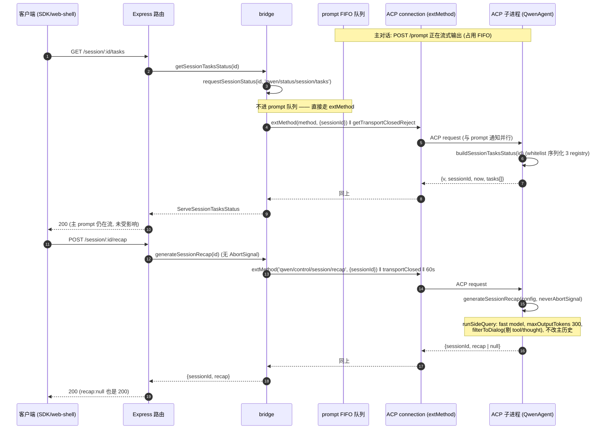
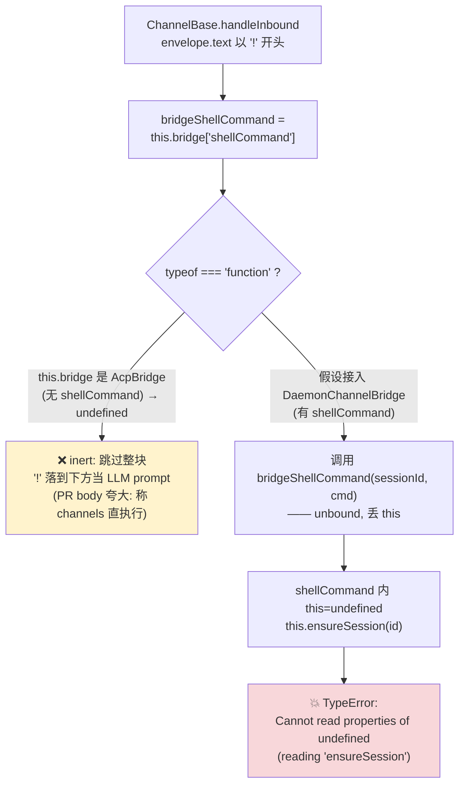

# 扩展端点（recap / btw / tasks / shell / rewind / hooks / extensions management / settings / transcript / logger）（深入）

> 子文档；总览见 [README.md](README.md)（以及总览正文 `daemon-serve-mode.md` §3.10）。本文在 file/symbol/line 级别**取代**总览的 §3.10「扩展端点」段落，深入到每个端点的控制面调用链、ACP ext-method 往返、绕开 prompt FIFO 的机理、HTTP shell 的安全面、rewind/hooks/extensions/settings 诊断与变更面、`ChannelBase.ts` 的 `this`-binding 隐患，以及 daemon 文件日志的异步队列/降级/截断/symlink。
>
> 代码锚点除特别说明外均以集成分支 `daemon_mode_b_main` 为准（读法：`git -C <repo> show daemon_mode_b_main:<path>`）。**行号可能随版本漂移，以 `file:symbol` 为准**——#4774（strip comments，net -2194 行）和 #4563（抽 DaemonWorkspaceService）合入后，`server.ts` / `bridge.ts` / `acpAgent.ts` 的行号普遍下移 100-220 行。本文已对齐到 `origin/daemon_mode_b_main@18e848f32`。
>

---

## 概述

本文覆盖两类 daemon 扩展面：

1. **控制面（control plane）**：`recap` / `btw` / `shell` / `rewind` / `settings` / extension mutation 这类端点会计算或变更状态，但不等价于驱动一轮主 prompt。
2. **诊断面（diagnostic snapshot）**：`tasks` / `stats` / `hooks` / `extensions` 这类端点只读当前 daemon / session 状态，帮助 web-shell、IDE 和 SDK UI 渲染控制台。

其中跨进程 control/status 端点共享同一套四层管线：

```
HTTP route (server.ts)
  → bridge method (acp-bridge/bridge.ts)            ← daemon 进程内
    → entry.connection.extMethod('qwen/...', {...}) ← NDJSON over stdio (ACP)
      → acpAgent.extMethod case (acpAgent.ts)       ← ACP 子进程内
        → core service / 本地执行
```

这套「route → bridge → ACP ext-method → core」复用自 Wave 4 PR 17 的 `setSessionApprovalMode`（#4504 PR body 明确称「Reuses the existing ext-method roundtrip pattern … so no new infrastructure」）。它有两个细分变体：

1. **status 路径（只读）**：`bridge.requestSessionStatus<T>(sessionId, method, params)` 是统一入口，被 `getSessionTasksStatus`、`getSessionContextStatus`、`getSessionContextUsageStatus`、`getSessionSupportedCommandsStatus`、`getSessionStatsStatus`、`getSessionHooksStatus` 共用。method 取自 `SERVE_STATUS_EXT_METHODS`。
2. **control 路径（计算/副作用）**：`recap` / `btw` / `rewind` 走 ACP ext-method；`shell` 在 daemon 本进程执行再把 shell history 写回 ACP 子进程；`workspace/settings` 是 daemon host 直接持久化 settings 文件；extension mutation 由 daemon 管理安装/启停/刷新队列并广播 workspace 变更。

### 为什么这些端点不会阻塞 prompt FIFO

bridge 对**同一 session 的多个 prompt** 做 FIFO 串行化（见 `bridge.test.ts:2669`「FIFO-serializes concurrent prompts on the same session」）。但这里的状态/控制端点 **不进这个队列**：tasks/stats/hooks 等 status 路径和 recap/btw/rewind 控制路径走 ACP `extMethod(...)`，shell 在 daemon 本进程执行，settings 由 host 直接持久化，二者也不经 `session/prompt` FIFO。因此即使主对话正在流式输出，客户端也能并发拉一次 tasks/stats/hooks 快照、问一句 btw、或要一句 recap，而无需等当前 turn 结束。`bridge.test.ts:526`「requests session tasks status **without waiting for the prompt queue**」就是钉死 status 路径不排队的不变式测试。

代价是：这些 ext-method 在 ACP 子进程里与主 prompt 共享同一个事件循环；它们若触发 LLM 调用（recap/btw），是在子进程里另起一次**侧查询/分叉**，不复用主 turn 的 streaming，但也**不污染主对话历史**（详见各端点小节）。

### 鉴权姿态

| 端点 | 方法 | 门控 | 说明 |
| --- | --- | --- | --- |
| `/session/:id/tasks` | GET | 仅全局 bearer（无 `mutate`） | 只读快照，与其他 `GET /workspace/*` 状态路由同级。 |
| `/session/:id/transcript` | GET | 仅全局 bearer（无 `mutate`） | #6525：active persisted transcript 分页 replay，不 attach client、不改 live EventBus。 |
| `/workspaces/:workspace/session/:id/transcript` | GET | 仅全局 bearer（无 `mutate`） | #6740：selected workspace persisted-only transcript pager；registered untrusted secondary 可读，不启动 ACP；#6769 open 增加 byte bounds。 |
| `/workspaces/:workspace/...` | GET/POST/DELETE/PATCH | 读 bearer / 写 `mutate(strict)` | #6567：workspace-qualified core REST；selector 先 workspace id、再 encoded absolute cwd。 |
| `/session/:id/stats` | GET | 仅全局 bearer | 模型/token/工具/文件统计快照。 |
| `/workspace/hooks` / `/session/:id/hooks` | GET | 仅全局 bearer | hook 配置与运行时诊断，可能暴露 hook command/url，按敏感诊断面对待。 |
| `/workspace/extensions` | GET | 仅全局 bearer | extension 安装元信息与能力计数。 |
| `/extensions/*` | GET/POST/PUT/DELETE | 读 bearer / 写 `mutate(strict)` | #6638 open：V2 user-level extension artifact 管理与 async operation status。 |
| `/workspaces/:workspace/extensions/*` | GET/PUT/DELETE/POST | 读 bearer / 写 `mutate(strict)` | #6638 open：workspace projection、activation override 与 runtime refresh；不拥有 artifact mutation。 |
| `/workspace/channel` / `/workspace/channel/reload` | GET/PUT/DELETE；POST reload | 读 bearer / 写 `mutate(strict)` | #6741 open：runtime channel selection status/set/stop；reload 仍走 #6598 的 `POST /workspace/channel/reload`。 |
| `/workspace-registrations` | GET/DELETE | 读 bearer / delete `mutate(strict)` | #6716：persistent dynamic workspace desired-state 列表与忘记记录；delete 不卸载 active runtime。 |
| `/workspaces/:workspace` | DELETE | `mutate(strict)` | #6745 open：hot remove removable secondary runtime；drain sessions/ACP/memory/channel，force 可越过 busy guard。 |
| `/workspaces/:workspace/sessions`, `/session-groups`, `/session/:id/organization` | GET/PATCH | 读 bearer / mutation `mutate()` | #6717/#6724：untrusted secondary persisted-only catalog；trusted secondary organization mutation。 |
| `/session/:id/recap` | POST | `mutate()`（非 strict） | 与 `/prompt` 同 posture：花 token、不改状态。 |
| `/session/:id/btw` | POST | `mutate()`（非 strict） | 同上。 |
| `/session/:id/shell` | POST | `mutate()`（非 strict） | 同上；真正的安全边界是 cwd 服务端固定 + bearer（见 shell 小节）。 |
| `/session/:id/rewind` | POST | `mutate(strict)` | 会截断 session + 恢复文件，按危险变更处理。 |
| `/workspace/settings` | GET/POST | 读 bearer / 写 `mutate(strict)` | 仅在 host 注入 `persistSetting` 时注册；写只允许 workspace scope。 |

所有端点都先过中间件链（Origin-strip → CORS → hostAllowlist → bearerAuth → json）。只读诊断面只要求全局 bearer；`recap` / `btw` / `shell` 这类只花 token、不改 daemon/workspace 持久状态的控制面使用非 strict `mutate()`；`rewind`、settings 写入、workspace-qualified mutation 和 extension V2 artifact/activation mutation 使用 `mutate(strict)`。

---

## 涉及 PR（表格）

| PR | 标题（节选） | 合并日 | 在本文的作用 |
| --- | --- | --- | --- |
| #4504 | feat(serve): add POST /session/:id/recap | 2026-05-26 | recap 端点 + `generateSessionRecap` 暴露 + `session_recap` 能力 + `qwen/control/session/recap` ext-method。 |
| #4559 | feat(serve): add daemon file logger (#4548) | 2026-05-27 | `daemonLogger.ts`（异步队列 + 降级 + latest symlink）+ `onDiagnosticLine` seam + spawnChannel stderr forwarder tee。 |
| #4576 | feat(daemon): server-side shell command execution for ! (bang) prefix | 2026-05-28 | shell 端点 + `executeShellCommand`（`ShellExecutionService` 流式）+ `shell_history` 注入 + web-shell/channels `!` 路由。 |
| #4578 | feat(daemon): add session tasks snapshot endpoint | 2026-05-28 | tasks 快照端点 + `tasksSnapshot.ts` whitelist 序列化 + status 路径绕 FIFO。 |
| #4606 | feat(daemon): add request-level logging for serve routes | 2026-05-29 | access-log 中间件（bearer/json 之前）+ 关键路由 inline 业务日志。 |
| #4610 | feat(daemon): add POST /session/:id/btw endpoint for side questions | 2026-05-30 | btw 端点 + `core/btwUtils.ts`（`buildBtwPrompt`/`buildBtwCacheSafeParams`）+ `runForkedAgent` cache 路径 + 超时分层。 |
| #4646 | feat(daemon): clamp oversized inline media on the prompt path | 2026-05-31 | `inlineMediaLimit.ts`（`clampInlineMediaPart` / `approxBase64Bytes` / 可配置字节上限）+ prompt 路径接线。 |
| #4666 | fix(daemon): btw cross-session leak + timeout + input cap + permission requestId | 2026-06-01 | btw 跨 session 泄漏修复 + 超时判断修复 + 输入上限 + `requestId` 基数防护。 |
| #4816 | feat(serve): add `/settings` slash command for web-shell | 2026-06-08 | `/workspace/settings` 路由 + `workspace_settings` 条件能力 + `settings_changed` 事件。 |
| #4820 | feat(serve): add HTTP rewind endpoints | 2026-06-07 | `GET /session/:id/rewind/snapshots` + `POST /session/:id/rewind`；`session_rewind` 能力；`session_rewound` SSE 事件；`SessionBusyError`(409) / `InvalidRewindTargetError`(400) 错误类。 |
| #4822 | feat(serve): add hooks diagnostic HTTP/ACP surface | 2026-06-07 | `GET /workspace/hooks` + `GET /session/:id/hooks`；`workspace_hooks` / `session_hooks` 能力；`/hooks` 命令扩展 non_interactive/acp 模式。 |
| #4826 | feat(cli): enable /directory command in ACP mode | 2026-06-07 | `/directory`（show + add）启用 ACP 模式；输出改 `MessageActionReturn`；path 分割改逗号；usage hint。 |
| #4819 | feat(cli): enable /remember, /forget, /dream in ACP mode | 2026-06-06 | 三命令启用 ACP 模式；输出改 `MessageActionReturn`；v2 修复 #4811 回归。 |
| #4832 | feat(serve): add extensions diagnostic HTTP/ACP surface | 2026-06-08 | `GET /workspace/extensions` + `workspace_extensions` 能力；extension 元信息与能力计数。 |
| #5741 | feat(serve): add remote LSP status route | 2026-06-23 | REST/ACP/SDK 只读 LSP status，补齐远程客户端查询 `/lsp` 状态的结构化 API。 |
| #5743 | feat(cli): Add workspace permissions rules API | 2026-06-24 | `GET/POST /workspace/permissions`、ACP ext method、SDK helper，远程管理 persistent allow/ask/deny rules。 |
| #5765 | feat(serve): Add daemon workspace voice and control APIs | 2026-06-25 | workspace voice config / batch transcription、trust request、permission/LSP/control REST/ACP/SDK surface。 |
| #5826 | feat(cli): Add skill usage stats | 2026-06-25 | session stats 增加 skills block，`/stats skills` 展示真实 skill body load 的成功/失败和按技能分组统计。 |
| #5892 | fix(core): tree-kill PTY shell tree on Windows | 2026-06-26 | Windows interactive-shell PTY teardown 改为 `taskkill /f /t` tree-kill，并在正常完成后 guarded reap 防 ConPTY 残留 shell。 |
| #5903 | feat(acp): support /cd command in ACP sessions | 2026-06-27 | 新增 server-side ACP session cwd update：HTTP `POST /session/:id/cd` 校验路径/trust/sandbox/client 后更新 per-session logical cwd 并广播 `session_cwd_changed`。 |
| #6407 | fix(daemon): Handle settings reload events outside transcript | 2026-07-06 | `settings_reloaded` 作为 workspace settings refresh signal 进入 SDK/WebUI，reload 诊断只打筛选后的 console debug，不再写 transcript。 |
| #6525 | feat(serve): Add cursor-paged transcript replay endpoint | 2026-07-10 | `GET /session/:id/transcript` + `qwen/status/session/transcript` + SDK `getSessionTranscriptPage()`；分页读取 active JSONL，不触碰 live replay window。 |
| #6567 | feat(cli): Add workspace-qualified core REST routes | 2026-07-09 | `/workspaces/:workspace/...` plural routes 覆盖 file/status/settings/permissions/trust/lifecycle/MCP/tools/memory/agents/session organization。 |
| #6638 | feat(serve): add extension management v2 | open | `extension_management_v2` open 方案：user-level artifact store、workspace activation policy、global `/extensions/*` 与 workspace projection routes。 |
| #6716 | feat(serve): persist dynamic workspace registrations | 2026-07-11 | persistent dynamic workspace desired-state store、`persist:true` add workspace、`GET/DELETE /workspace-registrations` 与 lazy workspace-qualified ACP mount。 |
| #6717 | feat(serve): Expose read-only untrusted session catalogs | 2026-07-11 | untrusted secondary workspace persisted-only session/session-group catalog，不 merge live、不启动 ACP。 |
| #6724 | fix(cli): Scope session organization mutations by workspace | 2026-07-11 | trusted secondary workspace `PATCH /workspaces/:workspace/session/:id/organization`。 |
| #6740 | feat(serve): add workspace persisted transcript reader | 2026-07-12 | `GET /workspaces/:workspace/session/:id/transcript` selected workspace active transcript pager。 |
| #6741 | feat(cli): Add runtime daemon channel control | open | `GET/PUT/DELETE /workspace/channel` runtime selection control，reload 保持 `POST /workspace/channel/reload`。 |
| #6745 | feat(serve): support runtime workspace removal | open | `DELETE /workspaces/:workspace` removable secondary runtime hot removal。 |
| #6769 | feat(serve): Bound persisted transcript pages | open | workspace transcript source/response/cursor byte bounds 与 `transcript_page_too_large`。 |

> 合并次序：recap（5-26）→ logger（5-27）→ shell + tasks（5-28，当天先后）→ request-log（5-29）→ btw（5-30）→ remember/forget/dream（6-06）→ rewind/hooks/directory（6-07）。logger 先于 shell/request-log 落地，所以 shell/request-log 直接挂到 `daemonLog` 上记日志。

---

## recap（侧查询、不改历史、v1 无取消）

### 调用链与三层职责

| 层 | 符号（行） | 职责 |
| --- | --- | --- |
| HTTP | `server.ts:2034` `POST /session/:id/recap` | 校验 `:id`、`parseClientIdHeader`、调 `bridge.generateSessionRecap`、`recap:null` 也按 200 返回。 |
| bridge | `bridge.ts:3433` `generateSessionRecap(sessionId, _context)` | 查 entry、发 `qwen/control/session/recap` ext-method、与 `getTransportClosedReject` + `SESSION_RECAP_TIMEOUT_MS`（60s）race。 |
| ACP 子进程 | `acpAgent.ts:2519` `case SERVE_CONTROL_EXT_METHODS.sessionRecap` | `session.getConfig()` → `generateSessionRecap(config, signal)`。 |
| core | `sessionRecap.ts:generateSessionRecap` | 侧查询出一句摘要，best-effort，从不抛。 |

### core 侧的「侧查询」机理（`core/services/sessionRecap.ts`）

`generateSessionRecap(config, abortSignal)` 是**纯侧查询、零历史改写**：

1. 取 `config.getGeminiClient().getChat().getHistory()`；`< 2` 条直接 `null`（历史太短）。
2. `filterToDialog(history)`：只留 `role ∈ {user,model}` 的**可见文本** part，剔除 tool call / tool response（一条 tool response 可能是 10K-token 文件 dump，会淹没 recap）、并剔除 `part.thought` / `part.thoughtSignature`（隐藏思维链，**绝不能泄漏进面向用户的摘要**）。
3. `takeRecentDialog(dialog, RECENT_MESSAGE_WINDOW=30)`：取最近 30 条，但**切片对齐 turn 边界**——`start` 向后挪到第一条 `role==='user'`，避免切片以悬空的 model/tool 回复开头。
4. `runSideQuery(config, { purpose:'session-recap', contents:[...recentHistory, {role:'user', parts:[{text: RECAP_USER_PROMPT}]}], systemInstruction: RECAP_SYSTEM_PROMPT, config:{ maxOutputTokens:300, temperature:0.3 }, abortSignal, maxAttempts:1 })`。
   - `runSideQuery`（`core/utils/sideQuery.ts`）默认走 **fast model**（`config.getFastModel?.() ?? config.getModel()`），`maxAttempts:1` 不烧默认 7 次重试（best-effort cosmetic）。
   - `maxOutputTokens:300` + system prompt 要求「< 40 词 / 中文约 80 字、`<recap>...</recap>` 包裹」。
5. `extractRecap(result.text)`：用 `RECAP_TAG_RE = /<recap>([\s\S]*?)<\/recap>/i` 抽标签内容；若只有开标签（命中 token 上限截断）取开标签之后；连开标签都没有则返回空串（宁可跳过，也不把模型的 reasoning 前言当摘要）。
6. **整个函数 `try/catch` 包裹，任何异常 → `null`**。注释明确：「recap is best-effort and must never break the main flow or surface errors to the user.」

因此对 `bridge` 而言，唯一会冒泡成错误的只有：未知 sessionId（`SessionNotFoundError`）、传输中途关闭（`getTransportClosedReject` race）、60s backstop 超时。模型层面的任何失败都被 core 吞成 `recap:null`，HTTP 端返回 `200 {sessionId, recap:null}`。

### v1 取消：**没有**（且与 PR body 矛盾）

这是本端点最需要标注的事实。recap 路由（`server.ts:generateSessionRecap` 附近）的行为：v1 无路由侧取消——没有 `res.once('close')` 监听器，也没有 `AbortSignal` 传入 bridge（原路由注释已被 #4774 剥离，但行为不变）。

对照三处代码：

- **route**：`recap` 是唯一**没有** `res.once('close')` 的 control 端点（btw/shell 都有）。
- **bridge**：`generateSessionRecap(sessionId, _context)`（`bridge.ts:3433`）签名里**根本没有 `AbortSignal` 参数**——对比 `generateSessionBtw(sessionId, question, signal, _context)` 与 `executeShellCommand(sessionId, command, signal, context)`。
- **ACP 子进程**：`acpAgent.ts:2546` 显式传 `new AbortController().signal`——一个**永不 abort** 的 signal。注释：「the LLM call in this child always runs to completion」。

唯一的「天花板」是 bridge 的 `SESSION_RECAP_TIMEOUT_MS = 60_000`（`bridge.ts:612`，注释解释为何选 60s 而非继承 `initTimeoutMs=10s`：GPT 类慢启动会误触发 10s）与 transport-closed race。

> ⚠️ **PR body 夸大**：#4504 的 PR 描述写「**Cancellation is best-effort at v1**: client disconnect **aborts the bridge-side wait**…」。但代码里 recap 路由**根本没有监听 client disconnect**，bridge 方法也没有 signal 形参——所以「client disconnect aborts the bridge-side wait」对 recap 是**不成立**的。能做到「断连即停等」的是 btw 与 shell，不是 recap。文档（路由注释）与代码一致，PR body 与代码矛盾。

---

## btw（side question、超时分层）

### 设计：跟随 recap 模式，但补上 abort + 子进程自守

`/btw` 是「顺便问一句」——基于当前 session 上下文的单轮旁路问答，**无工具、无历史改写、不打断主对话**。#4610 PR body 自述「Follows the **recap pattern**」，但补了两件 recap 没有的事：HTTP 端 abort、ACP 子进程端 55s 自守。

| 层 | 符号（行） | 关键点 |
| --- | --- | --- |
| HTTP | `server.ts:2086` | `question` 必填、非空、`≤ 4096` 字符；`res.once('close')` → `abort.abort()`（仅当 `!res.writableEnded`）；catch `AbortError` 静默返回。 |
| bridge | `bridge.ts:3475` `generateSessionBtw(sessionId, question, signal, _context)` | `signal?.aborted` 早退 `{answer:null}`；三路 `Promise.race`：ext-method / `getTransportClosedReject` / abort-rejection；`SESSION_BTW_TIMEOUT_MS=60_000`（`bridge.ts:613`）。 |
| ACP 子进程 | `acpAgent.ts:2555` `case sessionBtw` | `buildBtwCacheSafeParams(config) ?? getCacheSafeParams()`；`runForkedAgent({ … abortSignal: AbortSignal.timeout(BTW_CHILD_TIMEOUT_MS) })`。 |
| core utils | `core/utils/btwUtils.ts` | `buildBtwPrompt` / `buildBtwCacheSafeParams`。 |

### `core/btwUtils.ts`

- **`buildBtwPrompt(question)`**：把问题包进一段 `<system-reminder>`，强约束「You have **NO tools** available」「ONLY use information already present in the conversation context」「NEVER promise to look something up」「The main conversation is NOT interrupted; you are a separate, lightweight fork」。这把分叉 agent 钉死成「只读上下文、单轮直答」。
- **`buildBtwCacheSafeParams(config)`**：构造 `runForkedAgent` 的 **cache 路径**入参——`structuredClone(chat.getGenerationConfig())` + `geminiClient.getHistoryTail(40, true)`（最近 40 条历史）+ `config.getModel()`，组成 `CacheSafeParams`。「cache-safe」指这套快照可以复用主 session 的 prompt-cache slot（KV cache），让旁路问答**便宜**。任何异常 → `null`，~~由 acpAgent 回落 `getCacheSafeParams()`~~（**#4666 已移除该回退**——它会借到别 session 的历史，造成跨 session 泄漏）；现在直接 `{answer:null}`。另 #4666 还修了：超时分支改 `childSignal.aborted`（原 DOMException 判断永不匹配）、斜杠命令补 `BTW_MAX_INPUT_LENGTH=4096` 守卫、`getHistoryTail(40, false)` 浅拷贝。

### 超时分层（child 55s < bridge 60s）

```
HTTP res.once('close') ──abort──► bridge generateSessionBtw
                                    │  Promise.race:
                                    │   ├─ extMethod(sessionBtw) ─────► acpAgent
                                    │   │                                 runForkedAgent
                                    │   │                                 abortSignal=timeout(55s)  ← 子进程自守，先触发
                                    │   ├─ getTransportClosedReject(entry)
                                    │   └─ abort-rejection (来自 HTTP 断连)
                                    └─ withTimeout(…, 60_000)  ← bridge backstop，后触发
```

子进程的 `BTW_CHILD_TIMEOUT_MS = 55_000`（`acpAgent.ts:146`）**刻意比** bridge 的 `SESSION_BTW_TIMEOUT_MS = 60_000` 小 5s。这样正常超时的语义是「子进程先 `AbortSignal.timeout` 触发 `TimeoutError`，转成 `RequestError.internalError('Side question timed out after 55s')` 顺着 ext-method 返回」——而不是「bridge 60s backstop 先 fire、留下一个还在跑的子进程」。即：**让最贴近真相的那一层先报错**，bridge 60s 只是兜底。

### abort 的「半生效」

HTTP 端断连 → `abort.signal` → bridge 的 `Promise.race` 里 abort-rejection 胜出 → 抛 `AbortError` → 路由 catch 后静默返回（不写响应）。**但**：ext-method 请求已经发给子进程了，且**没有**跨进程 cancel 消息——所以子进程里的 `runForkedAgent` 会一直跑到出结果或 55s 超时。即 btw 的 abort 让「bridge 停止等待 + HTTP 响应被放弃」，但**救不回子进程那次 LLM 调用的算力**。这与 shell 不同（shell 的执行在 daemon 本进程，abort 是真生效的，见下）。

---

## tasks snapshot（requestSessionStatus 绕 FIFO、whitelist 序列化）

### 端点动机

`GET /session/:id/tasks`（`server.ts:1607`）让客户端（特别是 web-shell 的 `/tasks` 命令）在**主 prompt 正在流式输出时**窥视后台任务状态，而不必再发一次 prompt、也不必排在 prompt 队列后面。#4578 PR body：「web-shell needs to inspect background tasks while a prompt is streaming **without sending another ACP prompt or waiting behind the prompt queue**」。

### status 路径如何绕 FIFO（`bridge.ts:1553`）

```ts
const requestSessionStatus = async <T>(sessionId, method, params = {}): Promise<T> => {
  const entry = byId.get(sessionId);
  if (!entry) throw new SessionNotFoundError(sessionId);
  const info = channelInfoForEntry(entry);
  if (!info || info.isDying) throw new SessionNotFoundError(sessionId);
  const response = await Promise.race([
    withTimeout(entry.connection.extMethod(method, { ...params, sessionId }), initTimeoutMs, method),
    getTransportClosedReject(entry),
  ]);
  return response as unknown as T;
};
```

要点：

- 直接 `entry.connection.extMethod(...)`——**不经过 prompt 队列**，所以并发于流式 prompt。
- 与 `getTransportClosedReject(entry)`（`bridge.ts:1484`，懒初始化、对 `entry.channel.exited` `.then(throw BridgeChannelClosedError)`，单监听器不变式）race，保证子进程中途死亡时不会永久挂起。
- 超时用 `initTimeoutMs`（默认 10s）——tasks 只是序列化几个内存 registry，10s 绰绰有余（不像 recap/btw 要等 LLM，才放宽到 60s）。
- `getSessionTasksStatus(sessionId)`（`bridge.ts:3181`）只是 `requestSessionStatus<ServeSessionTasksStatus>(sessionId, SERVE_STATUS_EXT_METHODS.sessionTasks)` 的薄封装。method 字符串为 `'qwen/status/session/tasks'`（`status.ts`）。

### ACP 子进程侧序列化（`tasksSnapshot.ts:buildSessionTasksStatus`）

`acpAgent.ts:2176` 的 `case sessionTasks` 校验 `sessionId` 后调私有 `buildSessionTasksStatus`（`acpAgent.ts:2090`）→ `buildSessionTasksStatus(sessionId, session.getConfig())`（core helper，`packages/cli/src/acp-integration/session/tasksSnapshot.ts`）。它合并三个 registry 并按 `startTime` 升序排：

```
config.getBackgroundTaskRegistry().getAll()  → serializeAgentTask   (kind:'agent')
config.getBackgroundShellRegistry().getAll() → serializeShellTask   (kind:'shell')
config.getMonitorRegistry().getAll()         → serializeMonitorTask (kind:'monitor')
```

**whitelist 序列化**是这里的安全/契约重点：三个 `serialize*` 函数**逐字段显式列举**要透出的属性，而非 `{...entry}` 整体外泄。可选字段用 `...(entry.x !== undefined ? {x: entry.x} : {})` 条件 spread，保证 wire schema 干净、稳定，且不会把 registry entry 内部的句柄/回调/不稳定字段泄漏给 HTTP 客户端。例如：

- `serializeAgentTask`：`kind/id/label(=buildBackgroundEntryLabel(entry))/description/status/startTime/runtimeMs/outputFile/isBackgrounded` + 条件 `endTime/subagentType/error/resumeBlockedReason`。
- `serializeShellTask`：`label=entry.command`、并显式带 `command/cwd` + 条件 `pid/exitCode/error`。
- `serializeMonitorTask`：带 `command/eventCount/lastEventTime/droppedLines` + 条件 `pid/exitCode/error/ownerAgentId`。

`runtimeMs(entry, now) = max(0, (endTime ?? now) - startTime)`——未结束的任务用 `now` 当前缀。整个快照带 `v: STATUS_SCHEMA_VERSION` 版本号、`sessionId`、`now`、`tasks[]`。

### v1 局限

#4578 PR body 自陈：「V1 is **snapshot-only**; task stop, output tailing, and live SSE updates are intentionally not included.」即 tasks 端点只能拉一次性快照，不能 stop 任务、不能 tail 输出、没有 SSE 增量推送。

---

## transcript page（#6525，完整 active transcript 的只读 replay）

#6482 后，`POST /session/:id/load` 只承诺 bounded live replay snapshot；完整 active persisted transcript 不再适合一次性塞回 `/load`。#6525 新增 `GET /session/:id/transcript`，让客户端按 cursor page 拉取 id-less `session_update` replay frames。

实现上，route 校验 session id / `limit` / `cursor` 后调用 bridge `getSessionTranscriptPage()`，bridge 再走 ACP child 的只读 ext-method `qwen/status/session/transcript`。core `SessionTranscriptReader` 在第一页冻结 active JSONL snapshot size，后续 cursor 绑定 session、文件身份、snapshot size、position、leafUuid 和 replay state，并用 workspace project 目录持久 HMAC key 签名防篡改。该 route 不 attach client、不 seed EventBus、不创建 live session、不返回 `lastEventId`，因此不会改变 live SSE replay window。文件被删除、截断、替换或 archive 后，后续页返回 409，客户端应从第一页重开；snapshot 超过 256 MiB 时在建索引前返回结构化 too-large 错误。

## workspace-qualified core REST（#6567）

#6567 把 core workspace/status/control surface 迁到 plural route family：`/workspaces/:workspace/...`。`:workspace` 先按 workspace id 精确匹配，再按 URL-decoded absolute cwd canonicalize；POSIX、Windows drive 和 UNC 风格 absolute path 都按 portable selector 处理。unknown selector 返回 `workspace_mismatch`，registered but untrusted workspace 除 trust/status/file-read 等既有策略允许的读面外返回 `untrusted_workspace`。能力 `workspace_qualified_rest_core` 与 route 注册同门控，随 workspace settings/persist deps 条件广告。

覆盖的 endpoint families：

- file read/write/stat/list/glob；
- workspace status/preflight/env/providers/skills/hooks；
- settings、permissions、trust；
- lifecycle reload/init；
- MCP restart/manage、tool toggles；
- memory 和 project-agent CRUD；
- session list、session groups、organization、archive/unarchive/delete。

legacy `/workspace/...` 继续绑定 primary workspace；plural route 才按 selected runtime dispatch。写类 route 仍走 strict mutate/auth 与原有 workspace fs write guard，不因为 selector 是 secondary workspace 而降低权限。

---

## persistent workspace registration（#6716）

#6716 把 #6625 的进程内 `POST /workspaces` 扩成 opt-in 持久化 desired-state。客户端只有看到 `persistent_workspace_registration` capability 才应发送 `persist:true`。store 位于 user-level `${QWEN_HOME}/daemon/workspaces/<primary-scope-hash>.json`，按 canonical primary workspace 隔离；读取时拒绝 symlink、非普通文件、过大文件、schema/primary mismatch、重复路径和超限条目，写入用进程内队列、`proper-lockfile` 和原子 rename。

新增端点：

- `POST /workspaces {cwd, persist?: boolean}`：`persist:false` 保持动态注册；`persist:true` 会写 store，并在 runtime/registry 失败时回滚已写记录。
- `GET /workspace-registrations`：返回 store snapshot、entry id、cwd、active、persisted。
- `DELETE /workspace-registrations/:id`：删除 store entry；如果该 workspace 当前 active，响应 `restartRequired:true`，但不卸载 runtime。

## workspace persisted transcript（#6740 / #6769 open）

#6740 在 #6525 singular transcript route 之外新增 workspace-qualified reader：`GET /workspaces/:workspace/session/:id/transcript`。它从 selected workspace 的 active persisted JSONL 生成 replay page，不 attach client、不启动 ACP、不查询 live bridge、不加载 workspace settings，也不创建旧 persisted cursor-key 文件。能力 `workspace_persisted_transcript` 无条件广告，但每次请求仍按 workspace selector 和 trust policy 校验；registered untrusted secondary workspace 可读，untrusted primary 继续拒绝。

cursor 使用 daemon-lifetime per-workspace in-memory signing key，因此适合当前 daemon 生命周期内分页，不作为跨重启 bookmark。SDK `WorkspaceDaemonClient.getSessionTranscriptPage()` 强制走 native REST，避免 replaceable ACP transport 触发执行型路径。

#6769 open 方案给该 route 增加 byte bounds：每页最多读取 4 MiB persisted source records，serialized response 最多 32 MiB，request/response cursor 最多 64 KiB。`limit` 只是 record-count ceiling；单个 aggregate record 或 response 过大返回 `413 transcript_page_too_large`，oversized replay cursor 则以 terminal partial page 结束。

## runtime channel control（#6741 open）

#6741 open 方案把 channel worker selection 从 boot-only `--channel` 提升为 daemon runtime resource。`channel_control` capability 表示 runtime manager 已 wire，客户端可用：

- `GET /workspace/channel`：查询当前 committed selection 与 worker/group snapshot。
- `PUT /workspace/channel`：启用或替换 selection。
- `POST /workspace/channel/reload`：重读 settings，沿用 #6598 reload 语义，但走 manager reconcile path。
- `DELETE /workspace/channel`：停止 worker group 并清空 runtime selection。

manager 串行化 lifecycle mutation，复用 workspace worker group reconcile，保留未变化 worker，并把 PID file 与 webhook routing 的 committed state 当作原子提交对象；新 selection 启动失败时回滚到旧 selection。CLI `qwen channel set/status/stop` 和 SDK helpers 都通过该 HTTP surface。

## runtime workspace removal（#6745 open）

#6745 open 方案新增 `DELETE /workspaces/:workspace` 和 `workspace_runtime_removal` capability。capability 的 workspace rows 增加 `removable`，只有动态/可移除 secondary runtime 可删；primary 和显式启动 workspace 不可删。

删除流程是两阶段 drain：先关 admission/ACP/worker gates，检查 live sessions、pending prompts/starts、ACP connections、memory tasks、sub-session launchers 和 channel workers；非 force 时有 activity 返回 `409 workspace_busy`。可删除时清理 workspace-owned sessions、ACP mount、remember/memory lane、sub-session launcher、bridge child、channel worker，并释放 registry path。它还会忘记该 runtime 的所有 persistent registration alias，但不会删除工作区文件、settings、transcripts 或 archives。

## untrusted catalog 与 workspace organization mutation（#6717/#6724）

#6717 在 workspace-qualified session routes 上增加一个窄的 read-only catalog：registered untrusted secondary workspace 可读取 persisted sessions 和 session groups，包括 archived、organized、group、parent-session、cursor/page-size 语义，但 `mergeLive:false`，不查询 bridge、不 spawn ACP、不 load settings，也不写 debug log session。这个面用于信任前的历史可见性，不允许 session attach、transcript、settings/runtime-backed read 或 mutation。

#6724 给 trusted secondary workspace 补齐 organization mutation：`PATCH /workspaces/:workspace/session/:id/organization` 复用 legacy body/response，但 session existence、group validation 和 sidecar update 都绑定 selected runtime。legacy `PATCH /session/:id/organization` 保持 primary-only。

---

## stats / context-usage（只读 session 观测）

`GET /session/:id/context-usage` 与 `GET /session/:id/stats` 都是 status 路径：HTTP route 校验 sessionId 后直接调 bridge 的 status helper，再由 ACP ext-method 在子进程里读取当前 session 的内存状态。

`context-usage` 返回 `ServeSessionContextUsageStatus`：

- `usage.modelName` / `totalTokens` / `contextWindowSize`
- `breakdown`：system prompt、builtin tools、MCP tools、memory files、skills、messages、free space、autocompact buffer
- `builtinTools` / `mcpTools` / `memoryFiles` / `skills` 详细项
- `formattedText`：给 TUI/web-shell 直接展示的文本
- `?detail=true` 才要求详细展开；否则 UI 可只渲染聚合条

`stats` 返回 `ServeSessionStatsStatus`：

- `sessionStartTimeMs` / `durationMs` / `promptCount`
- `models[modelName].api`：请求数、错误数、总延迟
- `models[modelName].tokens`：prompt/candidates/total/cached/thoughts
- `tools.totalCalls/totalSuccess/totalFail/totalDurationMs`
- `tools.byName[name].decisions`：accept/reject/modify/auto_accept
- `skills.totalCalls/totalSuccess/totalFail/byName`（#5826）：只统计真实 skill body load，包含 `Skill` tool 与 skill slash command 路径；每个 skill 记录调用数、成功数、失败数和最近错误摘要。
- `files.totalLinesAdded/totalLinesRemoved`

这两个端点没有 SSE delta；它们是 dashboard snapshot。`session_stats` 已经是能力标签，早期 README 把 `stats/export` 作为未落地整体描述已经过期：**stats 已落地，export 仍未落地**。

#5826 还给 CLI 的 `/stats` 增加 `skills` 子视图：交互式 UI 和非交互输出都从同一 session stats snapshot 取 `skills` block 渲染。该统计有意排除 MCP prompt、文件命令 fallback 这类“看起来像技能但没有加载 skill body”的路径，避免把资源注入或命令别名误算为 skill 使用。

---

## rewind（HTTP 会话回退）

#4820 把交互式 `/rewind` 的核心能力提升为 daemon HTTP surface：

| Route | 门控 | 作用 |
|---|---|---|
| `GET /session/:id/rewind/snapshots` | bearer | 返回可回退目标列表，包含 `promptId` / `turnIndex` / `timestamp` / `diffStats` 等。 |
| `POST /session/:id/rewind` | `mutate(strict)` | body `{promptId}`；按目标 prompt 截断会话历史并恢复文件。 |

严格门控是必须的：rewind 不是 cosmetic control，它会改内存会话、恢复工作区文件，并可能让多个客户端看到历史倒退。成功后 bridge 发布 `session_rewound` SSE，reducer 记录 `rewindCount` / `lastRewind`，其它客户端据此刷新 transcript、diff 和文件视图。

错误面：

- `SessionBusyError` → HTTP 409 + `Retry-After: 5`。当前 prompt 正在执行时拒绝 rewind，避免一边生成新事件一边截断历史。
- `InvalidRewindTargetError` → HTTP 400。目标不存在、已被压缩/不可回退、或 promptId 不合法。

---

## hooks 诊断（workspace + session）

#4822 新增两条只读诊断路由：

| Route | 能力 | 数据源 | 说明 |
|---|---|---|---|
| `GET /workspace/hooks` | `workspace_hooks` | workspace 配置 / idle fallback | 返回 workspace 级 hook 配置、`disabled`、`initialized`、`hooks[]`、以及 `events{}` 静态事件元信息。 |
| `GET /session/:id/hooks` | `session_hooks` | live session runtime config | 返回 session 内实际注册的 runtime hooks，source 可为 `project` / `user` / `system` / `extensions` / `session`。 |

`ServeHookEntry` 是 whitelist 序列化：`eventName`、`source`、`matcher`、`enabled`、`hookId`、`skillRoot` 和一个按 type 分支的 `config`。`config.type` 支持 `command` / `http` / `function` / `prompt` / unknown forward-compatible slot；HTTP hook 的 url/header allowlist、command hook 的 shell/env/timeout 都会进入诊断结果。

安全含义：这虽然是 GET，但不是低敏信息。hook command、HTTP URL、allowed env vars 都可能暴露本地自动化设计与内部服务地址；它只靠全局 bearer，不走 `mutate(strict)`。共享或远程部署应把它当敏感诊断面处理。


---

## workspace extensions 诊断与管理

#4832 新增 `GET /workspace/extensions` 与 `workspace_extensions` 能力标签。ACP 子进程从 `config.getExtensions()` 构造 `ServeWorkspaceExtensionsStatus`：

- 顶层：`{v, workspaceCwd, initialized, extensions[], errors?}`
- 每个 extension：`id`、`name`、`version`、`isActive`、`path`
- 安装元信息：`source`（会 `redactUrlCredentials`）、`installType`、`originSource`、`ref`、`autoUpdate`
- `capabilities` 计数：MCP server、skills、agents、hooks、commands、context files、channels、是否有 settings

#4832 时这条路由不执行安装/更新/启停，只给 dashboard/IDE 一个统一的「当前 daemon 真正加载了什么 extension」快照。它也解释了为什么 MCP/skills/agents/hooks 文档里会出现 `extension` level/source：extension 能把这些能力注入到同一 workspace runtime。


- 只允许可信 workspace client 发起，避免任意 bearer 读者伪造 active UI 操作。
- extension 来源需要经过 allowlist/URL 校验；拒绝 credentials、private network/local link 等高风险来源。
- mutation 异步排队执行，HTTP 接受不等于 UI 立即可见；完成后广播 `extensions_changed`，workspace/provider hooks 重新拉取状态。
- active sessions 会刷新 extension-derived commands/hooks/settings 视图，避免新装/禁用后 web-shell 和 ACP daemon session 看到不同 command set。

### extension management v2（#6638 open）

#6638 open diff 新增 `extension_management_v2`，并保留旧 `workspace_extensions` 作为 primary compatibility/diagnostic surface。V2 不采用早期 workspace-qualified extensions 方案名：核心模型是 user-level artifact + workspace activation policy，而不是每个 workspace 拥有自己的安装物。

资源拆分：

- user-level artifact：安装目录在 `QWEN_HOME/extensions`，由 `ExtensionStore` 唯一写入。
- activation policy：按 exact workspace override（enabled/disabled）、内部 exact inherit mask、V1 path rule 和 global default 计算 effective state。
- store state：`~/.qwen/extension-store/state.json`、`state.previous.json`、staging、trash、journal 和 recovery；支持 V1 import/projection/downgrade。

HTTP surface 分两组：

- global `/extensions/*`：catalog、install、check updates、update、delete、default activation、operation status。
- workspace `/workspaces/:workspace/extensions/*`：effective view、workspace activation override、clear override、runtime refresh；workspace route 不直接安装/更新/删除 artifact。

慢操作返回 `202 Accepted` + `operationId`，operation history 只在 daemon 本地保留且 terminal records capped；store generation 才是权威状态。prep queue 并发 2，commit queue 单并发；prepared update 携带 artifact generation，stale same-artifact commit 返回 `extension_conflict`。workspace activation/refresh 仍要求 trusted workspace，read projection 可按既有 trust 策略降级。install 需要显式 consent 和初始 activation；GitHub/npm 下载接入 network policy，拒绝 credential、private network 和 local link 等高风险来源；CLI enable/disable/install/link/uninstall 会打印 committed warning。


---

## remote LSP status（#5741）

#5741 补的是远程客户端缺失的只读 LSP 观测面。CLI `/lsp` 原本输出 Markdown，适合 TUI 但不适合 Web Shell、ACP-native client 或 SDK 消费。新增 route / ext-method / SDK 类型返回结构化状态：

- workspace/session 的 LSP 是否启用、server 是否 ready、最近错误与能力摘要。
- per-session 的 sanitized LSP detail，避免直接泄漏不该给远程 UI 的内部对象。
- REST 与 ACP HTTP/WS 都走同一 status extension；TS SDK 提供 typed helper。

该 PR 不改变 slash `/lsp` 的文本输出，也不新增 LSP 控制能力。它只是把已有状态读取为 machine-readable API，归入只读 diagnostic surface。

---

## workspace voice / trust / control APIs（#5765）

#5765 把 Web Shell 和远程 daemon 客户端需要的 voice/control 面从“只能靠本地 CLI 状态”补成结构化 API。它不是单一 voice endpoint，而是一组 workspace/session 控制面：

| Route / surface | 作用 |
|---|---|
| `GET /workspace/voice` | 返回当前 workspace 可用的 voice settings、模型校验结果和安全脱敏后的 provider 状态。 |
| `POST /workspace/voice` | 更新 workspace voice 配置，复用 settings 持久化和 schema 校验。 |
| `POST /workspace/voice/transcribe` | 接收二进制音频做 batch transcription，daemon 端完成模型选择、凭据读取和 ASR 调用。 |
| workspace trust request | 远程客户端可发起 workspace trust 请求，而不是要求本机 TUI 交互。 |
| permission / LSP / session control helpers | SDK/ACP surface 复用 daemon bridge 的 permission rules、LSP status、session control 能力，避免 Web Shell 绕 raw fetch。 |


---

## workspace permissions API（#5743）

#5743 给 persistent permission rules 增加最小远程管理面：

| Route / ext method | 作用 |
|---|---|
| `GET /workspace/permissions` | 返回 user scope、workspace scope、merged result、trust-state 视图。 |
| `POST /workspace/permissions` | 替换 workspace scope 下一个 rule type（`allow` / `ask` / `deny`）的完整列表。 |

设计点：

- response shaping 与 ACP ext methods 共享 helper，REST 和 ACP 看到同一 schema。
- 新提交的 malformed rules 会以 `invalid_rules` 拒绝；已存在的 malformed rules 在 read-modify-write 时保留，避免用户 settings 无法往返。
- 写入优先走 live ACP child，同步活跃 PermissionManager；没有 child 时才由 daemon host 直接持久化 settings。
- daemon 只有在 settings persistence 可用时才广告 `workspace_permissions` capability。
- SDK helper 提供 get/set/add/remove，但 add/remove 是 read-modify-write 便利封装，没有 ETag/versioning；并发写仍以后写覆盖为准。

这个 API 不暴露交互式 `/permissions` dialog，也不管理 session-only rules。它填补的是远程 daemon/ACP 客户端无法读取和更新 persistent permission arrays 的缺口。

---

## workspace settings（web-shell 设置面）

#4816 新增 `GET/POST /workspace/settings` 和条件能力 `workspace_settings`。它与其它 always-on tag 不同：只有 host 在 `createServeApp` 依赖里注入了 `persistSetting` 时才注册 route，并通过 `persistSettingAvailable` 让 `/capabilities` 广告该 tag。

`GET /workspace/settings` 返回：

- `v: 1`
- `settings[]`：`key`、`type`、`label`、`category`、`description?`、`requiresRestart`、`default`、`options?`
- `values.effective/user/workspace`
- settings 文件损坏恢复时的 `warnings[]`

可写 key 不是全量 settings。路由先从 `getDialogSettingKeys()` 拿 UI 可见 key，再剔除：

- TUI-only：vim mode、terminal bell、preferred editor、output language、IDE toggle、UI render/compact/accessibility 等
- 安全敏感：当前显式剔除 `tools.approvalMode`，因为 approval mode 已有专门的 session route 和语义

`POST /workspace/settings` 是 strict mutation route。body `{scope, key, value}`，当前 `scope` 只允许 `workspace`；value 按 schema type 校验，string 限长 1024。写入成功后广播 `settings_changed {key,value,scope}` 到所有 session bus。`requiresRestart` 仍会返回给客户端：设置落盘不等于 live session 已经重新读取。


- `POST /workspace/settings` 通过共享 `validateSettingValue()` 拒绝低于 minimum 的值。
- TUI `/settings` 保存 number/string 设置前复用同一 validator。
- `generate-settings-schema.ts` 把 `minimum` 写入 VS Code settings JSON schema。

因此 negative cleanup period、`0` 或负数 recap-away threshold 不再能被持久化成看似有效的配置；runtime 的防御性 clamp/默认值仍保留，但不再承担第一道用户输入校验。HTTP API 拒绝后不写 settings，也不会广播 `settings_changed`。

### settings reload event（#6407）

`settings_reloaded` 不是用户输入的聊天内容，也不是普通 debug block。#6407 在 SDK normalizer 里把它映射为 `workspace.settings.changed`，`key` 固定为 `settings_reloaded`，`scope` 为 `workspace`，payload 作为 `value` 保留给 workspace signal 消费。这样 Web Shell 的 settings version 能刷新，但 transcript 不再出现 `settings_reloaded (unrecognized daemon event)`。

WebUI 侧的 `DaemonSessionProvider` 在 normalize/filter 前对 reload 事件打 `console.debug('[DaemonSessionProvider] settings reloaded:', data)`。日志数据由 helper 筛选：只保留 `eventId`、`env.updatedKeys`、`env.removedKeys`、`changedKeys`、`childReloaded`、`sessionsRefreshed`、`sessionsSkipped`、`childError`；数组元素只保留 string，非 object payload 只记录 `payload: 'non-object'`。这保证 reload 诊断可查，同时不把原始 payload 写入聊天 transcript。

---

## session cwd control（ACP `/cd`，#5903）

#5903 把 ACP session 的 `/cd` 从“客户端本地概念”提升为 daemon 侧控制面：HTTP `POST /session/:id/cd` 接收目标目录并更新该 session 的 logical cwd。它不调用 `process.chdir()`，也不修改整个 daemon 进程 cwd；真正变更的是 session config / bridge entry 里后续 prompt、shell/history、文件解析使用的 per-session working directory。

调用链：

```
POST /session/:id/cd
  -> serve session route 校验 session/client/body
  -> acp-bridge cd helper
  -> ACP child session relocateWorkingDirectory(skipProcessChdir)
  -> publish session_cwd_changed
```

校验与错误口径：

| 条件 | 响应 |
|---|---|
| session 不存在 | `404` |
| target path 非绝对路径 / client id 无效 | `400 invalid_path` / `400 invalid_client_id` |
| 目录不存在 | `400 directory_not_found` |
| 目标目录未 trust | `403 directory_not_trusted` |
| sandbox 不允许 cwd relocation | `403 restrictive_sandbox` |

如果 session 当前有 active prompt，`/cd` 不直接打断正在跑的 turn，而是排到 prompt 后执行并在完成后返回成功。这保持了“同一 session 的语义变更按 turn 边界生效”的直觉，但也意味着 v1 没有独立的 busy 409 或短超时：客户端发起 `/cd` 时可能等待当前 prompt 完成。

这个 PR 只落 server/ACP surface；SDK wrapper、capability advertisement 和更细的客户端 UI 仍是后续工作。客户端如果要探测支持度，只能按 route/错误做兼容处理，不能假设老 daemon 一定有 `/cd`。

---

## server-side shell（`!` bang、HTTP 安全、ChannelBase `this`-binding 隐患 + inert channels）

shell 端点是本批里最复杂、也最值得标注「隐患」的一个。它有**三条入口路径**，命运各不相同：

| 路径 | 入口 | 结局 |
| --- | --- | --- |
| HTTP | `POST /session/:id/shell`（`server.ts:2142`） | ✅ **工作**：直达 `bridge.executeShellCommand`。 |
| web-shell | `webui …/actions.ts:441` `session.shellCommand(command, ctrl.signal)` | ✅ **工作**：SDK `DaemonSessionClient.shellCommand` → HTTP `POST /shell` → 同上。 |
| channels `!` | `ChannelBase.handleInbound` bang 块（`ChannelBase.ts:273-313`） | ❌ **inert（哑火）**：拿不到 `shellCommand`，且接通即 TypeError（见下）。 |

### HTTP 路径（works）：`bridge.executeShellCommand`（`bridge.ts:3518`）

执行**发生在 daemon 本进程**（不是 ACP 子进程）：

1. 查 entry → `resolveTrustedClientId`。`signal?.aborted` 早退 `{exitCode:null, output:'', aborted:true}`。
2. **cwd 服务端固定**：`const cwd = entry.workspaceCwd;`（`bridge.ts:~3534`）——客户端**无法**指定 cwd，命令永远在 session 绑定（且 boot 时已对齐 `boundWorkspace`）的工作区根执行。这是 shell 安全面的核心。
3. publish `user_shell_command` 事件（带 `originatorClientId`，供其他客户端在 SSE 上抑制自己动作回声）。
4. `ShellExecutionService.execute(command, cwd, onEvent, abort.signal, false, {terminalWidth:120, terminalHeight:40}, {streamStdout:true})`：流式 `data` 事件逐块 publish 成 `session_update{ sessionUpdate:'shell_output', _meta:{source:'user-shell'} }`——所以 web 端能看到 shell 输出**实时流**在同一条 SSE 上。
5. 120s 硬超时：`setTimeout(() => abort.abort(), SHELL_COMMAND_TIMEOUT_MS=120_000)`（`bridge.ts:614`），`unref()`。
6. 结束后 publish `user_shell_result{exitCode, signal, aborted}`，并把命令 + 输出（`MAX_SHELL_OUTPUT_FOR_HISTORY=10_000` 截断 + `\n... (truncated)`）经 `qwen/control/session/shell_history` ext-method（`bridge.ts:~3621`）注入回子进程的 GeminiClient 历史——这样后续问 LLM「刚才那条命令输出了啥」它能引用。
7. 返回 `{exitCode, output, aborted}`。

**abort 真生效**：HTTP 路由（`server.ts:2152`）`res.once('close')` → `abort.abort()` → bridge 内 `signal.addEventListener('abort', () => innerAbort.abort())` → `ShellExecutionService` 收到 abort → **真正杀掉正在跑的子进程**。因为执行在 daemon 本进程（不跨进程），所以 shell 是三个 control 端点里**唯一 e2e 取消完全可用**的（recap 无取消、btw 只能停 bridge 等待）。

#5892 修复 Windows interactive-shell PTY path 的实际资源泄漏：ConPTY 下 `ptyProcess.kill()` 只关 pseudo-console host，不会递归杀 `pwsh` / `powershell` / `cmd` 子树；而 qwen-code 在 Windows 默认走 interactive-shell PTY，导致每次工具调用残留 idle shell。修复后 Windows teardown 路径统一走 child_process fallback 已使用的 `taskkill /f /t` tree-kill，并补 guarded reap：

- cancel / timeout / cleanup path 都尝试 tree-kill shell process tree。
- 正常命令完成后也会 guard reap shell pid，清掉 ConPTY 残留。
- `taskkill` 启动失败或非零退出不会触发 unhandled `error`，也不会让 cancel 挂住。
- 正常完成的 reap 只杀 shell pid tree，不杀命令有意 detach 的进程，例如 `Start-Process`。

这不改变 shell API response shape，也不改变非 Windows 路径；它收紧的是 Windows PTY 进程生命周期。

ACP 子进程侧的 `case sessionShellHistory`（`acpAgent.ts:2599`）只做一件事：`geminiClient.addHistory(...)` 追加一条 `role:'user'` 文本——内容是「I ran the following shell command:（一段 sh fenced block 的命令）This produced the following result:（一段 fenced block 的输出）」。即「执行在 daemon、历史注入在 child」的分工。

### channels `!` 路径（inert）+ `this`-binding 隐患（**重点**）

`ChannelBase.handleInbound`（`packages/channels/base/src/ChannelBase.ts:273`）在 slash 命令与 session 路由之后、LLM prompt 之前，有一段 bang 处理：

```ts
// 3.5. Bang (!) shell command — direct execution, no LLM
if (envelope.text.startsWith('!')) {
  const cmd = envelope.text.slice(1).trim();
  const bridgeShellCommand =
    (this.bridge as unknown as Record<string, unknown>)['shellCommand'];   // L276
  if (cmd && typeof bridgeShellCommand === 'function') {                    // L277
    try {
      const result = (await bridgeShellCommand(sessionId, cmd)) as { … };   // L279  ← 隐患
      …
    }
  }
}
```

这里有**两个独立问题**：

**(1) 当前 inert（哑火）——`ChannelBase.bridge` 没有 `shellCommand`。**

`ChannelBase.bridge` 的静态类型是 `AcpBridge`（`packages/channels/base/src/AcpBridge.ts`，`class AcpBridge extends EventEmitter`，方法只有 `start/newSession/loadSession/prompt/cancelSession/stop/isConnected` —— **没有 `shellCommand`**）。生产 wiring（`packages/cli/src/commands/channel/start.ts:202/345` `new AcpBridge(bridgeOpts)`）也只往 channel adapter 注入 `AcpBridge`。因此 `bridgeShellCommand = (...)['shellCommand']` 恒为 `undefined`，`typeof undefined === 'function'` 为 `false`，整块被跳过，bang 文本**落到下方当普通 LLM prompt**。

所以 #4576 PR body 那句「**Channels** (Telegram/DingTalk/WeChat) detect `!` prefix and route through **direct execution**」在 `daemon_mode_b_main` 上**夸大了**：channels 的 `!` 既不直执行、也不报错，只是悄悄退化成 LLM prompt。

**(2) 接通即 TypeError——unbound 方法调用丢了 `this`。**

唯一一个带 `shellCommand` 的 channel 侧 bridge 是 `DaemonChannelBridge`（`packages/channels/base/src/DaemonChannelBridge.ts:175 extends EventEmitter`），它的 `shellCommand(sessionId, command, signal)`（L320）第一行就是 `const session = this.ensureSession(sessionId);`（L325），而 `ensureSession`（L405）读 `this.sessions.get(sessionId)`。

问题在于 `ChannelBase` 是先把方法**摘成自由变量** `bridgeShellCommand`，再以 `bridgeShellCommand(sessionId, cmd)` 调用——**不是 `this.bridge.shellCommand(...)`**。一旦未来有人把 `DaemonChannelBridge` 接进 `ChannelBase`（让 `typeof === 'function'` 为真），这次 unbound 调用会让 `shellCommand` 内部的 `this` 为 `undefined`（ESM class 方法严格模式），于是 `this.ensureSession(...)` 抛 `TypeError: Cannot read properties of undefined (reading 'ensureSession')`。即「**接通即 TypeError**」。

注：`DaemonChannelBridge` 在 `daemon_mode_b_main` 上**只在自己的测试里**被 `new`（`DaemonChannelBridge.test.ts`），从未在生产接入 `ChannelBase`；真正的 channel↔daemon wireup 仍停留在 draft 分支（`feat/channel-daemon-wireup-draft` 等）。所以今天这是**潜伏（latent）bug**，不是线上故障——但一旦 wireup 落地且不修这行，bang 路径会从「哑火」变「崩」。修法二选一：调用点改 `this.bridge.shellCommand(sessionId, cmd)` 保留绑定，或 `bridgeShellCommand.call(this.bridge, sessionId, cmd)`。另外签名也要对齐：`ChannelBase` 传 2 参（无 signal），`DaemonChannelBridge.shellCommand` 取 3 参（signal 可选），接通后 signal 恒 `undefined`，即 channels bang 无取消。

### shell 没有能力标签

值得一记：`capabilities.ts` 上有 `session_tasks`（L85）、`session_recap`（L181）、`session_btw`（L184），**却没有 shell 的能力标签**。即客户端**无法**通过 `/capabilities` 的 `features[]` 预探测「这个 daemon 支不支持 server-side shell」，只能盲发 `POST /shell` 看结果。这与 recap/btw/tasks 都注册了 always-on 标签的做法不一致（见「已知限制」）。

---

## daemon file logger（异步队列、降级、截断、symlink）

`packages/cli/src/serve/daemonLogger.ts`（#4559）给每个 daemon 进程一份结构化落盘日志，**不取代**既有 stderr，而是 tee。`runQwenServe.ts:565` 在 boot 时 `initDaemonLogger({ boundWorkspace })`。

### 文件路径与 daemon id

- 目录：`Storage.getGlobalDebugDir()/daemon/`（即 `~/.qwen/debug/daemon/`，受 `QWEN_RUNTIME_DIR` 影响）。
- 文件名：`computeDaemonId`（`daemonLogger.ts:118`）= `serve-<pid>-<sha256(boundWorkspace)[:8]>` → `serve-12345-ab12cd34.log`。workspace 哈希前缀让「同机多 workspace daemon」各自独立、且文件名不暴露完整路径。
- `daemon/latest` symlink：`updateSymlink(aliasPath, logPath, { fallbackCopy:false })`（`daemonLogger.ts:158`），best-effort、`.catch(()=>{})`，失败绝不拖累主写入——方便 `tail -f ~/.qwen/debug/daemon/latest`。

### opt-out 与 boot 探针

- `isOptedOut()`（L112）：`QWEN_DAEMON_LOG_FILE` ∈ `{0,false,off,no}`（trim+小写）→ 直接返回 `NOOP_LOGGER`（L102，所有方法空实现）。
- boot 同步可写性探针：`mkdirSync(recursive)` + `appendFileSync(logPath, firstLine)`（L146）写第一行 `daemon started pid=… workspace=…`。**任何同步异常** → 写一行 stderr「daemon log disabled — init failed」→ 回落 `NOOP_LOGGER`（L153）。即「启动时就探明能不能写，写不了就彻底关掉，绝不在热路径里反复试」。

### 异步 append 队列 + 一次性降级

```ts
let pending: Promise<void> = Promise.resolve();   // L167
let degraded = false;                              // L168
const enqueueAppend = (line) => {                  // L170
  pending = pending.then(() =>
    nodeFs.promises.appendFile(logPath, line).catch((err) => {
      if (!degraded) {
        degraded = true;                           // 一次性翻牌
        stderr(`qwen serve: daemon log write failed — entering degraded mode: …`);
      }
    }),
  );
};
```

- **串行队列**：`pending = pending.then(…)` 把所有 append 串成一条 promise 链，保证写入顺序 = 调用顺序，且不并发抢同一 fd。
- **一次性降级（one-shot degrade）**：首次写失败把 `degraded` 置真并**只**告警一次 stderr；之后继续静默尝试（链不断），不会每条失败都刷屏。`degraded` 没有自动恢复——磁盘满/权限变更后的噪音被压到一行。
- `flush(): pending`（返回当前链尾 promise），shutdown 时 `await daemonLog.flush()`（`runQwenServe.ts:1024/1031`）确保排队中的写落盘再退出。

### `info/warn/error`（tee）vs `raw`（仅文件）

- `teeLine`（L185）：先 `stderr(line.trimEnd())`**同步**写 stderr（保人眼可见顺序），再 `enqueueAppend(line)` 异步入队文件。`info/warn/error` 三个公共方法都走它。
- `raw(line, level)`（L205）：**只**入队文件，不写 stderr——用于「调用方自己已经写过 stderr」的行，避免 stderr 重影。`createSpawnChannelFactory` 的 child-stderr tee 与 bridge 的 `onDiagnosticLine` 都走 `raw`。
- `buildDaemonLogLine`（L78）：`<ISO ts> [LEVEL] [DAEMON] <ctx…> <message>\n<err 缩进续行>`。`renderCtx` 按固定序 `route/sessionId/clientId/childPid/channelId` 先排，其余 key 字典序补在后，值含空格/`=` 时 `JSON.stringify` 引号化。

### `onDiagnosticLine` seam 与 spawnChannel stderr forwarder

为了让 `acp-bridge` **不依赖 cli**，#4559 用回调 seam 把诊断行注入回 logger：

```
runQwenServe.ts:750  diagnosticSink = (line, level) => daemonLog.raw(line, level)
              :753  channelFactory = createSpawnChannelFactory({ onDiagnosticLine: diagnosticSink })
              :766  createHttpAcpBridge({ …, onDiagnosticLine: diagnosticSink })
```

- bridge 内部诊断（如 `executeShellCommand`/`generateSessionRecap` 的 dispatch 行）经 `opts.onDiagnosticLine?.(…)` → `daemon.raw`。
- ACP **子进程 stderr** 经 `createStderrForwarder`（`packages/acp-bridge/src/spawnChannel.ts:37`）逐行转发：`child.stderr` `data` → 按 `\n` 切行 → 每整行 `process.stderr.write(prefix+line)` **且** `onDiagnosticLine(prefix+line, 'warn')`（`spawnChannel.ts:118-120`）。

  > ⚠️ **截断归属澄清**：64KiB 的「截断」是这个 **stderr forwarder 的单行上限** `STDERR_LINE_CAP_CHARS = 64*1024`（`spawnChannel.ts`），用于挡「没有 `\n` 的 stderr 洪流」撑爆内存——超长未结束缓冲会被切成 `…[truncated]` 强制 flush。**`daemonLogger.ts` 自身不做任何截断**（它原样 append）。把 64KiB 记到 logger 名下是常见误记；真实落点在 spawnChannel forwarder。

### request 级访问日志（#4606）

`server.ts:876` 注册一个 access-log 中间件，**刻意在 `bearerAuth` 与 `express.json` 之前**，这样 401（鉴权拒绝）与 400（body 解析失败）也能被记录。`res.on('finish')` 时记 `{route, sessionId, clientId, status, durationMs}`，`status>=400` 用 `warn` 否则 `info`。排除两类高频噪音：`GET /health`、`POST …/heartbeat`（L880），以及**成功的 SSE**（`GET …/events` 且 `200`，L890，因为 SSE 在 open/close 另有 inline 日志；失败的 4xx 握手仍记）。整个中间件 gated on `daemonLog` 存在——测试/嵌入场景零输出。

此外 `sendBridgeError` 被 curry 进 `daemonLog`（`server.ts:736`），所有 5xx 经 logger tee；关键路由（spawn/attach、prompt enqueue、cancel、recap null-vs-generated、shell 完成、SSE open/close）有 inline 业务日志（如 recap 端点 `server.ts:~2070` 记 `recap generated len=N` 或 `recap returned null`）。

---

## 时序图

### ① recap / tasks 经 status/control 路径绕过 prompt 队列



### ② shell 命令 HTTP 执行 + 超时 / abort

```mermaid
sequenceDiagram
    autonumber
    participant Cl as 客户端
    participant R as POST /session/:id/shell (mutate)
    participant Br as bridge.executeShellCommand (daemon 进程内)
    participant Bus as EventBus(session)
    participant Sh as ShellExecutionService
    participant Ag as ACP 子进程

    Cl->>R: {command}
    R->>R: 校验 command 非空; res.once('close')→abort
    R->>Br: executeShellCommand(id, cmd, abort.signal, {clientId})
    Br->>Br: cwd = entry.workspaceCwd  (服务端固定, 客户端无法指定)
    Br->>Bus: publish user_shell_command
    Br->>Sh: execute(cmd, cwd, onData, innerAbort.signal, {streamStdout})
    Br->>Br: setTimeout(()=>innerAbort.abort(), 120_000).unref()
    loop 流式输出
        Sh-->>Br: data chunk
        Br->>Bus: publish session_update{shell_output, _meta.source:'user-shell'}
        Bus-->>Cl: SSE 帧 (实时输出)
    end
    alt 客户端断连 / 超时
        R->>Br: abort.signal → innerAbort.abort()
        Br->>Sh: 杀子进程 (本进程执行, abort 真生效)
    end
    Sh-->>Br: {exitCode, signal, aborted, output}
    Br->>Bus: publish user_shell_result
    Br->>Ag: extMethod 'qwen/control/session/shell_history'<br/>(cmd+output 截断 10K, 注入 GeminiClient 历史)
    Br-->>R: {exitCode, output, aborted}
    R-->>Cl: 200
```

### ③ channels `!` 路径：inert + 潜伏 `this`-binding bug



---

## 边界与错误处理

| 场景 | 行为 | 锚点 |
| --- | --- | --- |
| 未知 sessionId | `404 SessionNotFoundError`（经 `sendBridgeError`） | 各 bridge 方法首行 `byId.get(id)` / `channelInfoForEntry` |
| session 正在死 (`isDying`) | `getSessionTasksStatus`/recap 视作未知 → 404 | `bridge.ts:1553/3433`（`!info \|\| info.isDying`） |
| ACP 子进程中途死亡 | `BridgeChannelClosedError`（race 胜出） | `getTransportClosedReject`（`bridge.ts:1484`） |
| recap 模型失败/历史过短 | `recap:null`（**200**，非错误） | `sessionRecap.ts` try/catch → null |
| recap 60s 未回 | `withTimeout` 抛超时 | `SESSION_RECAP_TIMEOUT_MS`（`bridge.ts:612`） |
| btw `question` 缺失/空/`>4096` | `400` | `server.ts:2086` |
| btw 子进程 55s 超时 | `RequestError.internalError('Side question timed out after 55s')` | `acpAgent.ts:2587` |
| btw 无上下文 / cacheSafeParams 全 null | `{answer:null}`（200） | `acpAgent.ts:2555` |
| btw/shell 客户端断连 | `res.once('close')`→abort；catch `AbortError` 静默返回（不写响应） | `server.ts:2104/2152` |
| shell `command` 缺失/空 | `400` | `server.ts:2142` |
| shell 120s 超时 / 断连 | abort → 杀子进程 → `{aborted:true}` | `bridge.ts:614` + `ShellExecutionService` |
| shell 执行抛错 | publish `user_shell_result{error}` 后 rethrow → `sendBridgeError` | `bridge.ts:~3633` |
| shell 输出过长入历史 | `>10_000` 截断 + `\n... (truncated)` | `MAX_SHELL_OUTPUT_FOR_HISTORY`（`bridge.ts:615`） |
| 日志初始化失败 | stderr 一行 + `NOOP_LOGGER`（彻底关闭） | `daemonLogger.ts:153` |
| 日志运行时写失败 | 一次性 stderr 告警 + `degraded=true`，继续静默尝试 | `daemonLogger.ts:170` |
| 子进程 stderr 无 `\n` 洪流 | 64KiB 单行截断 `…[truncated]` | `spawnChannel.ts` `STDERR_LINE_CAP_CHARS` |

---

## 关键设计决策与权衡

1. **复用 ext-method 往返、少建新基建**。recap/btw/rewind 与 tasks/context/stats/hooks/extensions 等状态面挂在既有的 `entry.connection.extMethod` 之上，method 字符串集中在 `SERVE_STATUS_EXT_METHODS` / `SERVE_CONTROL_EXT_METHODS`（`status.ts`），便于 reviewer 一处 grep 出主要「读」与「变更」面。shell/settings/extension mutation 是例外：shell 在 daemon 本进程执行再同步 shell history，settings 由 host 直接持久化，extension mutation 由 daemon 管理安装/启停队列再通知 runtime 刷新。代价是 ext-method 端点与主 prompt 共享子进程事件循环，但换来「不进 FIFO、可并发于流式 prompt」。

2. **侧查询/分叉而非改主历史**。recap 用 `runSideQuery`（fast model、`maxOutputTokens:300`、`maxAttempts:1`）+ `filterToDialog`（剔 tool/thought）做**一次性 cosmetic 摘要**；btw 用 `runForkedAgent` 的 **cache 路径**（`buildBtwCacheSafeParams` 复用主 session 的 prompt-cache slot）做**无工具单轮分叉**。两者都**不写主对话历史**——保证「顺手问一句/看一眼」绝不污染正经上下文。唯一会回写历史的是 shell（`shell_history` 注入），因为 LLM 后续确实需要引用刚跑的命令输出。

3. **超时分层「让最近真相的层先报错」**。btw 的子进程自守 55s **故意小于** bridge backstop 60s（`acpAgent.ts:146` vs `bridge.ts:613`）——正常超时由子进程产出带语义的 `RequestError`，bridge 60s 只兜「子进程彻底 wedged」。recap 则把 60s 设为唯一天花板（且解释为何不继承 10s `initTimeoutMs`：避免 GPT 慢启动误触发）。

4. **取消能力按「执行落点」分级，而非一刀切**。shell 执行在 daemon 本进程 → abort 真杀进程（e2e 可取消）；btw 执行跨进程 → abort 只停 bridge 等待、救不回子进程算力（半生效）；recap 干脆不接 abort（路由无 `res.once('close')`、bridge 无 signal 形参）——因为 recap 短（1–5s）、且跨进程 cancel 管道尚不存在，接了也是 cosmetic。这是「按收益接 abort」的务实取舍，但 PR body 对 recap 的描述未跟上代码（见下）。

5. **whitelist 序列化护 wire 契约**。tasks 快照逐字段显式列举 + 条件 spread（`tasksSnapshot.ts`），而非整体外泄 registry entry，防内部句柄/不稳定字段泄漏，并带 `STATUS_SCHEMA_VERSION` 给客户端版本协商。

6. **日志：tee 不取代、async 不阻塞、degrade 不刷屏、seam 不耦合**。`teeLine` 同步 stderr + 异步文件双写保人眼顺序；串行 promise 队列保写序且不阻塞热路径；一次性降级把磁盘满噪音压到一行；`onDiagnosticLine` 回调 seam 让 `acp-bridge` 不依赖 cli。boot 同步探针「写不了就彻底 NOOP」避免热路径反复试错。

---

## 已知限制 / 后续

1. **#4576 channels `!` 路径：inert + 潜伏 `this`-binding bug**。`ChannelBase.bridge` 是 `AcpBridge`（无 `shellCommand`），bang 块当前哑火、退化成 LLM prompt——所以 PR body「channels 直执行 shell」**夸大**。更危险的是 `ChannelBase.ts:279` 把方法摘成自由变量 `bridgeShellCommand(sessionId, cmd)` **unbound 调用**：一旦把带 `shellCommand` 的 `DaemonChannelBridge`（其 `shellCommand` 首行 `this.ensureSession`）接进来，**接通即 `TypeError`**。修法：改 `this.bridge.shellCommand(...)` 或 `.call(this.bridge, …)`，并对齐 signal 参数。当前仅潜伏（生产从不把 `DaemonChannelBridge` 接入 `ChannelBase`，wireup 仍在 draft 分支）。

2. **#4504 recap PR body 取消描述与代码矛盾**。PR body 称「client disconnect aborts the bridge-side wait」，但 recap 路由**没有** `res.once('close')`、bridge 方法**没有** `AbortSignal` 形参、子进程传**永不 abort** 的 signal。真实情况是「v1 完全无取消，只有 60s backstop + transport-closed race」——路由注释（`server.ts:2042`）说得对，PR body 说错了。能做到断连停等的是 btw/shell，不是 recap。

3. **shell 端点无能力标签**。`capabilities.ts` 有 `session_tasks`/`session_recap`/`session_btw`，**独缺 shell**。客户端无法用 `/capabilities` 预探测 server-side shell 支持，只能盲发。与「gate on features 而非 mode」的总契约不一致，应补一个 `session_shell`（或同名）always-on 标签。

4. **btw 取消跨进程半生效**。HTTP 断连只能让 bridge 停等、放弃 HTTP 响应；子进程的 `runForkedAgent` 仍跑到出结果或 55s。**#4666 已修复超时检测**（`childSignal.aborted`）使超时分支可达，但子进程 55s 自跑完仍不变。根治仍需 request-id 级跨进程 cancel ext-method。

5. **tasks 仅快照**。无 task stop、无 output tailing、无 SSE 增量（#4578 PR body 自陈）。

6. **64KiB 截断归属易误记**。该截断在 `spawnChannel.ts` 的 stderr forwarder（`STDERR_LINE_CAP_CHARS`），**不在** `daemonLogger.ts`；logger 自身原样 append、不截断。

7. **日志 degrade 不自动恢复**。`degraded` 一旦置真不会复位——磁盘空间/权限恢复后仍只靠后续 append 静默重试，运维需重启 daemon 才能确定性恢复 + 重新告警。

---

## 测试覆盖

| 测试文件:符号 | 覆盖点 |
| --- | --- |
| `acp-bridge/src/bridge.test.ts:526`「requests session tasks status **without waiting for the prompt queue**」 | tasks status 路径**绕过 prompt FIFO** 的核心不变式。 |
| `acp-bridge/src/bridge.test.ts`（`qwen/status/session/tasks` mock，L476/512/592） | tasks ext-method 转发、空 `tasks[]` 透传、`missing` → `SessionNotFoundError`。 |
| `acp-bridge/src/bridge.test.ts`（recap，#4504 +3） | recap ext-method 转发、`recap:null` 保留、未知 id → `SessionNotFoundError`。 |
| `cli/src/serve/server.test.ts:2900`「POST /session/:id/recap」 | 200 happy path（forwards no body）、`recap:null` 也是 200、client-id context、404、malformed client-id、非 strict 门控 posture pin。 |
| `cli/src/serve/server.test.ts:1703/1832`（`/session/s-1/tasks`、`/session/missing/tasks`） | tasks 200 快照 + 未知 session 404。 |
| `cli/src/acp-integration/acpAgent.test.ts` | ext-method case 分派（含 recap/btw/tasks/context-usage/stats/rewind/hooks/extensions/shell_history）。 |
| `cli/src/serve/daemonLogger.test.ts`（21 specs，L21-327） | `buildDaemonLogLine` 格式（fixed ctx 序、extra key 排序、含空格值引号化、err stack 续行、stack 缺失回落）；`QWEN_DAEMON_LOG_FILE` opt-out（0/false/off/no）；daemon-id 派生 + 建文件；mkdir 失败回落 NOOP；`raw` 仅文件不 tee；`info` tee stderr；`error` 续行；`flush` 等待全部 pending；append 失败**只告警一次**仍继续；`daemon/latest` symlink 建立 + 二次 init 更新。 |
| `acp-bridge/src/spawnChannel.test.ts`（#4559 +6，`createStderrForwarder`） | 子进程 stderr 逐行转发 + 64KiB 单行截断 + `onDiagnosticLine` tee。 |
| `acp-bridge/src/bridge.test.ts`（#4559 +2，`onDiagnosticLine` tee） | bridge 诊断行经 `raw` 落 logger。 |
| `cli/src/serve/server.test.ts`（#4559 +2） | `sendBridgeError` → `daemonLog` 路由。 |
| `cli/src/serve/runQwenServe.test.ts`（#4559 +1） | boot banner + daemon 文件落盘集成。 |
| `web-shell/client/utils/tasksCommand.test.ts`（#4578） | web-shell `/tasks` 本地拦截、拉快照而**不** `sendPrompt`/入队。 |
| `sdk-typescript/test/unit/DaemonClient.test.ts` / `DaemonSessionClient.test.ts` / `daemon-public-surface.test.ts`（recap +7、shell、tasks） | SDK `recapSession`/`recap`、`shellCommand`、tasks 助手 + `DaemonSessionRecapResult`/`DaemonShellCommandResult` 类型锁。 |
| `channels/base/src/ChannelBase.test.ts` / `DaemonChannelBridge.test.ts` | `ChannelBase` 调度（bang 块当前未单测「接通」路径——潜伏 bug 无回归守卫）；`DaemonChannelBridge.shellCommand` 单测里以**正常 `this`** 调用（`new` 后 `bridge.shellCommand(...)`），故测不到 `ChannelBase` 那条 unbound 调用的 TypeError。 |

> 最后一行是「为什么这个 latent bug 没被测试抓到」的根因：`DaemonChannelBridge.test.ts` 测的是 `bridge.shellCommand(...)`（带绑定），而出事的是 `ChannelBase.ts:279` 的 unbound 自由变量调用——两条路径无交叉测试，且 `ChannelBase` 在生产用 `AcpBridge`（哑火）故 e2e 也碰不到。

---

## 各 PR 代码贡献

### #4504 — recap 端点（@doudouOUC）

- `server.ts` 新增 `POST /session/:id/recap` 路由（`mutate()` 非 strict）；`bridge.ts:generateSessionRecap`（`SESSION_RECAP_TIMEOUT_MS=60s` + `getTransportClosedReject` race）。
- `acpAgent.ts` 新增 `case SERVE_CONTROL_EXT_METHODS.sessionRecap` 分派；核心侧调 `sessionRecap.ts:generateSessionRecap`（侧查询 + `filterToDialog` 剔 tool/thought + `extractRecap` tag 抽取）。
- `capabilities.ts` 注册 `session_recap` 能力标签；SDK 新增 `DaemonSessionClient.recap` + `DaemonSessionRecapResult` 类型。
- v1 无取消（路由无 `res.once('close')`、bridge 无 signal 形参）。

### #4559 — daemon 文件日志（@doudouOUC）

- 新增 `daemonLogger.ts`：`computeDaemonId`（`serve-<pid>-<sha256[:8]>`）、boot 同步探针（写不了即 `NOOP_LOGGER`）、`enqueueAppend` 串行 promise 队列、`degraded` 一次性降级。
- `spawnChannel.ts:createStderrForwarder`：子进程 stderr 逐行转发 + `STDERR_LINE_CAP_CHARS=64KiB` 截断 + `onDiagnosticLine` tee。
- `bridgeOptions.ts` 新增 `onDiagnosticLine` 回调 seam；`runQwenServe.ts` 装配 `diagnosticSink` + `channelFactory` + `createHttpAcpBridge`。
- 21 个 `daemonLogger.test.ts` 用例覆盖格式、opt-out、degrade-only-once、symlink 更新。

### #4576 — server-side shell（@doudouOUC）

- `bridge.ts:executeShellCommand`：daemon 本进程内执行（`ShellExecutionService.execute`）、cwd 服务端固定 `entry.workspaceCwd`、流式 `session_update{shell_output}` SSE 推送、`SHELL_COMMAND_TIMEOUT_MS=120s` 硬超时。
- `acpAgent.ts` 新增 `case sessionShellHistory`：`geminiClient.addHistory` 注入命令+输出（`MAX_SHELL_OUTPUT_FOR_HISTORY=10_000` 截断）。
- `ChannelBase.ts` 新增 bang 块（L273-313）：当前 inert（`AcpBridge` 无 `shellCommand`）+ 潜伏 `this`-binding 隐患（unbound 自由变量调用）。
- SDK 新增 `DaemonSessionClient.shellCommand` + `DaemonShellCommandResult` 类型；web-shell `useDaemonSession` 接入。

### #4578 — tasks 快照端点（@doudouOUC）

- `server.ts` 新增 `GET /session/:id/tasks`（仅全局 bearer，无 `mutate`）；`bridge.ts:getSessionTasksStatus` 经 `requestSessionStatus` 绕过 prompt FIFO。
- 新增 `tasksSnapshot.ts:buildSessionTasksStatus`：合并 3 个 registry（agent/shell/monitor）、whitelist 序列化逐字段列举、`STATUS_SCHEMA_VERSION` 版本号。
- `capabilities.ts` 注册 `session_tasks`；SDK 新增 `DaemonSessionClient.tasks`；web-shell `tasksCommand.ts` 本地拦截 `/tasks`。
- `bridge.test.ts` 钉死"绕 FIFO"不变式。

### #4606 — request 级访问日志（@doudouOUC）

- `server.ts` 注册 access-log 中间件（在 `bearerAuth`/`json` **之前**，使 401/400 也被记录）；排除 `GET /health`、heartbeat、成功 SSE。
- `bridge.ts` 关键路由（spawn/attach、prompt enqueue、cancel、recap/shell 完成、SSE open/close）新增 inline 业务日志。
- `sessionRecap.ts` 新增 recap 生成长度日志行。

### #4610 — btw 端点（@doudouOUC）

- `server.ts` 新增 `POST /session/:id/btw`（`question` 必填 `<=4096` 字符、`res.once('close')` abort）；`bridge.ts:generateSessionBtw`（三路 `Promise.race` + `SESSION_BTW_TIMEOUT_MS=60s`）。
- 新增 `core/utils/btwUtils.ts:buildBtwPrompt`（`<system-reminder>` 钉死无工具单轮直答）+ `buildBtwCacheSafeParams`（复用主 session prompt-cache slot）。
- `acpAgent.ts:case sessionBtw`：`runForkedAgent` + `BTW_CHILD_TIMEOUT_MS=55s`（子进程自守 < bridge backstop）。
- `capabilities.ts` 注册 `session_btw`；SDK 暂未暴露（待 F4 公开）。

### #4646 — oversized inline media clamp（@doudouOUC）

- 新增 `core/inlineMediaLimit.ts`：`clampInlineMediaPart()`（替换超限 inline image/audio 为文本占位符）、`approxBase64Bytes()`、`getMaxInlineMediaBytes()`（`QWEN_CODE_MAX_INLINE_MEDIA_BYTES` 环境变量，默认 10 MB）、`oversizedMediaPlaceholder()`。
- `Session.ts:#resolvePrompt`：prompt 路径的 inline-data 和 embedded-context 两条分支均接入 `clampInlineMediaPart()`。
- `dispatch.ts`：HTTP daemon `promptCapabilities` 广告 `audio: true`。
- 新增 `inlineMediaLimit.test.ts`：覆盖 base64/buffer 阈值、audio/image/blob 类型、环境变量覆盖。

### #4666 — btw 修复：泄漏+超时+上限（@doudouOUC）

- `acpAgent.ts`：移除 `getCacheSafeParams()` 回退（防跨 session 历史泄漏）；超时判断从 DOMException 改为 `childSignal.aborted`（原判断永不匹配）。
- `btwUtils.ts`：`getHistoryTail(40, false)` 改浅拷贝；`buildBtwCacheSafeParams` 异常全吞为 `null`。
- `btwCommand.ts`：斜杠命令补 `BTW_MAX_INPUT_LENGTH=4096` 守卫。
- `server.ts`：permission `requestId` 基数修复。

### #4820 — HTTP rewind 端点（@doudouOUC）

- `server.ts` 新增 `GET /session/:id/rewind/snapshots`（列出可回退快照，含 `promptId`/`turnIndex`/`timestamp`/`diffStats`）+ `POST /session/:id/rewind`（按 `promptId` 回退，截断对话+恢复文件）。
- `bridgeErrors.ts` 新增 `SessionBusyError`（HTTP 409 + `Retry-After: 5`，prompt 执行中拒回退）+ `InvalidRewindTargetError`（HTTP 400，无效/已压缩的目标）。
- `status.ts` 新增 ACP ext-method `qwen/status/session/rewind_snapshots`（只读）+ `qwen/control/session/rewind`（副作用）。
- `capabilities.ts` 注册 `session_rewind: { since: 'v1' }` 能力标签。
- `eventBus` 发布 `session_rewound` SSE 事件（跨客户端通知）。
- SDK 新增 `DaemonClient.getRewindSnapshots` / `rewindSession` + `DaemonSessionClient.getRewindSnapshots` / `rewind`；类型 `DaemonRewindSnapshotInfo` / `DaemonRewindResult`；reducer 新增 `rewindCount` / `lastRewind` 状态。
- `rewindCommand.ts` 收窄 `supportedModes: ['interactive']`（daemon 客户端应用 HTTP 端点替代）。

### #4822 — hooks 诊断端点（@doudouOUC）

- `server.ts` 新增 `GET /workspace/hooks`（返回 workspace 级 hook 配置：`initialized`/`disabled`/`hooks[]`/`events{}`）+ `GET /session/:id/hooks`（返回 session 运行时注册的 hooks，404 未知 session）。
- `status.ts` 新增类型 `ServeHookConfig`/`ServeHookEntry`/`ServeHookEventMeta`/`ServeHookMatcherKind`/`ServeHookSource`/`ServeWorkspaceHooksStatus`/`ServeSessionHooksStatus`；静态 `IDLE_HOOK_EVENTS` 映射 18 个 hook 事件名 + 描述；`createIdleWorkspaceHooksStatus()` 工厂。
- `capabilities.ts` 注册 `workspace_hooks` / `session_hooks: { since: 'v1' }`。
- ACP ext-method `qwen/status/workspace/hooks` + `qwen/status/session/hooks`。
- `/hooks` 斜杠命令（`list` 子命令）扩展 `supportedModes: ['interactive', 'non_interactive', 'acp']`，启用 ACP 文本输出。
- SDK 新增 `DaemonClient.workspaceHooks` / `sessionHooks`；类型 `DaemonWorkspaceHooksStatus`/`DaemonSessionHooksStatus`/`DaemonHookEntry` 等（`DaemonHookEventName` 用 `(string & {})` 前向兼容）。

### #4826 — /directory ACP 模式（@doudouOUC）

- `directoryCommand.tsx`：`/directory`（show + add）`supportedModes` 从 `['interactive']` 扩展为 `['interactive', 'acp']`。
- 输出机制重构：`context.ui.addItem()`（TUI-only）→ `MessageActionReturn`（`{type:'message', messageType, content}`）兼容 ACP 消息管线。
- `add` 子命令 path 分割修复：`args.split(' ')` → `args.split(',').filter(p => p.trim())`，正确处理含空格路径。
- 混合结果用 `messageType: 'warning'`（部分成功+部分失败）；新增 top-level 错误处理；无参调用返回 usage hint。

### #4819 — /remember /forget /dream ACP 模式 v2（@doudouOUC）

- `rememberCommand.tsx` / `forgetCommand.tsx` / `dreamCommand.tsx`：三命令 `supportedModes` 扩展为 `['interactive', 'acp']`。
- 输出改 `MessageActionReturn`；v2 修复 #4811 中因 `context.ui` 在 ACP 模式下缺失导致的回归（#4818 revert + #4819 重做）。

### #4832 — extensions 诊断（@doudouOUC）

- `server.ts` 新增 `GET /workspace/extensions`，仅全局 bearer；`capabilities.ts` 注册 `workspace_extensions`。
- ACP status ext-method 从 `config.getExtensions()` 读取实际加载状态，构造 `ServeWorkspaceExtensionsStatus`。
- status payload 做 whitelist 序列化：extension 基本信息、安装来源（凭证脱敏）、active 状态、能力计数，不把内部 runtime 对象透出到 HTTP。

### #5903 — ACP `/cd` session cwd update（@doudouOUC）

- `routes/session.ts` / bridge control path：新增 `POST /session/:id/cd`，校验 absolute target path、session/client id、trusted workspace 与 sandbox policy。
- ACP child：通过 `Config.relocateWorkingDirectory(..., { skipProcessChdir: true })` 更新 per-session logical cwd，不调用进程级 `process.chdir()`。
- 事件与错误：成功后广播 `session_cwd_changed`；目录不存在、未 trust、sandbox 限制、非法 client id 分别映射到 typed 400/403 错误。
- 并发语义：active prompt 期间排队到 prompt 后执行，而不是中途改 cwd；v1 无独立 SDK wrapper/capability tag。
