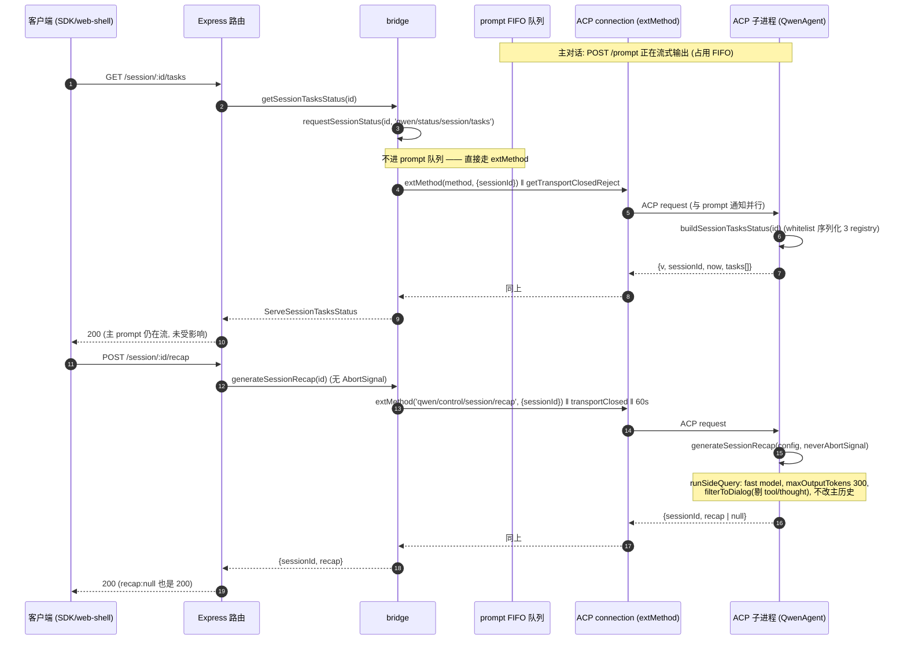
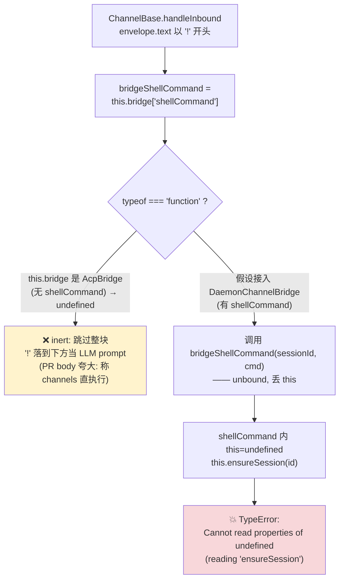

# 扩展端点（recap / btw / tasks / shell / logger）（深入）

> 子文档；总览见 [README.md](README.md)（以及总览正文 `daemon-serve-mode.md` §3.10）。本文在 file/symbol/line 级别**取代**总览的 §3.10「扩展端点」段落，深入到每个端点的控制面调用链、ACP ext-method 往返、绕开 prompt FIFO 的机理、HTTP shell 的安全面、`ChannelBase.ts` 的 `this`-binding 隐患，以及 daemon 文件日志的异步队列/降级/截断/symlink。
>
> 代码锚点除特别说明外均以集成分支 `daemon_mode_b_main` 为准（读法：`git -C <repo> show daemon_mode_b_main:<path>`）。注意：`btw`（#4610）虽对 `main` 仍标记为 open，但其实现**已在 `daemon_mode_b_main` 落地**（`server.ts:2086`），本文按集成分支实况描述。
>
> 关联 PR：#4504（recap）、#4610（btw）、#4578（tasks snapshot）、#4576（server-side shell `!`）、#4559（daemon file logger）、#4606（request-level logging）、#4563（`DaemonWorkspaceService` 抽出，方案 C）。

---

## 概述

本文覆盖的五个端点属于 daemon 的**控制面（control plane）**——它们不是「驱动一轮 agent 交互」（那是 `/session/:id/prompt`，走 SSE 流式主循环），而是「在不打断主对话的前提下，对一个活跃 session 做一次旁路读取或旁路计算」。它们共享同一套四层管线：

```
HTTP route (server.ts)
  → bridge method (acp-bridge/bridge.ts)            ← daemon 进程内
    → entry.connection.extMethod('qwen/...', {...}) ← NDJSON over stdio (ACP)
      → acpAgent.extMethod case (acpAgent.ts)       ← ACP 子进程内
        → core service / 本地执行
```

这套「route → bridge → ACP ext-method → core」复用自 Wave 4 PR 17 的 `setSessionApprovalMode`（#4504 PR body 明确称「Reuses the existing ext-method roundtrip pattern … so no new infrastructure」）。它有两个细分变体：

1. **status 路径（只读）**：`bridge.requestSessionStatus<T>(sessionId, method, params)`（`bridge.ts:1553`）是统一入口，被 `getSessionTasksStatus`（tasks）、`getSessionContextStatus`、`getSessionContextUsageStatus`、`getSessionSupportedCommandsStatus` 共用。method 取自 `SERVE_STATUS_EXT_METHODS`（`status.ts:96`）。
2. **control 路径（计算/副作用）**：`recap` / `btw` / `shell` 各有专属 bridge 方法（`generateSessionRecap` / `generateSessionBtw` / `executeShellCommand`），method 取自 `SERVE_CONTROL_EXT_METHODS`（`status.ts:118`）。

### 为什么这些端点不会阻塞 prompt FIFO

bridge 对**同一 session 的多个 prompt** 做 FIFO 串行化（见 `bridge.test.ts:2669`「FIFO-serializes concurrent prompts on the same session」）。但 recap/btw/tasks/shell **不进这个队列**：它们直接调用 ACP 连接的 `extMethod(...)`——这是 ACP JSON-RPC 之上的一条独立 request 通道，与 `session/prompt` 通知并行。因此即使主对话正在流式输出，客户端也能并发拉一次 tasks 快照、问一句 btw、或要一句 recap，而无需等当前 turn 结束。`bridge.test.ts:526`「requests session tasks status **without waiting for the prompt queue**」就是钉死这条不变式的测试。

代价是：这些 ext-method 在 ACP 子进程里与主 prompt 共享同一个事件循环；它们若触发 LLM 调用（recap/btw），是在子进程里另起一次**侧查询/分叉**，不复用主 turn 的 streaming，但也**不污染主对话历史**（详见各端点小节）。

### 鉴权姿态

| 端点 | 方法 | 门控 | 说明 |
| --- | --- | --- | --- |
| `/session/:id/tasks` | GET | 仅全局 bearer（无 `mutate`） | 只读快照，与其他 `GET /workspace/*` 状态路由同级。 |
| `/session/:id/recap` | POST | `mutate()`（非 strict） | 与 `/prompt` 同 posture：花 token、不改状态。 |
| `/session/:id/btw` | POST | `mutate()`（非 strict） | 同上。 |
| `/session/:id/shell` | POST | `mutate()`（非 strict） | 同上；真正的安全边界是 cwd 服务端固定 + bearer（见 shell 小节）。 |

四者都先过中间件链（Origin-strip → CORS → hostAllowlist → bearerAuth → json）。`mutate()`（非 strict）在「配了 token / `--require-auth`」时由全局 bearer 兜底；在「loopback 无 token 开发态」时 passthrough（保留零配置体验）。**没有任何一个用 `mutate({strict:true})`**——它们都被归类为「token 成本而非状态变更」，与写文件/改 MCP/device-flow 那批 strict 路由刻意区分。

---

## 涉及 PR（表格）

| PR | 标题（节选） | 合并日 | 在本文的作用 |
| --- | --- | --- | --- |
| #4504 | feat(serve): add POST /session/:id/recap | 2026-05-26 | recap 端点 + `generateSessionRecap` 暴露 + `session_recap` 能力 + `qwen/control/session/recap` ext-method。 |
| #4559 | feat(serve): add daemon file logger (#4548) | 2026-05-27 | `daemonLogger.ts`（异步队列 + 降级 + latest symlink）+ `onDiagnosticLine` seam + spawnChannel stderr forwarder tee。 |
| #4576 | feat(daemon): server-side shell command execution for ! (bang) prefix | 2026-05-28 | shell 端点 + `executeShellCommand`（`ShellExecutionService` 流式）+ `shell_history` 注入 + web-shell/channels `!` 路由。 |
| #4578 | feat(daemon): add session tasks snapshot endpoint | 2026-05-28 | tasks 快照端点 + `tasksSnapshot.ts` whitelist 序列化 + status 路径绕 FIFO。 |
| #4606 | feat(daemon): add request-level logging for serve routes | 2026-05-29 | access-log 中间件（bearer/json 之前）+ 关键路由 inline 业务日志。 |
| #4610 | feat(daemon): add POST /session/:id/btw endpoint for side questions | 2026-05-30 | btw 端点 + `core/btwUtils.ts`（`buildBtwPrompt`/`buildBtwCacheSafeParams`）+ `runForkedAgent` cache 路径 + 超时分层。 |

> 合并次序：recap（5-26）→ logger（5-27）→ shell + tasks（5-28，当天先后）→ request-log（5-29）→ btw（5-30）。logger 先于 shell/request-log 落地，所以 shell/request-log 直接挂到 `daemonLog` 上记日志。

---

## recap（侧查询、不改历史、v1 无取消）

### 调用链与三层职责

| 层 | 符号（行） | 职责 |
| --- | --- | --- |
| HTTP | `server.ts:2034` `POST /session/:id/recap` | 校验 `:id`、`parseClientIdHeader`、调 `bridge.generateSessionRecap`、`recap:null` 也按 200 返回。 |
| bridge | `bridge.ts:3433` `generateSessionRecap(sessionId, _context)` | 查 entry、发 `qwen/control/session/recap` ext-method、与 `getTransportClosedReject` + `SESSION_RECAP_TIMEOUT_MS`（60s）race。 |
| ACP 子进程 | `acpAgent.ts:2519` `case SERVE_CONTROL_EXT_METHODS.sessionRecap` | `session.getConfig()` → `generateSessionRecap(config, signal)`。 |
| core | `sessionRecap.ts:generateSessionRecap` | 侧查询出一句摘要，best-effort，从不抛。 |

### core 侧的「侧查询」机理（`core/services/sessionRecap.ts`）

`generateSessionRecap(config, abortSignal)` 是**纯侧查询、零历史改写**：

1. 取 `config.getGeminiClient().getChat().getHistory()`；`< 2` 条直接 `null`（历史太短）。
2. `filterToDialog(history)`：只留 `role ∈ {user,model}` 的**可见文本** part，剔除 tool call / tool response（一条 tool response 可能是 10K-token 文件 dump，会淹没 recap）、并剔除 `part.thought` / `part.thoughtSignature`（隐藏思维链，**绝不能泄漏进面向用户的摘要**）。
3. `takeRecentDialog(dialog, RECENT_MESSAGE_WINDOW=30)`：取最近 30 条，但**切片对齐 turn 边界**——`start` 向后挪到第一条 `role==='user'`，避免切片以悬空的 model/tool 回复开头。
4. `runSideQuery(config, { purpose:'session-recap', contents:[...recentHistory, {role:'user', parts:[{text: RECAP_USER_PROMPT}]}], systemInstruction: RECAP_SYSTEM_PROMPT, config:{ maxOutputTokens:300, temperature:0.3 }, abortSignal, maxAttempts:1 })`。
   - `runSideQuery`（`core/utils/sideQuery.ts`）默认走 **fast model**（`config.getFastModel?.() ?? config.getModel()`），`maxAttempts:1` 不烧默认 7 次重试（best-effort cosmetic）。
   - `maxOutputTokens:300` + system prompt 要求「< 40 词 / 中文约 80 字、`<recap>...</recap>` 包裹」。
5. `extractRecap(result.text)`：用 `RECAP_TAG_RE = /<recap>([\s\S]*?)<\/recap>/i` 抽标签内容；若只有开标签（命中 token 上限截断）取开标签之后；连开标签都没有则返回空串（宁可跳过，也不把模型的 reasoning 前言当摘要）。
6. **整个函数 `try/catch` 包裹，任何异常 → `null`**。注释明确：「recap is best-effort and must never break the main flow or surface errors to the user.」

因此对 `bridge` 而言，唯一会冒泡成错误的只有：未知 sessionId（`SessionNotFoundError`）、传输中途关闭（`getTransportClosedReject` race）、60s backstop 超时。模型层面的任何失败都被 core 吞成 `recap:null`，HTTP 端返回 `200 {sessionId, recap:null}`。

### v1 取消：**没有**（且与 PR body 矛盾）

这是本端点最需要标注的事实。`server.ts:2034` 的路由注释（L2042-2061）写得很直白：

> v1 cancellation: **NONE on the route side**. There is intentionally no `res.once('close')` listener and no `AbortSignal` plumbed into `bridge.generateSessionRecap`.

对照三处代码：

- **route**：`recap` 是唯一**没有** `res.once('close')` 的 control 端点（btw/shell 都有）。
- **bridge**：`generateSessionRecap(sessionId, _context)`（`bridge.ts:3433`）签名里**根本没有 `AbortSignal` 参数**——对比 `generateSessionBtw(sessionId, question, signal, _context)` 与 `executeShellCommand(sessionId, command, signal, context)`。
- **ACP 子进程**：`acpAgent.ts:2546` 显式传 `new AbortController().signal`——一个**永不 abort** 的 signal。注释：「the LLM call in this child always runs to completion」。

唯一的「天花板」是 bridge 的 `SESSION_RECAP_TIMEOUT_MS = 60_000`（`bridge.ts:612`，注释解释为何选 60s 而非继承 `initTimeoutMs=10s`：GPT 类慢启动会误触发 10s）与 transport-closed race。

> ⚠️ **PR body 夸大**：#4504 的 PR 描述写「**Cancellation is best-effort at v1**: client disconnect **aborts the bridge-side wait**…」。但代码里 recap 路由**根本没有监听 client disconnect**，bridge 方法也没有 signal 形参——所以「client disconnect aborts the bridge-side wait」对 recap 是**不成立**的。能做到「断连即停等」的是 btw 与 shell，不是 recap。文档（路由注释）与代码一致，PR body 与代码矛盾。

---

## btw（side question、超时分层）

### 设计：跟随 recap 模式，但补上 abort + 子进程自守

`/btw` 是「顺便问一句」——基于当前 session 上下文的单轮旁路问答，**无工具、无历史改写、不打断主对话**。#4610 PR body 自述「Follows the **recap pattern**」，但补了两件 recap 没有的事：HTTP 端 abort、ACP 子进程端 55s 自守。

| 层 | 符号（行） | 关键点 |
| --- | --- | --- |
| HTTP | `server.ts:2086` | `question` 必填、非空、`≤ 4096` 字符；`res.once('close')` → `abort.abort()`（仅当 `!res.writableEnded`）；catch `AbortError` 静默返回。 |
| bridge | `bridge.ts:3475` `generateSessionBtw(sessionId, question, signal, _context)` | `signal?.aborted` 早退 `{answer:null}`；三路 `Promise.race`：ext-method / `getTransportClosedReject` / abort-rejection；`SESSION_BTW_TIMEOUT_MS=60_000`（`bridge.ts:613`）。 |
| ACP 子进程 | `acpAgent.ts:2555` `case sessionBtw` | `buildBtwCacheSafeParams(config) ?? getCacheSafeParams()`；`runForkedAgent({ … abortSignal: AbortSignal.timeout(BTW_CHILD_TIMEOUT_MS) })`。 |
| core utils | `core/utils/btwUtils.ts` | `buildBtwPrompt` / `buildBtwCacheSafeParams`。 |

### `core/btwUtils.ts`

- **`buildBtwPrompt(question)`**：把问题包进一段 `<system-reminder>`，强约束「You have **NO tools** available」「ONLY use information already present in the conversation context」「NEVER promise to look something up」「The main conversation is NOT interrupted; you are a separate, lightweight fork」。这把分叉 agent 钉死成「只读上下文、单轮直答」。
- **`buildBtwCacheSafeParams(config)`**：构造 `runForkedAgent` 的 **cache 路径**入参——`structuredClone(chat.getGenerationConfig())` + `geminiClient.getHistoryTail(40, true)`（最近 40 条历史）+ `config.getModel()`，组成 `CacheSafeParams`。「cache-safe」指这套快照可以复用主 session 的 prompt-cache slot（KV cache），让旁路问答**便宜**。任何异常 → `null`，由 acpAgent 回落 `getCacheSafeParams()`（主 session 之前保存的全局快照）；再 null 则直接 `{answer:null}`。

### 超时分层（child 55s < bridge 60s）

```
HTTP res.once('close') ──abort──► bridge generateSessionBtw
                                    │  Promise.race:
                                    │   ├─ extMethod(sessionBtw) ─────► acpAgent
                                    │   │                                 runForkedAgent
                                    │   │                                 abortSignal=timeout(55s)  ← 子进程自守，先触发
                                    │   ├─ getTransportClosedReject(entry)
                                    │   └─ abort-rejection (来自 HTTP 断连)
                                    └─ withTimeout(…, 60_000)  ← bridge backstop，后触发
```

子进程的 `BTW_CHILD_TIMEOUT_MS = 55_000`（`acpAgent.ts:146`）**刻意比** bridge 的 `SESSION_BTW_TIMEOUT_MS = 60_000` 小 5s。这样正常超时的语义是「子进程先 `AbortSignal.timeout` 触发 `TimeoutError`，转成 `RequestError.internalError('Side question timed out after 55s')` 顺着 ext-method 返回」——而不是「bridge 60s backstop 先 fire、留下一个还在跑的子进程」。即：**让最贴近真相的那一层先报错**，bridge 60s 只是兜底。

### abort 的「半生效」

HTTP 端断连 → `abort.signal` → bridge 的 `Promise.race` 里 abort-rejection 胜出 → 抛 `AbortError` → 路由 catch 后静默返回（不写响应）。**但**：ext-method 请求已经发给子进程了，且**没有**跨进程 cancel 消息——所以子进程里的 `runForkedAgent` 会一直跑到出结果或 55s 超时。即 btw 的 abort 让「bridge 停止等待 + HTTP 响应被放弃」，但**救不回子进程那次 LLM 调用的算力**。这与 shell 不同（shell 的执行在 daemon 本进程，abort 是真生效的，见下）。

---

## tasks snapshot（requestSessionStatus 绕 FIFO、whitelist 序列化）

### 端点动机

`GET /session/:id/tasks`（`server.ts:1607`）让客户端（特别是 web-shell 的 `/tasks` 命令）在**主 prompt 正在流式输出时**窥视后台任务状态，而不必再发一次 prompt、也不必排在 prompt 队列后面。#4578 PR body：「web-shell needs to inspect background tasks while a prompt is streaming **without sending another ACP prompt or waiting behind the prompt queue**」。

### status 路径如何绕 FIFO（`bridge.ts:1553`）

```ts
const requestSessionStatus = async <T>(sessionId, method, params = {}): Promise<T> => {
  const entry = byId.get(sessionId);
  if (!entry) throw new SessionNotFoundError(sessionId);
  const info = channelInfoForEntry(entry);
  if (!info || info.isDying) throw new SessionNotFoundError(sessionId);
  const response = await Promise.race([
    withTimeout(entry.connection.extMethod(method, { ...params, sessionId }), initTimeoutMs, method),
    getTransportClosedReject(entry),
  ]);
  return response as unknown as T;
};
```

要点：

- 直接 `entry.connection.extMethod(...)`——**不经过 prompt 队列**，所以并发于流式 prompt。
- 与 `getTransportClosedReject(entry)`（`bridge.ts:1484`，懒初始化、对 `entry.channel.exited` `.then(throw BridgeChannelClosedError)`，单监听器不变式）race，保证子进程中途死亡时不会永久挂起。
- 超时用 `initTimeoutMs`（默认 10s）——tasks 只是序列化几个内存 registry，10s 绰绰有余（不像 recap/btw 要等 LLM，才放宽到 60s）。
- `getSessionTasksStatus(sessionId)`（`bridge.ts:3181`）只是 `requestSessionStatus<ServeSessionTasksStatus>(sessionId, SERVE_STATUS_EXT_METHODS.sessionTasks)` 的薄封装。method 字符串为 `'qwen/status/session/tasks'`（`status.ts`）。

### ACP 子进程侧序列化（`tasksSnapshot.ts:buildSessionTasksStatus`）

`acpAgent.ts:2176` 的 `case sessionTasks` 校验 `sessionId` 后调私有 `buildSessionTasksStatus`（`acpAgent.ts:2090`）→ `buildSessionTasksStatus(sessionId, session.getConfig())`（core helper，`packages/cli/src/acp-integration/session/tasksSnapshot.ts`）。它合并三个 registry 并按 `startTime` 升序排：

```
config.getBackgroundTaskRegistry().getAll()  → serializeAgentTask   (kind:'agent')
config.getBackgroundShellRegistry().getAll() → serializeShellTask   (kind:'shell')
config.getMonitorRegistry().getAll()         → serializeMonitorTask (kind:'monitor')
```

**whitelist 序列化**是这里的安全/契约重点：三个 `serialize*` 函数**逐字段显式列举**要透出的属性，而非 `{...entry}` 整体外泄。可选字段用 `...(entry.x !== undefined ? {x: entry.x} : {})` 条件 spread，保证 wire schema 干净、稳定，且不会把 registry entry 内部的句柄/回调/不稳定字段泄漏给 HTTP 客户端。例如：

- `serializeAgentTask`：`kind/id/label(=buildBackgroundEntryLabel(entry))/description/status/startTime/runtimeMs/outputFile/isBackgrounded` + 条件 `endTime/subagentType/error/resumeBlockedReason`。
- `serializeShellTask`：`label=entry.command`、并显式带 `command/cwd` + 条件 `pid/exitCode/error`。
- `serializeMonitorTask`：带 `command/eventCount/lastEventTime/droppedLines` + 条件 `pid/exitCode/error/ownerAgentId`。

`runtimeMs(entry, now) = max(0, (endTime ?? now) - startTime)`——未结束的任务用 `now` 当前缀。整个快照带 `v: STATUS_SCHEMA_VERSION` 版本号、`sessionId`、`now`、`tasks[]`。

### v1 局限

#4578 PR body 自陈：「V1 is **snapshot-only**; task stop, output tailing, and live SSE updates are intentionally not included.」即 tasks 端点只能拉一次性快照，不能 stop 任务、不能 tail 输出、没有 SSE 增量推送。

---

## server-side shell（`!` bang、HTTP 安全、ChannelBase `this`-binding 隐患 + inert channels）

shell 端点是本批里最复杂、也最值得标注「隐患」的一个。它有**三条入口路径**，命运各不相同：

| 路径 | 入口 | 结局 |
| --- | --- | --- |
| HTTP | `POST /session/:id/shell`（`server.ts:2142`） | ✅ **工作**：直达 `bridge.executeShellCommand`。 |
| web-shell | `webui …/actions.ts:441` `session.shellCommand(command, ctrl.signal)` | ✅ **工作**：SDK `DaemonSessionClient.shellCommand` → HTTP `POST /shell` → 同上。 |
| channels `!` | `ChannelBase.handleInbound` bang 块（`ChannelBase.ts:273-313`） | ❌ **inert（哑火）**：拿不到 `shellCommand`，且接通即 TypeError（见下）。 |

### HTTP 路径（works）：`bridge.executeShellCommand`（`bridge.ts:3518`）

执行**发生在 daemon 本进程**（不是 ACP 子进程）：

1. 查 entry → `resolveTrustedClientId`。`signal?.aborted` 早退 `{exitCode:null, output:'', aborted:true}`。
2. **cwd 服务端固定**：`const cwd = entry.workspaceCwd;`（`bridge.ts:~3534`）——客户端**无法**指定 cwd，命令永远在 session 绑定（且 boot 时已对齐 `boundWorkspace`）的工作区根执行。这是 shell 安全面的核心。
3. publish `user_shell_command` 事件（带 `originatorClientId`，供其他客户端在 SSE 上抑制自己动作回声）。
4. `ShellExecutionService.execute(command, cwd, onEvent, abort.signal, false, {terminalWidth:120, terminalHeight:40}, {streamStdout:true})`：流式 `data` 事件逐块 publish 成 `session_update{ sessionUpdate:'shell_output', _meta:{source:'user-shell'} }`——所以 web 端能看到 shell 输出**实时流**在同一条 SSE 上。
5. 120s 硬超时：`setTimeout(() => abort.abort(), SHELL_COMMAND_TIMEOUT_MS=120_000)`（`bridge.ts:614`），`unref()`。
6. 结束后 publish `user_shell_result{exitCode, signal, aborted}`，并把命令 + 输出（`MAX_SHELL_OUTPUT_FOR_HISTORY=10_000` 截断 + `\n... (truncated)`）经 `qwen/control/session/shell_history` ext-method（`bridge.ts:~3621`）注入回子进程的 GeminiClient 历史——这样后续问 LLM「刚才那条命令输出了啥」它能引用。
7. 返回 `{exitCode, output, aborted}`。

**abort 真生效**：HTTP 路由（`server.ts:2152`）`res.once('close')` → `abort.abort()` → bridge 内 `signal.addEventListener('abort', () => innerAbort.abort())` → `ShellExecutionService` 收到 abort → **真正杀掉正在跑的子进程**。因为执行在 daemon 本进程（不跨进程），所以 shell 是三个 control 端点里**唯一 e2e 取消完全可用**的（recap 无取消、btw 只能停 bridge 等待）。

ACP 子进程侧的 `case sessionShellHistory`（`acpAgent.ts:2599`）只做一件事：`geminiClient.addHistory(...)` 追加一条 `role:'user'` 文本——内容是「I ran the following shell command:（一段 sh fenced block 的命令）This produced the following result:（一段 fenced block 的输出）」。即「执行在 daemon、历史注入在 child」的分工。

### channels `!` 路径（inert）+ `this`-binding 隐患（**重点**）

`ChannelBase.handleInbound`（`packages/channels/base/src/ChannelBase.ts:273`）在 slash 命令与 session 路由之后、LLM prompt 之前，有一段 bang 处理：

```ts
// 3.5. Bang (!) shell command — direct execution, no LLM
if (envelope.text.startsWith('!')) {
  const cmd = envelope.text.slice(1).trim();
  const bridgeShellCommand =
    (this.bridge as unknown as Record<string, unknown>)['shellCommand'];   // L276
  if (cmd && typeof bridgeShellCommand === 'function') {                    // L277
    try {
      const result = (await bridgeShellCommand(sessionId, cmd)) as { … };   // L279  ← 隐患
      …
    }
  }
}
```

这里有**两个独立问题**：

**(1) 当前 inert（哑火）——`ChannelBase.bridge` 没有 `shellCommand`。**

`ChannelBase.bridge` 的静态类型是 `AcpBridge`（`packages/channels/base/src/AcpBridge.ts`，`class AcpBridge extends EventEmitter`，方法只有 `start/newSession/loadSession/prompt/cancelSession/stop/isConnected` —— **没有 `shellCommand`**）。生产 wiring（`packages/cli/src/commands/channel/start.ts:202/345` `new AcpBridge(bridgeOpts)`）也只往 channel adapter 注入 `AcpBridge`。因此 `bridgeShellCommand = (...)['shellCommand']` 恒为 `undefined`，`typeof undefined === 'function'` 为 `false`，整块被跳过，bang 文本**落到下方当普通 LLM prompt**。

所以 #4576 PR body 那句「**Channels** (Telegram/DingTalk/WeChat) detect `!` prefix and route through **direct execution**」在 `daemon_mode_b_main` 上**夸大了**：channels 的 `!` 既不直执行、也不报错，只是悄悄退化成 LLM prompt。

**(2) 接通即 TypeError——unbound 方法调用丢了 `this`。**

唯一一个带 `shellCommand` 的 channel 侧 bridge 是 `DaemonChannelBridge`（`packages/channels/base/src/DaemonChannelBridge.ts:175 extends EventEmitter`），它的 `shellCommand(sessionId, command, signal)`（L320）第一行就是 `const session = this.ensureSession(sessionId);`（L325），而 `ensureSession`（L405）读 `this.sessions.get(sessionId)`。

问题在于 `ChannelBase` 是先把方法**摘成自由变量** `bridgeShellCommand`，再以 `bridgeShellCommand(sessionId, cmd)` 调用——**不是 `this.bridge.shellCommand(...)`**。一旦未来有人把 `DaemonChannelBridge` 接进 `ChannelBase`（让 `typeof === 'function'` 为真），这次 unbound 调用会让 `shellCommand` 内部的 `this` 为 `undefined`（ESM class 方法严格模式），于是 `this.ensureSession(...)` 抛 `TypeError: Cannot read properties of undefined (reading 'ensureSession')`。即「**接通即 TypeError**」。

注：`DaemonChannelBridge` 在 `daemon_mode_b_main` 上**只在自己的测试里**被 `new`（`DaemonChannelBridge.test.ts`），从未在生产接入 `ChannelBase`；真正的 channel↔daemon wireup 仍停留在 draft 分支（`feat/channel-daemon-wireup-draft` 等）。所以今天这是**潜伏（latent）bug**，不是线上故障——但一旦 wireup 落地且不修这行，bang 路径会从「哑火」变「崩」。修法二选一：调用点改 `this.bridge.shellCommand(sessionId, cmd)` 保留绑定，或 `bridgeShellCommand.call(this.bridge, sessionId, cmd)`。另外签名也要对齐：`ChannelBase` 传 2 参（无 signal），`DaemonChannelBridge.shellCommand` 取 3 参（signal 可选），接通后 signal 恒 `undefined`，即 channels bang 无取消。

### shell 没有能力标签

值得一记：`capabilities.ts` 上有 `session_tasks`（L85）、`session_recap`（L181）、`session_btw`（L184），**却没有 shell 的能力标签**。即客户端**无法**通过 `/capabilities` 的 `features[]` 预探测「这个 daemon 支不支持 server-side shell」，只能盲发 `POST /shell` 看结果。这与 recap/btw/tasks 都注册了 always-on 标签的做法不一致（见「已知限制」）。

---

## daemon file logger（异步队列、降级、截断、symlink）

`packages/cli/src/serve/daemonLogger.ts`（#4559）给每个 daemon 进程一份结构化落盘日志，**不取代**既有 stderr，而是 tee。`runQwenServe.ts:565` 在 boot 时 `initDaemonLogger({ boundWorkspace })`。

### 文件路径与 daemon id

- 目录：`Storage.getGlobalDebugDir()/daemon/`（即 `~/.qwen/debug/daemon/`，受 `QWEN_RUNTIME_DIR` 影响）。
- 文件名：`computeDaemonId`（`daemonLogger.ts:118`）= `serve-<pid>-<sha256(boundWorkspace)[:8]>` → `serve-12345-ab12cd34.log`。workspace 哈希前缀让「同机多 workspace daemon」各自独立、且文件名不暴露完整路径。
- `daemon/latest` symlink：`updateSymlink(aliasPath, logPath, { fallbackCopy:false })`（`daemonLogger.ts:158`），best-effort、`.catch(()=>{})`，失败绝不拖累主写入——方便 `tail -f ~/.qwen/debug/daemon/latest`。

### opt-out 与 boot 探针

- `isOptedOut()`（L112）：`QWEN_DAEMON_LOG_FILE` ∈ `{0,false,off,no}`（trim+小写）→ 直接返回 `NOOP_LOGGER`（L102，所有方法空实现）。
- boot 同步可写性探针：`mkdirSync(recursive)` + `appendFileSync(logPath, firstLine)`（L146）写第一行 `daemon started pid=… workspace=…`。**任何同步异常** → 写一行 stderr「daemon log disabled — init failed」→ 回落 `NOOP_LOGGER`（L153）。即「启动时就探明能不能写，写不了就彻底关掉，绝不在热路径里反复试」。

### 异步 append 队列 + 一次性降级

```ts
let pending: Promise<void> = Promise.resolve();   // L167
let degraded = false;                              // L168
const enqueueAppend = (line) => {                  // L170
  pending = pending.then(() =>
    nodeFs.promises.appendFile(logPath, line).catch((err) => {
      if (!degraded) {
        degraded = true;                           // 一次性翻牌
        stderr(`qwen serve: daemon log write failed — entering degraded mode: …`);
      }
    }),
  );
};
```

- **串行队列**：`pending = pending.then(…)` 把所有 append 串成一条 promise 链，保证写入顺序 = 调用顺序，且不并发抢同一 fd。
- **一次性降级（one-shot degrade）**：首次写失败把 `degraded` 置真并**只**告警一次 stderr；之后继续静默尝试（链不断），不会每条失败都刷屏。`degraded` 没有自动恢复——磁盘满/权限变更后的噪音被压到一行。
- `flush(): pending`（返回当前链尾 promise），shutdown 时 `await daemonLog.flush()`（`runQwenServe.ts:1024/1031`）确保排队中的写落盘再退出。

### `info/warn/error`（tee）vs `raw`（仅文件）

- `teeLine`（L185）：先 `stderr(line.trimEnd())`**同步**写 stderr（保人眼可见顺序），再 `enqueueAppend(line)` 异步入队文件。`info/warn/error` 三个公共方法都走它。
- `raw(line, level)`（L205）：**只**入队文件，不写 stderr——用于「调用方自己已经写过 stderr」的行，避免 stderr 重影。`createSpawnChannelFactory` 的 child-stderr tee 与 bridge 的 `onDiagnosticLine` 都走 `raw`。
- `buildDaemonLogLine`（L78）：`<ISO ts> [LEVEL] [DAEMON] <ctx…> <message>\n<err 缩进续行>`。`renderCtx` 按固定序 `route/sessionId/clientId/childPid/channelId` 先排，其余 key 字典序补在后，值含空格/`=` 时 `JSON.stringify` 引号化。

### `onDiagnosticLine` seam 与 spawnChannel stderr forwarder

为了让 `acp-bridge` **不依赖 cli**，#4559 用回调 seam 把诊断行注入回 logger：

```
runQwenServe.ts:750  diagnosticSink = (line, level) => daemonLog.raw(line, level)
              :753  channelFactory = createSpawnChannelFactory({ onDiagnosticLine: diagnosticSink })
              :766  createHttpAcpBridge({ …, onDiagnosticLine: diagnosticSink })
```

- bridge 内部诊断（如 `executeShellCommand`/`generateSessionRecap` 的 dispatch 行）经 `opts.onDiagnosticLine?.(…)` → `daemon.raw`。
- ACP **子进程 stderr** 经 `createStderrForwarder`（`packages/acp-bridge/src/spawnChannel.ts:37`）逐行转发：`child.stderr` `data` → 按 `\n` 切行 → 每整行 `process.stderr.write(prefix+line)` **且** `onDiagnosticLine(prefix+line, 'warn')`（`spawnChannel.ts:118-120`）。

  > ⚠️ **截断归属澄清**：64KiB 的「截断」是这个 **stderr forwarder 的单行上限** `STDERR_LINE_CAP_CHARS = 64*1024`（`spawnChannel.ts`），用于挡「没有 `\n` 的 stderr 洪流」撑爆内存——超长未结束缓冲会被切成 `…[truncated]` 强制 flush。**`daemonLogger.ts` 自身不做任何截断**（它原样 append）。把 64KiB 记到 logger 名下是常见误记；真实落点在 spawnChannel forwarder。

### request 级访问日志（#4606）

`server.ts:876` 注册一个 access-log 中间件，**刻意在 `bearerAuth` 与 `express.json` 之前**，这样 401（鉴权拒绝）与 400（body 解析失败）也能被记录。`res.on('finish')` 时记 `{route, sessionId, clientId, status, durationMs}`，`status>=400` 用 `warn` 否则 `info`。排除两类高频噪音：`GET /health`、`POST …/heartbeat`（L880），以及**成功的 SSE**（`GET …/events` 且 `200`，L890，因为 SSE 在 open/close 另有 inline 日志；失败的 4xx 握手仍记）。整个中间件 gated on `daemonLog` 存在——测试/嵌入场景零输出。

此外 `sendBridgeError` 被 curry 进 `daemonLog`（`server.ts:736`），所有 5xx 经 logger tee；关键路由（spawn/attach、prompt enqueue、cancel、recap null-vs-generated、shell 完成、SSE open/close）有 inline 业务日志（如 recap 端点 `server.ts:~2070` 记 `recap generated len=N` 或 `recap returned null`）。

---

## 时序图

### ① recap / tasks 经 status/control 路径绕过 prompt 队列



### ② shell 命令 HTTP 执行 + 超时 / abort

```mermaid
sequenceDiagram
    autonumber
    participant Cl as 客户端
    participant R as POST /session/:id/shell (mutate)
    participant Br as bridge.executeShellCommand (daemon 进程内)
    participant Bus as EventBus(session)
    participant Sh as ShellExecutionService
    participant Ag as ACP 子进程

    Cl->>R: {command}
    R->>R: 校验 command 非空; res.once('close')→abort
    R->>Br: executeShellCommand(id, cmd, abort.signal, {clientId})
    Br->>Br: cwd = entry.workspaceCwd  (服务端固定, 客户端无法指定)
    Br->>Bus: publish user_shell_command
    Br->>Sh: execute(cmd, cwd, onData, innerAbort.signal, {streamStdout})
    Br->>Br: setTimeout(()=>innerAbort.abort(), 120_000).unref()
    loop 流式输出
        Sh-->>Br: data chunk
        Br->>Bus: publish session_update{shell_output, _meta.source:'user-shell'}
        Bus-->>Cl: SSE 帧 (实时输出)
    end
    alt 客户端断连 / 超时
        R->>Br: abort.signal → innerAbort.abort()
        Br->>Sh: 杀子进程 (本进程执行, abort 真生效)
    end
    Sh-->>Br: {exitCode, signal, aborted, output}
    Br->>Bus: publish user_shell_result
    Br->>Ag: extMethod 'qwen/control/session/shell_history'<br/>(cmd+output 截断 10K, 注入 GeminiClient 历史)
    Br-->>R: {exitCode, output, aborted}
    R-->>Cl: 200
```

### ③ channels `!` 路径：inert + 潜伏 `this`-binding bug



---

## 边界与错误处理

| 场景 | 行为 | 锚点 |
| --- | --- | --- |
| 未知 sessionId | `404 SessionNotFoundError`（经 `sendBridgeError`） | 各 bridge 方法首行 `byId.get(id)` / `channelInfoForEntry` |
| session 正在死 (`isDying`) | `getSessionTasksStatus`/recap 视作未知 → 404 | `bridge.ts:1553/3433`（`!info \|\| info.isDying`） |
| ACP 子进程中途死亡 | `BridgeChannelClosedError`（race 胜出） | `getTransportClosedReject`（`bridge.ts:1484`） |
| recap 模型失败/历史过短 | `recap:null`（**200**，非错误） | `sessionRecap.ts` try/catch → null |
| recap 60s 未回 | `withTimeout` 抛超时 | `SESSION_RECAP_TIMEOUT_MS`（`bridge.ts:612`） |
| btw `question` 缺失/空/`>4096` | `400` | `server.ts:2086` |
| btw 子进程 55s 超时 | `RequestError.internalError('Side question timed out after 55s')` | `acpAgent.ts:2587` |
| btw 无上下文 / cacheSafeParams 全 null | `{answer:null}`（200） | `acpAgent.ts:2555` |
| btw/shell 客户端断连 | `res.once('close')`→abort；catch `AbortError` 静默返回（不写响应） | `server.ts:2104/2152` |
| shell `command` 缺失/空 | `400` | `server.ts:2142` |
| shell 120s 超时 / 断连 | abort → 杀子进程 → `{aborted:true}` | `bridge.ts:614` + `ShellExecutionService` |
| shell 执行抛错 | publish `user_shell_result{error}` 后 rethrow → `sendBridgeError` | `bridge.ts:~3633` |
| shell 输出过长入历史 | `>10_000` 截断 + `\n... (truncated)` | `MAX_SHELL_OUTPUT_FOR_HISTORY`（`bridge.ts:615`） |
| 日志初始化失败 | stderr 一行 + `NOOP_LOGGER`（彻底关闭） | `daemonLogger.ts:153` |
| 日志运行时写失败 | 一次性 stderr 告警 + `degraded=true`，继续静默尝试 | `daemonLogger.ts:170` |
| 子进程 stderr 无 `\n` 洪流 | 64KiB 单行截断 `…[truncated]` | `spawnChannel.ts` `STDERR_LINE_CAP_CHARS` |

---

## 关键设计决策与权衡

1. **复用 ext-method 往返、零新基建**。recap/btw/tasks/shell 全部挂在既有的 `entry.connection.extMethod` 之上，method 字符串集中在 `SERVE_STATUS_EXT_METHODS` / `SERVE_CONTROL_EXT_METHODS`（`status.ts`），便于 reviewer 一处 grep 出全部「读」与「变更」面。代价是这些端点与主 prompt 共享子进程事件循环，但换来「不进 FIFO、可并发于流式 prompt」。

2. **侧查询/分叉而非改主历史**。recap 用 `runSideQuery`（fast model、`maxOutputTokens:300`、`maxAttempts:1`）+ `filterToDialog`（剔 tool/thought）做**一次性 cosmetic 摘要**；btw 用 `runForkedAgent` 的 **cache 路径**（`buildBtwCacheSafeParams` 复用主 session 的 prompt-cache slot）做**无工具单轮分叉**。两者都**不写主对话历史**——保证「顺手问一句/看一眼」绝不污染正经上下文。唯一会回写历史的是 shell（`shell_history` 注入），因为 LLM 后续确实需要引用刚跑的命令输出。

3. **超时分层「让最近真相的层先报错」**。btw 的子进程自守 55s **故意小于** bridge backstop 60s（`acpAgent.ts:146` vs `bridge.ts:613`）——正常超时由子进程产出带语义的 `RequestError`，bridge 60s 只兜「子进程彻底 wedged」。recap 则把 60s 设为唯一天花板（且解释为何不继承 10s `initTimeoutMs`：避免 GPT 慢启动误触发）。

4. **取消能力按「执行落点」分级，而非一刀切**。shell 执行在 daemon 本进程 → abort 真杀进程（e2e 可取消）；btw 执行跨进程 → abort 只停 bridge 等待、救不回子进程算力（半生效）；recap 干脆不接 abort（路由无 `res.once('close')`、bridge 无 signal 形参）——因为 recap 短（1–5s）、且跨进程 cancel 管道尚不存在，接了也是 cosmetic。这是「按收益接 abort」的务实取舍，但 PR body 对 recap 的描述未跟上代码（见下）。

5. **whitelist 序列化护 wire 契约**。tasks 快照逐字段显式列举 + 条件 spread（`tasksSnapshot.ts`），而非整体外泄 registry entry，防内部句柄/不稳定字段泄漏，并带 `STATUS_SCHEMA_VERSION` 给客户端版本协商。

6. **日志：tee 不取代、async 不阻塞、degrade 不刷屏、seam 不耦合**。`teeLine` 同步 stderr + 异步文件双写保人眼顺序；串行 promise 队列保写序且不阻塞热路径；一次性降级把磁盘满噪音压到一行；`onDiagnosticLine` 回调 seam 让 `acp-bridge` 不依赖 cli。boot 同步探针「写不了就彻底 NOOP」避免热路径反复试错。

---

## 已知限制 / 后续

1. **#4576 channels `!` 路径：inert + 潜伏 `this`-binding bug**。`ChannelBase.bridge` 是 `AcpBridge`（无 `shellCommand`），bang 块当前哑火、退化成 LLM prompt——所以 PR body「channels 直执行 shell」**夸大**。更危险的是 `ChannelBase.ts:279` 把方法摘成自由变量 `bridgeShellCommand(sessionId, cmd)` **unbound 调用**：一旦把带 `shellCommand` 的 `DaemonChannelBridge`（其 `shellCommand` 首行 `this.ensureSession`）接进来，**接通即 `TypeError`**。修法：改 `this.bridge.shellCommand(...)` 或 `.call(this.bridge, …)`，并对齐 signal 参数。当前仅潜伏（生产从不把 `DaemonChannelBridge` 接入 `ChannelBase`，wireup 仍在 draft 分支）。

2. **#4504 recap PR body 取消描述与代码矛盾**。PR body 称「client disconnect aborts the bridge-side wait」，但 recap 路由**没有** `res.once('close')`、bridge 方法**没有** `AbortSignal` 形参、子进程传**永不 abort** 的 signal。真实情况是「v1 完全无取消，只有 60s backstop + transport-closed race」——路由注释（`server.ts:2042`）说得对，PR body 说错了。能做到断连停等的是 btw/shell，不是 recap。

3. **shell 端点无能力标签**。`capabilities.ts` 有 `session_tasks`/`session_recap`/`session_btw`，**独缺 shell**。客户端无法用 `/capabilities` 预探测 server-side shell 支持，只能盲发。与「gate on features 而非 mode」的总契约不一致，应补一个 `session_shell`（或同名）always-on 标签。

4. **btw 取消跨进程半生效**。HTTP 断连只能让 bridge 停等、放弃 HTTP 响应；子进程的 `runForkedAgent` 仍跑到出结果或 55s。根治需要 request-id 级跨进程 cancel ext-method（recap PR 也提到同一 follow-up）。

5. **tasks 仅快照**。无 task stop、无 output tailing、无 SSE 增量（#4578 PR body 自陈）。

6. **64KiB 截断归属易误记**。该截断在 `spawnChannel.ts` 的 stderr forwarder（`STDERR_LINE_CAP_CHARS`），**不在** `daemonLogger.ts`；logger 自身原样 append、不截断。

7. **日志 degrade 不自动恢复**。`degraded` 一旦置真不会复位——磁盘空间/权限恢复后仍只靠后续 append 静默重试，运维需重启 daemon 才能确定性恢复 + 重新告警。

---

## 测试覆盖

| 测试文件:符号 | 覆盖点 |
| --- | --- |
| `acp-bridge/src/bridge.test.ts:526`「requests session tasks status **without waiting for the prompt queue**」 | tasks status 路径**绕过 prompt FIFO** 的核心不变式。 |
| `acp-bridge/src/bridge.test.ts`（`qwen/status/session/tasks` mock，L476/512/592） | tasks ext-method 转发、空 `tasks[]` 透传、`missing` → `SessionNotFoundError`。 |
| `acp-bridge/src/bridge.test.ts`（recap，#4504 +3） | recap ext-method 转发、`recap:null` 保留、未知 id → `SessionNotFoundError`。 |
| `cli/src/serve/server.test.ts:2900`「POST /session/:id/recap」 | 200 happy path（forwards no body）、`recap:null` 也是 200、client-id context、404、malformed client-id、非 strict 门控 posture pin。 |
| `cli/src/serve/server.test.ts:1703/1832`（`/session/s-1/tasks`、`/session/missing/tasks`） | tasks 200 快照 + 未知 session 404。 |
| `cli/src/acp-integration/acpAgent.test.ts` | ext-method case 分派（含 recap/btw/tasks/shell_history）。 |
| `cli/src/serve/daemonLogger.test.ts`（21 specs，L21-327） | `buildDaemonLogLine` 格式（fixed ctx 序、extra key 排序、含空格值引号化、err stack 续行、stack 缺失回落）；`QWEN_DAEMON_LOG_FILE` opt-out（0/false/off/no）；daemon-id 派生 + 建文件；mkdir 失败回落 NOOP；`raw` 仅文件不 tee；`info` tee stderr；`error` 续行；`flush` 等待全部 pending；append 失败**只告警一次**仍继续；`daemon/latest` symlink 建立 + 二次 init 更新。 |
| `acp-bridge/src/spawnChannel.test.ts`（#4559 +6，`createStderrForwarder`） | 子进程 stderr 逐行转发 + 64KiB 单行截断 + `onDiagnosticLine` tee。 |
| `acp-bridge/src/bridge.test.ts`（#4559 +2，`onDiagnosticLine` tee） | bridge 诊断行经 `raw` 落 logger。 |
| `cli/src/serve/server.test.ts`（#4559 +2） | `sendBridgeError` → `daemonLog` 路由。 |
| `cli/src/serve/runQwenServe.test.ts`（#4559 +1） | boot banner + daemon 文件落盘集成。 |
| `web-shell/client/utils/tasksCommand.test.ts`（#4578） | web-shell `/tasks` 本地拦截、拉快照而**不** `sendPrompt`/入队。 |
| `sdk-typescript/test/unit/DaemonClient.test.ts` / `DaemonSessionClient.test.ts` / `daemon-public-surface.test.ts`（recap +7、shell、tasks） | SDK `recapSession`/`recap`、`shellCommand`、tasks 助手 + `DaemonSessionRecapResult`/`DaemonShellCommandResult` 类型锁。 |
| `channels/base/src/ChannelBase.test.ts` / `DaemonChannelBridge.test.ts` | `ChannelBase` 调度（bang 块当前未单测「接通」路径——潜伏 bug 无回归守卫）；`DaemonChannelBridge.shellCommand` 单测里以**正常 `this`** 调用（`new` 后 `bridge.shellCommand(...)`），故测不到 `ChannelBase` 那条 unbound 调用的 TypeError。 |

> 最后一行是「为什么这个 latent bug 没被测试抓到」的根因：`DaemonChannelBridge.test.ts` 测的是 `bridge.shellCommand(...)`（带绑定），而出事的是 `ChannelBase.ts:279` 的 unbound 自由变量调用——两条路径无交叉测试，且 `ChannelBase` 在生产用 `AcpBridge`（哑火）故 e2e 也碰不到。
