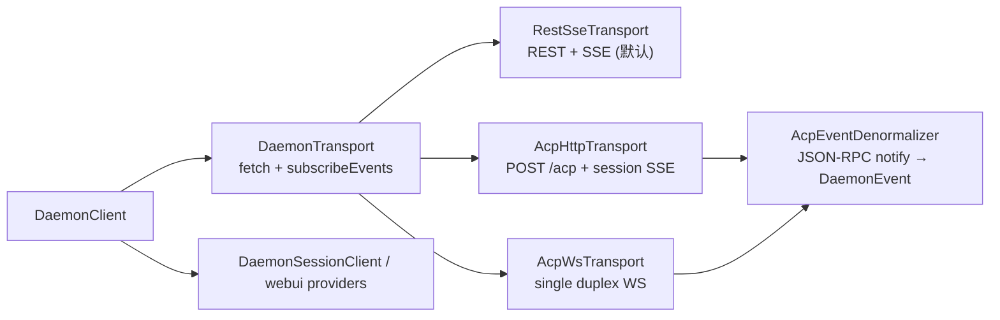
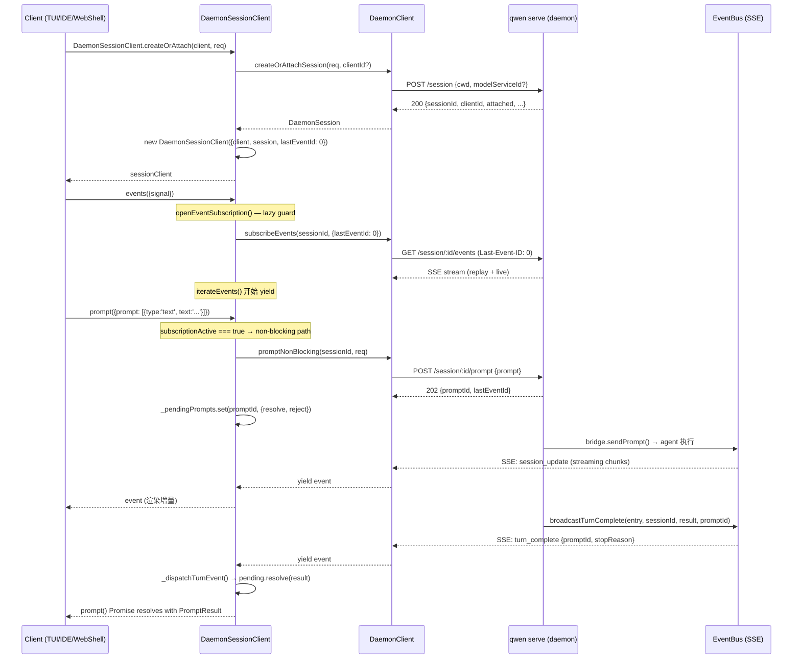
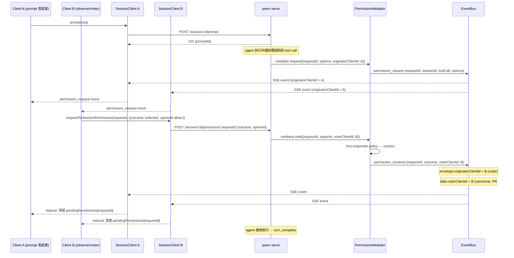

# 客户端适配器与 SDK（深入）

> daemon/serve（Mode B）技术方案子文档；总览见 [`README.md`](README.md)。
> 本文覆盖 **客户端适配层**（SDK `DaemonSessionClient`、typed event schema、client identity、TUI/channels/IDE adapter spike、跨客户端协调），填补 01-08 对服务端/桥接/基础设施覆盖后的客户端缺口。早期 `file:symbol`(+line) 锚点保留集成分支 **`daemon_mode_b_main`** 语境；#4490 合入 main 后的 #5040 DaemonTransport 等近期 PR 以当前 `main` 实现为准。
> 关键文件：`packages/sdk-typescript/src/daemon/DaemonSessionClient.ts`（530 行）、`DaemonClient.ts`（~2800 行）、`events.ts`（~2500 行）、`packages/cli/src/ui/daemon/DaemonTuiAdapter.ts`（905 行）、`packages/channels/base/src/DaemonChannelBridge.ts`（705 行）、`packages/vscode-ide-companion/src/services/daemonIdeConnection.ts`（631 行）。

---

## 概述

daemon 架构将 LLM 代理的全部状态收束到 `qwen serve` 进程内部，通过 HTTP + SSE 对外暴露。客户端——TUI、IDE extension、channel bot、web shell——都通过 **SDK（`@qwen-code/sdk`）** 里的 `DaemonClient` / `DaemonSessionClient` 消费这个统一面：

```
┌────────────────────────────────────────────────────────────────┐
│  qwen serve (daemon)                                          │
│  ┌─────────────────┐  ┌──────────────┐  ┌──────────────────┐  │
│  │  Express server  │  │  ACP bridge  │  │  EventBus (SSE)  │  │
│  └────────┬────────┘  └──────┬───────┘  └────────┬─────────┘  │
│           │                  │                    │            │
│           └──────────────────┼────────────────────┘            │
│                              │ HTTP + SSE                      │
└──────────────────────────────┼────────────────────────────────┘
                               │
                ┌──────────────┴──────────────┐
                │    DaemonClient (HTTP层)     │
                │    DaemonSessionClient       │
                │    (会话+SSE+replay)         │
                └──────┬──────────────────────┘
                       │
        ┌──────────────┼──────────────┬────────────────┐
   ┌────┴────┐    ┌────┴────┐   ┌────┴────┐     ┌─────┴─────┐
   │   TUI   │    │ Channel │   │   IDE   │     │ Web Shell  │
   │ Adapter │    │  Bridge │   │ Connec. │     │  (React)   │
   └─────────┘    └─────────┘   └─────────┘     └───────────┘
```

设计约束：

1. **SDK 是唯一共享消费面**：所有客户端通过 `DaemonClient` / `DaemonSessionClient` 访问 daemon，不直接构造 HTTP 请求。
2. **daemon 颁发身份**：client identity 由 daemon 端 stamp（`X-Qwen-Client-Id` header），非客户端自声明，杜绝冒充。
3. **事件类型化**：SDK 提供 `asKnownDaemonEvent` + `reduceDaemonSessionEvent` 组合，将 opaque SSE frame 投射为 typed union + 客户端状态机。
4. **适配器 spike 模式**：TUI、channel、IDE 三个 spike 各自独立验证 daemon-backed adapter 的可行性，默认 off，不改变现有代码路径。

---

## 涉及 PR

### SDK 核心

| PR | 作者 | 状态 | 子主题 |
| --- | --- | --- | --- |
| [#4201](https://github.com/QwenLM/qwen-code/pull/4201) | @chiga0 | merged | `DaemonSessionClient` skeleton：创建/attach、SSE replay、session-scoped 方法转发 |
| [#4225](https://github.com/QwenLM/qwen-code/pull/4225) | @chiga0 | merged | `DaemonSessionClient` 硬化：replay cursor 校验、并发订阅 guard、abort/error 清理 |
| [#4217](https://github.com/QwenLM/qwen-code/pull/4217) | @chiga0 | merged | typed daemon event schema v1 + `reduceDaemonSessionEvent` + `DaemonSessionViewState` |
| [#5040](https://github.com/QwenLM/qwen-code/pull/5040) | @chiga0 | merged | `DaemonTransport` 抽象：默认 REST+SSE、ACP HTTP、ACP WebSocket、AutoReconnect 与 route table。 |

### 身份 / 权限

| PR | 作者 | 状态 | 子主题 |
| --- | --- | --- | --- |
| [#4231](https://github.com/QwenLM/qwen-code/pull/4231) | @chiga0 | merged | daemon-stamped client identity（`X-Qwen-Client-Id`、`originatorClientId`） |
| [#4232](https://github.com/QwenLM/qwen-code/pull/4232) | @chiga0 | merged | session-scoped permission route（`POST /session/:id/permission/:requestId`） |

### 客户端适配器 spike

| PR | 作者 | 状态 | 子主题 |
| --- | --- | --- | --- |
| [#4202](https://github.com/QwenLM/qwen-code/pull/4202) | @chiga0 | merged | TUI daemon adapter spike（reducer + prompt/cancel/model-switch 转发） |
| [#4203](https://github.com/QwenLM/qwen-code/pull/4203) | @chiga0 | merged | Channel daemon bridge spike（server-side bridge，session factory + text 收集） |
| [#4199](https://github.com/QwenLM/qwen-code/pull/4199) | @chiga0 | merged | IDE daemon connection spike（VS Code extension host + SDK import） |

### 跨客户端协调

| PR | 作者 | 状态 | 子主题 |
| --- | --- | --- | --- |
| [#4510](https://github.com/QwenLM/qwen-code/pull/4510) | @chiga0 | merged | cross-client sync follow-up：epoch-reset resync、approval-mode 串行化、catch-up indicator、cancel dedup、forward-failed 补偿 |
| [#4539](https://github.com/QwenLM/qwen-code/pull/4539) | @chiga0 | merged | `voterClientId` on `permission_resolved`（A4 — 消除 originator/voter 歧义） |
| [#4546](https://github.com/QwenLM/qwen-code/pull/4546) | @chiga0 | merged | in-session model switch 到达 bus（A1 — `/model` slash 命令或 plan-mode 切模型通知 peers） |
| [#4557](https://github.com/QwenLM/qwen-code/pull/4557) | @chiga0 | merged | 移除 `model_switched` publish 周围的死代码 try/catch（BX9_p） |
| [#4585](https://github.com/QwenLM/qwen-code/pull/4585) | @chiga0 | merged | non-blocking `POST /prompt` → 202 + `promptId`；`turn_complete` / `turn_error` SSE |
| [#5035](https://github.com/QwenLM/qwen-code/pull/5035) | @chiga0 | merged | session title side channel → `session_metadata_updated`，session list 不再等轮询 |
| [#5175](https://github.com/QwenLM/qwen-code/pull/5175) | @wenshao | merged | mid-turn text message queue + `mid_turn_message_injected` |
| [#5266](https://github.com/QwenLM/qwen-code/pull/5266) | @wenshao | merged | mid-turn event 常量集中导出 + drain timeout recovery |
| [#5398](https://github.com/QwenLM/qwen-code/pull/5398) | @ytahdn | merged | extension management SDK/UI + `extensions_changed` 消费 |

### 仍 open

| PR | 作者 | 状态 | 子主题 |
| --- | --- | --- | --- |
| [#4613](https://github.com/QwenLM/qwen-code/pull/4613) | @chiga0 | open | model + approval-mode 状态一致性（state cache + reconciliation + snapshot on attach） |
| [#4705](https://github.com/QwenLM/qwen-code/pull/4705) | @chiga0 | open | `POST /session/:id/language`：运行时语言切换 |
| [#4736](https://github.com/QwenLM/qwen-code/pull/4736) | @chiga0 | open | ACP/REST parity wave 1（24 个 `_qwen/*` extension method） |
| [#4737](https://github.com/QwenLM/qwen-code/pull/4737) | @chiga0 | open | ACP/REST parity wave 2（agents CRUD，5 个 method） |
| [#4773](https://github.com/QwenLM/qwen-code/pull/4773) | @chiga0 | open | ACP WebSocket transport（RFD Streamable HTTP phase 2） |

---

## DaemonSessionClient（SDK 核心）

### 定位

`DaemonClient` 是**无状态 HTTP 层**——每次调用都要传 `sessionId`，1:1 映射 daemon REST 路由。`DaemonSessionClient` 是**有状态会话层**，所有 adapter 的直接消费面（`DaemonSessionClient.ts:76-82` 的 class JSDoc 明确声明了这一角色）。

#5040 之后，`DaemonClient` 的"HTTP 层"被抽成可插拔 `DaemonTransport`：默认 `RestSseTransport` 仍保持原 REST + SSE 行为；`AcpHttpTransport` 通过 `/acp` 的 POST + session-scoped SSE 做 JSON-RPC request correlation；`AcpWsTransport` 面向后续 WebSocket 全双工；`AutoReconnectTransport` / `negotiateTransport` 提供 opt-in 自动探测与 fallback。上层 `DaemonSessionClient` / webui providers / transcript store 不感知 transport 选择，仍消费同一 `fetch()` 与 `subscribeEvents()` 形状。



服务端配套也在 #5040 落地：`/acp` 标准方法补 `session/set_mode`、`session/set_model`、`session/fork`，`session/new` 在 ACP 标准面强制创建隔离 session（不复用 daemon `single` attach 目标），并让 `session/new/load/resume` 响应带 `models`、`modes`、`configOptions`。

```
DaemonClient (raw HTTP)                DaemonSessionClient (session-scoped)
──────────────────────────              ──────────────────────────────────
prompt(sessionId, req)                  prompt(req)
subscribeEvents(sessionId, opts)        events(opts)         ← replay + guard
setSessionModel(sessionId, modelId)     setModel(modelId)
respondToPermission(requestId, resp)    respondToPermission(requestId, resp)
                                        respondToSessionPermission(...)  ← scoped
heartbeat(sessionId)                    heartbeat()
                                        _pendingPrompts Map  ← non-blocking dispatch
```

### 创建 / 加载 / 恢复

三个 static factory 覆盖三种 attach 场景（`DaemonSessionClient.ts:108-192`）：

| Factory | HTTP 路由 | SSE cursor seed | 用途 |
| --- | --- | --- | --- |
| `createOrAttach(client, req)` | `POST /session` | `0`（新建）或 `undefined`（attach） | 首次进入 workspace：新建 session 或合入已有 single-scope session |
| `load(client, sessionId, req)` | `POST /session/:id/load` | `serverLastEventId ?? 0` | 恢复已有 session 含历史 replay snapshot |
| `resume(client, sessionId, req)` | `POST /session/:id/resume` | `serverLastEventId ?? 0` | 轻量 resume（不拉 replay snapshot） |

seed `lastEventId = 0` 的语义（`DaemonSessionClient.ts:131`）：daemon 将 `Last-Event-ID: 0` 视为"从 ring buffer 起点 replay"。如果更早事件已被 ring eviction（默认 8000 帧），客户端收到 retained suffix 后从 live 继续。

### SSE 订阅与并发 guard

`events()` 是唯一对外入口（`subscribeEvents()` 标记 `@deprecated`）。内部 `openEventSubscription()`（L406-457）实现 **lazy acquire / release guard**：

- guard 在**首次 `.next()`** 时才 acquire（L426），而非 generator 创建时。
- 若已有 active subscription，`acquire()` 抛出 `Error('Another event subscription is already active...')`（L423）。
- 放弃（GC）但未 `.next()` 的 generator 不会 block 后续订阅。
- `release()` 在 `return` / `throw` / iterator 自然结束的 `finally` 中执行（L417, L439, L446）。

实际迭代发生在 `iterateEvents()`（L462-488）：

```typescript
// DaemonSessionClient.ts:462-488
private async *iterateEvents(opts, release) {
  try {
    for await (const event of this.client.subscribeEvents(sessionId, ...)) {
      this._dispatchTurnEvent(event);   // 非阻塞 prompt 匹配
      yield event;
      if (event.id !== undefined) {
        this.lastSeenEventId = Math.max(...);  // 单调推进 cursor
      }
    }
  } finally {
    this._rejectAllPending(new Error('SSE stream ended'));
    release();
  }
}
```

### replay cursor 校验

`validateLastEventId()`（L518-534）拒绝非有限、负数值——daemon 的 `Last-Event-ID` resume cursor 是非负整数单调序列。硬化 PR #4225 引入此校验，阻止无效 cursor 通过 HTTP header 到达 daemon 端。

### 非阻塞 prompt dispatch

PR #4585 让 `POST /prompt` 返回 `202 Accepted`（`server.ts:1815`），结果通过 SSE `turn_complete` / `turn_error` 异步送达。`DaemonSessionClient.prompt()`（L221-260）有两条路径：

| 路径 | 条件 | 行为 |
| --- | --- | --- |
| **blocking fallback** | `subscriptionActive === false` | 调 `DaemonClient.prompt()` — 内部开临时 SSE 等结果 |
| **non-blocking + dispatch** | `subscriptionActive === true` | 调 `promptNonBlocking()` → 202；注册 `_pendingPrompts.set(promptId, {resolve, reject})`；SSE 流中 `_dispatchTurnEvent()` 匹配 → resolve/reject |

`_pendingPrompts`（L84-90）是 `Map<promptId, {resolve, reject}>`——镜像 ACP transport 的 pending-request dispatch table。SSE 流结束时 `_rejectAllPending()`（L507-511）清理所有 pending Promise。

---

## typed event schema + reducer

### 事件类型注册表

`events.ts:DAEMON_KNOWN_EVENT_TYPE_VALUES`（L14-111；#5266 之后 `mid_turn_message_injected` 这类跨包常量集中导出）定义了全部已知事件类型的字符串常量 tuple，包括：

- **会话生命周期**：`session_update`、`session_died`、`session_closed`、`session_metadata_updated`
- **权限协调**：`permission_request`、`permission_resolved`、`permission_already_resolved`、`permission_partial_vote`、`permission_forbidden`
- **模型/审批**：`model_switched`、`model_switch_failed`、`approval_mode_changed`
- **流控/重连**：`state_resync_required`、`replay_complete`、`client_evicted`、`slow_client_warning`、`stream_error`
- **非阻塞 / mid-turn prompt**：`turn_complete`、`turn_error`、`mid_turn_message_injected`
- **MCP guardrail**：`mcp_budget_warning`、`mcp_child_refused_batch`、`mcp_server_added`、`mcp_server_removed`
- **workspace 变更**：`memory_changed`、`agent_changed`、`tool_toggled`、`workspace_initialized`、`settings_changed`、`extensions_changed`
- **auth device flow**：`auth_device_flow_started` / `throttled` / `authorized` / `failed` / `cancelled`
- **assist**：`followup_suggestion`
- **cross-client**：`prompt_cancelled`

每种事件类型对应一个 `Data` interface + `Event` type alias（如 `DaemonPermissionRequestData` → `DaemonPermissionRequestEvent = DaemonEventEnvelope<'permission_request', DaemonPermissionRequestData>`）。

### 类型窄化：`asKnownDaemonEvent()`

`asKnownDaemonEvent(event)`（`events.ts` ~L795-830）是运行时窄化入口：对 opaque `DaemonEvent` 的 `type` 字段做 switch，匹配后用对应 `isXxxData()` 校验 payload，通过则返回强类型 `KnownDaemonEvent`，否则返回 `undefined`。

`KnownDaemonEvent` 是所有已知事件的 discriminated union（`events.ts` ~L893）：

```typescript
export type KnownDaemonEvent =
  | DaemonSessionEvent
  | DaemonStreamLifecycleEvent
  | DaemonControlEvent
  | DaemonMcpGuardrailEvent
  | DaemonWorkspaceMutationEvent
  | DaemonAuthEvent
  | DaemonAssistEvent
  | DaemonTurnEvent;
```

### 状态机：`DaemonSessionViewState`

`DaemonSessionViewState`（`events.ts:901-1120`）是 SDK 提供的客户端状态容器，~50 个字段覆盖：

- `alive` / `terminalEvent`：会话存活状态
- `currentModelId` / `approvalMode`：side-channel 状态
- `pendingPermissions`：当前挂起的 permission request（bounded by `MAX_PENDING_PER_SESSION = 64`）
- `permissionVoteProgress`：consensus 策略下的部分投票进度
- `forbiddenVotes`：被拒投票历史（bounded by `MAX_FORBIDDEN_VOTES_PER_SESSION = 32`）
- `awaitingResync`：ring eviction 后的重同步标记
- `lastFollowupSuggestion` / `lastTurnComplete` / `lastTurnError`：最新 assist/turn 事件
- `mcpBudgetWarningCount` / `mcpChildRefusedBatchCount`：MCP 预算计数

`createDaemonSessionViewState(seed?)`（`events.ts:1125`）创建初始状态（可选 seed），`reduceDaemonSessionEvent(state, event)`（`events.ts:1367`）执行 immutable 状态转移。

### `awaitingResync` 自动跳过

当 reducer 观测到 `state_resync_required` 事件时设置 `awaitingResync = true`（`events.ts` ~L1595）。此后所有非终端事件自动跳过（`lastEventId` 仍单调推进），仅 `RESYNC_PASSTHROUGH_TYPES`（`session_died` / `session_closed` / `client_evicted` / `stream_error` / `state_resync_required` 本身）通过（`events.ts` ~L1115）。客户端需调 `loadSession` + `createDaemonSessionViewState({...})` 重建。

---

## client identity

### daemon-stamped 设计（非自声明）

PR #4231 引入的 client identity 遵循 **daemon stamp** 原则：

1. **颁发**：`POST /session` 或 `POST /session/:id/load` 返回响应中包含 daemon 生成的 `clientId`（`DaemonSession.clientId`，`types.ts`）。
2. **传输**：客户端在后续请求中通过 `X-Qwen-Client-Id` header 回传（`DaemonClient.ts:CLIENT_ID_HEADER`，L97）。
3. **注册**：bridge 在 `SessionEntry.clientIds: Map<string, number>` 中记录已注册 clientId（`bridge.ts:286`），每次 `createOrAttachSession` / `loadSession` 时注册。
4. **校验**：state-changing route 对 unknown clientId 返回 `400 invalid_client_id`（`InvalidClientIdError`）。
5. **事件戳记**：daemon 对 prompt/cancel/model-switch/permission-vote 事件的 SSE envelope 附加 `originatorClientId` 字段——标识是哪个客户端发起的操作。

SDK 层面，`DaemonSessionClient` 在构造时保存 `clientId`（来自 `DaemonSession.clientId`），后续所有方法自动附带（`this.clientId`）。`DaemonClient` 的方法签名末尾有可选 `clientId` 参数。

### pair-token 与会话范围

clientId 是 **live-session scoped**——daemon 进程 / session 消亡后 reset，没有持久化或 revocation 机制。这是 PR #4231 的显式 scope 限制（body: "ids are live-session scoped and reset when the daemon process/session goes away"）。

---

## 客户端适配器 spike

三个 spike PR 各自独立验证 daemon-backed adapter 的可行性。共同特征：

- **默认 off**：不改变现有 TUI / channel / IDE 默认代码路径
- **接口抽象**：各 spike 定义自己的 `Daemon*SessionClient` interface（而非直接依赖 SDK 实现类），允许测试注入 fake
- **reducer 模式**：daemon SSE 事件 → adapter-specific 视图更新
- **单元测试验证**：不依赖 live daemon

### TUI adapter（#4202）

| 维度 | 细节 |
| --- | --- |
| 文件 | `packages/cli/src/ui/daemon/DaemonTuiAdapter.ts`（905 行） |
| 接口 | `DaemonTuiSessionClient`（L48-65）：`prompt` / `events` / `cancel` / `setModel` / `respondToPermission` |
| 更新类型 | `DaemonTuiUpdate` union（L68-95）：`history` / `permission_request` / `tool_group_update` / `permission_resolved` / `model_switched` / `disconnected` |
| 状态 | `DaemonTuiReducerState`（L97-100）：`toolCallsById: Map` + `toolCallOrder: string[]` |
| 目的 | 验证 daemon SSE frame 到 Ink runtime `HistoryItem` 的映射是否可行 |
| 结论 | 可行；spike 覆盖了 `session_update` → history item 转换、tool call 聚合、permission 路由，但未接入实际 Ink 渲染循环 |

### Channel bridge（#4203）

| 维度 | 细节 |
| --- | --- |
| 文件 | `packages/channels/base/src/DaemonChannelBridge.ts`（705 行） |
| 接口 | `DaemonChannelSessionClient`（L22-45）+ `DaemonChannelSessionFactory`（L52-56） |
| 事件 | `EventEmitter` 模式：`'permission_request'` / `'permission_resolved'` / `'prompt_complete'` / `'error'` |
| 文本收集 | 从 `session_update` 的 `update.content` 中 extract `text` 内容，累积为完整 assistant response |
| 权限去重 | `respondedPermissionRequests: Set` bounded by `MAX_RESPONDED_PERMISSION_REQUESTS = 256`（L10） |
| 目的 | channel bot / web BFF 应 server-side 绑 daemon session，token 不暴露给浏览器 |
| 结论 | server-side bridge 模式可行；既有 `qwen channel start` 不受影响 |

### IDE connection（#4199）

| 维度 | 细节 |
| --- | --- |
| 文件 | `packages/vscode-ide-companion/src/services/daemonIdeConnection.ts`（631 行） |
| SDK import | 静态 import `DaemonClient` + `DaemonSessionClient`（`from '@qwen-code/sdk'`，L19-23），确保 VSIX bundling 可包含 |
| loopback 校验 | `isLoopbackHostname()`（L90-100）：客户端侧策略，只允许连接 loopback daemon |
| 接口 | `DaemonIdeSessionClient`（L36-60）+ `DaemonIdeSessionFactory`（L71-77） |
| 目的 | 验证 VS Code extension host 通过 HTTP + SSE 消费 daemon 是否可行（替代 ACP subprocess） |
| 结论 | 可行；spike 覆盖 session creation / SSE consumption / prompt forwarding / permission response / cancel / model switch / session death handling |
| 显式 gap | 无 `QwenAgentManager` wiring、无 webview flow、无 reverse RPC（local editor/browser/clipboard） |

---

## 跨客户端协调

### 问题域

一个 daemon session 可被多个客户端（chat view、terminal view、IDE companion）同时连接。需要协调的 side-channel 状态包括：

1. **当前模型**（`currentModelId`）：HTTP `POST /session/:id/model` 和 in-session `/model` slash command 两个入口
2. **当前 approval mode**（`currentApprovalMode`）：HTTP `POST /session/:id/approval-mode` 和 in-session `exit_plan_mode` / ProceedAlways 两个入口
3. **permission vote**：多客户端谁能投票、投票结果归因
4. **prompt cancel**：一客户端 cancel 需通知所有 peers

### A1：in-session model switch 到达 bus（#4546）

当模型切换发生在 session 内部（`/model` slash command 或 plan-mode），`Session.setModel`（`packages/cli/src/acp-integration/session/Session.ts`）通过 `extNotification` side-channel 发出 `qwen/notify/session/model-update`。`BridgeClient.extNotification`（`bridgeClient.ts:495-499`）demux 这个通知为 `model_switched` bus event，但会**抑制**（suppress）当 bridge 自身正在执行 model roundtrip（`entry.modelRoundtripInFlight === true`，`bridgeClient.ts:590`），防止 double-publish。

### A3：approval-mode 串行化（#4510）

`setSessionApprovalMode` 通过 `entry.approvalModeQueue`（`bridge.ts:265`）串行化——与 `modelChangeQueue`（`bridge.ts:245`）镜像设计。两个并发 approval-mode change 不再能 interleave 各自的 ACP roundtrip 导致最终 `approval_mode_changed` 事件与 child 实际 mode 不一致。

### A4：`voterClientId`（#4539）

`permission_resolved` 的 `originatorClientId` envelope 字段一直携带**投票者**（voter），而 `permission_request` 的同名字段携带 **prompt 发起者**（originator）——文档化的不一致。PR #4539 引入 `data.voterClientId` 作为 canonical voter 标识：

- **wire**：mediator 在 `permission_resolved` 上同时 emit `data.voterClientId` + envelope `originatorClientId`（相同值）；no-voter resolution（timer expiry / session-closed / 无 clientId 的 loopback voter）二者均 omit（`permissionMediator.ts`）。
- **SDK**：normalizer 读 `data.voterClientId`，fallback 到 envelope `originatorClientId`（兼容旧 daemon）。

### cancel dedup + forward-failed 补偿（#4510）

- **cancel dedup**：`broadcastPromptCancelledOnce()`（`bridge.ts:522-535`）使用 `entry.cancelBroadcast` latch，确保每个 active prompt 最多广播一次 `prompt_cancelled`。latch 在下一个 prompt 开始时 reset（`bridge.ts:2356`）。
- **forward-failed 补偿**：如果 prompt forward 因 transport 故障而非用户 cancel 失败，bus 发出 `prompt_cancelled{reason:'forward_failed'}`，避免 peers 永远等待被 echo 的 input 完成。

### epoch-reset resync（#4510）

daemon 重启后 EventBus 重建，ring 从 0 开始。如果客户端以旧 epoch 的 `Last-Event-ID` reconnect，该 id 超过新 bus 的 high-water——`bridge.ts` 的 eventBus 检测到此情况后发出 `state_resync_required{reason:'epoch_reset'}`（`eventBus.ts`），并 replay 整个新 ring。之前此情况只会得到 `replay_complete{replayedCount:0}`，是一个 false "you're caught up"。

### catch-up indicator（#4510）

`replay_complete` sentinel 携带 `lastReplayedEventId`（canonical，`events.ts`），`DaemonSessionProvider`（webui）消费它暴露 `connection.catchingUp`，提供确定性"replaying history → live"转换而非 spinner-timeout 猜测。仅在 resume 路径（daemon 只对 `Last-Event-ID` 订阅 emit `replay_complete`）armed。

### non-blocking prompt 202（#4585）

| 维度 | 旧模型 | 新模型 |
| --- | --- | --- |
| HTTP 响应 | `200` + `PromptResult`（blocking） | `202 Accepted` + `{promptId, lastEventId}` |
| 结果投递 | HTTP response body | SSE `turn_complete` / `turn_error`（correlated by `promptId`） |
| proxy/LB 超时 | 60s nginx/ALB idle deadline → 504 | 不受影响 |
| 资源占用 | 每个 in-flight prompt 持有 Express response 对象 | response 立即释放 |

server 端（`server.ts:1743-1815`）：生成 `promptId = crypto.randomUUID()`，snapshot `lastEventId = bridge.getSessionLastEventId(sessionId)`，fire-and-forget `bridge.sendPrompt()`，`res.status(202).json({promptId, lastEventId})`。bridge 在 sendPrompt resolve/reject 后调 `broadcastTurnComplete()` / `broadcastTurnError()`（`bridge.ts:538-599`），publish 到 session SSE bus。

SDK 端双层设计：

- `DaemonClient.promptNonBlocking()`：发 POST，返回 `{promptId, lastEventId}`
- `DaemonSessionClient.prompt()`：当 SSE subscription active → 走 `promptNonBlocking()` + `_pendingPrompts` dispatch；否则 fallback 到 `DaemonClient.prompt()` 的临时 SSE 路径

capability tag：`non_blocking_prompt: {since: 'v1'}`（`capabilities.ts`）——baseline（always-on）tag，用于客户端 feature detection。

---

## 时序图

### 时序 1：SDK attach + SSE subscribe + prompt 发送



### 时序 2：多客户端 permission vote（含 voterClientId）



---

## 仍 open 的工作

### #4613：model + approval-mode 状态一致性

**问题**：model/approval-mode 变更从 4 条代码路径发起，可能 double-publish 或 drift。fresh attach 的客户端没有获取当前 side-channel 状态的途径（没有 snapshot 帧）。

**方案**（PR body 描述）：

1. **single source of truth + atomic publish**（§2.3）：`SessionEntry` 上缓存 `currentModelId` / `currentApprovalMode` + per-axis generation counter。所有 broadcast 通过 `publishModelSwitched` / `publishApprovalModeChanged` helper——4 个散落的 inline publish 替换为 1 个统一入口（`bridge.ts`）。
2. **post-roundtrip reconciliation**（§2.2）：`reconcileAfterRoundtrip` 在 `applyModelServiceId` / `setSessionModel` / `setSessionApprovalMode` 的 `finally` 中 fire-and-forget 执行，读 agent 真实状态，不一致则发 corrective broadcast。
3. **in-session mode promotion**（A2）：`Session.setMode` emit `qwen/notify/session/mode-update` → bridge promote 为 `approval_mode_changed`。
4. **snapshot on attach**（A5）：`GET /session/:id/events?snapshot=1` 在 `replay_complete` 后注入 `session_snapshot`（`currentModelId` + `approvalMode`）——零额外 round-trip。

SDK side：`events.ts` 新增 `session_snapshot` 事件类型 + reducer seed。

### #4705：`POST /session/:id/language`

运行时语言切换，三层流：server route → bridge `setSessionLanguage()` → ACP extMethod。`syncOutputLanguage: true` 更新 `output-language.md`、持久化 settings、刷新所有 session 的 system prompt。

### #4736 / #4737：ACP/REST parity

wave 1（24 method） + wave 2（5 method）= 29 个 `_qwen/*` extension method 添加到 ACP HTTP dispatch。合并后 `/acp` transport 实现 REST route 的完整覆盖（46 个 method，覆盖率 ~100%，仅 global permission vote 因架构差异暂不覆盖）。

### #4773：ACP WebSocket transport

`GET /acp` + `Upgrade: websocket` → 101 → 全双工 WebSocket。复用现有 `AcpDispatcher`（transport-agnostic），仅添加 `WsStream` adapter + upgrade handler。SSE + WS 共存，共享 `ConnectionRegistry` + `maxConnections` cap。

---

## 已知限制

1. **client identity 无 revocation / 持久化**：clientId 是 live-session scoped，daemon 进程/session 消亡后丢失（#4231 body 显式声明）。
2. **adapter spike 均未接入默认路径**：TUI / channel / IDE spike 全部 default-off，各自声明了显式 "not covered" gap（无 live daemon E2E、无 flag 解析、无 production wiring）。
3. **non-blocking prompt ring overflow 理论风险**：202 返回的 `lastEventId` 与 SSE dispatch 之间有时间窗口，极端情况下 ring buffer（默认 8000 帧）可能溢出——被标记为"theoretical, extremely unlikely"（#4585 body）。
4. **orphan prompt**：客户端断连后 prompt 仍跑到完成（结果 publish 到 SSE bus 无人消费）——这是设计选择，非 bug。
5. **reconciliation 缺 timeout-race staleness check**：#4546（A1）的 suppress guard 在 bridge model roundtrip 期间抑制 in-session promotion，但并发 in-session + HTTP model switch 的 timed-out-then-late race 仍是 tracked follow-up（#4613 §2.2 覆盖）。
6. **ACP/REST parity 未涵盖 global permission vote**：因架构差异（permission vote 的 bus event routing 不同于 REST 的 request-response），标记为 P4 不在 parity scope 内（#4737 body）。
7. **typed event schema 仅覆盖当前 daemon emission**：未来 daemon 新增的事件类型经 `asKnownDaemonEvent` 返回 `undefined` 走 raw event path，直到获得显式 schema coverage。

_生成于 2026-06-05_
