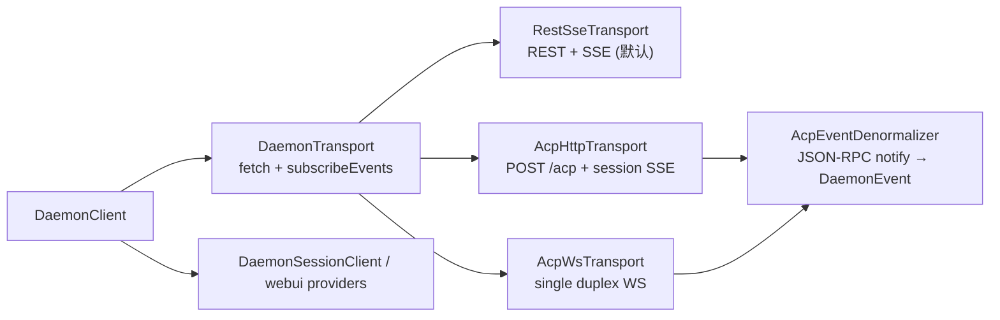
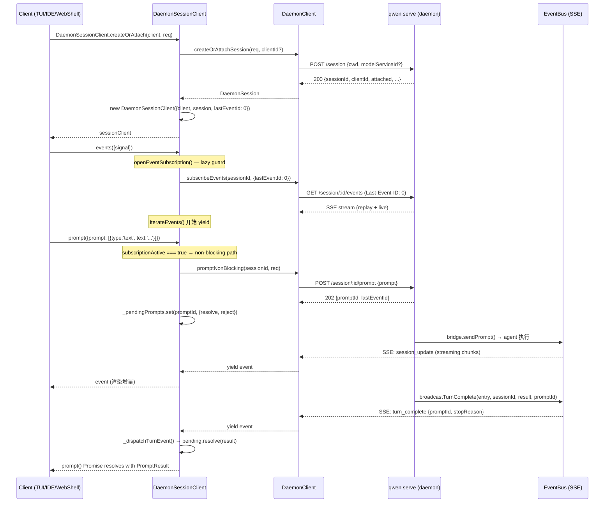
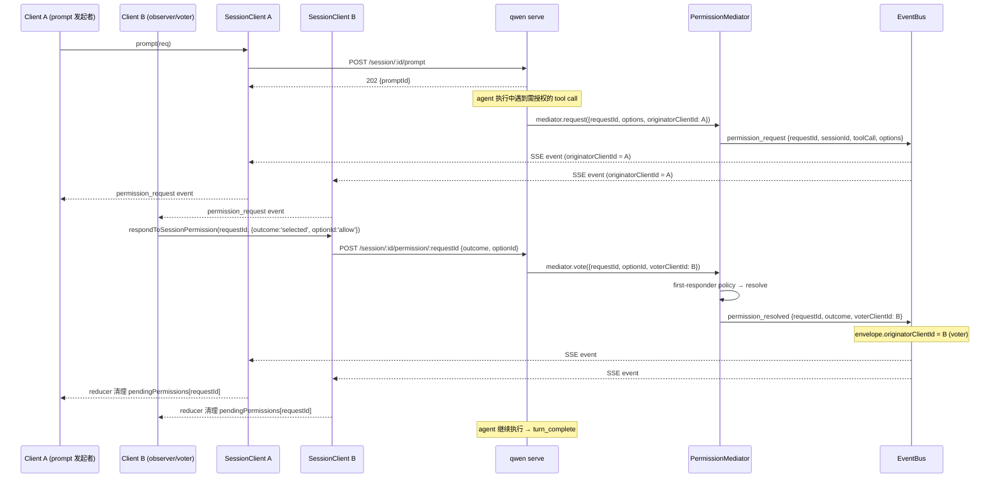

# 客户端适配器与 SDK（深入）

> daemon/serve（Mode B）技术方案子文档；总览见 [`README.md`](README.md)。
> 关键文件：`packages/sdk-typescript/src/daemon/DaemonSessionClient.ts`（530 行）、`DaemonClient.ts`（~2800 行）、`events.ts`（~2500 行）、`packages/cli/src/ui/daemon/DaemonTuiAdapter.ts`（905 行）、`packages/channels/base/src/DaemonChannelBridge.ts`（705 行）、`packages/vscode-ide-companion/src/services/daemonIdeConnection.ts`（631 行）。

---

## 概述

daemon 架构将 LLM 代理的全部状态收束到 `qwen serve` 进程内部，通过 HTTP + SSE 对外暴露。客户端——TUI、IDE extension、channel bot、web shell——都通过 **SDK（`@qwen-code/sdk`）** 里的 `DaemonClient` / `DaemonSessionClient` 消费这个统一面：

```
┌────────────────────────────────────────────────────────────────┐
│  qwen serve (daemon)                                          │
│  ┌─────────────────┐  ┌──────────────┐  ┌──────────────────┐  │
│  │  Express server  │  │  ACP bridge  │  │  EventBus (SSE)  │  │
│  └────────┬────────┘  └──────┬───────┘  └────────┬─────────┘  │
│           │                  │                    │            │
│           └──────────────────┼────────────────────┘            │
│                              │ HTTP + SSE                      │
└──────────────────────────────┼────────────────────────────────┘
                               │
                ┌──────────────┴──────────────┐
                │    DaemonClient (HTTP层)     │
                │    DaemonSessionClient       │
                │    (会话+SSE+replay)         │
                └──────┬──────────────────────┘
                       │
        ┌──────────────┼──────────────┬────────────────┐
   ┌────┴────┐    ┌────┴────┐   ┌────┴────┐     ┌─────┴─────┐
   │   TUI   │    │ Channel │   │   IDE   │     │ Web Shell  │
   │ Adapter │    │  Bridge │   │ Connec. │     │  (React)   │
   └─────────┘    └─────────┘   └─────────┘     └───────────┘
```

设计约束：

1. **SDK 是唯一共享消费面**：所有客户端通过 `DaemonClient` / `DaemonSessionClient` 访问 daemon，不直接构造 HTTP 请求。
2. **daemon 颁发身份**：client identity 由 daemon 端 stamp（`X-Qwen-Client-Id` header），非客户端自声明，杜绝冒充。
3. **事件类型化**：SDK 提供 `asKnownDaemonEvent` + `reduceDaemonSessionEvent` 组合，将 opaque SSE frame 投射为 typed union + 客户端状态机。
4. **适配器 spike 模式**：TUI、channel、IDE 三个 spike 各自独立验证 daemon-backed adapter 的可行性，默认 off，不改变现有代码路径。

---

## 涉及 PR

| PR | 作者 | 状态 | 子主题 |
| --- | --- | --- | --- |
| #4490 | @doudouOUC | merged | `daemon_mode_b_main` 集成进入 main 后，保留客户端适配器与 SDK 的最终架构说明；本文不再登记其他作者的独立 PR。 |

---

## DaemonSessionClient（SDK 核心）

### 定位

`DaemonClient` 是**无状态 HTTP 层**——每次调用都要传 `sessionId`，1:1 映射 daemon REST 路由。`DaemonSessionClient` 是**有状态会话层**，所有 adapter 的直接消费面（`DaemonSessionClient.ts:76-82` 的 class JSDoc 明确声明了这一角色）。





```
DaemonClient (raw HTTP)                DaemonSessionClient (session-scoped)
──────────────────────────              ──────────────────────────────────
prompt(sessionId, req)                  prompt(req)
subscribeEvents(sessionId, opts)        events(opts)         ← replay + guard
setSessionModel(sessionId, modelId)     setModel(modelId)
respondToPermission(requestId, resp)    respondToPermission(requestId, resp)
                                        respondToSessionPermission(...)  ← scoped
heartbeat(sessionId)                    heartbeat()
                                        _pendingPrompts Map  ← non-blocking dispatch
```

### 创建 / 加载 / 恢复

三个 static factory 覆盖三种 attach 场景（`DaemonSessionClient.ts:108-192`）：

| Factory | HTTP 路由 | SSE cursor seed | 用途 |
| --- | --- | --- | --- |
| `createOrAttach(client, req)` | `POST /session` | `0`（新建）或 `undefined`（attach） | 首次进入 workspace：新建 session 或合入已有 single-scope session |
| `load(client, sessionId, req)` | `POST /session/:id/load` | `serverLastEventId ?? 0` | 恢复已有 session 含历史 replay snapshot |
| `resume(client, sessionId, req)` | `POST /session/:id/resume` | `serverLastEventId ?? 0` | 轻量 resume（不拉 replay snapshot） |

seed `lastEventId = 0` 的语义（`DaemonSessionClient.ts:131`）：daemon 将 `Last-Event-ID: 0` 视为"从 ring buffer 起点 replay"。如果更早事件已被 ring eviction（默认 8000 帧），客户端收到 retained suffix 后从 live 继续。

### SSE 订阅与并发 guard

`events()` 是唯一对外入口（`subscribeEvents()` 标记 `@deprecated`）。内部 `openEventSubscription()`（L406-457）实现 **lazy acquire / release guard**：

- guard 在**首次 `.next()`** 时才 acquire（L426），而非 generator 创建时。
- 若已有 active subscription，`acquire()` 抛出 `Error('Another event subscription is already active...')`（L423）。
- 放弃（GC）但未 `.next()` 的 generator 不会 block 后续订阅。
- `release()` 在 `return` / `throw` / iterator 自然结束的 `finally` 中执行（L417, L439, L446）。

实际迭代发生在 `iterateEvents()`（L462-488）：

```typescript
// DaemonSessionClient.ts:462-488
private async *iterateEvents(opts, release) {
  try {
    for await (const event of this.client.subscribeEvents(sessionId, ...)) {
      this._dispatchTurnEvent(event);   // 非阻塞 prompt 匹配
      yield event;
      if (event.id !== undefined) {
        this.lastSeenEventId = Math.max(...);  // 单调推进 cursor
      }
    }
  } finally {
    this._rejectAllPending(new Error('SSE stream ended'));
    release();
  }
}
```

### 非阻塞 prompt dispatch


| 路径 | 条件 | 行为 |
| --- | --- | --- |
| **blocking fallback** | `subscriptionActive === false` | 调 `DaemonClient.prompt()` — 内部开临时 SSE 等结果 |
| **non-blocking + dispatch** | `subscriptionActive === true` | 调 `promptNonBlocking()` → 202；注册 `_pendingPrompts.set(promptId, {resolve, reject})`；SSE 流中 `_dispatchTurnEvent()` 匹配 → resolve/reject |

`_pendingPrompts`（L84-90）是 `Map<promptId, {resolve, reject}>`——镜像 ACP transport 的 pending-request dispatch table。SSE 流结束时 `_rejectAllPending()`（L507-511）清理所有 pending Promise。

---

## typed event schema + reducer

### 事件类型注册表


- **会话生命周期**：`session_update`、`session_died`、`session_closed`、`session_metadata_updated`
- **权限协调**：`permission_request`、`permission_resolved`、`permission_already_resolved`、`permission_partial_vote`、`permission_forbidden`
- **模型/审批**：`model_switched`、`model_switch_failed`、`approval_mode_changed`
- **流控/重连**：`state_resync_required`、`replay_complete`、`client_evicted`、`slow_client_warning`、`stream_error`
- **非阻塞 / mid-turn prompt**：`turn_complete`、`turn_error`、`mid_turn_message_injected`
- **MCP guardrail**：`mcp_budget_warning`、`mcp_child_refused_batch`、`mcp_server_added`、`mcp_server_removed`
- **workspace 变更**：`memory_changed`、`agent_changed`、`tool_toggled`、`workspace_initialized`、`settings_changed`、`extensions_changed`
- **auth device flow**：`auth_device_flow_started` / `throttled` / `authorized` / `failed` / `cancelled`
- **assist**：`followup_suggestion`
- **cross-client**：`prompt_cancelled`

每种事件类型对应一个 `Data` interface + `Event` type alias（如 `DaemonPermissionRequestData` → `DaemonPermissionRequestEvent = DaemonEventEnvelope<'permission_request', DaemonPermissionRequestData>`）。

### 类型窄化：`asKnownDaemonEvent()`

`asKnownDaemonEvent(event)`（`events.ts` ~L795-830）是运行时窄化入口：对 opaque `DaemonEvent` 的 `type` 字段做 switch，匹配后用对应 `isXxxData()` 校验 payload，通过则返回强类型 `KnownDaemonEvent`，否则返回 `undefined`。

`KnownDaemonEvent` 是所有已知事件的 discriminated union（`events.ts` ~L893）：

```typescript
export type KnownDaemonEvent =
  | DaemonSessionEvent
  | DaemonStreamLifecycleEvent
  | DaemonControlEvent
  | DaemonMcpGuardrailEvent
  | DaemonWorkspaceMutationEvent
  | DaemonAuthEvent
  | DaemonAssistEvent
  | DaemonTurnEvent;
```

### 状态机：`DaemonSessionViewState`

`DaemonSessionViewState`（`events.ts:901-1120`）是 SDK 提供的客户端状态容器，~50 个字段覆盖：

- `alive` / `terminalEvent`：会话存活状态
- `currentModelId` / `approvalMode`：side-channel 状态
- `pendingPermissions`：当前挂起的 permission request（bounded by `MAX_PENDING_PER_SESSION = 64`）
- `permissionVoteProgress`：consensus 策略下的部分投票进度
- `forbiddenVotes`：被拒投票历史（bounded by `MAX_FORBIDDEN_VOTES_PER_SESSION = 32`）
- `awaitingResync`：ring eviction 后的重同步标记
- `lastFollowupSuggestion` / `lastTurnComplete` / `lastTurnError`：最新 assist/turn 事件
- `mcpBudgetWarningCount` / `mcpChildRefusedBatchCount`：MCP 预算计数

`createDaemonSessionViewState(seed?)`（`events.ts:1125`）创建初始状态（可选 seed），`reduceDaemonSessionEvent(state, event)`（`events.ts:1367`）执行 immutable 状态转移。

### `awaitingResync` 自动跳过

当 reducer 观测到 `state_resync_required` 事件时设置 `awaitingResync = true`（`events.ts` ~L1595）。此后所有非终端事件自动跳过（`lastEventId` 仍单调推进），仅 `RESYNC_PASSTHROUGH_TYPES`（`session_died` / `session_closed` / `client_evicted` / `stream_error` / `state_resync_required` 本身）通过（`events.ts` ~L1115）。客户端需调 `loadSession` + `createDaemonSessionViewState({...})` 重建。

---

## client identity

### daemon-stamped 设计（非自声明）


1. **颁发**：`POST /session` 或 `POST /session/:id/load` 返回响应中包含 daemon 生成的 `clientId`（`DaemonSession.clientId`，`types.ts`）。
2. **传输**：客户端在后续请求中通过 `X-Qwen-Client-Id` header 回传（`DaemonClient.ts:CLIENT_ID_HEADER`，L97）。
3. **注册**：bridge 在 `SessionEntry.clientIds: Map<string, number>` 中记录已注册 clientId（`bridge.ts:286`），每次 `createOrAttachSession` / `loadSession` 时注册。
4. **校验**：state-changing route 对 unknown clientId 返回 `400 invalid_client_id`（`InvalidClientIdError`）。
5. **事件戳记**：daemon 对 prompt/cancel/model-switch/permission-vote 事件的 SSE envelope 附加 `originatorClientId` 字段——标识是哪个客户端发起的操作。

SDK 层面，`DaemonSessionClient` 在构造时保存 `clientId`（来自 `DaemonSession.clientId`），后续所有方法自动附带（`this.clientId`）。`DaemonClient` 的方法签名末尾有可选 `clientId` 参数。

### pair-token 与会话范围


---

## 客户端适配器 spike

三个 spike PR 各自独立验证 daemon-backed adapter 的可行性。共同特征：

- **默认 off**：不改变现有 TUI / channel / IDE 默认代码路径
- **接口抽象**：各 spike 定义自己的 `Daemon*SessionClient` interface（而非直接依赖 SDK 实现类），允许测试注入 fake
- **reducer 模式**：daemon SSE 事件 → adapter-specific 视图更新
- **单元测试验证**：不依赖 live daemon

## 跨客户端协调

### 问题域

一个 daemon session 可被多个客户端（chat view、terminal view、IDE companion）同时连接。需要协调的 side-channel 状态包括：

1. **当前模型**（`currentModelId`）：HTTP `POST /session/:id/model` 和 in-session `/model` slash command 两个入口
2. **当前 approval mode**（`currentApprovalMode`）：HTTP `POST /session/:id/approval-mode` 和 in-session `exit_plan_mode` / ProceedAlways 两个入口
3. **permission vote**：多客户端谁能投票、投票结果归因
4. **prompt cancel**：一客户端 cancel 需通知所有 peers

## 时序图

### 时序 1：SDK attach + SSE subscribe + prompt 发送



### 时序 2：多客户端 permission vote（含 voterClientId）



---

## 已知限制

2. **adapter spike 均未接入默认路径**：TUI / channel / IDE spike 全部 default-off，各自声明了显式 "not covered" gap（无 live daemon E2E、无 flag 解析、无 production wiring）。
4. **orphan prompt**：客户端断连后 prompt 仍跑到完成（结果 publish 到 SSE bus 无人消费）——这是设计选择，非 bug。
7. **typed event schema 仅覆盖当前 daemon emission**：未来 daemon 新增的事件类型经 `asKnownDaemonEvent` 返回 `undefined` 走 raw event path，直到获得显式 schema coverage。

_生成于 2026-06-05_
