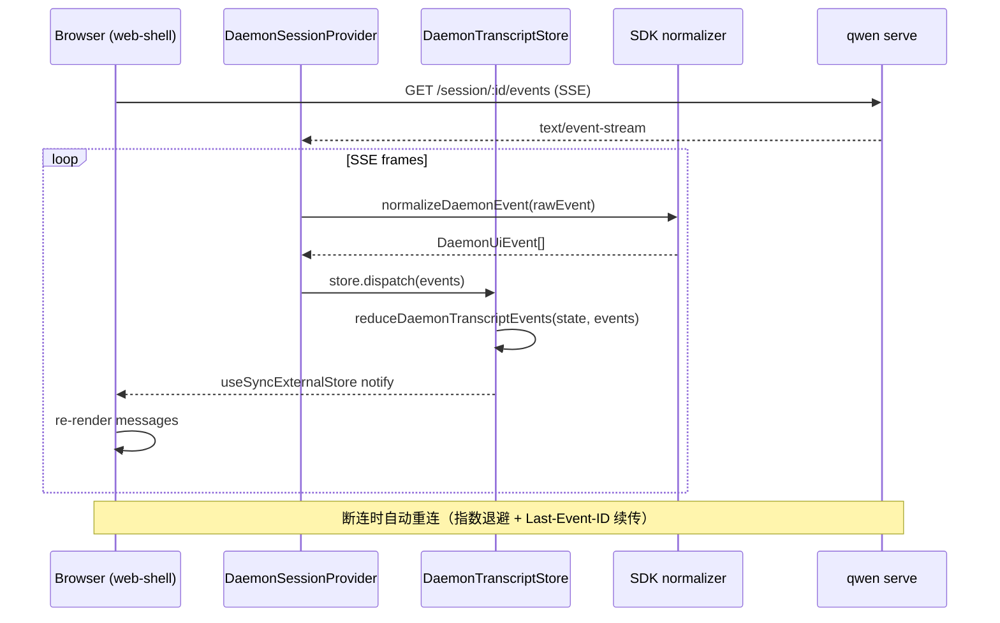
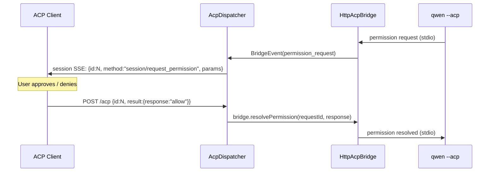
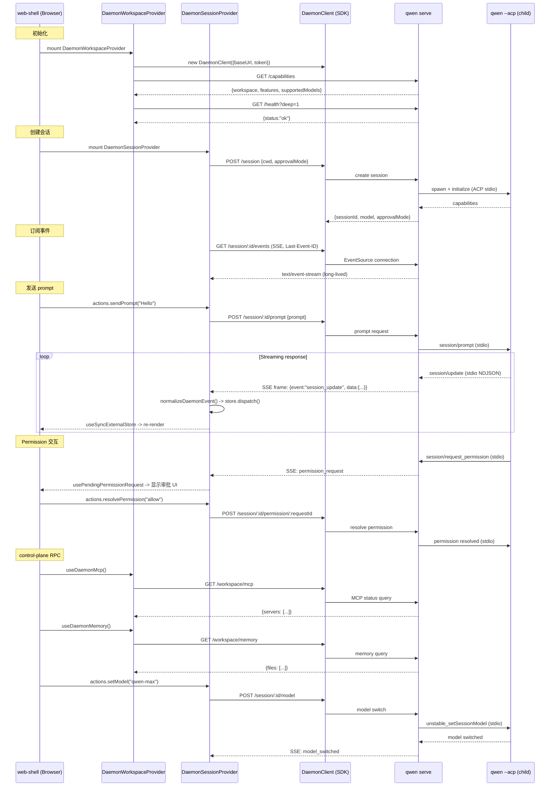

# WebUI 库与 ACP 传输层（深入）

> daemon/serve 技术方案子文档；总览见 [README.md](README.md)。

---

## 概述

本文覆盖两个并行演进的子系统：

1. **@qwen-code/webui / web-shell** -- `@qwen-code/webui` 作为独立 npm 库提供 daemon 会话管理、transcript 归约、权限处理和 React 绑定；`packages/web-shell` 是浏览器终端应用。#5392 之后，release 版 `qwen serve` 会默认同源托管已构建的 Web Shell SPA，开发态仍可走 Vite `dev:daemon`。
2. **ACP 传输层演进** -- 在 `qwen serve` 现有 bespoke REST + SSE 之上，增设官方 ACP Streamable HTTP 传输（`/acp` 端点），并规划 Phase 2 WebSocket 全双工升级。两套传输共享同一 `HttpAcpBridge` + `EventBus` 实例，零状态复制。

设计目标是让多客户端（web-shell、IDE companion、TS/Java/Python SDK、ACP-native editor 如 Zed/Goose）均可按自身偏好的协议接入同一 daemon，且所有客户端通过共享 render contract（`daemonBlockToMarkdown` / `daemonBlockToHtml` / `daemonBlockToPlainText`）保证一致的 transcript 投影。

---

## 涉及 PR

| PR | 作者 | 状态 | 子主题 |
|----|------|------|--------|
| [#4328](https://github.com/QwenLM/qwen-code/pull/4328) | @chiga0 | Merged | feat(daemon): shared UI transcript layer -- normalizer + store + terminal + toolPreview |
| [#4353](https://github.com/QwenLM/qwen-code/pull/4353) | @chiga0 | Merged | feat(sdk/daemon-ui): unified completeness follow-up -- 28+ event types / render contract / conformance |
| [#4380](https://github.com/QwenLM/qwen-code/pull/4380) | @chiga0 | Merged | Feat/daemon react cli -- web-shell (packages/web-shell) + control-plane |
| [#4573](https://github.com/QwenLM/qwen-code/pull/4573) | @ytahdn | Merged | feat(web-shell,webui,sdk): context-usage API + daemon-react-sdk refactor + dialog UX |
| [#4132](https://github.com/QwenLM/qwen-code/pull/4132) | @jifeng | Merged | feat(serve): /demo debug page -- self-contained inline HTML |
| [#4555](https://github.com/QwenLM/qwen-code/pull/4555) | @jifeng | Merged | feat(sdk): serve-bridge MCP server + rename mcp -> daemon-mcp |
| [#4472](https://github.com/QwenLM/qwen-code/pull/4472) | @wenshao | Merged | feat(daemon): ACP Streamable HTTP transport at /acp [RFD #721] |
| [#5040](https://github.com/QwenLM/qwen-code/pull/5040) | @chiga0 | Merged | feat(sdk,serve): DaemonTransport abstraction + ACP standard compliance |
| [#5066](https://github.com/QwenLM/qwen-code/pull/5066) | @ytahdn | Merged | web-shell token usage、settings/i18n、retry、streaming metrics、hidden commands |
| [#5098](https://github.com/QwenLM/qwen-code/pull/5098) | @ytahdn | Merged | `/goal` 状态持久化为 daemon transcript events |
| [#5175](https://github.com/QwenLM/qwen-code/pull/5175) | @wenshao | Merged | web-shell mid-turn messages 注入当前 turn |
| [#5193](https://github.com/QwenLM/qwen-code/pull/5193) | @ytahdn | Merged | web-shell transcript block change callback + replay prompt-status 恢复 |
| [#5266](https://github.com/QwenLM/qwen-code/pull/5266) | @wenshao | Merged | `mid_turn_message_injected` 常量集中 + drain timeout recovery |
| [#5392](https://github.com/QwenLM/qwen-code/pull/5392) | @wenshao | Merged | release `qwen serve` 默认同源托管 Web Shell SPA，新增 `--open` / `--no-web` |
| [#5398](https://github.com/QwenLM/qwen-code/pull/5398) | @ytahdn | Merged | web-shell extension management + daemon extension mutation/events |
| [#5541](https://github.com/QwenLM/qwen-code/pull/5541) | @wenshao | Merged | Web Shell static sendFile 允许 `.nvm` 等 dotfile 安装路径 |
| [#5613](https://github.com/QwenLM/qwen-code/pull/5613) | @ytahdn | Merged | daemon-backed Web Shell `/branch` / `/fork` session branching |
| [#5650](https://github.com/QwenLM/qwen-code/pull/5650) | @ytahdn | Merged | Web Shell enhanced Markdown tables：排序、过滤、选择、复制、隐藏列、行详情 |
| [#5755](https://github.com/QwenLM/qwen-code/pull/5755) | @ytahdn | Merged | Web Shell voice dictation over daemon `/voice/stream` |
| [#5818](https://github.com/QwenLM/qwen-code/pull/5818) | @ytahdn | Merged | Web Shell restored active prompt loading，刷新/重连后保持 active prompt 状态 |
| [#5822](https://github.com/QwenLM/qwen-code/pull/5822) | @ytahdn | Merged | streaming turn 中本地 slash/shell command transcript append 延后排队 |
| [#5864](https://github.com/QwenLM/qwen-code/pull/5864) | @ytahdn | Merged | finished thinking summary 保留 duration |
| [#5876](https://github.com/QwenLM/qwen-code/pull/5876) | @ytahdn | Merged | 中文工具组文案从“执行了 N 个工具”改为“调用了 N 个工具” |
| [#5893](https://github.com/QwenLM/qwen-code/pull/5893) | @ytahdn | Merged | Web Shell chat UI polish：颜色 token、composer、permission/question panels、scroll-follow |
| [#5900](https://github.com/QwenLM/qwen-code/pull/5900) | @carffuca | Merged | Web Shell host 可覆盖 streaming loading phrases |
| [#4773](https://github.com/QwenLM/qwen-code/pull/4773) | @chiga0 | Open | feat(serve): ACP WebSocket transport (RFD phase 2) |

---

## @qwen-code/webui 架构

### 分层设计

WebUI 的 daemon 适配分三层，从底部到顶部：

```
┌──────────────────────────────────────────────────────────────────┐
│  Layer 3: packages/web-shell / packages/webui (React 组件)       │
│  -- App.tsx, MessageList, ToolGroup, AskUserQuestion, dialogs   │
├──────────────────────────────────────────────────────────────────┤
│  Layer 2: @qwen-code/webui/daemon-react-sdk (React Provider)    │
│  -- DaemonSessionProvider, DaemonWorkspaceProvider, hooks        │
│  -- transcriptToMessages, selectors, actions                     │
├──────────────────────────────────────────────────────────────────┤
│  Layer 1: @qwen-code/sdk/daemon (browser-safe, 无 React 依赖)    │
│  -- DaemonClient, normalizeDaemonEvent, transcript reducer       │
│  -- createDaemonTranscriptStore, render contract, conformance    │
└──────────────────────────────────────────────────────────────────┘
```

Layer 1（SDK daemon subpath）是无框架依赖的纯 TypeScript；Layer 2 是 React 绑定；Layer 3 是实际 UI 组件。这种分层允许非 React 消费者（channel adapter、CLI TUI、测试工具）直接使用 Layer 1，而 web-shell 等 React 应用通过 Layer 2 的 Provider 和 Hooks 接入。

### daemon adapter（Layer 1）

PR #4328 建立了 SDK 侧的 daemon UI 核心，PR #4353 将其从 55% 提升至 ~95% 完成度。核心模块分布在 `packages/sdk-typescript/src/daemon/ui/`：

| 模块 | 职责 |
|------|------|
| `normalizer.ts` | `normalizeDaemonEvent()` -- 将原始 `DaemonEvent`（SSE frame）归一化为强类型 `DaemonUiEvent` 联合体。v1 处理 13 种 event type；v2 覆盖 28+ 种（含 `session.metadata.changed`, `workspace.mcp.budget_warning`, `auth.device_flow.*` 等）。未知 event 降级到 `debug` 类型，前向兼容。 |
| `transcript.ts` | `reduceDaemonTranscriptEvents()` -- 纯函数状态机，将 `DaemonUiEvent[]` 归约为 `DaemonTranscriptState`。管理 `blocks[]`（最多 `maxBlocks` = 1000），维护 `currentToolCallId`、`approvalMode`、`toolProgress` 等侧信道状态。copy-on-write：侧信道变更不触发 `blocks` 引用变化，配合 `useSyncExternalStore` 避免 O(n log n) 重排。 |
| `store.ts` | `createDaemonTranscriptStore()` -- 适配 React `useSyncExternalStore` 的外部 store。`dispatch(event)` 驱动 reducer，`queueMicrotask` 批量通知 listener。支持 `reset()` / `clearAwaitingResync()` 恢复流程。 |
| `toolPreview.ts` | `createDaemonToolPreview()` -- 从 tool input shape 推断 preview 类型。13 种 preview kind：`file_diff`, `file_read`, `web_fetch`, `mcp_invocation`, `code_block`, `search`, `tabular`, `image_generation`, `subagent_delegation`, `ask_user_question`, `command`, `key_value`, `generic`。 |
| `render.ts` | 渲染契约（render contract）：`daemonBlockToMarkdown()`, `daemonBlockToHtml()`, `daemonBlockToPlainText()`, `daemonToolPreviewToMarkdown()`。默认截断 `maxFieldLength=8192`，`sanitizeUrls` 剥离 token 参数。 |
| `conformance.ts` | `runAdapterConformanceSuite(adapter)` -- 11 个固定 fixture（含 subagent 嵌套、redaction、cancellation、mcp-budget、auth-device-flow），验证任意 adapter 的投影一致性。 |
| `terminal.ts` | `sanitizeTerminalText()` + ANSI 投影，供 TUI adapter 使用。 |
| `types.ts` | 所有类型定义：`DaemonUiEvent`（28+ 子类型的 discriminated union）、`DaemonTranscriptBlock`（`user`/`assistant`/`thought`/`tool`/`shell`/`permission`/`status`/`user_shell` 8 种 block kind）、`DaemonToolPreview`（13 种 preview kind）。 |
| `utils.ts` | `redactSensitiveFields()` -- 在 normalizer 边界对 `apiKey`/`token`/`secret`/`password`/`authorization` 等字段脱敏，阻止泄漏到 transcript block。 |

关键设计决策：

- **SDK daemon subpath 是 browser-safe**：零 React 依赖、零 Node-only 依赖。构建脚本 (`scripts/build.js`) 包含 `assertBrowserSafeBundle` 检查。
- **`eventId` 为主排序键**：daemon-monotonic SSE cursor，跨客户端/跨重连一致。`serverTimestamp` 作为备用排序键（客户端时钟漂移时的保底）。
- **取消传播**：当 `assistant.done.reason === 'cancelled'` 时，reducer 自动将所有 in-flight tool 的 status 翻转为 `'cancelled'`，解决"cancel 后 tool spinner 永转"的 UX 问题。
- **Sub-agent 嵌套**：reducer 通过 `_meta.parentToolCallId` 关联子 block，`selectSubagentChildBlocks(state, parentId)` O(1) 查询。乱序到达（child 先于 parent）通过 back-fill 处理。

### daemon-react-sdk（Layer 2）

PR #4573 将 `packages/webui/src/daemon/` 重构为模块化架构，分为 `session/` 和 `workspace/` 两轴：

```
packages/webui/src/daemon/
├── session/                              # 每会话
│   ├── DaemonSessionProvider.tsx          # React Context Provider
│   ├── actions.ts                         # sendPrompt, cancel, resolvePermission
│   ├── selectors.ts                       # selectDaemonStreamingState, selectDaemonPendingPermissions
│   ├── mappers.ts                         # SSE event -> connection state 映射
│   ├── clientLifecycle.ts                 # getStableClientId, detachDaemonClient
│   ├── promptContent.ts                   # toDaemonPromptContent
│   ├── transcriptToMessages.ts            # blocks -> DaemonMessage[]（React 渲染消息列表）
│   ├── types.ts                           # DaemonSessionContextValue 等
│   └── messageTypes.ts                    # DaemonMessage 联合体
├── workspace/                             # 跨会话
│   ├── DaemonWorkspaceProvider.tsx         # workspace-level Provider
│   ├── actions.ts                         # workspace 操作
│   ├── hooks/                             # 资源 hooks
│   │   ├── useDaemonAgents.ts
│   │   ├── useDaemonAuth.ts
│   │   ├── useDaemonMcp.ts
│   │   ├── useDaemonMemory.ts
│   │   ├── useDaemonSkills.ts
│   │   ├── useDaemonTools.ts
│   │   ├── useDaemonFiles.ts
│   │   ├── useDaemonGlob.ts
│   │   ├── useDaemonSessions.ts
│   │   └── useDaemonResource.ts           # 通用资源加载 hook
│   └── types.ts
├── transcriptAdapter.ts                   # Legacy bridge
├── followupSidechannel.ts                 # followup suggestion sidechannel
├── timing.ts                              # reconnect delay / timer utils
└── index.ts                               # barrel export
```

该重构的核心产出是新的 subpath export `@qwen-code/webui/daemon-react-sdk`（见 `packages/webui/src/daemon-react-sdk.ts`），将所有 daemon React hooks 以简短别名重新导出：

```typescript
// web-shell 消费示例
import {
  DaemonSessionProvider,
  DaemonWorkspaceProvider,
  useMessages,
  useConnection,
  useStreamingState,
  useActions,
  usePendingPermissionRequest,
} from '@qwen-code/webui/daemon-react-sdk';
```

**DaemonSessionProvider** (`session/DaemonSessionProvider.tsx`) 是会话级入口。它内部：
1. 创建 `DaemonTranscriptStore`（SDK Layer 1 的 `createDaemonTranscriptStore()`）。
2. 持有 `DaemonClient` + `DaemonSessionClient` 引用。
3. 订阅 SSE 事件流，调用 `normalizeDaemonEvent()` 归一化后 `store.dispatch()`。
4. 通过 `useSyncExternalStore(store.subscribe, store.getSnapshot)` 将 transcript state 暴露给子组件。
5. 管理 SSE 重连（`getReconnectDelayMs` 指数退避）、`awaitingResync` 恢复、`clearPassiveAssistantDoneTimer` 等边界情况。

**DaemonWorkspaceProvider** (`workspace/DaemonWorkspaceProvider.tsx`) 是 workspace 级入口，管理跨会话资源：MCP server 状态、skills、agents、memory、tools、文件系统操作。内部各 hook（`useDaemonMcp`, `useDaemonAgents` 等）通过 `useDaemonResource` 通用 hook 模式实现统一的 loading/error/refetch 语义。

### transcript reducer -> 消息列表

`transcriptBlocksToDaemonMessages()` (`session/transcriptToMessages.ts`) 将扁平的 `DaemonTranscriptBlock[]` 转换为嵌套的 `DaemonMessage[]`，适配 React 渲染：

- `user` block -> `DaemonUserMessage`
- 连续 `assistant`/`thought` block -> 合并为单个 `DaemonAssistantMessage`
- `tool` block -> 聚合为 `DaemonToolGroupMessage`（按时间窗口分组）
- Sub-agent tool -> `DaemonMessageToolCall` 嵌套（通过 `parentToolCallId` 关联）
- `permission` block -> 合并到对应的 tool card 中

转换通过 subAgent stack 管理嵌套层级，支持 compacted replay 中乱序到达。

### 事件消费流程



---

## context-usage API（#4573）

PR #4573 新增 `GET /session/:id/context-usage` 端点，返回会话的 token 使用分布。完整链路覆盖四层：

| 层 | 模块 | 新增内容 |
|----|------|----------|
| SDK | `packages/sdk-typescript/src/daemon/types.ts` | `DaemonSessionContextUsageStatus` 类型 |
| SDK | `packages/sdk-typescript/src/daemon/DaemonSessionClient.ts` | `sessionContextUsage()` 方法 |
| acp-bridge | `packages/acp-bridge/src/status.ts` | `getSessionContextUsageStatus()` 接口 + `SERVE_STATUS_EXT_METHODS.sessionContextUsage` |
| CLI | `packages/cli/src/serve/server.ts:1623` | 路由处理 + `acpAgent.buildSessionContextUsageStatus()` |

能力注册为 `session_context_usage: { since: 'v1' }`。Web-shell 通过新增的 `ContextUsageMessage` 组件展示 token 分布。

---

## /demo 调试页（#4132）

PR #4132 在 `qwen serve` 添加 `/demo` 路由，返回一个自包含的 inline HTML 调试页面（`packages/cli/src/serve/demo.ts:getDemoHtml()`），零外部依赖、无需构建步骤。

功能要点：

- **Session 管理**：Create/Attach session，指定 working directory
- **Chat 界面**：通过 SSE 实时流式接收 assistant 响应
- **Permission 处理**：UI 交互响应 daemon 的权限请求
- **Model 切换**：在 active session 上切换模型
- **Health & Capabilities**：快捷按钮调用 `/health`, `/health?deep=1`, `/capabilities`
- **事件/API 日志**：分 tab 展示原始 SSE 事件和 API request/response
- **Auth token 支持**：Bearer token 输入框，适配 `--token` 保护的部署

安全设计：`/demo` 路由注册在 `hostAllowlist` 和 `bearerAuth` 中间件**之后**，受相同安全防护。Same-origin CORS 处理：当 `Origin` 匹配 daemon 自身 loopback 地址（含 `host.docker.internal`）时剥离 Origin 头，允许 demo 页的 API 调用通过，同时保持对非 loopback origin 的 `denyBrowserOriginCors` 保护。

XSS 防护（CR 反馈后修复）：permission 按钮使用 DOM API（`createElement`, `textContent`, `dataset`）而非 `innerHTML`。

---

## ACP Streamable HTTP（#4472）

### 背景：双传输架构

PR #4472 在 `qwen serve` 增设第二套北向传输，实现 ACP RFD #721 定义的 Streamable HTTP 协议。**设计决策：双传输、纯增量（additive）**。

```
                                      ┌─────────────────────────────────────────────────────┐
                                      │                   qwen serve                         │
 ┌──────────┐  bespoke REST+SSE       │  ┌───────────────┐    ┌──────────────────────────┐   │
 │ webui /  │ ──/session/* routes──►  │  │  server.ts    │──► │ HttpAcpBridge + EventBus │   │
 │ SDK      │ ◄── /session/:id/events │  │  (~30 routes) │    │  (共享实例)               │   │
 └──────────┘                         │  └───────────────┘    └───────────┬──────────────┘   │
                                      │                                   │                  │
 ┌──────────┐  ACP Streamable HTTP    │  ┌───────────────┐                │                  │
 │ ACP-     │ ── POST/GET/DELETE ──►  │  │  acpHttp/     │────────────────┘                  │
 │ native   │ ◄── SSE (JSON-RPC)     │  │  mountAcpHttp │                                   │
 │ clients  │                         │  └───────────────┘                                   │
 └──────────┘                         │                                                      │
                                      │                       ┌──────────────────┐           │
                                      │                       │ qwen --acp child │           │
                                      │                       │ (ACP stdio)      │           │
                                      └───────────────────────┴──────────────────┴───────────┘
```

关键特性：

- **同一 `/acp` 端点**：`POST` 发送 JSON-RPC 请求，`GET` 开启长连接 SSE，`DELETE` 拆除连接。
- **`initialize` 特殊处理**：`POST /acp {initialize}` 返回 `200` + capabilities JSON + `Acp-Connection-Id` header。其他请求返回 `202 Accepted`，response 通过 SSE 流投递。
- **双层 SSE 流**：connection-scoped（`GET /acp` + `Acp-Connection-Id`）和 session-scoped（`GET /acp` + `Acp-Connection-Id` + `Acp-Session-Id`）。
- **开关**：`QWEN_SERVE_ACP_HTTP=0` 关闭；默认开启。

### `mountAcpHttp` 实现

模块布局在 `packages/cli/src/serve/acpHttp/`：

| 文件 | 职责 |
|------|------|
| `index.ts` | `mountAcpHttp(app, bridge, opts)` -- 在 Express app 上注册 `/acp` 路由 |
| `connectionRegistry.ts` | `AcpConnection` 管理 `Acp-Connection-Id` -> 连接状态。`SessionBinding` 跟踪 per-session stream / clientId / buffer。`MAX_BUFFERED_FRAMES=256`，`DEFAULT_MAX_CONNECTIONS=64`。grace period `CONN_GRACE_MS=10_000`。 |
| `dispatch.ts` | `AcpDispatcher` -- JSON-RPC method -> bridge call 映射。标准方法：`initialize`, `session/new`, `session/prompt`, `session/cancel`, `session/load`, `session/resume`, `session/close`, `session/list`, `session/set_mode`, `session/set_config_option`。厂商扩展：`_qwen/session/heartbeat`, `_qwen/workspace/*` 等。 |
| `jsonRpc.ts` | JSON-RPC 2.0 解析/验证/序列化；error codes（`-32600`, `-32601`, `-32602`, `-32603`, `-32700`）；`_qwen/` 命名空间守卫。 |
| `sseStream.ts` | `SseStream` -- ACP 传输的长连接 SSE 写入器。与 REST `/session/:id/events` 的 SSE 不同：payload 是原始 JSON-RPC 对象而非 qwen event envelope。15s heartbeat comment，serialize write chain 防交错。 |
| `transport.test.ts` | 端到端 vitest 测试套件（40 tests）：覆盖 200/202 约定、双 SSE 流、prompt streaming、permission round-trip、`_qwen/set_model`、method-not-found、DELETE。 |

### 扩展方法策略

ACP 规范保留 `_` 前缀给自定义扩展。本实现的命名空间为 `_qwen/<area>/<verb>`，能力在 `initialize` 的 `agentCapabilities._meta.qwen` 中广告。

经 PR 评审中的扩展方法审计（见 #4472 body），关键发现：

- **模型/审批模式** 有标准归属 `session/set_config_option`（`category:"model"` / `"mode"`），已从厂商 `_qwen/session/set_model` 迁移到标准方法。
- **仅对无标准等价的能力保留 `_qwen/...`**：workspace 内省/变更、session 内省（context/supported-commands）、heartbeat、client->agent 文件 I/O（`_qwen/fs/*`）、device-flow 登录（`_qwen/auth/*`）。

### permission round-trip

agent->client 权限请求是 `/acp` 传输的关键验证路径：



`AcpConnection` 维护 `Map<jsonRpcId, PendingClientRequest>`。当连接/会话拆除时，`AbandonPendingFn` 自动取消未决的 permission，避免 agent prompt 被永久阻塞。

---

## DaemonTransport abstraction（#5040）

#5040 把 SDK 侧对 daemon 的访问从"固定 REST + SSE"抽成 `DaemonTransport` 接口：`fetch()` 覆盖所有 HTTP-like 方法，`subscribeEvents()` 覆盖事件流，外加 `type` / `connected` / `supportsReplay` / `dispose()`。默认实例是 `RestSseTransport`，所以 `new DaemonClient({baseUrl, token})` 行为不变；需要 ACP transport 的集成可以传入 `AcpHttpTransport` / `AcpWsTransport` 或让 `negotiateTransport` 自动探测。

服务端同时补齐 `/acp` 标准方法：`session/new` 不再复用 single-scope 会话而是强制 thread/isolated，`session/set_mode`、`session/set_model`、`session/fork` 映射到现有 bridge 能力，`session/new/load/resume` 的响应携带 `models` / `modes` / `configOptions`。这让 ACP-native clients 与 REST/web-shell clients 共享同一 bridge，但不必复制 webui provider 栈。

---

## Hosted Web Shell（#5392/#5541）

#5392 之后，release 包内的 `qwen serve` 会在 daemon 根路径托管已构建的 Web Shell SPA：`GET /` / `/assets/*` / HTML navigation fallback 返回前端资源，API 路由如 `/capabilities`、`/session/*`、`/acp` 不被静态服务吞掉。两个 flag 控制行为：

- `--open`：listener ready 后打开浏览器到 daemon URL。
- `--no-web`：关闭静态 SPA，退回 API-only daemon。

静态 shell 注册在 bearer 之前，因为浏览器地址栏和 `<script>` 子资源无法附带 bearer；shell 自身不含 token，所有 API 仍由前端显式带 token 调用并受 bearer/CORS/host allowlist 保护。非 loopback bind 时会输出 warning。#5541 修复了 nvm/volta/asdf 等安装路径包含 `.nvm` 这类 dotfile 段时 `sendFile` 默认 `dotfiles:'ignore'` 导致 `index.html` 404 的问题，Web Shell index 改用 `dotfiles:'allow'`。

---

## Web Shell W25 行为补齐

近期全作者 web-shell PR 把浏览器端从"开发调试 UI"推进到 release 可用的 daemon 客户端：

| PR | 作用 | 实现方式 |
| --- | --- | --- |
| #5035 | 会话标题自动刷新到 web-shell/SDK session list。 | ACP child 通过 `qwen/notify/session/title-update` side channel 上报标题，bridge 转成既有 `session_metadata_updated`。 |
| #5066 | token usage、settings panel/i18n、theme/language picker、compact mode persistence、Ctrl+Y retry、CLI-aligned streaming metrics、hidden slash commands、404/410 recovery。 | 在 web-shell state/actions 层接入 context-usage/settings/session recovery；渲染层复用 CLI streaming metrics 文案并持久化紧凑模式。 |
| #5084 | parallel agents/sub-agent tools 展示运行时间。 | tool/sub-agent block 记录 start/end timestamp，渲染时把 duration 合入 tool card metadata。 |
| #5088 | tool detail 默认更稳，完成工具自动折叠。 | tool block 结束态触发 collapse state 更新；保留错误/活跃工具展开，减少长 transcript 噪音。 |
| #5091 | WebUI dispose 生命周期更可靠。 | Provider/client teardown 明确调用 dispose/abort，避免切 session 或 unmount 后 SSE/subscription 残留。 |
| #5096 | web-shell 快捷键补齐。 | 在输入与页面级 key handler 中接入常用编辑/发送/重试快捷键，并避开输入法与浏览器默认冲突。 |
| #5098 | `/goal` 状态从前端内存迁入 transcript status blocks，刷新页面或第二个 tab attach 后仍能恢复 active goal。 | daemon transcript block 写入 `_meta.goalStatus`，web-shell reducer 从 replay/live blocks 重建 goal 状态。 |
| #5109 | TodoWrite 历史 UI。 | 从 tool result / transcript block 中解析 todo 状态，按历史 turn 渲染任务列表变化。 |
| #5118 | 每个任务显示 token/time 明细。 | 将 per-task usage/runtime metadata 汇总到 task card，和 session 级 token usage 区分展示。 |
| #5125 | 已完成 turn 可折叠。 | turn boundary reducer 记录完成态，UI 对 finished turn 提供 collapse state，活跃 turn 保持展开。 |
| #5175/#5266 | 纯文本 mid-turn 输入进入当前 turn；wire 常量集中，drain 超时可恢复。 | `POST /session/:id/mid-turn-message` 入 daemon queue，ACP child `craft/drainMidTurnQueue` 拉取，成功后发 `mid_turn_message_injected`；#5266 集中事件常量并处理迟到 drain response。 |
| #5183 | mid-turn image message 不丢。 | 对 mid-turn rich content 做能力分流：当前 turn 只注入 text，可保留 image payload 到下一轮普通 prompt。 |
| #5190 | 执行展示 polish。 | 调整 running/completed/error tool states 的文案、间距和状态展示，降低 streaming 中的跳动。 |
| #5192 | 修复 completed prompt 生命周期竞态。 | prompt status reducer 在 replay/live 交错时以终止事件为准，避免完成 prompt 被误判为仍运行。 |
| #5193 | `onEventChange` 回调暴露完整 transcript blocks；replay prompt-status 恢复更保守。 | 回调参数从事件增量升级为 transcript blocks；只有存在 user message 且缺终止事件时才推断 prompt in-flight。 |
| #5220 | TUI/web-shell tool badge 名称本地化。 | tool display-name helper 统一生成 badge label，web-shell 与 TUI 共享本地化后的展示名。 |
| #5398 | `/extensions` 管理 UI 与 daemon extension mutation 面。 | web-shell 调 daemon install/enable/disable/update/uninstall/refresh endpoints，监听 `extensions_changed` 后刷新 active sessions 与 workspace resources。 |

---

## Web Shell W26 session branching / fork

#5613 把 daemon 的 session branching 能力接到 Web Shell 和 SDK：

| 能力 | 实现方式 |
|---|---|
| `/branch` | Web Shell 命令经 SDK 调 daemon branch/fork API，从当前 transcript 创建新 session，并在 UI 中显示 branch notification。 |
| `/fork` | 在 Web Shell 中发起 fork session，支持复制父会话摘要、处理 fork 失败和 rewind fallback。 |
| transcript adapter | normalizer / transcript adapter 识别 branch/fork 事件，渲染为 status block，而不是把控制面消息混入普通 assistant 文本。 |
| SDK / bridge | TS daemon SDK 暴露 session branching helper，serve bridge 负责把 fork/branch 请求路由到 ACP child 并返回新 session identity。 |

这个 PR 的边界是“Web Shell 通过 daemon 复用已有 session fork 能力”。它不把 fork 语义改成本地前端复制，也不绕过 daemon 的 workspace/session 权限边界；失败时通过 daemon 返回的错误和 transcript notification 告诉用户，而不是在前端猜测状态。

## Web Shell W26 voice dictation over daemon

#5755 把 CLI 已有的 voice dictation 接到 daemon-hosted Web Shell。Web Shell 不是直接拿 provider key 去请求 ASR provider，而是只负责浏览器端采集和 UI 回填；daemon 端继续承担模型选择、凭据读取和 ASR provider 调用。

| 能力 | 实现方式 |
|---|---|
| 浏览器采集 | Web Shell 使用麦克风 API 采集音频，并转换为 raw 16kHz mono PCM。 |
| daemon transport | 前端打开 daemon `/voice/stream` WebSocket，把 PCM chunk 传给 daemon 侧 voice stream session。 |
| ASR 复用 | daemon 复用 CLI voice pipeline，按当前 voice model 选择 batch 或 realtime ASR，转写结果通过 Web Shell voice client 回到 composer。 |
| model picker | Web Shell `/model --voice` 复用 `voiceOnly` 模型过滤，避免语音模型进入主聊天模型列表。 |
| credential boundary | provider credentials 只留在 daemon 进程；浏览器只看到音频流、partial/final transcript 和 daemon session 状态。 |

认证边界需要单独记住：浏览器 WebSocket 不能像普通 `fetch` 一样可靠附带 Authorization header，所以 #5755 的可靠目标是 loopback、无 token daemon。远程带 token 的 Web Shell voice 仍需要后续鉴权设计，不应在文档里当作已完整支持。

---

## Web Shell W26 transcript / Markdown polish

本周 Web Shell 的重点不是新增传输协议，而是把浏览器端 transcript 从“能看”推进到“长会话可操作、刷新可恢复、流式边界稳定”：

| PR | 能力 | 实现方式 / 边界 |
|---|---|---|
| #5650 | assistant Markdown table 增强。 | 只作用于普通 assistant Markdown table；支持列排序、文本过滤、矩形单元格选择、复制选区/整表 TSV、隐藏列和行详情。thinking 渲染和其它 Markdown renderer 不受影响。 |
| #5818 | active prompt 恢复更稳定。 | daemon 在 attach/load 时返回 active prompt flag；Web Shell 合并 server-restored prompts 与本地 submission tracking，覆盖刷新、SSE 重连、取消和 terminal event 顺序，避免 reconnect 时重复提交或误判空闲。 |
| #5822 | streaming turn 中本地命令延后写 transcript。 | `/context`、`/stats`、`/status`、`/about`、`/bug`、`/model --voice`、`/skills`、`/tools`、`/extensions` 等命令走同一 choke point；如果当前 turn 正在 streaming，先排队，等 turn 边界稳定后再插入 transcript，避免本地 user row 插进 assistant 正在输出的中间。 |
| #5864 | finished thinking summary 保留 duration。 | thinking 完成态从只有“Done thinking / 思考完成”补成可显示“Thought for 5s / 已思考 5s”；没有 duration 时才回落旧文案。 |
| #5876 | 中文工具组文案更准确。 | 中文从“执行了 N 个工具”改为“调用了 N 个工具”，英文保持不变；这只是 display copy，不改变 tool block schema。 |
| #5893 | chat UI polish。 | 更新 light/dark color tokens、composer controls、permission/question panels、queued prompt controls、message hover actions、system/status messages；审批按钮顺序改为 reject first，AskUserQuestion/approval 文案更紧凑，用户展开/折叠历史 turn 时暂停 auto bottom-follow。 |
| #5900 | host loading phrases 定制。 | `WebShellCustomization.loadingPhrases` / `WebShellProps.loadingPhrases` 允许 embedding host 按语言返回短语数组、`[]` 隐藏短语、`undefined/null` 使用内置默认；resolver 用 ref 读取，避免 streaming 中 inline resolver 触发 15s rotation interval 重建和闪烁。 |

这批改动都保持在 Web Shell / SDK transcript projection 层，不改变 daemon 事件 wire schema 的核心语义。#5818/#5822 特别重要：它们把“客户端本地动作”和“daemon 正在流式输出的 turn”重新分界，避免刷新、重连或本地命令把 transcript 变成不可恢复的交错状态。

#5893/#5900 属于 host/UI surface：它们不改变 daemon REST/SSE/ACP 事件语义，也不改变 transcript block schema。#5893 主要压缩视觉噪音和权限面板操作顺序；#5900 则补齐 web-shell embedding customization 的一个缺口，让宿主无需 fork 组件即可替换或隐藏流式加载短语。

---

## ACP WebSocket transport（#4773，open）

PR #4773 为 `/acp` 端点增加 WebSocket 升级支持，实现 ACP RFD 的 Phase 2。

### 设计

```
GET /acp (no Upgrade)   →  SSE stream (现有，不变)
GET /acp (Upgrade: ws)  →  WebSocket upgrade (新增)
POST /acp               →  JSON-RPC messages (现有，不变)
DELETE /acp              →  Tear down connection (现有，不变)
```

SSE 和 WS 连接共享同一 `ConnectionRegistry`、同一 `maxConnections` 上限、同一 bridge。

### 性能对比

| 维度 | SSE (现有) | WebSocket (新增) |
|------|-----------|------------------|
| 每会话连接数 | 3 HTTP (POST + 2 GET) | 1 TCP (全双工) |
| 每消息开销 | 完整 HTTP headers | 2-6 byte frame header |
| 延迟 | HTTP round-trip per message | Sub-millisecond |
| 浏览器 auth | EventSource 无法携带 Bearer | WS protocol header / query param |

### 实现

关键新增文件：

| 文件 | 职责 |
|------|------|
| `acpHttp/transportStream.ts` | `TransportStream` 接口（`send`/`close`/`isClosed`）-- 从 `SseStream` 抽取 |
| `acpHttp/wsStream.ts` | `WsStream` -- WebSocket 适配 `TransportStream`，`onClose` / `onHeartbeat` 回调 |

`AcpDispatcher` 本身是 **transport-agnostic** 的 -- 它不接触 HTTP 原语，仅接收解析后的 JSON-RPC 消息并通过 `conn.sendConn()` / `conn.sendSession()` 写响应。因此 WS 支持的核心变更只有 ~220 LOC 的升级处理器（`index.ts`）和 ~100 LOC 的 `WsStream` 适配器，`dispatch.ts` 零修改。

WebSocket 连接生命周期：
1. `httpServer.on('upgrade')` 拦截 `pathname === '/acp'` 的请求
2. `wss.handleUpgrade()` 完成 101 协议切换
3. 第一条 WS text frame **必须**是 `initialize`（否则 `1002 Protocol error` 关闭）
4. `WsStream` 同时充当 connection stream 和 session stream（单 socket 全双工）
5. 后续 session-scoped 消息通过 `dispatcher.handle()` 路由到相同的 `AcpDispatcher`
6. WS 关闭时 `ConnectionRegistry` 清理连接

### Phase 2 计划（open PR）

当前 PR 包含：WS upgrade handler、`WsStream` 适配器、`TransportStream` 接口抽取。测试计划覆盖：WS upgrade 101、initialize、session/new + session/prompt、disconnect cleanup、SSE regression。

---

## 时序图：WebUI 连接 daemon + SSE 消费 + control-plane RPC



---

## serve-bridge MCP Server（#4555）

PR #4555 在 `packages/sdk-typescript/src/daemon-mcp/serve-bridge/` 新增 `qwen-serve-bridge` MCP server，将 `qwen serve` HTTP API 桥接为 MCP 工具，使 Qoder、Claude Desktop、Cursor 等 MCP 兼容客户端可通过 stdio 与 daemon 交互。

核心组件：

| 文件 | 职责 |
|------|------|
| `createServeBridgeMcpServer.ts` | 工厂函数，创建 MCP server 实例 + 31 个工具 |
| `bin.ts` | CLI 入口（`qwen-serve-mcp`），通过 `QWEN_DAEMON_URL` / `QWEN_DAEMON_TOKEN` 环境变量配置 |
| `sse.ts` | 持久 SSE 连接管理，`session_create` 时建立共享连接 |
| `tools/session.ts` | session 管理工具（8 个） |
| `tools/agent.ts` | agent 交互工具（2 个） |
| `tools/workspaceRead.ts` | workspace 只读工具（10 个） |
| `tools/workspaceWrite.ts` | workspace 写入工具（9 个） |
| `tools/infrastructure.ts` | 基础设施工具（2 个） |

同时 `src/mcp/` 目录重命名为 `src/daemon-mcp/`，明确职责。`DaemonClient` 新增 `fileStat()`, `dirList()`, `glob()` 方法消除 serve-bridge 中的 raw fetch 绕行。

---

## 已知限制 / v0.16-alpha scope

### browser/webui hosting

早期 v0.16-alpha 曾砍掉 daemon-hosted browser UI，只保留独立 Vite web-shell 和 `/demo` 调试页。#5392 已把 release Web Shell 托管面重新落地到 `qwen serve` 根路径；`@qwen-code/webui` 仍作为独立 npm 库发布，供外部宿主复用 daemon providers/components。

### SDK daemon UI 剩余 ~5% 缺口

| 缺口 | 状态 | 依赖 |
|------|------|------|
| `tool.progress` 事件 | SDK state shape 已就绪，daemon 侧尚未发射 | ~50 LOC daemon |
| Multimodal echo（image/audio attachment 回显） | SDK `extractContentPart` 已实现 | ~80 LOC Core `MessageEmitter.emitUserContent` |

### ACP 传输层缺口

| 项目 | 状态 |
|------|------|
| WebSocket upgrade | PR #4773 open（Phase 2） |
| HTTP/2 多路复用 | 当前 HTTP/1.1；已记录偏差 |
| SSE 断点续传 | RFD Phase 4，deferred |
| `fs/*` + `terminal/*` agent->client 转发 | permission 路径已验证机制，其余为 mechanical follow-up |
| REST `/acp` 完全等价 | 需先补齐 acp-bridge 能力（文件 I/O / device-flow / agents / memory） |

### web-shell 局限

- 仅 macOS 测试通过，Windows/Linux 浏览器兼容性未验证
- `/session/:id` SPA 路由与 daemon API `/session/*` 共用前缀，Vite dev proxy 通过判断 HTML navigation 规避冲突
- 部分 CLI 行为尚未对齐（如 `/stats` 子命令补全已移除）

---

## 参考路径

| 内容 | 路径 |
|------|------|
| SDK daemon UI 核心 | `packages/sdk-typescript/src/daemon/ui/` |
| SDK daemon client | `packages/sdk-typescript/src/daemon/DaemonClient.ts` |
| SDK daemon session client | `packages/sdk-typescript/src/daemon/DaemonSessionClient.ts` |
| SDK daemon types | `packages/sdk-typescript/src/daemon/types.ts` |
| webui daemon providers | `packages/webui/src/daemon/` |
| webui daemon-react-sdk | `packages/webui/src/daemon-react-sdk.ts` |
| web-shell | `packages/web-shell/client/` |
| Web Shell static hosting | `packages/cli/src/serve/webShellStatic.ts` |
| /demo 调试页 | `packages/cli/src/serve/demo.ts` |
| ACP HTTP 传输 | `packages/cli/src/serve/acpHttp/` |
| ACP HTTP 设计文档 | `docs/design/daemon-acp-http/README.md` |
| serve-bridge MCP | `packages/sdk-typescript/src/daemon-mcp/serve-bridge/` |
| serve server | `packages/cli/src/serve/server.ts` |

_生成于 2026-06-05_
