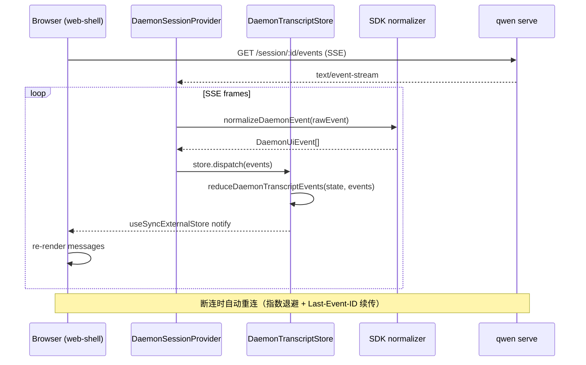
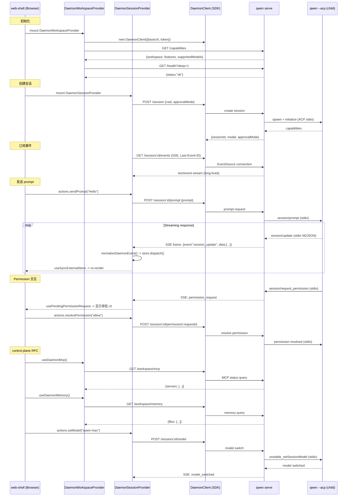

# WebUI 库与 ACP 传输层（深入）

> daemon/serve 技术方案子文档；总览见 [README.md](README.md)。

---

## 概述

本文覆盖两个并行演进的子系统：

2. **ACP 传输层演进** -- 在 `qwen serve` 现有 bespoke REST + SSE 之上，增设官方 ACP Streamable HTTP 传输（`/acp` 端点），并规划 Phase 2 WebSocket 全双工升级。两套传输共享同一 `HttpAcpBridge` + `EventBus` 实例，零状态复制。

设计目标是让多客户端（web-shell、IDE companion、TS/Java/Python SDK、ACP-native editor 如 Zed/Goose）均可按自身偏好的协议接入同一 daemon，且所有客户端通过共享 render contract（`daemonBlockToMarkdown` / `daemonBlockToHtml` / `daemonBlockToPlainText`）保证一致的 transcript 投影。

---

## 涉及 PR

| PR | 作者 | 状态 | 子主题 |
|----|------|------|--------|
| #5183 | @doudouOUC | merged | mid-turn rich content 在 Web Shell 当前 turn 只注入 text 时保留 image payload，不让图片消息丢失。 |

---

## @qwen-code/webui 架构

### 分层设计

WebUI 的 daemon 适配分三层，从底部到顶部：

```
┌──────────────────────────────────────────────────────────────────┐
│  Layer 3: packages/web-shell / packages/webui (React 组件)       │
│  -- App.tsx, MessageList, ToolGroup, AskUserQuestion, dialogs   │
├──────────────────────────────────────────────────────────────────┤
│  Layer 2: @qwen-code/webui/daemon-react-sdk (React Provider)    │
│  -- DaemonSessionProvider, DaemonWorkspaceProvider, hooks        │
│  -- transcriptToMessages, selectors, actions                     │
├──────────────────────────────────────────────────────────────────┤
│  Layer 1: @qwen-code/sdk/daemon (browser-safe, 无 React 依赖)    │
│  -- DaemonClient, normalizeDaemonEvent, transcript reducer       │
│  -- createDaemonTranscriptStore, render contract, conformance    │
└──────────────────────────────────────────────────────────────────┘
```

Layer 1（SDK daemon subpath）是无框架依赖的纯 TypeScript；Layer 2 是 React 绑定；Layer 3 是实际 UI 组件。这种分层允许非 React 消费者（channel adapter、CLI TUI、测试工具）直接使用 Layer 1，而 web-shell 等 React 应用通过 Layer 2 的 Provider 和 Hooks 接入。

### daemon adapter（Layer 1）


| 模块 | 职责 |
|------|------|
| `normalizer.ts` | `normalizeDaemonEvent()` -- 将原始 `DaemonEvent`（SSE frame）归一化为强类型 `DaemonUiEvent` 联合体。v1 处理 13 种 event type；v2 覆盖 28+ 种（含 `session.metadata.changed`, `workspace.mcp.budget_warning`, `auth.device_flow.*` 等）。未知 event 降级到 `debug` 类型，前向兼容。 |
| `transcript.ts` | `reduceDaemonTranscriptEvents()` -- 纯函数状态机，将 `DaemonUiEvent[]` 归约为 `DaemonTranscriptState`。管理 `blocks[]`（最多 `maxBlocks` = 1000），维护 `currentToolCallId`、`approvalMode`、`toolProgress` 等侧信道状态。copy-on-write：侧信道变更不触发 `blocks` 引用变化，配合 `useSyncExternalStore` 避免 O(n log n) 重排。 |
| `store.ts` | `createDaemonTranscriptStore()` -- 适配 React `useSyncExternalStore` 的外部 store。`dispatch(event)` 驱动 reducer，`queueMicrotask` 批量通知 listener。支持 `reset()` / `clearAwaitingResync()` 恢复流程。 |
| `toolPreview.ts` | `createDaemonToolPreview()` -- 从 tool input shape 推断 preview 类型。13 种 preview kind：`file_diff`, `file_read`, `web_fetch`, `mcp_invocation`, `code_block`, `search`, `tabular`, `image_generation`, `subagent_delegation`, `ask_user_question`, `command`, `key_value`, `generic`。 |
| `render.ts` | 渲染契约（render contract）：`daemonBlockToMarkdown()`, `daemonBlockToHtml()`, `daemonBlockToPlainText()`, `daemonToolPreviewToMarkdown()`。默认截断 `maxFieldLength=8192`，`sanitizeUrls` 剥离 token 参数。 |
| `conformance.ts` | `runAdapterConformanceSuite(adapter)` -- 11 个固定 fixture（含 subagent 嵌套、redaction、cancellation、mcp-budget、auth-device-flow），验证任意 adapter 的投影一致性。 |
| `terminal.ts` | `sanitizeTerminalText()` + ANSI 投影，供 TUI adapter 使用。 |
| `types.ts` | 所有类型定义：`DaemonUiEvent`（28+ 子类型的 discriminated union）、`DaemonTranscriptBlock`（`user`/`assistant`/`thought`/`tool`/`shell`/`permission`/`status`/`user_shell` 8 种 block kind）、`DaemonToolPreview`（13 种 preview kind）。 |
| `utils.ts` | `redactSensitiveFields()` -- 在 normalizer 边界对 `apiKey`/`token`/`secret`/`password`/`authorization` 等字段脱敏，阻止泄漏到 transcript block。 |

关键设计决策：

- **SDK daemon subpath 是 browser-safe**：零 React 依赖、零 Node-only 依赖。构建脚本 (`scripts/build.js`) 包含 `assertBrowserSafeBundle` 检查。
- **`eventId` 为主排序键**：daemon-monotonic SSE cursor，跨客户端/跨重连一致。`serverTimestamp` 作为备用排序键（客户端时钟漂移时的保底）。
- **取消传播**：当 `assistant.done.reason === 'cancelled'` 时，reducer 自动将所有 in-flight tool 的 status 翻转为 `'cancelled'`，解决"cancel 后 tool spinner 永转"的 UX 问题。
- **Sub-agent 嵌套**：reducer 通过 `_meta.parentToolCallId` 关联子 block，`selectSubagentChildBlocks(state, parentId)` O(1) 查询。乱序到达（child 先于 parent）通过 back-fill 处理。

### daemon-react-sdk（Layer 2）


```
packages/webui/src/daemon/
├── session/                              # 每会话
│   ├── DaemonSessionProvider.tsx          # React Context Provider
│   ├── actions.ts                         # sendPrompt, cancel, resolvePermission
│   ├── selectors.ts                       # selectDaemonStreamingState, selectDaemonPendingPermissions
│   ├── mappers.ts                         # SSE event -> connection state 映射
│   ├── clientLifecycle.ts                 # getStableClientId, detachDaemonClient
│   ├── promptContent.ts                   # toDaemonPromptContent
│   ├── transcriptToMessages.ts            # blocks -> DaemonMessage[]（React 渲染消息列表）
│   ├── types.ts                           # DaemonSessionContextValue 等
│   └── messageTypes.ts                    # DaemonMessage 联合体
├── workspace/                             # 跨会话
│   ├── DaemonWorkspaceProvider.tsx         # workspace-level Provider
│   ├── actions.ts                         # workspace 操作
│   ├── hooks/                             # 资源 hooks
│   │   ├── useDaemonAgents.ts
│   │   ├── useDaemonAuth.ts
│   │   ├── useDaemonMcp.ts
│   │   ├── useDaemonMemory.ts
│   │   ├── useDaemonSkills.ts
│   │   ├── useDaemonTools.ts
│   │   ├── useDaemonFiles.ts
│   │   ├── useDaemonGlob.ts
│   │   ├── useDaemonSessions.ts
│   │   └── useDaemonResource.ts           # 通用资源加载 hook
│   └── types.ts
├── transcriptAdapter.ts                   # Legacy bridge
├── followupSidechannel.ts                 # followup suggestion sidechannel
├── timing.ts                              # reconnect delay / timer utils
└── index.ts                               # barrel export
```

该重构的核心产出是新的 subpath export `@qwen-code/webui/daemon-react-sdk`（见 `packages/webui/src/daemon-react-sdk.ts`），将所有 daemon React hooks 以简短别名重新导出：

```typescript
// web-shell 消费示例
import {
  DaemonSessionProvider,
  DaemonWorkspaceProvider,
  useMessages,
  useConnection,
  useStreamingState,
  useActions,
  usePendingPermissionRequest,
} from '@qwen-code/webui/daemon-react-sdk';
```

**DaemonSessionProvider** (`session/DaemonSessionProvider.tsx`) 是会话级入口。它内部：
1. 创建 `DaemonTranscriptStore`（SDK Layer 1 的 `createDaemonTranscriptStore()`）。
2. 持有 `DaemonClient` + `DaemonSessionClient` 引用。
3. 订阅 SSE 事件流，调用 `normalizeDaemonEvent()` 归一化后 `store.dispatch()`。
4. 通过 `useSyncExternalStore(store.subscribe, store.getSnapshot)` 将 transcript state 暴露给子组件。
5. 管理 SSE 重连（`getReconnectDelayMs` 指数退避）、`awaitingResync` 恢复、`clearPassiveAssistantDoneTimer` 等边界情况。

**DaemonWorkspaceProvider** (`workspace/DaemonWorkspaceProvider.tsx`) 是 workspace 级入口，管理跨会话资源：MCP server 状态、skills、agents、memory、tools、文件系统操作。内部各 hook（`useDaemonMcp`, `useDaemonAgents` 等）通过 `useDaemonResource` 通用 hook 模式实现统一的 loading/error/refetch 语义。

### transcript reducer -> 消息列表

`transcriptBlocksToDaemonMessages()` (`session/transcriptToMessages.ts`) 将扁平的 `DaemonTranscriptBlock[]` 转换为嵌套的 `DaemonMessage[]`，适配 React 渲染：

- `user` block -> `DaemonUserMessage`
- 连续 `assistant`/`thought` block -> 合并为单个 `DaemonAssistantMessage`
- `tool` block -> 聚合为 `DaemonToolGroupMessage`（按时间窗口分组）
- Sub-agent tool -> `DaemonMessageToolCall` 嵌套（通过 `parentToolCallId` 关联）
- `permission` block -> 合并到对应的 tool card 中

转换通过 subAgent stack 管理嵌套层级，支持 compacted replay 中乱序到达。

### 事件消费流程



---

## Web Shell W25 行为补齐


| PR | 作用 | 实现方式 |
| --- | --- | --- |
| #5183 | mid-turn image message 不丢。 | 对 mid-turn rich content 做能力分流：当前 turn 只注入 text，可保留 image payload 到下一轮普通 prompt。 |

---

## 时序图：WebUI 连接 daemon + SSE 消费 + control-plane RPC



---

## 已知限制 / v0.16-alpha scope

### SDK daemon UI 剩余 ~5% 缺口

| 缺口 | 状态 | 依赖 |
|------|------|------|
| `tool.progress` 事件 | SDK state shape 已就绪，daemon 侧尚未发射 | ~50 LOC daemon |
| Multimodal echo（image/audio attachment 回显） | SDK `extractContentPart` 已实现 | ~80 LOC Core `MessageEmitter.emitUserContent` |

### ACP 传输层缺口

| 项目 | 状态 |
|------|------|
| HTTP/2 多路复用 | 当前 HTTP/1.1；已记录偏差 |
| SSE 断点续传 | RFD Phase 4，deferred |
| `fs/*` + `terminal/*` agent->client 转发 | permission 路径已验证机制，其余为 mechanical follow-up |
| REST `/acp` 完全等价 | 需先补齐 acp-bridge 能力（文件 I/O / device-flow / agents / memory） |

### web-shell 局限

- 仅 macOS 测试通过，Windows/Linux 浏览器兼容性未验证
- `/session/:id` SPA 路由与 daemon API `/session/*` 共用前缀，Vite dev proxy 通过判断 HTML navigation 规避冲突
- 部分 CLI 行为尚未对齐（如 `/stats` 子命令补全已移除）

---

## 参考路径

| 内容 | 路径 |
|------|------|
| SDK daemon UI 核心 | `packages/sdk-typescript/src/daemon/ui/` |
| SDK daemon client | `packages/sdk-typescript/src/daemon/DaemonClient.ts` |
| SDK daemon session client | `packages/sdk-typescript/src/daemon/DaemonSessionClient.ts` |
| SDK daemon types | `packages/sdk-typescript/src/daemon/types.ts` |
| webui daemon providers | `packages/webui/src/daemon/` |
| webui daemon-react-sdk | `packages/webui/src/daemon-react-sdk.ts` |
| web-shell | `packages/web-shell/client/` |
| Web Shell static hosting | `packages/cli/src/serve/webShellStatic.ts` |
| /demo 调试页 | `packages/cli/src/serve/demo.ts` |
| ACP HTTP 传输 | `packages/cli/src/serve/acpHttp/` |
| ACP HTTP 设计文档 | `docs/design/daemon-acp-http/README.md` |
| serve-bridge MCP | `packages/sdk-typescript/src/daemon-mcp/serve-bridge/` |
| serve server | `packages/cli/src/serve/server.ts` |

_生成于 2026-06-05_
