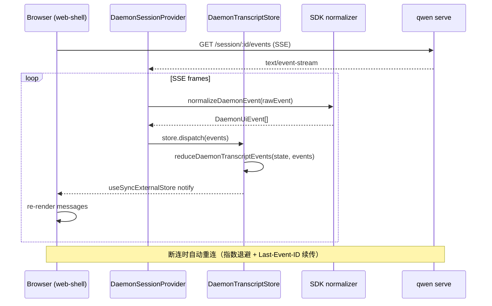
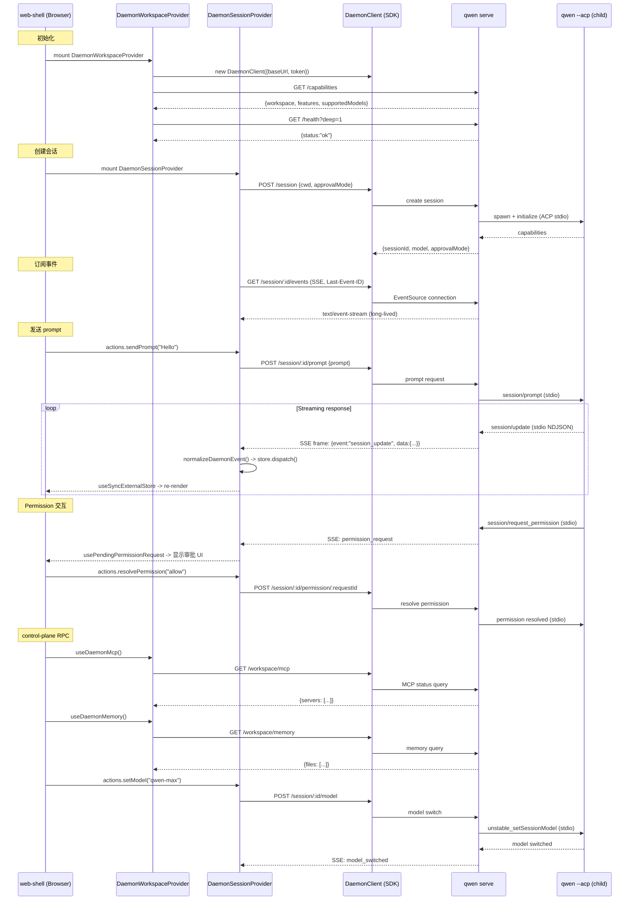

# WebUI 库与 ACP 传输层（深入）

> daemon/serve 技术方案子文档；总览见 [README.md](README.md)。

---

## 概述

本文覆盖两个并行演进的子系统：

2. **ACP 传输层演进** -- 在 `qwen serve` 现有 bespoke REST + SSE 之上，增设官方 ACP Streamable HTTP 传输（`/acp` 端点），并规划 Phase 2 WebSocket 全双工升级。两套传输共享同一 `HttpAcpBridge` + `EventBus` 实例，零状态复制。

设计目标是让多客户端（web-shell、IDE companion、TS/Java/Python SDK、ACP-native editor 如 Zed/Goose）均可按自身偏好的协议接入同一 daemon，且所有客户端通过共享 render contract（`daemonBlockToMarkdown` / `daemonBlockToHtml` / `daemonBlockToPlainText`）保证一致的 transcript 投影。

---

## 涉及 PR

| PR | 作者 | 状态 | 子主题 |
|----|------|------|--------|
| #5183 | @doudouOUC | merged | mid-turn rich content 在 Web Shell 当前 turn 只注入 text 时保留 image payload，不让图片消息丢失。 |
| #6621 | @doudouOUC | merged | workspace-qualified ACP transport：`/workspaces/:workspace/acp` per-runtime ACP mount，legacy `/acp` 继续绑定 primary。 |
| #6625 | @doudouOUC | merged | Web Shell workspace management sidebar 与 dynamic workspace registration。 |
| #6716 | @doudouOUC | merged | dynamic workspace registration 的 persistent desired-state、启动恢复和 lazy workspace-qualified ACP mount。 |
| #6717 | @doudouOUC | merged | Web Shell 可查看 untrusted secondary workspace 的 persisted-only session catalog。 |
| #7268 | @doudouOUC | open | workspace trust hot reload：Web Shell 读取 v2 trust status，展示 applying/failed/blocked，并在 runtime generation reconcile 后刷新 workspace/session 面。 |
| #6740 | @doudouOUC | merged | untrusted secondary workspace 可通过 workspace-qualified persisted transcript reader 查看 active transcript page。 |
| #6743 | @doudouOUC | merged | chat recording durable write failure 通过 `recording_stopped` 进入 WebUI warning/status。 |
| #6745 | @doudouOUC | merged | removable secondary workspace 的 runtime removal、busy snapshot 与 force confirmation flow。 |
| #6825 | @doudouOUC | merged | Extension Management V2 的 catalog/projection/action/warning surface 接入 TUI/Web Shell/SDK。 |
| #6839 | @doudouOUC | merged | workspace-qualified Voice 的 selected runtime settings/transcribe/stream 与 workspace removal activity。 |
| #6910 | @doudouOUC | open | Web Shell archived rows 按 capability/trust 暴露 Export，并走 owning workspace client。 |
| #6912 | @doudouOUC | merged | Web Shell non-primary archive/unarchive action identity、busy state 与 reconcile hardening。 |

---

## @qwen-code/webui 架构

### 分层设计

WebUI 的 daemon 适配分三层，从底部到顶部：

```
┌──────────────────────────────────────────────────────────────────┐
│  Layer 3: packages/web-shell / packages/webui (React 组件)       │
│  -- App.tsx, MessageList, ToolGroup, AskUserQuestion, dialogs   │
├──────────────────────────────────────────────────────────────────┤
│  Layer 2: @qwen-code/webui/daemon-react-sdk (React Provider)    │
│  -- DaemonSessionProvider, DaemonWorkspaceProvider, hooks        │
│  -- transcriptToMessages, selectors, actions                     │
├──────────────────────────────────────────────────────────────────┤
│  Layer 1: @qwen-code/sdk/daemon (browser-safe, 无 React 依赖)    │
│  -- DaemonClient, normalizeDaemonEvent, transcript reducer       │
│  -- createDaemonTranscriptStore, render contract, conformance    │
└──────────────────────────────────────────────────────────────────┘
```

Layer 1（SDK daemon subpath）是无框架依赖的纯 TypeScript；Layer 2 是 React 绑定；Layer 3 是实际 UI 组件。这种分层允许非 React 消费者（channel adapter、CLI TUI、测试工具）直接使用 Layer 1，而 web-shell 等 React 应用通过 Layer 2 的 Provider 和 Hooks 接入。

### daemon adapter（Layer 1）


| 模块 | 职责 |
|------|------|
| `normalizer.ts` | `normalizeDaemonEvent()` -- 将原始 `DaemonEvent`（SSE frame）归一化为强类型 `DaemonUiEvent` 联合体。v1 处理 13 种 event type；v2 覆盖 28+ 种（含 `session.metadata.changed`, `workspace.mcp.budget_warning`, `auth.device_flow.*` 等）。未知 event 降级到 `debug` 类型，前向兼容。 |
| `transcript.ts` | `reduceDaemonTranscriptEvents()` -- 纯函数状态机，将 `DaemonUiEvent[]` 归约为 `DaemonTranscriptState`。管理 `blocks[]`（最多 `maxBlocks` = 1000），维护 `currentToolCallId`、`approvalMode`、`toolProgress` 等侧信道状态。copy-on-write：侧信道变更不触发 `blocks` 引用变化，配合 `useSyncExternalStore` 避免 O(n log n) 重排。 |
| `store.ts` | `createDaemonTranscriptStore()` -- 适配 React `useSyncExternalStore` 的外部 store。`dispatch(event)` 驱动 reducer，`queueMicrotask` 批量通知 listener。支持 `reset()` / `clearAwaitingResync()` 恢复流程。 |
| `toolPreview.ts` | `createDaemonToolPreview()` -- 从 tool input shape 推断 preview 类型。13 种 preview kind：`file_diff`, `file_read`, `web_fetch`, `mcp_invocation`, `code_block`, `search`, `tabular`, `image_generation`, `subagent_delegation`, `ask_user_question`, `command`, `key_value`, `generic`。 |
| `render.ts` | 渲染契约（render contract）：`daemonBlockToMarkdown()`, `daemonBlockToHtml()`, `daemonBlockToPlainText()`, `daemonToolPreviewToMarkdown()`。默认截断 `maxFieldLength=8192`，`sanitizeUrls` 剥离 token 参数。 |
| `conformance.ts` | `runAdapterConformanceSuite(adapter)` -- 11 个固定 fixture（含 subagent 嵌套、redaction、cancellation、mcp-budget、auth-device-flow），验证任意 adapter 的投影一致性。 |
| `terminal.ts` | `sanitizeTerminalText()` + ANSI 投影，供 TUI adapter 使用。 |
| `types.ts` | 所有类型定义：`DaemonUiEvent`（28+ 子类型的 discriminated union）、`DaemonTranscriptBlock`（`user`/`assistant`/`thought`/`tool`/`shell`/`permission`/`status`/`user_shell` 8 种 block kind）、`DaemonToolPreview`（13 种 preview kind）。 |
| `utils.ts` | `redactSensitiveFields()` -- 在 normalizer 边界对 `apiKey`/`token`/`secret`/`password`/`authorization` 等字段脱敏，阻止泄漏到 transcript block。 |

关键设计决策：

- **SDK daemon subpath 是 browser-safe**：零 React 依赖、零 Node-only 依赖。构建脚本 (`scripts/build.js`) 包含 `assertBrowserSafeBundle` 检查。
- **`eventId` 为主排序键**：daemon-monotonic SSE cursor，跨客户端/跨重连一致。`serverTimestamp` 作为备用排序键（客户端时钟漂移时的保底）。
- **取消传播**：当 `assistant.done.reason === 'cancelled'` 时，reducer 自动将所有 in-flight tool 的 status 翻转为 `'cancelled'`，解决"cancel 后 tool spinner 永转"的 UX 问题。
- **Sub-agent 嵌套**：reducer 通过 `_meta.parentToolCallId` 关联子 block，`selectSubagentChildBlocks(state, parentId)` O(1) 查询。乱序到达（child 先于 parent）通过 back-fill 处理。

### daemon-react-sdk（Layer 2）


```
packages/webui/src/daemon/
├── session/                              # 每会话
│   ├── DaemonSessionProvider.tsx          # React Context Provider
│   ├── actions.ts                         # sendPrompt, cancel, resolvePermission
│   ├── selectors.ts                       # selectDaemonStreamingState, selectDaemonPendingPermissions
│   ├── mappers.ts                         # SSE event -> connection state 映射
│   ├── clientLifecycle.ts                 # getStableClientId, detachDaemonClient
│   ├── promptContent.ts                   # toDaemonPromptContent
│   ├── transcriptToMessages.ts            # blocks -> DaemonMessage[]（React 渲染消息列表）
│   ├── types.ts                           # DaemonSessionContextValue 等
│   └── messageTypes.ts                    # DaemonMessage 联合体
├── workspace/                             # 跨会话
│   ├── DaemonWorkspaceProvider.tsx         # workspace-level Provider
│   ├── actions.ts                         # workspace 操作
│   ├── hooks/                             # 资源 hooks
│   │   ├── useDaemonAgents.ts
│   │   ├── useDaemonAuth.ts
│   │   ├── useDaemonMcp.ts
│   │   ├── useDaemonMemory.ts
│   │   ├── useDaemonSkills.ts
│   │   ├── useDaemonTools.ts
│   │   ├── useDaemonFiles.ts
│   │   ├── useDaemonGlob.ts
│   │   ├── useDaemonSessions.ts
│   │   └── useDaemonResource.ts           # 通用资源加载 hook
│   └── types.ts
├── transcriptAdapter.ts                   # Legacy bridge
├── followupSidechannel.ts                 # followup suggestion sidechannel
├── timing.ts                              # reconnect delay / timer utils
└── index.ts                               # barrel export
```

该重构的核心产出是新的 subpath export `@qwen-code/webui/daemon-react-sdk`（见 `packages/webui/src/daemon-react-sdk.ts`），将所有 daemon React hooks 以简短别名重新导出：

```typescript
// web-shell 消费示例
import {
  DaemonSessionProvider,
  DaemonWorkspaceProvider,
  useMessages,
  useConnection,
  useStreamingState,
  useActions,
  usePendingPermissionRequest,
} from '@qwen-code/webui/daemon-react-sdk';
```

**DaemonSessionProvider** (`session/DaemonSessionProvider.tsx`) 是会话级入口。它内部：
1. 创建 `DaemonTranscriptStore`（SDK Layer 1 的 `createDaemonTranscriptStore()`）。
2. 持有 `DaemonClient` + `DaemonSessionClient` 引用。
3. 订阅 SSE 事件流，调用 `normalizeDaemonEvent()` 归一化后 `store.dispatch()`。
4. 通过 `useSyncExternalStore(store.subscribe, store.getSnapshot)` 将 transcript state 暴露给子组件。
5. 管理 SSE 重连（`getReconnectDelayMs` 指数退避）、`awaitingResync` 恢复、`clearPassiveAssistantDoneTimer` 等边界情况。

**DaemonWorkspaceProvider** (`workspace/DaemonWorkspaceProvider.tsx`) 是 workspace 级入口，管理跨会话资源：MCP server 状态、skills、agents、memory、tools、文件系统操作。内部各 hook（`useDaemonMcp`, `useDaemonAgents` 等）通过 `useDaemonResource` 通用 hook 模式实现统一的 loading/error/refetch 语义。

### transcript reducer -> 消息列表

`transcriptBlocksToDaemonMessages()` (`session/transcriptToMessages.ts`) 将扁平的 `DaemonTranscriptBlock[]` 转换为嵌套的 `DaemonMessage[]`，适配 React 渲染：

- `user` block -> `DaemonUserMessage`
- 连续 `assistant`/`thought` block -> 合并为单个 `DaemonAssistantMessage`
- `tool` block -> 聚合为 `DaemonToolGroupMessage`（按时间窗口分组）
- Sub-agent tool -> `DaemonMessageToolCall` 嵌套（通过 `parentToolCallId` 关联）
- `permission` block -> 合并到对应的 tool card 中

转换通过 subAgent stack 管理嵌套层级，支持 compacted replay 中乱序到达。

### 事件消费流程



---

## Web Shell W25 行为补齐


| PR | 作用 | 实现方式 |
| --- | --- | --- |
| #5183 | mid-turn image message 不丢。 | 对 mid-turn rich content 做能力分流：当前 turn 只注入 text，可保留 image payload 到下一轮普通 prompt。 |

## Web Shell workspace management（#6625）

#6625 把 Web Shell sidebar 从 primary session list 升级为 workspace management surface。多 workspace capability 存在时，sidebar 按 workspace 渲染 collapsible section：每个 workspace 显示 cwd、primary badge、trust 状态和自己的 sessions；trusted workspace 可展开、刷新、创建/查看 session，untrusted workspace 保持可见但禁用操作。单 workspace daemon 保留简化 session list，只补 add-workspace 入口。

新增 `AddWorkspaceDialog` 通过 SDK `DaemonClient.addWorkspace(cwd)` 调 `POST /workspaces`。daemon route 要求 cwd 是绝对路径、realpath 后存在且为目录，并拒绝重复、in-flight duplicate、parent/child nested workspace 和超过 25 个 workspace 的注册。注册成功后，WebUI workspace provider 的 `refreshCapabilities({ force:true })` 绕过 cached capabilities promise，立即拿到新的 `workspaces[]`。

#6716 把 `addWorkspace` 扩展成可选持久化注册：Web Shell 只有看到 `persistent_workspace_registration` capability 时才展示/发送 persist 选项；daemon 把 secondary workspace desired-state 写入 user-level store，并在重启时恢复 runtime。`GET /workspace-registrations` 用于列出持久记录，`DELETE /workspace-registrations/:id` 只删除 desired-state，不卸载当前 active runtime。它还把 workspace-qualified ACP route 改成 app 启动时即挂载的 lazy resolver，避免动态注册后 plural ACP mount 不存在。

#6717 让 untrusted secondary workspace 在 sidebar 中可展开查看 persisted-only session catalog。UI 不选择该 workspace、不打开 session、不做 10 秒 polling；只用非交互 read-only row 显示 session displayName/短 id 和创建时间，并提示需要 trust 后才能打开。trusted workspace 和 untrusted primary 的行为不变。

#7268 open diff 把 trust 状态从“注册时一次性判断”扩展成可热重载的 v2 status。Web Shell 看到 `workspace_trust_hot_reload` capability 后，应轮询/刷新 selected workspace 的 trust status，区分 stable trusted/untrusted 与 applying、failed、blocked 等过渡/异常状态；过渡期间不把 workspace mutation fallback 到 primary，也不继续使用旧 generation 的 session/action 入口。trust grant/revoke 触发 runtime close/drain/recreate 后，sidebar 需要刷新 capabilities、workspace row、session list 和 busy state；failed/blocked 状态要作为可操作状态呈现，而不是当作普通未信任 workspace 静默折叠。

#6740 在 REST 层允许 registered untrusted secondary workspace 读取 active persisted transcript page。Web Shell 仍不把 untrusted workspace 当成可执行 workspace，不选择、不 prompt、不 ACP attach；如果 UI 提供“查看历史”入口，应通过 `WorkspaceDaemonClient.getSessionTranscriptPage()` 直接拉 workspace-qualified REST，并按 #6769 的 page/cursor bounds 处理 `transcript_page_too_large`。

#6743 让 `recording_stopped` 成为 WebUI known signal：当 daemon 报告 recording durable append 已失败并停止 recorder 时，provider 把它渲染为 session warning/status，而不是未知 debug block。该事件不包含本地 path/errno，适合在浏览器端直接显示通用“记录已停止”语义。

#6745 给 workspace sidebar 增加 remove flow。UI 先检查 capabilities 是否包含 `workspace_runtime_removal` 且 workspace row `removable:true`；普通 remove 遇到 `workspace_busy` 时显示 activity snapshot，并要求用户显式 force 后才发送 `force:true`。如果当前 session 属于目标 workspace，force 按钮禁用，避免 UI 自己拆掉当前执行面。成功后刷新 capabilities/workspace list，并必要时回落到 primary workspace；删除 persistent alias 不代表删除项目文件、settings、transcripts 或 archive。

#6825 把 Extension Management V2 暴露给客户端层：Web Shell/TUI 不再只消费 legacy `/workspace/extensions` 诊断快照，而是通过 SDK 的 global catalog、operation polling 和 workspace projection/activation helpers 展示 user-level artifact 与 per-workspace activation 的分离状态。mutation 被 daemon 接受后返回 operation id；UI 必须把 `succeeded_with_warnings` 当作“持久状态已提交但 runtime refresh/settings sync/cleanup 失败”的可操作 warning，而不是静默成功或强制回滚。workspace projection 需要展示 default、override、effective、desired generation 与 applied generation，避免用户把 artifact 安装状态误读成某个 workspace 已生效。

#6839 对 Web Shell 的直接影响不是新增 secondary workspace Voice 控件，而是让 workspace runtime lifecycle 能看见 Voice activity。workspace sidebar 的 removal/busy flow 需要展示 `activity.voiceSessions`：普通 remove 遇到 active Voice work 返回 busy，force remove 只 abort 目标 runtime 的 Voice stream/lease，不影响其它 workspace；成功后刷新 workspace/capabilities。客户端若要启用 selected workspace Voice 设置或 batch transcription，应同时 gate `workspace_qualified_voice` 和对应 legacy Voice 能力。

#6912 修正 Web Shell session row 的 identity：merged active/archived collection、React key、current selection、busy state、unread/export state 都使用 `(workspaceCwd, sessionId)`，不能只用 session id。secondary active row 只在 trusted 且 capability 足够时显示 Archive；trusted archived row 可以 Unarchive；操作完成后同时 reconcile primary 与 selected workspace 的 active/archived catalog，并展示 daemon response 的 `errors[]`。#6910 在此基础上给 archived row 增加 Export：只有 `workspace_archived_session_export` 存在且 row workspace trusted 时才显示，点击后调用 row owning workspace 的 `WorkspaceDaemonClient.exportArchivedSession()`，避免同 id session 从 primary 或 active route 导出错内容。

---

## 时序图：WebUI 连接 daemon + SSE 消费 + control-plane RPC



---

## workspace-qualified ACP transport（#6621）

Phase 3 已把 core REST surface 扩展为 `/workspaces/:workspace/...`，但 ACP transport 在 #6621 前仍只有 legacy `/acp`，并且固定绑定 primary workspace。#6621 新增 `/workspaces/:workspace/acp`，让 ACP-native client 可以直接连接 trusted secondary workspace runtime。

实现边界：

- HTTP POST / GET(SSE) / DELETE 复用 legacy `/acp` 的 handler，但先解析 workspace selector；selector 先 workspace id，再 encoded absolute cwd。
- primary selector 复用 legacy primary mount；trusted non-primary runtime 创建独立 `AcpDispatcher` 与 `ConnectionRegistry`，并绑定该 runtime 的 bridge、workspace service、fsFactory、remember lane 和 client-MCP sender registry。
- OAuth device-flow registry 保持 daemon-global/shared；auth-flow events best-effort fanout 到 primary 和 trusted secondary bridge，一个 bridge 失败不阻塞其他 bridge。
- 单一 WebSocket upgrade listener 使用 raw request target 识别 `/workspaces/<selector>/acp` path，在 normalize 前拒绝 dot-segment、反斜杠和异常编码，再路由到对应 runtime mount。
- unknown selector 返回 `workspace_mismatch`，untrusted non-primary workspace 返回 `untrusted_workspace`。
- CDP tunnel 保持 primary-only；workspace-scoped CDP 未在本 PR 中解决。

capability tag 是 `workspace_qualified_acp`，只有 ACP HTTP enabled 且 multi-workspace sessions enabled 时广告；legacy `/acp` 保持 primary workspace 兼容。

---

## 已知限制 / v0.16-alpha scope

### SDK daemon UI 剩余 ~5% 缺口

| 缺口 | 状态 | 依赖 |
|------|------|------|
| `tool.progress` 事件 | SDK state shape 已就绪，daemon 侧尚未发射 | ~50 LOC daemon |
| Multimodal echo（image/audio attachment 回显） | SDK `extractContentPart` 已实现 | ~80 LOC Core `MessageEmitter.emitUserContent` |

### ACP 传输层缺口

| 项目 | 状态 |
|------|------|
| HTTP/2 多路复用 | 当前 HTTP/1.1；已记录偏差 |
| SSE 断点续传 | RFD Phase 4，deferred |
| `fs/*` + `terminal/*` agent->client 转发 | permission 路径已验证机制，其余为 mechanical follow-up |
| REST `/acp` 完全等价 | 需先补齐 acp-bridge 能力（文件 I/O / device-flow / agents / memory） |
| workspace-qualified ACP | #6621 已提供 `/workspaces/:workspace/acp`，legacy `/acp` 仍是 primary-only |

### web-shell 局限

- 仅 macOS 测试通过，Windows/Linux 浏览器兼容性未验证
- `/session/:id` SPA 路由与 daemon API `/session/*` 共用前缀，Vite dev proxy 通过判断 HTML navigation 规避冲突
- 部分 CLI 行为尚未对齐（如 `/stats` 子命令补全已移除）

---

## 参考路径

| 内容 | 路径 |
|------|------|
| SDK daemon UI 核心 | `packages/sdk-typescript/src/daemon/ui/` |
| SDK daemon client | `packages/sdk-typescript/src/daemon/DaemonClient.ts` |
| SDK daemon session client | `packages/sdk-typescript/src/daemon/DaemonSessionClient.ts` |
| SDK daemon types | `packages/sdk-typescript/src/daemon/types.ts` |
| webui daemon providers | `packages/webui/src/daemon/` |
| webui daemon-react-sdk | `packages/webui/src/daemon-react-sdk.ts` |
| web-shell | `packages/web-shell/client/` |
| Web Shell static hosting | `packages/cli/src/serve/webShellStatic.ts` |
| /demo 调试页 | `packages/cli/src/serve/demo.ts` |
| ACP HTTP 传输 | `packages/cli/src/serve/acp-http/` |
| ACP HTTP 设计文档 | `docs/design/daemon-acp-http/README.md` |
| serve-bridge MCP | `packages/sdk-typescript/src/daemon-mcp/serve-bridge/` |
| serve server | `packages/cli/src/serve/server.ts` |

_生成于 2026-06-05；按个人 PR 口径更新于 2026-07-11_
