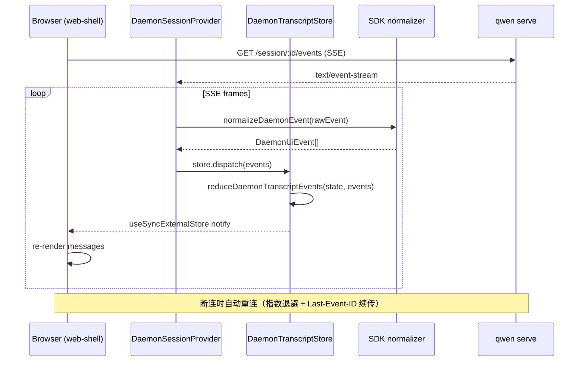
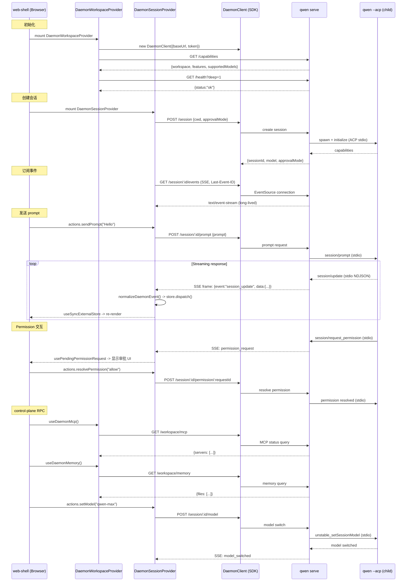

# WebUI 库与 ACP 传输层（深入）

> daemon/serve 技术方案子文档；总览见 [README.md](README.md)。

---

## 概述

本文覆盖两个并行演进的子系统：

2. **ACP 传输层演进** -- 在 `qwen serve` 现有 bespoke REST + SSE 之上，增设官方 ACP Streamable HTTP 传输（`/acp` 端点），并规划 Phase 2 WebSocket 全双工升级。两套传输共享同一 `HttpAcpBridge` + `EventBus` 实例，零状态复制。

设计目标是让多客户端（web-shell、IDE companion、TS/Java/Python SDK、ACP-native editor 如 Zed/Goose）均可按自身偏好的协议接入同一 daemon，且所有客户端通过共享 render contract（`daemonBlockToMarkdown` / `daemonBlockToHtml` / `daemonBlockToPlainText`）保证一致的 transcript 投影。

---

## 涉及 PR

| PR | 作者 | 状态 | 子主题 |
|----|------|------|--------|
| #5183 | @doudouOUC | merged | mid-turn rich content 在 Web Shell 当前 turn 只注入 text 时保留 image payload，不让图片消息丢失。 |
| #6621 | @doudouOUC | merged | workspace-qualified ACP transport：`/workspaces/:workspace/acp` per-runtime ACP mount，legacy `/acp` 继续绑定 primary。 |
| #6625 | @doudouOUC | merged | Web Shell workspace management sidebar 与 dynamic workspace registration。 |
| #6716 | @doudouOUC | merged | dynamic workspace registration 的 persistent desired-state、启动恢复和 lazy workspace-qualified ACP mount。 |
| #6717 | @doudouOUC | merged | Web Shell 可查看 untrusted secondary workspace 的 persisted-only session catalog。 |
| #7268 | @doudouOUC | merged | workspace trust hot reload：Web Shell 读取 v2 trust status，展示 applying/failed/blocked，并在 runtime generation reconcile 后刷新 workspace/session 面。 |
| #6740 | @doudouOUC | merged | untrusted secondary workspace 可通过 workspace-qualified persisted transcript reader 查看 active transcript page。 |
| #6743 | @doudouOUC | merged | chat recording durable write failure 通过 `recording_stopped` 进入 WebUI warning/status。 |
| #6745 | @doudouOUC | merged | removable secondary workspace 的 runtime removal、busy snapshot 与 force confirmation flow。 |
| #6825 | @doudouOUC | merged | Extension Management V2 的 catalog/projection/action/warning surface 接入 TUI/Web Shell/SDK。 |
| #6839 | @doudouOUC | merged | workspace-qualified Voice 的 selected runtime settings/transcribe/stream 与 workspace removal activity。 |
| #7754 | @doudouOUC | merged | Web Shell Voice 按 composer owning workspace 解析 fail-closed target；trusted secondary 使用 workspace-qualified Voice routes，owner 变化清理 capture generation。 |
| #6910 | @doudouOUC | merged | Web Shell archived rows 按 capability/trust 暴露 Export，并走 owning workspace client。 |
| #6912 | @doudouOUC | merged | Web Shell non-primary archive/unarchive action identity、busy state 与 reconcile hardening。 |
| #8414 | @doudouOUC | merged | live journal truncation repair：marker 带 prompt id，WebUI 在 terminal 后用 same-session memory replay 重建完整 turn suffix。 |
| #8450 | @doudouOUC | merged | ACP transport textual tool-result projection：对 live/replay/subagent replay 的 canonical text payload 做 65,536 byte JSON 预算，不改 canonical transcript。 |
| #8572 | @doudouOUC | merged | WebUI SSE reconnect reason：只在 prompt restart、normal stream end、transport error、state resync 可判定时向 TS SDK 传 `sseConnectReason`。 |
| #8691 | @doudouOUC | merged | WebUI restore timeout budget：load/resume 使用 server restore budget 派生 request timeout 与 watchdog，并把 retryable 504 作为可恢复 restore failure。 |
| #8743 | @doudouOUC | closed by #9055 | selective session restore design：docs-only 设计已由 #9055 runtime PR 承接；recent replay page 与 transactional WebUI switching 仍是分离边界。 |
| #8824 | @doudouOUC | closed draft | transactional WebUI restore 完整草案；未合入，后续拆分为 #8833 same-id attachment fencing 与 #8882 cross-session switching。 |
| #8833 | @doudouOUC | merged | same-id attachment stale-work fencing：metadata、SSE、heartbeat、`session_closed` 和 cleanup 按精确 attachment object 归属。 |
| #8882 | @doudouOUC | merged | transactional cross-session switching：source 在 target restore/staging 成功 commit 前保持 visible owner，legacy daemon 仍走 detach-first。 |
| #8891 | @doudouOUC | merged | shared session catalog scheduling：WebShell 多消费者共享 catalog cache/in-flight/scheduler，mutation 后按 owning workspace invalidate/patch。 |
| #8931 | @doudouOUC | merged | prompt-safe session navigation：async host admission hook 返回后重查 session write gate，navigation preparing 时保留 source draft。 |
| #8933 | @doudouOUC | merged | restore request shape fencing：按 target + replay shape 区分 load/resume/all/recent coalescing，防止不同 replay 语义互相满足。 |
| #8939 | @doudouOUC | merged | transactional same-session refresh：same logical session refresh/rebind 使用 candidate staging，commit 前 source attachment/transcript/event stream 保持活动。 |
| #8955 | @doudouOUC | merged | prompt admission ownership hardening：async host admission/lazy preparation 后重校 owner/generation，并用 stable transcript identity 恢复 source-owned retry。 |
| #8990 | @doudouOUC | merged | same-session refresh race closeout：补 event epoch、candidate cleanup、turn+shell settle、controlled target 与 committed client identity recovery。 |
| #9007 | @doudouOUC | merged | ACP HTTP pre-attach byte bounds：限制 pre-attach buffered replies 的 frame/byte budget，并把 ownership grant 绑定到 local delivery。 |
| #9048 | @doudouOUC | closed | transactional resync / live-journal repair：closed diff 只作为未合入观察，不能写成 main 已落地能力。 |
| #9055 | @doudouOUC | merged | selective session restore runtime：cold load/resume 在 daemon 内按请求 replay projection 读取 bounded page，WebUI recent page 不再要求 full transcript materialization 后裁剪。 |
| #9180 | @doudouOUC | merged | Web Shell text file attachments：支持 paste/drop 文本文件、file chips、queue/retry/restore 与 daemon prompt `resource` block 投递。 |
| #9181 | @doudouOUC | merged | Conversations runtime visibility：已合入 internal `live-conversation` runtime guard，不让普通 workspace picker、Voice、scratch、ACP 和 workspace management target 选中。 |
| #9261 | @doudouOUC | merged | workspace session live-state route/handshake：已合入 route/capability/SDK，Web Shell 可先 poll live-state，再在 catalog version 变化时刷新完整 persisted catalog。 |
| #9366 | @doudouOUC | merged | WebShell live-state consumer：启用 capability 后用 `live A -> catalog/groups -> live B` fencing 完整 catalog，并在稳态只 poll live-state。 |
| #9396 | @doudouOUC | merged | live-state activity watermark：服务端在 live-state response 中补 optional `updatedAt`，普通 turn activity 不 bump catalog version。 |
| #9476 | @doudouOUC | merged | WebShell live-state activity consumer：turn completion 通过 post-completion live-state response settle，并用可吸收 `updatedAt` 重排当前 active page。 |

---

## @qwen-code/webui 架构

### 分层设计

WebUI 的 daemon 适配分三层，从底部到顶部：

```
┌──────────────────────────────────────────────────────────────────┐
│  Layer 3: packages/web-shell / packages/webui (React 组件)       │
│  -- App.tsx, MessageList, ToolGroup, AskUserQuestion, dialogs   │
├──────────────────────────────────────────────────────────────────┤
│  Layer 2: @qwen-code/webui/daemon-react-sdk (React Provider)    │
│  -- DaemonSessionProvider, DaemonWorkspaceProvider, hooks        │
│  -- transcriptToMessages, selectors, actions                     │
├──────────────────────────────────────────────────────────────────┤
│  Layer 1: @qwen-code/sdk/daemon (browser-safe, 无 React 依赖)    │
│  -- DaemonClient, normalizeDaemonEvent, transcript reducer       │
│  -- createDaemonTranscriptStore, render contract, conformance    │
└──────────────────────────────────────────────────────────────────┘
```

Layer 1（SDK daemon subpath）是无框架依赖的纯 TypeScript；Layer 2 是 React 绑定；Layer 3 是实际 UI 组件。这种分层允许非 React 消费者（channel adapter、CLI TUI、测试工具）直接使用 Layer 1，而 web-shell 等 React 应用通过 Layer 2 的 Provider 和 Hooks 接入。

### daemon adapter（Layer 1）


| 模块 | 职责 |
|------|------|
| `normalizer.ts` | `normalizeDaemonEvent()` -- 将原始 `DaemonEvent`（SSE frame）归一化为强类型 `DaemonUiEvent` 联合体。v1 处理 13 种 event type；v2 覆盖 28+ 种（含 `session.metadata.changed`, `workspace.mcp.budget_warning`, `auth.device_flow.*` 等）。未知 event 降级到 `debug` 类型，前向兼容。 |
| `transcript.ts` | `reduceDaemonTranscriptEvents()` -- 纯函数状态机，将 `DaemonUiEvent[]` 归约为 `DaemonTranscriptState`。管理 `blocks[]`（最多 `maxBlocks` = 1000），维护 `currentToolCallId`、`approvalMode`、`toolProgress` 等侧信道状态。copy-on-write：侧信道变更不触发 `blocks` 引用变化，配合 `useSyncExternalStore` 避免 O(n log n) 重排。 |
| `store.ts` | `createDaemonTranscriptStore()` -- 适配 React `useSyncExternalStore` 的外部 store。`dispatch(event)` 驱动 reducer，`queueMicrotask` 批量通知 listener。支持 `reset()` / `clearAwaitingResync()` 恢复流程。 |
| `toolPreview.ts` | `createDaemonToolPreview()` -- 从 tool input shape 推断 preview 类型。13 种 preview kind：`file_diff`, `file_read`, `web_fetch`, `mcp_invocation`, `code_block`, `search`, `tabular`, `image_generation`, `subagent_delegation`, `ask_user_question`, `command`, `key_value`, `generic`。 |
| `render.ts` | 渲染契约（render contract）：`daemonBlockToMarkdown()`, `daemonBlockToHtml()`, `daemonBlockToPlainText()`, `daemonToolPreviewToMarkdown()`。默认截断 `maxFieldLength=8192`，`sanitizeUrls` 剥离 token 参数。 |
| `conformance.ts` | `runAdapterConformanceSuite(adapter)` -- 11 个固定 fixture（含 subagent 嵌套、redaction、cancellation、mcp-budget、auth-device-flow），验证任意 adapter 的投影一致性。 |
| `terminal.ts` | `sanitizeTerminalText()` + ANSI 投影，供 TUI adapter 使用。 |
| `types.ts` | 所有类型定义：`DaemonUiEvent`（28+ 子类型的 discriminated union）、`DaemonTranscriptBlock`（`user`/`assistant`/`thought`/`tool`/`shell`/`permission`/`status`/`user_shell` 8 种 block kind）、`DaemonToolPreview`（13 种 preview kind）。 |
| `utils.ts` | `redactSensitiveFields()` -- 在 normalizer 边界对 `apiKey`/`token`/`secret`/`password`/`authorization` 等字段脱敏，阻止泄漏到 transcript block。 |

关键设计决策：

- **SDK daemon subpath 是 browser-safe**：零 React 依赖、零 Node-only 依赖。构建脚本 (`scripts/build.js`) 包含 `assertBrowserSafeBundle` 检查。
- **`eventId` 为主排序键**：daemon-monotonic SSE cursor，跨客户端/跨重连一致。`serverTimestamp` 作为备用排序键（客户端时钟漂移时的保底）。
- **取消传播**：当 `assistant.done.reason === 'cancelled'` 时，reducer 自动将所有 in-flight tool 的 status 翻转为 `'cancelled'`，解决"cancel 后 tool spinner 永转"的 UX 问题。
- **Sub-agent 嵌套**：reducer 通过 `_meta.parentToolCallId` 关联子 block，`selectSubagentChildBlocks(state, parentId)` O(1) 查询。乱序到达（child 先于 parent）通过 back-fill 处理。

### daemon-react-sdk（Layer 2）


```
packages/webui/src/daemon/
├── session/                              # 每会话
│   ├── DaemonSessionProvider.tsx          # React Context Provider
│   ├── actions.ts                         # sendPrompt, cancel, resolvePermission
│   ├── selectors.ts                       # selectDaemonStreamingState, selectDaemonPendingPermissions
│   ├── mappers.ts                         # SSE event -> connection state 映射
│   ├── clientLifecycle.ts                 # getStableClientId, detachDaemonClient
│   ├── promptContent.ts                   # toDaemonPromptContent
│   ├── transcriptToMessages.ts            # blocks -> DaemonMessage[]（React 渲染消息列表）
│   ├── types.ts                           # DaemonSessionContextValue 等
│   └── messageTypes.ts                    # DaemonMessage 联合体
├── workspace/                             # 跨会话
│   ├── DaemonWorkspaceProvider.tsx         # workspace-level Provider
│   ├── actions.ts                         # workspace 操作
│   ├── hooks/                             # 资源 hooks
│   │   ├── useDaemonAgents.ts
│   │   ├── useDaemonAuth.ts
│   │   ├── useDaemonMcp.ts
│   │   ├── useDaemonMemory.ts
│   │   ├── useDaemonSkills.ts
│   │   ├── useDaemonTools.ts
│   │   ├── useDaemonFiles.ts
│   │   ├── useDaemonGlob.ts
│   │   ├── useDaemonSessions.ts
│   │   └── useDaemonResource.ts           # 通用资源加载 hook
│   └── types.ts
├── transcriptAdapter.ts                   # Legacy bridge
├── followupSidechannel.ts                 # followup suggestion sidechannel
├── timing.ts                              # reconnect delay / timer utils
└── index.ts                               # barrel export
```

该重构的核心产出是新的 subpath export `@qwen-code/webui/daemon-react-sdk`（见 `packages/webui/src/daemon-react-sdk.ts`），将所有 daemon React hooks 以简短别名重新导出：

```typescript
// web-shell 消费示例
import {
  DaemonSessionProvider,
  DaemonWorkspaceProvider,
  useMessages,
  useConnection,
  useStreamingState,
  useActions,
  usePendingPermissionRequest,
} from '@qwen-code/webui/daemon-react-sdk';
```

**DaemonSessionProvider** (`session/DaemonSessionProvider.tsx`) 是会话级入口。它内部：
1. 创建 `DaemonTranscriptStore`（SDK Layer 1 的 `createDaemonTranscriptStore()`）。
2. 持有 `DaemonClient` + `DaemonSessionClient` 引用。
3. 订阅 SSE 事件流，调用 `normalizeDaemonEvent()` 归一化后 `store.dispatch()`。
4. 通过 `useSyncExternalStore(store.subscribe, store.getSnapshot)` 将 transcript state 暴露给子组件。
5. 管理 SSE 重连（`getReconnectDelayMs` 指数退避）、`awaitingResync` 恢复、`clearPassiveAssistantDoneTimer` 等边界情况。

**DaemonWorkspaceProvider** (`workspace/DaemonWorkspaceProvider.tsx`) 是 workspace 级入口，管理跨会话资源：MCP server 状态、skills、agents、memory、tools、文件系统操作。内部各 hook（`useDaemonMcp`, `useDaemonAgents` 等）通过 `useDaemonResource` 通用 hook 模式实现统一的 loading/error/refetch 语义。

### transcript reducer -> 消息列表

`transcriptBlocksToDaemonMessages()` (`session/transcriptToMessages.ts`) 将扁平的 `DaemonTranscriptBlock[]` 转换为嵌套的 `DaemonMessage[]`，适配 React 渲染：

- `user` block -> `DaemonUserMessage`
- 连续 `assistant`/`thought` block -> 合并为单个 `DaemonAssistantMessage`
- `tool` block -> 聚合为 `DaemonToolGroupMessage`（按时间窗口分组）
- Sub-agent tool -> `DaemonMessageToolCall` 嵌套（通过 `parentToolCallId` 关联）
- `permission` block -> 合并到对应的 tool card 中

转换通过 subAgent stack 管理嵌套层级，支持 compacted replay 中乱序到达。

### 事件消费流程


```mermaid
sequenceDiagram
    participant Browser as Browser (web-shell)
    participant Provider as DaemonSessionProvider
    participant Store as DaemonTranscriptStore
    participant SDK as SDK normalizer
    participant Daemon as qwen serve

    Browser->>Daemon: GET /session/:id/events (SSE)
    Daemon-->>Provider: text/event-stream
    loop SSE frames
        Provider->>SDK: normalizeDaemonEvent(rawEvent)
        SDK-->>Provider: DaemonUiEvent[]
        Provider->>Store: store.dispatch(events)
        Store->>Store: reduceDaemonTranscriptEvents(state, events)
        Store-->>Browser: useSyncExternalStore notify
        Browser->>Browser: re-render messages
    end
    Note over Browser,Daemon: 断连时自动重连（指数退避 + Last-Event-ID 续传）
```

---

## Web Shell W25 行为补齐


| PR | 作用 | 实现方式 |
| --- | --- | --- |
| #5183 | mid-turn image message 不丢。 | 对 mid-turn rich content 做能力分流：当前 turn 只注入 text，可保留 image payload 到下一轮普通 prompt。 |

## Web Shell workspace management（#6625）

#6625 把 Web Shell sidebar 从 primary session list 升级为 workspace management surface。多 workspace capability 存在时，sidebar 按 workspace 渲染 collapsible section：每个 workspace 显示 cwd、primary badge、trust 状态和自己的 sessions；trusted workspace 可展开、刷新、创建/查看 session，untrusted workspace 保持可见但禁用操作。单 workspace daemon 保留简化 session list，只补 add-workspace 入口。

新增 `AddWorkspaceDialog` 通过 SDK `DaemonClient.addWorkspace(cwd)` 调 `POST /workspaces`。daemon route 要求 cwd 是绝对路径、realpath 后存在且为目录，并拒绝重复、in-flight duplicate、parent/child nested workspace 和超过 25 个 workspace 的注册。注册成功后，WebUI workspace provider 的 `refreshCapabilities({ force:true })` 绕过 cached capabilities promise，立即拿到新的 `workspaces[]`。

#6716 把 `addWorkspace` 扩展成可选持久化注册：Web Shell 只有看到 `persistent_workspace_registration` capability 时才展示/发送 persist 选项；daemon 把 secondary workspace desired-state 写入 user-level store，并在重启时恢复 runtime。`GET /workspace-registrations` 用于列出持久记录，`DELETE /workspace-registrations/:id` 只删除 desired-state，不卸载当前 active runtime。它还把 workspace-qualified ACP route 改成 app 启动时即挂载的 lazy resolver，避免动态注册后 plural ACP mount 不存在。

#6717 让 untrusted secondary workspace 在 sidebar 中可展开查看 persisted-only session catalog。UI 不选择该 workspace、不打开 session、不做 10 秒 polling；只用非交互 read-only row 显示 session displayName/短 id 和创建时间，并提示需要 trust 后才能打开。trusted workspace 和 untrusted primary 的行为不变。

#7268 把 trust 状态从“注册时一次性判断”扩展成可热重载的 v2 status。Web Shell 看到 `workspace_trust_hot_reload` capability 后，应轮询/刷新 selected workspace 的 trust status，区分 stable trusted/untrusted 与 applying、failed、blocked 等过渡/异常状态；过渡期间不把 workspace mutation fallback 到 primary，也不继续使用旧 generation 的 session/action 入口。trust grant/revoke 触发 runtime close/drain/recreate 后，sidebar 需要刷新 capabilities、workspace row、session list 和 busy state；failed/blocked 状态要作为可操作状态呈现，而不是当作普通未信任 workspace 静默折叠。

#6740 在 REST 层允许 registered untrusted secondary workspace 读取 active persisted transcript page。Web Shell 仍不把 untrusted workspace 当成可执行 workspace，不选择、不 prompt、不 ACP attach；如果 UI 提供“查看历史”入口，应通过 `WorkspaceDaemonClient.getSessionTranscriptPage()` 直接拉 workspace-qualified REST，并按 #6769 的 page/cursor bounds 处理 `transcript_page_too_large`。

#6743 让 `recording_stopped` 成为 WebUI known signal：当 daemon 报告 recording durable append 已失败并停止 recorder 时，provider 把它渲染为 session warning/status，而不是未知 debug block。该事件不包含本地 path/errno，适合在浏览器端直接显示通用“记录已停止”语义。

#6745 给 workspace sidebar 增加 remove flow。UI 先检查 capabilities 是否包含 `workspace_runtime_removal` 且 workspace row `removable:true`；普通 remove 遇到 `workspace_busy` 时显示 activity snapshot，并要求用户显式 force 后才发送 `force:true`。如果当前 session 属于目标 workspace，force 按钮禁用，避免 UI 自己拆掉当前执行面。成功后刷新 capabilities/workspace list，并必要时回落到 primary workspace；删除 persistent alias 不代表删除项目文件、settings、transcripts 或 archive。

#6825 把 Extension Management V2 暴露给客户端层：Web Shell/TUI 不再只消费 legacy `/workspace/extensions` 诊断快照，而是通过 SDK 的 global catalog、operation polling 和 workspace projection/activation helpers 展示 user-level artifact 与 per-workspace activation 的分离状态。mutation 被 daemon 接受后返回 operation id；UI 必须把 `succeeded_with_warnings` 当作“持久状态已提交但 runtime refresh/settings sync/cleanup 失败”的可操作 warning，而不是静默成功或强制回滚。workspace projection 需要展示 default、override、effective、desired generation 与 applied generation，避免用户把 artifact 安装状态误读成某个 workspace 已生效。

#6839 对 Web Shell 的直接影响不是新增 secondary workspace Voice 控件，而是让 workspace runtime lifecycle 能看见 Voice activity。workspace sidebar 的 removal/busy flow 需要展示 `activity.voiceSessions`：普通 remove 遇到 active Voice work 返回 busy，force remove 只 abort 目标 runtime 的 Voice stream/lease，不影响其它 workspace；成功后刷新 workspace/capabilities。客户端若要启用 selected workspace Voice 设置或 batch transcription，应同时 gate `workspace_qualified_voice` 和对应 legacy Voice 能力。

#7754 则把 Web Shell Voice 从“selected workspace 能力”推进到“composer owner 能力”。新 `voice-workspace-target.ts` 根据 capabilities、composer intended cwd、session id/draft id 和 workspace list 解析 Voice target：primary 或旧单 workspace daemon 继续使用 legacy route；trusted secondary 必须唯一匹配 canonical cwd 或 workspace id，且拥有 `workspace_qualified_voice`，才走 `/workspaces/:workspace/voice/...` status/provider/settings/model/stream；unknown、ambiguous、untrusted、bootstrapping、draining 或 removed workspace 直接 fail closed，不 fallback primary。

UI 组件需要把 owner 信息一路传到 Voice 层。`App.tsx`、`ChatPane.tsx`、`SplitView.tsx` 和 `ChatEditor.tsx` 为 main、locked、split-view composer 传递 intended cwd、session id 与 merged workspace list；`VoiceButton` 以 target workspace/owner/settings revision 作为 status key，pending/error/unsupported/mismatch 时隐藏或禁用，而不是读取 primary 状态。`use-voice-workspace-settings.ts` 区分 user-scope 与 workspace-scope revision：user-level Voice 设置仍共享，workspace providers/settings/model 只通过 resolved owning workspace client 加载和保存。

capture 生命周期也绑定到 owner。`useVoiceCapture` 每次开始录音都会 snapshot target/owner/generation，WebSocket URL 来自 target 的 `streamPath`；target、owner 或 gate 变化时 abort 当前 capture，并清理 microphone、audio、timer、socket 和 callbacks。旧 generation 的 final transcript 或 error 会被忽略，防止切换、移除、untrust 或 drain owning workspace 后把旧 runtime 的转录插入当前 composer。`packages/web-shell/vite.config.ts` 同步增加 qualified Voice stream upgrade proxy，只转发 `/workspaces/<selector>/voice/stream`，legacy primary path 保持既有开发行为。

#6912 修正 Web Shell session row 的 identity：merged active/archived collection、React key、current selection、busy state、unread/export state 都使用 `(workspaceCwd, sessionId)`，不能只用 session id。secondary active row 只在 trusted 且 capability 足够时显示 Archive；trusted archived row 可以 Unarchive；操作完成后同时 reconcile primary 与 selected workspace 的 active/archived catalog，并展示 daemon response 的 `errors[]`。#6910 在此基础上给 archived row 增加 Export：只有 `workspace_archived_session_export` 存在且 row workspace trusted 时才显示，点击后调用 row owning workspace 的 `WorkspaceDaemonClient.exportArchivedSession()`，避免同 id session 从 primary 或 active route 导出错内容。

---

## 时序图：WebUI 连接 daemon + SSE 消费 + control-plane RPC


```mermaid
sequenceDiagram
    participant WebShell as web-shell (Browser)
    participant WP as DaemonWorkspaceProvider
    participant SP as DaemonSessionProvider
    participant DC as DaemonClient (SDK)
    participant Serve as qwen serve
    participant ACP as qwen --acp (child)

    Note over WebShell: 初始化
    WebShell->>WP: mount DaemonWorkspaceProvider
    WP->>DC: new DaemonClient({baseUrl, token})
    WP->>Serve: GET /capabilities
    Serve-->>WP: {workspace, features, supportedModels}
    WP->>Serve: GET /health?deep=1
    Serve-->>WP: {status:"ok"}

    Note over WebShell: 创建会话
    WebShell->>SP: mount DaemonSessionProvider
    SP->>DC: POST /session {cwd, approvalMode}
    DC->>Serve: create session
    Serve->>ACP: spawn + initialize (ACP stdio)
    ACP-->>Serve: capabilities
    Serve-->>DC: {sessionId, model, approvalMode}

    Note over WebShell: 订阅事件
    SP->>DC: GET /session/:id/events (SSE, Last-Event-ID)
    DC->>Serve: EventSource connection
    Serve-->>SP: text/event-stream (long-lived)

    Note over WebShell: 发送 prompt
    WebShell->>SP: actions.sendPrompt("Hello")
    SP->>DC: POST /session/:id/prompt {prompt}
    DC->>Serve: prompt request
    Serve->>ACP: session/prompt (stdio)

    loop Streaming response
        ACP-->>Serve: session/update (stdio NDJSON)
        Serve-->>SP: SSE frame: {event:"session_update", data:{...}}
        SP->>SP: normalizeDaemonEvent() -> store.dispatch()
        SP-->>WebShell: useSyncExternalStore -> re-render
    end

    Note over WebShell: Permission 交互
    ACP->>Serve: session/request_permission (stdio)
    Serve-->>SP: SSE: permission_request
    SP-->>WebShell: usePendingPermissionRequest -> 显示审批 UI
    WebShell->>SP: actions.resolvePermission("allow")
    SP->>DC: POST /session/:id/permission/:requestId
    DC->>Serve: resolve permission
    Serve->>ACP: permission resolved (stdio)

    Note over WebShell: control-plane RPC
    WebShell->>WP: useDaemonMcp()
    WP->>DC: GET /workspace/mcp
    DC->>Serve: MCP status query
    Serve-->>WP: {servers: [...]}

    WebShell->>WP: useDaemonMemory()
    WP->>DC: GET /workspace/memory
    DC->>Serve: memory query
    Serve-->>WP: {files: [...]}

    WebShell->>SP: actions.setModel("qwen-max")
    SP->>DC: POST /session/:id/model
    DC->>Serve: model switch
    Serve->>ACP: unstable_setSessionModel (stdio)
    ACP-->>Serve: model switched
    Serve-->>SP: SSE: model_switched
```

---

## workspace-qualified ACP transport（#6621）

Phase 3 已把 core REST surface 扩展为 `/workspaces/:workspace/...`，但 ACP transport 在 #6621 前仍只有 legacy `/acp`，并且固定绑定 primary workspace。#6621 新增 `/workspaces/:workspace/acp`，让 ACP-native client 可以直接连接 trusted secondary workspace runtime。

实现边界：

- HTTP POST / GET(SSE) / DELETE 复用 legacy `/acp` 的 handler，但先解析 workspace selector；selector 先 workspace id，再 encoded absolute cwd。
- primary selector 复用 legacy primary mount；trusted non-primary runtime 创建独立 `AcpDispatcher` 与 `ConnectionRegistry`，并绑定该 runtime 的 bridge、workspace service、fsFactory、remember lane 和 client-MCP sender registry。
- OAuth device-flow registry 保持 daemon-global/shared；auth-flow events best-effort fanout 到 primary 和 trusted secondary bridge，一个 bridge 失败不阻塞其他 bridge。
- 单一 WebSocket upgrade listener 使用 raw request target 识别 `/workspaces/<selector>/acp` path，在 normalize 前拒绝 dot-segment、反斜杠和异常编码，再路由到对应 runtime mount。
- unknown selector 返回 `workspace_mismatch`，untrusted non-primary workspace 返回 `untrusted_workspace`。
- CDP tunnel 保持 primary-only；workspace-scoped CDP 未在本 PR 中解决。

capability tag 是 `workspace_qualified_acp`，只有 ACP HTTP enabled 且 multi-workspace sessions enabled 时广告；legacy `/acp` 保持 primary workspace 兼容。

---

## 2026-08-03 ~ 2026-08-09 follow-up：live journal repair、ACP textual projection、SSE reconnect reason、restore timeout 与 selective restore 设计

#8414 解决 WebUI 在 live journal ring 被截断后只能看到残缺 turn 的问题。daemon 在 `history_truncated` marker 中携带 `scope:"live_journal"`、`promptId` 与 `maxEvents`；WebUI 建立 marker checkpoint 后继续保持当前内容，直到目标 prompt 的 terminal 到达，再发起一次 same-session memory replay。repair 过程会校验目标 user input 与 terminal，重建 marker 之后的 suffix 并原子替换 UI tail；无法确认目标、replay degraded 或 suffix 不完整时 fail closed，只提示一次并继续消费原 SSE。

#8450 处理的是 ACP transport 的显示投影，而不是模型上下文预算。它在 live `Session.sendUpdate`、history replay pages 与 virtual subagent replay 上裁剪 canonical text blocks 的 `content` 和 string `rawOutput`，每个字段按 JSON serialization 后的 UTF-8 byte 独立限制到 65,536 byte。A2UI、structured diff、terminal/media/mixed/non-canonical payload、canonical transcript、model-facing tool response 与 offline export 不裁剪，避免 UI 传输降载影响回放或模型语义。

#8572 只给 WebUI 增加诊断意图，不改变重连策略。`DaemonSessionProvider` 在 state resync 后把下一条 SSE 标成 `state_resync`，prompt restart path 标成 `prompt_restart`，正常流结束后续连标成 `stream_end`，可重试 transport error 标成 `transport_error`；其它不确定场景不硬猜，由 `DaemonSessionClient` 默认成 `initial` / `resume`。这些 reason 会经 TS SDK 作为 query diagnostic 传给 daemon，用于和 `X-Qwen-SSE-Stream-Id` / previous stream lineage 关联排障；旧 daemon 忽略字段时 WebUI 行为不变。

#8691 已合入，让 WebUI restore 与 attach 使用不同时间预算。load/resume restore 先读取 `/capabilities.limits.sessionRestoreTimeoutMs`，request timeout 使用 server budget + 10s，外层 watchdog 使用 server budget + 15s；attach 仍保持 30s。REST 504 `restore_timeout` 被识别为 retryable restore failure，UI 不把它误归类为普通 transport error，也不会把过大 timer 交给 Node/browser 定时器导致 overflow。

#8743 的 docs-only design 已由 #9055 runtime PR 承接。落地后仍保持两个边界：recent replay page 是 UI 可见恢复页，不等于模型 runtime history；transactional WebUI switching 仍是独立工作，不能把 selective restore 的 bounded replay 当作 UI 原子切换保障。

## 2026-08-10 follow-up：same-id attachment fencing 与 transactional switching

#8824 是关闭的 PR3a 完整草案，曾把 ordinary load/resume/reload/full-resync/live-journal repair 全部设计为 source visible owner + target staging + deadline/generation checked commit，并让 WebShell 分离 desired/committed session/workspace。它未合入 `main`，不能作为落地能力；最终可合并边界被拆开。

#8833 已合入第一段基础能力：`DaemonSessionProvider` 和 `actions.ts` 不再只用 `sessionId` 判断异步结果归属，而是按启动 runner/action 时捕获的 attachment 对象和 `clientId` fence。旧 attachment 的 metadata refresh、streamed events、terminal frame、heartbeat failure、`session_closed`、transcript batch 或 reload cleanup 到达时，如果当前 provider 已切到同 id replacement，就丢弃结果或只清理自己，不能覆盖新 connection/transcript，也不能 detach replacement。

#8882 已合入跨 session 可见状态事务化。Provider 引入 `CrossSessionIntent` / `StagedCrossSession` / `stageCrossSession` / `commitCrossSession`：普通 restore raw RPC 同时最多一个，相同 target coalesce，只保留 latest queued target；target replay 在隔离 store 中按 batch reducer staging，commit 前复核 attachment、environment、deadline 和 lifecycle。commit 同步安装 target transcript/history/session/workspace/client refs、connection state、notices 与 side channels，然后才 resolve public load promise 并启动 prepared runner。

WebShell 侧 `WorkspaceSessionProvider` 保持现代 provider mounted，区分 desired target 与 committed target；workspace 解析 pending/failed 时继续显示 committed App，并只向 host 做一次 rollback。`App.tsx`、queued prompts、background tasks 和 artifacts hooks 通过 `useDaemonSessionOwnerGuard()` 绑定 owner；target pending/failed 时保留 source metadata，新写入在 optimistic UI side effect 前被 gate，scheduled-run catch-up timer 延后到 restore commit 后才开始。

落地边界：#8882 不处理 same-logical-session reload、clientId-only handoff、epoch/ring resync、live-journal repair transaction、branch creation/adoption、selective JSONL restore、checkpoint 或 global attachment scheduler。legacy daemon 明确缺少 `client_identity` 时保持 detach-first；unknown capability 或 malformed modern target fail closed。

## 2026-08-11 ~ 2026-08-12 follow-up：shared catalog、prompt ownership、restore shape 与 same-session refresh

#8891 已合入 WebShell session catalog store。`SessionCatalogStore` 以 `DaemonClient` 为共享边界，合并相同 query 的 cached page 与 in-flight request；client-wide scheduler 限制 list work 并保留显式用户动作 slot。sidebar、overview、split picker、dialogs 和 command lookup 都消费同一 source，mutation 后按 owning workspace invalidate 或保守 patch。

#8931 已合入 prompt-safe navigation hardening。direct/queued prompt 在 async host `onSubmitBefore` hook 返回后再次检查 session write gate；如果切换已进入 queued/preparing，提交停止且 source draft/follow-up 不被清空。navigation 自身不得生成 cancel、continuation、prompt replay 或 mid-turn 请求。

#8933 已合入 restore request identity 的 shape-aware fencing。相同 target 仍要区分 `resume/none`、`load/all`、`load/recent(N)`；非等价 raw result 不能 commit 给 later intent。ACP bridge 也在 restore admission 前校验 effective page，避免 WebUI 与 daemon coalescing 口径不一致。

#8939 已合入 same logical session 的 load/reload/resume/clientId rebind 事务化。source attachment、transcript、event stream、prompt state 和 controls 保持活动；candidate restore 校验 epoch、cursor、replay completeness、ownership 与 bounded live tail 后才原子替换。失败、超时或 superseded candidate 只 retire 自己，并复用 #8933 的 restore shape fencing。

#8954 已合入 session list cancellation 透传。WebShell/sidebar/list hooks 在 list 请求被 supersede、unmount 或 client disposal 时把 `AbortSignal` 传到 SDK 和 daemon HTTP 层，过期 list 不再占用 scheduler slot 或把 stale page 写回 shared catalog。

#8955 已合入 prompt admission ownership hardening。WebShell prompt 提交在 async admission hook、queued prompt flush、follow-up dispatch 和 background catch-up 等路径统一携带 owner token；owner 不匹配时 fail closed，source draft 保留，避免 cross-session restore pending 时旧 owner 清空输入或向新 attachment 发 prompt。

#8990 已合入 same-session refresh race closeout。它补齐 #8939 后的 refresh/reload/rebind 边界：late restore、late metadata、stream restart、candidate retirement 和 replay suffix 写入都按 current candidate/attachment gate 检查，防止 same logical session refresh 失败后污染 source visible owner。

#9007 已合入 ACP HTTP pre-attach buffer byte bounds：buffered JSON-RPC reply 按 serialized bytes 获取 lease，per-stream、per-connection 和 process-global budget 超限时关闭精确 logical connection，并把 session/new/load/resume/fork ownership 改成 delivery 成功后才 commit 的 provisional receipt。该能力保护 ACP HTTP attach 前 reply/ownership，不替代普通 live SSE/WS 新帧队列或完整 frame/session backpressure。

## 2026-08-13 follow-up：transactional resync/repair 与 selective restore runtime

#9048 closed diff 曾把 authoritative resync 与 live-journal repair 也纳入 provider-local restore coordinator。发生 gap 时，source 以 read-only recovery state 保持可见，candidate 在离屏 store 中恢复 replacement snapshot，并在 commit 前校验 session/workspace ownership、replay completeness、epoch/watermark、prompt terminal consistency 和 lifecycle freshness；repair 以 repaired suffix + bounded source tail 替换 marker，失败时不清空健康 source。该 PR 未合入，不能写成 main 已落地能力。

#9055 已合入 selective restore runtime。WebUI 仍通过既有 load/resume contract 请求 recent page，但 daemon 在 payload read 前决定 `historyPageSize`，只读取 runtime state 与 UI replay page 的 union records，并返回 pagination metadata。它降低大型 persisted session 的 cold restore latency/内存峰值，但不替代 #8882/#8939/#9048 的事务提交、owner fencing 或 stale candidate cleanup。

## 2026-08-15 follow-up：text file attachments 与 internal runtime visibility

#9180 已合入，把 composer paste/drop 从 image-only 扩展为 file ingestion。`extractFileTransfer` 将文本 MIME、受控 `application/*`、扩展名和常见文件名识别为 `PromptFile`，使用独立 512 KiB 文本预算、UTF-8 读取、NUL binary 检测和安全去重命名。`ChatEditor` 展示文件 chip，`useComposerCore` 维护 remove/restore/clear/retry 生命周期，`useQueuedPrompts` 与 `midTurnDedup` 将带文件 prompt 按 attachment prompt 处理，禁止 mid-turn 注入。

WebUI daemon session action 在发送时把文件内容转成 ACP `resource` blocks，并在普通文本末尾追加 `@attachment:///<name>` token；slash/shell command path 丢弃附件 block 和 token，避免悬空引用。SDK UI transcript 只保存本地 `files` metadata 以支持乐观 user bubble；session reload 或 peer client 没有本地 metadata 时，只显示 transcript 里的 token 文本。

#9181 已合入 Web Shell/daemon workspace presentation 的 internal runtime guard。ordinary workspace resolver 与 Web Shell target 过滤 `provenance === "live-conversation"` 的 runtime；workspace picker、Voice target、scratch/new-session、workspace management、extension routes 与 ACP mount 查不到该 internal runtime 时 fail closed，不 fallback primary。既有 Live catalog/owner-routed compatibility path 继续通过专门 resolver 工作。

## 2026-08-16 follow-up：workspace session live-state route and handshake

#9261 已合入 Web Shell 所需的 daemon route/capability/SDK surface：Web Shell 可以从高频 session catalog polling 切到 cheap live-state polling。客户端先读 `live-state A`，再加载完整 sessions catalog 和必要的 session groups，随后读 `live-state B`；只有 A/B 的 `generation+revision` 完全相等，且 catalog/group 请求在 A 之后启动并成功，才接受同一 bundle。版本变化触发 reload 需要 coalesce 与 cooldown/backoff，避免 tight loop。

#9366 已合入 WebShell consumer。`SessionCatalogStore` 在 capability-enabled workspace 上接管 catalog scheduling，完整 catalog/group 请求先 staged 再 commit；稳态两秒 poll 只调用 live-state，source change、local invalidation 或 catalog version 变化才触发 full refresh。legacy daemon 或不支持 capability 的 workspace 继续使用原 catalog path。absent live session 只能清理已知 catalog row 的 volatile state，不能当作 persisted session deletion；untrusted workspace 不读 live bridge，且 selected-runtime route 不 fallback primary。

#9396 已合入服务端 `updatedAt` activity watermark。WebShell 可以用 live-state 的 volatile recency 更新 row 排序，而不用在每个 turn terminal 后安排 catalog reconciliation；普通 turn activity 不推进 catalog version，因此不会打破 #9366 的 version-fenced full catalog 策略。

#9476 已合入 WebShell consumer。`workspace-session-live-state.ts` 在 turn completion 时 snapshot per-session sequence，只让 completion 之后启动的 live-state response settle；`SessionCatalogStore.applyLiveState()` 只把有效 `updatedAt` 吸收到已加载、cursor-less、active、非 archived 且无 source/group 过滤的既有 row，并按 server comparator 重排。缺少 watermark、旧 daemon、filter 外 row 或请求失败时，仍回落到 10 秒合并的 full catalog refresh。

---

## 已知限制 / v0.16-alpha scope

### SDK daemon UI 剩余 ~5% 缺口

| 缺口 | 状态 | 依赖 |
|------|------|------|
| `tool.progress` 事件 | SDK state shape 已就绪，daemon 侧尚未发射 | ~50 LOC daemon |
| Multimodal echo（image/audio attachment 回显） | SDK `extractContentPart` 已实现 | ~80 LOC Core `MessageEmitter.emitUserContent` |

### ACP 传输层缺口

| 项目 | 状态 |
|------|------|
| HTTP/2 多路复用 | 当前 HTTP/1.1；已记录偏差 |
| SSE 断点续传 | RFD Phase 4，deferred |
| `fs/*` + `terminal/*` agent->client 转发 | permission 路径已验证机制，其余为 mechanical follow-up |
| REST `/acp` 完全等价 | 需先补齐 acp-bridge 能力（文件 I/O / device-flow / agents / memory） |
| workspace-qualified ACP | #6621 已提供 `/workspaces/:workspace/acp`，legacy `/acp` 仍是 primary-only |

### web-shell 局限

- 仅 macOS 测试通过，Windows/Linux 浏览器兼容性未验证
- `/session/:id` SPA 路由与 daemon API `/session/*` 共用前缀，Vite dev proxy 通过判断 HTML navigation 规避冲突
- 部分 CLI 行为尚未对齐（如 `/stats` 子命令补全已移除）

---

## 参考路径

| 内容 | 路径 |
|------|------|
| SDK daemon UI 核心 | `packages/sdk-typescript/src/daemon/ui/` |
| SDK daemon client | `packages/sdk-typescript/src/daemon/DaemonClient.ts` |
| SDK daemon session client | `packages/sdk-typescript/src/daemon/DaemonSessionClient.ts` |
| SDK daemon types | `packages/sdk-typescript/src/daemon/types.ts` |
| webui daemon providers | `packages/webui/src/daemon/` |
| webui daemon-react-sdk | `packages/webui/src/daemon-react-sdk.ts` |
| web-shell | `packages/web-shell/client/` |
| Web Shell static hosting | `packages/cli/src/serve/webShellStatic.ts` |
| /demo 调试页 | `packages/cli/src/serve/demo.ts` |
| ACP HTTP 传输 | `packages/cli/src/serve/acp-http/` |
| ACP HTTP 设计文档 | `docs/design/daemon-acp-http/README.md` |
| serve-bridge MCP | `packages/sdk-typescript/src/daemon-mcp/serve-bridge/` |
| serve server | `packages/cli/src/serve/server.ts` |

_生成于 2026-06-05；按个人 PR 口径更新于 2026-08-20_
