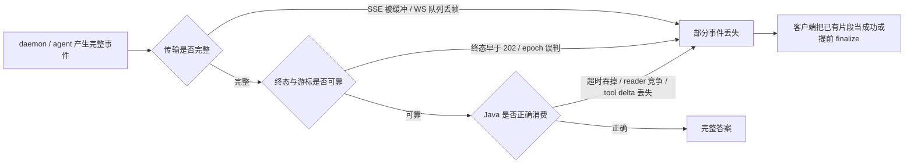

# daemon / SDK 可靠性审计：流式完整性、终态与 Java 客户端

> 审计日期：2026-07-20 至 2026-07-21
>
> qwen-code 基线：[`24a1c20dc85d9676e3275f4d304f8dd886b735b9`](https://github.com/QwenLM/qwen-code/commit/24a1c20dc85d9676e3275f4d304f8dd886b735b9)
>
> 审计范围：daemon REST/SSE、ACP bridge、TypeScript daemon transports、WebUI/IDE/TUI 消费者、`packages/sdk-java/qwencode`、`packages/sdk-java/client`
>
> 行号说明：本文代码行号仅锚定上述基线；后续提交可能导致行号漂移，应同时按文件名和符号定位。

---

## 0. 结论

审计没有发现 P0，但确认了多项未修复的 P1/P2。Java 侧经过 8 轮审计、TypeScript/daemon 侧经过 7 轮审计；两侧最后一轮均未再发现新的、证据充分的 P0/P1/P2，问题集合在当前范围内收敛。

这批问题中存在多条能够独立造成“流式输出只剩前半段、卡片提前结束或调用永久等待”的路径：

1. 旧 Java SDK 吞掉异常和超时，仍把已收集片段作为成功结果返回。
2. REST SSE 未禁止内容编码，也没有 body inactivity watchdog，代理缓冲后可能只交付首段。
3. WebSocket 慢消费者队列满时静默删除最老事件，且该 transport 不支持 replay。
4. prompt 正式终态可能早于 HTTP 202，被高层 SDK 在 waiter 注册前丢弃。
5. daemon 的 deadline、排队 prompt 定向取消和最后客户端 detach 路径不保证正式终态。
6. daemon 重启只靠数值游标猜测 epoch，特定时序下会把旧游标误认为当前 epoch。

因此，新增 Java `DaemonSessionClient` 是必要工作，但不是充分修复。Java SDK 能负责 HTTP/SSE、`Accept-Encoding: identity`、`Last-Event-ID`、重连和去重；它无法补回 daemon 从未发布的终态、错误 epoch 下跳过的事件，或已被 daemon 提前关闭的 session。

### 严重级别

| 级别 | 本文口径 |
|---|---|
| P0 | 当前基线下可直接导致安全边界突破、广泛数据损坏或主路径完全不可用；本轮未确认。 |
| P1 | 可在正常或合理失败条件下造成输出缺失、永久等待、错误取消、协议死锁或资源所有权错误，必须在正式 Java daemon SDK 前处理。 |
| P2 | 兼容性、资源回收、诊断或边缘协议问题；不阻塞契约设计，但应纳入后续修复。 |

---

## 1. 与“输出少内容”的因果关系

截图现象并不能只归因于某一层。最短的 Java 单侧路径是：回调或 JSON 解析异常 → `runAndWait` 吞异常 → `simpleQuery` 无条件返回已有 list → 上层卡片以部分内容完成。即使修复该路径，daemon/transport 的终态和重放缺口仍可产生相同表象。

---

## 2. Daemon 契约问题

### DAEMON-001：epoch 仅靠数值游标猜测

| 字段 | 内容 |
|---|---|
| 严重级别 | P1 |
| 触发条件 | daemon 重启后 event id 从 1 重新计数；客户端带旧 `Last-Event-ID` 重连，且新实例已产生足够多事件，使旧 cursor 小于新的 `nextId`。 |
| 用户影响 | `epoch_reset` 不触发；客户端混合旧、新两代 reducer 状态，并永久跳过新 epoch 前缀。 |
| 代码证据 | `packages/acp-bridge/src/eventBus.ts:576-636`，其中 `epochReset = lastEventId >= nextId` 位于约 L588。 |
| 责任侧 | daemon protocol。 |
| 最小修复 | 每个 session event stream 增加显式、不复用的 epoch token；cursor 持久化为 `(epoch,eventId)`，epoch 不同必须进入 snapshot/resync。 |

### DAEMON-002：已接受 prompt 缺少“恰好一个正式终态”保证

| 字段 | 内容 |
|---|---|
| 严重级别 | P1 |
| 触发条件 | deadline、queued remove、session close、transport close 等非正常完成路径。 |
| 用户影响 | 已返回 202 的 prompt 可能永远没有 `turn_complete` 或 `turn_error`；可靠客户端只能永久等待或自行猜测超时。 |
| 代码证据 | `packages/acp-bridge/src/bridge.ts:4963-5085`；不同失败路径对 AbortError、channel close 和结果采用不同终结方式。 |
| 责任侧 | daemon bridge。 |
| 最小修复 | admission 后创建 prompt terminal state machine；每个 `promptId` 只能从 accepted 转到 completed/error/cancelled/deadline 一次，并在 session close 前发布或持久化终态。 |

### DAEMON-003：`prompt_absolute_deadline` 不是绝对 deadline

| 字段 | 内容 |
|---|---|
| 严重级别 | P1 |
| 触发条件 | agent/channel 保持存活但不配合 cancel。 |
| 用户影响 | deadline 只发出取消请求，prompt 仍可无限占住 FIFO，后续队列全部阻塞；也无法保证文档承诺的 deadline error terminal。 |
| 代码证据 | `packages/cli/src/serve/routes/session.ts:2223-2235` 只 abort signal；`packages/acp-bridge/src/bridge.ts:4963-4983` 的实际 race 不包含 deadline；L4971 附近 FIXME 已承认该限制。 |
| 责任侧 | daemon route + bridge。 |
| 最小修复 | 将 deadline promise 纳入执行 race；超时后立即完成 prompt terminal，再异步 best-effort 取消/回收不协作 agent。能力标签只能在该语义成立后广告。 |

### DAEMON-004：按 promptId 删除排队 prompt 不产生 prompt terminal

| 字段 | 内容 |
|---|---|
| 严重级别 | P1 |
| 触发条件 | B 已被 202 接受并排在 A 后面，调用 `removePendingPrompt(B)`。 |
| 用户影响 | daemon 只发 `pending_prompt_completed{state:'removed'}`；等待 `turn_complete/turn_error` 的 `prompt()` 永久悬挂。 |
| 代码证据 | `packages/acp-bridge/src/bridge.ts:6725-6762` 删除队列项；L4801-L4806 抛 AbortError；L5076-L5078 忽略 AbortError terminal。 |
| 责任侧 | daemon bridge。 |
| 最小修复 | targeted remove 成功必须原子发布 `prompt_terminal{promptId,status:'cancelled'}`；队列 UI 事件可以保留，但不能替代 prompt terminal。 |

### DAEMON-005：最后 detach 与 pending queue 的关闭竞态

| 字段 | 内容 |
|---|---|
| 严重级别 | P1 |
| 触发条件 | A active、B queued，最后客户端 detach；A 的 ACP promise 随后 settle。 |
| 用户影响 | session 在 A 正式终态发布前被关闭，B 也被丢弃；两个已接受 prompt 都可能缺终态。 |
| 代码证据 | `packages/acp-bridge/src/bridge.ts:7592-7604` 在 active 时延迟关闭；L4936-L4960 的 finally 只看客户端/订阅者，不看 pendingPromptCount；terminal 在 L5066 后才广播。 |
| 责任侧 | daemon session lifecycle。 |
| 最小修复 | session close 条件同时覆盖 active、queued、terminal flush；无客户端时可进入 draining，但不能丢已接受工作。 |

### DAEMON-006：detach 不是幂等操作

| 字段 | 内容 |
|---|---|
| 严重级别 | P1 |
| 触发条件 | 网络重试导致相同 clientId 重复 detach，或传入未知 clientId。 |
| 用户影响 | 全局 attachCount 仍被递减，可能在其他 client 仍注册时提前杀死 session。 |
| 代码证据 | `packages/acp-bridge/src/bridge.ts:7562-7591`；unregister unknown client 为 no-op，但 attachCount 仍减少。 |
| 责任侧 | daemon lifecycle。 |
| 最小修复 | 以 client registration 为 source of truth；只有确实移除一次引用时才改变计数，重复 detach 返回相同成功结果。 |

### DAEMON-007：snapshot/compaction 丢失关联字段

| 字段 | 内容 |
|---|---|
| 严重级别 | P2 |
| 触发条件 | live `session_update` 经 compaction 后用于 load/resync。 |
| 用户影响 | 重建事件缺少 `sessionId`、`promptId`、`originatorClientId`，客户端无法可靠恢复 turn 归属和多客户端 originator 语义。 |
| 代码证据 | `packages/acp-bridge/src/bridgeClient.ts:775-845` 的 live envelope；`compactionEngine.ts:314-379,527-546,603-640` 的存储与重建未保留相同字段。 |
| 责任侧 | daemon compaction/snapshot。 |
| 最小修复 | compaction slot 保存并校验全部 correlation fields；跨 prompt/originator 不允许合并。 |

### DAEMON-008：compaction ingest 失败被静默吞掉

| 字段 | 内容 |
|---|---|
| 严重级别 | P2 |
| 触发条件 | compaction engine 在 publish 时抛异常。 |
| 用户影响 | ring 继续增长而 snapshot 静默落后；如果 snapshot 被当作权威恢复源，重连后出现不可解释缺口。 |
| 代码证据 | `packages/acp-bridge/src/eventBus.ts:353-359`。 |
| 责任侧 | EventBus/compaction。 |
| 最小修复 | 标记 snapshot degraded 并暴露诊断；恢复时拒绝使用已知不完整 snapshot 或退回持久 transcript。 |

### DAEMON-009：长时间未结束的 turn 可造成 live journal 无界增长

| 字段 | 内容 |
|---|---|
| 严重级别 | P2 |
| 触发条件 | prompt 长时间不结束并持续产生 text/tool updates。 |
| 用户影响 | heap 与 snapshot 构建成本随单个 turn 无界增长。 |
| 代码证据 | `packages/acp-bridge/src/compactionEngine.ts:120,141-161`；cap 主要在 turn boundary 的 L426-L456 执行。 |
| 责任侧 | compaction。 |
| 最小修复 | 对 in-flight journal 实施字节和事件上限；超过上限生成明确 truncation/degraded marker。 |

### DAEMON-010：关闭未启动订阅者时可能保留 listener/queue

| 字段 | 内容 |
|---|---|
| 严重级别 | P2 |
| 触发条件 | 创建 subscriber 后从未开始迭代，随后 EventBus close。 |
| 用户影响 | AbortSignal listener、queue 与 bus closure 的引用可能被长时间保留。 |
| 代码证据 | `packages/acp-bridge/src/eventBus.ts:696-727,747-753,910-940`。 |
| 责任侧 | EventBus lifecycle。 |
| 最小修复 | `close()` 对每个 subscriber 调统一 dispose，而不是只 close queue/clear set。 |

### DAEMON-011：异常序列化与 replay 可绕过事件字节预算

| 字段 | 内容 |
|---|---|
| 严重级别 | P2 |
| 触发条件 | BridgeEvent 无法 JSON stringify，或断线客户端重放大量 retained frames。 |
| 用户影响 | 序列化失败时 byte length 被记为 0，从而绕过 live byte cap；replay 使用 force-push 不计入 live cap，大 backlog 可制造瞬时内存峰值。 |
| 代码证据 | `packages/acp-bridge/src/eventBus.ts:141-149,637-655`。 |
| 责任侧 | EventBus sizing/replay。 |
| 最小修复 | 序列化失败必须拒绝 publish 并记录诊断；replay 需要独立的总字节预算和明确 truncation/resync 语义。 |

---

## 3. TypeScript transport 与高层 SDK 问题

### TRANSPORT-001：SSE 未强制 identity，也缺 body inactivity watchdog

| 字段 | 内容 |
|---|---|
| 严重级别 | P1 |
| 触发条件 | 反向代理/CDN 对 `text/event-stream` 压缩或缓冲，或者响应头成功后 body 永久静默。 |
| 用户影响 | 客户端可能只收到首段或永远等待下一帧。 |
| 代码证据 | `packages/sdk-typescript/src/daemon/RestSseTransport.ts:95-139,165-185`；ACP HTTP 三条 SSE 路径同样未设置 identity。 |
| 责任侧 | SDK transport。 |
| 最小修复 | 所有 SSE GET 设置 `Accept-Encoding: identity`；分别设置 connect timeout 与可配置 inactivity watchdog。 |

### TRANSPORT-002：prompt terminal 可能早于 202 waiter 注册

| 字段 | 内容 |
|---|---|
| 严重级别 | P1 |
| 触发条件 | 已打开 SSE，daemon 很快执行 prompt 并先发 terminal，HTTP POST 的 202 稍后才恢复调用栈。 |
| 用户影响 | `_dispatchTurnEvent` 找不到 pending waiter 并丢弃 terminal；`prompt()` 永久等待。 |
| 代码证据 | `packages/sdk-typescript/src/daemon/DaemonSessionClient.ts:293-337,742-768`。 |
| 责任侧 | TypeScript high-level SDK；daemon terminal replay 可提供第二层保障。 |
| 最小修复 | 在 202 前可按 client request id 预注册，或缓存有限数量 unmatched terminals，拿到 promptId 后再原子绑定。 |

### TRANSPORT-003：畸形 SSE 帧被跳过后仍可推进后续 cursor

| 字段 | 内容 |
|---|---|
| 严重级别 | P1 |
| 触发条件 | 第 N 帧 JSON/schema/id 畸形，第 N+1 帧合法。 |
| 用户影响 | N 被静默丢弃，客户端记录 N+1 cursor，后续 replay 永远补不回 N。 |
| 代码证据 | `packages/sdk-typescript/src/daemon/sse.ts:233-298`；`packages/sdk-typescript/src/daemon/DaemonSessionClient.ts:742-752`。ACP HTTP parser 有同类 drop 行为。 |
| 责任侧 | SDK parser。 |
| 最小修复 | 有 id 的畸形帧必须终止流并触发 resync；不得跨过未解释的 cursor gap。 |

### TRANSPORT-004：AutoReconnect 可重复 mutation，且使用陈旧 cursor

| 字段 | 内容 |
|---|---|
| 严重级别 | P1 |
| 触发条件 | POST 已在服务端生效但响应丢失；或 event stream 已消费若干帧后断开。 |
| 用户影响 | prompt/其他 mutation 被重复执行；重连使用初始 `lastEventId`，重复重放整个 suffix。`supportsReplay` 又在构造时冻结，替换 inner transport 后能力可能失真。 |
| 代码证据 | `packages/sdk-typescript/src/daemon/AutoReconnectTransport.ts:54,77,88-118`。 |
| 责任侧 | SDK reconnect layer。 |
| 最小修复 | 只自动重试幂等请求，mutation 依赖 idempotency key；stream wrapper 在每个已交付事件后更新 reconnect cursor。 |

### TRANSPORT-005：Abort 排队 prompt 会取消错误的 active prompt

| 字段 | 内容 |
|---|---|
| 严重级别 | P1 |
| 触发条件 | A active、B queued，B 的调用方 abort。 |
| 用户影响 | 高层 SDK 调 session-wide `/cancel`，实际取消 A；B 仍可能继续执行。 |
| 代码证据 | `packages/sdk-typescript/src/daemon/DaemonSessionClient.ts:315-323`；daemon session cancel 语义见 `packages/acp-bridge/src/bridge.ts:5193-5203`。 |
| 责任侧 | SDK + daemon targeted cancel contract。 |
| 最小修复 | prompt handle 的 cancel 必须携带 promptId；queued remove 与 active cancel 返回统一 terminal。 |

### TRANSPORT-006：低层 prompt abort 不可靠地发送 cancel

| 字段 | 内容 |
|---|---|
| 严重级别 | P1 |
| 触发条件 | 调用 `DaemonClient.prompt(..., signal)` 并 abort SSE generator。 |
| 用户影响 | generator 以正常 return 结束，等待层得到普通 “SSE stream ended” 而不是 AbortError，因此不进入 cancel 分支；服务端 prompt 继续运行。 |
| 代码证据 | `packages/sdk-typescript/src/daemon/sse.ts:105-125`；`packages/sdk-typescript/src/daemon/DaemonClient.ts:3582-3600`。 |
| 责任侧 | low-level SDK。 |
| 最小修复 | abort 原因必须透传；高层在 promptId 已知时 best-effort targeted cancel，并保留原始 AbortError。 |

### TRANSPORT-007：AcpHttpTransport.dispose 无法终止 session SSE

| 字段 | 内容 |
|---|---|
| 严重级别 | P1 |
| 触发条件 | `subscribeEvents(sessionId)` 未传 caller signal，流空闲时 dispose transport。 |
| 用户影响 | session socket/generator 和 active counter 不退出，旧 transport 可与新 transport 同时消费。 |
| 代码证据 | `packages/sdk-typescript/src/daemon/AcpHttpTransport.ts:302-367,401-430,483-516,646-665`。 |
| 责任侧 | ACP HTTP transport。 |
| 最小修复 | transport 保存所有 subscription AbortController；dispose 原子 abort 并等待 pump settle。 |

### TRANSPORT-008：初始化可在 dispose 后复活 transport

| 字段 | 内容 |
|---|---|
| 严重级别 | P1 |
| 触发条件 | initialize POST 挂起时调用 dispose，随后 initialize 返回。 |
| 用户影响 | 原 fetch 在 dispose 完成后继续注册 pending、重新打开 SSE，甚至发出 mutation；第二次 dispose 因幂等早退无法清理。 |
| 代码证据 | `packages/sdk-typescript/src/daemon/AcpHttpTransport.ts:219-227,646-665,685-734,940-1072`。 |
| 责任侧 | ACP HTTP transport。 |
| 最小修复 | lifecycle generation/fence；initialize 必须受 dispose signal 控制，完成后再次检查 generation。 |

### TRANSPORT-009：WebSocket 慢消费者静默丢事件

| 字段 | 内容 |
|---|---|
| 严重级别 | P1 |
| 触发条件 | 单 consumer 暂停，队列累计超过 256 个事件。 |
| 用户影响 | transport 无条件删除最老事件，不发 overflow/resync/error；文本、tool 或 terminal 永久缺失。协商又优先选择 WS。 |
| 代码证据 | `packages/sdk-typescript/src/daemon/AcpWsTransport.ts:54-55,110-112,248-273`；`negotiateTransport.ts:26-34,89-110`。 |
| 责任侧 | ACP WS transport。 |
| 最小修复 | 提供反压，或溢出时明确终止并要求 snapshot；在没有 replay 前禁止 silent drop-oldest。 |

### TRANSPORT-010：WS 尚未 open 时 dispose 可永久挂起连接

| 字段 | 内容 |
|---|---|
| 严重级别 | P1 |
| 触发条件 | `connect()/ensureConnected()` 等待 WebSocket open 时调用 dispose。 |
| 用户影响 | onclose 清掉 init timer，却因 `_disposed` 跳过 reject；原 promise 永不 settle。相反竞态还可能在 dispose 后发送 initialize。 |
| 代码证据 | `packages/sdk-typescript/src/daemon/AcpWsTransport.ts:335-359,380-439,494-518`。 |
| 责任侧 | ACP WS transport。 |
| 最小修复 | dispose 必须 reject connect promise；onopen/onmessage 全部检查 lifecycle generation。 |

### TRANSPORT-011：clientId self-heal 可重复 reattach

| 字段 | 内容 |
|---|---|
| 严重级别 | P1 |
| 触发条件 | 旧 generation 的 400 响应延迟到第一次 reattach 已完成之后。 |
| 用户影响 | 又触发一次 resume 并颁发新 clientId，前一个新 id 成为服务端孤儿注册。 |
| 代码证据 | `packages/sdk-typescript/src/daemon/DaemonSessionClient.ts:379-409`。现有测试只覆盖同时到达的错误。 |
| 责任侧 | high-level SDK + idempotent attach contract。 |
| 最小修复 | 错误关联 client generation；只允许当前 generation 触发 self-heal，并主动 detach superseded id。 |

### TRANSPORT-012：浏览器 WS 未使用 daemon 支持的 bearer subprotocol

| 字段 | 内容 |
|---|---|
| 严重级别 | P2 |
| 触发条件 | browser direct WS client 连接启用 token 的 daemon。 |
| 用户影响 | 即使 SDK 配置 token 也会裸连并得到 401，协商先等待 WS 失败后才 fallback。 |
| 代码证据 | `packages/sdk-typescript/src/daemon/AcpWsTransport.ts:72-78,380-403`；服务端支持 `qwen-bearer.<base64url(token)>`。 |
| 责任侧 | browser WS transport。 |
| 最小修复 | 使用服务端已实现的非回显 bearer subprotocol。 |

### TRANSPORT-013：ACP HTTP cancel 将非 2xx 伪装成成功

| 字段 | 内容 |
|---|---|
| 严重级别 | P2 |
| 触发条件 | `/session/:id/cancel` 返回 401/403/429/5xx。 |
| 用户影响 | notification 路径固定合成 204，调用方认为取消成功而 daemon 继续运行。 |
| 代码证据 | `packages/sdk-typescript/src/daemon/acpRouteTable.ts:125-133`；`packages/sdk-typescript/src/daemon/AcpHttpTransport.ts:254-264,940-969`；`packages/sdk-typescript/src/daemon/DaemonClient.ts:3635-3655`。 |
| 责任侧 | ACP HTTP transport。 |
| 最小修复 | JSON-RPC notification 无 reply 不等于忽略 HTTP failure；非 2xx 必须抛结构化错误。 |

### TRANSPORT-014：frame size、cursor 与 reconnect cleanup 的边界不一致

| 字段 | 内容 |
|---|---|
| 严重级别 | P2 |
| 触发条件 | 一个网络 chunk 含多条小帧但总计超过 16 MiB；consumer 在 yield 后 break；cursor 超出 JS safe integer；dispose 与 async factory 竞态。 |
| 用户影响 | 合法流被误拒、重连重复一帧、server 将 unsafe cursor 当首次订阅、dispose 后泄漏新 inner transport。 |
| 代码证据 | `packages/sdk-typescript/src/daemon/sse.ts:153-168`；`packages/sdk-typescript/src/daemon/DaemonSessionClient.ts:746-752,785-797`；`packages/sdk-typescript/src/daemon/AutoReconnectTransport.ts:124-162`。 |
| 责任侧 | SDK transport utilities。 |
| 最小修复 | 切帧后逐帧限长；定义明确的 at-least-once cursor 更新点；统一 `Number.isSafeInteger`；factory 完成时检查 disposed generation。 |

### TRANSPORT-015：HTTP 错误丢失 Retry-After

| 字段 | 内容 |
|---|---|
| 严重级别 | P2 |
| 触发条件 | daemon 对 draining、容量、busy、subscriber limit 返回带 `Retry-After` 的 429/503。 |
| 用户影响 | SDK 只保留 status/body，重连层无法遵守服务端退避，可能形成紧密重试。 |
| 代码证据 | `packages/sdk-typescript/src/daemon/DaemonHttpError.ts:16-24`；`packages/sdk-typescript/src/daemon/DaemonClient.ts:718-769`；`packages/sdk-typescript/src/daemon/RestSseTransport.ts:141-162`。 |
| 责任侧 | SDK HTTP error abstraction。 |
| 最小修复 | 保存有限、标准化的 response headers，至少公开 `retryAfterMs`。 |

### TRANSPORT-016：错误响应 body 读取没有上限

| 字段 | 内容 |
|---|---|
| 严重级别 | P2 |
| 触发条件 | SSE endpoint 或中间代理返回巨大非 2xx body。 |
| 用户影响 | 客户端在构造错误前调用 `res.text()` 读取完整 body，放大不可信错误响应的内存占用。 |
| 代码证据 | `packages/sdk-typescript/src/daemon/RestSseTransport.ts:141-153`。 |
| 责任侧 | REST transport。 |
| 最小修复 | 按有限字节读取并截断错误摘要，保留 status、content-type 与 Retry-After。 |

---

## 4. WebUI、IDE 与 TUI 消费问题

### CONSUMER-001：WebUI 可用其他 prompt 的 terminal 完成本地 prompt

| 字段 | 内容 |
|---|---|
| 严重级别 | P1 |
| 触发条件 | 本地 placeholder 尚未绑定 promptId，peer prompt terminal 先到。 |
| 用户影响 | matcher 接受任意 terminal，提前移除本地 active；本地 202 返回后无法再找到自己的 settlement。 |
| 代码证据 | `packages/webui/src/daemon/session/actions.ts:293-295,1288-1353`；`packages/webui/src/daemon/session/DaemonSessionProvider.tsx:2357-2395`。 |
| 责任侧 | WebUI prompt state machine；协议可提供 client request id。 |
| 最小修复 | 未绑定 promptId 前只接受同一 client request correlation 的 terminal；peer terminal 只更新 peer turn。 |

### CONSUMER-002：把 advisory `prompt_cancelled` 当正式终态

| 字段 | 内容 |
|---|---|
| 严重级别 | P1 |
| 触发条件 | daemon 收到 cancel request 后、agent 真正停止前广播 `prompt_cancelled`。 |
| 用户影响 | WebUI 立即 assistant.done、清 active、置 idle；后续文本或正式 terminal 被当作尾随事件，表现为截断。 |
| 代码证据 | `packages/webui/src/daemon/session/DaemonSessionProvider.tsx:1433-1451`；daemon 语义见 `packages/acp-bridge/src/bridge.ts:919-924,5160-5166`。 |
| 责任侧 | WebUI + daemon event naming。 |
| 最小修复 | 保持 `prompt_cancel_requested` 为 advisory；只有正式 prompt terminal 才结束 UI turn。 |

### CONSUMER-003：WebUI resync 通过 load 泄漏 attach/client 引用

| 字段 | 内容 |
|---|---|
| 严重级别 | P1 |
| 触发条件 | epoch/ring resync，多次调用 load 同一 session。 |
| 用户影响 | 每次 load 增加 attach/client refs，最终 cleanup 只 detach 一次；session 长期无法自然回收。 |
| 代码证据 | `packages/webui/src/daemon/session/DaemonSessionProvider.tsx:803-815,1275-1279,1548-1551,1872-1880`；`packages/acp-bridge/src/bridge.ts:1785-1797,3815-3818`。 |
| 责任侧 | snapshot API + WebUI lifecycle。 |
| 最小修复 | 提供无 attach 副作用的 snapshot/resync endpoint；provider 不用 load 做纯状态恢复。 |

### CONSUMER-004：IDE/TUI 忽略 resync 但继续推进 cursor

| 字段 | 内容 |
|---|---|
| 严重级别 | P1 |
| 触发条件 | 收到 `state_resync_required`。 |
| 用户影响 | consumer 保留不完整 state 并越过缺口，之后没有自动恢复机会。 |
| 代码证据 | `packages/vscode-ide-companion/src/services/daemonIdeConnection.ts:333-393`；`packages/cli/src/ui/daemon/daemon-tui-adapter.ts:629-631,794-821`。 |
| 责任侧 | IDE/TUI adapters。 |
| 最小修复 | resync 进入阻断状态，获取 snapshot 后原子替换 reducer，再从 snapshot cursor 恢复。 |

### CONSUMER-005：VSCode daemon connection 从不 detach/dispose

| 字段 | 内容 |
|---|---|
| 严重级别 | P1 |
| 触发条件 | companion disconnect/reconnect。 |
| 用户影响 | 本地只 abort event pump 并清引用；daemon client registration 和 attach 引用残留。 |
| 代码证据 | `packages/vscode-ide-companion/src/services/daemonIdeConnection.ts:44-64,145-159,280-296`。 |
| 责任侧 | IDE connection ownership。 |
| 最小修复 | connection object 显式拥有 DaemonClient/SessionClient，并在 disconnect 中按顺序 abort、detach、dispose。 |

### CONSUMER-006：所有 403 被误判为凭证失效

| 字段 | 内容 |
|---|---|
| 严重级别 | P2 |
| 触发条件 | session SSE 因 secondary workspace 未 trust 返回 403 `untrusted_workspace`。 |
| 用户影响 | WebUI 清 session、停止重连并显示 auth error；用户修复 trust 后也不会自动恢复。 |
| 代码证据 | `packages/webui/src/daemon/session/DaemonSessionProvider.tsx:218-233,1692-1745,1976-2027`；服务端 trust 拒绝路径在 `packages/cli/src/serve/routes/sse-events.ts` 与 `packages/cli/src/serve/workspace-route-runtime.ts`。 |
| 责任侧 | WebUI error taxonomy。 |
| 最小修复 | 优先按结构化 error code 分类，只有明确 auth code 才停止认证重连。 |

### CONSUMER-007：channel 自动重连文档与实现不一致

| 字段 | 内容 |
|---|---|
| 严重级别 | P2 |
| 触发条件 | daemon channel session event stream 正常结束或抛错。 |
| 用户影响 | 文档声称每个 active session 自动重连，但 bridge pump 结束后直接移除 session，不会重新订阅；运维人员可能误判恢复能力。 |
| 代码证据 | daemon channel 文档中的自动重连说明；`packages/channels/base/src/DaemonChannelBridge.ts:545-570` 的 pump lifecycle。 |
| 责任侧 | channel adapter + 文档。 |
| 最小修复 | 明确选择：实现基于最新 cursor 的自动重连，或修正文档并把 stream end 暴露为 terminal failure。 |

---

## 5. 旧 Java `qwencode` SDK 问题

### JAVA-QWENCODE-001：异常和超时被伪装成部分成功

| 字段 | 内容 |
|---|---|
| 严重级别 | P1 |
| 触发条件 | initialize、JSON parse、callback、turn 等任一环节异常或超时。 |
| 用户影响 | `simpleQuery` 无条件返回已收集 list；调用方只看到空结果或截短结果，不会收到失败。 |
| 代码证据 | `packages/sdk-java/qwencode/src/main/java/com/alibaba/qwen/code/cli/QwenCodeCli.java:53-85`；`packages/sdk-java/qwencode/src/main/java/com/alibaba/qwen/code/cli/utils/MyConcurrentUtils.java:27-46`；`packages/sdk-java/qwencode/src/main/java/com/alibaba/qwen/code/cli/transport/process/ProcessTransport.java:176-180`。 |
| 责任侧 | Java legacy SDK。 |
| 最小修复 | 所有 timeout/interruption/execution error 以 checked/typed exception 传播；恢复 interrupt flag；只有收到正式 result 才成功返回。 |

### JAVA-QWENCODE-002：超时后遗留 stdout orphan reader

| 字段 | 内容 |
|---|---|
| 严重级别 | P1 |
| 触发条件 | 阻塞 `readLine()` 超时后调用 `CompletableFuture.cancel(true)`。 |
| 用户影响 | running stage 不一定被中断；下一 prompt 启动第二 reader，旧 reader 可抢走响应并造成串轮。 |
| 代码证据 | `packages/sdk-java/qwencode/src/main/java/com/alibaba/qwen/code/cli/transport/process/ProcessTransport.java:213-230`；`packages/sdk-java/qwencode/src/main/java/com/alibaba/qwen/code/cli/utils/MyConcurrentUtils.java:40-44`。 |
| 责任侧 | Java process transport。 |
| 最小修复 | 单一专用 reader loop + request dispatcher；禁止每个 prompt 启动 reader，close process/stream 才能终止阻塞读取。 |

### JAVA-QWENCODE-003：共享线程池嵌套等待导致确定性饥饿

| 字段 | 内容 |
|---|---|
| 严重级别 | P1 |
| 触发条件 | 约 8 个并发 `simpleQuery` 同步进入 assistant/content 回调链。 |
| 用户影响 | 30 个 core worker 全部等待下一层同池任务，最内层 callback 排队并最终超时丢失。 |
| 代码证据 | `packages/sdk-java/qwencode/src/main/java/com/alibaba/qwen/code/cli/QwenCodeCli.java:55` → `packages/sdk-java/qwencode/src/main/java/com/alibaba/qwen/code/cli/transport/process/ProcessTransport.java:179,216` → `packages/sdk-java/qwencode/src/main/java/com/alibaba/qwen/code/cli/session/Session.java:207` → `packages/sdk-java/qwencode/src/main/java/com/alibaba/qwen/code/cli/session/event/consumers/SessionEventSimpleConsumers.java:99`；`packages/sdk-java/qwencode/src/main/java/com/alibaba/qwen/code/cli/utils/ThreadPoolConfig.java:19-33`。 |
| 责任侧 | Java concurrency model。 |
| 最小修复 | 去掉 submit-and-block 嵌套；reader 串行解码，callback 使用独立有界 executor 或直接调用。 |

### JAVA-QWENCODE-004：canonical result 丢失，error result 被当完成

| 字段 | 内容 |
|---|---|
| 严重级别 | P1 |
| 触发条件 | CLI 用 final result 补齐流式 chunk，或返回 `is_error=true`。 |
| 用户影响 | Java DTO 没有 `result` 字段；任何 result 都触发默认 no-op callback 并结束，错误不可见。 |
| 代码证据 | `packages/sdk-java/qwencode/src/main/java/com/alibaba/qwen/code/cli/protocol/protocol.ts:136-149`；`packages/sdk-java/qwencode/src/main/java/com/alibaba/qwen/code/cli/protocol/message/SDKResultMessage.java:18-75`；`packages/sdk-java/qwencode/src/main/java/com/alibaba/qwen/code/cli/session/Session.java:223-227`。 |
| 责任侧 | Java protocol model/session。 |
| 最小修复 | DTO 完整映射 result/error/subtype；success、cancel、execution error 使用不同 typed outcome。 |

### JAVA-QWENCODE-005：同一 Session 并发 prompt 会启动多个 reader

| 字段 | 内容 |
|---|---|
| 严重级别 | P1 |
| 触发条件 | 两个线程同时调用同一 `Session.sendPrompt`。 |
| 用户影响 | 响应没有 prompt/request dispatcher，任意 reader 可消费任意行；调用互相拆分内容或提前完成。 |
| 代码证据 | `packages/sdk-java/qwencode/src/main/java/com/alibaba/qwen/code/cli/session/Session.java:193`；`packages/sdk-java/qwencode/src/main/java/com/alibaba/qwen/code/cli/transport/process/ProcessTransport.java:172-180`。`reading` 只是状态，不是互斥。 |
| 责任侧 | Java session API。 |
| 最小修复 | 明确单-flight，或实现单 reader + request id/prompt id dispatcher。 |

### JAVA-QWENCODE-006：tool-use 在流式和非流式路径都丢内容

| 字段 | 内容 |
|---|---|
| 严重级别 | P1 |
| 触发条件 | assistant tool-use，尤其参数分成多个 `input_json_delta`。 |
| 用户影响 | 非流式输出恒为 `{}`；流式忽略 tool id/name，并把每段 partial JSON 当完整对象解析，异常随后被吞。 |
| 代码证据 | `packages/sdk-java/qwencode/src/main/java/com/alibaba/qwen/code/cli/protocol/message/assistant/block/ToolUseBlock.java:119-120`；`packages/sdk-java/qwencode/src/main/java/com/alibaba/qwen/code/cli/QwenCodeCli.java:67-68`；`packages/sdk-java/qwencode/src/main/java/com/alibaba/qwen/code/cli/session/event/consumers/SessionEventSimpleConsumers.java:79-89`；`packages/sdk-java/qwencode/src/main/java/com/alibaba/qwen/code/cli/protocol/message/assistant/event/ContentBlockDeltaEvent.java:219-222`。 |
| 责任侧 | Java protocol/event aggregation。 |
| 最小修复 | 按 content block index 聚合 start/delta/stop；stop 后一次解析完整 JSON，保留 tool id/name。 |

### JAVA-QWENCODE-007：resume 对存活进程无效

| 字段 | 内容 |
|---|---|
| 严重级别 | P1 |
| 触发条件 | transport 仍 available 时调用 `continueSession()` / `resumeSession(id)`。 |
| 用户影响 | options 被修改，但 `--resume` 只在创建新进程时应用；实际只是再次 initialize 当前进程。 |
| 代码证据 | `packages/sdk-java/qwencode/src/main/java/com/alibaba/qwen/code/cli/session/Session.java:81-89,178-183`；`packages/sdk-java/qwencode/src/main/java/com/alibaba/qwen/code/cli/transport/process/TransportOptionsAdapter.java:110-113`。 |
| 责任侧 | Java process lifecycle。 |
| 最小修复 | resume 必须新建带 resume 参数的 process，或使用协议内正式 resume request。 |

### JAVA-QWENCODE-008：控制响应不按 request_id 关联

| 字段 | 内容 |
|---|---|
| 严重级别 | P1 |
| 触发条件 | 两个控制调用重叠，或 stdout 中混有异步事件。 |
| 用户影响 | SDK 直接把下一行当响应，只检查 subtype；一个调用可消费另一个响应，旧响应再污染后续调用。 |
| 代码证据 | `packages/sdk-java/qwencode/src/main/java/com/alibaba/qwen/code/cli/session/Session.java:148-157`；请求/响应类型均已携带 id。 |
| 责任侧 | Java dispatcher。 |
| 最小修复 | 单 reader 按 `request_id` 完成 pending future；事件走独立 listener。 |

### JAVA-QWENCODE-009：默认线程池阻止 JVM 退出

| 字段 | 内容 |
|---|---|
| 严重级别 | P1 |
| 触发条件 | SDK 执行过任意异步读取或 callback，然后关闭 session/client。 |
| 用户影响 | 非 daemon core threads 不超时，模块无有效 shutdown；短命 Java 程序无法自然退出。 |
| 代码证据 | `packages/sdk-java/qwencode/src/main/java/com/alibaba/qwen/code/cli/utils/ThreadPoolConfig.java:19-29`；`packages/sdk-java/client/src/main/java/com/alibaba/acp/sdk/utils/ThreadPoolConfig.java:24-34`；`packages/sdk-java/client/src/main/java/com/alibaba/acp/sdk/AcpClient.java:168-173` 的 shutdown 仍被注释。 |
| 责任侧 | 两个 Java SDK。 |
| 最小修复 | client 显式拥有 executor 并在 close 关闭；共享 executor 需引用计数，或提供用户注入且明确 ownership。 |

### JAVA-QWENCODE-010：进程、字符集与测试基线存在兼容缺口

| 字段 | 内容 |
|---|---|
| 严重级别 | P2 |
| 触发条件 | initialize 失败、非 UTF-8 默认 JVM、使用官方 executor 示例，或依赖现有测试发现截断。 |
| 用户影响 | 子进程泄漏；中文/JSON 损坏；示例强转抛异常后静默回退；测试只断言 non-null，空/截短结果仍通过。部分测试启动真实 qwen 且未关闭资源，POM 也未固定 Surefire，JUnit 5 discovery 依赖 Maven 环境。 |
| 代码证据 | `packages/sdk-java/qwencode/src/main/java/com/alibaba/qwen/code/cli/QwenCodeCli.java:126-139`；`packages/sdk-java/qwencode/src/main/java/com/alibaba/qwen/code/cli/transport/process/ProcessTransport.java:115-117`；`packages/sdk-java/qwencode/src/test/java/com/alibaba/qwen/code/cli/example/ThreadPoolConfigurationExample.java:25`；`packages/sdk-java/qwencode/src/test/java/com/alibaba/qwen/code/cli/QwenCodeCliTest.java:17-28`；`packages/sdk-java/qwencode/src/test/java/com/alibaba/qwen/code/cli/session/SessionTest.java:36-70`；`packages/sdk-java/qwencode/src/test/java/com/alibaba/qwen/code/cli/transport/process/ProcessTransportTest.java:60-112`；`packages/sdk-java/qwencode/pom.xml:69,76-162`。 |
| 责任侧 | Java legacy SDK/build tests。 |
| 最小修复 | 初始化失败立即 close；协议固定 UTF-8；修正 executor 类型；用 fake process/fixture 建立确定性 terminal、timeout、并发测试。 |

---

## 6. Java ACP SDK 问题

`packages/sdk-java/client` 是 ACP stdio client，不是 daemon REST/SSE client；它不能直接替代未来的 Java `DaemonSessionClient`，且自身存在以下协议问题。

### JAVA-ACP-001：cancel notification 缺少 sessionId

| 字段 | 内容 |
|---|---|
| 严重级别 | P1 |
| 触发条件 | 调用 `Session.cancel()`。 |
| 用户影响 | 使用无参 `CancelNotification`，必需的 `params.sessionId` 未设置；notification 基类还会生成 request id。严格 ACP agent 可拒绝或忽略该 wire。 |
| 代码证据 | `packages/sdk-java/client/src/main/java/com/alibaba/acp/sdk/session/Session.java:90-95`；`packages/sdk-java/client/src/main/java/com/alibaba/acp/sdk/protocol/client/notification/CancelNotification.java:5-31`；`packages/sdk-java/client/src/main/java/com/alibaba/acp/sdk/protocol/jsonrpc/MethodMessage.java:61-63`。 |
| 责任侧 | Java ACP session API。 |
| 最小修复 | 从 session state 构造带 sessionId 的 notification，并增加 wire fixture test。 |

### JAVA-ACP-002：缺省 handler 会造成 reverse request 死锁

| 字段 | 内容 |
|---|---|
| 严重级别 | P1 |
| 触发条件 | agent 发 permission、file 或 terminal request，而对应 consumer 为 null。 |
| 用户影响 | SDK 不回复任何 JSON-RPC response，agent 等待客户端，客户端又等待 prompt completion，双方死锁。 |
| 代码证据 | `packages/sdk-java/client/src/main/java/com/alibaba/acp/sdk/session/Session.java:136-183`；`packages/sdk-java/client/src/main/java/com/alibaba/acp/sdk/session/event/consumer/AgentEventConsumer.java:12-17` 默认全部为空。 |
| 责任侧 | Java ACP dispatcher。 |
| 最小修复 | 未注册 handler 时立即回复标准 MethodNotFound/RequestError；有 handler 时也必须设置 deadline。 |

### JAVA-ACP-003：loadSession 忽略服务端 error

| 字段 | 内容 |
|---|---|
| 严重级别 | P1 |
| 触发条件 | session 不存在、agent 不支持 load 或返回其他 JSON-RPC error。 |
| 用户影响 | SDK 无条件返回看似有效的 Session，错误延迟到下一 prompt。 |
| 代码证据 | `packages/sdk-java/client/src/main/java/com/alibaba/acp/sdk/AcpClient.java:151-165`；对比 `newSession()` 在 L127-L133 会检查 error。 |
| 责任侧 | Java ACP client。 |
| 最小修复 | 所有 response 统一检查 error/id/result，失败时抛 typed exception。 |

### JAVA-ACP-004：prompt JSON-RPC error 被转成超时

| 字段 | 内容 |
|---|---|
| 严重级别 | P1 |
| 触发条件 | `session/prompt` 返回 error response。 |
| 用户影响 | parser 转成普通 Response，主循环只记 unknown 并继续等待，最终表现为 transport timeout。 |
| 代码证据 | `packages/sdk-java/client/src/main/java/com/alibaba/acp/sdk/session/Session.java:124-186,199-212`。 |
| 责任侧 | Java ACP response dispatch。 |
| 最小修复 | response 首先按 request id 关联，再统一处理 error；错误立即结束对应 prompt。 |

### JAVA-ACP-005：tool-call callback 类型对包外不可读

| 字段 | 内容 |
|---|---|
| 严重级别 | P1 |
| 触发条件 | 包外用户收到 tool-call 或 tool-call-update wrapper。 |
| 用户影响 | `toolCallUpdate` 为包级字段且没有 getter，调用者无法读取 tool id、状态、输入和输出。 |
| 代码证据 | `packages/sdk-java/client/src/main/java/com/alibaba/acp/sdk/protocol/domain/session/update/ToolCallSessionUpdate.java:8-10`；`packages/sdk-java/client/src/main/java/com/alibaba/acp/sdk/protocol/domain/session/update/ToolCallUpdateSessionUpdate.java:8-10`；`packages/sdk-java/client/src/main/java/com/alibaba/acp/sdk/session/event/consumer/ContentEventConsumer.java:49-61`。 |
| 责任侧 | Java public model API。 |
| 最小修复 | 提供 immutable public getter/constructor，并做 source/binary compatibility review。 |

### JAVA-ACP-006：合法 user/thought update 被静默丢弃

| 字段 | 内容 |
|---|---|
| 严重级别 | P1 |
| 触发条件 | agent 发送 schema 合法的 `user_message_chunk` 或 `agent_thought_chunk`。 |
| 用户影响 | 多态表和 callback 分发均无对应类型；历史用户消息和思考流无法交付调用方。 |
| 代码证据 | `packages/sdk-java/client/src/main/java/com/alibaba/acp/sdk/protocol/schema.json:2280-2413`；`packages/sdk-java/client/src/main/java/com/alibaba/acp/sdk/protocol/domain/session/update/SessionUpdate.java:6-12`；`packages/sdk-java/client/src/main/java/com/alibaba/acp/sdk/session/Session.java:223-248`。 |
| 责任侧 | Java ACP protocol model。 |
| 最小修复 | 补齐 schema variant、consumer callback 与 round-trip fixtures；未知 variant 也应交给 raw listener。 |

### JAVA-ACP-007：loadSession 无法接收 ACP 规定的历史回放

| 字段 | 内容 |
|---|---|
| 严重级别 | P1 |
| 触发条件 | agent 在 load response 前或后以 notifications 流式回放历史。 |
| 用户影响 | API 没有 event consumer，只读 stdout 下一行且不按 id 匹配；notification 先到会被误解析，response 先到则历史残留并污染下一 prompt。 |
| 代码证据 | `packages/sdk-java/client/src/main/java/com/alibaba/acp/sdk/AcpClient.java:151-165`；`packages/sdk-java/client/src/main/java/com/alibaba/acp/sdk/utils/TransportUtils.java:35-36`；ACP schema 对 `session/load` 的历史回放要求。 |
| 责任侧 | Java ACP architecture。 |
| 最小修复 | 单 reader dispatcher；load 接收 history listener/collector，直到匹配 response 和明确 replay boundary。 |

### JAVA-ACP-008：高层 API 无法完成认证流程

| 字段 | 内容 |
|---|---|
| 严重级别 | P1 |
| 触发条件 | initialize 返回 `authMethods`，后续 session 请求返回 auth_required。 |
| 用户影响 | initialize response 只存在构造器局部变量；AcpClient 没有 authenticate API，调用方只能绕过高层 client 操作 transport。 |
| 代码证据 | `packages/sdk-java/client/src/main/java/com/alibaba/acp/sdk/AcpClient.java:74-88`；模块虽定义 AuthenticateRequest/Response，但无公共发送入口。 |
| 责任侧 | Java ACP public API。 |
| 最小修复 | 暴露 negotiated capabilities/auth methods，并提供 typed authenticate flow。 |

### JAVA-ACP-009：新建 session 后无法取得 sessionId

| 字段 | 内容 |
|---|---|
| 严重级别 | P1 |
| 触发条件 | 通过 `AcpClient.newSession()` 成功创建 session。 |
| 用户影响 | id 只写入 Session 的 private params，无 `getSessionId()`；无法持久化、记录或稍后 load。 |
| 代码证据 | `packages/sdk-java/client/src/main/java/com/alibaba/acp/sdk/AcpClient.java:135-140`；`packages/sdk-java/client/src/main/java/com/alibaba/acp/sdk/session/Session.java:67-81`。 |
| 责任侧 | Java ACP public API。 |
| 最小修复 | Session 公开 immutable sessionId；new/load 返回一致的 session descriptor。 |

### JAVA-ACP-010：Annotations audience wire 类型不兼容

| 字段 | 内容 |
|---|---|
| 严重级别 | P2 |
| 触发条件 | content block 携带 audience annotation。 |
| 用户影响 | schema 要求 `audience:["user"]`，Java 使用 `List<Role>` 对象并序列化成 `[{"role":"user"}]`，严格 agent 拒绝整次 prompt。 |
| 代码证据 | `packages/sdk-java/client/src/main/java/com/alibaba/acp/sdk/protocol/schema.json:2157-2161`；`packages/sdk-java/client/src/main/java/com/alibaba/acp/sdk/protocol/domain/content/block/Annotations.java:8,38-51`。 |
| 责任侧 | Java ACP wire model。 |
| 最小修复 | 使用字符串 enum 或自定义 serializer，并加入 schema fixture。 |

### JAVA-ACP-011：session mode 功能在高层 API 不可达

| 字段 | 内容 |
|---|---|
| 严重级别 | P2 |
| 触发条件 | agent 在 new/load response 公布 available/current modes。 |
| 用户影响 | AcpClient 创建 Session 时丢弃 modes；虽定义 SetSessionModeRequest，但没有公共发送方法。 |
| 代码证据 | `packages/sdk-java/client/src/main/java/com/alibaba/acp/sdk/protocol/agent/response/NewSessionResponse.java:9-27`；`packages/sdk-java/client/src/main/java/com/alibaba/acp/sdk/protocol/agent/response/LoadSessionResponse.java:9-18`；`packages/sdk-java/client/src/main/java/com/alibaba/acp/sdk/AcpClient.java:127-165`。 |
| 责任侧 | Java ACP public API。 |
| 最小修复 | Session 保存 modes，并提供 typed `setMode`，按能力协商拒绝不支持模式。 |

### JAVA-ACP-012：ProcessTransport close/exit 后不能 restart

| 字段 | 内容 |
|---|---|
| 严重级别 | P2 |
| 触发条件 | 子进程异常退出或显式 close，随后调用 start。 |
| 用户影响 | start 只检查 `process != null`，close 不清字段；后续 start 静默 no-op，transport 永久 unavailable。 |
| 代码证据 | `packages/sdk-java/client/src/main/java/com/alibaba/acp/sdk/transport/process/ProcessTransport.java:82-85,104-120`。 |
| 责任侧 | Java ACP transport。 |
| 最小修复 | 明确 single-use 或实现原子 lifecycle；close 清理 process/streams，start 检查 isAlive。 |

### JAVA-ACP-013：AgentCapabilities MCP 字段与 schema 错位

| 字段 | 内容 |
|---|---|
| 严重级别 | P2 |
| 触发条件 | initialize response 包含 `mcpCapabilities:{http:true,sse:true}`。 |
| 用户影响 | Java 外层字段命名为 `mcp`，内部 HTTP 又命名为 `mcp`；合法响应不能正确反序列化，反向序列化也生成非法 wire。 |
| 代码证据 | `packages/sdk-java/client/src/main/java/com/alibaba/acp/sdk/protocol/schema.json:16-25,1461-1478`；`packages/sdk-java/client/src/main/java/com/alibaba/acp/sdk/protocol/domain/agent/AgentCapabilities.java:11-14,149-187`。 |
| 责任侧 | Java ACP wire model。 |
| 最小修复 | 用 `@JSONField(name=...)` 对齐 `mcpCapabilities/http/sse`，加入双向 schema fixture。 |

### JAVA-ACP-014：Windows 文件读取使用路径分隔符代替换行

| 字段 | 内容 |
|---|---|
| 严重级别 | P2 |
| 触发条件 | Windows 上默认 file consumer 读取多行文件。 |
| 用户影响 | `File.separator` 为反斜杠，文件内容被反斜杠连接并静默损坏。 |
| 代码证据 | `packages/sdk-java/client/src/main/java/com/alibaba/acp/sdk/session/event/consumer/FileEventSimpleConsumer.java:56-72`。 |
| 责任侧 | Java ACP default consumer。 |
| 最小修复 | 使用 `System.lineSeparator()`，或按协议规定统一 `\n` 并保留原始末尾换行语义。 |

---

## 7. 为什么 Java SDK 不能独立兜底

| 能力 | Java SDK 可负责 | 必须由 daemon 保证 |
|---|:---:|:---:|
| `Accept-Encoding: identity`、SSE framing、UTF-8 | ✅ |  |
| `Last-Event-ID` 持久化、指数退避、客户端去重 | ✅ |  |
| mutation 不盲重试、HTTP error/Retry-After | ✅ |  |
| prompt handle、targeted cancel API | ✅ 调用与等待 | ✅ 原子取消并发布 terminal |
| 每个 accepted prompt 恰好一个正式终态 | 只能验证/超时报错 | ✅ |
| daemon restart 后识别新 epoch | 需要保存 token | ✅ 颁发稳定 epoch |
| ring gap 后恢复权威状态 | 应原子应用 snapshot | ✅ 提供无 attach 副作用且完整的 snapshot |
| detach/close 不丢 active/queued prompt | 需幂等调用 | ✅ |
| compaction 保留 prompt/originator correlation | 只能消费 | ✅ |

如果 daemon 缺少右侧保证，Java SDK 最多能“发现不完整并报错”，不能把不完整响应修复成完整响应。正式 SDK 应宁可抛出 `IncompleteTurnException` / `ResyncRequiredException`，也不能继续返回部分文本并宣称成功。

---

## 8. 建议修复顺序

### Phase 1：闭合 daemon contract

1. 引入 `(epoch,eventId)` cursor 和条件能力标签。
2. 建立 accepted prompt terminal state machine，保证 exactly-one terminal。
3. 让 absolute deadline 真正参与 race；统一 completed/error/cancelled/deadline terminal。
4. targeted cancel 对 active/queued prompt 采用同一 promptId 语义。
5. 提供 side-effect-free session snapshot/resync API，保留全部 correlation fields。
6. 修复 attach/detach 幂等性、draining 与 queued prompt 生命周期。

### Phase 2：修复 TypeScript reference client 与 transports

1. REST/ACP SSE 强制 identity，增加 connect/body inactivity timeout。
2. 解决 terminal-before-202、malformed-frame gap 和 generation-aware reconnect。
3. mutation 只在有 idempotency key 时重试；透传 Retry-After。
4. HTTP/WS dispose 必须终止所有连接和 pending；WS overflow 不允许静默丢帧。
5. prompt handle 使用 targeted cancel，验证 exactly-one terminal。

### Phase 3：修复 WebUI、IDE、TUI 消费者

1. advisory cancel 与正式 terminal 分离。
2. 所有 consumer 对 resync 采用“暂停增量 → snapshot 原子替换 → 新 cursor 恢复”。
3. 统一 client ownership，disconnect 必须 detach/dispose。
4. 按结构化 error code 分类 auth/trust/capacity 错误。

### Phase 4：实现 Java `DaemonSessionClient`

建议独立于两个现有 stdio SDK，提供：

- `DaemonClient`：capabilities、session create/load/attach、结构化 HTTP error。
- `DaemonSessionClient`：单 event pump、epoch cursor、snapshot/resync、terminal cache。
- `PromptHandle`：`promptId`、completion future、targeted `cancel()`。
- typed/raw 双事件入口；未知 additive event 不丢失。
- Java 11+ HTTP client，SSE 固定 UTF-8/identity；明确 executor ownership 和 close 语义。

### Phase 5：独立修复旧 Java SDK

旧 `qwencode` 的 stdout/concurrency/result 问题和 ACP Java client 的 schema/API 问题应作为兼容修复线处理，避免把不安全的单 reader/线程池工具复用到新 daemon SDK。

---

## 9. 验收矩阵

| 场景 | 操作 | 必须满足的结果 |
|---|---|---|
| 正常完整 turn | 发送 prompt 并消费全部事件 | 每个 prompt 恰好一个 terminal；final transcript 与 daemon canonical result 一致。 |
| terminal 早于 202 | 人工延迟 prompt HTTP response | 高层 prompt 仍正常完成，terminal 不丢、不重复。 |
| 每个 SSE 边界断流 | 在任意 frame 后断开并重连 | 使用最新 cursor；事件按 id 去重，最终 transcript 与无断流基线一致。 |
| daemon epoch 切换 | 持久化旧 cursor，重启 daemon 后产生新事件 | 必须检测 epoch 不同并 snapshot；不能混合 reducer 状态。 |
| ring eviction | cursor 落后于 earliest retained event | 收到 resync，原子加载无副作用 snapshot，再恢复 live。 |
| queued targeted cancel | A active、B queued，取消 B | A 不受影响；B 收到一次 cancelled terminal，永不执行。 |
| active targeted cancel | 取消当前 prompt | 收到 cancel-requested advisory 后最终收到一次 cancelled/error terminal。 |
| non-cooperative deadline | agent 忽略 cancel | deadline 到点即完成 prompt terminal并释放 FIFO；agent 回收在后台完成。 |
| 最后客户端 detach | A active、B queued 后 detach | 重复 detach 幂等；已接受工作按声明策略 drain 或带 terminal 取消，不得静默丢失。 |
| 慢消费者 | 暂停消费并注入 256+ events | transport 反压或明确 overflow/resync；禁止 silent drop-oldest。 |
| gzip/buffering proxy | 代理默认开启压缩和缓冲 | identity header 生效；无数据超过 inactivity budget 时抛结构化 timeout。 |
| malformed SSE frame | 插入带 cursor 的非法 JSON/schema | 流失败并 resync；不得越过该 cursor 后继续提交状态。 |
| dispose 竞态 | initialize、SSE read、WS connecting 各阶段 dispose | 所有 pending settle；无新连接、请求或 listener 在 dispose 后出现。 |
| 多客户端 terminal | 本地 prompt 未绑定 id 时 peer terminal 先到 | peer terminal 不结束本地 prompt；两轮分别按 promptId 完成。 |
| Java 并发 | 8+ 并发 session/query | 无共享池饥饿、无多 reader 抢 stdout；每个结果独立完整。 |
| Java 进程退出 | close 所有 client/session | 子进程、reader、executor 全部结束，JVM 可自然退出。 |
| ACP schema fixtures | 对 schema 中所有 union variant 双向序列化 | wire shape 与 schema 一致；未知 additive variant 可通过 raw listener 观测。 |

---

## 10. 已执行验证与测试盲区

审计期间执行：

- TypeScript SDK 全量：30 个 test files、1388 个 tests 通过。
- ACP bridge：`bridge.test.ts` 410 个 tests 通过。
- EventBus/compaction 定向：96 个 tests 通过。
- TypeScript SDK 与 ACP bridge typecheck 通过。
- 两个 Java 模块在跳过现有集成式测试后均能完成 Maven package。
- 审计前后 qwen-code 工作树保持干净。

绿色测试不推翻本文结论。当前测试没有系统覆盖 terminal-before-202、queued prompt targeted cancel、epoch 数值碰撞、HTTP/WS dispose race、WS slow-consumer overflow、Java timeout 后 orphan reader 等路径。Java 现有部分测试还会调用真实 qwen/model，且只断言结果非 null，空结果或截短结果也可能通过。

---

## 11. 追踪原则

1. 每个修复 PR 至少引用一个本文稳定 ID。
2. 新 capability 必须同时证明“服务端已实现语义”和“所有已知消费者正确 gate”；不能只添加 tag。
3. terminal、epoch、snapshot schema 先冻结，再实现 Java SDK，避免多语言客户端各自猜测。
4. 任何“自动恢复”都要声明 delivery 语义（at-most-once / at-least-once）和 mutation 幂等边界。
5. 只有上述验收矩阵通过后，才能把“Java SDK 支持 daemon transport”描述为可靠的端到端能力。
