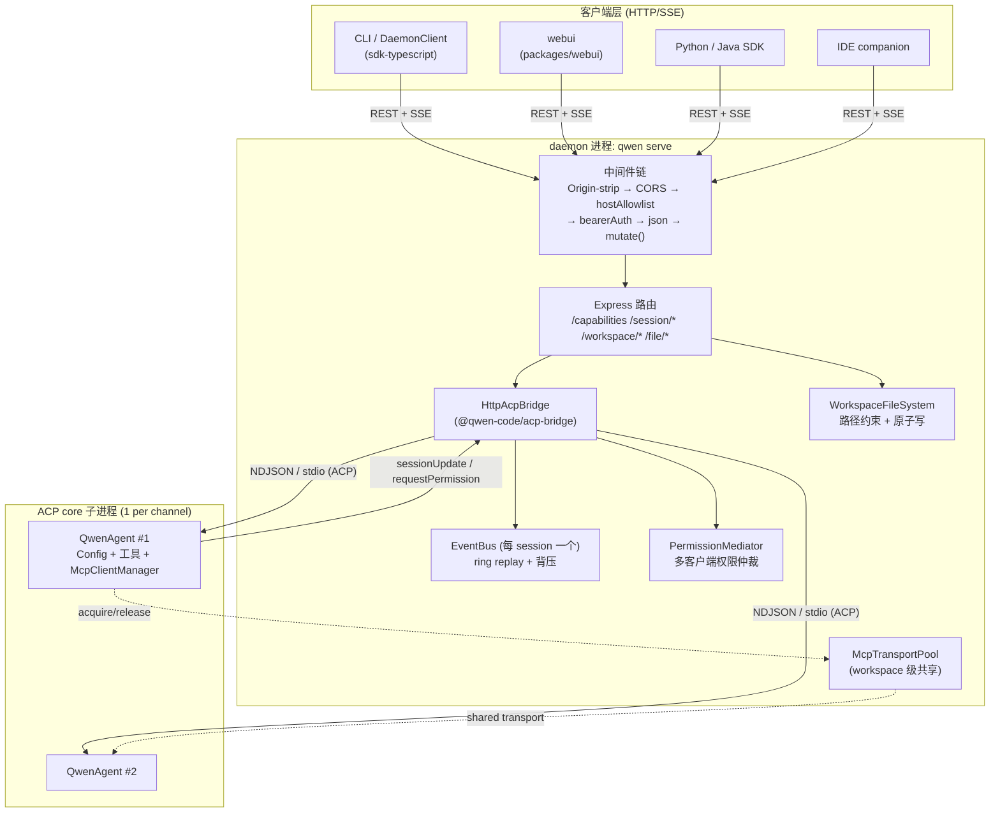
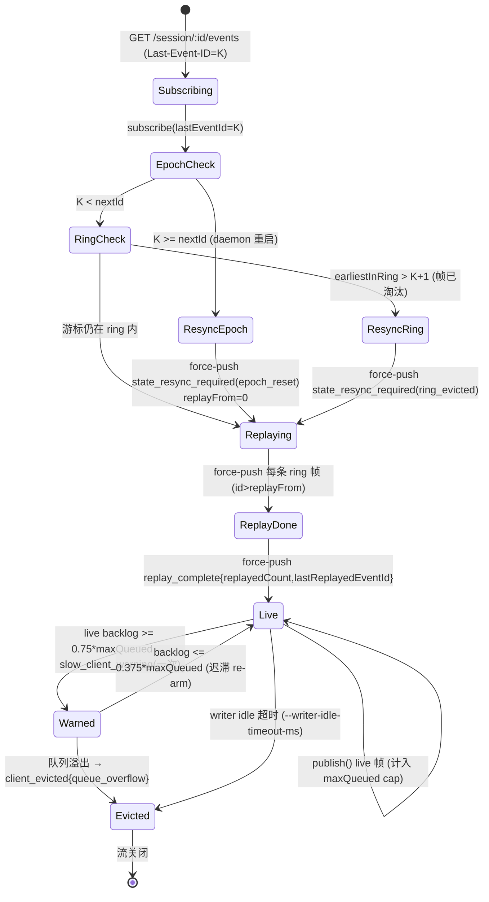
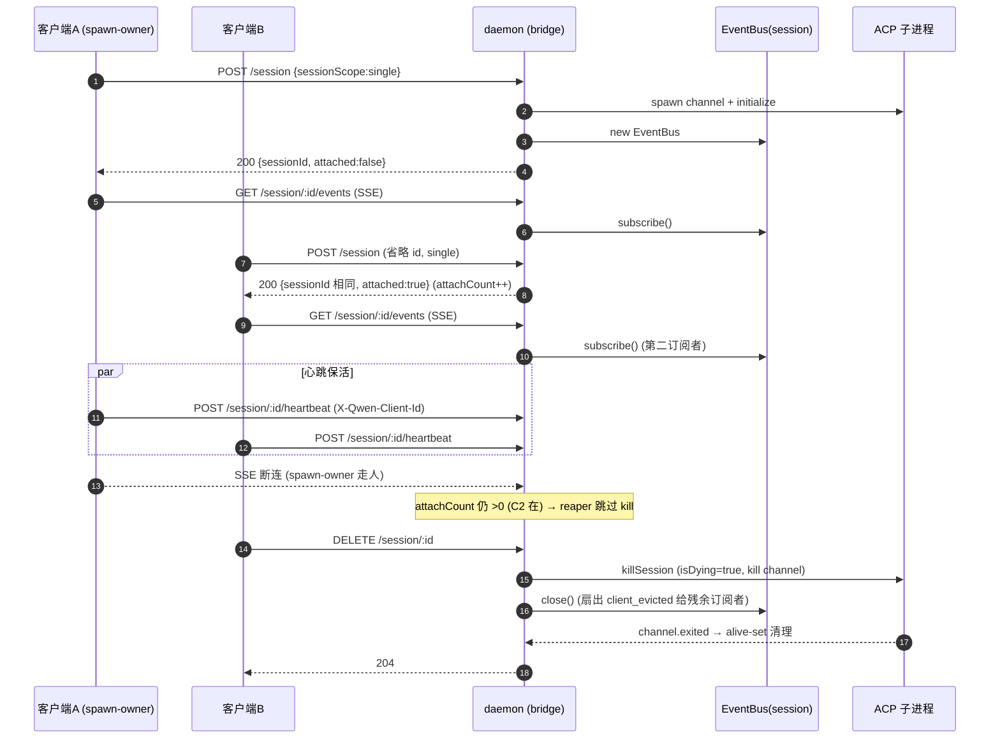
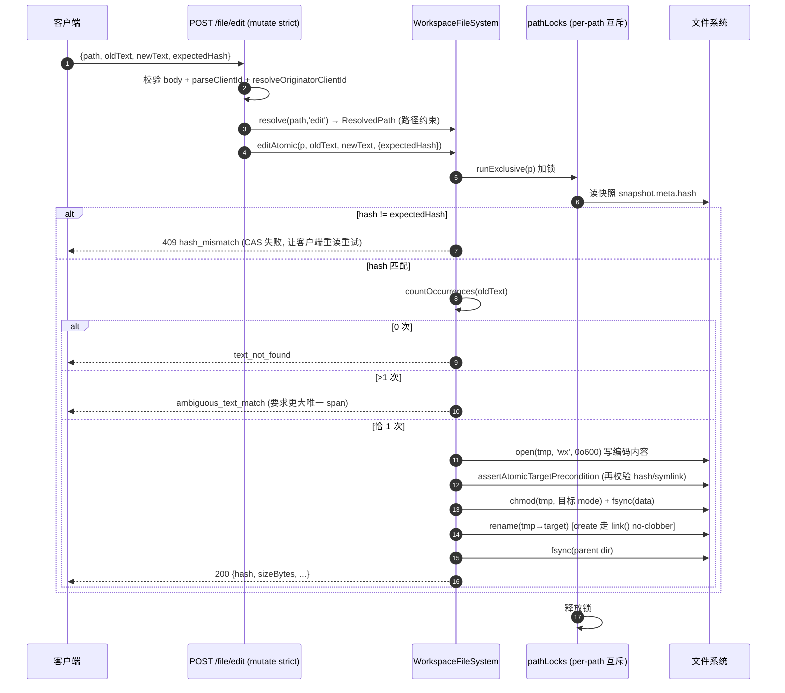
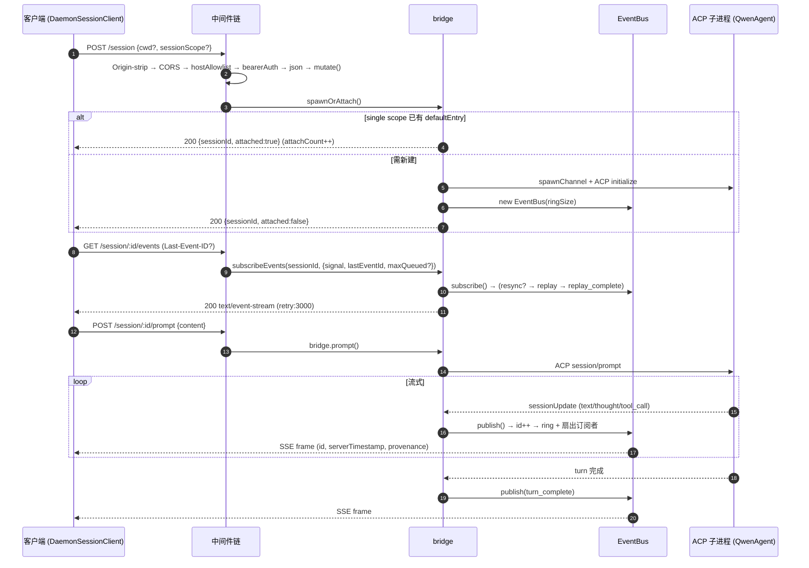

# daemon/serve 模式（Mode B）技术方案

> 适用分支：daemon-mode feature batch 已随 #4490 于 2026-06-11 合入 `main`；#5144 于 2026-06-15 刷新 upstream daemon developer docs 并重新对齐当前 `main` 实现面。本文早期函数/行级锚点可能仍带 `daemon_mode_b_main` 历史语境，阅读时以当前 `main` 源码为准。
> 关联 epic：[#4175](https://github.com/QwenLM/qwen-code/issues/4175)（Mode B daemon roadmap），上游设计 [#3803](https://github.com/QwenLM/qwen-code/issues/3803)。

---

## 深入子文档导航

本目录是 daemon/serve 模式的技术方案集合。本 README 为**总览**（背景、整体架构、设计权衡、PR 全景）；下列子文档对每个子系统做**函数/行级深入**（数据结构、控制流、时序图/状态机、边界与错误、测试覆盖），逐处锚定 `file:symbol`：

| # | 子文档 | 覆盖 |
|---|---|---|
| 01 | [HTTP 服务 / 路由 / 中间件链](01-http-server-and-middleware.md) | 中间件链顺序、路由表、bearer / --require-auth / mutate / CORS / host allowlist 五道闸、deadline / 权限响应超时 / access log |
| 02 | [SSE 事件总线](02-sse-event-bus.md) | EventBus 环形缓冲、replay、BoundedAsyncQueue 背压、live byte cap、state_resync、协议帧 serverTimestamp/provenance/errorKind |
| 03 | [会话生命周期](03-session-lifecycle.md) | spawn/attach/close/delete、sessionScope single/thread、heartbeat、load/resume、session archive/unarchive、session organization、batch load replay |
| 04 | [能力注册表与协议](04-capabilities-and-protocol.md) | SERVE_CAPABILITY_REGISTRY、协议版本、typed event schema、协议补全、能力覆盖矩阵 |
| 05 | [工作区文件路由与 FS 边界](05-workspace-files-and-fs-boundary.md) | resolveWithinWorkspace 防穿越、editAtomic hash CAS、原子写 |
| 06 | [MCP 守卫与共享传输池](06-mcp-guardrails-and-pool.md) | per-session 预算 → workspace 共享池、引用计数、env 隔离 |
| 07 | [acp-bridge 抽包与多客户端权限协调](07-acp-bridge-and-permission.md) | 抽包 seam、四策略权限仲裁、并发不变量 |
| 08 | [扩展端点 recap/btw/tasks/shell/rewind/hooks/extensions/settings/logger](08-extension-endpoints.md) | 控制面端点、诊断端点、绕过 prompt FIFO、shell `this`-binding 隐患 |
| 09 | [路线图、覆盖矩阵与当前缺口](09-roadmap-coverage-and-gaps.md) | 以 #3803/#4175 为 spec 的阶段路线图 + PR→文档覆盖矩阵 + 未建设/未文档化缺口（已回填 #4490 mainline 合入和 #5144 daemon docs refresh） |
| 10 | [客户端适配器与 SDK](10-client-adapters-and-sdk.md) | DaemonSessionClient、typed events、client identity、TUI/channels/IDE spike、daemon-managed channel worker、跨客户端协调 |
| 11 | [WebUI 库与 ACP 传输层](11-webui-and-transport.md) | @qwen-code/webui、context-usage API、ACP Streamable HTTP、WebSocket transport |

---

## 1. 背景与动机

qwen-code 的原始形态是一次性 CLI 进程：用户在终端启动 `qwen`，进程内拉起 agent core（模型、工具、MCP、上下文）、跑完一轮或一个交互 session 后退出。这种 **Mode A**（进程内 agent，含早期被搁置的 `qwen --serve`）有两个根本限制：

1. **单客户端、单生命周期**。一个终端 = 一个 agent core。无法让 webui、IDE 插件、SDK 脚本同时驱动同一个工作区上下文；每个客户端都要冷启动一份 core（昂贵的 MCP 子进程、模型预连接、技能扫描重复 N 次）。
2. **无法远程驱动**。SDK（TS/Python/Java）想"附着到一个正在跑的会话"、webui 想"流式渲染另一进程里的工具调用"在 Mode A 下无解——agent 状态全在进程内存里，没有稳定的跨进程协议面。

**Mode B（`qwen serve`）** 的目标：把 agent core 常驻为一个 **HTTP daemon**，对外暴露一套稳定的 REST + SSE 协议，让多种客户端（CLI、webui、SDK、IDE companion、channel worker）**并发附着到同一个工作区会话**，共享同一份 core 资源。核心设计约束（来自 #3803 §02）：

- **1 daemon = 1 workspace**：每个 daemon 绑定一个规范化的工作区根路径（`boundWorkspace`）；多工作区部署 = 多个 daemon 各监听不同端口。
- **多客户端协作**：同一 session 可被多个客户端 attach，事件通过 SSE 扇出，权限通过仲裁器协调。
- **协议向后兼容**：能力通过 `/capabilities` 的 `features[]` 标签协商，客户端 **gate on features 而非 mode**；老 daemon 缺失新标签即静默降级。

与 Mode A 的本质区别：Mode A 是"进程即会话"，Mode B 是"进程即服务，会话是服务内的一等资源"，并通过一个 **ACP（Agent Client Protocol）bridge** 把 HTTP 协议面与真正跑 agent 的子进程解耦。

---

## 基础贡献归因


---

## 2. 整体架构

### 2.1 进程与分层模型

Mode B 由三层进程构成：

1. **客户端层**：CLI（`DaemonClient`/`DaemonSessionClient` TS SDK）、webui（`packages/webui`）、IDE companion、Python/Java SDK。只说 HTTP/SSE。
2. **daemon 层**：`qwen serve` 进程。内含 Express HTTP 服务（`server.ts`）+ HTTP→ACP bridge（`@qwen-code/acp-bridge`）。负责鉴权、路由、会话登记、SSE 事件总线、文件路由、MCP 池。
3. **ACP core 子进程层**：bridge 为每个 channel `spawn` 一个 ACP agent 子进程（`acpAgent.ts` 里的 `QwenAgent`），它才真正持有 `Config`、模型、工具执行器、`McpClientManager`。bridge 与子进程之间走 NDJSON over stdio 的 ACP 协议。



### 2.2 关键包

| 包 / 目录 | 角色 |
| --- | --- |
| `packages/cli/src/serve/` | daemon 的 HTTP 层：`server.ts`（Express app）、`runQwenServe.ts`（boot/监听）、`auth.ts`、`capabilities.ts`、`fs/`（文件子系统）、`routes/`（文件读写路由）。 |
| `packages/acp-bridge/` | 抽出的可复用 ACP bridge 原语：`bridge.ts`（核心闭包）、`bridgeClient.ts`、`eventBus.ts`、`permissionMediator.ts`、`spawnChannel.ts`、`bridgeFileSystem.ts`、`status.ts`、`bridgeErrors.ts`。被 serve / channels / IDE 共享。 |
| `packages/cli/src/acp-integration/` | ACP **子进程侧**：`acpAgent.ts`（`QwenAgent` 实现 ACP `Agent` 接口）、`session/`（会话状态、emitters、history replay）。 |
| `packages/core/src/tools/mcp-transport-pool.ts` 等 | workspace 级 MCP 共享传输池（F2）。 |
| `packages/sdk-typescript/src/daemon/` | TS SDK：`DaemonClient`（workspace 级）、`DaemonSessionClient`（session 级）、`events.ts`（typed 事件）、`ui/normalizer.ts`（serverTimestamp/provenance 归一化）。 |

`server.ts:createServeApp` 是纯函数（无副作用构建 Express app）；`runQwenServe.ts:runQwenServe` 负责参数校验、boot 门控与 `listen()`。F1（#4319）把 bridge 核心整体抬到了 `@qwen-code/acp-bridge`，早期 serve 侧保留过 `httpAcpBridge.ts` / event-bus / status / in-memory-channel 等兼容 wrapper；#5955 后，active CLI consumers 已改为直接使用 bridge package exports，event-bus / status / in-memory-channel wrapper 删除，只保留 serve package barrel 的下游兼容面。

---

## 3. 子系统详解

### 3.1 HTTP 服务与路由

入口 `packages/cli/src/serve/server.ts:createServeApp`（约 4053 行）。它按**严格顺序**装配中间件 + 路由，顺序本身是安全契约：

```
(loopback 自源 Origin-strip shim)
  → allowOriginCors / denyBrowserOriginCors   (CORS 墙)
  → hostAllowlist(hostname, getPort)          (反 DNS rebinding)
  → [loopback 时 /health /demo 在 bearer 之前注册]
  → 访问日志中间件
  → bearerAuth(token)                         (全局鉴权)
  → express.json({ limit: '10mb' })
  → [非 loopback 时 /health /demo 在 bearer 之后注册]
  → daemonTelemetryMiddleware
  → 业务路由 (/capabilities, /session/*, /workspace/*, /file/*)
  → mountAcpHttp(app, bridge)                 (官方 ACP Streamable HTTP，/acp)
  → 最终 JSON error handler
```

路由按"读 vs 变更"分两类：所有变更路由都过 `mutate()` 门（见 §3.5）。代表性路由（`server.ts` 行号）：

- 能力/健康：`GET /capabilities`（L961）、`GET /health`（L865/943，loopback 与否注册位置不同）。
- 会话：`POST /session`（L1321，spawn/attach）、`POST /session/:id/prompt`（L1625）、`POST /session/:id/cancel`（L1794）、`POST /session/:id/heartbeat`（L1742）、`POST /session/:id/detach`（L1773）、`DELETE /session/:id`（L1820）、`PATCH /session/:id/metadata`（L1919）、`POST /session/:id/load`、`POST /session/:id/resume`（L1544-1545）、`GET /session/:id/events`（L2653，SSE）。
- 工作区状态（只读，不拉起子进程）：`GET /workspace/{mcp,skills,tools,providers,env,preflight}`（L1003-1097）。
- 工作区变更（strict 门控）：`POST /workspace/mcp/servers`、`DELETE /workspace/mcp/servers/:name`、`POST /workspace/init`、`POST /workspace/mcp/:server/restart`、`POST /workspace/tools/:name/enable`（L2194-2575）。
- 文件：`GET /file|/list|/glob|/stat|/file/bytes`、`POST /file/write|/file/edit`（见 §3.6）。

错误统一通过 `sendBridgeError`（L3695）落到 typed JSON：未知 session → `404 SessionNotFoundError`，工作区不匹配 → `400 workspace_mismatch`，超 `--max-sessions` → `503 + Retry-After`（`session_limit_exceeded`），restore 竞争 → `409 restore_in_progress`。`safeBody`（L3159）返回 `Object.create(null)` 防原型污染。

`POST /session` 还内建一组防御：`cwd` 缺省回落 `boundWorkspace`；`cwd` 长度超 `MAX_WORKSPACE_PATH_LENGTH`（4096）先拒（防 10MB body 经 `WorkspaceMismatchError.message` 多次回显放大）；spawn 窗口期客户端断连时用 `res.writable` 检测，避免泄漏孤儿子进程。

### 3.2 SSE 事件流与背压 / replay / resync

核心实现 `packages/acp-bridge/src/eventBus.ts:EventBus`；#5955 后 serve 侧不再保留 `serve/eventBus.ts` wrapper，active CLI consumers 直接引用 `@qwen-code/acp-bridge` package export。每个 session 一个 `EventBus`。

**事件帧** `BridgeEvent`：`{ id?, v, type, data, originatorClientId? }`。`id` 是 per-session 单调序号（从 1 起），用于 SSE `Last-Event-ID` 断点续传。**合成终止/告警帧不带 `id`**（`client_evicted`、`slow_client_warning`、`state_resync_required`、`replay_complete`、`stream_error`），否则会在其他订阅者观察到的序列里"烧掉"一个槽位、造成假性 gap。

**bounded ring replay**：`ring: BridgeEvent[]`，默认深度 `DEFAULT_RING_SIZE = 8000`（#3803 §02 设定，可经 `qwen serve --event-ring-size <n>` 覆盖）。`publish()` 把帧推入 ring，超长 `shift()`（满 ring 时 O(n)，已注释为可接受、未来再换环形缓冲）。

**每订阅者背压**：`BoundedAsyncQueue`，默认 `maxQueued = 256`（可经 `GET /session/:id/events?maxQueued=N` 在 `[16,2048]` 内预调）。关键设计——cap **只算 live 帧**：replay/告警/终止帧走 `forcePush` 带 `forced` 标记、不计入 cap（`liveCount` 字段 O(1) 维护），否则一次大 backlog 重连会把刚 resume 的订阅者立刻挤爆。

**slow_client_warning（#4237 / Wave 2.5 PR 10）**：当某订阅者 live backlog 越过 `WARN_THRESHOLD_RATIO = 0.75 × maxQueued`，向它 force-push 一个 `slow_client_warning` 帧，**每个 overflow episode 只发一次**（`sub.warned` 标记），队列回落到 `WARN_RESET_RATIO = 0.375` 以下才重新 arm（迟滞，防抖）。

**client_evicted**：队列真正溢出（`push` 返回 false）→ force-push `client_evicted{reason:'queue_overflow'}` → 关闭队列 → `sub.dispose()`（同时摘除 AbortSignal 监听，修复 stalled 消费者下的堆滞留）。这是**终止**帧，流随之关闭。

**订阅者上限**：`DEFAULT_MAX_SUBSCRIBERS = 64`/session。超限 `subscribe()` 抛 `SubscriberLimitExceededError`，SSE 路由捕获后返回 **`429 + Retry-After`**（不是 `200 + stream_error`，因为后者会触发 `EventSource` 自动重连放大攻击面）。

**state_resync_required（resync 语义）**：当客户端带 `Last-Event-ID` 重连但游标已被 ring 淘汰或跨越 epoch（daemon 重启使 `nextId` 归 1），EventBus 在 replay **之前**先 force-push 一个 `state_resync_required` 帧，**但流保持 OPEN**（与 `client_evicted` 不同）。两种原因：

- `ring_evicted`：`earliestInRing > lastEventId + 1`，中间帧已被淘汰。
- `epoch_reset`：`lastEventId >= this.nextId`，游标属于已死 epoch（daemon 重启）。此时 replay 全量重放当前 ring（`replayFrom = 0`）。

SDK reducer 看到该帧后置 `awaitingResync`，先调 `loadSession` 拉全量再恢复应用增量。SSE 路由侧（`server.ts` SSE handler）还会把 resync 写一行 stderr 便于排障（"ring eviction detected … gap=N events"）。



**SSE 写侧背压（`server.ts` SSE 路由 L2653-3059）**：`res.write` 返回 false（内核发送缓冲满）时 `await drain`，避免用户态无界堆积；所有写（含心跳）经 `writeChain` 单飞串行化，防止心跳与主循环交错写半个 SSE 帧。15s 心跳保活（`: heartbeat`）。`--writer-idle-timeout-ms`（T2.9/#4530）加一层应用级 idle 守卫：若"最近一次成功 flush"早于预算则直写 `client_evicted{writer_idle_timeout}` 并清理（绕过可能已卡死在 drain 的 chain）。

### 3.3 会话生命周期与 sessionScope

核心 `packages/acp-bridge/src/bridge.ts`（约 4666 行，`createHttpAcpBridge` 工厂闭包）。会话状态登记在 `byId: Map<sessionId, SessionEntry>`。每个 entry 持有：`events: EventBus`、`channelInfo`（attach 目标 channel + ACP connection）、`attachCount`、`lastHeartbeatAt` / per-client 心跳表、`isDying` / 反 reap tombstone 等。

**spawn vs attach**：`bridge.spawnOrAttach({ workspaceCwd, modelServiceId?, clientId?, sessionScope? })`（`POST /session` 调用）。

- **sessionScope `'single'`（默认）**：daemon 维护一个 `defaultEntry`（单一 attach 目标）。省略 session id 的 `POST /session` 会 attach 到它（`attached: true`），实现"多客户端共享同一活跃会话"的实时协作。`attachCount` 计数 attach-after-spawn 次数。
- **sessionScope `'thread'`**：每次 spawn 都是隔离会话，**绝不**成为 `defaultEntry`（否则后续省略 scope 的调用会误 attach 到本应隔离的线程）。
- 每请求 `sessionScope` override 是 #4209（Wave 2 PR 5）引入的，路由边界校验非法值返回 `400 invalid_session_scope`；bridge 侧二次校验防直接调用者。客户端应先 pre-flight `caps.features` 的 `session_scope_override`，老 daemon 静默忽略该字段。


**load / resume**（#4222）：`POST /session/:id/load`（ACP `connection.loadSession`，重放完整历史）与 `POST /session/:id/resume`（ACP `connection.unstable_resumeSession`，`unstable_` 前缀因底层 ACP 方法名未定稿）。同 id 的 load↔resume 交叉竞争返回 `409 restore_in_progress`；同动作竞争（load vs load）走 coalesce 合并而非报错。restore 用一个独立的 `pendingRestoreEvents` EventBus 先承接重放，settle 后并入正式 entry。

**close / detach / delete**（#4240 / Wave 2.5 PR 11）：`DELETE /session/:id`（`closeSession`，attach 不计入 `--max-sessions` cap）、`POST /session/:id/detach`（`detachClient`，仅减引用）、`POST /sessions/delete`（批量）、`PATCH /session/:id/metadata`（重命名等）。`closeSession`/`killSession` 标 `isDying` 同步、`kill()` channel、由 `channel.exited` handler 在 OS reap 后做 alive-set 清理；这期间并发 `spawnOrAttach` 能立刻 spawn 一个全新 channel 并重指 `channelInfo`（不必等 OS reap）。

**archive / unarchive**（#6058）：`POST /sessions/archive` 把 active JSONL 从 `chats/` 移到 `chats/archive/`，`POST /sessions/unarchive` 反向恢复。archive 是状态转换而不是删除：file history、subagent transcript 和 runtime sidecar 保留；live session archive 会先 strict close 并要求 agent close handler flush recording，失败则不移动 JSONL。`SessionArchiveCoordinator` 对同一 session id 提供 exclusive/shared gate，避免 archive 与 load/resume/prompt/delete 并发踩踏。archived session load/resume 返回 `409 session_archived`，active/archive 双写返回 `409 session_conflict`。

**daemon-managed channel worker**（#6031/#6098/#6146/#6598/#6635；#6741 open）：`qwen serve --channel <name>|all` 在 daemon runtime ready 后 fork internal `channel daemon-worker`。worker 经 TS SDK + `DaemonChannelBridge` 回连 daemon，channel session create/load 强制 `sessionScope:'thread'`，并把 pidfile ownership、requested/connected channels、worker pid 和 `/daemon/status.runtime.channelWorker` 暴露给管理面。#6098 增加 ready 后有界重启、15s heartbeat / 45s stale kill、partial-connect issue、stale pid 清理、日志脱敏与 buffer 上限；#6146 再把 worker stderr 与 ACP child stderr 的 credential redaction 抽成 `redactLogCredentials()`，覆盖 bearer/API key/secret env/JSON secret/URL credential 等模式，并在 stderr terminal 与 daemon log file 两条路径同时生效；ready 前仍 fail-fast，避免 serve 启动时静默丢 channel。#6598 新增 `POST /workspace/channel/reload`、SDK `reloadChannelWorker()` 与 CLI `qwen channel reload`，只 stop+start channel worker 让其重读 settings，不重启 daemon 也不拆 live sessions；`channel_reload` capability 仅在 snapshot 与 reload deps 同时 wire 时广告。#6635 把 selected channels 按 owning trusted workspace 分组，每个 workspace 一个 supervisor，并通过 `ChannelWorkerGroup` 提供 fail-closed group restart、webhook owner routing、pidfile `workers[]` 与 `/daemon/status.runtime.channelWorkers[]`；`--channel all` 仍保持 primary-only v1。#6741 open 方案在此之上新增 runtime selection manager、`channel_control` capability、`GET/PUT/DELETE /workspace/channel`、SDK helper 和 `qwen channel set/status/stop`，支持 daemon 启动后启用/替换/查询/停止 worker selection，并在替换失败时回滚到旧 selection。

**status / perf surface + dashboard 方案记录**（#6263/#6270/#6296/#6325/#6416；#6253 closed）：`/daemon/status` 继续作为 daemon 诊断聚合端点扩展。#6263 增加 optional `runtime.perf`，只暴露 daemon 进程 event-loop lag snapshot 与 daemon-child pipe inbound/outbound byte 统计；ACP child lag 留在 OTel gauge 与 forwarded stderr stall warning，避免把 child-only 观测塞进 status JSON。#6270 在 `runtime.activity` 增加 `activePrompts`、`lastActivityAt`、`idleSinceMs`，bootstrap status 返回稳定 `0/null/null`，并给 full workspace MCP section summary 补 `serversConnected`、`serversErrored`、`serversDisabled`。#6325 继续补齐 prompt FIFO 可观测性：`runtime.activity.pendingPrompts` 统计所有已接受但未 settle 的 prompts，`queuedPrompts` 统计已接受但尚未 dispatch 的 FIFO 等待项；`runtime.perf.promptQueueWait` 和 metrics ring 同步保留 queue wait count/mean/max/last 与窗口 p95。queued prompts 只是 backpressure signal，不升级为 status issue；多客户端要避免共享 FIFO 时应在 `POST /session` 显式使用 `sessionScope:"thread"`。#6296 修正 preflight auth 的 false warning：env var 未命中时读取 live `Config` 的 resolved `generationConfig.apiKey`，使 settings apiKey / provider envKey / CLI flag 与实际 session 启动口径一致。#6253 的 closed diff 只作为未合入 dashboard 方案记录：它设计了只读 `/dashboard` inline HTML 与 Web Shell `DashboardDialog`，消费同一 `/daemon/status`，并沿用 `/demo` 的 loopback pre-auth / non-loopback bearer 边界。#6416 给 status 增加 daemon-wide total admission 的 additive 字段：`limits.maxTotalSessions`、`runtime.sessions.admissionInFlight` 和 `total_session_capacity_high` issue；warning 以 total admission 的 live count + in-flight reservation 计算，cap 未配置时保持 unlimited。

**daemon/ACP NDJSON hot path**（#6263/#6335）：daemon 与 ACP child 的 stdio 通路改用 `@qwen-code/acp-bridge` 内的 incremental `ndJsonStream`，逐 chunk 扫描 newline，只把跨 chunk 尾段留在 pending，避免大消息 split 时重复处理整段 buffer。收发 hook 记录 payload bytes，hook 异常不影响传输；非 daemon 路径继续使用 SDK stream，降低兼容风险。#6335 在同一 stream hook 层新增 `onMessageObserved({direction,bytes,message})`，只在成功收发 JSON message 后触发；daemon pipe path 用 `large-pipe-frame-observer.ts` 对 `>=256 KiB` frame 做低敏浅层分类与限速日志/telemetry（source class、method、update count、tool name/provenance、raw output kind 和 capped byte maxima），不记录 payload/session/client/path/prompt/raw output，也不改变 pipe payload、public protocol、SDK、EventBus 或 capability。

**session export / organization / load replay / settings isolation/cache / bounded transcript / recording durability**（#6292/#6297/#6305/#6309/#6310/#6407/#6482/#6525/#6740/#6743；#6769 open）：#6292 先修 ACP session 创建/加载/恢复入口的 settings 隔离：`newSession`、`loadSession`、`unstable_resumeSession` 在请求开始时各自加载 workspace settings，并显式传入 `newSessionConfig()` 与 `createAndStoreSession()`，避免并发请求通过共享 `this.settings` 串 workspace 或 runtime output dir。#6297 新增 `session_export` capability 和 `GET /session/:id/export`，复用 CLI export formatter 返回 HTML/Markdown/JSON/JSONL attachment，并在 SDK 与 Web Shell 侧栏增加 capability-gated download。#6305 新增 `session_organization` capability，把 group catalog 与 per-session pin/group 状态存在 project sidecar `session-organization.v1.json`，默认 recent list 保持不变，只有 `view=organized` 才返回置顶/分组视图。#6309 给 daemon-owned `session/load` 增加 response-mode replay，bridge 从 ACP response seed snapshot，不再把历史帧逐条扇出到 live EventBus 或 replay ring；direct ACP 默认 streamed replay 保持兼容。#6310 在 ACP session 创建路径引入 workspace LRU `loadSettingsCached()`，以 settings 文件、`.env`、realpath 和 IDE trust fingerprint 失效，减少长驻 child 对同一 cwd 的同步重复 settings load。#6407 把 `settings_reloaded` 从未知 debug transcript 改成 SDK `workspace.settings.changed` signal，WebUI 只输出筛选后的 `console.debug` 诊断字段，避免 reload payload 污染聊天记录。#6482 把 `/load` 返回的 live replay snapshot 变成 byte-capped window，`--compacted-replay-max-bytes` 默认 4 MiB、最大 256 MiB；旧 replay 被裁剪时 `compactedReplay[0]` 是 id-less `history_truncated` status marker，SDK/WebUI 渲染提示但不触发 resync loop。#6525 新增 `GET /session/:id/transcript`：从 active JSONL 冻结快照分页生成 id-less replay frames，不 attach client、不 seed EventBus、不改变 live replay window；cursor 用 workspace project 目录持久 HMAC key 签名并绑定文件 snapshot，snapshot 超过 256 MiB 会结构化拒绝。#6740 新增 workspace-qualified persisted-only transcript reader `GET /workspaces/:workspace/session/:id/transcript`，对 registered untrusted secondary 开放只读 transcript，不启动 ACP、不加载 settings、不查询 live bridge，cursor 使用 daemon-lifetime workspace signing key。#6769 open 方案给该 workspace route 增加 4 MiB source page、32 MiB response 和 64 KiB cursor 边界，并新增 `transcript_page_too_large`。#6743 让 chat recording 首次 JSONL append 失败后永久停止该 recorder、阻止缺 parent 的后续记录，并通过 `recording_stopped` 在 TUI/headless/ACP/daemon/SDK/WebUI 可见。

**multi-workspace Phase 1/2a/2b/3/4**（#6394/#6410/#6416/#6511/#6540/#6558/#6567/#6621/#6625/#6631/#6635/#6716/#6717/#6724/#6740；#6638/#6745/#6769 open）：为 daemon multi-workspace 建立内部 runtime registry，并逐步从 sessions-only 扩展到 workspace-qualified surface。#6394 先落 Phase 1 single-runtime registry：`WorkspaceRuntime` 聚合 primary workspace 的 bridge、workspace service、REST route fsFactory 和 client-MCP sender registry；现有 route schema、SDK type、`/capabilities` 与 legacy `app.locals.fsFactory/boundWorkspace` 保持兼容。#6410 补 Phase 2a foundation：`--workspace` 在 yargs 层 repeatable，fast path 遇重复值回退完整 parser；duplicate/nested/distinct multi-workspace 输入在 boot 前 fail closed；`WorkspaceRegistry` 增加 workspace id/cwd lookup、primary fallback、live session owner resolution 和 registry injection split-brain 检测。#6416 落地 runtime-local env snapshot、ACP child `sourceEnv`、workspace-scoped env injection 和 daemon-wide `--max-total-sessions` fresh-session admission。#6511 打开 sessions-only live closed loop：create/events/prompt/cancel/permission/heartbeat/detach/pending/close/status 与 non-primary live-only listing 都按 owner runtime dispatch，多 runtime 时才 additive 发布 `multi_workspace_sessions` 与 `workspaces[]`。#6540 把 owner scan 抽成 `WorkspaceSessionOwnerIndex`，并支持 trusted non-primary load/resume、read-only live status routing 和 `session_workspace_conflict`。#6558 让 trusted non-primary workspace session list 合并 active persisted sessions 与 live summaries。#6567 增加 `/workspaces/:workspace/...` core REST，selector 先 workspace id、再 encoded absolute cwd，覆盖 file/status/settings/permissions/trust/lifecycle/MCP/tools/memory/agents/session organization，并新增 SDK `WorkspaceDaemonClient`。#6621 把 ACP transport 扩展到 `/workspaces/:workspace/acp`：trusted non-primary 拥有独立 ACP dispatcher/connection registry/remember lane/client-MCP sender，device-flow registry 保持 daemon-global/shared 并把 auth-flow 事件 fanout 到 trusted mounts。#6625 支持运行时 `POST /workspaces` 动态注册 workspace，并把 Web Shell sidebar 改成 workspace management tree；#6716 在此基础上增加 user-level persistent workspace registration、启动恢复和 `GET/DELETE /workspace-registrations`。#6631 继续补齐 trusted non-primary archived/organized/group session list；#6717 允许 untrusted secondary 读取 persisted-only session/group catalog 但不 merge live、不 spawn ACP；#6724 给 trusted secondary 补 `PATCH /workspaces/:workspace/session/:id/organization`。#6740 让 selected workspace 的 active persisted transcript 也可通过 workspace-qualified route 只读分页；#6745 open 方案新增 runtime hot removal，drain sessions/ACP/memory/channel 并忘记 persistent aliases；#6769 open 方案给 workspace transcript route 加 byte bounds。#6635 把 channel workers 按 workspace 分组；#6638 open 方案新增 `extension_management_v2`，把 user-level extension artifact 与 workspace activation policy 拆开。



### 3.4 能力注册表与协议版本

`packages/cli/src/serve/capabilities.ts`。`SERVE_CAPABILITY_REGISTRY` 是单一事实源（`as const satisfies Record<string, ServeCapabilityDescriptor>`），每个 tag 带 `since: ServeProtocolVersion`（当前仅 `'v1'`）和可选 `modes`（如 `mcp_guardrails: { modes: ['warn','enforce'] }`、`permission_mediation: { modes: ['first-responder','designated','consensus','local-only'] }`）。

`/capabilities` 返回 `{ v, protocolVersions:{current,supported}, mode, features[], modelServices:[], workspaceCwd, policy:{permission} }`。客户端契约（#3803 §10）：**gate UI on `features`，不要 gate on `mode`**。`v` 自增表示帧布局不兼容变更；`protocolVersions`/`workspaceCwd` 是 v=1 之上的 additive 字段，老 daemon 省略。

**条件标签**：`CONDITIONAL_SERVE_FEATURES` 是一个 `Map<ServeFeature, (toggles)=>boolean>`，把"是否广告该 tag"的判定与 tag key 并置。`getAdvertisedServeFeatures(protocolVersion, toggles)` 过滤：无 Map 条目 = 无条件广告（baseline）；有条目 = 跑 predicate。当前条件标签包括 `require_auth`（`--require-auth` 开）、`mcp_workspace_pool`/`mcp_pool_restart`（池开，`mcpPoolActive`）、`allow_origin`（配了 `--allow-origin`）、`prompt_absolute_deadline`/`writer_idle_timeout`（配了对应预算）、`workspace_settings`、`workspace_qualified_rest_core`、`multi_workspace_sessions`、`workspace_qualified_acp`、`channel_reload`、`persistent_workspace_registration`、#6741 open 方案的 `channel_control` 与 #6745 open 方案的 `workspace_runtime_removal`。"tag 存在 = 行为开启"是客户端可依赖的硬契约。`workspace_persisted_transcript` 是 #6740 的 unconditional read-only tag，表示 workspace-qualified persisted transcript route 已注册；实际可读性仍由每次请求的 workspace/trust policy 决定。该 Map 形状把原先需要 4 处协调改动（registry/set/interface/branch）的"加条件标签"收敛为 2 处，且 `server.test.ts` 迭代 Map keys 做不变式断言。

`mcp_guardrails` 刻意是**无条件**标签（即使没配 budget 也广告，`budgetMode:'off'`），与上面的条件标签区分。`protocolVersions` 由 #4191 引入。

### 3.5 鉴权与变更门控（bearer / --require-auth / mutate / CORS / host allowlist）

实现在 `packages/cli/src/serve/auth.ts`，boot 门控在 `runQwenServe.ts`。四道闸：

**1. host allowlist（`hostAllowlist`）**：仅 loopback bind 生效，反 DNS rebinding。允许 `localhost:port` / `127.0.0.1:port` / `[::1]:port` / `host.docker.internal:port`（Host 大小写不敏感、按 port 缓存 Set）。非 loopback bind 直接放行（操作者自选暴露面，靠 bearer 兜底）。

**2. CORS**：默认 `denyBrowserOriginCors`——任何带 `Origin` 头的请求返回 `403 {"error":"Request denied by CORS policy"}`（CLI/SDK 从不发 Origin，发了就是浏览器、视为未授权上下文）。配了 `--allow-origin <pattern>`（T2.4/#4527）则换成 `allowOriginCors`：`*` 或规范 origin（`new URL(p).origin === p` 严格往返校验，否则 boot 抛 `InvalidAllowOriginPatternError`）。匹配 origin 回显 `Access-Control-Allow-Origin: <origin>` + `Vary: Origin` + 标准 CORS 头；`Origin: null`（sandboxed iframe / file://）一律 403；OPTIONS 预检短路 204。**不**发 `Access-Control-Allow-Credentials`（daemon 用 bearer-in-Authorization，跨域无需 credentials）。loopback 自源请求由一个 CORS 之前的 Origin-strip shim 处理（剥掉自身端口的 Origin），不必把自己端口列进 allowlist。

**3. bearerAuth（全局）**：`token` 未配时是开放门（仅 loopback 开发默认可达此分支）。配了 token 则每路由必带 `Authorization: Bearer <token>`：scheme 大小写不敏感、token 值 SHA-256 后 `timingSafeEqual` 常数时间比较（避免按字节短路泄漏）；401 响应体在 missing/wrong-scheme/wrong-token 间统一。手写 `indexOf(' ')` 切分而非正则（避开 CodeQL 的多项式回溯告警）。

**4. mutate() 变更门（#4236 / PR 15）**：`createMutationGate({ tokenConfigured, requireAuth })` 返回 `(opts?)=>RequestHandler` 工厂。矩阵：

| daemon 配置 | 路由 opts | 结果 |
| --- | --- | --- |
| `requireAuth=true` | 任意 | passthrough（全局 bearer 已拦） |
| 配了 token | 任意 | passthrough（全局 bearer 已强制） |
| 无 token（loopback 开发） | `strict=false` | passthrough（保留"loopback 开放"旧行为） |
| 无 token（loopback 开发） | `strict=true` | `401 {code:'token_required'}` |

Wave 1-2 路由用 `mutate()`（非 strict，仅作集中化标记，无行为变化）；Wave 4 写类路由（memory/file edit/tool enable/MCP restart/device-flow）用 `mutate({strict:true})`，确保"没显式配 token 就绝不可达"，不必依赖操作者额外加 `--require-auth`。`token_required` 这个 distinct code 让 SDK 能区分"路由要求配 token"与普通 401。

**boot 门控（`runQwenServe.ts`）**：非 loopback bind 无 token → boot 拒绝；`--require-auth` 无 token → boot 拒绝；`--allow-origin '*'` 无 token → boot 拒绝（任何本地页都能驱动）。token 在 boot 时 trim（`export QWEN_SERVER_TOKEN=$(cat token.txt)` 常带尾 `\n`）。

`/health` 豁免：loopback bind 上 `/health`（与 `/demo`）注册在 bearer **之前**，便于 k8s/Compose 探针免 token；`--require-auth` 开时取消豁免。非 loopback bind 上 `/health` 注册在 bearer **之后**（否则未授权者可探测任意地址确认 daemon 存在）。

### 3.6 工作区文件路由与路径约束

文件子系统 `packages/cli/src/serve/fs/`，路由 `packages/cli/src/serve/routes/`。分层：`paths.ts`（边界解析）→ `workspaceFileSystem.ts`（IO + 原子写）→ `routes/workspaceFile{Read,Write}.ts`（HTTP）。能力分三档：`workspace_file_read`（`GET /file|/list|/glob|/stat`，#4269 PR 19）、`workspace_file_bytes`（`GET /file/bytes`，#4280 PR 20）、`workspace_file_write`（`POST /file/write|/file/edit`，strict 门控）。

**路径约束 `fs/paths.ts:resolveWithinWorkspace(input, boundWorkspace, intent)`**，返回 branded `ResolvedPath`（编译期防绕过）。流程：

1. `hasSuspiciousPathPattern(input)`——拒 NTFS ADS（`:` 在 drive-letter 槽后）、8.3 短名（`~\d`）、长路径前缀（`\\?\`/`//?/`）、UNC（`\\server\share`，顺带挡 SMB/DNS lookup）、尾点尾空格、DOS 设备名、≥3 连续点。用**检测而非规范化**（规范化依赖文件存在，write intent 下叶子按定义不存在；且规范化→检查有 TOCTOU 窗口）。
2. `path.resolve(boundCanonical, input)` 后 `isWithinRoot` 纯文本预过滤（无 FS 调用挡 `..` 逃逸）。
3. `fsp.realpath` 规范化；`ENOENT` 且 intent ∈ `{write, stat}` 时走**悬挂符号链接逃逸守卫**：逐跳 `lstat`+`readlink` 走完整 symlink 链（带 inode 访问集查环 + `MAX_ANCESTOR_HOPS` 深度上限），堵住 `<ws>/leak -> /etc/cron.d/evil`（目标尚不存在）和多跳 `leak -> middle -> /etc/passwd` 这类绕过。

`Intent = 'read'|'write'|'edit'|'list'|'glob'|'stat'`；`edit` 与 `write` 分开仅为审计/穷尽性，门控相同。

**CAS + 原子写（`workspaceFileSystem.ts`）**：`writeTextAtomic`（`mode: 'create'|'replace'`）与 `editAtomic`。路由层 `routes/workspaceFileWrite.ts`：`replace` 必带 `expectedHash`（`sha256:<64 hex>`，`isContentHash` 校验），`edit` 必带 `expectedHash` + `oldText`/`newText`。核心写链（`atomicWriteTextResolvedFile`）：



要点：per-path 互斥 `pathLocks.runExclusive` 串行化同文件并发写；tmp 文件名带 `pid + randomBytes(6)`；rename 前再次 `assertAtomicTargetPrecondition`（防 TOCTOU）；parent 是 symlink 直接 `symlink_escape`；`create` 用 `fsp.link()`（EEXIST 原子）而非 rename（POSIX rename 会静默覆盖）兑现 no-clobber 契约；`fsync` data + parent dir 保证崩溃一致性。ACP 子进程侧的文件读写经 `bridgeFileSystemAdapter.ts` 复用**同一** `WorkspaceFileSystemFactory`，共享审计流与信任门（F1 的 `BridgeFileSystem` seam）。

### 3.7 MCP 守卫与共享传输池

两阶段演进，都挂在 epic #4175：

**阶段一：per-session 守卫（#4247 PR 14 + #4271 PR 14b）**。每个 ACP session 自己构造 `Config` + `McpClientManager`，`--mcp-client-budget=N` + `--mcp-budget-mode={enforce,warn,off}` 在 session 内做软/硬限。`GET /workspace/mcp` 暴露 `clientCount`/`clientBudget`/`budgetMode`/`budgets[]`，per-server cell 带 `disabledReason:'budget'`。push 事件（PR 14b）：`mcp_budget_warning`（75% 上穿一次、37.5% 迟滞 re-arm）与 `mcp_child_refused_batch`（每轮 discovery / readResource 拒绝时合批，仅 enforce）。**v1 局限：预算是 per-session 而非 per-workspace**——`--mcp-client-budget=10` × 5 并发 session 实际可达 50 个 live client（`budgets[0].scope:'session'` 是诚实信号）。

**阶段二：workspace 级共享传输池 F2（#4336）**。`packages/core/src/tools/mcp-transport-pool.ts:McpTransportPool` 挂在 `QwenAgent.mcpPool`（`acpAgent.ts`），让所有 session 复用同一批 MCP 传输：

- API：`acquire(name, cfg, sessionId)` / `release(id, sessionId)` / `releaseSession(sessionId)`（反向索引 O(refs) 批量释放）/ `drainAll`。
- entry 按 **`(name, fingerprint)`** keyed（`mcp-pool-key.ts`）。fingerprint = 截断 SHA-256（16 hex/64 bit），对 config + 规范化 OAuth 全字段哈希（`canonicalOAuth` 把 `{}`/`{enabled:false}`/`null` 都折叠为"无 OAuth"，scopes/audiences 排序）。**关键安全**：注入了不同 OAuth 头/clientSecret/audiences 的 session 得到**不同 entry**，绝不共享传输（避免凭证泄漏到他 session）。
- 仅 `stdio`/`websocket` 默认入池（`POOLED_TRANSPORTS_DEFAULT`，真 OS 子进程、状态可隔离）；SDK MCP server 永远 per-session 旁路；HTTP/SSE 需显式 opt-in。
- 引用计数：refs=0 启动 drain timer；`maxIdleTimer` 硬上限（5min）；`spawnInFlight` 去重并发 acquire；spawn 失败释放预留 budget 槽。大量 review fold-in（doc `docs/design/f2-mcp-transport-pool.md` 记录 32 条）围绕 close-cb slot-release 竞争、statusChangeListener 跨 fingerprint 串扰、restart 时 pid 后代清扫等。
- `mcp_workspace_pool`/`mcp_pool_restart` 条件标签随池开关，`QWEN_SERVE_NO_MCP_POOL=1` kill switch 回落 per-session。`POST /workspace/mcp/:server/restart` 支持 `?entryIndex=N|*`，多 entry 时返回 `{entries:[...]}`。
- T2.8（#4552）加运行时增删：`POST /workspace/mcp/servers` / `DELETE /workspace/mcp/servers/:name`。

### 3.8 acp-bridge 抽包

`packages/acp-bridge/`（monorepo 内、不发 npm）。动机：bridge 的事件总线/通道/权限/状态契约不止 `qwen serve` 要用，channels、IDE companion、未来 TUI co-host、WebSocket transport 都要复用同一套原语，避免并行实现多套事件流。抽包分多个 slice 渐进完成（见 `packages/acp-bridge/README.md`）：

| Slice | PR | 抬升内容 |
| --- | --- | --- |
| PR 22a | #4295 | skeleton + `EventBus` + `inMemoryChannel` + `AcpChannel` 类型 + `PermissionMediator` 类型桩 |
| PR 22b/1 | #4298 | `status` + `workspacePaths` + `bridgeErrors` + `bridgeTypes` |
| PR 22b/2 | #4304 | `BridgeOptions` + 新 `DaemonStatusProvider` 注入 seam |
| F1 | #4319/#4334 | `defaultSpawnChannelFactory` + `BridgeClient` + `createHttpAcpBridge` 工厂闭包 + `BridgeFileSystem` seam |
| F1 测试拆分 | #4445 | 把 6861 行的 `bridge.test.ts` 抬到 acp-bridge |
| F3 PR 24 | #4335 | 实现四种 `PermissionMediator` 策略（first-responder / designated / consensus / local-only）+ pair-token 撤销 + 审计。已合入。 |

抽包后早期 serve 侧曾通过 compatibility wrapper 保留旧相对导入路径；#5955 清掉剩余的 event-bus / status / in-memory-channel wrapper，并把 CLI 内部导入迁到 `@qwen-code/acp-bridge` package exports，serve barrel 继续对下游提供兼容导出。`#4300` 顺带把 channel-closed / missing-cli-entry 从 regex 匹配改为 typed `instanceof` 异常。包对外注入 seam（`DaemonStatusProvider` / `BridgeFileSystem` / `ChannelFactory`）让 serve 之外的宿主（IDE 自 spawn、Chrome extension 这类 daemon-direct client）也能装配 bridge。

### 3.9 多客户端权限仲裁（F3 / permission mediation）

`packages/acp-bridge/src/permissionMediator.ts`（约 1318 行）。多客户端 attach 同一 session 时，ACP 子进程的一次 `requestPermission` 要在多个客户端间裁决。`PermissionMediator` 单类 `switch(entry.policy)` 分派四策略（`permission_mediation` 能力的 `modes`）：

- `first-responder`：第一个投票者定胜负（v1 默认，最简）。
- `designated`：仅指定 originator 的票算数（非 originator 票 `forbidden`）。
- `consensus`：达到 quorum 才决（`consensusQuorum` 上限封顶到 `votersAtIssue.size` 防不可达）。
- `local-only`：仅 loopback 投票者算数（远程票 `remote_not_allowed`）。

`POST /session/:id/permission/:requestId`（per-session 投票）与 `POST /permission/:requestId`（daemon 级）。`CANCEL_VOTE_SENTINEL = '__cancelled__'` 是**跨策略逃逸**：voter 的 `{outcome:'cancelled'}` 在策略分派**之前**先路由（agent 侧 abort 路径，不受 policy 门控）；该 sentinel 不在 wire `allowedOptionIds` 集里，防 wire 客户端伪造。`resolved` map 是 bounded FIFO 做重复投票去重。`PermissionDecisionReason` 是 discriminated union（`first-responder`/`designated-originator`/`consensus-quorum`/`local-only-loopback`/`agent-cancelled`/`voter-cancelled`），审计经 `PermissionAuditPublisher`。runtime 活跃策略在 `/capabilities` 的 `policy.permission`（区别于能力 `modes` 的 build-supported 集）。

近期 daemon/ACP follow-up 把这套权限面补到了可运维状态：#5085/#5105 保持 Agent 工具在线协议上仍是 ACP 合法的 `kind:'other'`，再通过 `_meta.toolName` 给 daemon web-shell / VS Code 显示专属 "Launch this agent?" 权限提示；#5218/#5258 将 cancelled 权限从一次工具错误提升为"停止当前 turn"语义，`ask_user_question`、普通工具权限取消、reject→Cancel 和权限请求通道失败都会记录被拒/跳过的 tool responses 并跳过同一模型响应的后续工具；#5260 把单次权限 / `ask_user_question` 响应超时暴露为 `qwen serve --permission-response-timeout-ms`，默认仍 5 分钟，`0` 表示无限等待。

### 3.10 SDK 协议补全与扩展端点

**SDK 协议补全（F4 prereq / #4360）**：daemon 事件帧补齐 `serverTimestamp`（事件产生的服务端时间）、`provenance`（工具来源：builtin / mcp / ...）、`errorKind`（分类错误码，UI 据此渲染 typed 响应而非 regex 匹配人读字符串），及前述 `state_resync_required`。TS SDK `ui/normalizer.ts` 按 `serverTimestamp`（top-level）→ `_meta.serverTimestamp` → `data._meta.serverTimestamp` 三处回落抽取；`extractToolProvenance` 抽 `provenance`/`serverId`，未知回落 `'unknown'`。`mapDomainErrorToErrorKind`（acp-bridge `status.ts`）做分类。SDK：`DaemonClient`（workspace 级：capabilities/file/memory/agents/mcp 等）与 `DaemonSessionClient`（session 级：prompt/cancel/events/heartbeat）。

**扩展端点**（多为 #4514 / F5 批次）：

| 端点 | PR | 作用 |
| --- | --- | --- |
| `POST /session/:id/recap` | #4504 | 跑 `generateSessionRecap` 出一句"上次到哪了"摘要（fast model 侧查询，best-effort，`recap:null` 也是 200）。 |
| `POST /session/:id/btw` | #4610 | session 上下文的旁路问题（单轮、无工具、`runForkedAgent` cache 路径），带 `res.once('close')` abort。 |
| `POST /session/:id/shell` | #4576 | server-side `!`（bang）shell 执行，返回 `{exitCode,...}`，socket close abort。 |
| `GET /session/:id/tasks` | #4578 | 任务快照（agent/monitor/process/shell 各类 task 状态）。 |
| `GET /session/:id/stats` | #4515 follow-up | 会话统计快照：模型请求/token 累计、工具调用/决策累计、文件增删行。`/export` 仍未落地。 |
| `GET /session/:id/rewind/snapshots` / `POST /session/:id/rewind` | #4820 | HTTP rewind：列可回退 prompt 快照，按 `promptId` 截断会话并恢复文件，成功后发 `session_rewound` SSE。 |
| `GET /workspace/extensions` | #4832 | extension 诊断：列已加载 extension、安装元信息、MCP/skill/agent/hook/command/context/settings 能力计数。 |
| `GET /workspace/settings` / `POST /workspace/settings` | #4816 | web-shell 设置面；只暴露非 TUI-only、非安全敏感 key，写入仅 workspace scope，strict mutation gate，并发 `settings_changed` 事件。 |
| daemon 文件日志 | #4559 | `daemonLogger.ts`，结构化落盘（SSE open/close、recap、shell、cancel 等）。 |
| request 级日志 | #4606 | 路由访问日志中间件（bearer 与 json parser 之前）。 |
| `POST /session/:id/compress` / `_meta` | #4516 | 上下文压缩 + 会话元信息（**#4516 已关闭未合入**，daemon_mode_b_main 无此路由/能力标签）。 |
| `/export` | #4515 | 导出端点未落地；`session_stats` 已落地但 export 仍无路由/能力标签。 |
| `followup_suggestion` 事件 | #4507 | server-pushed 后续建议（webui）。 |
| telemetry tool spans + session.id | #4630 | daemon/ACP 路径补 tool span 与 session.id（见 telemetry 方案）。 |

`recap`/`btw`/`shell` 都用 `mutate()`（非 strict，与 `/prompt` 同 posture：token 成本而非状态变更）。`DaemonWorkspaceService`（#4563）从 `AcpSessionBridge` 抽出 workspace 级状态读取（方案 C）。

### 3.11 2026-06-22/23 daemon / serve follow-up

这两天的 daemon 相关 PR 主要补齐远程客户端能力、Web Shell session control 和 workspace 级管理面：

| PR | 子主题 | 一句话作用 |
|---|---|---|
| #5638 | workspace provider defaults | `GET /workspace/providers` 改为 daemon 侧 fresh workspace settings/env 的视图，表示“下一次新建 session”的 provider catalog/default；已有 session 仍以 session context model 为准，避免把 workspace default 误当 live session config。 |
| #5741 | remote LSP status | 增加只读 remote LSP status route，并贯通 REST、ACP HTTP/WS、ACP child status extension 和 TS SDK；返回 per-session LSP 详情，但不改变 CLI `/lsp` Markdown 输出。 |
| #5743 | workspace permissions API | 增加 `GET /workspace/permissions` 与 `POST /workspace/permissions`，返回 user/workspace/merged/trust-state 视图；写入优先走 live ACP child 同步 active PermissionManager，无 child 时回退 daemon settings persistence。 |
| #5784 | prompt client admission | prompt 入队前校验 clientId 是否仍有效；stale / invalid client 直接 `400 invalid_client_id` 且不分配 promptId，避免 `202 Accepted` 后客户端永远等不到 terminal event。 |

### 3.12 2026-06-24 daemon / serve follow-up

2026-06-24 创建或合入的 daemon 相关 PR 主要集中在 serve 启动性能、Web Shell 语音、SDK client identity 恢复、MCP budget 输入校验和 session stats 诊断：

| PR | 子主题 | 一句话作用 |
|---|---|---|
| #5765 | workspace voice/control APIs | 增加 `GET/POST /workspace/voice`、`POST /workspace/voice/transcribe`、workspace trust request、permissions/LSP 相关 REST/ACP/SDK surface；daemon client 可替代 CLI-only `/voice`/`/trust`/`/permissions`/`/lsp` 交互。 |
| #5785 | serve startup fast path | `qwen serve` 先走 slim fast path 到 `listen()`，再延迟加载 interactive UI、React/Ink、完整 settings、Web Shell 和 ACP runtime；`/daemon/status` 与 stderr 暴露 process-to-listen / runQwenServe-to-listen / ACP preheat timing。 |
| #5797 | stale SDK client self-heal | TS `DaemonSessionClient.prompt()` 遇到 admission-time `400 invalid_client_id` 时，用 `resumeSession` 单飞 reattach 获取新 clientId，并对 blocking/non-blocking prompt 重试一次；cancel/btw/shell/heartbeat 不在本 PR 范围。 |
| #5826 | skill usage stats | ACP/session stats 增加 `skills.totalCalls/totalSuccess/totalFail/byName`；`/stats skills` 显示真实 skill body load 的调用、成功和失败，SDK 字段保持 optional 兼容旧 daemon。 |
| #5825 | startup benchmark | 新增 gated integration benchmark，测 built CLI `qwen serve` 从 spawn 到 stdout listening line，并校验 `/daemon/status` startup timing 与 preheat state。 |
| #5874 | skip wrapper spawnSync | `qwen serve` 在 CLI entry wrapper 中直接 in-process import `cli.js`，跳过为 `--expose-gc` 额外 `spawnSync` 的 Node 进程，减少冷启动成本；ACP child 仍独立带 `--expose-gc`。 |
| #5938 | compile cache + deferred version | serve fast path 在 import `cli.js` 前启用 Node compile cache，warm restart 可复用 bytecode；`getCliVersion()` 改成 promise 并与 runtime module load 并行，`/capabilities` 和 `/daemon/status` 仍在 route bootstrap 前拿到 `qwenCodeVersion`。 |

### 3.13 2026-06-28 daemon / serve follow-up

2026-06-28 合入的 daemon 相关 PR 主要是 client surface 扩展和 bridge import ownership cleanup：

| PR | 子主题 | 一句话作用 |
|---|---|---|
| #5955 | serve bridge wrapper removal | 删除 serve 侧剩余 ACP bridge status / event-bus / in-memory-channel wrapper，CLI consumers 改直接引用 bridge package exports；serve package barrel 继续兼容下游，不改变 daemon protocol、HTTP 或 SSE 行为。 |
| #5954 | daemon docs refresh wave 2 | 上游 developer docs 同步 recent PR：resumable SSE、cross-connection vote routing、75 capabilities / 47 events 计数、proposed workspace remember。docs-only，本方案只登记为源码/文档对齐依据。 |

### 3.14 2026-06-29 daemon / serve follow-up

2026-06-29 的 daemon/serve 改动集中在 fast startup 边界、standalone 发布形态和 daemon-backed provider/model surface：

| PR | 子主题 | 一句话作用 |
|---|---|---|
| #5977 | standalone serve shim | standalone archive 中只有 `qwen serve` 改走 `lib/cli-entry.js`，复用 npm 安装路径的 compile-cache / fast-path 行为；非 serve 命令继续走 `node --expose-gc lib/cli.js`。standalone package builder 也把 `dist/cli-entry.js` 视为必需 artifact，并跳过 `prepare:package` 产生的 npm-only `postinstall.js` / `patches`。 |
| #5989 | fast-path source import guard | 修 request helper 通过兼容 re-export 静态触达 ACP runtime 的回归；fast path 只引用轻量 ACP bridge 子路径，新增 source-level import graph 与 bundle metafile guard，确保 ACP runtime 留在 dynamic import 边界之后。 |
| #5995 | fast-path bundle closure guard | 将真实 bundle 的重检查移出 CLI 单测，新增 `check:serve-fast-path-bundle` / CI guard，按 esbuild metafile 追踪 pre-listen static output imports，禁止 ACP bridge runtime、core shell runtime 和重 vendor 包进入静态闭包。 |
| #6013 | health-before-runtime guard | `runQwenServe` 在首个 bootstrap `/health` flush 后再启动完整 runtime，并用 fallback timer 覆盖无 health probe 场景；headless YOLO warning 保持轻量路径，避免 core runtime import 阻塞首个 health 响应。 |
| #6233 | workspace skills disabled status | `/workspace/skills` wire type 增加 optional `disabled` 并让 Web Shell/webui 过滤 disabled skill；closed 未合入，仅记录方案。 |
| #6253 | daemon status dashboard | 新增 standalone `/dashboard` inline HTML 与 Web Shell `DashboardDialog`，消费 `/daemon/status` 并继承 loopback/non-loopback 鉴权边界；closed 未合入，仅记录方案。 |
| #6263 | NDJSON stream perf + observability | daemon child ACP stdio path 使用 incremental NDJSON stream，新增 event-loop lag monitor、daemon pipe byte metrics 与 `/daemon/status.runtime.perf`。 |
| #6270 | daemon status activity | `/daemon/status.runtime.activity` 暴露 active prompt 数、最近活动时间和 idle duration，并给 MCP workspace summary 补 server health 计数。 |
| #6292 | ACP session settings isolation | `newSession` / `loadSession` / `unstable_resumeSession` 使用请求级 settings 实例，避免并发 session 串 workspace 或 runtime output dir。 |
| #6296 | preflight auth resolved key | preflight auth env var 未命中时读取 live Config resolved API key，消除 settings/provider envKey 配置下的 false warning。 |
| #6297 | session export | `GET /session/:id/export` 返回 HTML/Markdown/JSON/JSONL attachment，SDK/Web Shell 支持 capability-gated 下载。 |
| #6305 | session organization | group CRUD、session pin/group sidecar、organized list view、ACP/SDK/Web Shell 分组 UI。 |
| #6309 | batch load replay | daemon REST load 用 response-mode replay seed bridge snapshot，避免历史帧走 live fanout/ring。 |
| #6310 | settings cache | ACP session 创建入口使用 workspace LRU `loadSettingsCached()`，stat fingerprint 失效。 |
| #6314 | EventBus byte cap | per-subscriber live serialized-byte cap、byte warning 和 `queue_bytes_overflow` eviction。 |
| #6325 | prompt queue status | `/daemon/status.runtime.activity` 增加 pending/queued prompt counters，`runtime.perf.promptQueueWait` 暴露 FIFO wait 聚合，帮助区分共享 session 排队与 daemon hang。 |
| #6335 | large pipe frame measurement | `ndJsonStream` observer 把成功收发的大 ACP pipe frame 交给 daemon observer 做低敏 source-class 归因与限速日志/telemetry，不改变公开协议和 transport 行为。 |

### W28 2026-07-06 ~ 2026-07-11 daemon / serve follow-up

| PR | 子主题 | 一句话作用 |
| --- | --- | --- |
| #6370 | ACP `/tmp` local fallback read | POSIX ACP fallback roots 默认追加 `/tmp`，并用 `QWEN_ACP_LOCAL_READ_ROOTS` 追加绝对路径；普通 `read_file` 外部路径权限不变。 |
| #6394 | workspace runtime registry | Phase 1 single-runtime registry 聚合 primary workspace runtime，daemon identity 改为 daemon-scoped，重复显式 `--workspace` boot 失败。 |
| #6407 | settings reload signal | `settings_reloaded` 归一化为 workspace settings refresh signal，WebUI 只打筛选后的 debug log，不再写入 transcript。 |
| #6410 | Phase 2a workspace foundation | repeatable `--workspace` 先 fail closed，registry 支持 id/cwd lookup、primary fallback、live owner resolution 和注入冲突检测。 |
| #6416 | env isolation / total admission | runtime-local env snapshot、ACP child `sourceEnv`、workspace-scoped status/config env injection，以及 `--max-total-sessions` fresh-session admission。 |
| #6482 | bounded replay snapshot | `/load` live replay snapshot 按 `--compacted-replay-max-bytes` 有界保留，旧窗口裁剪时前置 `history_truncated` status marker。 |
| #6511 | multi-workspace live routing | 多 `--workspace` 注册 sessions-only runtimes，live session create/events/prompt/cancel/permission/heartbeat/close/status 按 owner runtime dispatch，并 additive 发布 `multi_workspace_sessions`。 |
| #6525 | cursor-paged transcript | `GET /session/:id/transcript` 从 active persisted JSONL 冻结快照分页返回 id-less replay frames，不改 live EventBus；cursor 用 workspace project 持久 HMAC key 签名，超大 snapshot 结构化拒绝。 |
| #6540 | session owner index | registry-owned owner index、trusted non-primary load/resume、`session_workspace_conflict` 和 `/workspaces/:workspace/sessions` 复数别名。 |
| #6558 | persisted secondary session list | trusted non-primary session list 合并 active persisted sessions 与 live summaries。 |
| #6567 | workspace-qualified core REST | 新增 `/workspaces/:workspace/...` core REST 与 SDK `WorkspaceDaemonClient`，selector 支持 workspace id / encoded absolute cwd。 |
| #6598 | channel worker reload | `POST /workspace/channel/reload`、SDK helper 与 `qwen channel reload` relaunch worker 读取 settings，不重启 daemon。 |
| #6621 | workspace-qualified ACP | `/workspaces/:workspace/acp`：per-runtime ACP dispatcher/connection registry/remember lane/client-MCP 绑定，device-flow registry daemon-global shared，legacy `/acp` 保持 primary。 |
| #6625 | workspace management sidebar | Web Shell sidebar 按 workspace 分组展示 sessions，并通过 strict `POST /workspaces` 动态注册 trusted workspace runtime。 |
| #6631 | non-primary archived/organized sessions | trusted non-primary session list 支持 archived、organized 和 group filter，读取 selected workspace 的 archive 与 organization sidecar。 |
| #6635 | channel worker workspace grouping | selected channels 按 owning trusted workspace 分组，每个 workspace 一个 worker supervisor，status/pidfile 暴露 group snapshot。 |
| #6638 | extension management v2（open） | 新增 `extension_management_v2`：user-level extension artifact + workspace activation policy，全局 `/extensions/*` 与 workspace projection routes 分离。 |
| #6716 | persistent workspace registration | dynamic workspace registration 可 opt-in 写入 user-level store，daemon 重启后恢复 secondary runtime，并提供 registration list/forget API。 |
| #6717 | untrusted secondary catalog | untrusted secondary workspace 可读取 persisted-only sessions/session-groups，不 merge live、不启动 ACP。 |
| #6724 | workspace organization mutation | trusted secondary workspace 支持 `PATCH /workspaces/:workspace/session/:id/organization`，pin/group/color 写入 selected workspace sidecar。 |
| #6740 | workspace persisted transcript reader | `GET /workspaces/:workspace/session/:id/transcript` 只读分页 selected workspace active JSONL，不启动 ACP、不加载 settings。 |
| #6741 | runtime channel control（open） | `channel_control` + `GET/PUT/DELETE /workspace/channel`，daemon 运行时启用/替换/查询/停止 channel worker selection。 |
| #6743 | recording failure visibility | chat recording 首次 durable append 失败后停止 recorder，并通过 `recording_stopped` 通知 TUI/daemon/SDK/WebUI。 |
| #6745 | runtime workspace removal（open） | `DELETE /workspaces/:workspace` hot remove removable secondary runtime，drain sessions/ACP/memory/channel 并忘记 persistent aliases。 |
| #6769 | workspace transcript page bounds（open） | workspace transcript route 增加 4 MiB source、32 MiB response 与 64 KiB cursor 边界。 |

---

## 4. 关键流程（时序图 / 调用链）

### 4.1 客户端 spawn/attach session + 发 prompt + SSE 流式返回



prompt 路由还支持 `--prompt-deadline-ms`（绝对超时，超时返回 `errorKind:'prompt_deadline_exceeded'`）与 non-blocking prompt（`NonBlockingPromptAccepted`，立即 202 后经 SSE 跟进）。

### 4.2 多客户端 attach 同一 session + heartbeat + close

见 §3.3 的时序图（spawn-owner 断连但因 `attachCount>0` 不被 reap，由后来者 `DELETE` 真正拆除）。要点链：`spawnOrAttach`（attach 分支 `attachCount++`）→ 两个独立 SSE `subscribe()` 共享同一 `EventBus`（`publish` 一次扇出两订阅者，各自 `maxQueued` 背压独立）→ per-client `heartbeat` 写心跳表 → reaper 读 `attachCount`/tombstone 决定是否 kill。

### 4.3 工作区文件写 edit 的鉴权 + CAS + 原子写链路

见 §3.6 的时序图。完整闸链：`mutate({strict:true})`（无 token 的 loopback 直接 `401 token_required`）→ body 校验 + `parseClientId` + `resolveOriginatorClientId`（client 未注册 → `400 invalid_client_id`）→ `resolveWithinWorkspace`（symlink/越界守卫）→ `pathLocks.runExclusive`（per-path 锁）→ 读快照比对 `expectedHash`（不符 `409 hash_mismatch`）→ `oldText` 出现次数判定 → tmp 写 + chmod + fsync(data) + rename/link + fsync(parent)。`originatorClientId` 进 `BridgeEvent.originatorClientId`，供其他客户端在 SSE 上抑制自己动作的回声。

---

## 5. 关键设计决策与权衡

1. **per-session MCP 预算 → workspace 共享池**。v1（PR 14）选 per-session 计数器 + 软 enforce 作为最小可用基座，诚实地用 `scope:'session'` 标注其非聚合性；F2（#4336）才上 workspace 级池做真正跨会话聚合。权衡：池带来巨大资源节省（N session 共享一批 stdio 子进程），但引入引用计数、fingerprint 隔离、drain/evict 竞争等复杂度（32 条 review fold-in 是代价证据），故用 `QWEN_SERVE_NO_MCP_POOL=1` 保留回退。fingerprint 必须哈希 OAuth 全字段，否则差异凭证会串享传输——安全优先于去重率。

2. **sessionScope single vs thread**。`single` 服务"多客户端实时协作同一活跃会话"（webui + CLI 看同一上下文）；`thread` 服务"隔离并发会话"。默认 `single` 保持与 Mode A 直觉一致（一个工作区一个活跃会话）。代价是 `single` 下的 attach/reap 语义复杂（`attachCount` + tombstone + 断连 reaper），但这是多客户端共享的本质复杂度。

3. **严格 vs 非严格 mutate**。不做"一刀切全 strict"，而是 Wave 1-2 路由 `mutate()` 仅集中化、Wave 4 写类路由 `strict:true`。理由：保留 loopback 开发零配置体验（本机随手 `qwen serve` 就能跑 prompt），同时对真正危险的写/auth 路由强制 token。`token_required` 这个 distinct code 让 SDK 能给出精确补救提示，而非笼统 401。

4. **SSE replay ring 取舍**。ring 默认 8000（不是更小的 1000，因为一个 chatty turn 可能几百帧，5s 重连窗口要兜住），代价是每 session 几百 KB RAM + 满 ring 时 O(n) shift。环形缓冲改 O(1) 被刻意推迟到 profiling 真正报警。`maxQueued` cap 只算 live 帧、replay/告警走 `forced` 不计入，是兑现"重连不被自己的 backlog 挤爆"契约的关键。`state_resync_required` 选择"保持流 OPEN + 继续 replay"而非终止，让 SDK 能算"你错过了什么"diff 且不必再次重连（网络友好）。

5. **acp-bridge 抽包动机**。bridge 原语要被 serve / channels / IDE / 未来 TUI / browser extension daemon-direct client 共享，与其各写一套事件流不如抽成包并提供注入 seam（`DaemonStatusProvider`/`BridgeFileSystem`/`ChannelFactory`）。代价是大规模机械迁移和一段时间的 compatibility wrapper 维护；#5955 已删除剩余 serve wrapper，使 active import ownership 更清晰。收益是单一事实源与可测性（6861 行测试一并抬升）。

6. **协议向后兼容**。所有新能力都是 additive：新 tag、新 additive 字段（`protocolVersions`/`workspaceCwd`/`serverTimestamp`/`errorKind`）老 daemon 省略即可，客户端 gate on `features` 而非版本号。`v` 仅在帧布局不兼容时自增。`unstable_session_resume` 用前缀显式标注底层 ACP 方法未定稿。这套"feature-detect 而非 version-pin"让新旧 SDK 与新旧 daemon 任意组合都能优雅降级。

7. **HTTP 写侧单飞 + 双层 idle 检测**。SSE 写经 `writeChain` 串行化（防心跳与主循环交错写半帧），15s 心跳靠 drain 背压探测 TCP 死写，`--writer-idle-timeout-ms` 加正交的应用级 idle 守卫（直写绕过卡死的 chain）。这是"既要保活又要能杀死真正卡死的写者"的平衡。

---

## 6. 涉及 PR

> 按子系统分组；epic #4175 的 Wave/PR 编号在括号内。

### 基础设施 / 抽包 / 集成

| PR | 子主题 | 一句话作用 |
| --- | --- | --- |
| #4205 | 性能基线 | daemon baseline 测试 harness（Wave 1 PR 1）。 |
| #4160 | 重构 | 抽 `createInMemoryChannel` helper。 |
| #4295 | acp-bridge | skeleton + 抬升 EventBus/inMemoryChannel/AcpChannel/Mediator 桩（PR 22a）。 |
| #4298 | acp-bridge | 抬升 status/paths/errors/bridgeTypes（PR 22b/1）。 |
| #4304 | acp-bridge | 抬升 BridgeOptions + DaemonStatusProvider seam（PR 22b/2）。 |
| #4300 | 重构 | channel-closed / missing-cli-entry 改 typed 异常。 |
| #4319 | acp-bridge F1 | 包自给自足（机械 lift + BridgeFileSystem seam）。 |
| #4334 | acp-bridge F1 | F1 follow-up：BridgeFileSystem wiring + channelInfo 修复。 |
| #4445 | acp-bridge F1 | 抬升 6861 行 bridge.test.ts。 |
| #4469 #4500 | 集成 | main → daemon_mode_b_main 同步。 |
| #4490 | 集成 | daemon_mode_b_main → main 合并（F1/F2/F3/F4-prereq + F5 alpha 批），2026-06-11 已合入 main。 |

### HTTP 服务 / 会话 / 能力

| PR | 子主题 | 一句话作用 |
| --- | --- | --- |
| #4191 | 能力注册表 | capability registry + protocol versions。 |
| #4209 | 会话 | `POST /session` 的 per-request `sessionScope` override（Wave 2 PR 5）。 |
| #4222 | 会话 | session load/resume。 |
| #4235 | 会话 | client heartbeat（Wave 2.5 PR 9）。 |
| #4240 | 会话 | session metadata + close/delete 生命周期（Wave 2.5 PR 11）。 |
| #4241 | 状态路由 | 只读 workspace/session 状态路由。 |
| #4251 | 状态路由 | preflight + env 诊断路由（Wave 3 PR 13）。 |
| #4516 | 会话 | `POST /session/:id/compress` + `_meta`（T1.3/T1.4）。**已关闭未合入 daemon_mode_b_main**。 |
| #4515 | 会话 | 原 `stats/export` PR 已关闭未合入；`GET /session/:id/stats` 后续已在 daemon_mode_b_main 落地，`/export` 仍未落地。 |
| #4812 | 会话 | `POST /session/:id/branch` session forking（fork transcript → restore → rename）。 |

### SSE / SDK 协议

| PR | 子主题 | 一句话作用 |
| --- | --- | --- |
| #4237 | SSE | replay sizing + slow_client_warning 背压（Wave 2.5 PR 10）。 |
| #4226 | SSE/SDK | 广告 typed_event_schema + 固定 SDK 公共面（PR 4 follow-up）。 |
| #4360 | SDK 协议 | F4 prereq：serverTimestamp/provenance/errorKind/state_resync_required。 |
| #4507 | SSE | server-pushed followup_suggestion 事件（webui）。 |

### 鉴权 / 变更门控

| PR | 子主题 | 一句话作用 |
| --- | --- | --- |
| #4236 | 鉴权 | mutation gating helper + `--require-auth`（PR 15）。 |
| #4527 | CORS | `--allow-origin <pattern>` allowlist（T2.4）。 |
| #4861 | rate limiting | per-tier token-bucket 限速（prompt/mutation/read），fail-open（T3.4）。 |
| #4255 #4291 | auth | device-flow 路由 + follow-up（PR 21）。 |
| #4530 | 超时 | prompt 绝对 deadline + SSE writer idle timeout（T2.9）。 |

### 文件路由 / 工作区变更

| PR | 子主题 | 一句话作用 |
| --- | --- | --- |
| #4250 | 文件 | FileSystemService 边界（Wave 4 PR 18）。 |
| #4269 | 文件 | 安全 workspace 文件读路由（PR 19）。 |
| #4280 | 文件 | workspace 文件 write/edit 路由（PR 20）。 |
| #4249 | 工作区 | workspace memory + agents CRUD（Wave 4 PR 16）。 |
| #4282 | 工作区 | approval/tools/init/MCP-restart 变更路由（Wave 4 PR 17）。 |

### MCP 守卫 / 共享池

| PR | 子主题 | 一句话作用 |
| --- | --- | --- |
| #4247 | MCP 守卫 | MCP client guardrails（Wave 3 PR 14，per-session 预算）。 |
| #4271 | MCP 守卫 | guardrail push 事件 + 迟滞（Wave 3 PR 14b）。 |
| #4336 | MCP 池 | workspace 级共享传输池（F2）。 |
| #4552 | MCP | 运行时 MCP server add/remove（T2.8）。 |

### 扩展端点

| PR | 子主题 | 一句话作用 |
| --- | --- | --- |
| #4504 | recap | `POST /session/:id/recap`。 |
| #4610 | btw | `POST /session/:id/btw` 旁路问题。 |
| #4576 | shell | server-side `!` shell 执行。 |
| #4578 | tasks | session tasks 快照端点。 |
| #4559 #4606 | 日志 | daemon 文件 logger + request 级日志。 |
| #4563 | 重构 | 抽 `DaemonWorkspaceService`（方案 C）。 |
| #4630 | telemetry | daemon/ACP 路径补 tool span + session.id。 |
| #4820 | rewind | `GET /session/:id/rewind/snapshots` + `POST /session/:id/rewind` HTTP 端点。 |
| #4822 | hooks | `GET /workspace/hooks` + `GET /session/:id/hooks` 诊断端点。 |
| #4826 | /directory | `/directory` 命令启用 ACP 模式（show + add）。 |
| #4819 | /remember | `/remember`、`/forget`、`/dream` 启用 ACP 模式（v2，含 revert #4818）。 |
| #5144 | docs | daemon developer docs 英文化刷新，并按当前 main 核对 event schema、capabilities、startup flags、error taxonomy、resync、MCP pool 和 web UI wording。 |
| #5174 | status API | `GET /daemon/status` 只读诊断面：summary/full detail、session/permission/SSE/ACP/rate-limit/runtime/capability 汇总，full 模式聚合 workspace 诊断并按 section 独立降级（merged 2026-06-16）。 |
| #5260 | timeout flag | `qwen serve --permission-response-timeout-ms` 暴露 ACP 权限/`ask_user_question` 单次响应超时，`0` 无限等待，非法值启动失败，超大值 clamp 到 Node timer 上限（merged 2026-06-18）。 |
| #5826 | stats | `GET /session/:id/stats` 增加 skill usage block，并支持 `/stats skills` 以 daemon stats 展示真实 skill body load。 |

### W26 2026-06-24 daemon / serve follow-up

| PR | 子主题 | 一句话作用 |
| --- | --- | --- |
| #5765 | workspace voice/control APIs | workspace voice config/transcription、trust request、permissions/LSP 相关 daemon API 和 SDK helper。 |
| #5785 | startup fast path | serve 先监听再延迟加载重模块，并把 startup timing 暴露到 `/daemon/status` / stderr。 |
| #5797 | SDK client self-heal | prompt 遇到 stale `clientId` 时单飞 reattach 并重试一次 admission-time prompt。 |
| #5826 | skill stats | daemon session stats 与 `/stats skills` 展示 skill 调用成功/失败和 per-name 统计。 |
| #5825 | startup benchmark | gated integration benchmark 输出 daemon cold-start JSON/Markdown artifacts。 |
| #5874 | wrapper fast path | `qwen serve` CLI entry 跳过 wrapper `spawnSync`，减少一次 Node process startup。 |
| #5938 | compile cache / version defer | serve fast path 启用 Node compile cache，并把 `getCliVersion()` 延迟到 runtime build 阶段并行等待，降低 warm restart 和监听前阻塞。 |

### W27 2026-06-29 daemon / serve follow-up

| PR | 子主题 | 一句话作用 |
| --- | --- | --- |
| #5977 | standalone serve shim | standalone archive 中的 `qwen serve` 走 `cli-entry.js` fast path，非 serve 命令保留 `--expose-gc lib/cli.js`。 |
| #5989 | source import guard | request helper 避免静态拉入 ACP runtime，source graph / bundle metafile 回归测试保护 lazy runtime split。 |
| #5995 | bundle closure guard | CI 中用 esbuild metafile 检查 pre-listen static closure，禁止 ACP/core/vendor 重模块进入 fast path。 |
| #6013 | health-before-runtime guard | 首个 `/health` 响应 flush 前不启动完整 runtime，fallback timer 保证无 probe 时仍会加载 runtime。 |
| #6233 | workspace skills disabled status | `/workspace/skills` 增加 disabled wire 字段并驱动客户端过滤；closed 未合入。 |
| #6253 | status dashboard | `/dashboard` inline page 与 Web Shell dashboard dialog 读取 `/daemon/status`；closed 未合入。 |
| #6263 | NDJSON perf / runtime.perf | daemon ACP stdio 用 incremental NDJSON stream，event-loop lag 与 pipe byte stats 进入 OTel 和 status。 |
| #6270 | runtime.activity | `/daemon/status` 增加 active prompt、last activity、idle duration 以及 MCP server summary。 |
| #6292 | ACP session settings isolation | session 创建/加载/恢复入口显式传递请求级 settings，避免共享 `this.settings` 造成 workspace 串扰。 |
| #6296 | preflight auth | preflight auth cell 改用 resolved API key fallback，settings/provider envKey 配置不再误报。 |
| #6297 | session export | daemon session transcript 导出 REST/SDK/Web Shell 下载。 |
| #6305 | session organization | project sidecar 存 group/pin 状态，organized list opt-in。 |
| #6309 | batch load replay | load replay 可由 ACP response 批量返回并 seed bridge snapshot，减少 live fanout/ring churn。 |
| #6310 | settings cache | workspace 级 settings cache 降低 session 创建同步重复加载。 |
| #6314 | EventBus byte cap | 慢 subscriber 的 live byte backlog 受 daemon-owned 预算约束。 |
| #6370 | ACP `/tmp` fallback | ACP local fallback read roots 覆盖 POSIX `/tmp`，但不改变普通 `read_file` 默认权限策略。 |
| #6394 | workspace registry | internal single-runtime registry 为后续 multi-workspace 路由做边界，public 行为仍保持单 workspace。 |
| #6407 | settings reload signal | SDK/WebUI 把 reload 作为 workspace settings refresh signal 处理，避免未知 daemon event 进入 transcript。 |
| #6410 | Phase 2a workspace foundation | parser 与 registry 先建立 fail-closed 多 workspace 边界，不创建 non-primary runtime。 |
| #6416 | env isolation / total admission | runtime env snapshot 与 total session admission，为后续多 workspace sessions 提供 guardrail。 |
| #6482 | bounded replay snapshot | `/load` 返回 byte-capped live replay window，`history_truncated` 作为 status marker 而非 resync trigger。 |
| #6511 | multi-workspace live routing | sessions-only multi-workspace closed loop，non-primary live session 路由按 runtime dispatch。 |
| #6525 | cursor-paged transcript | active persisted transcript 分页 replay endpoint，避免 `/load` 一次性返回全历史。 |
| #6540 | session owner index | registry owner index、trusted non-primary load/resume 与 route owner dispatch。 |
| #6558 | persisted secondary session list | trusted non-primary workspace 的 active persisted session list。 |
| #6567 | workspace-qualified REST | `/workspaces/:workspace/...` core REST 与 WorkspaceDaemonClient。 |
| #6598 | channel reload | channel worker settings reload，不影响 daemon live sessions。 |
| #6621 | workspace-qualified ACP | `/workspaces/:workspace/acp` ACP transport，trusted secondary workspace 可直接接 ACP HTTP/SSE/WS。 |
| #6625 | workspace management sidebar | Web Shell workspace sidebar 与 dynamic workspace registration。 |
| #6631 | non-primary archived/organized list | trusted secondary workspace 支持 archived/organized/group session list。 |
| #6635 | channel worker grouping | multi-workspace channel worker group 与 pidfile/status 扩展。 |
| #6638 | extension management v2（open） | user-level extension store、workspace activation policy 与 async operation queue。 |
| #6716 | persistent workspace registration | dynamic workspace desired-state store、启动恢复与 registration list/forget API。 |
| #6717 | untrusted read-only catalog | untrusted secondary workspace 的 persisted-only session/group catalog。 |
| #6724 | workspace organization mutation | trusted secondary workspace 的 pin/group/color mutation。 |
| #6740 | workspace persisted transcript reader | selected workspace active JSONL 的 persisted-only transcript pager。 |
| #6741 | runtime channel control（open） | daemon runtime channel selection manager 与 `channel_control`。 |
| #6743 | recording failure visibility | durable write failure 后停止 recorder 并广播 `recording_stopped`。 |
| #6745 | runtime workspace removal（open） | removable secondary runtime hot removal 与 drain/force 语义。 |
| #6769 | workspace transcript page bounds（open） | workspace transcript source/response/cursor byte budgets。 |

> F3（#4335，permission mediation 四策略实现）先合入 `daemon_mode_b_main`（2026-05-20），后随 #4490 进入 main。详见 [07-acp-bridge-and-permission.md](07-acp-bridge-and-permission.md) 及 [permission-system.md](../permission-system.md)。

---

## 7. 已知限制 / 后续

1. **MCP 预算 v1 是 per-session，非 per-workspace**（PR 14）。`--mcp-client-budget=N` × M session 实际 live client 可达 N×M；`GET /workspace/mcp` 只读 bootstrap session 的 `McpClientManager`。F2 共享池（#4336）才补上 workspace 级聚合，但需用 `mcp_workspace_pool` 标签 pre-flight 区分。

2. **`--token ""` 门控不一致（#4236）**。`runQwenServe.ts` 的 token 解析对空串/纯空白 trim 后归 `undefined`（`rawToken.trim().length > 0 ? trim : undefined`），即 `--token ""` 会**静默**得到一个无 token 的开放 daemon，而非 boot 报错。与 `--require-auth`/非 loopback 的 boot-loud 拒绝形成不一致；当前靠文档与 strict 路由兜底，未做显式拒绝。

3. **ACP 子进程侧 `params.path` 约束的演进**。早期 ACP 子进程的文件读写（`BridgeClient.readTextFile` 等）未完全经过 PR19/20 的严格 daemon-input 约束；F1 的 `BridgeFileSystem` seam + `bridgeFileSystemAdapter.ts`（把 ACP fs 请求路由到同一 `WorkspaceFileSystemFactory`）补齐了路径约束与审计统一，但 `readText` 的 `line`/`limit` 窗口仍是在 adapter 里做兼容性丢弃（null/非正值回落 undefined），是渐进对齐而非一次到位。

4. **巨型集成 PR 风险**。#4490 一次性把 F1/F2/F3/F4-prereq + F5 alpha 文档批合入 main，单 PR 跨子系统面巨大；F2 自身（#4336）即 6 atomic commit + 6 fix commit + 32 条 review fold-in。这类 feature-cohesive 大批量合并放大了回归面与 review 负担，依赖 baseline harness（#4205）与拆分的测试套件（#4445）兜底。

5. **e2e 取消能力不全**。`recap`（#4504）路由侧无 `AbortController` 插桩，仅靠 bridge 60s `SESSION_RECAP_TIMEOUT_MS` 与 transport 死亡 race；HTTP 侧 abort 是 cosmetic（子进程 LLM 调用仍跑完），因为尚无跨进程 abort 管道。`btw`/`shell` 有 socket-close abort 但同样受限于 ACP 子进程侧的取消能力。

6. **EventBus 仍私有于 SSE 路由**（`eventBus.ts` 的 `FIXME(stage-1.5)`）。Stage 1.5 计划把它抬成顶层 building block（`packages/event-bus`），让 channels/dualOutput/remoteInput/未来 WebSocket transport 共享同一总线，而非各跑并行事件流。

7. **`/health` deep 探针非真实 liveness**。`?deep=1` 只读 Map-size getter（`sessionCount`/`pendingPermissionCount`），不 ping 各子进程，检测不出"wedged 但仍计数"的会话；真实 liveness 仍应靠 TCP 连接是否被接受。
