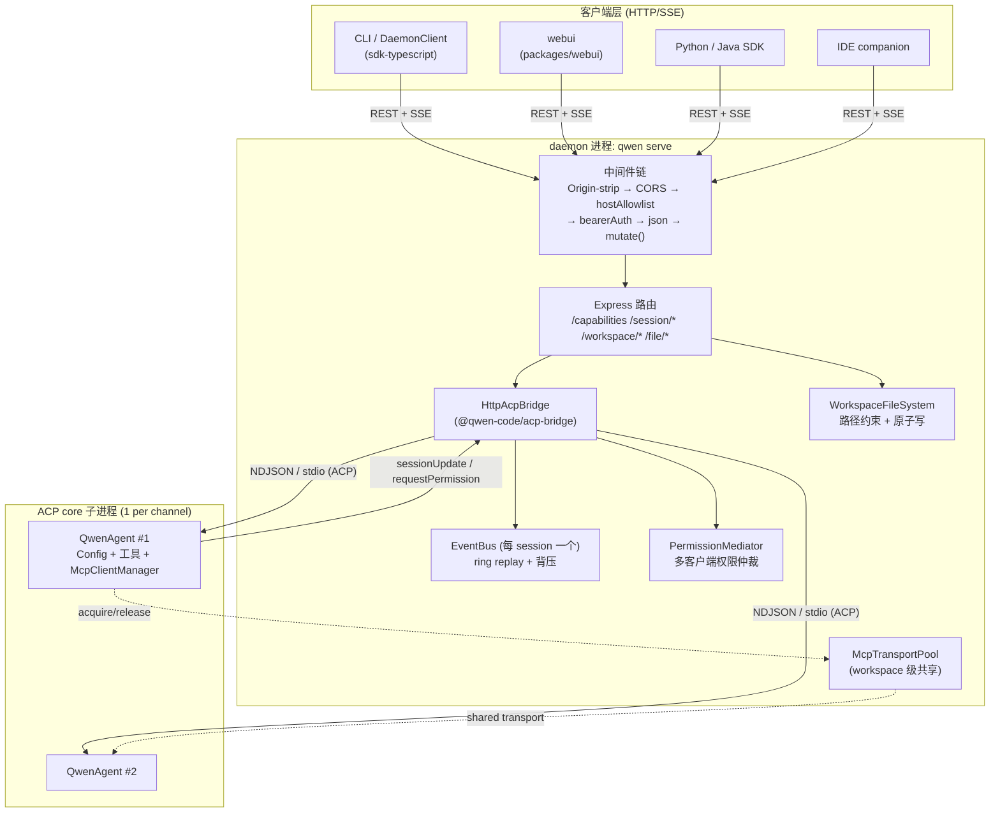
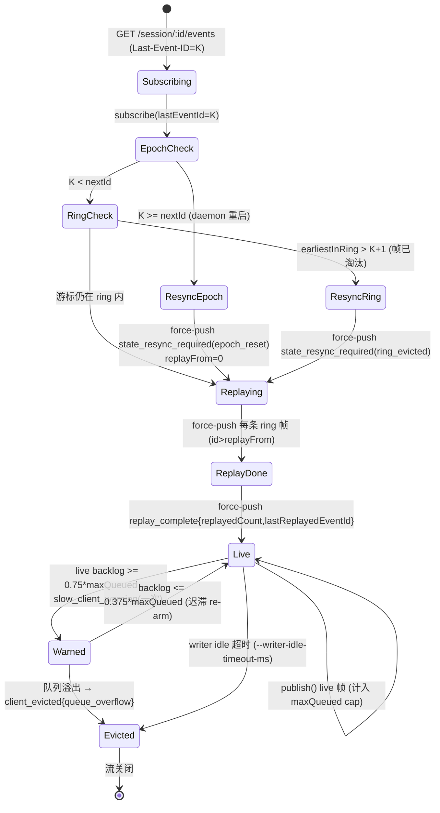
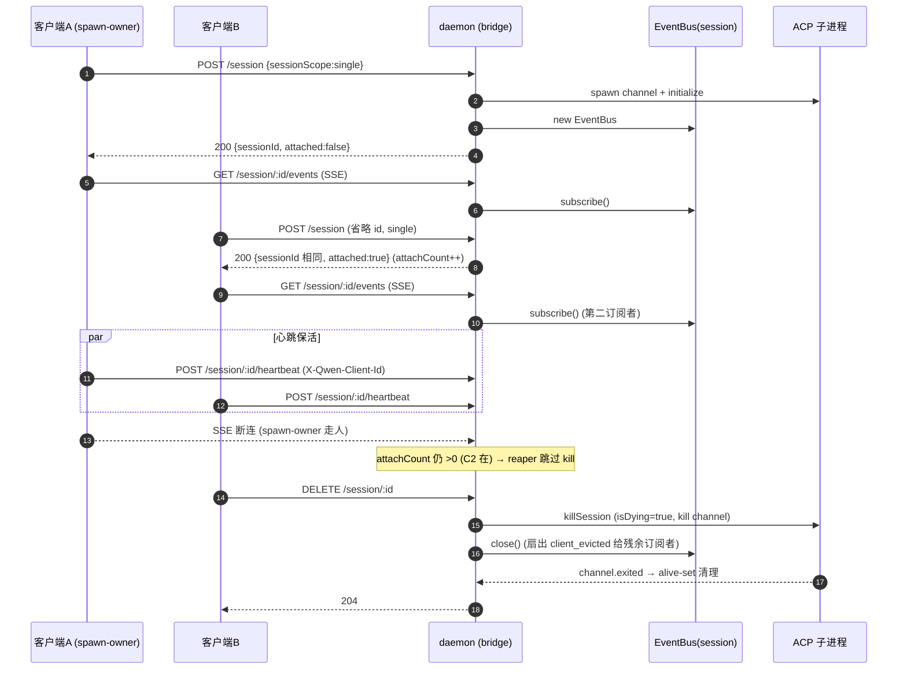
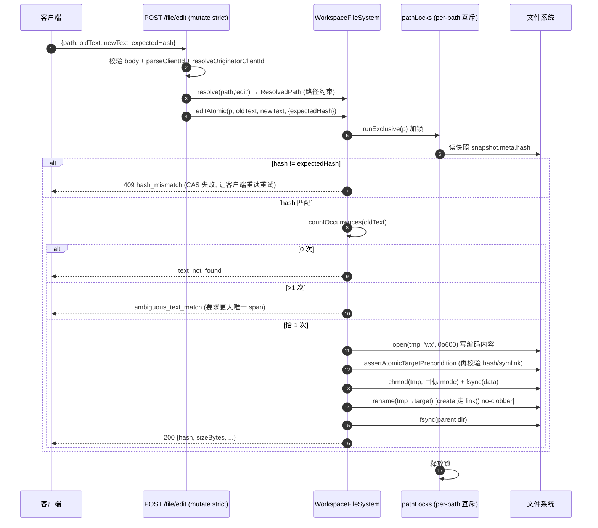
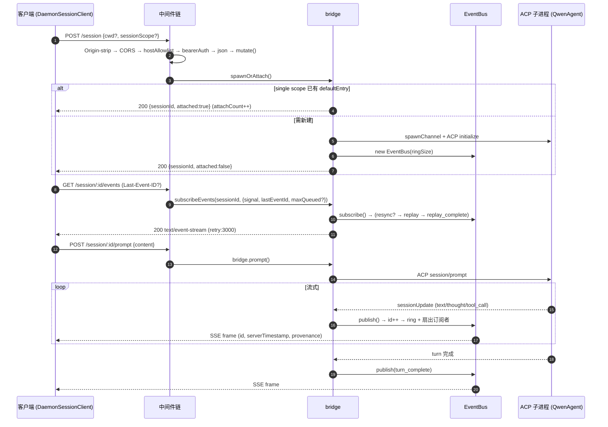

# daemon/serve 模式（Mode B）技术方案

> 适用分支：大部分实现位于集成分支 `daemon_mode_b_main`，部分已合并到 `main`（合并 PR #4490）。文中所有 `file:symbol` 锚点若未特别说明均以 `daemon_mode_b_main` 为准。
> 关联 epic：[#4175](https://github.com/QwenLM/qwen-code/issues/4175)（Mode B daemon roadmap），上游设计 [#3803](https://github.com/QwenLM/qwen-code/issues/3803)。

---

## 深入子文档导航

本目录是 daemon/serve 模式的技术方案集合。本 README 为**总览**（背景、整体架构、设计权衡、PR 全景）；下列子文档对每个子系统做**函数/行级深入**（数据结构、控制流、时序图/状态机、边界与错误、测试覆盖），逐处锚定 `file:symbol`：

| # | 子文档 | 覆盖 |
|---|---|---|
| 01 | [HTTP 服务 / 路由 / 中间件链](01-http-server-and-middleware.md) | 中间件链顺序、路由表、bearer / --require-auth / mutate / CORS / host allowlist 五道闸、deadline / access log |
| 02 | [SSE 事件总线](02-sse-event-bus.md) | EventBus 环形缓冲、replay、BoundedAsyncQueue 背压、state_resync、协议帧 serverTimestamp/provenance/errorKind |
| 03 | [会话生命周期](03-session-lifecycle.md) | spawn/attach/close/delete、sessionScope single/thread、heartbeat、load/resume |
| 04 | [能力注册表与协议](04-capabilities-and-protocol.md) | SERVE_CAPABILITY_REGISTRY、协议版本、typed event schema、协议补全、能力覆盖矩阵 |
| 05 | [工作区文件路由与 FS 边界](05-workspace-files-and-fs-boundary.md) | resolveWithinWorkspace 防穿越、editAtomic hash CAS、原子写 |
| 06 | [MCP 守卫与共享传输池](06-mcp-guardrails-and-pool.md) | per-session 预算 → workspace 共享池、引用计数、env 隔离 |
| 07 | [acp-bridge 抽包与多客户端权限协调](07-acp-bridge-and-permission.md) | 抽包 seam、四策略权限仲裁、并发不变量 |
| 08 | [扩展端点 recap/btw/tasks/shell/rewind/hooks/extensions/settings/logger](08-extension-endpoints.md) | 控制面端点、诊断端点、绕过 prompt FIFO、shell `this`-binding 隐患 |
| 09 | [路线图、覆盖矩阵与当前缺口](09-roadmap-coverage-and-gaps.md) | 以 #3803/#4175 为 spec 的阶段路线图 + PR→文档覆盖矩阵 + 未建设/未文档化缺口（**#4490 mainline 合并仍 CONFLICTING——F1–F5 等 ~40 PR 目前只在 `daemon_mode_b_main`、未进 main/npm**） |
| 10 | [客户端适配器与 SDK](10-client-adapters-and-sdk.md) | DaemonSessionClient、typed events、client identity、TUI/channels/IDE spike、跨客户端协调 |
| 11 | [WebUI 库与 ACP 传输层](11-webui-and-transport.md) | @qwen-code/webui、context-usage API、ACP Streamable HTTP、WebSocket transport |

---

## 1. 背景与动机

qwen-code 的原始形态是一次性 CLI 进程：用户在终端启动 `qwen`，进程内拉起 agent core（模型、工具、MCP、上下文）、跑完一轮或一个交互 session 后退出。这种 **Mode A**（进程内 agent，含早期被搁置的 `qwen --serve`）有两个根本限制：

1. **单客户端、单生命周期**。一个终端 = 一个 agent core。无法让 webui、IDE 插件、SDK 脚本同时驱动同一个工作区上下文；每个客户端都要冷启动一份 core（昂贵的 MCP 子进程、模型预连接、技能扫描重复 N 次）。
2. **无法远程驱动**。SDK（TS/Python/Java）想"附着到一个正在跑的会话"、webui 想"流式渲染另一进程里的工具调用"在 Mode A 下无解——agent 状态全在进程内存里，没有稳定的跨进程协议面。

**Mode B（`qwen serve`）** 的目标：把 agent core 常驻为一个 **HTTP daemon**，对外暴露一套稳定的 REST + SSE 协议，让多种客户端（CLI、webui、SDK、IDE companion）**并发附着到同一个工作区会话**，共享同一份 core 资源。核心设计约束（来自 #3803 §02）：

- **1 daemon = 1 workspace**：每个 daemon 绑定一个规范化的工作区根路径（`boundWorkspace`）；多工作区部署 = 多个 daemon 各监听不同端口。
- **多客户端协作**：同一 session 可被多个客户端 attach，事件通过 SSE 扇出，权限通过仲裁器协调。
- **协议向后兼容**：能力通过 `/capabilities` 的 `features[]` 标签协商，客户端 **gate on features 而非 mode**；老 daemon 缺失新标签即静默降级。

与 Mode A 的本质区别：Mode A 是"进程即会话"，Mode B 是"进程即服务，会话是服务内的一等资源"，并通过一个 **ACP（Agent Client Protocol）bridge** 把 HTTP 协议面与真正跑 agent 的子进程解耦。

---

## 基础贡献归因

**Stage 1 基础**由 @wenshao 奠定（[#3889](https://github.com/QwenLM/qwen-code/pull/3889) +12993 行，2026-05-07 merged）；**1 daemon = 1 workspace** 架构决策亦由 @wenshao 实现（[#4113](https://github.com/QwenLM/qwen-code/pull/4113)，2026-05-13 merged）。客户端适配器/SDK/WebUI 由 @chiga0 主导，传输层（ACP Streamable HTTP）由 @wenshao 实现。本目录文档以上述基础为前提。

---

## 2. 整体架构

### 2.1 进程与分层模型

Mode B 由三层进程构成：

1. **客户端层**：CLI（`DaemonClient`/`DaemonSessionClient` TS SDK）、webui（`packages/webui`）、IDE companion、Python/Java SDK。只说 HTTP/SSE。
2. **daemon 层**：`qwen serve` 进程。内含 Express HTTP 服务（`server.ts`）+ HTTP→ACP bridge（`@qwen-code/acp-bridge`）。负责鉴权、路由、会话登记、SSE 事件总线、文件路由、MCP 池。
3. **ACP core 子进程层**：bridge 为每个 channel `spawn` 一个 ACP agent 子进程（`acpAgent.ts` 里的 `QwenAgent`），它才真正持有 `Config`、模型、工具执行器、`McpClientManager`。bridge 与子进程之间走 NDJSON over stdio 的 ACP 协议。



### 2.2 关键包

| 包 / 目录 | 角色 |
| --- | --- |
| `packages/cli/src/serve/` | daemon 的 HTTP 层：`server.ts`（Express app）、`runQwenServe.ts`（boot/监听）、`auth.ts`、`capabilities.ts`、`fs/`（文件子系统）、`routes/`（文件读写路由）。 |
| `packages/acp-bridge/` | 抽出的可复用 ACP bridge 原语：`bridge.ts`（核心闭包）、`bridgeClient.ts`、`eventBus.ts`、`permissionMediator.ts`、`spawnChannel.ts`、`bridgeFileSystem.ts`、`status.ts`、`bridgeErrors.ts`。被 serve / channels / IDE 共享。 |
| `packages/cli/src/acp-integration/` | ACP **子进程侧**：`acpAgent.ts`（`QwenAgent` 实现 ACP `Agent` 接口）、`session/`（会话状态、emitters、history replay）。 |
| `packages/core/src/tools/mcp-transport-pool.ts` 等 | workspace 级 MCP 共享传输池（F2）。 |
| `packages/sdk-typescript/src/daemon/` | TS SDK：`DaemonClient`（workspace 级）、`DaemonSessionClient`（session 级）、`events.ts`（typed 事件）、`ui/normalizer.ts`（serverTimestamp/provenance 归一化）。 |

`server.ts:createServeApp` 是纯函数（无副作用构建 Express app）；`runQwenServe.ts:runQwenServe` 负责参数校验、boot 门控与 `listen()`。`httpAcpBridge.ts` 现在只是一个 **向后兼容 re-export shim**——F1（#4319）把 bridge 核心整体抬到了 `@qwen-code/acp-bridge`，旧的 `./httpAcpBridge.js` 相对导入路径全部保留以零改造解析（见 `serve/httpAcpBridge.ts` 模块 docstring）。

---

## 3. 子系统详解

### 3.1 HTTP 服务与路由

入口 `packages/cli/src/serve/server.ts:createServeApp`（约 4053 行）。它按**严格顺序**装配中间件 + 路由，顺序本身是安全契约：

```
(loopback 自源 Origin-strip shim)
  → allowOriginCors / denyBrowserOriginCors   (CORS 墙)
  → hostAllowlist(hostname, getPort)          (反 DNS rebinding)
  → [loopback 时 /health /demo 在 bearer 之前注册]
  → 访问日志中间件
  → bearerAuth(token)                         (全局鉴权)
  → express.json({ limit: '10mb' })
  → [非 loopback 时 /health /demo 在 bearer 之后注册]
  → daemonTelemetryMiddleware
  → 业务路由 (/capabilities, /session/*, /workspace/*, /file/*)
  → mountAcpHttp(app, bridge)                 (官方 ACP Streamable HTTP，/acp)
  → 最终 JSON error handler
```

路由按"读 vs 变更"分两类：所有变更路由都过 `mutate()` 门（见 §3.5）。代表性路由（`server.ts` 行号）：

- 能力/健康：`GET /capabilities`（L961）、`GET /health`（L865/943，loopback 与否注册位置不同）。
- 会话：`POST /session`（L1321，spawn/attach）、`POST /session/:id/prompt`（L1625）、`POST /session/:id/cancel`（L1794）、`POST /session/:id/heartbeat`（L1742）、`POST /session/:id/detach`（L1773）、`DELETE /session/:id`（L1820）、`PATCH /session/:id/metadata`（L1919）、`POST /session/:id/load`、`POST /session/:id/resume`（L1544-1545）、`GET /session/:id/events`（L2653，SSE）。
- 工作区状态（只读，不拉起子进程）：`GET /workspace/{mcp,skills,tools,providers,env,preflight}`（L1003-1097）。
- 工作区变更（strict 门控）：`POST /workspace/mcp/servers`、`DELETE /workspace/mcp/servers/:name`、`POST /workspace/init`、`POST /workspace/mcp/:server/restart`、`POST /workspace/tools/:name/enable`（L2194-2575）。
- 文件：`GET /file|/list|/glob|/stat|/file/bytes`、`POST /file/write|/file/edit`（见 §3.6）。

错误统一通过 `sendBridgeError`（L3695）落到 typed JSON：未知 session → `404 SessionNotFoundError`，工作区不匹配 → `400 workspace_mismatch`，超 `--max-sessions` → `503 + Retry-After`（`session_limit_exceeded`），restore 竞争 → `409 restore_in_progress`。`safeBody`（L3159）返回 `Object.create(null)` 防原型污染。

`POST /session` 还内建一组防御：`cwd` 缺省回落 `boundWorkspace`；`cwd` 长度超 `MAX_WORKSPACE_PATH_LENGTH`（4096）先拒（防 10MB body 经 `WorkspaceMismatchError.message` 多次回显放大）；spawn 窗口期客户端断连时用 `res.writable` 检测，避免泄漏孤儿子进程。

### 3.2 SSE 事件流与背压 / replay / resync

核心实现 `packages/acp-bridge/src/eventBus.ts:EventBus`（serve 侧 `serve/eventBus.ts` 仅 re-export）。每个 session 一个 `EventBus`。

**事件帧** `BridgeEvent`：`{ id?, v, type, data, originatorClientId? }`。`id` 是 per-session 单调序号（从 1 起），用于 SSE `Last-Event-ID` 断点续传。**合成终止/告警帧不带 `id`**（`client_evicted`、`slow_client_warning`、`state_resync_required`、`replay_complete`、`stream_error`），否则会在其他订阅者观察到的序列里"烧掉"一个槽位、造成假性 gap。

**bounded ring replay**：`ring: BridgeEvent[]`，默认深度 `DEFAULT_RING_SIZE = 8000`（#3803 §02 设定，可经 `qwen serve --event-ring-size <n>` 覆盖）。`publish()` 把帧推入 ring，超长 `shift()`（满 ring 时 O(n)，已注释为可接受、未来再换环形缓冲）。

**每订阅者背压**：`BoundedAsyncQueue`，默认 `maxQueued = 256`（可经 `GET /session/:id/events?maxQueued=N` 在 `[16,2048]` 内预调）。关键设计——cap **只算 live 帧**：replay/告警/终止帧走 `forcePush` 带 `forced` 标记、不计入 cap（`liveCount` 字段 O(1) 维护），否则一次大 backlog 重连会把刚 resume 的订阅者立刻挤爆。

**slow_client_warning（#4237 / Wave 2.5 PR 10）**：当某订阅者 live backlog 越过 `WARN_THRESHOLD_RATIO = 0.75 × maxQueued`，向它 force-push 一个 `slow_client_warning` 帧，**每个 overflow episode 只发一次**（`sub.warned` 标记），队列回落到 `WARN_RESET_RATIO = 0.375` 以下才重新 arm（迟滞，防抖）。

**client_evicted**：队列真正溢出（`push` 返回 false）→ force-push `client_evicted{reason:'queue_overflow'}` → 关闭队列 → `sub.dispose()`（同时摘除 AbortSignal 监听，修复 stalled 消费者下的堆滞留）。这是**终止**帧，流随之关闭。

**订阅者上限**：`DEFAULT_MAX_SUBSCRIBERS = 64`/session。超限 `subscribe()` 抛 `SubscriberLimitExceededError`，SSE 路由捕获后返回 **`429 + Retry-After`**（不是 `200 + stream_error`，因为后者会触发 `EventSource` 自动重连放大攻击面）。

**state_resync_required（resync 语义）**：当客户端带 `Last-Event-ID` 重连但游标已被 ring 淘汰或跨越 epoch（daemon 重启使 `nextId` 归 1），EventBus 在 replay **之前**先 force-push 一个 `state_resync_required` 帧，**但流保持 OPEN**（与 `client_evicted` 不同）。两种原因：

- `ring_evicted`：`earliestInRing > lastEventId + 1`，中间帧已被淘汰。
- `epoch_reset`：`lastEventId >= this.nextId`，游标属于已死 epoch（daemon 重启）。此时 replay 全量重放当前 ring（`replayFrom = 0`）。

SDK reducer 看到该帧后置 `awaitingResync`，先调 `loadSession` 拉全量再恢复应用增量。SSE 路由侧（`server.ts` SSE handler）还会把 resync 写一行 stderr 便于排障（"ring eviction detected … gap=N events"）。



**SSE 写侧背压（`server.ts` SSE 路由 L2653-3059）**：`res.write` 返回 false（内核发送缓冲满）时 `await drain`，避免用户态无界堆积；所有写（含心跳）经 `writeChain` 单飞串行化，防止心跳与主循环交错写半个 SSE 帧。15s 心跳保活（`: heartbeat`）。`--writer-idle-timeout-ms`（T2.9/#4530）加一层应用级 idle 守卫：若"最近一次成功 flush"早于预算则直写 `client_evicted{writer_idle_timeout}` 并清理（绕过可能已卡死在 drain 的 chain）。

### 3.3 会话生命周期与 sessionScope

核心 `packages/acp-bridge/src/bridge.ts`（约 4666 行，`createHttpAcpBridge` 工厂闭包）。会话状态登记在 `byId: Map<sessionId, SessionEntry>`。每个 entry 持有：`events: EventBus`、`channelInfo`（attach 目标 channel + ACP connection）、`attachCount`、`lastHeartbeatAt` / per-client 心跳表、`isDying` / 反 reap tombstone 等。

**spawn vs attach**：`bridge.spawnOrAttach({ workspaceCwd, modelServiceId?, clientId?, sessionScope? })`（`POST /session` 调用）。

- **sessionScope `'single'`（默认）**：daemon 维护一个 `defaultEntry`（单一 attach 目标）。省略 session id 的 `POST /session` 会 attach 到它（`attached: true`），实现"多客户端共享同一活跃会话"的实时协作。`attachCount` 计数 attach-after-spawn 次数。
- **sessionScope `'thread'`**：每次 spawn 都是隔离会话，**绝不**成为 `defaultEntry`（否则后续省略 scope 的调用会误 attach 到本应隔离的线程）。
- 每请求 `sessionScope` override 是 #4209（Wave 2 PR 5）引入的，路由边界校验非法值返回 `400 invalid_session_scope`；bridge 侧二次校验防直接调用者。客户端应先 pre-flight `caps.features` 的 `session_scope_override`，老 daemon 静默忽略该字段。

**心跳**：`POST /session/:id/heartbeat`（#4235 / Wave 2.5 PR 9）。带可信 `X-Qwen-Client-Id` 时写 per-client 心跳表；用于 server.ts 里的**断连 reaper**——`single` scope 下 spawn-owner 断连时，若 `attachCount` 仍非零（有别的客户端 attach 着）则**不**拆会话（PR #3889 review BQ9tV 的方案：track attached-after-spawn 计数，有他人 attach 就跳过 kill）。`BkwQP` tombstone 处理"spawn-owner 已断连、想 reap 但还有人在"的延迟拆除：后续 `detachClient` 把 `attachCount` 归零时再补完 reap。

**load / resume**（#4222）：`POST /session/:id/load`（ACP `connection.loadSession`，重放完整历史）与 `POST /session/:id/resume`（ACP `connection.unstable_resumeSession`，`unstable_` 前缀因底层 ACP 方法名未定稿）。同 id 的 load↔resume 交叉竞争返回 `409 restore_in_progress`；同动作竞争（load vs load）走 coalesce 合并而非报错。restore 用一个独立的 `pendingRestoreEvents` EventBus 先承接重放，settle 后并入正式 entry。

**close / detach / delete**（#4240 / Wave 2.5 PR 11）：`DELETE /session/:id`（`closeSession`，attach 不计入 `--max-sessions` cap）、`POST /session/:id/detach`（`detachClient`，仅减引用）、`POST /sessions/delete`（批量）、`PATCH /session/:id/metadata`（重命名等）。`closeSession`/`killSession` 标 `isDying` 同步、`kill()` channel、由 `channel.exited` handler 在 OS reap 后做 alive-set 清理；这期间并发 `spawnOrAttach` 能立刻 spawn 一个全新 channel 并重指 `channelInfo`（不必等 OS reap）。



### 3.4 能力注册表与协议版本

`packages/cli/src/serve/capabilities.ts`。`SERVE_CAPABILITY_REGISTRY` 是单一事实源（`as const satisfies Record<string, ServeCapabilityDescriptor>`），每个 tag 带 `since: ServeProtocolVersion`（当前仅 `'v1'`）和可选 `modes`（如 `mcp_guardrails: { modes: ['warn','enforce'] }`、`permission_mediation: { modes: ['first-responder','designated','consensus','local-only'] }`）。

`/capabilities` 返回 `{ v, protocolVersions:{current,supported}, mode, features[], modelServices:[], workspaceCwd, policy:{permission} }`。客户端契约（#3803 §10）：**gate UI on `features`，不要 gate on `mode`**。`v` 自增表示帧布局不兼容变更；`protocolVersions`/`workspaceCwd` 是 v=1 之上的 additive 字段，老 daemon 省略。

**条件标签**：`CONDITIONAL_SERVE_FEATURES` 是一个 `Map<ServeFeature, (toggles)=>boolean>`，把"是否广告该 tag"的判定与 tag key 并置。`getAdvertisedServeFeatures(protocolVersion, toggles)` 过滤：无 Map 条目 = 无条件广告（baseline）；有条目 = 跑 predicate。当前条件标签：`require_auth`（`--require-auth` 开）、`mcp_workspace_pool`/`mcp_pool_restart`（池开，`mcpPoolActive`）、`allow_origin`（配了 `--allow-origin`）、`prompt_absolute_deadline`/`writer_idle_timeout`（配了对应预算）。"tag 存在 = 行为开启"是客户端可依赖的硬契约。该 Map 形状把原先需要 4 处协调改动（registry/set/interface/branch）的"加条件标签"收敛为 2 处，且 `server.test.ts` 迭代 Map keys 做不变式断言。

`mcp_guardrails` 刻意是**无条件**标签（即使没配 budget 也广告，`budgetMode:'off'`），与上面的条件标签区分。`protocolVersions` 由 #4191 引入。

### 3.5 鉴权与变更门控（bearer / --require-auth / mutate / CORS / host allowlist）

实现在 `packages/cli/src/serve/auth.ts`，boot 门控在 `runQwenServe.ts`。四道闸：

**1. host allowlist（`hostAllowlist`）**：仅 loopback bind 生效，反 DNS rebinding。允许 `localhost:port` / `127.0.0.1:port` / `[::1]:port` / `host.docker.internal:port`（Host 大小写不敏感、按 port 缓存 Set）。非 loopback bind 直接放行（操作者自选暴露面，靠 bearer 兜底）。

**2. CORS**：默认 `denyBrowserOriginCors`——任何带 `Origin` 头的请求返回 `403 {"error":"Request denied by CORS policy"}`（CLI/SDK 从不发 Origin，发了就是浏览器、视为未授权上下文）。配了 `--allow-origin <pattern>`（T2.4/#4527）则换成 `allowOriginCors`：`*` 或规范 origin（`new URL(p).origin === p` 严格往返校验，否则 boot 抛 `InvalidAllowOriginPatternError`）。匹配 origin 回显 `Access-Control-Allow-Origin: <origin>` + `Vary: Origin` + 标准 CORS 头；`Origin: null`（sandboxed iframe / file://）一律 403；OPTIONS 预检短路 204。**不**发 `Access-Control-Allow-Credentials`（daemon 用 bearer-in-Authorization，跨域无需 credentials）。loopback 自源请求由一个 CORS 之前的 Origin-strip shim 处理（剥掉自身端口的 Origin），不必把自己端口列进 allowlist。

**3. bearerAuth（全局）**：`token` 未配时是开放门（仅 loopback 开发默认可达此分支）。配了 token 则每路由必带 `Authorization: Bearer <token>`：scheme 大小写不敏感、token 值 SHA-256 后 `timingSafeEqual` 常数时间比较（避免按字节短路泄漏）；401 响应体在 missing/wrong-scheme/wrong-token 间统一。手写 `indexOf(' ')` 切分而非正则（避开 CodeQL 的多项式回溯告警）。

**4. mutate() 变更门（#4236 / PR 15）**：`createMutationGate({ tokenConfigured, requireAuth })` 返回 `(opts?)=>RequestHandler` 工厂。矩阵：

| daemon 配置 | 路由 opts | 结果 |
| --- | --- | --- |
| `requireAuth=true` | 任意 | passthrough（全局 bearer 已拦） |
| 配了 token | 任意 | passthrough（全局 bearer 已强制） |
| 无 token（loopback 开发） | `strict=false` | passthrough（保留"loopback 开放"旧行为） |
| 无 token（loopback 开发） | `strict=true` | `401 {code:'token_required'}` |

Wave 1-2 路由用 `mutate()`（非 strict，仅作集中化标记，无行为变化）；Wave 4 写类路由（memory/file edit/tool enable/MCP restart/device-flow）用 `mutate({strict:true})`，确保"没显式配 token 就绝不可达"，不必依赖操作者额外加 `--require-auth`。`token_required` 这个 distinct code 让 SDK 能区分"路由要求配 token"与普通 401。

**boot 门控（`runQwenServe.ts`）**：非 loopback bind 无 token → boot 拒绝；`--require-auth` 无 token → boot 拒绝；`--allow-origin '*'` 无 token → boot 拒绝（任何本地页都能驱动）。token 在 boot 时 trim（`export QWEN_SERVER_TOKEN=$(cat token.txt)` 常带尾 `\n`）。

`/health` 豁免：loopback bind 上 `/health`（与 `/demo`）注册在 bearer **之前**，便于 k8s/Compose 探针免 token；`--require-auth` 开时取消豁免。非 loopback bind 上 `/health` 注册在 bearer **之后**（否则未授权者可探测任意地址确认 daemon 存在）。

### 3.6 工作区文件路由与路径约束

文件子系统 `packages/cli/src/serve/fs/`，路由 `packages/cli/src/serve/routes/`。分层：`paths.ts`（边界解析）→ `workspaceFileSystem.ts`（IO + 原子写）→ `routes/workspaceFile{Read,Write}.ts`（HTTP）。能力分三档：`workspace_file_read`（`GET /file|/list|/glob|/stat`，#4269 PR 19）、`workspace_file_bytes`（`GET /file/bytes`，#4280 PR 20）、`workspace_file_write`（`POST /file/write|/file/edit`，strict 门控）。

**路径约束 `fs/paths.ts:resolveWithinWorkspace(input, boundWorkspace, intent)`**，返回 branded `ResolvedPath`（编译期防绕过）。流程：

1. `hasSuspiciousPathPattern(input)`——拒 NTFS ADS（`:` 在 drive-letter 槽后）、8.3 短名（`~\d`）、长路径前缀（`\\?\`/`//?/`）、UNC（`\\server\share`，顺带挡 SMB/DNS lookup）、尾点尾空格、DOS 设备名、≥3 连续点。用**检测而非规范化**（规范化依赖文件存在，write intent 下叶子按定义不存在；且规范化→检查有 TOCTOU 窗口）。
2. `path.resolve(boundCanonical, input)` 后 `isWithinRoot` 纯文本预过滤（无 FS 调用挡 `..` 逃逸）。
3. `fsp.realpath` 规范化；`ENOENT` 且 intent ∈ `{write, stat}` 时走**悬挂符号链接逃逸守卫**：逐跳 `lstat`+`readlink` 走完整 symlink 链（带 inode 访问集查环 + `MAX_ANCESTOR_HOPS` 深度上限），堵住 `<ws>/leak -> /etc/cron.d/evil`（目标尚不存在）和多跳 `leak -> middle -> /etc/passwd` 这类绕过。

`Intent = 'read'|'write'|'edit'|'list'|'glob'|'stat'`；`edit` 与 `write` 分开仅为审计/穷尽性，门控相同。

**CAS + 原子写（`workspaceFileSystem.ts`）**：`writeTextAtomic`（`mode: 'create'|'replace'`）与 `editAtomic`。路由层 `routes/workspaceFileWrite.ts`：`replace` 必带 `expectedHash`（`sha256:<64 hex>`，`isContentHash` 校验），`edit` 必带 `expectedHash` + `oldText`/`newText`。核心写链（`atomicWriteTextResolvedFile`）：



要点：per-path 互斥 `pathLocks.runExclusive` 串行化同文件并发写；tmp 文件名带 `pid + randomBytes(6)`；rename 前再次 `assertAtomicTargetPrecondition`（防 TOCTOU）；parent 是 symlink 直接 `symlink_escape`；`create` 用 `fsp.link()`（EEXIST 原子）而非 rename（POSIX rename 会静默覆盖）兑现 no-clobber 契约；`fsync` data + parent dir 保证崩溃一致性。ACP 子进程侧的文件读写经 `bridgeFileSystemAdapter.ts` 复用**同一** `WorkspaceFileSystemFactory`，共享审计流与信任门（F1 的 `BridgeFileSystem` seam）。

### 3.7 MCP 守卫与共享传输池

两阶段演进，都挂在 epic #4175：

**阶段一：per-session 守卫（#4247 PR 14 + #4271 PR 14b）**。每个 ACP session 自己构造 `Config` + `McpClientManager`，`--mcp-client-budget=N` + `--mcp-budget-mode={enforce,warn,off}` 在 session 内做软/硬限。`GET /workspace/mcp` 暴露 `clientCount`/`clientBudget`/`budgetMode`/`budgets[]`，per-server cell 带 `disabledReason:'budget'`。push 事件（PR 14b）：`mcp_budget_warning`（75% 上穿一次、37.5% 迟滞 re-arm）与 `mcp_child_refused_batch`（每轮 discovery / readResource 拒绝时合批，仅 enforce）。**v1 局限：预算是 per-session 而非 per-workspace**——`--mcp-client-budget=10` × 5 并发 session 实际可达 50 个 live client（`budgets[0].scope:'session'` 是诚实信号）。

**阶段二：workspace 级共享传输池 F2（#4336）**。`packages/core/src/tools/mcp-transport-pool.ts:McpTransportPool` 挂在 `QwenAgent.mcpPool`（`acpAgent.ts`），让所有 session 复用同一批 MCP 传输：

- API：`acquire(name, cfg, sessionId)` / `release(id, sessionId)` / `releaseSession(sessionId)`（反向索引 O(refs) 批量释放）/ `drainAll`。
- entry 按 **`(name, fingerprint)`** keyed（`mcp-pool-key.ts`）。fingerprint = 截断 SHA-256（16 hex/64 bit），对 config + 规范化 OAuth 全字段哈希（`canonicalOAuth` 把 `{}`/`{enabled:false}`/`null` 都折叠为"无 OAuth"，scopes/audiences 排序）。**关键安全**：注入了不同 OAuth 头/clientSecret/audiences 的 session 得到**不同 entry**，绝不共享传输（避免凭证泄漏到他 session）。
- 仅 `stdio`/`websocket` 默认入池（`POOLED_TRANSPORTS_DEFAULT`，真 OS 子进程、状态可隔离）；SDK MCP server 永远 per-session 旁路；HTTP/SSE 需显式 opt-in。
- 引用计数：refs=0 启动 drain timer；`maxIdleTimer` 硬上限（5min）；`spawnInFlight` 去重并发 acquire；spawn 失败释放预留 budget 槽。大量 review fold-in（doc `docs/design/f2-mcp-transport-pool.md` 记录 32 条）围绕 close-cb slot-release 竞争、statusChangeListener 跨 fingerprint 串扰、restart 时 pid 后代清扫等。
- `mcp_workspace_pool`/`mcp_pool_restart` 条件标签随池开关，`QWEN_SERVE_NO_MCP_POOL=1` kill switch 回落 per-session。`POST /workspace/mcp/:server/restart` 支持 `?entryIndex=N|*`，多 entry 时返回 `{entries:[...]}`。
- T2.8（#4552）加运行时增删：`POST /workspace/mcp/servers` / `DELETE /workspace/mcp/servers/:name`。

### 3.8 acp-bridge 抽包

`packages/acp-bridge/`（monorepo 内、不发 npm）。动机：bridge 的事件总线/通道/权限/状态契约不止 `qwen serve` 要用，channels、IDE companion、未来 TUI co-host、WebSocket transport 都要复用同一套原语，避免并行实现多套事件流。抽包分多个 slice 渐进完成（见 `packages/acp-bridge/README.md`）：

| Slice | PR | 抬升内容 |
| --- | --- | --- |
| PR 22a | #4295 | skeleton + `EventBus` + `inMemoryChannel` + `AcpChannel` 类型 + `PermissionMediator` 类型桩 |
| PR 22b/1 | #4298 | `status` + `workspacePaths` + `bridgeErrors` + `bridgeTypes` |
| PR 22b/2 | #4304 | `BridgeOptions` + 新 `DaemonStatusProvider` 注入 seam |
| F1 | #4319/#4334 | `defaultSpawnChannelFactory` + `BridgeClient` + `createHttpAcpBridge` 工厂闭包 + `BridgeFileSystem` seam |
| F1 测试拆分 | #4445 | 把 6861 行的 `bridge.test.ts` 抬到 acp-bridge |
| F3 PR 24 | #4335 | 实现四种 `PermissionMediator` 策略（first-responder / designated / consensus / local-only）+ pair-token 撤销 + 审计。已合入。 |

抽包后 serve 侧 `httpAcpBridge.ts` / `eventBus.ts` 退化为 re-export shim，所有相对导入零改造。`#4300` 顺带把 channel-closed / missing-cli-entry 从 regex 匹配改为 typed `instanceof` 异常。包对外注入 seam（`DaemonStatusProvider` / `BridgeFileSystem` / `ChannelFactory`）让 serve 之外的宿主（IDE 自 spawn）也能装配 bridge。

### 3.9 多客户端权限仲裁（F3 / permission mediation）

`packages/acp-bridge/src/permissionMediator.ts`（约 1318 行）。多客户端 attach 同一 session 时，ACP 子进程的一次 `requestPermission` 要在多个客户端间裁决。`PermissionMediator` 单类 `switch(entry.policy)` 分派四策略（`permission_mediation` 能力的 `modes`）：

- `first-responder`：第一个投票者定胜负（v1 默认，最简）。
- `designated`：仅指定 originator 的票算数（非 originator 票 `forbidden`）。
- `consensus`：达到 quorum 才决（`consensusQuorum` 上限封顶到 `votersAtIssue.size` 防不可达）。
- `local-only`：仅 loopback 投票者算数（远程票 `remote_not_allowed`）。

`POST /session/:id/permission/:requestId`（per-session 投票）与 `POST /permission/:requestId`（daemon 级）。`CANCEL_VOTE_SENTINEL = '__cancelled__'` 是**跨策略逃逸**：voter 的 `{outcome:'cancelled'}` 在策略分派**之前**先路由（agent 侧 abort 路径，不受 policy 门控）；该 sentinel 不在 wire `allowedOptionIds` 集里，防 wire 客户端伪造。`resolved` map 是 bounded FIFO 做重复投票去重。`PermissionDecisionReason` 是 discriminated union（`first-responder`/`designated-originator`/`consensus-quorum`/`local-only-loopback`/`agent-cancelled`/`voter-cancelled`），审计经 `PermissionAuditPublisher`。runtime 活跃策略在 `/capabilities` 的 `policy.permission`（区别于能力 `modes` 的 build-supported 集）。

### 3.10 SDK 协议补全与扩展端点

**SDK 协议补全（F4 prereq / #4360）**：daemon 事件帧补齐 `serverTimestamp`（事件产生的服务端时间）、`provenance`（工具来源：builtin / mcp / ...）、`errorKind`（分类错误码，UI 据此渲染 typed 响应而非 regex 匹配人读字符串），及前述 `state_resync_required`。TS SDK `ui/normalizer.ts` 按 `serverTimestamp`（top-level）→ `_meta.serverTimestamp` → `data._meta.serverTimestamp` 三处回落抽取；`extractToolProvenance` 抽 `provenance`/`serverId`，未知回落 `'unknown'`。`mapDomainErrorToErrorKind`（acp-bridge `status.ts`）做分类。SDK：`DaemonClient`（workspace 级：capabilities/file/memory/agents/mcp 等）与 `DaemonSessionClient`（session 级：prompt/cancel/events/heartbeat）。

**扩展端点**（多为 #4514 / F5 批次）：

| 端点 | PR | 作用 |
| --- | --- | --- |
| `POST /session/:id/recap` | #4504 | 跑 `generateSessionRecap` 出一句"上次到哪了"摘要（fast model 侧查询，best-effort，`recap:null` 也是 200）。 |
| `POST /session/:id/btw` | #4610 | session 上下文的旁路问题（单轮、无工具、`runForkedAgent` cache 路径），带 `res.once('close')` abort。 |
| `POST /session/:id/shell` | #4576 | server-side `!`（bang）shell 执行，返回 `{exitCode,...}`，socket close abort。 |
| `GET /session/:id/tasks` | #4578 | 任务快照（agent/monitor/process/shell 各类 task 状态）。 |
| `GET /session/:id/stats` | #4515 follow-up | 会话统计快照：模型请求/token 累计、工具调用/决策累计、文件增删行。`/export` 仍未落地。 |
| `GET /session/:id/rewind/snapshots` / `POST /session/:id/rewind` | #4820 | HTTP rewind：列可回退 prompt 快照，按 `promptId` 截断会话并恢复文件，成功后发 `session_rewound` SSE。 |
| `GET /workspace/hooks` / `GET /session/:id/hooks` | #4822 / #4834 | hook 配置/运行时诊断；workspace 级返回静态 hook 事件元信息，session 级返回 runtime hooks。#4834 将 focused daemon hooks 暴露给 webui。 |
| `GET /workspace/extensions` | #4832 | extension 诊断：列已加载 extension、安装元信息、MCP/skill/agent/hook/command/context/settings 能力计数。 |
| `GET /workspace/settings` / `POST /workspace/settings` | #4816 | web-shell 设置面；只暴露非 TUI-only、非安全敏感 key，写入仅 workspace scope，strict mutation gate，并发 `settings_changed` 事件。 |
| daemon 文件日志 | #4559 | `daemonLogger.ts`，结构化落盘（SSE open/close、recap、shell、cancel 等）。 |
| request 级日志 | #4606 | 路由访问日志中间件（bearer 与 json parser 之前）。 |
| `POST /session/:id/compress` / `_meta` | #4516 | 上下文压缩 + 会话元信息（**#4516 已关闭未合入**，daemon_mode_b_main 无此路由/能力标签）。 |
| `/export` | #4515 | 导出端点未落地；`session_stats` 已落地但 export 仍无路由/能力标签。 |
| `followup_suggestion` 事件 | #4507 | server-pushed 后续建议（webui）。 |
| telemetry tool spans + session.id | #4630 | daemon/ACP 路径补 tool span 与 session.id（见 telemetry 方案）。 |

`recap`/`btw`/`shell` 都用 `mutate()`（非 strict，与 `/prompt` 同 posture：token 成本而非状态变更）。`DaemonWorkspaceService`（#4563）从 `AcpSessionBridge` 抽出 workspace 级状态读取（方案 C）。

---

## 4. 关键流程（时序图 / 调用链）

### 4.1 客户端 spawn/attach session + 发 prompt + SSE 流式返回



prompt 路由还支持 `--prompt-deadline-ms`（绝对超时，超时返回 `errorKind:'prompt_deadline_exceeded'`）与 non-blocking prompt（`NonBlockingPromptAccepted`，立即 202 后经 SSE 跟进）。

### 4.2 多客户端 attach 同一 session + heartbeat + close

见 §3.3 的时序图（spawn-owner 断连但因 `attachCount>0` 不被 reap，由后来者 `DELETE` 真正拆除）。要点链：`spawnOrAttach`（attach 分支 `attachCount++`）→ 两个独立 SSE `subscribe()` 共享同一 `EventBus`（`publish` 一次扇出两订阅者，各自 `maxQueued` 背压独立）→ per-client `heartbeat` 写心跳表 → reaper 读 `attachCount`/tombstone 决定是否 kill。

### 4.3 工作区文件写 edit 的鉴权 + CAS + 原子写链路

见 §3.6 的时序图。完整闸链：`mutate({strict:true})`（无 token 的 loopback 直接 `401 token_required`）→ body 校验 + `parseClientId` + `resolveOriginatorClientId`（client 未注册 → `400 invalid_client_id`）→ `resolveWithinWorkspace`（symlink/越界守卫）→ `pathLocks.runExclusive`（per-path 锁）→ 读快照比对 `expectedHash`（不符 `409 hash_mismatch`）→ `oldText` 出现次数判定 → tmp 写 + chmod + fsync(data) + rename/link + fsync(parent)。`originatorClientId` 进 `BridgeEvent.originatorClientId`，供其他客户端在 SSE 上抑制自己动作的回声。

---

## 5. 关键设计决策与权衡

1. **per-session MCP 预算 → workspace 共享池**。v1（PR 14）选 per-session 计数器 + 软 enforce 作为最小可用基座，诚实地用 `scope:'session'` 标注其非聚合性；F2（#4336）才上 workspace 级池做真正跨会话聚合。权衡：池带来巨大资源节省（N session 共享一批 stdio 子进程），但引入引用计数、fingerprint 隔离、drain/evict 竞争等复杂度（32 条 review fold-in 是代价证据），故用 `QWEN_SERVE_NO_MCP_POOL=1` 保留回退。fingerprint 必须哈希 OAuth 全字段，否则差异凭证会串享传输——安全优先于去重率。

2. **sessionScope single vs thread**。`single` 服务"多客户端实时协作同一活跃会话"（webui + CLI 看同一上下文）；`thread` 服务"隔离并发会话"。默认 `single` 保持与 Mode A 直觉一致（一个工作区一个活跃会话）。代价是 `single` 下的 attach/reap 语义复杂（`attachCount` + tombstone + 断连 reaper），但这是多客户端共享的本质复杂度。

3. **严格 vs 非严格 mutate**。不做"一刀切全 strict"，而是 Wave 1-2 路由 `mutate()` 仅集中化、Wave 4 写类路由 `strict:true`。理由：保留 loopback 开发零配置体验（本机随手 `qwen serve` 就能跑 prompt），同时对真正危险的写/auth 路由强制 token。`token_required` 这个 distinct code 让 SDK 能给出精确补救提示，而非笼统 401。

4. **SSE replay ring 取舍**。ring 默认 8000（不是更小的 1000，因为一个 chatty turn 可能几百帧，5s 重连窗口要兜住），代价是每 session 几百 KB RAM + 满 ring 时 O(n) shift。环形缓冲改 O(1) 被刻意推迟到 profiling 真正报警。`maxQueued` cap 只算 live 帧、replay/告警走 `forced` 不计入，是兑现"重连不被自己的 backlog 挤爆"契约的关键。`state_resync_required` 选择"保持流 OPEN + 继续 replay"而非终止，让 SDK 能算"你错过了什么"diff 且不必再次重连（网络友好）。

5. **acp-bridge 抽包动机**。bridge 原语要被 serve / channels / IDE / 未来 TUI 共享，与其各写一套事件流不如抽成包并提供注入 seam（`DaemonStatusProvider`/`BridgeFileSystem`/`ChannelFactory`）。代价是大规模机械迁移 + re-export shim 维护，但换来单一事实源与可测性（6861 行测试一并抬升）。

6. **协议向后兼容**。所有新能力都是 additive：新 tag、新 additive 字段（`protocolVersions`/`workspaceCwd`/`serverTimestamp`/`errorKind`）老 daemon 省略即可，客户端 gate on `features` 而非版本号。`v` 仅在帧布局不兼容时自增。`unstable_session_resume` 用前缀显式标注底层 ACP 方法未定稿。这套"feature-detect 而非 version-pin"让新旧 SDK 与新旧 daemon 任意组合都能优雅降级。

7. **HTTP 写侧单飞 + 双层 idle 检测**。SSE 写经 `writeChain` 串行化（防心跳与主循环交错写半帧），15s 心跳靠 drain 背压探测 TCP 死写，`--writer-idle-timeout-ms` 加正交的应用级 idle 守卫（直写绕过卡死的 chain）。这是"既要保活又要能杀死真正卡死的写者"的平衡。

---

## 6. 涉及 PR

> 按子系统分组；epic #4175 的 Wave/PR 编号在括号内。

### 基础设施 / 抽包 / 集成

| PR | 子主题 | 一句话作用 |
| --- | --- | --- |
| #4205 | 性能基线 | daemon baseline 测试 harness（Wave 1 PR 1）。 |
| #4160 | 重构 | 抽 `createInMemoryChannel` helper。 |
| #4295 | acp-bridge | skeleton + 抬升 EventBus/inMemoryChannel/AcpChannel/Mediator 桩（PR 22a）。 |
| #4298 | acp-bridge | 抬升 status/paths/errors/bridgeTypes（PR 22b/1）。 |
| #4304 | acp-bridge | 抬升 BridgeOptions + DaemonStatusProvider seam（PR 22b/2）。 |
| #4300 | 重构 | channel-closed / missing-cli-entry 改 typed 异常。 |
| #4319 | acp-bridge F1 | 包自给自足（机械 lift + BridgeFileSystem seam）。 |
| #4334 | acp-bridge F1 | F1 follow-up：BridgeFileSystem wiring + channelInfo 修复。 |
| #4445 | acp-bridge F1 | 抬升 6861 行 bridge.test.ts。 |
| #4469 #4500 | 集成 | main → daemon_mode_b_main 同步。 |
| #4490 | 集成 | daemon_mode_b_main → main 合并（F1/F2/F3/F4-prereq + F5 alpha 批）。 |

### HTTP 服务 / 会话 / 能力

| PR | 子主题 | 一句话作用 |
| --- | --- | --- |
| #4191 | 能力注册表 | capability registry + protocol versions。 |
| #4209 | 会话 | `POST /session` 的 per-request `sessionScope` override（Wave 2 PR 5）。 |
| #4222 | 会话 | session load/resume。 |
| #4235 | 会话 | client heartbeat（Wave 2.5 PR 9）。 |
| #4240 | 会话 | session metadata + close/delete 生命周期（Wave 2.5 PR 11）。 |
| #4241 | 状态路由 | 只读 workspace/session 状态路由。 |
| #4251 | 状态路由 | preflight + env 诊断路由（Wave 3 PR 13）。 |
| #4516 | 会话 | `POST /session/:id/compress` + `_meta`（T1.3/T1.4）。**已关闭未合入 daemon_mode_b_main**。 |
| #4515 | 会话 | 原 `stats/export` PR 已关闭未合入；`GET /session/:id/stats` 后续已在 daemon_mode_b_main 落地，`/export` 仍未落地。 |

### SSE / SDK 协议

| PR | 子主题 | 一句话作用 |
| --- | --- | --- |
| #4237 | SSE | replay sizing + slow_client_warning 背压（Wave 2.5 PR 10）。 |
| #4226 | SSE/SDK | 广告 typed_event_schema + 固定 SDK 公共面（PR 4 follow-up）。 |
| #4360 | SDK 协议 | F4 prereq：serverTimestamp/provenance/errorKind/state_resync_required。 |
| #4507 | SSE | server-pushed followup_suggestion 事件（webui）。 |

### 鉴权 / 变更门控

| PR | 子主题 | 一句话作用 |
| --- | --- | --- |
| #4236 | 鉴权 | mutation gating helper + `--require-auth`（PR 15）。 |
| #4527 | CORS | `--allow-origin <pattern>` allowlist（T2.4）。 |
| #4255 #4291 | auth | device-flow 路由 + follow-up（PR 21）。 |
| #4530 | 超时 | prompt 绝对 deadline + SSE writer idle timeout（T2.9）。 |

### 文件路由 / 工作区变更

| PR | 子主题 | 一句话作用 |
| --- | --- | --- |
| #4250 | 文件 | FileSystemService 边界（Wave 4 PR 18）。 |
| #4269 | 文件 | 安全 workspace 文件读路由（PR 19）。 |
| #4280 | 文件 | workspace 文件 write/edit 路由（PR 20）。 |
| #4249 | 工作区 | workspace memory + agents CRUD（Wave 4 PR 16）。 |
| #4282 | 工作区 | approval/tools/init/MCP-restart 变更路由（Wave 4 PR 17）。 |

### MCP 守卫 / 共享池

| PR | 子主题 | 一句话作用 |
| --- | --- | --- |
| #4247 | MCP 守卫 | MCP client guardrails（Wave 3 PR 14，per-session 预算）。 |
| #4271 | MCP 守卫 | guardrail push 事件 + 迟滞（Wave 3 PR 14b）。 |
| #4336 | MCP 池 | workspace 级共享传输池（F2）。 |
| #4552 | MCP | 运行时 MCP server add/remove（T2.8）。 |

### 扩展端点

| PR | 子主题 | 一句话作用 |
| --- | --- | --- |
| #4504 | recap | `POST /session/:id/recap`。 |
| #4610 | btw | `POST /session/:id/btw` 旁路问题。 |
| #4576 | shell | server-side `!` shell 执行。 |
| #4578 | tasks | session tasks 快照端点。 |
| #4559 #4606 | 日志 | daemon 文件 logger + request 级日志。 |
| #4563 | 重构 | 抽 `DaemonWorkspaceService`（方案 C）。 |
| #4630 | telemetry | daemon/ACP 路径补 tool span + session.id。 |
| #4820 | rewind | `GET /session/:id/rewind/snapshots` + `POST /session/:id/rewind` HTTP 端点。 |
| #4822 | hooks | `GET /workspace/hooks` + `GET /session/:id/hooks` 诊断端点。 |
| #4826 | /directory | `/directory` 命令启用 ACP 模式（show + add）。 |
| #4819 | /remember | `/remember`、`/forget`、`/dream` 启用 ACP 模式（v2，含 revert #4818）。 |

> F3（#4335，permission mediation 四策略实现）已合入 `daemon_mode_b_main`（2026-05-20）。详见 [07-acp-bridge-and-permission.md](07-acp-bridge-and-permission.md) 及 [permission-system.md](../permission-system.md)。

---

## 7. 已知限制 / 后续

1. **MCP 预算 v1 是 per-session，非 per-workspace**（PR 14）。`--mcp-client-budget=N` × M session 实际 live client 可达 N×M；`GET /workspace/mcp` 只读 bootstrap session 的 `McpClientManager`。F2 共享池（#4336）才补上 workspace 级聚合，但需用 `mcp_workspace_pool` 标签 pre-flight 区分。

2. **`--token ""` 门控不一致（#4236）**。`runQwenServe.ts` 的 token 解析对空串/纯空白 trim 后归 `undefined`（`rawToken.trim().length > 0 ? trim : undefined`），即 `--token ""` 会**静默**得到一个无 token 的开放 daemon，而非 boot 报错。与 `--require-auth`/非 loopback 的 boot-loud 拒绝形成不一致；当前靠文档与 strict 路由兜底，未做显式拒绝。

3. **ACP 子进程侧 `params.path` 约束的演进**。早期 ACP 子进程的文件读写（`BridgeClient.readTextFile` 等）未完全经过 PR19/20 的严格 daemon-input 约束；F1 的 `BridgeFileSystem` seam + `bridgeFileSystemAdapter.ts`（把 ACP fs 请求路由到同一 `WorkspaceFileSystemFactory`）补齐了路径约束与审计统一，但 `readText` 的 `line`/`limit` 窗口仍是在 adapter 里做兼容性丢弃（null/非正值回落 undefined），是渐进对齐而非一次到位。

4. **巨型集成 PR 风险**。#4490 一次性把 F1/F2/F3/F4-prereq + F5 alpha 文档批合入 main，单 PR 跨子系统面巨大；F2 自身（#4336）即 6 atomic commit + 6 fix commit + 32 条 review fold-in。这类 feature-cohesive 大批量合并放大了回归面与 review 负担，依赖 baseline harness（#4205）与拆分的测试套件（#4445）兜底。

5. **e2e 取消能力不全**。`recap`（#4504）路由侧无 `AbortController` 插桩，仅靠 bridge 60s `SESSION_RECAP_TIMEOUT_MS` 与 transport 死亡 race；HTTP 侧 abort 是 cosmetic（子进程 LLM 调用仍跑完），因为尚无跨进程 abort 管道。`btw`/`shell` 有 socket-close abort 但同样受限于 ACP 子进程侧的取消能力。

6. **EventBus 仍私有于 SSE 路由**（`eventBus.ts` 的 `FIXME(stage-1.5)`）。Stage 1.5 计划把它抬成顶层 building block（`packages/event-bus`），让 channels/dualOutput/remoteInput/未来 WebSocket transport 共享同一总线，而非各跑并行事件流。

7. **`/health` deep 探针非真实 liveness**。`?deep=1` 只读 Map-size getter（`sessionCount`/`pendingPermissionCount`），不 ping 各子进程，检测不出"wedged 但仍计数"的会话；真实 liveness 仍应靠 TCP 连接是否被接受。
