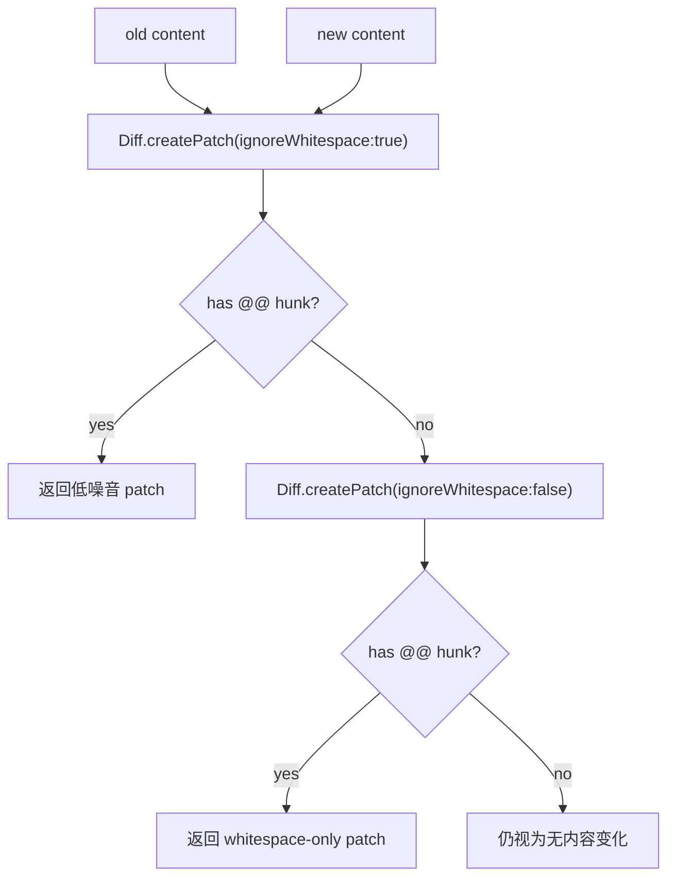

# Diff 渲染与变更统计技术方案

> 适用代码库：`QwenLM/qwen-code` `main`。
> 相关 PR：#6141。

---

## 1. 背景与动机

qwen-code 的 edit/write/shell 等工具会在确认面、工具结果和统计路径里展示 unified diff。为了降低噪音，历史默认 diff option 使用 `ignoreWhitespace: true`，这对普通内容改动是合理的：缩进或空白变化不会淹没真正的代码改动。

问题出在纯 whitespace-only 改动。模型只调整缩进、空格或换行时，文件内容已经真实改变，但 `ignoreWhitespace: true` 会产出没有 hunk 的 header-only patch，UI 最终显示 `No changes detected`。这会误导用户以为工具没有修改文件，也会让 diff stat 在这类变更上变成全零。

#6141 的目标是保留默认的低噪音 diff，同时确保纯空白变更可见。

---

## 2. 整体设计

核心策略是 two-pass smart diff：

1. 先按默认 `DEFAULT_DIFF_OPTIONS = { context: 3, ignoreWhitespace: true }` 生成 patch，保持普通 mixed diff 的可读性。
2. 如果结果没有任何 `@@` hunk，说明默认口径没有可展示变更；此时用 `ignoreWhitespace: false` 重新生成 patch。
3. 如果内容完全相同，第二次 patch 仍然没有 hunk，调用方继续按“无变化”处理。

这个策略集中在 `packages/core/src/tools/diffOptions.ts`，避免每个工具各自判断 whitespace-only 边界。

---

## 3. 关键实现

### 3.1 `hasHunks()`

`hasHunks(patch)` 通过检测 unified diff hunk header 判断 patch 是否包含可展示变更。header-only patch 不再被误判为有变化。

### 3.2 `createPatchSmart()`

`createPatchSmart(filename, oldStr, newStr, oldHeader, newHeader)` 是工具展示层使用的 public helper。它先走默认低噪音 patch，只有无 hunk 时才 fallback 到 whitespace-sensitive patch。

迁移到该 helper 的工具路径包括：

- `packages/core/src/tools/edit.ts`
- `packages/core/src/tools/notebook-edit.ts`
- `packages/core/src/tools/write-file.ts`
- `packages/core/src/tools/shell.ts`
- `packages/core/src/tools/modifiable-tool.ts`

### 3.3 `structuredPatchSmart()`

`getDiffStat()` 使用内部 `structuredPatchSmart()`，让 model/user diff stat 与展示 patch 共享同一 whitespace fallback 语义。这样 whitespace-only edits 不再被统计为 `0 added / 0 removed`。

---

## 4. 设计边界

- **不改变默认 diff 噪音控制**：普通内容改动仍优先使用 `ignoreWhitespace:true`，只在无 hunk 时 fallback。
- **不把相同内容伪装成变更**：old/new 完全相同会在两次 patch 后仍无 hunk。
- **不分散到各工具**：工具层只切换到 smart helper，whitespace-only 判断留在 diffOptions。
- **不改变文件写入行为**：#6141 只修 diff 展示与统计，实际 edit/write/shell 改文件逻辑不变。

---

## 5. 验证方式

- `packages/core/src/tools/diffOptions.test.ts`：覆盖 `hasHunks()`、whitespace-only patch、mixed content/whitespace、identical content 和 diff stat。
- `packages/core/src/tools/modifiable-tool.test.ts`：覆盖 whitespace-only edits 下 diff stat 不再全零。
- edit/write/notebook/shell 通过共用 `createPatchSmart()` 间接继承该行为。

---

## 6. 涉及 PR

| PR | 子主题 | 作用 |
|---|---|---|
| [#6141](https://github.com/QwenLM/qwen-code/pull/6141) | whitespace-only diff rendering | 抽出 smart patch / structured patch helper，并迁移 edit、write、notebook、shell、modifiable-tool diff 路径。 |

---

## 7. 已知限制 / 后续

- hunk 判断依赖 unified diff 的 `@@` header；若未来替换 diff backend，需要保持等价的“是否有可展示 hunk”判断。
- fallback 只在无 hunk 时触发；mixed diff 中纯空白行的完整细节仍可能被默认低噪音口径折叠，这是当前设计的有意取舍。
