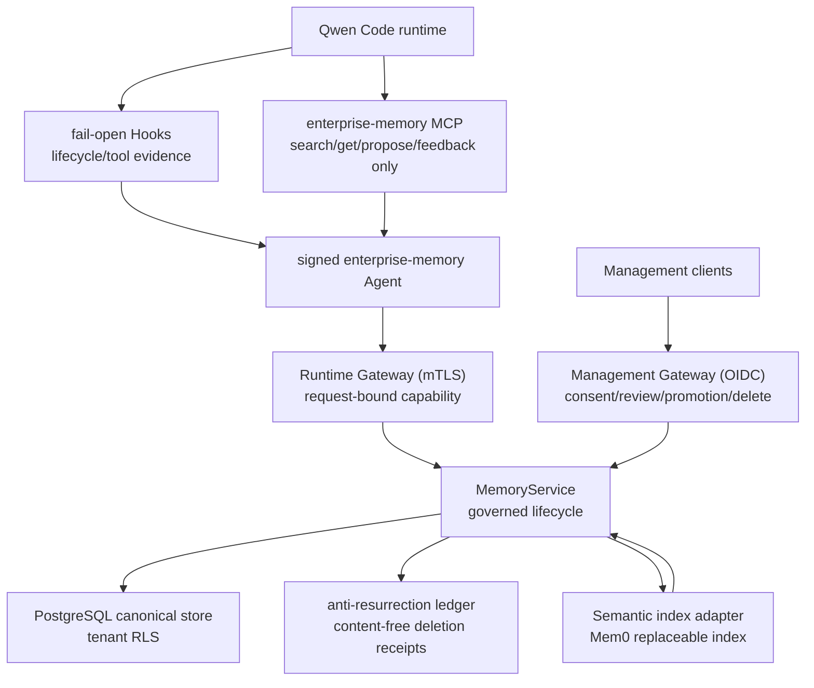

# Enterprise Memory Gateway 技术方案

> 适用范围：`QwenLM/qwen-code` enterprise memory integration stack（#7502 closed 单体方案，拆分为 #7509/#7505/#7507/#7508/#7506 当前 open stack）。
> 当前记录：这些拆分 PR 仍为 open，本文件按当前 diff、changed files、测试路径与 PR stack 关系记录方案观察；不能视为 `main` 已落地能力。

---

## 1. 背景与动机

企业长期记忆的核心问题不是“把内容写进一个记忆服务”，而是多租户身份、仓库授权、共享范围、review-before-share、删除一致性、防复活、审计和 provider 可替换性。直接把公共 memory MCP server 暴露给模型，会把模型输入当成身份/授权来源，也很难保证删除后不被语义 provider、缓存或重试路径重新召回。

#7502 先提交了一个单体 enterprise memory gateway 方案，随后关闭并拆成 5 个 stacked PR：

| PR | 栈位置 | 状态 | 作用 |
|---|---:|---|---|
| [#7509](https://github.com/QwenLM/qwen-code/pull/7509) | 1/5 | open | foundations：trust/type model、strict config、request-bound capability、semantic-index contract |
| [#7505](https://github.com/QwenLM/qwen-code/pull/7505) | 2/5 | open | canonical persistence：PostgreSQL/RLS schema、canonical store、anti-resurrection ledger |
| [#7507](https://github.com/QwenLM/qwen-code/pull/7507) | 3/5 | open | governed lifecycle：capture、candidate、consent/review、activation、recall、delete、provider reconciliation |
| [#7508](https://github.com/QwenLM/qwen-code/pull/7508) | 4/5 | open | runtime/management APIs：mTLS runtime plane、OIDC management plane、OpenAPI |
| [#7506](https://github.com/QwenLM/qwen-code/pull/7506) | 5/5 | open | Qwen integration：signed extension、fail-open hooks、narrow MCP surface |

---

## 2. 整体架构

关键边界：

1. Qwen Core 不承载企业身份、broker credential、policy engine、provider SDK 或管理 UI。
2. PostgreSQL canonical store 是授权事实源；semantic provider 只能做可替换索引。
3. Runtime plane 与 management plane 分离，模型可触达的凭据不能升级成管理权限。
4. 删除先记录 durable intent / ledger receipt，再与 provider reconciliation 收敛，防止已删除内容复活。
5. Hooks fail-open 保证 coding request 不因 enterprise memory 不可用而失败；memory mutation 在安全边界无法证明时 fail-closed。

---

## 3. 分层实现

### 3.1 Foundations（#7509）

`integrations/enterprise-memory` 先作为独立 workspace package 接入 build/typecheck。基础层定义：

- `domain.ts`: tenant、principal、workspace、repository、scope、runtime binding 等核心类型。
- `config.ts`: strict config，拒绝 malformed URL、不安全 production endpoint 和非法 numeric limits。
- `http-json.ts`: bounded JSON/HTTP parsing，防 oversized/malformed provider response。
- `content-protector.ts`: memory content protection boundary。
- `runtime-binding-authorizer.ts`: immutable runtime binding authorization。
- `security/capability-verifier.ts` 与 `security/request-binding.ts`: request-bound capability token 校验，绑定 exact request、tenant、principal、workspace、repository、lease epoch 与 replay identity。
- `capability-replay-store.ts`: idempotency / replay control。
- `semantic-index.ts`: provider-neutral semantic index contract。

该层不包含 DB、memory lifecycle、HTTP server 或 Agent 行为，便于先审 trust model。

### 3.2 Canonical persistence（#7505）

`migrations/001-initial.sql` 建立 tenant-scoped schema 和 RLS；`canonical-store.ts` 在事务内设置 tenant context，并管理 canonical records、raw events、source receipts、deletion intents、audit/outbox 与 erasure reservation。`anti-resurrection-ledger.ts` 用 content-free 外部账本记录不可逆删除和来源回执，防止 retry、backup restore 或 provider orphan reconciliation 把已删除内容重新激活。

设计重点是“先写 durable intent，再向外部 provider 或 ledger 收敛”。source receipt 更新必须命中当前可见 canonical record；ambiguous commit 要保留外部 key/receipt 供 reconciliation，而不是静默丢弃。

### 3.3 Governed lifecycle（#7507）

`memory-service.ts` 在 canonical store 上实现 capture、candidate proposal、consent/review、activation、authorized recall、tombstone、erasure、provider outbox reconciliation 和 privacy preference。候选激活先预留 canonical operation，再写 provider；只有 exact provider discovery 成功后才变为 recallable。

Recall 流程不是直接信任 semantic provider result，而是把 provider result 映射回 active canonical record，并重新执行 tenant、scope、ACL、tombstone、expiry、deletion intent、lease 与当前授权检查。`mem0-semantic-index.ts` 只实现可替换索引契约；provider output 不能成为身份、授权或 canonical truth。

### 3.4 Runtime and management APIs（#7508）

`gateway-server.ts` 暴露 mTLS runtime plane，要求 request-bound capability、当前 immutable runtime binding，并在 replay 前先做授权。Recall output 按 item count、per-item 和 total context budget 做 deterministic bounded rendering。

`management-server.ts` 暴露 OIDC management plane，独立校验 issuer、audience、tenant、subject、issued-at、expiration、maximum token lifetime，并按 personal/maintainer/tenant-policy scope 检查 consent、review、promotion、delete 权限。`openapi.yaml` 把 runtime 与 management routes 分开，`main.ts` 组合 service entrypoint。

### 3.5 Qwen-side Agent integration（#7506）

Qwen 侧通过 signed extension 和 Hooks 连接外部 Gateway：

- `agent/hook-handler.ts`: 捕获 bounded lifecycle/tool evidence；Hook timeout、Gateway outage、本地 state-store failure 和 circuit breaker 都不阻塞 Qwen request。
- `agent/mcp-server.ts`: 只暴露 search、get、candidate propose、advisory feedback；不暴露 delete、approve、activate、promote、policy 或 selector 类管理工具。
- `agent/state-store.ts`: deterministic local retry state。
- `agent/gateway-client.ts`: 接收外部 launcher 提供的 per-operation signed material；broker/signing config 不进入 Qwen settings 或 tool-visible env。
- `hooks/hooks.json` 与 `qwen-extension.json`: opt-in extension/Hook manifest。

MCP 写操作要求 caller-supplied UUID operation id 跨 reconnect 稳定；读 request id 保持 connection-unique，避免读请求身份被持久化为写操作身份。

---

## 4. 验证方式

- `npm test --workspace=@qwen-code/enterprise-memory`
- `npm run build && npm run typecheck`
- #7509: foundations 5 个测试文件 / 25 tests。
- #7505: persistence 累计 8 个测试文件 / 39 tests。
- #7507: lifecycle 累计 10 个测试文件 / 94 tests。
- #7508: APIs 累计 12 个测试文件 / 108 tests。
- #7506: full stack 累计 17 个测试文件 / 141 tests。

---

## 5. 已知限制 / 后续

- 当前 stack 仍为 open；不能视作 main 已落地。
- 本地验证没有真实 PostgreSQL，因此 pooled-connection RLS 隔离、真实 RLS role、migration apply/rollback 仍需 CI 或 staging。
- 生产 OIDC discovery、mTLS cert、SCM authorization、workload broker、key registry、Mem0 residency/retention/deletion SLA 与 anti-resurrection ledger reconciliation 都是部署门禁。
- 没有改变 Qwen Core API，也不自动迁移既有 native Qwen memory。

_按个人 PR 口径更新于 2026-07-22_
