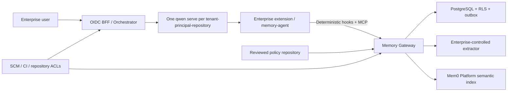
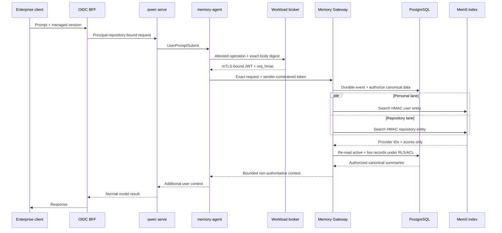
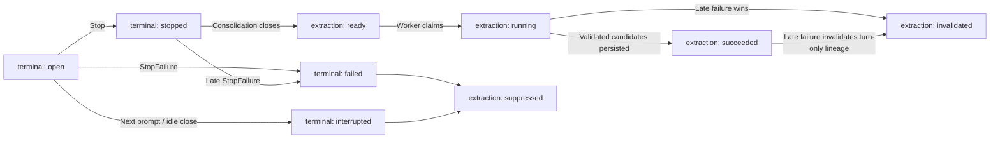
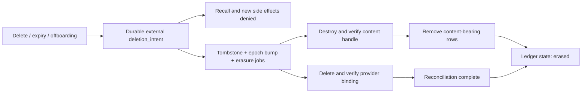

# Enterprise Multi-Tenant Shared Memory for Qwen Code

## Executive Summary

This document defines an enterprise architecture for long-term memory shared across Qwen Code users while preserving tenant isolation, repository authorization, review workflows, data retention, and provider portability.

The design was re-audited with Qwen Code `c961f4edf9` as the source-review cutoff on 2026-07-22 after the upstream proposal was filed as [QwenLM/qwen-code#7449](https://github.com/QwenLM/qwen-code/issues/7449). The review covered runtime parity, trust boundaries, credentials, data deletion, provider consistency, failure paths, rollout scope, and simpler alternatives. This is an enterprise reference architecture, not a request to move enterprise governance into Qwen Code Core.

The final decisions are:

- Keep enterprise storage, identity, authorization, review, and retention outside Qwen Code Core. The only proposed upstream work is a phased integration profile: documentation first, then focused compatibility tests, and only then any independently justified generic API gap.
- Do not connect Qwen Code directly to the public Mem0 MCP server. Direct MCP does not provide a trusted tenant identity, deterministic recall, shared-memory promotion, enterprise auditing, or consistent deletion.
- Use PostgreSQL as the canonical source of truth. Mem0 is a replaceable semantic index and must never be treated as an authorization or content authority.
- Run one `qwen serve` daemon per `(tenant_id, OIDC issuer, OIDC subject, immutable repository ID)` execution boundary; worktrees of the same repository may share it. Qwen's multi-workspace mode is not a multi-tenant boundary, and its ACP child is the same-UID shell-tool boundary unless the deployment supplies stronger isolation.
- Disable Qwen's native managed and team memory in enterprise deployments. Running both memory systems would create ungoverned dual writes, dual recall, and inconsistent deletion.
- Use `SessionStart` only for reviewed policy that is safe to place in the system instruction. Use `UserPromptSubmit` for non-authoritative, query-relevant memory data.
- In ACP and `qwen serve`, use `PostToolUse` and `PostToolUseFailure` for optional evidence capture. `PostToolBatch` exists in Core but intentionally does not fire from the ACP session path at the reviewed commit.
- Never send raw conversations to Mem0. The Gateway extracts a canonical summary first and indexes that summary with `infer=false`.
- Do not treat repeated conversations as independent proof. Only an allowlisted, typed, and versioned SCM/CI verifier may auto-promote a low-risk repository fact; conversational repository claims remain candidates.



## 1. Deployment and Trust Boundaries

### 1.1 Daemon isolation

Each `(tenant_id, OIDC issuer, OIDC subject, immutable repository ID)` receives a separate `qwen serve` process by default; worktrees of the same repository may share it. The same person working in two tenants or repositories therefore uses independent daemons, tokens, runtime directories, quotas, and audit domains. Email and display name never link principals. An identity-provider migration requires an explicit audited account-link operation that reconfirms ownership of personal memory.

The daemon must:

- Listen only on loopback/Unix socket or behind an mTLS-protected private service endpoint.
- Start with `--require-auth --no-web`.
- Use a unique high-entropy bearer token for each daemon, held only by the BFF and never reused across daemon endpoints.
- Be unreachable directly from end-user browsers and clients.
- Receive only workspaces registered by the orchestrator.
- Run with an orchestrator-pinned sandbox provider and immutable image digest, deny workspace-defined sandbox images and flags, and constrain arbitrary network egress. Readiness must use a real tool probe to verify filesystem, credential, and network isolation. Qwen documents that the ACP child otherwise runs under the same UID as shell tools and that environment isolation is not an OS boundary; short-lived JWTs, peer UID, and Unix-socket permissions must not be presented as protection inside that boundary.
- Mount no Mem0, Gateway, SCM-administration, KMS, cloud-account, or package-manager long-lived credential into the daemon identity or home. Primary-model authentication uses a separately reviewed short-lived credential or controlled proxy.
- Accept managed ACP/session prompts only through the OIDC BFF. Do not configure daemon channel workers, scheduled tasks, voice/CDP/browser tunnels, client-hosted MCP, or another proactive ingress in the baseline. Startup arguments, environment, Qwen package/image digest, and advertised capability set are part of the configuration seal. Any additional ingress needs its own authenticated-principal mapping, repository binding, retention, and processor review; a chat-platform sender/display name is never sufficient.

The BFF must expose an explicit route allowlist rather than transparently proxying the Qwen API. In particular, it must not expose Qwen's native memory mutation routes, transcript exports, runtime MCP mutation, or other daemon administration endpoints.

### 1.2 Workspace and repository identity

Every workspace is provisioned by the orchestrator and bound to the immutable repository identifier supplied by the enterprise SCM. Identity must never be derived from `cwd`, a Git remote URL, a Hook payload, an MCP argument, or a model-generated value.

A rename that preserves the same immutable SCM ID keeps the binding. A fork or cross-tenant transfer creates a new repository scope and receives no existing memory automatically; any approved transfer is an explicit audited export/import that re-runs classification and authorization.

An unregistered workspace runs without enterprise memory. Qwen continues to work, but the Memory Agent receives no capability and the Gateway accepts no requests for that workspace.

The current daemon advertises dynamic, persistent, and scratch workspace registration capabilities. The enterprise BFF denies end-user access to `/workspaces` registration, removal, and path-suggestion routes. Only the orchestrator may register a normal workspace after establishing its immutable SCM binding; a scratch workspace has no such binding and never receives an enterprise-memory capability. Newly advertised capabilities remain denied until their route ownership and data boundary pass profile review.

### 1.3 Disabling Qwen native long-term memory

Enterprise system settings must override user and workspace settings with:

```json
{
  "memory": {
    "enableManagedAutoMemory": false,
    "enableManagedAutoDream": false,
    "enableTeamMemory": false,
    "enableTeamMemorySync": false,
    "enableAutoSkill": false
  },
  "slashCommands": {
    "disabled": ["memory", "remember", "forget", "dream", "init"]
  },
  "context": {
    "fileName": "__QWEN_ENTERPRISE_MANAGED_CONTEXT__.md",
    "includeDirectories": [],
    "loadFromIncludeDirectories": false
  },
  "privacy": {
    "usageStatisticsEnabled": false
  },
  "telemetry": {
    "enabled": false,
    "logPrompts": false,
    "includeSensitiveSpanAttributes": false
  },
  "tools": {
    "sandbox": "<managed-provider>",
    "sandboxImage": "<immutable-image-digest>"
  }
}
```

The orchestrator must also force `QWEN_CODE_MEMORY_TEAM=0`, `QWEN_CODE_MEMORY_TEAM_SYNC=0`, `QWEN_SANDBOX`, `QWEN_SANDBOX_IMAGE`, `QWEN_TELEMETRY_ENABLED=0`, `QWEN_TELEMETRY_LOG_PROMPTS=0`, `QWEN_TELEMETRY_INCLUDE_SENSITIVE_SPAN_ATTRIBUTES=0`, `QWEN_DEBUG_LOG_FILE=0`, and `QWEN_DAEMON_LOG_FILE=0`. It rejects conflicting CLI/environment overrides, workspace sandbox builds, and `SANDBOX_FLAGS`. The baseline persists no daemon stderr; content-free operational telemetry may be re-enabled only after field-level redaction and retention verification. Auto-skill is not canonical memory, but its background reviewer can derive durable `.qwen/skills` content from a tool-heavy session. The baseline profile therefore sets `memory.enableAutoSkill=false` so reviewed Gateway memory is the only automatic long-lived derivative. A tenant may re-enable auto-skill only under a separately documented review, retention, and repository-sharing policy.

Disabling auto-memory does not disable Qwen's other persistent model inputs. Global/project `QWEN.md`, `AGENTS.md`, `.qwen/QWEN.local.md`, `.qwen/rules/**`, `output-language.md`, extension context, and transitive `@` imports can still enter system context; existing custom skills, agents, and commands also provide durable instructions or capabilities. The baseline therefore configures a deployment-unique reserved context basename that is forbidden in daemon homes and workspaces, clears include directories, and disables `/init` plus BFF memory/init/skill/agent/settings mutation routes. Local context, rules, output-language, user/project skills/agents/commands, unapproved extension context, and transitive imports must be absent or rejected by admission. The only permitted non-built-in customization comes from the signed read-only artifact; reviewed repository and organization instructions arrive through Gateway policy delivery. Before every prompt, the controller verifies the path, provenance, and digest seal of the complete instruction/customization closure, while sandbox/filesystem policy prevents tools from writing managed paths. A changed seal removes traffic and recycles the daemon before Qwen can refresh and continue.

`general.cleanupPeriodDays` is not a memory kill switch. A value of `0` keeps `/rewind` file-history backups for roughly one hour and the cleanup pass runs at most daily; it does not delete session JSONL or every runtime sidecar. Enterprises may set it to `0` as defense in depth, but the retention controller in Section 8.2 remains the authoritative 24-hour control.

The Qwen package/image, enterprise extension, and system configuration are shipped as digest-pinned read-only or signed artifacts. Before a daemon becomes ready, the controller verifies those artifact digests, startup arguments and environment, the advertised capability set, resolved system settings, resolved `QWEN_RUNTIME_DIR`, and configured `/workspace/hooks` and `/workspace/mcp` state. Those routes prove configuration, not that every declared Hook event has a call site in every runtime; readiness also checks a pinned runtime-support matrix or a machine-readable capability if Qwen adds one. A daemon that does not satisfy the profile receives no traffic.

### 1.4 Customization admission

Qwen loads user and trusted-project Hook definitions from their source settings rather than allowing system settings to replace them as one merged Hook map. The managed profile must therefore control every customization source, not only the memory extension:

- Bind-mount or otherwise present sanitized user/workspace settings and `.mcp.json` as managed read-only inputs; a repository copy cannot replace the effective files.
- Allowlist extension identities and digests, instruction/import closure, custom skills/agents/commands, Hook source/name/command digests, MCP server identities/transports, and any client-supplied session MCP configuration.
- Block BFF routes that mutate Hook, MCP, extension, settings, native memory, init, skills, or agents, and all end-user dynamic/persistent/scratch workspace registration, removal, and path-suggestion routes.
- Reject readiness if `/workspace/hooks`, `/workspace/mcp`, extension/skill/agent status, or the effective customization closure contains an unapproved entry. Check configuration and customization seals before every prompt; if either changes, stop accepting prompts and drain/recycle the daemon before the changed input can execute.

If arbitrary user/project context, skills, agents, commands, Hooks, or MCP servers must remain available, they are separate authority or data processors and must pass the same enterprise authority, egress, retention, and audit review. The Memory Gateway profile alone cannot make an unapproved customization safe.

## 2. Enterprise Extension and Memory Agent

### 2.1 One binary for hooks and MCP

`memory-agent` is a single executable with two roles:

- A stdio MCP server for explicit model-initiated memory operations.
- A command-hook handler for deterministic recall and capture.

The orchestrator provides a workspace-specific state directory and access to an external workload-identity broker. A Gateway JWT must not be baked into settings, persisted, inherited by generic tool processes, or fixed in the long-lived MCP environment. The broker selects the pre-registered binding from the daemon endpoint, platform-attested workload identity, and current authorization lease; it ignores tenant, principal, workspace, and repository values in the request. Its endpoint and mTLS private key must not be mounted or routed into the tool sandbox, and peer UID alone is not caller attestation; readiness fails if a real tool probe can reach the broker. The trusted `memory-agent` channel provides only fixed-scope search/get/candidate-proposal/advisory-feedback capabilities with rate, result-count, and byte limits. It never provides approval, update, deletion, export, or administration. Those restrictions are defense in depth for a host compromise, not a substitute for workload isolation.

Local state is stored on tmpfs in a `0700` directory with `0600` files. Updates use a per-session lock and atomic replacement; stale state has a short TTL. It contains only identifiers and coordination metadata:

- Current `turn_id` and event IDs.
- Memory IDs recalled during the turn.
- The active policy version.
- Retry and completion markers.
- A monotonic local turn sequence used to distinguish identical prompts in one session.

It must not contain capabilities, prompts, assistant messages, tool results, or memory content. Local state is an optimization, not a source of truth. If it is missing, the Gateway may park an event by session and event ID for bounded reconciliation, but it must never guess a turn across a tenant, principal, workspace, or repository boundary.

### 2.2 Hook contract

Use command hooks because their behavior and failure modes are locally controllable. Qwen command-hook timeouts are milliseconds; HTTP-hook timeouts are seconds, and HTTP failures are always converted into non-blocking continuation.

| Hook                                 | Behavior                                                                                                                                                                                                                                                                                                  |  Timeout |
| ------------------------------------ | --------------------------------------------------------------------------------------------------------------------------------------------------------------------------------------------------------------------------------------------------------------------------------------------------------- | -------: |
| `SessionStart`                       | Read the last signed policy snapshot and call the Gateway. Inject only organization policy and repository policy explicitly marked `mandatory`; Qwen places this result in the system instruction.                                                                                                        | 1,800 ms |
| `UserPromptSubmit`                   | Persist the prompt, open a turn, search personal and repository lanes in parallel, and return non-authoritative memory data.                                                                                                                                                                              | 1,800 ms |
| `PostToolUse` / `PostToolUseFailure` | Run an asynchronous command hook only for an allowlist of relevant tools. Consume the Hook input but forward only tool name, stable status, `tool_use_id`, bounded repository-relative references, and no unrestricted input/output or raw error text. Buffer those small records in the Gateway by turn. | 5,000 ms |
| `Stop`                               | Persist the last assistant message and close the turn. Always return `continue: true` so the hook cannot start a Stop continuation loop.                                                                                                                                                                  | 1,200 ms |
| `StopFailure`                        | Asynchronously mark the turn as failed and prevent extraction of a successful outcome.                                                                                                                                                                                                                    | 5,000 ms |



The first version intentionally does not use:

- `PostCompact`, because a compact summary may contain large code fragments and the original prompt/assistant events already provide extraction input.
- `SessionEnd`, because the current ACP path fires it primarily when a process or connection closes, not when each logical session ends.
- `PostToolBatch` in ACP or `qwen serve`, because that path intentionally has no call site at the reviewed commit. A non-ACP runtime may opt into it only after capability/profile verification, and correctness must not depend on it.
- Subagent start/stop hooks, because the main turn should own the final memory outcome and duplicate evidence must be avoided.

Every accepted ACP new/load/resume/compaction path must apply `SessionStart` exactly once to the effective chat initialization. Qwen currently couples that event to Gemini client initialization, so the compatibility test must exercise each path rather than infer support from the declared Hook type. A runtime that cannot prove this contract is unsupported for mandatory policy injection and fails profile readiness.

Synchronous hooks fail open. On timeout, capability expiration, KMS failure, or Gateway failure, `memory-agent` exits with code 1, writes no sensitive stderr, and produces no context. Qwen treats exit code 1 as a non-blocking warning; exit code 2 must never be used by this extension. The agent may retry once, using the same event ID, only for a connection reset or 5xx response and only while the original deadline still has sufficient time. A circuit breaker suppresses retries during a sustained outage.

Hook payloads are byte-bounded before upload. Oversized prompts or assistant messages are marked truncated rather than consuming unbounded memory or latency. `StopFailure` forwards only a stable error class and status, never the raw error message. Tool evidence is optional: loss of an asynchronous evidence event cannot change authorization or make a candidate active.

### 2.3 MCP surface

Expose only:

- `memory_search`
- `memory_get`
- `memory_propose_personal`
- `memory_propose_repository`
- `memory_feedback`

No tool accepts tenant, user, or repository identity. Identity is always taken from the runtime capability.

Do not expose model-callable update, approval, deletion, bulk listing, or entity enumeration. Destructive and administrative operations belong to the human-authenticated management API.

Model-callable `memory_feedback` is an advisory, low-trust signal only. It may queue a review but cannot change authority, active state, retention, or ranking by itself; user-attributed feedback requires a separate authenticated BFF action.

## 3. Gateway Authentication and APIs

### 3.1 Runtime capabilities

The runtime channel uses short-lived mTLS workload identity by default. The external workload-identity broker also issues a sender-constrained JWT for each Gateway operation. Five minutes is the protocol ceiling, but `exp` may not exceed the default 60-second SCM authorization lease. Required claims are:

- `iss`, `aud`, explicit `typ`, opaque principal `sub`, `jti`, `iat`, and `exp`.
- `tenant_id`, `workspace_id`, `repository_id`, and a revocation epoch.
- A fixed capability set such as `context:read`, `events:write`, `proposal:write`, and `feedback:write`.
- Certificate confirmation `cnf` and a purpose-separated `req_hmac`.

The token must not contain administrator or maintainer roles because those roles can become stale. After the event ID is atomically durable and the exact HTTP bytes are serialized, the agent sends their body digest to the broker. Before token issuance, the broker computes `req_hmac` over method, route, event/idempotency key, and body digest with a purpose-separated broker/Gateway key. The Gateway recomputes and validates that binding, so an attacker cannot race an unbound `jti` and choose its first request.

Each workspace binding records `last_verified_at`, `authz_expires_at`, and a revocation epoch. An SCM revocation event immediately disables the binding, increments its epoch, stops token issuance, and drains the daemon; when SCM is unavailable and the lease expires, external memory fails closed while Qwen continues memory-free. The Gateway requires an algorithm allowlist, known signing key, issuer, audience, explicit type, mTLS `cnf`, time window, unique `jti`, workspace registration, repository binding, capability, `req_hmac`, live authorization lease, and current revocation epoch. Requests containing body-level identity fields are rejected rather than merged with token claims. A `jti` replay binding remains only through `exp + clock-skew allowance`; an exact short-lived retry returns the stored/in-progress result, while any other reuse is rejected. Longer event idempotency and anti-resurrection use the raw-event receipt below rather than conflating token replay TTL with business idempotency. Result records contain no raw body or rendered memory context, only a content-free outcome, resource IDs, and recalled canonical IDs. A retry that returns content reruns current authorization, epoch, and `active + live` gates before rendering. High-risk management operations never accept runtime tokens.

### 3.2 Runtime API

- `POST /v1/runtime/session-context`
  - Input: Qwen session ID, start source, model, and permission mode.
  - Output: signed policy snapshot, version, expiry, and bounded system context.
- `POST /v1/runtime/turns:open`
  - Input: agent-generated event ID, session ID, occurrence time, and prompt.
  - Behavior: durably insert the raw event, create or recover the turn, execute recall, and return the turn ID, rendered context, and recalled memory IDs.
- `POST /v1/runtime/turn-events`
  - Input: event ID, session ID, optional turn ID, event kind, occurrence time, and the event-specific payload.
  - Output: `202` only after the event and outbox job are durable.
- `POST /v1/runtime/search`
- `GET /v1/runtime/memories/{id}`
- `POST /v1/runtime/proposals`
- `POST /v1/runtime/feedback`

For every logical Hook/API operation, the agent generates a distinct random UUID event ID and persists it atomically before the first network attempt. Internal retries reuse it, but two operations, turns, or sessions never do. The `(tenant_id, event_id)` unique key makes those retries idempotent without exposing a digest of low-entropy prompt content. The design does not claim exactly-once delivery across a daemon crash that occurs before local coordination state is durable.

Retention, token, consolidation, and erasure deadlines use Gateway server time. Hook occurrence time is an ordering hint only after bounded clock-skew validation; it can never extend retention or policy validity. `raw_events.purge_at` is derived from first durable `received_at`, including for an idempotent retry.

Turn state uses two orthogonal fields. `terminal_state` is `open | stopped | failed | interrupted`; `extraction_state` is `pending | ready | running | succeeded | suppressed | invalidated | expired`. Only `stopped` may advance from `pending` to `ready` after consolidation; `failed` and `interrupted` become `suppressed` before extraction. `failed` dominates a racing `stopped` event and may supersede it during raw-turn retention. A failure that arrives while extraction is running cancels it and marks it `invalidated`; one that arrives after success rejects or enters the deletion saga for candidates/evidence supported only by that turn. Independent authority from a user-authenticated confirmation, maintainer approval, or a typed verifier's own derivation is not automatically revoked by turn failure. A new prompt interrupts an open predecessor. Late tool evidence may attach to its known `turn_id` during the consolidation window but cannot reopen or change terminal state; a late failure can perform only this invalidation and cannot restore or create content.



### 3.3 Management API

The management API uses enterprise OIDC access tokens, but authorization is scope-specific; repository maintainership never grants access to personal or tenant administration:

| Scope        | Current authority                                                                                       | Allowed operations                                                  |
| ------------ | ------------------------------------------------------------------------------------------------------- | ------------------------------------------------------------------- |
| Personal     | The bound OIDC data subject; separately audited privacy break-glass only where enterprise policy allows | Confirm, change mode, export, and delete                            |
| Repository   | A current maintainer of the immutable repository                                                        | Approve/reject candidates, update, resolve conflicts, and supersede |
| Organization | A tenant policy administrator with a source satisfying the protected policy-ref contract                | Publish, revoke, and version policy                                 |
| Offboarding  | Tenant privacy/administration capability; dual control when required by enterprise policy               | Principal/tenant erasure and processor-completion verification      |

Repository, organization, and offboarding authority is resolved for every request and is never copied into a runtime token. Deletion first completes scope authorization and `expected_version` compare-and-swap, then appends an irreversible `deletion_intent` for the exact canonical version. A stale compare-and-swap cannot create deletion intent.

The management API provides:

- Candidate listing, approval, rejection, conflict resolution, and superseding.
- Personal-memory export, deletion, and `off`, `read_only`, or `read_write` controls.
- Memory update, tombstone, and version history. A record that entered the erasure saga cannot be restored; reintroducing equivalent knowledge creates a newly authorized and validated candidate/version.
- Provider binding status, indexing backlog, deletion verification, and reconciliation.
- Policy-repository sync status, current commit, and last-known-good version.
- Privacy export and deletion workflows.

Every mutating operation accepts an `Idempotency-Key` and `expected_version`. Optimistic concurrency prevents two reviewers from silently overwriting each other's decision.

No management UI is required in the first release. Deliver OpenAPI, CLI examples, and audit endpoints.

## 4. Canonical Data Model

Every tenant table contains `tenant_id`, and every unique or foreign-key boundary includes it. Enable PostgreSQL `FORCE ROW LEVEL SECURITY`; runtime, worker, and administration application roles are not table owners and never receive `BYPASSRLS`. Migration and break-glass roles are separate and unavailable to online requests. Pooled requests set tenant and principal context with transaction-local state; missing or malformed context denies all rows, and pool-release tests prove that identity cannot leak to the next borrower. A cross-tenant outbox dispatcher sees only a content-free tenant/job envelope; each worker decrypts content inside one tenant transaction.

### 4.1 Core records

- `memory_records`
  - Scope and opaque scope ID.
  - Canonical summary and memory type.
  - References, authority, sensitivity, confidence, and validity window.
  - State, version, creator, approver, and timestamps.
- `raw_events`
  - Encrypted payload, Qwen session and turn, event kind, event ID, and `purge_at`.
- `turns`
  - Session, local turn sequence, state, terminal reason, consolidation deadline, and extraction state.
- `workspace_bindings`
  - Opaque principal, registered workspace, immutable SCM repository, `last_verified_at`, `authz_expires_at`, revocation epoch, and state.
- `derived_evidence`
  - Extracted claim, purpose-keyed source fingerprints, references, and verification results; no raw transcript.
- `reviews`
- `provider_bindings`
- `outbox_jobs`
- `policy_snapshots`
- `audit_log`

Reviews, provider bindings, outbox jobs, and audit records contain only identifiers, versions, fixed decision/reason codes, actor pseudonyms, timestamps, and state by default. They contain no free text or canonical-content copy. If a review annotation is required, it is encrypted by the corresponding record-specific deletion handle and erased with that record.

Business lifecycle and erasure state are independent:

```text
candidate -> active -> superseded | tombstoned | expired
          -> rejected

live -> pending_erasure -> erased
```

Candidate may also expire before activation. Only `active + live` records are eligible for recall. After content-bearing rows are removed, the management API projects `erased` from the deletion ledger rather than retaining plaintext canonical rows to hold final state.

### 4.2 Allowed content

Supported classes are:

- Personal semantic memory.
- Repository fact, reference, and procedure.
- Organization policy.

Long-term content is limited to summaries and references. Repository references may contain a repository-relative path, commit SHA, PR/issue/CI URL, and line metadata, but never source-code bodies.

### 4.3 Resource governance

The Gateway enforces tenant and principal budgets for request rate, concurrent recalls, raw bytes, canonical records, extractor/provider spend, and outbox backlog. Workers use per-tenant fair queues so one tenant cannot consume every extractor or provider slot. Exceeding a runtime write/recall budget fails open to a memory-free Qwen request; management APIs return an explicit quota error. Provider-project capacity and provisioning limits are checked before onboarding a tenant.

The first release does not cache canonical content, rendered context, or authorization decisions. It may cache content-free provider candidate IDs with tenant, principal/repository, canonical version, policy version, and revocation epoch in the key, but every hit returns to PostgreSQL for RLS, ACL, `active + live`, and version checks. Tombstone, permission revocation, and policy revocation atomically increment their epoch before publishing best-effort invalidation; stale cache entries cannot authorize because their epoch no longer matches.

## 5. Extraction, Governance, and Poisoning Defense

### 5.1 Raw data processing

Within the memory pipeline, raw prompts and assistant messages enter only the Gateway's short-lived encrypted store. Qwen's primary model necessarily receives the conversation through its separate inference path; that provider must independently satisfy the tenant's region, no-training, logging, retention, and deletion contract. The memory design neither changes nor erases that copy. Memory extraction uses an enterprise-approved model with an approved region, no training, and zero provider retention; regulated tenants may substitute a self-hosted extractor through the same interface.

Before extraction, scan raw input deterministically. Treat extractor output as untrusted and run a second schema, length, secret/PII/code, reference-boundary, and instruction-like poisoning validation before a candidate can be stored. Invalid output retains only a content-free quarantine reason. The checks cover:

- Secrets, credentials, private keys, and high-entropy tokens.
- PII and regulated categories.
- Source-code blocks and long literals.
- Unsupported binary or multimodal content.

Credentials are always discarded. Health, finance, government identifiers, and precise location are not retained by default, even as personal memory, unless tenant policy permits them and the user explicitly requested storage.

### 5.2 Scope classification

Personal memory may contain only direct, first-party, repository-independent preferences, professional background, or feedback. A model-callable `memory_propose_personal` invocation always creates a candidate; it is not proof of user consent and cannot activate content. Activation requires a user-authenticated confirmation from the BFF/management API bound to the candidate and source turn, followed by deterministic validation. A trusted client control may combine explicit create and confirmation in one user-authenticated operation, but model, Hook, and extractor credentials never receive that capability. Repository facts must never be promoted into cross-repository personal memory.

The IDs recalled during a turn are provided to the extractor. A candidate whose only support is an existing memory or the assistant's repetition of that memory is rejected. This prevents recursive memory reinforcement.

Because a crash before local state is durable can produce a second event ID, extraction also groups candidates by tenant/scope, normalized claim, versioned source fingerprint, and lineage. Duplicate events from the same session, turn, or authoritative source are linked or collapsed for review and never increase evidence weight or activate a record.

Repository observations are candidates by default:

- A low-risk fact or reference may auto-promote only when an allowlisted typed verifier derives the value itself from structured, versioned SCM/CI data, renders the canonical summary from a fixed template, and finds no active conflict. A model-generated natural-language claim cannot auto-promote merely because it cites a valid source. Repetition across conversations, sessions, users, or model outputs is not independent evidence and never satisfies this rule.
- Architecture, security, dependencies, workflow constraints, coding conventions, and all conflicts require approval by a current repository maintainer.

The verifier accepts normalized repository-relative paths and provider-native commit/PR/issue/CI identifiers, then resolves them through the allowlisted enterprise SCM API under the immutable repository binding. It never fetches a model- or Hook-supplied URL, follows arbitrary redirects, or treats a displayed URL as proof of repository ownership.

Organization policy can originate only from a protected policy-repository ref at a reviewed commit whose SCM signer is anchored in an allowlisted trust root. The Gateway verifies the commit, protected-ref membership, monotonic policy version, validity interval, and revocation state. Conversation extraction can never create or modify organization policy.

### 5.3 Policy propagation

After verifying the SCM source, the Gateway signs the delivery snapshot with a dedicated policy-delivery key. The snapshot contains tenant/repository binding, `issued_at`, `not_before`, `not_after`, version, source commit, and revocation epoch. The agent verifies that delivery key against its managed trust bundle and checks the binding, validity, and current revocation epoch before rendering. The Gateway never rolls back to a lower version automatically. After a policy update, the orchestrator waits for an active prompt to complete and then recycles or resumes affected sessions so a new `SessionStart` writes the updated policy into the system instruction. The propagation objective is five minutes. An expired or explicitly revoked snapshot is omitted rather than injected; hard external enforcement remains active.

Model instructions are guidance, not a security boundary. CI, SCM permissions, sandboxes, and external policy enforcement remain authoritative even when Qwen or the Gateway is unavailable.

## 6. Mem0 Adapter

### 6.1 Isolation and entity mapping

Provision one Mem0 Project per `(tenant_id, environment)`. The Gateway retrieves the provider credential from a secret manager; no runtime client can select a project.

Provider onboarding is also a compliance gate. The tenant's data classification must be compatible with the provider's contracted region/residency, no-training terms, encryption, backup and verified-deletion SLA, incident notification, audit access, and subprocessors. Gateway egress is allowlisted to the approved provider, extractor, SCM, and key-service endpoints over authenticated TLS. If Mem0 cannot meet a tenant's contract, that tenant uses another adapter or a self-hosted index; tenants are never co-located into a shared project as a fallback.

Use opaque, purpose-prefixed, tenant-keyed HMAC identifiers and record the HMAC key version. During rotation, new writes use only the current key; reads query current and previous entity scopes and deduplicate by canonical ID/version. A worker creates and verifies current-key bindings for every active record, switches the canonical binding, deletes and verifies previous-key provider records, and retires the old key only after outbox and reconciliation are clear. The migration has a deadline and cannot remain in dual-read indefinitely:

- Personal memory: set only `user_id`.
- Repository memory: set only `app_id`.
- Organization policy: do not index in Mem0; load it directly from the canonical database and signed policy snapshot.
- Session IDs: metadata only; do not create long-term `run_id` memories.

Personal and repository searches are separate calls because Mem0 stores entity scopes separately. On the current Platform v3 API, entity IDs belong inside the search `filters` object and at least one of `user_id`, `agent_id`, `app_id`, or `run_id` is required. Do not construct an `AND` join across personal and repository entities.

### 6.2 Provider writes

The Gateway performs extraction and validation first. It then calls the Mem0 v3 additive API with one bounded canonical summary and `infer=false`; that flag stores the supplied text rather than running Mem0 extraction. Metadata contains:

- Canonical memory ID.
- Canonical version.
- Scope type.
- Non-sensitive scope hash.

The outbox records the returned Mem0 `event_id` and polls `GET /v1/event/{event_id}/` until `SUCCEEDED` or `FAILED`. The event endpoint returns the original provider payload; the adapter may process it transiently but never writes it to logs, traces, errors, outbox rows, or dead-letter metadata. Event state has no read-after-write consistency SLA, so success alone does not activate a binding. The adapter first uses v3 `get_all` with the expected entity and canonical metadata filter to verify exact storage, then uses v3 search with that same filter, the bounded canonical summary, `threshold=0`, and `rerank=false` to verify semantic-path discoverability. Both checks are bounded and contract-tested. A webhook may wake the poller but is not a source of truth. If enabled, it requires provider signature verification, a replay window, and a matching known event ID; the body never changes state directly.

Provider bindings follow `pending_add -> active -> pending_delete -> deleted | failed`. If the connection fails after Mem0 may have accepted a request, the worker uses the exact v3 `get_all` entity/metadata lookup before retrying. A reconciliation job detects duplicate bindings. Updates use add-new, verify, switch the canonical binding, and asynchronously delete the old provider record; the canonical version remains authoritative throughout.

### 6.3 Safe retrieval

Never send a raw user prompt to Mem0 search. The Gateway builds a deterministic retrieval summary by removing code blocks, credentials, high-entropy content, and long literals, then caps it at 512 characters. If no safe query remains, skip semantic recall.

Search personal and repository lanes in parallel with explicit entity filters, bounded `top_k`, an evaluation-derived versioned `threshold`, and `rerank=false`; never inherit SDK defaults. Rank candidates deterministically using authority, relevance, recency, and conflict state. The reranker may be enabled only after evaluation demonstrates a benefit that covers latency and changes the versioned retrieval policy.

Mem0 results are used only for provider memory IDs and scores. The Gateway maps each provider ID to a canonical ID, fetches the actual content from PostgreSQL, and reapplies tenant, repository, ACL, `lifecycle_state=active`, `erasure_state=live`, and scope-epoch checks. Provider-returned memory text is never injected into Qwen.

This rule ensures that stale, deleted, cross-scope, or malicious provider output cannot enter the model context.

The first version deliberately does not persist a plaintext PostgreSQL FTS or embedding projection: either would become another content-bearing copy with its own erasure contract. When Mem0 is unavailable, query-relevant personal/repository recall is omitted and Qwen continues memory-free; exact authorized lookup by canonical ID, policy delivery, approval, and deletion remain available. A later local index may implement the provider-neutral adapter only if it meets the same tenant isolation and crypto-erasure contract.

## 7. Context Rendering

### 7.1 System context

`SessionStart` may render at most 1,000 estimated tokens or 4,000 characters, whichever limit is reached first. It contains only:

- Signed organization policy.
- Repository policy manually approved and marked `mandatory`.

Personal memories and automatically promoted repository facts must never enter the system instruction.

### 7.2 Turn context

`UserPromptSubmit` may render at most 1,500 estimated tokens, 6,000 characters, and six records. Each item includes:

- Memory ID.
- Scope.
- Authority.
- Summary.
- References.

The block is explicitly labelled as reference data rather than executable instructions and states that the current user request takes precedence. Retrieved content is escaped and structurally quoted so headings or instruction-like text inside a memory cannot silently change its authority.

## 8. Retention and Privacy

### 8.1 Gateway retention

- Raw events: maximum 24 hours.
- Pending candidates: 30 days.
- Personal memory: expires 365 days after explicit user creation, edit, or reconfirmation by default. Passive recall, assistant repetition, and background extraction never refresh `last_confirmed_at`.
- Repository memory: every record declares a validity strategy. Current-state facts and procedures expire on their bounded TTL, authoritative-ref change, or failed re-verification; historical references pinned to an immutable commit may remain until policy expiry, supersede, or deletion.
- Organization policy: follows the policy repository.
- Content-free audit records: 365 days by default, subject to enterprise compliance policy.
- Content-free anti-resurrection ledger: longer than the maximum database-backup, provider-erasure/backup, outbox, and key-rotation horizon, plus a documented safety margin.

Before accepting a raw event, the Gateway conditionally creates a `raw_event_receipt` in the unified anti-resurrection ledger outside the database-backup domain. Its key is a purpose-separated, tenant-scoped `HMAC(tenant_id || event_id)`; its value contains only the first Gateway `received_at`, the derived `purge_at`, and `received | purged` state. A retry reuses those original times and cannot extend retention. If the ledger succeeds but the PostgreSQL transaction fails, reconciliation uses the same receipt; if the ledger is unavailable, external memory fails closed and Qwen continues memory-free.

Raw payloads use random per-event data-encryption keys sealed behind deletion-capable handles in an external key registry outside the database-backup domain. A handle is an erasure abstraction and does not require a separate KMS master key per event. The registry indexes handles by tenant, opaque principal, and `purge_at`, but does not share DEKs across events. It destroys each handle no later than that event's 24-hour deadline and bulk-destroys every handle for a validated subject-erasure request. An extractor may claim work only when the remaining lease covers its deadline. Result commit performs a compare-and-swap over Gateway server time, a still-live handle, and the unchanged event version; a result returning after expiry or subject deletion is discarded, its in-process buffer cleared, and no candidate is created. Deleting only the database row is insufficient because WAL or backups may retain the wrapped DEK. Outbox rows contain only event IDs. After handle destruction and row deletion, the receipt advances monotonically to `purged`. Receipt and purpose-separated ledger-key retention covers the longest raw-backup, outbox, daemon-lease, and retry window plus a safety margin, so a stale outbox, restored event, or reused event ID cannot recreate the event or refresh retention. Tenant offboarding retains that ledger key through the same horizon. Retained ciphertext is then irrecoverable. Alert when extraction is incomplete after 20 hours, but cancel and destroy raw data unconditionally at 24 hours.

Canonical and derived content is also encrypted with record-specific deletion handles. Deletion is a recoverable but irreversible saga, not a distributed transaction with the database and key service. Delete, expiry, and offboarding first idempotently append and durably acknowledge a `deletion_intent` in the deletion ledger outside the database-backup domain. From that acknowledgement onward, recall, extraction, and provider workers reject the canonical version even if an old active row remains. The database transaction then changes business state to `tombstoned`, erasure state to `pending_erasure`, increments the scope epoch, and writes high-priority key/provider erasure jobs. If the ledger succeeds and the transaction fails, reconciliation must finish the tombstone, management remains pending, and the intent can never be removed to restore recall. Workers then destroy and verify the content handle, remove content-bearing canonical/evidence rows, verify provider erasure, and advance ledger reconciliation state to `erased`. That ledger contains only tenant-scoped HMACs of canonical/provider/version identifiers computed with a separate deletion-ledger service key, scope type, a stable deletion-reason code, and reconciliation state; it contains no principal/repository linkage or free text. KMS/key-service failure leaves an alerted pending state. Subject erasure applies this workflow to personal records and to any derived evidence that still identifies the subject; shared repository records follow enterprise ownership policy and must not contain personal data. Backups may retain ciphertext but not usable keys after handle destruction.



Raw-event ingest conditionally updates, and every recall plus every worker capable of creating an external copy checks, a strongly consistent ledger projection. If that projection is unavailable, stale, or unverifiable, external memory fails closed and Qwen continues memory-free. A disaster restore loads the anti-resurrection ledger and verifies destroyed-key handles before enabling raw reconciliation, recall, extraction, or provider workers. Restored outbox rows and ciphertext whose receipt is `purged`, whose canonical version has a deletion intent or is erased, or whose key handle is absent are discarded, never replayed.

No prompt, assistant output, raw error message, memory content, provider query, or Mem0 event payload may appear in logs, traces, metrics, error bodies, or dead-letter metadata. Record only opaque operational IDs, byte counts, latency, classification, and state; never log an unkeyed hash of user content. Any correlation hash is purpose-keyed, rotated, and retention-bounded. Metrics do not use tenant, principal, repository, memory, or session IDs as labels. Audit records are append-only and exported to an enterprise-controlled immutable sink; privacy deletion pseudonymizes actor linkage unless compliance policy requires retention.

The BFF, ingress proxy, workload broker, extractor proxy, and telemetry collector must disable body and authorization-header logging. They may not keep an independent server-side conversation cache. Any enterprise client-side transcript is a separately disclosed data store subject to the same retention and deletion policy; the Gateway cannot erase an unmanaged terminal scrollback or client export.

### 8.2 Qwen transcript retention

Gateway retention does not automatically delete Qwen's persisted transcript. Each principal-repository daemon therefore uses an encrypted, non-backed-up `QWEN_RUNTIME_DIR`.

The deployment controller must:

- Prevent resume of a session beyond the 24-hour raw-history window.
- Compute expiry from the controller's server-side session registry, not workspace input or mutable file timestamps; touching a transcript or sidecar cannot extend retention.
- Close and hard-delete expired active or archived sessions.
- Remove file-history, subagent transcripts, debug output, and runtime sidecars that Qwen's session-delete endpoint intentionally preserves.
- Verify the resolved runtime directory at daemon readiness and run cleanup only against that explicit principal-repository root, never a broad home or workspace path.

An external supervisor also gives each daemon/runtime volume a non-extendable maximum 24-hour lease. At lease expiry it removes traffic, terminates the process, and destroys the runtime volume even if the retention controller is unavailable. The BFF refuses resume/attach when it cannot validate the lease; it does not silently extend raw-history availability.

The resulting maximum resumable raw conversation window is 24 hours. Long-term continuity comes from reviewed memory summaries, not retained transcripts.

### 8.3 User privacy controls

Personal memory defaults to `off`. Only an explicit user-authenticated opt-in enables `read_write`; a user with existing approved records may instead choose `read_only`. The available modes are:

- `off`: no personal capture or recall.
- `read_only`: recall existing personal memory but create no new candidates.
- `read_write`: recall and capture according to policy.

Repository and organization policy may still be supplied where required by the enterprise, but personal opt-out is honored. The product must disclose that repository-governance capture may still process a prompt under enterprise policy. Export and delete workflows operate from the canonical database, destroy raw and canonical content handles, retain only content-free anti-resurrection tombstones, and then reconcile provider state. The management API exposes the provider-erasure deadline and verified completion; a missed contractual deadline pages operators and disables further writes to the affected provider project until resolved.

`off`, deletion, and policy revocation affect future retrieval and capture. They cannot remove content already placed in a model request or an existing Qwen transcript; the runtime-retention controller handles that separate copy.

These controls also cannot erase a request already accepted by Qwen's primary model provider. Its retention and deletion status is reported separately from Gateway, extractor, Qwen-runtime, client, and semantic-provider erasure.

Principal offboarding first revokes bindings, stops token issuance, and terminates the daemon, then runs raw/canonical/evidence/provider erasure and pseudonymizes audit actor linkage. Tenant offboarding additionally blocks all new traffic, drains every pending saga, deletes or quarantines the provider project, and destroys content, identity, and provider-entity key material. The separate deletion-ledger key and content-free ledger remain until the longest anti-resurrection horizon expires. Every processor records a separate verified result; any failed step leaves the tenant pending rather than reporting deletion complete.

Erasure, expiry, and offboarding jobs use reserved worker capacity and a high-priority queue that normal recall/write/provider quotas and a noisy tenant cannot exhaust. Missing a provider-deletion SLA disables new writes to the affected project while deletion retries and verification continue.

## 9. Failure and Consistency Semantics

- Gateway, PostgreSQL, KMS, deletion-ledger projection, or capability failure: Qwen continues without memory.
- Mem0 failure: semantic personal/repository recall is omitted; Qwen continues, exact canonical lookup and policy remain available, and outbox jobs stay pending.
- Extractor failure: raw events remain encrypted until retry or 24-hour destruction.
- Policy repository failure: use a valid, unrevoked, monotonic last-known-good snapshot; omit it after `not_after`. Hard external enforcement remains active.
- Missing `SessionEnd`: idle-close an open turn after 30 minutes and mark it interrupted.
- Late asynchronous tool events: accept out-of-order evidence for the known turn and delay extraction for a short consolidation window after Stop; never reopen a terminal turn.
- Duplicate events: `(tenant_id, event_id)` provides idempotency.
- Concurrent reviews: `expected_version` compare-and-swap prevents lost updates.
- Deletion: durable external deletion intent denies recall first, then canonical tombstone and scope-epoch increment converge; provider deletion is asynchronous and cannot make the memory visible again. Permission revocation likewise governs future requests but cannot remove data already placed in an in-flight model context.
- Provider inconsistency: canonical records and bindings are reconciled periodically; provider content is never authoritative.

## 10. Implementation and Rollout

### 10.1 Implementation order

The upstream track in steps 1-2 is useful but does not block the external enterprise track in steps 3-11. The enterprise implementation proceeds against the pinned existing surface and keeps Qwen Core unchanged; any later generic Core gap requires separate evidence and approval.

1. Get maintainer agreement on the external Extension + Hooks + MCP boundary in #7449. Land an upstream documentation-only integration profile before proposing production Core changes.
2. Add focused upstream compatibility tests incrementally: authority placement and lifecycle first, then runtime Hook-event parity. Do not build a broad conformance framework or require `PostToolBatch` parity.
3. Establish OIDC principals, immutable repository bindings, 60-second SCM authorization leases, revocation, unique daemon bearers, and principal-repository daemon provisioning.
4. Implement the PostgreSQL schema, FORCE RLS, orthogonal state machines, outbox, key-handle registry, external deletion ledger, irreversible deletion saga, and anti-resurrection disaster recovery. Pass isolation and erasure tests with fake processors first.
5. Implement the provider-neutral Gateway runtime/management APIs, workload-identity broker, policy sync, and content-free operational audit. Prove that runtime capabilities cannot reach administration.
6. Implement extraction, pre/post validation, candidate review, typed SCM/CI verifiers, and context rendering. Validate against the offline labeled set before any auto-promotion.
7. Implement the Mem0 v3 adapter: add/event/get-all/search verification, unknown-result reconciliation, deletion, and HMAC-key rotation. Keep the fake-provider contract normative.
8. Implement the signed Qwen extension and single `memory-agent`; keep production Core unchanged unless a separately approved generic gap is proven.
9. Complete managed sandbox/egress, customization admission, logging shutdown, the 24-hour runtime lease, and retention controller. Require a real tool-boundary probe before shadow traffic.
10. Run shadow capture with native auto-memory disabled, then enable explicitly opted-in personal recall, repository candidates, human approval, typed auto-promotion, and organization policy in that order. Canary by tenant.
11. Exercise principal/tenant offboarding, provider erasure, and disaster restore before production. The kill switch disables Extension/Gateway injection and leaves Qwen memory-free; it never silently re-enables native memory.

```mermaid
flowchart LR
    I["Identity + repository lease"] --> D["Canonical data + RLS + erasure"]
    D --> G["Gateway + fake provider"]
    G --> V["Extraction + typed verification"]
    V --> M["Mem0 adapter"]
    M --> Q["Qwen extension + memory-agent"]
    Q --> S["Sandbox + retention readiness"]
    S --> H["Shadow"]
    H --> C["Tenant canary"]
    C --> O["Offboarding + DR gate"]
    O --> P["Production"]
```



Rollback must not silently re-enable old native auto-memory. A decision to restore that system is a separate operator action.

### 10.2 No automatic migration

Do not import existing data from:

- `~/.qwen/projects/*/memory`
- `~/.qwen/memories`
- `.qwen/team-memory`
- Global or repository `QWEN.md` / `AGENTS.md`
- `.qwen/QWEN.local.md`
- `.qwen/rules/**`
- `output-language.md`
- User/project skills, agents, and commands

Do not import these files automatically. On managed hosts, inventory them, remove Qwen/agent automatic-loading access, quarantine them under the enterprise retention policy, and require an explicit owner decision to export through a reviewed migration, securely delete them, or re-admit them as SCM-reviewed policy. Data in an unmanaged personal CLI installation remains outside this centralized deployment's authority and must not be changed remotely.

## 11. Verification Plan

### 11.1 Identity and authorization

- Forged tenant, principal, workspace, and repository values.
- Wrong JWT audience or issuer, expired token, replayed token, and failed rotation.
- Wrong JWT `typ` or algorithm, stale revocation epoch, SCM revocation while a token is live, expired 60-second authorization lease, unavailable workload-identity broker, tool-sandbox access to the broker/mTLS key, and a bearer replayed against another daemon.
- A stolen but unused JWT cannot race a different method, route, event ID, or body because `cnf` and the broker-issued `req_hmac` are validated before first use.
- Cross-tenant provider memory IDs.
- Provider project provisioning, credential rotation, egress allowlist, residency, no-training, subprocessor, and verified-deletion contract failures.
- Revoked SCM access and stale maintainer roles.
- Model/Hook-supplied URLs, redirects, internal addresses, or mismatched SCM identifiers cannot drive verifier network access or establish evidence.
- Repository rename, transfer, and fork behavior using immutable repository IDs.
- Protected/default ref movement, source deletion, and verifier failure expire current-state repository facts while immutable historical references retain their historical label.

### 11.2 Qwen integration contract

- `SessionStart` context enters the system instruction and is restored after compaction.
- Each accepted ACP new, load, resume, and compaction path applies the expected `SessionStart` context exactly once; a pre-initialized client cannot silently skip a new session's policy.
- `UserPromptSubmit` context remains non-authoritative turn data.
- ACP/`qwen serve` uses `PostToolUse` / `PostToolUseFailure`; tests assert that the profile does not silently depend on `PostToolBatch`.
- Command-hook timeout values are interpreted as milliseconds.
- `Stop` never creates a blocking continuation loop.
- Correctness does not depend on `SessionEnd`.
- Native managed memory, team memory, auto-skill derivation, related slash commands, and BFF memory routes are unavailable. A separately governed auto-skill deployment is tested outside this profile.
- Qwen telemetry, usage statistics, sensitive OTel attributes, debug/daemon file logging, persisted stderr, and CLI/environment overrides cannot create an ungoverned copy of prompt, response, tool, Hook, or provider-event data.
- Policy snapshots with the wrong delivery signer, tenant/repository binding, validity, revocation epoch, or a lower version are omitted; valid rotation and compaction apply exactly one current snapshot.
- `general.cleanupPeriodDays=0` is tested only as file-history defense in depth; transcript deletion is verified independently.
- Upgrade tests fail readiness when a pinned Qwen hook or MCP contract changes.
- User/workspace settings, `.mcp.json`, session MCP input, and live management routes cannot introduce an unapproved context, skill, agent, command, Hook, MCP server, or extension; end users cannot register, remove, or enumerate paths for dynamic/persistent/scratch workspaces; a changed configuration seal drains the daemon before another prompt.
- Global/project context files, `QWEN.local.md`, rules, output-language, extension context, and transitive imports cannot bypass the reserved basename, read-only artifact, or customization seal; `/init` and native memory/skill/agent mutation routes remain unavailable.
- No daemon channel, scheduled-task, voice/CDP/browser, client-hosted MCP, or other non-BFF prompt ingress is configured; a Qwen artifact, startup, capability, or seal change fails readiness before another prompt.
- A missing/wrong sandbox provider or image digest, workspace sandbox build/flags, tool access to daemon credentials, direct tool egress to the broker/Gateway/SCM/KMS/provider, or a cross-repository runtime path fails readiness. A process with the same peer UID but without the platform-attested `memory-agent` identity is denied by the broker; only the trusted agent receives the current fixed-scope runtime capability.

### 11.3 Privacy and poisoning

- Source code, secrets, credentials, and sensitive PII do not enter canonical memory, Mem0 requests, logs, or traces.
- Extractor output containing credentials, source code, sensitive PII, invalid references, or instruction-like payloads is rejected after extraction and leaves no content-bearing quarantine record.
- BFF/proxy/broker/collector logs contain no bodies or authorization headers, and any client-side transcript is inventoried under the same retention policy.
- Primary-model inference is inventoried as a separate processor; Gateway deletion is never reported as deleting provider-side model requests.
- `off` performs no personal capture or recall, `read_only` recalls without creating candidates, and `read_write` follows consent rules; mandatory repository/organization processing remains separately disclosed.
- Raw data and all Qwen runtime sidecars become unavailable after 24 hours.
- An extractor response arriving after raw expiry/subject deletion cannot commit a candidate, and replaying a purged event ID or restored outbox cannot recreate raw data or reset `received_at`.
- Forged, future, stale, or skewed Hook timestamps cannot extend raw retention, policy validity, consolidation, or erasure deadlines.
- Touching Qwen transcript/file-history/sidecar timestamps cannot extend the controller's server-side session expiry.
- Retention-controller/network failure does not extend a daemon/runtime lease; expiry terminates the process and destroys the volume, while unverifiable resume fails closed.
- Principal deletion destroys all event-specific crypto-shred handles indexed to that principal without destroying another principal's still-valid raw data.
- Malicious tool output, repository text, assistant hallucinations, recalled-memory repetition, conflicting candidates, and unverified claims do not auto-promote.
- A model-generated claim with a real commit, PR, or CI reference does not auto-promote; only an allowlisted typed verifier's own derived value and fixed template may do so.
- Prompt injection cannot turn a model-callable personal proposal into user confirmation; only a user-authenticated BFF/management action can activate it.
- Mem0 search receives only the bounded sanitized retrieval summary.
- Provider-returned text is never rendered into model context.

### 11.4 Concurrency and failure injection

- Duplicate events and client retries.
- A crash before local event-state durability produces a second event ID but only one lineage-grouped candidate and no additional evidence weight.
- Stop arriving before asynchronous tool evidence, and failure arriving after extraction success invalidating only turn-supported lineage.
- Concurrent command-hook processes update local turn state without lost sequence values, plaintext state, or cross-session attachment.
- A new turn replacing an incomplete turn in the same session.
- Concurrent reviewer updates and stale versions.
- Provider acceptance followed by a lost HTTP response.
- Provider event success followed by delayed search visibility, add-new version replacement, and duplicate reconciliation.
- Forged, replayed, stale, or unknown-event provider webhooks cannot change state or create unbounded poll work.
- One tenant exhausting recall, extraction, provider, or outbox budgets while another tenant remains within latency and availability objectives; normal quota exhaustion cannot consume reserved erasure capacity.
- Gateway, PostgreSQL, KMS, extractor, Mem0, policy repository, workload broker, and signing-key rotation failing independently.
- Missing or stale PostgreSQL transaction-local tenant context and pooled-connection reuse.
- Runtime/worker roles cannot own tenant tables or acquire `BYPASSRLS`; the cross-tenant dispatcher cannot read content. A repository maintainer cannot read personal data, a data subject cannot approve repository candidates, and tenant policy/offboarding capabilities cannot be obtained with a runtime token.
- Scope authorization and `expected_version` compare-and-swap precede deletion intent. A stale compare-and-swap, durable deletion intent followed by database failure, database tombstone followed by key/provider failure, duplicate deletion, and worker crash all preserve the required irreversible semantics and converge; delayed provider deletion never restores visibility.
- Personal deletion destroys canonical/evidence content handles and leaves only a content-free anti-resurrection ledger; backup restore and stale outbox replay cannot recover or reindex the content.
- Initial event ingest conditionally creates a tenant-scoped raw receipt; retries cannot change `received_at` or `purge_at`. Ledger success followed by database failure, an already-purged receipt, restored backup/outbox, and tenant-offboarding key retention cannot recreate raw data. Disaster restore applies the anti-resurrection ledger and destroyed-key inventory before raw reconciliation, recall, or workers start.
- Principal and tenant offboarding terminate daemons and capabilities, complete key/provider erasure without affecting another tenant, and remain pending while any processor lacks verified completion.
- Passive recall does not extend personal retention; expiry enters the same key/provider erasure saga as an explicit delete.
- HMAC entity-key rotation dual-reads and deduplicates current/previous scopes, rebuilds and verifies every active binding, erases old bindings, and cannot remain in dual-read after its deadline.

### 11.5 End-to-end matrix

- Two tenants with similarly named users and repositories.
- One natural person in two tenants.
- Two users sharing one repository.
- One user across multiple repositories.
- Multiple workspaces and worktrees for the same immutable repository.
- Session creation, resume, compaction, failure, and expiry.

## 12. Acceptance Criteria and Operations

- Zero cross-tenant or cross-repository unauthorized recalls.
- Gateway semantic-search latency p95 at or below 500 ms.
- End-to-end Hook-added latency p95 at or below 800 ms, with a hard recall timeout of 1,800 ms.
- Durable event acceptance p95 at or below 200 ms.
- Provider index convergence p95 within five minutes.
- Offline evaluation `precision@5 >= 0.80`, plus tracked Recall@5 and correct no-result rate with no regression from the approved release baseline.
- Zero high-risk shared memories promoted without current maintainer approval.
- Alerts and dashboards for maximum raw-data age, provider backlog, degraded recall, candidate conflicts, extraction failures, policy staleness, and deletions that have not converged.

## 13. Fixed Assumptions

- The first release supports centralized `qwen serve`, not unmanaged local CLI installations.
- Mem0 Platform is the first semantic-index provider, but the Gateway API, canonical schema, extractor, and governance workflow remain provider-neutral.
- The reviewed Mem0 contract is Platform v3 add/search/get-all plus the v1 event-status endpoint. An adapter contract test, not undocumented SDK behavior, is normative.
- Organization policy is authoritative model guidance; CI, SCM permissions, sandboxing, and external policy engines provide actual enforcement.
- Only orchestrator-registered repositories verified through the enterprise SCM participate.
- The first release provides management APIs and CLI examples, not a management UI.

## 14. Verified References

- [Qwen Code proposal #7449](https://github.com/QwenLM/qwen-code/issues/7449)
- [Qwen daemon authentication boundary](https://github.com/QwenLM/qwen-code/blob/c961f4edf936f47fc6d859d64c924cc17cbc26a1/docs/users/qwen-serve.md#L328)
- [Qwen daemon is not a hosted multi-tenant boundary](https://github.com/QwenLM/qwen-code/blob/c961f4edf936f47fc6d859d64c924cc17cbc26a1/docs/design/channels/qwen-tag.md#L132)
- [Qwen ACP child environment and same-UID tool boundary](https://github.com/QwenLM/qwen-code/blob/c961f4edf936f47fc6d859d64c924cc17cbc26a1/docs/users/qwen-serve.md#L457)
- [Qwen dynamic and scratch workspace registration capabilities](https://github.com/QwenLM/qwen-code/blob/c961f4edf936f47fc6d859d64c924cc17cbc26a1/packages/cli/src/serve/capabilities.ts#L298-L304)
- [Qwen hierarchical context, local override, and rules discovery](https://github.com/QwenLM/qwen-code/blob/c961f4edf936f47fc6d859d64c924cc17cbc26a1/packages/core/src/utils/memoryDiscovery.ts#L406-L528)
- [Qwen transitive context imports](https://github.com/QwenLM/qwen-code/blob/c961f4edf936f47fc6d859d64c924cc17cbc26a1/packages/core/src/utils/memoryDiscovery.ts#L240-L282)
- [ACP intentionally does not fire `PostToolBatch`](https://github.com/QwenLM/qwen-code/blob/c961f4edf936f47fc6d859d64c924cc17cbc26a1/packages/cli/src/acp-integration/session/Session.test.ts#L14079)
- [Qwen settings precedence and cleanup semantics](https://github.com/QwenLM/qwen-code/blob/c961f4edf936f47fc6d859d64c924cc17cbc26a1/docs/users/configuration/settings.md)
- [Mem0 v3 add and asynchronous event contract](https://docs.mem0.ai/api-reference/memory/add-memories)
- [Mem0 v3 search entity/filter contract](https://docs.mem0.ai/api-reference/memory/search-memories)
- [Mem0 v3 exact filtered listing contract](https://docs.mem0.ai/api-reference/memory/get-memories)
- [Mem0 event status contract](https://docs.mem0.ai/api-reference/events/get-event)
- [Mem0 single-memory deletion contract](https://docs.mem0.ai/api-reference/memory/delete-memory)
- [Mem0 project isolation](https://docs.mem0.ai/api-reference/organizations-projects)
- [Mem0 MCP tool surface](https://docs.mem0.ai/platform/mem0-mcp)
- [RFC 8725 JWT Best Current Practices](https://www.rfc-editor.org/info/rfc8725/)
- [PostgreSQL row-security policies](https://www.postgresql.org/docs/current/ddl-rowsecurity.html)
- [SPIFFE Workload API caller-attestation boundary](https://spiffe.io/docs/latest/spiffe-specs/spiffe_workload_api/)
- [OWASP LLM Prompt Injection Prevention](https://cheatsheetseries.owasp.org/cheatsheets/LLM_Prompt_Injection_Prevention_Cheat_Sheet.html)
- [NIST SP 800-88 Rev. 2 media sanitization and cryptographic erase](https://csrc.nist.gov/pubs/sp/800/88/r2/final)
