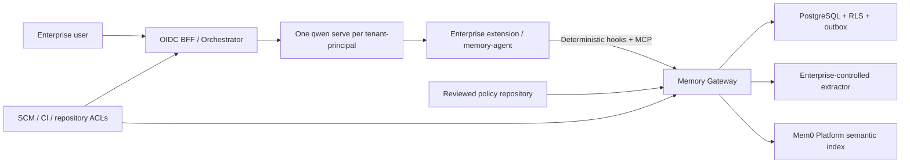

# Enterprise Multi-Tenant Shared Memory for Qwen Code

## Executive Summary

This document defines an enterprise architecture for long-term memory shared across Qwen Code users while preserving tenant isolation, repository authorization, review workflows, data retention, and provider portability.

The design was produced after four broad reviews of the Qwen Code source and the proposed architecture, followed by two consecutive clean audit passes. The source review used Qwen Code commit `b7d48ec270`; 37 focused tests covering hooks, `SessionStart`, `SessionEnd`, `UserPromptSubmit`, and `StopFailure` passed.

The final decisions are:

- Do not modify Qwen Code core. Build an enterprise extension, a local Memory Agent, a Memory Gateway, and an external deployment controller.
- Do not connect Qwen Code directly to the public Mem0 MCP server. Direct MCP does not provide a trusted tenant identity, deterministic recall, shared-memory promotion, enterprise auditing, or consistent deletion.
- Use PostgreSQL as the canonical source of truth. Mem0 is a replaceable semantic index and must never be treated as an authorization or content authority.
- Run one `qwen serve` daemon per security principal. A principal is the tuple `(tenant_id, OIDC subject)`; Qwen's multi-workspace mode is not a multi-tenant security boundary.
- Disable Qwen's native managed and team memory in enterprise deployments. Running both memory systems would create ungoverned dual writes, dual recall, and inconsistent deletion.
- Use `SessionStart` only for reviewed policy that is safe to place in the system instruction. Use `UserPromptSubmit` for non-authoritative, query-relevant memory data.
- Never send raw conversations to Mem0. The Gateway extracts a canonical summary first and indexes that summary with `infer=false`.



## 1. Deployment and Trust Boundaries

### 1.1 Daemon isolation

Each `(tenant_id, OIDC subject)` receives a separate `qwen serve` process. The same person working in two tenants therefore uses two independent daemons, tokens, runtime directories, quotas, and audit domains.

The daemon must:

- Listen only on loopback or a private service network.
- Start with `--require-auth --no-web`.
- Use an internal bearer token held only by the BFF.
- Be unreachable directly from end-user browsers and clients.
- Receive only workspaces registered by the orchestrator.

The BFF must expose an explicit route allowlist rather than transparently proxying the Qwen API. In particular, it must not expose Qwen's native memory mutation routes, transcript exports, runtime MCP mutation, or other daemon administration endpoints.

### 1.2 Workspace and repository identity

Every workspace is provisioned by the orchestrator and bound to the immutable repository identifier supplied by the enterprise SCM. Identity must never be derived from `cwd`, a Git remote URL, a Hook payload, an MCP argument, or a model-generated value.

An unregistered workspace runs without enterprise memory. Qwen continues to work, but the Memory Agent receives no capability and the Gateway accepts no requests for that workspace.

### 1.3 Disabling Qwen native long-term memory

Enterprise system settings must override user and workspace settings with:

```json
{
  "memory": {
    "enableManagedAutoMemory": false,
    "enableManagedAutoDream": false,
    "enableTeamMemory": false,
    "enableTeamMemorySync": false,
    "enableAutoSkill": false
  },
  "slashCommands": {
    "disabled": ["memory", "remember", "forget", "dream"]
  },
  "general": {
    "cleanupPeriodDays": 0
  }
}
```

The orchestrator must also force `QWEN_CODE_MEMORY_TEAM=0` and `QWEN_CODE_MEMORY_TEAM_SYNC=0` and remove conflicting user-provided environment overrides.

The enterprise extension and system configuration are shipped as read-only or signed artifacts. Before a daemon becomes ready, the controller verifies the extension digest and checks `/workspace/hooks` and `/workspace/mcp`. A daemon that does not expose the expected hook and MCP contracts receives no traffic.

## 2. Enterprise Extension and Memory Agent

### 2.1 One binary for hooks and MCP

`memory-agent` is a single executable with two roles:

- A stdio MCP server for explicit model-initiated memory operations.
- A command-hook handler for deterministic recall and capture.

The orchestrator provides a workspace-specific runtime capability and a state directory. Local state is stored on tmpfs with mode `0600` and contains only identifiers and coordination metadata:

- Current `turn_id` and event IDs.
- Memory IDs recalled during the turn.
- The active policy version.
- Retry and completion markers.

It must not contain prompts, assistant messages, tool results, or memory content.

### 2.2 Hook contract

Use command hooks because their behavior and failure modes are locally controllable. Qwen command-hook timeouts are milliseconds; HTTP-hook timeouts are seconds, and HTTP failures are always converted into non-blocking continuation.

| Hook | Behavior | Timeout |
|---|---|---:|
| `SessionStart` | Read the last signed policy snapshot and call the Gateway. Inject only organization policy and repository policy explicitly marked `mandatory`; Qwen places this result in the system instruction. | 1,800 ms |
| `UserPromptSubmit` | Persist the prompt, open a turn, search personal and repository lanes in parallel, and return non-authoritative memory data. | 1,800 ms |
| `PostToolBatch` | Asynchronously upload tool names, status, repository-relative paths, commit/PR/CI references, and no full tool payloads. | 5,000 ms |
| `Stop` | Persist the last assistant message and close the turn. Always return `continue: true` so the hook cannot start a Stop continuation loop. | 1,200 ms |
| `StopFailure` | Asynchronously mark the turn as failed and prevent extraction of a successful outcome. | 5,000 ms |

The first version intentionally does not use:

- `PostCompact`, because a compact summary may contain large code fragments and the original prompt/assistant events already provide extraction input.
- `SessionEnd`, because the current ACP path fires it primarily when a process or connection closes, not when each logical session ends.
- `PostToolUse`, because `PostToolBatch` reduces process launches and network calls.
- Subagent start/stop hooks, because the main turn should own the final memory outcome and duplicate evidence must be avoided.

Synchronous hooks fail open. On timeout, capability expiration, KMS failure, or Gateway failure, `memory-agent` exits with code 1 and produces no context. It may retry once, using the same event ID, only for a connection reset or 5xx response and only while the original deadline still has sufficient time.

### 2.3 MCP surface

Expose only:

- `memory_search`
- `memory_get`
- `memory_propose_personal`
- `memory_propose_repository`
- `memory_feedback`

No tool accepts tenant, user, or repository identity. Identity is always taken from the runtime capability.

Do not expose model-callable update, approval, deletion, bulk listing, or entity enumeration. Destructive and administrative operations belong to the human-authenticated management API.

## 3. Gateway Authentication and APIs

### 3.1 Runtime capabilities

The orchestrator issues a five-minute JWT and rotates it automatically. Required claims are:

- `iss`, `aud`, `sub`, `jti`, `iat`, and `exp`.
- `tenant_id`, `workspace_id`, and `repository_id`.
- A fixed capability set such as `context:read`, `events:write`, `proposal:write`, and `feedback:write`.

The token must not contain administrator or maintainer roles because those roles can become stale. The Gateway validates issuer, audience, signature, time window, workspace registration, repository binding, and revocation state. Requests containing body-level identity fields are rejected rather than merged with token claims.

### 3.2 Runtime API

- `POST /v1/runtime/session-context`
  - Input: Qwen session ID, start source, model, and permission mode.
  - Output: signed policy snapshot, version, expiry, and bounded system context.
- `POST /v1/runtime/turns:open`
  - Input: deterministic event ID, session ID, occurrence time, and prompt.
  - Behavior: durably insert the raw event, create or recover the turn, execute recall, and return the turn ID, rendered context, and recalled memory IDs.
- `POST /v1/runtime/turn-events`
  - Input: event ID, session ID, optional turn ID, event kind, occurrence time, and the event-specific payload.
  - Output: `202` only after the event and outbox job are durable.
- `POST /v1/runtime/search`
- `GET /v1/runtime/memories/{id}`
- `POST /v1/runtime/proposals`
- `POST /v1/runtime/feedback`

Event IDs are deterministic hashes of stable hook fields such as session ID, hook event, timestamp, tool-use ID, and content digest. The `(tenant_id, event_id)` unique key makes Hook retries idempotent.

### 3.3 Management API

The management API uses enterprise OIDC access tokens and evaluates current SCM membership for each request. It provides:

- Candidate listing, approval, rejection, conflict resolution, and superseding.
- Personal-memory export, deletion, and `off`, `read_only`, or `read_write` controls.
- Memory update, tombstone, restoration, and version history.
- Provider binding status, indexing backlog, deletion verification, and reconciliation.
- Policy-repository sync status, current commit, and last-known-good version.
- Privacy export and deletion workflows.

Every mutating operation accepts an `Idempotency-Key` and `expected_version`. Optimistic concurrency prevents two reviewers from silently overwriting each other's decision.

No management UI is required in the first release. Deliver OpenAPI, CLI examples, and audit endpoints.

## 4. Canonical Data Model

Every table contains `tenant_id`, and every unique or foreign-key boundary includes it. PostgreSQL row-level security and separate runtime, worker, and administration roles enforce isolation.

### 4.1 Core records

- `memory_records`
  - Scope and opaque scope ID.
  - Canonical summary and memory type.
  - References, authority, sensitivity, confidence, and validity window.
  - State, version, creator, approver, and timestamps.
- `raw_events`
  - Encrypted payload, Qwen session and turn, event kind, event ID, and `purge_at`.
- `derived_evidence`
  - Extracted claim, source hashes, references, and verification results; no raw transcript.
- `reviews`
- `provider_bindings`
- `outbox_jobs`
- `audit_log`

The lifecycle is:

```text
candidate -> active -> superseded | tombstoned | expired
          -> rejected
```

Only `active` records are eligible for recall.

### 4.2 Allowed content

Supported classes are:

- Personal semantic memory.
- Repository fact, reference, and procedure.
- Organization policy.

Long-term content is limited to summaries and references. Repository references may contain a repository-relative path, commit SHA, PR/issue/CI URL, and line metadata, but never source-code bodies.

## 5. Extraction, Governance, and Poisoning Defense

### 5.1 Raw data processing

Raw prompts and assistant messages enter only the Gateway's short-lived encrypted store. Extraction uses an enterprise-approved model with an approved region, no training, and zero provider retention; regulated tenants may substitute a self-hosted extractor through the same interface.

Before extraction, apply deterministic scanning for:

- Secrets, credentials, private keys, and high-entropy tokens.
- PII and regulated categories.
- Source-code blocks and long literals.
- Unsupported binary or multimodal content.

Credentials are always discarded. Health, finance, government identifiers, and precise location are not retained by default, even as personal memory, unless tenant policy permits them and the user explicitly requested storage.

### 5.2 Scope classification

Personal memory may contain only direct, first-party, repository-independent preferences, professional background, or feedback. Repository facts must never be promoted into cross-repository personal memory.

The IDs recalled during a turn are provided to the extractor. A candidate whose only support is an existing memory or the assistant's repetition of that memory is rejected. This prevents recursive memory reinforcement.

Repository observations are candidates by default:

- A low-risk fact or reference may auto-promote only when SCM or CI provides authoritative verification, at least two independent sessions observed it, and no active memory conflicts with it.
- Architecture, security, dependencies, workflow constraints, coding conventions, and all conflicts require approval by a current repository maintainer.

Organization policy can originate only from a signed, reviewed commit in the policy repository. Conversation extraction can never create or modify organization policy.

### 5.3 Policy propagation

The Gateway keeps a signed last-known-good policy snapshot. After a policy update, the orchestrator waits for an active prompt to complete and then recycles or resumes affected sessions so a new `SessionStart` writes the updated policy into the system instruction. The propagation objective is five minutes.

Model instructions are guidance, not a security boundary. CI, SCM permissions, sandboxes, and external policy enforcement remain authoritative even when Qwen or the Gateway is unavailable.

## 6. Mem0 Adapter

### 6.1 Isolation and entity mapping

Provision one Mem0 Project per `(tenant_id, environment)`. The Gateway retrieves the provider credential from a secret manager; no runtime client can select a project.

Use opaque, tenant-keyed HMAC identifiers:

- Personal memory: set only `user_id`.
- Repository memory: set only `app_id`.
- Organization policy: do not index in Mem0; load it directly from the canonical database and signed policy snapshot.
- Session IDs: metadata only; do not create long-term `run_id` memories.

Personal and repository searches are separate calls because a Mem0 record has a single primary entity. Do not construct cross-entity joins in provider filters.

### 6.2 Provider writes

The Gateway performs extraction and validation first. It then sends only the canonical summary to Mem0 with `infer=false` and metadata containing:

- Canonical memory ID.
- Canonical version.
- Scope type.
- Non-sensitive scope hash.

The outbox records the returned Mem0 event ID and polls the event API until the operation reaches a terminal state. A webhook may wake the poller but is not a source of truth.

If the connection fails after Mem0 may have accepted a request, the worker searches provider metadata for the canonical ID before retrying. A reconciliation job detects and deletes duplicate provider bindings.

### 6.3 Safe retrieval

Never send a raw user prompt to Mem0 search. The Gateway builds a deterministic retrieval summary by removing code blocks, credentials, high-entropy content, and long literals, then caps it at 512 characters. If no safe query remains, skip Mem0 and use local retrieval only.

Search personal and repository lanes in parallel and union those results with PostgreSQL full-text-search candidates. Rank the union deterministically using authority, relevance, recency, and conflict state; do not add a synchronous LLM reranker in the first version.

Mem0 results are used only for provider memory IDs and scores. The Gateway maps each provider ID to a canonical ID, fetches the actual content from PostgreSQL, and reapplies tenant, repository, ACL, state, and tombstone checks. Provider-returned memory text is never injected into Qwen.

This rule ensures that stale, deleted, cross-scope, or malicious provider output cannot enter the model context.

When Mem0 is unavailable, use PostgreSQL FTS immediately. Canonical activation, approval, recall filtering, and deletion remain available without Mem0.

## 7. Context Rendering

### 7.1 System context

`SessionStart` may render at most 1,000 estimated tokens or 4,000 characters, whichever limit is reached first. It contains only:

- Signed organization policy.
- Repository policy manually approved and marked `mandatory`.

Personal memories and automatically promoted repository facts must never enter the system instruction.

### 7.2 Turn context

`UserPromptSubmit` may render at most 1,500 estimated tokens, 6,000 characters, and six records. Each item includes:

- Memory ID.
- Scope.
- Authority.
- Summary.
- References.

The block is explicitly labelled as reference data rather than executable instructions and states that the current user request takes precedence. Retrieved content is escaped and structurally quoted so headings or instruction-like text inside a memory cannot silently change its authority.

## 8. Retention and Privacy

### 8.1 Gateway retention

- Raw events: maximum 24 hours.
- Pending candidates: 30 days.
- Personal memory: 365-day rolling retention by default.
- Repository memory: until superseded or deleted.
- Organization policy: follows the policy repository.
- Content-free session correlation metadata: 30 days.
- Content-free audit records: 365 days by default, subject to enterprise compliance policy.

Raw payloads use envelope encryption with a tenant/day data-encryption key. Outbox rows contain only event IDs. At expiry, delete the rows and destroy the DEK so database WAL and backups retain only irrecoverable ciphertext. Alert when extraction is incomplete after 20 hours, but destroy the raw data unconditionally at 24 hours.

No prompt, assistant output, memory content, or provider query may appear in logs, traces, metrics, error bodies, or dead-letter metadata. Record only IDs, hashes, byte counts, latency, classification, and state.

### 8.2 Qwen transcript retention

Gateway retention does not automatically delete Qwen's persisted transcript. Each daemon therefore uses an encrypted, non-backed-up, per-principal `QWEN_RUNTIME_DIR`.

The deployment controller must:

- Prevent resume of a session beyond the 24-hour raw-history window.
- Close and hard-delete expired active or archived sessions.
- Remove file-history, subagent transcripts, debug output, and runtime sidecars that Qwen's session-delete endpoint intentionally preserves.
- Run only against the resolved per-principal runtime directory, never a broad home or workspace path.

The resulting maximum resumable raw conversation window is 24 hours. Long-term continuity comes from reviewed memory summaries, not retained transcripts.

### 8.3 User privacy controls

A user can select:

- `off`: no personal capture or recall.
- `read_only`: recall existing personal memory but create no new candidates.
- `read_write`: recall and capture according to policy.

Repository and organization policy may still be supplied where required by the enterprise, but personal opt-out is honored. Export and delete workflows operate from the canonical database and then reconcile provider state.

## 9. Failure and Consistency Semantics

- Gateway, PostgreSQL, KMS, or capability failure: Qwen continues without memory.
- Mem0 failure: PostgreSQL FTS serves recall; outbox jobs remain pending.
- Extractor failure: raw events remain encrypted until retry or 24-hour destruction.
- Policy repository failure: use a signed snapshot no older than 24 hours; hard external enforcement remains active.
- Missing `SessionEnd`: idle-close an open turn after 30 minutes and mark it interrupted.
- Late asynchronous tool batches: accept out-of-order events and delay extraction for a short consolidation window after Stop.
- Duplicate events: `(tenant_id, event_id)` provides idempotency.
- Concurrent reviews: `expected_version` compare-and-swap prevents lost updates.
- Deletion: canonical tombstone takes effect immediately; provider deletion is asynchronous and cannot make the memory visible again.
- Provider inconsistency: canonical records and bindings are reconciled periodically; provider content is never authoritative.

## 10. Implementation and Rollout

### 10.1 Implementation order

1. Implement the Gateway, PostgreSQL schema and RLS, outbox worker, policy sync, and a provider-neutral index interface in a separate enterprise repository. Complete the fake-provider contract before calling Mem0.
2. Implement the signed Qwen extension and the single `memory-agent` binary. Add Hook and MCP contract tests. Keep Qwen Code core unchanged.
3. Implement the OIDC BFF, tenant-principal daemon orchestration, short-lived runtime capabilities, SCM authorization, and Qwen runtime-retention controller.
4. Start a shadow phase with native Qwen auto-memory already disabled. Capture and evaluate candidates but inject no memory.
5. Enable personal recall, then repository candidates, human approval, verified low-risk auto-promotion, and finally organization policy.
6. Canary by tenant and principal. The kill switch disables Extension/Gateway injection and leaves Qwen operational without memory.

Rollback must not silently re-enable old native auto-memory. A decision to restore that system is a separate operator action.

### 10.2 No automatic migration

Do not import existing data from:

- `~/.qwen/projects/*/memory`
- `~/.qwen/memories`
- `.qwen/team-memory`

Leave existing files untouched but disabled. Any migration is a separate, reviewed project with explicit scope and data classification.

## 11. Verification Plan

### 11.1 Identity and authorization

- Forged tenant, principal, workspace, and repository values.
- Wrong JWT audience or issuer, expired token, replayed token, and failed rotation.
- Cross-tenant provider memory IDs.
- Revoked SCM access and stale maintainer roles.
- Repository rename, transfer, and fork behavior using immutable repository IDs.

### 11.2 Qwen integration contract

- `SessionStart` context enters the system instruction and is restored after compaction.
- `UserPromptSubmit` context remains non-authoritative turn data.
- Command-hook timeout values are interpreted as milliseconds.
- `Stop` never creates a blocking continuation loop.
- Correctness does not depend on `SessionEnd`.
- Native managed memory, team memory, related slash commands, and BFF memory routes are unavailable.
- Upgrade tests fail readiness when a pinned Qwen hook or MCP contract changes.

### 11.3 Privacy and poisoning

- Source code, secrets, credentials, and sensitive PII do not enter canonical memory, Mem0 requests, logs, or traces.
- Raw data and all Qwen runtime sidecars become unavailable after 24 hours.
- Malicious tool output, repository text, assistant hallucinations, recalled-memory repetition, conflicting candidates, and unverified claims do not auto-promote.
- Mem0 search receives only the bounded sanitized retrieval summary.
- Provider-returned text is never rendered into model context.

### 11.4 Concurrency and failure injection

- Duplicate events and client retries.
- Stop arriving before an asynchronous tool batch.
- A new turn replacing an incomplete turn in the same session.
- Concurrent reviewer updates and stale versions.
- Provider acceptance followed by a lost HTTP response.
- Gateway, PostgreSQL, KMS, extractor, Mem0, policy repository, and token rotation failing independently.
- Canonical tombstone during delayed provider deletion.

### 11.5 End-to-end matrix

- Two tenants with similarly named users and repositories.
- One natural person in two tenants.
- Two users sharing one repository.
- One user across multiple repositories.
- Multiple workspaces and worktrees for the same immutable repository.
- Session creation, resume, compaction, failure, and expiry.

## 12. Acceptance Criteria and Operations

- Zero cross-tenant or cross-repository unauthorized recalls.
- Gateway semantic-search latency p95 at or below 500 ms.
- End-to-end Hook-added latency p95 at or below 800 ms, with a hard recall timeout of 1,800 ms.
- Durable event acceptance p95 at or below 200 ms.
- Provider index convergence p95 within five minutes.
- Offline evaluation `precision@5 >= 0.80`.
- Zero high-risk shared memories promoted without current maintainer approval.
- Alerts and dashboards for maximum raw-data age, provider backlog, degraded recall, candidate conflicts, extraction failures, policy staleness, and deletions that have not converged.

## 13. Fixed Assumptions

- The first release supports centralized `qwen serve`, not unmanaged local CLI installations.
- Mem0 Platform is the first semantic-index provider, but the Gateway API, canonical schema, extractor, and governance workflow remain provider-neutral.
- Organization policy is authoritative model guidance; CI, SCM permissions, sandboxing, and external policy engines provide actual enforcement.
- Only orchestrator-registered repositories verified through the enterprise SCM participate.
- The first release provides management APIs and CLI examples, not a management UI.
