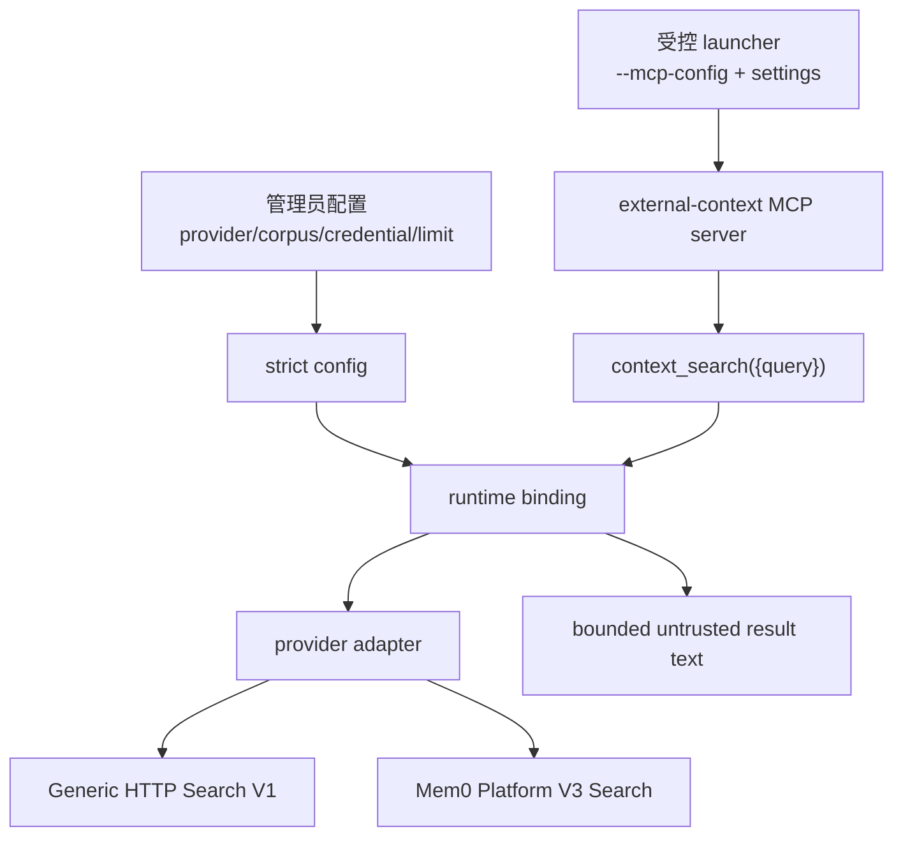

# Retrieval-only External Context Search 技术方案

> 适用范围：`QwenLM/qwen-code` retrieval-only external context search integration（#7586 当前 open diff）。
> 当前记录：#7586 仍为 open，本文件按当前 diff、changed files、测试路径与 examples 记录方案观察；不能视为 `main` 已落地能力。

---

## 1. 背景与动机

#7586 当前实现面向一个窄部署 profile：管理员已经把外部上下文 provider 的 credential、project/index/corpus 限定到正确语料，Qwen 只需要在模型显式请求时做一次只读检索。它不是 Enterprise Memory Gateway 的替代品，不处理 tenant policy、review queue、跨仓库共享、删除一致性、DLP、身份/文档 ACL、不可绕过确认或合规审计。

核心风险是把 provider 直接暴露给模型：模型不应知道 credential env 名称，不应选择 provider/corpus，不应看到 provider 内部错误，也不能把 provider 输出当作可信系统指令。因此当前 diff 把能力收敛为一个 Qwen extension 提供的 retrieval-only MCP server，而不是 Qwen Core API，也不注册 hook、自动 recall 或写入记忆工具。

---

## 2. 整体架构

关键边界：

1. MCP surface 只有 `context_search({query})`；没有 `context_remember`，没有 `UserPromptSubmit` auto recall hook，也没有 provider selector。
2. provider/corpus/credential 在 MCP server 启动前由配置固定；模型只能提供 query。
3. provider error detail、credential env name、config path 不进入模型上下文。
4. HTTP client bounded、可取消、拒绝 redirects，除 loopback 外要求 HTTPS。
5. provider 输出是非可信检索结果，不作为系统指令拼接。
6. direct profile 信任本地 repo env 和同 UID 进程；需要企业隔离和治理时应使用 governed / enterprise profile。

---

## 3. 分层实现

### 3.1 Strict config

`integrations/external-context/src/config.ts` 解析 strict JSON 配置，拒绝 unknown fields、非法 version、非法 credential env name、超过上限的 timeout、非 HTTPS endpoint（除显式 loopback HTTP）和不受支持的 provider 类型。配置中固定 provider binding 与搜索限制，运行时不会让模型选择 provider、project、index、corpus 或 app。

managed profile 通过 `examples/managed-mcp.json` 和 `managed-settings.json` 展示受控 launcher 形态：管理员传入 `--mcp-config`，settings 禁用会改变当前工作区边界的命令，只允许固定的 search tool。`qwen-extension.json` 只用于本地可信 trial，不代表托管环境的安全来源绑定。

### 3.2 MCP surface

`integrations/external-context/src/mcp.ts` 只注册一个 tool：`context_search({query})`。query 做基础类型/长度校验与 whitespace normalization 后，交给已固定 provider binding。MCP server 不注册 hook，不自动把用户 prompt 送到 provider，也不提供 remember、delete、approve、policy、provider selector 等写入或管理动作。

这种设计把“何时检索”交给模型显式工具调用，同时把“能检索哪个 corpus”固定在管理员配置里，避免模型通过参数越权。

### 3.3 Provider adapters

`integrations/external-context/src/providers.ts` 提供两类只读 provider：

- `GenericHttpSearchV1Adapter`: 向 `/v1/context/search` POST `{query, limit}`，只接受 bounded JSON response，并丢弃 invalid item。
- `Mem0PlatformV3Adapter`: 使用 Mem0 Platform V3 Search，固定 `app_id`、`top_k=5`、`threshold=0.1`、`rerank=false` 等搜索参数，把结果归一成本地 context item。

Mem0 `app_id` 在这里是 classification / corpus selector，不是 Qwen 侧 authorization。真正的 tenant、document ACL、retention 和审计仍依赖 provider 或外部 gateway。

### 3.4 HTTP client and error handling

`integrations/external-context/src/http-client.ts` 统一做 bounded POST JSON、timeout、AbortSignal 取消、redirect rejection、HTTPS/loopback 校验、invalid JSON/UTF-8 和 oversized response 检查。provider timeout、transport、HTTP status、response shape 错误在本地归一为稳定失败，不把 provider detail 暴露给模型。

本层没有 retry 或 cache。理由是外部 provider 的 freshness、quota 和权限语义不由 Qwen 掌握；重复请求是否安全应由调用方或 provider 自己决定。

### 3.5 Trust boundary

当前 diff 明确区分 direct 与 managed 两种运行口径：

- direct profile：信任单个本地仓库、repo env files 和同 UID 进程；适合本地可信 trial。
- managed profile：管理员固定 MCP config、settings、allowed tool 和运行环境；适合内部受控 launcher。

两者都不提供企业级隔离：没有 DLP、进程/credential 隔离、用户身份映射、文档 ACL、不可绕过确认、审计保留或 prompt injection 防护。需要这些能力时，应转向 enterprise memory gateway / governed profile，而不是把 #7586 的 direct extension 扩展成管理面。

---

## 4. 验证方式

- `npm test --workspace=@qwen-code/external-context`
- `npm run build && npm run typecheck`
- 单测覆盖 config strictness、provider binding、MCP tool registration、Generic HTTP/Mem0 adapter、timeout/cancel、redirect/HTTPS guard、invalid JSON/UTF-8、oversized response 和 provider failure redaction。

---

## 5. 已知限制 / 后续

- #7586 仍为 open；不能视为 main 已落地。
- 当前实现是 retrieval-only；不包含 auto recall hook、remember writer、删除、审批、policy 或 management API。
- provider credential 的最小权限、document ACL 和审计由外部系统保证；Qwen extension 只约束本地配置和请求边界。
- provider 输出的相关性、排序、去重和安全过滤依赖 provider；本层只做结构校验、长度限制和非可信展示。

_按个人 PR 口径更新于 2026-07-24_
