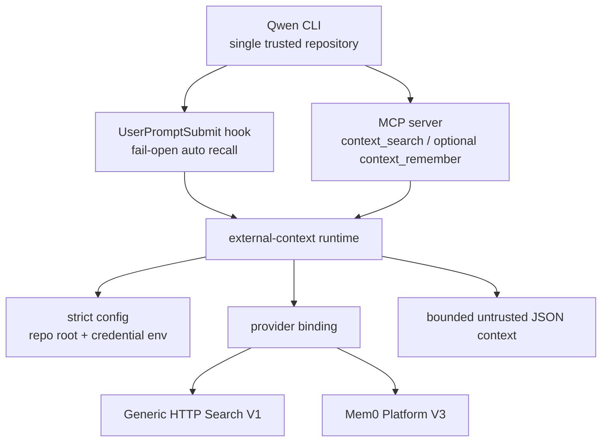

# Direct External Context Provider 技术方案

> 适用范围：`QwenLM/qwen-code` private direct external context provider integration（#7586 当前 open diff）。
> 当前记录：#7586 仍为 open，本文件按当前 diff、changed files、测试路径与设计文档记录方案观察；不能视为 `main` 已落地能力。

---

## 1. 背景与动机

Direct External Context Provider 面向一个窄部署 profile：一个 interactive Qwen CLI 进程服务一个可信仓库，外部 provider 可以签发只覆盖该仓库 corpus 的 credential。它不是 Enterprise Memory Gateway 的替代品，不处理多租户管理面、tenant policy、review queue 或跨仓库共享；它只提供一个低耦合 extension，让模型在受控边界内搜索外部上下文，并在明确启用时写入 provider。

核心风险是把外部 provider 直接暴露给模型：模型不应知道 credential env 名称，不应选择 provider，不应越过 repository root，也不能把 provider 输出当作可信指令。因此 #7586 把它做成 Qwen extension，而不是 Qwen Core API。

---

## 2. 整体架构

关键边界：

1. repository root 是最小安全域；cwd 必须解析到 root 内部，symlink escape 和 sibling path 都拒绝。
2. provider selector、credential env name、provider error detail 不进入模型上下文。
3. auto recall fail-open；provider 不可用不能阻断 coding request。
4. provider 输出永远以 bounded JSON item data 进入 additional context，不作为系统指令拼接。
5. write-capable `context_remember` 默认关闭，开启后也只报告 accepted/unknown/error，不宣称 provider 已持久成功。

---

## 3. 分层实现

### 3.1 Strict config

`integrations/external-context/src/config.ts` 解析最多 64 KiB 的 JSON 配置，拒绝 unknown fields、非法 version、relative root、非法 credential env name、超过 5 秒的 provider timeout、非 HTTPS endpoint（除显式 loopback HTTP）。`isInsideRepository()` 用真实路径校验 descendants，拒绝 sibling 与 symlink escape。

### 3.2 Context normalization and rendering

`context.ts` 对自动 recall query 做敏感信息清洗：移除代码块、常见 credential、JWT 和高熵 token，并把 query 截到 512 字符。manual query 只归一 whitespace，不接受 provider selector。`renderExternalContext()` 限制最多 5 个 item、单 item content 1000 字符、总输出 4000 字符，并把恶意 provider 文本放在 JSON data 内。

### 3.3 Hook surface

`hook.ts` 处理 `UserPromptSubmit`：如果 recall disabled、cwd 不在 repo root、配置不可读、provider timeout/transport error 或 local failure，都返回 `continue: true`。命中 recall 时，用 sanitized query 调 provider，再把 bounded rendered context 注入 `hookSpecificOutput.additionalContext`。

同一个 hook 也给 exact `mcp__external-context__context_remember` 做 ask boundary；类似名字不会触发，避免模型通过仿冒 tool name 绕过确认。

### 3.4 MCP surface

`mcp.ts` 暴露 read-only `context_search`，把 normalized query 转发给当前 provider binding，并返回 bounded text result。`context_remember` 只有 provider config 开启 writer 时才注册；它只接受明确内容，不暴露 approve/delete/policy/provider selector 等管理动作。

### 3.5 Provider adapters

`providers.ts` 提供两类 provider：

- `GenericHttpSearchV1Adapter`: 只发送 query/limit，拒绝 redirects、oversized response、invalid JSON/UTF-8，并丢弃 invalid items。
- `Mem0PlatformV3Adapter`: 固定 app_id 与 V3 search options，规范化 Mem0 results；write path 对成功 add 只返回 accepted，不把 unbounded provider operation id 回传给模型；ambiguous add 返回 unknown 且不重试。

`http-client.ts` 将 provider failure 分为 `ProviderHttpError`、`ProviderResponseError`、`ProviderTimeoutError` 和 `ProviderTransportError`，便于 hook fail-open 时做安全诊断。

---

## 4. 验证方式

- `npm test --workspace=@qwen-code/external-context`
- `npm run build && npm run typecheck`
- 单测覆盖 config、repo boundary、query redaction、untrusted rendering、hook fail-open、MCP tool registration、Generic HTTP/Mem0 adapter、timeout/invalid JSON/invalid UTF-8、write accepted/unknown/error。

---

## 5. 已知限制 / 后续

- #7586 仍为 open；不能视为 main 已落地。
- 只适用于 single trusted repository profile，不提供 enterprise tenant/policy/review/delete management。
- provider credential 的最小权限依赖外部发行方保证；Qwen extension 只验证本地配置和 request 边界。
- 自动 recall 的相关性、去重和排序完全依赖 provider；本层只做安全裁剪和 bounded rendering。

_按个人 PR 口径更新于 2026-07-23_
