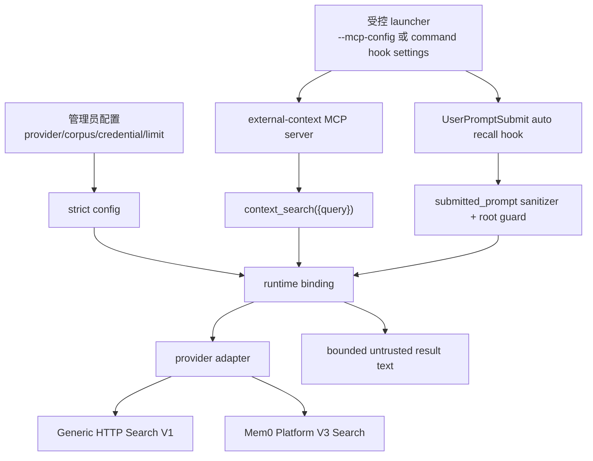

# Direct External Context Search / Auto Recall 技术方案

> 适用范围：`QwenLM/qwen-code` Direct External Context integration（#7586 retrieval-only MCP 当前 open diff；#7877 submitted-prompt auto recall）。
> 当前记录：#7586 仍为 open；#7877 已按 merged diff、changed files、测试路径与 examples 记录最终实现。

---

## 1. 背景与动机

PR #7586 当前实现面向一个窄部署 profile：管理员已经把外部上下文 provider 的 credential、project/index/corpus 限定到正确语料，Qwen 只需要在模型显式请求时做一次只读检索。#7877 在此基础上增加另一个 mutually-exclusive profile：管理员把同一只读 provider 安装成 `UserPromptSubmit` command hook，使每次 fresh user submission 都可以基于 `submitted_prompt` 做一次确定性 auto recall。两者都不是 Enterprise Memory Gateway 的替代品，不处理 tenant policy、review queue、跨仓库共享、删除一致性、DLP、身份/文档 ACL、不可绕过确认或合规审计。

核心风险是把 provider 直接暴露给模型或 hook：模型不应知道 credential env 名称，不应选择 provider/corpus，不应看到 provider 内部错误，也不能把 provider 输出当作可信系统指令。因此方案把能力拆成两个互斥入口：retrieval-only MCP server 只暴露 `context_search({query})`；auto recall hook 只消费 `submitted_prompt` 并返回 bounded user-layer `additionalContext`。两者都不提供写入记忆工具或管理面。

---

## 2. 整体架构

```mermaid
flowchart TB
  Admin["管理员配置<br/>provider/corpus/credential/limit"] --> Config["strict config"]
  Launcher["受控 launcher<br/>--mcp-config 或 command hook settings"] --> MCP["external-context MCP server"]
  Launcher --> Hook["UserPromptSubmit auto recall hook"]
  Config --> Runtime["runtime binding"]
  MCP --> Tool["context_search({query})"]
  Tool --> Runtime
  Hook --> SP["submitted_prompt sanitizer + root guard"]
  SP --> Runtime
  Runtime --> Provider["provider adapter"]
  Provider --> G["Generic HTTP Search V1"]
  Provider --> M["Mem0 Platform V3 Search"]
  Runtime --> Render["bounded untrusted result text"]
```

关键边界：

1. MCP profile surface 只有 `context_search({query})`；没有 `context_remember`，没有 provider selector。
2. Auto Recall profile surface 是 `UserPromptSubmit` command hook；它只处理可证明的 `submitted_prompt`，不读取 model-bound `prompt` 作为 query。
3. provider/corpus/credential 在 MCP server 或 hook 启动前由配置固定；模型或 hook payload 不能选择 provider。
4. provider error detail、credential env name、config path 不进入模型上下文。
5. HTTP client bounded、可取消、拒绝 redirects，除 loopback 外要求 HTTPS。
6. provider 输出是非可信检索结果，不作为系统指令拼接。
7. direct profile 信任本地 repo env 和同 UID 进程；需要企业隔离和治理时应使用 governed / enterprise profile。

---

## 3. 分层实现

### 3.1 Strict config

`integrations/external-context/src/config.ts` 解析 strict JSON 配置，拒绝 unknown fields、非法 version、非法 credential env name、超过上限的 timeout、非 HTTPS endpoint（除显式 loopback HTTP）和不受支持的 provider 类型。配置中固定 provider binding 与搜索限制，运行时不会让模型选择 provider、project、index、corpus 或 app。

managed MCP profile 通过 `examples/managed-mcp.json` 和 `managed-settings.json` 展示受控 launcher 形态：管理员传入 `--mcp-config`，settings 禁用会改变当前工作区边界的命令，只允许固定的 search tool。#7877 另增加 managed auto recall examples：配置 `autoRecall.repositoryRoot`，并通过受控 QWEN_HOME settings 注册 command hook，同时禁用 chat recording、speculation、native managed/team memory、auto-skill、memory slash commands、`/cd`、auto acceptance、usage stats 与 telemetry；`disableAllHooks=false`，但不同时启用 MCP 或 extension manifest。

### 3.2 MCP surface

`integrations/external-context/src/mcp.ts` 只注册一个 tool：`context_search({query})`。query 做基础类型/长度校验与 whitespace normalization 后，交给已固定 provider binding。MCP server 不注册 hook，不自动把用户 prompt 送到 provider，也不提供 remember、delete、approve、policy、provider selector 等写入或管理动作。

这种设计把“何时检索”交给模型显式工具调用，同时把“能检索哪个 corpus”固定在管理员配置里，避免模型通过参数越权。

### 3.3 Auto Recall hook surface（#7877）

`integrations/external-context/src/auto-recall.ts` 只接受 `UserPromptSubmit` hook payload。它要求 `hook_event_name === 'UserPromptSubmit'` 且存在非空 `submitted_prompt`；缺失、空值、legacy `prompt` only、非法 JSON 或 unsupported producer 都返回 `{}`，并且在这些 no-op 路径上不加载 config、credential、proxy 或 provider。

Auto Recall 使用 `submitted_prompt` 作为唯一 query 来源，不使用 model-bound `prompt`。这样 `@file` expansion、reminder、slash command 扩展和其它系统上下文不会被送给 external provider；E2E 验证模型上下文仍能同时看到文件扩展内容与召回结果，但 provider 只看到用户提交文本投影。

hook 还会校验运行 cwd：真实 `cwd` 必须是配置 `autoRecall.repositoryRoot` realpath 的同一路径或子路径，拒绝 filesystem root 与字符串前缀伪装。query sanitizer 会归一 whitespace、去除常见 accidental secret pattern、拒绝 code-fence-only 输入、限制 512 Unicode code points，并限制 sanitizer 输入大小。

provider 调用最多一次，无 retry/cache，默认 1500ms timeout，配置范围 1..5000ms。结果最多 5 条，每条 content 1000 code points，序列化 envelope 4000 JS code units，尖括号转 Unicode escape；返回值写入 `hookSpecificOutput.additionalContext`，作为 user-layer untrusted JSON envelope 拼接，不提升为 system instruction。检索上下文会随会话历史被后续请求重放，因此 budget 是每次注入的边界，不是整个会话生命周期总边界。

### 3.4 Provider adapters

`integrations/external-context/src/providers.ts` 提供两类只读 provider：

- `GenericHttpSearchV1Adapter`: 向 `/v1/context/search` POST `{query, limit}`，只接受 bounded JSON response，并丢弃 invalid item。
- `Mem0PlatformV3Adapter`: 使用 Mem0 Platform V3 Search，固定 `app_id`、`top_k=5`、`threshold=0.1`、`rerank=false` 等搜索参数，把结果归一成本地 context item。

Mem0 `app_id` 在这里是 classification / corpus selector，不是 Qwen 侧 authorization。真正的 tenant、document ACL、retention 和审计仍依赖 provider 或外部 gateway。

### 3.5 HTTP client and error handling

`integrations/external-context/src/http-client.ts` 统一做 bounded POST JSON、timeout、AbortSignal 取消、redirect rejection、HTTPS/loopback 校验、invalid JSON/UTF-8 和 oversized response 检查。provider timeout、transport、HTTP status、response shape 错误在本地归一为稳定失败，不把 provider detail 暴露给模型。

本层没有 retry 或 cache。理由是外部 provider 的 freshness、quota 和权限语义不由 Qwen 掌握；重复请求是否安全应由调用方或 provider 自己决定。

### 3.6 Trust boundary

当前 diff 明确区分 direct 与 managed 两种运行口径：

- direct profile：信任单个本地仓库、repo env files 和同 UID 进程；适合本地可信 trial。
- managed profile：管理员固定 MCP config、settings、allowed tool 和运行环境；适合内部受控 launcher。

两者都不提供企业级隔离：没有 DLP、进程/credential 隔离、用户身份映射、文档 ACL、不可绕过确认、审计保留或 prompt injection 防护。需要这些能力时，应转向 enterprise memory gateway / governed profile，而不是把 #7586 的 direct extension 扩展成管理面。

---

## 4. 验证方式

- `npm test --workspace=@qwen-code/external-context`
- `npm run build && npm run typecheck`
- 单测覆盖 config strictness、provider binding、MCP tool registration、Generic HTTP/Mem0 adapter、timeout/cancel、redirect/HTTPS guard、invalid JSON/UTF-8、oversized response 和 provider failure redaction。
- #7877 追加覆盖 config v1/v2、autoRecall root containment、submitted_prompt missing/invalid no-op、credential pattern、Unicode/query bounds、timeout cancellation、provider fail-open、context envelope budget，以及 interactive TUI → Hook → loopback Generic HTTP → model context E2E。

---

## 5. 已知限制 / 后续

- #7586 仍为 open；不能视为 main 已落地。#7877 已合入，但只提供 direct auto recall profile，不改变 #7586 的 MCP profile 状态。
- 当前实现仍是只读检索；auto recall 也只注入 untrusted context，不包含 remember writer、删除、审批、policy 或 management API。
- provider credential 的最小权限、document ACL 和审计由外部系统保证；Qwen extension 只约束本地配置和请求边界。
- provider 输出的相关性、排序、去重和安全过滤依赖 provider；本层只做结构校验、长度限制和非可信展示。
- Auto Recall retrieved context 会进入 conversation history 并在后续 turn 重放；当前只保证每次注入 bounded，不做会话生命周期总量回收、DLP、ACL 或审计保留。

## 6. 涉及 PR

| PR | 状态 | 子主题 | 作用 |
|---|---|---|---|
| [#7586](https://github.com/QwenLM/qwen-code/pull/7586) | OPEN | retrieval-only MCP | 固定 provider/corpus/credential，只暴露 `context_search({query})`，返回 bounded untrusted result。 |
| [#7877](https://github.com/QwenLM/qwen-code/pull/7877) | MERGED | submitted-prompt auto recall | 新增 `UserPromptSubmit` command hook profile，基于 `submitted_prompt` 自动检索一次并通过 user-layer `additionalContext` 注入。 |

_按个人 PR 口径更新于 2026-07-29_
