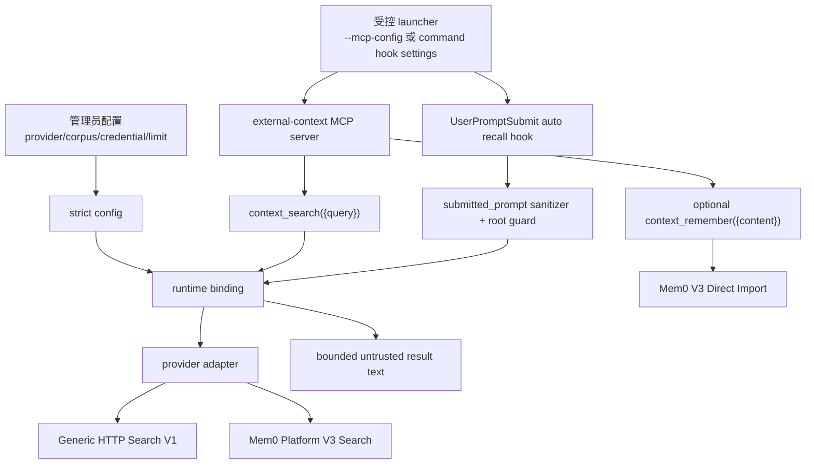

# Direct External Context Search / Auto Recall / Mem0 Write 技术方案

> 适用范围：`QwenLM/qwen-code` Direct External Context integration（#7586 retrieval-only MCP；#7877 submitted-prompt auto recall；#8206 dependency hardening；#8352 Auto Recall proxy lifecycle；#8507 optional Mem0 write；#9068 provider extension profile；#10113/#10149/#10634 configurable Mem0 extension）。
> 当前记录：#7586/#7877/#8206/#8352/#8507/#9068/#10113/#10149/#10634 已按 merged diff、changed files、测试路径与 examples 记录最终实现。

---

## 1. 背景与动机

PR #7586 面向一个窄部署 profile：管理员已经把外部上下文 provider 的 credential、project/index/corpus 限定到正确语料，Qwen 只需要在模型显式请求时做一次只读检索。#7877 在此基础上增加另一个 mutually-exclusive profile：管理员把同一只读 provider 安装成 `UserPromptSubmit` command hook，使每次 fresh user submission 都可以基于 `submitted_prompt` 做一次确定性 auto recall。#8352 修复 Auto Recall Hook 的一次性 proxy dispatcher 生命周期，避免 provider timeout 后 CONNECT socket 留住 child process，并把 v1/v2 entrypoint 与 timeout ownership 文档纠正到实际实现。#8206 已合入，收敛 direct external-context MCP profile 的 MCP SDK / Hono / parser dependency path，但不扩大业务 surface，也不迁移 mobile-mcp；mobile-mcp 的 Node.js 22 / Hono 2 方案另由 #8311 记录。#8507 在严格 v1 Mem0 config 上增加可选 `context_remember({content})` 写入变体，用 Mem0 V3 Direct Import 保存一条由用户确认过的仓库记忆；它不把 Generic HTTP、v2 Auto Recall 或默认 manifest 扩展成写入面。#9068 已合入，在此之上定义 provider-owned Extension Profile v1，让 provider 通过现有 Qwen Extension + MCP 边界交付固定 `context_search` schema、test vectors、参考输出和本地/远端示例，而不是把 Generic HTTP adapter 当作长期 provider API。这些 PR 都不是 Enterprise Memory Gateway 的替代品，不处理 tenant policy、review queue、跨仓库共享、删除一致性、DLP、身份/文档 ACL、不可绕过确认或合规审计。

核心风险是把 provider 直接暴露给模型或 hook：模型不应知道 credential env 名称，不应选择 provider/corpus，不应看到 provider 内部错误，也不能把 provider 输出当作可信系统指令。因此方案把能力拆成三个入口：retrieval-only MCP server 默认只暴露 `context_search({query})`；auto recall hook 只消费 `submitted_prompt` 并返回 bounded user-layer `additionalContext`；可选 Mem0 write variant 只在管理员启用严格 v1 write block 后暴露 `context_remember({content})`，并把写入前内容确认、非幂等和不确定结果禁止自动重试作为契约。三者都不提供 provider selector、delete、approve、policy 或 management API。

---

## 2. 整体架构

```mermaid
flowchart TB
  Admin["管理员配置<br/>provider/corpus/credential/limit"] --> Config["strict config"]
  Launcher["受控 launcher<br/>--mcp-config 或 command hook settings"] --> MCP["external-context MCP server"]
  Launcher --> Hook["UserPromptSubmit auto recall hook"]
  Config --> Runtime["runtime binding"]
  MCP --> Tool["context_search({query})"]
  Tool --> Runtime
  Hook --> SP["submitted_prompt sanitizer + root guard"]
  SP --> Runtime
  Runtime --> Provider["provider adapter"]
  Provider --> G["Generic HTTP Search V1"]
  Provider --> M["Mem0 Platform V3 Search"]
  Runtime --> Render["bounded untrusted result text"]
  MCP --> Remember["optional context_remember({content})"]
  Remember --> Mem0Write["Mem0 V3 Direct Import"]
```

关键边界：

1. MCP retrieval profile surface 默认只有 `context_search({query})`；只有 #8507 的严格 v1 Mem0 write variant 才会额外注册 `context_remember({content})`，仍没有 provider selector。
2. Auto Recall profile surface 是 `UserPromptSubmit` command hook；它只处理可证明的 `submitted_prompt`，不读取 model-bound `prompt` 作为 query。
3. provider/corpus/credential 在 MCP server 或 hook 启动前由配置固定；模型或 hook payload 不能选择 provider。
4. provider error detail、credential env name、config path 不进入模型上下文。
5. HTTP client bounded、可取消、拒绝 redirects，除 loopback 外要求 HTTPS。
6. provider 输出是非可信检索结果，不作为系统指令拼接。
7. direct profile 信任本地 repo env 和同 UID 进程；需要企业隔离和治理时应使用 governed / enterprise profile。
8. provider extension profile v1（#9068）只允许 manifest allowlist 的 `context_search`，input/output schema language-neutral，且不引入 provider selector、tenant selector、credential override、filter/metadata 隧道或管理面。

---

## 3. 分层实现

### 3.1 Strict config

`integrations/external-context/src/config.ts` 解析 strict JSON 配置，拒绝 unknown fields、非法 version、非法 credential env name、超过上限的 timeout、非 HTTPS endpoint（除显式 loopback HTTP）和不受支持的 provider 类型。配置中固定 provider binding 与搜索限制，运行时不会让模型选择 provider、project、index、corpus 或 app。

managed MCP profile 通过 `examples/managed-mcp.json` 和 `managed-settings.json` 展示受控 launcher 形态：管理员传入 `--mcp-config`，settings 禁用会改变当前工作区边界的命令，只允许固定的 search tool。#7877 另增加 managed auto recall examples：配置 `autoRecall.repositoryRoot`，并通过受控 QWEN_HOME settings 注册 command hook，同时禁用 chat recording、speculation、native managed/team memory、auto-skill、memory slash commands、`/cd`、auto acceptance、usage stats 与 telemetry；`disableAllHooks=false`，但不同时启用 MCP 或 extension manifest。

### 3.2 MCP surface

`integrations/external-context/src/mcp.ts` 默认只注册一个 tool：`context_search({query})`。query 做基础类型/长度校验与 whitespace normalization 后，交给已固定 provider binding。MCP server 不注册 hook，不自动把用户 prompt 送到 provider，也不提供 delete、approve、policy、provider selector 等管理动作。

这种设计把“何时检索”交给模型显式工具调用，同时把“能检索哪个 corpus”固定在管理员配置里，避免模型通过参数越权。

### 3.3 Mem0 write variant（#8507）

#8507 只在严格 v1 Mem0 configuration 且 `write.enabled === true` 时注册 `context_remember({content})`。现有 v1 检索配置、Generic HTTP provider、v2 Auto Recall config 和默认 extension manifest 都保持 write-free；`enabled:false`、unknown fields 或非 Mem0 写入配置不会得到写入工具。

`context_remember` 的输入只有 `content`，最大 4000 Unicode code points，保留首尾空格、换行和 Unicode。它不会做总结、预搜索、去重、cache、retry、polling 或 provider/app 选择。approved content 被作为一条 Mem0 Platform V3 Direct Import user message 发送到 `/v3/memories/add/`，固定使用管理员配置的 `app_id`，并设置 `infer:false`。

结果契约刻意区分同步成功、异步接受和不确定结果：`SUCCEEDED` 映射为 `stored`；`PENDING` 且 `event_id` 是有效 UUID 映射为 `accepted`，只表示 provider 已排队；timeout、cancel、broken JSON、redirect、非法状态或 response shape 错误映射为 `unknown` MCP error，并明确提示不要自动重试，因为 provider 可能已经接受请求。tool annotations 设置为非只读、非幂等，与 #8387 的 MCP unsafe replay guard 配合，防止连接丢失后自动重放写入。

专用 `PreToolUse` command Hook（`write-confirmation.ts`）展示完整内容的可逆安全转义形式并要求确认。默认 approval 模式下会先出现普通 MCP 权限提示，再出现内容可见确认；YOLO 模式会跳过普通 MCP prompt，但 Hook 仍要求确认。拒绝内容确认时 provider 请求数必须为 0。该 Hook 是 best-effort UX 防护，不是服务端授权、DLP 或不可绕过审批。

### 3.4 Auto Recall hook surface（#7877）

`integrations/external-context/src/auto-recall.ts` 只接受 `UserPromptSubmit` hook payload。它要求 `hook_event_name === 'UserPromptSubmit'` 且存在非空 `submitted_prompt`；缺失、空值、legacy `prompt` only、非法 JSON 或 unsupported producer 都返回 `{}`，并且在这些 no-op 路径上不加载 config、credential、proxy 或 provider。

Auto Recall 使用 `submitted_prompt` 作为唯一 query 来源，不使用 model-bound `prompt`。这样 `@file` expansion、reminder、slash command 扩展和其它系统上下文不会被送给 external provider；E2E 验证模型上下文仍能同时看到文件扩展内容与召回结果，但 provider 只看到用户提交文本投影。

hook 还会校验运行 cwd：真实 `cwd` 必须是配置 `autoRecall.repositoryRoot` realpath 的同一路径或子路径，拒绝 filesystem root 与字符串前缀伪装。query sanitizer 会归一 whitespace、去除常见 accidental secret pattern、拒绝 code-fence-only 输入、限制 512 Unicode code points，并限制 sanitizer 输入大小。

provider 调用最多一次，无 retry/cache，默认 1500ms timeout，配置范围 1..5000ms。结果最多 5 条，每条 content 1000 code points，序列化 envelope 4000 JS code units，尖括号转 Unicode escape；返回值写入 `hookSpecificOutput.additionalContext`，作为 user-layer untrusted JSON envelope 拼接，不提升为 system instruction。检索上下文会随会话历史被后续请求重放，因此 budget 是每次注入的边界，不是整个会话生命周期总边界。

#8352 补上一次性 Hook 的 proxy dispatcher ownership：Hook 只有在 event/config/cwd/query 校验之后才安装 environment-aware proxy dispatcher，随后在 provider construction/search/rendering 之后通过 `finally` 等待 `dispatcher.destroy()`。成功、空结果、provider failure 和 render failure 都会释放 dispatcher；malformed event、v1 config、cwd 越界、空 query 等 early no-op 路径不安装 proxy。长驻 MCP 进程仍保留 process-lifetime dispatcher，不按请求销毁。

配置入口也随 #8352 明确：shared loader 可解析 v1/v2，但 MCP process entrypoint 只接受 v1，Auto Recall Hook 只接受 v2；v2 顶层 `timeoutMs` 仅为兼容已有 v2 config file 保留，当前没有 runtime consumer，Hook 请求 timeout 只读 `autoRecall.timeoutMs`。

### 3.5 Provider adapters

`integrations/external-context/src/providers.ts` 提供默认只读检索 adapter，并在 #8507 的 Mem0 write variant 中复用 Mem0 binding 增加 Direct Import：

- `GenericHttpSearchV1Adapter`: 向 `/v1/context/search` POST `{query, limit}`，只接受 bounded JSON response，并丢弃 invalid item。
- `Mem0PlatformV3Adapter`: 默认使用 Mem0 Platform V3 Search，固定 `app_id`、`top_k=5`、`threshold=0.1`、`rerank=false` 等搜索参数，把结果归一成本地 context item；write variant 只在严格配置下调用 Mem0 V3 Direct Import。

Mem0 `app_id` 在这里是 classification / corpus selector，不是 Qwen 侧 authorization。#8507 的 write variant 也只复用同一个管理员固定 `app_id` 做 Direct Import，不让模型选择 app 或 tenant。真正的 tenant、document ACL、retention、delete 和审计仍依赖 provider 或外部 gateway。

### 3.6 HTTP client and error handling

`integrations/external-context/src/http-client.ts` 统一做 bounded POST JSON、timeout、AbortSignal 取消、redirect rejection、HTTPS/loopback 校验、invalid JSON/UTF-8 和 oversized response 检查。provider timeout、transport、HTTP status、response shape 错误在本地归一为稳定失败，不把 provider detail 暴露给模型。

本层没有 retry 或 cache。理由是外部 provider 的 freshness、quota 和权限语义不由 Qwen 掌握；重复请求是否安全应由调用方或 provider 自己决定。写入路径更严格：不确定结果不能自动 retry，因为外部 provider 可能已经接受了非幂等写入。

### 3.7 Trust boundary

当前 diff 明确区分 direct 与 managed 两种运行口径：

- direct profile：信任单个本地仓库、repo env files 和同 UID 进程；适合本地可信 trial。
- managed profile：管理员固定 MCP config、settings、allowed tool 和运行环境；适合内部受控 launcher。

direct retrieval、auto recall 和 optional Mem0 write 都不提供企业级隔离：没有 DLP、进程/credential 隔离、用户身份映射、文档 ACL、不可绕过确认、审计保留或 prompt injection 防护。需要这些能力时，应转向 enterprise memory gateway / governed profile，而不是把 #7586/#8507 的 direct extension 扩展成管理面。

### 3.8 Dependency hardening（#8206 merged）

#8206 最终实现只处理 direct external-context integration 的依赖安全边界，不改变 retrieval-only MCP 或 auto recall 的业务契约。它把 `@qwen-code/external-context` 升到 MCP SDK 1.30.0，并只对 MCP SDK 1.30+ consumer 选择 patched Hono 2 line；`package-lock.json` 同步刷新 request/body/URI parsing 相关传递依赖并重新生成 notices。

关键约束是 scoped override：#8206 自身不负责 mobile MCP package 的 runtime 迁移，避免把 external-context 的安全升级扩散成另一个 package 的 breaking change。后续 #8311 已单独提出 mobile-mcp Node.js 22 / MCP SDK 1.30.0 / Hono 2 迁移，见 [mobile-mcp.md](mobile-mcp.md)。

### 3.9 Provider Extension Profile v1（#9068 merged）

#9068 最终实现定义 External Context Provider Extension Profile v1。provider 团队不再复制 Generic HTTP adapter shape，而是发布一个 Qwen Extension + MCP profile：manifest 只 allowlist `context_search`，input 只有严格 `query` 字段，undeclared selector、tenant、filter、credential、metadata 等字段在调用 provider 前拒绝。

profile 同时提供 language-neutral JSON schema、test vectors、MCP text/structured output reference、remote OAuth 示例与 self-contained local REST adapter 示例。输出保持 bounded untrusted context item，不把 provider detail、credential env name、内部错误或管理状态暴露给模型；远端 OAuth 仅是 provider-owned transport 示例，不改变 Qwen 侧 direct/governed 边界。

### 3.10 configurable Mem0 extension（#10113 merged / #10149 merged）

#10113 已合入 docs-only 设计：新的自包含 stdio extension 对 Qwen Code 仍只暴露 `context_search({query})` 和 External Context MCP Profile v1。管理员用绝对路径配置 immutable instance，实例只能引用 closed、versioned dialect preset；profile、instance schema、dialect 和 upstream version 分开演进。dialect grammar 只允许枚举 GET/POST、鉴权/字段位置和静态结果字段路径，禁止任意 header/template/JSONPath/code、env expansion、redirect、retry、probing、cache 与写入。默认 HTTPS，credential 只引用命名环境变量。

#10149 在该设计上合入 runtime skeleton：`integrations/external-context-mem0` 限制配置 64 KiB、response 1 MiB，并严格验证 preset/ID/path/endpoint；请求只走 allowlisted GET/POST，最多归一化 5 条 untrusted Profile v1 result，MCP 只注册 `context_search`。该阶段 `builtInPresets` 故意为空，因此不能连接真实 provider。

#10634 已合入可运维的后续：instance config 升到 schemaVersion 2，不再引用 Qwen 内置 preset，而是用绝对 `dialectPath` 加载管理员所有的 closed Dialect V1。instance/dialect 独立做 64 KiB 有界读取、严格 schema/语义校验和固定脱敏错误；只在 path、endpoint、static field 与 scope 验证后才读 `credentialEnv`。Dialect 仍禁止任意 template/JSONPath/code、redirect、retry、probing、cache 与 write。旧 schemaVersion 1 preset config 必须显式迁移，否则 fail closed。

---

## 4. 验证方式

- `npm test --workspace=@qwen-code/external-context`
- `npm run build && npm run typecheck`
- 单测覆盖 config strictness、provider binding、MCP tool registration、Generic HTTP/Mem0 adapter、timeout/cancel、redirect/HTTPS guard、invalid JSON/UTF-8、oversized response 和 provider failure redaction。
- #7877 追加覆盖 config v1/v2、autoRecall root containment、submitted_prompt missing/invalid no-op、credential pattern、Unicode/query bounds、timeout cancellation、provider fail-open、context envelope budget，以及 interactive TUI → Hook → loopback Generic HTTP → model context E2E。
- #8352 追加黑洞 CONNECT proxy 子进程回归，要求 stdout `{}`、stderr 为空、exit code 0、无 signal，并在 8000ms guard 前退出；同时覆盖 dispatcher mock cleanup、early no-op 不安装 proxy、proxy 返回值与 global dispatcher wiring。
- #10113 为 docs-only contract review；#10149 声明 49 项 extension package 测试、package typecheck/lint/build/pack 与 root build/typecheck/lint，脚本套件的两项共享 timeout 单独重跑通过。真实 provider、Windows/Linux 和 TLS/proxy E2E 尚未验证。
- #10634 声明 49 项 package 测试、root/package typecheck/lint/build、bundled stdio + loopback synthetic provider、restart-only reload、redaction 和 pack dry-run 通过；本次文档复核只核对 merged diff 与最新 `main`，未独立复跑。

---

## 5. 已知限制 / 后续

- #8206 已按 merged diff 记录最终实现；dependency hardening 只收敛 direct external-context 依赖路径，不改变检索、auto recall 或 Mem0 write 的业务契约。
- #9068 已合入；provider extension profile 是 query-only 接入面，不能替代企业级 governance profile。
- #10113 的 docs-only contract、#10149 runtime skeleton 与 #10634 administrator-owned dialect loader 均已合入。当前 runtime 不再依赖内置 preset；管理员必须提供 schemaVersion 2 instance 和 closed Dialect V1 绝对文件。旧 schemaVersion 1 preset config 不会自动迁移。
- 默认实现仍是只读检索；auto recall 也只注入 untrusted context。#8507 的 `context_remember` 只覆盖 Mem0 Direct Import 单条写入，不包含删除、审批、policy、management API 或 Generic knowledge-base writes。
- Mem0 write 是非幂等外部操作；timeout/断线后 provider 可能已接受请求，重复批准相同内容可能产生重复记忆。
- 内容确认 Hook 是 best-effort UX，不是不可绕过授权边界。
- Auto Recall Hook 会等待 dispatcher cleanup 后再输出成功结果；若 cleanup 自身失败，现有 CLI fail-open wrapper 会返回 `{}`，不会注入已检索 context。
- provider credential 的最小权限、document ACL 和审计由外部系统保证；Qwen extension 只约束本地配置和请求边界。
- provider 输出的相关性、排序、去重和安全过滤依赖 provider；本层只做结构校验、长度限制和非可信展示。
- Auto Recall retrieved context 会进入 conversation history 并在后续 turn 重放；当前只保证每次注入 bounded，不做会话生命周期总量回收、DLP、ACL 或审计保留。

## 6. 涉及 PR

| PR | 状态 | 子主题 | 作用 |
|---|---|---|---|
| [#7586](https://github.com/QwenLM/qwen-code/pull/7586) | MERGED | retrieval-only MCP | 固定 provider/corpus/credential，只暴露 `context_search({query})`，返回 bounded untrusted result。 |
| [#7877](https://github.com/QwenLM/qwen-code/pull/7877) | MERGED | submitted-prompt auto recall | 新增 `UserPromptSubmit` command hook profile，基于 `submitted_prompt` 自动检索一次并通过 user-layer `additionalContext` 注入。 |
| [#8206](https://github.com/QwenLM/qwen-code/pull/8206) | MERGED | dependency hardening | 最终实现将 direct external-context integration 升到 MCP SDK 1.30.0 / patched Hono 2 line；mobile-mcp 迁移不属于 #8206，另见 #8311 / [mobile-mcp.md](mobile-mcp.md)。 |
| [#8352](https://github.com/QwenLM/qwen-code/pull/8352) | MERGED | Auto Recall proxy lifecycle | 一次性 Hook 在检索尝试后销毁自己的 environment-aware proxy dispatcher，修复 provider timeout 后 child process 被 CONNECT socket 留住的问题，并修正文档中的 v1/v2 entrypoint 与 timeout 归属。 |
| [#8507](https://github.com/QwenLM/qwen-code/pull/8507) | MERGED | optional Mem0 write | 在严格 v1 Mem0 config 上增加 `context_remember({content})`，通过内容可见确认后把原文作为一条 Direct Import user message 写入固定 `app_id`，并把不确定结果映射为禁止自动 retry 的 `unknown`。 |
| [#9068](https://github.com/QwenLM/qwen-code/pull/9068) | MERGED | Provider Extension Profile v1 | 定义 provider-owned Qwen Extension + MCP profile：严格 `context_search` schema、test vectors、MCP output reference、remote OAuth 示例与 local REST adapter 示例；不引入 selector、credential override 或管理面。 |
| [#10113](https://github.com/QwenLM/qwen-code/pull/10113) | MERGED | configurable Mem0 design | docs-only 定义 self-contained extension、immutable instance、closed/versioned dialect、HTTPS/credential/response bounds 和 retrieval-only 范围。 |
| [#10149](https://github.com/QwenLM/qwen-code/pull/10149) | MERGED | configurable Mem0 skeleton | 最终实现基于 #10113 merged 设计新增严格配置/request/MCP runtime 和测试；该 PR 阶段内置 preset 故意为空，当时不能连接真实 provider，后续由 #10634 承接。 |
| [#10634](https://github.com/QwenLM/qwen-code/pull/10634) | MERGED | administrator-owned Mem0 dialects | 将 instance 升到 schemaVersion 2，用绝对 `dialectPath` 加载管理员所有 closed Dialect V1；instance/dialect 独立有界校验，完成非凭据验证后才读 env，旧 preset config fail closed。 |

_按个人 PR 口径更新于 2026-09-01_
