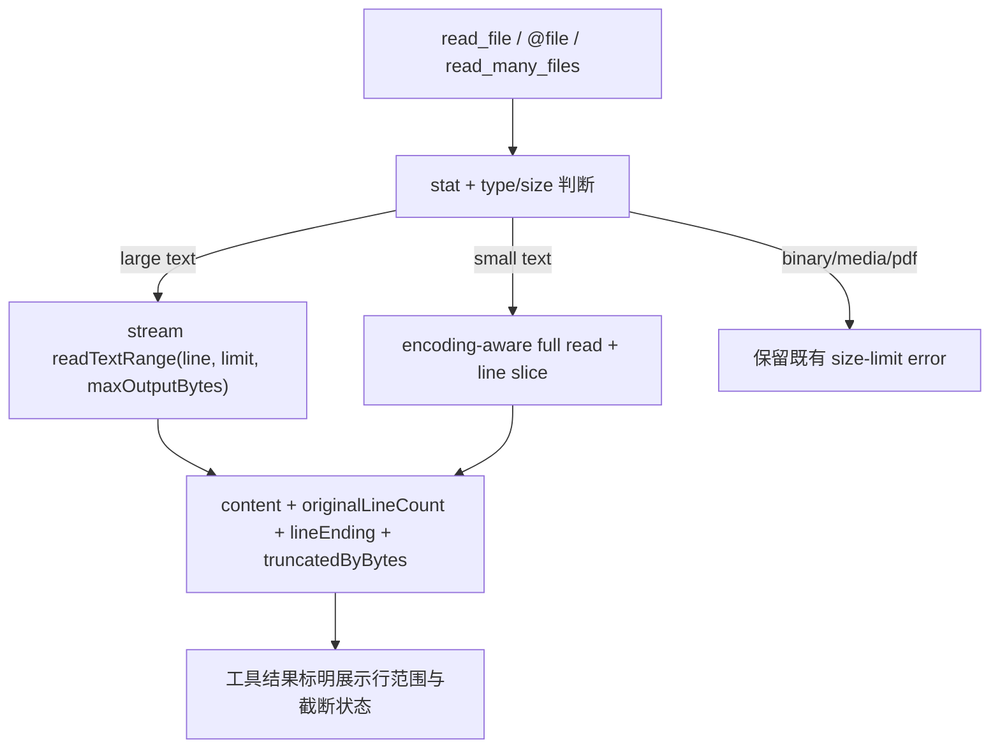

# 文件读取与大文本范围技术方案

> 适用代码库：`QwenLM/qwen-code`。
> 当前记录：#6404 open 方案，尚不能视为 `main` 已落地能力。

---

## 1. 背景与动机

qwen-code 的 `read_file`、`@file` 和多文件读取路径长期用大小上限保护内存与输出预算。这个策略对二进制、图片、音频、视频、PDF 等非文本文件是必要的，但对大文本日志过于粗暴：一个 15MB CI log 往往只需要头部、尾部或指定行段，硬性 `FILE_TOO_LARGE` 会让模型完全无法分析问题。

#6404 的目标是在不放开媒体/二进制大小保护的前提下，让纯文本大文件返回有界行范围，并把取消信号、截断 metadata 和 ACP 边界语义贯通。

---

## 2. 整体设计

读取链路分成两类：

1. **小文本完整读取**：继续使用 encoding-aware 路径，保留 BOM、encoding、line ending 与原有 line/limit 行为。
2. **大文本范围读取**：对超过旧 10MB guard 的文本文件走 streaming range，按 0-based `line`、`limit` 和 `maxOutputBytes` 返回有界内容，同时计算 total line count 与 truncation metadata。

非文本和媒体文件仍走既有 size guard；大文件能力只对可识别文本生效。

---

## 3. 子系统详解

### 3.1 core text range reader

`packages/core/src/utils/readTextRange.ts` 是新的范围读取核心。它接收 path、line、limit、maxOutputBytes 和 signal，在大文本路径中流式扫描文件，避免把整文件内容一次性读进内存。返回值保留 content、line count、line ending、encoding/BOM 和 byte truncation 状态。

### 3.2 FileSystemService request shape

`CoreReadTextFileRequest` 把 core 内部行号保持为 0-based，并增加 `maxOutputBytes` 与 `AbortSignal`。`StandardFileSystemService.readTextFile()` 调用 `readFileWithLineAndLimit()`，把 `truncatedByBytes`、encoding、lineEnding 等 metadata 放入 `_meta`。

### 3.3 ACP boundary conversion

ACP 协议边界仍使用 1-based `line`。`AcpFileSystemService` 在发远端 `readTextFile` 前显式把 core 0-based line 转成 1-based，只透传 ACP 支持的字段；fallback 到本地 filesystem service 时保留 `maxOutputBytes` 和 `signal` 这些 core-only 字段。

### 3.4 tool and attachment paths

`read_file` 改为接收 `AbortSignal` 并传入读取链路。`read_many_files`、`pathReader` 和 CLI `@file` 处理也接入相同的 range metadata。默认大文本输出会标明 `Showing lines X-Y of N total lines`，并在 byte limit 命中时追加 `... [truncated]`。

---

## 4. 设计边界

- **open 方案记录**：#6404 尚未合入，本文只记录当前 diff 方案。
- **媒体/二进制保护不变**：图片、音频、视频、PDF 和 binary 文件仍使用既有大小限制。
- **大文本仍可能扫描到 EOF**：为了给出准确 total line count，streaming path 可能继续扫描文件尾；它避免 OOM，但不保证超大日志即时完成。
- **ACP 远端兼容**：core-only 字段不直接发给 ACP 远端，line number 在边界处转换。

---

## 5. 验证方式

- `packages/core/src/utils/readTextRange.test.ts`: 大文本范围读取、byte truncation、line count、取消信号。
- `packages/core/src/utils/fileUtils.test.ts`: `readFileWithLineAndLimit()` 与多字节文本截断。
- `packages/core/src/services/fileSystemService.test.ts`: `maxOutputBytes` 和 metadata 传递。
- `packages/core/src/tools/read-file.test.ts`: 大文本默认读取不再硬报 `FILE_TOO_LARGE`，并覆盖 abort。
- `packages/core/src/utils/readManyFiles.test.ts`、`pathReader.test.ts`: 多文件/路径读取链路。
- `packages/cli/src/acp-integration/service/filesystem.test.ts`: ACP 边界 0-based/1-based line 转换和 fallback 参数保留。
- `packages/cli/src/ui/hooks/atCommandProcessor.test.ts`: `@file` 大文本附件返回截断内容。

---

## 6. 涉及 PR

| PR | 状态 | 子主题 | 作用 |
|---|---|---|---|
| [#6404](https://github.com/QwenLM/qwen-code/pull/6404) | open | large text range reads | 大文本按有界行范围读取，贯通 core/ACP/read_file/read_many_files/@file，并保留非文本大小保护。 |

---

## 7. 已知限制 / 后续

- 需要在 #6404 合入后按最终 diff 复核本文，尤其是默认输出格式、line range 语义和 ACP 远端兼容边界。
- 当前方案不做 token-aware 输出预算；`maxOutputBytes` 只约束字节输出。
- partial-range `file_unchanged` dedup、Claude-style line-numbered output 和远程 ACP server E2E 仍是后续项。
