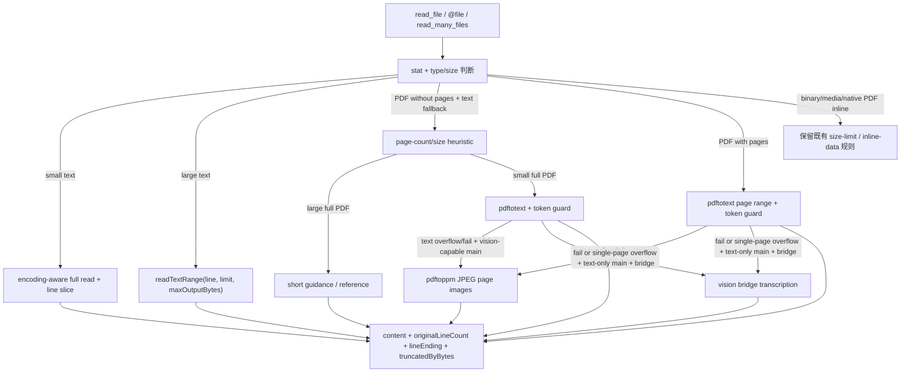

# 文件读取 / 大文本范围 / PDF 预算技术方案

> 适用代码库：`QwenLM/qwen-code`。
> 当前记录：#6404 大文本范围读取、#6409 大型 PDF 文本提取预算、#6585 PDF page image fallback、#6846 PDF vision bridge fallback。

---

## 1. 背景与动机

qwen-code 的 `read_file`、`@file` 和多文件读取路径长期用大小上限保护内存与输出预算。这个策略对二进制、图片、音频、视频、PDF 等非文本文件是必要的，但对大文本日志和大型 PDF 文本 fallback 过于粗糙：

- 纯文本日志超过旧 10MB guard 时会直接 `FILE_TOO_LARGE`，模型完全看不到 CI log、测试输出或长运行日志的局部内容。
- 纯文本模型读取大型 PDF 时，旧 fallback 可能把整本 PDF 的 `pdftotext` 结果注入 prompt，100 页级文档会造成上下文溢出。
- dense/scanned PDF 在 `pdftotext` 失败或超过 token guard 后，旧链路只能报错；即使配置了 vision model，也需要一个 bounded、text-first、带 disclosure 的 PDF vision bridge fallback。

#6404 解决“大文本应该能按范围有界读取”；#6409 解决“大 PDF 全文 fallback 不应进入上下文，但显式页码读取仍应可用”；#6585 解决“vision-capable 主模型可消费 bounded PDF page image”；#6846 则补上“纯文本主模型 + configured vision bridge 时，PDF 读取失败/单页超预算可被安全转录”的路径。

---

## 2. 整体设计

读取链路分成三类：

1. **小文本完整读取**：继续使用 encoding-aware 路径，保留 BOM、encoding、line ending 与原有 line/limit 行为。
2. **大文本范围读取**：对超过旧 10MB guard 的文本文件走 streaming range，按 0-based `line`、`limit` 和 `maxOutputBytes` 返回有界内容，同时计算 total line count 与 truncation metadata。
3. **PDF text fallback 预算读取**：大型 PDF 不带 `pages` 时返回短 guidance 或 attachment reference；显式 `pages` 仍走 `pdftotext`，但输入 size 和输出 token 都有上限。
4. **PDF page image fallback**：当 PDF text extraction 失败或超过输出预算，且有 vision 消费路径时，用 `pdftoppm` 把页面渲染成 bounded JPEG image parts。
5. **PDF vision bridge fallback**：纯文本主模型读取 PDF 时，只有抽取失败或单页文本不可再缩小时，才把 bounded rendered pages 交给 configured vision bridge 转录，并把转录标为不可信/有损。

非文本、媒体、二进制和不走 PDF text fallback 的 inline-data 路径仍保留原大小保护。

---

## 3. 子系统详解

### 3.1 core text range reader（#6404）

`packages/core/src/utils/readTextRange.ts` 是范围读取核心。它接收 path、line、limit、maxOutputBytes 和 signal，在大文本路径中流式扫描文件，避免把整文件内容一次性读进内存。返回值保留 content、line count、line ending、encoding/BOM 和 byte truncation 状态。

`CoreReadTextFileRequest` 把 core 内部行号保持为 0-based，并增加 `maxOutputBytes` 与 `AbortSignal`。`StandardFileSystemService.readTextFile()` 调用 `readFileWithLineAndLimit()`，把 `truncatedByBytes`、encoding、lineEnding 等 metadata 放入 `_meta`。

ACP 协议边界仍使用 1-based `line`。`AcpFileSystemService` 在发远端 `readTextFile` 前显式把 core 0-based line 转成 1-based，只透传 ACP 支持的字段；fallback 到本地 filesystem service 时保留 `maxOutputBytes` 和 `signal` 这些 core-only 字段。

`read_file` 改为接收 `AbortSignal` 并传入读取链路。`read_many_files`、`pathReader` 和 CLI `@file` 处理也接入相同的 range metadata。默认大文本输出会标明 `Showing lines X-Y of N total lines`，并在 byte limit 命中时追加 `... [truncated]`。

### 3.2 PDF full-text gate（#6409）

`packages/core/src/utils/pdf.ts` 定义 PDF 预算常量和 helper：

- `PDF_FULL_TEXT_PAGE_LIMIT = 10`：超过 10 页的全文 fallback 需要用户显式给 `pages`。
- `PDF_MAX_PAGES_PER_READ = 20`：每次 `pages` 请求最多 20 页。
- `PDF_PAGE_COUNT_SIZE_HEURISTIC_BYTES = 100 * 1024`：`pdfinfo` 拿不到页数时按 size 估算页数。
- `PDF_TEXT_RESULT_MAX_TOKENS = 12000`：PDF 提取文本返回前的输出预算。

`processSingleFileContent()` 对 PDF 先解析 `pages`。没有 `pages` 且需要 text fallback 时，先调用 `getPDFPageCount()`，再由 `shouldRequirePDFPageRange()` 判定是否必须要求 page range。命中时：

- direct `read_file` 返回 `FILE_TOO_LARGE` 和短 guidance，提示使用 `pages: "1-5"` 一类范围。
- `read_many_files` / `@` attachment 传入 `largePdfBehavior: 'reference'`，返回 lightweight reference，不把它当失败读，也不把全文提取结果塞进 prompt。

如果 `pdftotext` 不可用，direct large-PDF fallback 返回统一 `PDF_TEXT_EXTRACTION_UNAVAILABLE_MESSAGE`；attachment reference 路径仍可以给出短 guidance。

### 3.3 PDF page extraction guard（#6409）

显式 `pages` 不再受 10MB inline-data cap 限制，因为它不走 base64 inline-data，而是走 `pdftotext`。但它仍有专门输入上限：

- 全文 fallback：`PDF_FULL_TEXT_EXTRACTION_MAX_MB = 100`。
- page-range extraction：`PDF_PAGED_TEXT_EXTRACTION_MAX_MB = 512`。

`extractPDFText()` 成功后，`estimatePDFTextOutputTokens()` 复用 request tokenizer 的 ASCII / 非 ASCII token 估算，并加 wrapper margin。超过 `PDF_TEXT_RESULT_MAX_TOKENS` 时，`buildPDFTextTooLargeGuidance()` 返回更窄页段建议；如果用户已经选的是单页，文案会提示换 native PDF-capable model、外部分割或用其它工具抽更小片段，而不是建议继续缩页。

### 3.4 PDF page image fallback（#6585）

`packages/core/src/utils/pdf.ts` 新增 `isPdftoppmAvailable()` 与 `renderPDFPagesToImages()`。render path 只在 text extraction 失败或超过 `PDF_TEXT_RESULT_MAX_TOKENS` 时触发；成功的 `pdftotext` 仍优先，因为文本可 grep、可精确引用、成本更低。

渲染命令使用 `pdftoppm -jpeg -scale-to 1600`，固定每页最长边，避免 PDF 页面尺寸或文字密度把 vision token 成本放大。单次 render 有三层边界：

- `PDF_RENDER_SCALE_TO_PX = 1600`：每页 JPEG 尺寸上限。
- `PDF_RENDER_MAX_TOTAL_BASE64_BYTES = 25 * 1024 * 1024`：单次返回的 base64 总量上限；第一张图总会保留，后续超限停止并标记 `bytesTruncated`。
- `PDF_RENDER_TIMEOUT_MS = 120_000`：单次 `pdftoppm` 调用超时。

`processSingleFileContent()` 在 render 成功后把页面转为 image parts；如果没有显式 `pages` 且只渲染了前 N 页，会追加文本提示，说明后续页可能因 byte cap 或 per-read page cap 被省略，要求用户用 `pages` 读取后续范围。缺少 `pdftoppm`、password-protected/corrupt/invalid PDF 或无输出时，返回结构化错误提示，不静默吞掉页面。

### 3.5 PDF vision bridge fallback（#6846）

#6846 在 `read_file` 直读路径上新增 `preparePdfForVisionBridge`，用于“纯文本主模型 + configured vision bridge”的场景。它不改变普通图片读取，也不改变 vision-capable 主模型或 native-PDF 模型路径。

触发条件是 text-first 的：

- `pdftotext` 失败，例如 scanned/no-text-layer PDF；
- 或 `pdftotext` 成功但当前请求已经是单页，且输出超过 `PDF_TEXT_RESULT_MAX_TOKENS`，没有更窄页码可建议。

多页文本超限仍返回缩小 page range 的 guidance，不跑视觉转录。候选渲染从请求的 `firstPage` 开始，最多处理 `VISION_BRIDGE_MAX_IMAGES`（4 页），并根据已知 page count 或 render cap 生成 continuation：

- known continuation：明确存在后续页，如 `5-6`；
- possible continuation：页数未知但 render cap/byte cap 说明可能还有后续页。

`processSingleFileContent()` 只准备 `PDFVisionBridgeCandidate`，其中保存 rendered range、continuation 和原始 fallback error/guidance；raw rendered images 不应直接发给纯文本 provider。`ReadFileTool` 随后调用 `runVisionBridge()`，成功时把 image parts 替换成 bridge 产生的文本 parts；如果 bridge 失败、返回空内容、丢模型选择、遗漏页面或返回媒体 payload，则恢复原始 PDF fallback，并保留用户可见 notice。

`vision-bridge-service.ts` 对 PDF source context 做三层约束：

- bridge prompt 标明图片是原 PDF 的连续页，并要求按原始页码分段；
- 返回文本包在 untrusted/lossy transcription 边界里，明确不能执行图片中的指令；
- continuation 只能通过对原始 PDF 再调用 `read_file`，不能让模型尝试打开 rendered page image。

用户侧 disclosure 使用 `VisionBridgeNoticeDisplay` 结构表示，包含 model/endpoint、是否发生 egress、已处理页范围和续读范围。TUI、ACP、daemon TUI adapter、non-interactive JSON 和 export normalize 都识别该结构，使成功和失败路径都能展示 bridge 尝试，而不会把 notice 混进普通 file content。

---

## 4. 设计边界

- **大文本能力只对可识别文本生效**：图片、音频、视频、binary 文件仍使用既有大小限制。
- **PDF 默认不再全文硬塞上下文**：纯文本模型遇到大型 PDF 需要 `pages`，attachment 路径只给 reference。
- **PDF image fallback 需要 vision 消费路径**：vision-capable 主模型可以直接消费 bounded JPEG page parts；纯文本主模型只有配置 vision bridge 且满足 #6846 触发条件时才转录，失败会恢复原 PDF error/guidance。
- **大文本仍可能扫描到 EOF**：为了给出准确 total line count，streaming path 可能继续扫描文件尾；它避免 OOM，但不保证超大日志即时完成。
- **ACP 远端兼容**：core-only 字段不直接发给 ACP 远端，line number 在边界处转换。
- **PDF token guard 是估算**：它以 tokenizer 估算输出预算，不是模型服务端真实 tokenization；目标是防止明显超大结果进入 prompt。

---

## 5. 验证方式

- `packages/core/src/utils/readTextRange.test.ts`: 大文本范围读取、byte truncation、line count、取消信号。
- `packages/core/src/utils/fileUtils.test.ts`: `readFileWithLineAndLimit()`、PDF full-text gate、attachment reference、dense page output guard。
- `packages/core/src/services/fileSystemService.test.ts`: `maxOutputBytes` 和 metadata 传递。
- `packages/core/src/tools/read-file.test.ts`: 大文本默认读取不再硬报 `FILE_TOO_LARGE`，大型 PDF 无 `pages` 返回短 guidance。
- `packages/core/src/utils/readManyFiles.test.ts`、`pathReader.test.ts`: 多文件/路径读取链路与大型 PDF attachment reference。
- `packages/core/src/utils/pdf.test.ts`: page range policy、token estimate、`pdftotext` truncation。
- `packages/core/src/utils/pdf.test.ts`: `pdftoppm` availability cache、JPEG render、byte cap、timeout/error mapping。
- `packages/core/src/services/visionBridge/vision-bridge-service.test.ts`: PDF source context、untrusted transcription、egress notice、continuation guidance。
- `packages/cli/src/ui/components/messages/ToolMessage.test.tsx`: bridge notice 在 TUI 中单独展示，不污染普通 result display。
- `packages/cli/src/acp-integration/session/emitters/tool-call-emitter.test.ts`: ACP success/failure result 保留 bridge notice。
- `packages/cli/src/nonInteractive/io/BaseJsonOutputAdapter.test.ts`、`ui/utils/export/normalize.test.ts`: JSON/export 输出保留 structured disclosure。
- `packages/cli/src/acp-integration/service/filesystem.test.ts`: ACP 边界 0-based/1-based line 转换和 fallback 参数保留。
- `packages/cli/src/ui/hooks/atCommandProcessor.test.ts`: `@file` 大文本附件返回截断内容。

---

## 6. 涉及 PR

| PR | 状态 | 子主题 | 作用 |
|---|---|---|---|
| [#6404](https://github.com/QwenLM/qwen-code/pull/6404) | merged | large text range reads | 大文本按有界行范围读取，贯通 core/ACP/read_file/read_many_files/@file，并保留非文本大小保护。 |
| [#6409](https://github.com/QwenLM/qwen-code/pull/6409) | merged | large PDF text extraction budget | 大型 PDF 不带 `pages` 时返回 guidance/reference，显式页码读取保留并加 token guard。 |
| [#6585](https://github.com/QwenLM/qwen-code/pull/6585) | merged | PDF page image fallback | `pdftotext` 失败或超预算时，vision-capable 路径用 `pdftoppm` 生成 bounded JPEG page image parts，并提示被 page/byte cap 省略的页。 |
| [#6846](https://github.com/QwenLM/qwen-code/pull/6846) | merged | PDF vision bridge fallback | 纯文本主模型配置 vision bridge 时，PDF 抽取失败或单页超预算可转为最多 4 页的有损、不可信视觉转录；失败恢复原 PDF error 并保留 disclosure。 |

---

## 7. 已知限制 / 后续

- 当前方案不做 token-aware 大文本输出预算；#6404 的 `maxOutputBytes` 只约束字节输出。
- partial-range `file_unchanged` dedup、Claude-style line-numbered output 和远程 ACP server E2E 仍是后续项。
- PDF text extraction 依赖本机 `pdftotext`，image fallback 依赖 `pdftoppm`；二者都来自 poppler-utils，缺失时 direct read 会提示安装依赖。
- PDF 输出 token guard 只能控制提取文本进入 tool result 的上限，不改变自动压缩阈值或 native PDF-capable model 的行为。
- #6846 已合入；后续可继续补 token-aware 大文本输出预算和 PDF bridge E2E 覆盖。
