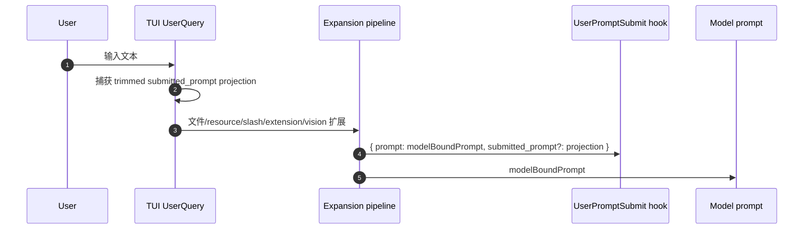

# Hooks / submitted prompt provenance 技术方案

> 适用范围：`UserPromptSubmit` hook 的 submitted prompt provenance。
> 关键 PR：[#7762](https://github.com/QwenLM/qwen-code/pull/7762)。
> 说明：本文只按 @doudouOUC 个人 PR 记录当前已合入能力；字段是 optional additive surface，旧 hook consumer 不应假定它总存在。

---

## 1. 背景与动机

`UserPromptSubmit` hook 原有 `prompt` 字段表示最终送入模型的 model-bound prompt。这个字符串可能已经被 reminder、file/resource expansion、slash command、extension、vision 和其它系统上下文扩展过，因此适合描述模型输入，但不适合回答“用户刚才实际提交了什么”。

#7762 的目标是在不改变模型输入、不改变 hook 顺序、不破坏现有 hook consumer 的前提下，为安全审计、日志和同进程 hook 增加一个用户提交文本的 provenance 线索。

---

## 2. 整体架构

新增字段是 `UserPromptSubmit.submitted_prompt?: string`。它与既有 `prompt` 并存：

- `prompt`: 仍是 hook 过去看到的 model-bound prompt，保持兼容。
- `submitted_prompt`: 只在 producer 能证明这是 fresh user submission 的文本投影时提供；不能证明时省略，而不是猜测。

---

## 3. 子系统详解

### 3.1 hook schema 与兼容性

`submitted_prompt` 是可选字段。hook runner、配置 schema、日志与文档都按 additive field 处理：旧 consumer 继续读取 `prompt`，新 consumer 可以检测 `submitted_prompt` 是否存在。strict-schema consumer 的迁移方式是忽略未知字段或升级 schema，而不是要求 qwen-code 永远填充该字段。

### 3.2 生产者边界

TUI 只在 fresh `UserQuery` 上生成 `submitted_prompt`，并在 prompt expansion 之前捕获 trimmed text projection。large paste 不展开完整内容，使用 compact placeholder projection，避免把本来已经压缩展示的大段输入完整复制给 hook。

以下路径会省略字段：ambiguous batches、edited restorations、same-turn steering、recursive continuations、retries、machine traffic、unsupported producers、`--prompt-interactive` startup、Vim NORMAL direct submissions、image-only。共同原则是：只要不能证明这是用户刚提交的文本，就不制造 provenance。

### 3.3 恢复、延迟 turn 与取消

deferred turn 与 exact in-memory restoration 通过 sidecar 传递 provenance，因此可以继续给 hook 提供原始提交投影。edited restoration 语义不同，字段会被省略。

取消恢复路径保留 main-turn ownership，同时允许并发 `/btw` side question。coupled history guard 只在最新 persisted user entry 仍属于被取消 main turn 时移除该 entry，避免清理取消主 turn 时误删 side question 或后续输入。

### 3.4 安全与隐私边界

`submitted_prompt` 是同进程 trusted function-hook 的输入字段，不是跨权限边界的安全证明。它不替代 `prompt`，不改变模型上下文，也不自动净化用户文本。hook author 仍要把它当作用户可控文本处理，并遵守原有 hook 数据处理约束。

---

## 4. 关键代码路径

| 路径 | 作用 |
|---|---|
| `packages/core/src/hooks/` | `UserPromptSubmit` payload schema、hook runner 与测试。 |
| `packages/core/src/config/config.ts` | hook 配置/schema 装配。 |
| `packages/core/src/core/client.ts` | prompt lifecycle 与 submitted prompt 传递边界。 |
| `packages/cli/src/ui/` | fresh `UserQuery`、restore/deferred、large paste 与 cancellation ownership。 |
| `integration-tests/interactive/submitted-prompt-provenance.test.ts` | 真实交互 hook E2E，验证 expansion boundary 与 ToolResult 省略。 |
| `docs/users/features/hooks.md` | 用户可见 hook 字段文档。 |
| `docs/design/submitted-prompt-provenance.md` | 字段语义、兼容性与省略条件设计。 |

---

## 5. 验证方式

#7762 覆盖 Core 测试、CLI 测试、build、bundle、typecheck、lint，以及真实 interactive command-hook E2E。E2E 的关键断言是：hook 能看到提交原文投影，但 `prompt` 仍保持扩展后的模型输入；ToolResult 与其它非 fresh user submission 不能误填 `submitted_prompt`。

---

## 6. 涉及 PR

| PR | 状态 | 子主题 | 作用 |
|---|---|---|---|
| [#7762](https://github.com/QwenLM/qwen-code/pull/7762) | MERGED | submitted prompt provenance | 给 `UserPromptSubmit` 增加 optional `submitted_prompt`，TUI fresh `UserQuery` 捕获扩展前文本投影，恢复/取消路径保留可证明 provenance，不能证明的 producer 省略字段。 |

---

## 7. 已知限制 / 后续

1. **字段不保证存在**。`submitted_prompt` 是 provenance 线索，不是所有 hook payload 的必填字段；consumer 必须继续兼容缺失。
2. **image-only 与 machine-generated turn 不提供原文投影**。这些路径没有同样明确的 fresh text submission，当前选择省略而不是猜测。
3. **large paste 是 compact projection**。hook 看到的是占位式投影，不是完整大段粘贴内容；这是为了与现有大粘贴处理和数据最小化保持一致。

_按个人 PR 口径更新于 2026-07-27_
