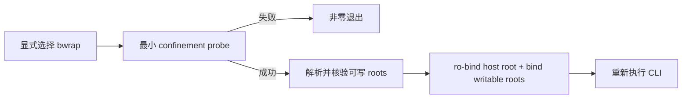

# Linux bwrap 内核沙箱技术方案

> 适用代码库：`QwenLM/qwen-code`。
> 当前记录：#11614 open；以下按2026-09-14 head `8f1b2b107a64`描述方案，尚未进入upstream `main`。

## 1. 背景与目标

Linux现有sandbox路径依赖Docker/Podman；在rootless CI、共享构建机或最小系统上，容器runtime本身可能不可用。#11614拟增加显式`bwrap` backend，以内核mount namespace把宿主文件系统变为只读，同时保留agent完成任务所需的最小写路径，并让用户能检查和验证真实边界。

方案必须同时满足三点：显式请求不可静默fail open；Git worktree位于workspace外的元数据仍可写；对外准确说明网络、PID和Unix socket并未被文件系统边界自动隔离。

## 2. 选择与探测

`packages/cli/src/config/sandboxConfig.ts`把backend分成container和in-place两类。Docker/Podman仍要求image；`bwrap`不依赖image。选择后不是只检查PATH，而是有5秒上限地执行最小只读root约束，验证当前内核、user namespace与LSM策略确实允许运行。显式backend探测失败会抛出fatal error，不回落为unconfined。

## 3. 文件系统授权

`resolveBwrapWritableRoots()`创建并规范化Qwen配置/运行目录，组合真实cwd、系统temp、cache、显式include目录、npm/git配置和Git元数据。`normalizeWritableRoots()`拒绝HOME及其祖先，丢弃不存在路径并合并已被父root覆盖的子路径，防止一个宽授权吞掉只读边界。

Git来源验证不信任ambient `GIT_DIR`等selector，而使用清理后的`gitEnv()`探测真实top-level、absolute git dir与common dir。普通checkout要求`.git`就是对应真实目录；linked worktree要求common仓库中存在同名registration，且worktree git dir里的普通文件`gitdir`反向指向当前`.git`文件。独立Git目录和未登记submodule不会自动得到外部写权限，只能由用户显式include。

workspace `.env`与`settings.env`不能设置sandbox backend/image/网络/代理控制或`XDG_CACHE_HOME`、`TMPDIR/TMP/TEMP`。operator继承环境与用户级`.env`仍是可信输入，但在可写Qwen目录之上把该文件重新只读bind。这防止不可信仓库或受限子进程让host选择backend、执行proxy命令，或把HOME敏感目录伪装成cache/temp后扩大可写bind；reload也不会中途改写project-env拒绝集合。仓库可控include目录展开`~`后若落在HOME内部会被拒绝，非法`QWEN_SANDBOX_NET`直接报错而不会退回open。

## 4. 运行边界

`buildBwrapArgs()`使用`--ro-bind / /`、`--dev /dev`、`--die-with-parent`，再逐个bind可写root并切换到target cwd。closed网络增加`--unshare-net`；open与proxied保留host network，proxied只注入代理环境并不阻止direct connection。

方案刻意不创建PID namespace，因为Qwen跨进程owner记录保存host PID，namespace局部PID会让外部liveness判断命中无关host进程。`/tmp`也不替换为tmpfs，以保留X11/Wayland和ssh-agent socket。因此`SANDBOX_ENFORCEMENT=full`只表示filesystem mount enforcement；host Unix socket、可写Git hooks/config及Qwen settings仍可能影响边界外行为。

## 5. 可诊断性

`qwen sandbox`报告backend、enforcement、network mode、target与可写root。`--verify`运行四项负载：workspace内`mktemp`成功、root外写返回EROFS、host进程可见、network namespace符合配置；probe固定C locale，网络检查要求命令成功、stdout含loopback后才判定，避免最小镜像缺命令或stderr文本造成假阳性。safe mode仍按完整settings选择backend，但不采用settings-derived额外root；`-- <command>`关闭数字参数自动转换，在同一argv构造下继承stdio并透传退出码。Core prompt同时区分宿主只读根和最小`/dev`设备树，并让模型把拒绝路径交还用户在host侧检查。verify不能证明Git写入或host socket隔离，worktree commit仍需单独测试。

Core prompt只在`SANDBOX=bwrap`时说明EROFS边界，要求模型报告拒绝路径，不得改写其它位置、提权或重复尝试。普通EACCES仍可能来自文件权限，不能被误判为sandbox拒绝。

## 6. 验证与状态

open PR包含CLI、root推导、环境来源拒绝、argv、环境、prompt和verify battery测试。PR记录较早head在Ubuntu Lima验证两种网络模式、worktree commit和越界写拒绝，较早macOS head完成定向构建与测试；最新review follow-up未重跑Linux。2026-09-14当前GitHub的Lint、Ubuntu测试、Serve A/B和Java real-daemon E2E均失败，review仍在进行且最近正式结论为changes requested；Linux最新head、Windows、真实Electron、Landlock和seccomp未完成最终验证。

完整PR级观察见 [[qwen-code/weekly-report/2026-09-07_2026-09-13/implementations/pr-11614|PR #11614 当前实现观察]]。

## 7. 未完成边界

- #11614未合入，不能把`bwrap`、`qwen sandbox`或默认行为变化写成当前产品能力。
- Landlock fallback、seccomp、按命令约束与一次性提权、默认启用均是后续阶段。
- Seatbelt既有Git目录与proxy传递缺口不由本方案修复。
- filesystem-only约束不是完整的进程、凭据、网络或宿主服务隔离。
