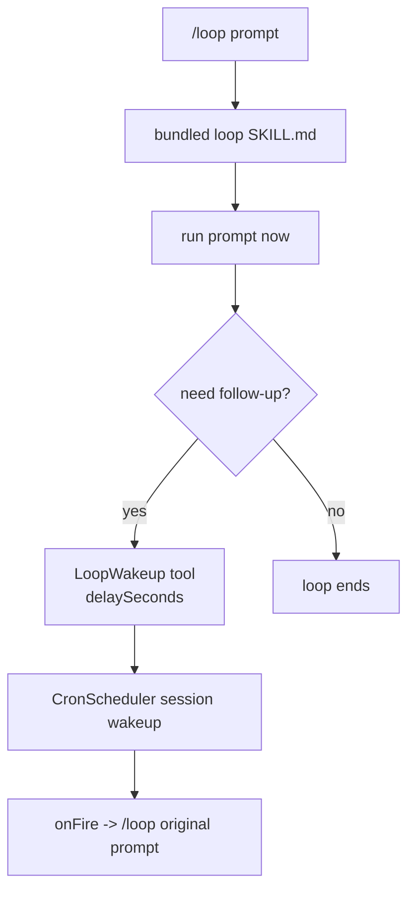

# Loop wakeup 技术方案

> 适用范围：`QwenLM/qwen-code` bundled loop skill、cron scheduler、`loop_wakeup` tool。
> 涉及 PR：#5182（second-resolution session wakeup engine）、#5197（prompt-only `/loop` self-paced wakeups）、#5808（cancel self-paced wakeup on user abort）、#5844（monitor/background-task notification guidance）、#5921（scheduled task count footer）、#5927（cron tool search intents）。

---

## 1. 背景与动机

早期 `/loop <prompt>` 默认创建固定 10 分钟 recurring cron。这个模型不理解任务状态：没有变化时仍按钟触发，变化很快时又可能等太久。#5182/#5197 把 prompt-only `/loop` 改成 self-paced loop：先立即执行 prompt，再由模型在 turn 结束前决定是否调用 `LoopWakeup` 安排下一次检查。

新的三分支契约：

| 用法 | 行为 |
|---|---|
| `/loop check deploy` | prompt-only self-paced：立即运行，必要时调用 `LoopWakeup(delaySeconds, prompt, reason)` 只安排一次未来 wakeup。 |
| `/loop 5m check deploy` | fixed interval recurring：仍走 `CronCreate(recurring:true)`。 |
| `/loop list` / `/loop clear` | 列出或取消 cron jobs 与 pending wakeups。 |

#5921/#5927 补的是“用户如何看见和管理这些安排”：CLI footer 会在 cron scheduling 开启且 scheduler 里有 pending entries 时显示 `◎ 1 scheduled task` / `◎ N scheduled tasks`；工具搜索也会把“stop/cancel/remove/clear cron/loop wakeup”导向 `cron_delete`，把可见性查询导向 `cron_list`，把新建排程导向 `loop_wakeup`。

---

## 2. 整体架构

关键点：

- `loop_wakeup` 是 loop skill allowed tool。
- prompt-only 路径不调用 `CronCreate`，只允许最多一个 future wakeup。
- wakeup 使用 second precision，而非分钟级 cron。
- session-level 24h budget 从第一次 wakeup 开始计时；fire 或 cancel 不重置，session stop/destroy 才重置。
- 用户中断正在执行的 self-paced tick 时，会清掉该 tick 已安排的 pending one-shot wakeup。

---

## 3. 关键实现

### 3.1 second-resolution wakeup engine（#5182）

Cron scheduler 增加 session wakeup 能力，支持秒级 delay、clamp、fire/cancel/list，并复用现有 `onFire` delivery。它不是全局 recurring cron，而是 session 内 pending wakeup，适合“下一次检查”这种一次性延迟。

### 3.2 prompt-only self-paced contract（#5197）

bundled loop skill 明确要求：

- 立即处理用户 prompt。
- 只有继续跟进有价值时才调用 `LoopWakeup`。
- `prompt` 必须保持 `/loop ${original}`，下一轮仍回到同一 skill contract。
- 省略 `LoopWakeup` 即代表循环结束。

这样模型可以在状态变化快时快速 re-arm，在无变化时拉长间隔，完成后停止。

### 3.3 24h session budget

与 Claude Code 的无硬限制 wakeup chain 不同，qwen-code 加了 session-level 24 小时预算。预算从第一次 wakeup 开始，连续 re-arm 不能通过 cancel/fire 刷新预算，避免 self-hosted/headless 场景无限自动运行。

### 3.4 用户 abort 与 pending wakeup 清理（#5808）

#5808 修复 self-paced `/loop` 的一个交互语义缺口：当前 tick 还在执行时，模型可能已经调用过 `LoopWakeup` 安排下一次检查；用户随后按 Esc / abort 本轮，如果 pending wakeup 不被清理，几秒或几分钟后 loop 会再次自动触发，看起来像“用户明明停了，循环又复活”。

修复后的规则：

- 只针对 self-paced prompt-only loop 的 one-shot wakeup；fixed interval recurring cron 不受影响。
- abort 当前 in-flight tick 时，scheduler 会取消该 tick 关联的 pending wakeup，并在 UI 中提示 `Stopped the self-paced loop: cancelled N pending wakeup(s).`。
- cancellation telemetry 记录被取消的 wakeup 数量，方便区分“只中断当前 turn”和“同时清理了下一轮计划”。
- 如果 loop 当前并不在执行、只是 idle pending wakeup，用户仍应使用 `/loop clear` 清理；#5808 不改变这个管理入口。

### 3.5 monitor/background-task 通知优先（#5844）

#5844 补的是 self-paced loop 的模型侧契约：当 `/loop` 本轮启动了 monitor 或长时间 background task 时，下一次检查不应只靠短周期 polling。新的引导要求模型：

- 为自己启动并监控的后台工作安排一个较长的 fallback heartbeat，建议 1200-1800 秒。
- 主要依赖终态 `<task-notification>` 唤醒，而不是频繁轮询。
- 被 notification 唤醒时先处理事件内容，再决定是否重新 schedule fallback。
- 只把 loop 自己启动的工作纳入这条通知路径，避免无关后台任务误唤醒当前 loop。

这让 `/loop` 可以覆盖“等 CI / 等部署 / 等后台命令结束”这类长等待场景：后台任务完成时尽快唤醒，任务迟迟没有终态时才由长 heartbeat 兜底。实现边界也很清楚：monitor wake 只来自 terminal notification；它不把所有 monitor 事件都变成 loop trigger，也不替代 `/loop list` / `/loop clear` 的管理入口。

### 3.6 scheduled task visibility and tool discovery（#5921/#5927）

#5921 增加的是轻量可见性，不是完整任务管理 UI：当 cron scheduling enabled 且 in-memory scheduler 有 pending entries 时，footer 轮询 scheduler 并显示 scheduled task count。它只显示数量，不列任务、不提供 stop 按钮；singular/plural 文案固定，避免 hidden `/loop` cron task 完全不可见。

#5927 修的是模型/用户通过 tool search 找管理工具时的意图识别。搜索 tokenization 去掉 filler words，并增加 action alias：

| 意图 | 优先暴露 |
|---|---|
| stop/cancel/remove/clear cron/loop/wakeup | `cron_delete` |
| list/show/what scheduled/cron/loop | `cron_list` |
| schedule/wake me/later/check again | `loop_wakeup` |

这不改变 `cron_*` 或 `loop_wakeup` 工具 schema，只改善发现路径，尤其是 issue #5823 里 hidden cron/loop tasks 难以停止的问题。

---

## 4. 涉及 PR

| PR | 状态 | 作用 |
|---|---|---|
| #5182 | merged | 新增 second-resolution session wakeup engine。 |
| #5197 | merged | `/loop <prompt>` 改为 prompt-only self-paced wakeup，并更新 bundled loop skill contract、权限与测试。 |
| #5808 | merged | 用户 abort self-paced tick 时取消关联 pending one-shot wakeup，避免停止后 loop 自动复活。 |
| #5844 | merged | self-paced loop 对 monitor/background-task terminal notification 做模型引导：长 fallback heartbeat + 通知优先处理。 |
| #5921 | merged | CLI footer 显示 pending scheduled task count，让隐藏的 cron/loop wakeup 不再完全不可见。 |
| #5927 | merged | tool_search ranking/tokenization 增加 cron/loop 管理意图，停/删/list/schedule 分别命中对应工具。 |

---

## 5. 已知限制 / 后续

1. **只覆盖 prompt-only `/loop`**。任务文件注入、autonomous bare `/loop`、monitor-as-primary signal 属后续步骤。
2. **模型必须遵守 skill contract**。self-paced 停止依赖模型不再调用 `LoopWakeup`；系统侧用 24h session budget 做硬兜底。
3. **wakeup 是 session 级**。session stop/destroy 会重置预算并取消 pending wakeups，跨 session 的长期计划仍应使用 cron。
4. **idle pending wakeup 仍需显式管理**。#5808 只处理用户 abort in-flight tick 的场景；未执行中的 pending wakeup 仍通过 `/loop list` / `/loop clear` 管理。
5. **notification 只覆盖 loop 自己启动并监控的后台工作**。#5844 不把任意 monitor 事件广播给所有 loop；模型仍需要在通知到达后判断是否继续 schedule。
6. **footer count 不是管理面**。#5921 只显示 pending count；列出、停止、清理仍依赖 `/loop list`/`/loop clear` 或 cron tools。

_新增于 2026-06-23；更新于 2026-06-26_
