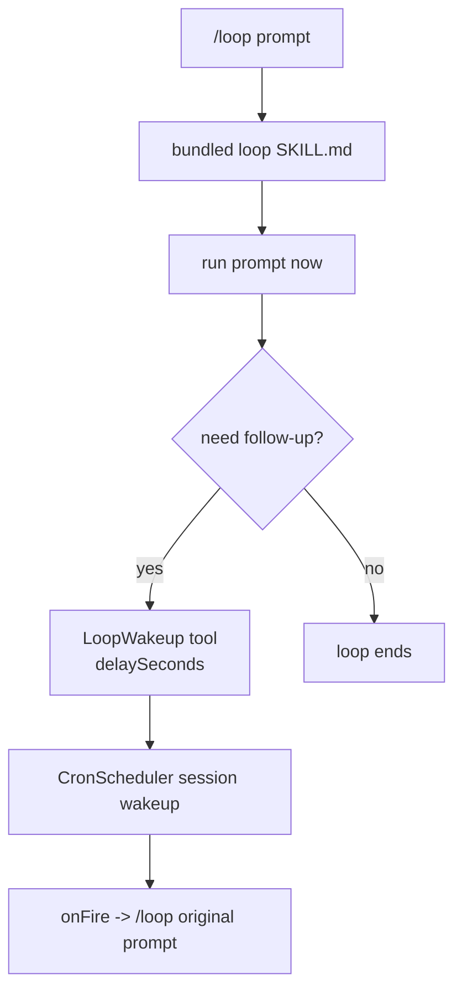

# Loop wakeup 技术方案

> 适用范围：`QwenLM/qwen-code` bundled loop skill、cron scheduler、`loop_wakeup` tool。
> 涉及 PR：#5182（second-resolution session wakeup engine）、#5197（prompt-only `/loop` self-paced wakeups）。

---

## 1. 背景与动机

早期 `/loop <prompt>` 默认创建固定 10 分钟 recurring cron。这个模型不理解任务状态：没有变化时仍按钟触发，变化很快时又可能等太久。#5182/#5197 把 prompt-only `/loop` 改成 self-paced loop：先立即执行 prompt，再由模型在 turn 结束前决定是否调用 `LoopWakeup` 安排下一次检查。

新的三分支契约：

| 用法 | 行为 |
|---|---|
| `/loop check deploy` | prompt-only self-paced：立即运行，必要时调用 `LoopWakeup(delaySeconds, prompt, reason)` 只安排一次未来 wakeup。 |
| `/loop 5m check deploy` | fixed interval recurring：仍走 `CronCreate(recurring:true)`。 |
| `/loop list` / `/loop clear` | 列出或取消 cron jobs 与 pending wakeups。 |

---

## 2. 整体架构

关键点：

- `loop_wakeup` 是 loop skill allowed tool。
- prompt-only 路径不调用 `CronCreate`，只允许最多一个 future wakeup。
- wakeup 使用 second precision，而非分钟级 cron。
- session-level 24h budget 从第一次 wakeup 开始计时；fire 或 cancel 不重置，session stop/destroy 才重置。

---

## 3. 关键实现

### 3.1 second-resolution wakeup engine（#5182）

Cron scheduler 增加 session wakeup 能力，支持秒级 delay、clamp、fire/cancel/list，并复用现有 `onFire` delivery。它不是全局 recurring cron，而是 session 内 pending wakeup，适合“下一次检查”这种一次性延迟。

### 3.2 prompt-only self-paced contract（#5197）

bundled loop skill 明确要求：

- 立即处理用户 prompt。
- 只有继续跟进有价值时才调用 `LoopWakeup`。
- `prompt` 必须保持 `/loop ${original}`，下一轮仍回到同一 skill contract。
- 省略 `LoopWakeup` 即代表循环结束。

这样模型可以在状态变化快时快速 re-arm，在无变化时拉长间隔，完成后停止。

### 3.3 24h session budget

与 Claude Code 的无硬限制 wakeup chain 不同，qwen-code 加了 session-level 24 小时预算。预算从第一次 wakeup 开始，连续 re-arm 不能通过 cancel/fire 刷新预算，避免 self-hosted/headless 场景无限自动运行。

---

## 4. 涉及 PR

| PR | 状态 | 作用 |
|---|---|---|
| #5182 | merged | 新增 second-resolution session wakeup engine。 |
| #5197 | merged | `/loop <prompt>` 改为 prompt-only self-paced wakeup，并更新 bundled loop skill contract、权限与测试。 |

---

## 5. 已知限制 / 后续

1. **只覆盖 prompt-only `/loop`**。任务文件注入、autonomous bare `/loop`、monitor-as-primary signal 属后续步骤。
2. **模型必须遵守 skill contract**。self-paced 停止依赖模型不再调用 `LoopWakeup`；系统侧用 24h session budget 做硬兜底。
3. **wakeup 是 session 级**。session stop/destroy 会重置预算并取消 pending wakeups，跨 session 的长期计划仍应使用 cron。

_新增于 2026-06-23_
