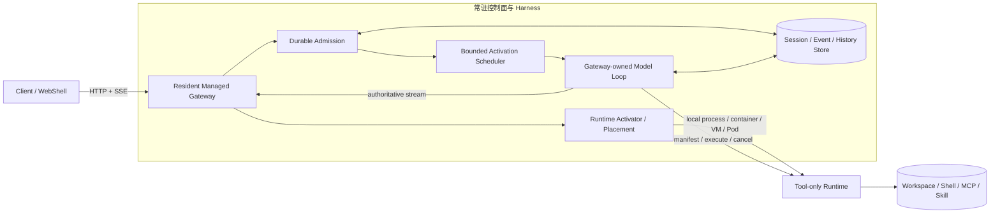
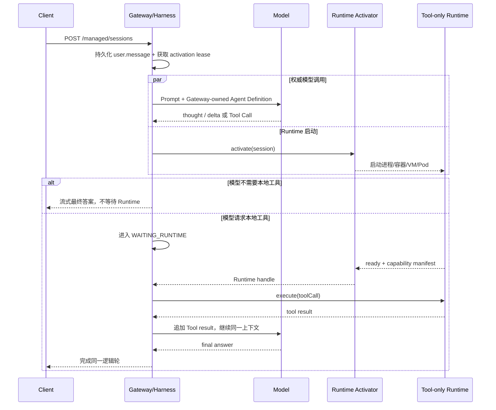

# Qwen Code Managed Agents 方案

> 状态：P0～P8、Managed 会话展示与控制、P9a 本地 Runtime 自动激活实验实现已推送到 [doudouOUC/qwen-code 的 feature/managed-agents-p0-p8 分支](https://github.com/doudouOUC/qwen-code/tree/feature/managed-agents-p0-p8)，当前代码锚点为 [942af888cd](https://github.com/doudouOUC/qwen-code/commit/942af888cd6b26dad9dfb5aa86ffc760857084cb)。尚未进入 [QwenLM/qwen-code](https://github.com/QwenLM/qwen-code) `main`；P9a 通过显式开关启用，macOS 已完成下述有限验收，Windows/Linux 未实测。生产调度、Kubernetes 接入与完整安全隔离仍是后续工作。
> 更新日期：2026-09-09。

> 当前产品目标：让 Managed Agent 替换 daemon 默认执行实现，兼容普通 Web Shell、SDK、Channels、定时任务及旧会话。[默认替换方案](managed-agent-daemon-default.md)记录完整范围；[Runtime invocation v2](managed-agent-runtime-invocations.md)与[子任务及持久文件历史](managed-agent-child-scopes.md)已接通完整 Agent、独立子作用域和持久父快照。
>
> 此前完成 [Glob 与可选 LS](managed-agent-search-tools.md)：父子各自的目录、ignore、记忆根和 LS opt-in 进入 owned Runtime，Gateway 复用共享声明及原权限调度。四组真实搜索验收与既有 prior-read 子任务回归通过，共 31 次本地模型请求；53 项产物摘要、9 个生产源码摘要及 bundle 一致，测试进程、端口和临时根已清理。完整 build/bundle/typecheck、变更 lint/格式与两轮人工自审及独立审查通过；本阶段去重 17 文件 322 项定向测试通过（非全仓套件）。权限夹具初次失败与一次 HTTP 状态码异常均保留在验证记录，未通过修改产品绕过。
>
> 本次完成 [Grep 原生后端迁移](managed-agent-grep-tools.md)：Gateway 使用公共声明，Runtime 按绑定配置执行原生 rg/git grep/grep，等待所属进程组退出后结算取消与释放。517 项定向测试、16 组隔离验收和两轮人工自审通过，57 个不同构建文件摘要与当前产物一致；独立审查 Agent 因额度不可用，本次采用手工复审，不记为独立审查通过。后端损坏回退、权限差异、worktree 隔离、输出限制、部分读取后写入均有实际证据。
>
> 普通默认入口尚未切换，4170 预览未访问或重启。后续迁移 NotebookEdit/多媒体、MCP/Skills/Hooks、后台进程/Git、物理历史及可信工作区初始化；有效 CLI 配置与同会话热更新、并发长 Shell、8 MiB 以上历史、external-v1 子任务及完整客户端兼容仍待完成。搜索局部验收与此前冷加载备份验收都不代表全部默认替换或旧会话迁移完成。

## 分阶段设计文档

| 阶段 | 文档                                                                                 | 主题                                                   |
| ---- | ------------------------------------------------------------------------------------ | ------------------------------------------------------ |
| P0   | [Managed Agent Runtime P0](managed-agent-runtime-p0.md)                              | Harness/Runtime 边界、同轮 Tool 等待与部署中立资源模型 |
| P1   | [Managed Agent Activation P1](managed-agent-activation-p1.md)                        | durable activation journal、lease fencing 与有界调度   |
| P2   | [Managed Agent Prompt Admission P2](managed-agent-prompt-admission-p2.md)            | 完整用户消息持久化、幂等准入与恢复                     |
| P3   | [Managed Agent Live Prompt P3](managed-agent-live-prompt-p3.md)                      | 首个实验 Managed Prompt 接入 live daemon               |
| P4   | [Managed Agent Gateway Bootstrap P4](managed-agent-gateway-bootstrap-p4.md)          | 非权威 bootstrap 与 Runtime 并行启动的过渡方案         |
| P5   | [Managed Agent Multi-Turn Continuity P5](managed-agent-multi-turn-p5.md)             | 多轮绑定、顺序所有权与 Runtime resume                  |
| P6   | [Managed Agent Tool-only Runtime P6](managed-agent-tool-runtime-p6.md)               | Gateway 模型所有权与 Tool-only ACP Runtime             |
| P7   | [Managed Agent Eager Authoritative Turn P7](managed-agent-eager-authoritative-p7.md) | 权威模型立即开始，只在 Tool 边界等待 Runtime           |
| P8   | [Managed Agent Remote Runtime P8](managed-agent-remote-runtime-p8.md)                | Gateway/Runtime 双进程和私有 HTTP v1                   |
| P8 后续 | [Managed Agent Session Surfaces](managed-agent-session-surfaces.md) | Gateway 会话目录、持久展示历史、独立状态、恢复流与 Web Shell 控制 |
| P9a | [本地 Runtime 自动激活](managed-agent-local-runtime-activation-p9a.md) | 已实现实验功能：自动启动、工作区复用、lease 校验、取消与可等待回收 |
| D1～D5 | [daemon 默认执行替换](managed-agent-daemon-default.md) | 实施中：完整 host、工作区快照与可等待的通道清理已落地；其余工具边界、普通入口和默认切换待完成 |
| D1～D5 工具边界 | [Runtime invocation v2](managed-agent-runtime-invocations.md) | 阶段 2：Read/Write/Edit/Shell 及 Glob/可选 LS/Grep、owned v2 绑定与子作用域已接通；其余工具及初始化继续实施 |
| D1～D5 子任务与历史 | [子任务与持久文件历史](managed-agent-child-scopes.md) | 五组限定验收通过：独立子执行、父快照归属、默认记忆真实写入及新 Runtime 冷加载备份 |
| D1～D5 搜索工具 | [Glob 与可选 LS](managed-agent-search-tools.md) | 真实父子 worker 搜索、独立目录与 ignore、记忆及外路径权限，四组加 prior-read 回归通过 |
| D1～D5 搜索后端 | [Grep 与进程生命周期](managed-agent-grep-tools.md) | 16 组限定验收通过：原生搜索、作用域/权限、取消与释放、版本超时和系统回退；Windows 等边界待完成 |

## 1. 结论

推荐把现在“模型循环和本地执行环境一起启动”的 daemon 拆成两个生命周期：

- **常驻、逻辑多租户的 Managed Gateway/Harness**：接入请求、维护会话、调用模型、流式返回、持久化历史，并在后台请求 Runtime；
- **按需、租户和会话隔离的 Tool-only Runtime**：提供工作区文件、Shell、MCP、Skill 等依赖本地环境的能力，不持有模型会话，也不生成最终答案。

首轮 Prompt 到达时，即使 Runtime Pod 还不存在，Gateway 也立即开始唯一且权威的模型调用。只有当模型真正发出本地 Tool Call 时，同一轮执行才等待 Runtime 就绪；工具结果返回后，由 Gateway 继续同一个模型上下文。

因此这不是“前置模型先回答，第二、三轮再把会话迁到 Pod”，而是：

```text
模型会话始终在 Gateway
本地工具执行在 Runtime 就绪后接入
```

这个边界同时解决首轮 TTFT、双模型回答不一致和模型上下文迁移问题。它与 Anthropic 公开的 [Managed Agents](https://www.anthropic.com/engineering/managed-agents) 方向一致：把 Agent Harness 与隔离执行环境分层；本文则进一步给出适配 Qwen Code daemon 的会话、租约和 Tool-only 协议设计。

## 2. 问题与目标

当前若完整 daemon 运行在按需 Pod 内，请求关键路径通常是：

```text
请求 -> 调度 Pod -> 拉镜像/挂载 -> Pod Ready -> daemon 启动
     -> Provider/MCP/Skill 初始化 -> 模型调用 -> 首个有效输出
```

Pod 和 daemon 冷启动会直接叠加到 TTFT。简单增加一个前置 Web 服务，如果它仍需等待后端 daemon 才调用模型，只是提前返回了 ACK，并没有缩短“首个有效模型输出”。

目标路径应改为：

```text
请求 -> 常驻 Gateway 立即调用模型 ---------------------> 流式输出
              `-> 并行申请 Runtime -> Pod/进程 Ready -> 本地 Tool
                                                   `-> 模型继续
```

设计目标：

1. Runtime 未启动时也能接收首个 Prompt 并开始权威模型推理；
2. 无本地工具的请求完全不等待 Runtime；
3. 需要工具时只在 Tool Call 边界等待，并在同一逻辑轮内继续；
4. 多轮会话的模型历史不随 Pod 生命周期丢失；
5. Gateway 可多租户共享，Runtime 保持租户、会话和工作区隔离；
6. 调度抽象不依赖 Kubernetes，也可落到进程、容器或 VM。

## 3. 总体架构



### 3.1 组件职责

| 组件              | 生命周期     | 主要职责                                          | 明确不负责                 |
| ----------------- | ------------ | ------------------------------------------------- | -------------------------- |
| Managed Gateway   | 常驻         | 鉴权、租户/会话身份、HTTP/SSE、幂等请求、最终响应 | 工作区内执行               |
| Harness Worker    | 常驻、可替换 | 组装上下文、执行模型循环、推进会话状态            | 永久绑定某个会话           |
| Session Store     | 持久化       | 用户消息、模型历史、状态、事件、租约和恢复        | 模型或工具执行             |
| Runtime Activator | 可插拔       | 选择、创建、等待、释放 Runtime                    | Agent 协议与模型循环       |
| Tool-only Runtime | 按需或池化   | 工作区、Shell、MCP、Skill、工具执行               | Prompt、模型凭据、最终答案 |

### 3.2 Gateway 与 Harness 的关系

Gateway 是对客户端暴露 HTTP/SSE 的 Web 服务。Harness 是推进 Agent 状态机和模型循环的逻辑执行层；第一阶段可以与 Gateway 位于同一个 Node.js 进程，后续再按故障隔离和容量需要拆成 Worker 进程。

“Harness 实例池”不是“一会话一个进程”，也不是“一会话一个 Pod”。建议的资源模型是：

```text
常驻服务实例（进程 / 容器 / Pod）
  -> 少量 Harness Worker 进程
       -> 每个进程承载有上限的异步 activation slots
            -> 每个 slot 临时推进一个 Session
```

一个 Session 没有永久线程或进程归属。模型流式请求和远程工具等待使用异步 I/O；只有 CPU 密集任务才进入共享、受限的线程池。这样不会因会话数放大进程基础内存，也不会把架构绑定到 Kubernetes。

Kubernetes 部署通常可采用“一 Pod 一 Worker 进程”，但这是部署映射，不是协议语义。非 Kubernetes 环境可由 systemd、supervisor、本地父进程或容器平台启动同一个 Worker。

### 3.3 多租户边界

推荐“一个逻辑多租户服务 + 常驻无状态 Harness 实例池”，但“无状态”仅表示 Worker 可替换、不是会话的唯一持久化所有者，不表示进程内部完全没有临时缓存，也不表示实例池可以缩容到零。

每个请求和持久化对象都必须绑定：

```text
tenantId + userId + sessionId + workspaceId
```

每次推进会话还需持有带单调 epoch 的 `SessionActivationLease`；每个 Runtime 绑定需持有独立的 `RuntimeLease`。旧 Worker 或旧 Runtime 的迟到结果必须因 epoch 过期而被拒绝。

为了 TTFT，Harness 必须保留 warm capacity floor。容量满时进入有界、公平队列，而不是退化为无限排队：

- 全局与单租户队列上限；
- 每租户并发和公平调度；
- activation slot 与内存水位双重准入；
- 队列等待超限返回明确的可重试过载；
- 扩容只是性能优化，不是正确性前提。

## 4. 首轮和多轮流程

### 4.1 首轮：Runtime 未启动



关键点：首轮不需要“临时回答再切换”。Gateway 的第一次模型调用就是权威调用。模型可在 Runtime 启动期间做意图理解、任务规划和纯模型回答；若它很快就发出 Tool Call，只在该边界等待。

### 4.2 第二、三轮

首轮启动的 Runtime 通常已经就绪，后续 Prompt 复用同一个受租约保护的 Runtime。Gateway 继续持有完整模型历史，Runtime 仅保存工作区执行态和受控的 Tool 会话：

```text
follow-up Prompt
  -> Gateway 从 durable history 继续模型轮
  -> Runtime 已就绪：立即执行本地 Tool
  -> Runtime 已回收/重启：重新 activate 或 resume，再继续同一轮
```

所以“第二、三轮切到 Pod”更准确的说法是“第二、三轮通常已经能直接使用 Pod 内的工具”，而不是把模型会话迁移到 Pod。

### 4.3 会话恢复与幂等

- 客户端每个 Prompt 提供稳定的 `Idempotency-Key`；
- 完整用户输入先持久化，再进入 activation queue，再返回成功；
- 同一个 key 和相同 payload 返回已有结果，不重复执行；
- 同一个 key 和不同 payload 失败关闭；
- 一次只允许一个未完成的 Prompt 推进同一 Session；
- Worker 重启后用更高 lease epoch 恢复，旧执行结果不能提交；
- Tool 已分发但结果不确定时默认不自动重试，直到具备副作用账本。

## 5. Agent Definition 与 Tool-only Runtime

模型要在 Runtime Ready 前开始，Gateway 必须预先知道可展示给模型的工具定义。推荐把它作为版本化、不可变的 `AgentDefinition`：

```text
AgentDefinition
  = model + instructions + tool schemas + skills + policy + definitionDigest
```

P8 实验采用 Gateway 内置的只读 `Read`、`Search`、`Fetch` 工具定义。模型发出 Tool Call 后，Gateway 再读取 Runtime manifest 并逐项校验：

1. Runtime capability digest 与 manifest 绑定；
2. Tool 同时存在于 Agent Definition 和 Runtime manifest；
3. 名称和规范化后的输入 schema 一致；
4. Runtime 仍将其分类为只读；
5. execute 请求固定当前 capability digest。

任何身份、schema、版本或 digest 漂移都在分发 Tool 前失败关闭。Runtime 动态发现的 MCP 和 workspace Skill 不能临时加入已经开始的首轮模型请求；生产方案需要控制面预发布或缓存版本化能力目录。

### 5.1 Runtime 私有协议

当前 P8 进程边界原型使用 Bearer 认证的私有 HTTP v1：

```text
POST /internal/managed-runtime/v1/prepare
POST /internal/managed-runtime/v1/manifest
POST /internal/managed-runtime/v1/execute
POST /internal/managed-runtime/v1/cancel
POST /internal/managed-runtime/v1/release
```

请求包含协议版本、租户、工作区、Session、Turn、Tool Call、执行 ID 与 capability digest。协议中禁止出现：

- 原始用户 Prompt；
- 模型历史和最终回答；
- Provider 配置和模型凭据；
- Runtime 内部 ACP client id。

网络拒绝、连接重置、HTTP 429/503 可作为“尚未就绪”进行有上限、可取消的 prepare 重试。认证失败、其他 4xx、畸形响应和协议版本错误为永久失败。Tool execute 一旦分发不自动重试。

### 5.2 公共 Managed API

当前实验 API：

| 路由 | 归属与行为 |
| --- | --- |
| `GET /managed/sessions?cwd=&limit=&cursor=` | Gateway 持久会话目录，按调用者和可选工作区筛选；创建时间倒序、稳定游标分页。 |
| `POST /managed/sessions` | 在已注册且可信的工作区幂等准入首轮；显式未知 `cwd` 返回 400，不回退到主工作区。 |
| `POST /managed/sessions/:id/prompts` | 在会话绑定工作区顺序准入续轮，不重新绑定 Runtime 会话。 |
| `GET /managed/sessions/:id` | Gateway 摘要、当前 Prompt、轮次和 Runtime 独立状态、`canSend` / `canCancel`。 |
| `GET /managed/sessions/:id/transcript?before=&limit=` | Gateway 展示日志的时间正序窗口，返回 `olderCursor` 和 `lastEventId`。 |
| `GET /managed/sessions/:id/events` | 经过鉴权的 SSE，以 `Last-Event-ID` 恢复观察；断流不取消执行。 |
| `POST /managed/sessions/:id/cancel` | 用 `{promptId}` 请求取消明确的一轮，返回 `{accepted}`；不能误取消之后的新轮。 |

目录和 transcript 的 `limit` 范围为 1～100，默认 50。目录的 `nextCursor` 用于继续翻页；transcript 的 `before` 不包含指定事件，用 `olderCursor` 加载更早历史。读接口只读取 Gateway 绑定和日志，不 attach、restore、prepare 或创建 Runtime；已移除或不可信工作区的历史仍可读，写操作按绑定工作区失败关闭。

创建和续轮请求使用 `Idempotency-Key`，当前本地原型还使用 `X-Qwen-Managed-Client-Id` 做调用者关联。生产实现必须从已认证请求上下文派生 tenant/user 身份，不能相信请求 body 或普通 header 自报身份。

事件流至少区分：

```text
accepted
agent_started
assistant_thought
assistant_delta
tool_requested
runtime_starting
runtime_ready | runtime_failed
tool_started
tool_completed
cancelling
completed | failed | cancelled
```

Runtime readiness 与 Prompt outcome 是两个独立状态轴：`phase` 区分准入、模型运行、等待 Runtime、工具运行、取消中和终态；`runtimeState` 独立区分 `unknown`、`starting`、`ready`、`failed`。无 Tool 的轮次可以先完成，之后 Runtime 启动失败也不能把已完成答案改成失败；Gateway 重启后 Runtime readiness 回到未知，等待新的准备确认。

`tool_requested` 只表示模型请求工具，Runtime 未就绪时显示等待；完成 manifest 校验并即将 execute 时才发出 `tool_started`。取消先持久化请求，再中断模型或工具；`accepted: true` 不等于已经终止，已提交的完成结果在竞争中仍保持完成。客户端根据后续状态确认取消结果。

### 5.3 会话展示、恢复与 Web Shell

展示对象始终是 **Gateway Session**。Runtime 缺席、更换或回收不会新增或删除展示任务；普通会话目录继续隐藏 `managed-gateway` 内部 Runtime Session。已有 Agent View roster 管理 supervisor 的后台任务，不能作为 Gateway Managed 会话的权威目录。

Gateway 在独立 `presentation.jsonl` 追加用户消息、助手文本、可展示的思考摘要、有界工具信息和生命周期事件。每个事件包含稳定 `sessionId`、`promptId` 和会话内单调递增的事件 ID，落盘后才向客户端发布。Inbox 仍负责准入和 Prompt 结果，模型 conversation store 仍负责后续模型上下文；展示日志不参与执行。

客户端先取 transcript 与同一快照的 `lastEventId`，再订阅之后的事件；重复事件按 ID 去重，`stream_gap` 触发重取快照，不重新提交 Prompt。目录/会话切换会中止读取与 SSE，并阻止迟到数据更新当前页面。创建或续轮响应不确定时保留原 payload 和 `Idempotency-Key` 重试，避免产生第二次执行。

Web Shell 根据 `managed_sessions` capability 显示独立 Managed Agents 入口，提供目录、历史、新建、续轮和取消；取消还要求 `managed_session_cancel`，操作按钮遵循服务端 `canSend` / `canCancel`。复用现有消息渲染，单独显示 Runtime 状态，支持中文文案；不挂载普通会话的模型切换、fork、archive 等不支持操作。URL `?managed=1&managedSession=<id>` 恢复 Managed 选择，不调用普通 Session load/restore。

浏览器按 daemon URL 保存稳定 Managed client ID。清理该浏览器存储会改变目录关联，不会删除服务器历史。当前 bearer operator 与 client ID 只构成实验调用者关联，不是生产多租户身份系统。

升级前的 P8 数据可从 inbox 恢复用户准入和结果，但不会从单独的模型 conversation store 补造旧助手/工具展示历史。新增日志支持重启恢复；状态目录按监听地址和端口区分，重启需保持相同配置。响应页和实时缓存有界，磁盘日志的保留期限、压缩和索引仍待实现。

2026-09-08 展示修复：Managed 消息列表的父容器补齐 flex 高度约束，避免长对话的思考、工具进度和回答被裁切；输入框上方新增固定位置的提交/加载/运行状态和耗时，执行结束后自动移除。已用真实浏览器验证列表滚动与回答末尾可见，26 项定向测试及 build/bundle 通过。详情见 [会话展示方案](managed-agent-session-surfaces.md#live-progress-visibility)。

已将进度展示回归固化为两条 `@smoke` 浏览器用例，覆盖长列表滚动跟尾、思考/工具/回答进入视口，以及已有成功轮次的会话取消结算后继续发送。使用真实 Web Shell 与 SDK SSE 解析、本地 HTTP/事件夹具；两条 Managed 用例加两条普通会话用例各连续运行三次，共 12 项通过。恢复旧布局的反向验证准确失败，确认测试能捕获裁切问题；现有 CI 会自动纳入 smoke 用例。此次未扩展 P9b，也不将 mock 浏览器测试计作真实 Gateway/Runtime 验收。

## 6. Runtime Activator：不绑定 Kubernetes

P8 的远程 Provider 使用固定 Runtime URL。[P9a 实现与验收](managed-agent-local-runtime-activation-p9a.md) 已在 Gateway 内增加 `ManagedRuntimeActivator` 和本地子进程 adapter，按需自动创建 worker；现有 Remote Provider 继续负责 Tool-only HTTP。自动创建 Pod 尚未实现。

P9a 把三种结束操作分清：一次 Prompt 的 Runtime use 释放、一个工具 Session 的 release、整个 worker 的回收。Activator 同步返回 use，异步提供 endpoint；同一租户/工作区共享 worker，每次 use 独立释放；workspace revoke 和 Gateway close 等待 owned 进程树退出。`leaseId + epoch` 与 Gateway incarnation 绑定，旧回调不能作用于 replacement。此本地所有权契约不等同于生产分布式 TTL lease。

现有 HTTP v1 body 严格校验字段，因此 P9a 为自动管理的 worker 使用 boot 绑定和内部 lease headers，不向 v1 body 添加不兼容字段；固定 URL 模式保持原契约。详细接口、容量与关闭语义以 P9a 文档为准。

Activator 实现进度与后续顺序：

1. **LocalProcessRuntimeActivator（P9a 已实现）**：父进程启动、复用和回收 Tool-only Runtime；实际验证及平台限制见 P9a 第 15 节；
2. **StaticPoolActivator**：从预热 Runtime 池分配，验证容量和租约复用；
3. **KubernetesActivator**：把同一接口映射为 Pod 创建、Service/地址发现、readiness 与回收；
4. 后续再加入 placement、镜像缓存、快照或预测预热，不修改 Agent 协议。

不同环境只替换 Activator：

| 环境                 | Runtime 载体                              |
| -------------------- | ----------------------------------------- |
| 本地开发             | 子进程或本地容器                          |
| VM / 裸机            | supervisor 管理的进程或容器               |
| Kubernetes           | 每个隔离 Runtime 一个 Pod，或受控池化 Pod |
| Serverless container | 独立 task/container                       |

## 7. 语言选择

首版建议继续使用 TypeScript/Node.js：

- Qwen Code 的模型、工具 schema、daemon、ACP bridge 和会话语义已经在 TypeScript；
- 最小改动即可复用现有 Provider、SSE、鉴权、工具验证与测试；
- Harness 的主负载是模型流和远程 Tool 等待，异步 I/O 比一会话一线程更合适；
- 多租户是否安全由隔离、配额、租约和持久化边界决定，不由语言自动保证。

Rust 适合未来独立的高吞吐 Gateway、placement service 或 sandbox supervisor，尤其当需要更强内存可控性、长尾延迟和单二进制部署时。但现在直接用 Rust 重写 Harness 会同时重建 Qwen Code 的模型循环、工具 schema、事件与恢复语义，验证成本大于收益。

建议先用 TypeScript 验证协议和真实负载；只有监控证明 Node.js 的 RSS、GC 或 event-loop lag 成为瓶颈，再将稳定协议后的局部控制面替换为 Rust。

## 8. 数据依据

### 8.1 DataAgent 前三轮方向性样本

2026-09-01 对此前 24 小时的只读 SLS 小样本按环境和 `interaction.sequence` 各取最多 30 条最新 interaction trace，不读取 Prompt 内容。把 shell、文件、搜索、Skill 和 workspace-aware agent tool 视为本地 Runtime 能力：

| 环境 | 轮次 | traces / users | 无本地 Tool | 首个本地 Tool p50 / p95 | 高频调用                      |
| ---- | ---: | -------------: | ----------: | ----------------------: | ----------------------------- |
| 内部 |    1 |         30 / 5 |       30.0% |            9.8s / 33.2s | shell 251, skill 29, read 19  |
| 内部 |    2 |         16 / 2 |       12.5% |           11.5s / 38.5s | shell 93, read 8, skill 6     |
| 内部 |    3 |         11 / 1 |        9.1% |          12.4s / 121.1s | shell 71, skill 8, read 6     |
| 公共 |    1 |        30 / 13 |       93.3% |             3.1s / 4.0s | read 6, skill 2, shell 2      |
| 公共 |    2 |        30 / 23 |       20.0% |           11.1s / 99.9s | shell 202, read 43, skill 14  |
| 公共 |    3 |        30 / 20 |       30.0% |           20.7s / 76.3s | shell 125, read 33, search 12 |

工具使用轮次通常给 Runtime 大约 10 秒的中位预热窗口，支持“模型与 Runtime 并行启动”。但样本很小，内部第二、三轮分别只有 2 和 1 个用户，可能混入自动任务，因此不能当作总体分布。当前样本也没有可靠的 Pod/daemon 启动 p50/p95，这仍是上线前必须补齐的观测缺口。

### 8.2 P8 双进程实测

本地用两个真实 `qwen serve` 进程和 `moonshot/kimi-k3` 验证：Gateway 先启动，Runtime 端口在模型发出 Tool Call 后才启动。

| 相对 accepted 的事件        |      时间 |
| --------------------------- | --------: |
| `runtime_starting`          |     11 ms |
| `agent_started`             |     15 ms |
| 首个模型 thought            |  2,632 ms |
| Runtime 不存在时请求 `glob` |  4,676 ms |
| Runtime Ready               | 15,804 ms |
| `glob` 完成                 | 15,877 ms |
| 请求 `read_file`            | 18,618 ms |
| `read_file` 完成            | 18,649 ms |
| 首个 final-text delta       | 21,005 ms |
| `completed`                 | 21,055 ms |

同一逻辑轮在首个 Tool 边界等待约 11.1 秒，随后跨私有 HTTP 执行 `glob` 和 `read_file`，最终答案精确为 `P8_REMOTE_RUNTIME_BOUNDARY_7C4E19`。Gateway 记录 3 轮模型调用；Runtime 没有模型 usage，且对其 source-bound Session 发普通 Prompt 返回 `404 session_not_found`。

这证明“权威推理不依赖 Runtime Ready”，但本次 Runtime Ready 前产生的是 thought，不是用户可见 final text；是否能在工具前展示有价值的自然语言，仍取决于模型和 Prompt。评估时必须区分 HTTP ACK、thought、首个 final delta 和首个 Tool result，不能把 ACK 当 TTFT。

## 9. P0～P8 及会话展示后续的当前有效口径

| 阶段                                          | 结论                                                        | 当前状态                               |
| --------------------------------------------- | ----------------------------------------------------------- | -------------------------------------- |
| [P0](managed-agent-runtime-p0.md)             | 定义 Harness/Runtime 边界、同轮 Tool 等待与部署中立资源模型 | 早期 in-Core broker 已移除；边界保留   |
| [P1](managed-agent-activation-p1.md)          | 文件日志、activation lease、epoch fencing、slot/内存准入    | 底层实验保留                           |
| [P2](managed-agent-prompt-admission-p2.md)    | 完整 `user.message` 先持久化，再排队和 ACK                  | 底层实验保留                           |
| [P3](managed-agent-live-prompt-p3.md)         | 首个 live Managed Prompt 进入现有 Runtime                   | 历史过渡方案                           |
| [P4](managed-agent-gateway-bootstrap-p4.md)   | 前置非权威 bootstrap 模型与 Runtime 并行                    | 已被 P7 替代                           |
| [P5](managed-agent-multi-turn-p5.md)          | Managed 多轮绑定、幂等、Runtime resume                      | 多轮契约保留，Runtime 模型所有权已替代 |
| [P6](managed-agent-tool-runtime-p6.md)        | Gateway 持有模型和历史，ACP Runtime 只执行工具              | 所有权边界保留                         |
| [P7](managed-agent-eager-authoritative-p7.md) | 第一次权威模型调用与 Runtime 并行，只在 Tool 边界等待       | 当前关键行为                           |
| [P8](managed-agent-remote-runtime-p8.md)      | Gateway 与 Runtime 拆为两个进程，以私有 HTTP v1 连接        | 当前原型边界                           |
| [P8 后续](managed-agent-session-surfaces.md) | Gateway 会话目录、持久展示与恢复、独立状态、取消和 Web Shell | 已实现并验证，独立于 P9 自动激活 |

实验代码的主要锚点：

- `packages/core/src/managed-runtime/managed-session-inbox.ts:FileManagedSessionInbox`
- `packages/core/src/managed-runtime/managed-activation-store.ts:FileManagedActivationStore`
- `packages/core/src/managed-runtime/embedded-harness-scheduler.ts:EmbeddedHarnessScheduler`
- `packages/cli/src/serve/managed-prompt-service.ts:createManagedPromptService`
- `packages/cli/src/serve/managed-gateway-model-runtime.ts:ResidentManagedGatewayModelRunner`
- `packages/cli/src/serve/managed-runtime-provider.ts:LocalManagedRuntimeProvider`
- `packages/cli/src/serve/managed-runtime-provider.ts:RemoteManagedRuntimeProvider`
- `packages/cli/src/serve/routes/managed-runtime-worker.ts:registerManagedRuntimeWorkerRoutes`
- `packages/cli/src/serve/managed-gateway-session-events.ts`：Gateway 展示日志和事件投影
- `packages/sdk-typescript/src/daemon/DaemonClient.ts`：Managed REST 与 SSE 客户端
- `packages/web-shell/client/components/managed/ManagedSessionsPage.tsx`：Web Shell 目录和控制入口

## 10. 当前体验方式

在上述实验分支的仓库根目录构建并生成 bundle；Node.js 要求 22 或更高，Gateway 沿用已有的模型配置。2026-09-08 验证时全局 `qwen` 0.23.0 不包含 Managed 参数，因此下面明确运行本分支产物。

```bash
npm ci
npm run build
npm run bundle
```

将 `/workspace` 换成两个进程都可访问的实际工作区，在两个终端分别启动。下列 token 仅为本地示例，应替换为自己的值：

```bash
# Tool-only Runtime worker
QWEN_SERVER_TOKEN=runtime-secret node dist/cli.js serve --no-web --port 4181 \
  --experimental-managed-runtime-worker --workspace /workspace

# 常驻 Gateway，保留 Web Shell
QWEN_SERVER_TOKEN=gateway-secret \
QWEN_MANAGED_RUNTIME_TOKEN=runtime-secret \
node dist/cli.js serve --port 4170 \
  --experimental-managed-agents \
  --experimental-managed-runtime-url http://127.0.0.1:4181 \
  --workspace /workspace
```

通过 Gateway 输出的 Web Shell 登录入口完成现有 daemon 鉴权，再点击侧栏 Managed Agents，或使用 `http://127.0.0.1:4170/?managed=1`。新建后可刷新恢复、续轮和取消；阅读历史不会启动或接入 Runtime。为了验证延迟 Runtime，可先启动 Gateway、发送需要读取工作区文件的任务，看到等待状态后再启动 Runtime worker。

未设置固定 URL 或 auto-local 开关时，保留 P7 的本地进程内 Provider。固定 URL 模式仍需自行启动 worker，要求 Runtime Bearer token；非 loopback 地址必须使用 HTTPS。P9a 可只启动 Gateway，由它自动创建本地 worker：

```bash
node dist/cli.js serve --port 4170 --workspace /absolute/workspace \
  --experimental-managed-agents --experimental-managed-runtime-auto-local
```

auto-local 与固定 URL、显式 Runtime token、worker 模式互斥；每代 worker 使用独立随机 token，无需手工配置 Runtime 端口。

这只是架构验证，不应直接部署为生产多租户服务。

## 11. 安全和失败语义

必须保持以下不变量：

1. 只有持有当前 activation lease epoch 的 Harness 能推进 Session 和提交最终答案；
2. Runtime 只持有执行租约，永远不成为 Session 所有者；
3. 身份来自 Gateway 鉴权上下文，不来自模型输出或 Runtime payload；
4. Runtime 只接收选中的 Tool Call 和最小权限凭据；
5. 模型凭据、宽泛云凭据和完整 Prompt 不进入 Runtime；
6. Tool schema 在一轮内不可因 Runtime Ready 而改变；
7. Runtime replacement 后的旧结果被 epoch fencing 拒绝；
8. mutating Tool 在没有副作用账本前不做分发后自动重试；
9. 工作区不可信、identity 不一致、capability drift 和协议异常全部失败关闭；
10. 用户断开 SSE 不等于取消已经持久化的工作。

当前 P8 还复用了普通 `qwen serve` 作为 Runtime worker，因此进程可能加载普通 Qwen Code 模块，其监听器也保留非 Managed API。虽然 source-bound Managed Session 已被普通 API 隐藏，生产版仍需独立的、credential-minimal 的 Tool-only 可执行程序或监听器。

## 12. 容量与可观测性

Harness 容量不能只看 Pod 数。建议预算：

```text
worker count * (base RSS + process-local cache budget)
  + active activation slots * p95 activation working set
  + safety headroom
```

核心扩缩容信号：

- available activation slots；
- queue depth 与 oldest queued age；
- event-loop lag；
- RSS/heap pressure；
- Runtime pool hit rate 与 activation latency；
- 每租户并发和等待时间。

端到端至少记录：

```text
prompt admitted
harness queued / assigned
model request started / first thought / first final delta
first tool requested
runtime requested / ready
tool started / completed
authoritative answer completed
```

首要 SLO 应分别观察 model TTFT、Harness 排队、Runtime 等待、首个 Tool result 和总完成时间。把这些指标合成一个“首字节”会掩盖真实瓶颈。

## 13. 已完成验证与限制

以下为原 P8 阶段的历史验证记录，不代表本次全部重跑：

- Core Managed runtime：29 个测试；
- Gateway 模型、会话事件、历史与 Runtime Provider：49 个测试；
- CLI 参数回归：74 个测试；
- server 针对性回归：13 个测试；
- cross-layer 集成：8 个测试；
- ACP bridge 全量：838 个测试；
- Core 与 ACP bridge typecheck 通过；CLI typecheck 被工作树既有 Ink 类型漂移阻塞，未发现 Managed Agents 新增错误。

2026-09-08 会话展示与控制的新增验证（macOS，Node 22.22.3）：

- 全仓 build、CLI bundle 和所有 workspace package typecheck 通过。根 `typecheck` 的 integration 部分仍有 4 个基线错误：1 个 daemon worker callback 隐式类型、3 个 source/dist `ProcessRegistry` 私有类型冲突；用同一依赖对干净 P8 `4df73b9c76` 复现了相同错误。前述历史 CLI Ink 问题不是本次结果。
- Core 持久化针对性测试 22 个、CLI Managed/service/HTTP/orchestration 测试 63 个、SDK Managed/SSE 测试 22 个通过；Web Shell 完整 App 回归及 Managed、独立 URL 测试通过，最终中文文案回归通过；修改源文件的 ESLint 和 diff 检查通过。
- 真实 Gateway + 延迟启动的 Runtime worker、确定性本地模型端点通过创建、幂等重试、鉴权与调用者隔离、未知工作区拒绝、重启恢复、历史分页、SSE 恢复、续轮、准确取消指定 Prompt 和实际文件读取。再次重启保留完成/取消结果，没有重新调用模型。
- 浏览器验证通过新建、刷新恢复、续轮、取消和中文展示。流缺口、网络重试、切换竞态和审批可见性依靠组件/路由测试验证，不作为手工浏览器已测项目。
- 本次未调用外部真实模型 Provider，未验证生产部署、Windows 或 Linux；第 8.2 节的 Kimi 时序是此前 P8 实测，不是本次新增证据。详细验收口径见 [Session Surfaces](managed-agent-session-surfaces.md#validation-on-2026-09-08)。

仍未完成：

- 固定 Runtime URL 之外的自动创建、placement、探活选择和 fenced lease；
- 生产级多租户身份、分布式 Session store，以及 inbox 与模型 conversation store 的原子恢复边界；
- 展示日志的磁盘压缩、保留期限和索引；升级前 P8 的助手/工具展示历史不自动回填；
- Runtime 动态 MCP/Skill 能力发布、权限回传和 progress streaming；
- Shell、写文件和其他 mutating Tool 的权限与 side-effect ledger；
- 生产 Runtime idle 策略、预热池、资源配额和成本模型（P9a 已实现本地最多 4 个 worker 与容量压力下空闲回收）；
- 独立 credential-minimal Runtime 镜像/可执行程序；
- Runtime 启动 p50/p95、真实 workload 命中率和大样本前三轮分布。

## 14. P9a 实现与后续 P9b

[P9a 本地 Runtime 自动激活方案](managed-agent-local-runtime-activation-p9a.md)已实现并同步实际验收。用户只启动 Gateway，首轮权威推理立即开始，工具需要时等待自动创建的 Runtime，续轮复用，退出时等待回收。无工具回答无需等待 Runtime；历史读取不启动 worker。

实现采用同一 Gateway 内按租户/工作区复用 worker，保留独立 Tool Session；使用随机 token、boot scope 与 lease headers 限定 owned worker。私有入口、Activator/AutoLocal Provider、Gateway 生命周期接线与 runtime_released 展示事件均已落地。Tool-only ACP Session 不再依赖模型认证与 LLM 初始化。

macOS 真实 Gateway/worker/ACP 验收通过无工具提前完成、真实文件工具、续轮复用、并发共享与单方取消、worker 崩溃、primary reload、Gateway 重启恢复、正常退出及 SIGKILL 后已知进程树回收。source 与 package dist 入口、bundle 参数冲突、自定义配置/信任路径、独立输出根和凭据哨兵检查通过。build、bundle、workspace package 类型检查和定向回归通过；根 integration 类型检查仍有 4 个已确认的基线错误。

Windows/Linux 尚未实测，secondary/dynamic reload 与撤信任/强制移除完整 HTTP 组合未逐项真实 E2E；不可中断 execute 由 Provider/Activator 测试覆盖。本轮没有重新做浏览器视觉验收。测试覆盖、RSS 阶段快照和其余限制见 P9a 第 15 节。

当前优先推进 D1～D5 的 daemon 默认执行替换；P9b Kubernetes adapter 作为后续独立工作。生产身份、分布式租约、隔离和容量策略需要单独验证，不能把本地 IPC 和进程回收直接当作 Kubernetes 实现。

## 15. 非目标

当前阶段不做：

- 每 Session 一个 Harness 进程、线程或 Pod；
- 在 Runtime 内保留第二个模型循环；
- 把 bootstrap 文本冒充权威答案；
- 为追求 ACK 速度而忽略有效模型 TTFT；
- 在协议尚未稳定前重写 Rust Gateway；
- 自动重试可能产生副作用的 Tool；
- 用 Kubernetes 对象替代 Session、租约和恢复语义。

最终建议是：**保留常驻多租户 Gateway/Harness，把模型和会话留在 Gateway，把本地能力收敛为按需 Tool-only Runtime；P9a 已用 TypeScript 和 LocalProcessRuntimeActivator 打通本地链路，下一步复用现有完整 Agent 能力并对齐普通 daemon 会话协议，再切换新会话默认；P9b Kubernetes 接入另行推进。**
